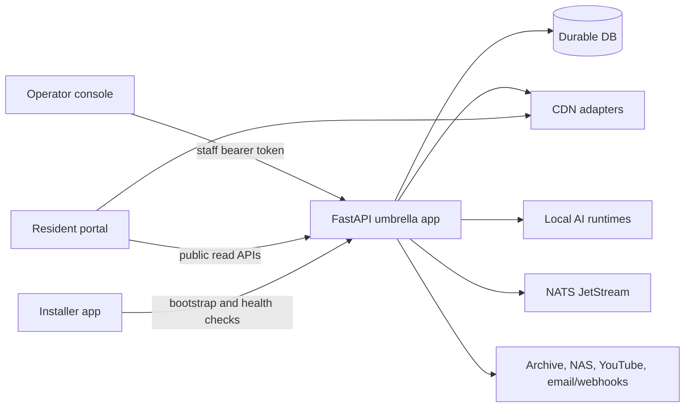
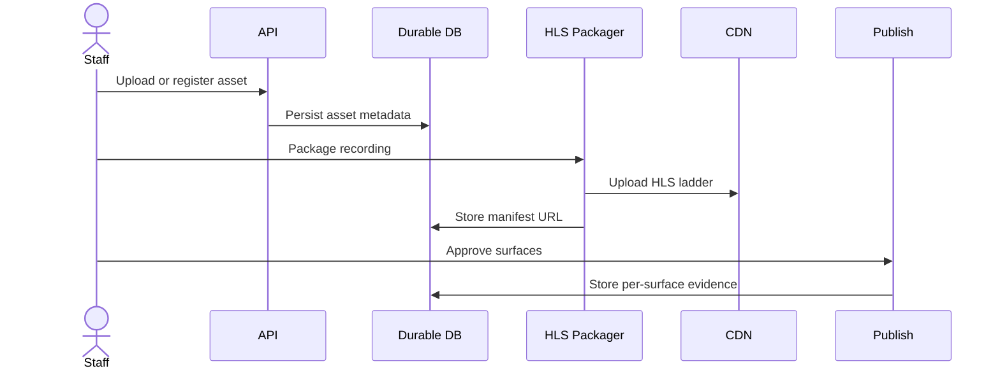
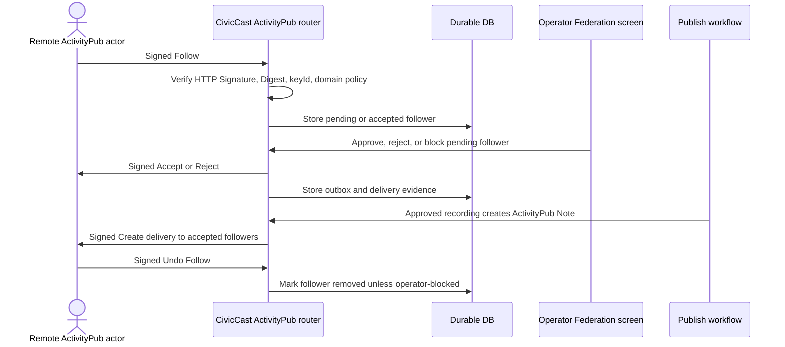

# CivicCast Architecture

> **Release state: `v1.0.0-rc18` is the published controlled beta.** Its
> installer is built from the gate-cleared `main`, Authenticode-signed, and proven
> on a genuinely clean Windows host. rc17 remains the rollback target but carries
> the sixteen findings rc18 fixes. See `docs/releases/v1.0.0-rc18-verification.md`
> for exactly what has and has not been proven.

> **Release state:** `v1.0.0-rc18` is the current release line and the published
> controlled beta. Its signed assets and complete manifest are on GitHub, and its
> exact installer passed a clean-host install, launch, reinstall, uninstall and
> upgrade on a pristine Windows 11 guest. `v1.0.0-rc17` remains the rollback
> target; the full product path on a clean host was last proven against rc17's
> bytes. Proof boundaries are recorded in
> [docs/releases/v1.0.0-rc18-verification.md](docs/releases/v1.0.0-rc18-verification.md).
> `v1.0.0-rc13` is withdrawn after a genuine clean-host bootstrap failure and
> must not be installed — see
> [docs/releases/v1.0.0-rc13-verification.md](docs/releases/v1.0.0-rc13-verification.md).
> The rc17 line carries forward earlier installer and bootstrap repairs from
> rc15 and rc13; that release-lineage detail lives in the verification doc
> above and in
> [docs/releases/0.2.0-switch-validation.md](docs/releases/0.2.0-switch-validation.md)
> and [docs/releases/v0.1.0-rc6-verification.md](docs/releases/v0.1.0-rc6-verification.md)
> (the historical lab-host install proof). Treat all of the above as bounded
> source and lab proof, not as approval of rc13 or broad validation across
> many machines, live external provider delivery, app stores, live hardware,
> downstream cable headends, QAM, SDI/DeckLink, EAS, CEA-708 broadcast
> compliance, or production operations. Local contract-lab work is
> development work and must not be described as public-beta, LPM field, or
> production proof until its own gates pass and station-device evidence is
> attached.

> **Two product lines.** CivicCast ships two parallel Windows product lines
> from this repository: the WSL2 beta this document describes (`main`, the
> current public download) and a native-Windows beta under active parallel
> development (`release/native-beta-1.0.0-beta.1-rc1`, not yet public).
> Neither retires the other. See [BRANCHES.md](BRANCHES.md) for the full
> breakdown, and "Deployment Posture" below for how the native runtime
> differs architecturally.

This document orients engineers and integrators to the current CivicCast
system. The binding product contract is
[docs/spec/3.0/civiccast-3.0-station-in-a-box-MASTER.md](docs/spec/3.0/civiccast-3.0-station-in-a-box-MASTER.md);
the earlier [docs/spec/spec.md](docs/spec/spec.md) is superseded and retained
for historical reference only (its own header says so).

## System Shape

CivicCast is a self-hostable civic broadcast platform. A single FastAPI
umbrella app mounts the public, staff, installer, release, and federation
routers. Three Vite/React frontends cover the operator console, resident portal,
and installer shell. Installer-managed local SQLite is the default durable data
store for operator and beta use; technical deployments can point `DATABASE_URL`
at Postgres. In-memory stores exist for tests and throwaway development only.

## Runtime Entry Points

- `civiccast/app.py` builds the FastAPI app and wires router dependencies.
- `civiccast/cli.py` exposes operator commands such as `doctor`, `token`,
  `installer`, `model`, `cert`, and `cable`.
- `civiccast/apps/portal-operator/` is the staff/operator console.
- `civiccast/apps/portal-public/` is the resident portal and HLS playback UI.
- `civiccast/apps/installer/` is the Tauri-compatible installer shell.
- `alembic/` plus per-module migration directories manage schema changes.

## Major Modules

| Area | Package | Responsibility |
| --- | --- | --- |
| Platform | `civiccast.platform` | Hardware probe, broker contract, store bundle. |
| Auth | `civiccast.auth` | Staff bearer-token middleware and token lifecycle store. |
| Streaming | `civiccast.stream`, `civiccast.vod` | HLS packaging, public embeds, CDN upload. |
| Schedule | `civiccast.schedule` | Assets, premieres, embargoes, operator asset library. |
| Live | `civiccast.live` | Live sessions, fail-closed source verification, and recording finalization. |
| Captions | `civiccast.captions` | Faster-whisper contracts, stabilization, WebVTT output, review queue. |
| Summary | `civiccast.summary` | Sourced summaries, approval, transcript CSV export. |
| Records | `civiccast.records` | PDF/A-3B signed-record export and provenance. |
| Publish | `civiccast.publish` | Portal, Internet Archive, NAS, YouTube, subscriber, and podcast surfaces. |
| Subscribe | `civiccast.subscribe` | Double opt-in, signed unsubscribe, webhook payloads. |
| Podcast | `civiccast.podcast` | Podcast episode and RSS generation. |
| Installer | `civiccast.installer` | First-run plan, fail-closed health checks, handoff summaries. |
| Cable | `civiccast.cable` | PEG/headend file packages and NDI planning/readiness. |
| ActivityPub | `civiccast.activitypub` | Opt-in station actor with signed federation, durable follower/outbox state, and operator federation controls. |

The stock build has no configured production media probe, so `civiccast.live`
fails closed on live-start until an operator connects one.

## Data And Durability

CivicCast prepares a durable local SQLite database by default when
`DATABASE_URL` is unset, applies the Alembic migration graph, and wires
database-backed stores at app startup. Technical deployments can set
`DATABASE_URL` to use Postgres instead. The app refuses volatile staff-write
stores unless `CIVICCAST_ALLOW_EPHEMERAL_STORES=1` is set explicitly for tests
or throwaway development.

The CDN holds derived HLS bytes. The database remains the source of truth for
asset metadata, schedules, publish state, summaries, signed records,
subscriptions, and podcast state. External provider proofs are credential-gated;
deterministic mocks are not public-provider evidence.

## Core Flows

### Recorded Meeting

### First Run

The installer and CLI inspect the platform, verify package artifacts, check
local models, confirm NATS and local-CA mTLS posture, and report external
provider lanes as blocked until real credentials and controlled proof exist.
Blocked lanes are instructions, not success claims.

### ActivityPub Follow And Publish

## Security Boundaries

- `/api/public/*`, `/health`, `/api/version`, and `/api/hardware` are public.
- `/api/staff/*` routes require CivicCast bearer-token authentication.
- Staff tokens are hashed, revocable, rotatable, and auditable when the
  durable lifecycle store is configured.
- Operator deployments must bind FastAPI to loopback or place it behind an
  authenticating reverse proxy; `CIVICCAST_AUTH_ACK=1` only acknowledges that
  network posture.
- Local CA and service key material are part of the security surface. Windows
  writes apply restrictive `icacls` permissions to private keys.
- The machine-readable OpenAPI contract declares the CivicCast staff bearer
  scheme on `/api/staff/*` operations and includes 401 responses.

## Deployment Posture

The current public Windows beta runs CivicCast services inside WSL2 Ubuntu
with systemd. A distinct native Windows product line is in development under
[ADR 0021](docs/adr/0021-native-windows-runtime.md): it uses a session-0
Windows service and a separate installer identity while sharing the
application codebase. The WSL and native Windows lines are parallel products;
neither retires the other without a future owner decision. Native Linux is the
Linux CI-oriented path. macOS package proof exists as metadata/posture until
signing and notarization funding are available. NATS JetStream and local-CA
mTLS are production-like foundations; in-process broker paths are
development/test paths.

## Beta-Readiness Gates

The current beta-readiness posture closes the audit gates that affected
operator handoff:

- Staff-write stores fail closed without managed durable storage or `DATABASE_URL` unless ephemeral mode
  is explicitly acknowledged for local development.
- OpenAPI exposes the staff bearer-token security scheme for generated clients.
- ActivityPub is disabled by default unless an operator opts in with an
  explicit base URL and station key; when enabled it verifies signed inbox
  traffic, signs outbound delivery, persists federation state, and exposes
  open, limited, approval-only, blocklist, allowlist, and authorized-fetch
  controls.
- Real-Postgres tests exercise summary, records, publish, subscribe, podcast,
  schedule, and live-store paths.
- The installer UI is a guided wizard with an operator-console handoff URL.
- Windows private-key writes apply local ACL restrictions.
- Browser gates include a full-stack operator publish-approval cycle against a
  live FastAPI fixture.
