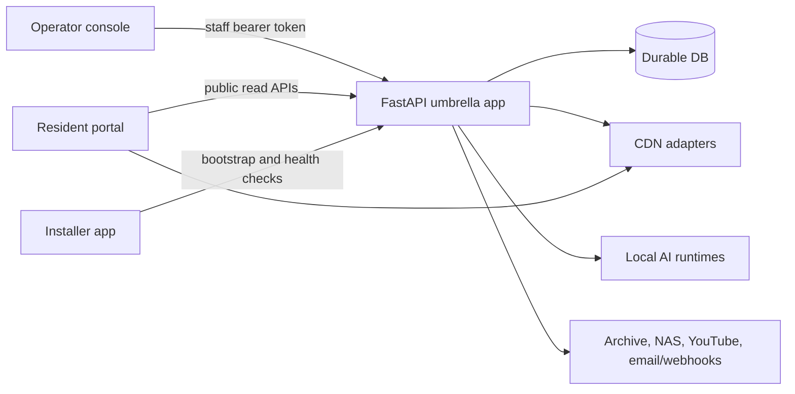
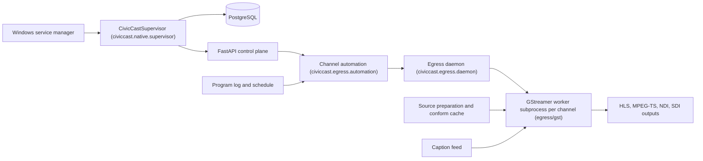
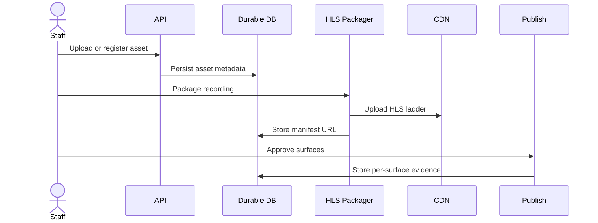
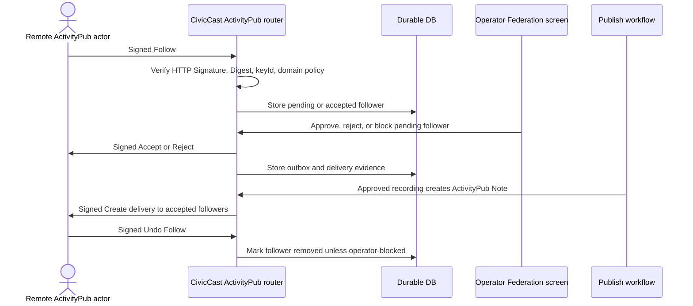

# CivicCast Architecture

> **Current native release: `v1.0.0-beta.11`**, published 2026-10-08 as a
> GitHub pre-release for testing. `setup.exe` and the runtime `.ccpack` packs
> are attached to its
> [GitHub Release](https://github.com/scottconverse/civiccast-native/releases/tag/v1.0.0-beta.11).
> This is a public beta, not a production release or an SLA-backed field
> release. The [Beta 11 verification record](docs/releases/v1.0.0-beta.11-verification.md)
> identifies the documentation/help revision (`400cff08`, signed build
> `37857705750`): a fresh CPU-only Windows Sandbox installation, a five-minute
> single-channel output check, and installed Help verification. It separately
> preserves the original package's in-place host observations. The revision
> does not inherit repair, Beta 10 upgrade, GPU, capacity, long-duration or field
> acceptance results. See [BRANCHES.md](BRANCHES.md) for release identity and status.
>
> **Historical Beta 10 evidence:** the published Beta 10 package passed its
> Gate A clean-install lane (10 of 10 criteria in Windows Sandbox on
> 2026-10-02). A separate eight-hour, three-channel lab run used an earlier
> internal build. These results describe Beta 10 only and do not establish
> Beta 11 package behavior. Beta 10, Beta 7, and earlier downloadable releases
> are superseded; Beta 8 and Beta 9 were never published. See the
> [Beta 10 verification record](docs/releases/v1.0.0-beta.10-verification.md).
>
> Source behavior and package evidence have different scopes. The current
> verification record is the authority for the published package; this
> architecture describes the source tree. Neither the brief output check nor
> the historical Beta 10 results establish broad field operation, external
> provider delivery, app-store acceptance, live hardware, cable-headend,
> QAM, SDI/DeckLink, EAS, or CEA-708 broadcast acceptance.

> **This repository ships one product line: native Windows.** Earlier
> revisions of this notice described "two parallel Windows product lines"
> shipping from this repository -- that described the OLD
> `scottconverse/civiccast` repository. This repository (`civiccast-native`)
> was created by copying only the native product out of it with fresh
> history, and the WSL2 lane was retired outright under the owner's "no
> linux" decision (2026-08-19). See [BRANCHES.md](BRANCHES.md) for the full
> explanation and where the retired line's history now lives (private, not
> archived).

This document orients engineers and integrators to the current CivicCast
system. The binding product contract is
[docs/spec/3.0/civiccast-3.0-station-in-a-box-MASTER.md](docs/spec/3.0/civiccast-3.0-station-in-a-box-MASTER.md);
the earlier [docs/spec/spec.md](docs/spec/spec.md) is superseded and retained
for historical reference only (its own header says so).

## System Shape

CivicCast is a self-hostable civic broadcast platform. A single FastAPI
umbrella app mounts the public, staff, installer, release, and federation
routers. Three Vite/React frontends cover the operator console, resident portal,
and installer shell. A native Windows station uses the installer-provisioned
local PostgreSQL service as its durable database. The standalone app's managed
storage fallback can use a local SQLite file when no database URL is configured;
that is not the native service's default. In-memory stores are limited to tests
and explicitly enabled throwaway development.

```mermaid
flowchart LR
    Operator["Operator console"]
    Resident["Resident portal"]
    Installer["Installer app"]
    API["FastAPI umbrella app"]
    DB[("Durable DB")]
    CDN["CDN adapters"]
    AI["Local AI runtimes"]
    External["Archive, NAS, YouTube, email/webhooks"]

    Operator -->|staff bearer token| API
    Resident -->|public read APIs| API
    Installer -->|bootstrap and health checks| API
    API --> DB
    API --> CDN
    API --> AI
    API --> External
    Resident --> CDN
```

## Runtime Entry Points

- `civiccast/app.py` builds the FastAPI app and wires router dependencies.
- `civiccast/cli.py` exposes operator commands such as `doctor`, `token`,
  `installer`, `model`, `cert`, `cable`, and `egress` (`egress run` starts the
  playout daemon for one channel from the command line).
- `civiccast/native/supervisor/` is the Windows service (`CivicCastSupervisor`)
  that starts and supervises PostgreSQL and the FastAPI control plane; the
  playout daemon (`civiccast/egress/daemon.py`) runs inside the control plane
  and owns the per-channel media workers. See
  [Playout And Native Service](#playout-and-native-service).
- `civiccast/apps/portal-operator/` is the staff/operator console.
- `civiccast/apps/portal-public/` is the resident portal and HLS playback UI.
- `civiccast/apps/installer/` is the Tauri-compatible installer shell.
- `alembic/` plus per-module migration directories manage schema changes.

## Major Modules

| Area | Package | Responsibility |
| --- | --- | --- |
| Platform | `civiccast.platform` | Hardware probe, broker contract, store bundle. |
| Auth | `civiccast.auth` | Staff bearer-token middleware and token lifecycle store. |
| Streaming | `civiccast.stream`, `civiccast.vod` | HLS packaging, public embeds, CDN upload. |
| Schedule | `civiccast.schedule` | Assets, premieres, embargoes, operator asset library. |
| Live | `civiccast.live` | Live sessions, fail-closed source verification, and recording finalization. |
| Captions | `civiccast.captions` | Recorded-media transcription with faster-whisper, native live Whistle/Whisper runtimes, bounded live cue history, WebVTT output, recorded-caption review queue. |
| Summary | `civiccast.summary` | Sourced summaries, approval, transcript CSV export. |
| Records | `civiccast.records` | PDF/A-3B signed-record export and provenance. |
| Publish | `civiccast.publish` | Portal, Internet Archive, NAS, YouTube, subscriber, and podcast surfaces. |
| Subscribe | `civiccast.subscribe` | Double opt-in, signed unsubscribe, webhook payloads. |
| Podcast | `civiccast.podcast` | Podcast episode and RSS generation. |
| Installer | `civiccast.installer` | First-run plan, fail-closed health checks, handoff summaries. |
| Native service | `civiccast.native` | Windows service supervisor, bundled-runtime provisioning and guards, installed GStreamer runtime handling, station runtime environment. |
| Playout (egress) | `civiccast.egress` | The 24/7 channel playout system: daemon, 24/7 channel automation, source preparation and conform cache, GStreamer worker and engine, HLS/TS/NDI/SDI outputs, caption feed and decode-back proof, as-run capture. |
| Program log | `civiccast.programlog` | Recurring per-channel program slots that materialize into schedule items. |
| Alerting | `civiccast.alerting` | Operator alerting hub (email, SMS, webhook) and the safe-to-air signal. |
| EAS | `civiccast.eas` | Public-safety alert ingest and on-channel display; not an EAS device. |
| Graphics | `civiccast.cg` | Character-generator idle, emergency, and bulletin-board contracts. |
| Cable | `civiccast.cable` | PEG/headend file packages and NDI planning/readiness. |
| ActivityPub | `civiccast.activitypub` | Opt-in station actor with signed federation, durable follower/outbox state, and operator federation controls. |

The stock build has no configured production media probe, so `civiccast.live`
fails closed on live-start until an operator connects one.

## Playout And Native Service

The recorded-meeting flow below is one half of the product. The other half is
24/7 channel playout, which runs as part of the native Windows service:

```mermaid
flowchart LR
    SCM["Windows service manager"] --> Sup["CivicCastSupervisor (civiccast.native.supervisor)"]
    Sup --> PG[("PostgreSQL")]
    Sup --> CP["FastAPI control plane"]
    CP --> Auto["Channel automation (civiccast.egress.automation)"]
    Auto --> Daemon["Egress daemon (civiccast.egress.daemon)"]
    Daemon --> Worker["GStreamer worker subprocess per channel (egress/gst)"]
    Worker --> Out["HLS, MPEG-TS, NDI, SDI outputs"]
    Prog["Program log and schedule"] --> Auto
    Prep["Source preparation and conform cache"] --> Worker
    Cap["Caption feed"] --> Worker
```

- **Service.** `civiccast.native.supervisor` is the session-0 Windows service
  (`CivicCastSupervisor`). It starts the direct children (PostgreSQL and the
  FastAPI control plane), keeps them alive, and reports one overall state.
  It does not own the media workers.
- **Schedule to plan.** `civiccast.programlog` turns recurring slots into
  schedule items; each cycle the engine resolves a channel's source plan
  from its scheduled items.
- **Automation and daemon.** `civiccast.egress.automation` drives every
  enabled channel from the control plane, including re-issuing a start for
  `auto_start` channels after a restart and reloading a channel that is on
  filler once the schedule yields a real program. `civiccast.egress.daemon`
  processes each channel's command queue and supervises the encoder or worker
  process, restarting it after a crash.
- **Preparation.** `civiccast.egress.preparer` conforms long programs ahead of
  air and keeps a persistent conform cache, so a program that has aired before
  does not have to be conformed again.
- **Engine.** The default engine is GStreamer (`civiccast.egress.gst`): one
  worker subprocess per channel runs a persistent pipeline built from a
  `PlayoutGraph` and swaps the active source without restarting the output.
  An ffmpeg-concat engine can still be selected with `CIVICCAST_EGRESS_ENGINE`
  (`civiccast.egress.engine_select`).
- **Outputs and captions.** HLS and MPEG-TS relays (`hls_relay`, `ts_relay`),
  NDI and SDI relays, a caption feed that pushes cues into the running worker,
  and a decode-back proof that checks the emitted stream.
- **Record keeping.** `civiccast.egress.asrun` is the seam that records what
  actually aired, as distinct from what was scheduled.

For native Windows, Whistle is the CPU live-caption primary; a failure or
timeout moves that channel to the faster-whisper runtime until the station
runtime restarts. Recorded-media captions use faster-whisper. Needle usage
telemetry is disabled, and the speech models run locally. Live captions,
SDI/NDI hardware paths, and cable-headend delivery are described with their
evidence boundaries in the [User Manual](docs/USER-MANUAL.md) and the
[Beta 11 verification record](docs/releases/v1.0.0-beta.11-verification.md).

## Data And Durability

On native Windows, the installer provisions bundled PostgreSQL under
`%PROGRAMDATA%\CivicCast\data\pgdata` and persists its connection URL for the
service. `DATABASE_URL` in the service environment overrides the installer
value. Standalone app startup can instead prepare a local SQLite database when
no URL is configured. Both durable paths apply the Alembic migrations and wire
database-backed stores; staff writes fail closed without durable storage unless
`CIVICCAST_ALLOW_EPHEMERAL_STORES=1` is explicitly set for tests or throwaway
development.

The CDN holds derived HLS bytes. The database remains the source of truth for
asset metadata, schedules, publish state, summaries, signed records,
subscriptions, and podcast state. External provider proofs are credential-gated;
deterministic mocks are not public-provider evidence.

Media files, station state, and credentials live outside the database, so a
database dump alone is not a complete station backup. `civiccast dr run-drill`
backs up the database and restores it into a scratch database; its media
manifest is not a copy of the media. Beta 11 has no scheduled backup or
supported live-database restore. The as-run outbox is a separate local SQLite
journal that retries delivery to PostgreSQL. See the [User Manual](docs/USER-MANUAL.md)
for the file locations and recovery limits.

Audience analytics is separate from caption-engine telemetry. The resident
portal's audience beacons are accepted only when the service's analytics key
and allowed-origin settings are configured; otherwise they are dropped, while
as-run reports remain available. Whistle/Needle usage telemetry is disabled.

## Core Flows

### Recorded Meeting

```mermaid
sequenceDiagram
    actor Staff
    participant API
    participant DB as Durable DB
    participant Stream as HLS Packager
    participant CDN
    participant Publish

    Staff->>API: Upload or register asset
    API->>DB: Persist asset metadata
    Staff->>Stream: Package recording
    Stream->>CDN: Upload HLS ladder
    Stream->>DB: Store manifest URL
    Staff->>Publish: Approve surfaces
    Publish->>DB: Store per-surface evidence
```

### First Run

The installer and CLI inspect the platform, verify package artifacts, check
local models, confirm local-CA mTLS posture, and report external
provider lanes as blocked until real credentials and controlled proof exist.
Blocked lanes are instructions, not success claims.

### ActivityPub Follow And Publish

```mermaid
sequenceDiagram
    actor Remote as Remote ActivityPub actor
    participant AP as CivicCast ActivityPub router
    participant DB as Durable DB
    participant Staff as Operator Federation screen
    participant Publish as Publish workflow

    Remote->>AP: Signed Follow
    AP->>AP: Verify HTTP Signature, Digest, keyId, domain policy
    AP->>DB: Store pending or accepted follower
    Staff->>AP: Approve, reject, or block pending follower
    AP->>Remote: Signed Accept or Reject
    AP->>DB: Store outbox and delivery evidence
    Publish->>AP: Approved recording creates ActivityPub Note
    AP->>Remote: Signed Create delivery to accepted followers
    Remote->>AP: Signed Undo Follow
    AP->>DB: Mark follower removed unless operator-blocked
```

## Security Boundaries

- `/api/public/*`, `/health`, `/api/version`, and `/api/hardware` are public.
- `/api/staff/*` routes require CivicCast bearer-token authentication.
- Staff tokens are hashed, revocable, rotatable, and auditable when the
  durable lifecycle store is configured.
- Operator deployments must bind FastAPI to loopback or place it behind an
  authenticating reverse proxy; `CIVICCAST_AUTH_ACK=1` only acknowledges that
  network posture.
- Local CA and service key material are part of the security surface. Windows
  writes apply restrictive `icacls` permissions to private keys.
- The machine-readable OpenAPI contract declares the CivicCast staff bearer
  scheme on `/api/staff/*` operations and includes 401 responses.

## Deployment Posture

This repository's Windows product runs CivicCast as a native Windows
service, registered through the SCM under a session-0 identity, built
under [ADR 0021](docs/adr/0021-native-windows-runtime.md) -- no WSL, no
Docker, no Linux install target (see [BRANCHES.md](BRANCHES.md)). The
retired WSL2/Ubuntu-with-systemd deployment described in earlier revisions
of this section belonged to the separate, private `scottconverse/civiccast`
repository. Local-CA mTLS is a production-like foundation. The in-process
broker (`civiccast.platform.broker.InProcessBrokerClient`) is the sole
event-bus implementation for all deployments (see ADR 0023, which
supersedes ADR 0001's NATS JetStream choice).

## Current Source Contracts

These describe current source behavior and test coverage. Package acceptance
remains scoped to the [Beta 11 verification record](docs/releases/v1.0.0-beta.11-verification.md):

- Staff-write stores fail closed without managed durable storage or `DATABASE_URL` unless ephemeral mode
  is explicitly acknowledged for local development.
- OpenAPI exposes the staff bearer-token security scheme for generated clients.
- ActivityPub is disabled by default unless an operator opts in with an
  explicit base URL and station key; when enabled it verifies signed inbox
  traffic, signs outbound delivery, persists federation state, and exposes
  open, limited, approval-only, blocklist, allowlist, and authorized-fetch
  controls.
- Real-Postgres tests exercise summary, records, publish, subscribe, podcast,
  schedule, and live-store paths.
- The installer UI is a guided wizard that finishes by opening the operator
  console on the station; first setup is admitted by loopback address alone.
- Windows private-key writes apply local ACL restrictions.
- Browser gates include a full-stack operator publish-approval cycle against a
  live FastAPI fixture.
