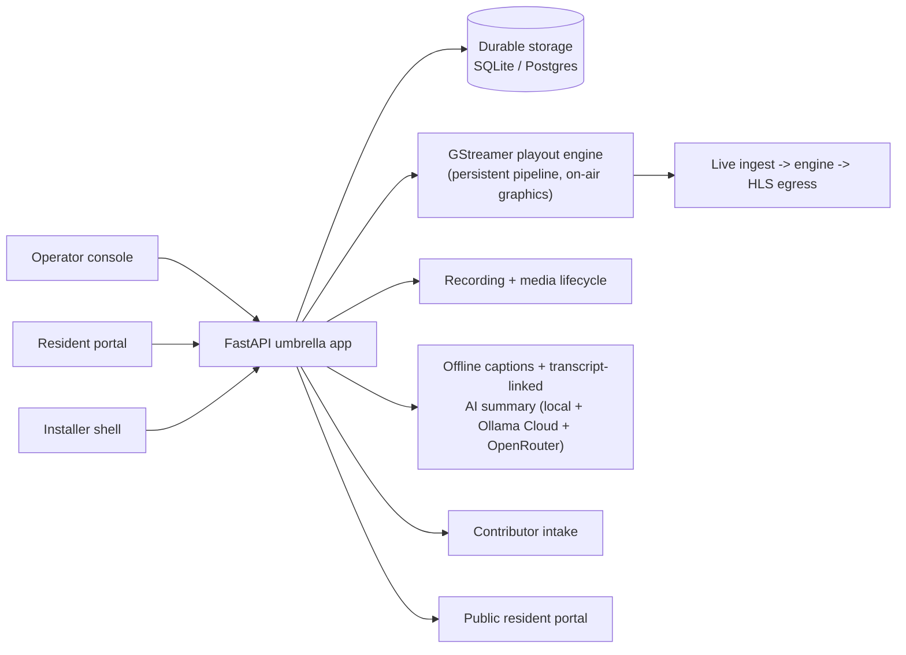

# CivicCast

**CivicCast is an open-source, self-hostable civic broadcast platform for
PEG/local-government stations** — record a meeting, generate offline
captions, let an operator review and approve the recording, get an
AI-drafted summary linked back to the transcript, schedule it, and publish
it to residents on a branded portal with captions. It's built to run on
commodity Windows hardware: no per-minute fees, no proprietary appliance,
no vendor lock-in.

This repository (`civiccast-native`) is the one product line: a native
Windows station-in-a-box, installed with a signed installer that registers
a Windows service and supervises the control plane, Postgres, and the media
workers from a bundled runtime. No WSL, no Docker, no Linux install target.
See [BRANCHES.md](BRANCHES.md) for the full explanation, including where an
earlier, retired WSL2/Ubuntu lane's history now lives (a separate, private
repository, not this one).

**Current version: `v1.0.0-beta.3`** -- CivicCast's first downloadable
public release. `setup.exe` and the five runtime `.ccpack` packs are
attached to the
[`v1.0.0-beta.3` GitHub Release](https://github.com/scottconverse/civiccast-native/releases/tag/v1.0.0-beta.3),
each verified by `SHA256SUMS.txt` and a signed sidecar; the ~21 GB AI-model
`station\` bundle is deliberately not a release asset (see "Install and run"
below). `v1.0.0-beta.1` (USB-delivered, no downloadable assets) is now
superseded; `v1.0.0-beta.2` was never published -- it exists only as an
internal Gate A upgrade-baseline kit (see
[`docs/releases/2026-09-02-beta1-to-beta2-fresh-install-only.md`](docs/releases/2026-09-02-beta1-to-beta2-fresh-install-only.md)).
See [`docs/releases/release-truth.yaml`](docs/releases/release-truth.yaml)
for the authored release-state record,
[`docs/releases/v1.0.0-beta.3-verification.md`](docs/releases/v1.0.0-beta.3-verification.md)
for the release's verification record (Gate A run, asset/hash/signature
checks), and
[`docs/releases/2026-09-03-beta3-first-downloadable-release.md`](docs/releases/2026-09-03-beta3-first-downloadable-release.md)
for the publish record.

`v1.0.0-beta.4` is the next candidate and the current owner-held unpublished candidate
(unpublished; no installer asset) -- it does not change the install story
above, which still targets `v1.0.0-beta.3`.


## What's proven in this candidate

The core meeting-to-resident pipeline works end to end and is exercised by
the automated test suite and, for the recording/playout path, by live
pipeline proofs against the real bundled GStreamer runtime (not mocks):

- **Record.** Scheduled recording from network sources (RTSP / SRT / HLS /
  RTMP / MPEG-TS), one-shot or recurring, with finalization into the asset
  library. Capture reliability was hardened this candidate: an ffmpeg
  packet-flush fix stops network-stream recordings from losing their
  unflushed tail when Windows terminates the capture process.
- **Offline captions.** Caption generation runs against the recorded media
  (Faster Whisper, bundled wheelhouse) with a tiered fallback: if a
  station's preferred caption tier isn't available, the system degrades to
  a proven floor tier automatically, logs the degrade to the durable
  supervisor log, and raises an operator-visible alert — it no longer runs
  silently degraded.
- **Operator review.** Before anything publishes, an operator reviews the
  recording and its captions and approves it — the review/approval gate
  that keeps an AI-assisted pipeline from putting unreviewed material in
  front of residents.
- **AI summary.** A transcript-linked meeting summary is generated from the
  approved captions, so the summary text traces back to what was actually
  said and captioned, not a free-standing AI guess.
- **Schedule and publish.** Recurring/one-shot scheduling with a 72-hour
  rolling program log, and an explicit publish step to the resident-facing
  portal — nothing reaches residents without an operator publishing it.
- **Resident portal.** A public portal (live, upcoming, replays, archives)
  serves the published recording with captions.
- **Contributor intake.** The public contribution flow now carries a
  submitted file all the way to an airable, packaged state — accept →
  ingest into the real asset library → package (manifest generated) →
  schedule → publish, not just an accepted-but-stuck upload.
- **In-product manual.** The operator manual (the same content that ships
  as [`docs/USER-MANUAL.md`](docs/USER-MANUAL.md)) is served from inside
  the running app over an unauthenticated endpoint, specifically so an
  operator stuck mid-setup or mid-error — including on the pre-login First
  Setup screen — can reach it without needing to already be signed in.
- **Signed-pack install, and a proven upgrade path.** The native installer
  verifies Ed25519-signed component packs against the running installer's
  expected product/version identity before trusting them. The
  uninstall → reinstall upgrade path is exercised by an automated "dirty
  lane" acceptance run: install, plant real data, uninstall, reinstall, and
  verify the same Postgres data cluster and the same uploaded files survive
  the full cycle byte-for-byte.

## New this candidate: on-air graphics and live broadcast

Two capabilities landed for the first time in candidate #22, proven at the
playout-engine level and operator-drivable, but not yet hardened for
unattended production use:

- **On-air graphics (station bug + lower-third).** The GStreamer playout
  engine can now composite a station bug/logo (any corner) and a
  text lower-third banner onto the program video, using the bundled
  runtime's D3D11 hardware compositor. Proven live: MPEG-TS continuity
  clean (0 continuity-count errors, 0 PCR discontinuities) with the overlay
  on, plus a decoded-pixel check confirming the graphics are actually
  visible in the output, not just that the pipeline didn't crash. An
  operator can turn the lower-third on/off and edit its text from the
  console; a change applies on the channel's next start or content reload,
  not to an already-live pipeline instantly.
- **Live broadcast (ingest → engine → HLS egress).** Live source ingest
  feeding the playout engine's automated relaunch/fallback logic, egressing
  to HLS, proven on real captured footage. A live source that becomes
  unreachable or drops no longer crash-loops the channel forever: after a
  bounded number of failed relaunches the channel falls back to slate and
  stays there — dead air is avoided by falling back to a known-good state,
  not by silently retrying a dead source forever. A dead HLS relay process
  is now polled and its health correctly reported, instead of a healthy
  main encoder masking a relay that residents are no longer receiving
  anything from.

## Honestly scoped as beta / roadmap — not done

The following are **not** claimed as finished capabilities of this
candidate. They are either partially built, lab-only, or dependent on
things outside this repository's control:

- **No full cable/SDI broadcast headend acceptance.** DeckLink SDI output
  is contract-tested against the GStreamer element it wires to
  (`decklinkvideosink`); it has not been proven against physical SDI
  hardware or a real cable-operator headend.
- **No multi-channel simultaneous operation proof.** The engine's design
  supports multiple channels; a multi-channel, simultaneous, unattended
  production run has not been exercised end to end in this candidate.
- **Internet Archive and YouTube syndication need station-provided
  accounts and credentials.** These integrations ship real adapters, gated
  off by default, and are contract-tested without live external calls. A
  station must supply its own credentials and prove its own publish before
  relying on them publicly.
- **No native OTT store apps shipped as finished products.** Starter,
  platform-idiomatic source trees exist for several targets, but
  store-ready polish (artwork, store metadata, content ratings, privacy
  manifests, per-platform accessibility audits) and app-store submission
  are not part of this candidate.
- **CivicCast is not an EAS device.** It can display CAP/IPAWS alert
  content in software; it never claims FCC Part 11 EAS certification or
  compliance. Mandatory EAS relay is the cable operator's certified
  headend device, not this product.
- **Live per-leg SRT reconnect is a known, deferred robustness gap.**
  Today a dropped SRT/UDP leg falls back to slate rather than
  reconnecting that one leg in place without a full pipeline rebuild; a
  full pipeline rebuild is the current recovery path. This is tracked, not
  silently accepted.
- **GStreamer engine egress: not yet proven in Gate A.** Gate A's
  station-acceptance run includes a product-engine check (`t4_engine`) that
  starts the real GStreamer playout engine and verifies its output with
  TSDuck; the beta.3 grader read a false PASS from a bug in the capture
  tool (fixed in #145) -- re-run correctly, the engine's own state was
  `FALLBACK_SLATE`, not on-air, for both the beta.3 and beta.4 kits. See
  [`docs/ops/gate-a.md`](docs/ops/gate-a.md#known-limitation-test-tsproof-null-pipeline-bug-let-a-false-t4-pass-through-fixed-in-145)
  for the full account. The ffmpeg fallback path Gate A also exercises is
  proven; the GStreamer default-engine path is not yet proven by Gate A.
  The real cause was plain: on every machine without a system-wide
  GStreamer install already on `PATH` -- every customer box, every
  sandbox run -- the control-plane child process never actually got the
  bundled GStreamer `bin` directory on its own `PATH`, so `gi` could not
  load `gstreamer-1.0-0.dll` and the worker died at import, before it
  could reach `PLAYING` or decode anything (#154). A dev box with
  GStreamer already on the system `PATH` hid this completely. Two smaller,
  secondary bugs were also found and fixed, but neither could matter until
  the import-time crash above was fixed: a module-identity mismatch that
  made engine dispatch miss on every program leg once the worker did start
  (#153), and a hardware-decoder rank policy that let a non-functional GPU
  decoder stall the pipeline ~10s after `PLAYING` (also #154).
  **Pending tonight's Gate A run for `v1.0.0-beta.4` (REMOVE THIS SENTENCE
  IF THAT RUN DOES NOT PASS):** these fixes since beta.3 (#153, #154)
  address every measured cause of `FALLBACK_SLATE` above, and
  `v1.0.0-beta.4` is expected to be the first candidate whose Gate A T4
  check measures real MPEG-TS packets from the GStreamer engine instead of
  falling back to slate -- see
  [`docs/releases/2026-09-03-beta4-release-notes.md`](docs/releases/2026-09-03-beta4-release-notes.md)
  for the actual verdict once that run completes.

## Install and run

- **Windows installer.** CivicCast installs as a signed Windows installer;
  see [Install CivicCast On Windows](INSTALL-WINDOWS.md) and
  [Windows Release Trust And Verification](docs/install/windows-release-trust.md)
  for the setup path, Authenticode signature verification, and the pack-trust
  model. `v1.0.0-beta.3` is the current release and the first
  **downloadable** one: `setup.exe`, the five runtime `.ccpack` packs,
  `SHA256SUMS.txt`, and a signed sidecar are attached to the
  [GitHub Releases page](https://github.com/scottconverse/civiccast-native/releases).
  `v1.0.0-beta.1` (USB-delivered, no downloadable assets) is now superseded.
  `v1.0.0-beta.2` was never published -- it exists only as an internal
  Gate A upgrade-baseline kit, not a release a tester can obtain.
  A **first-time install** needs the USB/LAN-delivered model bundle
  (~21 GB) -- the GitHub download alone does not include it.
  **Upgrading from `v1.0.0-beta.1`:** copy the whole `beta.3` kit
  (`setup.exe` + packs + `station\` folder) to the station and run
  `setup.exe` over the existing install; recordings, settings, database,
  and AI models are kept and the schema migrates. The one unsupported path
  is running `setup.exe` alone, without the `station\` folder, from a
  beta.1 install -- see
  [`docs/releases/2026-09-02-beta1-to-beta2-fresh-install-only.md`](docs/releases/2026-09-02-beta1-to-beta2-fresh-install-only.md).
  From `v1.0.0-beta.3` on, a download-only **upgrade** of an
  already-installed station keeps the station's recordings, database, and
  AI models. See
  [BRANCHES.md](BRANCHES.md) for release identity and status.
  Slow setup must remain visibly active: the installer reports its current
  phase and updates a progress heartbeat instead of appearing frozen.
- **In-product operator manual.** Once running, open the operator manual
  from inside the app at any time, including before signing in — it serves
  the same content as [`docs/USER-MANUAL.md`](docs/USER-MANUAL.md)
  ([PDF](docs/USER-MANUAL.pdf), [DOCX](docs/USER-MANUAL.docx)).
- **Other operator documentation:**
  [Admin Guide](docs/admin-guide.md),
  [Meeting Operator Guide](docs/meeting-operator-guide.md),
  [Records Clerk Guide](docs/records-clerk-guide.md),
  [Beta Tester Start Here](docs/tester/START-HERE.md).

### Developer — run from source, contribute

```bash
# One-time: install uv, then sync the workspace.
uv sync --all-extras --group dev

# Print the release version.
uv run civiccast --version

# Probe CPU, RAM, disk, GPU/VRAM, OS, and recommended tier.
uv run civiccast doctor

# Serve the umbrella API on http://localhost:8000.
uv run uvicorn civiccast.app:app --reload
```

Without `DATABASE_URL`, CivicCast starts in local setup mode and prepares
installer-managed durable SQLite storage. Set `DATABASE_URL` to point at
Postgres for technical deployments. In-memory stores are for tests and
local experiments only and require explicit acknowledgement.

Technical references:

- [Architecture Overview](ARCHITECTURE.md)
- [3.0 Master Spec](docs/spec/3.0/civiccast-3.0-station-in-a-box-MASTER.md)
- [Roadmap Status Manifest](docs/spec/3.0/ROADMAP.status.yaml) (repo-verified
  — a **Built** status means the code and tests named as evidence exist on
  disk, not that a feature has field proof for live media, hardware,
  headends, providers, or unattended station operation)
- [Reconciliation Log](docs/spec/3.0/RECONCILIATION.md)
- [Technical Operations Reference](docs/technical-ops-reference.md)
- [API Guide And Generated Reference](docs/API-REFERENCE.md)
- [OpenAPI JSON](docs/openapi.json)
- [Legal Notices](LEGAL-NOTICES.md)
- [Patent Risk Notes](docs/legal/patent-watchlist.md)

## Architecture

CivicCast is a self-hostable FastAPI service with React/Vite frontends
(operator console, resident portal, installer shell), a persistent
GStreamer playout engine, and a clean separation between data, service,
API, and UI per module.



The [Architecture Overview](ARCHITECTURE.md) goes deeper into module
boundaries and security boundaries.

## The broader 3.0 spec and roadmap

The [3.0 Master Spec](docs/spec/3.0/civiccast-3.0-station-in-a-box-MASTER.md)
describes CivicCast's full intended station-in-a-box scope — well beyond
what this candidate has proven in the field — including 24/7 multi-channel
playout, underwriting/spot trafficking, franchise reporting, and native OTT
apps. The [Roadmap Status Manifest](docs/spec/3.0/ROADMAP.status.yaml) is a
repo-verified, fail-closed manifest that checks each spec item's claimed
status against evidence that actually exists on disk; treat "Built" there
as "the code and its tests exist," not as a field-proven claim for this
candidate — the "What's proven in this candidate" and "Honestly scoped"
sections above are the accurate summary for a reader deciding whether to
run beta.3 today.

Proprietary-appliance capabilities are **out of scope** for V1 by explicit
decision, documented in
[RECONCILIATION.md](docs/spec/3.0/RECONCILIATION.md): multi-site
federation, SCTE-35 dynamic ad-insertion, and FCC EAS **certification**
(mandatory Part 11 relay is the cable operator's headend device — CivicCast
displays CAP/IPAWS and never claims "EAS-compliant").

## Documentation

- [Documentation Index](docs/index.html)
- [User Manual](docs/USER-MANUAL.md)
- [FAQ](FAQ.md)
- [Operator Language Guide](docs/operator-language-guide.md)
- [3.0 Master Spec](docs/spec/3.0/civiccast-3.0-station-in-a-box-MASTER.md)
- [Roadmap Status Manifest](docs/spec/3.0/ROADMAP.status.yaml)
- [Legal Notices](LEGAL-NOTICES.md)
- [GitHub Issues](https://github.com/scottconverse/civiccast-native/issues) (GitHub Discussions is not enabled on this repository)

## Contributing

See [CONTRIBUTING.md](CONTRIBUTING.md). Contributions are accepted via
pull request under the Developer Certificate of Origin (DCO).
Conventional Commits are required.

## License

- **Code:** [Apache License 2.0](LICENSE-CODE).
- **Documentation:** [Creative Commons Attribution 4.0 International](LICENSE-DOCS).
- **Combined repository license:** see [LICENSE](LICENSE).

## Security

To report a security vulnerability, see [SECURITY.md](SECURITY.md). Please
do not open public issues for security reports.

## Support

See [SUPPORT.md](SUPPORT.md).

## Code Of Conduct

This project adheres to the [Contributor Covenant 2.1](CODE_OF_CONDUCT.md).
By participating, you agree to abide by its terms.
