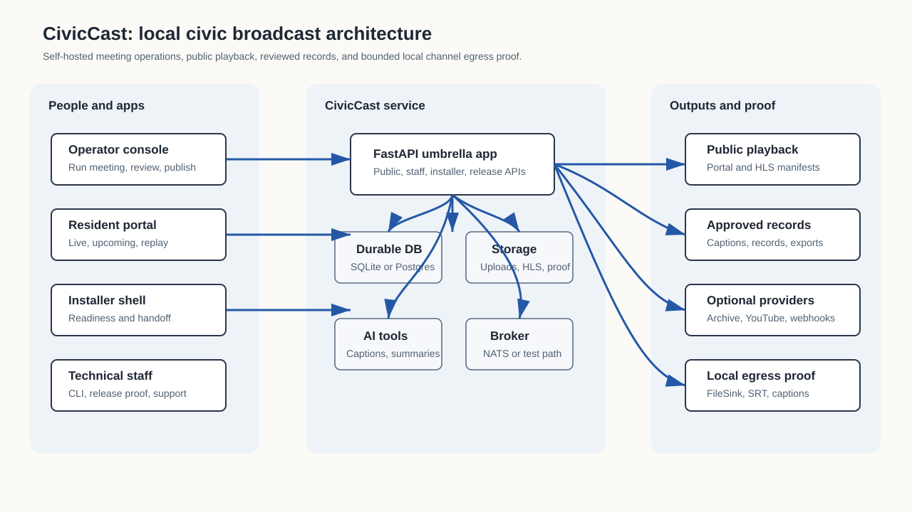
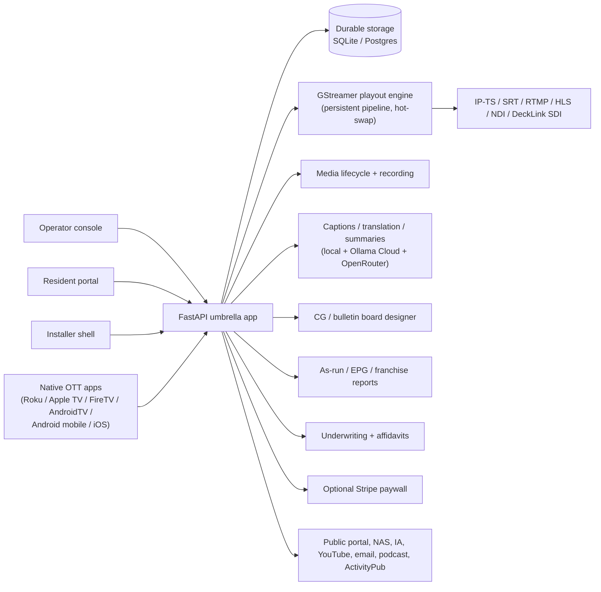

# CivicCast

**CivicCast is open-source, self-hostable civic meeting recording and
publication software for public-access stations, city councils, school
boards, and community media teams.**

This repository (`civiccast-native`) ships **one product line**: a native
Windows station-in-a-box. `main` carries it — a signed installer that
registers a Windows service through the SCM and supervises the control
plane, Postgres, NATS, and the media workers from a bundled runtime. No
WSL, no Docker, no Linux install target. See [BRANCHES.md](BRANCHES.md)
for the full explanation, including where the retired WSL2/Ubuntu lane's
history now lives (a separate, private repository, not this one).

> **Historical note.** Earlier revisions of this README described "two
> parallel product lines" -- `main` as a public WSL2 Windows beta
> (`v1.0.0-rc15`/`rc18`) alongside a separate native-Windows development
> branch. That described the OLD `scottconverse/civiccast` repository, not
> this one: this repository was created by copying only the native product
> out of it with fresh history (BRANCHES.md), and the WSL2 lane was
> retired outright under the owner's "no linux" decision (2026-08-19). The
> sections below that still describe `v1.0.0-rc18`/WSL2-line proof state,
> and any link to `docs/releases/v1.0.0-rc*-verification.md` or to
> `scottconverse/civiccast`'s GitHub releases, refer to that other,
> private repository and do not resolve or apply here. They are kept as
> historical context pending a native-line rewrite of this README's proof
> narrative and capability table footnotes.

The native line's own development candidate is `v1.0.0-beta.1` — an
owner-held candidate that is **not yet published** (BRANCHES.md's "Release
identity"). Its version identity is deliberately distinct from the retired
WSL line's `v1.0.0-rc15`/`rc18`: the native line is a new beta series, not
a successor build of the WSL rc series (they install to separate registry
roots, under separate product identities, and are never
upgrade-compatible with one another).

> **Native packs built before the `v1.0.0-rc15` → `v1.0.0-beta.1` version-identity
> split are stale and will fail pack-trust verification.** The installer's pack
> verifier (`civiccast/installer/native_packs.py`) checks a pack's manifest
> `product_version`/`compatible_core` against the running installer's expected
> identity, and source-bound components (the native app payload and native
> server binaries) must also carry a `source_sha` matching the build they were
> produced from. A pack built under the old, pre-split shared version identity
> carries neither the current identity nor that binding, so it is rejected —
> by design, not a bug. Rebuild native packs from this line after the split;
> do not attempt to reuse a pack produced before it.

## Windows installer status

> **Do not install `v1.0.0-rc13` or any earlier prerelease.** A genuine clean-Windows test exposed a
> concurrent WSL/bootstrap failure and missing progress feedback. rc13 is
> withdrawn from beta use and retained only as historical incident evidence.
> **`v1.0.0-rc18` is the approved installer for the controlled beta.** Its
> installer is built from the gate-cleared `main`, Authenticode-signed, and
> proven on a genuinely clean Windows host. rc17 remains downloadable as the
> rollback target but carries the sixteen findings rc18 fixes, three of them
> Critical, so it is not recommended for new installs. What has and has not
> been proven for rc18 is stated at the top of
> [`docs/releases/v1.0.0-rc18-verification.md`](docs/releases/v1.0.0-rc18-verification.md).

`v1.0.0-rc18` is the **audit-remediation release** on top of the previously published
rc17 beta. A full stage gate on the rc17 line found sixteen defects; all of them
are fixed here. Three were serious enough to matter to a records clerk: the
simulated Internet Archive target produced a link that looked like a genuine
archive.org permalink for an item that was never created; the public contributor
upload endpoint had no sign-in, no size limit, and no rate limit; and recorded
playback returned a bare server error whenever durable storage was briefly
unreachable. Its publication boundary is recorded in
[`docs/releases/v1.0.0-rc18-verification.md`](docs/releases/v1.0.0-rc18-verification.md).

rc17 remains published and immutable as the rollback target, but it carries all
sixteen of those defects. Stations on rc17 should move to rc18, which has
cleared its stage-gate re-run with no blocker or critical findings.

The replacement installer keeps slow Windows and Ubuntu setup visibly active:
it shows the current phase, step count, elapsed time, and a heartbeat that
updates every few seconds. A static setup screen with no heartbeat is treated
as a failure, not normal installation behavior.

## Current state - rc18 published controlled beta

`v1.0.0-rc18` is the current release line and the published controlled beta: it
fixes the sixteen stage-gate defects found against rc17, plus the contributor-upload
and operator defects found while closing them out, and its stage-gate re-run
returned no blocker or critical findings (see "Windows installer
status" above). rc15 repairs
the Windows/WSL bootstrap, same-version runtime replacement, installer progress
feedback, private packaging, explicit Portal publication, and resident playback
path. Its database recovery drill covers an isolated 95-table database plus
crash recovery; it does not restore media, configuration, or credentials.

The stock build deliberately shows **Source preview unavailable** and keeps
live start disabled because no production server-side media probe is bundled.
The accepted stock test path is:

1. create or upload recorded sample media;
2. run a private rehearsal that copies and validates that exact sample, creates
   a private recording, and loads resident preview;
3. package the recording privately;
4. approve only the Portal surface; and
5. confirm resident playback.

The exact published Windows installer passed validation on a genuinely clean,
WSL-disabled Windows baseline through feature enablement, reboot/resume, Ubuntu/runtime
bootstrap, first setup, the recorded-media path above, service restart, app
relaunch, and cold-reboot recovery. A still-open rc15 installer can briefly
show a stale restart screen after setup has already become healthy; close and
reopen the installer if that occurs. rc16 contains the forward fix but does not
change rc15's published bytes.
The earlier rc13 lab-host run was not a valid clean-Windows proof because WSL
and other virtualization state remained on that machine.

Release evidence is recorded in:

- [`docs/releases/v0.1.0-rc6-verification.md`](docs/releases/v0.1.0-rc6-verification.md) — the clean-Windows install + video proof
- [`docs/releases/0.2.0-direct-delivery-ceiling.md`](docs/releases/0.2.0-direct-delivery-ceiling.md) — the measured direct ceiling
- [`docs/releases/0.2.0-switch-validation.md`](docs/releases/0.2.0-switch-validation.md) — the surge-switch validation

The release gate is intentionally fail-closed: current-head test-stack
evidence, release artifacts, native installer output, installer lifecycle
proof, clean Windows core-reached first-run evidence, a 31-item evidence
matrix, and GauntletGate all-lane evidence all landed for `0.1.0-rc6`;
`0.2.0` added the measured live-delivery evidence above on that foundation;
`1.0.0-rc7` completed the 41-row readiness ledger and added the agenda-import,
migration, DR-drill, and 8-hour-soak evidence recorded in
[`docs/releases/v1.0.0-rc7-verification.md`](docs/releases/v1.0.0-rc7-verification.md);
rc13 is retained only as an incident record; rc15's published proof is recorded
in [`docs/releases/v1.0.0-rc15-verification.md`](docs/releases/v1.0.0-rc15-verification.md),
rc16 candidate status is recorded in
[`docs/releases/v1.0.0-rc16-verification.md`](docs/releases/v1.0.0-rc16-verification.md),
and rc18's release identity and proof boundary are recorded in
[`docs/releases/v1.0.0-rc18-verification.md`](docs/releases/v1.0.0-rc18-verification.md).



## Capability inventory (not an acceptance claim)

The capability table below mirrors the broader station-in-a-box source
inventory that the current candidate builds on. A **Built** label means the
code/spec evidence named in that row exists; it does not mean the shipped build has
field proof for live media, hardware, headends, providers, stores, or unattended
station operation. The bounded acceptance path is the recorded-media path
above. Each row is
verified by the repo-checked
[`ROADMAP.status.yaml`](docs/spec/3.0/ROADMAP.status.yaml) — the manifest's
fail-closed verifier rejects any "built" claim whose evidence is missing
from disk.

| Capability | What it is | Status |
|---|---|---|
| 24/7 channel playout, three concurrent channels | Persistent GStreamer pipeline with hot-swap source switching; no per-segment ffmpeg teardown | Built (S15) — beta finish-line 4h soak passed; 12h release-artifact soak passed; 24h public-beta release-artifact soak passed |
| Program log, scheduling, query-driven auto-scheduling | Recurring slots, 72h rolling materialization, saved-search rules, block/daypart | Built (S4, S19) |
| Commit-to-Air gate + operator takeover controls | Operator approval, dry-run, conflict detection, on-air lock, takeover audit | Built (S4, S5) |
| Rich CG / on-channel bulletin designer | Multi-zone (fullscreen / L-bar / lower-third / bug / ticker / emergency), feed sources (RSS / iCal / CalDAV / weather), live-video bulletins, scheduling and moderation | Built (S6) |
| Scheduled recording from inputs and network streams | SDI / HDMI / NDI inputs and RTSP / SRT / HLS / RTMP / MPEG-TS, one-shot and weekly recurrence, ffmpeg-backed production capture, recorded asset finalization, S8 alert on source/finalize failure | Built (S21) — production capture wiring completed for beta |
| As-run / proof-of-performance + EPG + franchise reporting | XMLTV / X-List / CSV EPG export, hours-by-category franchise reports, per-underwriter affidavit linking | Built (S23) |
| Underwriting / sponsorship spot trafficking | Spot-as-asset, rotation rules, break insertion, per-underwriter affidavits, billing export | Built (S24) |
| Meeting-agenda integration with video timecode | Agenda items synced to chapters, public agenda sidebar with seek, optional agenda PDF | Built (S25) |
| Native OTT apps (Roku / Apple TV / Fire TV / Android TV / Android mobile / iOS) | Real platform-idiomatic starter source for all six targets that builds with the platform's own toolchain; HLS playback against the public app config API | Built (S12) — store-ready polish (artwork, store metadata, accessibility audit) is per-target follow-up |
| Captions / loudness / EAS software layer | Caption decode-back/status proofs, per-sink loudness target, CAP / IPAWS / NWS / AMBER display, EAS attention-tone stripping on web/OTT egress, secondary-audio routing (SAP / descriptive). The native Windows installer bundles a private GStreamer runtime and hard-checks the native caption-SEI elements before it claims that path is ready (see [BRANCHES.md](BRANCHES.md); this replaces an earlier, now-retired WSL2/Ubuntu-hosted runtime described in older revisions of this table). Optional operator-provided `x264enc` remains supported but is not shipped. | Built in software |
| Live ingest and contribution | RTMP / RTSP / NDI / SRT ingest, VDO.Ninja remote guests, Production Control Room (TSR over OBS / vMix / ATEM) | Built (S16, S17) |
| Analytics and audience measurement | Self-hosted analytics (viewer count, time-watched), franchise audience reports | Built (S14) — packaged audience reports (CSV/XML) over the existing store; the fuller dashboard/Postgres epic is a tracked follow-on |
| AI model-selection surface | Per-feature operator choice across local Ollama / Ollama Cloud / OpenRouter; defaults adapt to detected RAM | Built (S13) |
| Real RFC-3161 timestamp authority for record provenance | Real HTTP client against FreeTSA by default; opt-in to any TSA via env | Built |
| Real Twilio SMS for operational alerting | Real REST API, HTTP Basic auth | Built |
| Subscription paywall (Stripe-hosted) | Default-OFF backend/operator surface; magic-link sign-in; PCI SAQ-A scope; webhook signature verified | Backend/operator surface built; public tier discovery is not deployed, so the flow is not end-to-end usable |
| CDN-aware trusted-proxy / X-Forwarded-For handling | Common helper so the operator can put CivicCast behind a CDN without spoofed client IPs | Built |
| Public portal: live, upcoming, replays, archives, podcast feeds, default-off ActivityPub federation | Carried forward into the 3.0 beta line | Built |
| Accessibility (WCAG 2.1 AA / ADA Title II) | axe gates in CI; contrast gate, Lighthouse, screen-reader proof | Built (S20) — axe gates plus the DC-4 contrast gate enforced in CI |
| Cable headend acceptance, DeckLink SDI card proof, app-store submission, real-station unattended production | Station-device and external-provider evidence rungs (3, 4, 5 on the proof ladder); the **build** path is complete in software | Not yet (step 14 and station-device evidence) |

Proprietary-appliance capabilities **outside scope** for V1, by explicit decision and
documented in [RECONCILIATION.md](docs/spec/3.0/RECONCILIATION.md):
multi-site federation (V2), SCTE-35 dynamic
ad-insertion, FCC EAS **certification** (mandatory
Part 11 relay is the cable operator's headend device — CivicCast displays
CAP / IPAWS, never claims "EAS-compliant").

## Start here

> **`v1.0.0-rc18` is the approved installer for the controlled beta** (see
> "Windows installer status" above); download it from the
> [v1.0.0-rc18 release](https://github.com/scottconverse/civiccast/releases/tag/v1.0.0-rc18).
> rc17 remains published as the rollback target, but it
> carries the sixteen findings rc18 fixes and is not recommended for new
> installs. Whichever build you are handed, verify the installer's byte size and
> SHA-256 against that release's own sidecar and complete manifest — never
> against a value copied from another candidate.

### Controlled tester — run the acceptance path

Begin an installer rehearsal only against the rc18 candidate you were handed and
its matching proof assets:

1. Obtain the installer, manifest, and sidecar from that exact release, and confirm the
   installer's Authenticode signature status (see [CODE_SIGNING_POLICY.md](CODE_SIGNING_POLICY.md)).
2. Verify those files as one package; do not use a repository source ZIP.
3. Read [Install CivicCast On Windows](INSTALL-WINDOWS.md) and
   [Windows Release Trust And Verification](docs/install/windows-release-trust.md).
4. Run the setup path, create the first admin, and save the recovery kit.
5. Open **System Health**, verify backup, and run the database restore drill.
6. Create or upload a short recorded sample, run **Private rehearsal**, and
   confirm CivicCast names that exact sample, a finalized private recording,
   and a loaded resident preview.
7. Confirm live controls fail closed without a server-side media probe.
8. Package a test recording, confirm it remains private before approval,
   publish only to Portal, and verify resident playback.

The full operator manual:

- [User Manual](docs/USER-MANUAL.md), [PDF](docs/USER-MANUAL.pdf), and
  [DOCX](docs/USER-MANUAL.docx)
- [Admin Guide](docs/admin-guide.md)
- [Meeting Operator Guide](docs/meeting-operator-guide.md)
- [Records Clerk Guide](docs/records-clerk-guide.md)
- [Beta Tester Start Here](docs/tester/START-HERE.md)

### Station administrator — deploy a PEG channel

If you are evaluating CivicCast for migration from a proprietary PEG appliance:

- Start with the [3.0 Master Spec](docs/spec/3.0/civiccast-3.0-station-in-a-box-MASTER.md)
  for the full thesis and feature scope, the proof ladder, and the
  build-order tracker.
- Review [Legal Notices](LEGAL-NOTICES.md) and the
  [Patent Risk Notes](docs/legal/patent-watchlist.md) before public deployment;
  vendor comparison research is kept in the specification archive, not release copy.
- Review the [Channel Egress Operator and Tester Runbook](docs/ops/channel-egress-runbook.md)
  for the cable channel automation surface and the headend handoff matrix.
- Plan hardware against the [StationBoxProfile / `civiccast doctor`](docs/spec/3.0/civiccast-3.0-station-in-a-box-MASTER.md)
  guidance — a 3-channel PEG triad needs 3 SDI outputs (a multi-output
  DeckLink or one card per channel).

### Developer — run from source, contribute

```bash
# One-time: install uv, then sync the workspace.
uv sync --all-extras --group dev

# Print the release version.
uv run civiccast --version

# Probe CPU, RAM, disk, GPU/VRAM, OS, and recommended tier.
uv run civiccast doctor

# Serve the umbrella API on http://localhost:8000.
uv run uvicorn civiccast.app:app --reload
```

Without `DATABASE_URL`, CivicCast starts in local setup mode and prepares
installer-managed durable SQLite storage. Set `DATABASE_URL` to point at
Postgres for technical deployments. In-memory stores are for tests and
local experiments only and require explicit acknowledgement.

Technical references:

- [Architecture Overview](ARCHITECTURE.md)
- [3.0 Master Spec](docs/spec/3.0/civiccast-3.0-station-in-a-box-MASTER.md)
- [Roadmap Status Manifest](docs/spec/3.0/ROADMAP.status.yaml) (repo-verified)
- [Reconciliation Log (decisions D1-D19)](docs/spec/3.0/RECONCILIATION.md)
- [Technical Operations Reference](docs/technical-ops-reference.md)
- [API Guide And Generated Reference](docs/API-REFERENCE.md)
- [OpenAPI JSON](docs/openapi.json)
- [Cross-Platform Installer Guide](docs/installer/cross-platform-installer.md)
- [CI And Proof Matrix](docs/releases/ci-proof-matrix.md)
- [Legal Notices](LEGAL-NOTICES.md)
- [Patent Risk Notes](docs/legal/patent-watchlist.md)

## Architecture

CivicCast is a self-hostable FastAPI service with three React/Vite
frontends (operator console, resident portal, installer shell), a
persistent GStreamer playout engine for 24/7 channel output, six native
OTT app source trees, and a clean separation between data, service, API,
and UI per module.



The [Architecture Overview](ARCHITECTURE.md) goes deeper into module
boundaries, security boundaries, the trusted-proxy CDN posture, and the
current release claim per the proof ladder.

## Honest limits

The rc13 package is **withdrawn from beta use, not 1.0.0**. The
following limits are documented so an operator can plan around them:

- **Extended soak is beta evidence, not production certification.**
  The final 3.2 GauntletGate run passed Lite, Walkthrough, and Full lanes with
  no open findings. The 4-hour local contract-lab soak then completed 48 cycles
  with 48 passed, 0 failed, and 0 issues, and the 1.0.0-rc7 line added a
  measured 8-hour live-delivery soak (zero stalls, zero server errors, flat
  memory and handles). That historical application evidence does not validate
  rc13's clean-Windows installer.
  This historical evidence supports continued release-candidate evaluation
  claim but is still not a
  production-certified station-device claim.
- **Real-CDN crowd scale is measured at beta, not claimed from the lab.**
  The surge switch is lab-validated end-to-end against a caching edge
  simulator; a real CDN's thousands-of-viewers fan-out is the CDN vendor's
  documented capacity and is validated against a real edge during beta.
- **No live cable-headend acceptance yet** (step 14). The headend handoff
  matrix and the IP-TS encoder presets are lab-proven; no preset is
  station-device-proven against a real cableco headend.
- **DeckLink SDI output is contract-tested.** The engine wires to GStreamer
  `decklinkvideosink`; physical-card proof needs a card and is scheduled
  near the LPM beta.
- **OTT app source ships; store-ready polish does not.** Artwork, store
  metadata, content ratings, privacy manifests, and per-platform
  accessibility audits are documented per-target follow-ups before
  Roku Channel Store / App Store / Play Store submission.
- **EAS is software CAP / IPAWS display only.** Mandatory FCC Part 11 EAS
  relay is the cable operator's certified headend device; CivicCast
  **never** claims "EAS-compliant."
- **The Stripe paywall, ActivityPub federation, Internet Archive, YouTube,
  and SMTP-email lanes are default-OFF.** They ship real adapters
  (config-gated) and are contract-tested without live external calls.
  A station must supply credentials and run its own proof before
  publicly relying on any of them.
- **App-store publication, FCC EAS certification, and managed-service
  operation are not claimed.** Each requires evidence outside the scope
  of an open-source repo.

CivicCast names a missing dependency, explains the next action in plain
English, and leaves that lane unready rather than pretending the station
is ready.

The native Windows installer provisions the local runtime directly on
Windows, with no Linux or WSL2 dependency: a bundled Python runtime,
FFmpeg/FFprobe, a CivicCast-bundled private GStreamer runtime with the
caption-SEI elements, Faster Whisper through the bundled wheelhouse, and
the pinned native TSDuck build for cable verification. (Earlier
revisions of this paragraph described an Ubuntu-WSL2-hosted runtime; that
lane was retired under the owner's "no linux" decision -- see
BRANCHES.md.) NDI runtime/SDK, DeckLink hardware/drivers, app-store
provider accounts, and live station headend equipment remain
operator/provider supplied.

## Documentation

- [Documentation Index](docs/index.html)
- [User Manual](docs/USER-MANUAL.md)
- [FAQ](FAQ.md)
- [Operator Language Guide](docs/operator-language-guide.md)
- [3.0 Master Spec](docs/spec/3.0/civiccast-3.0-station-in-a-box-MASTER.md)
- [Roadmap Status Manifest](docs/spec/3.0/ROADMAP.status.yaml)
- [Legal Notices](LEGAL-NOTICES.md)
- [GitHub Discussions](https://github.com/scottconverse/civiccast/discussions)

## Contributing

See [CONTRIBUTING.md](CONTRIBUTING.md). Contributions are accepted via
pull request under the Developer Certificate of Origin (DCO).
Conventional Commits are required.

## License

- **Code:** [Apache License 2.0](LICENSE-CODE).
- **Documentation:** [Creative Commons Attribution 4.0 International](LICENSE-DOCS).
- **Combined repository license:** see [LICENSE](LICENSE).

## Security

To report a security vulnerability, see [SECURITY.md](SECURITY.md). Please
do not open public issues for security reports.

## Support

See [SUPPORT.md](SUPPORT.md).

## Code Of Conduct

This project adheres to the [Contributor Covenant 2.1](CODE_OF_CONDUCT.md).
By participating, you agree to abide by its terms.
