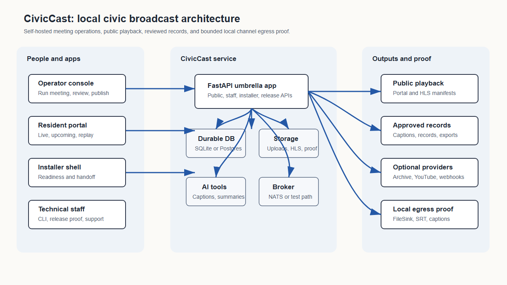
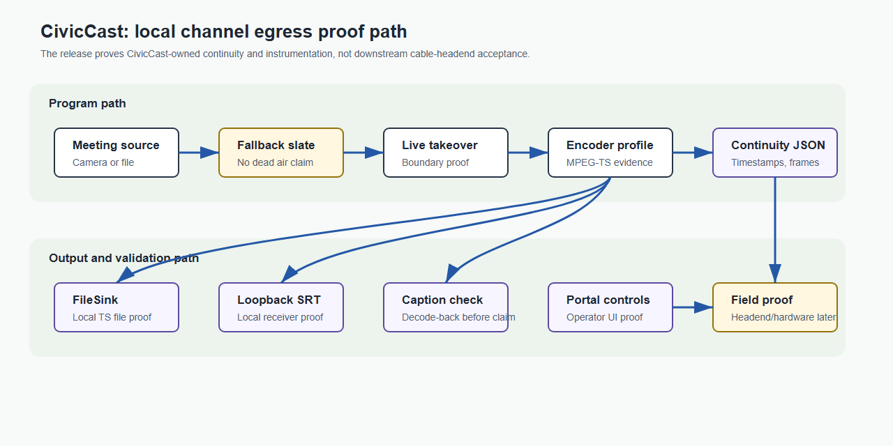

# CivicCast User Manual

CivicCast is open-source, self-hostable civic meeting recording and publication
software. This controlled beta proves a bounded local path: create or
upload recorded media, rehearse that exact sample privately, package it
privately, explicitly approve Portal publication, and play it in the resident
portal. Live ingest, 24/7 station
operation, hardware/headend delivery, external providers, and app stores need
separate integration and field proof.

This manual is one document in three sections, each pitched at a different
reader:

- **Section A — End-User Guide.** For board members, clerks' office staff,
  meeting operators, and anyone who is going to *use* CivicCast without
  needing to maintain it. No jargon. If a technical term is unavoidable, it
  is defined inline.
- **Section B — Technical Reference.** For the IT staff, integrators, and
  ops people who install, configure, monitor, and troubleshoot the station.
  Includes the CLI, the environment-variable surface, the credential store,
  and the role and permission model.
- **Section C — Architecture Reference.** For developers, auditors, and
  technical reviewers. Migration chain, the GStreamer playout engine, the
  three Protocol seams that connect the new modules to capture/publish/
  alerting, the CDN-aware proxy resolver, and pointers into the v3.0 spec
  set.

The source inventory includes software-side PEG
station-in-a-box capabilities plus control-room and virtual media studio beta
work (see
[Comparative Capability Status](#comparative-capability-status) in
Section C). These source capabilities and their lab evidence are not stock
acceptance claims and do not establish station-device, provider, app-store, or
production proof. The rc13 Windows installer is withdrawn after a genuine
clean-host bootstrap failure. Do not install rc13. `v1.0.0-rc18` is the
published controlled beta: its installer is built from the gate-cleared `main`,
Authenticode-signed, and proven on a genuinely clean Windows host through
install, launch, reinstall, uninstall and the rc17 upgrade.



## Who Reads What

| Reader | Start In | Then See |
| --- | --- | --- |
| First-time user / board member / clerk | [Section A](#section-a-end-user-guide) | [Meeting Operator Guide](https://github.com/scottconverse/civiccast-native/blob/main/docs/meeting-operator-guide.md), [Records Clerk Guide](https://github.com/scottconverse/civiccast-native/blob/main/docs/records-clerk-guide.md) |
| Station admin / IT lead | [Section B](#section-b-technical-reference) | [Admin Guide](https://github.com/scottconverse/civiccast-native/blob/main/docs/admin-guide.md), [Technical Operations Reference](https://github.com/scottconverse/civiccast-native/blob/main/docs/technical-ops-reference.md) |
| Developer / integrator / auditor | [Section C](#section-c-architecture-reference) | [docs/spec/3.0/](https://github.com/scottconverse/civiccast-native/tree/main/docs/spec/3.0), [RECONCILIATION.md](https://github.com/scottconverse/civiccast-native/blob/main/docs/spec/3.0/RECONCILIATION.md) |

---

## Section A — End-User Guide {#section-a-end-user-guide}

This section is written for people who do not live in terminals. If you can
operate a meeting, post a flyer to a community board, or upload a video to
a website, you can run CivicCast.

If something here points you to a screen you do not have, ask your IT lead
or station admin. The page they need is in
[Section B — Technical Reference](#section-b-technical-reference).

### What Is CivicCast?

CivicCast's broader source inventory contains work toward the following product
directions. These are not all stock acceptance claims:

- **Integrated live meetings.** With a separately proven server-side media
  probe (the automated check that confirms a live signal is actually
  present before **Start Live Stream** can turn on) and station egress (the
  station's own connection that sends the stream out to viewers), a council
  meeting can stream to residents in real time on the public website, on
  the local cable channel, and (if the station turns it on) through
  station-operated web or OTT endpoints (apps on devices like Roku or Apple
  TV). Publication through commercial app stores requires provider accounts
  and store review and is outside this package.
- **Integrated 24/7 cable operation.** Past meetings, a community-bulletin board,
  and short underwriting spots can be scheduled to fill the channel
  between live events — without anyone in the studio.
- **Publish the record.** The source includes captions, summaries, signed PDF
  transcripts, and chapter markers tied to the meeting agenda. Each station
  must separately prove and configure the optional paths it intends to use.
- **Reach residents who do not watch live.** Subscribers get emails, a
  podcast feed, or app notifications when a new meeting is published.
- **Stay accountable.** Every published recording carries a tamper-evident
  trust stamp (an RFC 3161 timestamp). The signed PDF transcript is a review
  artifact; each jurisdiction decides what constitutes its legal record.

CivicCast runs on your hardware. Stock acceptance keeps the tested media local.
Optional surfaces — Internet Archive mirroring, YouTube simulcast,
emergency-alert ingest — turn on per-station, with the station's own
accounts.

### Your First Beta Workflow

This walkthrough assumes someone has finished the installer and you have
a username and password for the operator console.

> **Beta boundary.** The stock build has no production server-side media probe.
> It shows **Source preview unavailable** and keeps **Start Live Stream**
> disabled. That is the expected safe state, not an installation failure.

1. **Open the operator console.** Your IT lead will tell you the address
   (it usually looks like `https://broadcast.yourtown.gov`). Sign in.

2. **Confirm the live safety state.** Open **Run Meeting** and confirm the room
   says **Source preview unavailable** and does not enable live start.
3. **Create or upload sample recorded media.** Use non-sensitive test content.
4. **Run a private rehearsal.** In **System Health**, choose **Run private
   rehearsal**. CivicCast must report that it copied the exact validated sample,
   created and finalized a private recording, and loaded resident preview.
5. **Validate and package it.** An authorized publish operator or setup
   administrator chooses **Package for playback**. Packaging must remain private.
6. **Verify privacy before approval.** The recording must not appear or play in
   the resident portal yet.
7. **Approve Portal publication.** In **Publish**, select only **Portal** and
   approve it.
8. **Confirm resident playback.** Open the resident portal in a second browser
   and play the approved recording. Unapproved media must remain private.

### Common Operator Questions

**What happens if Wi-Fi drops mid-meeting?** The stock build does not claim automatic
source-drop detection or slate failover (automatically switching to a hold
slide when the video source drops) without a verified media probe and
station-specific egress proof (verified evidence that the station's outbound
stream setup actually works). Follow the station's tested fallback procedure.
Never assume the local recording continued: confirm the recording and finalization
status before publishing.

**Can I trim the start and end of the recording?** The Assets editor is a
scrub-and-metadata editor: it can save trim points and chapters, and it keeps
the original. It does not claim automatic public re-rendering. Package the
asset again after changing trim metadata, then review and publish it.

**Where do captions come from?** CivicCast generates captions
automatically from the meeting audio using a local AI model — your
audio never leaves the station unless you turn on a cloud model in
settings. A records clerk reviews and corrects the captions before
the recording is published.

**How do residents find a recording?** The public website has a
**Browse** page with search and filters. Each recording also has a
shareable link with a copy button. If your station tags recordings by
meeting body (e.g. *City Council*, *Planning Commission*), residents
can filter by that.

**Do I need to upload anything to YouTube or Apple Podcasts myself?** Optional
providers require station credentials, configuration, and separate controlled
proof. The clean-install walkthrough proves Portal-only publication; it
does not claim that YouTube, Internet Archive, podcast directories, or other
external providers are ready for a station.

**How does a recording become public?** In **Assets**, package the validated
recording. Packaging prepares private HLS media but does not publish it. In
**Publish**, approve the **Portal** surface. Only a successful Portal approval
makes the recording metadata and HLS media resident-visible.

**What does the restore rehearsal prove?** The System Health action runs a real,
isolated database restore drill. In the clean-host walkthrough it verified 95 tables
and crash recovery. It does not prove recovery of media, configuration, or
credentials; those require separate station backup and restore procedures.

**How do I send support a bundle from Windows?** In **System Health**, add a
short note, choose **Create support bundle**, then choose **Download support
bundle**. Send the downloaded JSON file and its displayed SHA-256 through the
private beta support channel.

**What if there's an emergency during a meeting?** CivicCast contains optional
EAS (Emergency Alert System) / CAP (Common Alerting Protocol) software
surfaces, but CivicCast does not claim a hardware-certified EAS relay or
station take-over path. Use the station's existing certified emergency
procedure unless that integration has separate field proof. If EAS is not
configured and proven, CivicCast does not interrupt the broadcast.

**The meeting is closed-door — can I still record it without
broadcasting?** Yes. On **Run Meeting**, choose **Record only**
instead of **Live**. The recording is stored privately until staff
publish it.

### When to Ask for Help

Send this to your IT lead, station admin, or open a GitHub issue at
the project's repository:

- The "Run Meeting" page says **Do not broadcast yet** and the yellow
  notice points to a step you do not have access to.
- The live stream shows on the operator console but residents see a
  blank or "stream offline" page on the public website.
- Captions are blank, garbled, or stuck on one line.
- A recording is missing from the **Assets** list after a meeting.
- CivicCast asks for a recovery code and the kit cannot be found.

For routine workflow questions, use the role-specific guides:

### Admin Quick Guide

- [Admin Guide](https://github.com/scottconverse/civiccast-native/blob/main/docs/admin-guide.md) — first install, recovery, backups.

### Meeting Operator Quick Guide

- [Meeting Operator Guide](https://github.com/scottconverse/civiccast-native/blob/main/docs/meeting-operator-guide.md) — night-of-meeting.

### Records Clerk Quick Guide

- [Records Clerk Guide](https://github.com/scottconverse/civiccast-native/blob/main/docs/records-clerk-guide.md) — caption review, publish.
- [Operator Language Guide](https://github.com/scottconverse/civiccast-native/blob/main/docs/operator-language-guide.md) — the words the
  console uses and what they mean.

For a problem the role guides do not cover, the project's GitHub Issues
page is the right place. The Windows installer, operator console, and resident
portal each include a **Report a beta issue** link that opens the project's bug
template. Do not paste passwords, recovery codes, staff tokens, subscriber
lists, private meeting material, or unedited meeting recordings into a bug
report.

---

## Section B — Technical Reference {#section-b-technical-reference}

This section is for the IT staff, integrators, and operators who maintain
the station. It assumes a working knowledge of the shell, environment
variables, and HTTP services.

For deeper command, credential, certificate, storage, model, and
release-proof detail, see
[Technical Operations Reference](https://github.com/scottconverse/civiccast-native/blob/main/docs/technical-ops-reference.md). For the
narrative install procedure on Windows, see
[INSTALL-WINDOWS.md](https://github.com/scottconverse/civiccast-native/blob/main/INSTALL-WINDOWS.md).

### Install And First Boot

The source supports two installation paths. Windows beta use is limited to the
bounded recorded-media workflow while each new signed candidate repeats the
genuine clean-host run first completed by rc14:

1. **Windows installer (controlled beta for testing).** The release `.exe`
   from the GitHub Release page registers a Windows service through the SCM,
   which supervises the control plane, Postgres, NATS, and the media workers
   from a bundled runtime under `C:\Program Files\CivicCast (Native)\`, and
   walks the operator through a recovery-kit and first-admin flow.
   Verify the SHA-256 hash against the release's `.sidecar.json` before
   running it. Do not assume the candidate is signed: compare its actual
   Authenticode status and publisher with the exact approved handoff.
   See [INSTALL-WINDOWS.md](https://github.com/scottconverse/civiccast-native/blob/main/INSTALL-WINDOWS.md).

   Leave at least **5 GB free** for the base installation. Recordings, station
   media, backups, and downloaded caption models require additional storage.

   **Local AI models (rc17 and later).** The local AI models (Ollama summary and
   translation models, roughly 15-20 GB combined) are large; CivicCast
   ensures the same three-tag target set and downloads only the tags still
   missing, automatically in the background after the base install finishes,
   not before, and a slow or failed model download does not block the
   operator console from opening.

2. **Source / `uv` (for developers and integrators).**

   ```bash
   uv sync --all-extras --group dev
   uv run civiccast --version
   uv run civiccast doctor
   uv run uvicorn civiccast.app:app --reload
   ```

   Without `DATABASE_URL`, CivicCast starts in local setup mode and
   prepares installer-managed durable SQLite storage. Set
   `DATABASE_URL` to use Postgres in production.

After install, open the operator console at `http://localhost:8000/operator/`
(or the installer-provided operator handoff URL), confirm **System Health**
is green, save the recovery kit, and run a private first-broadcast
rehearsal before the first public meeting.

### Roles And Permissions

CivicCast has exactly five roles, defined in `civiccast/auth/roles.py`.
Every operator-facing endpoint requires one of them.

| Role | Purpose | Owns |
| --- | --- | --- |
| `setup_admin` | First-install identity. Configures the station, recovery, storage, credentials, providers, and channel settings. | Setup wizard, channel automation, credentials, provider toggles, recovery codes. |
| `meeting_operator` | The person running tonight's meeting. | Run Meeting, preflight, start/stop broadcast, live captions tap. |
| `records_clerk` | Reviews and publishes the public record. | Caption review, summary review, signed-record export, publish approvals, chapter editing. |
| `publish_operator` | Day-to-day program-guide and cable-channel staff. | Program guide, schedule, bulletins, underwriting trafficking, asset metadata. |
| `support_admin` | Diagnostics and support. Can collect a redacted bundle and see system health, but cannot change records or publish. | Support bundles, system-health detail, logs. |

Role aliases (kebab-case and dotted) are accepted by the API but
canonical-cased forms are the ones written to the database. A single
staff member can hold multiple roles.

Staff bearer tokens remain valid until revoked or rotated. Lifecycle-token
secrets are shown once; CivicCast stores a salted PBKDF2 verifier plus a
full-secret SHA-256 fingerprint used only for exact admission after a peer's
failure budget is saturated. Legacy environment tokens remain valid while their
configuration remains active only when they use the current versioned format
from `civiccast token generate-env`. Headless callers
(CI, the egress worker, cable packaging scripts) authenticate via
`CIVICCAST_STAFF_TOKENS` or the per-token store managed through
`civiccast token ...` subcommands.

### Environment Variables

The exhaustive list of `CIVICCAST_*` variables CivicCast reads is below.
Defaults are documented in the source comment of the consuming module.
None of these are required for a default Windows installer flow — the
installer writes a configuration file with the defaults that a typical
station needs.

#### Identity, storage, and first-run

- **`CIVICCAST_STATION_ID`** — Short station identifier used in evidence files and headend handoff.
- **`CIVICCAST_STATION_TZ`** — IANA timezone (e.g. `America/New_York`) for schedules and as-run reports. Optional override: normally the service reads the timezone the operator chose during first-admin setup (persisted in the local station-state file); set this only to force a different zone without re-running setup.
- **`CIVICCAST_ROOT`** — Override for the durable-data root. Default: the installer-managed path.
- **`CIVICCAST_CONFIG_DIR`** — Config-file root. Default: under `CIVICCAST_ROOT`.
- **`CIVICCAST_MANAGED_STORAGE_DIR`** — Where SQLite durable storage lives when no `DATABASE_URL` is set.
- **`CIVICCAST_BACKUP_DIR`** — Managed backup target used by installer backup
  verification and disaster-recovery workflows.
- **`CIVICCAST_UPLOAD_DIR`** — Operator and contributor upload landing.
- **`CIVICCAST_UPLOAD_MAX_BYTES`** — Per-upload cap.
- **`CIVICCAST_EVIDENCE_DIR`** — Where proof artifacts (continuity proof, soak logs) are written.
- **`CIVICCAST_VERSION`** — Reported and update-checked version pins.
- **`CIVICCAST_AVAILABLE_VERSION`** — Reported and update-checked version pins.
- **`CIVICCAST_SETUP_NONCE`** — First-run protection for the setup wizard.
- **`CIVICCAST_REQUIRE_SETUP_NONCE`** — First-run protection for the setup wizard.
- **`CIVICCAST_ALLOW_FIRST_ADMIN_RESET`** — Permit a setup_admin reset after first-admin loss.
- **`CIVICCAST_ALLOW_EPHEMERAL_STORES`** — Permit in-memory stores. **Tests only.**
- **`CIVICCAST_ALLOW_INSECURE_MANIFEST`** — Permit an unsigned install manifest. **Tests only.**

#### Staff identity and tokens

- **`CIVICCAST_STAFF_TOKENS`** — Semicolon-separated `token:operator_id:display_name:role[,role...]` entries for explicit headless or recovery compatibility. Roles are required; generate each versioned random bearer secret with `civiccast token generate-env`. Prefer lifecycle tokens for routine operation.
- **`CIVICCAST_STAFF_TOKENS_FALLBACK_WITH_DB`** — Allow the env-var tokens to coexist with DB-issued ones.
- **`CIVICCAST_ALLOW_DETERMINISTIC_STAFF_TOKEN`** — Use deterministic or short fixture tokens. **Tests only; never enable at a station.**
- **`CIVICCAST_AUTH_ACK`** — Acknowledgement gate for the auth subsystem on first run.
- **`CIVICCAST_AUTH_RATE_LIMIT`** — Failed-authentication budget. Default: `10`. Setup uses peer-plus-route keys; staff bearer auth uses one observed-peer key across all staff routes. Valid staff tokens do not count.
- **`CIVICCAST_AUTH_RATE_LIMIT_WINDOW_SECONDS`** — Sliding failure-window duration in seconds. Default: `60`.
- **`CIVICCAST_REAL_BOUNDARY_TOKEN_FILE`** — File holding the "real provider" enable token (prevents accidental live calls).

#### Channel egress, GStreamer engine, automation

- **`CIVICCAST_EGRESS_ENGINE`** — `gstreamer` (default, S15) or `ffmpeg-concat` (legacy fallback).
- **`CIVICCAST_EGRESS_WORK_DIR`** — Per-channel temporary directory for egress plans.
- **`CIVICCAST_EGRESS_EMBED_CAPTIONS`** — Attempts the native GStreamer caption-SEI path when the required GStreamer elements are available. The Windows installer stages the CivicCast-bundled private GStreamer runtime under the install root's `runtime\dependencies\gstreamer` and verifies `cccombiner`, `ccconverter`, `h264ccinserter`, and `tttocea608` with the bundled `gst-inspect-1.0.exe`; if any required element remains unavailable, setup stops with an explicit native caption-SEI runtime error instead of claiming the embed path is ready.
- **`CIVICCAST_GST_ALLOW_HARDWARE_DECODE`** — Optional expert override. By default, the GStreamer worker demotes GPU H.264/H.265 decoders so live UDP/SRT decode stays in system memory before the CPU conform/encode chain. Set to `1` only when the station has validated its hardware decode path end-to-end.
- **`CIVICCAST_CHANNEL_AUTOMATION`** — Enable the channel automation driver and its poll cadence.
- **`CIVICCAST_CHANNEL_AUTOMATION_POLL_SECONDS`** — Enable the channel automation driver and its poll cadence.
- **`CIVICCAST_AUTOSCHEDULE`** — Enable the S19 query-driven autoscheduler worker.
- **`CIVICCAST_PROGRAM_LOG_WORKER`** — Program-log materializer cadence.
- **`CIVICCAST_PROGRAM_LOG_POLL_SECONDS`** — Program-log materializer cadence.
- **`CIVICCAST_PROGRAM_LOG_HORIZON_HOURS`** — Program-log materializer cadence.
- **`CIVICCAST_FINALIZATION_WORKER`** — Recording-to-asset finalizer (S7) controls.
- **`CIVICCAST_FINALIZATION_POLL_SECONDS`** — Recording-to-asset finalizer (S7) controls.
- **`CIVICCAST_FINALIZATION_MAX_ATTEMPTS`** — Recording-to-asset finalizer (S7) controls.
- **`CIVICCAST_FINALIZATION_BACKOFF_SECONDS`** — Recording-to-asset finalizer (S7) controls.
- **`CIVICCAST_FINALIZATION_SETTLE_SECONDS`** — Recording-to-asset finalizer (S7) controls.
- **`CIVICCAST_FINALIZATION_NEVER_APPEARED_SECONDS`** — Recording-to-asset finalizer (S7) controls.
- **`CIVICCAST_FINALIZATION_RUNNING_LEASE_SECONDS`** — Recording-to-asset finalizer (S7) controls.
- **`CIVICCAST_RETENTION_WORKER`** — Retention worker controls.
- **`CIVICCAST_RETENTION_POLL_SECONDS`** — Retention worker controls.
- **`CIVICCAST_BULLETIN_EXPIRY`** — CG bulletin expiry worker.
- **`CIVICCAST_RELOAD_TIMEOUT_S`** — Worker-supervision timeouts.
- **`CIVICCAST_STALL_TIMEOUT_S`** — Worker-supervision timeouts.

#### Captions, EAS, alerting

- **`CIVICCAST_CAPTION_TAP`** — Live caption tap configuration.
- **`CIVICCAST_CAPTION_TAP_DIR`** — Live caption tap configuration.
- **`CIVICCAST_CAPTION_TAP_POLL_SECONDS`** — Live caption tap configuration.
- **`CIVICCAST_CAPTION_TAP_SEGMENT_SECONDS`** — Live caption tap configuration.
- **`CIVICCAST_CAPTION_FEED_POLL_SECONDS`** — Caption feed and decode-back proof cadence.
- **`CIVICCAST_CAPTION_PROOF_POLL_SECONDS`** — Caption feed and decode-back proof cadence.
- **`CIVICCAST_EAS`** — EAS subsystem on/off and surface cadence.
- **`CIVICCAST_EAS_AUTO_SURFACE`** — EAS subsystem on/off and surface cadence.
- **`CIVICCAST_EAS_POLL_SECONDS`** — EAS subsystem on/off and surface cadence.
- **`CIVICCAST_ALERTING`** — Master switch for the operational alerting service.
- **`CIVICCAST_ALERT_CREDENTIALS_FILE`** — JSON file holding Twilio SMS credentials.
- **`CIVICCAST_EVENTS`** — Event-bus on/off.

#### CDN, public base URL, trusted proxies

- **`CIVICCAST_PUBLIC_BASE_URL`** — The URL residents see (`https://broadcast.town.gov`).
- **`CIVICCAST_LIVE_MANIFEST_BASE_URL`** — Override for the live-stream manifest base.
- **`CIVICCAST_CDN_PROVIDER`** — `bunny`, `cloudflare`, or `cloudflare_r2`. Wires the trusted-proxy resolver to the provider's edge CIDRs.
- **`CIVICCAST_CDN_STUB_ROOT`** — Local stub directory for CDN dry-run testing.
- **`CIVICCAST_TRUSTED_PROXY_CIDRS`** — Explicit comma-separated CIDR list, unioned with the provider preset.
- **`CIVICCAST_TRUST_PRIVATE_PROXIES`** — Default `false`. When `false`, an `X-Forwarded-For` header is honored only from a proxy in `CIVICCAST_TRUSTED_PROXY_CIDRS`, so a direct caller cannot spoof its source address. Set `true` only when the station genuinely sits behind a trusted RFC1918/loopback reverse proxy that sets the header itself.
- **`CIVICCAST_BUNNY_STORAGE_ZONE`** — BunnyCDN credentials and hostname.
- **`CIVICCAST_BUNNY_ACCESS_KEY`** — BunnyCDN credentials and hostname.
- **`CIVICCAST_BUNNY_CDN_HOSTNAME`** — BunnyCDN credentials and hostname.
- **`CIVICCAST_R2_ACCOUNT_ID`** — Cloudflare R2 origin credentials.
- **`CIVICCAST_R2_ACCESS_KEY_ID`** — Cloudflare R2 origin credentials.
- **`CIVICCAST_R2_SECRET_ACCESS_KEY`** — Cloudflare R2 origin credentials.
- **`CIVICCAST_R2_BUCKET`** — Cloudflare R2 origin credentials.
- **`CIVICCAST_R2_PUBLIC_BASE_URL`** — Cloudflare R2 origin credentials.

#### TSA / records / RFC 3161

- **`CIVICCAST_TSA_ENABLE`** — Enable RFC 3161 timestamp signing on signed records.
- **`CIVICCAST_TSA_URL`** — TSA endpoint URL. Default: FreeTSA (`https://freetsa.org/tsr`).
- **`CIVICCAST_TSA_POLICY_OID`** — Optional policy OID to assert in the TSA request.
- **`CIVICCAST_VERAPDF_ARTIFACT_DIR`** — veraPDF artifact directory for the signed-record export proof.

#### Providers (publish, archive, syndicate)

These are set per kind. The default for every kind is the deterministic
mock; set the per-kind variable to `real` and supply credentials to use
the real adapter.

- **`CIVICCAST_PROVIDER_INTERNET_ARCHIVE`** — `mock` (default) or `real`.
- **`CIVICCAST_PROVIDER_YOUTUBE`** — `mock` (default) or `real`.
- **`CIVICCAST_PROVIDER_MAIL`** — `mock` (default) or `real`.
- **`CIVICCAST_PROVIDER_WEBHOOK`** — `mock` (default) or `real`.
- **`CIVICCAST_PROVIDER_LOCAL_NAS`** — `mock` (default) or `real`.
- **`CIVICCAST_PROVIDER_API_KEY`** — Provider credential bundle.
- **`CIVICCAST_PROVIDER_CREDENTIALS_FILE`** — Provider credential bundle.
- **`CIVICCAST_PROVIDER_PROOFS_FILE`** — Provider credential bundle.
- **`CIVICCAST_IA_ACCESS_KEY`** — Internet Archive S3-like credentials.
- **`CIVICCAST_IA_SECRET_KEY`** — Internet Archive S3-like credentials.
- **`CIVICCAST_IA_COLLECTION`** — Internet Archive S3-like credentials.
- **`CIVICCAST_IA_ITEM_PREFIX`** — Internet Archive S3-like credentials.
- **`CIVICCAST_IA_ACCESS_VALUE`** — Internet Archive S3-like credentials.
- **`CIVICCAST_INTERNET_ARCHIVE_ACCESS_KEY`** — Internet Archive S3-like credentials.
- **`CIVICCAST_YOUTUBE_CLIENT_ID`** — YouTube OAuth credentials and upload defaults.
- **`CIVICCAST_YOUTUBE_CLIENT_SECRET`** — YouTube OAuth credentials and upload defaults.
- **`CIVICCAST_YOUTUBE_REFRESH_TOKEN`** — YouTube OAuth credentials and upload defaults.
- **`CIVICCAST_YOUTUBE_REFRESH_VALUE`** — YouTube OAuth credentials and upload defaults.
- **`CIVICCAST_YOUTUBE_PRIVACY`** — YouTube OAuth credentials and upload defaults.
- **`CIVICCAST_YOUTUBE_MEDIA_ROOT`** — YouTube OAuth credentials and upload defaults.
- **`CIVICCAST_SMTP_HOST`** — SMTP for the email subscriber adapter.
- **`CIVICCAST_SMTP_PORT`** — SMTP for the email subscriber adapter.
- **`CIVICCAST_SMTP_USERNAME`** — SMTP for the email subscriber adapter.
- **`CIVICCAST_SMTP_PASSWORD`** — SMTP for the email subscriber adapter.
- **`CIVICCAST_SMTP_STARTTLS`** — SMTP for the email subscriber adapter.
- **`CIVICCAST_SMTP_FROM`** — SMTP for the email subscriber adapter.
- **`CIVICCAST_EMAIL_FROM`** — SMTP for the email subscriber adapter.
- **`CIVICCAST_EMAIL_SMTP_URL`** — SMTP for the email subscriber adapter.
- **`CIVICCAST_NAS_TARGET`** — Local NAS archive target.
- **`CIVICCAST_NAS_ARCHIVE_PATH`** — Local NAS archive target.

#### Subscribe (email + webhook)

- **`CIVICCAST_SUBSCRIBE_TOKEN_SECRET`**\
  HMAC secret for magic-link confirmation tokens.
- **`CIVICCAST_SUBSCRIBE_ENCRYPTION_KEY`**\
  Encryption key for subscriber records at rest.
- **`CIVICCAST_SUBSCRIBE_LEGACY_ENCRYPTION_KEYS`**\
  Rotation helpers for older secrets.
- **`CIVICCAST_SUBSCRIBE_LEGACY_TOKEN_SECRETS`**\
  Rotation helpers for older secrets.
- **`CIVICCAST_SUBSCRIBE_ACCEPT_V08_LEGACY_SECRETS`**\
  Rotation helpers for older secrets.
- **`CIVICCAST_SUBSCRIBE_SECRETS_FILE`**\
  File-backed alternative to the env-var secret.
- **`CIVICCAST_SUBSCRIBE_RATE_LIMIT`**\
  Subscribe form rate limiting.
- **`CIVICCAST_SUBSCRIBE_RATE_LIMIT_WINDOW_SECONDS`**\
  Subscribe form rate limiting.
- **`CIVICCAST_SUBSCRIBER_WEBHOOK_SECRET`**\
  Webhook signature secret.
- **`CIVICCAST_WEBHOOK_SIGNING_VALUE`**\
  Webhook signature secret.
- **`CIVICCAST_WEBHOOK_RETRY_WORKER`**\
  Webhook retry worker controls.
- **`CIVICCAST_WEBHOOK_RETRY_BACKOFF_SECONDS`**\
  Webhook retry worker controls.
- **`CIVICCAST_WEBHOOK_RETRY_MAX_ATTEMPTS`**\
  Webhook retry worker controls.
- **`CIVICCAST_WEBHOOK_RETRY_POLL_SECONDS`**\
  Webhook retry worker controls.
- **`CIVICCAST_WEBHOOK_TIMEOUT_SECONDS`**\
  Webhook retry worker controls.

`CIVICCAST_ALLOW_DETERMINISTIC_SUBSCRIBE_SECRETS` enables deterministic test
secrets. It is for tests only and must never be enabled at a station.

#### Analytics

- **`CIVICCAST_PUBLIC_ANALYTICS_KEY`** — Public key the resident-portal beacon uses.
- **`CIVICCAST_PUBLIC_ANALYTICS_ALLOWED_ORIGINS`** — Analytics ingestion controls.
- **`CIVICCAST_PUBLIC_ANALYTICS_RATE_LIMIT_PER_MINUTE`** — Analytics ingestion controls.
- **`CIVICCAST_TRUSTED_ANALYTICS_RATE_LIMIT_PER_MINUTE`** — Analytics ingestion controls.
- **`CIVICCAST_ANALYTICS_RATE_LIMIT_MAX_BUCKETS`** — Analytics ingestion controls.
- **`CIVICCAST_ANALYTICS_RETENTION_DAYS`** — Days to keep raw analytics events.
- **`CIVICCAST_ANALYTICS_TRUSTED_PROXY_CIDRS`** — Analytics-specific trusted-proxy CIDRs.

#### ActivityPub federation

- **`CIVICCAST_ACTIVITYPUB_MODE`** — `off`, `lab`, or `live`.
- **`CIVICCAST_ACTIVITYPUB_BASE_URL`** — Identity.
- **`CIVICCAST_ACTIVITYPUB_HANDLE`** — Identity.
- **`CIVICCAST_ACTIVITYPUB_DISPLAY_NAME`** — Identity.
- **`CIVICCAST_ACTIVITYPUB_PRIVATE_KEY_PATH`** — HTTP-signature keypair.
- **`CIVICCAST_ACTIVITYPUB_PUBLIC_KEY_PEM`** — HTTP-signature keypair.
- **`CIVICCAST_ACTIVITYPUB_ALLOWLIST`** — Federation domain filters.
- **`CIVICCAST_ACTIVITYPUB_ALLOWLIST_FILE`** — Federation domain filters.
- **`CIVICCAST_ACTIVITYPUB_BLOCKLIST`** — Federation domain filters.
- **`CIVICCAST_ACTIVITYPUB_BLOCKLIST_FILE`** — Federation domain filters.
- **`CIVICCAST_ACTIVITYPUB_AUTHORIZED_FETCH`** — Strict fetch mode and lab-loopback override.
- **`CIVICCAST_ACTIVITYPUB_LAB_ALLOW_LOCAL`** — Strict fetch mode and lab-loopback override.
- **`CIVICCAST_ACTIVITYPUB_INBOX_RATE_LIMIT`** — Retry and rate-limit controls.
- **`CIVICCAST_ACTIVITYPUB_INBOX_RATE_WINDOW_SECONDS`** — Retry and rate-limit controls.
- **`CIVICCAST_ACTIVITYPUB_RETRY_WORKER`** — Retry and rate-limit controls.
- **`CIVICCAST_ACTIVITYPUB_RETRY_BACKOFF_SECONDS`** — Retry and rate-limit controls.
- **`CIVICCAST_ACTIVITYPUB_RETRY_MAX_ATTEMPTS`** — Retry and rate-limit controls.
- **`CIVICCAST_ACTIVITYPUB_RETRY_POLL_SECONDS`** — Retry and rate-limit controls.

#### Headend handoff: NDI, SDI, TSDuck

- **`CIVICCAST_NDI_RELAY`** — NDI output relay configuration.
- **`CIVICCAST_NDI_SENDER`** — NDI output relay configuration.
- **`CIVICCAST_NDI_FFMPEG`** — NDI output relay configuration.
- **`CIVICCAST_NDI_RUNTIME_DIR`** — NDI output relay configuration.
- **`CIVICCAST_SDI_RELAY`** — SDI output relay (descoped from 3.0 default but available).
- **`CIVICCAST_SDI_FFMPEG`** — SDI output relay (descoped from 3.0 default but available).
- **`CIVICCAST_TSDUCK_HOME`** — TSDuck compliance-probe toolchain. CivicCast fetches and installs a pinned, checksum-verified TSDuck portable build into a contained per-user directory on demand (no admin rights, no system installer) and verifies `tsp --version` before setup can claim the runtime is ready.
- **`CIVICCAST_TSDUCK_PATH`** — TSDuck compliance-probe toolchain. CivicCast fetches and installs a pinned, checksum-verified TSDuck portable build into a contained per-user directory on demand (no admin rights, no system installer) and verifies `tsp --version` before setup can claim the runtime is ready.
- **`CIVICCAST_TSDUCK_RCVBUF_BYTES`** — TSDuck compliance-probe toolchain. CivicCast fetches and installs a pinned, checksum-verified TSDuck portable build into a contained per-user directory on demand (no admin rights, no system installer) and verifies `tsp --version` before setup can claim the runtime is ready.
- **`CIVICCAST_TSDUCK_NETWORK_TESTS`** — TSDuck compliance-probe toolchain. CivicCast fetches and installs a pinned, checksum-verified TSDuck portable build into a contained per-user directory on demand (no admin rights, no system installer) and verifies `tsp --version` before setup can claim the runtime is ready.
- **`CIVICCAST_CABLE_PACKAGE_OUTPUT_DIR`** — Cable file-package output.
- **`CIVICCAST_CABLE_CAPTIONS_DIR`** — Cable file-package output.

#### Remote contribution & production control room

- **`CIVICCAST_REMOTE_CONTRIBUTION`**\
  S17 VDO.Ninja guest-input service.
- **`CIVICCAST_REMOTE_CONTRIBUTION_HOME`**\
  S17 VDO.Ninja guest-input service.
- **`CIVICCAST_REMOTE_CONTRIBUTION_POLL`**\
  S17 VDO.Ninja guest-input service.
- **`CIVICCAST_REMOTE_CONTRIBUTION_VDO_URL`**\
  S17 VDO.Ninja guest-input service.
- **`CIVICCAST_CONTRIBUTOR_STORE_PATH`**\
  Contributor record store and upload landing.
- **`CIVICCAST_CONTRIBUTOR_UPLOAD_DIR`**\
  Contributor record store and upload landing.
- **`CIVICCAST_TURN_HOST`** / **`CIVICCAST_TURN_PORT`**\
  The TURN server guests connect through to punch out from behind NAT. coturn
  has no native Windows build, so on Windows CivicCast does **not** run a
  local coturn process: point these two variables at a **documented external
  TURN server** — a coturn instance on a separate Linux/BSD host, or a
  managed TURN provider — and leave `CIVICCAST_COTURN_COMMAND` unset. The
  operator console's Remote Contribution screen (Diagnostics drawer,
  support_admin role) shows the currently-configured host/port, a **Test TURN
  connectivity** button that probes it right now, and the same guidance text
  under "How to point this station at coturn." On Linux/macOS these still
  work the same way if you'd rather point at an external server than run
  coturn locally.
- **`CIVICCAST_COTURN_COMMAND`**\
  Linux/macOS only — the local coturn launch command, if you're running
  coturn on the station itself rather than pointing at an external server
  (see `CIVICCAST_TURN_HOST` above). Leave unset on Windows; there is no
  native Windows build.
- **`CIVICCAST_VDO_COMMAND`**\
  TURN/VDO co-process commands.
- **`CIVICCAST_CONTROL_ROOM_TSR_URL`**\
  S16 production-control-room TSR endpoint.
- **`CIVICCAST_TSR_PORT`**\
  S16 production-control-room TSR endpoint.
- **`CIVICCAST_TSR_NO_LISTEN`**\
  S16 production-control-room TSR endpoint.
- **`CIVICCAST_PORTAL_BASE`**\
  Resident portal URL handles.
- **`CIVICCAST_PORTAL_TOKEN`**\
  Resident portal URL handles.
- **`CIVICCAST_RESIDENT_PORTAL_URL`**\
  Resident portal URL handles.

#### AI model dispatch

- **`CIVICCAST_OLLAMA_BASE_URL`** — Local Ollama endpoint for the on-station model tier.
- **`CIVICCAST_PROVIDER_API_KEY`** — Cloud-provider key for Ollama Cloud or OpenRouter. (Prefer the keyring path: `civiccast model set-provider-key`.)

#### Platform broker (event bus)

- **`CIVICCAST_BROKER_MODE`** — `process` (default) or `nats`.
- **`CIVICCAST_NATS_URL`** — NATS connection.
- **`CIVICCAST_NATS_STREAM`** — NATS connection.
- **`CIVICCAST_NATS_DURABLE`** — NATS connection.
- **`CIVICCAST_NATS_CA_FILE`** — NATS connection.
- **`CIVICCAST_NATS_CLIENT_CERT_FILE`** — NATS connection.
- **`CIVICCAST_NATS_CLIENT_KEY_FILE`** — NATS connection.

#### Diagnostics and overrides

- **`CIVICCAST_OPERATOR_CONSOLE_DIST`** — Override the prebuilt frontend bundles.
- **`CIVICCAST_OPERATOR_CONSOLE_URL`** — Override the prebuilt frontend bundles.
- **`CIVICCAST_PUBLIC_PORTAL_DIST`** — Override the prebuilt frontend bundles.
- **`CIVICCAST_APP_BUILD_ARTIFACTS_DIR`** — OTT app-build orchestrator paths.
- **`CIVICCAST_APP_BUILD_STORE_PATH`** — OTT app-build orchestrator paths.
- **`CIVICCAST_APP_PLATFORM_CONFIG_PATH`** — OTT app-build orchestrator paths.
- **`CIVICCAST_CERT_ROOT`** — Local-CA service-cert root override.
- **`CIVICCAST_REQUIRE_FCC_ACK`** — Require an FCC-rule acknowledgement before EAS surfaces.
- **`CIVICCAST_ROLLBACK_ARTIFACT_PATH`** — Path to a rollback artifact.
- **`CIVICCAST_TESTER_AVAILABLE_VERSION`** — Tester-rig overrides; rarely used in production.
- **`CIVICCAST_TESTER_OPS_STATE_PATH`** — Tester-rig overrides; rarely used in production.
- **`CIVICCAST_PLAYBACK_POLICY_STATE_PATH`** — Tester-rig overrides; rarely used in production.
- **`CIVICCAST_STATION_STATE_PATH`** — Tester-rig overrides; rarely used in production.
- **`CIVICCAST_SUPPORT_BUNDLE_DIR`** — Tester-rig overrides; rarely used in production.
- **`CIVICCAST_RUN_POSTGRES_TESTS`** — Run Postgres-only test suites against an external server.

### Credential Store

Three families of credentials are kept in a dedicated store rather than
environment variables so a station can rotate them without restarting
the service.

| Subsystem | Credential | Stored As | Configuration |
| --- | --- | --- | --- |
| Alerting (Twilio SMS) | account SID, auth token, sender number | JSON file referenced by `CIVICCAST_ALERT_CREDENTIALS_FILE`, with file-mode enforcement on POSIX hosts | Set the path env var, write the JSON, restart. |
| Subscription paywall (Stripe) | publishable key, secret key, webhook signing secret | Paywall service secret store; never written to logs | Configured in the operator console under *Settings → Paywall*. Default off (S26, V1.x). |
| RFC 3161 TSA | endpoint URL, optional policy OID | `CIVICCAST_TSA_URL` and `CIVICCAST_TSA_POLICY_OID` | FreeTSA is the default; bring your own TSA in production. |
| Cloud AI providers | per-provider API key | OS keyring, via `civiccast model set-provider-key` | Keys are write-only — never echoed back. |

The store never logs a credential. The most an operator sees is a
*stored / not-stored* line and a credential reference label.

### CLI Reference

`civiccast` is a Typer-based CLI. Most operators rarely need it — the
operator console is the day-to-day surface — but integrators and
on-call use it heavily.

```text
civiccast --version
civiccast doctor [--json] [--disk PATH]

civiccast installer plan \
    [--profile public-meetings] [--recommended-tier tier-1]
civiccast installer health-check [--profile public-meetings]
civiccast installer platform-plan [--os-family linux|macos]
    # Generic Linux/macOS bootstrap planning only. Windows deployment
    # readiness is decided separately by the native station's own
    # activation state (civiccast.installer.service), not this plan.
civiccast installer verify-package --artifact PATH --sidecar PATH
civiccast installer summary
civiccast installer beta-handoff \
    [--release-manifest PATH] [--clean-windows-evidence PATH]

civiccast model download [--offline-bundle --bundle-dir PATH] \
    [--profile NAME] [--dry-run]
civiccast model state
civiccast model import-offline --bundle-dir PATH \
    --expected file=sha256 [--expected ...]
civiccast model set-provider-key ollama-cloud|openrouter \
    [--key SECRET] [--clear]

civiccast cert rotate IDENTITY

civiccast token …               (managed by the operator console; see /api/tokens)

civiccast cable package --asset-id ID --title T --media F \
    --captions F --output-dir D
civiccast cable ndi-check
civiccast cable ndi-plan --media F --ndi-name N \
    [--muxer libndi_newtek]

civiccast activitypub …         (key + config helpers; see civiccast/activitypub/)

civiccast egress run --channel-id CH [--work-dir D] \
    [--poll-seconds 2] [--once]
civiccast egress verify --channel-id CH [--seconds 10]
civiccast egress recovery-proof --channel-id CH \
    --measured-seconds N …
civiccast egress continuity-proof --source-plan-json J \
    --config-json J \
    --output-path F
civiccast egress srt-continuity-proof \
    --source-plan-json J --config-json J \
    --sender-url U --receiver-url U \
    --receiver-output-path F
civiccast egress caption-decode-proof --channel-id CH …
civiccast egress trim-health [--older-than-days 30] [--dry-run]

civiccast live-takeover …       (cut a channel to a live source and return it)
```

Every subcommand supports `--json` for machine-readable output. Long-running
ones (`civiccast egress run`) respond to SIGTERM and SIGINT cleanly.

Headless callers should authenticate via `CIVICCAST_STAFF_TOKENS` rather
than passing tokens on the command line. Recovery codes, provider keys,
and Stripe secrets must never appear on a command line in production.

### Troubleshooting Matrix

| Symptom | First Check | Then |
| --- | --- | --- |
| Operator console shows **Do not broadcast yet**. | Open System Health. Read each not-ready row. | The line points to the next action (Setup → Storage, Setup → Credentials, etc.). |
| Live stream visible on operator console, blank on the public website. | `CIVICCAST_PUBLIC_BASE_URL` matches what residents actually load. | Confirm `CIVICCAST_CDN_PROVIDER` and `CIVICCAST_TRUSTED_PROXY_CIDRS` if the station is behind BunnyCDN / Cloudflare. |
| Captions empty or stuck. | `civiccast doctor` — confirm CPU/RAM tier; `CIVICCAST_OLLAMA_BASE_URL` reachable. | Look in the caption-tap directory (`CIVICCAST_CAPTION_TAP_DIR`) for stale segments. |
| Recording missing after a meeting. | `civiccast egress run --once --channel-id CH` for a snapshot of the egress worker state. | Check the recording finalizer worker (`CIVICCAST_FINALIZATION_WORKER`) and its logs. |
| Twilio SMS alerts not firing. | `CIVICCAST_ALERTING=true`; `CIVICCAST_ALERT_CREDENTIALS_FILE` points at a readable JSON. | Run an alert self-test from the operator console (System Health → Alerting). |
| EAS surface stuck on **needs FCC ack**. | Confirm the FCC acknowledgement is enabled and recorded in setup. | Re-open the EAS settings screen and confirm. |
| Trim re-render never finishes. | Recording finalizer worker is running. | Inspect the `civiccast/live/finalization_worker` logs for the asset id. |
| Behind a CDN, source-IP filters block legitimate residents. | `CIVICCAST_CDN_PROVIDER` is set and the preset is current. | Add explicit CIDRs in `CIVICCAST_TRUSTED_PROXY_CIDRS`. |
| `civiccast doctor` reports a tier below what the box should provide. | `--disk` points at the durable-storage volume. | Re-run with the explicit `--disk` argument. |
| Cloud AI key looks set but dispatch is offline. | `civiccast model set-provider-key PROVIDER` — confirm *stored*. | Re-check that the model the operator picked is supported by the saved provider. |

For deeper trouble — TSDuck failures, GStreamer decode-back proofs,
veraPDF validation, certificate rotation, mTLS — see
[Technical Operations Reference](https://github.com/scottconverse/civiccast-native/blob/main/docs/technical-ops-reference.md).

The Windows installer provisions the native beta runtime directly on the
host, under the bundled runtime tree at
`C:\Program Files\CivicCast (Native)\runtime\`: Python, FFmpeg/FFprobe, the
CivicCast-bundled private GStreamer runtime with the caption-SEI elements,
and Faster Whisper. TSDuck for cable verification is fetched and verified
on demand into a contained per-user directory when cable verification is
enabled — no admin rights, no system installer. NDI runtime/SDK, DeckLink
hardware/drivers, app-store provider accounts, and live station headend
equipment remain operator/provider supplied.

**Local AI provisioning (rc17 and later).** CivicCast also provisions the local Ollama runtime for
on-station AI (reusing a healthy existing install if one is already present
and installing a pinned version only when Ollama is absent), then ensures the
same three-tag target set of standard summary and translation models,
downloading only the tags still missing, in the background after the
operator console is already reachable; a model-download failure is reported
honestly without blocking the rest of the install.

### Cross-references

- [Admin Guide](https://github.com/scottconverse/civiccast-native/blob/main/docs/admin-guide.md) — first install, recovery, backups.
- [Meeting Operator Guide](https://github.com/scottconverse/civiccast-native/blob/main/docs/meeting-operator-guide.md) — night-of-meeting.
- [Records Clerk Guide](https://github.com/scottconverse/civiccast-native/blob/main/docs/records-clerk-guide.md) — caption review, publish.
- [Technical Operations Reference](https://github.com/scottconverse/civiccast-native/blob/main/docs/technical-ops-reference.md) — exact
  commands, certificate operations, release proofs.
- [Operator Language Guide](https://github.com/scottconverse/civiccast-native/blob/main/docs/operator-language-guide.md) — UI vocabulary.
- [Channel Egress Operator And Tester Runbook](https://github.com/scottconverse/civiccast-native/blob/main/docs/ops/channel-egress-runbook.md).
- [Windows Release Trust And Verification](https://github.com/scottconverse/civiccast-native/blob/main/docs/install/windows-release-trust.md).

---

## Section C — Architecture Reference {#section-c-architecture-reference}

This section is for developers, integrators, and external auditors who
need to understand the source architecture and its relationship to the CivicCast
3.0 station-in-a-box specification. Every claim below
cross-references a spec section or a concrete module path.

The canonical specification is at
[docs/spec/3.0/civiccast-3.0-station-in-a-box-MASTER.md](https://github.com/scottconverse/civiccast-native/blob/main/docs/spec/3.0/civiccast-3.0-station-in-a-box-MASTER.md).
The repo-verified per-section status manifest is at
[docs/spec/3.0/ROADMAP.status.yaml](https://github.com/scottconverse/civiccast-native/blob/main/docs/spec/3.0/ROADMAP.status.yaml). The
migration-chain reconciliation history is at
[docs/spec/3.0/RECONCILIATION.md](https://github.com/scottconverse/civiccast-native/blob/main/docs/spec/3.0/RECONCILIATION.md).



### Subsystems And Module Layout

```
civiccast/
├── app.py                   FastAPI umbrella
├── cli.py                   Typer CLI (Section B)
├── auth/                    Identity, roles, staff tokens
├── installer/               Commissioning wizard (S3), first-boot
├── egress/                  Channel egress; gst/ = S15 engine
│   ├── gst/engine.py            GstPlayoutEngine
│   └── service.py               Egress daemon + supervisor (S9)
├── facility/                Commit-to-Air (S4) + force matrix (S5)
├── cg/                      CG bulletin board (S6)
├── schedule/                Programlog, autoschedule (S7, S19)
├── live/                    Live meeting + finalization (S7 finalizer)
├── recording/               Scheduled recording (S21)
├── metadata/                Custom fields (S22)
├── reporting/               As-run + EPG + franchise (S23)
├── underwriting/            Spot management + affidavits (S24)
├── agenda/                  Meeting agenda + chapters (S25)
├── paywall/                 Subscription paywall (S26, default off)
├── alerting/                Health + Twilio SMS (S8)
├── eas/                     Public-safety surface (S11)
├── captions/                Live caption tap (S11)
├── records/                 Signed PDF + RFC 3161 (S7 + records lane)
├── analytics/               Resident-portal beacons + audience reports (S14)
├── ai_models/               Operator-chosen model dispatch (S13)
├── app_platform/            OTT build orchestration (S12)
├── apps/ott-native/         Native source for 6 OTT targets (S12 D1 closed)
├── control_room/            TSR over OBS/vMix/ATEM (S16, optional)
├── live/contribution/       VDO.Ninja remote guests (S17, optional)
├── archive/                 Internet Archive + local NAS
├── syndicate/               YouTube
├── subscribe/               Email + webhook subscribers
├── activitypub/             ActivityPub federation
├── stream/cdn/              BunnyCDN / Cloudflare R2 origin
└── common/trusted_proxy.py  CDN-aware client-IP resolver
```

### The Five-Role Model

Defined in [`civiccast/auth/roles.py`](https://github.com/scottconverse/civiccast-native/blob/main/civiccast/auth/roles.py):

```python
KNOWN_ROLES = (
    "setup_admin",
    "meeting_operator",
    "records_clerk",
    "publish_operator",
    "support_admin",
)
```

The authoritative permission matrix is the per-endpoint dependency in
each router (`require_role("…")`). A staff member can hold multiple
roles; the OR of their roles is what the dependency checks. Roles are
stable across releases; new roles require a migration and a deprecation
window.

### The Alembic Migration Chain

The migration chain is single-headed at `0072_normalize_recording_file_uris`. The
shape — including the late-landing sibling for S21 — is below in ASCII
form; the canonical version (with each revision's down-revision pointer
and the reasoning for the sibling) is in
[RECONCILIATION.md](https://github.com/scottconverse/civiccast-native/blob/main/docs/spec/3.0/RECONCILIATION.md).

```text
0049_per_sink_loudness
  -> 0050_caption_proof_samples
  -> 0051_public_safety_eas
  -> 0052_secondary_audio
  -> 0053_ai_model_configuration
  -> 0054_custom_metadata_fields (S22)
  -> 0055_asrun_and_epg (S23)
     |-- 0056_scheduled_recording (S21) --|
     `-- 0057_underwriting_spots (S24)    |
          -> 0058_meeting_agenda (S25)   |
          -> 0059_paywall_access (S26)   |
                    0060_recording_paywall_merge
  -> 0061_control_room_mode_gate
  -> 0062_media_integrity_columns
  -> 0063_producer_ops
  -> 0064_control_room_health_and_versioning
  -> 0065_recording_dropout_fields
  -> 0066_hls_sink_kind
  -> 0067_agenda_import_provenance
  -> 0068_migrate_batches
  -> 0069_control_room_session_surface_lock
  -> 0070_grandfather_scheduled_to_published
  -> 0071_published_blocks_overlap
  -> 0072_normalize_recording_file_uris (HEAD)
```

`0060` is the historical data-free merge revision that unified the `0056`
sibling with the `0059` linear head. Later subsystem revisions extend that
line through the current `0071` head. Automated schema-head tests enforce that
single-head identity; [ROADMAP.status.yaml](https://github.com/scottconverse/civiccast-native/blob/main/docs/spec/3.0/ROADMAP.status.yaml)
tracks the capability evidence associated with the chain.

### The S15 GStreamer Playout Engine

The S15 playout engine ([`civiccast/egress/gst/`](https://github.com/scottconverse/civiccast-native/tree/main/civiccast/egress/gst))
replaces the previous ffmpeg-relay model with a persistent GStreamer
pipeline plus hot-swap. The two relevant pieces:

- `engine.py` — the `GstPlayoutEngine` itself. A persistent pipeline
  configured around `GstInterpipe` / `input-selector` for seamless
  source swap (S15, also master §10 step 0 + step 1).
- `graph.py` — pipeline graph definitions; the playout, file-sink,
  SRT, and NDI shapes used by the egress daemon.
- `worker.py` — the in-process worker the egress daemon supervises.
  This is what the beta release-artifact soak (step 13) targets.

`gstreamer` is the default engine, matching the v3.0 station-in-a-box
specification's recommendation and the native station bootstrap's own
runtime contract. Set `CIVICCAST_EGRESS_ENGINE=ffmpeg-concat` to opt back
into the legacy ffmpeg-relay model for backwards compatibility.

### The Three Protocol Seams

The three modules built last in the v3.0 sprint (scheduled recording,
asset finalization, alerting) connect to the rest of the station via
explicit `typing.Protocol` seams. The pattern lives in
[`civiccast/recording/service.py`](https://github.com/scottconverse/civiccast-native/blob/main/civiccast/recording/service.py),
which is the most thorough example.

```python
class CapturePipelineProtocol(Protocol):
    """Start, stop, and observe a capture pipeline for a scheduled recording."""

class AssetFinalizerProtocol(Protocol):
    """Hand a finished capture to the publish pipeline as a registered Asset."""

class AlertSinkProtocol(Protocol):
    """Receive scheduled-recording health / failure events as operator alerts."""
```

`RecordingService.__init__` takes each Protocol as an optional
parameter. When `None`, the feature is treated as disabled (no capture
runs, no asset finalization, no alerts), which keeps the data layer
honest. The production FastAPI factory now binds:

- `CapturePipelineProtocol` -> `FfmpegScheduledCapturePipeline`, which
  captures SDI/HDMI/NDI and network streams through the FFmpeg runtime.
- `AssetFinalizerProtocol` -> `ScheduledRecordingAssetFinalizer`, which
  probes the recorded file, validates ingest metadata, and registers a
  recorded `Asset`.
- `AlertSinkProtocol` -> `RecordingAlertSink`, which sends source and
  finalization failures to the S8 condition hub.

This shape is what lets S21 ship as a complete service + API + UI in
its own slice without entangling the egress, capture, and alerting
subsystems. Each Protocol is independently mockable and independently
testable.

### The Publish Pipeline

Recordings, meeting agendas, and chapter markers tie into the public
Asset graph through the S7 media-lifecycle subsystem. The relevant
flow:

```
[capture]                       [meeting agenda]            [paywall]
  │ S15 GStreamer engine        │ S25 agenda router         │ S26 (optional)
  ▼                              ▼                            ▼
civiccast/egress/asrun.py        civiccast/agenda/service     civiccast/paywall/service
  │                              │                            │
  │ as-run rows + EPG (S23)      │ chapters attached to       │ gate on Asset projection
  ▼                              │ Asset                      │
civiccast/live/finalization.py ──┴──┬─────────────────────────┘
  │                                  ▼
  │                                public projection
  ▼                                  │
civiccast/schedule/router.py ────────┘
  │                                  ▼
  ▼                            CDN / portal /
Asset row, signed PDF,         OTT apps / subscribers
RFC 3161 timestamp
```

Finalization and packaging create the private media package. Public routes
also require `published_at`, which is set only after the Portal surface
succeeds in the publish workflow. An unpublished package returns 404 from both
public metadata and `/media/vod`; packaging is never treated as approval.

The `schedule_adapter`/`asrun_recorder` in `civiccast/reporting/`
record what actually went on air, producing the as-run reports the
franchise authority sees. EPG export (`civiccast/reporting/epg.py`)
emits XMLTV for downstream guides.

### The CDN-Aware Trusted-Proxy Resolver

Located at [`civiccast/common/trusted_proxy.py`](https://github.com/scottconverse/civiccast-native/blob/main/civiccast/common/trusted_proxy.py).
Everything that consumes "real client IP" goes through this resolver:
paywall rate limiter, recording cross-station guard, audit logger,
analytics ingestion filter.

```
incoming request
      │
      ▼
request.client.host = X
      │
      ▼
walk X-Forwarded-For right-to-left
      │
      ├── if X is a trusted proxy → trust the chain
      │     trusted = CIVICCAST_TRUSTED_PROXY_CIDRS
      │             + provider preset (CIVICCAST_CDN_PROVIDER)
      │             + private/loopback (CIVICCAST_TRUST_PRIVATE_PROXIES)
      │
      └── else → the immediate peer IS the real client
                 (X-Forwarded-For is ignored — anti-spoof)
```

Provider presets ship for `bunny` and `cloudflare` / `cloudflare_r2`,
snapshotted from the providers' published edge-CIDR lists. Operators
should reconcile the snapshot with the provider's current
documentation at deploy time; CivicCast does not auto-update at
runtime.

### Comparative Capability Status {#comparative-capability-status}

The repository software-capability table is tracked in
[ROADMAP.status.yaml](https://github.com/scottconverse/civiccast-native/blob/main/docs/spec/3.0/ROADMAP.status.yaml). A `shipped` row means the
software surface exists; it does not by itself prove the installer,
station hardware, external provider, or field workflow:

| PEG automation surface | CivicCast section | Status |
| --- | --- | --- |
| Playout engine | S15 | shipped (GStreamer) |
| Commit-to-Air / operator takeover controls | S4 / S5 | shipped |
| CG / bulletin board | S6 | shipped |
| Health + alerting | S8 | shipped (Twilio SMS adapter is real) |
| OTT apps | S12 | shipped (6 native source trees) |
| AI model selection | S13 | shipped |
| Captions / Loudness / EAS | S11 | shipped |
| Scheduling automation | S19 | shipped |
| Production control room | S16 | shipped (optional tier) |
| Remote contribution | S17 | shipped (optional tier) |
| Scheduled recording | S21 | shipped |
| Custom metadata fields | S22 | shipped |
| As-run / EPG / franchise | S23 | shipped |
| Underwriting spots + affidavits | S24 | shipped |
| Meeting agenda + chapters | S25 | shipped |
| Subscription paywall | S26 | backend/operator surface built; public tier discovery is not deployed, so the flow is not end-to-end usable |
| Analytics / audience measurement | S14 | built — packaged audience reports (CSV/XML export); durable Postgres store + dashboard UI is a tracked follow-on |
| Accessibility WCAG 2.1 AA | S20 | built — axe-core + DC-4 contrast gate (both portals); screen-reader walkthrough is manual/beta |

Hardware-bounded surfaces — physical SDI, QAM modulation, EAS hardware
endec, app-store publication — are out of the software boundary; the
software writes the full path up to the interface, and the LPM-lab
acceptance (Step 14) is where the hardware side gets proven.

### Open Items And Roadmap Pointers

One external release gate remains before CivicCast can be described as a managed-service-quality
claim:

- **Step 13 — release-artifact soak.** Earlier soak evidence remains historical
  input. A release cannot inherit exact-artifact proof from an earlier candidate; its own signed
  public executable must complete clean-host installation, lifecycle proof,
  publication, and public-download verification.
- **Step 14 — Headend acceptance at the LPM lab.** First-station
  beta at the LPM headend; external evidence only.

S14 and S20 closed their pinned gaps this pass, with two honestly-scoped
follow-ons still open:

- **S14 — Audience reports.** `civiccast/analytics/audience_reports.py`
  ships franchise audience reports (per-channel totals, top assets, CSV/
  XML export) over the existing aggregate analytics store. Still open,
  tracked separately: the durable Postgres-backed event/rollup tables (the
  store is still a single JSON file), the four-panel dashboard UI, a
  board-ready PDF, and year-over-year trend.
- **S20 — Accessibility.** axe-core CI gates plus a real DC-4 contrast
  gate (both portals, with an empty-scan honesty guard and a permanent
  falsification test) are in place. Lighthouse's accessibility category is
  deliberately not run as a separate CI step — it audits via axe-core
  internally, so the existing zero-violation axe gate is already a
  stricter floor. The screen-reader (NVDA/VoiceOver) walkthrough remains a
  manual, beta-stage item for the master §12 release `/walkthrough`.

The remaining §10/§11 source modules are present, but module presence is not
field proof. The stock acceptance claim remains limited to the installer and the
recorded-sample rehearsal → private package → Portal approval → resident
playback path described in Section A. Live ingest, 24/7 operation, station
devices, and external providers require separate proof.

For deeper section reading:

- [S15 — Playout engine (GStreamer)](https://github.com/scottconverse/civiccast-native/blob/main/docs/spec/3.0/sections/S15-playout-engine-gstreamer.md)
- [S7 — Media lifecycle & readiness](https://github.com/scottconverse/civiccast-native/blob/main/docs/spec/3.0/sections/S7-media-lifecycle-and-readiness.md)
- [S8 — Health, alerting, support updates](https://github.com/scottconverse/civiccast-native/blob/main/docs/spec/3.0/sections/S8-health-alerting-support-updates.md)
- [Legal Notices](https://github.com/scottconverse/civiccast-native/blob/main/LEGAL-NOTICES.md)
- [Patent Risk Notes](https://github.com/scottconverse/civiccast-native/blob/main/docs/legal/patent-watchlist.md)
- [S21 — Scheduled recording](https://github.com/scottconverse/civiccast-native/blob/main/docs/spec/3.0/sections/S21-scheduled-recording.md)
- [S25 — Meeting-agenda integration](https://github.com/scottconverse/civiccast-native/blob/main/docs/spec/3.0/sections/S25-meeting-agenda-integration.md)
- [S26 — Subscription paywall](https://github.com/scottconverse/civiccast-native/blob/main/docs/spec/3.0/sections/S26-subscription-paywall.md)
- [S10 — Field certification & proof ladder](https://github.com/scottconverse/civiccast-native/blob/main/docs/spec/3.0/sections/S10-field-certification-and-proof-ladder.md)

## Language Standard

All user-facing CivicCast copy follows the
[Operator Language Guide](https://github.com/scottconverse/civiccast-native/blob/main/docs/operator-language-guide.md). In short:

- **Broadcast** for the live or recorded meeting the public watches.
- **Publish** for making approved records available after review.
- **Not set up yet** or **needs IT help** instead of *blocked* when
  the next step is configuration.
- **Ready**, **check before meeting**, or **do not broadcast yet**
  instead of internal health-state names.
- **Auto-generated captions** and **reviewed captions** so the
  difference is clear to staff and to residents.
