# About this manual {#about}

This is the CivicCast User Manual for **CivicCast (Native) 1.0.0-beta.10**, the Windows version of CivicCast, a program that helps a public-access (PEG) station or a small city put its meetings on the air and on the web.

## What state this software is in

CivicCast beta.10 was published on 2 October 2026 as a **GitHub pre-release, a "beta candidate"**. It is not a production release. This manual says plainly what was tested and what was not, so you can decide how much to rely on it.

- **Tested and passed:** a clean install in a Windows test sandbox ran the installer, started the station, showed the staff console and the resident portal, ran a clerk workflow, produced captions, played a channel and ran a short five-minute soak. All 10 checks in the clean-install lane passed.
- **Tested earlier, on an earlier build of the same engine:** an eight-hour lab run with three channels on one machine, and about 59 hours of two channels staying on the air on one lab station. Details and limits are in [Appendix H](#app-evidence).
- **Not tested:** upgrading from an earlier release, a first install with neither the full kit nor an earlier install, and use at a real station. No human field tester has signed off. Real cable-company acceptance and physical broadcast video cards are unproven.

This manual describes the software; it does not itself establish publication or installation acceptance. The current release status is always on the project's releases page, <https://github.com/scottconverse/civiccast-native/releases>.

Every place where the software does something different from what its own on-screen help says is marked in this manual with a **Known issue (beta.10)** note. Believe the manual over the screen where the two disagree.

## Who Reads What

| If you are... | Read |
| --- | --- |
| A volunteer, camera operator, video editor, records clerk or PEG station employee | **Part I** (chapters 1 to 8): what to click, what you will see, what to do when something looks wrong |
| The IT person at a small city who installs and runs CivicCast | **Part II** (chapters 9 to 15): planning, installing, configuring, running, securing, troubleshooting |
| An IT reviewer, integrator or the curious | **Part III** (chapter 16): how the system is built, with diagrams |
| Anyone looking something up | **Part IV**, the appendices: commands, web interface, settings, files and ports, status words, roles, checklists, evidence, glossary, licenses, release history |

## Where the older guide names went

Earlier releases split this manual into separate guides. Their names are still used in other documents, so here is where each one now lives in the CivicCast User Manual.

- **Admin Quick Guide** (also the Admin Guide): Part II, chapters 9 to 15, and Appendices A to F.
- **Meeting Operator Quick Guide** (also the Meeting Operator Guide): Part I, chapters 3 and 4.
- **Records Clerk Quick Guide** (also the Records Clerk Guide): Part I, chapters 5 and 6.
- **Technical Operations Reference**: Part II, chapters 11 to 15, Part III (chapter 16) and Appendices A to E.

## How to read the notes in this manual

> **Note:** background you may need.

> **Tip:** a faster or safer way to do something.

> **Warning:** something that can change what is on the air, delete data, or cannot be undone.

> **Known issue (beta.10):** this build behaves differently from what the screen suggests; the note says what really happens and what to do.

> **For IT staff:** a pointer from the non-technical part to the technical chapter that has the detail.

## Words used throughout

- **Station** means the Windows computer running CivicCast and everything it controls.
- **Staff console** (also called the *operator console*) is the web page staff use to run the station. It opens at the station's address followed by `/operator/`.
- **Resident portal** is the public web page where residents watch live programs, browse recordings and read the schedule.
- **Channel** is one program stream, like a cable channel. A station can run several.
- **Asset** is one recording or media file stored in CivicCast.
- Times typed into some screens are **UTC** (universal time), not local time. The chapters say so wherever it matters.

## How this manual was made

The manual was written from the product's own code and from a screen-by-screen inventory of the staff console, the resident portal and the installer, then checked against that code. Screens were photographed on a lab station that holds sample (mock) data only. Where the code could not settle a question, the manual says nothing rather than guessing. The version of the software this manual describes is shown on the cover; if you run a different version, details may differ.

## Where to get help and report problems

Report problems and read release notes at the project page: <https://github.com/scottconverse/civiccast-native>. The latest release and its downloads are at <https://github.com/scottconverse/civiccast-native/releases/tag/v1.0.0-beta.10>.

<!-- SOURCES: docs/releases/v1.0.0-beta.10-verification.md; docs/releases/release-truth.yaml; ops/docs-sprint/MANUAL-STYLE.md -->

\newpage

# Part I. Using CivicCast (for station staff and volunteers) {#part-1}

These chapters are for people who run meetings, operate cameras, edit video, keep records and answer residents. You do not need to be technical. Each chapter lists what you need before you start, then walks through each task step by step.

\newpage

## What CivicCast is and who uses it {#ch-welcome}

This chapter explains what CivicCast does, which jobs the people at a small station do with it, and what happens to a meeting from the day it is put on the calendar to the day a resident watches it. It also gives a short word list for Part I and states plainly what has and has not been proven in this release. Everyone reading Part I should read it first.

### What CivicCast is

CivicCast is software for a public-meeting station: a city or county channel that records council and board meetings, is built to put them on a cable or web channel, and keeps an archive that residents can watch later. It runs on one Windows computer at the station. This manual calls that computer the **station computer**. The program keeps running in the background on that computer; you work with it through two web pages that open in a browser.

CivicCast does these jobs:

- **Keeps a library of meeting videos.** Each video file in the library is called an *asset*.
- **Schedules what airs on each channel.** A *channel* is one program stream the station sends out. A new station starts with three channels, named public, education and government.
- **Runs the channel.** A staff member starts and stops the channel's *outgoing feed* (the running stream), checks that a live camera or encoder is delivering a picture, and can put a live source on the air.
- **Records meetings** from a capture card or a network stream at times you set.
- **Makes captions and checks them.** CivicCast turns speech into caption text. A person reviews the text before it goes with the video.
- **Writes an AI summary on request.** The summary is built from the approved captions, and each quantitative claim (a count, an amount, a vote tally) must point to timestamp ranges in the transcript. A person approves it.
- **Publishes recordings to a resident website** and can copy them to archive and outside services you set up.
- **Watches its own health** and tells staff when something needs attention.

The two web pages are:

| Page | What it is | Who uses it |
| --- | --- | --- |
| **Operator console** (the *console*) | The staff screens. A menu down the left side (the *sidebar*) leads to every screen. Chapter 2 shows how to sign in and find your way around. | Station staff and volunteers |
| **Resident portal** (the *portal*) | The public website. It has three pages: Home, Recordings and Schedule. No sign-in. | Residents |

The installer puts a shortcut named **CivicCast Operator Console** on the Desktop and in the Start menu, and a second Start-menu shortcut named **CivicCast Public Portal**. The console and the portal are two different web pages served by the same program.

> **For IT staff:** The console and portal addresses, the Windows service that runs them, and how to make the portal reachable from residents' own devices are covered in [Installing, first run, upgrading, uninstalling](#ch-installing) and [Planning your station](#ch-planning).

> **Note:** This manual describes what the beta.10 software actually does, screen by screen. Where a screen's own wording is wrong or misleading, the manual says so in a **Known issue (beta.10)** box and gives you the workaround when the code shows one.

### The people and their roles

CivicCast has five *roles*. A role is a set of things a signed-in person is allowed to do. The roles are named after jobs that exist at a small station, where one or two people usually do all of them. Think of a role as a hat. One person can wear all five hats.

| Role (as the console shows it) | The job, in plain words | What this job does in the console |
| --- | --- | --- |
| **Setup admin** (`setup_admin`) | Sets the station up and keeps its settings right. | Creates the station's first account and recovery kit; adds camera or test sources, a backup folder and provider accounts on First Setup; edits Station Profile, AI Models, Custom Fields, Paywall and Control Room Setup; applies cable-headend settings and 24/7 settings on Channels; can create and cancel schedule items. |
| **Meeting operator** (`meeting_operator`) | Runs the meeting night. | Works the Live screen (check the source, run the checklist), starts and stops a channel's feed and puts a live source on air from Channels, runs Control Room, starts and stops scheduled recordings, builds agendas, adds recurring slots in the Program Guide. |
| **Records clerk** (`records_clerk`) | Looks after the official record of the meeting. | Approves, edits or rejects caption lines in the Review queue; approves AI summaries; places and clears legal holds; uploads videos; edits a recording's public title and description. |
| **Publish operator** (`publish_operator`) | Decides what residents and outside services can see. | Creates and cancels schedule items and approves them to air; prepares a recording for playback; approves publishing on the Publish screen; removes a recording from the portal; manages Auto-schedule, the community board, program-guide export, underwriting and App Admin. |
| **Support admin** (`support_admin`) | The help desk: the person who keeps the station healthy and fixes it. | Creates the support bundle and runs repair, restore, update and rollback tools on Readiness; reads Reports; can read most screens. Mostly read-only elsewhere. |

The names in parentheses are the raw role names. You will see them in error messages, for example "This action requires one of these CivicCast roles: meeting_operator, setup_admin." The console never shows them any other way.

#### Everyone signed in

Some screens ask for no role at all. The sidebar shows them to every signed-in person: Live, Facility, Control Room, Channels, CG Board, Schedule, Program Guide, Assets, Contributors, Review queue, Summary review, Publish, Playback policy, Analytics, Readiness, Alerts and Federation. The Manual and First Setup are open even to a person who is signed out.

> **Warning:** A screen that appears in your sidebar can still refuse you. The sidebar hides some screens by role, but each screen and each button is checked again when you use it. For example, anyone can open Schedule, but a person without the Publish operator, Setup admin or Support admin role gets a red "Could not load schedule." box. If a screen refuses you, you do not have the role it needs. Chapter 2 lists the wording you will see.

#### How people get roles at beta.10

The first account, created on First Setup, holds all five roles. So does anyone who signs in with that account's password or one of its recovery codes. The beta.10 console has no screen for adding people or giving them roles. In a normal station, everyone who signs in does so as that one account, so everyone holds all five hats.

CivicCast's command-line tool can make access keys that carry a narrower set of roles. That is IT work. In testing we could not confirm how such a key is loaded into a browser, because the console has no field to paste one into.

> **For IT staff:** Role-limited keys, the role-to-screen table and the access rules by feature are in [Security and privacy](#ch-security) and the roles appendix ([Roles and permissions](#app-roles)).

### The life of a meeting

Here is the path a meeting takes through CivicCast. Each step names the console screens involved. Chapters 3 to 6 explain each step with exact buttons.

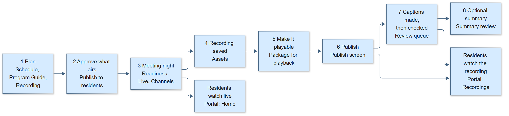{width=100%}

**How to read the figure.** Follow the arrows from the left. Steps 1 and 2 are done ahead of time. Step 3 is the meeting itself, and while it runs residents can watch on the portal's Home page. After the meeting, the recording appears in the Assets library (step 4). Before residents can watch a saved recording it has to be made playable in a browser (step 5) and then published (step 6). Publishing is also what starts the caption work (step 7): the recording becomes visible to residents at once, and the captions attach to the video later, after a person has checked them. The summary (step 8) is optional.

1. **Plan.** Put the meeting on the calendar. You can place a recorded video on a channel at a set time (Schedule, Program Guide or Auto-schedule). To capture a live meeting, set up a recording from a capture card or network stream (Recording). Details: [Before the meeting](#ch-before-meeting).
2. **Approve what airs.** A recorded program placed on the Schedule does not air, and residents do not see it, until someone approves it with **Publish to residents**. Saving a schedule item and approving it are two separate steps. A live meeting goes on air in step 3, not here.
3. **Meeting night.** Check Readiness (the "can we broadcast right now?" page). On Live, check that the camera or encoder is delivering, then run the checklist. On Channels, start the channel's feed and, for a live meeting, put the checked live source on the air. Details: [Running the meeting](#ch-running-meeting).
4. **Recording saved.** A finished recording becomes an asset in the Assets library. After you end a live session on the Live screen, CivicCast looks for the recording file, checks and packages it, and shows "Recording saved as asset" followed by the asset's ID.
5. **Make it playable.** *Packaging* makes a copy of the video that a web browser can stream. An asset with no playable copy cannot be watched on the portal.
6. **Publish.** On the Publish screen a publish operator ticks where the recording should go. The Portal option makes the recording public to residents. The other options copy it to archives and outside services.
7. **Captions.** Approving the Portal publication also queues the caption work. CivicCast transcribes the recording and holds every caption line for a person to approve, correct or reject. Captions attach to the public video only after every line is decided.
8. **Summary (optional).** From an asset's page a records clerk can ask for an AI summary. It uses only approved caption lines. A person reviews and approves it.

After the meeting, the portal shows residents the recording on **Recordings** and on its own watch page, with captions when they are attached. The portal's **Schedule** page shows what airs on each channel over the next 72 hours.

> **Known issue (beta.10):** On the **New scheduled item** form, the Premiere card says it will "Publish a recorded asset to the public portal at a scheduled time." That is not what saving does. Saving creates an item in the state **Scheduled**. Nothing airs and residents see nothing until you open the **list** tab and press **Publish to residents** on that item. Chapter 3 shows the steps.

> **Known issue (beta.10):** A meeting you capture on the **Recording** screen arrives in Assets in the state **Recorded**. The **Package for playback** button on the Assets list appears only on rows whose State is **Validated**, so it is not offered on a Recorded row. A recording that the Live screen finalizes is checked and packaged by that step. Chapter 5 explains what to do for each kind of recording.

### What residents see

The portal is an English-only website with a dark look and no sign-in. Its header has three links: **Home**, **Recordings** and **Schedule**.

- **Home** shows whether the station is on air. When it is, a video player appears. When it is not, you see "The station is standing by" or "No live broadcast is on air." It also lists what is coming up and the six newest recordings.
- **Recordings** is a searchable archive of every published meeting.
- A recording's **watch page** shows the video with captions, the meeting's agenda beside it if staff published one, the description, and a **Copy share link** button.
- **Schedule** shows what airs on each channel.

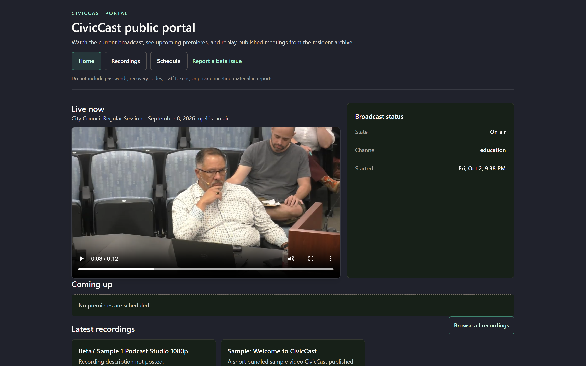{width=90%}

*Figure 1.2. The resident portal's Home page.*

### Word list for Part I

These are the words used most in Part I. Each is explained again where it first matters.

| Word | What it means in this manual |
| --- | --- |
| **Station computer** | The one Windows computer where CivicCast is installed. |
| **Console** | The staff web page. The sidebar on its left is the menu. |
| **Portal** | The public web page for residents. |
| **Channel** | One program stream the station sends out. A new station has three: public, education, government. |
| **On air** | A channel's feed is running and sending out what is playing. |
| **Outgoing feed** | The running stream for one channel. Staff start and stop it on the Channels screen. |
| **Slate** | A standby card the channel shows when no program is playing. |
| **Source** | A live picture CivicCast can receive, such as a camera or encoder. Source types shown on the Live screen are RTMP, RTSP, NDI and SRT. |
| **Asset** | One video file in the library (the Assets screen). |
| **Recorded / Validated** | Two of an asset's states. A *Validated* asset passed CivicCast's file checks, as uploads do. A *Recorded* asset is a finished live capture. |
| **Package for playback** | Make a copy of an asset that web browsers can stream. |
| **Publish** | Make a recording visible to residents, and optionally copy it to archives and outside services. |
| **Premiere** | A recorded asset placed on a channel at a start time. |
| **Caption** | The text of what is said, shown with the video. |
| **Cue** | One caption line with a start and end time. The Review queue shows cues one at a time. |
| **Summary** | An AI-written overview of a meeting. Every quantitative claim must link to caption timestamps. |
| **Readiness** | The answer to "can we broadcast right now?" on the Readiness screen. |
| **Role** | A set of things a signed-in person may do. There are five. |
| **Recovery kit** | The one-time printout or file with the admin username, the admin password and eight emergency codes, created on First Setup. |
| **Test mode** | The mode a new station starts in. The First-run defaults card on First Setup shows a **Mode** heading with "Test mode" under it. |
| **Headend** | The cable company's equipment that receives a channel's signal. |

### What is and is not proven in beta.10

CivicCast beta.10 was published on 2026-10-02 as a **GitHub pre-release**, labelled a *beta candidate*. It is not a production release. You can read the release page at <https://github.com/scottconverse/civiccast-native/releases/tag/v1.0.0-beta.10>.

**What was shown to work**

- **Gate A, clean-install lane: passed, 10 of 10 criteria.** Gate A is the station acceptance check. The lane that passed was run in Windows Sandbox against the exact published installer and packs. It covered install, activation, health, the console and portal rendering, a clerk workflow, captions, the playout engine (the part that sends each channel's picture out), a 5-minute soak, install progress and completion. It took several tries: the first run failed because a self-test waited 60 seconds for the AI component, which needed 61 (fixed in the published build), and three later runs failed the playout-engine check because the test began capturing before the engine's first video arrived, which on a fresh install takes more than 60 seconds. The passing run used a test setup that waits longer and repeats the capture.
- **An eight-hour lab run** held three channels (education, government, public) on air at the same time on one lab machine, with captions embedded in the output. It ran as one process with no restart and no crash, scored 50 program changes with no holes or errors, and measured loudness in range in 16 of 16 windows on every channel. One of 41 verify checks printed a raw FAIL, which was judged a sampling blip and is recorded in the verification note.

**What is not proven**

- **The upgrade lane and the download-only lane of Gate A were not run.** The owner waived both. Upgrading beta.10 over an earlier release is not proven.
- **A first install with neither the full kit nor an earlier install is not proven.** The installer needs the `packs` and `station` folders beside it. With only `setup.exe` the installer stops at its pack-staging step.
- **The eight-hour run was not repeated on the published installer.** It ran on an earlier internal build of the same engine.
- **No human field tester has signed off.** beta.10 has not been operated at a real station.
- **It is not a 24-hour or 72-hour test**, and it ran on one machine.
- **Physical DeckLink SDI capture and output, cable-operator headend acceptance, and sustained production use at a real public-access station** remain unproven.

**A measured limit you should know about.** Live-caption audio can be dropped under heavy load. In the eight-hour run the caption worker logged 13 catch-up discard events; seven of them coincided with disk scans the lab was running and are left out of the next figure. On a quiet machine the total was about 160 seconds of audio on two channels. Captions stay on the air, but some spoken audio gets no caption. A fix is the next work item and is not in this build. Stations that need loss-free live captions should weigh this limit.

The exact wording and the full list of limits are in the release's verification record. The evidence appendix ([Evidence and proof status](#app-evidence)) lists where each result is kept.

### If it did not work

This chapter contains no steps to follow, so there is nothing here to fail. If a later chapter's screen shows a message you do not understand, chapter 8 ([When something looks wrong](#ch-something-wrong)) lists the common ones.

### Related

- [Signing in and finding your way around](#ch-signing-in)
- [Before the meeting](#ch-before-meeting)
- [Running the meeting](#ch-running-meeting)
- [After the meeting](#ch-after-meeting)
- [Publishing, and what residents see](#ch-publishing)

<!-- SOURCES: inventory/screens/_shell-navigation-and-roles.md (sections 1-3, 5); inventory/screens/schedule.md; inventory/screens/recording.md; inventory/screens/live.md; inventory/screens/channels.md (feed Start/Stop, Take live); inventory/screens/assets.md; inventory/screens/review.md; inventory/screens/summary.md; inventory/screens/publish.md; inventory/screens/public-shell.md; inventory/screens/public-home.md; inventory/screens/public-watch.md; inventory/screens/public-schedule.md; inventory/screens/installer-nsis-service-finish.md (shortcuts); docs/releases/v1.0.0-beta.10-verification.md (all proof statements and numbers); inventory/screens/installer-nsis-packs-and-verify.md (packs and station folders, exit 110); civiccast/auth/roles.py:14-57; civiccast/apps/portal-operator/src/auth/roles.ts:6-12; civiccast/apps/portal-operator/src/components/shell/Sidebar.tsx:88-183; civiccast/apps/portal-operator/src/screens/AssetsScreen.tsx:408-441 (Package button only for validated rows); civiccast/schedule/router.py:375-409 (API accepts validated or recorded); civiccast/live/finalization_worker.py:739-752 (live capture packaged and manifest set); civiccast/apps/installer/src-tauri/nsis-hooks-bootstrap.nsh:1794-1808 (shortcut names); civiccast/installer/models.py:349-356 (three channels, test mode defaults); civiccast/installer/station_state.py:795-811 (first admin scope admin) -->

\newpage

## Signing in and finding your way around {#ch-signing-in}

This chapter shows you how to open the operator console, sign in, recover a lost password, sign out, and find the screen you need. It also explains the colors and status words you will see, how to use the Manual built into the console, and how to set up a brand-new station the first time. Everyone who uses the console reads this chapter; the first-run section is for the person setting up a new station.

### Before you start

- You need the **station computer**: the Windows computer where CivicCast is installed. Sign-in only works in a web browser that is running on that computer. If you use a remote-desktop program, open the browser inside the remote session, so the browser runs on the station computer itself.
- You need the **admin username and password** from the station's recovery kit. The kit is the printout or saved file made when the station was first set up.
- CivicCast has to be running in the background. If it is not, the shortcut opens a browser error page instead of the console.
- If nobody has set this station up yet, go straight to [Set up a brand-new station](#signing-in-first-run).

> **For IT staff:** The Windows service, the console address and the sign-in limits are in [Installing, first run, upgrading, uninstalling](#ch-installing) and [Security and privacy](#ch-security).

### Open the console {#signing-in-open}

1. On the station computer, double-click the **CivicCast Operator Console** shortcut on the Desktop. The Start menu has the same shortcut.
2. Wait for the browser to open.

You should see a page headed **First setup**. Opening the console always starts here.

> **Known issue (beta.10):** The console has no separate sign-in page. Sign-in lives on the page headed **First setup**, and that heading still reads "Create the station identity, first local admin, and recovery kit before a public meeting." on a station that was set up long ago. If the station is already set up, ignore that sentence. Scroll to the cards named **Admin sign-in** and **Use recovery code**. The addresses `/login` and `/sign-in` also lead to this page.

### Sign in

1. Find the card named **Admin sign-in**. It sits below the **Setup complete** card, which names your station.
2. Type your username in **Admin username**.
3. Type your password in **Admin password**. Use the username and password printed on your recovery kit.
4. Click **Sign in**. The button does nothing until both boxes are filled.

You should be taken to the **Readiness** screen. If a screen sent you here because you were signed out, you go back to that screen instead.

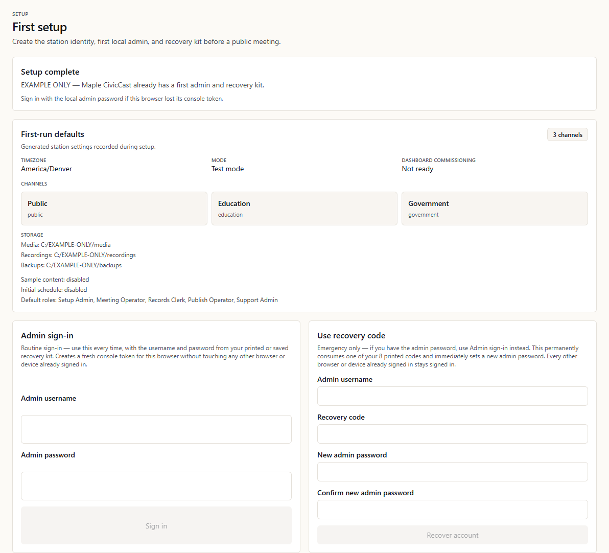{width=90%}

*Figure 2.1. The current-source sign-in page using synthetic station data; not a live station.*

> **Note:** Signing in on one browser does not sign out any other browser or device that is already signed in.

> **Note:** A normal sign-in takes you straight to Readiness, so you will not see this on that path. After you create the first admin on a new station (see [Set up a brand-new station](#signing-in-first-run)), the **Setup complete** card says "CivicCast saved a fresh console token in this browser for <your admin display name>." A *console token* is the private pass your browser keeps so the station knows it is you. The sentence means you are signed in.

> **Warning:** Closing the browser does not sign you out. CivicCast keeps your sign-in in the browser until you click **Sign out**, so anyone who opens the browser on that computer afterwards can use the console as you. On a shared or borrowed computer, always click **Sign out** before you leave.

### Use a recovery code

Use this only when the admin password is lost. If you have the password, use **Admin sign-in** instead. Each recovery code works once, and the station has eight.

1. Find your printed or saved recovery kit and pick one unused code.
2. On the sign-in page, find the card named **Use recovery code**.
3. Type your username in **Admin username**.
4. Type the code in **Recovery code**.
5. Type a new password in **New admin password**. It needs at least 12 characters.
6. Type the same password in **Confirm new admin password**. If the two differ, you see "Passwords do not match."
7. Click **Recover account**. The button changes to **Confirm — consume recovery code**, and a red message appears: "This permanently consumes one recovery code — only 8 exist for this station. Click Recover account again to confirm."
8. Click **Confirm — consume recovery code**.

You are signed in and taken to the same place as after a normal sign-in. Every other browser or device that was already signed in stays signed in.

> **Warning:** The code is used up when the station accepts it. If you change any box after the first click, the button goes back to **Recover account** and you must click twice again.

> **Warning:** Your printed kit still lists the old password. After a recovery, write the new password somewhere safe. While you can still sign in, a Setup admin can make a fresh set of eight codes with **Regenerate recovery kit** in the **Security** card on **Station Profile**; the old codes stop working at once, and the new kit lists the codes only, not the password. If you lose both the password and every recovery code, the console cannot let you back in. The page itself says that without the codes, a lost admin password locks the station out permanently. Ask your IT person; see [Security and privacy](#ch-security).

### Sign out

1. Look at the right end of the top bar.
2. Click **Sign out**. The button reads "Signing out…" for a moment.

You should land on the sign-in page. This signs out the browser you are using and no other.

The **Sign out** button appears only after the console has confirmed who you are. It is grey and unusable while a new station's recovery kit is waiting to be confirmed.

### Find your way around the console

#### The top bar

The top bar runs across the whole screen. From the left it shows the **C** logo, the word **CivicCast** and the version number, such as `v1.0.0-beta.10`. On a wide screen the middle shows a pill reading **No live meeting broadcast** and a clock reading "Local <time> / Next No events scheduled". On the right are a theme button (**Switch to dark theme**), a round badge with your initials, and **Sign out**.

Hover over the round badge to see your name and your roles, in the form "<your display name> / <your role names>". The console shows your roles nowhere else.

> **Known issue (beta.10):** The **No live meeting broadcast** pill and the words "Next No events scheduled" never change. They stay the same during a live meeting and with a full schedule. Do not use them to decide whether the station is on air or what comes next. Use **Readiness** and **Channels** instead.

#### The sidebar

The sidebar on the left is the menu. At its top a card reads **Public meetings** over **CivicCast station**. Below it are six sections. Click a section's name to open or close it. At the bottom is a link **Report a beta issue** and a tag **Operator-first beta**.

> **Known issue (beta.10):** The card at the top of the sidebar always reads "CivicCast station" and "Public meetings". It does not show your station's name. The name you chose appears on the sign-in page, in the **Setup complete** card.

The six sections start like this. The Help, Setup and System Health sections start closed, and the section that holds the screen you are on always opens.

| Section | Screens in it | You use it to |
| --- | --- | --- |
| **Help** | Manual | Read the manual built into the console. |
| **Setup** | First Setup, Control Room Setup, Station Profile, Cable Commissioning, AI Models, Custom Fields, Paywall | Set the station up and change its settings. |
| **Run Meeting** | Live, Facility, Control Room, Remote Contribution, Channels, CG Board, CG Designer, Schedule, Auto-schedule, Program Guide, Recording | Plan and run what goes on air. |
| **Review Records** | Assets, Missing Media, Media Lifecycle Settings, Contributors, Review queue, Summary review, Agendas | Look after videos, captions, summaries and agendas. |
| **Publish** | Publish, Playback policy, Analytics, Reports, EPG Export, Underwriting, App Admin | Decide what residents see, and read audience numbers. |
| **System Health** | Readiness, Alerts, Emergency Alerts, Federation | Check that the station is healthy. |

Altogether the console has 37 sidebar entries. On a phone or a narrow window, under 768 pixels wide, the sidebar becomes a drawer. Click the button **Open navigation** to open it. Pick a screen, or click outside it, to close it.

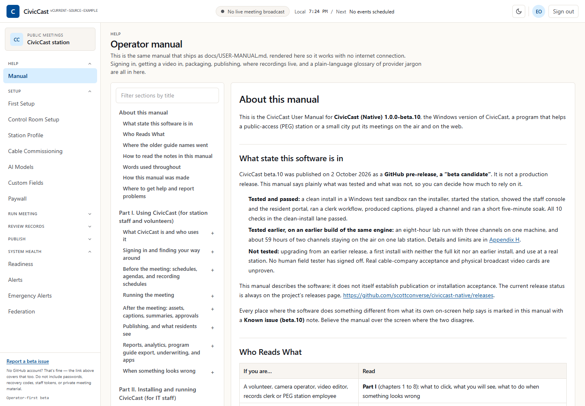{width=90%}

*Figure 2.2. The current-source console's top bar, sidebar and main area, using a synthetic signed-in operator example.*

#### Which screens you can see

You hold the roles of the account you signed in with. The account made on First Setup holds all five roles, and sees all 37 entries. A person with fewer roles sees fewer entries. Nineteen entries are shown to everyone signed in: Manual, First Setup, Live, Facility, Control Room, Channels, CG Board, Schedule, Program Guide, Assets, Contributors, Review queue, Summary review, Publish, Playback policy, Analytics, Readiness, Alerts and Federation. The other eighteen need at least one of the roles marked below.

| Screen | Setup admin | Meeting operator | Records clerk | Publish operator | Support admin |
| --- | :-: | :-: | :-: | :-: | :-: |
| Control Room Setup | yes | - | - | - | - |
| Station Profile | yes | yes | - | - | yes |
| Cable Commissioning | yes | - | - | - | yes |
| AI Models | yes | yes | - | - | - |
| Custom Fields | yes | - | - | - | - |
| Paywall | yes | - | - | - | - |
| Remote Contribution | yes | yes | - | - | yes |
| CG Designer | yes | - | - | yes | yes |
| Auto-schedule | yes | - | - | yes | yes |
| Recording | yes | yes | - | - | yes |
| Missing Media | - | yes | - | yes | yes |
| Media Lifecycle Settings | yes | - | yes | yes | - |
| Agendas | - | yes | yes | - | - |
| Reports | - | - | - | - | yes |
| EPG Export | yes | - | - | yes | - |
| Underwriting | yes | - | - | yes | yes |
| App Admin | yes | - | - | yes | - |
| Emergency Alerts | yes | yes | - | - | yes |

> **Warning:** The sidebar is a convenience, not a lock. A screen in your sidebar can still refuse you, and a button on it can still fail when you press it. Each screen and each button is checked again when you use it. Roles are added together: one matching role is enough.

These screens open for every role but refuse some things:

| Role | Screen | What happens |
| --- | --- | --- |
| Records clerk, Publish operator | Alerts | The list does not load. You see a red "Alerts could not load." box. |
| Records clerk | Federation | **Approve**, **Reject** and **Block** are refused. |
| Setup admin without Publish operator or Support admin | Federation | **Approve**, **Reject** and **Block** are refused. Creating the station key works. |
| Support admin | Alerts | **Save**, **Add destination** and **Delete** are refused. |

#### Find a screen by what you want to do

| I want to | Go to |
| --- | --- |
| Check whether we can broadcast | Readiness |
| Put a recorded video on a channel | Schedule, then **Publish to residents** |
| Set up a repeating weekly slot | Program Guide |
| Record a meeting from a capture card or stream | Recording |
| Run a live meeting | Live, then Channels |
| Upload or find a video | Assets |
| Check caption lines | Review queue |
| Approve an AI summary | Summary review |
| Decide what residents can see | Publish |
| See audience numbers | Analytics |
| Read the manual | Manual |

> **Known issue (beta.10):** Some screens carry a different name at the top of the page than in the sidebar. If you cannot find a heading, look at this list.
>
> | Sidebar name | Page heading |
> | --- | --- |
> | Readiness | Safe to broadcast |
> | Alerts | Alerts & monitoring |
> | Federation | ActivityPub federation |
> | CG Designer | CG Board Designer |
> | Recording | Scheduled recording |
> | Contributors | Contributor submissions |
>
> Some on-screen messages also say "System Health" when they mean the **Readiness** screen.

> **Note:** The console shows dates and times in your browser's own settings. Several screens where you type a time, such as Recording, read what you type as UTC (a world-standard clock) and not as local time. Chapter 3 explains each one where you type a time.

### Read the colors and status words

CivicCast uses five phrases to answer "can I act on this?". Each has a color. Wherever you see one, it means the same thing.

| Phrase | Color | What it means |
| --- | --- | --- |
| **Ready** | Green | The required checks passed. |
| **Check before meeting** | Amber | Something optional or recoverable needs attention. |
| **Do not broadcast yet** | Red | A required check failed for tonight's broadcast. |
| **Not set up yet** | Amber | An optional provider or feature has no sign-in details or proof yet. |
| **Needs IT help** | Red | The next step needs administrator, certificate, database or service work. |

A channel's outgoing feed has its own words. **On air** is green. **Needs attention** is red. The others are amber: **Showing slate**, **Starting**, **Stopping**, **Finishing current item**, **Changing source** and **Stopped**. A feed that is not on air during a meeting is amber on purpose.

Other words you will meet: **Not run yet** (a check has not been run), **Undeliverable** (a message could not be delivered), **Live on the portal**, **Archive pending**, **Archive verified**, **Waiting for media**, **Needs changes**, **Under review**, **Draft**, **Publishing**, **Complete** and **Needs action**. Each screen's chapter explains the words on that screen. The statuses appendix ([Statuses and what they mean](#app-status)) lists them all.

> **Known issue (beta.10):** The word **Ready** does not mean the same thing everywhere. On Readiness it means the whole station is ready. In the media readiness panel it means one video's playable copy is ready. On Assets, **Packaged** and **Published** are different words again. Read the screen's own text each time.

> **Known issue (beta.10):** Not every status uses the five phrases. You will see plain lowercase words such as `approval-only` on Federation, `critical`, `warning` and `info` on Alerts, `forced_slate` on Emergency Alerts, and job states such as `arming` and `finalizing` on Recording. Readiness also uses an extra phrase, **Ready with optional items**.

#### Messages and confirmation boxes

- **Pop-up messages** (toasts) appear at the bottom of the screen and close by themselves after 4.5 seconds. Click **Dismiss notification** to close one sooner.
- **Confirmation boxes** are the centered boxes that ask before a risky action. Focus starts on **Cancel**. Pressing Escape or clicking the dim background cancels. The action button names what it does, such as **Stop feed**.
- A **sample setup banner**, a red box reading "CivicCast could not finish first-run sample setup", can appear at the top of any screen except First Setup. It means the sample video or starter schedule item failed, and nothing else. The buttons are **Retry sample setup** (for a Setup admin or Publish operator) and **Dismiss**.
- **Loading this CivicCast screen...** shows while a screen loads. **Page not found** with the text "This operator route does not exist in this build." appears for an address that does not exist. Its buttons are **Manual**, **First Setup**, **Recording**, **Reports** and **Readiness**.

> **Known issue (beta.10):** Pop-up messages appear on only a few screens (Schedule, the trim editor, Program Guide, CG Board and Media Lifecycle). On other screens a successful save or command is silent. If nothing seems to happen, check the screen for a changed value before you press again.

> **Warning:** Not every risky button asks first. For example, **Start Live Stream** on Live, **Approve & put on air** on Channels, **Reject** on a caption line, and **Save automation settings** on Channels act at once. Alerts uses an inline **Delete** then **Confirm delete?**, and Emergency Alerts uses a tick-box for a forced slate. Treat every button as real.

> **Note:** No banner tells you that the console has lost contact with the station. Each screen reports its own loading failure.

### Open the Manual

1. In the sidebar, open the **Help** section.
2. Click **Manual**.

You should see a page headed **Operator manual** with a contents list on the left. The Manual works without signing in, works without an internet connection, and is the only screen you can open while a new station's recovery kit is waiting to be confirmed.

- To find a section, type in **Search this manual**. It narrows the contents list to sections whose *title* contains your words. It does not search the text inside sections. If nothing matches you see `No section title matches "<text>".`
- Click a contents entry to jump to that section.
- **Report a beta issue** at the bottom of the sidebar opens the Manual at the section "Report a beta issue".

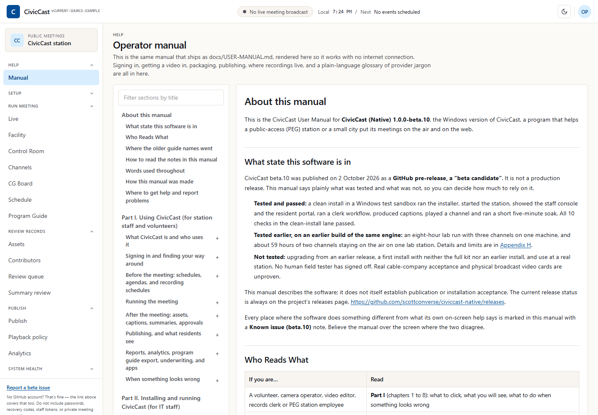{width=90%}

*Figure 2.3. The current-source Manual screen using an isolated 635-heading manual fixture. This is an interface example, not acceptance of the bundled manual.*

> **Known issue (beta.10):** The Manual built into the console is a copy made when the release was built, and it can be out of date. In the release source, it still says beta.10 "has not been published", which is no longer true. This manual was checked against the beta.10 software.

> **Known issue (beta.10):** The **Search this manual** box looks only at section titles, even though its wording suggests a full search.

> **Known issue (beta.10):** In testing we could not confirm whether the links inside the Manual's text that jump to another section work. The console reads a bare link of that kind as a page address, and it may show "Page not found". If one does, use the contents list on the left. Links to outside websites open in the same browser tab and replace the console; use your browser's **Back** button to return.

> **Support bundles:** Only the Support admin role can use **Create support bundle** on **Readiness**. See [When something looks wrong](#ch-something-wrong) for who to contact.

### Use the keyboard or a screen reader

- The first stop when you press **Tab** on a fresh page is a link **Skip to main content**. It appears only while it has focus. Press Enter to jump past the top bar and sidebar.
- Every control you can reach with Tab shows a visible outline.
- After you change screens by clicking or pressing a key, focus moves to the main area of the new screen. It does not move on the first page load.
- On a narrow window, the **Open navigation** drawer keeps Tab inside it, and Escape closes it.
- The sidebar is labelled **Primary navigation**, and the screen you are on is marked as the current page. Each section header is labelled **Show <name> navigation** or **Hide <name> navigation**.
- Error boxes, toasts and the on-air banner on Readiness are announced to screen readers.
- The theme button switches between light and dark.

> **Known issue (beta.10):** The theme resets to light every time you reload the page and does not follow your computer's own dark-mode setting. The browser tab always reads "CivicCast Operator" on every screen, so look at the heading on the page to see where you are.

#### The resident portal

The public portal has a hidden link **Skip to main content** that appears on the first Tab press. Its header has links **Home**, **Recordings** and **Schedule**, with the current one marked. After you change pages, focus moves to the new page's heading. Tap targets are at least 44 pixels tall. The portal is English only and always uses a dark look.

> **Known issue (beta.10):** The **Report a beta issue** link on the portal opens the staff console's Manual in a new tab. A resident lands in a staff product with no explanation. Below it, the small print "Do not include passwords, recovery codes, staff tokens, or private meeting material in reports." is written for staff.

### Set up a brand-new station {#signing-in-first-run}

Do this once, on the station computer, when CivicCast is installed and nobody has set it up. The person who does it becomes the station's first admin and holds all five roles.

**Before you begin:** choose the person who will be the admin. Have a printer, or a safe place to save a file. Plan to finish in one sitting, because you cannot leave the recovery kit before you confirm it.

1. Open the console as described in [Open the console](#signing-in-open). You see **First setup** and a card named **Durable storage**.
2. Click **Prepare storage** on the **Durable storage** card. It reads "Preparing..." and then shows **Storage ready** and "CivicCast has a local database for meeting records, captions, summaries, and subscriptions." Until then the page says "Create the first admin after storage is ready." If the card already shows **Storage ready** when you arrive, there is nothing to click; go on to step 3.
3. Fill in the form that appears:
   - **Station name**: the name residents will recognize.
   - **Admin display name**: the person responsible for setup and recovery.
   - **Admin username**: a local sign-in name for the first admin.
   - **Admin password**: at least 12 characters. A counter shows how many you have typed.
   - **Confirm admin password**: type it again.
   - **Where will you keep the recovery kit?**: a note for your records, such as "printed, stored in the clerk safe". It is not a file path, and nothing is saved there.
   - **Resident portal URL**: optional for rehearsal. Set it before public launch.
4. Click **Create first admin**. The button stays grey until the required boxes are valid.
5. Read the green **Recovery kit ready** panel. It shows your admin username, your admin password and eight emergency recovery codes. It says: "This screen and the saved/printed copy are the only place your admin password and these codes are ever shown together."
6. Click **Print kit** to open your print dialog, or **Save kit** to download a text file named `civiccast-recovery-kit-<kit id>.txt` to your Downloads folder.
7. Tick **I have saved or printed this kit — the admin password and the recovery codes — and stored it away from this computer.** The box stays grey until you have used **Print kit** or **Save kit**. After **Print kit**, it unlocks when the print dialog closes, whether you printed or cancelled.
8. Click **Continue to the console**. It reads "Recording confirmation..." while it works.

You should see a green **Setup complete** card, a **First-run defaults** card, and a block of setup tools.

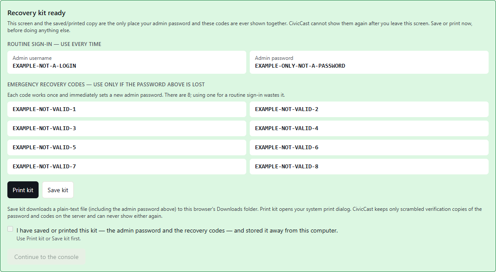{width=90%}

*Figure 2.4. The current-source recovery kit panel using synthetic example data. The displayed password and recovery codes are not valid credentials and cannot access a station.*

> **Warning:** The saved kit file contains the admin password in plain text, together with all eight codes. Keep it, or the printout, where only authorized people can find it. Do not email it, and do not leave it in a folder that syncs to the internet.

> **Warning:** Until you confirm the kit, the console holds you on First Setup. Every sidebar entry except **Manual** is grey, **Sign out** is disabled, any other address returns to First Setup, and your browser warns before you close the page. The kit lives in that browser tab. The station can never show the codes again. If you do reach the sign-in page without having confirmed, a warning named **Recovery kit never confirmed** appears there with a button **I found the kit — it is stored safely**. That button only records your word; it does not check anything.

#### What a new station starts with

You did not choose these. A new station starts with three channels (public, education and government), the default channel government, the time zone "local", **Test mode**, a sample video, and a starter schedule item. The sample content is made in the background after you create the admin. The **First-run defaults** card shows the channels, the time zone, the mode, the storage folders, and whether sample content and the initial schedule are enabled.

> **Known issue (beta.10):** The setup form does not tell you about those starting choices, and nothing on screen explains how to leave **Test mode**. In testing we could not confirm where in the console Test mode is switched off. Ask your IT person; see [Configuring the station](#ch-configuration).

#### The setup tools

Below **Setup complete** are four tools for a Setup admin: **Camera or test media** (six choices, with **Bundled sample video** selected first), **Backup destination**, **Storage and viewing estimate**, and **Provider setup** (cloud storage, archive and notice providers). Part II explains each one. If you do not hold the Setup admin role, the provider boxes are disabled and a warning says so.

> **Note:** **Verify backup** writes, reads and deletes a small test file in the folder you name, to prove CivicCast can write there. It is a check of the folder. See [Running it day to day](#ch-operations) for how backups are made.

### If it did not work

| What you see | Cause | What to do |
| --- | --- | --- |
| A browser error page instead of the console | CivicCast is not running, or the browser is not on the station computer. | Ask your IT person to start it. See [Troubleshooting matrix](#ch-troubleshooting). |
| "Invalid admin username or password." | The username or password is wrong. | Check the kit and retype both boxes. If the password is lost, use a recovery code. |
| "Invalid recovery code or admin username." | The code or username is wrong, or the code was already used. | Try another unused code. A wrong guess does not use up a code. |
| "Too many sign-in attempts from this station. Wait N seconds, then try again with the correct password, or use a printed recovery code." | Too many wrong guesses. | Wait the time shown. A correct password or recovery code still gets through. |
| "Too many failed attempts to authenticate with the staff API. Wait N seconds, then try again." | Too many requests with a bad sign-in. The station's default is 10 failures in 60 seconds. | Wait, then try again. "Staff API" means the station's staff-side service. |
| "The station is cooling down after too many requests" | The same slowdown, shown on First Setup. | Click **Try again**. The sign-in form on that card still works. |
| **You were signed out**, "This browser's console session is no longer valid..." | Your sign-in was removed. Most often it was the oldest of the 20 sign-ins the station keeps, pushed out by newer ones, or the station's sign-in state was reset. | Sign in again on that page. Nothing is wrong with the station. |
| "This browser's console sign-in is no longer valid" | The station rejected the sign-in this browser still held. | Click **Sign in again**, then use **Admin sign-in**. |
| "First setup can only be done from the station computer itself" | You opened the console on another computer, or in a way that is not running on the station. | Open the browser on the station computer, or inside a remote session on it. |
| "Could not read setup state." with more text | The station did not answer properly. | Wait a moment and reload. If it repeats, tell your IT person. |
| "Sign in with the local station admin account, then try again." | The request carried no sign-in. | Sign in on First Setup. |
| "This action requires one of these CivicCast roles: ..." | Your account does not hold a role the action needs. | Ask your admin. See below. |
| "Staff identity is required for this action." | You are signed out. | Sign in. |
| "Could not verify your staff identity (...)" | The screen could not check who you are. | Sign in again on First Setup. |
| "Durable storage is not ready." | The station's database has not been prepared. | Click **Go to Setup**, then **Prepare storage**. |
| **Page not found** | The address does not exist in this build. | Use a button on the page, or the sidebar. |

The role message lists raw role names. They map to the names in the console like this:

| Raw name | Console name |
| --- | --- |
| `setup_admin` | Setup admin |
| `meeting_operator` | Meeting operator |
| `records_clerk` | Records clerk |
| `publish_operator` | Publish operator |
| `support_admin` | Support admin |

> **Known issue (beta.10):** The message "Could not verify your staff identity" ends with "Sign in again from the CivicCast installer handoff or ask a setup admin for a fresh operator-console link". Neither of those is how you sign in with this build: the installer handoff code was retired, and the console has no screen that issues links. The real step is **Admin sign-in** on First Setup.

> **Known issue (beta.10):** The card "First setup can only be done from the station computer itself" also appears when you try to sign in or recover from another computer, even though you are not doing setup. Sign-in and recovery have the same station-computer rule.

> **Note:** The console has no screen for adding people or giving them roles. If you need a different set of roles, ask your IT person; see [Security and privacy](#ch-security).

### Related

- [What CivicCast is and who uses it](#ch-welcome)
- [Before the meeting](#ch-before-meeting)
- [Running the meeting](#ch-running-meeting)
- [When something looks wrong](#ch-something-wrong)
- [Roles and permissions](#app-roles)

<!-- SOURCES: inventory/screens/_shell-signin-and-session.md; inventory/screens/_shell-navigation-and-roles.md (sections 1-3, 6); inventory/screens/_shell-shared-components.md; inventory/screens/setup.md; inventory/screens/help.md; inventory/screens/public-shell.md; inventory/screens/public-home.md; inventory/screens/installer-nsis-service-finish.md (shortcut names); civiccast/apps/portal-operator/src/screens/SetupScreen.tsx:220-418 (recovery kit panel), 449-538 (First-run defaults), 540-564 (signed-in panel), 566-634 (storage), 1440-1554 (mutations, kit gate), 1583-1639 (sign-in card), 1641-1735 (headings, stale token, cooling down, loopback card), 1753-1935 (notices, Setup complete, recovery form), 1949-2068 (first-admin form); civiccast/apps/portal-operator/src/auth/recoveryKitGate.ts:1-134; civiccast/apps/portal-operator/src/App.tsx:135-144 (returnTo, default /health), 222-238 (kit bounce, 401 bounce), 256 (/ redirects to /setup); civiccast/apps/portal-operator/src/components/shell/TopBar.tsx:90-222 (clock, theme, badge, Sign out); civiccast/apps/portal-operator/src/components/shell/Sidebar.tsx:83-183 (profile card, sections, requiredRoles); civiccast/apps/portal-operator/src/components/AuthRequiredState.tsx:8-10; civiccast/apps/portal-operator/src/api/client.ts:383-390,422-427; civiccast/apps/portal-operator/src/screens/status-language.ts:30-142,207-250; civiccast/apps/portal-operator/src/auth/roles.ts:6-12; civiccast/installer/station_state.py:76,795-870,1347-1356; civiccast/installer/router.py:1088-1097,1100-1130,1211-1264; civiccast/installer/models.py:325-356; civiccast/auth/roles.py:80-98; civiccast/docsite/manual.json (text "has not been published"); civiccast/apps/portal-operator/src/screens/{SystemHealthScreen.tsx:1515,AlertsScreen.tsx:775,ActivityPubScreen.tsx:582,CgBoardDesignerScreen.tsx:533} (page headings) -->

\newpage

## Before the meeting: schedules, agendas, and recording schedules {#ch-before-meeting}

This chapter covers the work you do before a meeting starts and before a program airs. You will put programs on a channel's schedule, repeat a program every week, let CivicCast fill a time of day by rule, set up automatic recording of a meeting, publish an agenda that residents can read next to the video, and review programs that residents and community producers send in. Station staff with the publish operator, meeting operator, or records clerk role normally do this work.

> **Note:** This chapter describes CivicCast beta.10, which was published on 2026-10-02 as a GitHub pre-release (a beta candidate). It has not had a sign-off from human field testers. Everything below comes from reading the beta.10 program and the text on its screens. Where we could not run something on a live station, we say so. Several screens in this build have help text that is wrong or misleading, so this chapter tells you what the screen really does, and marks each difference as a **Known issue (beta.10)**.

### Before you start

You need to be signed in to the operator console ([Chapter 2](#ch-signing-in) shows how). The left-hand menu groups the screens in this chapter in two sections: **Run Meeting** (Schedule, Auto-schedule, Program Guide, Recording) and **Review Records** (Contributors, Agendas).

What you can do on each screen depends on your role. The table shows who can look and who can change things. Your station administrator gives out roles ([Appendix: roles](#app-roles) lists all of them).

| Screen | Who can open it | Who can make changes |
| --- | --- | --- |
| Schedule | Publish operator, setup admin, support admin | Publish operator, setup admin |
| Program Guide | Any signed-in person | Meeting operator, support admin |
| Auto-schedule | Publish operator, setup admin, support admin | Publish operator, setup admin |
| Recording | Setup admin, meeting operator, support admin | Setup admin, meeting operator |
| Agendas | Records clerk, meeting operator | Records clerk, meeting operator |
| Contributors | Publish operator, meeting operator, support admin | Publish operator, meeting operator |

> **Known issue (beta.10):** The menu shows some screens to roles that cannot use them. A meeting operator or records clerk who opens **Schedule** sees a red box, "Could not load schedule." A support admin can open **Contributors** but every button there fails. A publish operator who fills in the form on **Program Guide** is told "This action requires one of these CivicCast roles: meeting_operator, support_admin." only after pressing **Add to guide**. If a screen refuses you, ask your station administrator which role you need.

You also need at least one video in the library, and at least one channel set up on the station. Videos are managed on the **Assets** screen ([Chapter 5](#ch-after-meeting)).

> **For IT staff:** how roles map to people and how channels are created is in [Part II, Configuring the station](#ch-configuration).

### Three words you must know: Scheduled, Published, Cancelled

Every program you place on a channel is an *item* on the schedule. An item is always in one of three states. These words are used on several screens and they do not mean what they sound like, so read this section first.

| State | What it means | Does it air? |
| --- | --- | --- |
| **Scheduled** | You placed it, but nobody has approved it to air. It is a draft. | No |
| **Published** | It has been approved to air. It will play when its start time arrives. | Yes |
| **Cancelled** | It was withdrawn. It will not air. | No |

The program that actually plays on a channel is built only from **Published** items. A **Scheduled** item never airs by itself.

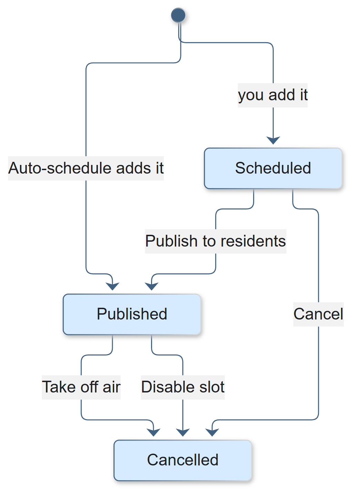{width=72%}

The diagram shows the two ways an item gets onto the air. If you add an item yourself on **Schedule** or **Program Guide**, it starts as Scheduled, and someone with the publish operator or setup admin role must approve it by pressing **Publish to residents**. If **Auto-schedule** adds the item, it starts as Published and there is no separate approval step. The section on Auto-schedule explains why that matters.

> **Warning:** Do not assume a program is on the air because it appears on a schedule list. Look for the word **Published** (on the Schedule screen, a Scheduled program shows "Not yet visible to residents" and a Published one shows "Visible to residents").

#### What residents see

Residents see two different lists, built from two different sources.

- **Coming up** on the portal home page lists programs placed with **Schedule** (or Contributors) that are **Published** and start in the future. It never lists a Scheduled item.
- **Channel schedule** (a page of the portal, see the example below) lists the next 72 hours of airings that came from **Program Guide** recurring slots. It lists an airing as soon as the guide has built it, whether or not anyone has published it.

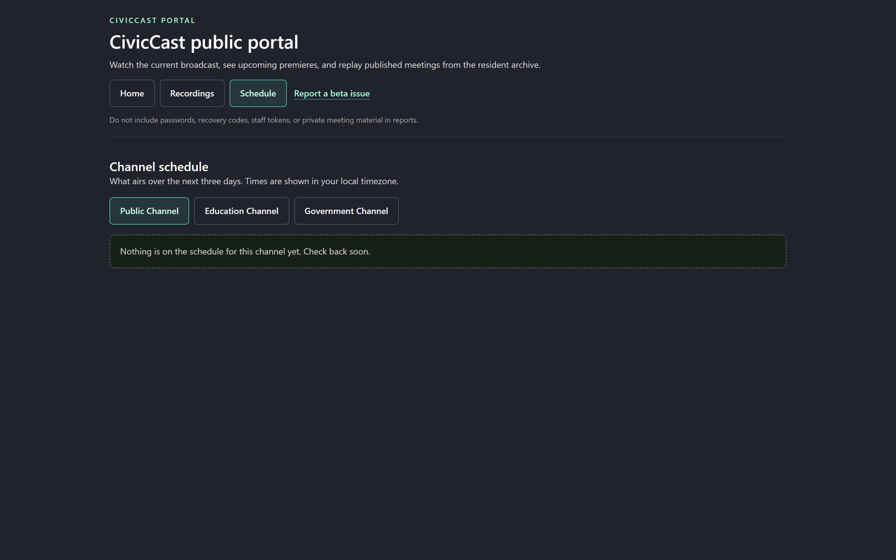{width=90%}

*Figure: the Channel schedule page that residents see.*

> **Known issue (beta.10):** The Channel schedule page can show an airing that will not air, because it reads the guide's own list, not the published state. The guide also keeps listing an airing if you cancel that item on the Schedule screen, because nothing updates the guide when an item is cancelled. Items you add directly on the Schedule screen never appear on the Channel schedule page at all; they appear in **Coming up** after they are published. The two pages do not explain the difference to residents.

### Which time zone are you typing in?

Several boxes ask for a time. They do not all use the same time zone. Read the label under the box.

| Where you type | Time zone it uses |
| --- | --- |
| Schedule: **Start at** | Your computer's local time. The line under the box shows the date and your zone name. |
| Program Guide: **First airing**, **Repeat until (optional)** | Your computer's local time when you type it. After that, the repeats are counted in UTC (see the warning below). |
| Auto-schedule dayparts: **Start**, **End** | The station's time zone, set in the **Timezone** box on the **Station Profile** screen (the First Setup form has no such box). If it is still "local" or was never set, UTC. |
| Recording: **Start (UTC)**, **Time (HH:MM UTC)** and the weekday boxes | **UTC**, not your local time. |
| Contributors: producer's **Requested air date** | The producer's own computer, with no zone saved (see Known issue under Contributors). |

*UTC* (Coordinated Universal Time) is the world's reference clock. It has no daylight saving time. A US station in Mountain Time is 6 hours behind UTC in summer and 7 hours behind in winter. Only the Recording screen makes you type UTC yourself.

> **Warning:** Daily, Weekly and Weekdays slots on **Program Guide**, and weekly captures on **Recording**, repeat on a fixed UTC clock. When daylight saving time starts or ends, the program or capture moves one hour on your local clock. After each clock change, check your repeating slots and recording schedules and edit them if the local time is no longer right. **Auto-schedule** dayparts use the station's time zone and do not drift.

### Put a recording on a channel once

Use the **Schedule** screen to place one recording on a channel at one time. This creates a *premiere*: a recorded video placed on a channel at a start time, for a length of time.

1. In the left menu, under **Run Meeting**, click **Schedule**. The page heading is "Schedule".
2. Click **New scheduled item** (top right). A panel opens on the right.
3. Under **Mode**, click **Premiere**.
4. In the **Asset** drop-down, choose the video. Each entry reads "title · asset id".
5. In the **Channel** drop-down, choose the channel by its display name.
6. In **Start at**, type the date and time. Use your local time. A line under the box repeats it as "Day, Mon d, h:mm" with your time zone name, so you can check it. The box starts at the next full hour.
7. In **Duration (min)**, type the length in whole minutes. It starts at 60. The largest allowed length is 14 days.
8. In **Notes (optional)**, type anything you want recorded. The box says the note is "visible in the audit log" (the station's record of who did what).
9. Click **Schedule premiere**. The button reads "Scheduling…" while it works.

You should see the panel close and a message, "Scheduled.", with a line such as "Premiere · City Council · Tue, Oct 6, 7:00 PM".

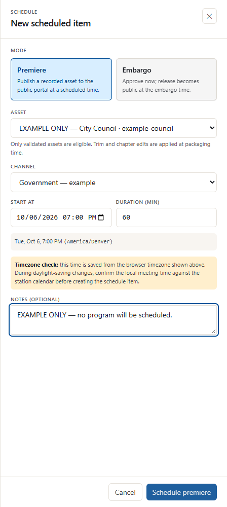{width=60%}

*Figure: the current-source New scheduled item panel with synthetic example data. No program was scheduled on a station.*

> **Warning:** The item you just made is **Scheduled**. It is not on the air and residents cannot see it. Go on to the next task, "Approve a program to air".

> **Known issue (beta.10):** The **Premiere** card says "Publish a recorded asset to the public portal at a scheduled time." That is wrong. Saving only creates a draft. Nothing airs and nothing appears to residents until you press **Publish to residents**.

> **Known issue (beta.10):** Do not choose **Embargo**. Its card says "Approve now; release becomes public at the embargo time." We read the whole beta.10 program and found nothing that releases an embargo item: it is left out of the channel's program, left out of **Coming up**, and the approval check refuses it (its message reads "embargo entries publish at a single moment and cannot be committed to air"). Use **Premiere**.

> **Known issue (beta.10):** The **Asset** drop-down lists only videos in the Validated state. A video that CivicCast recorded itself (a live meeting or a scheduled recording) is in the Recorded state and is **not offered**, even though the approval step accepts Recorded videos. If the list is empty you will see "No validated assets." with the advice "Upload and validate an asset in the Assets tab first." We found no screen in beta.10 that changes a Recorded video into a Validated one. A video you upload on the **Assets** screen becomes Validated, so uploading the file again makes it appear. Auto-schedule (below) accepts Recorded videos.

> **Tip:** The yellow box in the panel reads "Timezone check". During the weeks when clocks change, compare the time with your station calendar before you press **Schedule premiere**.

#### Read the Schedule screen

The top of the screen says "Week of" and a date range, with "times shown in your browser timezone."

1. Click **week** to see a grid of the week, or **list** to see every item as a row. On a phone the screen opens in the list.
2. Use **‹** (previous week), **Today**, and **›** (next week) to move through weeks.
3. In the list, each row shows the time, a mode label, a state label (Scheduled, Published or Cancelled), the title, the channel, and, for a premiere that is Scheduled or Published, either "Not yet visible to residents" or "Visible to residents". In the week grid, Cancelled items are greyed and struck through; in the list they only carry the Cancelled label.

The list shows every item, not only this week's. Clicking an item in the week grid switches to the list; it does not open a detail panel.

> **Known issue (beta.10):** The heading says "Conflicts on the same channel are rejected at the database layer." In plain words: the station will not let two programs overlap on one channel. If you try, you see "Time slot conflicts." with the ID, channel and start time of the item in the way and the advice "Pick a different time, channel, or cancel the conflicting item."

### Approve a program to air

A program on the Schedule screen airs only after someone with the publish operator or setup admin role approves it. The approval first runs a safety check. This is the real step that puts a program on the air.

1. On **Schedule**, click **list**.
2. Find the row that says "Not yet visible to residents".
3. Click **Publish to residents** on that row. The row says "Checking…" for a moment.
4. Read the review panel. At the top it says **Safe to air** or **Not safe to air yet**, with the start time and length. It also shows:
   - a line about problems with the video file, if there are any;
   - "Clashes with N other program(s) already scheduled:" followed by a list, if another program overlaps this one;
   - "Dead-air gap before this program (it can still air):" followed by a list, if the channel has nothing scheduled just before this program. *Dead air* means time when nothing is playing. A gap is for information only and does not stop the approval.
5. If the panel says **Safe to air**, click **Publish to residents** in the panel. The button reads "Publishing…". Click **Cancel** in the panel instead if you want to back out.

You should see the message "Visible to residents." with the program title, and the row now reads "Visible to residents". The item is **Published**. CivicCast also tells the channel's playout engine to read the schedule again, and starts the channel if it was stopped.

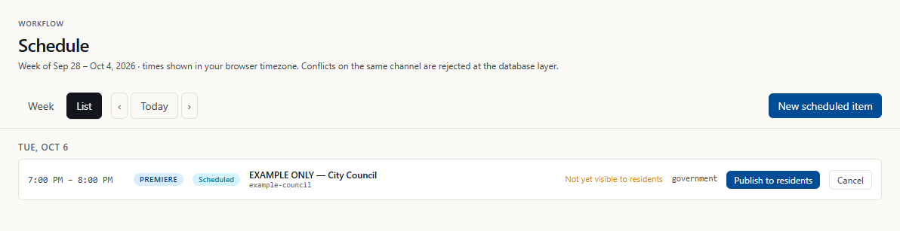{width=90%}

*Figure: a current-source Scheduled row with its Publish to residents button, using synthetic schedule data.*

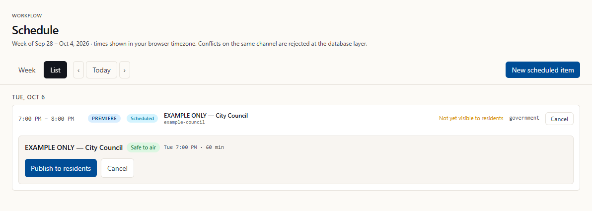{width=70%}

*Figure: the current-source review panel showing a synthetic Safe to air response. This illustrates the controls; it is not a station safety check or approval to air.*

> **Warning:** The final **Publish to residents** click has no further confirmation. It approves the program to air on the channel, not only to appear on the portal.

If the panel says **Not safe to air yet**, the approve button stays grey. Fix the reason shown (move or cancel the clashing program, or fix the video) and start again.

If your role cannot approve, the **Publish to residents** button is grey and a note explains that you can view the schedule but publishing needs the publish operator or setup admin role.

> **Known issue (beta.10):** The words "to residents" hide what this button does. It is the approval to air on the channel. The Channels screen has the same approval under another name, **Commit programs to air** with **Review & prepare** and **Approve & put on air** ([Chapter 4](#ch-running-meeting)). Either place works.

> **Known issue (beta.10):** The screen shows "Visible to residents." whenever the approval was saved, even if the message to the playout engine failed. The approval stays saved, and the engine picks the schedule up on its own cycle. The Channels screen shows "Couldn't reach the engine" for that case.

### Cancel a scheduled item

1. On **Schedule**, click **list**.
2. On the row of a **Scheduled** item, click **Cancel**.
3. In the box titled `Cancel scheduled item for "<name>"?`, click **Cancel scheduled item**. (The other button, **Cancel**, closes the box and changes nothing.)

You should see the message "Cancelled." and the row's state label change to Cancelled. The row's **Cancel** button goes away.

> **Warning:** This cannot be undone. The box says you would need to create a new scheduled item to air it again.

> **Known issue (beta.10):** A **Published** row has no **Cancel** button on this screen. To take a program that you approved by hand off the air, use **Take off air** on the Channels screen ([Chapter 4](#ch-running-meeting)); it asks for a reason. Programs that Auto-schedule placed have no approval record, and we found no button in beta.10 that removes one. The station's programming interface can cancel a Published item; ask your IT person ([Part II, Integrations](#ch-integrations)).

### Repeat a program on a schedule (Program Guide)

Use **Program Guide** when a recording should air again and again, for example every Friday night. You place a recording on a channel as a *recurring slot*: a recording, a channel, a start time, and a rule for how often it repeats. A background job turns each slot into real schedule items for the next 72 hours.

> **Warning:** The items the guide builds are **Scheduled**, not **Published**. Adding a slot does not put anything on the air. You must approve each one on the **Schedule** screen (task "Approve a program to air"). A station that adds a weekly slot and walks away gets nothing on the air.

1. In the left menu, under **Run Meeting**, click **Program Guide**.
2. In the **Channel** drop-down at the top, choose the channel.
3. Click **Add to guide** (top right). A panel opens, headed "Program guide" and the channel.
4. In **Recording**, choose the video. The entries read "title · asset id".
5. Under **Repeats**, click one card:
   - **Once**: "Airs a single time at the start time."
   - **Daily**: "Airs every day at this time."
   - **Weekly**: "Airs every week on this weekday." (This is chosen when the panel opens.)
   - **Weekdays**: "Airs Monday through Friday."
6. In **First airing**, type the date and time in your local time. A line under it shows the date, time and your zone name.
7. If you chose Daily, Weekly or Weekdays, you may fill **Repeat until (optional)** with the last date it may air. Leave it blank to repeat with no end.
8. Either keep **Use the recording's own length** ticked, or untick it and type **Duration (min)** (at least 1).
9. In **Guide title (optional)**, type a title if you want residents to see a different title than the recording's. It can be up to 200 characters.
10. Click **Add to guide**. The button reads "Adding…".

You should see the message "Added to guide." with a line such as "City Council · Weekly" (the line shows the guide title if you typed one, otherwise the recording's ID). The new slot appears under **Recurring slots**. Airings that fall in the next 72 hours are built at once and appear under **Next 7 days**, grouped by day, with the status **Scheduled**. Later airings are added as they come inside that 72-hour reach.

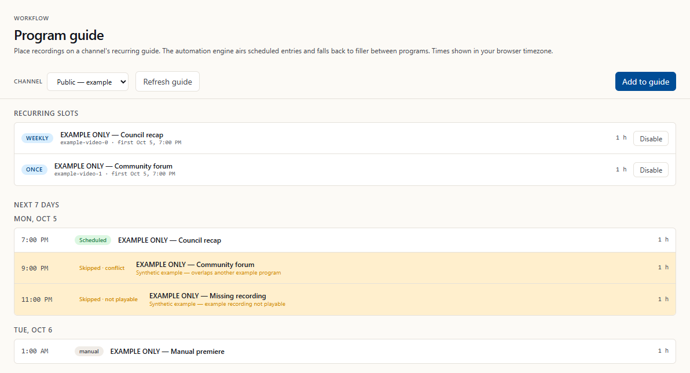{width=90%}

*Figure: the current-source Program guide screen with synthetic example slots and log entries. Recurring slots are at the top; the day-by-day list is below. No station guide was built or approved for this illustration.*

The guide is rebuilt in the background. By default it looks 72 hours ahead and runs about every five minutes. The **Refresh guide** button builds it immediately, for every channel, not only the one shown.

> **For IT staff:** the background job, its 5-minute interval and its 72-hour reach are set by environment variables; see [Part II, Running it day to day](#ch-operations).

> **Known issue (beta.10):** The text at the top of the screen says "The automation engine airs scheduled entries and falls back to filler between programs." That is misleading. The engine airs only **Published** items. Open **Schedule** and press **Publish to residents** on each airing the guide built.

> **Known issue (beta.10):** The **Weekdays** rule counts days on the UTC calendar, not on your local calendar. For a US evening start, a Friday-evening program lands on Saturday in UTC and is left out, while a Sunday-evening program lands on Monday in UTC and is included. We derived this from reading the program and did not run it on a live station. Until it is fixed, use **Weekly** with a separate slot for each day, or check the **Next 7 days** list after adding a Weekdays slot.

> **Known issue (beta.10):** The status in **Next 7 days** stays **Scheduled** even after you publish the item, so this list cannot tell you whether a program is approved. Check **Schedule** for that. Items you added directly on the Schedule screen are also listed here, with the status shown as the lower-case word `manual` and the detail "Scheduled directly (no recurring slot)."

> **Known issue (beta.10):** Like the Schedule screen, the **Recording** drop-down lists only Validated videos. A video that CivicCast recorded is not offered (see the Known issue under "Put a recording on a channel once").

> **Known issue (beta.10):** You cannot change a slot after you add it, even though the station's programming interface allows it. To change one, disable it and add a new one.

#### Fix a skipped airing

When the guide cannot place an airing, the row in **Next 7 days** shows an amber status.

| Status | What happened | What to do |
| --- | --- | --- |
| **Skipped · conflict** | Another program overlaps that time on the channel. The detail text under the title names it. | Cancel or move the other program on **Schedule**, then place this airing by hand (see below). |
| **Skipped · not playable** | The recording is missing, is not Validated or Recorded, has no file on the station, or has an unknown length. | Fix the recording on **Assets**, then place this airing by hand (see below). |

1. Read the status and the detail text under the title.
2. Fix the cause as shown in the table.
3. On **Schedule**, click **New scheduled item** and place the recording at that airing's time ([Put a recording on a channel once](#put-a-recording-on-a-channel-once)), then approve it.

The guide records a skipped airing once and never looks at it again. We read the code: the program that builds the guide ignores any airing time it has already recorded, skipped or not. Fixing the cause and clicking **Refresh guide** therefore does not turn that skipped airing into a scheduled one. Later airings of the same repeating slot are still built as normal. **Refresh guide** shows a message such as "Guide refreshed." with counts like "N scheduled · N conflicts · N not playable"; those counts cover only airings that were newly recorded.

#### Stop a repeating program

1. On **Program Guide**, find the slot under **Recurring slots**.
2. Click **Disable**.
3. In the box titled `Disable "<name>"?`, click **Disable slot**. (**Cancel** closes the box.)

You should see "Slot disabled." with a line such as "City Council · 3 future airing(s) cancelled", and the slot shows a **Disabled** label.

> **Warning:** Disabling a slot cancels every future airing it built. It cancels them even if you already approved them. Airings that already played, or are playing, are not touched.

> **Known issue (beta.10):** The box says nothing new will schedule "until the slot is re-enabled", but there is no button to re-enable a slot. To start it again, add it again with **Add to guide**.

### Fill a channel by rule (Auto-schedule)

Use **Auto-schedule** when you want CivicCast to pick recordings for a time of day by itself, for example "the newest council meeting every weeknight at 6 PM". You build three things, then connect them:

- A **saved search**: a named description of which recordings qualify, such as "meeting body is City Council".
- A **daypart**: a repeating window of time on a channel, such as weeknights 18:00 to 22:00.
- A **rule**: connects one saved search to one daypart, and says how to pick.

For each matching day in a rule's window, CivicCast places **one** recording. It starts at the start time of the daypart and uses the recording's own length. If anything is already scheduled anywhere inside that day's daypart, that day is left alone.

> **Warning:** An enabled rule approves the programs it generates for their scheduled times. They are written as **Published**, with no separate per-program commit. **Simulate** previews without writing anything; it is not an approval gate. When automatic scheduling is enabled, CivicCast compiles enabled rules at startup and about every hour, without another approval or anyone pressing **Compile now**. Check a rule carefully before saving it.

> **Note:** The current-source screen explains rule approval and automatic compilation. Earlier beta.10 wording incorrectly said these picks needed a separate commit. This wording correction does not change scheduling policy or establish that an installed station has been updated. Manually-added schedule items still need a separate **Commit-to-Air** approval.

You need the publish operator or setup admin role to change anything here. A support admin can look and run **Simulate**, but the **Add**, **Edit**, **Delete** and **Compile now** controls do not appear.

#### Create a saved search

1. Under **Run Meeting**, click **Auto-schedule**.
2. In **Saved searches**, click **Add saved search**.
3. Type a **Name**, for example "Recent council meetings".
4. Fill any of the other boxes you need. A blank box means no limit:
   - **Meeting body (exact)**: must match the recording's meeting body text exactly, including capital letters. Example: City Council.
   - **Title contains**: a word that must be in the title. Example: budget.
   - **Min length (minutes)** and **Max length (minutes)**.
   - **Include states**: tick the kinds of recording that may be picked. "Validated" and "Recorded" are ticked to begin with. Leave them.
   - **Newest published first**: ticked to begin with. It decides whether the newest or the oldest published recording comes first in the results, which matters for the **First match** pick (see "Create a rule").
5. Click **Create saved search**. The button is grey until the **Name** is filled.

To change or remove one later, click **Edit**, or click **Delete** and then **Confirm delete?**. If rules use the search, the confirm step adds the red line "Used by N rule(s) — deleting it stops them scheduling."

#### Create a daypart

1. In **Dayparts**, click **Add daypart**.
2. In **Channel**, type the channel's ID exactly. The placeholder shows `public`.
3. Type a **Name**, for example "Prime time".
4. Set **Start** and **End**. They begin at 18:00 and 22:00. Use 24-hour times in the **station's time zone**. The note says "00:00 = midnight (end of day). An end before the start wraps past midnight."
5. Tick the **Days** the daypart applies to. Monday to Friday are ticked to begin with.
6. Click **Create daypart**.

> **Known issue (beta.10):** The **Channel** box is free text, unlike the drop-downs on Schedule and Program Guide. A mistyped channel ID makes a daypart for a channel that does not exist. In testing we could not confirm whether the station refuses that. Copy the ID from the Channels screen.

> **Known issue (beta.10):** The line under **Dayparts** says times follow "CIVICCAST_STATION_TZ; UTC if unset". In plain words: the times use the station's time zone, which is set in the **Timezone** box on the **Station Profile** screen (the First Setup form has no such box). A new station starts with the value "local", which CivicCast treats as UTC, so "18:00" means 18:00 UTC until someone sets a real zone name there.

#### Create a rule

1. In **Auto-schedule rules**, click **Add rule**.
2. Type a **Name**, for example "Fill prime with council".
3. Choose a **Pick strategy**:
   - **Newest first**: the recording with the most recent published date.
   - **First match**: the first recording the saved search returns.
   - **Random**: any one of the recordings that match.
4. In **Saved search**, choose **Choose…** then the search.
5. In **Daypart**, choose the daypart. The entries read "name (channel)".
6. In **Rolling window (days, 14–60)**, type how many days ahead to fill. It starts at 30. A number outside 14 to 60 shows the red message "Rolling window must be a whole number from 14 to 60 days."
7. In **No-repeat window (days)**, type how many days must pass before the same recording may be picked again. 0 (the starting value) allows repeats.
8. Click **Create rule**.

#### Preview and compile

1. On the rule's card, click **Simulate**. Nothing is written. You see "Would schedule N of M upcoming slots." and up to 30 lines, each with a date, a title and a label:
   - **Will air**: the day is open and a recording was picked.
   - **Already scheduled**: something is already scheduled in that daypart.
   - **No eligible video**: no recording matches the saved search.
   - **No usable duration**: the recording picked has no length.
2. If you are happy, click **Compile now** in the **Compile schedule** card. There is no confirmation box.

You should see "Added N published items across M rules." The programs now show on **Schedule** as **Published**. They are approved for their scheduled times; compiling does not mean they start playing immediately.

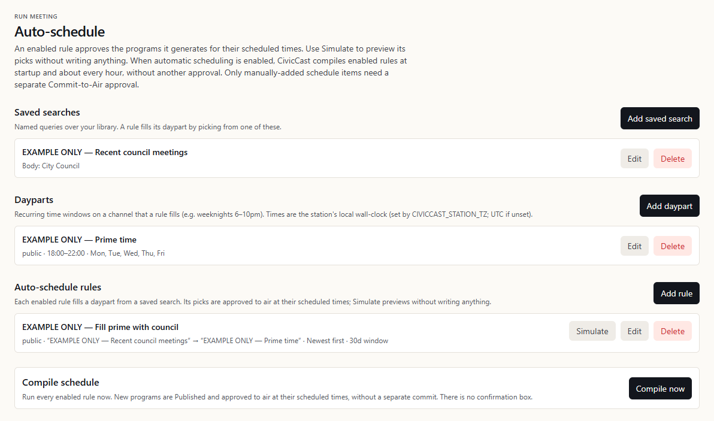{width=90%}

*Figure: the corrected current-source Auto-schedule screen with a synthetic example search, daypart and rule. The approval and startup/hourly wording describes existing policy; no station rule was saved or compiled for this illustration.*

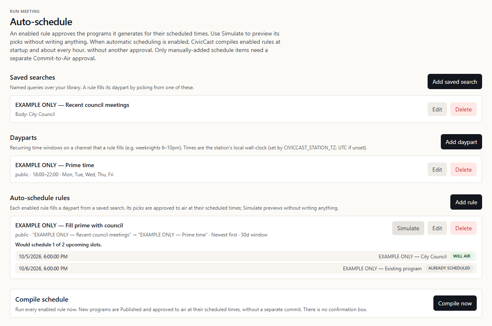{width=70%}

*Figure: the corrected current-source Simulate panel with a synthetic example preview response. Simulate is a preview, not an approval gate. No actual program was scheduled or approved for this illustration.*

#### Retire a rule

1. On the rule's card, click **Delete**, then **Confirm delete?**.

> **Warning:** Deleting a rule stops it from placing new programs. It does not remove programs it already placed. The delete changes only the rule, and the screen gives no hint about this. The programs stay Published and will air.

> **Known issue (beta.10):** There is no way on this screen to switch a rule off without deleting it. A **disabled** label exists on rule cards, but nothing here sets it. You also cannot set a rule's priority or its active dates; every new rule is saved with priority 100 and no date limits. If you edit a rule, set it up again with the same care as when you created it.

### Record a meeting automatically (Recording)

Use **Recording** to capture a live input or a network stream at set times, or to start a capture by hand. A *live input* is a video card in the station computer (SDI, HDMI or NDI). A *network stream* is video that arrives over the network from a camera or encoder (RTSP, SRT, HLS, RTMP or MPEG-TS). The page heading is "Scheduled recording". When a capture ends, CivicCast makes a new library asset in the Recorded state from the file.

You need the setup admin or meeting operator role to make changes. A support admin can look only. A person with any other role sees "Forbidden — scheduled recording is an operator / setup-admin / support-admin surface. Ask your station admin for access."

#### Create a recording schedule

A *recording schedule* is a saved plan: one source, one time pattern, one length.

1. In the left menu, under **Run Meeting**, click **Recording**.
2. In the **New schedule** card, type a **Schedule ID (slug)**: a short code name. Use only lowercase letters, digits and hyphens, for example `evening-news`. You cannot change it later.
3. Type a **Name**, for example "Evening news". Two schedules cannot have the same name.
4. In **Source kind**, choose one. Under **Live inputs** are SDI, HDMI and NDI. Under **Network streams** are RTSP, SRT, HLS, RTMP and MPEG-TS. Changing the kind clears the next box.
5. Fill the box that appears next:
   - For **SDI** or **HDMI**, choose the card in **Input ID**. The drop-down lists the capture devices CivicCast found. Click **Inspect capture devices** to look again after you plug a card in.
   - For **NDI**, type the name in **Input ID** (the placeholder is `studio-ndi`).
   - For a network stream, type the address in **URI** (the placeholder is `rtsp://camera.local/stream`).
6. Under **Recurrence**, choose **One-shot** (one capture) or **Weekly**.
7. For **One-shot**, type **Start (UTC)**. For **Weekly**, click **Weekdays**, **Weekend**, **Every day** or **Clear**, tick the day boxes you want, and type **Time (HH:MM UTC)**, for example `19:00`. See the warning below.
8. In **Duration (HH:MM:SS)**, type the length with two digits in each part. It starts at `01:00:00`. A value such as `1:5:0` is refused; type `01:05:00`.
9. In **Quality preset (encoder profile)**, leave `default`, or type a name your administrator gave you. The screen suggests default, copy, h264-1080p, h264-720p, hw-h264-1080p and hw-h264-720p.
10. In **Loudness regime**, choose how loud the recording should be. The choices are **Inherit station default**, **Copy source audio**, **Cable / ATSC A/85 (-24 LKFS)**, **Broadcast / EBU R128 (-23 LUFS)** and **Streaming (-16 LUFS)**. One line under the choice explains it.
11. Leave **Target series (optional)** blank unless your administrator tells you what to put there. We could not confirm what it does.
12. Keep **Enabled** ticked so the schedule runs.
13. Check the **Next fire** (or **Next 3 fires**) lines. Each shows the time as "UTC … · local …".
14. Click **Create schedule**.

You should see the new schedule appear in the **Schedules** table above the form.

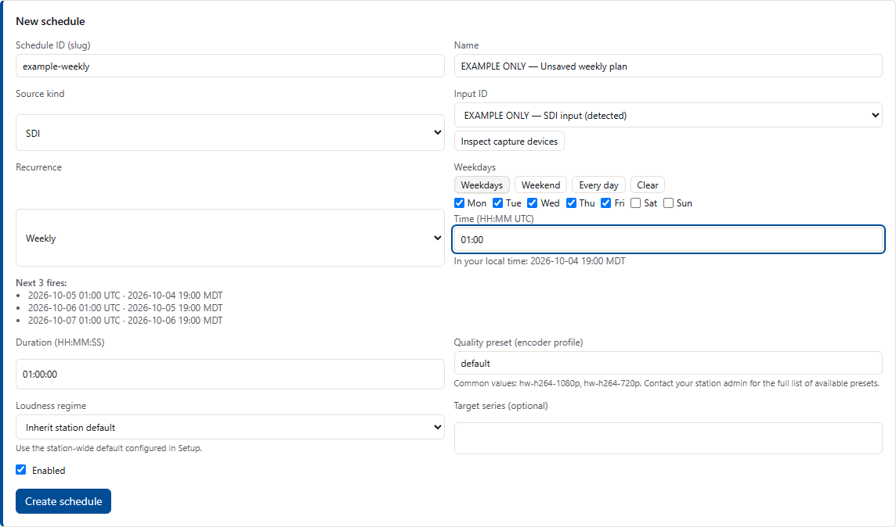{width=80%}

*Figure: the current-source New schedule form with unsaved synthetic example values and the actual UTC/local next-fire preview. The input list is synthetic; no device was inspected, schedule saved or recording started.*

> **Warning:** The time you type is **UTC**, not local time. Under **Start (UTC)** and **Time (HH:MM UTC)** the screen shows "In your local time: …" so you can check it. The weekday boxes are also UTC days, and they get no such line. A Monday 7 PM meeting in US Mountain Time (UTC−6 in summer, UTC−7 in winter) is already Tuesday in UTC: in summer it is Tuesday 01:00 UTC, in winter Tuesday 02:00 UTC. Tick **Tue**, not **Mon**. Use the **Next 3 fires** lines to confirm the local day and time before you save. After the clocks change, edit the schedule: the UTC time does not move, so your local time does.

> **Known issue (beta.10):** After **Create schedule** works, the form is not cleared and no "saved" message appears. Look for the new row in the **Schedules** table. If you click **Create schedule** a second time, the station answers "Recording schedule '<id>' already exists. Use PATCH to update." That means the first click worked.

> **Known issue (beta.10):** "Quality preset" is a free text box and the screen does not know which names are valid. Its note says "Contact your station admin for the full list of available presets." We could not confirm what the station does with a name it does not know.

> **Known issue (beta.10):** If the stream address contains a user name and password, the screen does not warn you. We could not confirm how CivicCast stores or hides it. Ask your IT person before you save such an address.

> **For IT staff:** the capture-device list, recording folders and the runtime switch are described in [Part II, Running it day to day](#ch-operations).

By default, CivicCast adds a row for each planned capture to the **Recordings** table up to ten minutes before its start time, and gets the input ready about 30 seconds before the start. The job moves through these states:

| State | Meaning |
| --- | --- |
| `scheduled` | Planned, not started |
| `arming` | Getting the input ready |
| `recording` | Capturing now |
| `finalizing` | Closing the file and making the asset |
| `done` | Finished; the asset exists |
| `failed` | Stopped with an error; the **Failure** column says why |
| `skipped` | Not run, for example because the schedule was disabled |

These labels appear in lower case on the screen.

#### Start a recording now

**Record now** starts a capture from a saved schedule right away. There is no one-off capture without a schedule, so create a schedule first.

1. In the **Schedules** table, find the schedule.
2. Click **Record now** on its row. The button reads "Starting…".

You should see a new row in **Recordings** that goes from `arming` to `recording`. The capture lasts for the schedule's **Duration** unless you stop it earlier. There is no success message; the row is the confirmation.

> **Known issue (beta.10):** The empty-screen text says "use Record Now for a one-off capture". The button is named **Record now** and exists only on a saved schedule's row. The button is grey if the schedule is disabled.

#### Stop a recording

1. In the **Recordings** table, find the job in state `arming`, `recording` or `finalizing`.
2. Click **Stop**, then click **Confirm stop**. (**Cancel** backs out.)

If the job was in `recording`, the file recorded so far is finished into an asset. The state goes to `finalizing`, then `done`, and an asset link such as "asset id >" appears. Click it to open the asset. If the job was still in `arming`, nothing has been recorded yet: it ends as `failed` with the reason "Stopped before recording started; capture pipeline never reached the 'recording' phase." and no asset is made.

> **Warning:** Stopping ends the capture for good. The recording stops at that moment.

> **Known issue (beta.10):** **Stop** is also shown on a job still in `scheduled` state, but the station refuses it ("Cannot stop job '…': state is 'scheduled'; only ['arming', 'finalizing', 'recording'] are stoppable."), and the screen shows nothing, so the click appears to do nothing. To stop a capture that has not started, remove its schedule's **Enabled** tick (see below).

#### Change or remove a schedule

- Click **Edit** on the row, change the form, and click **Save changes**. The schedule ID is locked. Click **Cancel edit** to leave without saving.
- To switch a schedule off, edit it, untick **Enabled** and save. This also cancels jobs that are still waiting to start.
- To delete it, click **Delete**, then **Confirm delete**. Earlier recordings stay in history. We could not confirm whether a job that was already planned still starts after you delete its schedule, and the screen does not show delete errors. Untick **Enabled** first.

#### Find finished recordings

1. Use the **Recordings** filters: **State**, **Schedule ID**, and **Limit** (1 to 500, 50 to begin with). Click **Refresh** to reload.
2. The screen reloads by itself every 5 seconds while any job is active; the label reads "Live · refreshing every 5 s". Click **Pause** to stop it and **Resume** to start it again.
3. For a failed capture, set **State** to `failed` and read the red text in the **Failure** column.

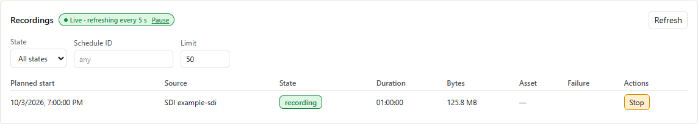{width=90%}

*Figure: the current-source Recordings table with a synthetic example job in the recording state. The Live refresh label polls example replies only; no actual capture was running or stopped for this illustration.*

### Publish an agenda for a meeting (Agendas)

An *agenda* is the list of numbered items for one meeting. When you publish it, residents see it next to the video on that recording's watch page, and clicking an item with a time jumps the video to that moment. The records clerk and meeting operator roles can use this screen.

An agenda belongs to one recording. Each recording can have only one agenda. Agendas stay private drafts until you publish them.

#### Create an agenda

1. In the left menu, under **Review Records**, click **Agendas**.
2. In the **Create new agenda** card, type an **Agenda ID (slug)** such as `council-2026-01`. Use only lowercase letters, digits, hyphens and underscores, starting with a letter or digit.
3. Type the **Meeting asset ID**: the ID of the recording this agenda belongs to. Find it on the **Assets** screen, in small type under the recording's title. Type it exactly, in lowercase.
4. If the agenda also exists as a document, type its web address in **Source doc URL (optional)**. Residents can read it next to the video.
5. Click **Create agenda**.

You should see the new agenda selected. Its card shows the ID, a **draft** label, and "meeting asset: <id>". If you have more than one agenda, the **Pick an agenda** drop-down at the top switches between them.

> **Known issue (beta.10):** The IDs are made-up codes, and a wrong character (for example a capital letter) shows raw technical text instead of a plain message. There is no list of recordings to choose from. We could not confirm whether the station checks that the recording exists.

> **Known issue (beta.10):** If you press **Create agenda** for a recording that already has an agenda, you see "An agenda already exists for (station_id='…', meeting_asset_id='…')." Select the existing one with **Pick an agenda**.

#### Add items by hand

1. In the **Items** section, fill the **Add item** form:
   - **Item ID (slug)**: a code name such as `item-01-call-to-order`.
   - **Order**: the item's position in the list, as a whole number from 0 up.
   - **Number (label, optional)**: what residents see, such as `1.a`.
   - **Title**: the item's name.
   - **Video timecode (seconds, optional)**: the moment in the video where the item starts, in whole seconds. For 1 hour 5 minutes, type 3900.
   - **Doc anchor (optional)**: a place in the source document, such as `#item-1a`.
   - **Notes (optional)**: private to staff. The box says they are not shown to viewers.
2. Click **Add item**.

You should see the item in the **Agenda items** table. Use **Edit** on a row to change it (the button becomes **Save item**, and **Cancel** leaves edit mode). Use **Delete**, then **Confirm delete**, to remove a row.

> **Known issue (beta.10):** The **Order** box starts at 0 every time. If you add a second item without changing it, the station refuses with "Another agenda item already occupies (agenda_id='…', order=0)." Change **Order** to the next free number (0, 1, 2, and so on) for each new item.

> **Known issue (beta.10):** The timecode must be typed as seconds. The screen does not accept hours and minutes.

#### Fill the agenda automatically

The **Bulk actions** section has four ways to fill an agenda without typing each item.

- **Sync from chapters** makes one item for each *chapter marker* on the recording: a named point in time added in the trim editor (open it from the recording's page on **Assets**). It reads "Synced N new item(s) from chapter markers." Items whose Order already exists are skipped, so your edits survive running it again.
- **Import from doc (paste plain-text agenda, one item per line)**: paste the agenda text and click **Import**. Each non-blank line becomes one draft item. A leading number such as "3.a" or "VII" becomes the **Number**. It reads "Imported N item(s)." and the help line says "Taken literally, one item per line — nothing to review." Lines whose position already has an item are skipped.
- **Or upload a PDF agenda…**: choose a PDF and click **Import PDF**. CivicCast makes a best-effort guess from the text in the PDF (numbered items, ALL-CAPS headings and times). Each item gets a **Confidence** mark: green is 90% or more, amber 50 to 89%, red under 50%. If any item is under 90%, the banner says "Some items were a best-effort guess (see the Confidence marks below) — review them before publishing." A PDF that is a scan of paper, with no text in it, finds nothing: "Couldn't find any recognizable items in that PDF. Try pasting the agenda's text instead."
- **Import from an external agenda system**: look up a meeting in Legistar, PrimeGov, CivicClerk, or a "JS-rendered portal (CivicPlus, Granicus, other)" and import it. See the Known issue below.

> **Warning:** Importing a PDF or an external meeting into an agenda that is already **published** moves it back to **draft**. Review it and publish again.

> **Known issue (beta.10):** The **Import from an external agenda system** block is shown on every station but is **switched off** unless your IT person turns it on. If it is off, **Find meetings** answers in a yellow banner: "Agenda import is not enabled. Set CIVICCAST_AGENDA_SOURCE to 'legistar', 'primegov', 'civicclerk', or 'js_portal' to turn it on." You cannot fix that from this screen. Ask your IT person. "Tenant / site code" is the short name your city has in that system (the screen's example is `longmont`). The JS-portal choice also needs an optional add-on; if it is missing, the screen says "JS-portal runtime: not installed." and **Find meetings** is grey.

> **For IT staff:** turning on agenda import is covered in [Part II, Integrations](#ch-integrations).

#### Publish, unpublish or delete an agenda

1. Check the **Items** table. An agenda needs at least one item before it can be published. Until it has one, **Publish** is grey with the hint "Publish needs at least one item — add one below or sync from chapters."
2. Click **Publish** (the button reads "Publishing…"). The label changes from **draft** to **published**.
3. To take it down, click **Unpublish**. It goes back to **draft** with no confirmation, and residents no longer see it.
4. To remove it, click **Delete**, then **Confirm delete**. The line "Confirming will also delete every item under this agenda." appears first.

> **Warning:** Delete removes the agenda and every item in it. There is no undo. Once the red **Confirm delete** button is showing, the only way to back out is to choose a different agenda in **Pick an agenda**.

> **Known issue (beta.10):** If the station refuses to publish an empty agenda, the message ends with "Add at least one item (DC-1) before publishing." The "DC-1" is an internal code; ignore it.

> **Known issue (beta.10):** The screen does not tell you that changes to items of an agenda that is **already published** go live as soon as you save. Only a PDF or external import reopens it as a draft. Edit a published agenda only when you are sure.

#### What residents see

On the recording's watch page, residents see a card headed "Agenda" beside the video. It shows each item's number, title and time. Clicking an item that has a time jumps the video to it. An item with no time shows "—" and cannot be clicked. If you gave a **Source doc URL**, there is an "Agenda document" link, and if the address ends in `.pdf`, the document appears in a viewer. Residents never see your **Notes**. While the agenda is a draft, residents see nothing at all.

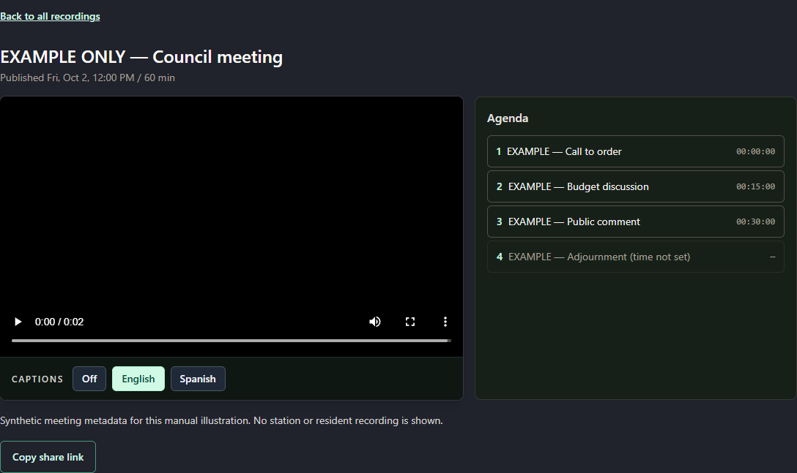{width=90%}

*Figure: the current-source agenda card beside the video on the resident watch page, using example data. The video is a two-second synthetic test clip, not the example meeting.*

> **Known issue (beta.10):** The operator screen does not say where residents see the agenda, and it only links to the public page when the station was built with a public portal address set. Open the recording on the resident portal ([Chapter 6](#ch-publishing)) to check how it looks.

### Review programs sent in by the community (Contributors)

Community producers can send a program to the station through the resident portal. Staff review each one on the **Contributors** screen. The page heading is "Contributor submissions". Producers never get a login to the operator console.

#### What a producer does on the portal

Tell producers to open the station's resident portal and scroll to **Submit a program** at the bottom of the home page. They:

1. Fill **Producer name**, **Email**, **Program title** and **Description**. **Organization**, **Tags** (separated by commas) and **Requested air date** are optional.
2. Choose a **Video file**.
3. Click **Send to review**. The button reads "Uploading" while it works.
4. Copy the **Receipt** and **Status token** shown on the page.

Later, the producer pastes both into **Check submission status** and clicks **Check status** to see the state of the submission.

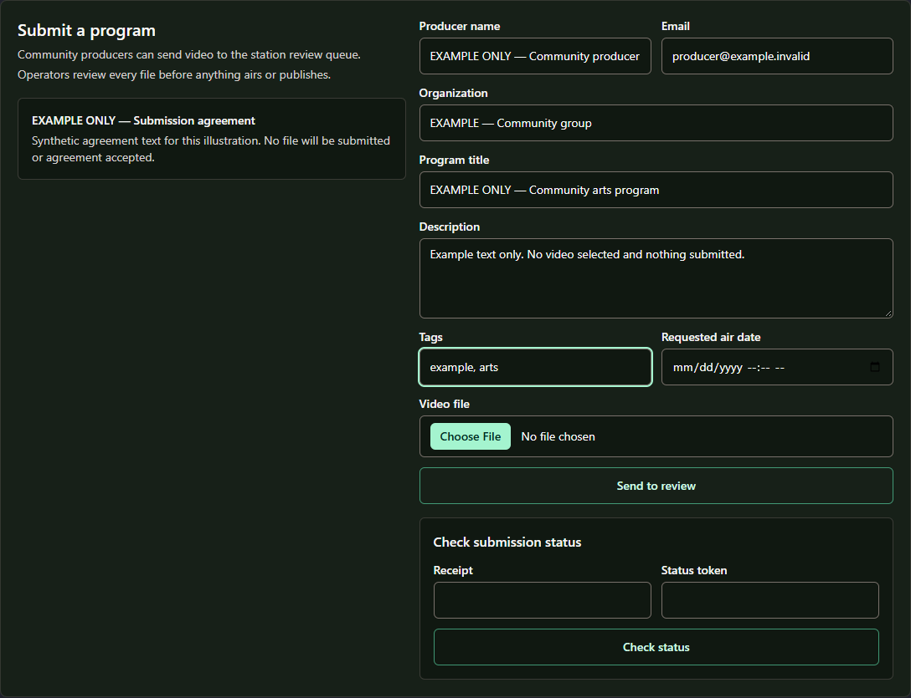{width=80%}

*Figure: the current-source Submit a program form with example details. No file was selected, submission sent or agreement accepted.*

> **Known issue (beta.10):** The receipt and status token are shown only on the page and are lost if the producer reloads it. The page does not say so. Tell producers to copy both before they leave.

> **Known issue (beta.10):** The form shows an agreement summary but has no "I agree" box. Pressing **Send to review** counts as accepting the agreement, in the name typed in **Producer name**. Ask your station's lawyer or administrator whether that is acceptable.

> **Known issue (beta.10):** The form says nothing about file type, size, length or how long review takes. It lets the producer pick any video file. By default the station refuses files over 2 GiB (about 2 gigabytes); the producer then sees "Contributor media exceeds the station's upload limit of …". Your IT person can change the limit. The station also limits the total size of the intake folder and how much one address can send.

> **Known issue (beta.10):** We could not find anything in beta.10 that emails the producer when the state changes. The producer learns about the state only by using **Check status**.

#### Review a submission

You need the publish operator or meeting operator role to press the buttons.

1. In the left menu, under **Review Records**, click **Contributors**.
2. Read the three tiles at the top: **Needs action** (submissions waiting on you), **Total submissions** and **Status notices**.
3. Use the search box ("Search title, producer, or tag...") or the tabs **All**, **Submitted**, **Reviewing**, **Needs changes**, **Accepted**, **Scheduled** and **Declined** to find a submission. The oldest are listed first.
4. Read the card: the title, the producer, the producer's description, the **Media** file name and size, the **Media gate** (the file check; it reads "not run" until you accept, then "passed") and the **Agreement**.
5. Click **Start review** to mark it as under review. This is only a label; it does not check anything.
6. Edit the **Review title**, **Review tags** and **Review description** boxes if you want to correct what goes into the library.
7. Click one of the action buttons below.

| Button | What it does | When it works |
| --- | --- | --- |
| **Start review** | Marks it **UNDER REVIEW** and saves your note | Submitted |
| **Request changes** | Marks it **NEEDS CHANGES** and saves your edits and note | Submitted, Reviewing, Needs changes |
| **Accept** | Checks the file, then copies it into the **Assets** library as a Validated asset. The card says **ACCEPTED**. | Submitted, Reviewing, Needs changes |
| **Send to schedule** | Creates a draft **Scheduled** entry on the Schedule screen for the new asset | Accepted only |
| **Decline** | Marks it **DECLINED** with the reason typed in **Decline reason** | Anything except Declined, Scheduled, Published |

There are **no confirmation boxes**. Each click acts at once.

**Accept** checks the video with a tool called ffprobe. A corrupt or unsupported file is refused and the state does not change. The producer's original stays in the intake folder; CivicCast copies it to the library.

> **Warning:** **Decline** on a submission that already has a schedule entry cancels that entry first, without asking. If that cannot be done, the decline is refused. A submission that is already Published cannot be declined ("Cannot decline a submission that has already been published.").

> **Known issue (beta.10):** **Send to schedule** does **not** put anything on the air. It makes a **Scheduled** entry. You must then open **Schedule** and approve it with **Publish to residents**. The screen does not say so, and the message producers see, "Your program has a real spot on the schedule and will air automatically.", is untrue until you do.

> **Known issue (beta.10):** **Send to schedule** uses settings you cannot see first: the channel is whatever the form stored (the portal form always sends `public`), the length is the **Minutes** box beside the button (30 to begin with, never less than 60 seconds) rather than the video's real length, and the start is the producer's **Requested air date**, or the moment you click if there was none. A start time in the past is likely not what you want. We read the code and tested the data checks, but did not run this on a live station. They show that the screen sends the producer's date without a time zone, and the Schedule rules refuse a time with no zone. So expect **Send to schedule** to fail with "Could not build a schedule item from this handoff" for any submission that has a **Requested air date**.

> **Tip:** The more reliable path is to **Accept**, then use **New scheduled item** on the Schedule screen ([Put a recording on a channel once](#put-a-recording-on-a-channel-once)). The accepted file is Validated, so the **Asset** drop-down offers it. You choose the channel, start time and length yourself. A schedule conflict on Send to schedule shows "Schedule conflict on channel '…': …".

> **Known issue (beta.10):** The producer cannot see your notes. The producer sees only a fixed message for each state. For **Request changes** that message is "The operator needs changes before this program can move forward." and does not include what you wrote in **Operator note or change request**. Only a **Decline reason** is passed on, and only when you decline. Write a decline reason you are happy for the producer to read. If you need to tell a producer what to fix, contact them yourself.

> **Known issue (beta.10):** Every failure on this screen, including a refused **Accept** or **Decline**, is shown under the title "Contributor queue could not load." with the real reason underneath, and a **Retry** button. Read the reason, not the title.

> **Known issue (beta.10):** The "Status notification outbox" and the **Status notices** tile suggest messages were sent. They are only a log of what the status page will say. They are not emails. The **Producer activity** tiles show a count of submitted, scheduled and declined programs for each producer.

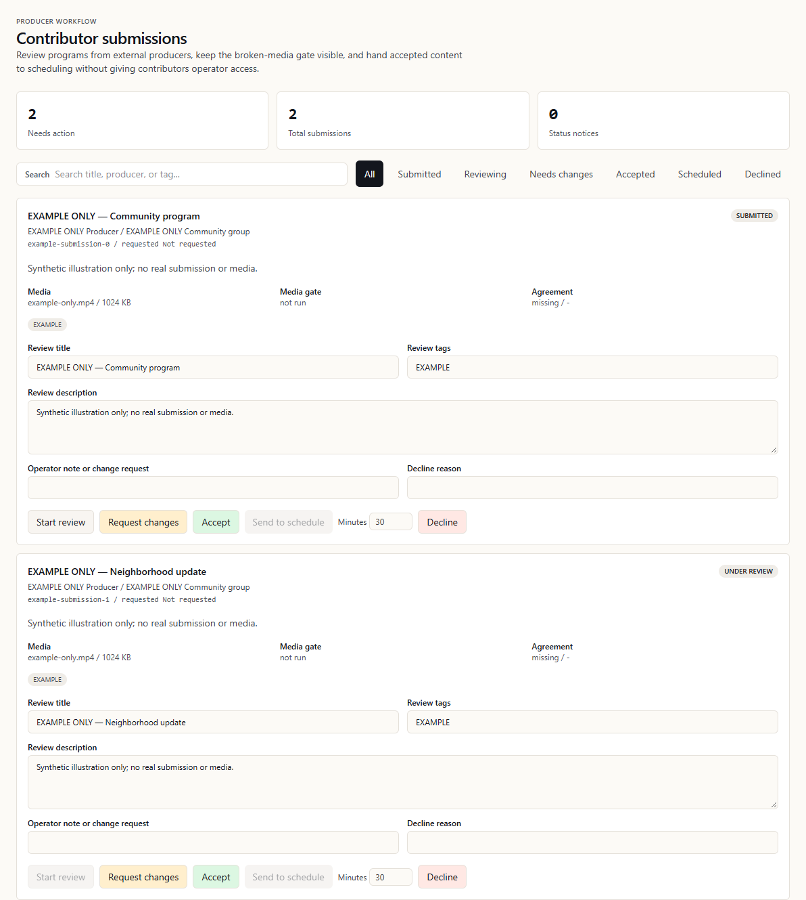{width=90%}

*Figure: the current-source Contributor submissions screen with synthetic Submitted and Under review examples. No real submission, media, agreement, notification or review decision was accessed or changed.*

> **For IT staff:** upload limits, the intake folder, and the file that holds submissions are described in [Part II, Running it day to day](#ch-operations).

### If it did not work

#### Schedule and Program Guide

| What you see | Cause | What to do |
| --- | --- | --- |
| "Could not load schedule." with "This action requires one of these CivicCast roles: publish_operator, setup_admin, support_admin." | Your role cannot read the schedule | Ask your station administrator for the publish operator role |
| "Durable storage is not ready." with **Go to Setup** | The station's database is not set up | Click **Go to Setup** and prepare storage ([Part II, Installing](#ch-installing)) |
| "No validated assets." | No Validated video in the library | Upload a video on **Assets**. A CivicCast recording is not offered (see Known issue above). |
| "Time slot conflicts." | Another program overlaps on that channel | Choose a different time or channel, or cancel the other item |
| "Could not schedule." plus a detail | The station refused the item, for example the video no longer exists | Read the detail and fix it |
| "Could not check whether this is ready to publish." | The safety check failed to run | Try again; if it repeats, tell your IT person |
| "Could not publish this to residents." | A new clash appeared (409), or the video became unplayable (422) | Run **Publish to residents** again and read the new review |
| "Could not add to guide." with "meeting_operator, support_admin" | Your role cannot write to the guide | Ask for the meeting operator role |
| **Skipped · conflict** or **Skipped · not playable** | See the table under "Fix a skipped airing" | Fix the cause, then place that airing by hand on **Schedule** |
| A program is in **Next 7 days** but is not on the air | It is Scheduled, not Published | Approve it on **Schedule** |

#### Auto-schedule

| What you see | Cause | What to do |
| --- | --- | --- |
| "Rolling window must be a whole number from 14 to 60 days." | The number is out of range | Type a whole number from 14 to 60 |
| "This rule points at a saved search or daypart that no longer exists." | You deleted one of them | Edit the rule and choose again |
| "Compile failed." or "Simulation failed." | The station refused the request | Read the detail in the red box; check **Go to Setup** if it mentions storage |
| "Viewing and managing … requires the publish operator, setup admin, or support admin role." | Your role is not allowed here | Ask your station administrator |

#### Recording

| What you see | Cause | What to do |
| --- | --- | --- |
| "Slug required: lowercase letters, digits, hyphens." | Schedule ID has a bad character | Use only lowercase letters, digits and hyphens |
| "Duration must be HH:MM:SS — minutes and seconds need two digits (e.g. 01:05:00 not 1:5:0)." | Wrong time format | Type `01:05:00` |
| "Time must be HH:MM (24h UTC)." or "Pick at least one weekday." | Weekly fields incomplete | Fix the time and tick a day |
| "No SDI capture input was detected or configured." (it names the source kind you chose, for example HDMI) | No card found | Check the card is installed, click **Inspect capture devices**, then ask your IT person |
| Amber banner "Scheduled recording runtime is unavailable in this deployment…" after **Record now** | The recorder part of the station is not running | Ask your IT person. Schedules can still be saved. |
| "An overlapping recording is already armed/active on this source" | A capture is already running on that input | Wait for it, or stop it |
| "Recording schedule '…' already exists. Use PATCH to update." | You pressed **Create schedule** twice | The first one worked; look in **Schedules** |
| A recording has state `failed` | The capture stopped with an error | Read the text in **Failure** and tell your IT person ([Chapter 8](#ch-something-wrong)) |

#### Agendas

| What you see | Cause | What to do |
| --- | --- | --- |
| "Agendas require the records clerk or meeting operator role. Ask your station admin for access." | Your role cannot use this screen | Ask your station administrator |
| "Meeting agenda '…' already exists. Use PATCH to update." | That agenda ID is taken | Pick a new ID |
| "Another agenda item already occupies (agenda_id='…', order=…)." | Two items share an Order | Give the new item an unused Order |
| "Couldn't find any recognizable items in that PDF. Try pasting the agenda's text instead." | The PDF has no readable text | Paste the text and use **Import** |
| "Only plain-text and PDF agendas import here today (DOCX and other formats are a follow-up)." | Unsupported file type | Use a PDF or paste text |
| "Agenda import is not enabled…" | The outside-system import is off | Ask your IT person |

#### Contributors

| What you see | Cause | What to do |
| --- | --- | --- |
| "Contributor queue could not load." | Any failure on the screen, or no permission | Read the reason underneath, then **Retry** |
| "The broken-media probe could not read this file -- it is likely corrupt or truncated: …" after **Accept** | The producer's file is damaged | **Decline** with a reason and ask the producer to send it again |
| "The contributor's uploaded file is no longer on disk and cannot be accepted. Ask the contributor to resubmit." | The file was removed from the intake folder | Ask the producer to resubmit |
| "Could not build a schedule item from this handoff" or "Schedule conflict on channel '…': …" after **Send to schedule** | See the Known issues above | Use **New scheduled item** on **Schedule** |
| Producer sees "Choose a video file before submitting." | No file was chosen | Choose a file |
| Producer sees "This address has already used its contributor upload budget for this station." or "Too many contributor uploads from this address. Wait before trying again." | Upload limits were reached | Wait, or ask your IT person to raise the limits |
| Producer sees "This station's contributor upload storage is full…" | The intake folder is full | Tell your IT person |

### Related

- [Chapter 2: Signing in and finding your way around](#ch-signing-in) for roles and the left menu
- [Chapter 4: Running the meeting](#ch-running-meeting) for the Channels screen, where you can also approve a program to air and take a program off the air
- [Chapter 5: After the meeting](#ch-after-meeting) for assets, chapters and the trim editor
- [Chapter 6: Publishing, and what residents see](#ch-publishing) for the resident portal
- [Chapter 8: When something looks wrong](#ch-something-wrong)
- [Appendix: roles](#app-roles)

<!-- SOURCES: inventory/screens/schedule.md; inventory/screens/guide.md; inventory/screens/autoschedule.md; inventory/screens/recording.md; inventory/screens/agendas.md; inventory/screens/contribute.md; inventory/screens/public-contribute.md; inventory/screens/public-schedule.md; inventory/screens/public-agenda.md; inventory/screens/channels.md (Commit programs to air, Take off air); inventory/screens/assets.md (validated vs recorded); civiccast/egress/source_plan.py:490-515; civiccast/egress/dispatcher.py:1-60; civiccast/schedule/router.py:195-236,1195-1215; civiccast/schedule/commit_service.py:55-200; civiccast/schedule/playout_router.py:100-260; civiccast/schedule/store.py:1047-1135; civiccast/schedule/models.py:960-975; civiccast/schedule/autoschedule_materializer.py:1-60,195-300; civiccast/schedule/autoschedule_worker.py:1-50; civiccast/schedule/autoschedule_planner.py:77-111; civiccast/schedule/autoschedule_query.py:185-223; civiccast/schedule/autoschedule_store.py:237-246; civiccast/app.py:985-1030,1472-1481; civiccast/programlog/router.py:255-379; civiccast/programlog/materializer.py:1-30,60-77,150-250; civiccast/programlog/occurrences.py:14-60; civiccast/programlog/models.py:1-15; civiccast/recording/router.py:195-296,334-375; civiccast/recording/service.py:60-80,610-625,716-751,1002-1075,1235-1285; civiccast/recording/runtime.py:58-80; civiccast/recording/models.py:84-96,283-330; civiccast/agenda/router.py:488-505,540-575; civiccast/agenda/service.py:130-145; civiccast/agenda/store.py:245-258; civiccast/contribute/router.py:90-160,489-535,769-800,922-975,1088-1100; civiccast/contribute/store.py:195-215,836-862; civiccast/contribute/models.py:122-137,171-180,253-266; civiccast/apps/portal-operator/src/screens/{ScheduleScreen,ProgramGuideScreen,AutoScheduleScreen,RecordingScreen,AgendasScreen,ContributeScreen}.tsx; civiccast/apps/portal-operator/src/components/schedule/ScheduleDrawer.tsx; civiccast/apps/portal-operator/src/components/programlog/ProgramSlotDrawer.tsx; civiccast/apps/portal-operator/src/components/shell/Sidebar.tsx:105-165; civiccast/apps/portal-public/src/screens/HomeScreen.tsx:237-300; civiccast/apps/portal-public/src/screens/WatchScreen.tsx:150-160. Checked by running pydantic on the models: a time with no zone is accepted by contribute ScheduleHandoff but refused by schedule ScheduleItemCreate (scheduled_at must be timezone-aware). -->

\newpage

## Running the meeting {#ch-running-meeting}

This chapter is for the people who work the room on meeting night: the camera operator, the meeting operator, and the volunteer who watches the screen while the council meets. It shows you how to check that the station is ready, run a live session, start and stop a channel, take a channel live from a camera, put scheduled programs on the air, drive the production control room, show community announcements between programs, and bring in remote guests. It also tells you, control by control, what each button really does. In this version of CivicCast several buttons that sound like "go on air" do something smaller than their names say, and a few things happen without any "Are you sure?" box.

> **Note:** CivicCast 1.0.0-beta.10 was published on 2026-10-02 as a GitHub pre-release, which means a beta candidate and not a finished product. The automatic "clean install" test passed. The upgrade test and the download-only test were not run, and no human field tester has signed it off yet. This chapter was written by reading the program's screens and code. Where a control behaves differently from the words on it, a **Known issue (beta.10)** box says what really happens and what to do about it.

### Before you start

**Where the screens are.** Everything in this chapter is in the left-hand menu of the operator console, in the section called **Run Meeting**: **Live**, **Facility**, **Control Room**, **Remote Contribution**, **Channels**, **CG Board** and **CG Designer**. The **Readiness** screen is in the section called **System Health**, which is folded shut until you click its name. If you have yet to sign in, see [Signing in and finding your way around](#ch-signing-in).

**Who can press what.** CivicCast has five roles. The table lists the role each control in this chapter needs. If your sign-in lacks the role, the screen usually shows a grey or amber note instead of working buttons.

| What you want to do | Role you need |
| --- | --- |
| Create, run and end a live session (Live) | Meeting operator |
| Check a meeting source (Live) | Meeting operator or Setup admin |
| Change a meeting source's address (Live) | Setup admin |
| Start, stop and restart a channel's feed (Channels) | Meeting operator |
| Take a channel live, return to schedule (Channels) | Meeting operator or Setup admin |
| Approve a program to air, take it off (Channels) | Publish operator or Setup admin |
| Change "Keep this channel on air" and other 24/7 settings | Setup admin |
| Lower-third banner (Channels) | Meeting operator (the screen only enables it for this role) |
| Open a Control Room session and fire cues | Meeting operator |
| Create a remote-guest room | Setup admin |
| Open a room, invite, admit, put guests on air | Meeting operator |
| Add and review community bulletins (CG Board) | Publish operator or Setup admin |
| Change the board layout (CG Designer) | Publish operator or Setup admin (Support admin can look only) |
| Facility router previews | Meeting operator or Support admin (see the Known issue in the Facility task) |

> **Note:** In beta.10 the sign-in screen accepts only the first administrator's password or a recovery code, and that sign-in carries all five roles. On most stations that means everyone who signs in can do everything in the table. The limits matter only if your IT person has set up limited sign-ins. See [Signing in and finding your way around](#ch-signing-in).

**What must already be set up.** CivicCast cannot do these things from the screens in this chapter, so someone with the Setup admin role must have done them first.

* A meeting source (a camera or encoder CivicCast can pull video from) has been added. If none exists, the **Live** screen shows a card titled "Choose a camera or test source" with a link **Open camera and test media setup**.
* Each channel has an *outgoing-feed configuration*. This is the saved description of where the channel's video is sent (the resident web player, the *cable headend* - the equipment at the cable company that puts your channel on the cable system - and so on). Without one, the **Start** button on **Channels** stays grey.
* A recording location exists (the Live screen lists it as "Recording targets").

> **For IT staff:** setup of sources, outgoing feeds and recording locations is in [Configuring the station](#ch-configuration) and [Cable headend, streaming, CDN, federation, emergency alerts, the API](#ch-integrations).

**Times on these screens.** No screen in this chapter asks you to type a time. Times that CivicCast shows you (for example, in the list of programs on **Channels**) are formatted by your web browser in the time zone of the computer you are using. The one exception is the Control Room "locked by ... since ..." message, which shows the time in a raw year-month-day form that is normally UTC.

#### Several different things called "on air"

The most important idea in this chapter: CivicCast has several separate controls that all say "on air", and each changes something different. Read this table once before meeting night.

| What you press | What it really changes |
| --- | --- |
| **Live** > **Start Live Stream** | The *live session record* and the public "on air" status residents see on the portal home page. It does **not** start or switch the channel's video feed. |
| **Channels** > **Start**, **Stop**, **Restart feed**, **Finish current item, then stop** | Sends a command to the channel's feed program. This is what starts and stops the channel's actual video. |
| **Channels** > **Take live** | Switches the channel from its schedule to a camera or encoder source right now. |
| **Channels** > **Approve & put on air** | Approves one scheduled program so it plays at its scheduled time. It does not play it at the moment you click. |
| **Remote Contribution** > guest **On air** | Marks the guest on air and also switches the whole channel to its live source (the same thing as **Take live**). |
| **Control Room** > **Fire cue** | Sends a command to your production gear (OBS, vMix, a camera, a router). It does not put anything on a channel. |

#### A few words used here

* **Channel:** one outgoing program stream, such as "government". It has its own schedule and its own feed.
* **Feed (outgoing feed):** the background program that builds a channel's video and sends it to its outputs. Starting and stopping a channel means starting and stopping this feed.
* **Slate:** a plain card the channel shows when nothing is scheduled. The channel screens call this state "Showing slate".
* **Source:** a camera, encoder or test video CivicCast can pull live video from.
* **Session:** a period of work that has a start and an end, in the Live room or the Control Room.

### Check that the station is ready

Do this early on meeting night, before anyone is in the room. The same screen is covered in more depth in [When something looks wrong](#ch-something-wrong).

1. In the left menu, under **System Health**, click **Readiness**. The page's own title is "Safe to broadcast".
2. Read the banner called "On air right now". It lists each channel with a state word and a small colour tag, and it updates itself about every 5 seconds.
3. Read the card under the title. Its tag is **Ready** (green), **Check before meeting** (yellow) or **Do not broadcast yet** (red). The card's heading can also read "Ready with optional items", which means only optional items still need attention. The card's text says what to do next.
4. To run a full test, click **Check broadcast readiness**. This needs the Meeting operator role.

You should see a card titled "Broadcast readiness check result" with a line "Rehearsal result" that reads **Passed**, **Failed** or **Not run**.

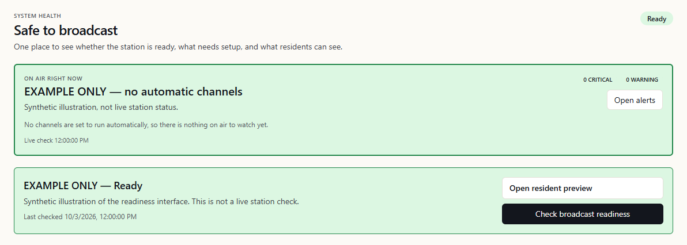{width=90%}

*Figure: the actual Readiness screen with synthetic example results. This illustration is not evidence that a station passed its checks.*

> **Warning:** **Check broadcast readiness** has no confirmation box. It creates a private test live session called "Private first-broadcast rehearsal" on the channel `government`, copies the sample test video that was set up during first setup (if there is none, the result reads **Not run**), and saves a short test recording. If they do not already exist, it also adds a source called "CivicCast sample test source" (see the Known issue under "Choose and check a meeting source") and a test recording location. In the code we read, the test session is marked "On air" for a moment and then ended, and the portal home page reads the live session record, so residents could briefly see the test session as on air. We have not watched this happen. We could not confirm whether the test recording shows up in the Assets list. Do not run this check while a real meeting is on air.

> **Known issue (beta.10):** the Readiness page has no Refresh button. Only the "On air right now" banner updates by itself. The checklist, the feed cards and the other panels change only after you use one of their own buttons or reopen the page.

### Choose and check a meeting source

The **Live** screen walks you through one meeting from "pick a source" to "end and save the recording". The first step is to choose which source CivicCast will test.

1. In the left menu, under **Run Meeting**, click **Live**.
2. Read the top of the page: the heading "Live", then the sentence "Run pre-flight and start only after CivicCast verifies the source, storage, and network from the server." On the right are small tags showing the session state ("No session" until you create one) and, later, "Pre-flight ready" or "Pre-flight blocked".
3. Read the **Safe to broadcast** panel. It says **Ready**, **Check before meeting** or **Do not broadcast yet**, and has a **Resident preview** link that opens the resident portal in a new tab.
4. Open the **Broadcast channel** menu and choose the channel for this meeting. Your browser remembers the choice. Once you create a session, the menu is locked and says "Channel is fixed while a session exists."
5. Under **Source switcher**, click the card for the source you want to use.
6. Click **Check source**. The button reads "Checking source..." for up to about 8 seconds while CivicCast tries to read video from the source.

You should see the source's tag change to **Delivering** and text such as "Checked just now" or "Checked 2 seconds ago". The other tags are **Needs re-check** (video was seen, but longer ago than 30 seconds), **Not answering** (the last check failed; the reason appears in a red box titled "Live action failed.") and **Not checked**.

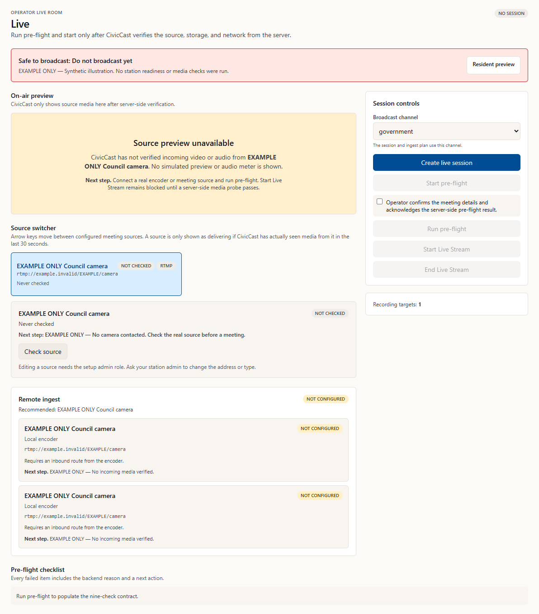{width=90%}

*Figure: the current-source Live screen before a session exists, with a synthetic example source and recording target. No camera, media or station readiness check was run.*

> **Tip:** a source's **Delivering** answer expires after 30 seconds by default (your IT person can change this to anything from 5 to 300 seconds). Run **Check source** again immediately before you do anything that depends on it, especially **Take live** on the Channels screen.

> **Known issue (beta.10):** the heading "Source switcher" is misleading. Clicking a card only chooses which source the checklist will test. It does not switch any video on the air. Also, the box titled "On-air preview" never shows video. In the code we read, nothing draws a picture there. It always says "Source preview unavailable" and "No simulated preview or audio meter is shown." Watch your own monitor or the channel output for the picture.

> **Known issue (beta.10):** setup, or **Check broadcast readiness** on the Readiness screen, can add a source called "CivicCast sample test source" on the channel `government`. In the code we read, the **Run pre-flight** "Live source" row passes for that source by checking CivicCast's own sample video file, not a camera, so a pre-flight with that source selected proves nothing about your room. For a real meeting, choose your own camera or encoder source. **Check source** still tests that source over the network, and the code's own comments say nothing listens at its address, so it is not expected to pass.

If a Setup admin needs to change a source's address, they click **Edit source**, change the fields and click **Save source**. CivicCast warns: "Saving this change clears what CivicCast knows about this source. You will need to choose Check source again before it can take air." That warning appears only after you change the address, the type or the stored credential. Anyone else sees "Editing a source needs the setup admin role. Ask your station admin to change the address or type."

### Run a live session

A live session is CivicCast's record of one meeting being broadcast. These steps are in the order the buttons enable themselves. *Pre-flight* is a set of nine tests CivicCast runs before it lets you mark the session on air.

You can reopen an unfinished meeting after refreshing or returning from another screen. Choose its channel, then select the correct **Existing meeting** by its ID and state. CivicCast reads the saved state; reopening does not start or end a stream, change the channel feed, or take over a source. It never picks a meeting for you, even when only one exists. Pre-flight results and your confirmation are not restored: check them again before starting.

1. Choose your channel and source and run **Check source** until it says **Delivering** (see the previous task).
2. In the **Session controls** box, wait for the existing-meeting check. If the channel has no unfinished meetings, click **Create live session**. The tag changes from "No session" to **Idle**. The title is "Council live room", but each meeting gets a new unique ID, shown in the controls. If an unfinished meeting is listed, reopen it instead of creating a replacement.
3. Click **Start pre-flight**. The tag changes to **Pre-flight**. This button only moves the session to the next step. It checks nothing.
4. Tick the box "Operator confirms the meeting details and acknowledges the server-side pre-flight result."
5. Click **Run pre-flight**. The **Pre-flight checklist** at the bottom of the page fills with nine rows. You can run it as many times as you like.
6. Read every row. A row that failed has a red border and a "Next step." line telling you what to fix. Fix it, then click **Run pre-flight** again until the tag at the top says **Pre-flight ready**.
7. When you are ready, click **Start Live Stream**.

You should see the session tag change to **On air**. If the checks fail at this moment, a red box titled "Live action failed." says "Go on air blocked: a fresh source-bound server-side pre-flight did not pass. No broadcast was started. Correct the failed checks and run pre-flight again." CivicCast runs the checks again, including a new source check, when you click, so the click can take several seconds.

> **Warning:** **Start Live Stream** has **no confirmation box**. It sets the live session to "On air". The resident portal's home page then tells residents "Council live room is on air." and shows State "On air", whether or not the channel is actually broadcasting. Click it only when the channel's feed really is running (see [Start a channel](#start-a-channel)).

> **Known issue (beta.10):** in the code we read, **Start Live Stream** changes the session record and the public status only. It does not start the channel's feed, and it does not put your source on the channel. The error message above says "No broadcast was started", but a successful click does not start one either. To put a camera on a channel, use **Take live** on the Channels screen. If the channel's own feed is running, residents see it whether or not you press **Start Live Stream**.

The nine rows in the checklist are: **Network reachable**, **Recording storage**, **AI runtime**, **Live source**, **Recording target**, **Operator confirmation**, **Syndication**, **Internet Archive** and **NAS handoff**. Only five can stop you from going on air: Network reachable, Recording storage, Live source, Recording target and Operator confirmation. The other four report status and do not block. (AI runtime is optional here; Syndication, Internet Archive and NAS handoff describe what will happen to the recording after the meeting. A row for one of those three can show a red border, with the message that the broadcast can still go ahead.) What the five really test:

| Row | What it checks |
| --- | --- |
| Network reachable | The station can open a connection to at least one of two public internet addresses, 1.1.1.1 and then 8.8.8.8 (it waits up to 3 seconds for each by default). A station with no internet access cannot pass. |
| Recording storage | At least 50 GiB (about 50 gigabytes) is free on the drive CivicCast keeps its uploaded files on. This is the CivicCast data drive, not necessarily the recording drive. |
| Live source | The source you selected belongs to the session's channel and passes a fresh check. |
| Recording target | A real (not test) local recording location is configured. |
| Operator confirmation | The box in step 4 is ticked. |

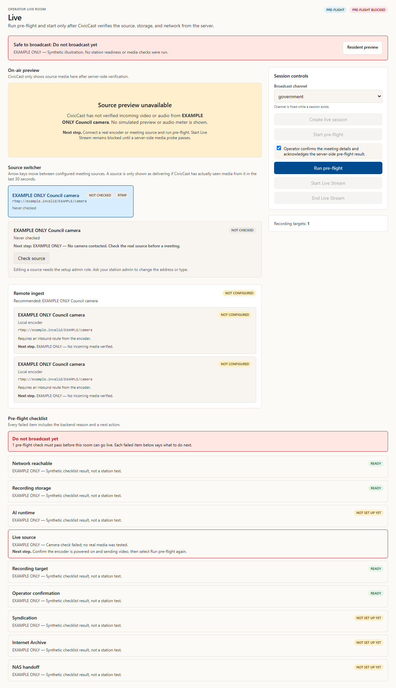{width=70%}

*Figure: the current-source nine-row Pre-flight checklist with synthetic example results. The failed camera row shows a red border and a "Next step." line; no actual pre-flight or source check was run.*

> **Known issue (beta.10):** three more things on this screen are easy to misread. First, the **Safe to broadcast** panel near the top is worked out from the last test on the Readiness screen, not from the checklist on this page, so it can say "Check before meeting" while this page says "Pre-flight ready". Second, the hint on a failed Operator confirmation row says to tick the box "below", but the box is in **Session controls**, above the checklist. Third, the empty checklist says "Run pre-flight to populate the nine-check contract." It means "Click **Run pre-flight** to check the camera, the recording drive, the internet and your confirmation."

After the session reaches **Recorded**, you can create the next meeting with a new ID. **Ending** is not complete: reopen that session to watch finalization or retry it after a failure. **Retry finalization** is disabled unless a Meeting operator has successfully recovered current meeting controls and the finalization status can be read. Completed meetings leave this recovery list; their recordings are in **Assets**. Changing the channel clears the selected controls without ending any meeting.

If the existing-meeting check fails, **Create live session** stays disabled. Use **Retry meeting list**; sign in again if access expired. If reopening fails, no broadcast action was taken; use **Retry meeting recovery**. Do not create a replacement to work around a failed read. Live action errors still include generic server/database advice; use the specific error above it to decide what to correct.

### End a live session and find the recording

1. When the meeting is over, click **End Live Stream**. It is enabled only while the session is **On air**.
2. A box titled "End the live stream?" appears. Click **End live stream** to confirm, or **Cancel**.

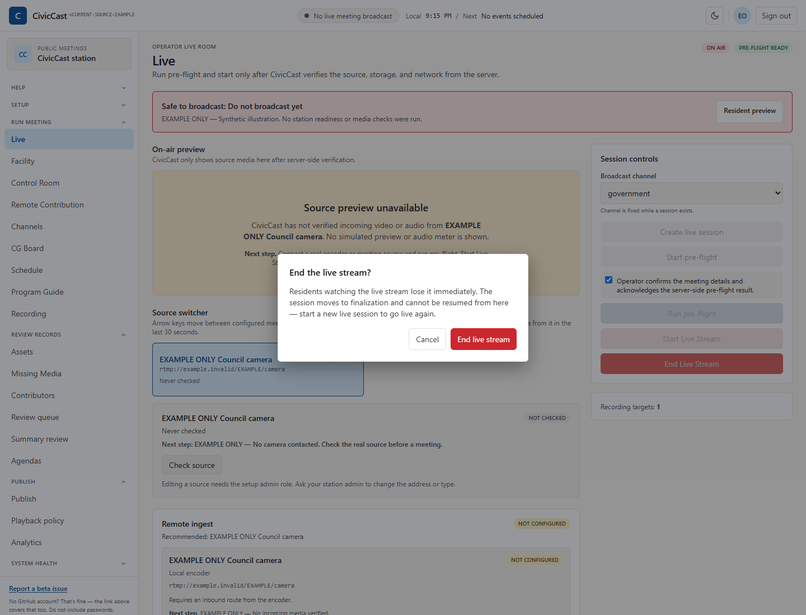{width=70%}

*Figure: the current-source End Live Stream confirmation over a synthetic example session. The dialog was cancelled; no real session or stream was started or ended. Its wording about residents does not match what the code does; see the warning below.*

3. Watch the **Recording finalization** panel that appears. It shows **Waiting**, then "Attempt N of M. The recording is being checked and packaged.", then "Recording saved as asset <id>. Find it in the Assets library."

If it fails, the panel shows the reason (or "Finalization failed."). Fix the cause, then click **Retry finalization**. See [After the meeting](#ch-after-meeting) for what to do with the saved recording.

> **Warning:** the box says "Residents watching the live stream lose it immediately." In the code we read, that is not true. **End Live Stream** only marks the session as ended and starts the saving of the recording. It does not stop the channel's feed, so the channel keeps broadcasting. To take the channel off the air, use **Stop** or **Finish current item, then stop** on the Channels screen.

> **Known issue (beta.10):** the saving step looks for a recording file named after the session in the recording location (for example `meeting-<unique ID>.mp4`). Nothing on this screen creates that file, and in testing we could not confirm which part of CivicCast does. If the panel stays on **Waiting** or fails, ask your IT person to check that the recording location is receiving the meeting recording. By default CivicCast gives up waiting for the file 30 minutes after **End Live Stream**, and the panel then reads "No recording file was found for this session (expected ...)". While CivicCast is still retrying by itself the tag reads "Retrying". **Retry finalization** appears only after CivicCast has given up. It is shown to every role, but only a Meeting operator can use it.

### Start a channel

The **Channels** screen controls each channel's actual video feed.

1. In the left menu, under **Run Meeting**, click **Channels**. The heading is "Channels" and a tag says "refreshes every 30s".
2. In the row of channel cards under the heading, click the card for the channel you want. Each card shows the channel's name and its id (for example `government`). The first channel is selected for you.
3. Find the box **Outgoing channel feed**. It shows a state tag. The words you can see there are **On air**, **Showing slate**, **Starting**, **Stopping**, **Finishing current item**, **Changing source**, **Stopped** and **Needs attention**.
4. Click **Start**.
5. A box titled "Start the outgoing feed for <channel>?" says "<channel> goes live to its configured outputs and becomes visible to residents." Click **Start feed**.
6. The button reads "Queuing..." for a moment. The screen then checks the feed every 2 seconds for 20 seconds.

You should see the state tag change to **Starting** and then **On air**, or **Showing slate** if nothing is scheduled right now. "Starting" means CivicCast is preparing the first program, which can take a while on a cold start.

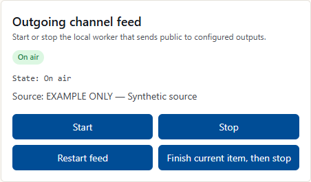{width=90%}

*Figure: the Outgoing channel feed box with synthetic example data. The On air state is an illustration, not proof that a station is broadcasting.*

> **Warning:** **Start** makes the channel visible to residents and to every output set up for it (the web player, and any cable or streaming output). Start a channel only when you mean it to be public.

Clicking **Start** only *queues* a command. The feed program picks it up afterwards. If it does not, after 20 seconds a red box says "Start was queued but the feed did not start." and tells you to check that the CivicCast egress service (the background program that sends the channel out) is running on this station (System Health), then try **Start** again.

If **Start** is grey, a line under the button says why:

* "No outgoing-feed configuration for <id>. Apply a headend preset or the local rehearsal preset first." The channel has never been set up. Ask a Setup admin.
* "Outgoing feed for <id> is disabled in its egress configuration. Enable it in Outgoing feed configuration, then start."
* "Checking for an outgoing-feed configuration..." Wait a moment.
* "Could not check the outgoing-feed configuration for <id>. Retry the check, then start." Click **Retry check**.

If you see "Outgoing feed controls require the meeting operator role.", your sign-in cannot use these buttons.

### Stop, restart or finish a channel

Use the same **Outgoing channel feed** box.

| Button | Box that appears | Confirm button |
| --- | --- | --- |
| **Stop** | "Stop the outgoing feed for <channel>?" - "This takes <channel> off the air. Residents watching lose the stream until the feed is started again." | **Stop feed** |
| **Restart feed** | "Restart the outgoing feed for <channel>?" - "The stream drops briefly for residents while <channel> restarts." | **Restart feed** |
| **Finish current item, then stop** | "Finish the current item, then stop <channel>?" - "<channel> plays out its current item and then goes off the air until the feed is started again." | **Finish, then stop** |

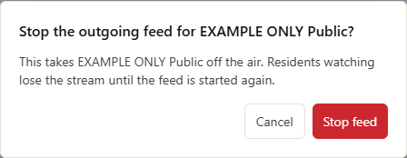{width=70%}

*Figure: the Stop confirmation for an example channel. The dialog was cancelled; no outgoing feed was stopped.*

> **Warning:** all three commands change what residents see right now. **Stop** drops the stream at once. Use **Finish current item, then stop** at the end of a meeting if you want the program to end cleanly.

> **Warning:** **Stop** may not keep the channel stopped. If **Keep this channel on air** is switched on for that channel (see the next task), CivicCast starts the channel again by itself after you stop it. The Stop box does not mention this.

> **Known issue (beta.10):** the screen refreshes every 30 seconds, and only **Start** is watched more closely. The screen does re-read the feed state once right after you confirm **Stop**, **Restart feed** or **Finish current item, then stop**, but the feed program may not have acted yet, so the state tag can take up to about 30 seconds to change. Do not click the button again straight away. Wait for the tag to change.

### Keep a channel on air all day (the 24/7 setting)

The box **Run this channel 24/7** holds the setting **Keep this channel on air**. Only a Setup admin can change it. Everyone else sees "Automation settings require the setup admin role."

The checkbox's own hint reads "Starts the feed automatically after restarts and crashes." The same box has **Allow software (CPU) encoding fallback**, a choice of **Station slate** or **Community bulletins** under "Between programs, show", a **Slate message**, and two optional output names for network video (**NDI output name (optional)**) and a video card (**SDI output device (optional)**). To save any change, click **Save automation settings**. It is enabled only after you change something, and "Unsaved changes" appears beside it.

What "Keep this channel on air" really does, from the code we read:

* By default, about every 2 seconds, CivicCast's automation looks at every enabled channel with this setting on.
* If the channel's feed is not running, CivicCast queues a **Start** for it. If the channel still is not running, it queues another about every 30 seconds.
* The code does not remember that a person pressed **Stop**. Its own comments describe "a stop the operator issued" as a reason to send a new start.

> **Warning:** **Save automation settings** has **no confirmation box**. Saving with **Keep this channel on air** ticked, on a channel whose configuration is enabled, can put the channel on the air without anyone pressing **Start**.

> **Known issue (beta.10):** with **Keep this channel on air** on, pressing **Stop** or **Finish current item, then stop** may only pause the channel for a short time. We read this in the code and have not watched it on a running station, so treat the exact timing as approximate. To keep a channel off the air, have a Setup admin untick **Keep this channel on air** and click **Save automation settings** first, then use **Stop**.

> **Known issue (beta.10):** if a channel has no outgoing-feed configuration, this box says "This channel has no outgoing-feed configuration yet. Create one from the channel egress runbook (or the setup flow) first; then automation settings appear here." A non-technical person cannot do that. The real fix is for a Setup admin to apply a headend preset (see the Cable headend box on the same screen, or ask IT).

### Take a channel live from a camera (live takeover)

A *takeover* puts a live source on a channel right now, ahead of whatever is scheduled. You then hand the channel back to its schedule when you are done.

1. On the **Live** screen, click your source's card and click **Check source** until it says **Delivering**.
2. Go to **Channels** and click the channel. Find the box **Live takeover**. It says "This channel is on its scheduled program." Return to Live and reopen the correct **Existing meeting** when you need its controls.
3. Click **Take live**. If it is grey, the line beside it says "No live source is ready yet." Go back to step 1. By default the button goes grey again 30 seconds after your last good **Check source**. The Channels screen asks for this state every 15 seconds, so after a fresh **Check source** the button can take up to about 15 seconds to turn on.
4. A small form appears with the question "Why are you going live? (optional)". Type a reason if you like.
5. Click **Confirm take live**, or **Cancel**. The button reads "Going live…" while CivicCast works.

You should see a red badge reading "Live takeover" with the name of the person and how many minutes it has been live.

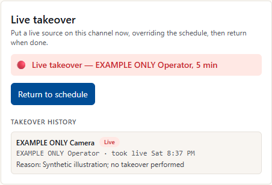{width=70%}

*Figure: the Live takeover box with a synthetic five-minute session and example operator and source. No live takeover or return to schedule was performed.*

> **Warning:** **Confirm take live** overrides the schedule and changes what is on the air. There is no pop-up. The second click is the confirmation. If the source's last good check is older than the window (30 seconds by default) when you confirm, the code we read refuses the takeover before it re-checks anything. The error can then read something like "Live ingest path '<channel>:local' is disabled.", which names CivicCast's built-in placeholder path and not your camera. Click **Check source** again and retry. If the channel is already under takeover, the error says "Channel '<id>' is already under live takeover."

To hand the channel back:

1. In the same box, click **Return to schedule**.
2. Optionally type a note (the example text is "e.g. meeting adjourned").
3. Click **Confirm return to schedule**, or **Stay live** to cancel.

> **Warning:** **Confirm return to schedule** changes what is on the air. The takeover history marks the takeover "Returned" as soon as the command is queued, not when the feed has actually switched back.

> **Known issue (beta.10):** the screen never says which source it will use, and the source card you picked on **Live** is not sent with the request. In the code we read, **Take live** uses the first **Delivering** source in CivicCast's list for that channel, which may not be the one you selected. The red "Live takeover" badge shows only who took over and how long ago, not the source, and it appears as soon as CivicCast records your request, which can be before the picture has switched. The **Source:** line in the **Outgoing channel feed** box should name the live source once the switch happens (it can take up to 30 seconds to update; we did not watch this on a running station), and a Setup admin can read the source in "Takeover history". Always watch the channel's actual output. A takeover is planned for up to 3,600 seconds (one hour). In testing we could not confirm what happens when that hour ends, so return to the schedule yourself well before then.

A Setup admin also sees "Takeover history", which lists past takeovers with "Live" or "Returned", who did it, when, and the reason. If none exist it says "No live takeovers have been recorded for this channel."

### Put a scheduled program on the air (commit to air)

Programs that you want to play on a channel have to be *committed*. The box **Commit programs to air** on **Channels** does this. It lists the next 24 hours of programs for the selected channel. The same safety check is offered on the **Schedule** screen under the name **Publish to residents** (see [Before the meeting](#ch-before-meeting)); it does the same thing.

1. On **Channels**, find **Commit programs to air**. It says "Review the safety check, then approve a program to put it on this channel."
2. Under "Next 24 hours", find the program. Its tag is **Ready to review**, **Committed**, **Skipped (conflict)**, **Skipped (media)** or **Cancelled**. Only programs that are linked to a schedule item are listed.
3. Click **Review & prepare**. This is a dry run. It changes nothing.
4. Read the result. A green **Safe to air** tag means CivicCast found the media and no clash. A red **Not safe to air yet** tag comes with the reason: a message about missing media, or "Clashes with N other program(s) already scheduled:" followed by what overlaps. A gap before the program is listed as "Dead-air gap before this program (it can still air):".
5. If it says **Safe to air**, click **Approve & put on air**. To back out of the review, click **Cancel**.

You should see the program move to the "Recent commits" list with a tag: **Preparing**, **Queued to air**, **Couldn't reach the engine** or **Rolled back**.

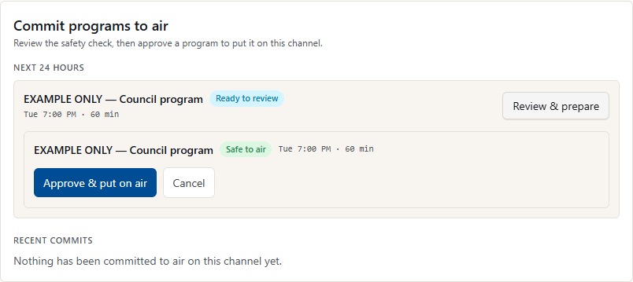{width=90%}

*Figure: an example program under review in Commit programs to air. The safety-check response is synthetic; no program was approved or put on air.*

> **Warning:** **Approve & put on air** has **no confirmation box**. It is a single click once the review says **Safe to air**. It publishes the schedule item to residents, saves an approval record in your name, and then queues a **Start** for the channel if the feed is stopped, or a reload if it is running, so the schedule is read again. The program plays at its scheduled time, not at the moment you click. On a stopped channel the click also starts the whole channel's feed.

To undo an approval:

1. In "Recent commits", click **Take off air** on that program.
2. Type a reason in the box "Why are you taking this off air?". The button stays grey until you do.
3. Click **Confirm take-off**, or **Keep on air** to cancel.

> **Warning:** **Confirm take-off** cancels the program's schedule item. It will not play, not merely pause. The engine is told to read the schedule again, and the approval is marked **Rolled back** with your reason.

> **Known issue (beta.10):** four things in this box are loose with words. The tag **Queued to air** means the command was queued, nothing more. The tag "On air (confirmed)" is never shown, because no code sets that state. A row for a future program says "aired <time>" even though it has not played. And if the list of past approvals cannot be loaded (for example, for a role that is not allowed to see it), the box still says "Nothing has been committed to air on this channel yet." instead of showing an error.

Without the Publish operator or Setup admin role, **Review & prepare** is grey and the box says "You can review the schedule here. Putting a program on air or taking it off requires the publish operator or setup admin role."
### Put a lower-third banner on a channel

A *lower third* is the strip of text across the lower part of the picture, such as "Town Council -- Live". The box **Lower-third banner** on **Channels** holds one line of text for the selected channel.

1. In **Lower-third text**, type your line (up to 240 characters).
2. Click **Put on air**. The box asks "Put this banner on air?"
3. Click **Confirm: put on air**, or **Cancel**.
4. To remove it, click **Take off air**, then **Confirm: take off air**.

> **Warning:** this changes what is on the air, but not at once. The confirmation line explains that the change applies "to this channel's next pipeline build (a fresh start or a scheduled content swap)" and "Does not hot-change an already-live broadcast's on-screen text." ("Pipeline" here means the chain of software steps that builds the channel's picture.)

> **Known issue (beta.10):** the tag beside the heading says **On air** as soon as you save, even though the picture has not changed. Treat it as "Saved: on". The banner reaches the picture only when the channel next restarts or swaps content. For this chapter we have not watched a banner appear on a live channel. The box works only for a channel that has an outgoing-feed configuration. Otherwise it says there is none yet. The screen's note says a Setup admin may also change the banner, but the button is enabled only for a Meeting operator.

### Change the cable headend (for Setup admins)

The box **Cable headend delivery** sets where a channel's cable-TV signal is sent. This is normally done once during setup, not on meeting night. If you are a Setup admin:

1. Choose a **Headend preset**, fill in the destination fields the preset needs, and click **Apply headend preset**. (For some presets the button reads **Enable web preview** instead.)
2. A box titled "Apply this headend preset?" spells out what will change. Click **Apply preset**, or **Cancel**.

> **Warning:** applying a preset changes what the channel outputs. If the channel is standing by on its slate, it restarts at once and every output drops for a few seconds. If a program is on air, nothing is interrupted and the change waits for the next stop and start. The box warns when other outputs, including the cable feed, will be removed. Do not apply a preset during a meeting unless IT has told you to.

> **For IT staff:** presets, destinations and the **Verify stream (TSDuck)** check are covered in [Cable headend, streaming, CDN, federation, emergency alerts, the API](#ch-integrations).

### Open a Control Room session

The **Control Room** drives your production equipment (OBS, vMix, Blackmagic ATEM switchers, HyperDeck recorders, PTZ cameras, CasparCG, routers and similar) during the meeting. It works through a small helper program that CivicCast calls the "TSR control service". In this chapter we call it the *production-control helper*.

You work on a *control surface*, which is a named bank of buttons. Each button is a *cue*, one action such as "Take scene" or "Router take". You open a *session* on the surface, test a cue with a *dry run* (a preview of what it would send), and then confirm it. A session is either **Test Mode**, in which nothing reaches your equipment, or **On-Air Mode**, in which cues are really sent.

> **Note:** the Control Room produces a source. It does not put anything on a channel. The page says so: "This console produces the source. Taking it to air on a channel is a Playout (S5) action — it is not fired from here." (Playout is the part of CivicCast that runs a channel; "S5" is an internal code name.) Use **Take live** on **Channels** for that.

> **Known issue (beta.10):** CivicCast's own readiness text (under **Technical detail** in the "Control-room readiness" card) says the Control Room's readiness is worked out from CivicCast's settings and test profiles, and that it is "not clean Windows install evidence, simulator evidence, real OBS/vMix/ATEM/NDI evidence, or station-device evidence." In plain words, the Control Room has not been proven against real production equipment in this beta. Rehearse in **Test Mode**, and keep your hardware's own controls within reach.

#### Read the readiness panel

1. In the left menu, under **Run Meeting**, click **Control Room**. The heading is "Production Control Room".
2. Look in the readiness panel for a card called "TSR control service". If it is blocked, the helper is not running or cannot be reached. Tell your IT person. A separate amber bar that says "Production control unavailable — the TSR control service is not running or not configured. Cues cannot fire until it is restored." appears only after a device probe, a cue dry run or a cue fire fails for the same reason. It does not appear when the page first opens.
3. Read the card "Control-room readiness". It has a headline tag and a second tag, either "Equipment verified" or "Equipment check pending". Under it are five counters: **Devices**, **Surfaces**, **Cues**, **Open sessions** and **On-Air**.
4. If any check is blocked or has a warning, it appears as its own card with a recovery sentence. A blocked check has a button **Open Control Room Setup**. Only a Setup admin can use that screen.

> **Known issue (beta.10):** the headline can never read **Ready**. The "equipment verified" value is permanently false in this version, so the best the headline can say is **Check before meeting**, and the amber note "You can register switchers and run dry runs now. On-air readiness is confirmed once a check against the room's actual devices passes." never goes away. No screen offers that check. Read **Check before meeting** here as "CivicCast has not verified your equipment", not "something is broken". A red **Do not broadcast yet** does mean a real blocked check.

#### Check your equipment

Under **Devices** each piece of gear is a small chip with its name, kind and tags such as **Reachable**, **Unreachable**, **Disabled** or **Not probed**, plus a health tag: **Healthy**, **Never probed**, "Stale — probe again" (older than 5 minutes) or **Unreachable**. A Setup admin or Support admin can click **Probe** on a chip to test it (the button reads "Probing…"). If there are no devices, the screen says "No devices to operate yet." and tells you to register one in Control Room Setup.

#### Open a Test Mode session

1. Open the **Control surface** menu and pick a surface ("Select a surface…" is the empty choice).
2. Leave **Test Mode** selected, and click **Open Test Session**. The page shows a blue banner: "TEST MODE - device actions are blocked and recorded as test-only audit events."
3. Click a cue's button. This is a dry run only. A plan card appears with the cue name, the command text, the tag "Ready to send" or "Not ready", and a line such as "take-delay Nms · post-roll Nms".
4. If the cue is marked as needing confirmation, click **Test... (needs confirm)**, then **Confirm test action**. Otherwise click **Record test action**.
5. Watch the **Fired-cue audit** list. The row shows **Planned**. Nothing was sent to any device.
6. When you are done, click **End session**.

You should see the banner "Test action recorded." Test Mode never touches your equipment.

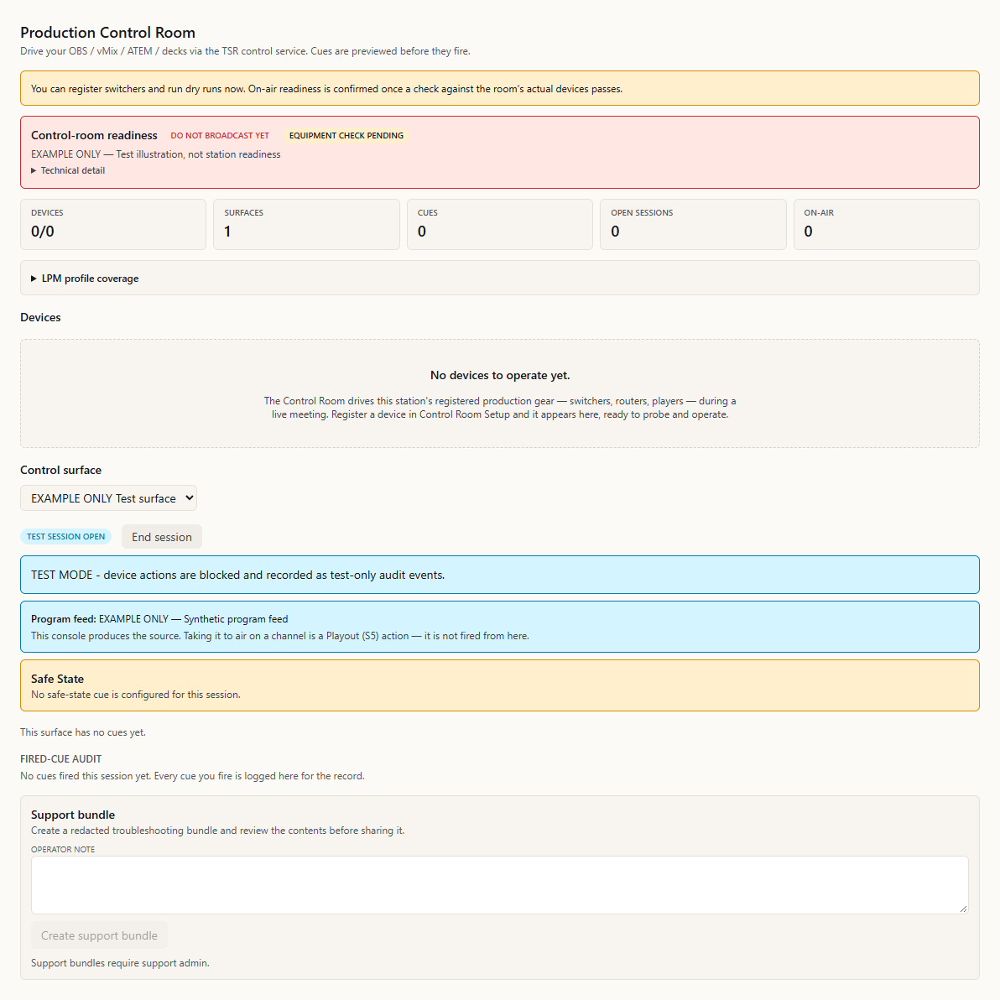{width=90%}

*Figure: the current-source Control Room with a synthetic Test Mode session, example program feed and no configured devices or cues. No actual session was opened, readiness check run or device action sent.*

#### Open an On-Air Mode session

1. Wait until the readiness panel has no blocked checks.
2. Open the **Control surface** menu and pick a surface.
3. Select **On-Air Mode**.
4. Pick a **Safe-state cue**. This is the recovery cue, the one that puts the room back in a known safe state if something goes wrong. The menu lists only cues that are marked as needing confirmation.
5. Tick the box "I understand On-Air cue actions may be sent to production devices".
6. A list called "On-Air prerequisites" shows "Ready:" or "Needs attention:" for **Control-room readiness**, **Safe-state cue selected** and **On-Air responsibility acknowledged**. When all three are ready, click **Open On-Air Session**.

You should see an amber banner: "ON-AIR MODE - cue actions can be sent to production devices. Safe-state cue: <cue id>." The banner shows the cue's internal id, not its name. The **Safe State** panel under it shows the name.

> **Warning:** in an On-Air session a cue really is sent to your equipment, and that can change the picture going to the channel. Always click the cue first (the dry run) and read the plan card.

If someone else already has the surface open, you see: "A session is already open on this surface, locked by <name> since <time>. A setup admin or support admin can force-close it to release the lock."

> **Known issue (beta.10):** an On-Air session expires **30 minutes** after you open it, and the screen never shows how much time is left. After that, the next attempt to fire a cue is refused ("On-Air Mode expired before this cue could fire. Open a new On-Air session to continue.") and the session is closed. Council meetings often run longer than 30 minutes. Write down the time you opened the session, and open a new On-Air session before 30 minutes pass. Any cue the session had already sent is not undone.

#### Fire a cue

1. Click the cue's button. The plan card appears (the dry run).
2. Read the command text and check the tag says **Ready to send**.
3. Click **Fire... (needs confirm)**, then **Confirm fire**. A cue that is not marked as needing confirmation shows **Fire cue** instead, and one click sends it.
4. Read the banner: "Cue fired." The audit list adds a row tagged **Fired**, or **Failed** if the helper could not send it.

> **Warning:** **Confirm fire** and **Fire cue** change what your production gear is doing. There is no pop-up. The two-step button is the confirmation. If the cue or the device changed since your dry run, CivicCast refuses with "The cue preview is stale ... Dry Run the cue again before Live Fire."

#### If a cue fails: Safe State and rollback

The **Safe State** panel appears once a session is open. In an On-Air session it names the recovery cue and has two buttons. In a Test Mode session it reads "No safe-state cue is configured for this session." and has no buttons, because Test Mode does not ask you to pick one.

* **Dry Run Safe State** previews the recovery cue.
* **Panic: Run Safe State** fires it.

If a cue fails in an On-Air session, a button **Roll back to Safe State** appears. Click it to fire the safe-state cue. A good result reads "Rolled back to Safe State."

> **Warning:** **Panic: Run Safe State** and **Roll back to Safe State** have no confirmation box. They send the recovery cue to your equipment at once.

> **Known issue (beta.10):** **Panic: Run Safe State** is grey until you have clicked **Dry Run Safe State**, and clicking any other cue's dry run makes it grey again. In an emergency it needs two clicks. After you open a session, dry-run the safe-state cue so the Panic button is ready, and dry-run it again after you dry-run any other cue. If the On-Air session has expired, **Panic: Run Safe State** is refused and the refusal closes the session, so **Roll back to Safe State** is refused after that too.

#### End a session

1. Click **End session**.
2. A box titled "End the control room session?" appears. For an On-Air session it says "This releases the operator lock on this control surface while the session is On-Air. Any cue mid-fire is not rolled back, and no operator can fire cues on this surface until a new session is opened." Click **End session**, or **Cancel**.

> **Known issue (beta.10):** the Control Room remembers your session only in the open page. If you refresh it, close the tab, or click to another screen in the same tab, you lose your handle on the session. Keep the Control Room in its own browser tab. The surface stays locked, and the screen has no button that releases someone else's lock, even though the lock message says a Setup admin or Support admin can do it. Ask IT how to release a stuck lock.

A Support admin can also type a note in **Operator note** and click **Create support bundle**. This builds a troubleshooting file with private details removed, and shows its location. Everyone else sees "Support bundles require support admin."

### Preview a router take (Facility)

The **Facility** screen is titled "Facility router". A *router* here means the video switching box that decides which camera or feed goes to which input, and a *take* is one switch.

> **Known issue (beta.10):** in this version the Facility screen is a **preview only, using sample data**. It cannot change a real router. The page says so with a tag, "hardware send disabled". The router, the sources and the destination it lists are a fixed built-in example, the same on every station: a "Control room router" at the address 192.0.2.10 (an address reserved for examples, which no real router uses), the sources "Council chamber" and "Bulletin board", and the destination "CivicCast capture". Do not treat them as your equipment. In the code we read, there is no screen or command that loads your own router.

What it does show is the exact command that *would* be sent. To look:

1. In the left menu, under **Run Meeting**, click **Facility**.
2. Click an endpoint card under **Router endpoints** (a tag shows "ready" or "off").
3. Click a route button such as "Council chamber to CivicCast capture", or use **Manual crosspoint** (choose a **Source** and a **Destination**, then click **Preview take**).
4. Read the **Take preview** card: the target, the protocol, the command, and a "Proof boundary" line that says what the preview does not do.

You should see the command text, and the tag "ready" or "blocked". No hardware is contacted, and nothing changes on any channel.

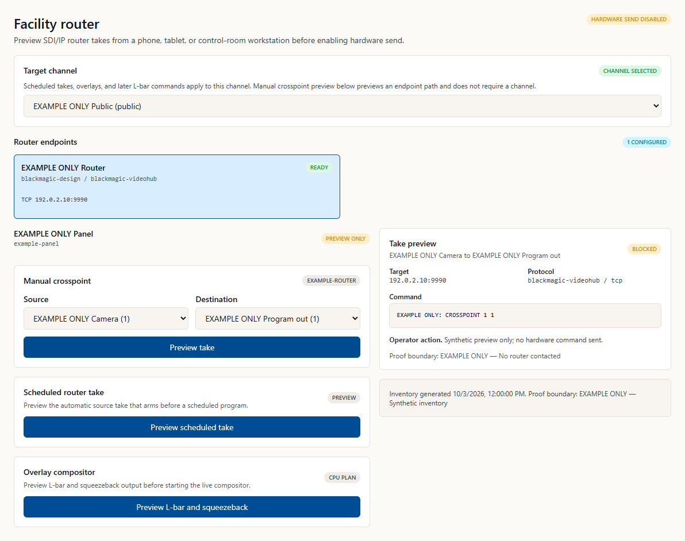{width=90%}

*Figure: the current-source Facility router with synthetic example inventory and a blocked preview result. No router was contacted or command sent; this is not a station hardware check.*

Two more previews need a channel chosen in **Target channel**: **Preview scheduled take** (a take timed 15 minutes from now with a 15-second lead, using a made-up item) and **Preview L-bar and squeezeback** (a plan for shrinking the picture to make room for a graphics frame). Neither runs anything.

> **Note:** nothing on this screen can change anything on the air. It sends nothing and has no confirmation boxes. The only real way to do a router take in this version is a Control Room cue of the kind "Router take" on a "TCP device".

> **Known issue (beta.10):** the "Take preview" card says "Operator action. Confirm the previewed route, then send the command from the router panel." There is no send control anywhere. Ignore that sentence. Also, the screen allows some roles that the server then refuses. A sign-in with only the Setup admin role can click the route buttons, **Preview take**, **Preview scheduled take** and **Preview L-bar and squeezeback** and get a refusal ("This action requires one of these CivicCast roles: meeting_operator, support_admin."). A Support admin has the opposite problem: the server allows these previews, but the screen greys out the scheduled-take and L-bar buttons for that role.

### Show community bulletins between programs (CG Board)

*CG* is short for "character generator", the part of a broadcast system that puts text and graphics on screen. In CivicCast the **CG Board** is the "community board" a channel can show between programs: a card with station and community announcements. It is **not** the lower-third banner (that is on **Channels**, see above).

The board is shown in the gaps between programs when the channel's filler is set to **Community bulletins** (on **Channels**, in "Run this channel 24/7", under "Between programs, show"). Otherwise it shows the **Station slate**. If no bulletins are approved, the channel falls back to the slate.

1. In the left menu, under **Run Meeting**, click **CG Board**.
2. Use the **Channel** menu to choose a channel ("Public board" is the first choice).
3. The **Template library** shows three layouts, and **Visual layout editor** shows a preview of the board's zones. Clicking a template only changes this preview.
4. In **Community bulletins**, click **Add bulletin**.
5. Fill in **Organization**, **Submitted by**, **Title** and **Message**. All four are required. The limits are 160 characters for the first two, 200 for the title and 500 for the message.
6. Click **Add bulletin** again (the second button, in the form). The form closes. The bulletin appears with the tag **Submitted**.
7. To let it air, click **Approve**. The tag changes to **Approved**.

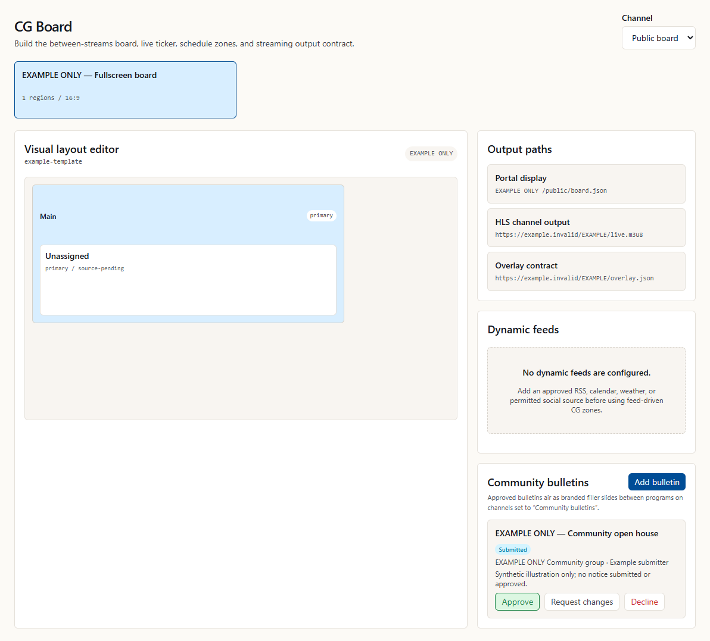{width=90%}

*Figure: the current-source CG Board with a synthetic example template and submitted community bulletin. No bulletin was created, moderated or approved, and no feed was fetched.*

To send a bulletin back, click **Request changes**, type a note and click **Send request**. The tag becomes **Needs changes**, with your note in amber ("Notes: …"). To remove a bulletin, click **Decline**, type a reason and click **Decline bulletin**.

> **Warning:** **Approve** has no confirmation box. Once approved, a bulletin is eligible to air as a slide between programs on the channel you chose in the **Channel** menu, if that channel's filler is **Community bulletins**. We did not watch a bulletin air for this chapter. **Decline** is how you pull one that is airing. A declined bulletin cannot be approved again from this screen. Add a new one instead.

> **Known issue (beta.10):** four things on this screen are misleading. The subtitle says "Build the between-streams board, live ticker, schedule zones, and streaming output contract." The screen builds nothing except bulletins. Zones and feeds are edited on **CG Designer**. The heading "Visual layout editor" is a read-only preview. The panel is visible to every signed-in person, but only a Setup admin or Publish operator can use it. Anyone else sees a red box reading "This action requires one of these CivicCast roles: publish_operator, setup_admin." There is no way to set start and end dates for a bulletin here. And if the station's database has not been prepared, adding fails with "Durable storage is not ready. Open Setup and choose Prepare storage before managing community bulletins."

### Design the community board (CG Designer)

**CG Designer** (the page title is "CG Board Designer") sets up the board itself for one channel: a template, its zones, outside feeds, a live preview and a change history. A *zone* is one box on the board, such as a ticker, a schedule, a logo, or a sponsor message. This is normally done before the meeting, not during it.

1. In the left menu, under **Run Meeting**, click **CG Designer**. You can see this item only with the Publish operator, Setup admin or Support admin role.
2. Choose a **Channel**.
3. If the channel has no board, choose a **Template** and click **Create board**.
4. To add a zone, click **Add zone**, fill in **Region**, **Zone kind** and **Content source**, then click **Add zone** again. To delete a zone, click **Delete**, then **Confirm delete?**.
5. To bring in an outside source such as a news feed or a calendar, click **Add feed**, fill in **Feed kind**, **Trust tier**, **Feed label**, **Source URL** and **Refresh (minutes)**, and click **Register feed**.
6. To vet individual feed items, click **Review items** on a feed and click **Approve** on each item you want to allow.
7. Check the **Live preview** and read **Board history** to see who changed what.

> **Warning:** the board is what viewers see between programs. Changing the **Board template** menu takes effect **immediately, with no confirmation**. Deleting a zone asks only "Confirm delete?".

> **Known issue (beta.10):** if you only have the Support admin role, you can open this screen but every Add, Edit and Delete button is missing, and nothing says why. Changing the template does not tell you what happens to existing zones, and we could not confirm that. You cannot switch a board off from here. The zone form lists some options as "coming in a future release" (live video in a zone and board background audio). Do not plan around them. Labels such as **Region**, **Zone kind**, **Trust tier** and **feed adapter** are not explained on screen. Ask whoever set up your board.

### Bring in remote guests (Remote Contribution)

**Remote Contribution** lets remote council members, presenters and public commenters join from a web browser, with nothing for them to install. CivicCast manages the *rooms*, the invite links and the guest list. The video mixing is done by separate software on your station (VDO.Ninja, a web video tool, and a *compositor*, a program that combines video sources into one picture). Those must be set up first.

> **For IT staff:** guest video needs a self-hosted VDO.Ninja service, a compositor, and a TURN relay (a server that helps guests behind firewalls connect). See [Cable headend, streaming, CDN, federation, emergency alerts, the API](#ch-integrations).

You see this item in the menu only with the Meeting operator, Setup admin or Support admin role.

#### Set up a room and send invites

1. In the left menu, under **Run Meeting**, click **Remote Contribution**. A Setup admin first creates a room: type a **Room name** (the example is "Council Chamber Guests") and a **Channel id** (the example is "gov-ch-1"), then click **Create room**.
2. Click the room in the **Rooms** list.
3. Click **Open room**. A box titled "Director view (embed in your switcher)" shows a link. This is the page you keep open to see and arrange the guests. Click **Copy**. The link is shown only right after you click **Open room**. If you reload the page it is gone, so click **Open room** again.
4. Under "Invite a guest", type the **Guest name**, choose a **Contribution role** (**Council member**, **Presenter** or **Public comment**), and click **Generate invite link**.
5. Copy the box labelled "Guest link for <name> — send this", and send it to that guest. Like the director link, this box is shown only right after you generate the link. If you reload the page or select another room it is gone, and the invite list shows only the guest's name, role and **Used** or **Pending**. Generate a new link if you did not copy it.

> **Note:** each guest link works for one guest, once, and expires after 4 hours. The screen says "single-use" but does not mention the 4 hours. Guests who join as **Public comment** must first accept terms before they can join. "Sent invites" lists each link as **Used** or **Pending**. A room holds up to 6 guests by default.

> **Known issue (beta.10):** the **Channel id** box is free text. It must be the channel's exact id, for example `government`, not an example like "gov-ch-1". A typo makes **On air** fail later. Copy the id from the **Channels** screen. Also, a sign-in with only the Setup admin role can create a room but cannot see it: the server lets only a Meeting operator or Support admin read rooms, so the Rooms box shows the refusal "This action requires one of these CivicCast roles: meeting_operator, support_admin." instead of the list. If your station has not been set up for guests, an amber note says "Remote contribution isn't configured yet. A compositor (the GStreamer wpesrc engine or OBS) plus self-hosted VDO.Ninja and coturn must be commissioned before guests can reach the channel. See the diagnostics drawer for status."

#### Admit a guest and put them on air

1. When a guest opens their link, they appear under **Guests** with the tag **In waiting room**.
2. Click **Admit** to let them in. The **Admit** button disappears and **On air** turns on, but the guest's tag still reads **In waiting room**.
3. Click **On air** to put them on air. The tag changes to **On air**.

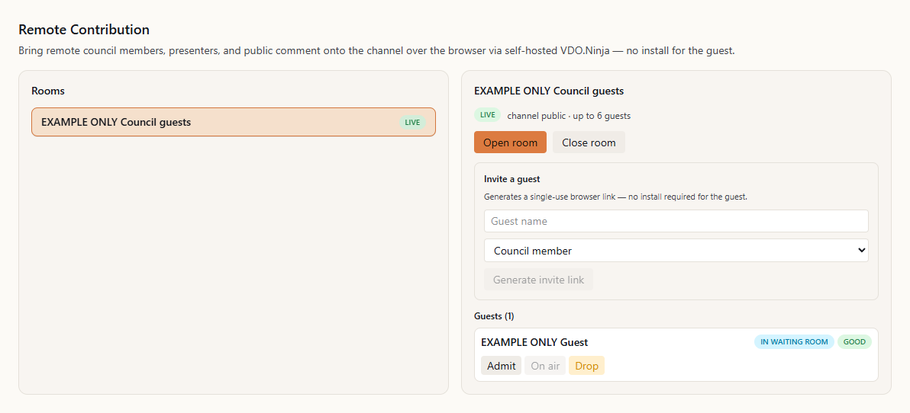{width=90%}

*Figure: the current-source Remote Contribution screen with a synthetic example room and guest in the waiting room. The Live and Good labels are example data; no room, invitation, remote connection or on-air action was performed.*

> **Warning:** the guest's **On air** button does **more than show that guest**. It also switches the *whole channel* to its live source, exactly like **Take live** on Channels, for up to an hour. There is no confirmation box. CivicCast records the change under the name "remote-contribution", not your name. If the channel cannot be taken live (for example, no source passes its check), you get "Channel takeover failed; guest <id> not placed on-air." and the guest goes back to the waiting room. If the channel is already under takeover, nothing more happens and the guest joins the live picture.

#### Mute, take off the air, or drop a guest

While a guest is **On air**, two more buttons appear next to them.

* **Mute** changes the guest's tag to **Muted**. A muted guest has only **On air** (which un-mutes) and **Drop**.
* **Off air** returns the guest's tag to **In waiting room**. The guest stays admitted, so **On air** is still available.
* **Drop** opens a box "Drop <name>?" (for an on-air guest: "<name> is on air right now — dropping ends their connection immediately and their video/audio cuts from the broadcast mid-session. They would need a new invite to rejoin."). Click **Drop guest**, or **Cancel**.

> **Warning:** **Mute** and **Off air** have no confirmation box. **Drop** and **Close room** ask first, and a dropped guest needs a new invite.

> **Known issue (beta.10):** the boxes for **Drop** and **Close room** promise that the guest's video and sound "cut from the broadcast" at once. In the code we read, **Mute**, **Off air**, **Drop** and **Close room** only change CivicCast's records. We found no code that tells the compositor, VDO.Ninja or the channel to cut anything, and we could not confirm that guests lose their connection or that sound is cut. Do not rely on **Mute** to silence a guest. Mute them in the VDO.Ninja director view too, and listen to the channel. Also, when the last guest is dropped or the room is closed, nothing hands the channel back to its schedule. Use **Return to schedule** on **Channels** (see "Take a channel live from a camera").

#### Close the room

1. Select the room and click **Close room**.
2. A box titled `Close "<room>"?` appears. Click **Close room now**, or **Cancel**.

You can open the room again and send new invites afterwards.

#### Test guest connections (Support admins)

A Support admin sees a box **Diagnostics** with tags for "TURN reachable", "VDO up" and "coturn up" (or the opposite). Click **Test TURN connectivity** to probe the relay now.

### The meeting-night checklist

Print this page or copy it. The screens named here are covered earlier in the chapter.

**An hour before**

1. Open **Readiness**. The card should say **Ready** (green). If it says **Do not broadcast yet**, read its next step and tell your Setup admin.
2. On **Channels**, check the channel's state tag and "Now / next". Make sure the program you expect is scheduled (see [Before the meeting](#ch-before-meeting)).
3. If you plan to use a camera: on **Live**, pick the source and click **Check source** until it says **Delivering**.
4. If you use the Control Room: open a **Test Mode** session, dry-run and record one cue, and end it. Check that no amber "Production control unavailable" bar appears.
5. If you use remote guests: open the room, send the invite links, and ask guests to join early so they are in the waiting room.
6. On **Channels**, check whether **Keep this channel on air** is ticked, and whether you expect it to be.
7. On **Live**, check **Existing meeting**. Reopen an unfinished meeting if one is listed; otherwise click **Create live session**. Note the selected meeting ID.

**At the start**

8. If you want a lower-third banner, set it first (see step 11). Then, if the channel is stopped, click **Start**, confirm **Start feed**, and watch for **On air** or **Showing slate**.
9. On **Live**, create or reopen the correct meeting. Click **Start pre-flight** if it is Idle, tick the confirmation box, click **Run pre-flight**, and click **Start Live Stream** only when the channel really is broadcasting. After reopening, confirmation and the checklist must be checked again.
10. To go to the camera, run **Check source** (it expires after 30 seconds by default), then **Take live**, **Confirm take live**. The red badge shows only who took over, not the source, so read the **Source:** line in the **Outgoing channel feed** box (it can take up to 30 seconds to update) and watch the channel's own output.
11. A lower-third banner is meant to take effect at the channel's next start (we have not watched one appear). On a channel that is already running it appears only when the channel next restarts or swaps content.

**During the meeting**

12. Keep the Control Room page in its own tab and do not refresh it. Live can be reopened by choosing its channel and **Existing meeting**.
13. If you use an On-Air Control Room session, open a new one before 30 minutes have passed.
14. Admit remote guests one at a time. Remember that **On air** for the first guest takes the whole channel live.
15. Watch the channel's own output, not the screen's tags. After **Stop**, **Restart feed** or **Return to schedule**, the tag can take up to 30 seconds to change.

**At the end**

16. Return the channel: **Return to schedule**, **Confirm return to schedule**.
17. Drop any remaining guests and click **Close room**.
18. End any Control Room session: click **End session**.
19. If you want the channel off the air, click **Finish current item, then stop** (or **Stop**) and confirm. If **Keep this channel on air** is ticked, ask your Setup admin to untick it first.
20. On **Live**, click **End Live Stream**, confirm, and watch **Recording finalization** until it says "Recording saved as asset <id>." Then follow [After the meeting](#ch-after-meeting).

### If it did not work

| What you see | What it means and what to do |
| --- | --- |
| "Live-room controls require the meeting operator role. Source status and readiness checks remain visible." | Your sign-in lacks the Meeting operator role. Ask your Setup admin. |
| "Source preview unavailable - CivicCast has not verified incoming video or audio from <source>." | The Live screen never shows video in beta.10. It is not a fault. |
| A red box "Live action failed." ending "refresh this screen" | Read the first line for the specific reason. After a refresh, reopen the correct **Existing meeting**; do not create a replacement. |
| "Go on air blocked: a fresh source-bound server-side pre-flight did not pass." | A required checklist row failed when you clicked. Fix it, run **Run pre-flight**, try again. |
| A duplicate live-session ID error | Recheck **Existing meeting** and reopen the correct session. New meetings use unique IDs; do not reset station data. |
| "Start was queued but the feed did not start." | The feed program did not respond in 20 seconds. Check Readiness, then click **Start** again. |
| "No live source is ready yet." (Take live is grey) | No source passed **Check source** in the last 30 seconds (by default). Run **Check source** on Live. |
| "Channel '<id>' is already under live takeover." | The channel is already live. Use **Return to schedule** first if you want to change it. |
| "Outgoing feed controls require the meeting operator role." | Your sign-in cannot start or stop channels. |
| A program says **Not safe to air yet** | Read the reason: missing media, or a clash with another program. Fix it on **Schedule** and review again. |
| **Couldn't reach the engine** on a committed program | The approval was saved, but the command to the feed did not go through. Check that the feed is running, and ask IT. |
| "Production control unavailable — the TSR control service is not running or not configured." | The Control Room helper is down. Tell IT. |
| "On-Air Mode expired before this cue could fire. Open a new On-Air session to continue." | The 30-minute limit passed. Open a new On-Air session. |
| "The cue preview is stale ... Dry Run the cue again before Live Fire." | The cue or device changed after your dry run. Click the cue again. |
| "A session is already open on this surface, locked by <name> since <time>." | Someone, maybe you before a refresh, has the surface open. Ask IT. |
| "Remote contribution isn't configured yet." | Guest video software has not been set up. Tell IT. |
| "Channel takeover failed; guest <id> not placed on-air." | The channel had no ready live source. Run **Check source** on Live and click **On air** again. |
| "Durable storage is not ready. Open Setup and choose Prepare storage ..." | The station's database is not ready. Tell IT. |
| "This action requires one of these CivicCast roles: ..." | Your sign-in lacks a role for that button. The names listed are the role names in short form. |

### Related

* [Signing in and finding your way around](#ch-signing-in)
* [Before the meeting: schedules, agendas, recording schedules](#ch-before-meeting)
* [After the meeting: assets, captions, summaries, approvals](#ch-after-meeting)
* [Publishing, and what residents see](#ch-publishing)
* [When something looks wrong](#ch-something-wrong)
* [Configuring the station](#ch-configuration)
* [Cable headend, streaming, CDN, federation, emergency alerts, the API](#ch-integrations)

<!-- SOURCES: inventory/screens/live.md; inventory/screens/channels.md; inventory/screens/controlroom.md; inventory/screens/remotecontribution.md; inventory/screens/facility.md; inventory/screens/cg.md; inventory/screens/cgdesigner.md; inventory/screens/health.md; inventory/screens/_shell-navigation-and-roles.md; inventory/screens/public-home.md (live-status wording); code verified directly: civiccast/live/router.py:255-347 (public on_air status), 501-535 (create, 409), 567-773 (preflight/go-on-air/end-broadcast are state-only), civiccast/live/preflight.py:135-195 (required checks, 50 GiB), civiccast/live/network_probe.py:51-52, civiccast/live/readiness.py:78-86 (30 s TTL, 5-300), civiccast/live/source_probe.py:138 (8 s), civiccast/live/store.py:266-286 (PK collision), civiccast/live/finalization_worker.py:861-874; apps/portal-operator/src/screens/LiveRoomScreen.tsx:63-65,1024-1143,1260,1364,1376-1440; civiccast/egress/automation.py:1-35,945,1348-1383 (auto_start re-issues start when no live process, 30 s retry, 2 s poll at 758); civiccast/egress/daemon.py:1495-1504; ChannelOpsScreen.tsx:692-830 (feed panel), 878-1074 (24/7 card), 1120-1277 (lower third), 1981; feed-command-confirm.ts:15-49; TakeoverCard.tsx:153-295; civiccast/egress/takeover_service.py:138-242; CommitToAirPanel.tsx:26,79-259,340-458; commit-format.ts:13-85; civiccast/schedule/commit_service.py:362-547; civiccast/egress/dispatcher.py:91-119; schedule/commit_models.py:79-88 (acknowledged never set); ScheduleScreen.tsx:708,745-751; civiccast/control_room/service.py:62-67,237,303-313,461-485,809; ControlRoomScreen.tsx:181-330,531,558-730; ControlRoomReadinessPanel.tsx:100-230; civiccast/live/contribution/service.py:57,323-395; civiccast/app.py:3075-3113; RemoteContributionScreen.tsx:344-407,601-690; civiccast/facility/store.py:41-88; facility/router.py:25-32; FacilityRouterScreen.tsx:304,391,850; CgBoardScreen.tsx:126,196-198,452-470,525-586,611,663,745; civiccast/egress/bulletin_filler.py:5-6,113,433; docs/releases/v1.0.0-beta.10-verification.md (proof status); second-pass checks: civiccast/installer/service.py:2530-2646,3780-3990 (sample source, rehearsal), civiccast/live/relay.py:105-125 and civiccast/egress/live_takeover.py (takeover refuses stale source before re-probe), civiccast/live/contribution/service.py:240-420 (admit keeps state connected), civiccast/facility/router.py:51-77, civiccast/stream/router.py:26-30 (roles), CommitToAirPanel.tsx:290-330 (upcoming list filters on schedule_item_id) -->

\newpage

## After the meeting: assets, captions, summaries, approvals {#ch-after-meeting}

This chapter covers everything that happens to a meeting video once the meeting is over: finding it in the library, trimming it, making it ready for residents to watch, correcting its captions, reviewing the AI summary, and keeping the library healthy. It is normally done by a records clerk, a video editor, or a station volunteer. Publishing the video to residents is the next chapter: [Publishing, and what residents see](#ch-publishing).

### Before you start

You need to be signed in to the staff console (see [Signing in](#ch-signing-in)). Almost every screen in this chapter is in the left-hand menu under **Review Records**: **Assets**, **Missing Media**, **Media Lifecycle Settings**, **Review queue** and **Summary review**.

Words used in this chapter:

- An *asset* is one video in the library, with its title, details and files.
- *Packaging* means making a ready-to-stream copy of the video so residents can watch it in a web browser. It does not show the video to residents. Publishing does that.
- A *cue* is one caption line: a short piece of text with a start time and an end time.
- *Retention* is how long the station must keep a record before it may be deleted.

CivicCast gives each person one or more roles. The role decides which buttons work. In beta.10 most buttons look clickable to everyone, and a wrong-role click gives an error message such as "This action requires one of these CivicCast roles: ..." instead of being greyed out. The table lists who can do what in this chapter.

| Task | Role that can do it |
| --- | --- |
| See the Assets list, open a recording, read the Review queue | Any signed-in staff member |
| Upload a video | records_clerk, meeting_operator, support_admin |
| Edit title, description, meeting body, retention | records_clerk, meeting_operator, support_admin |
| Package for playback; replace the source file | publish_operator, setup_admin |
| Place or clear a legal hold | records_clerk, support_admin |
| Approve, edit or reject a caption cue; retry a failed caption job | records_clerk |
| Generate an AI summary | records_clerk, support_admin |
| Approve a summary | records_clerk |
| Missing Media list | meeting_operator, publish_operator, support_admin |

> **Note:** A sign-in whose token has the administrator or operator scope holds all five roles, so nothing is refused. Role differences show up when a person has a limited, role-only sign-in.

> **For IT staff:** Role names and how to create role-limited sign-ins are in Part II (security chapter) and the roles appendix.

### Find a video in the Assets list

1. In the left menu, click **Assets**.
2. To look for a video, type part of its title or its asset ID in the **Search assets** box. To narrow the list, click one of the tabs **All**, **Validated**, **Recorded**, **Analyzing** or **Rejected**.
3. Click a video's title to open its detail page.

You should see a table with the columns Title, State, Status, Duration, Size, Codec and Published. The asset ID appears in small type under each title.

The **State** and **Status** columns describe the same video in two ways.

| State | What it means |
| --- | --- |
| Validated | The file passed CivicCast's checks. It is ready to trim, package or schedule. Every upload, accepted contributor video and watch-folder file starts here. |
| Recorded | A live meeting recording that CivicCast has finished and saved. |
| Analyzing | CivicCast is still checking the file. |
| Rejected | The file failed the check. |

| Status | What it means |
| --- | --- |
| Not packaged yet | The file is validated, but residents cannot stream it yet. Use **Package for playback**. |
| Packaged | A streamable copy exists. Residents still cannot see it until it is published. |
| Published | Live on the resident portal. |
| Not servable yet | A live recording that has no streamable copy yet, so residents cannot play it. |
| Missing file | CivicCast cannot find the video file on disk. |
| Validating, Ingesting, Transcoding, Queued for transcode | CivicCast is working on the file. |

> **Known issue (beta.10):** The Assets list shows only the first 50 assets, ordered with published videos first (most recently published first), then everything else by asset ID. A new upload is not published yet, so it sorts after the published videos. The search box and the tabs search only those 50. A station with more than 50 videos can upload a file and not see it in the list. The screen does not say this and has no "next page" button. Workaround: ask IT staff to list assets through the API with a larger page size.

> **For IT staff:** The list calls `GET /api/staff/assets`, which takes `limit` (default 50, maximum 500) and `offset`, and returns the real total in the `X-Total-Count` header. See the API appendix.

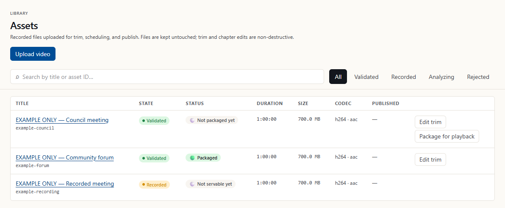{width=90%}

*Figure: the current-source Assets list with synthetic example recordings and statuses. No actual media was accessed or packaged for this illustration.*

### Upload a video

Use this for a video that was not recorded by CivicCast, such as a file from a camera card or another recording system.

1. On the Assets screen, click **Upload video**.
2. In the **Video file** box, choose the video file. (While the panel is open, the **Upload video** button reads **Cancel upload**.) The accepted types are MP4, MOV, MKV, WebM, AVI or MPEG-TS (file endings .mp4, .mov, .mkv, .webm, .avi, .ts, .m2ts).
3. Check the **Title**. CivicCast fills it in from the file name, turning underscores and dashes into spaces. Change it if it is not what residents should see.
4. Click **Upload**. A progress bar shows "Uploading {file}…" and a percentage. Click **Cancel** to stop.

When it finishes you should see "Uploaded: {title}". The text below says the video now appears in the table, and the new row shows State **Validated** and Status **Not packaged yet**. No further action is needed for the check itself; CivicCast runs it before it says "Uploaded".

> **Note:** If CivicCast cannot read the file as a supported video, it refuses it and keeps nothing. The error appears in the upload panel and no row is created. The panel does not show a size limit. The server's default limit is 10 GB, set by the station's IT person.

> **Tip:** After uploading, set the title, description and **Meeting body** on the video's detail page right away (see the next section). Residents search and filter by these.

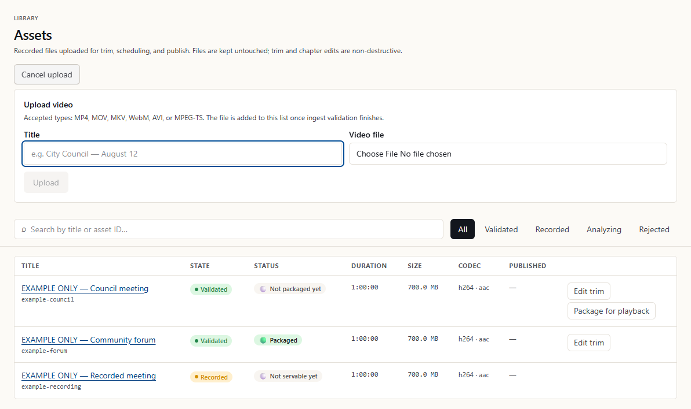{width=90%}

*Figure: the current-source upload panel above synthetic example assets. No file was selected or uploaded for this illustration.*

### Edit a video's public details

The title, description and meeting body are shown to residents on the portal. Edit them on the detail page.

1. On the Assets screen, click the video's title.
2. In the **Public metadata** card, change **Title** (up to 200 characters), **Description** (optional, up to 2000) and **Meeting body** (optional, up to 120). The meeting body is the group that held the meeting, for example "City Council". Residents filter the Recordings page by it. Leave it blank and the video is not tagged, so it never matches a meeting-body filter.
3. Click **Save metadata**. The button says "Saving…" and then "Saved".

> **Warning:** If the video is attached to a schedule item that is already published (committed to air), the save is refused. The message reads "Asset X cannot be edited: N linked schedule item(s) already published. Unpublish or cancel the named items before retrying the edit."

The same card holds the retention controls. The four cards are **Default**, **Permanent**, **Meeting (long)** and **Short**, plus an optional **Retention deadline**. The screen reminds you: "Records officer review required. State presets provide a starting point, but local schedules, litigation holds, and official-minutes rules can require longer retention." It also says deletion is never automatic: expired items are flagged for the records clerk to review. A button, **Convert to a length + unit or forever term...**, switches the card to a length-and-unit form (days, weeks, months, years or forever).

> **Known issue (beta.10):** The console has no screen that lists the videos flagged for records review. The list exists only in the API (`GET /api/staff/records/disposition-queue`), and it is a list only: the code says an action screen is a later follow-up. Ask IT staff to read it for the records clerk.

> **Note:** Below the retention controls there is a custom-fields editor for any extra fields your station has defined. It is not described here because the fields differ from station to station.

### Trim a video and mark chapters

Trimming sets where the video starts and ends. It does not change the original file.

1. Open the video's detail page and click **Edit trim & chapters**. On the Assets list you can click **Edit trim** instead, for a Validated row.
2. Use the timeline to move the playhead. The buttons step back or forward by one second (**-1s**, **+1s**) or one frame (**-1f**, **+1f**), or jump to the start and end.
3. At the moment the video should start, click **Set IN**. At the moment it should end, click **Set OUT**. You can also drag the **IN** and **OUT** handles on the timeline.
4. To mark a chapter, move to that moment and click **+ Mark**, then type a name for it. Remove a chapter with its remove button.
5. Click **Save trim & chapters**. A toast says "Saved." and the editor closes. To leave without saving, click **Discard**.

> **Known issue (beta.10):** The editor does not play the video. The preview area shows only the current time and the text "Packaged manifest lands at Sprint 0.4". You choose points by time, not by watching the picture. Play the video elsewhere to find the times, then type or step to them.

> **Known issue (beta.10):** Chapters you mark are saved with the video, but we found nothing in the packaging code that writes them into the packaged video. The resident portal shows the meeting's agenda, not these chapters (see [Publishing, and what residents see](#ch-publishing)). Do not promise residents chapter marks from this editor.

> **Warning:** For an uploaded video, the trim you save is used when the video is packaged. Set the trim before you click **Package for playback**. Once a video is packaged, the console does not offer **Package for playback** again for that row, so a later trim change does not reach the packaged copy. For a live recording, the detail page says "Saving a trim re-renders the published recording automatically."

> **Note:** The trim also applies when the video airs from the schedule on a channel.

If saving fails with a message about another writer, someone else changed the video while you were editing. Close the editor, open the video again and redo your change. If the video is already on a schedule item that is committed to air, the save is refused with the "cannot be edited ... already published" message described under [Edit a video's public details](#ch-after-meeting).

### Package a video for playback

1. On the Assets screen, find a Validated row that says **Not packaged yet**.
2. Click **Package for playback**. The button says "Packaging..." while it works.

You should see the Status change to **Packaged**. This needs the publish_operator or setup_admin role; otherwise the row says "A publish operator or setup administrator must package this recording."

CivicCast packages one video at a time. If another is already running you see "Another recording is already being packaged…". Wait and try again. If packaging fails, the message is the server's text or "Packaging failed. The original file was kept; try again."

> **Known issue (beta.10):** The list shows **Package for playback** only on Validated rows that have a stored file and no streamable copy yet. **Edit trim** shows on every Validated row, packaged or not. Live recordings are finished and packaged by CivicCast itself.

Packaged is not the same as published. Next, go to the Publish screen ([Publishing, and what residents see](#ch-publishing)).

### Take a video off the public portal

1. Open the video's detail page.
2. In the **Technical** card, next to **Published**, click **Remove from portal**.
3. Read the dialog and confirm. It says: "Residents will no longer be able to view or find it there. This only affects portal visibility -- the asset row, its media, and the Internet Archive / syndication copies are untouched."

The video disappears from the resident portal. This needs publish_operator or setup_admin.

### Check a video's readiness, hold it, or replace its file

At the bottom of the **Technical** card is the **Media lifecycle** panel.

- A **readiness badge** says Ready, Transcoding (n%), Queued for transcode, Missing, Rejected or Not ready.
- **Loudness gate** shows "OK (-x.x LUFS)", "Failed — normalize before air" or "Not checked yet". LUFS is a measure of how loud the audio is. CivicCast checks against -16 LUFS with a margin of 1. The screen has no button for fixing a failed loudness result, so the line is for information.
- **Archival** lists three copies: the portal, the Internet Archive and a local NAS (a network storage box at the station). Each shows "verified" or "not verified", and the panel ends with "Archive-complete" or "Not archive-complete yet".

To place a **legal hold**, optionally type a reason, click **Place legal hold (blocks expiry)** and confirm "Place a legal hold on this asset?". A held video cannot expire under its retention rule. To release it, click **Clear legal hold** and confirm. Both actions are recorded in an audit log. This needs records_clerk or support_admin.

To replace the video file, choose a **Replacement video file** and confirm "Replace this asset's source file?". CivicCast renames the old file aside and never deletes it, and the video goes back to State **Validated**. This needs publish_operator or setup_admin.

> **Warning:** The replace-source dialog says viewers see the new file "immediately once processing finishes". In beta.10 that is not what the code does. The replacement resets the video to Validated and clears its transcode jobs, but it leaves the old streamable copy and the publish date in place. Residents keep seeing the old video. The Assets list also hides **Package for playback** because a streamable copy still exists. Do not rely on replacing a published video's file to change what residents see.

> **For IT staff:** To rebuild the copy, an administrator can call `POST /api/staff/assets/{id}/package` for that asset. See the API appendix.

### Audio tracks, loudness plan and caption status

Three read-only cards are on the **Channels** screen, not on Assets. They describe a channel on the air, not a recording.

- **Audio tracks (SAP / descriptive)** lists any secondary audio tracks, such as a second language (SAP) or described video, each marked "on air" or "disabled". If there are none, it says "Single audio program — no secondary (SAP / descriptive) tracks configured." There is nothing to edit in the console.
- **Loudness** shows, for each output of the channel, the target loudness and standard, and a "Measured -x.x LUFS" chip. The card says each output is set to its destination's standard: cable to ATSC A/85 (-24 LKFS) and streaming to -16 LUFS. It is visible only to setup_admin and support_admin; a meeting operator sees a refusal message in the card.
- **Captions** shows whether captions are reaching the output: "Captions on", "Captions off", "Caption proof failed" or "Not verified". It reads "on" only after a recent passing check. The card says: "This proves carriage at the egress boundary; it is not a claim of FCC Part 79 compliance." It refreshes every 30 seconds.

See [Running the meeting](#ch-running-meeting) for the Channels screen.

> **Note:** In the current development version, live captions do not retry a decoding attempt with different model settings. If the words fail the model's quality checks, CivicCast withholds that audio window. A gap does not mean there was no speech. This does not guarantee that captions keep up, and **Captions on** does not prove every spoken word was captioned. The separate recorded-video caption job keeps its existing retries and human review.

### Offline captions: how a recording gets its captions

Captions for a recording are made in the background after you approve publishing on the Publish screen. There is no separate "make captions" button. The steps are:

1. You approve publishing the recording. CivicCast queues a caption job for it first, on every approval, even one that does not tick the Portal row. If it cannot queue the job, it refuses to publish and nothing is published. (A recording with no stored video file gets no caption job.)
2. The job transcribes the audio into English cue lines. On the video's detail page, the **Offline caption jobs** card shows **Transcribing…**. A full meeting can take several minutes, not seconds.
3. When transcription ends, the card shows **Awaiting review**. The cues are now in the **Review queue**.
4. You decide every English cue. CivicCast then makes a machine translation into Spanish and queues those cues for review too.
5. You decide every Spanish cue. Only then does CivicCast attach both caption tracks to the recording. The card shows **Complete**.

> **Note:** A published recording must carry reviewed English and Spanish captions together. There is no English-only result. Until every cue in a language is decided, nothing is attached to the video.

If the job runs out of attempts, the card shows **Failed** with the reason in the **Last error** column. A records clerk can click **Retry** and confirm "Retry this offline caption job?". This restarts transcription from scratch with a fresh attempt budget and discards partial progress. Without the records clerk role the card says "Retrying a failed job requires the records clerk role."

The job can also be held. These are the reasons CivicCast puts on the row:

- Every English cue was rejected. Open the Review queue, choose English, and edit or approve cues. If the audio is truly unusable, ask a technical administrator to cancel the job.
- Every Spanish cue was rejected. Open the Review queue, choose Spanish, and edit or approve cues. Publishing continues on its own once at least one Spanish cue is approved or edited.
- No translation model is available. The row says to install or repair it under "Settings > AI Models > Translation" and run 'civiccast doctor'. CivicCast retries a few times with growing waits. When its attempts run out the card shows **Failed**, and a records clerk must click **Retry** after the model is repaired.

### Review and correct captions

The **Review queue** (current-source page heading "Review queue", labeled "Caption review" above it) is where a person checks the machine's caption lines before the public sees them.

1. In the left menu, click **Review queue**. It opens on the **Pending** tab. The other tabs are **All**, **Edited**, **Approved** and **Rejected**, and a **Search** box above them filters by asset ID or caption text.
2. To work on one language, click **English** or **Spanish** in the **Language** row. **All languages** shows both.
3. Each card is one cue. It shows the recording's asset ID, the cue's time range, a language badge (EN or ES) and a status. The left box **Machine cue** is the computer's text and cannot be changed. The right box **Reviewed text** is yours to edit.
4. If the cue is wrong, change the **Reviewed text**, then click **Save edit**. The status becomes **Edited**.
5. If the cue is right, click **Approve**. The status becomes **Approved**.
6. If the cue should not be shown at all, click **Reject**.

You should see the card leave the Pending tab and the status pill change. The list refreshes after every decision.

What each button really does:

| Button | Result |
| --- | --- |
| **Approve** | Marks the cue Approved. It approves the text that is already stored: the machine text, or the text from your last **Save edit**. |
| **Save edit** | Stores what is in the **Reviewed text** box and marks the cue Edited. It is available only when the text has changed and is not empty. |
| **Reject** | Marks the cue Rejected and throws away any reviewed text. A rejected cue is left out of the captions. |

Approved and Edited cues both become captions, using the reviewed text. Rejected cues are left out. Pending cues hold everything back.

> **Known issue (beta.10):** **Approve** ignores text you typed in **Reviewed text** and did not save. If you correct a word and click **Approve** without clicking **Save edit** first, CivicCast approves the old text. The screen does not warn you. Always click **Save edit** after correcting a line. After **Save edit** the cue is already counted as decided, so you do not need to click **Approve** as well. Approve it afterward only if you need the status to read Approved (see the summary section, which uses Approved cues only).

> **Warning:** **Reject** asks no question and discards the reviewed text. A rejected cue can be approved again later, which then approves the machine's original text, not your earlier correction.

#### Low-confidence cues

A cue the machine was unsure of carries a **Low confidence** badge, and a yellow bar at the top says how many need attention. For these cues, **Approve** stays disabled until you do two things:

1. Click **Load review audio**. CivicCast fetches a short clip around the cue and shows an audio player. Play it.
2. Tick **I compared this low-confidence cue with its audio evidence.** This box becomes available only after the audio can play.

This audio check applies to **Approve** only. **Save edit** has no such check, so a low-confidence cue can be edited and counted as decided without anyone playing the audio.

If the audio is not available, the card says "Audio evidence is unavailable. Approval of this low-confidence cue is blocked." You cannot approve that cue until the audio is available, so ask IT staff. If the recording's media file is missing, loading the audio fails with "The local meeting media is missing. Relink or restore the asset, then retry."

#### Who can use it

Everyone can read the queue and play audio. Only a records clerk can approve, edit or reject. For anyone else a yellow note says "Caption review actions require the records clerk role. The queue stays visible for read-only review." and the boxes and buttons are disabled.

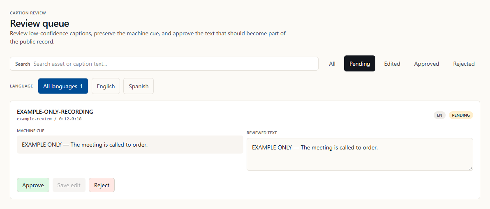{width=90%}

*Figure: the current-source Review queue with a synthetic pending English cue. No actual caption was fetched, edited, approved or rejected for this illustration.*

#### If it did not work

| What you see | Cause and fix |
| --- | --- |
| "No caption cues need review." | There are no cues at all for the chosen language, in any tab. Cues appear after a recording is approved for publishing on the Publish screen and the caption job has finished transcribing. |
| "No captions match the current search and filter." | Cues exist, but not under the tab or search you chose. After you decide the last cue on the **Pending** tab you will see this line. Click **All**, **Edited**, **Approved** or **Rejected** to see the decided cues. |
| "Spanish cues appear here after English captions are approved and translated." | Shown beside the **Language** row when the **Spanish** choice has no cues. The Spanish cues are made only after the English pass is fully decided. The Spanish text is a machine translation and needs review too. |
| "Caption review backend unavailable." | The station's database is not connected. Tell your IT person. |
| "Could not load caption review." after you clicked a button | The change was not saved. The box has the same title for load and save errors. Read the line under it and try again. |
| "This is a low-confidence caption cue. Compare it with the retained audio, then explicitly acknowledge that review before approval." | Load and play the audio, tick the box, then Approve. |

### Review an AI summary

CivicCast can write a draft summary of a meeting from its approved caption lines. A records clerk checks the draft against its sources before approving it.

> **Note:** The steps below describe the unreleased source workflow updated on October 3, 2026. They do not mean these changes are installed at your station or included in the published beta.10 manual. Ask your IT person which version you are using.

> **Known issue (beta.10):** The published beta.10 source had an approval-request mismatch, made approved summaries disappear from this page, and offered no download, verification or second-generation action. The approval failure was inferred from code, not confirmed on a running station. Do not assume that installation has the repaired workflow described below.

#### Make a summary

1. Approve at least some caption cues for the recording in the Review queue. Only **Approved** cues are used. Cues that are Edited but not Approved are not used.
2. Open the recording's detail page and find the **AI summary** card, under the **Offline caption jobs** card.
3. Click **Generate summary**. The chip reads "queued" and then "generating…". The screen says generating locally can take 1-6 minutes on a CPU-only station, and you can close the tab; the job keeps running.
4. When it finishes the card says "Summary generated. Review it in Summary review".

If there are no approved cues the card says "No committed transcript cues yet. Approve caption review items for this recording first, then a summary can be generated from them." Generating needs the records clerk or support admin role. If the job fails, the card shows **failed** with the reason and a **Retry** button, which only a records clerk can use. **Retry** uses that failed job's original caption input; it does not pick up later corrections. For local generation, the local AI program (Ollama) must be running with the summary model installed. A runtime failure can report "Local Ollama AI runtime is not reachable. Start Ollama and retry, or configure a different summary model in AI model settings."

#### Correct the source and generate again

1. If a claim is wrong or lacks evidence, open **Review queue** and correct its caption lines. Click **Save edit**, then **Approve** so the corrected lines have status **Approved**.
2. Return to the recording's **AI summary** card in **Assets**. Wait for any running generation job to finish.
3. After the previous job completes, click **Generate again**. CivicCast checks your permissions and fetches the currently approved lines before queuing the new job. If this check fails or no approved lines remain, no replacement is queued.
4. Read the new summary in **Summary review** and check its sources again.

Earlier summaries and approvals are kept. The new summary needs its own approval; generating again does not correct an earlier signed record. A completed generation job can also produce a **Needs evidence** summary: completion is not approval. Summary review has no claim-editing, rejection or generation button; make corrections through the recording's caption review and **AI summary** card.

#### Look at a summary

1. In the left menu, click **Summary review** (page heading "Summary review", label "Summary + signed records").
2. Each card shows the asset ID, a status, the summary paragraph, and a list of **Sourced claims**. Under each claim are **Source:** buttons labeled with a cue ID and its time range.
3. Click a source button. **Source captions (not audio playback)** shows the caption words retained with the completed generation job for this exact recording and summary.

The status labels are **Pending review**, **Approved**, **Rejected** and **Needs evidence**. The page includes pending summaries, evidence refusals and approved summaries; approved cards remain after refresh or reload. A **Needs evidence** result has an empty paragraph and a message explaining that the model's output could not be tied to caption cues with timestamps. Correct and approve the source lines, then generate again; do not approve an unsupported claim.

If nothing is waiting, the page says "No summaries need review." and tells you to use **Generate summary** on a recording's detail page.

The source panel shows the full caption cue, even when the claim cites only part of its time range. It is text evidence, not an audio player or a word-aligned excerpt. If the original job or cue is missing, empty or ambiguous, the panel says so. It never substitutes today's edited captions or the claim itself. Older summaries may have no retained source snapshot. Check the recording and captions through your station's review workflow before approving an uncertain claim. A request failure offers **Retry source captions**.

#### Approve and export a signed record

1. Check each claim against its source captions. Only a records clerk can approve or export. The buttons remain disabled while CivicCast checks your identity or if that check fails.
2. Click **Approve summary** only when the claims are supported. CivicCast records the approval under your signed-in identity, not a name supplied by the page. A summary cannot be approved if it has no sourced claims, is rejected or evidence-refused, or has any claim without timed source ranges.
3. If an approved-status card instead shows **Reapprove summary**, its matching saved approval is missing. Check its evidence and explicitly reapprove it as the signed-in clerk. Export remains blocked until then; CivicCast does not invent an earlier approver.
4. Click **Export signed record** on the approved card. You should see "Signed record exported:" followed by the record ID and **PDF SHA-256**, the checksum that identifies the final PDF file. If an older response does not supply that checksum, the page says it is unavailable.
5. Click **Download PDF** to save the file with your station's retention records.
6. Click **Verify record** to check the stored file's checksum and timestamp proof structure. A failed verification is not a verified record; retry or contact support before relying on it.

A signed record is an export with integrity information and approval history, not automatically a legal record for your jurisdiction. Confirm the meeting details and follow your records officer's requirements.

> **Warning:** The default signing timestamp is a deterministic test timestamp, not a trusted external timestamp. The screen identifies it as such. Even with a real timestamp service configured, **Verify record** does not independently validate that authority's trust chain. Verification of an older archived file does not retroactively prove who approved it.

Approval, export, download and verification failures have separate messages and **Retry** actions. A failed download does not undo a successful export; retry downloads that same file. Wait for an action to finish before retrying another.

> **For IT staff:** Approval accepts only an approval note; the server gets the approver from the authenticated sign-in. Signed-record export requires matching saved approval before rendering. See the API appendix.

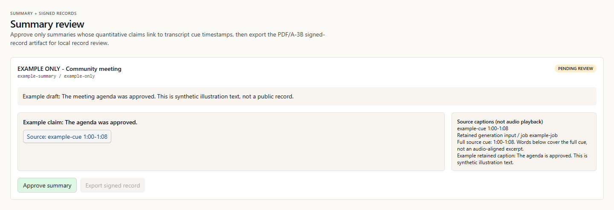{width=90%}

*Figure: Summary review.*

### Check for videos that are missing before a meeting

The **Missing Media** page is a warning list. It shows meetings on the schedule for the next 7 days whose video is not ready to play.

1. In the left menu, click **Missing Media**. Only meeting operators, publish operators and support admins see this entry.
2. Read each card. It names the meeting and its time, the channel, the video's asset ID and state, and gives a reason.
3. Click **Open asset** to go to the video's detail page and fix it.

The reasons are: "Referenced asset no longer exists.", "Asset is in state '{state}', not validated/recorded." and "Asset's backing file is missing." Every card shows "Not ready" whatever the reason. When nothing is wrong the page says "Nothing missing."

The page loads once when you open it. Leave it and come back to refresh. To fix a card you usually need to upload a replacement file or ask a publish operator to replace the file.

> **Known issue (beta.10):** "Every asset scheduled in the coming week is validated or recorded and ready for air" is too strong. The page checks only schedule items that are still drafts. Items already committed to air are not checked. A file deleted in the last hour may not be flagged yet, because the file check runs once an hour by default.

If you open the page with a role that is not allowed, you see "This action requires one of these CivicCast roles: meeting_operator, publish_operator, support_admin."

### Watch folders, retention rules and storage (Media Lifecycle Settings)

This page holds three station-wide settings. In the left menu it is **Media Lifecycle Settings**, shown to setup_admin, publish_operator and records_clerk.

- **Watch folders.** A watch folder is a folder on the station's computer (a local disk, a USB drive or a network share) that CivicCast checks automatically and copies new videos from. Type the folder path in **Watch folder path** or click **Browse…**, then click **Add watch folder**. A new file is imported once it has stopped growing. The original stays where it is, and the new video appears in Assets as Validated. Click **Scan now** to check immediately, or **Remove** to stop watching (files already imported stay).
- **Retention automation.** A rule sets a video's retention policy by its meeting body. Fill in **Rule name**, **Meeting body (exact match)** and **Retention policy**, then click **Add rule**. Then click **Apply rules now**.
- **Storage budget.** A read-only view of how much disk the library uses, with a table by retention policy.

Each folder row shows **Not scanned yet**, **OK** with "Last poll" and "Last ingest" times, or **Degraded** with the reason, for example a drive that was unplugged.

> **Known issue (beta.10):** Retention rules do not run by themselves, even though the card says it will "Assign a retention policy automatically by meeting series". We found no code that applies them on a schedule. They take effect only when someone clicks **Apply rules now**. A rule whose **Meeting body** is blank matches nothing. Applying a rule sets the retention policy label on every video whose meeting body matches, replacing a policy someone chose by hand on that video. We found no code in that step that recalculates the retention deadline.

> **Warning:** The **Browse…** and **Scan now** buttons need the setup_admin role, adding or removing a watch folder needs publish_operator or setup_admin, and retention buttons need records_clerk or setup_admin. The page shows every button to every role, and a wrong-role click returns an error message.

> **For IT staff:** Watch folders, upload storage and the storage budget are set up in Part II (configuration and operations chapters). If the budget card says no budget is configured, the setting is an environment variable that only IT can change.

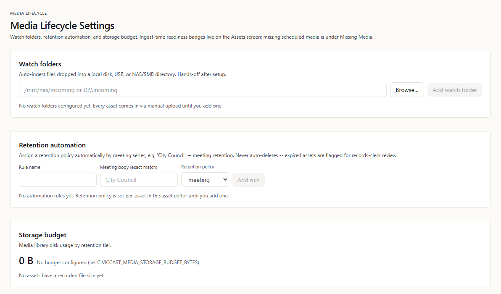{width=90%}

*Figure: current-source Media Lifecycle Settings with synthetic empty configuration and usage. No station folders, retention rules or storage settings were read or changed for this illustration.*

### If it did not work

| What you see | Cause and fix |
| --- | --- |
| `"{name}" is not a supported video file. Accepted types: MP4, MOV, MKV, WebM, AVI, or MPEG-TS.` | The file ending is not one of the accepted types. Convert the video and upload again. |
| "Durable storage is not ready." with "Open Setup, prepare durable storage, then return here." | The station's storage has not been set up. Ask a setup administrator. |
| "Could not load assets." | Click **Retry**. If it fails again, tell your IT person. |
| "Save failed." on the detail page | Another person changed the video, or a linked published schedule item blocks the edit. Reload and retry, or unpublish the named items. |
| "Another recording is already being packaged…" | CivicCast packages one video at a time. Wait and click again. |
| "This action requires one of these CivicCast roles: ..." | Your sign-in does not have the needed role. Ask your station administrator. |

### Related

- [Publishing, and what residents see](#ch-publishing)
- [Before the meeting: schedules, agendas, recording schedules](#ch-before-meeting)
- [Running the meeting](#ch-running-meeting)
- [When something looks wrong](#ch-something-wrong)

<!-- SOURCES: inventory/screens/assets.md; inventory/screens/review.md; inventory/screens/summary.md (historical beta.10 audit); inventory/screens/missingmedia.md; inventory/screens/medialifecycle.md; civiccast/apps/portal-operator/src/screens/{AssetsScreen,AssetDetailScreen,TrimEditorScreen,ReviewQueueScreen,SummaryReviewScreen,GenerateSummaryPanel,OfflineCaptionJobsPanel,MediaLifecyclePanel,MissingMediaScreen,MediaLifecycleSettingsScreen}.tsx; summary section reconciled against HEAD 9529f40dec75e0f980ee47385a3a9f9303583c9d on 2026-10-03: docs/in-app-help/summary.md (current development integration), docs/records-clerk-guide.md, SummaryReviewScreen.tsx (note-only approval, include-approved list, role/pending gates, orphan reapproval, download/verify/digest), GenerateSummaryPanel.tsx (fresh approved reviewed_text, Generate again versus failed-job Retry), components/review/TranscriptCuePlayer.tsx (retained exact meeting/summary job and cue evidence, unavailable/ambiguous states, full cue not audio); civiccast/summary/router.py (authenticated approver, job queue and retry), civiccast/summary/{job,generate,store}.py (new persisted drafts, original retry cues, evidence refusal/approval gates), civiccast/records/{router,exporter}.py (matching approval before export, final digest and timestamp structure); civiccast/captions/review.py:318-345 and civiccast/captions/persistence.py:291-335 (approve keeps stored reviewed_text; reject clears it); civiccast/captions/vod.py:430-480 (approved/edited become cues, pending counted, rejected dropped); civiccast/captions/vod_job.py:893-1010 and 100-165 (Spanish required, hold reasons); civiccast/schedule/router.py:245-280 (limit 50, X-Total-Count), 372-470 (package uses trim_in/out); civiccast/schedule/media_lifecycle_store.py:395-460 (replace-source leaves manifest_url and published_at); civiccast/egress/source_plan.py:1092 (trim used on air); civiccast/schedule/media_lifecycle_worker.py:141-145 (-16 LUFS, tolerance 1); civiccast/publish/router.py:442-480 (caption job queued before publish) -->

\newpage

## Publishing, and what residents see {#ch-publishing}

This chapter explains how a recording goes from your library to the public: the Publish screen, what "published" really means, what each publishing step does, and the Playback policy and Paywall screens. The second half is a tour of the resident portal, the public website that residents use to watch meetings. It is written for the people who publish (normally a publish operator) and for anyone who needs to know what a resident sees.

### Before you start

- The recording must already be **packaged**, which means it has a ready-to-stream copy. If it is not, CivicCast refuses to publish it. See [After the meeting](#ch-after-meeting).
- Approving and retrying a publishing step needs the **publish_operator** role. A setup administrator or a support administrator cannot publish unless their sign-in also holds publish_operator. Anyone signed in can look at the Publish screen. Without the role, the checkboxes and buttons are greyed out and the screen says "Publish operator role required to approve or retry surfaces."
- Words used here. A *surface* is one place a recording can be sent to, such as the resident portal or the Internet Archive (a free public online library). A *manifest* is the small file that tells a web browser how to play a video. The *resident portal* is the public web page, served from the station's own computer.

> **For IT staff:** The portal is served at the web root of the station and the staff console at `/operator/`. Settings for the outside services (Internet Archive, NAS, YouTube) are in Part II (integrations chapter).

### What "published" means

A recording is **published** when CivicCast sets its public publish date. From that moment it appears in the resident portal's Recordings list and has its own Watch page. That is the whole meaning. Three things are separate from it:

1. **Packaged** only means a streamable copy exists. Residents cannot see a packaged recording until it is published.
2. **Archive copies** (Internet Archive, local NAS) and **outside services** (YouTube) are other steps on the same screen. Publishing to the portal does not require them.
3. **Captions** are made after you approve. A recording can be public before its captions are reviewed.

Taking a recording off the portal is done on the video's detail page with **Remove from portal** (see [After the meeting](#ch-after-meeting)). That removes it from public view. It does not undo anything sent to other places.

### Publish a recording to the portal

1. In the left menu, click **Publish**.
2. Find the recording's card. You can narrow the list with the filter tabs: **All**, **Needs action**, **Draft**, **Archive pending**, **Archive verified**, **Reaching fewer places than planned** and **Complete**.
3. In the card, make sure only the **Portal** row is ticked. That is the default. The checkbox is labeled **Approve this surface**.
4. Click **Approve and Publish selected**.
5. Read the dialog titled `Publish "{title}" to residents?`. It says how many surfaces will publish for real, and that "The portal surface becomes publicly visible to residents immediately and starts offline caption transcription."
6. Click **Approve and Publish**. To back out, click **Cancel**.

You should see the **Portal** row change to "Succeeded". The card's state becomes **Complete**, or **Archive pending** if the recording is a public record (a recording kept with the Meeting (long) or Permanent retention policy) and archive copies are still needed. The **Portal live** tile at the top counts the recording.

At the top of the screen, tiles count your recordings: Total, Draft, Portal live, Archive verified, Degraded and Needs action. Each card shows three facts: **Canonical** (Portal public or Portal pending), **Archive** and **Published** (the date, or "Not public yet").

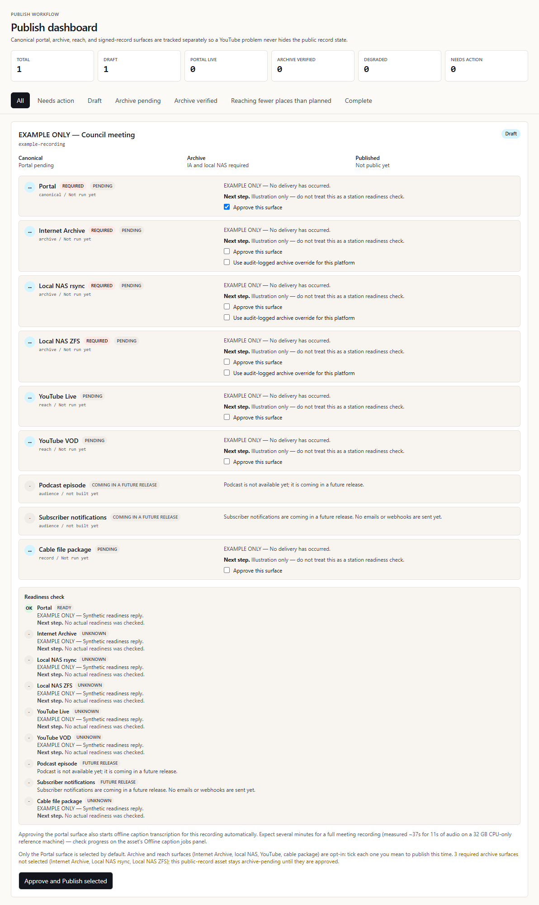{width=75%}

*Figure: the current-source Publish dashboard with a synthetic example recording and readiness replies. No station readiness was checked and nothing was published or archived for this illustration.*

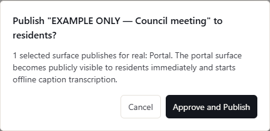{width=70%}

*Figure: the current-source confirmation dialog for a synthetic example recording. The dialog was canceled; no approval or publishing request was sent.*

#### What happens behind the button

When you approve the Portal row, CivicCast does these things in this order:

1. It checks the recording has a streamable copy. If not, it stops with "Publish preflight blocked: this asset has no manifest_url. Run the packager or fix ingest before approving publish."
2. It queues the recording's caption job. This happens on every approval, even one that leaves the Portal row unticked, and a recording with no stored video file gets no caption job. If it cannot queue the job, it stops with "Publish blocked: CivicCast cannot queue this recording's caption job ... Nothing was published." and names the cause.
3. It runs the surfaces you ticked.
4. It sets the public publish date. If that fails, the Portal row shows "Failed", the message says "The recording remains private", and you can click **Retry this surface**.

> **Warning:** If the station's federation setting is on, every approval that leaves the recording public on the portal also posts a public notice, "New CivicCast recording published: {title}.", to the outside servers that follow the station. (Federation is a setting that shares public notices with other servers on the internet.) The Publish screen does not mention this, and a notice that has gone out cannot be taken back. Ask your IT person whether federation is on.

### The publishing steps (surfaces)

Each card has nine rows. Each row shows a status dot, a name, badges (**Required**, an approval word, or **Coming in a future release**), a line such as "archive / Succeeded", a message and a **Next step**.

| Row | What it does in beta.10 |
| --- | --- |
| Portal | Makes the recording public on the resident portal, and queues captions. |
| Internet Archive | With the default setting nothing is sent; the row shows the note "Simulated — nothing was actually archived." A real upload happens only if IT has switched the real connection on. |
| Local NAS rsync, Local NAS ZFS | Copies to the station's network storage. Simulated by default. |
| YouTube Live, YouTube VOD | YouTube VOD sends the recording to YouTube; YouTube Live is a separate live-stream row. Both are simulated by default (see the Known issue below). |
| Podcast episode | Marked "Coming in a future release". You cannot tick it. |
| Subscriber notifications | Marked "Coming in a future release". You cannot tick it. It sends no mail. |
| Cable file package | Builds a ZIP with the video, captions, details and file fingerprints for the cable headend, in a folder IT has chosen. If no folder is set the row says it is "not set up (optional)". |

A step's status reads **Not run yet**, **Running**, **Succeeded**, **Failed**, **Blocked**, **Overridden** or **Not set up yet**. (The two "coming in a future release" rows show "not built yet" instead.) The recording as a whole shows one of **Draft**, **Preflight blocked**, **Publishing**, **Archive pending**, **Archive verified**, **Reaching fewer places than planned**, **Complete** or **Needs action**.

A recording that has not been packaged still gets a card. Its Portal row reads **Blocked** with the message "The portal cannot publish this asset until an HLS manifest exists.", the card reads **Preflight blocked**, and **Approve and Publish selected** stays disabled while that row is ticked.

The words **Required** and the kinds (canonical, archive, reach, record, audience) appear unexplained on screen. In plain terms: *Required* means an archive copy is needed before a public-record meeting counts as archived. *Canonical* is the portal. *Archive* is a stored copy. *Reach* is an outside service such as YouTube. *Record* is the cable package. *Audience* is podcast and notifications.

#### Skip a required archive step

If a required archive copy cannot be made, a publish operator can skip it with an audit-logged reason.

1. In the archive row, tick **Use audit-logged archive override for this platform**.
2. Type the reason in the box. The screen needs at least 20 characters.
3. Approve as usual. The row becomes **Overridden** and counts as done.

#### Retry a failed step

When a row shows **Failed**, read its message and **Next step**, fix the cause, then click **Retry this surface** on that row. A successful retry of the Portal row also queues captions.

> **Known issue (beta.10):** If you approve a second time, CivicCast rebuilds the whole run. Any step you did not tick again goes back to "Not run yet", including the Portal row, and the card can read **Draft** and "Portal pending" even though the recording is still public. The screen's own text says archive and outside steps are opt-in "this time", which invites exactly this. Workaround: tick every step you want, all in one approval. To redo a single step, use **Retry this surface** on a Failed row instead of approving again: a retry changes only that row. If the Portal row has gone back to "Not run yet", its checkbox appears again; make sure it is ticked along with your other steps and approve again.

> **Known issue (beta.10):** The "Archive verified" state and the card text "IA and local NAS verified" (IA is the Internet Archive) can appear when the copies were simulated or overridden. Read the row-level note. A row that says "Simulated — nothing was actually archived. This is not the legal archive copy." has not archived anything. The same is true of YouTube: with the default setting the YouTube rows can say "YouTube Live RTMPS fanout proof succeeded." although nothing was sent to YouTube (RTMPS fanout is the live-stream hand-off), and the rows carry no "Simulated" note. The card's **Readiness check** list does warn that the YouTube preflight "is simulated (mock provider)".

> **Known issue (beta.10):** If an approval stops with an error, the screen says "Nothing else was published". That is not always true. Steps that finished before the problem stay published. Check each row.

> **Known issue (beta.10):** The Publish screen always records the person as "Operator dashboard", not your name, in its audit trail. Do not promise per-person publishing records.

> **Warning:** Uploads to the Internet Archive and YouTube, once real, cannot be taken back from CivicCast.

#### If it did not work

| What you see | Cause and fix |
| --- | --- |
| "No assets are ready for publish review." | The library has no recordings at all. Upload or record a meeting, and package it. (A recording that is not packaged still shows a card; see above.) |
| "Publish dashboard needs a database." or "Durable storage is not ready." | The station's storage is not ready. Tell a setup administrator; they use Setup and **Prepare storage**. |
| "Publish preflight blocked: this asset has no manifest_url. ..." | The recording has no streamable copy. Use **Package for playback** on the Assets screen. |
| "Publish stopped. {detail} ..." | Read the detail text. It names the problem. |

### Playback policy: what is and is not enforced

The **Playback policy** screen lets you record who is supposed to be allowed to watch a channel or a single recording, plus a lock for public records, and up to four "prerolls" (a short card or clip meant to play before a recording). It is for the publish_operator and support_admin roles. Anyone can look at it. Other roles can type changes but get a refusal when they click **Save policy**.

What you set:

1. Choose **Channel** or **Asset** under **Policy target**, and type the **Target ID**, the channel's or recording's ID. The default is `government`. CivicCast accepts any ID made of lowercase letters, digits, `_` and `-`, even one that does not exist, so a typing mistake quietly creates a policy for nothing. Copy the ID from the Channels or Assets screen. A policy on a recording wins over the policy on its channel.
2. Choose **Public**, **Authenticated** or **Invite only** under **Access tier**. **Invite group** and **OIDC provider** (a single-sign-on service) are free-text boxes. Invite only needs an invite group name before **Save policy** works.
3. Tick **Public-record asset** or **Public archive complete** if the record must stay public. Ticking either one switches the tier to Public, and the server rejects any public-record policy that is gated.
4. Optionally tick **Preroll enabled**, click **Add preroll**, and fill in at least the creative ID, the file address, an accessible label and a duration.
5. Click **Save policy**. There is no confirmation message. The only sign is the "Updated {date}" box changing.

The **Decision audit** at the bottom lists the last 8 allow or block decisions with **Refresh**.

> **Known issue (beta.10):** **Access tier** does not stop anyone from watching a video. The setting is read in only three places: the podcast feed, the app catalog, and a public "evaluate" service. The resident portal's video player and the video file server never read it. Choosing **Invite only** or **Authenticated** does not put a gate in front of the Watch page. Residents do not sign in on the portal for playback. Do not rely on this screen to restrict a recording. Use **Remove from portal** to withdraw a recording instead.

Exactly what is enforced today:

| Setting | Enforced? |
| --- | --- |
| Access tier on a **channel's podcast feed** | Yes. If the tier is not Public, the feed answers "Authenticated RSS is not enabled for this channel." unless **Authenticated RSS** is ticked, and then needs a signed viewer token, a coded pass for one listener ("A signed viewer token is required for this podcast feed."). The console has no button to make a viewer token; the server can issue one only through an API call. |
| Public-record lock | Yes, when saving. A public-record policy cannot be gated. |
| Access tier for the portal's video | No. |
| Prerolls | Saved, but we found nothing in the resident portal that plays them. We could not confirm that any app plays them. |
| Access tier in app listings | The tier is copied into the app catalog as information. We could not confirm that any app enforces it. |
| Decision audit | Fills only when something asks the policy service for a decision, which today is the podcast feed. It usually stays empty ("No playback decisions yet."). |

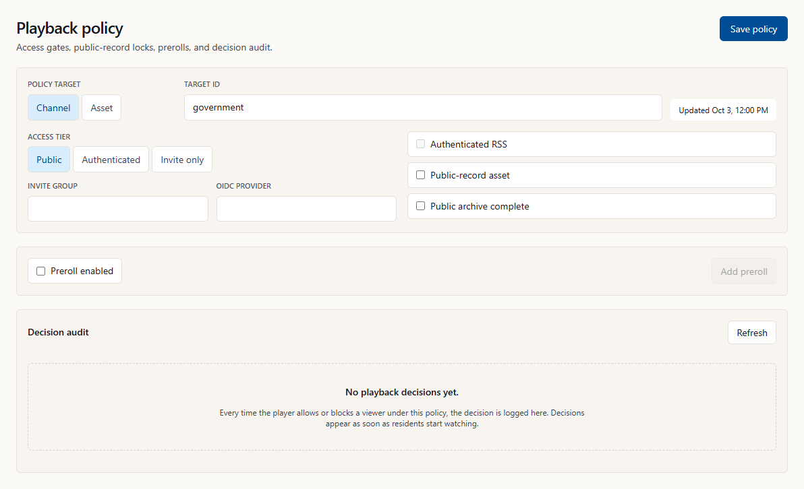{width=90%}

*Figure: the current-source Playback policy screen with synthetic example configuration and an empty example audit. No station policy was read or saved; this illustration does not prove playback access enforcement.*

### The paywall: optional paid access

Some stations may want some recordings behind a paid subscription. The **Paywall** screen is where a setup administrator configures it. It is off by default, and when off everything is public. It sits in the Setup part of the menu and is visible only to setup administrators. Everyone else sees "Forbidden — the subscription paywall is a setup-admin surface. Ask your station admin for access."

The screen has three cards: **Config** (the **Enable paywall** box, a provider, a signing secret), **Tiers** (plans that map to prices you create yourself in Stripe, a payment company) and **Comp access grants** (free passes you give to an email address).

> **Known issue (beta.10):** Treat the Paywall as not ready for live use. In the code we read:
>
> - Turning it on does not select particular recordings. The Watch page asks every resident for a pass on every recording.
> - The video file itself is not protected. The gate is a screen shown in front of the player.
> - The "Email me a sign-in link" button reports "Check your inbox for a link.", but no email is ever sent, so a resident cannot finish signing in.
> - The pages the portal uses to list plans and start payment do not exist on the server, so a resident cannot subscribe.
> - **Save** with an empty **Signing secret** box erases the stored secret, and the box is always empty after you reload the page. Changing any other setting and saving erases it.
> - The list of comp grants shows only grants made in the current browser session, and a grant cannot be revoked after you reload.

If you turn the paywall on for testing, the Watch page shows the gate described in the resident tour below. Residents will be blocked.

### Resident tour: the public portal

The portal needs no sign-in. It is English only and always shows a dark theme. At the top are the title "CivicCast public portal", three buttons **Home**, **Recordings** and **Schedule**, and a link **Report a beta issue**. The page address changes as you move, so any page can be copied and shared. On a phone the same page stacks into one column.

{width=90%}

*Figure: the portal Home page.*

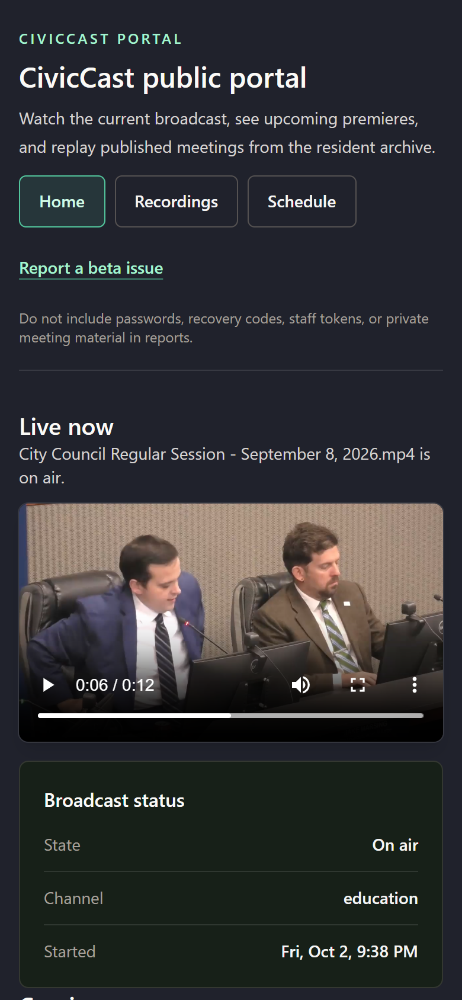{width=40%}

*Figure: Home on a phone.*

> **Known issue (beta.10):** **Report a beta issue** opens the staff console's help page in a new tab, not a page written for residents. The text under it, "Do not include passwords, recovery codes, staff tokens, or private meeting material in reports.", is written for staff. The portal has no help page, no privacy statement, and no contact details for the station.

#### Home and Live now

Home has these parts, top to bottom:

- **Live now.** A sentence and a video, with a **Broadcast status** card beside it (State, Channel, Started). The portal checks again every 4 seconds, so a page left open follows the channel.

| What the station is doing | What residents see |
| --- | --- |
| On the air with web video | "{title} is on air." and the player. State reads "On air". |
| On the air, web video starting | "On air. The web preview is turned on but not serving yet." The page checks again by itself. |
| On the air, no web video | "On air, but web preview is not enabled for this channel." |
| Standing by | "The station is standing by. No program is on air right now." |
| Anything else | "No live broadcast is on air." State reads "Offline". |

- **Coming up.** Cards for upcoming premieres, each with the title, the date and time, and the channel. Empty: "No premieres are scheduled."
- **Latest recordings.** Up to 6 of the newest published recordings, each with **Watch recording**, and **Browse all recordings** to go to the Recordings page. Empty: "No published recordings are available."
- **Follow new recordings** and **Submit a program**, covered below.

If nothing at all is posted the page says "Nothing is posted yet. Check back after the station schedules a premiere or publishes a recording." If a part cannot load, an amber list "Some portal sections need attention" says which. If all three fail the page says "The public portal could not load right now. Refresh the page, then contact the station if the problem continues."

> **Known issue (beta.10):** The emergency notice on Home appears only when the page address has `?emergency=1` added. A resident browsing normally never sees it. Do not rely on the portal Home page to show emergency alerts.

#### Recordings: search and filters

1. Click **Recordings**.
2. Type words in **Search recordings** and click **Search** (pressing Enter works too). The search looks only at the title and the description, not at captions, agendas or the spoken words. It matches any part of a word, and capital letters do not matter.
3. To narrow results, use **Year** (the years of published recordings), **Meeting body** (the meeting body on the recording, such as "City Council") and any extra menus your station has made.
4. Use **Previous**, the page numbers and **Next** to move through the results. There are 12 recordings per page.

Each card shows the title, the description, "Published {date}" and **Watch recording**. A card with no description says "Recording description not posted." The line above the cards reads, for example, "2 recordings published / page 1 of 1" or "N recordings match this filter".

Meeting body and extra fields are set by staff on the video's detail page. A recording with no meeting body never matches a Meeting body filter. If the station has published nothing yet it says "No recordings have been published yet." and links to the channel schedule. If the list cannot load it says "Published recordings could not be loaded. Try again or contact the station." with **Retry**. When a search or filter matches nothing the page says "No recordings match this filter. Clear the search or facets to browse everything." There is no "Clear" button; the resident resets each control. When the search service is not ready, the page falls back to a plain list and shows "Showing recordings in a reduced-search mode — full search is temporarily unavailable, so some filters below may show fewer results than normal. Try again shortly for full search."

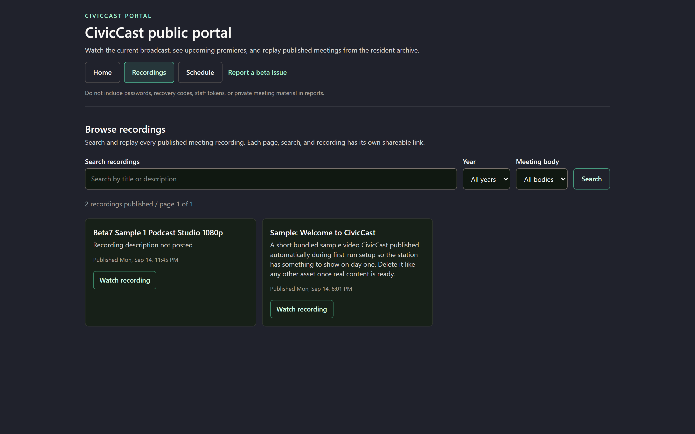{width=90%}

*Figure: the Recordings page.*

#### Schedule

1. Click **Schedule**.
2. Click a channel's name at the top to switch channels.

The page reads "What airs over the next three days. Times are shown in your local timezone." It lists each day with time, title and length. The program on the air now has a green bar and the tag **On now**. Entries are not links. If nothing is listed the page says "Nothing is on the schedule for this channel yet. Check back soon." The Schedule page comes from the station's program log. **Coming up** on Home is a different list: committed premieres only.

{width=90%}

*Figure: the Schedule page.*

#### Watch page: video, captions and agenda

A resident opens a recording by clicking **Watch recording**. The page shows **Back to all recordings**, the title, "Published {date} / {length}", the video player, the description, and **Copy share link**. Click **Copy share link**; the page says "Link copied." and puts the page address on the clipboard. The video is a normal browser player with play, volume and full screen controls.

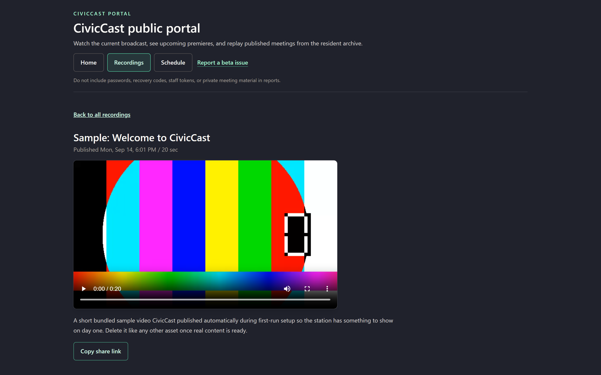{width=90%}

*Figure: a Watch page.*

**Captions.** If the video has caption tracks, a **Captions** bar appears under the player with buttons **Off** and one per track, such as English or Spanish. A track starts on only if the video marks it as the default. When a recording has no caption tracks there is no bar and no message. The portal cannot make captions; it only shows what staff approved (see [After the meeting](#ch-after-meeting)).

**Agenda chapters.** If staff published an agenda for the meeting, an **Agenda** card sits beside the video (below it on a phone). It lists the items by number, title and time. Click an item with a time and the video jumps there and plays. An item with no time shows a dash and cannot be clicked. If the agenda has a document, an **Agenda document** link opens it in a new tab, and a PDF may show in the card. If there is no agenda, nothing is shown. The agenda is the only chapter feature: the player has no chapter marks on its timeline.

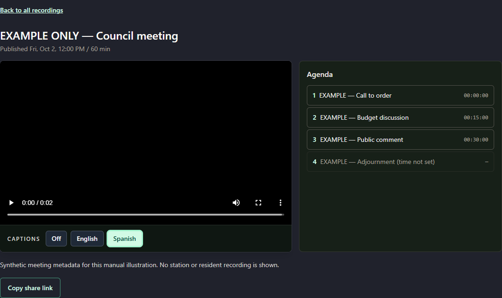{width=90%}

*Figure: the current-source Watch page with example metadata, an agenda and Spanish selected in the caption controls. The two-second synthetic test clip is not the example meeting; this illustrates the interface, not caption accuracy.*

**Errors.** A recording that is not public shows "Recording not found" and "This recording does not exist or is no longer published. Browse the archive for the current recordings." Other failures show "This recording could not be loaded right now. Try again, then contact the station if the problem continues." with **Retry**. If the video cannot play, the player says one of: "Network error while loading the video. Check your connection and try again.", "The video could not be played. The stream may be unavailable." or, for an old browser, "Your browser does not support HLS playback. Please try a recent version of Chrome, Firefox, Safari, or Edge." (HLS is the streaming format the portal uses.) The player has no retry button; reload the page.

> **Note:** The share link uses the address the resident used to reach the portal. If your station is reached by an inside address, a copied link will not work for people outside.

#### What a resident sees when the paywall is on

Only if a setup administrator has turned the paywall on. The video is replaced by a gate. While it checks, a small label says "Checking access…". The gate shows "Subscription required", a reason line, a **Sign in by email** form with **Email me a sign-in link**, a "New here?" block with a plan list and **Subscribe**, and "Already signed in as {email}? Switch email".

In beta.10 the likely sequence is: the resident enters an email and clicks the link button and sees "Check your inbox for a link." No email arrives. The plan list reads "Tier selection isn't configured yet on this station. Contact them for subscription details." With an email typed in, clicking **Subscribe** shows "This station hasn't finished setting up subscriptions yet. Please contact them." (With no email typed it says "Enter your email above before subscribing.") The agenda beside the video stays visible. See the Paywall Known issue above.

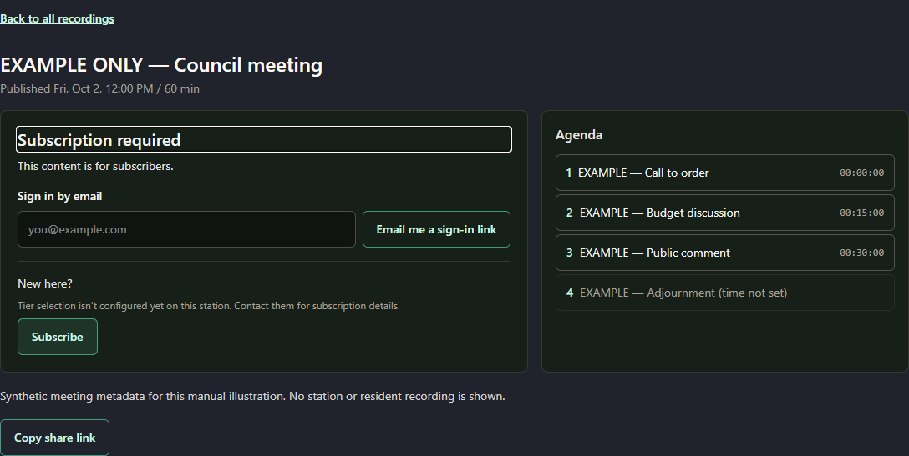{width=80%}

*Figure: the current-source subscription gate with example metadata and no plans configured. No sign-in link, subscription, checkout or payment was requested.*

#### Subscribing to new recordings

At the bottom of Home is **Follow new recordings**. It offers an **Email address** box with **Subscribe**, a **Channel RSS feed** link, and a **Podcast RSS feed** link. RSS feeds are web addresses that a feed reader or podcast app checks for new items.

If a resident types an address and clicks **Subscribe**, a result box says "Subscription is waiting for confirmation." and "Open the confirmation link sent to this address." The small print says email uses a confirm step and a one-click unsubscribe link and carries no tracking pixels.

> **Known issue (beta.10):** Subscribing does not work end to end.
>
> - The signup is always for a channel named `government`, and both feed links point at that name. A station with no channel by that name gets feeds for nothing.
> - Unless IT has switched on a real mail connection, the confirmation email goes to a placeholder mailbox that never leaves the station computer.
> - Even with a real mail connection, the confirmation link written into the email is only a path (`/subscribe/confirm?token=...`) with no web address in front of it. The portal confirms a subscription from `/?subscription=confirm&token=...` and we found nothing that serves the path in the email, so we could not confirm that a resident can finish confirming.
> - Even when a subscriber confirms, nothing sends them a notice when a recording is published. The Publish screen's **Subscriber notifications** row is marked "Coming in a future release".
> - The **Channel RSS feed** is a valid but empty feed. The **Podcast RSS feed** lists episodes only if some were created, and the Podcast step on Publish is not available yet.
>
> Do not promise residents email alerts or working feeds in beta.10. The result box may also show a link labeled "Test one-click unsubscribe", which is a testing control.

> **For IT staff:** Mail delivery is chosen with the provider setting `CIVICCAST_PROVIDER_MAIL` (default is the local placeholder). See Part II (integrations chapter).

The **Submit a program** form lower on Home lets a producer send a program to the station. It is a staff-facing intake feature and is not covered in this chapter.

### Related

- [After the meeting: assets, captions, summaries, approvals](#ch-after-meeting)
- [When something looks wrong](#ch-something-wrong)

<!-- SOURCES: inventory/screens/publish.md; playback.md; paywall.md; public-shell.md; public-home.md; public-recordings.md; public-schedule.md; public-watch.md; public-player-captions.md; public-agenda.md; public-paywall.md; public-subscribe.md; civiccast/publish/router.py:85-129,160-185,420-540; civiccast/publish/service.py:203-300 (build_initial_surfaces, default_approved_surface_ids), 530-600 (approve_publish rebuilds from build_initial_surfaces; unticked surfaces stay pending), 915-990 (_dashboard_state); civiccast/apps/portal-operator/src/screens/PublishDashboardScreen.tsx:200-225 (Simulated note); civiccast/app_platform/router.py:880-925 and civiccast/podcast/router.py:44-95 (only consumers of playback policy); grep of civiccast/apps/portal-public/src for playback-policy/preroll finds none; civiccast/paywall/router.py:225-258 (no-op email sender; no override in civiccast/), 483-565; paywall routes list (no /paywall/tiers or /paywall/checkout); civiccast/paywall/service.py:230-262 (enabled gates every asset); civiccast/apps/portal-public/src/PaywallGate.tsx:270-345; civiccast/subscribe/service.py:45-135, civiccast/subscribe/router.py:185-210 (rss_feed returns empty feed), civiccast/subscribe/delivery.py (LocalMailbox), civiccast/platform/providers.py:100-120 (mail default local); civiccast/schedule/router.py:140-215 (public list is published_at set; coming-up = published premieres); docs/manual/images/portal-*.png -->

\newpage

## Reports, analytics, program guide export, underwriting, and apps {#ch-station-business}

This chapter covers the "business side" of a station: how many residents watched, what aired and when, the schedule file that outside TV-guide services read, sponsor messages, the resident apps, and the optional paid-access feature. A PEG station employee, a records clerk or a station manager normally uses these screens. You do not need any technical background, but a few steps need an IT person, and this chapter says so each time.

Read the "Known issue" boxes. Several of these screens in beta.10 look finished but do less than their wording suggests.

### Before you start

You need to be signed in (see [Chapter 2](#ch-signing-in)). Five of the screens in this chapter sit in the left sidebar under **Publish**: **Analytics**, **Reports**, **EPG Export**, **Underwriting** and **App Admin**. The sixth, **Paywall**, sits under **Setup**.

CivicCast gives each person one or more *roles*. A role is a named set of permissions, such as "Support admin" or "Publish operator". The table shows who sees each screen in the sidebar and what each role can do on it.

| Screen | Shown in the sidebar to | What the role can do |
| --- | --- | --- |
| Analytics | Everyone signed in | Only Support admin and Publish operator can load the numbers |
| Reports | Support admin | Read and download |
| EPG Export | Setup admin, Publish operator | Create, run and delete exports |
| Underwriting | Setup admin, Publish operator, Support admin | Spots, Flights, Placements: Publish operator or Setup admin. Affidavits: Support admin |
| App Admin | Setup admin, Publish operator | Both can view and track; only Setup admin can start a build |
| Paywall | Setup admin | Everything |

> **Note:** In a normal station, everyone signs in with the first administrator account made during First Setup. That account carries all five roles, so you will see every screen and every button. The limits in the table matter only if your IT person made narrower sign-in passes for some staff.

> **Note:** Beta.10 was published on 2026-10-02 as a GitHub pre-release (a beta candidate). Its clean-install check passed. The upgrade and download-only checks were not run, and no human field-tester has signed it off. We read the code behind every screen in this chapter. We could not run every feature against a live station. Where that matters, the text says "In testing we could not confirm".

> **Warning:** Several screens in this chapter ask you to type dates. CivicCast treats those dates as **UTC**, the world reference clock. In the United States UTC is several hours ahead of local time. Mountain daylight time is 6 hours behind UTC. A meeting that starts at 7 p.m. Mountain daylight time is already 1 a.m. UTC *the next day*. When a report looks one day off, this is almost always why.

### Read your audience numbers (Analytics)

Analytics shows how many residents watched recorded meetings (called *VOD*, "video on demand") and live streams.

1. In the left sidebar, open **Publish**, then click **Analytics**.
2. Look below the toolbar. If a box says **Audience telemetry is off**, nothing is being counted. Go to "If it did not work" at the end of this chapter.
3. Click one of the range buttons: **7d**, **30d**, **Quarter** or **Year**. The page opens on **30d**.
4. Click **VOD**, **LIVE** or **ALL** to choose which panels to show. The page opens on **ALL**.
5. Choose a number from the **Metric** drop-down: **Viewer Count**, **Time Viewed** or **Peak Concurrent**.
6. Click **bar** or **line** to change the chart style.

You should see two panels, **VOD** and **Live**. Each starts with a line in the form `12 views · 3.4h watched`, followed by a chart called "Top by" your chosen metric and a chart called "over time". A `· peak 5` ending appears only on the **Live** panel, and only when the live numbers include a viewers-at-once count (see the Known issue below).

> **Note:** **Quarter** means the last 90 days and **Year** means the last 365 days, counted back from now. They are not calendar quarters or calendar years.

> **Note:** The two panels and their charts read totals that CivicCast recalculates in the background about every 5 minutes by default, so they can trail the tiles under them by a few minutes.

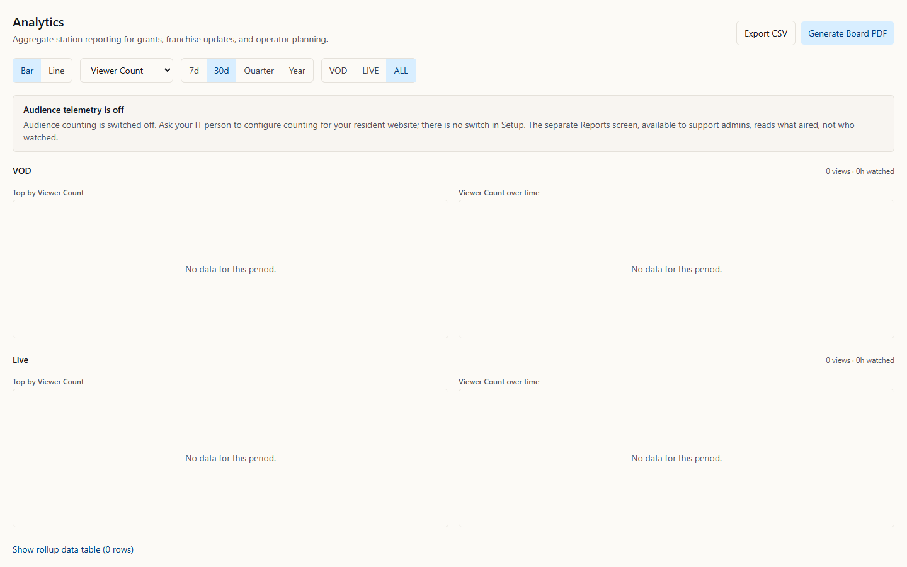{width=90%}

Under the panels, the page shows:

- Four tiles: **Asset views**, **View hours**, **Live peak** and **Podcast downloads**.
- A box called **Privacy boundary**, with the time the report was made.
- Tables named **Asset Time Series** and **Live Concurrent Viewers**.
- Six small tables: **Geography**, **Device**, **Platform**, **Caption Usage**, **Audio Usage** and **Subscription Growth**.
- A link, **Show rollup data table**, that opens a table of the raw totals.

#### What the numbers mean

- A **view** is one time someone starts playing a recording. The same person watching twice counts twice. The PDF report says this itself: "Viewer Count is a play count, not unique humans."
- The numbers cover **streaming only**: the resident website and apps. They do not include people watching on cable.
- Live "concurrent" numbers (how many people watch at the same moment) are estimates.
- **Podcast downloads** is expected to show 0. The Publish screen describes podcasts as coming in a future release.

#### What is collected, and what is not

The resident website sends a small anonymous message ("a beacon") for five things: playback started, playback heartbeat (a signal sent once a minute while a video plays, with the position in the video), playback finished, playback error, and which section of the schedule page someone opened.

CivicCast keeps: the event name, the time, which app sent it, the channel, the recording, and a short list of coarse extras.

CivicCast does **not** keep names, email addresses, IP addresses, session ids or any viewer identifier. The code states this as its privacy boundary, and the screen's **Privacy boundary** box repeats the rule as a machine phrase, `aggregate-only-no-session-ip-or-viewer-identity`. It means "counts only".

By default CivicCast discards events older than 366 days.

> **Note:** In beta.10 the resident website does not show residents a notice that views are counted. If your station wants one, you will need to post your own.

> **Known issue (beta.10):** Most of the extra tables stay empty. The resident website sends only the five messages above. It does not send the viewer's device, platform, country, caption language, audio track or how many people are watching live. The **Geography**, **Device**, **Platform**, **Caption Usage**, **Audio Usage** and **Subscription Growth** tables, the **Live peak** tile and **Live Concurrent Viewers** table therefore stay empty unless another app sends that information. This is expected, not a fault with your station. Watch time is also approximate: in both the file-based and the database-backed store we read, it is added up only from the position reported when a video finishes, so people who stop early add nothing.

> **Note:** No screen in Setup has an audience-counting switch. Ask your IT person to configure counting for your resident website. The separate **Reports** screen is available to support admins and reads what aired, not who watched. In the published beta.10, the Analytics box incorrectly says to turn counting on in Setup; that instruction is corrected in the next release.

> **For IT staff:** The two settings are `CIVICCAST_PUBLIC_ANALYTICS_KEY` and `CIVICCAST_PUBLIC_ANALYTICS_ALLOWED_ORIGINS`; see [Chapter 11](#ch-configuration) and [Chapter 13](#ch-security). The resident website sends no key, so the website's own messages are accepted only when its address is listed in the allowed-origins setting (a comma-separated list of exact addresses such as `https://tv.example.gov`, matched against the browser's origin header). Setting only the key removes the "telemetry is off" box, but the website's messages are then refused.

#### Download a spreadsheet

1. Choose the range you want with **7d**, **30d**, **Quarter** or **Year**.
2. Choose **VOD** or **LIVE** (see the Known issue below about **ALL**).
3. Click **Export CSV**.

Your browser saves a file named like `analytics-rollups-vod-30d.csv`. CSV is a plain table you can open in Excel or Google Sheets.

> **Known issue (beta.10):** With **ALL** selected, **Export CSV** exports the **VOD** table only, and says nothing about it. The file holds the totals table, not everything the page shows. If the download fails, nothing appears on screen. Choose **LIVE** and export again to get the live table.

#### Make the board report (PDF)

1. Click **Generate Board PDF**. A small panel called **Include sections** opens. Four boxes are ticked: **Totals**, **Top content**, **Year-over-year** and **Live-event peaks**.
2. Untick any section you do not want.
3. Click **Download PDF**. The button reads **Generating…** while it works.

Your browser saves `audience-report-` followed by today's date (UTC). The PDF starts with the title, the reporting period and the time it was made, then three notes: streaming only, "a play count, not unique humans", and live numbers are estimated. Your ticked sections follow. **Top content** lists the ten most-played recordings by *recording id*, not by title.

If it fails, the page says "Could not generate the board PDF. Try again."

> **Known issue (beta.10):** The PDF always covers "now minus the range you chose" and ignores the **VOD**/**LIVE**/**ALL** buttons. Its title always reads "CivicCast station", even if your station has a name. If you need your station's name on the report, add it by hand before you send it on.

> **Known issue (beta.10):** The **Analytics** menu entry is visible to every role, but only Support admin and Publish operator can load it. Anyone else sees the frame of the page and the words "Report unavailable.", which does not say why. If you see this message and you expect access, ask your station admin.

### Find out what aired, and when (Reports)

Reports lists what actually went out on your channels. CivicCast keeps a log of each change of source on air, called the *as-run log*. Cities and cable companies sometimes ask for this as proof that programs aired (a "franchise report": a report your cable franchise agreement may require).

Reports reads the on-air log. It does not count viewers; use Analytics for that.

1. In the sidebar open **Publish**, then **Reports**. Only the Support admin role sees this entry.
2. Click a tab: **Shows**, **As-Run** or **Hours by Category**.
3. In **From**, pick the first day you want.
4. In **Through**, pick the day *after* the last day you want. The range includes **From** and excludes **Through**. To see one day, set **From** to that day and **Through** to the next day.
5. Leave **Channel (optional)** on **All channels**, or pick one channel.
6. On the **As-Run** and **Hours by Category** tabs, check **Field key (required)**. It opens as `category`.

The page opens on today's date through tomorrow's, UTC midnight to UTC midnight. If the dates are wrong, you see "Pick a From date that is strictly before the Through date." and nothing loads.

> **Warning:** Dates here are UTC. A station on Mountain time should widen the range by a day when looking for an evening meeting.

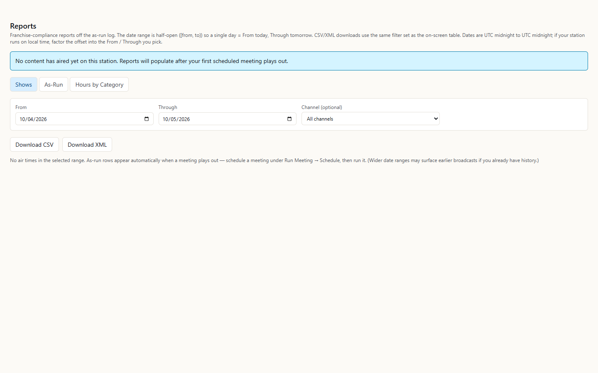{width=90%}

#### What each tab shows

| Tab | Columns | Use it to |
| --- | --- | --- |
| **Shows** | Asset, Plays, Total airtime, First aired (UTC), Last aired (UTC) | See each recording once, with how many times it aired |
| **As-Run** | Channel, Start (UTC), End (UTC), Duration, Source, Asset, Category, Verified | See every change on air, in order |
| **Hours by Category** | Category, Entries, Total airtime, Hours | See airtime per category, such as "Council" |

The **Asset** column shows the recording's id, not its title. The **Shows** tab leaves out anything without a library recording (filler, slate and live).

The **Source** column uses these words:

- `program`: a recording from your library.
- `filler`: a community bulletin board graphics page.
- `live`: a live source.
- `slate`: the safety card the station shows in place of video, for example when a feed fails.
- `spot`: a sponsor message. In beta.10 this word never appears. See Underwriting below.

**Verified** reads "yes" for every row the playout engine wrote, because a row exists only when the engine confirmed that it went on air.

#### Download a report file

On **Shows** and **As-Run**, click **Download CSV** or **Download XML**. Both use the dates and channel you chose. Your browser saves `civiccast-shows-` or `civiccast-as-run-` followed by the start date.

The **Hours by Category** tab has no download buttons. Read it on screen.

> **Known issue (beta.10):** The **Hours by Category** tab needs a *custom field* (an extra label you add to recordings, such as "category"). An unknown name shows: `No custom field named "{key}" is defined for this station. Define it in Setup > Custom Fields, then re-run the report.` Only the Setup admin role can open **Custom Fields**, while Reports is for the Support admin role. If you are not both, ask your Setup admin.

> **Note:** A copy of the as-run list is also available to the public at `/api/public/reports/as-run` with no sign-in. It leaves out Category and Verified. Reports does not tell you this, so do not treat the as-run list as private.

> **For IT staff:** The public as-run endpoint is described in [Chapter 13](#ch-security).

### Send your schedule to a TV-guide service (EPG Export)

An *EPG* (electronic program guide) is the schedule file that cable boxes, TV-guide services and apps read to show "what is on". EPG Export turns your published schedule for the next several days into such a file. Each *export* is a saved setup naming a channel, a file type, how many days ahead, and optionally a web address to send the file to.

> **Note:** **Program Guide**, under Run Meeting, is a different thing. It holds your recurring slots and builds the on-air schedule (see [Chapter 3](#ch-before-meeting)). **EPG Export** makes a file for outside services from the schedule that already exists.

#### Before you start

- The items you want in the file must be **published** on the Schedule screen. The file contains only published items on that channel that start between now and the number of days ahead.
- You need the channel's id. The **Reports** screen has a channel drop-down that lists them as `slug (channel_id)`, or ask your IT person.
- Ask the guide service for a sample file and its address first. In testing we could not confirm that any particular service, such as TitanTV, accepts what CivicCast makes. The "X-List" format here is a generic eight-column table.

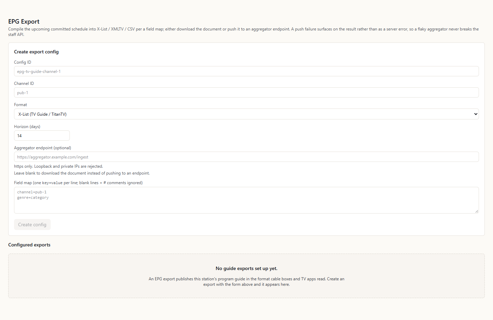{width=90%}

#### Create an export and download the file

1. Open **Publish**, then **EPG Export**.
2. In **Config ID**, type a name using lowercase letters, numbers, `-` and `_` only, such as `tv-guide-channel-1`. It cannot be changed later.
3. In **Channel ID**, type the channel's id.
4. In **Format**, choose **X-List (TV Guide / TitanTV)**, **XMLTV** (a common TV-guide file format) or **CSV**. Ask the guide service which one it reads.
5. In **Horizon (days)**, type how many days ahead to include. The box starts at 14. It must be more than 0.
6. Leave **Aggregator endpoint (optional)** empty. An empty address means "give me the file to download".
7. Click **Create config**.
8. In the **Configured exports** list, click **Generate now** on your export.
9. Click **Download document**.

You should see a green panel such as `12 slots · 3.0 KB (xlist)` (a single slot reads `1 slot`) with a **Download document** button. A *slot* is one scheduled program. Your browser saves `epg-export.xml`, `epg-export.csv` or `epg-export.txt` (X-List files end in `.txt`).

If the panel says `0 slots`, the channel has no published items in the window, or the channel id is wrong.

Each slot carries a start and end date and time in **UTC**, and the recording's title.

> **Known issue (beta.10):** The description, category and rating columns are always empty. The screen's wording suggests a full guide. Do not promise a service genre or rating information from this export in beta.10.

> **Known issue (beta.10):** The **Field map** box does less than its example suggests. It only renames column headings in the CSV and X-List files, and has no effect on XMLTV. Its example, `channel=pub-1`, is wrong because `channel` is not a column. The real columns are `start_date`, `start_time`, `end_date`, `end_time`, `title`, `description`, `category` and `rating`. If you rename a heading, write the line as `title=Program Title` (left side is the CivicCast column, right side is the heading you want).

#### Send the file to an address instead

If you give an address in **Aggregator endpoint (optional)**, **Generate now** sends the file there.

1. Edit your export, or create a new one.
2. Type the service's address in **Aggregator endpoint (optional)**. It must start with `https://`.
3. Click **Save changes** or **Create config**.
4. Click **Generate now**.

You should see a panel that says `Pushed to {address} at {time}.`

> **Warning:** **Generate now** sends the whole guide at once, with no confirmation, and it cannot be taken back. CivicCast cannot log in to the receiving service, because no password or key can be stored. The file is sent as an open request. Nothing sends the file automatically on a schedule. Each press of **Generate now** sends it again.

If the send fails, the panel says "Push failed" with a reason, and gives you no file to download. To get a file, clear the address and run **Generate now** again.

The server accepts only `https` addresses and refuses `localhost` and private network addresses typed as numbers. It waits 5 seconds and does not follow redirects. The code does not look up where a web name points, so a name that points to a private address is not refused.

#### Change or remove an export

1. To change days ahead, address or field map, click **Edit**, change the box, and click **Save changes**. Clearing the address switches the export to download-only.
2. To remove an export, click **Delete**, then **Confirm delete**. Data the guide service already received stays there.

### Record sponsor messages (Underwriting)

Underwriting means paid "sponsor acknowledgment" messages, such as "Support for this program comes from Acme Co-op". The screen uses these words:

- A **spot** is one short sponsor video, with the sponsor's name.
- A **flight** is a sponsor's run: which spot, which channels, and between which dates.
- A **placement** is a specific schedule slot a spot was assigned to.
- An **affidavit** is a sponsor-ready list of every time their spot aired, used for billing.

> **Known issue (beta.10):** **In beta.10 Underwriting is a planning list, not a working sponsor system.** You can record spots and flights, but nothing puts a spot on the air, and the affidavit stays empty. In the code we read:
>
> - The only thing that creates placements is a manual request sent to the station's programming interface. No button on this screen sends it, and nothing in the station sends it by itself.
> - Nothing that plays video reads placements.
> - The playout engine never records an airing of kind `spot`, yet the affidavit counts only airings of that kind.
>
> The words on screen, "airing reports build from it" and "placements appear here automatically", are therefore wrong for beta.10. We have not run this on a live station. Do not tell a sponsor that CivicCast will insert their message or produce billing proof.

#### What does work

| You can | Result in beta.10 |
| --- | --- |
| Create, edit and delete spots | Saved |
| Create, edit and delete flights | Saved |
| Tick the compliance attestation | Saved as a record that a person reviewed the spot |
| Read **Placements** | Empty unless IT staff trigger the compile request |
| Read **Affidavits** | Empty |
| Click **Download CSV**, **Download XML**, **Download PDF** | Shows an error instead of a file (below) |

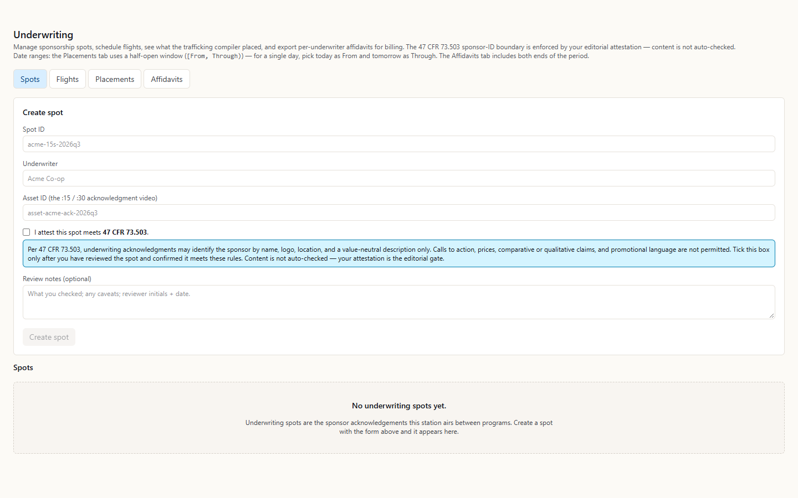{width=90%}

#### Add a spot

1. Open **Publish**, then **Underwriting**, then the **Spots** tab (Publish operator or Setup admin).
2. In **Spot ID**, type a name using lowercase letters, numbers, `-` and `_`, such as `acme-15s-2026q3`.
3. In **Underwriter**, type the sponsor's business name exactly as you will type it later when you look for it. The affidavit matches the name exactly, including capitals.
4. In **Asset ID (the :15 / :30 acknowledgment video)**, type the id of the sponsor video (the recording's id, from the Assets screen). The label's ":15 / :30" means a 15-second or 30-second message. Use lowercase letters, numbers, `-` and `_` here too.
5. Read the reminder box about 47 CFR 73.503. It says acknowledgments may name the sponsor, logo, location and a value-neutral description, and may not contain calls to action, prices, comparisons or promotional language.
6. Tick **I attest this spot meets 47 CFR 73.503.** only after you have watched the spot.
7. Optionally write what you checked in **Review notes (optional)**.
8. Click **Create spot**.

The spot appears in the **Spots** list with "FCC 73.503 attested." or "NOT attested — operator must attest before traffic."

> **Note:** CivicCast does not check the content of a spot. Your attestation is the only gate. The screen cites a federal rule written for broadcast stations. Ask your station manager or counsel how it applies to your channel.

> **Note:** CivicCast does not check that the **Asset ID** is real. A wrong id saves without a warning.

#### Add a flight

1. Open the **Flights** tab.
2. In **Flight ID**, type a name such as `acme-2026q3-pubgov`.
3. In **Spot**, pick the spot from the drop-down.
4. Set **Start date** and **End date**. The window includes both days.
5. In **Channels**, type at least one channel id, separated by commas, such as `pub-1, gov-1`. The box has no "required" mark, but the server refuses a flight with no channel.
6. Leave **Frequency cap (per day, optional)** empty, or type a whole number from 1 to 1440.
7. Leave **Daypart block ID (optional)** empty unless your scheduling team gave you an id.
8. Click **Create flight**.

To delete a spot or flight, click **Delete**, then **Confirm delete**. Deleting a spot also deletes every flight and placement that used it. This cannot be undone.

#### The Placements and Affidavits tabs

On **Placements**, set **From** and **Through** (UTC; **From** is included and **Through** is not), and optionally a channel and flight. On **Affidavits**, type the sponsor's name and a date range. The affidavit includes *both* the first and last day, in UTC.

An empty affidavit shows "No airings recorded for {name} between {from} and {to}." with three possible reasons: the name does not match exactly, there are no flights in the period, or nothing has aired yet. In beta.10 add a fourth: nothing records airings of spots.

> **Known issue (beta.10):** The **Download CSV**, **Download XML** and **Download PDF** links on the affidavit are plain web links. Staff requests need a sign-in that a plain link cannot carry. The expected result is the message `Missing Authorization header. Use Bearer <staff-token>.` instead of a file. We read this in the code and did not click the links in a running station. Until fixed, read the totals on screen, and ask IT staff for the file.

> **Known issue (beta.10):** If your IT person switches on the setting `CIVICCAST_REQUIRE_FCC_ACK=1`, saving a spot without the tick fails with "Station policy requires fcc_compliant_ack=true". Without that setting an un-attested spot saves, despite the "NOT attested" wording.

> **For IT staff:** See [Chapter 15](#ch-integrations) for the programming interface.

### Build the resident apps (App Admin)

A resident app lets people watch your station on a phone or a TV box. CivicCast can package a *starter app* for web (a "PWA", a website that installs like an app), Roku, Apple TV, Fire TV, Android TV, Android phones and tablets, and iPhone and iPad. App Admin builds that package on the station computer, keeps a history of builds with download buttons, and gives you a notebook for tracking app-store submissions.

> **Warning:** App Admin does not put any app in any app store. CivicCast never contacts a store. Someone technical still has to sign each package and submit it. The built package is a generic starter. The page says apps read the station's settings when they run, so name and branding update without a rebuild. In testing we could not confirm this in a running app, and store review is separate work.

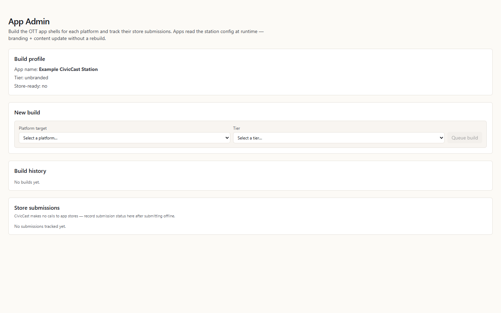{width=90%}

#### Make a build

You must have the Setup admin role.

1. Open **Publish**, then **App Admin**.
2. Look at **Build profile**. It shows **App name**, **Tier**, **Store-ready** and an icon address. You cannot change these here. Change them on the **Channels** screen.
3. In **Platform target**, choose a platform. The names are lowercase: `web pwa`, `roku`, `tvos`, `fire tv`, `android tv`, `android mobile` and `ios ipados`.
4. In **Tier**, choose **unbranded** or **branded**.
5. Click **Queue build**.
6. In the box that asks "Queue a {platform} build ({tier} tier)?", click **Queue build**.
7. Wait. The button reads **Building…**.
8. When the build finishes, find it in **Build history** and click **Download**.

Your browser saves `{platform}-{record id}.zip`. Each row shows the time, the first 12 characters of a *SHA fingerprint* (a code that changes if the file is altered, useful for checking that a file you pass on arrived unchanged) and who made the build.

> **Known issue (beta.10):** **Tier** only labels the build record. The build uses the same steps for **unbranded** and **branded**, and does not read the station's settings. Do not expect the tier to change the file.

> **Known issue (beta.10):** The build runs inside a single web request. The page shows **Building…** with no progress bar and no time estimate, and it must stay open. In testing we could not confirm how long builds take.

> **Known issue (beta.10):** The **Store submissions** section stays on "No submissions tracked yet." The screen offers no way to add a platform, so the notebook has no rows. Only IT staff can create one through the programming interface.

> **Note:** **Store-ready: yes** is a flag someone set on the Channels screen. It does not test anything.

> **Note:** If you have the Publish operator role you see "Queueing a build requires the setup admin role." and can still view and download builds.

### Turn on paid access (Paywall)

The **Paywall** screen, in the **Setup** section, lets a station hold some recordings behind a paid subscription (through a payment company called Stripe) or give a free "comp" pass to a named email address. It is off by default. When it is off, every recording is public. The Setup admin role can open it. How residents experience a paywall is described in [Chapter 6](#ch-publishing).

A *tier* is a price level, for example "Basic monthly", linked to a price you made in Stripe. CivicCast never creates prices and never stores card numbers.

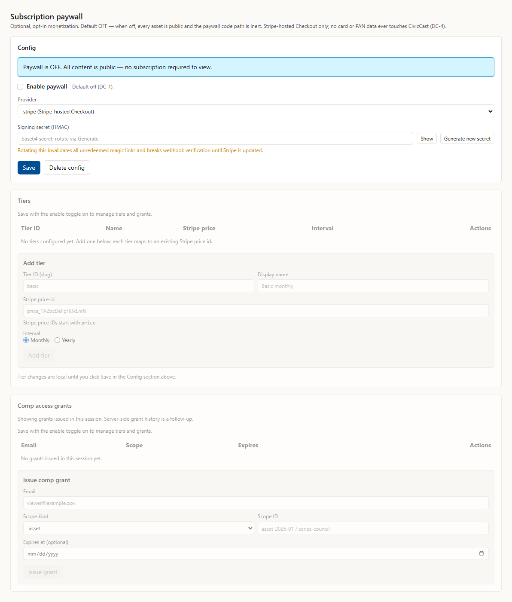{width=90%}

*Figure: the current-source Subscription paywall screen with synthetic disabled configuration. No actual configuration or credential was read, generated or saved; this example does not establish payment or access enforcement.*

> **Warning:** Leave the paywall **off** in beta.10. The code we read shows the feature is unfinished.

> **Known issue (beta.10):** Saving the paywall settings can erase the stored signing secret. The screen never shows the secret, so the secret box is empty every time you open the page. A blank box is saved as "no secret". Changing any setting and clicking **Save** therefore wipes it, and sign-in links and payment confirmations stop working.

> **Known issue (beta.10):** In the code we read, the email that carries a resident's sign-in link is not sent by default. No server code blocks the recording file itself; the check is a question the resident website asks. The website also asks for a tier-list route and a checkout route that we did not find on the station. The list of free passes (**Recently issued grants**) shows only passes issued in this browser session; you cannot see or cancel passes you issued earlier.

> **For IT staff:** See [Chapter 15](#ch-integrations) before enabling this on a live station.

### If it did not work

| What you see | Where | What it means and what to do |
| --- | --- | --- |
| `Audience telemetry is off` | Analytics | Counting is not switched on. Ask your IT person to turn it on (see the For IT staff note above) |
| `Report unavailable.` | Analytics | You may lack the role (Support admin or Publish operator), or the station is not ready. Ask your station admin |
| `Reports require the support admin role. Ask your station admin for access.` | Reports | You need the Support admin role |
| `Pick a From date that is strictly before the Through date.` | Reports | Set **Through** to a later day than **From** |
| `No content has aired yet on this station. Reports will populate after your first scheduled meeting plays out.` | Reports | No air log rows in the range. Check the channel, widen the dates (UTC), and confirm something aired |
| `Durable storage is not ready yet.` | Reports, EPG, Underwriting, Alerts | The station's database is not ready. Tell your IT person |
| `Push failed: {error}...` | EPG Export | The guide service did not take the file. Check the address, then try again. Nothing changed on your station |
| `Could not run the export.` | EPG Export | The export could not run. Check the channel id and try again |
| `Missing Authorization header. Use Bearer <staff-token>.` | Underwriting, affidavit download | Known issue above. Read the totals on screen and ask IT staff for the file |
| `Station policy requires fcc_compliant_ack=true ...` | Underwriting, saving a spot | Tick the attestation box after reviewing the spot |
| `Underwriting spot '...' already exists. Use PATCH to update.` | Underwriting | That Spot ID is taken. Use a different id, or click **Edit** on the existing spot |
| `App build tooling is not configured in this runtime...` | App Admin | This computer does not have the app build tools. Meeting recording and scheduled recording are not affected. Ask IT |
| `Could not download the artifact.` or `Build artifact file is no longer present on disk.` | App Admin | The ZIP file is missing from the station computer. Build again |

### Related

- [Chapter 2: Signing in](#ch-signing-in)
- [Chapter 3: Before the meeting](#ch-before-meeting)
- [Chapter 6: Publishing, and what residents see](#ch-publishing)
- [Chapter 8: When something looks wrong](#ch-something-wrong)
- [Chapter 15: Cable headend, streaming, federation and the API](#ch-integrations)

<!-- SOURCES: inventory/screens/analytics.md, reports.md, epg.md, underwriting.md, appadmin.md, paywall.md, _shell-navigation-and-roles.md, guide.md; civiccast/analytics/router.py:30-70; civiccast/analytics/store.py:28-60,141-150,272-334; civiccast/analytics/exports.py:120-215; civiccast/apps/portal-public/src/analytics.ts:1-90; civiccast/apps/portal-public/src/HlsPlayer.tsx:96-160; civiccast/app_platform/router.py:573-590; civiccast/reporting/router.py:262-293; civiccast/reporting/schedule_adapter.py:70-100; civiccast/egress/asrun.py:90-110; civiccast/egress/daemon.py:3165-3200; civiccast/underwriting/router.py:23-80,606-640; civiccast/underwriting/service.py:539-546; civiccast/apps/portal-operator/src/screens/UnderwritingScreen.tsx:1005-1050; civiccast/apps/portal-operator/src/api/client.ts:3285-3300; civiccast/auth/middleware.py:24,73-100; civiccast/apps/app-platform-shells/scripts/build-targets.mjs (no tier/branded reference); civiccast/paywall/store.py:190-205; civiccast/apps/portal-operator/src/screens/PaywallScreen.tsx:340-360; docs/releases/v1.0.0-beta.10-verification.md; fact-check pass: civiccast/apps/portal-operator/src/screens/AnalyticsScreen.tsx, ReportsScreen.tsx, EpgExportScreen.tsx, AppAdminScreen.tsx; civiccast/analytics/router.py, pg_store.py:370-540; civiccast/reporting/router.py, epg.py, schedule_adapter.py; civiccast/underwriting/models.py:57,132-154; civiccast/app_platform/build_router.py; civiccast/paywall/router.py:296-324,575-650; civiccast/app_platform/router.py:397-418 -->

\newpage

## When something looks wrong {#ch-something-wrong}

This chapter helps you when a screen shows a red or yellow warning, an alert appears, or you are not sure the station is working. It covers the **Readiness** screen, **Alerts**, **Emergency Alerts** and **Federation**, then gives you a list of what to do and what not to do, a way to describe a problem to your IT person, and where to report a beta problem. Most staff roles can open these screens (the Alerts list and Emergency Alerts have narrower limits, described below). Fixing most problems is the IT person's job.

### Before you start

The four screens live in the left sidebar under **System Health**: **Readiness**, **Alerts**, **Emergency Alerts** and **Federation**. Most of them open for any role. Individual buttons are limited by role, and a button you cannot use shows a grey note that names the role needed.

> **Note:** In a normal station, everyone signs in with the first administrator account made at First Setup, and that account carries all five roles. You will usually see every button.

> **Known issue (beta.10):** One place has three names. The sidebar says **Readiness**, the page's heading says **Safe to broadcast**, and other text says **System Health**. They are the same screen.

> **Note:** Beta.10 was published on 2026-10-02 as a GitHub pre-release (a beta candidate). Its clean-install check passed. The upgrade and download-only checks were not run, and no human field-tester has signed it off. Some of the warnings and alerts in this chapter work differently from what the screens suggest; each Known issue says how.

### Check whether the station is ready (Readiness)

Readiness answers one question: "Can we broadcast right now?"

1. In the sidebar, open **System Health**, then click **Readiness**.
2. Wait while the page says "Checking station readiness...".
3. Read the banner at the top, **On air right now**. It shows each channel, a coloured label and a message. The banner refreshes by itself every 5 seconds.
4. Read the card below it. Its heading is the station's overall verdict, followed by a message and "Last checked" with the date and time.
5. Scroll down to **Required before broadcast** and **Optional and advanced**. Each row is one check, with a coloured label, a short message and a "Next step".

{width=90%}

*Figure: the current-source Readiness screen with synthetic Ready responses and no automatic channels. This illustrates the interface, not live station readiness.*

#### What the colours and words mean

| Colour | Words on screen | What it means |
| --- | --- | --- |
| Green | **Ready** | The required checks passed, and no optional check needs a look |
| Yellow | **Check before meeting** | Something needs attention or proof before the meeting |
| Red | **Do not broadcast yet** | A required check failed for tonight's broadcast |

A single check row can also say **Not set up yet** (an optional feature has no setup or proof) or **Needs IT help** (the next step needs administrator work on the computer).

A channel tile uses these words:

- **On air** or **Ready** (green).
- **Working** (yellow).
- **Needs attention** (red).

After the word you may see "on safety slate" (the channel is showing its fallback card) or "live captions off".

> **Known issue (beta.10):** A yellow station can show two different verdicts at once. The small pill at the top says **Check before meeting**, while the card below can say **Ready with optional items**. Both mean the required checks passed and an optional item needs a look. The second wording is not one of the five standard phrases.

> **Known issue (beta.10):** The page does not refresh by itself, except for the **On air right now** banner. There is no **Refresh** button. The checklist updates only after you use one of its own buttons or re-open the page after about 30 seconds.

#### What each check means

These eight checks are required. If any one is red, the station says **Do not broadcast yet**.

| Check | In plain words | What the "Next step" says |
| --- | --- | --- |
| **First admin** | The station has an administrator account | Open Setup and finish first-admin setup |
| **Recovery kit** | The one-time sheet that lets you get back in if the password is lost was made | Confirm someone printed or saved it |
| **Durable records storage** | The station's database is working and keeps its records | Open Setup and choose **Prepare storage** |
| **Backup** | A backup is set up | The message tells you what is missing |
| **Camera or meeting source** | A camera, encoder, Zoom or NDI source is added and passed its pre-flight check | Open Run Meeting and add or check the source |
| **Local recording** | A place to save recordings is chosen and passed a write, read and delete test | Choose where recordings are saved |
| **Resident portal** | The resident website address is set and the preview is confirmed | Open the preview and confirm residents can see the page |
| **Station policy** | The default station rules are active | Finish Setup |

The optional checks are:

| Check | In plain words |
| --- | --- |
| **Contributor upload storage** | How full the folder for resident uploads is. Yellow at 80 percent, red at 100 percent, when new uploads are refused |
| **Caption inference device** | Whether captions run on the graphics card or the main processor. It is always shown as informational, and never blocks |
| **Cable headend verification** | Whether the cable feed was tested. If no channel delivers to a cable headend, the row still appears and says so |
| **24/7 channel automation** | Whether channels set to run around the clock are running. If none are set up, the row still appears and says so |
| **YouTube**, **Subscriber notices**, **Federation**, **Internet Archive**, **Archive storage** | Optional publishing and archive features and whether each is set up |
| **Internal service certificates** | An advanced security item, marked "advanced". It is for IT staff |

#### Run the broadcast readiness check

The **Check broadcast readiness** button runs a *private rehearsal*, a short test of the whole broadcast path with no public audience. You need the Meeting operator role.

1. Click **Check broadcast readiness** on the top card.
2. Wait for the **Broadcast readiness check result** card to appear.
3. Read the **Rehearsal result** line and the **Broadcast gate** line.

The rehearsal result is one of:

- **Passed**: a private session ran, passed its pre-flight check and finished a recording.
- **Failed**: the private session started but stopped before a recording was finished.
- **Not run**: something stopped the private session from starting.

The broadcast gate reads "All required items ready", or "N required item(s) need attention", or "N required item(s) not ready".

> **Warning:** The rehearsal makes a real private test session called "Private first-broadcast rehearsal" on the channel named `government`, copies a sample video, and saves a test recording. The button gives no warning and no "running" message. Run it before a meeting, not while a meeting is on the air. In testing we could not confirm whether the test recording is visible on the Assets screen.

> **Known issue (beta.10):** Items listed under the gate are links to the matching row lower on the page. In testing we could not confirm that they work in beta.10, and a bare link like this has failed elsewhere in the same console by opening "Page not found". If it does, scroll down to the row yourself.

> **Known issue (beta.10):** Some buttons on this page are grey with no reason shown, for example **Open maintenance window** and **Run failed-update rehearsal**. They need earlier steps to pass first. Only the role limits are explained on screen.

#### The other panels on this page

Below the checklist, the page also holds tools for IT staff or trained staff. Do not press these unless you were asked to.

| Panel | What it is for |
| --- | --- |
| **Outgoing channel feed** | One card per channel with **Start**, **Stop**, **Restart feed** and **Finish current item, then stop**. The Meeting operator role is needed |
| **GStreamer engine repair** | Re-checks the video engine (called GStreamer) and, if it is broken, starts a signed repair of it. The page says this is never a reinstall. Setup admin or Support admin |
| **Backup and restore readiness** | **Check backup storage** and **Run real database restore drill** |
| **Update and rollback** | Checks and practice runs for updating CivicCast and going back if an update fails. It does not install an update itself |
| **Support bundle** | Makes a redacted troubleshooting file for support (Support admin) |
| **Latest self-check** | The result of the station's automatic test. It runs daily and weekly; the first daily check runs overnight |
| **Machine health** | Processor use, memory, free disk space, whether the database is reachable and whether the service is running |

The feed buttons ask you to confirm before they act. They only *queue* a command for the channel's feed. Nothing tells you to wait.

> **Known issue (beta.10):** After **Restart feed**, the state label may stay on the old value until you re-open the page. The page does not poll these cards. Wait a minute, then reload Readiness.

> **Warning:** **Stop** takes a channel off the air. **Finish current item, then stop** does the same after the current program ends. Only press these on purpose, and never on a channel you do not intend to stop.

### Watch for alerts (Alerts)

An *alert* is a warning the station raises by itself, such as "Disk space low" or "Channel off air". The **Alerts** screen lists them.

1. In the sidebar, open **System Health**, then click **Alerts**. You can also click **Review alerts** or **Open alerts** on the Readiness page.
2. Click **Active** to see current problems, or **Resolved** for past ones. The Active list refreshes every 10 seconds.
3. Read each row: the title (what went wrong), a severity (CRITICAL, WARNING or INFO), a summary, what it is about, and when it was first and last seen. "seen 3×" means it happened again.
4. Click **Acknowledge** on a row to say you have seen it. The row then shows "Acknowledged by" your name and the date.

After a successful check, an empty list says: "No active alerts were returned. This does not verify station health; check Readiness before going on air." If the list could not load, it shows an error and **Retry alerts**, not an all-clear message. An empty list is not proof that monitoring or notification delivery works.

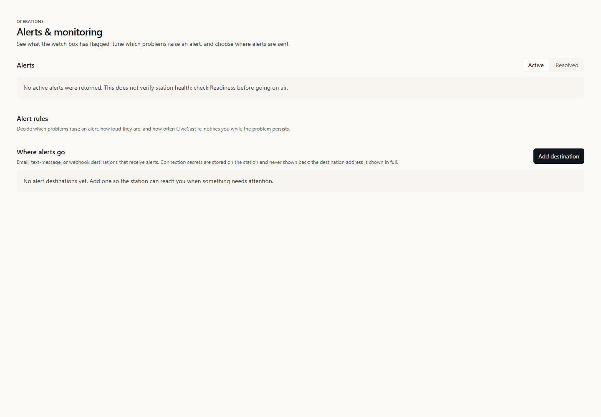{width=90%}

*Figure: the current-source Alerts screen with synthetic empty alert, rule and destination lists. The empty state does not establish that a station is healthy or its notifications are configured.*

> **Note:** **Acknowledge** means "I have seen this". It does not fix the problem and does not close the alert. An alert closes itself when the problem goes away, and then moves to **Resolved**.

The alert titles you may see are:

- Channel off air
- Encoder stopped
- Server crashed
- Data format out of date
- Relay blocked
- Cable compliance check failed
- Missing media file
- Save to database failed
- Live takeover stuck over 2 hours
- AI engine is down
- Disk space low
- Computer clock out of sync
- Database unreachable
- CivicCast service is down
- Automatic self-check did not pass

Some alerts show a plain code with the dashes turned into spaces, for example "eas source unavailable", "asrun outbox degraded" or "caption tier degraded". "eas source unavailable" means an emergency-alert feed could not be reached. "asrun outbox degraded" concerns the on-air log that Reports reads.

#### Rules and destinations

Under the list are two sections for administrators.

- **Alert rules** has one card for each of the 14 kinds of alert that come with a rule. Alert kinds added later have no card (see the Known issue below). On a card you can switch **Enabled** on or off, set **Severity** to Critical, Warning or Info, set **Re-alert after (minutes)** (how long CivicCast waits before warning you again while the problem continues), and tick **Notify on resolve**. Click **Save** to keep your changes.
- **Where alerts go** lists *destinations*: an email address, a text-message number or a webhook (a web address that receives a message). Click **Add destination**, choose a **Type**, give it a **Name**, type the address in **Where to send (email, phone, or webhook URL)**, and click **Create destination**.

The destination form has **Quiet hours start (UTC, HH:MM)** and **Quiet hours end (UTC, HH:MM)**. These are in UTC, not local time. A quiet-hours window holds back WARNING and INFO alerts. CRITICAL alerts ignore quiet hours and are always sent.

> **Warning:** Do not click **Delete** on a destination unless you mean it. The first click turns the button into **Confirm delete?**, and a second click deletes right away. There is no cancel and no timeout.

#### What happens in beta.10 when no destination is wired

> **Known issue (beta.10):** **You can follow the Alerts screen exactly and still never receive an email, text or webhook message.** This is the most important thing to know about alerts in beta.10.
>
> - A new install ships every alert rule with *no destinations attached*.
> - Adding a destination on this screen creates it, but does not attach it to any rule. The rule card has no way to choose destinations.
> - When an alert fires and its rule has no live destination, CivicCast writes a "suppressed" delivery note that reads "No enabled alert channel is configured for condition ...". No screen shows that note.
> - The alert itself does still appear on the **Alerts** screen and in the red and yellow counts on **Readiness**.
> - There is no **Send test alert** button, so you cannot check a destination by pressing a button.
> - Some kinds of alert have no rule at all: "Automatic self-check did not pass", "eas source unavailable", "asrun outbox degraded" and "caption tier degraded" are among them. They show on the **Alerts** screen as warnings, have no card under **Alert rules**, and can never be sent to a destination in beta.10, even by IT staff.
>
> Until an IT person attaches destinations to rules, nobody is told about a problem unless somebody looks at the screen. Check **Readiness** and **Alerts** before every meeting and at the start of every shift.

> **For IT staff:** A rule takes `channel_ids` (the ids of destinations) through `PUT /api/staff/alert-rules/{rule_id}`, with the Setup admin role. The 14 rules that exist come with ids like `default:off-air`. See [Chapter 14](#ch-troubleshooting) and [Chapter 15](#ch-integrations).

> **Known issue (beta.10):** The page says Setup admin *or* Support admin can manage rules and destinations. The station accepts changes only from the Setup admin role. A Support admin sees the editors and gets a "requires one of these CivicCast roles" error on **Save**. Publish operators and Records clerks may also see the Alerts page but cannot read the alerts list.

### Understand emergency alerts (Emergency Alerts)

The **Emergency Alerts** screen shows public-safety alerts the station has pulled in from outside feeds, and lets an operator put one on a channel. You can open it with the Setup admin, Support admin or Meeting operator role.

> **Warning:** CivicCast is **not** an Emergency Alert System (EAS) device. A banner on the page says so permanently: "Public-safety display — not an EAS device". It does not send the national EAS signal and never takes over programming by itself. The required national alert relay stays with your cable operator's certified equipment at the headend.

The feeds come from the National Weather Service (NWS), the federal alert system IPAWS, and AMBER child-abduction alerts. IPAWS and AMBER alerts are read in a standard format called CAP (Common Alerting Protocol); the code reads National Weather Service alerts from that service's GeoJSON feed instead. We did not test any live feed.

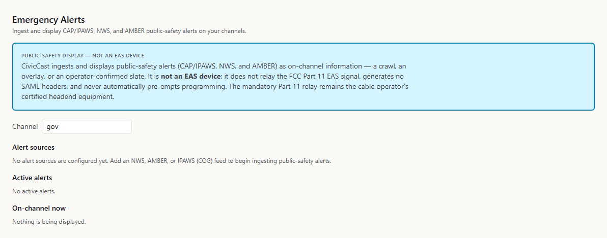{width=90%}

*Figure: the current-source Emergency Alerts screen with synthetic empty sources, alerts and display decisions. No live feed or on-channel display was tested.*

#### What airs by itself, and what staff must do

| Situation | What happens |
| --- | --- |
| A beta.10 station as installed | Nothing is polled and nothing airs by itself. The page says "No alert sources are configured yet." |
| IT staff turn on alert polling | CivicCast reads the configured feeds, by default once a minute, and lists active alerts under **Active alerts** |
| IT staff also turn on automatic display | Every active **severe** alert goes on every channel that is on air as a **crawl**. Every active **extreme** alert goes on as an **overlay**. A full-screen takeover is never automatic |
| An operator presses a button | The alert is shown at once, as a crawl, an overlay or (after a tick box) a full-screen takeover |

A *crawl* is a line of text that scrolls across the screen. An *overlay* is a message box placed over the picture. A *forced slate* is a full-screen message that replaces the programming.

> **Known issue (beta.10):** There is no way to add an alert feed from the console. The page's empty message says "Add an NWS, AMBER, or IPAWS (COG) feed to begin ingesting", but the screen has no form for it. Only an IT person with the Setup admin role can add feeds, through the programming interface. Both the polling and the automatic display are *off* unless IT staff turn on two station settings.

> **Known issue (beta.10):** Nothing on the page says that severe and extreme alerts go on air by themselves once IT turns on automatic display. The banner says only that CivicCast "never automatically pre-empts programming". Once automatic display is on, use **Clear** to take an alert down.

> **Known issue (beta.10):** In testing we could not confirm that a crawl, overlay or slate is drawn onto the picture that goes out to cable or the stream. The station records a decision for the channel and makes it available at a public data address for that channel (`/api/public/cg/emergency-overlay?channel_id=` followed by the channel id) and in the channel's graphics data. We found no code that draws it into the playout engine's picture. The resident website's own emergency box does not use that data address by channel: it appears only when the page address ends in `?emergency=1`, and it then shows a generic "Emergency notice" placeholder, not your real alert. Before you tell the city or the board that CivicCast shows alerts on air, test it on your own channel output.

> **For IT staff:** The two settings are `CIVICCAST_EAS` and `CIVICCAST_EAS_AUTO_SURFACE`. `CIVICCAST_EAS` defaults to `off`; any other value (the code's own comment uses `inline`) starts the polling. `CIVICCAST_EAS_AUTO_SURFACE` is off unless set to `1`, `true`, `yes` or `on`, and it is read only when `CIVICCAST_EAS` is on. `CIVICCAST_EAS_POLL_SECONDS` sets the polling interval and defaults to 60. Polling skips any source that is disabled, is of the `manual` type or has no endpoint address. Sources are added with `PUT /api/staff/eas/sources/{id}`. See [Chapter 15](#ch-integrations).

#### Check the feeds and active alerts

1. In the sidebar, open **System Health**, then click **Emergency Alerts**.
2. Under **Alert sources**, read each line. It shows the source name, its type (such as `nws-cap`, `ipaws-cap`, `amber-cap` or `manual`), the lowest severity it brings in (for example "≥ severe"), and **polling** or **disabled**.
3. Under **Active alerts**, read each alert: the event, a severity badge (extreme, severe, moderate, minor or unknown), a headline and the areas.
4. Under **On-channel now**, see what is currently shown on the channel you picked in **Channel**. Each line gives the channel name and the display type (`crawl`, `overlay` or `forced_slate`), not the alert's name.

> **Known issue (beta.10):** **polling** only means the source is switched on. A feed that is failing still says **polling**. A failing feed raises an alert, "eas source unavailable", on the Alerts screen. That alert has no alert rule in beta.10, so it can never notify anybody. It appears on the screen only.

#### Show an alert on a channel

You need the Setup admin or Meeting operator role.

1. In **Channel**, pick the channel. The first choice may be `gov`, a built-in guess. Pick your real channel.
2. Find the alert under **Active alerts**.
3. Click **Show crawl on** and the channel name, or click **Show overlay**.

A line for that channel appears under **On-channel now**. These buttons act at once with no confirmation and no success message.

#### Take over the whole screen

1. Tick **Confirm full-screen takeover**.
2. Click **Forced slate**.

The tick resets after each use. The station refuses a forced slate without it.

> **Warning:** A forced slate replaces the picture for everyone watching that channel. Use it only on purpose.

#### Take an alert down

1. Under **On-channel now**, click **Clear** on the line for that alert.
2. In the box, click **Clear alert**.

Residents on that channel go back to regular programming.

### Understand federation (Federation)

*Federation* lets other websites that use a shared standard, called ActivityPub (the network behind Mastodon and similar sites, sometimes called "the fediverse"), follow your station and see when a new meeting is published, much like following a page on a social network. **Most stations do not need this.** It is off by default, and the screen says so.

1. In the sidebar, open **System Health**, then click **Federation**.
2. If you see **Federation is off** with a green tag, **Default-safe**, nothing is shared and the station is not advertised. You can stop here.

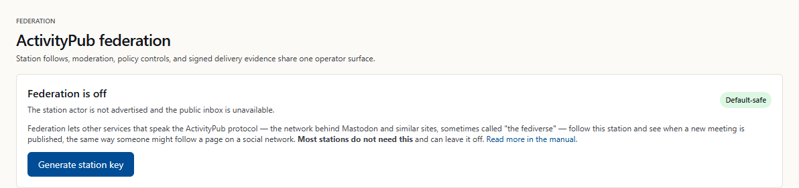{width=90%}

*Figure: the current-source Federation screen with synthetic example configuration. No station configuration was read and no station key was generated for this illustration.*

> **Known issue (beta.10):** There is no on/off switch in the console. The page says nothing about how federation is turned on. An IT person has to change station settings and restart CivicCast. The old built-in manual points to a switch that does not exist.

#### Prepare to turn it on (Setup admin)

1. Click **Generate station key**.
2. In the box **Generate the station key?**, click **Generate key**.
3. Click **Copy settings**, and give the copied lines to your IT person.

The key is the station's permanent identity on the network. Generating again reuses the same key. Creating a key does not turn federation on. It stays off until IT staff apply the settings and restart CivicCast, and it silently stays off if the web address or key file is missing.

> **For IT staff:** See [Chapter 15](#ch-integrations) for the `CIVICCAST_ACTIVITYPUB_*` settings.

#### After federation is on

The page shows counts (Pending, Accepted, Blocked, Rejected, Removed), your settings, and lists of followers and delivery attempts. A follower is another site that asks to follow you. The Publish operator or Support admin role can act on requests.

1. Click the **Pending** tab.
2. Click **Approve** to accept a follower.
3. Click **Reject** to refuse one. A box asks you to confirm with **Reject follower**.
4. Click **Block** to refuse one permanently. Confirm with **Block follower**.
5. For a delivery that failed, click **Replay delivery** to try again.

> **Warning:** **Block** cannot be undone from the console. The box says a blocked site "cannot re-follow until unblocked", but the screen has no **Unblock** control.

> **Known issue (beta.10):** If an **Approve**, **Reject** or **Block** fails, the page always says "Federation moderation failed. Check the API logs, then retry the follower action." That includes a failure caused only by your role. The buttons show for every role. Ask your IT person if it keeps failing.

### What to do, and what not to do

If you are not technical, this list is for you.

**Do**

- **Read the words, not only the colour.** Write down the exact message on the screen.
- **Check Readiness and Alerts before every meeting**, and at the start of every shift. In beta.10 nothing tells you about a problem unless you look.
- **Click Acknowledge** on an alert you have seen, so your colleagues know someone has it.
- **Take a screenshot** of anything odd, including the time shown on the screen.
- **Note the time, the channel and what you were doing**, and write down whether the time is UTC or your local time.
- **Tell your IT person** early, with the details in the next section.
- **Run Check broadcast readiness before the meeting**, not during it.
- **Use the Manual** in the sidebar for how a screen works.

**Do not**

- **Do not wait for an email or text.** In beta.10 alerts are probably not wired to send any.
- **Do not rely on Emergency Alerts as your EAS.** CivicCast is not an EAS device.
- **Do not press Stop, Restart feed, Repair, Update, Rollback or Restore buttons** unless you were trained to, or your IT person told you to.
- **Do not click Block or Delete casually.** Neither can be undone from the console.
- **Do not turn on the Paywall** in beta.10 (see [Chapter 7](#ch-station-business)).
- **Do not type or paste passwords, recovery codes, staff passes (tokens) or private meeting material** into a report, an email or a public issue.
- **Do not keep pressing a button that did nothing.** Some actions only queue a request, and the page does not refresh by itself. Reload the page and look again.

### Describe a problem to your IT person

A good report lets IT staff fix a problem without coming to your desk. Copy this list into an email or message, and fill it in.

```
What I was doing:
Which screen (the name in the sidebar):
Which channel (if any):
What I expected:
What happened instead:
The exact words on the screen (copy them, or attach a screenshot):
The colour or label (Ready, Check before meeting, Do not broadcast yet, Not set up yet, Needs IT help):
Date and time it happened (say if the time came from the screen, and whether it is UTC or local):
Is a meeting or a broadcast on the air now?  yes / no
Has it happened before?  yes / no
What I already tried:
```

If you have the Support admin role, you can also make a *support bundle*. This is a redacted troubleshooting file (the screen's own description of it). We did not check exactly what it contains. On **Readiness**, type a short note in the **Short note** box, click **Create support bundle**, then click **Download support bundle**. Give the file to your IT person. Do not post it publicly.

### Report a beta issue

CivicCast is a beta (beta.10 was published as a GitHub pre-release on 2026-10-02). Support is community-driven, with no contract and no guaranteed response time. Reports are sorted by how serious they are. Problems that stop you from broadcasting or installing, or that lose data or expose a secret, are handled first.

1. In the operator console, click **Report a beta issue** at the bottom of the sidebar. It opens the Manual at the section "Report a beta issue".
2. If you have a free GitHub account, open a new issue on the project's issue page: <https://github.com/scottconverse/civiccast-native/issues>.
3. If you do not have an account, ask your IT lead or anyone on staff who has one to post your description. If nobody has one, the same Manual section tells you to email the file and a short description to the project maintainer at the address in the project's security policy: <https://github.com/scottconverse/civiccast-native/blob/main/SECURITY.md>.

In every report, include:

- The CivicCast version. It is shown at the top of the console, as `v1.0.0-beta.10`.
- Your Windows version.
- The screen where it happened.
- The exact message.
- What you were doing, and what you already tried.
- Whether it was a rehearsal, a test recording or a real meeting.

If the problem is with installing, also include the installer's file name and whether its checksum matched.

> **Warning:** Never include passwords, recovery codes, staff tokens, subscriber addresses or private meeting material in a report. Do not post a support bundle publicly. Say you have one, and wait for a maintainer to ask for it privately.

> **Warning:** If you think you have found a *security* problem, do **not** open a public issue. Use the private contact in the security policy linked above.

> **Known issue (beta.10):** The Manual section that **Report a beta issue** opens tells people to use "System Health" and the **Create support bundle** button. The screen is called **Readiness**, and the button works only for the Support admin role.

### If it did not work

| What you see | Where | What it means and what to do |
| --- | --- | --- |
| `Checking station readiness...` that never ends, or `Could not load System Health.` | Readiness | The page could not reach the station. Check you are signed in, then tell your IT person |
| `The live on-air signal could not load.` | Readiness | The live banner could not load. Reload; if it stays, tell IT |
| `Checking broadcast readiness requires the meeting operator role. Health checks remain visible.` | Readiness | You can read the checks but not run the test. Ask your station admin |
| `Alerts could not load.` or `This action requires one of these CivicCast roles: ...` | Alerts | Your role cannot read alerts. Ask your station admin |
| `Could not save the rule.` | Alerts | Your role cannot change rules. Only the Setup admin can |
| `Use 24-hour HH:MM, e.g. 22:00 (or leave blank).` | Alerts, destination form | Type quiet hours as hours and minutes, such as 22:00, in UTC, or leave blank |
| `Durable storage is not ready yet.` | Alerts and other screens | The station's database is not ready. Tell your IT person |
| `The Emergency Alerts console requires the setup admin, support admin, or meeting operator role. Ask your station admin for access.` | Emergency Alerts | Your role cannot open this screen |
| `Could not display the alert.` | Emergency Alerts | The server refused. The box usually shows the server's own reason instead of this sentence. For a full-screen takeover, tick **Confirm full-screen takeover** first |
| `Could not load federation status.` | Federation | Click **Retry**. If it fails again, tell IT |
| `Could not verify your staff identity (...)` | Emergency Alerts | Sign in again from First Setup |

### Related

- [Chapter 2: Signing in](#ch-signing-in)
- [Chapter 4: Running the meeting](#ch-running-meeting)
- [Chapter 7: Reports, analytics, program guide export, underwriting and apps](#ch-station-business)
- [Chapter 14: Troubleshooting matrix](#ch-troubleshooting)
- [Chapter 15: Cable headend, streaming, federation, emergency alerts and the API](#ch-integrations)

<!-- SOURCES: inventory/screens/health.md, alerts.md, eas.md, activitypub.md, help.md, _shell-navigation-and-roles.md; civiccast/installer/service.py:3637-3720,3880-3900,4421-4440,5231-5300,5304-5362,5363-5440,5448-5500,5632-5745; civiccast/apps/portal-operator/src/screens/status-language.ts:28-130,390-405; civiccast/apps/portal-operator/src/screens/SystemHealthScreen.tsx:60-80,124-143; civiccast/alerting/router.py:222-300,370-400; civiccast/alerting/evaluator.py:150-190,412-460,524-537; civiccast/app.py:526-620,1415-1425,1721-1750,3169-3175; civiccast/eas/service.py:25-70,128-175; civiccast/cg/router.py:283-305,519-541; civiccast/apps/portal-public/src/screens/HomeScreen.tsx:59-115; civiccast/activitypub/config.py:55-90; SUPPORT.md; SECURITY.md; docs/adoption/support-intake.md; docs/USER-MANUAL.md:739-760 (topic only, re-verified against help.md inventory); docs/releases/v1.0.0-beta.10-verification.md; fact-check pass: civiccast/app.py:526-570,1721-1750; civiccast/eas/workers.py:60-130; civiccast/eas/service.py:56-150; civiccast/apps/portal-operator/src/screens/EasScreen.tsx; civiccast/apps/portal-public/src/screens/HomeScreen.tsx:59-115,868-890; civiccast/cg/router.py:283-305,519-541; civiccast/alerting/migrations/versions/0039_alerting_and_sinkhealth.py:42-60; civiccast/alerting/models.py:55-110; civiccast/alerting/evaluator.py:395-445; civiccast/installer/service.py:3637-3700,5740-5770; civiccast/installer/router.py:371-392 -->

\newpage

# Part II. Installing and running CivicCast (for IT staff) {#part-2}

These chapters are for the one or two people who install and look after CivicCast at a small city or station. They cover planning, installation, configuration, daily operation, security, troubleshooting and connecting to cable and streaming.

\newpage

## Planning your station: hardware, network, storage, accounts {#ch-planning}

This chapter helps the person who runs IT at a small city decide which computer to use for CivicCast, what to open or leave closed on the network, how much disk space to set aside, who needs which accounts, and what to download and check before running the installer. Read it before [Chapter 10](#ch-installing). Nothing here changes the computer; it is all planning.

### Before you start

You need three decisions and one fact:

- **How many channels** the station will run at the same time (the lab station described below ran three).
- **Whether live captions matter** on the air. Captions are the part of the system most sensitive to the computer you choose.
- **Who will sit at the station computer** for first setup. In beta.10 the first administrator can only be created from a browser running on the station computer itself ([Chapter 10](#ch-installing), "First setup in the operator console").
- **The fact that decides everything else:** beta.10's installer needs the *full kit* (the installer plus its `packs` and `station` folders), not only `setup.exe`. The next section and [Chapter 10](#ch-installing) explain why.

### Know what has and has not been proven

CivicCast 1.0.0-beta.10 was published on 2026-10-02 as a **GitHub pre-release** (a "Beta Candidate"). It is a beta candidate, not a production release. State this plainly to anyone who signs off on the purchase.

| What was tested | Result |
| --- | --- |
| Clean-install lane of the project's automated acceptance test ("Gate A"), run in Windows Sandbox against the exact published installer and packs | **Passed, 10 of 10 criteria** (install, activation, health, console and portal render, clerk workflow, captions, playout engine, 5-minute soak). The playout-engine check passed only on a harness that waits longer for the engine's first packets, which on a fresh install arrived more than 60 seconds after first start |
| Upgrade lane (beta.10 over an earlier release) | **Not run** (waived by the owner) |
| Download-only lane (setup without the full kit) | **Not run** (waived by the owner) |
| First install on a computer with **neither** the full kit **nor** an earlier install | **Not proven.** As read in the installer code it cannot finish (see [Chapter 10](#ch-installing)) |
| Eight-hour, three-channel run | Done on an *earlier internal build* of the same engine, on one lab computer. Not repeated on the published installer |
| Human field tester sign-off; operation at a real station; physical SDI capture; real cable-operator acceptance | **None yet** |

The exact wording is in the project's verification record for beta.10. If a vendor, a board or a funder asks "is it production ready", the answer from the record is no.

> **Note:** The Gate A sandbox was configured without a virtual graphics card, but the project's own log records that the sandbox guest could still see the host computer's NVIDIA card. Do not read the Gate A pass as proof that a computer *without* a graphics card works. This chapter marks every place where we have no measurement.

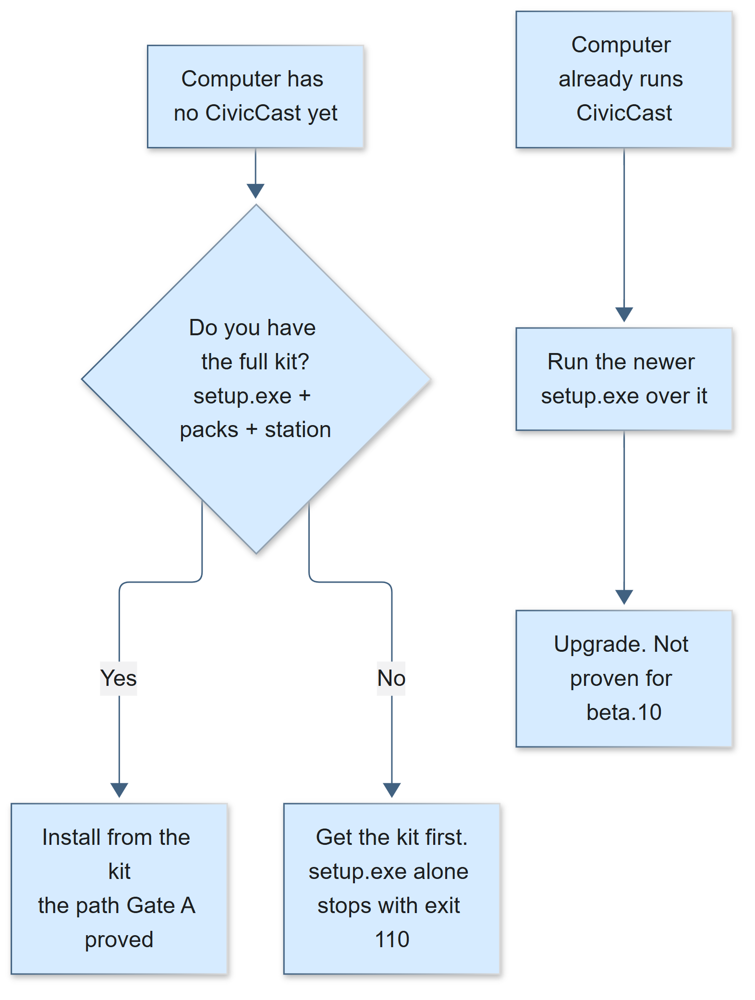{width=75%}

The left branch is a first install: it needs the full kit. The right branch is an upgrade of a machine that already runs CivicCast; it reuses what is already on the machine, but the upgrade lane was not run for beta.10, so back up first.

### Choose the computer

#### What the installer looks at

The installer's first-run window has a screen called **Checking This Computer**. It reads the processor, memory, graphics card and free disk space and shows them. Only one reading can stop you.

| Reading | How it is taken | What it does |
| --- | --- | --- |
| Processor name and logical cores | Windows registry and `GetLogicalProcessorInformationEx` | Shown. Never blocks |
| Memory | `GlobalMemoryStatusEx`, in GB with one decimal | Shown. Never blocks |
| Graphics cards | Windows DXGI adapter list; the software adapter and exact duplicates are skipped | Shown as `<name> (<VRAM> GB)`. Only NVIDIA cards (PCI vendor 0x10DE) change the recommendation |
| Free space on the install drive | `GetDiskFreeSpaceExW` | **Blocks** when free space is less than the total of the default downloads |

A value the installer cannot read is shown as **Unavailable**. It is never replaced with a guess. If the whole check fails, the window says **Hardware check unavailable** and lets setup continue.

> **Known issue (beta.10):** This check runs in the first-run window, *after* the Windows setup phase has already copied and extracted the program. It is not a pre-flight for the large install. Its disk test counts only the downloads the window itself manages (about 9.7 GB by default, 14.1 GB with both optional items), not the tens of gigabytes the earlier phase has already written. The Windows setup page declares only about 5.1 GiB of space needed. Plan the disk yourself using "Plan storage" below.

#### The operating system and software

| Item | What the code and release files show |
| --- | --- |
| Windows, 64-bit | The installer, runtime and Visual C++ prerequisite are all x64. **No minimum Windows version is stated** in the installer configuration or code. The lab station ran Windows 11. We have no record of tests on Windows 10 or on Windows Server |
| Administrator rights | Setup installs for the whole machine (`perMachine`) and asks Windows for approval (UAC). The first-run window runs as the normal signed-in user |
| Visual C++ runtime | Setup installs a bundled offline copy. It may ask for a Windows restart (the runtime installer returns code 3010) |
| WebView2 | The setup window needs Microsoft WebView2. A bundled offline copy is installed silently if it is missing. No internet is needed for it |
| Windows Defender Firewall | Setup adds one rule with `netsh advfirewall`. If that fails, setup stops with code 119 |
| No WSL, no Docker | Beta.10 is a native Windows service. It does not use WSL or Docker |
| The older WSL-based CivicCast | If a computer already has the older "CivicCast Installer" (WSL edition), setup may stop with 135 or 127, and uninstalling CivicCast (Native) asks an ownership question. Plan to remove the older edition first |
| Clock and time zone | Keep the Windows clock correct. Several screens treat times typed into them as **UTC** (see [Chapter 3](#ch-before-meeting)) |

One more rule of thumb: dedicate the computer. The station runs a database, a web server, an AI engine and several video processes as a Windows service under the LocalSystem account. We do not know of testing alongside other heavy software.

#### Graphics card: what it changes

A graphics card matters for **captions** and **summaries**. It does not lighten video encoding in beta.10 (see the encoding paragraph after the tables).

The caption engine ("Whisper" speech recognition) comes in two sizes. **Medium** always installs. **Large** is an optional add-on.

| Your computer has | What the installer recommends | Where live captions run (as read in the code) |
| --- | --- | --- |
| No dedicated graphics card, or AMD or Intel graphics only | Medium | On the processor. The station gives live captions one worker and a capped thread count so that video playout keeps the machine |
| NVIDIA card with **less than 8 GB** of video memory | Medium | On the processor, as above |
| NVIDIA card with **8 GB or more** | Large is pre-ticked, with a GPU library | On the card (CUDA) **only when** the GPU library files are also present; then it uses up to three workers (one per channel on a three-channel station). With the card but without those files it runs on the processor |

The installer's own text explains the difference: on a capable card Large "captions live"; otherwise it "captions recordings after the meeting".

> **Note:** The rule uses video memory as a stand-in for card capability. The code records that an older NVIDIA card with enough memory but no tensor cores can be *slower* on the card than on the processor (one older card missed all 30 deadlines in testing). The station operator can override the device with the `CIVICCAST_WHISPER_DEVICE` environment variable; see [Chapter 11](#ch-configuration).

> **Known issue (beta.10):** The station uses the **highest caption engine that is installed**. If Large is present, live captions use Large, even on a computer where the setup screens say Large is too slow to run live. Earlier installers can download Large even when you untick it; the development correction passes that selection to the download engine (see [Chapter 10](#ch-installing)). On a computer without a capable NVIDIA card, check after install that Large is not present, or expect live captions to fall behind. We have not measured Large on a processor.

The AI that writes summaries and translations is chosen by a second rule.

| Condition | Summary model chosen by default |
| --- | --- |
| Any NVIDIA graphics card detected **and** 16 GB of memory or more | `gemma4:12b` |
| Anything else | `gemma4:e4b` |

All three AI models (`gemma4:12b`, `gemma4:e4b` and the translation model `translategemma:4b`) are installed on every station; the rule only picks the default. The product's catalog lists a minimum of 16 GB of memory for the 12B model and 8 GB for the smaller one. The only measurement the project recorded without a graphics card was on a computer with 32 GB of memory and 16 cores (32 threads): the smaller model finished a summary in 94 seconds warm and 128 seconds cold, while the 12B model took 366 seconds once and then failed twice. We have no measurement on a smaller computer.

**Video encoding runs on the processor.** The bundled playout engine uses a software H.264 encoder (OpenH264). The project's post-beta.10 backlog lists NVIDIA hardware encoding as future work. The default output profile in code is 1280 x 720, 30 frames per second, H.264 at 6,000 kbps and AAC audio at 192 kbps. So processor cores, not the graphics card, set how many channels you can run.

#### What was measured on the lab station

The three-channel evidence in the verification record came from one lab computer. The project's oversight notes describe it as Windows 11 with an AMD Ryzen 7 7800X3D (8 cores, 16 threads) and an NVIDIA RTX 5070 Ti. We do not have its memory size on record.

| Measure on that computer | Result |
| --- | --- |
| Three channels on air for 8 hours | One service process the whole time; no restart; 0 watchdog firings |
| Processor load while preparing a long program for the first time | 95 to 98 percent (oversight notes) |
| Conform cache | 46 GB of its 60 GB budget used |
| Live caption audio dropped under heavy load | 13 catch-up discard events in 8 hours; about 160 seconds of audio lost on a quiet machine |

> **Known issue (beta.10):** Under heavy processor load (for example while the station prepares a long program for the first time) the live caption worker can fall behind and throw away audio. Captions stay on the air, but some speech gets no caption. The verification record lists this as a known limit and says a fix is the next work item. Stations that must have loss-free captions should weigh this.

#### Our recommendation

These follow from the evidence above. They are not tested minimums, because the project has not published any.

1. **For several live channels with live captions**, plan for a computer in the class that was measured: a recent desktop processor with at least 8 cores and 16 threads, an NVIDIA card with 8 GB or more, and Windows 11. Use more memory than the 16 GB the sandbox was given if the budget allows.
2. **Without an NVIDIA card**, expect slow summaries (minutes each) and live captions that can lag when several channels are busy. Start with one channel and watch the Readiness screen ([Chapter 8](#ch-something-wrong)). The beta.10 record has no multi-channel measurement for this case.
3. **Do not run other large programs on the station** during meetings. Disk scans alone produced small caption discards in the lab run.

To see what CivicCast itself detects after install, open `http://127.0.0.1:8000/api/hardware` in a browser on the station (it needs no sign-in) or run `civiccast doctor` ([Appendix A](#app-cli)).

### Plan the network and firewall

#### What listens where

Everything the station runs listens on the computer's own loopback address, `127.0.0.1`. That is deliberate in the code: a note in the setup code says the control plane "binds `127.0.0.1` only".

| Port | Used by | Reachable from | Source |
| --- | --- | --- | --- |
| TCP 8000 | The CivicCast web server: operator console at `/operator/`, resident portal at `/`, the API, and `/health` | The station computer only | `children.py`, `core.py` |
| TCP 5432 (or the first free of 5433, 5434, 5435, 5544) | PostgreSQL database | The station computer only | `provision/models.py`, `port_select.py` |
| TCP 11434 | The bundled Ollama AI engine (version 0.30.6) | The station computer only | `children.py` |
| TCP 38474 | The setup window's one-copy-at-a-time guard | The station computer only | `main.rs` |
| UDP 17800 upward; UDP 18000 to 18499 | Internal media relays between the playout engine and ffmpeg or TSDuck. Source ports for outgoing transport streams sit 1,000 above the first range | The station computer only | `ts_relay.py`, `hls_relay.py` |

Do not open the internal ports on the firewall. If another program on the same computer already uses 11434 or 8000, plan to move it; we did not test what CivicCast does when a port is taken.

> **Known issue (beta.10):** Setup adds a Windows Firewall rule named **CivicCast (Native) Portal/API (TCP 8000)**: inbound, allow, TCP, port 8000, all network profiles, for the program `<install folder>\runtime\python.exe`. But the web server starts with `--host 127.0.0.1`, so other computers cannot connect to port 8000 whatever the rule says, and we found no setting that changes the address. Plan to use the operator console **on the station computer**. A remote-control tool works only if the browser itself runs on the station. How residents watch is a publishing question, answered in [Chapter 15](#ch-integrations), not a matter of pointing their browsers at the station.

#### What the station connects out to

| Purpose | Destination | When |
| --- | --- | --- |
| First-run window downloads (signed runtime packs) | `github.com` release downloads (and the hosts GitHub redirects to) | Only if the window has to download something. Redirects that are not HTTPS are refused |
| First-run window downloads (caption weights) | `huggingface.co` | Same |
| First-run window downloads (AI model) | `registry.ollama.ai` | Same |
| Windows setup itself | None. The setup phase makes no network call; the Gate A run had networking disabled | Never |
| Video and publishing outputs | Whatever you configure: a cable headend (UDP or SRT), a CDN, a streaming service, email, a federation server | [Chapter 15](#ch-integrations) |

The station does not need the internet to run. The Gate A run had networking disabled, and its station installed, came up and passed its checks. The code even hides the built-in `/docs` page because "a council-chamber station is frequently firewalled outbound and sometimes air-gapped".

> **Known issue (beta.10):** Earlier first-run installers try to fetch optional downloads even when you untick them; the development correction now honors that selection. A source still names an old frozen release (`scottconverse/civiccast-releases`, tag `native-beta-1.0.0-beta.1-rc1`), not the beta.10 page; the selection fix does not change that source. Selected downloads can take hours on a poor connection (the transfer timeout is six hours), and with no internet they fail unless verified local files are available. Setup itself does not depend on these optional downloads. See [Chapter 10](#ch-installing).

If a security appliance does TLS inspection or an allow-list, allow the three destinations above for the one-time first-run downloads, or run from the full kit and block them.

Two details matter if you control outbound traffic. A UDP transport stream to a headend leaves from a local port pinned 1,000 above the relay's listening port, so a firewall that filters by source port needs to know that. And the Gate A test harness added its own allow rules for `tsp.exe`, `ffmpeg.exe` and `ffprobe.exe`; the product does not add them. If a third-party firewall prompts on first use of those programs, allow them. The other outputs depend on what you configure ([Chapter 15](#ch-integrations)).

### Plan storage

CivicCast keeps the program under the install folder (default `C:\Program Files\CivicCast (Native)`) and everything it creates under `C:\ProgramData\CivicCast`. The data folder follows the `PROGRAMDATA` environment variable and is on the system drive unless that variable is changed. We know of no test that moved it.

| What | Where | Size, with source |
| --- | --- | --- |
| Program, runtime, video tools, AI engine | `<install folder>` | The Windows setup page declares 5,400,000 KB (about 5.1 GiB) for this. The five runtime packs in the beta.10 release total 4.6 GB (table below) |
| Model packs: cached copy | `<install folder>\packs\.station-cache` | "about 21 GB" (the uninstall notice) |
| Model packs: extracted copy | `<install folder>\packs\captions-floor`, `components\`, `models\ollama\` | Extraction is about 1 to 1 with the pack size (code constant). The cached copy stays on disk too, so models take about twice the pack size |
| First-run downloads, if any | `C:\ProgramData\CivicCast\packs` and `components` | 9.7 GB default and 14.1 GB with both optional items (catalog placeholder sizes). The real GPU pack is 1.89 GB, so the total changes once real sizes are known |
| Database | `C:\ProgramData\CivicCast\data\pgdata` | Holds records, not video; grows with use. We have no measured figure |
| Uploads and finished packages | `C:\ProgramData\CivicCast\data\uploads` | Operator-uploaded media |
| Conform cache (ready-to-play copies of programs) and working files | `C:\ProgramData\CivicCast\data\egress` (cache in `conform-cache`) | Budget **60 GB** by default in beta.10; set `CIVICCAST_CONFORM_CACHE_GB` to change it (zero or less turns the cache off). Another budget keeps the three newest plan folders and about 5 GB (`CIVICCAST_PREPARED_PLAN_DIR_BUDGET_GB`) |
| Scheduled recordings | In a `scheduled-recordings` folder under the recording target you set in the console | One program-hour is about 2 GB by the Setup screen's planning figure; the default output profile works out to about 2.8 GB per hour (6,192 kbps x 3,600 s, our arithmetic) |
| Logs | `C:\ProgramData\CivicCast\logs` | `supervisor.log` rotates at 10 MiB, 10 files. Rotation of the other logs is not documented |
| Backups | A folder you choose | You decide |

Putting it together for a first install from the kit, our derived estimate is: the two copies of the model packs (about 21 GB each) plus the runtime packs and their extracted trees (about 4.6 GB each) plus 2 GB of working room, so **plan for roughly 55 GB free on the install drive before you start**. Setup itself only refuses at its activation step: it needs the sum of the model-pack sizes plus 2 GB free and prints "Not enough free disk space to activate this station..." if it is short. Add the conform cache budget (60 GB by default) and your recordings on top.

> **Tip:** Do not rely on the default 60 GB cache fitting on a small system drive. Either give the station a large drive, or lower `CIVICCAST_CONFORM_CACHE_GB` before the first busy week. A single prepared program larger than the whole budget cannot be kept. The station then refuses it with the error "Conform-cache budget too small to retain '<file name>'; increase CIVICCAST_CONFORM_CACHE_GB or exclude this asset."

> **Known issue (beta.10):** The Setup screen's **Backup destination** control only proves that the folder accepts a test file (it writes, reads and deletes one). Its success message is "Backup destination accepted a write/read/delete proof." It does not copy station data there. See [Chapter 12](#ch-operations) for how backups are actually made. Because the station runs as LocalSystem, pick a local drive or a network path the computer account can reach; a drive letter mapped by a person is not visible to a Windows service.

### Plan accounts and permissions

| Who or what | What they need | Why |
| --- | --- | --- |
| The person who installs | A Windows administrator account | Setup is per-machine and uses UAC. Run a silent install from an elevated prompt |
| The Windows service | Nothing to create | It is registered as **CivicCast Native Supervisor** (`CivicCastSupervisor`), runs as LocalSystem, starts automatically, and restarts after 5, 10 and 30 seconds if it fails |
| The person at the station for first setup | A normal Windows account on the station computer and a browser | First setup, sign-in and recovery only work from the station itself (a loopback check; other computers get HTTP 403) |
| The first CivicCast administrator | A display name, a username, a password of **12 characters or more**, and a place to keep the recovery kit | Created by the browser form in [Chapter 10](#ch-installing). Its sign-in carries all five roles. Narrower roles come only from tokens an administrator issues ([Chapter 13](#ch-security), [Appendix F](#app-roles)) |
| A person who keeps the recovery kit | A safe place that is not a public folder | The kit holds eight one-time recovery codes and, in the saved file, the administrator password in plain text |
| Security software | An exclusion or allow rule for `<install folder>` and `C:\ProgramData\CivicCast` if it blocks writes | The first-run window's own error text names "security software blocking the CivicCast folder" as the usual cause of a write refusal |
| Backup and publishing destinations | Credentials you hold | Chapter 15 covers provider credentials |

Windows accounts matter in one more place: the first-run window remembers that it has finished in `%USERPROFILE%\.civiccast` and in the browser storage of the Windows account that ran it. A different Windows account sees **Checking This Computer** again.

### Download and verify what you need

#### What is on the release page

The release is at <https://github.com/scottconverse/civiccast-native/releases/tag/v1.0.0-beta.10> (marked pre-release; title "CivicCast v1.0.0-beta.10 (Beta Candidate)"). Use that page, not a draft, not an older pre-release and not the retired `scottconverse/civiccast` repository. Do not install from the source ZIP.

On the day this chapter was written the page listed these eight assets (sizes as the GitHub API reported them):

| File | Size in bytes | About |
| --- | --- | --- |
| `setup.exe` | 242,367,640 | 242 MB; the signed installer |
| `native-app-payload.ccpack` | 564,059,620 | 564 MB; the CivicCast program |
| `native-server-binaries.ccpack` | 76,249,023 | 76 MB; PostgreSQL tools (the Gate A run also found the TSDuck program `tsp.exe` inside this pack) |
| `native-ffmpeg-runtime.ccpack` | 144,130,093 | 144 MB; video tools |
| `native-ollama-runtime.ccpack` | 1,941,233,058 | 1.94 GB; the AI engine |
| `native-cuda-runtime.ccpack` | 1,893,729,051 | 1.89 GB; optional GPU libraries |
| `SHA256SUMS.txt` | 547 | Hashes for `setup.exe` and the five packs |
| `setup.exe.sidecar.json` | 154 | The installer's hash and signing flag; it is plain data, not a signature |

The five `.ccpack` files add up to about 4.6 GB. A `.ccpack` is a signed container; the installer checks its signature before using it.

**The model packs are not on the release page.** The roughly 21 GB `station` folder (speech and AI model packs and a signed index) is delivered only inside the full kit. The kit is handed out by USB or network copy by the project. The public documents name no download address for it, so ask through the project's issue page (<https://github.com/scottconverse/civiccast-native/issues>; this is the project's only support route, community-run, no service agreement).

> **Known issue (beta.10):** The Windows setup folder page says that "after Setup finishes, the CivicCast setup wizard downloads additional components (captions and AI models) separately". That is not what the install does. The Windows setup phase needs the model packs beside it and makes no download. See [Chapter 10](#ch-installing) for the exact behavior.

#### Check the files

1. Put `setup.exe`, `SHA256SUMS.txt`, `setup.exe.sidecar.json` and any `.ccpack` files in one folder. Open PowerShell there.
2. Compute the installer's hash and compare it with the same file's line in `SHA256SUMS.txt` and with the `sha256` value in the sidecar. All three must match exactly.

   ```powershell
   Get-FileHash .\setup.exe -Algorithm SHA256
   Get-Content .\SHA256SUMS.txt
   Get-Content .\setup.exe.sidecar.json
   ```

   On the day this chapter was written, `SHA256SUMS.txt` and the sidecar both gave `5dbf11d9fb571596232050d8f57ea603a683ca31f88822b85c20c3bc41d8724c` for `setup.exe`. Compare the whole value, and take it from the release page you downloaded from, not from this manual.
3. Check the signature:

   ```powershell
   Get-AuthenticodeSignature .\setup.exe | Format-List Status, SignerCertificate
   ```

   Expect `Status` to be `Valid` and the signer to be `CN=Scott Converse` (Azure Trusted Signing; the project's signing policy records this). Any other result is a reason to stop.
4. Check the packs the same way: `Get-FileHash .\*.ccpack -Algorithm SHA256` and compare each with `SHA256SUMS.txt`. The installer re-checks every pack's signature itself.

A **kit** has its own checks. Use the kit's own hash list or delivery manifest from whoever handed it over, and do not expect the GitHub sidecar in a kit. The installer inside a kit may carry a different file name than `setup.exe`; use the name in the kit's manifest.

#### The Windows SmartScreen warning

Windows may show a blue **Windows protected your PC** screen. That screen is about download reputation, which a new publisher has not built up yet. It is not a verdict on the signature. Check the hash and the signature first (steps above). If both are right, choose **More info** and then **Run anyway**. If those choices are missing, or the publisher or hash differs from what you checked, stop. Your IT policy can also allow the signed build by publisher or by hash.

#### Pre-install checklist

- [ ] I know this is a beta candidate and who in the city has accepted that.
- [ ] I have the **full kit** (`setup.exe`, `packs\`, `station\`) on a local drive or USB drive, not only `setup.exe`.
- [ ] I checked the installer's SHA-256 against two sources and its signature shows `Valid` for the expected signer.
- [ ] The computer is 64-bit Windows, dedicated to CivicCast, and not running the older WSL-based CivicCast.
- [ ] The install drive has about 55 GB free, plus room for the conform cache and recordings.
- [ ] I have an administrator account and the computer will stay powered and awake for the whole install (Gate A took about 33 minutes from start to a healthy station inside Windows Sandbox; a real computer will differ).
- [ ] Windows Defender Firewall is on and not locked by policy against adding a rule, or I have a plan for exit code 119.
- [ ] Security software will not quarantine `C:\Program Files\CivicCast (Native)` or `C:\ProgramData\CivicCast`.
- [ ] I know the plan for backups ([Chapter 12](#ch-operations)) and where the recovery kit will be kept.
- [ ] Someone will be at the station to create the first administrator in a browser on that computer.
- [ ] If this is an upgrade, I have a backup, I accept that the station goes off air while setup runs, and I know the upgrade lane was not run for beta.10.
- [ ] I have a way to copy text out of the setup window and out of `C:\ProgramData\CivicCast\install-progress.log` to send to support.

### If it did not work

| What you see | Cause | What to do |
| --- | --- | --- |
| The hashes do not match | A damaged or altered download | Do not run it. Download again from the exact release page, or ask the person who gave you the kit for a new copy |
| `Get-AuthenticodeSignature` is not `Valid` | The file is not the signed release | Stop. Do not install |
| Hardware check unavailable. "CivicCast could not check this computer's hardware. It will not guess..." | The probe failed | Setup can continue. If a download later runs out of room, free space and choose Retry |
| Not enough free disk space. "This drive doesn't have enough free space: needs X.X GB free, this drive has Y.Y GB." | The first-run window found too little room for its downloads | Free space on the drive, then close the window and open **CivicCast (Native)** again so the check repeats |
| "Not enough free disk space to activate this station..." in the setup details list (exit 123) | Activation needs the model-pack sizes plus 2 GB | Free the space the message names and run setup again. Nothing was deleted |

### Related

- [Chapter 10: Installing, first run, upgrading, uninstalling](#ch-installing)
- [Chapter 11: Configuring the station](#ch-configuration)
- [Chapter 12: Running it day to day](#ch-operations)
- [Chapter 13: Security and privacy](#ch-security)
- [Chapter 15: Cable headend, streaming, CDN, federation, emergency alerts, the API](#ch-integrations)
- [Appendix A: command-line reference](#app-cli)

<!-- SOURCES: docs/releases/v1.0.0-beta.10-verification.md; docs/releases/release-truth.yaml; INSTALL-WINDOWS.md (topics only); docs/tester/START-HERE.md (setup.exe size, kit); docs/install/windows-release-trust.md; CODE_SIGNING_POLICY.md; SUPPORT.md; gh release view v1.0.0-beta.10 (asset names, sizes) and downloaded SHA256SUMS.txt / setup.exe.sidecar.json; ops/docs-sprint/inventory/screens/installer-gui-checking-computer.md, installer-gui-download-plan.md, installer-component-catalog.md, installer-install-layout.md, installer-nsis-setup-wizard.md, installer-nsis-activation-selftest.md, installer-nsis-service-finish.md, setup.md; civiccast/apps/installer/src-tauri/src/hardware_inventory.rs:21-241; src-tauri/src/native_activation.rs:20-60,820-880; src-tauri/src/native_distribution.rs:725-770; src-tauri/src/main.rs:30-40,3296-3330,3682-3750; src-tauri/src/acquisition_catalog.rs:210-262,670-690; src-tauri/nsis-hooks-bootstrap.nsh:150-200,625-700,702-770,2196-2260; src-tauri/tauri.native.conf.json; src-tauri/src/native_service_registration.rs:154-167,2765-2790; civiccast/platform/hardware.py:1-120,349-357; civiccast/ai_models/models.py:174-199; civiccast/ai_models/catalog.py:60-130; civiccast/app.py:1179-1193; civiccast/native/station_runtime.py:672-730,771-795,816-820,960-1030,1075-1110; civiccast/captions/runtime.py:100-200; civiccast/native/supervisor/children.py:34,146-152,272-290,460-560; civiccast/native/supervisor/core.py:388-394; civiccast/native/supervisor/service.py:34,192-193,2050-2110; civiccast/native/supervisor/install_layout.py:160-275; civiccast/egress/preparer.py:1-30,90,144,243,301-315; civiccast/egress/models.py:116-134; civiccast/egress/gst/graph.py:19; civiccast/egress/ts_relay.py:35-95; civiccast/egress/hls_relay.py:247-262,347; civiccast/recording/runtime.py:55-80,204,528; civiccast/installer/service.py:1075-1140; civiccast/installer/models.py:325-365; civiccast/apps/portal-operator/src/screens/SetupScreen.tsx:1217-1229; ops/beta10-oversight/POST-BETA10-BACKLOG.md items 3; ops/beta10-oversight/OVERSIGHT-LOG.md:115,589; ops/beta10-oversight/briefs/U29.md:28, U68.md:30; docs/releases/evidence/v1.0.0-beta.10-gate-a/run5-clean-lane-PASS-b6520847/ (summary.json, T3T5-RESULT.txt); sandbox-lab/CivicCastSandboxTest.wsb (MemoryInMB 16384) -->

\newpage

## Installing, first run, upgrading, uninstalling {#ch-installing}

This chapter walks the person who installs CivicCast through the install exactly as beta.10 behaves: the Windows setup, the first-run window that follows it, and first setup in the operator console. It also covers every exit code setup can return, where the logs are, how to check the result, and how to upgrade, repair and uninstall. Read [Chapter 9](#ch-planning) first.

### Before you start

- You have the **full kit**: `setup.exe`, a `packs` folder and a `station` folder together (next section). `setup.exe` alone is not enough for a first install in beta.10.
- You checked the installer's hash and signature ([Chapter 9](#ch-planning), "Download and verify what you need").
- You have a Windows administrator account, and about 55 GB free on the install drive.
- The computer will stay on, awake and connected to power for the whole install.
- For an upgrade, you also have a backup and you accept that the station goes off air while setup runs.

> **Note:** beta.10 is a pre-release. The clean-install lane of the project's acceptance test passed using the full kit. The upgrade lane and the download-only lane were not run, and no human field tester has signed off. A first install with neither the full kit nor an earlier install is not proven.

### What beta.10 requires and what it does not yet support

Setup has two phases. The **Windows setup** (`setup.exe`) runs with administrator rights and does all the real work: it copies the program, checks every component, creates the database, runs the station's self-test and registers the Windows service. Then the **first-run window** ("CivicCast (Native) Setup") opens as a normal user and may offer extra downloads. The first phase downloads no CivicCast components: the installer passes no download address to its steps, and the Gate A run had networking switched off.

| What you start with | What happens in beta.10 | Status |
| --- | --- | --- |
| **Full kit**: `setup.exe` with `packs\` and `station\` beside it | Installs and activates | **Proven** (clean-install lane, 10 of 10) |
| `setup.exe` plus `packs\`, **no** `station\`, on a computer that has never had CivicCast | Stops at the activation step with **exit 123** (the model packs are not in the cache) | **Not supported.** Not proven |
| `setup.exe` **alone** | Stops at the pack-staging step with **exit 110** | **Not supported** |
| Upgrade: newer `setup.exe` (with `packs\`) over an existing install, no `station\` | Designed to reuse the model packs already cached by the earlier install | **Not run** for beta.10 |
| Reinstall after an uninstall, from `setup.exe` plus `packs\`, **no** `station\` | Fails with exit 123, because uninstall deletes the model-pack cache (see "Uninstall"). With `setup.exe` alone it stops earlier, at exit 110 | **Not supported** (known limitation MA-17) |

The full kit looks like this. The names of the five runtime packs are the ones on the release page; the files inside `station\` are the signed index and the speech and AI model packs.

```text
CivicCast-kit\
  setup.exe              (a kit may use a different file name)
  packs\
    native-app-payload.ccpack
    native-server-binaries.ccpack
    native-ffmpeg-runtime.ccpack
    native-ollama-runtime.ccpack
    native-cuda-runtime.ccpack    (optional GPU libraries)
  station\
    station-index.json
    ... model packs (*.ccpack)
  QUICKSTART-OPERATOR.md
```

The four packs other than `native-cuda-runtime.ccpack` are required. The cuda pack may be absent; if it is present it must verify. A kit is delivered by USB or network copy from the project. The roughly 21 GB `station\` folder is **not** a release asset.

> **Known issue (beta.10):** The Windows setup page says that after setup "the CivicCast setup wizard downloads additional components (captions and AI models) separately". For a first install that is not true. The Windows setup phase needs the model packs beside it and makes no download. The first-run window's sentence "only what is missing comes from the internet" describes only that window's own list; it does not apply to the Windows setup phase. If setup stops with exit 110 or 123 after the page promised downloads, this is why.

> **Tip:** Run setup from a local drive or a USB drive. A network share that you mapped to a drive letter in your own Windows session is usually not visible to the elevated setup (standard Windows behavior; not tested with CivicCast). Use the UNC path or copy the kit.

### How the install runs

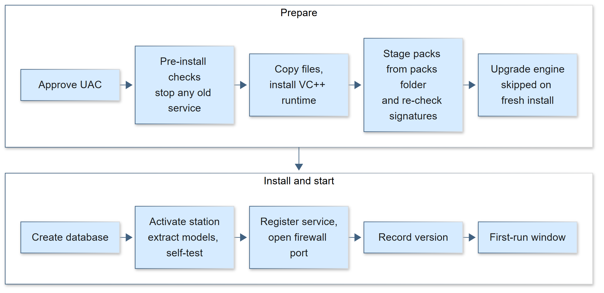{width=100%}

Each box is a step that writes a line before and after to `C:\ProgramData\CivicCast\install-progress.log`. If a step fails, setup stops, shows a dialog (when it is not silent) and exits with that step's code. After files are replaced, any failure also **stops the CivicCast service and sets it to manual start**, so that it cannot start on a half-updated install. Re-running setup after a failure is the supported recovery; partial installs are rebuilt.

### Install from the kit

The page order of the standard Windows setup comes from a template that is not in the project's repository, so we could not confirm the exact sequence or wording of its standard pages. The text below that is in quotation marks comes from the project's own files.

#### Step 1: Start setup and approve the prompt

1. Double-click the installer in the kit folder.
2. If Windows shows **Windows protected your PC**, follow [Chapter 9](#ch-planning) (check hash and signature first, then **More info**, then **Run anyway**).
3. Approve the administrator (UAC) prompt.

If CivicCast (Native) is already running, setup says "CivicCast (Native) is running! Please close it first then try again." or offers to end it ("Click OK to kill it"). If it cannot end it: "Failed to kill CivicCast (Native). Please close it first then try again".

If WebView2 is missing, setup installs the full offline copy it carries (the build configuration says "offlineInstaller", installed silently). The details list should show "Installing WebView2...", then "WebView2 installed successfully". The setup text also defines a line "Downloading WebView2 bootstrapper...", but that belongs to a download mode this build does not use, so we do not expect to see it; we could not confirm the exact lines on screen. On failure: "Failed to install WebView2! The app can't run without it. Try restarting the installer."

#### Step 2: The "Already Installed" page (only if CivicCast is on the computer)

You see **Already Installed** with "CivicCast (Native) 1.0.0-beta.10 is already installed. Select the operation you want to perform and click Next to continue." and the choices **Add/Reinstall components** and **Uninstall CivicCast (Native)**. If the installed version is older, the page says "An older version of CivicCast (Native) is installed on your system. It's recommended that you uninstall the current version before installing..." with **Uninstall before installing** and **Do not uninstall**. If it is newer, the warning begins "A newer version of CivicCast (Native) is already installed! It is not recommended that you install an older version."

For an upgrade, choose the option that does **not** uninstall first. See "Upgrade" below for why. A silent run over a newer install stops with "Downgrades are disabled for this installer, can't proceed with the silent installer, please use the graphical interface installer instead."

#### Step 3: Choose the install folder

The folder page asks "Choose Install Location". The default is `C:\Program Files\CivicCast (Native)` (the folder the project's install page names; we could not confirm it as the page default). Above the browse box setup shows:

"CivicCast (Native) needs the space shown below on this drive for the program itself. After Setup finishes, the CivicCast setup wizard downloads additional components (captions and AI models) separately -- their sizes are shown individually, before anything downloads, on that wizard's own screen."

The **Space required** figure includes 5,400,000 KB (about 5.1 GiB) that the setup declares for the packs. Your choice here moves only the program. The station's data stays under `C:\ProgramData\CivicCast`.

> **Known issue (beta.10):** The space figure and the sentence above understate the real footprint. About 21 GB of model packs are copied into a cache and extracted a second time, plus the runtime packs and 2 GB of working room (see [Chapter 9](#ch-planning)). Setup does not refuse at this page. It refuses later, at activation.

#### Step 4: Watch the install

Start the install. The details list fills with lines. Setup also writes each step to `install-progress.log`. The labels D2, D3, D4 and K1 are the project's internal names for steps. The table shows what each line means.

| What the details list says | What is happening |
| --- | --- |
| "Preparing the existing CivicCast (Native) installation for a data-preserving upgrade..." | Upgrade only. The old service is being stopped gracefully |
| "No prior CivicCast Native bootstrap process to stop (fresh install)." | Fresh install |
| "Installing the offline Microsoft Visual C++ runtime prerequisite..." then "Microsoft Visual C++ runtime installation completed." | The bundled C++ runtime. If a restart is needed: "...completed; a Windows restart is required." Setup continues and marks the restart as pending. If a same-or-newer runtime is already present: "Microsoft Visual C++ runtime already present, same or newer — prerequisite satisfied; setup did not reinstall it." |
| "Staging required native component packs from the 'packs' folder next to this installer..." then "Required native component packs staged and verified. Full detail: `C:\ProgramData\CivicCast\install-progress.log`" | Each pack's signature and contents are checked, the pack is copied into the install folder, checked again, and extracted. Nothing is downloaded |
| "Re-verifying the extracted native-server-binaries component pack against its signed pack file (D2)..." then "Native-server-binaries component pack verified against its signed pack file (D2)..." | Re-checks the extracted files. The same for native-app-payload, native-ffmpeg-runtime and native-ollama-runtime |
| "Running the CivicCast (Native) install/upgrade engine (D3)..." | Decides fresh install, same version, or upgrade. On a fresh install: "...no existing installation was found, so this is a fresh install — the install/upgrade engine was not applicable and did not run." |
| "Provisioning the CivicCast (Native) PostgreSQL server (D4)..." then "CivicCast (Native): database/messaging provisioning complete (or already provisioned; no-op)." | Creates the database. The word "messaging" is left over; the messaging server was removed from the product |
| "Activating the CivicCast (Native) station (K1)..." then "CivicCast (Native): using the station bundle beside setup.exe (`<folder>\station`)." | Extracts the speech and AI models and runs the self-test (next section). This is the longest step |
| "Registering the CivicCast (Native) supervisor service (D4)..." | Registers the service, starts it and waits for it to answer |
| "Registering the CivicCast (Native) portal/API firewall rule (D4)..." | Adds the firewall rule |
| "CivicCast (Native): recorded InstalledVersion 1.0.0-beta.10 for the next install/upgrade run." | The last step before success |
| "CivicCast (Native) bootstrap install complete: required component packs staged and D2-verified, D3 install/upgrade engine run, PostgreSQL provisioned, service and firewall rule registered." | Setup finished |

> **Known issue (beta.10):** No page says setup can take a long time. Extraction and the self-test can leave the list quiet for minutes. In the Gate A run, about 33 minutes passed between launching the installer and the first healthy answer from the station, inside Windows Sandbox reading the kit from a mapped folder; a real computer will differ. Do not stop setup because the list looks stuck. Watch `install-progress.log` instead (see "Logs").

##### The activation step and its self-test

Activation turns the extracted files into a working station. The setup program looks for `<setup folder>\station\station-index.json` first (the kit). If that is missing, it uses a small copy embedded in `setup.exe` and the model packs from the pack cache `<install folder>\packs\.station-cache`. If neither exists, setup stops with exit 123 ("no signed station index (station-index.json) was found beside setup.exe...").

Activation then:

1. Checks the index signature and every pack's signature, size and SHA-256 (failure: child exit 66).
2. Does nothing if this exact station is already activated.
3. Checks free space: the sum of the pack sizes plus 2 GB of working room. If short: "Not enough free disk space to activate this station. The station's components need about N GB, plus 2 GB of working room, on the drive holding <folder> -- but only M GB is free. Nothing has been changed or deleted. Free up space (or install to a drive that has it) and run setup again."
4. Deletes any old extracted component folders, then extracts the Medium caption model to `packs\captions-floor`, the three AI model packs to `components\<id>`, and the optional Large caption model to `components\captions-large-v3`. The three AI model packs are merged into one store at `models\ollama`. It then checks that 16 required files are present.
5. Runs the self-test below. If every check passes it writes `activation-self-test.json` and then `station-set.json` in the install folder. Without them the station stays in a not-activated state.

The self-test runs the real programs once. The caption test is forced onto the processor; the AI test uses whatever the AI engine chooses:

| # | Check | Passes when | Time limit |
| --- | --- | --- | --- |
| 1 | The bundled Python imports CivicCast, the caption libraries (faster-whisper 1.2.1, ctranslate2 4.8.1) | It prints `native-core-ok` | 30 s |
| 2 | PostgreSQL tools `postgres` and `pg_ctl` run | Output names each | 30 s each |
| 3 | `ffmpeg` runs | Output contains "ffmpeg" | 30 s |
| 4 | The AI engine runs | Output contains "0.30.6" | 30 s |
| 5 | TSDuck `tsp`, only if present | Absent is allowed and logged | 30 s |
| 6 | Caption test: a short recording, using Large if installed, else Medium, on the processor | The text contains "fellow americans" and "country" | 300 s |
| 7 | AI test: a private Ollama starts on a free local port; asks `gemma4:12b` to reply `CIVICCAST_OK`, `gemma4:e4b` to reply `CIVICCAST_FALLBACK_OK`, and `translategemma:4b` to translate "The council meeting is open." into Spanish | Exact replies | Ready within 300 s; each request up to 300 s |

In the Gate A run the AI engine needed 61 seconds to answer, and the three AI requests took 86, 75 and 29 seconds. The first Gate A attempt failed because setup then waited only 60 seconds; the published build waits 300 seconds. Those timings came from a sandbox that could see the host's NVIDIA card. We have no record of how long the self-test takes on a computer with no graphics card.

> **Known issue (beta.10):** If the self-test fails, the dialog says the failed test "is named in the installer log at `C:\ProgramData\CivicCast\install-progress.log`". It is not. The activation step's own error line appears only in the setup window's details list; the log receives only "step d4-activate-station: returned 67". Before you close the setup window, copy the list (right-click inside it for **Copy Details To Clipboard**, a standard feature of this kind of setup window) and keep it for support. Also, exit 67 is returned for **any** failure after the packs were verified, including a full disk or a failed extraction. The dialog's claim "This is NOT a missing-files problem" is therefore not reliable. Read the details list.

##### Service, firewall and finish

Setup registers the service **CivicCast Native Supervisor** (`CivicCastSupervisor`) under LocalSystem with automatic start, starts it, and waits up to 120 seconds for Windows to report it running and up to 180 seconds for the web server to answer `/health`. The Gate A harness recorded a station boot of 26 seconds. Setup then adds the firewall rule, records the version, fixes the "Apps" entry's size and uninstall command, and writes three shortcuts: **CivicCast Operator Console** on the Desktop and in the Start menu folder "CivicCast (Native)", and **CivicCast Public Portal** in that folder. All three are web shortcuts to `http://127.0.0.1:8000/operator/` and `http://127.0.0.1:8000/`.

> **Known issue (beta.10):** The shortcuts are plain web links. If the service is stopped they show a browser error, and nothing tells the operator to start the service. See "If it did not work".

#### Step 5: The first-run window

After setup, the window titled **CivicCast (Native) Setup** appears (we could not confirm the wording of the final setup page that launches it). If it does not appear, start **CivicCast (Native)** (the program is `CivicCast Native.exe` in the install folder). A silent install never opens it. The window runs as the signed-in user and has up to four screens. It shows them once per Windows account.

**Checking This Computer.** "CivicCast is looking at this computer's hardware so it can recommend the right setup." It then lists Processor, Memory, Graphics and "Free disk space on <install target>", gives a one-sentence caption-engine recommendation ([Chapter 9](#ch-planning)), and shows **Continue**. If free space is short it shows "Not enough free disk space" and hides **Continue**: "Free up space on this drive, then reopen CivicCast Installer." (The window is titled "CivicCast (Native) Setup"; reopen **CivicCast (Native)**.)

**What CivicCast Needs.** "These are the large pieces CivicCast runs on. Anything already on this computer or on your USB kit is used as-is and is not downloaded again; only what is missing comes from the internet." It lists seven rows with sizes: CivicCast application runtime (482 MB), Database & messaging services (94 MB), Video and audio tools (137 MB, "Not included": it was installed by setup), Caption engine — Medium (1.5 GB), Caption engine — Large (optional, 3.1 GB), GPU caption acceleration (optional, 1.3 GB) and Local AI model (summaries & translation) (7.6 GB). The footer shows the total (9.7 GB by default, about 14.1 GB with both optional rows) and **Continue**. These sizes are placeholders; the real total is corrected once.

The corrected first-run download window passes your selection to the download engine. Untick **Large** or **GPU caption acceleration** to skip that optional download. The application runtime, database services, Medium caption engine and local AI model remain required. Items already on the computer still count as satisfied only after verification ("Found locally — verified"). Resume and retry use the same selected plan; to change the plan after downloading starts, close and reopen the installer. A refused plan cannot finish using progress saved by an earlier plan.

> **Delivery boundary:** This selection correction is verified in development source, not in a newly shipped installer or a clean-machine install. Earlier beta.10 installers can still download optional items that you untick. The correction does not change Windows setup's kit requirement. The "Local AI model" row still lists one model, while the station needs three (all three arrive with the kit).

**Downloading** (or **Setting Up** if everything is found locally). "Keep CivicCast Installer open. If a download is interrupted, use Resume download." Each row shows a state:

| Row state | Text |
| --- | --- |
| Not started | "Waiting" / "Not started yet" |
| Running | "Downloading", then "N MB/s — T left" or "Measuring speed" |
| No new byte for 10 s | "Stalled — retrying" |
| Checking | "Verifying" |
| Done, already on disk | "Found locally — verified yes" |
| Done, downloaded | "Verified yes — checked against its signature" |
| You stopped it | "Stopped. X of Y is already downloaded and kept." with **Resume download** |

The buttons are **Stop downloading** ("CivicCast stopped downloading. Nothing already downloaded was lost."), **Resume download** or **Retry download** (per row) and **Open installer log**. Closing the window ends the program at once and keeps partial files.

> **Known issue (beta.10):** "Stalled — retrying" is misleading: the download engine has no automatic retry. Choose **Stop downloading** and then **Resume download**. Also **Open installer log** opens `install-progress.log` first, which does not record download failures, so the instruction "send that log to support" points at the wrong file. The reason for a download failure is kept only in `%USERPROFILE%\.civiccast\installer-state.json`.

When a row fails the window shows one of these lines:

| Line shown | Cause | Do |
| --- | --- | --- |
| "The connection dropped. Nothing is damaged." | Network failed | **Resume download** |
| "The downloaded file didn't match its signature and was discarded." | Hash mismatch | **Retry download** |
| "The download server didn't have this file. This is our problem, not yours." | Source not found | Retry will not fix it. Report it through the project's issue page |
| "The paused download couldn't pick up where it left off, so this file will start over. This is our problem, not yours." | Resume not possible | **Retry download** |
| "This drive doesn't have enough free space to finish this download. Free up some space, then choose Retry." | Disk full | Free space, **Retry download** |
| "Windows wouldn't let CivicCast save this file. Security software blocking the CivicCast folder is the usual cause; allow CivicCast in it, or start CivicCast with 'Run as administrator' once, then choose Retry." | Permission denied | Allow the folder in your security software, **Retry download** |
| "This file couldn't be saved to disk. The download folder may be unavailable or read-only. Check that the drive is connected and writable, then choose Retry." | Write failed | Fix the drive, **Retry download** |
| "This download stopped and CivicCast did not get a reason it can explain. Nothing on this computer is damaged. Choose Retry; if it stops again, use Open installer log and send that log to support." | Unknown | **Retry download** |

Two alert bars may also appear: "No files have started downloading yet. CivicCast is still waiting for the first byte..." after 30 seconds with nothing moving, and "CivicCast could not start downloading its components. Nothing is being downloaded right now..."

**The status panel.** When all rows are done (or on every later launch) the window shows "CivicCast Installer", a **Ready** or **Not ready** pill and the button **Open operator console**. The status line "CivicCast's native background service is running." comes from one check of `http://127.0.0.1:8000/health`. Under **More options** are **Repair this step**, **Download AI models and captions** (re-runs the download screens; safe on a healthy station) and **Show uninstall instructions**. The link **Report a beta issue** opens a GitHub new-issue page, which needs a GitHub account; do not paste passwords, recovery codes or private meeting material into it.

> **Known issue (beta.10):** The window's lead line, "Download, install, create the first admin, then open the dashboard without terminal commands", is wrong about the admin: the installer never creates one. You create it in the operator console (next step). Also **Ready** means only that the web server answered `/health`; it can show while captions and AI models are absent. And **Show uninstall instructions** shows one line ("Use Windows Settings to uninstall CivicCast after backing up meeting records.") and uninstalls nothing.

> **Tip:** The station does not depend on this window. Setup already started the service. If the first-run window is stuck on a download you do not need, close it and use the **CivicCast Operator Console** shortcut on the Desktop.

#### Step 6: First setup in the operator console

Open the **CivicCast Operator Console** shortcut (or **Open operator console**) in a browser **on the station computer**. The address is `http://127.0.0.1:8000/operator/`. A signed-out visitor is sent to the page **First setup** (`#/setup`; the aliases `/login` and `/sign-in` land there too). First setup, sign-in and recovery only work from the station computer itself; any other computer gets "First setup can only be done from the station computer itself". A remote-control tool is fine if the browser runs on the station.

1. Read the header: "First setup. Create the station identity, first local admin, and recovery kit before a public meeting."
2. If the **Durable storage** card shows a **Prepare storage** button, select it. Until storage is ready the page shows "Create the first admin after storage is ready".
3. Fill in the form: **Station name**, **Admin display name**, **Admin username**, **Admin password** (12 characters or more; a counter shows "(n/12)"), **Confirm admin password**, **Where will you keep the recovery kit?** (free text; nothing is written there) and, optionally, **Resident portal URL**.
4. Select **Create first admin**.
5. The **Recovery kit ready** panel appears. Select **Print kit** or **Save kit**. **Save kit** downloads `civiccast-recovery-kit-<kit id>.txt`, which contains the eight one-time recovery codes **and the administrator password in plain text**.
6. Tick "I have saved or printed this kit..." (it unlocks after you use **Print kit** or **Save kit**), then select **Continue to the console**. Navigation stays locked until the kit is confirmed, and the browser warns you if you leave first.

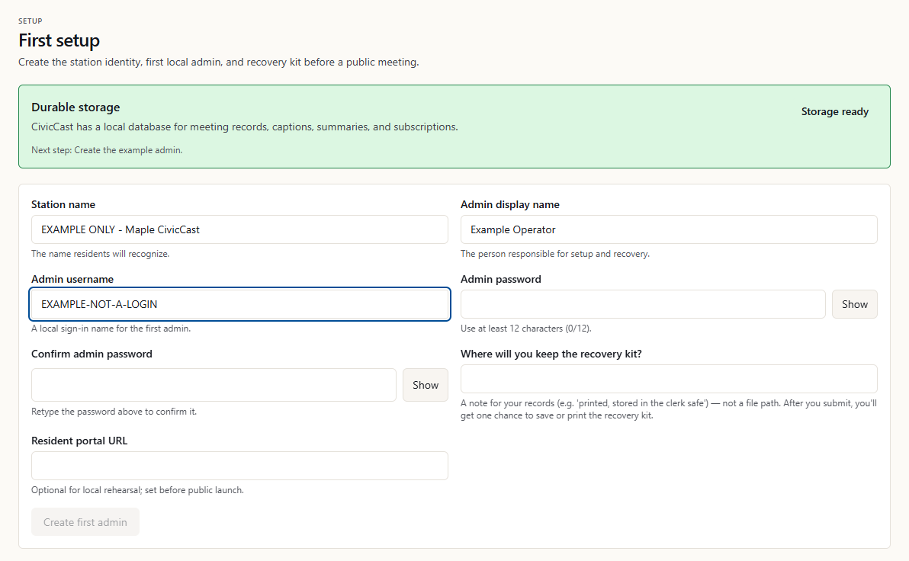{width=80%}

*Figure 10.2. First-admin form example, before submitting any setup details.*

You should see "Setup complete" or "Signed in", the **First-run defaults** card, and the setup tools: **Camera or test media**, **Backup destination**, **Storage and viewing estimate** and **Provider setup**. Later sign-ins use **Admin sign-in** on the same page and land on the Readiness screen.

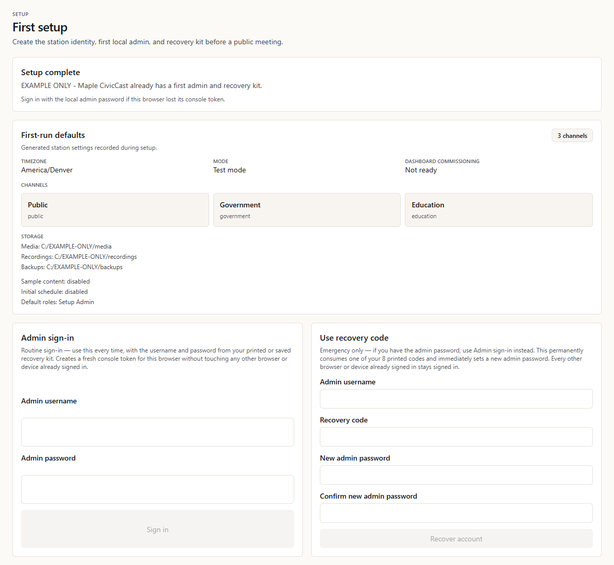{width=80%}

*Figure 10.3. Configured-station example showing the sign-in and recovery forms.*

A lost password is recovered with **Use recovery code**: the first click arms it ("This permanently consumes one recovery code — only 8 exist for this station. Click Recover account again to confirm.").

> **Warning:** The saved recovery kit file contains the administrator password in plain text. Keep it off shared folders, cloud-synced folders and email. Print it, or store the file somewhere the city controls, and delete it from Downloads.

> **Known issue (beta.10):** The form never says that the station starts in **Test mode**, with sample content and a starter schedule on, and with three channels (public, education, government; the default channel is "government"). Nothing on the page says how to leave test mode. See [Chapter 11](#ch-configuration).

### Silent install

`setup.exe /S` runs without dialogs. The Gate A run used `setup.exe /S /D=C:\CivicCastHostStore\install` (`/D=` sets the folder and, as with every installer of this kind, must be last and unquoted). Run it from an elevated prompt, from the kit folder:

```powershell
$p = Start-Process .\setup.exe -ArgumentList '/S' -Wait -PassThru
$p.ExitCode
```

A silent install shows no dialog and opens no window. A failure leaves only the exit code and the log. Exit 0 means success. After it finishes, run the checks in "Verify the install" and open the console from the shortcut.

### Exit codes

When a step fails, the dialog shows text but not the number, and a silent run shows only the number. The number is also the last line setup writes to the log: "postinstall: FAILED, aborting with exit code N". Run `Get-Content C:\ProgramData\CivicCast\install-progress.log -Tail 20` to see it.

> **Known issue (beta.10):** No dialog shows the exit code, and the dialogs say "contact support" without a contact. The project's support route is its GitHub issues page, run by the community with no service agreement.

#### Setup exit codes

| Code | Step | Meaning | What to do |
| --- | --- | --- | --- |
| 0 | Any | Success | Verify (below) |
| 2 | Any | NSIS's own generic abort, with no specific step code | Read the log |
| VC++ code (for example 1602 or 1603) | C++ runtime | The bundled runtime would not install, and setup returns the runtime installer's own code. Code 1638 ("another version is already installed") is accepted only when the registry confirms a runtime is present; otherwise it fails the same way | Read the log. Run setup again. Code 3010 is not a failure: setup marks a restart as pending and continues |
| 82 | Uninstall | The teardown step (stop and remove the service, remove the firewall rule, clear registry state) did not finish, most often because the service stop was not confirmed. The uninstall aborts before anything is removed | Stop the service (services.msc, or `sc stop CivicCastSupervisor`) or restart Windows, then uninstall again |
| 110 | Stage packs | A required pack is missing or untrusted (inner code 74), or the optional GPU pack is present but untrusted (75) | Put the missing `.ccpack` files in the `packs` folder beside `setup.exe` and run again. The log line "step stage-packs: child reported:" names them. Setup safely prepares a partial install first. Nothing in `C:\ProgramData\CivicCast` was deleted |
| 111 | Re-check | The extracted server tools do not match their signed pack | Replace the kit copy (disk error or interrupted copy) and run again |
| 112 | Re-check | The extracted CivicCast program does not match its signed pack | Same |
| 121 | Re-check | The extracted ffmpeg tools do not match | Same |
| 122 | Re-check | The extracted AI engine does not match | Same |
| 113 | Upgrade engine | The upgrade failed **and** its own rollback failed. The service is stopped on purpose | Follow `C:\ProgramData\CivicCast\upgrade\UPGRADE-RECOVERY.md` before restarting anything |
| 114 | Upgrade engine | This release has a database change that cannot be rolled back, so automatic upgrade was refused | The dialog says "Use the manual upgrade path with operator acknowledgement". No such path is described anywhere in setup. Do not retry blindly; open an issue |
| 115 | Upgrade engine | Unexpected fault | Read the log and `upgrade\upgrade-engine.log` |
| 116 | Database | PostgreSQL could not be provisioned | Read the log and `provision\PROVISION-RECOVERY.md` |
| 117 | Database | Unexpected fault | Read the log |
| 118 | Service | The service could not be registered | Read the log |
| 119 | Firewall | The firewall rule could not be created | Read the log. Setup requires this rule |
| 120 | Pre-install | An existing service could not be stopped safely, its state could not be read, or the service exists but the old program is missing | Stop **CivicCast Native Supervisor** in Services, retry as administrator. If the old program folder was removed, repair or remove that install **without deleting** `C:\ProgramData\CivicCast` |
| 123 | Activation | See the table below | See below |
| 124 | Upgrade engine | The engine rolled back its own work; your previous database is intact | Read `upgrade\upgrade-engine.log`. The service is stopped and set to manual start. Fix the cause and run setup again; a successful run restores automatic start. If the dialog says containment was not confirmed, run `sc stop CivicCastSupervisor` and `sc config CivicCastSupervisor start= demand` |
| 125 | Service | The service started but the web server is not answering | Read `install-progress.log`, `logs\control_plane.log`, `logs\control_plane-app.log` and `upgrade\upgrade-engine.log`, fix, run setup again |
| 126 | Service | Windows registered the service but could not start it | Read `C:\ProgramData\CivicCast\logs` and the Windows Application event log (Event Viewer, Windows Logs, Application) |
| 127 | Database | Setup cannot tell which CivicCast runtime owns the machine | If there is no older WSL edition, an administrator sets `HKLM\SOFTWARE\CivicCast\ActiveRuntime` to `native` and runs setup again. The exact command is in `provision\OWNERSHIP-RECOVERY.md` |
| 128 | Upgrade engine | An earlier failed upgrade's record is still on disk. The database is untouched, but setup had already stopped the service and replaced the program files (the dialog's "nothing was changed" is wrong) | Move (do not delete) `C:\ProgramData\CivicCast\upgrade\upgrade-journal.json` somewhere safe and run again |
| 129 | Upgrade engine | An older setup was run over a newer install. The database is untouched, but the older program files were already copied over the newer ones and the service is left stopped (the dialog's "before changing anything" is wrong) | Do not start the service. Run the newer setup again, or uninstall first |
| 130 | Uninstall | You declined the ownership-transfer question | None; nothing was removed |
| 131 | Uninstall | The ownership transfer failed | Read the detail in the dialog |
| 132 | Uninstall | Blocked (active runtime plus an older WSL edition, or state unreadable) | Follow the dialog |
| 133 | Uninstall | Service stop unconfirmed; program files kept. In beta.10 the uninstaller normally stops earlier, with 82, so we do not expect to see this code | Stop the service or restart Windows, then uninstall again |
| 134 | Uninstall | Teardown incomplete, or a second uninstaller started while this one ran and cleared its plan to hand back the runtime-ownership setting (`ActiveRuntime`). The teardown case is a second line of defence: the uninstaller normally stops earlier, with 82 | Read the dialog and `install-progress.log`. Remove any leftover service, firewall rule and registry state by hand (Services, Windows Defender Firewall, `HKLM\Software\CivicCast\Native`) |
| 135 | Database | Another CivicCast product (the older WSL edition) is registered | Uninstall it from Settings, Apps (or run its `cutover-to-native`), then run setup again |

#### Activation (exit 123)

Exit 123 covers every activation failure. The inner code in the log line "step d4-activate-station: returned N" tells them apart.

| Inner code | Meaning | What to do |
| --- | --- | --- |
| (no index) | No `station-index.json` beside setup or embedded | Download setup again from the release page, or copy the full kit |
| 66 | The index or a pack could not be obtained or verified | Copy the kit's `station\` folder across whole. If you ran `setup.exe` on its own, the packs must already be in this computer's cache from an earlier install. The details list names the missing pack or the failed check |
| 67 | Any error after the packs verified: no free space, extraction failure, a missing file, or a self-test failure | Read the details list for the exact line. Free space if that is the cause |
| 78 | The embedded signing key was refused | This copy of setup is not a valid release build. Download it again from the release page |
| 64, 65 | The setup program is defective | Download it again |
| other | Unexpected | Read the log |

#### Inner codes in the log

The log records each step's own code ("step X: returned N"). You may see: 64 arguments, 65 report could not be rendered, 66 acquisition, 67 activation or self-test, 68 install-tree verify, 70 service registration, 72 database-URL write, 73 uninstall preflight, 74 ownership transfer or required-pack failure, 75 provisioning or optional-pack failure, 76 repair made changes, 77 uninstall blocked, 78 embedded trust key refused, 79 unrepairable, 80 teardown step failed, 82 service stop unconfirmed, 83 service would not start, 84 service running but not serving, 85 ownership unprovable, 86 unknown `--civiccast-` option, 87 another CivicCast product registered. Codes 69, 71 and 81 are not named in the files we read.

### Logs

| Question | File (under `C:\ProgramData\CivicCast`) |
| --- | --- |
| What step did setup reach? | `install-progress.log` (time-stamped; read from the bottom and find the last "begin" with no "returned") |
| Which pack was missing? | The "step stage-packs: child reported:" line, and `install-manifest-report-<pid>-<time>.json` |
| Why an upgrade rolled back | `upgrade\upgrade-engine.log`, `upgrade\upgrade-journal.json`, `upgrade\UPGRADE-RECOVERY.md` |
| Database creation or ownership | `provision\PROVISION-RECOVERY.md`, `provision\OWNERSHIP-RECOVERY.md`, `provision\ownership-observation.txt` |
| Why the station will not run | `logs\supervisor.log` (the service; 10 MiB, 10 files, flushed each record), `logs\control_plane.log`, `logs\control_plane-app.log`, `logs\postgres.log`, `logs\postgres-launcher.log`, `logs\ollama.log` |
| First-run window | `%USERPROFILE%\.civiccast\runtime-host.log` and `installer-state.json` |
| Which self-test failed | The setup window's details list (not the log; see the Known issue above) |

A failure never deletes `C:\ProgramData\CivicCast`. Open the log in Notepad, and when you report a problem to the project's issue page, remove anything private first. Do not paste passwords, recovery codes or tokens.

### Verify the install

Run these on the station, then open the console. Each check says what a good answer looks like.

```powershell
Get-Service CivicCastSupervisor | Format-List Name, DisplayName, Status, StartType
Invoke-RestMethod http://127.0.0.1:8000/health
Get-NetFirewallRule -DisplayName "CivicCast (Native) Portal/API (TCP 8000)"
Test-Path "C:\Program Files\CivicCast (Native)\station-set.json","C:\Program Files\CivicCast (Native)\activation-self-test.json"
Get-Content C:\ProgramData\CivicCast\install-progress.log -Tail 5
```

- The service is **CivicCast Native Supervisor**, `Status` **Running**, `StartType` **Automatic**.
- `/health` answers `status: healthy`, `schema: current` and `version: 1.0.0-beta.10`. The web status is always 200 while the process answers; the `status` field is what tells you whether it is ready (`degraded` means the database schema is not confirmed current: behind the program, not configured or unreadable).
- The firewall rule exists.
- Both `station-set.json` and `activation-self-test.json` exist in the install folder.
- The last log lines include "postinstall: SUCCESS (InstalledVersion 1.0.0-beta.10 recorded)".
- Settings, Apps shows **CivicCast (Native)**, version 1.0.0-beta.10.
- The operator console and the resident portal at `http://127.0.0.1:8000/` both load on the station.

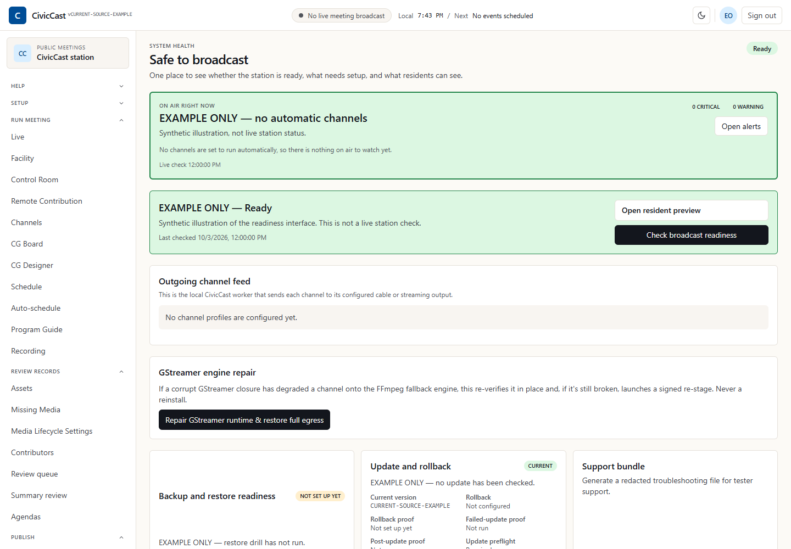{width=90%}

*Figure 10.4. The current-source Readiness screen with synthetic example responses. This image is not install verification or evidence that the live station is healthy; perform the actual checks above.*

Then sign in and open **Readiness** (the page headed "Safe to broadcast") and run a private rehearsal ([Chapter 4](#ch-running-meeting), [Chapter 8](#ch-something-wrong)). The project's clean-install test checked, in this order: install, activation, health, console and portal render, a clerk workflow, offline captions (21 caption cues on a test clip), the playout engine (5,445 transport-stream packets analysed with no errors) and a five-minute soak. The playout-engine check passed only on a harness that waits longer: on a fresh install the engine's first packets came more than 60 seconds after its first start, and the first capture attempt saw none (the second saw the 5,445). Restart the computer once and confirm that the service comes back by itself. The beta.10 verification record does not cover a restart.

### Upgrade

To upgrade, run the newer `setup.exe` (with its `packs\` folder) on the station that already runs CivicCast. The upgrade lane was not run for beta.10, so do not treat an upgrade as proven. Make a backup first ([Chapter 12](#ch-operations)). The upgrade engine also backs up and migrates the database with rollback, but where it keeps that backup is not documented, so do not rely on it as your only copy.

> **Warning:** Setup stops the CivicCast service before it replaces any file. That takes every channel off the air until setup finishes and the service starts again. Do not run an upgrade during a meeting or a scheduled program.

1. Close the first-run window if it is open.
2. Run the new `setup.exe` and approve UAC.
3. On the **Already Installed** page, choose the option that does **not** uninstall first (**Do not uninstall** on an older install, **Add/Reinstall components** for a same-version re-run).
4. Wait. Setup stops the old service ("Preparing the existing CivicCast (Native) installation for a data-preserving upgrade..."), replaces files, re-checks the packs, then runs the upgrade engine, which backs up, migrates and health-checks the database.
5. Confirm with "Verify the install".

Why not uninstall first: the upgrade engine decides what to do from two markers (`InstalledVersion` and `DatabaseUrl`) that an uninstall deletes, and the setup code says the uninstall teardown must not be used during an upgrade, because it removes those markers. Uninstalling first turns the upgrade into a reinstall over leftover data. We have no beta.10 evidence for that path. This is our reading of the code, not a tested statement.

| Upgrade engine result | What setup does |
| --- | --- |
| Committed | Continues |
| Fresh install (nothing to upgrade) | Continues. Existing CivicCast data on the machine is adopted, not deleted |
| Same version already installed | Does nothing to the data; re-checks the packs; continues |
| Older setup over newer install | Exit 129. Database untouched; older program files already in place; service stopped |
| Rolled back its own work | Exit 124. The old database is intact. The service is stopped and set to manual start |
| Rollback also failed | Exit 113. Follow `UPGRADE-RECOVERY.md` |
| Release has an irreversible change | Exit 114 (refused) |
| Earlier failed upgrade's record found | Exit 128. Database untouched; program files already replaced; service stopped |

> **Known issue (beta.10):** The dialogs for exit 128 and 129 say setup "did nothing" or stopped "before changing anything". That is not what the code does. Setup stops the service and replaces the program files first, and only then runs the upgrade engine, which is where 128 and 129 are decided. The database is not touched, but the service is left stopped and the program files on disk are those of the setup you ran. After an exit 129 they are the **older** version, so do not start the service until you have run the newer setup.

After a failed upgrade the program files are the **new** version and the station is off air. There is no button that goes back to the old version. The recovery is to fix the cause named in the log and run setup again.

### Repair

There is no separate repair button that does the work. Two paths exist.

**Re-run setup.** Run the same version's setup again with its `packs\` folder and choose **Add/Reinstall components**. The upgrade engine does nothing (same version), each extracted pack is re-verified, and a damaged tree is rebuilt from the pack. The service is stopped first, because setup must not delete files under a running service.

**The repair command.** For an operator working outside the setup window, the installed program has a repair mode. It checks every installed tree against its signed pack, re-lays corrupted files, repairs the runtime selector and re-registers the service. It never touches data. From an elevated PowerShell window, with the kit folder as `--installer-dir` (the folder that contains `packs\`):

```powershell
& "C:\Program Files\CivicCast (Native)\CivicCast Native.exe" --civiccast-repair "C:\Program Files\CivicCast (Native)" --installer-dir "D:\CivicCast-kit" | Out-String
```

It prints a JSON report. The exit code is 0 if every tree already verified, 76 if something was repaired and now verifies, and 79 if something could not be repaired locally (the report names the remedy). We have not run this by hand and the beta.10 acceptance test did not exercise it. Piping to `Out-String` makes PowerShell wait for this Windows-subsystem program. If repair stopped the service to rebuild a tree, it does **not** restart it: it prints the line to run, `sc.exe start CivicCastSupervisor`. Its "everything verified" answer does not check the database schema or the activation files.

> **Known issue (beta.10):** **Repair this step** in the first-run window only restarts the background runtime host, or for other steps writes a message ("CivicCast queued a repair pass for this installer lane."). It is not connected to the repair command above.

### Uninstall

Open Settings, Apps, Installed apps, **CivicCast (Native)**, **Uninstall** (or run `C:\Program Files\CivicCast (Native)\uninstall.exe`). The quiet form is the registry value `QuietUninstallString`: `"<install folder>\uninstall.exe" /S _?=<install folder>`.

1. **Ownership check.** The details list shows "Checking CivicCast Native runtime ownership before uninstall...". If CivicCast (Native) is the active runtime and the older WSL edition ("CivicCast Installer") is still installed, you are asked whether to transfer ownership to the WSL edition. **No** stops with exit 130 and removes nothing. **Yes** transfers ownership and continues (a failed transfer is exit 131). Any other blocked state is exit 132.
2. **Teardown.** "Removing the CivicCast (Native) supervisor service, firewall rule, and registry state..." The service is stopped and removed, the firewall rule is deleted, and the registry values (including the database password) are cleared. If the teardown does not finish with success (most often because the service stop cannot be confirmed), the uninstall aborts with exit 82 and **nothing is removed**: "stop it manually (services.msc, or 'sc stop CivicCastSupervisor'), or reboot this machine, then run Uninstall again."
3. **The model-pack notice.** "CivicCast (Native) is being removed, including the downloaded AI model packs (about 21 GB) kept in this folder. Your recordings, database and settings in `C:\ProgramData\CivicCast` are NOT affected and are being kept. If you reinstall later by running setup.exe on its own, it will need those model packs again and cannot download them -- reinstall from the full CivicCast kit folder (setup.exe together with its station folder), or copy `<install dir>\packs\.station-cache` somewhere safe now if you want to reuse it." A silent uninstall writes the same text to the log.
4. **Removal.** The runtime, packs and then the whole install folder are deleted. If the uninstaller cannot delete itself it schedules the removal for the next restart. The shortcuts are removed.

If the service stop was not confirmed, you also see exit 133 and the program files are kept. Exit 134 means teardown was incomplete and you remove the leftovers by hand.

| | Removed | Kept |
| --- | --- | --- |
| Service and firewall | Service `CivicCastSupervisor`, rule "CivicCast (Native) Portal/API (TCP 8000)" | |
| Registry | `HKLM\SOFTWARE\CivicCast\Native` values (`DatabaseUrl`, `InstalledVersion`), the maintenance flag, the setup install-location key, and (when CivicCast Native was the only active runtime) the `ActiveRuntime` selector under `HKLM\SOFTWARE\CivicCast` | |
| Install folder | Everything in `C:\Program Files\CivicCast (Native)`: runtime, tools, the AI engine, `components`, `models`, `packs` and the **model-pack cache** `packs\.station-cache` | |
| Shortcuts | The Desktop and Start menu shortcuts | |
| Data | | All of `C:\ProgramData\CivicCast`: the database (`data\pgdata`), uploads and recordings (`data\uploads`), the egress working folder and conform cache (`data\egress`), packs and components the first-run window downloaded, logs, journals and recovery documents |
| Per-user settings | | `%USERPROFILE%\.civiccast`. A checkbox on the uninstall page, "Also delete this account's saved installer settings (your recordings, database and settings in `C:\ProgramData\CivicCast` always stay on this computer).", clears the setup window's own saved settings (the folders `org.civiccast.native` under `%APPDATA%` and `%LOCALAPPDATA%`) |

> **Known issue (beta.10): the model-cache limitation (audit item MA-17).** Uninstall deletes `<install folder>\packs`, and the 21 GB model-pack cache is inside it. A computer that uninstalls and then reinstalls from `setup.exe` and `packs\` without the `station\` folder cannot activate (from `setup.exe` alone it stops earlier, at exit 110): the signed index is embedded in `setup.exe`, but the model packs are not, and the cache they would come from is gone, so activation exits 66 and setup ends with 123. The project left this unfixed on purpose (keeping the cache would change what uninstall means) and instead added the notice above. The workaround is unchanged: reinstall from the full kit, or copy `packs\.station-cache` aside before you uninstall.

Because the database password is deleted from the registry, the surviving database cannot be reconnected with the old password. By design, a later install finds the existing database, issues a fresh password on it and keeps your data (the code calls this "adopt existing"). No beta.10 test covered an uninstall followed by a reinstall.

> **Warning:** No uninstall step removes `C:\ProgramData\CivicCast`. If you want a clean computer, you must delete that folder yourself after you have backed up anything you need. Doing so permanently destroys the database, recordings and settings. The setup text gives no instructions for this.

### If it did not work

| What you see | Cause | What to do |
| --- | --- | --- |
| Setup stops with exit 110 after a page that promised downloads | No `packs` folder beside `setup.exe` | Use the full kit |
| Setup stops with exit 123 after a long wait | No `station` folder and no cached model packs, or a self-test or space failure | See the activation table and read the details list |
| The console shortcut shows a browser error | The service is not running | Press Windows key + R, type `services.msc`, press Enter, find **CivicCast Native Supervisor** and choose **Start**. Then read `logs\supervisor.log` and `logs\control_plane.log` |
| "First setup can only be done from the station computer itself" | The browser is not on the station | Open the console in a browser on the station |
| "The station is cooling down after too many requests." | Too many sign-in attempts | Wait, then **Try again** |
| "Could not read setup state." | The console reached the station but the station could not answer | Wait and reload. Check the service is running. Collect `install-progress.log` and do not run setup again until someone has read it |
| The first-run window sits on **Downloading** with poor or no internet | It always tries every item (see the Known issue) | Close it. Use the Desktop shortcut |
| The station will not stay up after a failed upgrade | Containment left the service on manual start | Fix the cause, run setup again |

### Related

- [Chapter 9: Planning your station](#ch-planning)
- [Chapter 11: Configuring the station](#ch-configuration)
- [Chapter 12: Running it day to day](#ch-operations)
- [Chapter 13: Security and privacy](#ch-security)
- [Chapter 14: Troubleshooting matrix](#ch-troubleshooting)
- [Appendix A: command-line reference](#app-cli)

<!-- SOURCES: docs/releases/v1.0.0-beta.10-verification.md; INSTALL-WINDOWS.md and docs/tester/START-HERE.md (topics only); CHANGELOG.md:5920-5951 (MA-17); .github/workflows/native-beta-candidate-artifacts.yml:1293-1440 (kit layout); ops/docs-sprint/inventory/screens/installer-*.md and installer-install-layout.md, setup.md; civiccast/apps/installer/src-tauri/nsis-hooks-bootstrap.nsh:175-440 (steps, failure macro, containment), 440-625 (exit codes), 625-700 (pre-install), 702-1030 (C++ runtime, stage packs, D2), 1030-1391 (D3, D4), 1393-1505 (activation), 1506-1815 (service, firewall, shortcuts), 1817-2333 (uninstall); src-tauri/nsis-lang-native-english.nsh; src-tauri/tauri.native.conf.json; src-tauri/src/main.rs:30-40,2953-2976,3296-3330,3558-3600,3682-3750,4470-4700,4772,4798,5062-5073,5880-5930,6380-6460; src-tauri/src/native_activation.rs:20-60,820-880; src-tauri/src/native_distribution.rs:690-770; src-tauri/src/native_repair.rs:235-250,861-881; src-tauri/src/native_service_registration.rs:154-167,498,611-632,697,926,2765-2790; src-tauri/src/native_uninstall.rs:2100-2215; src/acquisition-progress.ts:140-210; civiccast/native/provision/__main__.py:225-345 (adopt existing); civiccast/native/supervisor/service.py:34,192-260; civiccast/app.py:2377-2440 (/health); civiccast/installer/models.py:325-365; docs/releases/evidence/v1.0.0-beta.10-gate-a/run5-clean-lane-PASS-b6520847/ (summary.json, INSTALL-RESULT.txt, T3-CAPTIONS.txt, T3T5-RESULT.txt); ops/beta10-oversight/OVERSIGHT-LOG.md:589; gh release view v1.0.0-beta.10 -->

\newpage

## Configuring the station {#ch-configuration}

This chapter is for the person at the city who owns the CivicCast computer. It walks through every place a station is configured: First Setup and the admin account, the Station Profile, channels and their outputs, loudness, the playout engine, captions, AI models, cable commissioning, the Control Room, custom fields, the paywall, certificates and network exposure, storage, and the environment variables that sit behind all of it. Most of it is done once, before the first public meeting, by someone with the `setup_admin` role. A few things (the environment variables, the registry) need Administrator rights on the Windows computer itself.

> **Note:** Proof status of the build this chapter describes. CivicCast 1.0.0-beta.10 was published on 2026-10-02 as a GitHub pre-release (a "beta candidate"). Gate A passed for the clean-install lane only. The upgrade and download-only lanes were not run. A first install with neither the full kit nor an earlier install is not proven (the installer needs the `packs` and `station` folders). No human field-tester has signed it off. Where this chapter says "we found" or "in the code", it means a person read the program code; it does not mean the behavior was watched on a live station. Where a behavior could not be confirmed, the text says so.

### Before you start

You need:

- The station computer, installed and running (see [Installing, first run, upgrading, uninstalling](#ch-installing)). The Windows service is `CivicCastSupervisor` ("CivicCast Native Supervisor").
- A browser on the station computer itself. First Setup, the admin sign-in and the recovery-code reset only work from the station computer (the server answers HTTP 403 to any other computer).
- Administrator rights on Windows for the registry and file steps in the environment-variable section.
- A plan for what the station does. A public-meetings station (residents watch on the web) needs far less configuration than a station that feeds a cable headend. Cable Commissioning and the headend presets are only needed for the second kind.

Most screens in this chapter live in the sidebar group **Setup**. Almost all of them can be used only by the `setup_admin` role. The first admin you create has every role (the token scope `admin` expands to all five roles), so on a one-person station you can ignore role names. Roles are described in the appendix on roles ([Roles and what each can do](#app-roles)).

> **Warning:** Times typed on several screens are treated as UTC, not as the station's local time. This chapter says so wherever you type a time or date (for example the paywall's comp-pass expiry, which is the end of that day in UTC). Check each time field's label before you save.

### Where settings live

Settings are kept in five different places. Knowing which place holds a setting tells you how to change it, how to back it up, and why a change in one place does not move anything in another.

| Where | What is kept there | How you change it |
| --- | --- | --- |
| The database (PostgreSQL, `C:\ProgramData\CivicCast\data\pgdata`) | Each channel's output configuration, the AI model choices, custom fields, the paywall, control-room devices and cues, watch folders, retention rules, schedules, assets | The console screens in this chapter (or the staff API) |
| `station-state.json` and the files beside it | The Station Profile, the admin account, the recovery kit state, commissioning progress, the backup folder you verified, provider credentials (`provider-credentials.json`), proof references (`provider-proof-evidence.json`), `tester-ops-state.json` | The Setup and Station Profile screens |
| The service's environment (the registry value `Environment` on the service) | Tuning and switches that have no screen: timeouts, worker on/off switches, cache sizes, proxy and CORS rules, the control-room sidecar address, TSDuck location | You, by hand, in the registry (see [Environment variables](#configuration-env)) |
| The Windows credential store ("keyring") | AI provider API keys, control-room device passwords | The AI Models and Control Room Setup screens, or `civiccast model set-provider-key` |
| Fixed by the installer | The folder layout under `C:\Program Files\CivicCast (Native)` and `C:\ProgramData\CivicCast`, the control plane address `127.0.0.1:8000`, the Ollama address `127.0.0.1:11434` | Not changeable in beta.10 (see below) |

The default location of `station-state.json` is `%LOCALAPPDATA%\CivicCast\station-state.json` of the account that runs the service, unless the variable `CIVICCAST_STATION_STATE_PATH` names another file. The service runs as LocalSystem, so on a station the folder is under the Windows system profile (normally `C:\Windows\System32\config\systemprofile\AppData\Local\CivicCast`). We derived that path from the code and the Windows rules for the LocalSystem account; we did not look at it on a running station. If you need the exact file, search the computer for `station-state.json`.

> **Known issue (beta.10):** Back up `station-state.json` and the files beside it as well as `C:\ProgramData\CivicCast`. The admin account, the recovery-code hashes, the saved provider credentials and the commissioning record are in the state files, which in the default layout are not under `ProgramData`. The chapter on backups ([Running it day to day](#ch-operations)) describes what to copy.

The folder layout is described in the installing chapter. The two folders that matter for configuration are `C:\ProgramData\CivicCast\data\uploads` (uploaded media and recordings, in a `recordings` sub-folder) and `C:\ProgramData\CivicCast\data\egress` (the playout work area: prepared copies of programs, slates, the live web-preview segments, the conform cache).

> **Known issue (beta.10):** The two folders above cannot be moved with a setting. The service sets `CIVICCAST_UPLOAD_DIR` and `CIVICCAST_EGRESS_WORK_DIR` for the control plane itself, derived from the `PROGRAMDATA` folder, and those values win over anything you put in the service environment. Plan disk space on the drive that holds `C:\ProgramData` (see [Planning your station](#ch-planning)). The Station Profile has three editable storage folders; they do not move anything either (see [Station Profile](#configuration-profile)).

### Run First Setup and create the admin account {#configuration-first-setup}

First Setup is a page in the operator console at `http://127.0.0.1:8000/operator/` (the Start Menu shortcut "CivicCast Operator Console" opens it). It creates the station's one local admin account and a one-time recovery kit. After that, the same page is the sign-in page. You can reach it signed out; the aliases `/login` and `/sign-in` land on it.

1. On the station computer, open the console and choose **First Setup** in the sidebar.
2. Under **Durable storage**, click **Prepare storage**. This creates or activates the local database for meeting records, captions, summaries and subscriptions. If the service was started with a `DATABASE_URL` the button does nothing and just reports status.
3. Fill in **Station name** (up to 120 characters), **Admin display name** (up to 120), **Admin username** (up to 80), **Admin password** (at least 12 characters; a counter shows "(n/12)") and **Confirm admin password**.
4. In **Where will you keep the recovery kit?** type a note such as "printed, in the clerk's safe". This is a free-text reminder. It is not a folder and nothing is written there.
5. Optionally fill in **Resident portal URL**. A blank box is saved as nothing.
6. Click **Create first admin**. The **Recovery kit ready** panel appears with eight one-time recovery codes. The rest of the console is locked until you confirm the kit.
7. Click **Print kit** or **Save kit**, tick **I have saved or printed this kit...** and click **Continue to the console**.

After step 7 you see a green **Setup complete** card, the **First-run defaults** card and the setup tools (camera or test media, backup destination, storage estimate, provider setup).

What the form does not show you, but the server chooses for you when you click **Create first admin**:

| Setting | Value chosen | What it means |
| --- | --- | --- |
| Number of channels | 3 | The channels `public`, `education` and `government` |
| Default channel | `government` | Used when the first-run sample content is added |
| Time zone | `local` | The word `local` means UTC in the running service (see [Station Profile](#configuration-profile)) |
| Operation mode | `test` | Shown as "Test mode" on the First-run defaults card |
| Sample content | on | A short sample video is added to the library in the background |
| Starter schedule | on | A starter schedule is created with the sample content |

> **Known issue (beta.10):** The page never tells you that the station starts in Test mode with sample content and a starter schedule. We found no setting or button that leaves Test mode: the value is stored and shown but nothing in the program code changes behavior because of it. Delete the sample content and starter schedule from Assets and Schedule before the first public meeting if you do not want residents to see them (see [Before the meeting](#ch-before-meeting)).

> **Known issue (beta.10):** The **Save kit** button downloads `civiccast-recovery-kit-<kit id>.txt` and that file contains the admin password in plain text as well as the eight codes. Keep it off the CivicCast computer, off email and off any synced cloud folder. The kit you regenerate later (Station Profile, Security) contains the codes only.

#### Sign in again, and when the password is lost

On a configured station the page shows **Admin sign-in** (username and password) and **Use recovery code**. A correct password signs you in on that browser and sends you to the Readiness screen (`/health`) or to the page you were bounced from. It does not sign out other browsers. Sign-in only works from the station computer.

Too many wrong passwords are limited. The default is 10 failures per 60 seconds for each route and each connecting address (`CIVICCAST_AUTH_RATE_LIMIT`, `CIVICCAST_AUTH_RATE_LIMIT_WINDOW_SECONDS`). A correct password always gets through; a wrong one burns the budget.

To use a recovery code, click **Recover account**, enter one code and a new password (at least 12 characters), and click **Recover account** a second time. The second click is the real action.

> **Warning:** Using a recovery code permanently consumes it. Only eight exist for the station. After the eighth, the only route back in is the environment switch below, or a regenerated kit made while you are still signed in.

To make First Setup run again on a station that is already set up, the service must have the environment variable `CIVICCAST_ALLOW_FIRST_ADMIN_RESET=1`. Without it, a second First Setup is refused with "First-admin setup is already complete. Use the recovery flow or set CIVICCAST_ALLOW_FIRST_ADMIN_RESET=1 for an intentional local reset." Treat this variable as a station reset. We did not trace everything the reset replaces, so do not use it on a station with real records without help from support.

#### The rest of the Setup page

Once signed in, the Setup page has four tools:

- **Camera or test media** has six choices (USB webcam or HDMI capture, phone or tablet broadcast app, hardware encoder or AV system, NDI source, bundled sample video, upload a short test video). **Save meeting source** creates a live source on the channel `government` (the channel is fixed in the screen). **Create sample media** makes a 2-second sample video and adds it to Assets. The stream address box is for an address such as `rtmp://...`; do not put camera passwords in it.
- **Backup destination** with **Verify backup**. See the warning below.
- **Storage and viewing estimate** is arithmetic in your browser: hours per meeting times meetings per month times 2 gives gigabytes stored. Nothing is measured.
- **Provider setup** holds the cloud and archive providers. See [Provider setup and keys](#configuration-providers).

> **Known issue (beta.10):** **Verify backup** only checks that CivicCast can write, read and delete a small test file in the folder you typed, and it remembers the path. We found no code that copies station data to that folder on a schedule, and `last_backup_at` is never written. A green "Ready" on this card does not mean a backup exists. Make real backups as described in [Running it day to day](#ch-operations). The folder is written by the service account, so use a local path or a share that the computer account can write to; a drive letter mapped in your own session does not exist for the service. Paths that start `/mnt/c/...` (Linux style) and drive-relative paths such as `C:backups` are refused.

### Set the Station Profile {#configuration-profile}

The Station Profile shows the station's identity and what this computer actually has, and holds two security actions. Only `setup_admin` can save; the roles `meeting_operator` and `support_admin` can read it.

| Field | What it changes | What it does not change |
| --- | --- | --- |
| **Station name** (required, up to 120 characters) | The name shown in the console and on the community-board graphic that appears between programs when no channel branding is set | It is not the public site's title; channel and app names are set on Channels |
| **Timezone (IANA name, or "local")** | The zone used for auto-schedule dayparts (such as "prime time 18:00") and for the end-of-day deadline of retention terms | It does not reformat screens that ask you for UTC times |
| **Default channel id** | The channel the first-run sample content uses; unknown ids are healed to `government` when read | It does not change which channel residents see first |
| **Public base URL (optional)** | Stored and displayed | See the Known issue below: nothing reads it, and it cannot be cleared here |
| **Media library / Recordings / Backups** folders | The three paths stored in the profile; each Copy path button copies one | See the Known issue below: they do not move or choose where any file is written |
| **Show live captions on air** | The operator switch for live captions (the live speech-to-text tap on every on-air channel and the CEA-708 caption leg in the video). Saved with the profile; read on every scan, so it works without a restart | It does not affect captions on published recordings (those are the offline job, see [Captions](#configuration-captions)). Default is off in beta.10 |

The time zone is free text. The suggested values are IANA names such as `America/Denver`. The word `local`, a blank result, and any name the computer cannot find all give UTC. An unknown name is logged as a warning ("... is not a valid IANA zone; using UTC.") and the station keeps running on UTC.

> **Known issue (beta.10):** The default time zone is `local`, and in the running service `local` means UTC. A station that never edits this field schedules its dayparts in UTC. Set the real zone here after First Setup. The background auto-schedule compiler reads the zone when the service starts, so restart the service after you change it.

> **Known issue (beta.10):** The three storage-folder fields are shown with a Save button, and the page says they show "the value currently in effect". In the program code the saved paths are read only by this screen's own read. Nothing uses them to choose where media, recordings or backups are written. Editing them does not move any file. Use Assets to find recordings. The environment variables `CIVICCAST_STATION_MEDIA_LIBRARY`, `CIVICCAST_STATION_RECORDINGS` and `CIVICCAST_STATION_BACKUPS` only change what this page displays.

> **Known issue (beta.10):** **Public base URL** is stored but not used. The screen sends nothing when the box is blank and the server reads "nothing sent" as "leave unchanged", so an existing URL cannot be cleared on this page. The addresses that RSS feeds and the federation actor use come from the environment variable `CIVICCAST_PUBLIC_BASE_URL` (it must be an absolute `http://` or `https://` address); the resident-portal preview link comes from `CIVICCAST_RESIDENT_PORTAL_URL`.

The **Station box profile** card is read-only. It asks the program what this computer has: CPU, RAM, the recommended tier, the playout engine and its readiness, the clock (a row is yellow with "System clock is not NTP-synced." if the clock is not synchronized), DeckLink or SDI, TSDuck, the backup destination, AI model memory, and a "Cable-grade OS" line. Its readiness colors are shown as the raw words GREEN, YELLOW and RED. The card always asks for the `public-meetings` profile; there is no selector.

#### Security actions

- **Sign out other sessions** ends every other operator-console session except this browser, after a confirmation. It only works if you signed in with the admin password; with a staff token you get HTTP 401 "Invalid staff bearer token."
- **Regenerate recovery kit** creates eight new codes and invalidates the old ones at once. The new codes exist only on that page. Save or print them before you leave the page, tick the confirmation and click **Done**. If you leave early the codes are lost, and the old ones no longer work.

### Configure channels, outputs and sinks {#configuration-channels}

#### How a channel is configured

A channel has an **egress configuration**, stored in the database. "Egress" means the signal CivicCast sends out. The configuration holds:

- **enabled**: whether the channel may be started.
- **auto_start** ("Keep this channel on air"): whether the automation starts the feed after a restart or crash.
- **allow_software_fallback** ("Allow software (CPU) encoding fallback"): see [Encoders](#configuration-encoders).
- **fill_policy**: what fills the gaps between programs, `slate` (the plain slate) or `bulletins` (approved community bulletins).
- **slate message** (1 to 240 characters), optional **NDI output name** and **SDI output device**.
- **sinks**: one or more output targets (below).
- **loudness target and tolerance** and the **canonical profile** (picture size, frame rate, codec, bitrates): see [Loudness](#configuration-loudness).
- the **lower-third banner** switch and text (up to 240 characters).

A new channel has no configuration until you create one. The Start button is disabled with "No outgoing-feed configuration for <id>. Apply a headend preset or the local rehearsal preset first." The normal way to create one is to apply a preset (next section). Creating it by preset gives the channel `enabled: true` and the slate message "CivicCast is preparing the channel."

The Channels screen (**Run Meeting** group) edits some of this: **Run this channel 24/7** (auto start, software fallback, fill policy, slate message, NDI name, SDI device) and **Cable headend delivery** (the presets). It does not edit individual sinks, loudness numbers or the picture profile. Those can be set only through the staff API (`PUT /api/staff/egress/channels/{id}/config` with a full configuration, `setup_admin` only; see [Appendix: API](#app-api)).

> **Warning:** Changes to a channel's outputs do not reach a channel that is on air. A running pipeline reads its sinks, encode profile and loudness target only when it is built. A preset or a saved configuration lands at the next Stop and Start. **Apply headend preset** on a channel that is standing by on its slate restarts it at once, and every output (the cable feed included) drops for a few seconds while the pipeline rebuilds. On a channel that is airing a program nothing is interrupted, and the screen says "Preset saved. Restart the channel to put it on air."

#### Apply a headend preset

1. Open **Channels** and select the channel.
2. In **Cable headend delivery**, choose a **Headend preset**.
3. Type the **Destination** (`udp://address:port` for network presets; a drop-folder path for the file preset; optional folder for the web preview).
4. Optionally set **Mux rate override (kbps)**. Tick **Keep the channel's other outputs alongside the headend feed** if the channel already has another output you want to keep.
5. Click **Apply headend preset** (or **Enable web preview**) and confirm the dialog.

You should see "Preset applied and going on air", "Preset saved. Restart the channel to put it on air", "Nothing to change" or "Preset saved for the next start", with a sentence of detail.

The presets in the program (each carries its sources and the note "Built from published vendor documentation; not field-proven against a real cable headend until the first-station beta."):

| Preset (screen label) | Picture | Video / audio codec requested | Mux rate | Transport |
| --- | --- | --- | --- | --- |
| Generic CBR SPTS over UDP | 1280x720, 30 fps | H.264 at 5,000 kbps, GOP 30 / AC-3 192 kbps | 8,000 kbps | UDP unicast |
| Comcast MTD - SD | 720x480, 30 fps | MPEG-2 at 3,180 kbps, GOP 15 / AC-3 192 kbps | 3,750 kbps | UDP multicast |
| Comcast MTD - HD | 1920x1080, 30 fps | H.264 at 10,000 kbps, GOP 30 / AC-3 384 kbps | 12,000 kbps (a placeholder; use your carriage agreement's rate) | UDP multicast |
| TelVue HyperCaster - IP transport stream input | 1280x720, 30 fps | H.264 at 5,000 kbps, GOP 30 / AC-3 192 kbps | 8,000 kbps; ports 1024 and up | UDP unicast |
| Harmonic Spectrum - transport stream ingest | 1920x1080, 30 fps | H.264 at 8,000 kbps, GOP 30 / AC-3 192 kbps | 10,000 kbps | UDP unicast |
| Leightronix UltraNEXUS - file handoff | 1280x720, 30 fps | H.264 at 8,000 kbps, GOP 30 / AC-3 192 kbps | none (file drop) | A file in a watched folder |
| Local rehearsal (web preview, HLS) | the channel's own profile is left alone | not applied | none | A local folder served to the resident portal |

Applying a cable preset replaces the channel's whole canonical profile and sets the channel loudness target to -24 (see [Loudness](#configuration-loudness)). Applying the web-preview preset adds only an `hls` output and leaves the encode profile and loudness alone.

> **Known issue (beta.10):** On the native station the playout engine is the GStreamer engine. Reading the code, that engine chooses its video encoder from a fixed table that has no MPEG-2 entry, and its audio encoder from a table that has no AC-3 entry; anything not in a table falls back to H.264 (`openh264enc`) and AAC (`avenc_aac`). So the presets that ask for MPEG-2 (Comcast MTD - SD) or AC-3 (all the cable presets) are, as written, encoded as H.264 and AAC in beta.10. We did not capture an output stream to confirm what a headend receives. Ask your cable operator whether H.264 and AAC are acceptable, and run [Cable Commissioning](#configuration-commissioning) with the TSDuck check before you rely on a preset.

#### Sink kinds {#configuration-sinks}

A **sink** is one output of a channel. The native station always uses the GStreamer engine, which supports these kinds. A configuration with an `rtmp` sink is refused at save time with a message that names the supported kinds.

| Kind | URI form | What it is for | Notes from the code |
| --- | --- | --- | --- |
| `udp-ts` | `udp://host:port` (a port is required) | A headend or encoder that takes a transport stream over UDP | The cable preset creates this. Datagrams are 1316 bytes (7 transport packets). A constant `-muxrate` is added as an allowed extra argument. Passes through the TS relay when TSDuck is present (below) |
| `local-ts` | `udp://...` or `file://...` | A local transport-stream feed for another program on the same computer | |
| `file` | A path or `file://` URI | Writing a transport stream to a file | The file preset creates this |
| `srt` | `srt://...` | An SRT receiver | See the secret note below |
| `hls` | A local folder path or `file://` | The resident-portal web preview: a playlist and 2-second segments written to the folder | Delivered by a supervised ffmpeg helper because the shipped GStreamer has no HLS element. The folder must be inside the HLS root (below) |
| `sdi` | Not a network address | SDI output through a supervised relay using your own DeckLink-capable ffmpeg | Needs `CIVICCAST_SDI_FFMPEG` |
| `rtmp` | `rtmp://` or `rtmps://` | Not supported by the GStreamer engine | Refused when the GStreamer engine is selected |

Each sink also has: a **label** (1 to 80 characters, unique within the channel), **latency** (0 to 60,000 ms, default 2,000), **extra output arguments** (only `-mpegts_flags`, `-muxrate`, `-pkt_size`, `-flush_packets` and `-max_delay` are allowed; shell characters and extra inputs are rejected), a **loudness regime** and optional target and tolerance, and an **EAS tone strip** switch (default on; it strips the 853/960 Hz attention tone on internet outputs and leaves a cable feed untouched).

Secrets never go in the URI. A URI that carries a passphrase, key, token or password is refused at save time. For an SRT passphrase the sink carries a `secret_ref`. In beta.10 the automation resolves that reference by reading the **environment variable of that name** from the service's environment. So an SRT sink with `secret_ref: SRT_PASSPHRASE_GOV` needs `SRT_PASSPHRASE_GOV=<passphrase>` in the service environment (see [Environment variables](#configuration-env)).

The **HLS root.** The public web preview is served without sign-in from whatever folder the channel's `hls` sink names, so the folder is confined. By default it must be under the egress work folder (`C:\ProgramData\CivicCast\data\egress\live-hls\<channel>` when you leave the destination blank). `CIVICCAST_LIVE_HLS_ROOT` names a different root; every web-preview folder must then be under it. A drive root, a Windows system folder or a network share name is refused.

#### The transport-stream relay {#configuration-ts-relay}

For each `udp-ts` sink, CivicCast can run a **TS relay**: a long-lived TSDuck `tsp` process between the encoder and the headend. The encoder sends to a local port (`127.0.0.1`, starting at 17800); the relay fixes the continuity counters and the PCR clock and forwards to your real destination from one pinned source port (the local port plus 1000). The point is that a plan change or encoder relaunch does not look to the headend like a new stream. The relay touches only `udp-ts` sinks.

The switch is `CIVICCAST_TS_RELAY`: `auto` (default; relay when `tsp` is found, otherwise pass straight through with a warning), `on` (log an error when `tsp` is missing, still pass through) or `off`. Any other value is an error. `CIVICCAST_TS_RELAY_BASE_PORT` moves the first local port. A separate helper feeds the `hls` sink and uses ports from 18000 (`CIVICCAST_HLS_RELAY_BASE_PORT`).

TSDuck is found in this order: `CIVICCAST_TSDUCK_PATH` (a folder or the file), the CivicCast-managed copy (`CIVICCAST_TSDUCK_HOME`, else `%LOCALAPPDATA%\CivicCast\tsduck` of the service account), the copy that the server-binaries pack ships (`tsp.exe` under `packs\native-server-binaries\payload\tsduck\bin`; the Gate A run found it there), then the PATH. The **Enable cable verification** button on Channels downloads TSDuck on demand, and the download has no confirmation step. We did not test the button on a station whose pack copy is present; by the lookup order it should not be needed there.

> **Known issue (beta.10):** The **Channels** screen's text for the TSDuck download says "Turn this on and CivicCast downloads the free TSDuck toolkit". The control is a download button with no confirmation and it needs an internet connection. Press it only on a station that is allowed to download software, and not during a meeting. We could not confirm the download size from the program code.

#### Encoders: hardware and software {#configuration-encoders}

The picture is encoded by a GStreamer encoder named from the profile's codec. The default `h264` (and `libx264`, `openh264`) maps to **`openh264enc`**, a software (CPU) encoder bundled with CivicCast. Other mapped names are `x264enc`, `x265enc` and, for hardware, `nvh264enc`/`nvh265enc` (NVIDIA) and, on Windows, `mfh264enc`/`mfh265enc` (Media Foundation, which stands in for the VAAPI names).

On Windows CivicCast runs a pre-flight before each start:

- A software encoder is used as is. Nothing is checked.
- A hardware encoder that is present is used. HEVC works through Media Foundation.
- A hardware encoder that is **absent**: for H.264, if **Allow software (CPU) encoding fallback** is ticked the channel encodes on the CPU with `openh264enc` and logs "No hardware video encoder was found; 'allow_software_fallback' is on, so this channel is encoding on the CPU (openh264enc). This is slower and may not keep up with live on a weak CPU." If it is not ticked, the start is refused with "No hardware video encoder was found on this machine. To broadcast on the CPU instead (slower), turn on 'Allow software (CPU) encoding fallback' in this channel's settings, then start the channel again. HEVC/H.265 needs hardware and is not available this way."
- HEVC without hardware is always refused ("There is no software HEVC in this build").

`openh264enc` runs as four slices on four threads so that high-motion pictures stay faster than real time.

> **Note:** The software-fallback checkbox only matters when the channel's configured codec names a hardware encoder that this computer does not have. With the default profile and the presets above, the channel already uses the software `openh264enc` and the checkbox changes nothing. It is off by default, so a configuration that asks for hardware fails loudly instead of silently dropping to the CPU.

Hardware **decoding** is off by default and the CPU decoders are preferred. `CIVICCAST_GST_ALLOW_HARDWARE_DECODE=1` (values `1`, `true`, `yes`, `on`) turns hardware decoders back on for the playout worker.

If the GStreamer files on the computer are corrupt and cannot be repaired in place when the service starts, the service falls back to the older FFmpeg concat engine so the channel keeps airing, raises an operator alert and marks the channel degraded. You do not choose this; it is automatic.

#### Loudness and the leveling ride {#configuration-loudness}

Each channel has one **loudness target** (default -16 LUFS) and **tolerance** (default 2 LU). Each sink can name its own **regime**:

| Regime | Target | Standard label |
| --- | --- | --- |
| `streaming` | -16 | Streaming -16 LUFS (ITU-R BS.1770) |
| `atsc-a85` | -24 | ATSC A/85 -24 LKFS (CALM Act) |
| `ebu-r128` | -23 | EBU R128 -23 LUFS |
| `inherit` (default) | the channel's target | |

An explicit target on a sink wins over its regime. A sink whose target differs from the channel's gets its own re-encode of the audio; a sink equal to the channel's copies the program audio. The Channels screen's **Loudness** card shows this plan read-only. It is visible to `setup_admin` and `support_admin` only. To set a different target or regime you apply a preset (cable presets set the channel to -24 and the headend sink to `atsc-a85`; the web preview sets that sink to `streaming`) or use the API.

The level of each program is set when CivicCast prepares ("conforms") it, before it airs. A public meeting is not steady: the chair, a speaker who steps back and a public-comment microphone can sit 15 to 20 LU apart inside one recording. A single average gain cannot land every stretch at the target. CivicCast therefore runs a slow, speech-following gain **ride** instead of a one-pass normalizer. Its numbers are fixed in the program, not settings: it follows speech over a 45-second window, moves the gain at most 0.5 dB per second, may lower a passage by 6 dB and raise it by 18 dB, caps the lift in a quiet gap at 8 dB, and limits the true peak at -1.5 dBTP (it then checks the finished file and re-encodes once with more headroom if the peak is too hot). The acceptance check it is built against is every 240-second window within 0.9 LU of the target and the whole program within 0.5 LU.

> **Known issue (beta.10):** The ride's cap on lifting a quiet gap is known not to be sufficient on its own. One measured recording had a quiet gap lifted by about 13.7 dB. A quiet room can therefore sound louder than the source. The limitation is recorded in the program's own notes as a known beta.10 limit. If the ride cannot run (for example numpy is missing, or ffmpeg fails), CivicCast logs one warning and uses a single-pass `loudnorm` conform to the same target instead; the channel airs and only the leveling is missing.

#### The playout engine: what you can and cannot set {#configuration-engine}

On a native station these are fixed by the service and a value you put in the service environment is ignored: the engine (`CIVICCAST_EGRESS_ENGINE` is set to `gstreamer`), caption embedding (`CIVICCAST_EGRESS_EMBED_CAPTIONS=1`), the work and upload folders, and the portal folders. See [Environment variables](#configuration-env) for what the service forces.

What you can tune (all optional, all in the service environment; defaults are what the code uses when the variable is not set):

- **Channel automation.** `CIVICCAST_CHANNEL_AUTOMATION` is `inline` (default) or `off`. It checks every channel every `CIVICCAST_CHANNEL_AUTOMATION_POLL_SECONDS` (default 2.0). With **Keep this channel on air** ticked, a channel with no running process gets a start command, retried every 30 seconds until it is live.
- **Preparation.** Each program is prepared in segments of at most `CIVICCAST_GSTREAMER_SOURCE_SEGMENT_SECONDS` (default 1,800 s, 30 minutes). One preparation step may run at most `CIVICCAST_EGRESS_PREPARATION_TIMEOUT_SECONDS` (default 300 s). The cache of whole prepared programs is limited by `CIVICCAST_CONFORM_CACHE_GB` (default 60) and the folder of prepared plans in use by `CIVICCAST_PREPARED_PLAN_DIR_BUDGET_GB` (default 5.0).
- **Starting and reloading.** `CIVICCAST_EGRESS_SEAMLESS_RELOAD` is on unless set to `0`, `false`, `no` or `off`; turning it off makes the encoder restart at every plan boundary (for diagnosis only). The worker waits for the picture to start `CIVICCAST_GST_PREROLL_TIMEOUT_S` seconds (default 30, clamped to 5-45) and for the first output `CIVICCAST_GST_FIRST_OUTPUT_TIMEOUT_S` (default 45, clamped to 10-120). A running worker that makes no output for `CIVICCAST_STALL_TIMEOUT_S` (default 10) quits so the service restarts it. A reload waits `CIVICCAST_RELOAD_TIMEOUT_S` (default 10) for the new source and `CIVICCAST_RELOAD_COMMIT_TIMEOUT_S` (default 15; clamped 3-120 inside the engine) for the switch.
- **NDI and SDI.** CivicCast's bundled ffmpeg cannot contain the NDI muxer (a licensing limit). To publish a channel as NDI, set `CIVICCAST_NDI_FFMPEG` to your own NDI-capable ffmpeg and put a name in **NDI output name**. For SDI set `CIVICCAST_SDI_FFMPEG` to a DeckLink-capable ffmpeg and a device in **SDI output device**. `CIVICCAST_NDI_RELAY` and `CIVICCAST_SDI_RELAY` accept `inline` (default) or `off`. Without the variable, the console's readiness check says to set it.

> **Known issue (beta.10):** The text under **Stop** on the Channels screen says residents lose the stream until the feed is started again. With **Keep this channel on air** ticked, we found in the code that the automation issues a new start for any channel that has no running process, retrying every 30 seconds, and we found no code that remembers that you stopped it. We did not run this end to end. Untick **Keep this channel on air** and **Save automation settings** before you stop a channel you want to keep off the air. Saving that box ticked on an enabled channel can also put the channel on air without anyone pressing Start; the Save button has no confirmation.

### Configure captions {#configuration-captions}

CivicCast captions in two different ways and they are configured separately.

| | Live captions | Offline captions on recordings |
| --- | --- | --- |
| What it is | A real-time speech-to-text tap on each on-air channel's audio, with the text embedded in the video as CEA-708 captions | A job that captions a published recording after the meeting |
| Switch | **Show live captions on air** (Station Profile), default **off** in beta.10 | Cannot be switched off (see below) |
| Where results go | To the caption review queue and into the picture | To the review queue; the recording is public at once and the captions attach after review, both English and Spanish together |
| Needs | The caption model, CPU or GPU, and CPU to spare while playing out | The same model, and a working translation model |

#### The caption tiers

The speech model comes in two **tiers**:

- **Medium** (`faster-whisper-medium`) is the mandatory floor. It is staged by every install and runs on the CPU.
- **Large-v3** (`faster-whisper-large-v3`) is optional. The first-run wizard offers it as a checkbox, and it is pre-ticked when an NVIDIA card with at least 8 GB of video memory is found. The installer catalog lists it as a download of about 3.1 GB (Medium about 1.5 GB). GPU speed-up needs the optional CUDA libraries (the first-run window lists them as about 1.3 GB, a placeholder; the published pack is 1.89 GB).

At every service start the station picks the **highest tier staged on disk** and checks its files against pinned hashes and a self-test record. If large-v3 is on disk but its self-test record is missing (for example a copy preserved across an uninstall and reinstall), the station falls back to Medium, logs a warning and carries on rather than failing to start. The chosen tier is passed to the program as `CIVICCAST_CAPTION_TIER`.

The device is chosen the same way. `CIVICCAST_WHISPER_DEVICE` in the **service** environment, if set, wins in either direction (`cuda` or `cpu`), with `CIVICCAST_WHISPER_COMPUTE_TYPE` (default `float16` for cuda, `int8` for cpu). Otherwise the station uses the GPU only when an NVIDIA adapter with at least 8 GB is found **and** both CUDA runtime libraries are staged; anything else is CPU with `int8`.

> **Known issue (beta.10):** The **Captions** card on AI Models offers `whisper-medium-faster` and `whisper-large-v3-faster`, and a local choice is saved the moment you change the drop-down. On a native station it does not switch the model. The activated station always passes the verified model folder it chose at start (`CIVICCAST_WHISPER_MODEL_PATH`), and the caption runtime uses that folder instead of the name in the drop-down. To change tiers, add or remove the large-v3 component and restart the service.

#### Live captions: what the settings change

Live captions are produced by the caption tap. The native station turns it on (`CIVICCAST_CAPTION_TAP=inline`) unless the service environment says `CIVICCAST_CAPTION_TAP=off`, in which case the tap does not run at all. The console switch is the safe-direction override: `off` in the environment forces live captions off whatever the profile says, but no environment value can turn them on against a profile that is off.

The tap works in 5-second audio segments (`CIVICCAST_CAPTION_TAP_SEGMENT_SECONDS`, default 5.0), scans every 2.0 seconds (`CIVICCAST_CAPTION_TAP_POLL_SECONDS`) and tolerates a backlog of 2 segments per channel (`CIVICCAST_CAPTION_TAP_MAX_BACKLOG_SEGMENTS`) before it sheds the oldest audio and keeps captioning from the newest. On the CPU one live caption worker serves the whole station; with a CUDA runtime up to three channels run at once. `CIVICCAST_CAPTION_TAP_MAX_CHANNEL_WORKERS` forces another number. On the CPU the live tap uses between 1 and 2 CPU threads (one per 8 processors, capped at 2); `CIVICCAST_CAPTION_TAP_CPU_THREADS` and `CIVICCAST_WHISPER_CPU_THREADS` override that, but the live tap refuses `0` ("every core") and caps values above 2. The playout workers run at a higher priority than the control plane so captions never outrank the picture.

A separate proof loop decodes the emitted stream, compares the captions it finds with the expected ones, and only then marks a channel's captions "on" (a fresh pass is required; otherwise the Channels screen shows "Not verified"). It runs every 30 seconds with a 15-second limit.

> **Known issue (beta.10):** The poll and timeout of that proof loop are read from the **one-C** variable names `CIVICAST_CAPTION_PROOF_POLL_SECONDS` (default 30) and `CIVICAST_CAPTION_PROOF_TIMEOUT_SECONDS` (default 15). The two-C spellings `CIVICCAST_...` do nothing for these two. This is the reverse of the rule everywhere else (see [the one-C spelling trap](#configuration-one-c)).

#### Offline captions and Spanish

When a recording is published, a job transcribes it in 30-second chunks (`CIVICCAST_OFFLINE_CAPTION_CHUNK_SECONDS`), checks the queue every 60 seconds (`CIVICCAST_OFFLINE_CAPTION_POLL_SECONDS`), retries after 300 seconds (`CIVICCAST_OFFLINE_CAPTION_BACKOFF_SECONDS`) and gives up after 4 attempts (`CIVICCAST_OFFLINE_CAPTION_MAX_ATTEMPTS`). A reviewer then approves the English cues. The approved English is translated to Spanish by the translation model, and the Spanish cues go to their own review. Neither track attaches to the recording until both reviews are finished. The recording itself is public the whole time.

> **Warning:** Offline captioning cannot be turned off, and a Spanish track is required. If you put `CIVICCAST_OFFLINE_CAPTION_JOB=off` in the service environment the control plane refuses to start, with a message that begins "CIVICCAST_OFFLINE_CAPTION_JOB=off disables offline captioning entirely". If you put `CIVICCAST_OFFLINE_CAPTION_SPANISH=0` (or `false`, `no`, `off`) it also refuses to start, saying a published recording must carry an operator-reviewed Spanish track. The value `1` or `true` is accepted and ignored. A station with no translation model available cannot finish publishing a recording: the job row says "This recording's English captions are approved, but CivicCast has no translation model available to produce the required Spanish track, so the recording cannot finish publishing." It retries on its own once the model is repaired. If you are looking for the reason a service stopped right after you edited the environment, read the control plane log first (see [Troubleshooting](#ch-troubleshooting)).

#### Caption evidence and retention

The live tap keeps its work in `C:\ProgramData\CivicCast\data\caption-tap`. It keeps raw audio chunks and short evidence clips so a reviewer can listen to a low-confidence cue. Retention is by age and cannot be changed with a setting:

- A raw audio chunk becomes eligible for deletion **24 hours** after it was made, once the evidence covering it is verified (or when no evidence window can ever cover it).
- An evidence clip whose cue has been **approved or rejected** is deleted **90 days** after it was resolved.
- A clip for a low-confidence cue that is still **pending** review is never deleted.

Every deletion is written to `caption-retention-audit.jsonl` beside the data. A sweep runs every 60 seconds. There is no cap on disk use for this data; a full drive is not a refusal condition. The one refusal that remains is "caption-storage-volumes-diverge": if the caption tap folder and the evidence folder are on different drives, the channel is not ready and uses its slate. In the native layout both are under `ProgramData`, so you should not meet it.

### Configure AI models {#configuration-ai}

The AI Models screen (Setup group; `setup_admin` changes, `meeting_operator` reads) chooses the model behind three jobs. The default for each is a model that runs on this computer. The local AI engine is **Ollama 0.30.6**, started and watched by the CivicCast service on `127.0.0.1:11434`.

| Job | Default | Other choices |
| --- | --- | --- |
| Captions (speech to text) | `whisper-medium-faster` (needs 4 GB of memory) | `whisper-large-v3-faster` (8 GB) |
| Summary | `gemma4-12b-ollama` (16 GB) when the computer has a GPU and at least 16 GB of RAM; otherwise `gemma4-e4b-ollama` (8 GB) | `gemma4-31b-cloud` (Ollama Cloud, about $0.10 per million tokens), `gemini-2.5-flash-openrouter` (OpenRouter, about $0.30 per million tokens) |
| Translation (English to Spanish) | `translategemma-4b-ollama` | `gemma4-31b-cloud` |

The rule behind the summary default is measured, not guessed. On a 32 GB computer with no graphics card the 12B model took 366 seconds for one summary and then failed twice with memory errors, while the e4b model finished every attempt in 94 to 128 seconds. So 12B is only the default when a GPU is present. A summary is queued as a background job (poll every 15 s, retry after 120 s, 3 attempts; `CIVICCAST_SUMMARY_JOB`, `..._POLL_SECONDS`, `..._BACKOFF_SECONDS`, `..._MAX_ATTEMPTS`) so one slow generation does not time out a web request.

How the Ollama child starts. The service starts Ollama only when the program `dependencies\ollama\ollama.exe` exists and a staged model store exists with a `manifests` folder (`models\ollama` first, then `packs\local-ai-model\models`, then `C:\ProgramData\CivicCast\packs\local-ai-model\models`, where the first-run window saves its downloads). If either is missing the service logs one line ("ollama child skipped (degraded AI, service healthy): ...") and keeps running without AI. A skipped child is re-checked every 60 seconds, so models downloaded while the service is running are picked up without a restart. The child is started with `OLLAMA_NO_CLOUD=1`; hosted models are called by CivicCast directly over the internet, not through the local Ollama.

- **Choosing a local model** saves at once, with no confirmation. Options that need more memory than the computer has are disabled and marked "(exceeds this box)"; the screen does not show how much memory the computer has.
- **Choosing a hosted model** (Cloud or Frontier) only stages the choice. The page asks for the provider's API key, then for a tick on "I accept the provider terms of service and the per-token cost for this hosted model.", then **Apply cloud model**. Hosted models send the meeting content to the provider and bill per use. The server refuses a hosted choice without the consent tick.
- **Provider keys** go in the Windows credential store under the service name `civiccast.ai-provider` (handles `ollama-cloud-key` and `openrouter-key`). They are write-only: the screen never shows one again, and there is no button to remove one. To clear a key, run `civiccast model set-provider-key <ollama-cloud|openrouter> --clear`. To store a key without the console (for an offline station), run `civiccast model set-provider-key <provider>` with the key in the environment variable `CIVICCAST_PROVIDER_API_KEY` of that command's own shell (not the service). A hosted choice with no stored key shows "Hosted tier selected but no provider credential is stored — feature will defer until a key is saved."
- Hosted requests go to `https://ollama.com` and `https://openrouter.ai`. A station that blocks outbound traffic cannot use them.

For an air-gapped station, `civiccast model download --offline-bundle --bundle-dir <folder>` prints the manifest of model files with their SHA-256 values and `civiccast model import-offline` verifies a bundle against expected hashes (see [Appendix: command line](#app-cli)).

> **Known issue (beta.10):** The About line of the default translation model on this screen reads "NOT YET CONNECTED (audit finding, 2026-08-29): no caller supplies a translation target, so this model is never actually invoked...". That text is out of date. The program does build a translator from this selection and uses it for the recorded Spanish captions (see the offline captions section). Ignore the sentence. The grey note on the same card, which says the model translates approved English captions to Spanish, is the accurate one. Live broadcasts are captioned in English only.

> **Known issue (beta.10):** The cards show internal names such as `gemma4-e4b-ollama` and `whisper-medium-faster` with no plain-English description, and the "About" line for the 12B summary model shows engineering notes. A local choice changes what the next summary or caption job loads; we could not confirm what a job already running does.

### Provider setup and keys {#configuration-providers}

The Provider setup block on the Setup page lists twelve cards: Local resident portal, Backup destination, Internet Archive, YouTube, Subscriber notices, Local archive folder, Cloudflare R2, BunnyCDN, Fastly Object Storage, Akamai Object Storage, Podcast feed and Federation. Each shows a status (Ready, Check before meeting, Do not broadcast yet, Not set up yet, Needs IT help), a "Setup guide", and where it applies a credential form. Only `setup_admin` can save.

- **Save details** writes the values to `provider-credentials.json` beside `station-state.json`, as readable text in a file whose Windows access list is restricted. The screen says "CivicCast stores these locally and never shows secret values again." The Windows credential store is not used for these; it is used for AI provider keys and control-room device passwords. Protect the folder accordingly and keep it out of backups that leave the building unencrypted.
- **Test connection** exists for Cloudflare R2 and BunnyCDN only. The Fastly and Akamai setup text also says to run Test connection, but those cards have no such button.
- **Provision for me** on the Cloudflare R2 card takes a Cloudflare API token, verifies it, creates a bucket, enables a public domain, derives and saves the keys, and then health-checks. The token is not stored.
- **Record redacted proof** stores only the text you type (a file path, address or reference). The server rejects text containing `token=`, `secret=`, `password=` or `private_key=`. It does not run a live test.

The same providers can be configured with environment variables instead (for example `CIVICCAST_R2_ACCOUNT_ID`, `CIVICCAST_R2_ACCESS_KEY_ID`, `CIVICCAST_R2_SECRET_ACCESS_KEY`, `CIVICCAST_R2_BUCKET`, `CIVICCAST_R2_PUBLIC_BASE_URL`, `CIVICCAST_CDN_PROVIDER`, and the `CIVICCAST_BUNNY_*`, `CIVICCAST_FASTLY_*`, `CIVICCAST_AKAMAI_*`, `CIVICCAST_IA_*`, `CIVICCAST_YOUTUBE_*` and `CIVICCAST_SMTP_*` families listed in [Appendix: settings](#app-settings)). The CDN, archive and mail details are in [Cable headend, streaming, CDN, federation, emergency alerts, the API](#ch-integrations).

### Run Cable Commissioning {#configuration-commissioning}

Cable Commissioning is a four-step wizard for a station that sends a channel to a cable company's headend. Skip it for a station that only serves residents on the web. It is available to `setup_admin` (who can press things) and `support_admin` (who can only look). Progress is saved to `station-state.json` after each step, so you can leave and come back.

1. **Screen 8: First-run cable checks.** Optionally type the station name, then click **Run cable checks**. It runs 11 checks: operating system, disk space (a failure under 100 GB free), the GStreamer playout engine, the DeckLink/BMD Desktop Video SDK (a warning only), TSDuck (a warning if missing), the database (a failure unless durable storage is ready), the event bus, the backup destination (a warning), the time zone (a warning if it is UTC: "Set the station's real local timezone in Station Profile."), release integrity (always skipped) and the CasparCG helper (skipped or a warning). Only a **FAIL** blocks the next step; warnings do not. The screen always sends the `peg-cable` profile, so DeckLink wording appears on every station.
2. **Screen 9: Channel output setup.** Choose a channel, an output format (`720p30`, `1080i60`, `1080p30` the default, `SD480i60`), a headend profile, the destination `address:port`, an optional SDI device, a fill policy (Slate, Loop, Silence) and whether to check CEA-708 caption passthrough. Click **Save and continue**.
3. **Screen 10: Output proof.** Choose the test pattern ("Bars + tone" or "Slate"; "Live" behaves exactly like bars), a duration (1 to 1800 seconds, default 60) and click **Start proof run**, then confirm. It sends the test pattern to the channel's UDP output for that time while TSDuck checks the stream, then (if ticked) runs the caption check. The request holds the page until it finishes.
4. **Screen 11: Commissioning report.** Type the station name and click **Generate report**. The result is "Ready for broadcast" or "Commissioning incomplete" with the steps still needed. A proof with any blocker never reads ready. The same page can make a support bundle (a redacted diagnostic file).

The same flow runs from the command line: `civiccast cable doctor`, `civiccast cable commission --channel-id ... --headend-profile ... --destination ...`, `civiccast egress verify --channel-id ...` (see [Appendix: command line](#app-cli)).

> **Warning:** **Do not run the output proof while the channel is on air.** The proof pushes a test pattern to the channel's UDP destination for the whole duration. The dialog warns that it replaces the channel's real output; in the code it starts a second stream to the same address. We found no check that stops it on a channel that is airing.

> **Known issue (beta.10):** Screen 9 only saves your choices to the station record for the report. It does not configure the channel. Apply the headend preset on the Channels screen first. If the channel has no UDP output the proof fails with "channel '<id>' has no udp-ts sink to verify — apply a headend delivery profile first." The destination box is not tested for reachability. The cards are numbered Screen 8 to 11 although there are no Screens 1 to 7 on this page.

> **Known issue (beta.10):** The text under Screen 8 says warnings can be passed with "Continue-anyway". There is no such button; the step opens by itself when no check fails. The check and verdict words are shown raw (PASS, FAIL, WARNING, SKIPPED, partial), and the proof ends with an internal note about "rung 3" and "MASTER §13.2". It means the test checks the network signal only and is not a proof of SDI hardware.

### Set up the Control Room {#configuration-controlroom}

Control Room Setup (Setup group; `setup_admin` only) registers the production equipment a meeting is run with (switchers, deck recorders, PTZ cameras, relays), and builds **surfaces** (a named panel) of **cues** (one-press actions such as "take scene 2"). The operate screen, Control Room, uses what you configure here. Nothing here sends a command to a device except **Test connection**.

1. **Register a device.** Enter a label (up to 160 characters), a kind (OBS Studio, vMix, Blackmagic ATEM, HyperDeck, PTZ camera, OSC, TCP device, HTTP device, CasparCG, GPI (network relay), Serial (network relay)), the transport, a host and a port (1 to 65535), and a secret if the device has a password. The secret goes to the Windows credential store and is never shown again. Click **Register device**.
2. **Test connection.** The service asks the control helper to open a connection and records Reachable or Unreachable. A result older than 5 minutes shows "Stale — probe again". A device host must be `localhost`, a `.local` name or a private or link-local address; any other host is refused ("Device host must be localhost, .local, or a private/link-local IP unless a setup admin records a public-host override reason in the device profile.").
3. **Set timing.** In a device's profile set the **Take-delay (ms)** and **Post-roll (ms)** (0 to 600,000) and click **Save profile**.
4. **Create a surface** with a label and pick it in **Edit surface**. Surfaces are created for the role `meeting_operator`.
5. **Add cues** with a label, a device, an action (Take scene, Take input, Transition, Run macro, Play deck, Cue deck, Recall PTZ preset, Send OSC, Send HTTP, Push overlay, Clear overlay, GPI pulse, Serial send, Router take), a bank (0 to 99), a payload (JSON, pre-filled with a template) and **Confirm**. The server refuses an action the device kind does not support.

The readiness panel at the top lists the checks (control service, devices, profiles, enabled devices, device health, target safety, surfaces, cues, cue action safety, a safe-state cue, station-device evidence). A surface that has cues must have at least one cue with **Confirm** ticked; the program treats that cue as the safe-state cue, and readiness is blocked without it.

The helper behind this is the **TSR sidecar**, a separate small Node.js program bound to `127.0.0.1` (default port 7717). The service reaches it through `CIVICCAST_CONTROL_ROOM_TSR_URL` (for example `http://127.0.0.1:7717`). With the variable unset, every probe reports unreachable and every cue fails closed.

> **Known issue (beta.10):** We found nothing in the installer or the service that installs Node.js, ships the sidecar's dependencies or starts the sidecar. On a native station as installed, the **TSR control service** readiness card is blocked and cues cannot fire. To use the Control Room, IT has to install a compatible Node.js, install and start `civiccast\control_room\tsr_service` (`CIVICCAST_TSR_PORT=7717`, `npm install --ignore-scripts --omit=optional`, then `npm start`; the sidecar's own notes say its library targets Node 14, 16 or 18), and set the service variable. The button inside the blocked cards that says "Open Control Room Setup" points at the page you are already on, and the screen has no control that starts the helper.

> **Known issue (beta.10):** **Save profile** always sends empty options. Saving a profile replaces earlier settings, including a public-host override recorded elsewhere. The take-delay and post-roll boxes start at 0 and do not show the saved values. The headline can never read "Ready": equipment verification is fixed to "pending" in this build, so the best result is "Check before meeting". Nothing on the screen disables or enables a device, although a readiness hint talks about it.

> **Known issue (beta.10):** An On-Air session on the operate screen silently expires after 30 minutes and the screen does not show the time left. See the chapter on running the meeting ([Running the meeting](#ch-running-meeting)).

### Define Custom Fields {#configuration-custom-fields}

Custom Fields (Setup group; `setup_admin`) are your own labels for programs, such as "Meeting type" or "Department". Each field becomes a box on every asset's detail page; if it is **Searchable** and **Exposed to public API** it also becomes a filter on the public Recordings page. This screen holds the definitions. The values are typed on each asset (roles `setup_admin`, `meeting_operator` and `records_clerk` can set them).

1. Open **Custom Fields**. In **Define a new field** enter a **Field key** (for example `meeting_type`; fixed after creation) and a **Label** (up to 200 characters).
2. Choose a **Type**: Text, Long text, List (pick one), Date, Number, Yes / no, Asset reference or Producer reference. For a List, type the choices one per line.
3. Set **Required**, **Searchable** and **Exposed to public API** (the last two are ticked by default) and an **Order** number.
4. Click **Create field**.

> **Known issue (beta.10):** A field shows as a public filter only when **both** Searchable and Exposed to public API are ticked, and only once a published recording has a value. Ticking only Searchable does nothing for residents.

> **Known issue (beta.10):** **Required** makes every asset without a value unsavable, including edits to its other fields, and the error uses internal ids ("Required field 'cf-x' ('Label') must be present."). Add a required field only when you are ready to fill it on every asset. Creating a field whose key makes the same internal id as an existing one overwrites that field's label, type, list and flags without a warning. The first **Delete** on a field with no values deletes it with no confirmation; on a field with values you get a red **Confirm delete (cascades values)** and the delete removes the saved values too. The up and down arrows swap Order numbers, so fields that all have Order 0 do not appear to move. The screen always creates fields for the station id `civiccast-station`, so do not set `CIVICCAST_STATION_ID`, or new fields will not appear in the list.

### Configure the Paywall {#configuration-paywall}

The paywall (Setup group; `setup_admin`) is optional paid access to recordings through Stripe-hosted checkout, plus free "comp" passes. It is **off** by default; when off, every asset is public.

> **Known issue (beta.10):** Do not rely on the paywall in beta.10. The screen says tier-based gating is active when the box is ticked. In the program code we found the following. The magic-link email is sent by a function that does nothing, so a viewer never receives a link. The public site's calls for tiers and checkout (`/api/public/paywall/tiers`, `/api/public/paywall/checkout`) have no matching routes in the server. We found no server code that blocks the media file itself; whether the HLS and download routes enforce the paywall is something we could not confirm. The access check trusts the email address passed to it; nothing proves the caller owns it.

> **Warning:** **Save** sends the whole form, including the signing secret. The secret box is always empty after you reload the page (the server never returns it), and a blank box is saved as an empty secret, which erases any stored one. After that, magic links and Stripe webhook signature checks stop working. Every time you save this page, paste the secret again.

If you still want to look at it on a lab station:

1. Create the monthly or yearly prices in the Stripe website first. CivicCast never creates a price.
2. Tick **Enable paywall**. Provider **stripe** is the live one; **mock** is for tests and has no warning on a live station.
3. Click **Generate new secret** (32 random bytes, 44 characters, filled in the box), or paste your own of at least 32 characters. The Stripe webhook is `/api/webhooks/stripe`, and the code checks its `Stripe-Signature` header with this same secret. Stripe creates its own `whsec_` value for each endpoint, so whether Generate is the right value to give Stripe is not confirmed.
4. Add a tier for each price (**Tier ID** such as `basic`: lowercase letters, digits, `_` and `-`; **Display name**; **Stripe price id** starting `price_`; **Monthly** or **Yearly**) and click **Add tier**. Tier changes are local until you click **Save**.
5. Click **Save**.

**Comp access grants** issue a free pass to an email address for one asset, one series or everything, with an optional **Expires at** date (the end of that day, **in UTC**). The grant is created immediately on the server, even if the paywall is not saved ON. The table lists only grants issued in this browser session; after a reload you cannot see or revoke earlier grants from this page. **Delete config** removes the saved configuration and turns gating off; we could not confirm whether it also removes grants and subscriptions.

### TLS, certificates and network exposure {#configuration-tls}

What the program does, as found in the code:

- The control plane, which serves the operator console and the resident portal and the API, is started by the service as `uvicorn civiccast.app:create_app --factory --host 127.0.0.1 --port 8000`. It is plain HTTP. We found no setting for a certificate, a key file or HTTPS on this server. The first-admin setup and sign-in also require the request to come from the same computer (loopback).
- PostgreSQL listens on `127.0.0.1` (the first free of ports 5432, 5433, 5434, 5435 and 5544). Ollama listens on `127.0.0.1:11434`. The Control Room sidecar listens on `127.0.0.1`.
- The **local CA** is a small certificate authority for internal service-to-service TLS (mutual TLS). It holds two identities, `civiccast-api` and `civiccast-worker`. `civiccast cert rotate civiccast-api` creates the CA on first use (valid 3,650 days), then issues the named certificate (valid 90 days; "rotation due" starts when 30 days remain) with the key readable only by the account that ran the command. The folder is `CIVICCAST_CERT_ROOT`, default `.civiccast\certs` in the home folder of the account running the command. The only reader of these certificates is the CLI's `civiccast installer health-check`, which lists "Local CA mTLS" with the next step "Rotate internal service certificates every 90 days." We found no part of the station that serves or checks TLS with them.
- Behind a reverse proxy or CDN, set `CIVICCAST_TRUSTED_PROXY_CIDRS` (comma-separated CIDR list) so the real client address is used for rate limiting and audit. `CIVICCAST_TRUST_PRIVATE_PROXIES=true` trusts loopback and private-network hops too (default false; set it when a proxy such as nginx runs on the station itself). With `CIVICCAST_CDN_PROVIDER` set to `bunny` or `cloudflare`, the provider's published edge networks are added. With none of these set, forwarded headers are ignored.
- Browsers from another web origin are refused by default. `CIVICCAST_CORS_ALLOWED_ORIGINS` is a comma-separated list of exact origins (scheme, host, port); a wildcard is a startup error.

> **Known issue (beta.10):** The installer opens an inbound Windows Firewall rule named "CivicCast (Native) Portal/API (TCP 8000)", but the control plane listens on `127.0.0.1` only. As read from the code, we found no setting and no service registration that changes the listen address, so other computers on the network cannot reach the console or the resident portal even with the rule open. Do not tell staff that other computers can open `http://<station>:8000/`. To serve residents on the internet, publish through a CDN or your own reverse proxy and verify it before the first meeting; the integrations chapter has the supported delivery routes ([Cable headend, streaming, CDN, federation, emergency alerts, the API](#ch-integrations)). This needs an answer from the developers before it is stated to residents.

> **Known issue (beta.10):** There is no HTTPS setting for the station's own web server. The local CA is not a way to turn it on.

### Storage and media lifecycle {#configuration-storage}

Media Lifecycle Settings (Review Records group) has three cards. All three call the server separately, and the server's roles do not match the sidebar:

| Card | Roles that can use it (server) |
| --- | --- |
| Watch folders: list; add and remove | List: `meeting_operator`, `publish_operator`, `support_admin`. Add and remove: `publish_operator`, `setup_admin`. **Browse...** and **Scan now**: `setup_admin` only |
| Retention automation | List: `meeting_operator`, `publish_operator`, `support_admin`, `records_clerk`. Add, remove, **Apply rules now**: `records_clerk`, `setup_admin` |
| Storage budget | `meeting_operator`, `publish_operator`, `support_admin` |

The first admin has every role, so it sees all three work. A token with only `setup_admin` cannot load the watch-folder list or the budget; the card shows "This action requires one of these CivicCast roles: ...".

**Watch folders.** A watch folder is a folder on the station computer (a local disk, a USB drive or a network share) that CivicCast checks and imports video from. Type the path or use **Browse...**, which lists local drives only (network paths must be typed), then **Add watch folder**. A new folder is enabled, waits until a file has stopped growing for 10 seconds, and is checked about every 5 seconds (the worker's tick is 2.0 seconds, `CIVICCAST_WATCH_FOLDER_POLL_SECONDS`). Files are copied, never moved or deleted, into the uploads folder, and the imported asset takes the file name as its title. Whole drives (`C:\`), Windows system folders and administrative shares such as `\\host\C$` are refused. The service account must be able to read the folder.

**Retention rules.** A rule sets an asset's retention policy (`default`, `permanent`, `meeting`, `short`) from its exact **Meeting body** text. CivicCast never deletes an asset because of retention. A separate worker (`CIVICCAST_RETENTION_WORKER`, `inline` by default, every `CIVICCAST_RETENTION_POLL_SECONDS`, default 3600) only flags assets whose retention date has passed into the records clerk's disposition queue. Retention is also described in [After the meeting](#ch-after-meeting).

> **Known issue (beta.10):** Rules do not run by themselves. The only thing that applies them is the **Apply rules now** button. A rule with a blank Meeting body is listed as "any" but matches nothing. Applying a rule changes the policy label; we could not confirm what it does to the deadline.

**Storage budget.** The card shows how much disk the library uses by retention tier. It shows "No budget configured (set CIVICCAST_MEDIA_STORAGE_BUDGET_BYTES)" until you set that variable to a number of bytes in the service environment. The uploaded file size limit is `CIVICCAST_UPLOAD_MAX_BYTES` (default 10 GiB, 10,737,418,240 bytes).

**Other storage workers**, all `inline` by default, each with an `off` switch (the switch is the variable named below): media lifecycle (`CIVICCAST_MEDIA_LIFECYCLE_WORKER`; every 300 seconds; ingest-time conversion is on and makes one `h264_720p_5mbps` proxy per validated asset, switch it off with `CIVICCAST_MEDIA_LIFECYCLE_TRANSCODE_SEEDING_ENABLED=0`; a dry run that records what it would do is `CIVICCAST_MEDIA_LIFECYCLE_WORKER_DRY_RUN=1`; scheduled items with missing media are flagged 7 days ahead, `CIVICCAST_MISSING_MEDIA_HORIZON_DAYS`), media integrity (`CIVICCAST_MEDIA_INTEGRITY_WORKER`, every 3,600 seconds, flags a missing file) and the archive. For a local archive set `CIVICCAST_NAS_ARCHIVE_PATH` and `CIVICCAST_PROVIDER_LOCAL_NAS=real`. The archive path must be a reachable folder or the service logs why.

### Environment variables {#configuration-env}

The program reads about 400 environment variable names (412 appear in the source scan, including test and build ones). Almost all have a safe default. This section covers the ones a station's IT person will plausibly need, with the real default and what happens. Every variable below is read from the **service's** environment unless the table says it belongs to a command you run yourself.

#### How to set one on the Windows service {#configuration-env-how}

The service's child programs (the control plane, the playout workers) get the service's environment, plus a short list of values the service forces. The supported way to give one variable to the service is the per-service `Environment` registry value, a list of `NAME=value` strings.

1. Open **PowerShell as Administrator** on the station computer.
2. Add the variable (this keeps the entries that are already there and replaces one of the same name):

   ```
   $key = 'HKLM:\SYSTEM\CurrentControlSet\Services\CivicCastSupervisor'
   $name = 'CIVICCAST_TS_RELAY'
   $value = 'off'
   $current = @()
   try { $current = @((Get-ItemProperty -Path $key -Name Environment -ErrorAction Stop).Environment) } catch { }
   $new = @($current | Where-Object { $_ -notlike "$name=*" }) + "$name=$value"
   Set-ItemProperty -Path $key -Name Environment -Value $new -Type MultiString
   ```

3. Restart the service so a fresh process reads it: `Restart-Service CivicCastSupervisor`.
4. Read the value back: `(Get-ItemProperty $key).Environment`.

To remove a variable, run the same lines without the `+ "$name=$value"` part.

> **Warning:** Restarting the service stops PostgreSQL, the control plane and the Ollama engine (each is given up to 15 seconds to stop gracefully) and takes every channel off the air until the service is back and the channels have started again (channels with **Keep this channel on air** start themselves). Do it outside a meeting.

> **Warning:** Do not use `setx /M` or `[Environment]::SetEnvironmentVariable(..., 'Machine')`. The project's own lab found that a machine-wide variable set that way never reached the running service: a Windows service gets its environment when it is started, and Windows services are started by a process whose environment block is captured once at boot. The per-service registry value is read at that service's own start. This is how the project's lab scripts inject variables; the code comments in the station also name it as the place to set them.

> **Known issue (beta.10):** The program comments say the native installer writes this `Environment` value. We found no installer code that creates it, so on a fresh install the value may not exist yet. The steps above create it. No console screen lists the environment the station is running with; confirm a change by its effect or its log line, not by looking for a screen.

The commands you run yourself in a shell (such as `civiccast token issue` or `civiccast model set-provider-key`) read the **shell's** environment, not the service's. The program's launcher is `civiccast.exe` inside the station runtime (the build manifest places it under `runtime\Lib\site-packages\bin`; we did not confirm the path on an installed station). The CLI is described in [Appendix: command line](#app-cli).

#### What the service sets for you, and cannot be overridden {#configuration-env-forced}

The service builds the control plane's environment from its own, then applies these values last, so they win over anything you set:

| Variable | Value the service sets |
| --- | --- |
| `CIVICCAST_EGRESS_WORK_DIR` | `%PROGRAMDATA%\CivicCast\data\egress` |
| `CIVICCAST_UPLOAD_DIR` | `%PROGRAMDATA%\CivicCast\data\uploads` |
| `CIVICCAST_SUPERVISED` | `1` |
| `CIVICCAST_EGRESS_ENGINE` | `gstreamer` (or `ffmpeg-concat` if the GStreamer files cannot be verified) |
| `CIVICCAST_EGRESS_EMBED_CAPTIONS` | `1` |
| `CIVICCAST_CAPTION_RUNTIME`, `CIVICCAST_CAPTION_TIER`, `CIVICCAST_WHISPER_MODEL_PATH` | `faster-whisper`, the tier chosen at start, the verified model folder |
| `CIVICCAST_CAPTION_TAP`, `CIVICCAST_CAPTION_TAP_DIR` | `inline` and the caption-tap folder, unless you set `CIVICCAST_CAPTION_TAP=off` |
| `CIVICCAST_WHISPER_DEVICE`, `CIVICCAST_WHISPER_COMPUTE_TYPE` | Chosen by the hardware, unless you set `CIVICCAST_WHISPER_DEVICE` |
| `CIVICCAST_NATIVE_STATION`, `..._ROOT`, `..._MANIFEST`, `CIVICCAST_NATIVE_REPORTED_VERSION`, `CIVICCAST_LAN_ONLY_STATION` | The station identity and version; LAN-only mode keeps the API documentation pages off (they load fonts and scripts from the internet) |
| `CIVICCAST_OPERATOR_CONSOLE_DIST`, `CIVICCAST_PUBLIC_PORTAL_DIST` | The folders of the two web portals |
| `DATABASE_URL` | Read from the registry value `HKLM\SOFTWARE\CivicCast\Native\DatabaseUrl`, unless a non-blank `DATABASE_URL` is already in the service environment, which then wins (one log line says which source won, never the value) |

#### The one-C spelling trap {#configuration-one-c}

Almost every CivicCast variable begins `CIVICCAST_` (two C's). Sixteen names in the source begin `CIVICAST_` (one C). They are typos in the source that stayed. For most of them nothing is wrong, because they are lab, test or internal. Two of them are real settings that you can only reach under the one-C spelling, and two more are legacy fallbacks:

- `CIVICAST_CAPTION_PROOF_POLL_SECONDS` and `CIVICAST_CAPTION_PROOF_TIMEOUT_SECONDS` are the **only** spellings the caption proof loop reads. Writing them with two C's does nothing.
- `CIVICCAST_EGRESS_PREPARATION_TIMEOUT_SECONDS` and `CIVICCAST_GSTREAMER_SOURCE_SEGMENT_SECONDS` used to be read only under the one-C names. Since beta.10 the two-C name is read first; the one-C name still works as a legacy fallback with a one-time deprecation warning, and if both are set and differ, the two-C value wins and a warning says so.

A name with the wrong number of C's is silently ignored: nothing validates unknown variable names. Copy names from this chapter or from the appendix of settings and check the log for the effect.

#### Curated list {#configuration-env-list}

Defaults are what the code uses when the variable is unset or blank. "Off/on" values accept `1`, `true`, `yes`, `on` unless stated.

**Identity and addresses**

| Variable | Default | Effect |
| --- | --- | --- |
| `CIVICCAST_STATION_STATE_PATH` | `%LOCALAPPDATA%\CivicCast\station-state.json` of the service account | Where the state file lives; `provider-credentials.json`, `provider-proof-evidence.json` and `tester-ops-state.json` sit beside it |
| `CIVICCAST_STATION_NAME` | The profile's name, else "CivicCast Station" | Overrides the station name shown and used |
| `CIVICCAST_STATION_TZ` | The profile's zone, else `local` (= UTC) | An IANA zone for dayparts and retention dates; an invalid name gives UTC and a warning |
| `CIVICCAST_STATION_ID` | `civiccast-station` | Single-station id used by custom fields, paywall, agendas, recordings and as-run logs. Leave it unset |
| `CIVICCAST_PUBLIC_BASE_URL` | unset | Absolute `http(s)` address used to build RSS links and as the federation base; unset gives relative links |
| `CIVICCAST_RESIDENT_PORTAL_URL` | unset | The address the operator console's resident preview points to; unset uses the station's own portal |
| `CIVICCAST_LOCAL_MEDIA_BASE_URL` | unset (site-relative links) | An absolute media origin for live-manifest links, only when media is served from a different origin than the portal |

**Sign-in and network**

| Variable | Default | Effect |
| --- | --- | --- |
| `CIVICCAST_AUTH_RATE_LIMIT` / `CIVICCAST_AUTH_RATE_LIMIT_WINDOW_SECONDS` | 10 / 60 | Failed sign-ins allowed per window; must be positive whole numbers or the service will not start |
| `CIVICCAST_ALLOW_FIRST_ADMIN_RESET` | unset | `1` lets First Setup run again on a configured station |
| `CIVICCAST_STAFF_TOKENS` | unset | Fixed staff bearer tokens (`token:operator_id:...`); see [Security and privacy](#ch-security) |
| `CIVICCAST_TRUSTED_PROXY_CIDRS` | none | Comma-separated networks whose forwarded client address is trusted |
| `CIVICCAST_TRUST_PRIVATE_PROXIES` | `false` | Trust loopback and private-network hops as proxies |
| `CIVICCAST_CORS_ALLOWED_ORIGINS` | empty (no cross-origin access) | Exact origins allowed; a `*` is a startup error |

**Playout, outputs and relays** (details in [Configure channels](#configuration-channels))

| Variable | Default | Effect |
| --- | --- | --- |
| `CIVICCAST_CHANNEL_AUTOMATION` | `inline` | `off` stops the automation driver that starts and supervises channels |
| `CIVICCAST_CHANNEL_AUTOMATION_POLL_SECONDS` | 2.0 | How often each channel is checked; must be positive |
| `CIVICCAST_EGRESS_SEAMLESS_RELOAD` | on | `0`, `false`, `no` or `off` makes the encoder restart at plan boundaries |
| `CIVICCAST_EGRESS_PREPARATION_TIMEOUT_SECONDS` | 300 | Longest one preparation (ffmpeg) step; invalid or non-positive values are logged and replaced by 300 |
| `CIVICCAST_GSTREAMER_SOURCE_SEGMENT_SECONDS` | 1800 | Longest span of a program prepared in one piece |
| `CIVICCAST_CONFORM_CACHE_GB` | 60 | Size limit of the cache of whole prepared programs |
| `CIVICCAST_PREPARED_PLAN_DIR_BUDGET_GB` | 5.0 | Limit for the prepared-plan folder |
| `CIVICCAST_GST_ALLOW_HARDWARE_DECODE` | off | Allows GPU video decoders in the playout worker |
| `CIVICCAST_GST_PREROLL_TIMEOUT_S` | 30 (5 to 45) | Wait for the picture to start |
| `CIVICCAST_GST_FIRST_OUTPUT_TIMEOUT_S` | 45 (10 to 120) | Wait for the first output |
| `CIVICCAST_STALL_TIMEOUT_S` | 10 | A worker with no output for this long quits so it can be restarted |
| `CIVICCAST_TS_RELAY` | `auto` | `auto`, `on` or `off` for the TSDuck relay on `udp-ts` outputs |
| `CIVICCAST_TS_RELAY_BASE_PORT` / `CIVICCAST_HLS_RELAY_BASE_PORT` | 17800 / 18000 | First local port used by each relay |
| `CIVICCAST_LIVE_HLS_ROOT` | the egress work folder | The only folder a web-preview folder may be under |
| `CIVICCAST_TSDUCK_PATH` / `CIVICCAST_TSDUCK_HOME` | unset / `%LOCALAPPDATA%\CivicCast\tsduck` | Where to find or keep TSDuck |
| `CIVICCAST_NDI_FFMPEG` / `CIVICCAST_SDI_FFMPEG` | unset | Your own NDI or DeckLink-capable ffmpeg |

**Captions and AI** (details in [Configure captions](#configuration-captions) and [Configure AI models](#configuration-ai))

| Variable | Default | Effect |
| --- | --- | --- |
| `CIVICCAST_CAPTION_TAP` | forced `inline` | `off` turns live captions off entirely |
| `CIVICCAST_WHISPER_DEVICE` / `CIVICCAST_WHISPER_COMPUTE_TYPE` | by hardware / `float16` on cuda, else `int8` | Forces `cuda` or `cpu` and the compute type |
| `CIVICCAST_WHISPER_CPU_THREADS` / `CIVICCAST_CAPTION_TAP_CPU_THREADS` | live: 1, up to 2 with 16 or more CPUs | CPU threads for captioning; live ignores 0 and caps above 2 |
| `CIVICCAST_CAPTION_TAP_SEGMENT_SECONDS` / `..._POLL_SECONDS` / `..._MAX_BACKLOG_SEGMENTS` | 5.0 / 2.0 / 2 | Live caption audio segment, scan period, tolerated backlog |
| `CIVICCAST_OFFLINE_CAPTION_JOB` | `inline` | `off` stops the service from starting (see the Warning above) |
| `CIVICCAST_OFFLINE_CAPTION_POLL_SECONDS` / `..._BACKOFF_SECONDS` / `..._MAX_ATTEMPTS` / `..._CHUNK_SECONDS` | 60 / 300 / 4 / 30 | Offline caption job timing |
| `CIVICCAST_SUMMARY_JOB` and `..._POLL_SECONDS` / `..._BACKOFF_SECONDS` / `..._MAX_ATTEMPTS` | `inline`; 15 / 120 / 3 | Summary job |
| `CIVICCAST_OLLAMA_BASE_URL` | `http://127.0.0.1:11434` | Read only by the alerting self-test; the summary and translation adapters use the loopback address directly |
| `CIVICCAST_PROVIDER_API_KEY` | unset | Read by `civiccast model set-provider-key` only (your shell, not the service) |

**Storage and lifecycle** (details in [Storage and media lifecycle](#configuration-storage))

| Variable | Default | Effect |
| --- | --- | --- |
| `CIVICCAST_UPLOAD_MAX_BYTES` | 10,737,418,240 (10 GiB) | Largest accepted upload |
| `CIVICCAST_MEDIA_STORAGE_BUDGET_BYTES` | unset | Disk budget shown on the Storage budget card |
| `CIVICCAST_RETENTION_WORKER` / `CIVICCAST_RETENTION_POLL_SECONDS` | `inline` / 3600 | Flags expired assets for the records clerk's review; never deletes |
| `CIVICCAST_MEDIA_LIFECYCLE_WORKER` / `..._POLL_SECONDS` | `inline` / 300 | Readiness, ingest-time conversion and archive checks |
| `CIVICCAST_WATCH_FOLDER_WORKER` / `..._POLL_SECONDS` | `inline` / 2.0 | The watch-folder importer |
| `CIVICCAST_MEDIA_INTEGRITY_WORKER` | `inline` (checks every 3600 s) | Flags assets whose backing file has gone missing |
| `CIVICCAST_NAS_ARCHIVE_PATH` | unset | Local archive folder; needs `CIVICCAST_PROVIDER_LOCAL_NAS=real` |
| `CIVICCAST_BACKUP_DIR` | unset | A backup folder that overrides the one saved on the Setup page for the probe |

**Control Room and certificates**

| Variable | Default | Effect |
| --- | --- | --- |
| `CIVICCAST_CONTROL_ROOM_TSR_URL` | unset | Address of the Node TSR sidecar, for example `http://127.0.0.1:7717`; unset fails every cue closed |
| `CIVICCAST_CERT_ROOT` | `.civiccast\certs` in the CLI user's home | Where the local CA and service certificates are kept (CLI only) |

For all other variables, the appendix of settings ([Appendix: settings](#app-settings)) has the generated list with the file where each is read.

### If it did not work

| What you see | Likely cause | What to do |
| --- | --- | --- |
| "First setup can only be done from the station computer itself" | You opened First Setup from another computer | Use a browser on the station computer. The server answers 403 to any other address |
| "First-admin setup is already complete. Use the recovery flow or set CIVICCAST_ALLOW_FIRST_ADMIN_RESET=1 for an intentional local reset." | The station is already set up | Sign in; use a recovery code if the password is lost |
| "Too many sign-in attempts from this station. Wait N seconds, then try again with the correct password, or use a printed recovery code." | The sign-in limit was reached | Wait the number of seconds shown |
| "Durable storage is not ready." or HTTP 503 on a screen | The database was not prepared or the service is still starting | Click **Prepare storage** on First Setup; check the service and `postgres.log` |
| The service stops soon after you edit the environment | An invalid value, or a forbidden switch such as `CIVICCAST_OFFLINE_CAPTION_JOB=off` | Read `control_plane.log` and `control_plane-app.log` in `C:\ProgramData\CivicCast\logs`; remove the variable and restart |
| "No outgoing-feed configuration for <id>. Apply a headend preset or the local rehearsal preset first." | The channel has no configuration | Apply a preset on the Channels screen |
| "Sink kind(s) [...] are not supported by the active GStreamer egress engine." | An `rtmp` sink was saved | Use `srt`, `udp-ts`, `local-ts`, `file`, `sdi` or `hls` |
| "No hardware video encoder was found on this machine. To broadcast on the CPU instead (slower)..." | The profile names a hardware encoder this computer does not have | Tick **Allow software (CPU) encoding fallback**, or change the profile |
| "Start was queued but the feed did not start. The outgoing-feed worker did not report Starting or On air within 20s..." | The feed worker did not respond | Check the service in System Health, then try Start again |
| "channel '<id>' has no udp-ts sink to verify — apply a headend delivery profile first." | Commissioning proof on a channel with no UDP output | Apply the headend preset first |
| "Device host must be localhost, .local, or a private/link-local IP unless a setup admin records a public-host override reason..." | Control Room device on a public address | Use a private address; the screen has no way to record an override, so ask support |
| "The credential store is not available to persist the device secret." / "The OS credential store is unavailable; provider keys cannot be saved here." | The Windows credential store is not available to the service account | Ask support; use `civiccast model set-provider-key` from an account that has it |
| Control Room readiness is blocked at "TSR control service" | The sidecar is not installed or running, or the variable is not set | See [Set up the Control Room](#configuration-controlroom) |
| A setting you changed in the registry has no effect | The service was not restarted; the variable is one the service forces; or the name has the wrong number of C's | Restart the service; check the forced list above; check the spelling |

### Related

- [Planning your station](#ch-planning) for the hardware, disk and network choices behind these settings.
- [Installing, first run, upgrading, uninstalling](#ch-installing) for the folder layout, the service and the first-run wizard.
- [Running it day to day](#ch-operations) for backups, logs and updates.
- [Security and privacy](#ch-security) for tokens, sign-in, the credential stores and what the paywall and provider keys expose.
- [Troubleshooting matrix](#ch-troubleshooting) for symptoms and fixes.
- [Cable headend, streaming, CDN, federation, emergency alerts, the API](#ch-integrations) for delivery to a headend, CDN and federation.
- [Appendix: command line](#app-cli), [Appendix: API](#app-api), [Appendix: settings](#app-settings) and [Roles](#app-roles).

<!-- SOURCES: inventory/screens/setup.md; inventory/screens/station-profile.md; inventory/screens/channels.md; inventory/screens/ai-models.md; inventory/screens/commissioning.md; inventory/screens/controlroomsetup.md; inventory/screens/custom-fields.md; inventory/screens/paywall.md; inventory/screens/medialifecycle.md; inventory/screens/installer-install-layout.md; inventory/screens/installer-component-catalog.md; inventory/generated/env-vars.md; inventory/generated/cli.md; docs/releases/v1.0.0-beta.10-verification.md; civiccast/native/supervisor/service.py:483-490,1491-1619; civiccast/native/supervisor/service_env.py; civiccast/native/supervisor/children.py:20-111,281-310,466-551,646-688; civiccast/native/supervisor/config.py:37-58; civiccast/native/supervisor/core.py:388-394,572-583; civiccast/native/station_runtime.py:60-260,672-760,771-813,960-1069,1180-1513; civiccast/egress/env_vars.py; civiccast/egress/models.py:74-135,136-208,423-492; civiccast/egress/router.py:219-249,343-404,614-860; civiccast/egress/headend.py:34-110,140-470; civiccast/egress/ts_relay.py; civiccast/egress/hls_relay.py:1-120,251,344; civiccast/egress/engine_select.py; civiccast/egress/loudness_plan.py; civiccast/egress/loudness_ride.py:1-390; civiccast/egress/automation.py:232-234,750-790,945,1335-1395,3289; civiccast/egress/preparer.py:92,144,243,307,316-367,896-960,3323; civiccast/egress/source_plan.py:75,113-165; civiccast/egress/gst/bridge.py:75-137,190-215,405-425; civiccast/egress/gst/encoder_probe.py:1-148; civiccast/egress/gst/strategy.py:600-660,880-915; civiccast/egress/gst/decode_policy.py:55-80; civiccast/egress/gst/engine.py:245-345,743-806; civiccast/egress/gst/worker.py:719-724; civiccast/egress/ndi_relay.py; civiccast/egress/compliance.py:47-70,230-250; civiccast/installer/station_state.py:216-262,279-380,385-470,598-740,1150-1175; civiccast/installer/models.py:262-380; civiccast/installer/service.py:195-235,1060-1200,3595-3640,3665-3720,4640-4745,4897-4935,5805-5840; civiccast/installer/commissioning.py:196-290,590-620; civiccast/captions/runtime.py:40-200,640-720; civiccast/captions/tap_worker.py:200-235,320-405; civiccast/captions/vod_job.py:60-130,340-530; civiccast/captions/retention.py:40-130,222-365,930-975; civiccast/ai_models/catalog.py:36-215; civiccast/ai_models/models.py:174-199; civiccast/ai_models/runtime.py:100-130; civiccast/ai_models/secrets.py; civiccast/ai_models/cloud/ollama_cloud.py; civiccast/app.py:984-1030,1500-1700,2880-2896,3040-3075,3300-3335; civiccast/auth/rate_limit.py:55-100; civiccast/auth/cors.py; civiccast/common/trusted_proxy.py:1-60; civiccast/certs/authority.py:26-125; civiccast/certs/readiness.py; civiccast/cli.py:898-1010; civiccast/paywall/router.py:232-330; civiccast/paywall/store.py:190-245; civiccast/schedule/retention_worker.py; civiccast/schedule/media_lifecycle_worker.py:372-475; civiccast/schedule/watch_folder_worker.py:208-250; civiccast/schedule/media_integrity_worker.py:85-110; civiccast/schedule/media_lifecycle_router.py:920-935; civiccast/schedule/router.py:808; civiccast/summary/job.py:262-300; civiccast/control_room/tsr_service/README.md; civiccast/subscribe/router.py:150-190; sandbox-lab/scripts/In-Sandbox-Soak.ps1:1131-1232; civiccast/native/app_payload.py:110-125 -->

\newpage

## Running it day to day: service, logs, backups, updates {#ch-operations}

This chapter is for the IT person who keeps a CivicCast station running on native Windows. It covers the one Windows service that runs everything, where the logs are, how to tell whether the station is healthy, what to check each day and each week, how disk space is used, what a backup does and does not protect, and how updates work. It describes beta.10, published 2026-10-02 as a GitHub pre-release (a beta candidate). Where the code and a convenient assumption disagree, this chapter follows the code and says so in a **Known issue (beta.10)** callout.

### Before you start

You need:

- An **Administrator** account on the station computer. Starting, stopping and restarting the service, reading `HKLM` registry values and reading the log folder all need elevation.
- The install folder, written `<INSTDIR>` in this chapter. The installer places the program under it (`runtime\`, `packs\`, `dependencies\`, `models\`). In testing we could not confirm the default folder name, so read it from the **CivicCast Native Supervisor** service's **Path to executable** in the Windows Services app, or from the Start menu shortcut.
- The data folder, `C:\ProgramData\CivicCast`. Everything the station writes while it runs lives here (the code honours the `PROGRAMDATA` environment variable if it is set differently).
- An elevated PowerShell window for the commands below.

> **Note:** Earlier descriptions of CivicCast mention a message bus called NATS. NATS JetStream was removed from the product (owner decision of 2026-08-20) and is not part of beta.10. Do not look for it, monitor it or open a firewall port for it.

> **Note:** Proof status. Beta.10's clean-install test lane passed (10 of 10 checks, in Windows Sandbox). The upgrade lane and the download-only lane were not run. A first install with neither the full kit (installer plus its `packs` and `station` folders) nor an earlier install is not proven. There is no human field-tester sign-off yet, and the longest lab run (8 hours, on an earlier internal build) is not a 24-hour or 72-hour soak. See [Appendix H](#app-evidence) for the exact wording.

### What the service runs

CivicCast on Windows is one Windows service named **CivicCastSupervisor** (display name **CivicCast Native Supervisor**). It starts automatically at boot, runs as LocalSystem, and is registered so that Windows restarts it on failure: restart after 5 seconds, then 10 seconds, then 30 seconds, with the failure count resetting after 86,400 seconds (one day). The supervisor starts and watches a small number of child programs. Everything else (the playout workers, relays and caption tap) lives inside the control plane child.

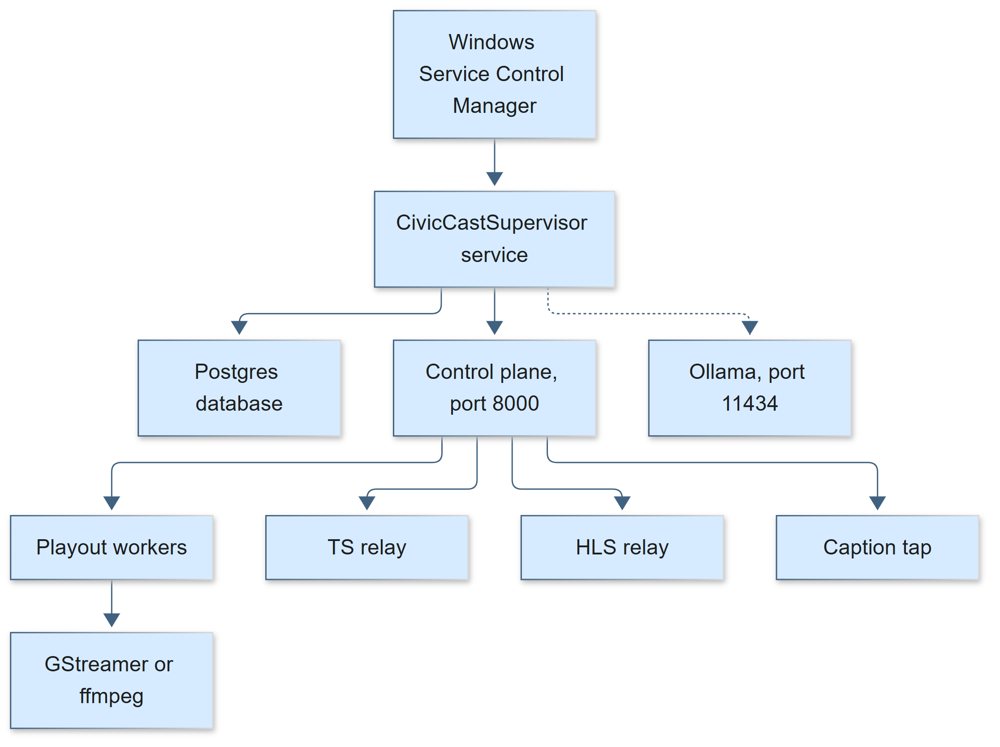{width=100%}

The supervisor itself starts only three kinds of child, in this order: **Postgres** first, then the **control plane**, then **Ollama** if it is present. The control plane is the CivicCast application (a Python web service). It listens on `127.0.0.1` port 8000 and runs the playout workers, the transport-stream relay, the HLS relay and the caption tap itself. Those are not separate Windows services and you do not manage them individually.

| Piece | What it is | Who starts it | Notes |
| --- | --- | --- | --- |
| Postgres | The station database | Supervisor | Listens on `127.0.0.1` only. Uses the first free port of 5432, 5433, 5434, 5435, 5544. Password logins only (`scram-sha-256`), no TLS. |
| Control plane | The CivicCast application and its web API | Supervisor | `python -I -u -m uvicorn civiccast.app:create_app --factory --host 127.0.0.1 --port 8000`. The host is fixed to `127.0.0.1` in code. |
| Ollama | The local AI model server used for summaries and similar tasks | Supervisor | Optional. Started only when both `dependencies\ollama\ollama.exe` and a model store with a `manifests` folder exist. Listens on `127.0.0.1:11434`. When skipped, it shows as `stopped` with a reason, and the supervisor re-checks every 60 seconds. |
| Playout workers | The processes that put your channel on the air | Control plane | The playout engine is GStreamer by default. The older ffmpeg concatenation engine is used only when `CIVICCAST_EGRESS_ENGINE` selects it. |
| TS relay | Sends a transport stream (for a headend encoder) | Control plane | Uses TSDuck (`tsp.exe`). Automatic mode runs only when `tsp` is present. |
| HLS relay | Sends a web stream | Control plane | Supervised `ffmpeg` process. |
| Caption tap | Listens to the channel audio for live captions | Control plane | Runs inside the control plane. Live captions are off by default; `CIVICCAST_CAPTION_TAP=off` forces them off. |

If CivicCast finds another CivicCast runtime active on the same computer (the older WSL-based product), the supervisor refuses to start the station and reports `blocked_wsl_active`. See [If it did not work](#ch-operations-did-not-work).

#### Supervisor states

The supervisor keeps one of seven states internally. In testing we could not confirm that any beta.10 screen or command prints the state name: the **Readiness** screen is not documented as showing it, and the supervisor's control pipe, which reports it, has no command-line client. Use `/health`, `civiccast runtime status` and `supervisor.log` to see the effects described below.

| State | Meaning |
| --- | --- |
| `starting` | Children are being started in order. |
| `ready` | Postgres and the control plane are up and the control plane answered its health check. |
| `degraded` | Something is wrong but the supervisor is still running: a child is failing to stay up, or a restart storm was detected (see below). |
| `blocked_wsl_active` | The dual-runtime guard found the older WSL runtime active and refused to start. |
| `blocked_probe_unavailable` | The guard could not tell whether the older runtime is active and refused to start. |
| `maintenance` | The control plane is running in maintenance mode (no workers, no changes). |
| `stopping` | A stop was requested and children are being shut down. |

#### How the supervisor restarts things

- A child that exits is restarted after a delay that starts at 1 second and doubles up to 30 seconds, with about plus or minus 20 percent random jitter.
- A restart storm is 5 or more restarts inside 600 seconds. The supervisor then reports `degraded` and raises an alert of kind `service-down` from source `supervisor`.
- Readiness budgets at start: Postgres 60 seconds, control plane 180 seconds (with a rule that the control plane is declared stalled if it makes no CPU progress for 60 seconds), Ollama 60 seconds.
- A normal stop gives each child 15 seconds, then force-terminates it. Postgres is stopped with `pg_ctl stop -m fast`. The control plane is stopped by a console break signal so it can drain cleanly. A Windows Job Object kills every child if the supervisor itself dies.
- A stop watchdog forces the supervisor to exit 150 seconds after a stop begins (`CIVICCAST_SUPERVISOR_STOP_WATCHDOG_SECONDS`; a value of 0 or less disables it). When it fires it reports the service as stopped and writes an entry to the Windows Event Log.
- After 3 consecutive identical start failures the supervisor writes `C:\ProgramData\CivicCast\STATION-START-FAILED.md` describing the failure. The file is removed on the next good start.

### Start, stop and restart the service

The supervisor has an internal control pipe, but beta.10 has no command-line tool that uses it. Operate the service with Windows itself.

1. Open an elevated PowerShell window.
2. Check the current state: `sc.exe query CivicCastSupervisor`
3. To start it: `sc.exe start CivicCastSupervisor`
4. To stop it: `sc.exe stop CivicCastSupervisor`
5. To restart it, stop it, wait until `sc.exe query CivicCastSupervisor` shows `STOPPED`, then start it.

You can do the same in the Windows **Services** app (`services.msc`). After a start, allow up to about three minutes for the control plane to become ready (its readiness budget is 180 seconds), then check health as described below.

> **Warning:** Stopping or restarting the service stops every playout worker and takes every channel off the air. Do it between meetings. A stop can take up to about 150 seconds in the worst case (the watchdog above).

> **Tip:** `sc.exe` error 1061 means the service cannot accept the command right now (typically a start or stop is still in progress); error 1062 means the service is not running. Neither needs action beyond waiting or starting it.

#### Set environment variables for the service

CivicCast reads many settings from environment variables (the full list is in [Appendix C](#app-settings)). The service reads them from the standard Windows service `Environment` value, which is a multi-string value named `Environment` under `HKLM\SYSTEM\CurrentControlSet\Services\CivicCastSupervisor`. Each line is `NAME=value`. The children inherit them.

1. Open `regedit` as Administrator and go to that key.
2. Create or edit the `Environment` value (type **Multi-String Value**). Put one `NAME=value` per line.
3. Restart the service.

> **Known issue (beta.10):** In testing we could not confirm that the installer creates this `Environment` value. Code comments say a station sets values there, but the installer source we read does not write it. Treat it as a value you create yourself, and check it again after every upgrade.

> **Note:** The database address comes from the registry value `HKLM\SOFTWARE\CivicCast\Native\DatabaseUrl`, which only SYSTEM and Administrators can read. The supervisor copies it into the control plane's environment unless `DATABASE_URL` is already set in the service environment, in which case the environment wins. `supervisor.log` records which source won.

### Read the logs

All logs are in `C:\ProgramData\CivicCast\logs`.

| File | What is in it | Rotation |
| --- | --- | --- |
| `supervisor.log` | The supervisor: state changes, child starts, exits, restarts, readiness checks, the stop watchdog. The first line is `supervisor logging initialized` with the process id and the log destinations. | 10 MiB per file, 10 files kept. Each record is flushed to disk. |
| `control_plane-app.log` | The CivicCast application's own log (playout, schedule, captions, alerts). | 10 MiB per file, 10 files kept. Written only when the control plane runs under the supervisor. |
| `control_plane.log` | Raw standard output and error of the control plane, including the web server's access log (one line per request). | None. The file is opened for append and grows without limit. |
| `postgres.log` | Postgres server messages. | None (the Postgres log collector is switched off). |
| `postgres-launcher.log` | Short-lived output from starting Postgres. | None. |
| `ollama.log` | Output of the Ollama child, when it runs. | None. |

The supervisor also writes some failures (for example the stop watchdog) to the Windows **Application** event log. In testing we could not confirm the source name Windows displays for them.

Other logs you may need:

- `C:\ProgramData\CivicCast\install-progress.log`: the installer's record of a first install.
- `C:\ProgramData\CivicCast\upgrade\upgrade-engine.log`, `upgrade-journal.json` and `UPGRADE-RECOVERY.md`: the upgrade engine, described below.
- `C:\ProgramData\CivicCast\data\caption-tap\caption-retention-audit.jsonl`: one line per caption file the retention sweeper deleted (no rotation).

> **Known issue (beta.10):** `control_plane.log` (every web request) and `postgres.log` are never rotated. On a busy station they grow forever. Check their size weekly and, when the service is stopped, move or truncate them. We could not confirm that Windows or the installer trims them.

To follow a log live:

```powershell
Get-Content C:\ProgramData\CivicCast\logs\supervisor.log -Tail 50 -Wait
```

### Check that the station is healthy

#### The health endpoint

The control plane answers `GET /health` (also at `/api/health`) with no sign-in. Run it from the station computer:

```powershell
Invoke-RestMethod http://127.0.0.1:8000/health
```

The HTTP status is 200 whenever the control plane is alive, even if it is unhealthy. Read the body, not the status code. The fields are:

| Field | Values | Meaning |
| --- | --- | --- |
| `status` | `healthy`, `degraded` | `healthy` only when the database schema is current. |
| `version` | text | The running CivicCast version. |
| `schema` | `current`, `behind`, `not-configured`, `unknown` | Whether the database matches this version of the program. |
| `schema_db_revision`, `schema_expected_head` | text | The database's schema revision and the one this version expects. They differ when `schema` is `behind`. |
| `mode` | `normal`, `maintenance` | In `maintenance` the body also shows `workers_started: false` and `mutating_disabled: true`. |

> **Warning:** A monitoring tool that only checks for HTTP 200 will report a degraded or maintenance-mode station as fine. Alert on `status` not equal to `healthy`, and on `mode` not equal to `normal`.

Two more public endpoints give small answers: `GET /api/version` and `GET /api/hardware`.

#### The Readiness screen

Signed in, open **Readiness** (page heading **Safe to broadcast**, section **System Health**). It is the station's own summary of whether it can go on air. Its controls are described in [Chapter 8](#ch-something-wrong). The same data is available to staff as `GET /api/staff/runtime-safe-to-air` (any of the five roles), `GET /api/staff/installer/system-health` and `GET /api/staff/system-resources` (see [Chapter 15](#ch-integrations) for calling the API).

#### Alerts

The station raises alerts for conditions including: off-air, encoder death, server crash, schema drift, relay blocked, compliance probe failure, missing media, commit failure, takeover stuck for 2 hours, AI runtime down, low disk, clock skew, database unreachable, service down, self-test failure, scheduled-recording failure or dropout, as-run outbox degraded, channel-automation failure, caption tier degraded, remote-contribution problems, and emergency-alert source unavailable.

> **Known issue (beta.10):** A fresh install seeds every alert rule with no destinations attached. With no destination, the evaluator records a "suppressed" delivery row and sends nothing. The rule editor in the console never sends destinations. To make an e-mail or SMS alert arrive, a Setup admin must create a destination with `POST /api/staff/alert-channels` and attach it to each rule with `PUT /api/staff/alert-rules/{rule_id}` (field `channel_ids`). Until you have done that and tested it, assume no alert will reach you and monitor from outside the station as well: poll `/health` and the Windows service state with your own monitoring tool.

#### Self-tests

The station runs its own checks on a schedule. By default (the code's default settings) the **daily** self-test runs at 02:00 and the **weekly** self-test on Sunday at 03:00, both by the station computer's own Windows clock and time zone. If the service was down at that moment, the missed run happens after it comes back up.

- **Daily:** the install-time readiness path, a short playout continuity proof to a file, a backup-destination write/read/delete probe, and a ping of the AI runtime. The AI ping is advisory: if the optional AI runtime is down it warns but does not fail the box.
- **Weekly:** everything in the daily test plus a restore rehearsal, an SRT continuity proof, a TSDuck compliance probe (advisory) and an alert-channel check (advisory). A check whose tooling is not installed is left out, not recorded as a pass.

A non-passing result raises a `self-test-fail` warning and clears itself on the next clean run. Staff can read results at `GET /api/staff/self-tests` and, with the Setup admin or Support admin role, start one with `POST /api/staff/self-tests/run?kind=daily` or `kind=weekly`.

> **Note:** The weekly restore rehearsal is a rehearsal, not a backup. It does not replace the backup work later in this chapter.

#### Command-line checks

These need the CivicCast command-line program. Use the full path because the installer does not add it to PATH:

```powershell
$cc = "<INSTDIR>\runtime\Lib\site-packages\bin\civiccast.exe"
& $cc doctor
& $cc doctor --disk C:\ProgramData\CivicCast
& $cc runtime status
```

`civiccast doctor` accepts `--json`, `--disk <path>` (the folder whose drive is checked; it takes a path, and without it the check uses the home folder of the account running the command) and `--profile`. `civiccast runtime status` accepts `--json` and reports which runtime (native or the older WSL one) is active. The other commands used by operators are listed in [Appendix A](#app-cli).

If `civiccast.exe` is missing, `<INSTDIR>\runtime\python.exe -m civiccast.cli` runs the same program.

### Do the daily and weekly routine

This routine uses only checks that exist in beta.10.

#### Each day (about five minutes)

1. Run `Invoke-RestMethod http://127.0.0.1:8000/health` on the station. Confirm `status` is `healthy` and `mode` is `normal`.
2. Run `sc.exe query CivicCastSupervisor`. Confirm `RUNNING`.
3. Open **Readiness** in the console. Confirm it says the station is safe to broadcast. Read any warning in full.
4. Look at the last lines of `C:\ProgramData\CivicCast\logs\supervisor.log` for `degraded`, repeated restarts or `service-down`.
5. Check that `C:\ProgramData\CivicCast\STATION-START-FAILED.md` does not exist.
6. Check free space on the drive that holds `C:\ProgramData\CivicCast`.
7. Read the result of last night's daily self-test (`GET /api/staff/self-tests`, or the Readiness screen).

#### Each week

1. Read the result of the Sunday weekly self-test.
2. Check the size of `control_plane.log`, `postgres.log` and `ollama.log` (they are not rotated).
3. Check the size of `C:\ProgramData\CivicCast\data\caption-tap` and `C:\ProgramData\CivicCast\data\egress` (see the next section).
4. Run `civiccast egress trim-health --older-than-days 30 --dry-run` and decide whether to trim (see the next section).
5. Run the disaster-recovery drill (see below) at least when you have changed anything, and keep the report.
6. Copy the things the drill does not back up (see below) to storage that is not on this computer.

### Manage disk and cache

#### Where space goes

| Folder | What it holds | Grows? | Trimmed automatically? |
| --- | --- | --- | --- |
| `C:\ProgramData\CivicCast\data\pgdata` | The Postgres database | With use | No |
| `C:\ProgramData\CivicCast\data\uploads` | Uploaded media | With use | No |
| `C:\ProgramData\CivicCast\data\egress` | Playout working files, including `conform-cache` | Yes | Yes, see below |
| `C:\ProgramData\CivicCast\data\caption-tap` | Raw caption audio chunks, evidence audio, `active.vtt` | Yes | Partly, see below |
| `C:\ProgramData\CivicCast\logs` | Logs | Yes | Only the rotated logs |
| `C:\ProgramData\CivicCast\upgrade` | Upgrade engine log, journal and pre-upgrade backups | Per upgrade | No |

#### The conform cache

The **conform cache** is a folder where CivicCast keeps ready-to-play copies of your videos, converted to the channel's format. It is at `C:\ProgramData\CivicCast\data\egress\conform-cache`.

- **Size cap:** `CIVICCAST_CONFORM_CACHE_GB`, default 60 (gigabytes). A value of 0 or less disables the cache. When the cache is full, the oldest copies are removed first, and a copy that is used is refreshed so it is not the oldest.
- **Plan folders:** each channel's prepared playout plan folders are limited to the 3 most recent per channel, within a budget of `CIVICCAST_PREPARED_PLAN_DIR_BUDGET_GB` (default 5 gigabytes), and a folder younger than 24 hours is not removed. Leftover scratch files are removed after 1 hour.
- **Too small a cap:** if one video's conformed copy cannot fit in the budget, preparation of that video fails with: `Conform-cache budget too small to retain '<name>'; increase CIVICCAST_CONFORM_CACHE_GB or exclude this asset.` Raise `CIVICCAST_CONFORM_CACHE_GB` in the service environment and restart.
- **Failed background conforms:** after a failed or timed-out background (warm-up) conform the station waits 6 hours before trying that asset again. The time allowed for a background conform scales with the length of the asset and is capped at 7,200 seconds.

Measured evidence: in the 8-hour lab run on an earlier internal build (three channels), the cache reached 46 GB of the 60 GB cap on a drive with 810 GB free, and the longest single preparation took 389 seconds. That is one lab run, not a sizing rule. Size the cap from your own library: it should hold the conformed copies of everything you expect to air in the next several days.

> **Known issue (beta.10):** There is no free-space guard on the conform cache. The 60 GB figure is a cap on the cache, not a promise that the disk has that much room. Make sure the drive has more free space than the cap plus the database, uploads and logs, and watch the **low disk** alert (which, remember, may have no destination).

#### Playout health records

The playout engine stores health telemetry in the database. Nothing trims it automatically. The only trim is the command below. It needs `DATABASE_URL` set (see the next section for how to read it) and accepts `--dry-run` and `--json`:

```powershell
& $cc egress trim-health --older-than-days 30 --dry-run
& $cc egress trim-health --older-than-days 30
```

#### Caption data

The caption retention sweeper runs every 60 seconds and works by age only:

- Raw caption audio chunks become eligible for deletion 24 hours after they were created, but only when their transcript evidence is verified or no window can cover them.
- Evidence audio for a resolved review item is deleted 90 days after resolution. Pending review items never expire.
- Analytics events are kept up to 366 days (`CIVICCAST_ANALYTICS_RETENTION_DAYS`, allowed range 1 to 366).

> **Known issue (beta.10):** The audit of beta.10 found that caption data can still grow without a limit: review rows and evidence are not pruned, raw chunks that no window covers are kept (roughly 160 KB per 5 seconds of audio per channel, which is about 3 GB per channel per day if most chunks are uncovered), `active.vtt` grows, and the quarantine and collision folders are never pruned. If you turn live captions on, add `C:\ProgramData\CivicCast\data\caption-tap` to your weekly size check.

### Back up and restore

#### What exists in beta.10

> **Known issue (beta.10):** The CivicCast command line has no `backup` command and no `restore` command, even though a comment at the top of the command-line source mentions them. The only backup-related command is `civiccast dr run-drill`. It makes a real backup and proves that the backup can be restored into a throwaway database, but it does not restore the live station. There is no scheduled backup in beta.10: the console's **Backup destination** and **Verify backup** buttons only write and delete a small test file, and the station never records a "last backup" time.

What you can rely on:

- `civiccast dr run-drill` (backup plus restore proof plus crash drill).
- The upgrade engine's own backup, taken automatically before each upgrade to `C:\ProgramData\CivicCast\upgrade\backups\pre-<new_version>` (see below).
- Postgres's own tools, which are in `<INSTDIR>\packs\native-server-binaries\payload\bin` (`pg_dump`, `pg_dumpall`, `pg_restore`, `psql`, `pg_ctl`).

#### Run the disaster-recovery drill

The drill command is:

```powershell
civiccast dr run-drill --out <dir> [--backup-dir <dir>] [--work-dir <dir>] [--database-url <url>] [--media-root <dir>]
```

| Option | Meaning |
| --- | --- |
| `--out` | Required. The folder the report is written to (`dr-drill-report.md` and `dr-drill-report.json`). |
| `--backup-dir` | Where the backup goes. Default `<out>\backup`. |
| `--work-dir` | Scratch folder for the restore and crash drills. Default `<out>\work`. |
| `--database-url` | The database to drill. Default: the `DATABASE_URL` environment variable. Only `sqlite://` and `postgresql://` addresses are accepted. |
| `--media-root` | A media folder to list in the backup manifest. Optional. |

The drill does the following:

1. **Backup.** It writes `database.pgdump` (`pg_dump --format custom` with a snapshot), `globals.sql` (`pg_dumpall --globals-only`) and `manifest.json` (table row counts and SHA-256 checksums). With `--media-root` it also records every media file's path, size and a hash of the first and last 64 KiB. It does not copy the media files.
2. **Restore.** It restores the backup into a throwaway database named `civiccast_drill_restore` on the same Postgres server (dropping and recreating that name), and it refuses to drop the production database.
3. **Verify.** It checks row counts, checksums, the schema revision, that the application can read the restored data, extensions, sequences and grants.
4. **Crash drill.** It starts a stand-in process and checks that the crash-recovery logic restarts it. This uses a stand-in and an in-memory store, and does not touch your real channels.

It exits 0 if everything passed, 1 if a drill failed, and 2 if there is no `DATABASE_URL` or the address scheme is unsupported (`No DATABASE_URL configured; pass --database-url or set $DATABASE_URL.` or `Unsupported DATABASE_URL scheme for the DR drill; use sqlite:// or postgresql://.`). Read the report: the code itself says media is a manifest and not a copy, the crash drill covers only automatic restart of a worker, and there is no hot failover.

> **Known issue (beta.10):** From the code, the drill calls `pg_dump`, `pg_dumpall`, `pg_restore` and `psql` by bare name, so Windows must find them through PATH. The installer does not add them to PATH, and the service adds only the ffmpeg folder. Run from a normal prompt, the drill will most likely fail with: `pg_dump could not be started: the executable "pg_dump" is a bare command name that could not be resolved through PATH.` The console's **Run real database restore drill** button calls the same code, and we could not confirm that it works on a native station. The upgrade engine does not have this problem, because it passes full paths. Use the workaround below.

Workaround, from an elevated PowerShell window on the station:

```powershell
$inst = "<INSTDIR>"
$env:PATH = "$inst\packs\native-server-binaries\payload\bin;$env:PATH"
$env:DATABASE_URL = (Get-ItemProperty 'HKLM:\SOFTWARE\CivicCast\Native').DatabaseUrl
& "$inst\runtime\Lib\site-packages\bin\civiccast.exe" dr run-drill --out D:\civiccast-dr\2026-10-05 --media-root D:\civiccast-media
Remove-Item Env:\DATABASE_URL
```

> **Warning:** The database address contains the database password. Set it only in the window you are using, never write it to a file, a script or a support ticket, and clear it afterwards as shown.

The `--out` folder must have room for a full copy of the database. Choose a drive that is not the station's data drive when you can.

#### What is and is not backed up

The drill's backup holds the database only. Anything else you need after a disaster must be copied by you.

| Item | In the drill backup? | Where it is | If lost |
| --- | --- | --- | --- |
| Database (schedule, asset records, staff token records, alert rules, analytics, captions text, audit trail) | Yes | Postgres under `data\pgdata` | Restore from backup |
| Media files | No (manifest only, and only with `--media-root`) | `data\uploads` and any media folders you configured | Re-import from your original files |
| `station-state.json` (first admin account, recovery-code hashes, console sign-in sessions) | No | Under `%LOCALAPPDATA%\CivicCast` of the service account, or the path in `CIVICCAST_STATION_STATE_PATH`. In testing we could not confirm the exact folder for LocalSystem. | Run First Setup again or use a recovery code (see [Chapter 13](#ch-security)) |
| `subscribe-secrets.json` (encryption key for subscribers' e-mail addresses) | No | `CIVICCAST_SUBSCRIBE_SECRETS_FILE`, or `CIVICCAST_CONFIG_DIR`, or `~\.civiccast\`; may be replaced by `CIVICCAST_SUBSCRIBE_TOKEN_SECRET` and `CIVICCAST_SUBSCRIBE_ENCRYPTION_KEY` | A restored database whose subscriber e-mail addresses were encrypted with a lost key cannot decrypt them |
| Alert credentials file | No | `CIVICCAST_ALERT_CREDENTIALS_FILE` or `CIVICCAST_CONFIG_DIR` | Re-enter destinations and credentials |
| Internal certificates (`CIVICCAST_CERT_ROOT`) | No | Default `~\.civiccast\certs` | Re-issued with `civiccast cert rotate` |
| Registry value `DatabaseUrl` and the service `Environment` value | No | `HKLM` | Export both keys with `reg export` |
| Program, packs, models | No | `<INSTDIR>` | Reinstall |
| Raw caption audio, evidence audio | No | `data\caption-tap` | Not recoverable |
| Conform cache | No | `data\egress\conform-cache` | Rebuilt automatically from the media |

> **Tip:** Put the registry export, `station-state.json`, `subscribe-secrets.json`, the alert credentials file and the `Environment` value in the same off-computer location as your database backup, and encrypt them: they contain secrets.

#### Restore into the live station

Beta.10 has no supported command that restores into the live database. The only code path that does is the upgrade engine's automatic rollback after a failed upgrade. If you must restore by hand, you are using Postgres's own tools on a backup that the drill wrote. We have not run a manual live restore, so this chapter gives no step-by-step procedure for it. Rehearse the restore into a spare computer or a throwaway database first, and have your own written procedure before you need it.

### Recover from a disaster

The drill does not prove that you can rebuild a station from nothing. Plan on this order, and rehearse it:

1. Install CivicCast on the replacement computer from the full kit. Beta.10's proven install path is a clean install; see [Chapter 10](#ch-installing).
2. Stop the service.
3. Restore the database from your off-computer copy using Postgres's tools, as above.
4. Restore the registry values, `station-state.json`, `subscribe-secrets.json` and the alert credentials file.
5. Copy the media back.
6. Start the service and check `/health` and Readiness.
7. If you cannot sign in, use a recovery code at `/setup` ([Chapter 13](#ch-security)).

### Update and upgrade

An upgrade runs the new `setup.exe` over the existing install. The installer includes an upgrade engine, which acts in this order:

1. It takes a verified database backup to `C:\ProgramData\CivicCast\upgrade\backups\pre-<new_version>`.
2. It upgrades the program and migrates the database.
3. If a step fails, it rolls back automatically, restoring the database from that backup in a single transaction.

It writes `upgrade-engine.log`, `upgrade-journal.json` and, if a rollback itself fails, `UPGRADE-RECOVERY.md`, all under `C:\ProgramData\CivicCast\upgrade`. Setup's exit codes tell you what happened:

| Setup exit | Engine code | Meaning | What to do |
| --- | --- | --- | --- |
| 0 | 0 | Upgrade committed | Check `/health` |
| 124 | 10 | Upgrade failed and was rolled back | Read `upgrade-engine.log`. The installer stops the service and sets it to manual start on purpose, because the new program files are already in place over the old, unmigrated database. Do not set it back to automatic by hand; fix the cause and run setup again, and a successful run restores automatic start. |
| continue | 11 | Fresh install, nothing to upgrade | None |
| continue | 12 | Same version already installed | None |
| 129 | 13 | The installer is older than the installed version | Use the newer installer |
| 113 | 20 | Rollback failed | Read `UPGRADE-RECOVERY.md` first |
| 114 | 30 | A migration cannot be restored | Read the engine log; do not retry blindly |
| 128 | 31 | A stale journal from an earlier attempt exists | Move `upgrade-journal.json` aside; do not delete it |
| 115 | other | Other failure | Read the engine log |

Related provisioning exits: 75 maps to setup exit 116, 87 to 135 (another CivicCast product or the WSL runtime is present), 85 to 127.

> **Known issue (beta.10):** The upgrade lane was not run for beta.10, and an upgrade over an earlier release is not proven. Before you upgrade a station that is on the air, stop the service, copy the data folder, `HKLM\SOFTWARE\CivicCast` and the files listed in the backup table to another computer, and schedule a window in which you can reinstall if needed.

> **Warning:** Do not upgrade during a meeting. The upgrade stops the service and takes every channel off the air.

After any upgrade, run through the daily routine, then run the drill.

### Capacity guidance

CivicCast's own evidence supports only these figures. Everything else is not measured, so we do not give it.

- The cache cap default is 60 GB. A 3-channel, 8-hour lab run used 46 GB of it.
- The longest conform in that run took 389 seconds.
- That run used a single service process and had 0 holes in 50 program changes.
- Known limits from the same evidence: live-caption audio can be dropped under heavy load (13 catch-up discards in 8 hours), there were two program-change aborts that recovered themselves, and one single-frame drop. DeckLink SDI output and a real cable headend are unproven. It is not a 24-hour or 72-hour soak.

Hardware sizing (CPU, memory, number of channels) is in [Chapter 9](#ch-planning) and is not repeated here.

> **Known issue (beta.10):** The program-change watchdog has a gap (audit finding A-001), so a program change can be missed. Compare the as-run log with the schedule weekly. The audit also found that tests are red in about 110 places and that the loudness ride can time out (A-004). These are recorded in [Chapter 13](#ch-security) under known limitations.

### If it did not work {#ch-operations-did-not-work}

| What you see | Cause | What to do |
| --- | --- | --- |
| `sc.exe start` returns but `/health` never answers | Control plane still starting, or failed | Wait up to 3 minutes. Then read the last 100 lines of `supervisor.log` and `control_plane-app.log`. |
| `STATION-START-FAILED.md` appears | Three identical start failures in a row | Read the file. It names the failing child and error. Fix it, then start the service. |
| State `blocked_wsl_active` | The older WSL-based runtime is active on this computer | Run `civiccast runtime status` to see which runtime is active. The dual-runtime guard refuses to start the native station while the older runtime is active; see [Chapter 10](#ch-installing). |
| State `blocked_probe_unavailable` | The guard could not tell whether the WSL runtime is active | Run `civiccast runtime probe` and read its answer. |
| `/health` says `degraded`, `schema: behind` | Database older than the program | Do not edit the database. Check whether an upgrade stopped partway; read `upgrade-engine.log`. |
| `/health` says `mode: maintenance` | The control plane started without workers | Read `control_plane-app.log`. No channel plays in this mode. |
| `service-down` alert | Restart storm: 5 or more restarts in 10 minutes | Read `supervisor.log` for the repeating child and its exit reason. |
| `Conform-cache budget too small to retain '<name>'...` | The cache cap is smaller than that one file's copy | Raise `CIVICCAST_CONFORM_CACHE_GB` and restart. |
| `pg_dump could not be started: the executable "pg_dump" is a bare command name...` | PATH defect | Use the drill workaround above. |
| Disk full | Cache, logs, caption data or uploads grew | Stop the service, free space (logs first), then start. Do not delete files from `pgdata`. |
| Ollama shows `stopped` | `ollama.exe` or the model store is missing | The supervisor skips Ollama when its program or model store is absent. Nothing else depends on it. |
| Setup exit 135 during install | Another CivicCast product or the WSL runtime is present | See [Chapter 10](#ch-installing). |

### Related

- [Planning your station](#ch-planning)
- [Installing, first run, upgrading, uninstalling](#ch-installing)
- [Configuring the station](#ch-configuration)
- [Security and privacy](#ch-security)
- [Troubleshooting matrix](#ch-troubleshooting)
- [When something looks wrong](#ch-something-wrong)
- [Appendix A: command-line reference](#app-cli), [Appendix C: settings](#app-settings), [Appendix H: measured evidence](#app-evidence)

<!-- SOURCES: civiccast/native/supervisor/config.py, children.py, core.py, service.py, service_host.py, service_env.py, states.py, start_failure_marker.py, install_layout.py, admin.py, authz.py; civiccast/apps/installer/src-tauri/src/native_service_registration.rs (service registration, failure actions); civiccast/app.py (/health body); civiccast/native/station_runtime.py; civiccast/native/provision/conf.py, models.py (postgresql.conf, DatabaseUrl); civiccast/alerting/self_test.py, worker.py (schedule 02:00 daily, Sunday 03:00 weekly), evaluator.py, models.py, router.py; civiccast/egress/preparer.py (conform cache), env_vars.py, automation.py; civiccast/captions/retention.py; civiccast/analytics/store.py; civiccast/dr/backup.py, report.py, crash_drill.py, __init__.py; civiccast/cli.py:2689-2745 (dr run-drill), egress trim-health; civiccast/installer/service.py:1380-1530 (run_dr_drill); civiccast/native/upgrade/__main__.py, orchestrator.py, seams.py; ops/docs-sprint/inventory/generated/cli.md, generated/api.md, screens/health.md, installer-nsis-upgrade-database.md, installer-install-layout.md; docs/releases/v1.0.0-beta.10-verification.md; ops/beta10-oversight/audits/audit-lite-whole-repo-beta10-2026-10-02.md (A-001, A-004, A-008, B-003, B-004, B-005, B-009, C-001) -->

\newpage

## Security and privacy {#ch-security}

This chapter is for the IT person responsible for who can use CivicCast, what the station exposes to the network, what it records about residents, and how far the software can be trusted in its beta.10 form. It covers sign-in and roles, staff access tokens, the first-admin and recovery model, network exposure, reverse proxies and TLS, the public and staff parts of the web API, subscriber and viewer privacy, data retention, signing and checksums, and a plain list of the known security limitations of this beta with what to do about each one.

Beta.10 was published on 2026-10-02 as a GitHub pre-release (a beta candidate). Its pre-release audit (3 Critical, 36 Major, 35 Minor and 8 Nit findings, no release blockers) concluded that it can ship as a labelled beta candidate. That is not a statement that the station is hardened for the open internet. It is not.

### Before you start

- You need Administrator rights on the station computer, and the Setup admin role in the console for the staff-token API calls.
- Most commands below need the CivicCast command-line program. The installer does not add it to PATH, so use the full path: `<INSTDIR>\runtime\Lib\site-packages\bin\civiccast.exe` (`<INSTDIR>` is the folder CivicCast was installed to). In this chapter `$cc` stands for that path.
- Token commands need the database address in the `DATABASE_URL` environment variable. Read it from the registry value `HKLM\SOFTWARE\CivicCast\Native\DatabaseUrl` in an elevated PowerShell window, use it only in that window, and never write it to a file or a ticket, because it contains the database password:

```powershell
$cc = "<INSTDIR>\runtime\Lib\site-packages\bin\civiccast.exe"
$env:DATABASE_URL = (Get-ItemProperty 'HKLM:\SOFTWARE\CivicCast\Native').DatabaseUrl
```

### The security model in one page

- The station is built to be used **on the station computer itself**. The web application and the database both listen on `127.0.0.1` only (verified below). Nothing in the program listens for other computers on its own.
- Anyone who can sign in to the console is a **staff user** with one or more of five roles.
- Every staff action in the web API needs an `Authorization: Bearer <token>` header. There is no username-and-password login for the API itself.
- Residents use the **public** parts of the API, which need no sign-in.
- The Windows service runs as LocalSystem (the most powerful local account). This was accepted by the owner (decision record ADR 0021) and is listed in the limitations below.

### Roles

CivicCast has five staff roles. A token carries one or more of them. The details of which screens each role opens are in [Appendix F](#app-roles) and in [Chapter 2](#ch-signing-in).

| Role id | Label in the console |
| --- | --- |
| `setup_admin` | Setup admin |
| `meeting_operator` | Meeting operator |
| `records_clerk` | Records clerk |
| `publish_operator` | Publish operator |
| `support_admin` | Support admin |

Rules the code enforces:

- The scope words `admin` and `operator` are aliases that grant all five roles.
- A token with no scopes has no roles.
- A request without a token gets HTTP 401 with `Staff identity is required for this action.`
- A request with a token that lacks the needed role gets HTTP 403 with `This action requires one of these CivicCast roles: <role ids>.`
- The console cannot grant roles to people. Roles are decided when a token is issued.

### Manage staff tokens

A **staff token** is a long secret string that a program or script sends to prove it is a particular staff member with particular roles. There are three kinds.

| Kind | Looks like | Where it is stored | How you retire it |
| --- | --- | --- | --- |
| Console token | Created when someone signs in at the console | `station-state.json`, as a salted hash | Sign out, or the station evicts it (see below) |
| Database token | `ccst_<id>_<secret>` | Database. Only a PBKDF2-SHA256 hash (210,000 iterations) plus a SHA-256 fingerprint is kept; the secret is shown once. | `civiccast token revoke` or `rotate` |
| Environment token | `ccenv1_` followed by 43 characters | The `CIVICCAST_STAFF_TOKENS` environment variable | Remove it from the variable and restart the service |

#### Issue a database token

1. Open an elevated PowerShell window and set `$cc` and `DATABASE_URL` as shown above.
2. Run:

```powershell
& $cc token issue --operator-id clerk-jones --display-name "Pat Jones" --scopes records_clerk,publish_operator --json
```

`--operator-id` and `--display-name` are required. `--scopes` takes a comma-separated list of role ids or the aliases above; its default is `operator`, which is all five roles. Give people only the roles they need. `--save-keyring` stores the token in the Windows credential store under the service name `civiccast.staff-token`. `--json` prints machine-readable output.

3. Copy the secret that is printed. It is printed once and cannot be shown again. Deliver it to its owner through a channel you trust, not through the same ticket that names the person.
4. Check it works. In PowerShell, on the station:

```powershell
Invoke-RestMethod http://127.0.0.1:8000/api/staff/auth/me -Headers @{ Authorization = "Bearer <the token>" }
```

You should see the operator's name and roles.

#### List, revoke and rotate

- `& $cc token list` shows token metadata (never secrets). Add `--json` for scripts.
- `& $cc token revoke <token_id> --reason "left the clerk's office"` makes the token fail from then on. `--reason` defaults to `operator-requested` and is saved in the audit record. `<token_id>` is the public id shown by `token list`.
- `& $cc token rotate <token_id>` revokes that token and issues a replacement for the same operator with the same scopes. It prints the new secret once. `--save-keyring` saves it to the credential store.

The database records audit events for `issued`, `used`, `revoked` and `rotated`.

> **Known issue (beta.10):** A database token issued before the fingerprint was introduced cannot be matched. If `token list` shows a token that no longer authenticates after an upgrade, rotate it.

#### Environment tokens

Generate one with `& $cc token generate-env`. To use it, add it to `CIVICCAST_STAFF_TOKENS` in the service environment (see [Chapter 12](#ch-operations)) in the form `token:operator_id:Display Name:role[,role]`, with several entries separated by semicolons (`;`), and restart the service. Roles are required: an entry with no role stops the station from starting.

> **Known issue (beta.10):** On a station that has its database (every native station), the code checks database and console tokens first and accepts an environment token only when `CIVICCAST_STAFF_TOKENS_FALLBACK_WITH_DB=1` is also set in the service environment. The code treats that as a recovery setting. Without it, an environment token is rejected with `Invalid staff bearer token.` Prefer database tokens (`token issue`).

> **Warning:** The server cannot revoke an environment token. The console's **Sign out** only makes that browser forget it. To retire one, remove it from the variable and restart the service, which takes the channels off the air.

#### Failed attempts are limited

A wrong token counts against the client's address: 10 failures in 60 seconds by default (`CIVICCAST_AUTH_RATE_LIMIT` and `CIVICCAST_AUTH_RATE_LIMIT_WINDOW_SECONDS`). After that the server answers HTTP 429 with a `Retry-After` header, and the console shows `Too many failed attempts to authenticate with the staff API. Wait N seconds, then try again.` A request with no token at all does not count. A valid token still works while the limit is active. The counts live inside the running process and reset when it restarts. CivicCast's own code ignores forwarded-address headers, so it counts failures against the address the web server reports. The web server (uvicorn) is started with its default settings, which replace that address with the `X-Forwarded-For` value when the connection comes from `127.0.0.1`. In a test with uvicorn 0.47 (not the shipped 0.51.0) we saw exactly that. So behind a reverse proxy on the same computer, failures are counted against the proxy's address if the proxy sends no such header, and against the visitor's address if it does.

> **Known issue (beta.10):** The memory the limiter uses to remember addresses has no upper bound (audit finding B-010). It only matters if someone sends very many bad requests from very many addresses, which cannot happen if the staff API stays on loopback as this chapter advises.

### Understand sign-in, setup and recovery

#### First setup and the recovery kit

The first time the console is opened on the station computer it shows **First setup**. Creating the first admin there makes:

- the first-admin username and password (the password must have at least 12 characters), and
- a **recovery kit**: 8 one-time recovery codes.

The **Save kit** button downloads a plain-text file that contains the admin password and all 8 codes. The console blocks navigation and sign-out until the kit is confirmed.

> **Warning:** Treat the recovery kit like a master key. Print it and keep it in a locked drawer or a safe, or keep it in your password manager. Do not leave it in the Downloads folder, a shared drive or an e-mail.

Routine sign-in uses the admin username and password on the `/setup` page (**Admin sign-in**). If the password is lost, **Use recovery code** burns one of the 8 codes and sets a new password; it takes two clicks and warns you each time. The other browsers that are signed in stay signed in.

#### What the server enforces

- **Sign-in and setup only work from the station computer.** The routes under `/api/setup/*` check that the request came from the loopback address. A request from another computer gets HTTP 403 and the console shows **First setup can only be done from the station computer itself**. After setup is complete, most of these routes also require a staff token; only the signed-out view of the station state, sign-in (`login`) and recovery (`recover`) stay open to a request from the station computer.
- The station keeps up to **20** console sessions at once and evicts the oldest when a 21st is created. The evicted browser sees **You were signed out**. In testing we could not confirm that sessions expire by time.
- The two API calls `POST /api/staff/installer/sessions/revoke-others` and `POST /api/staff/installer/recovery-kit/regenerate` (Setup admin) end the other console sessions and make a new kit (new codes; the old codes stop working at once). The console has buttons for both: **Sign out other sessions** and **Regenerate recovery kit** in the Security card of the Station Profile screen, visible to the Setup admin role.
- To reset the first admin on purpose, the code requires `CIVICCAST_ALLOW_FIRST_ADMIN_RESET=1` in the service environment. Remove it afterward.

> **Known issue (beta.10):** The loopback test looks only at the address the connection came from. If you put a reverse proxy **on the same computer**, every request it forwards arrives from `127.0.0.1` and passes the test, including requests from the internet, unless the proxy sends an `X-Forwarded-For` header (the web server then substitutes that address; see "Failed attempts are limited"). Do not rely on that: many proxies send no such header unless told to. The code's own comment warns about this. If you use a proxy, it must refuse every path that begins with `/api/setup/`. Also, the loopback routes do not check the `Host` or `Origin` of a request (audit finding E-006), so a web page opened in a browser on the station computer could in principle talk to them through a DNS-rebinding trick during first setup. Do not browse the web from the station computer, and complete first setup before the computer is used for anything else.

### Know what the station exposes to the network

#### What listens, and where

| Service | Bind address | Port | Notes |
| --- | --- | --- | --- |
| Control plane (web API, console, portal) | `127.0.0.1` | 8000 | The address is fixed in code. There is no setting that changes it. |
| Postgres | `127.0.0.1` | first free of 5432, 5433, 5434, 5435, 5544 | Password logins only (`scram-sha-256`). No TLS. |
| Ollama | `127.0.0.1` | 11434 | Environment `OLLAMA_NO_CLOUD=1` is set for it. |

We searched the program for a wildcard bind (`0.0.0.0`) and found none. Both the installer text (`INSTALL-WINDOWS.md`) and the code say the console address is not reachable from another computer.

#### What the firewall rule opens

The installer adds a Windows Firewall rule named **CivicCast (Native) Portal/API (TCP 8000)**. It is an inbound allow rule for TCP port 8000, limited to the program `<INSTDIR>\runtime\python.exe`, enabled on **all** firewall profiles (domain, private and public) and with no restriction on the remote address.

> **Known issue (beta.10):** Today this rule exposes nothing, because nothing listens on 8000 except on `127.0.0.1`. But it is broader than the station needs (audit finding E-009). If a setting or a later version ever changed the bind address, port 8000 would be open to every network the computer joins. If you want the rule to say what you mean, disable it in **Windows Defender Firewall with Advanced Security** and check that the station still works from the station computer. We have not tested a station with the rule removed.

Outbound traffic is not restricted by CivicCast.

#### Other web protections

- **CORS** (which web sites may call the API from a browser) is deny-all by default. Allow specific sites with `CIVICCAST_CORS_ALLOWED_ORIGINS` as a list of exact origins. A wildcard `*` is refused as a startup error.
- Responses carry a `Content-Security-Policy` that begins `default-src 'self'` and adds narrower rules (for example `object-src 'none'` and `frame-ancestors 'none'`), plus `X-Frame-Options: DENY`, `X-Content-Type-Options: nosniff` and `Referrer-Policy: same-origin`. A response that already sets one of these headers keeps its own value.
- Native stations set `CIVICCAST_LAN_ONLY_STATION=1`. With it, the API documentation pages `/docs` and `/redoc` are off, and `/openapi.json` needs a staff token.
- `CIVICCAST_AUTH_ACK=1` only silences a start-up warning about authentication. It does not change who can sign in.

### Know the public and staff parts of the API

The web API has distinct groups of paths. Which group a path is in decides who may call it.

| Path group | Who can call it | What it is |
| --- | --- | --- |
| `/api/staff/*` | A staff bearer token, by role | Everything the operator console does. |
| `/api/setup/*` | The station computer only; after setup, also a staff token | First setup, sign-in, recovery. |
| `/api/public/*` | Anyone who can reach port 8000 | Resident features. Groups: agendas, app, assets (published ones only), cg, channels, contribute, contribution, egress, embed, live, manual, paywall, playback-policy, podcast, programlog, reports/as-run, schedule/coming-up, search, subscribe. |
| `/api/webhooks/stripe` | Stripe, with a signature | Payment events. |
| `/media/*` | Anyone | Media files for the portal. |
| `/ap/*` | Anyone | ActivityPub (federation) endpoints. Federation mode is `disabled` unless `CIVICCAST_ACTIVITYPUB_MODE` is set. |
| `/health`, `/api/health`, `/api/version`, `/api/hardware` | Anyone | Health, version and hardware summaries. |

The staff middleware gates every path that begins with `/api/staff/`. The public asset lists show only assets that are published.

> **Known issue (beta.10):** There is no setting that turns off the public contributor routes (`/api/public/contribute`); the router is always included. Anyone who can reach the port can use them. See the limitations section.

> **Known issue (beta.10):** `GET /api/hardware` needs no sign-in and returns the computer's host name (audit finding B-012). Treat the host name as public.

### Put a reverse proxy and TLS in front

The control plane speaks plain HTTP only. It has no setting for a TLS certificate. If anything outside the station computer needs to reach it (for example residents on their own devices), a reverse proxy has to terminate TLS. Because the control plane listens only on loopback, the proxy must run on the **same computer**.

1. Install nginx, Caddy or Traefik on the station computer. The product does not install or manage one.
2. Forward only the paths you intend to publish (the public portal and `/api/public/*` paths you need, plus `/media/*`). Test the resident portal through the proxy.
3. Refuse these at the proxy: `/api/setup/*`, `/api/staff/*`, `/openapi.json`, `/docs`, `/redoc`, and, unless you use Stripe, `/api/webhooks/stripe`.
4. Do not publish `/api/public/contribute*` while the upload limits are as described under limitations below.
5. If you must reach `/api/staff/*` from another computer, add your own proxy login (basic authentication, a client certificate or single sign-on) in front. The bearer token is still required; the proxy login is an extra layer, not a replacement.
6. Set `CIVICCAST_LOCAL_MEDIA_BASE_URL` to the public address that residents use, so media links are correct.
7. Set `CIVICCAST_TRUSTED_PROXY_CIDRS` and `CIVICCAST_ANALYTICS_TRUSTED_PROXY_CIDRS` to your proxy's address range only if you need the original viewer address to be honoured; see [Appendix C](#app-settings) for what each does.

> **Warning:** Do not use a proxy that forwards everything. The pitfall under "What the server enforces" above makes `/api/setup/*` reachable from the internet through such a proxy.

**Internal certificates are a different thing.** The station contains a local certificate authority for mutual TLS between its own internal programs (the identities `civiccast-api` and `civiccast-worker`). Certificates last 90 days and show `rotation_due` in the last 30 days. Renew one with `& $cc cert rotate <identity>` (add `--json` for scripts). The root folder is `CIVICCAST_CERT_ROOT`, default `.civiccast\certs` under the service account's home. These certificates are not the HTTPS certificate for a browser and cannot be used as one.

### Protect subscribers and viewers

#### Viewer analytics

- The portal's analytics beacons are stored **without** an IP address, a session identifier or a viewer identifier. A stored event has an event id, event name, time, app target, channel id, content id and a short list of safe properties (such as country, region, state, device, platform and caption language). String values are truncated to 160 characters.
- A beacon is accepted for storage only when `CIVICCAST_PUBLIC_ANALYTICS_KEY` or `CIVICCAST_PUBLIC_ANALYTICS_ALLOWED_ORIGINS` is set. Otherwise the beacon is accepted and dropped, which is "telemetry off". A beacon larger than 16,384 bytes is refused.
- Stored events are kept for up to 366 days (`CIVICCAST_ANALYTICS_RETENTION_DAYS`, range 1 to 366).

#### Subscribers

- A subscriber's e-mail address is stored encrypted with AES-GCM. Confirmation and unsubscribe links carry signed tokens.
- The encryption key and the token secret come from the pair `CIVICCAST_SUBSCRIBE_TOKEN_SECRET` and `CIVICCAST_SUBSCRIBE_ENCRYPTION_KEY` (set both or neither). If you set neither, the station creates a durable file `subscribe-secrets.json` (in `CIVICCAST_CONFIG_DIR` or `.civiccast` under the service account's home).
- The e-mail confirmation token is not shown in the API reply.

> **Warning:** Back up that key. A database restored without it keeps encrypted addresses that nobody can read ([Chapter 12](#ch-operations)).

> **Known issue (beta.10):** The confirmation token for a webhook subscription **is** returned in the API reply (a known gap).

> **Known issue (beta.10):** By default the e-mail, webhook, YouTube, Internet Archive and NAS providers are mock or local providers. Real ones are chosen with `CIVICCAST_PROVIDER_<KIND>=real`, where the kind is `MAIL`, `WEBHOOK`, `YOUTUBE`, `INTERNET_ARCHIVE` or `LOCAL_NAS` (see [Appendix C](#app-settings)); choosing a real provider without its credentials makes the station fail fast at start-up. Until you switch the mail provider, no subscriber e-mail is actually sent.

### Retain and delete data

| Data | Kept | Source |
| --- | --- | --- |
| Raw caption audio chunks | Eligible for deletion 24 hours after creation, once verified or when no window can cover them. A sweep runs every 60 seconds. | `captions/retention.py` |
| Evidence audio for resolved caption reviews | Deleted 90 days after the review is resolved | same |
| Pending caption reviews | Never expire | same |
| Caption retention audit log | Not deleted, no rotation (`caption-retention-audit.jsonl`) | same |
| Analytics events | Up to 366 days (default; range 1 to 366) | analytics store |
| Playout health telemetry | Not trimmed automatically; trim with `civiccast egress trim-health --older-than-days N` | CLI |
| Staff token audit events, alert history, as-run records | No deletion setting found | not found |

Caption pruning is by age only; volume caps were removed by an owner decision on 2026-09-20. Live captions are off by default, and `CIVICCAST_CAPTION_TAP=off` forces them off.

> **Known issue (beta.10):** Caption data can grow without a limit despite these rules (audit findings B-003, B-004, B-005 and B-009): review rows and evidence are not pruned, raw chunks with no covering window are kept, and the quarantine and collision folders are never pruned. If your retention policy needs a firm limit on caption audio, either leave live captions off or check the `caption-tap` folder yourself every week and delete what your policy requires. See [Chapter 12](#ch-operations).

Where residents' own data may be requested for deletion, we found no console screen or command that deletes a subscriber or a viewer's records. Ask the coder to confirm before you promise a deletion process.

### Check what you install: signing and checksums

- **The installer** is signed with Authenticode through Azure Trusted (Artifact) Signing. The policy file `CODE_SIGNING_POLICY.md` names the signer as Scott Converse. Windows SmartScreen may still show a reputation warning for a new publisher. To check a download:

```powershell
Get-AuthenticodeSignature .\CivicCast-Setup.exe | Format-List Status, SignerCertificate
Get-FileHash .\CivicCast-Setup.exe -Algorithm SHA256
```

The status should read `Valid`. Compare the hash with the line for that file in `SHA256SUMS.txt` on the release page. The beta.10 verification record states the installer carries a valid signature and that the asset hashes match `SHA256SUMS.txt`. Replace the file name with the real one.

- **Sidecar.** The release also has a `setup.exe.sidecar.json` file with checksum metadata. It is plain metadata and is not separately signed (`attestation` is `null`). `civiccast installer verify-package --artifact <file> --sidecar <file> [--json]` checks a file against it.
- **Packs.** The large components (`.ccpack` files) carry ed25519 signatures that the installer verifies. The installer also checks a SHA-256 for each file, rejects names containing `..` and rejects reparse points (Windows links). The pack index is pinned to the product version, so an older pack cannot be offered to a newer product.
- **Build downloads** are pinned by hash, and the application's Python packages are installed with `--require-hashes`.
- **No sigstore/cosign.** The owner decided against it (decision record ADR 0022).

> **Known issue (beta.10):** All packs are signed by one key that has no expiry and no rotation procedure (audit finding E-012). If a pack were ever to be signed by a stolen key, the installer would accept it. Download beta releases only from the project's GitHub release page.

> **Known issue (beta.10):** The audit also found that the signing secrets in the build pipeline are not restricted to a protected environment, that the action versions used are mutable tags, and that the `main` branch is not protected (audit finding E-002). These are repository settings the owner controls. For you, the practical advice is the same: trust only the signed installer from the official release page and always check its hash.

### Known limitations of this beta

These come from the beta.10 whole-repository audit (`audit-lite-whole-repo-beta10-2026-10-02`). None was ranked a release blocker. Each entry says what to do. Finding numbers are the audit's.

| Finding | What is wrong | What you do |
| --- | --- | --- |
| B-001 (Critical) | An anonymous visitor's contributor upload is accepted and written to disk **before** the size limits are checked, so a flood of uploads can fill the disk. | Keep the public contributor portal off the internet. Do not forward `/api/public/contribute*` at a proxy. Use the upload limits (`CIVICCAST_CONTRIBUTOR_MAX_UPLOAD_BYTES`, `CIVICCAST_CONTRIBUTOR_UPLOAD_DIR_MAX_BYTES`, `CIVICCAST_CONTRIBUTOR_UPLOAD_PER_IP_MAX_BYTES`, `CIVICCAST_CONTRIBUTOR_UPLOAD_RATE_LIMIT` default 10, `CIVICCAST_CONTRIBUTOR_SUBMISSION_RATE_LIMIT`) as a second layer. Watch free space. |
| E-001, B-002 | A webhook subscription can be pointed at an internal address (server-side request forgery) and its signing secret is guessable. | Webhook delivery happens only when `CIVICCAST_PROVIDER_WEBHOOK=real`. Leave it unset unless you need it, and keep the public subscribe routes off the internet. |
| E-006 | The loopback setup routes do not check `Host` or `Origin`. | Finish first setup before the computer is used for anything else. Do not browse the web from the station computer. |
| Proxy pitfall (design, not an audit finding) | A reverse proxy on the same computer defeats the loopback tests. | The proxy must refuse `/api/setup/*` and `/api/staff/*` (see above). |
| E-007 | The service and every child run as LocalSystem. Owner-accepted (ADR 0021). | Treat the station computer as a single-purpose appliance. Give no one else a login on it. |
| B-006 | Any signed-in local user can wedge the supervisor's control pipe. Playout is not affected, but the supervisor's status, start, stop and restart verbs stop answering. | Allow only administrators to log in to the station. Windows `sc.exe` still starts and stops the service. |
| E-003 | The installer opens log and URL paths through `cmd.exe /C start`; an `&` in such a path can run a command. Exploiting it needs earlier write access to the installer's state. | Do not run the installer from a folder whose name or content an untrusted person controls. |
| E-004, E-005 | The dependency vulnerability scan checks a lock file that differs from what ships (37 of 81 pins differ), and an allow-list entry has expired. | Treat the shipped Python packages as not independently scanned. Watch the release notes for updates. |
| E-009 | The firewall rule is broader than needed. | See "What the firewall rule opens". |
| E-011 | The embedded Python is 3.12.10. The audit states, from memory and not verified online, that this was the last 3.12 build with binary installers, so the shipped interpreter may not get further stdlib security fixes. | Keep the station off untrusted networks until a later release replaces it. |
| E-012, E-002 | One pack-signing key with no expiry; build secrets and branch not protected. | See "Check what you install". |
| B-010 | The failed-login limiter has no memory bound. | Keep `/api/staff/*` on loopback. |
| B-012 | `/api/hardware` shows the host name to anyone. | Treat the host name as public. |
| B-019 | `civiccast model set-provider-key --key <value>` puts the key on the command line, visible to other programs in the process list. | Supply the key in the `CIVICCAST_PROVIDER_API_KEY` environment variable instead. |
| B-003, B-004, B-005, B-009 | Caption data growth (see retention). | Check the folder weekly. |
| A-001, A-008 | A gap in the program-change watchdog, and no free-space guard on the 60 GB cache. | See [Chapter 12](#ch-operations). |
| C-001 | Automated tests were red in about 110 places at the time of the audit. | Do not read the beta label as a passing test suite. |

> **Known issue (beta.10):** Several of the items above (alerts with no destination, the disaster-recovery drill that cannot find `pg_dump`, unrotated logs) are operational rather than security findings. They are in [Chapter 12](#ch-operations).

> **Warning:** The three rules to keep: (1) the staff API stays on loopback, (2) the public contributor portal stays off the internet, (3) only the signed installer from the official release page is ever run.

#### Report a security problem

Report a suspected vulnerability privately, as `SECURITY.md` in the repository describes. Do not open a public issue. The policy states that a report is acknowledged within 72 hours.

### If it did not work

| What you see | Cause | What to do |
| --- | --- | --- |
| `No DATABASE_URL configured` or a database connection error from `civiccast token ...` | `DATABASE_URL` not set in this window | Set it as shown in "Before you start". |
| `Staff identity is required for this action.` (401) | No `Authorization: Bearer` header | Send the header. |
| `This action requires one of these CivicCast roles: ...` (403) | The token lacks the role | Issue a token with the role. |
| `Too many failed attempts to authenticate with the staff API. Wait N seconds, then try again.` (429) | 10 bad tokens in 60 seconds from one address | Wait. Check the token. |
| A token you issued is rejected | Revoked, rotated, or issued before the fingerprint change | `token list`, then `token rotate`. |
| Console says **First setup can only be done from the station computer itself** | You opened the console from another computer | Use the station computer or a remote-desktop session on it. |
| **You were signed out** | The oldest of 20 sessions was evicted, or the station's sign-in state was reset | Sign in again. |
| `Invalid admin username or password.` | Wrong credentials | Use the recovery kit's password or one of the 8 codes. |
| A signed installer shows `NotSigned` or a hash that does not match `SHA256SUMS.txt` | Corrupt or altered download | Do not run it. Download again from the release page. |

### Related

- [Signing in and finding your way around](#ch-signing-in)
- [Running it day to day](#ch-operations)
- [Configuring the station](#ch-configuration)
- [Cable headend, streaming, CDN, federation, emergency alerts, the API](#ch-integrations)
- [Troubleshooting matrix](#ch-troubleshooting)
- [Appendix C: settings](#app-settings), [Appendix F: roles](#app-roles), [Appendix H: measured evidence](#app-evidence)

<!-- SOURCES: civiccast/auth/middleware.py, tokens.py, roles.py, store.py, rate_limit.py, cors.py, security_headers.py, keyring_store.py; civiccast/cli.py:2030-2220 (token commands); ops/docs-sprint/inventory/generated/cli.md (token, cert, installer verify-package, egress trim-health); civiccast/installer/station_state.py (sessions, recovery kit, PBKDF2); civiccast/installer/router.py:1195-1305 (loopback setup guard); ops/docs-sprint/inventory/screens/_shell-signin-and-session.md, setup.md, _shell-navigation-and-roles.md; civiccast/app.py:2093-2175 (LAN-only, /docs off), 2323-2450 (/health, analytics cap); civiccast/native/supervisor/children.py (host 127.0.0.1, Postgres bind); civiccast/native/provision/conf.py (postgresql.conf, pg_hba); civiccast/apps/installer/src-tauri/src/native_service_registration.rs:2714-2830 (firewall rule); civiccast/native/station_runtime.py; civiccast/certs/authority.py; civiccast/subscribe/service.py, secrets.py; civiccast/platform/providers.py; civiccast/analytics/models.py, store.py; civiccast/app_platform/router.py (analytics ingest); civiccast/schedule/router.py (public assets); civiccast/captions/retention.py; ops/docs-sprint/inventory/generated/api.md (path groups); docs/ops/staff-route-protection.md, docs/ops/local-ca-mtls.md (topics only); SECURITY.md; CODE_SIGNING_POLICY.md; docs/install/windows-release-trust.md; docs/releases/v1.0.0-beta.10-verification.md; ops/beta10-oversight/audits/audit-lite-whole-repo-beta10-2026-10-02.md and slices/slice-E-security.md, slice-B-captions-app.md, slice-A-egress.md -->

\newpage

## Troubleshooting matrix {#ch-troubleshooting}

This chapter is for the person who looks after the CivicCast station computer: usually the one or two IT staff at a small city. It lists what goes wrong in beta.10, how to tell which problem you have by looking at a screen, a log line or a command result, and what to do. It is organised by area. Each area is a table with four columns: the **symptom** you see, the **likely cause**, **how to confirm** it, and the **fix**. Where we could not find a fix in the code, the table says so instead of guessing.

> **Note:** Beta.10 was published on 2026-10-02 as a GitHub pre-release (a beta candidate). Gate A, the formal acceptance run, passed for the clean-install lane only. The upgrade lane and the download-only lane were not run. A first install with neither the full kit nor an earlier install is not proven: setup needs the `packs` and `station` folders beside it. No human field-tester has signed it off. The 8-hour soak run was done on an earlier internal build (C16), not on the published files. Treat every fix in this chapter as advice for a beta, and expect to meet problems that are not listed here.

### Before you start

- **Who can do what.** Reading logs and running the commands below needs an Administrator account on the station computer (the service runs as LocalSystem and its folders are locked down). Console buttons mentioned in the matrix need a role: **Support admin** for the Readiness support bundle; **Setup admin or Support admin** for "Repair GStreamer runtime & restore full egress"; **Setup admin** for settings and emergency-alert feeds; **Meeting operator** to start and stop channels and to retry a recording's finalization; **Publish operator** for the Publish screen. The roles are listed in [Appendix: roles](#app-roles).
- **Open PowerShell as Administrator** before running any command in this chapter. Commands are shown for PowerShell.
- **Log times are local time.** The log line format is the date and time, the level, the logger name and the message: for example `2026-10-01 18:45:59,040 INFO ...`. The times in the logs are the station computer's clock, in its own time zone, with no zone marker. Several console screens, by contrast, treat a time you type as UTC (Coordinated Universal Time): Recording, the Program Guide and the Schedule. If a scheduled item ran at a different hour than you expected, convert before you conclude that something is broken.
- **Changing an environment variable.** Many settings in this chapter are environment variables. The station's control plane gets the supervisor's own environment plus a few values the supervisor sets itself, and the code comments name the service's `Environment` registry value as the place an operator sets them. We did not find a settings file for them. The steps are in [Running it day to day](#ch-operations), under "Set environment variables for the service": edit that value, then restart the service with `Restart-Service CivicCastSupervisor`. We did not run that sequence on a station, so check the result with the log lines named in each row.
- **Restarting the service interrupts the air.** `Restart-Service CivicCastSupervisor` stops every channel. Do it between programs, or on a channel nobody is watching.
- **Only the station computer can sign in.** The control plane listens on `127.0.0.1` port 8000 only. Sign-in and first setup refuse requests that do not come from the station itself. See [Signing in](#ch-signing-in).

### Where things are logged

Everything below `C:\ProgramData\CivicCast` survives an uninstall and survives a failed setup. Nothing in setup deletes it.

| What you want | File or place | Notes |
|---|---|---|
| Did the Windows service start, restart or give up? | `C:\ProgramData\CivicCast\logs\supervisor.log` | The service itself. Rotates at 10 MiB, keeps 10 old files, and is written to disk on every record. |
| The application's own log (channels, captions, publishing, recording) | `C:\ProgramData\CivicCast\logs\control_plane-app.log` | Most of the log lines quoted in this chapter are here. Old files are named `control_plane-app.log.1` and up. |
| Raw output of the web server process | `C:\ProgramData\CivicCast\logs\control_plane.log` | Crashes before the application logger starts land here. |
| The database server | `C:\ProgramData\CivicCast\logs\postgres.log`, `postgres-launcher.log` | `postgres-launcher.log` is the short-lived start-up output. |
| Why the supervisor stopped trying to start | `C:\ProgramData\CivicCast\STATION-START-FAILED.md` | Written after 3 failed starts in a row with the same error. Removed after the next successful start. |
| What setup did, step by step | `C:\ProgramData\CivicCast\install-progress.log` | Read it from the bottom. Find the last "begin" with no matching "returned". |
| Which pack was missing or untrusted | `C:\ProgramData\CivicCast\install-manifest-report-<pid>-<time>.json` | One per setup run. |
| Upgrade, rollback, provisioning | `C:\ProgramData\CivicCast\upgrade\` (`upgrade-engine.log`, `upgrade-journal.json`, `UPGRADE-RECOVERY.md`) and `provision\` (`PROVISION-RECOVERY.md`, `OWNERSHIP-RECOVERY.md`, `ownership-observation.txt`) | |
| One channel's encoder and relays | `C:\ProgramData\CivicCast\data\egress\<channel>\logs\` (`gst-worker.stdout.log`, `gst-worker.stderr.log`, `hls-relay.<sink label>.stderr.log`) | On the default GStreamer engine the worker logs are named `gst-worker.*`. On the FFmpeg fallback engine they are `ffmpeg.stdout.log` and `ffmpeg.stderr.log`. |
| First-run wizard | `%USERPROFILE%\.civiccast\runtime-host.log` and `installer-state.json` | Per Windows user, not per station. |
| Windows' own record of the service | Event Viewer, Windows Logs, Application, source `CivicCastSupervisor` | Setup exit 126 sends you here. |

Two commands you will use constantly:

```powershell
Get-Content C:\ProgramData\CivicCast\logs\control_plane-app.log -Tail 200
Select-String -Path C:\ProgramData\CivicCast\logs\control_plane-app.log* -Pattern "Caption tap"
```

And one to ask the running station how it is:

```powershell
curl.exe http://127.0.0.1:8000/health
```

The answer is a short JSON document with `status` (`healthy` or `degraded`), `version`, and `schema` (`current`, `behind`, `not-configured` or `unknown`), plus `schema_db_revision`, `schema_expected_head` and `mode`. `status` is `healthy` only when `schema` is `current`; any other schema state reads `degraded`. The HTTP status is 200 whenever the web server process is alive, so read the words in the body, not the number.

### Install and activation (setup exit codes)

Setup returns a number when it fails. Interactive setup shows a dialog with words but not the number; the silent run (`/S`) shows only the number. The full table is in [Reference tables](#reference-tables-ch14). On a failure, setup first puts the service, if it exists, into "stopped, manual start", so a failed install does not leave a half-built station running. Running setup again is the supported recovery.

| Symptom | Likely cause | How to confirm | Fix |
|---|---|---|---|
| Setup stops at exit 110, or a dialog names `.ccpack` files | A required pack is missing or not trusted. A first install needs the `packs` and `station` folders beside `setup.exe`. | `install-progress.log` contains a `step stage-packs: child reported:` line naming the pack; the JSON `install-manifest-report-*.json` has the detail. | Put the full kit (the `packs` and `station` folders, with the files named in the log) beside `setup.exe` and run setup again. |
| Setup stops at exit 111, 112, 121 or 122 | After unpacking, the server tools, the program files, FFmpeg or Ollama do not match their signed list. The copy of the kit is damaged. | The last "begin" in `install-progress.log` is a verify step. | Replace your copy of the kit from the original download and run setup again. |
| Setup stops at exit 123 | Activation failed. The child code says which part: 64 arguments, 65 could not write the report, 66 pack missing or untrusted, 67 activation or self-test failed, 78 the embedded trust key was refused. | `install-progress.log` ends with `step d4-activate-station: returned 67` (or the other child code). | See the next two rows for exit 67. For 66 see exit 110. |
| Exit 123 child 67 on a computer that is short of disk | The same code is used for "not enough free disk space" and for unpacking failures. Activation needs the total size of the packs plus 2 GB of headroom. | The setup details pane shows "Not enough free disk space to activate this station..." | Free disk space and run setup again. |
| Exit 123 child 67 with enough disk | A self-test check failed. The checks include: the Python core imports; PostgreSQL, FFmpeg and Ollama report their pinned versions; TSDuck, if present; a CPU caption test on a sample file (300 second limit); and the three AI models answering (wait limit 300 seconds). | The failing check is named in the setup details pane while setup is open. | Keep the details pane text and the log, then run setup again. If it fails twice for the same reason, collect the items under "What to collect before asking for help". |
| Exit 116 or 117 | PostgreSQL could not be provisioned. | `provision\PROVISION-RECOVERY.md` and the end of `install-progress.log`. | Follow `PROVISION-RECOVERY.md`; run setup again. |
| Exit 127 | Setup cannot tell which CivicCast runtime owns this machine. | `provision\OWNERSHIP-RECOVERY.md`. | If there is no older WSL product, set `HKLM\SOFTWARE\CivicCast\ActiveRuntime` to the text `native`, then run setup again. |
| Exit 135 | The older WSL edition of CivicCast is still registered. | The dialog says so. | Uninstall it, or run its `cutover-to-native`, then run setup again. |
| Exit 118, 119 or 120 | Service registration failed (118), the firewall rule could not be made (119), or the old service could not be stopped before install (120). | `install-progress.log`. The dialog for 118 and 119 names no log path. | Run setup again as Administrator. For 120, stop the service in `services.msc` first. |
| Exit 125 | The service started but the station did not become ready to serve. The dialog names the database schema as the usual cause. | `install-progress.log` and `upgrade\upgrade-engine.log`; then `logs\control_plane.log`. | Fix the cause the logs name, then run setup again. Your data is untouched. |
| Exit 126 | The service is registered but Windows could not start it. | Event Viewer, Application log; `logs\`. | Fix the start-up error it names, then run setup again. |

> **Known issue (beta.10):** The exit-67 dialog tells you the failing self-test is named in `install-progress.log`. It is not. The child's error goes only to the setup details pane, and the log has only the line `step d4-activate-station: returned 67`. If the setup window has closed, the failing check is lost; run setup again and watch the details pane.

> **Known issue (beta.10):** Exit 67 is also returned for "not enough disk space" and for unpacking failures, although the dialog says "NOT a missing-files problem". Check free disk space before you chase a self-test.

> **Known issue (beta.10):** The dialogs never show the exit code, and 27 different codes exist (82 and 110 to 135). This chapter's table is the only place we know of that lists them.

> **Known issue (beta.10):** On a fresh install, the playout engine's first packets can arrive more than 60 seconds after its first start, while the channel already reports its output as "connected" (which is true by design while it shows the fallback slate). Separately, the setup self-test's wait for its private AI runtime was raised from 60 to 300 seconds, because that runtime took 61 seconds to answer in the clean-install test. A slow first minute on a new install is not by itself a fault.

### Sign-in

There is no separate login page. Sign-in is on the **First Setup** screen (`#/setup`), in the **Admin sign-in** card.

| Symptom | Likely cause | How to confirm | Fix |
|---|---|---|---|
| "Invalid admin username or password." | Wrong username or password. | The red alert on the card. | Use the username and password from the recovery kit. If the password is lost, use **Use recovery code**: it consumes one of the 8 one-time codes and sets a new password of 12 or more characters. |
| "Too many sign-in attempts from this station. Wait N seconds, then try again..." | The setup sign-in limiter is cooling down. | The text names the wait. | Wait the number of seconds shown, then use the correct password or a recovery code. |
| "Too many failed attempts to authenticate with the staff API. Wait N seconds, then try again." | 10 bad tokens in 60 seconds from one client address. A request with no token at all does not count. | The text (the console writes it itself), and an HTTP 429 from the API. The API's own `detail` is "Too many failed staff authentication attempts. Wait and retry." with a `Retry-After` header in seconds. | Wait. The limit is set by `CIVICCAST_AUTH_RATE_LIMIT` (default 10) and `CIVICCAST_AUTH_RATE_LIMIT_WINDOW_SECONDS` (default 60). |
| The card "First setup can only be done from the station computer itself" | You opened the console from another computer, or through a remote-viewer that is not running on the station. | The page is HTTP 403. | Sign in on the station computer itself, or in a remote-desktop session on it. The sign-in and recovery routes accept only loopback requests. |
| Notice "You were signed out", or "This browser's console sign-in is no longer valid" | The station rejected the token (HTTP 401). Most often this browser's session was the oldest and was dropped because the station keeps only 20 console sessions. | The notice appears after a screen change. | Sign in again. Nothing is wrong with the station. |
| A screen says "This action requires one of these CivicCast roles: ..." | The token lacks a role (HTTP 403). | The text lists role ids such as `meeting_operator`. | Sign in as someone who holds the role. The console has no screen that grants roles. |
| The browser shows its own error page for `http://127.0.0.1:8000/operator/` | The service is not running, or this is not the station computer. | `Get-Service CivicCastSupervisor` | See "Station will not start". |

> **Warning:** The code contains a switch, `CIVICCAST_ALLOW_FIRST_ADMIN_RESET`, that its own comments describe as a destructive full station wipe. We did not test it and we do not recommend it. If the password and all 8 recovery codes are lost, ask for help before you try anything else.

### Station will not start

The service is `CivicCastSupervisor` ("CivicCast Native Supervisor"). It runs as LocalSystem, starts automatically, and Windows restarts it after 5, 10 and 30 seconds if it stops. It starts two programs of its own, PostgreSQL and then the control plane (the web server and station engine), plus an optional Ollama AI engine on `127.0.0.1:11434`. The control plane gets 180 seconds to become ready, PostgreSQL gets 60 seconds, and a stop gives each child 15 seconds before it is ended.

| Symptom | Likely cause | How to confirm | Fix |
|---|---|---|---|
| `Get-Service CivicCastSupervisor` says Stopped, and the console will not load | The supervisor gave up. After 3 failed starts with the same error it writes a marker file. | `C:\ProgramData\CivicCast\STATION-START-FAILED.md` exists. In `supervisor.log`: `station could not start: <ErrorType>: <detail>` and `consecutive failed start count is now N`. | Read the reason in the marker file. Fix it, then `Start-Service CivicCastSupervisor`. The marker is removed after a successful start. |
| The marker file's reason is "Native station activation self-test receipt does not match this distribution" | `station-set.json` or `activation-self-test.json` in the install folder is missing, stale or from another build. The service will not start without them. | The reason text. | Run setup again so activation re-creates them. Do not edit either file by hand. |
| `supervisor.log` says `singleton not acquired (<status>): <detail> -- another supervisor owns the station` | A second copy of the supervisor is running. | The line itself. | Stop the other copy. Check `Get-Service` and Task Manager for a second `CivicCast` process. |
| State is `blocked_wsl_active` or `blocked_probe_unavailable` | The older WSL edition is active, or the check for it could not run. | `supervisor.log`. | Remove or cut over the WSL edition (see exit 135 above). |
| `curl.exe http://127.0.0.1:8000/health` returns `"status":"degraded"` | The database schema is not `current`: it is `behind` (older than the program), `not-configured` or `unknown` (the database could not be read). This field says nothing about the other parts of the station. | The `schema` value in the answer, and `supervisor.log`. | `behind`: see "Upgrade problems". `unknown` or `not-configured`: see "Database problems". The next rows cover other faults. |
| `supervisor.log`: `ffmpeg/ffprobe not staged at ... (degraded media handling, ...)` | FFmpeg is missing from the install folder. The station runs, but media preparation is degraded. | The line. | Run setup again to restore the files. |
| `supervisor.log`: `ollama child skipped (degraded AI, service healthy): ...` | The AI engine could not start. Summaries and translation are unavailable; the station is otherwise healthy. | The line. Port 11434 belongs to CivicCast's own Ollama. | Check that another program is not holding `127.0.0.1:11434`. Run setup again if the files are damaged. |
| `supervisor.log` (level ERROR): `... degrading egress to the FFmpeg concat engine (CIVICCAST_EGRESS_ENGINE=ffmpeg-concat) so the channel keeps airing.` | The GStreamer files are damaged. The station tried an in-place self-repair, it did not restore them, and the station switched to the older FFmpeg concat engine. | The line. | On **Readiness**, press **Repair GStreamer runtime & restore full egress** (Setup admin or Support admin). If that fails, run setup again. |

> **Warning:** Do not hand-edit `station-set.json`, `activation-self-test.json` or `STATION-START-FAILED.md`. Re-running setup rebuilds them.

### Channels will not start, or sit on the slate

First, the words. The console shows an egress state in plain words: **Stopped**, **Starting**, **On air**, **Changing source**, **Showing slate**, **Finishing current item**, **Stopping** and **Needs attention**. They correspond to the internal states STOPPED, STARTING, ON_AIR, TRANSITIONING, FALLBACK_SLATE, DRAINING, STOPPING and ERROR. The log line that records every change is:

```
channel <id>: egress state -> <STATE> (source=..., pid=..., last_error=...)
```

The `last_error` part is the reason. Search the application log for it: `Select-String -Path C:\ProgramData\CivicCast\logs\control_plane-app.log* -Pattern "egress state ->"`.

A channel that shows **Showing slate** is on air with the "technical difficulties" picture instead of its program. The station chose that rather than dead air. It is a symptom, not a fault in itself. The `last_error` tells you which of these it is:

| `last_error` text (start of it) | What it means | Fix |
|---|---|---|
| "Preparing the scheduled program; airing the fallback slate so the channel stays up while it conforms." | The next program is not yet in a form that can air (it is being conformed: re-encoded to the station's standard picture and sound). A cold file can take minutes. | Wait. If it happens every time, look at "Program change problems". |
| "No valid source plan is available; generated fallback slate." | Nothing is scheduled and nothing else is available to air. | Schedule something, or check **Auto-schedule** and the Program Guide. |
| "Scheduled source plan expired during preparation; aired fallback slate while automation resolves the current schedule." | The preparation took longer than the item's slot. | Automation resolves it on its own. If frequent, see the preparation times below. |
| "Live source failed repeatedly; aired fallback slate instead of an infinite crash-loop." | The real source failed 5 times in a row without staying healthy for 60 seconds. Automation tries the real source again about every 30 seconds. | Look at `gst-worker.stderr.log` for the source's own error. Fix the source (network stream, file, capture device). |
| "caption storage refused: ..." | The channel could not store caption data, usually a full disk or a permissions problem. | See "Disk full". |
| "egress encoder unavailable; aired fallback slate: ..." | No video encoder could start. See "GPU and encoder problems". | See that section. |

| Symptom | Likely cause | How to confirm | Fix |
|---|---|---|---|
| **Needs attention** (ERROR) | The start failed and even the slate could not be encoded, or the configuration is invalid or a secret could not be resolved. With no FFmpeg at all there is no path to air anything. | `egress state -> ERROR ... last_error=...` in the application log. | Fix the named cause, then press **Start** again. |
| The channel stays **Starting** and then restarts | The engine produced no output. The worker quits itself so the daemon can restart it. | `gst-worker.stderr.log`: `CTRL first-output: no output within 45s of PLAYING - quitting for daemon restart`. The limit is `CIVICCAST_GST_FIRST_OUTPUT_TIMEOUT_S`, clamped to between 10 and 120 seconds. | Check the source and encoder rows. If it is only the first start on a new install, wait: see the Known issue above on slow first packets. |
| On air, then silently stops sending | A running worker stopped producing output. | `gst-worker.stderr.log`: `CTRL stall: no output for 10s - quitting for daemon restart`. Application log: `channel <id>: worker exited (exit_code=..., state=..., desired=..., pending_reload=..., deliberate_kill=...)`. | The daemon restarts the worker itself. Look for repeated exits. |
| The picture is frozen but the audio goes on | Video-only freeze. | `gst-worker.stderr.log` lines of the form `CTRL output: <total> buffers (+delta) since PLAYING [mux-in 5.0s: video=+0 audio=+235]`: `video=+0` with audio climbing. | The channel heals the web stream first. After that, see the next row. |
| Log level CRITICAL: `channel <id>: the HLS live window is still frozen N.Ns after the relay self-heal replaced its ffmpeg child ... Freeze escalation budget exhausted (N worker restarts already spent in the last hour): NOT restarting the worker again ... this needs an operator` | The channel's live web stream stayed frozen for more than 30 seconds after the relay was healed, and 3 worker restarts in the last hour are already spent. | The CRITICAL line (repeated at most every 10 minutes). Earlier in the hour you see ERROR lines ending `restart N of at most 3 in the last hour`. | A person has to act. Stop and start the channel from **Channels**, or restart the service between programs. Keep the logs for the support request. |

> **Known issue (beta.10):** A watchdog gap on one path (audit finding A-001) can leave a channel stuck with no one restarting it. If a channel is stuck in **Changing source** with nothing in the logs for more than half an hour (the stall watchdog's own bound is 690 plus 960 seconds, then a 300-second grace period, which is more than half an hour in all), stop and start the channel by hand.

### Program change problems

A program change is the moment a channel moves from one scheduled item to the next. CivicCast tries to do it without a break: it prepares the next item ahead of time and swaps the source at the boundary (a "seamless reload"). If that fails it retries, and then falls back to a restart or to the slate. In the 8-hour run on build C16, 50 program changes happened with no holes. Those numbers come from an earlier internal build, not the published files.

| Symptom | Likely cause | How to confirm | Fix |
|---|---|---|---|
| A change was late by a few seconds, and the log shows a retry | A first-attempt abort at a very short tail boundary. | `Boundary reload for <channel> did not land (...); re-resolving and re-arming (retry N of 2) ...` | None needed. In the lab it healed in about 3 seconds. After the 2 retries are spent: `...retries were spent; arming the fallback slate at the boundary...` |
| The channel restarted at a change instead of swapping | The seamless swap did not land. | `Seamless content-reload for <channel> did not land (...); falling back to restart.` | Look at the `(...)` reason. A restart means a short interruption, not a failure. |
| The slate came up for several minutes at a change | Preparation of the next item was cold and slow. | `Content-reload source preparation for <channel> took N.Ns for N segment(s)`, or `...preparation FAILED ... falling back to restart.` In the lab the longest preparation times were 449 seconds (C15) and 389 seconds (C16). | A 3 to 5 minute slate after a short plan followed by a long item was seen on an earlier internal build, and a look-ahead warm-up was added afterwards. Make sure the next items are in the conform cache (see "Loudness"). |
| The log says the rollover is "past due" | The change should have happened already. | `Channel automation rollover horizon for <channel> is past due by Ns but the seamless reload is still settling; waiting.` or `Channel automation rollover reload for <channel> did not land within Ns (current_proof_event_id unchanged); retrying.` | These are the system retrying. Escalate only if they repeat for many minutes. |
| The channel is pinned at **Changing source** | Reload stall. | `Channel <id>: reload stall -- pinned TRANSITIONING for Ns with nothing in flight ... Re-issuing the rollover now`; if that fails: `reload stall not cleared by the re-issue ... Restarting the channel's egress`. | The watchdog does both steps itself. If it is still stuck afterwards, stop and start the channel. |
| The worker said the commit did not finish | The reload commit did not complete. | `gst-worker.stderr.log`: `CTRL reload: commit did not finish`. | The daemon falls back. |
| A single dropped frame at a join between two pieces | A known single-frame drop. | `CTRL mux diagnostic: dropped future-dated video arrival`. | None. It is one frame. |
| A change aired only the tail of the closing item | The plan was resolved against a short remainder. | `Plan for <channel> resolved to a N.Ns tail of the closing scheduled item`. | Check the schedule's times. Remember that times typed on schedule screens are UTC. |

> **Known issue (beta.10):** In the 8-hour run on build C16, an unexplained rebuild at 07:53 was not resolved before the run ended. We cannot tell you its cause. Keep the logs if you see one.

### No audio, low audio, loudness

CivicCast conforms every program to a loudness target. There are three targets: streaming at -16 LUFS, ATSC A/85 at -24 LKFS (the cable headend standard in the United States) and EBU R128 at -23 LUFS. The headend presets use A/85. For speech, a "leveling ride" raises quiet stretches by up to 18 dB over 4-minute windows. The beta.10 bar for the public stream is -16 LUFS plus or minus 1.

| Symptom | Likely cause | How to confirm | Fix |
|---|---|---|---|
| Speech sounds uneven across a long meeting | The leveling ride failed and the item was conformed with the simpler loudnorm filter instead, which does not hold the level across every 4-minute stretch. | `Speech leveling ride failed for '<name>' (window: ...): ... Conforming with loudnorm instead, which does not hold the level across every 4-minute stretch.` | Re-record or re-upload if the source is damaged. Otherwise accept it; the item still aired. |
| A program is noticeably quiet and the log mentions the loudness gate | The source is quieter than the ride can lift. 18 dB of lift reaches a source down to about -35 LUFS; below that, the window is listed in the report as out of reach and is not counted as a failure. | `Speech leveling for '<name>' (window: ...): the kept attempt misses the loudness gate (worst 4-minute stretch N LU, whole program N LU).` | Fix the recording level at the microphone. A check on one public window read -19.4 LUFS and passed on re-check; that is the quiet-source class. |
| A true-peak error in the log | A peak exceeded the hard bound. | An ERROR line from the loudness module. | Collect the log and the asset id. The program still aired. |
| Conform runs again and again for the same file | The conform cache is too small, so files are evicted and rebuilt. The cache size is `CIVICCAST_CONFORM_CACHE_GB`, default 60. The older default of 20 caused thrash: one 4.4-hour asset took about 11 GB. | `Conform-cache warm failed for '<name>' ... not retrying it for 6h` is the failure line. `0` turns the cache off. | Keep the setting at its default or raise it, and keep the disk free. In the 8-hour run 46 GB of the 60 GB was used. |
| Silence on air, picture present | The source has no audio track, or the audio leg of the worker failed. | `gst-worker.stderr.log`: in the `CTRL output:` lines, `audio=+0`. | Check the source file or capture device. |

> **Known issue (beta.10):** There is no check that stops the 60 GB cache from filling the disk (audit finding A-008). Watch free space. See "Disk full".

### Captions late or missing

There are two different kinds of captions, and they fail in different ways.

- **Live captions on air** (the words burned onto the cable and web picture while a meeting is running) are **off by default in beta.10**. The Station Profile checkbox **Show live captions on air** is off, and the setting `CIVICCAST_CAPTION_TAP=off` forces them off whatever the checkbox says. The caption part of the encoder is built only when a channel starts, so changing the checkbox reaches the picture at that channel's next start, not at the next program change.
- **Captions on recordings** are produced separately, after the fact, and are what viewers of a published recording get. Their failures are in the Publishing and Recording sections, not here.

#### What happens to live caption audio under load

When live captions are on, a "tap" copies the channel's audio in 5-second pieces and a worker turns each piece into text, one at a time. On a computer without a suitable graphics card the speech-to-text is done by the CPU, which has to share that CPU with the video encoder. **If the worker falls behind, the station throws the oldest audio away so that the channel stays on air.** Those words never become captions. That is deliberate: the program is more important than its captions. But it means a live caption stream can have holes, and this is the one place where beta.10 is known to lose caption content during a live meeting.

In order of increasing severity, you will see three log lines in `control_plane-app.log`:

1. **Falling behind** (INFO). The worker is catching up and live captions continue:

   ```
   Caption tap is behind for channel <id>: N settled segments is over the maximum 2 on scan N of 15. Transcribing the oldest N now and leaving the rest queued; live captions continue.
   ```

2. **Catch-up discard** (WARNING). The backlog stayed over the maximum for the whole scan window of 15 scans (about 30 seconds). The oldest audio was thrown away and the worker resumed at the newest:

   ```
   Caption tap catch-up for channel <id>: N settled segments stayed over the maximum 2 for the whole 15-scan window. Discarded the oldest N segment(s) (N.Ns of audio, indices N-N) and resumed at the newest N. Live captions continue; the pause is not engaged (shed N of 3 in 300s).
   ```

3. **Overload pause** (WARNING). Three discards inside 300 seconds engage a pause. Live captions stop for a time, any caption on screen is cleared, and the stale audio is discarded:

   ```
   Caption tap overload for channel <id>: N settled segments exceeds the maximum 2. Live captions are PAUSED for Ns (overload #N) so playout keeps the CPU; active captions were cleared and the stale audio was discarded.
   ```

   The pause starts at 120 seconds, doubles with each repeat, and is capped at 900 seconds.

A fourth message looks alarming but is routine housekeeping: `Caption tap discarded N leftover segment(s) for channel <id> at <time>; they belonged to a finished broadcast`. Those segments belonged to a program that already ended. No audio was lost.

How often does it happen? In the 8-hour run on build C16 there were 13 catch-up discard events. Seven small ones coincided with disk scans the lab was running at the time; leaving those out, about 160 seconds of audio was lost on a quiet machine. In the earlier C15 run about 75 seconds was lost. In a 30-minute run (C17) there were none. The discards cluster around the long preparation of a new item, when the CPU is busy. **This is not fixed in beta.10.** Captions can be a legal requirement for public meetings (accessibility rules such as ADA Title II apply to cities); ask your city attorney what applies to you. We cannot tell you that live captions in beta.10 meet any legal standard for completeness.

| Symptom | Likely cause | How to confirm | Fix |
|---|---|---|---|
| No captions on the live picture at all | Live captions are off (the default). | Station Profile checkbox **Show live captions on air**; the caption status card on **Channels** reads "Captions off". | Turn the checkbox on, then stop and start the channel. Also check that `CIVICCAST_CAPTION_TAP` is not set to `off`. |
| Captions have gaps, with lines reading "Caption tap catch-up ... Discarded" | The CPU could not keep up. | `Select-String -Path C:\ProgramData\CivicCast\logs\control_plane-app.log* -Pattern "Caption tap"` and count the `catch-up` lines. | Live GPU captioning needs an NVIDIA graphics card with at least 8 GB of video memory plus the CUDA pack (the cuBLAS and cuDNN libraries). Without that, expect discards when a heavy item is being prepared. Tuning knobs exist (see the next row), but we did not test other values. |
| You want to change how aggressively it sheds | Defaults: maximum backlog 2 segments, a 15-scan persistence window, shed limit 3 within 300 seconds. | Environment variables `CIVICCAST_CAPTION_TAP_MAX_BACKLOG_SEGMENTS`, `CIVICCAST_CAPTION_TAP_OVERLOAD_PERSISTENCE_SCANS`, `CIVICCAST_CAPTION_TAP_CATCH_UP_SHED_LIMIT` (0 turns catch-up off), `CIVICCAST_CAPTION_TAP_CATCH_UP_SHED_WINDOW_SECONDS`, `CIVICCAST_CAPTION_TAP_MAX_CHANNEL_WORKERS`, `CIVICCAST_CAPTION_TAP_CPU_THREADS`. | Not recommended without testing. We have no measurement showing that any other value is better. |
| The caption status card says "Not verified" or "Caption proof failed" | The proof that the captions actually reached the picture is missing or failed. The card is stale after 120 seconds. | The card on **Channels**. | Check the live captions rows above, then the channel's logs. |
| `supervisor.log`: `Caption tier <tier> at <folder> is staged but has no valid activation self-test receipt ... Starting on the proven floor caption tier instead`, and an alert `caption-tier-degraded` ("Captions are running on the standard tier; the large caption model (...) needs re-validation -- open AI Models") | An optional larger caption model left over from an earlier install has no valid receipt, so the station started on the proven floor tier, the Medium model. | The log line and the alert. | The station works on the Medium caption model. The code says the larger one is to be re-validated from the console (the **AI Models** screen). |
| Captions on H.265 channels | The caption inserter is H.264 only on native Windows. | The log: "HEVC/H.265 cannot embed captions on native Windows -- the caption inserter is H.264-only...". | Use H.264 for channels that must carry captions. |

> **Known issue (beta.10):** The Station Profile screen's help text describes channels being paused with their audio discarded. The code does something more specific: it first catches up by discarding the oldest pieces, and pauses only after three discards inside 300 seconds. The same screen text also warns that, with live captions on, the picture can freeze for 25 to 30 seconds and then catch up in a burst every minute or two, and that a channel can rarely restart itself; the code comments record this as the reason the setting is off by default in this beta. If you quote the screen to a board or an auditor, quote this section instead.

> **Known issue (beta.10):** Caption data is never removed. Review rows, evidence recordings and the `active.vtt` file for each channel keep growing (audit findings B-003, B-004 and B-005). Over weeks this uses disk. See "Disk full".

### Recording failures

Scheduled recording runs inside the station (`CIVICCAST_SCHEDULED_RECORDING`, `inline` or `off`; it looks for new jobs every 10 seconds and plans 600 seconds ahead). Recordings are made by FFmpeg, one process per job.

| Symptom | Likely cause | How to confirm | Fix |
|---|---|---|---|
| The recording job shows "ffmpeg exited before recording started for job ..." | The input could not be opened. | The text in the job's **Failure** column. The channel logs. | Check the input address or capture device and its permissions. |
| "ffmpeg did not create a recording segment for job ..." or "ffmpeg created a zero-byte recording file for job ..." | The input opened but delivered nothing, or the target folder is not writable. | The Failure column. | Check the input is live, and that the folder has space and is not read-only. |
| "No local recording target is configured.", "No production local recording target is configured; only the installer rehearsal target was available." or "No usable local recording target is configured." | No recording folder is set up. | The Failure column. | Configure a local recording target; see [Configuring the station](#ch-configuration). |
| "Recording input preset ... is not available for ... Open Recording and select a detected or configured input preset." | The chosen input is not on this machine. | The Failure column. | Choose a detected input on **Recording**. |
| "Capture file ... does not exist." or "... is empty." | A capture that ended with no media. | The Failure column. | Check the capture source. |
| "Unsupported scheduled recording encoder profile" | The encoder profile name is not one of: copy, default, inherit, h264-1080p, hw-h264-1080p, h264-720p, hw-h264-720p. | The text. | Pick one of those. |
| An amber banner "Scheduled recording runtime is unavailable in this deployment." (HTTP 503) | `CIVICCAST_SCHEDULED_RECORDING` is `off`, or the runtime did not start. | The banner. | Set it to `inline` and restart the service. |
| HTTP 403 on the recording schedule | `CIVICCAST_STATION_ID` does not match (default `civiccast-station`). | The response. | Set the matching value. |
| A recording finished, but the Live room or assets show a failed finalization | The post-recording worker failed. The failure codes are `recording.never_appeared` (waited 1800 seconds), `recording.not_local`, `probe.failed`, `finalize.invalid_trim`, `package.failed`, `cdn.upload_failed`, `worker.interrupted` and `internal.error`. | `GET /api/staff/live/finalizations` or the Live room. | Press **Retry finalization** in the Live room, or call `POST /api/staff/live/sessions/{id}/finalization/retry`. The worker makes 3 attempts by default (`CIVICCAST_FINALIZATION_MAX_ATTEMPTS`), waiting 30 seconds before the second and doubling the wait after each further failure (`CIVICCAST_FINALIZATION_BACKOFF_SECONDS`). The retry call needs the Meeting operator role and answers 409 if the finalization is running or already complete. |
| The schedule ran at the wrong hour | The time was typed as UTC. | Compare the time on the job with the computer's clock. | Re-enter the time in UTC. |
| A recording alert, `scheduled-recording-failure` or `scheduled-recording-dropout` | A job failed, or the input dropped out during the job. | **Alerts** screen. | See the rows above. |

> **Known issue (beta.10):** **Stop** is also offered on a recording job that is still in the `scheduled` state (not yet started). The station refuses it with HTTP 409 ("Cannot stop job ... only ['arming', 'finalizing', 'recording'] are stoppable"), and the screen does not show the error, so nothing seems to happen. **Stop** does work on a job that is arming, recording or finalizing. To stop a job that has not started from running, the usual way is to untick **Enabled** on its schedule; we did not confirm that this also cancels a job that already exists.

> **Known issue (beta.10):** Creating a recording schedule gives no confirmation, and creating the same one again returns 409 "already exists". Check the list before you try again.

### Publishing problems

The Publish screen records "operator-dashboard" as the operator for every approval. Publish targets are the resident portal, Internet Archive, Local NAS (rsync or ZFS), YouTube Live, YouTube VOD, a podcast episode, subscriber notifications and a cable file package. The podcast and subscriber targets are "future": nothing is mailed or posted on publish (the owner parked real sends on 2026-09-02).

| Symptom | Likely cause | How to confirm | Fix |
|---|---|---|---|
| Approving fails with "Publish preflight blocked: this asset has no manifest_url. Run the packager or fix ingest before approving publish." (HTTP 409) | The recording has not been packaged for the web yet. | The error text. | Wait for packaging, or retry finalization (see above). |
| "Publish blocked: CivicCast cannot queue this recording's caption job ... Nothing was published." (HTTP 409) | The caption job for this recording could not be queued. | The error text. | Check disk space and the caption pack. Then approve again. |
| A target shows a success message but nothing arrived at YouTube or the archive | Providers default to **mock**. Each of `CIVICCAST_PROVIDER_INTERNET_ARCHIVE`, `_LOCAL_NAS`, `_YOUTUBE`, `_MAIL` and `_WEBHOOK` is `mock` unless set to `real`. | Check the environment variables. | Set the variable to `real` and add the credentials listed in [Cable headend, streaming, CDN, federation, emergency alerts, the API](#ch-integrations). |
| A target you did not tick was reset on a second approval | Approving again rebuilds the whole run and resets unticked targets. | The Publish screen. | Tick every target in one approval. |
| The cable file package row says "not set up (optional)" | `CIVICCAST_CABLE_PACKAGE_OUTPUT_DIR` is not set. | The row. | Set it (see Chapter 15) and approve again. |
| A mailing list or fediverse follower did not hear about a new recording | Subscriber notifications are parked, and federation is off by default. | Nothing is sent by design. | None in beta.10. |

> **Known issue (beta.10):** The Publish screen does not always say when a mock provider did the work. An Internet Archive or Local NAS row carries a "Simulated" note, but the card's headline can still read "Archive verified" (HELP-02), and a YouTube row from the mock provider shows a success message with no simulated note (HELP-03). Before you rely on a publish target, send one test and look at the far end.

> **Known issue (beta.10):** Approving a recording can announce it to federation followers as a hidden side effect when ActivityPub is on. See Chapter 15.

> **Known issue (beta.10):** A second approval resets any target you left unticked (HELP-01). Tick everything in a single approval.

### The portal does not show video

Residents see the portal at `http://127.0.0.1:8000/`. That address works on the station computer. The code binds to `127.0.0.1`, although setup opens a firewall rule for TCP port 8000. We did not test reaching the portal from a second computer (HELP-102). A public site for residents therefore needs something in front of the station that this manual does not describe. Test from the real network before you promise anything to the public.

| Symptom | Likely cause | How to confirm | Fix |
|---|---|---|---|
| The live page says offline or "standing by" | `curl.exe http://127.0.0.1:8000/api/public/live/current` reports a state: `offline`, `on_air`, `on_air_no_web_output` or `standing_by`. | Read `state` and `reason` in the answer. The reasons are "no HLS output configured", "HLS output configured but not serving yet" and "fallback slate, no program on air". | The first needs an `hls` output on the channel (see Chapter 15). The second means the web stream has not started: see the HLS relay row. The third is the slate: see "Channels will not start". |
| The channel is on air, but the web stream is empty | The HLS relay did not start or died. | Application log: `HLS relay up for <channel>`, `HLS relay could not start for <channel> ... ffmpeg is not available`, `HLS relay for <channel> ... restarting the relay child`. The relay's own log is `data\egress\<channel>\logs\hls-relay.<sink label>.stderr.log`. | Restore FFmpeg by running setup again; stop and start the channel. |
| A recording page has no video | The recording has no `manifest_url`, so it was never packaged, or the web copy failed. | Assets screen status; finalization codes above. | Retry finalization. |
| Recordings play on the station but are slow or missing for the public | The CDN selector is on and uploading failed (`cdn.upload_failed`). | Failure code in the finalization list. | Check the CDN settings in Chapter 15. The CDN paths were not exercised in Gate A or in the 8-hour run. |
| Video is not found at all at `/media/live/<channel>/playlist.m3u8` | The channel has no HLS output, or is not running. | `curl.exe -I http://127.0.0.1:8000/media/live/<channel>/playlist.m3u8` | See above. |

> **Known issue (beta.10):** The `finalization-worker-runbook` in the repository says the local media base address defaults to `http://127.0.0.1:8000`. In the code the default is empty, which means addresses relative to the site. We follow the code.

### Disk full

| Symptom | Likely cause | How to confirm | Fix |
|---|---|---|---|
| Alert `disk-low`: "Low free space: media X GB (min 20)" | Free space on the media or backup drive fell below the limit. The default thresholds are 20 GB for media and 20 GB for backup. | **Readiness** shows "Media space" and "Backup space" in GB free. | Free space. The conform cache (up to 60 GB), old recordings and caption data are the large items. |
| Setup refuses with "Not enough free disk space to activate this station..." | Activation needs the total of the pack sizes plus 2 GB. | The setup details pane. | Free space. |
| Uploads fail with HTTP 507 on the contribute page | The drive is full. | The response. | Free space. |
| Disk fills slowly over weeks | Caption data is never pruned, and the conform cache can grow to 60 GB with no check on free space. | Folder sizes under `C:\ProgramData\CivicCast\data`. | Plan the disk size for the long term; see [Planning your station](#ch-planning). |

> **Known issue (beta.10):** The anonymous contributor upload spools a file to disk before any size limit applies, and can fill the drive (audit finding B-001). If the contribute page is open to the public, watch free space closely.

### Database problems (and why there is no NATS)

CivicCast used to have a message broker called NATS. It was removed (decision 0023, owner decision of 2026-08-20). An in-process event bus replaced it. There is no NATS child to start, to check or to repair. If an old note tells you to look for one, ignore it.

PostgreSQL listens on `127.0.0.1` on the first free port of 5432, 5433, 5434, 5435 and 5544, chosen when the station was provisioned. The control plane finds its database address from the registry value `HKLM\SOFTWARE\CivicCast\Native\DatabaseUrl`, readable only by SYSTEM and Administrators, unless the environment variable `DATABASE_URL` overrides it.

| Symptom | Likely cause | How to confirm | Fix |
|---|---|---|---|
| **Readiness** machine health row says the database is **Unreachable**, or alert `db-unreachable`: "Database is not reachable from the host." | PostgreSQL stopped or cannot be reached. | `logs\postgres.log` and `logs\postgres-launcher.log`. | Restart the service. If it fails again, read the PostgreSQL log for the cause (disk full, damaged files). |
| Alert `service-down`: "The CivicCast egress service is not running." | The egress engine is not running. | The alert. | Check `supervisor.log`. |
| Log: `DATABASE_URL source: environment override ...` or `... registry (HKLM\SOFTWARE\CivicCast\Native\DatabaseUrl)` | This is an informational line that says which source won. | The line. | If an old `DATABASE_URL` machine variable points at a database that is gone, remove it. |
| A command-line tool says "DATABASE_URL must point at the CivicCast database before running staff token lifecycle commands." | The `civiccast` command line did not find the database address. | The message. | In an Administrator PowerShell, set `$env:DATABASE_URL` from the registry value for that shell only. |
| `/health` shows `schema` as `behind` | The database has not been migrated to this program's version. | `curl.exe http://127.0.0.1:8000/health` | See "Upgrade problems". |

### GPU and encoder problems

The default encoder path is GStreamer. On Windows, a hardware H.264 request is mapped to the Media Foundation encoder (`mfh264enc`), and the default H.264 software encoder is `openh264enc`. HEVC (H.265) needs hardware; there is no software HEVC in this build.

| Symptom | Likely cause | How to confirm | Fix |
|---|---|---|---|
| The channel does not air its program (it shows the slate, or ends in **Needs attention**). The message "No hardware video encoder was found on this machine. To broadcast on the CPU instead (slower), turn on 'Allow software (CPU) encoding fallback' in this channel's settings, then start the channel again. HEVC/H.265 needs hardware and is not available this way." appears in `last_error`, usually after `egress encoder unavailable; aired fallback slate:` | The pre-flight probe found no hardware encoder. | `last_error` on the channel, and the application log. | Either turn on **Allow software (CPU) encoding fallback** in the channel's settings, or install the drivers for the graphics card. |
| "No hardware HEVC/H.265 encoder is available on this machine. HEVC requires a hardware encoder -- there is no software HEVC in this build..." | An H.265 channel on a computer with no hardware HEVC encoder. | The text. | Use H.264. |
| Log warning: "No hardware video encoder was found; 'allow_software_fallback' is on, so this channel is encoding on the CPU (openh264enc). This is slower and may not keep up with live on a weak CPU." | Software fallback is on. | The warning. | This is informational. On a weak CPU, expect trouble in "Program change problems" and "Captions". |
| Log: `egress encoder unavailable (...); falling back to the technical-difficulties slate rather than dead air.` | Neither the GStreamer nor the FFmpeg encoder could start for the program, so the slate is being encoded instead. | The line, and `last_error` "egress encoder unavailable; aired fallback slate: ...". | Fix the reason after the colon. |
| The channel is in ERROR with no slate | FFmpeg is absent from the machine, so even the slate cannot be encoded. | `last_error` is a message about FFmpeg not found. | Run setup again to restore the files. |
| Live GPU captions will not run | The graphics card has less than 8 GB of video memory, is not NVIDIA, or the CUDA pack is missing. | See "Captions". | See "Captions". |

### Upgrade problems

> **Warning:** In beta.10 the upgrade lane was not run in Gate A. An upgrade from an earlier build is unproven. Back up `C:\ProgramData\CivicCast` (with the service stopped) before you try one.

An upgrade is the same `setup.exe` run over an existing install. The service is stopped (its registration is kept), packs are re-verified, the engine backs up and migrates the database with a rollback, then the service is registered and started again. Setup refuses to put an older version over a newer one.

| Symptom | Likely cause | How to confirm | Fix |
|---|---|---|---|
| Setup exit 113 | The upgrade failed and the rollback also failed. | `C:\ProgramData\CivicCast\upgrade\UPGRADE-RECOVERY.md`. | Follow the steps in that file. |
| Setup exit 114 | This release has a database change that cannot be rolled back, so the automatic upgrade was refused. | The dialog. | No manual path is written in the dialog (HELP-107). Ask for help before you proceed. |
| Setup exit 115 | An unexpected fault in the upgrade step. | `install-progress.log`. | Run setup again; collect the logs if it repeats. |
| Setup exit 124 | The engine was rolled back and the old database is intact. The service is left stopped and set to manual start on purpose. | `upgrade\upgrade-engine.log`. | Read the reason. Do not set the service back to automatic by hand: a successful run of setup restores it. If the dialog says containment was not confirmed, run `sc stop CivicCastSupervisor` and `sc config CivicCastSupervisor start= demand`, then fix the reason and run setup again. |
| Setup exit 128 | The record of an earlier failed upgrade is still on disk. The service is stopped and the program files were already replaced, although the dialog says nothing changed. | `upgrade\upgrade-journal.json` exists. | Move that file aside (do not delete it) and run setup again. |
| Setup exit 129 | An older setup was run over a newer install. The dialog says nothing changed, but the older program files were already copied over and the service is stopped. | The dialog. | Do not start the service. Run the newer setup, or uninstall first. |
| After the upgrade `/health` says `schema` is `behind` | The migration did not run. | `curl.exe http://127.0.0.1:8000/health`. | Run setup again; see exit 125. |
| Uninstall exit 82, 133 or 134 | The service could not be confirmed stopped (82, 133), or teardown is incomplete (134, remove by hand). | The dialog. | Stop the service in `services.msc` or restart Windows, then uninstall again. For 134, remove the leftovers in `services.msc`, Windows Firewall and the registry. |

### What to collect before asking for help

Collect these before you ask anyone for help. Together they answer most questions.

1. **The time and what you saw.** Write down the clock time with its zone, the channel, and the words on screen. Say whether anyone changed a setting just before.
2. **The whole `C:\ProgramData\CivicCast\logs` folder** (`supervisor.log`, `control_plane-app.log` and its numbered copies, `control_plane.log`, `postgres.log`), copied while the problem is fresh. Rotation can overwrite old lines.
3. **`C:\ProgramData\CivicCast\install-progress.log`**, the `upgrade` and `provision` folders, and any `STATION-START-FAILED.md` or `install-manifest-report-*.json`, for install and upgrade problems.
4. **The channel's own logs**: everything in `C:\ProgramData\CivicCast\data\egress\<channel>\logs\`.
5. **The health answer**: the output of `curl.exe http://127.0.0.1:8000/health` and of `Get-Service CivicCastSupervisor`.
6. **The version**: it is in the health answer, and the installed version is recorded in the registry value `InstalledVersion` under `HKLM\SOFTWARE\CivicCast\Native`.
7. **The support bundle**, if the console still loads: on **Readiness**, as a Support admin, create the support bundle. It is a JSON file named `<bundle id>.json` in a `support-bundles` folder next to `station-state.json` (the folder can be moved with `CIVICCAST_SUPPORT_BUNDLE_DIR`), and the console offers it for download. It holds the version, platform, which settings are present (without their values), setup, storage and health information, alerts, recent samples and the tail of some logs. Lines that contain a secret marker are dropped.
8. **Command-line status**, if you can run it: `runtime\python.exe -m civiccast.cli runtime status` and `... doctor`, using the `runtime` folder in the install folder. We have not run these on a station; the code supports them. The command list is in [Appendix: command line](#app-cli).

> **Known issue (beta.10):** The support bundle does not collect the logs you most need. It reads `%USERPROFILE%\.civiccast\runtime-host.log` and each channel's `ffmpeg.stdout.log` and `ffmpeg.stderr.log`. The default GStreamer engine writes `gst-worker.*` logs instead, and `supervisor.log` and `control_plane-app.log` are not included at all. Add them by hand (steps 2 and 4).

> **Note:** No dialog, log line or screen in beta.10 names a support address, phone number or issue tracker. Send your collection to whoever supplied the beta to you, or to the project's page on GitHub.

### Reference tables {#reference-tables-ch14}

#### Setup exit codes

| Code | Step | Meaning |
|---|---|---|
| 82 | Uninstall | The service stop was not confirmed. |
| 110 | Stage packs | A required pack is missing or untrusted (child code 74), or the optional GPU pack is untrusted (child code 75). |
| 111 | Verify | The unpacked server tools do not match their signed list. |
| 112 | Verify | The unpacked program files do not match. |
| 113 | Upgrade | Upgrade failed and the rollback failed. See `UPGRADE-RECOVERY.md`. |
| 114 | Upgrade | The release has a migration that cannot be rolled back; the automatic upgrade was refused. |
| 115 | Upgrade | An unexpected fault. |
| 116 | Provision | PostgreSQL could not be provisioned. See `PROVISION-RECOVERY.md`. |
| 117 | Provision | An unexpected fault. |
| 118 | Service | The Windows service could not be registered. |
| 119 | Firewall | The inbound rule could not be created. |
| 120 | Pre-install | The existing service could not be stopped, or its state could not be read. |
| 121 | Verify | FFmpeg does not match. |
| 122 | Verify | Ollama does not match. |
| 123 | Activation | Child codes 64, 65, 66, 67 and 78, or another. |
| 124 | Upgrade | The engine was rolled back and the old database is intact. See `upgrade-engine.log`. |
| 125 | Service | The service started but the station is not serving (child code 84). |
| 126 | Service | The service would not start (child code 83). |
| 127 | Provision | Runtime ownership unknown (child code 85). See `OWNERSHIP-RECOVERY.md`. |
| 128 | Upgrade | An earlier failed upgrade's journal is still on disk. |
| 129 | Upgrade | An older setup over a newer install. |
| 130 | Uninstall | You declined the ownership-transfer prompt. |
| 131 | Uninstall | Ownership transfer failed. |
| 132 | Uninstall | Blocked: an active runtime together with a WSL product, or unreadable state. |
| 133 | Uninstall | Service stop unconfirmed; files kept. |
| 134 | Uninstall | Teardown incomplete; remove the leftovers by hand. |
| 135 | Provision | The older WSL edition is registered (child code 87). |
| 3010 | Visual C++ | The Visual C++ runtime installed and Windows needs a restart. We could not confirm that setup itself returns this number. |

Child codes seen: 64 arguments, 65 report write, 66 pack missing or untrusted, 67 activation or self-test, 68 verify, 73 and 74 uninstall preflight, 75 provision or pack, 78 embedded trust key refused, 83 service start, 84 not serving, 85 ownership, 87 other product. A child code of 77 appears in the setup code but its meaning is not named in any text we read. A first install with only `setup.exe` and no kit stops at exit 110 (see the first row of the install table).

#### Log line index

| Quote this fragment | Where | Section |
|---|---|---|
| `channel <id>: egress state -> <STATE>` | `control_plane-app.log` | Channels |
| `Boundary reload for ... did not land` | `control_plane-app.log` | Program changes |
| `Seamless content-reload for ... did not land` | `control_plane-app.log` | Program changes |
| `reload stall -- pinned TRANSITIONING` | `control_plane-app.log` | Program changes |
| `Freeze escalation budget exhausted` | `control_plane-app.log` | Channels |
| `CTRL first-output: no output within 45s` | `gst-worker.stderr.log` | Channels |
| `Caption tap is behind` | `control_plane-app.log` | Captions |
| `Caption tap catch-up ... Discarded` | `control_plane-app.log` | Captions |
| `Caption tap overload ... PAUSED` | `control_plane-app.log` | Captions |
| `Speech leveling ride failed` | `control_plane-app.log` | Loudness |
| `HLS relay could not start` | `control_plane-app.log` | Portal |
| `TS relay up for` and `TS relay failed to start` | `control_plane-app.log` | Chapter 15 |
| `degrading egress to the FFmpeg concat engine` | `supervisor.log` | Station will not start |
| `station could not start:` | `supervisor.log` | Station will not start |
| `singleton not acquired` | `supervisor.log` | Station will not start |

### If it did not work

If nothing here matches, do the following in order. First, run `curl.exe http://127.0.0.1:8000/health` and write down the answer. Second, read the last 200 lines of `control_plane-app.log` and `supervisor.log` and look for lines at WARNING, ERROR or CRITICAL level. Third, if the station is not on air and you are able to restart it, restart the service between programs. Fourth, collect the items in "What to collect before asking for help". Do not delete anything under `C:\ProgramData\CivicCast`; it holds the database and every recording.

### Related

- [Signing in and finding your way around](#ch-signing-in)
- [Running the meeting](#ch-running-meeting)
- [Publishing, and what residents see](#ch-publishing)
- [When something looks wrong](#ch-something-wrong)
- [Installing, first run, upgrading, uninstalling](#ch-installing)
- [Running it day to day](#ch-operations)
- [Cable headend, streaming, CDN, federation, emergency alerts, the API](#ch-integrations)

<!-- SOURCES: inventory/screens/installer-failures-and-logs.md; installer-install-layout.md; installer-nsis-service-finish.md; installer-nsis-activation-selftest.md; _shell-signin-and-session.md; health.md; channels.md; recording.md; publish.md; eas.md; generated/env-vars.md; docs/releases/v1.0.0-beta.10-verification.md; ops/beta10-oversight/HANDOFF-2026-10-01.md, audits/audit-lite-whole-repo-beta10-2026-10-02.md; civiccast/captions/tap_worker.py:150-410,900-1070,1810-1830,1955-1995; captions/tap_backoff.py; civiccast/egress/daemon.py (_write_state, _start encoder-unavailable path ~2683-2730, reload paths), egress/automation.py, egress/gst/{bridge,encoder_probe}.py, egress/hls_relay.py, egress/loudness_ride.py, egress/preparer.py; civiccast/native/supervisor/{service,children,start_failure_marker,config}.py; civiccast/app.py (health); civiccast/installer/{service,station_state}.py (support bundle ~3330-3560); civiccast/recording/runtime.py; civiccast/live/finalization_worker.py; civiccast/publish/service.py; civiccast/alerting/resource_sampler.py; civiccast/apps/installer/src-tauri/nsis-hooks-bootstrap.nsh:455-588; civiccast/apps/installer/src-tauri/src/main.rs:4782-4798 (self-test wait); civiccast/native/station_runtime.py:1090-1340 (caption tier, FFmpeg degrade); civiccast/auth/middleware.py:100-160 (429 text); civiccast/installer/router.py:1060-1100; civiccast/app.py:2377-2450 (/health); civiccast/egress/router.py (repair-gstreamer); civiccast/live/router.py (finalization retry); civiccast/live/finalization_worker.py:100-145,823; civiccast/app_platform/router.py; ops/beta10-oversight/verdicts/rung-8h-c16-*--VERDICT-NOTE.md -->

\newpage

## Cable headend, streaming, CDN, federation, emergency alerts, and the API {#ch-integrations}

This chapter is for the IT person who connects CivicCast to the outside world: the cable company's equipment, a content delivery network, other servers on the internet, weather and emergency feeds, and other software that wants to talk to the station. It describes what the code really does in beta.10. Most of the connections in this chapter are **off by default**, and several were **not exercised** in the beta.10 acceptance run, so each section says which.

> **Note:** Beta.10 was published on 2026-10-02 as a GitHub pre-release (a beta candidate). Gate A, the formal acceptance run, passed for the clean-install lane only. The upgrade and download-only lanes were not run. A first install with neither the full kit nor an earlier install is not proven. No human field-tester has signed it off, and the 8-hour soak run used an earlier internal build (C16). None of the outside connections below, with the exception of the loopback path that feeds the web player, was proven against real outside equipment or services.

### Before you start

- **Who can do what.** Channel and headend settings need **Setup admin**. Publishing needs **Publish operator**. The roles are listed in [Appendix: roles](#app-roles).
- **The station answers on `127.0.0.1` only.** The control plane (the web server and station engine) listens on `127.0.0.1` port 8000. Setup opens a Windows Firewall rule for TCP 8000, but a program that listens on the loopback address cannot be reached from another computer, with or without a firewall rule. We did not test reaching it from a second computer (HELP-102). Everything in the "HTTP API" section below is therefore reached from the station computer itself, from a session on it, or through something you build in front of it.
- **Do not put a same-host reverse proxy in front of the setup routes.** The station decides that a request came from the station itself by looking at the address it came from. The code comments say that if a reverse proxy is ever placed in front of the app, the check "would need to move". A proxy on the same computer connects from the loopback address, so it would make every outside request look local. Do not forward `/api/setup` through a proxy. A proxy on a different computer cannot reach `127.0.0.1:8000` at all.
- **Environment variables.** Most switches here are environment variables. The code comments name the service's `Environment` registry value as the place to set them, and the station's processes inherit the supervisor's environment; the steps are in [Running it day to day](#ch-operations), under "Set environment variables for the service". Restart the service afterwards with `Restart-Service CivicCastSupervisor` in an Administrator PowerShell. We did not run that on a station. Restarting the service stops every channel; do it between programs.
- **Times you type.** Several console screens treat a time you type as UTC, not local time (Recording, Program Guide, Schedule). Log lines are in local time. Keep that in mind whenever you compare a schedule with a log.
- **Beta status of the interfaces.** Nothing in the code or in the repository's documents promises that any interface in this chapter will stay the same from one release to the next. Treat all of them as beta.

### Cable headend: UDP transport streams

A *headend* is the cable company's room of equipment that receives your channel and puts it on the cable. Many small stations send the headend a *UDP transport stream* (a continuous stream of MPEG packets sent over the network). CivicCast does this with an output of kind `udp-ts` and a destination address of the form `udp://host:port`.

> **Known issue (beta.10):** No headend preset, and no part of the cable delivery path, was field-proven against a real cable headend. The presets below come from vendor documents and the code says so ("Not field-proven against a real cable headend"). Agree the exact stream settings with your cable company before you rely on any of them.

#### Headend presets

A preset fills in the picture and sound settings and the stream rate for a type of receiver. Apply one from the channel's settings on the **Channels** screen. The same function is available as `POST /api/staff/egress/channels/{id}/config/headend-profile`, and `GET /api/staff/egress/headend-profiles` lists them.

| Preset | Picture and sound | Stream rate | How it is sent |
|---|---|---|---|
| `generic-udp-spts` | H.264, 720p at 30 frames a second, 5000 kbps; AC-3 sound at 192 kbps | 8000 kbps | UDP, one receiver (unicast) |
| `comcast-mtd-sd` | MPEG-2, 720x480, a keyframe every 15 frames, 3180 kbps | 3750 kbps | UDP, multicast |
| `comcast-mtd-hd` | H.264, 1080p at 30, 10000 kbps; AC-3 at 384 kbps | 12000 kbps (a placeholder rate) | UDP, multicast |
| `telvue-hypercaster-ip` | H.264, 720p at 30, 5000 kbps | 8000 kbps | Unicast; the port must be 1024 to 65535 |
| `harmonic-spectrum-ts` | H.264, 1080p at 30, 8000 kbps | 10000 kbps | UDP, unicast |
| `leightronix-file-drop` | H.264, 720p | none | A file drop, not a live stream |
| `local-rehearsal-hls` | Adds a web (`hls`) output only | not applicable | The folder must be under the egress work folder or the folder named by `CIVICCAST_LIVE_HLS_ROOT`; network (UNC) paths are refused |

Things the presets enforce: the loudness target for headend outputs is ATSC A/85 at -24 LKFS; the datagram size is 1316 bytes (seven 188-byte transport packets); a multicast preset refuses a unicast address. Applying a preset reports when the change takes effect on a running channel: `restart_queued`, `restart_required`, `next_start` or `unchanged`. The GStreamer output for `udp-ts` turns on automatic multicast for a multicast address and needs an explicit port.

#### The transport-stream relay

When the encoder is restarted, for example at a program change that cannot be spliced, a plain UDP stream starts over: the headend sees the stream's counters and clock reset and can lose the picture. To avoid that, CivicCast puts a small relay program, TSDuck's `tsp`, between the encoder and the headend. The relay never restarts while the channel is on, so the headend sees one continuous stream.

{width=100%}

The encoder never talks to the headend directly when the relay is on. It sends to `127.0.0.1` on a listen port. The relay listens there, repairs the continuity counters and the program clock reference, and sends the stream to the headend address you configured, always from the same source port. There is one relay for each pair of channel and `udp-ts` destination. Listen ports start at `CIVICCAST_TS_RELAY_BASE_PORT` (default 17800) and go up by one for each relay, and ports are reused when a relay is freed. The source port the headend sees is the listen port plus 1000, so the first relay sends from port 18800. If the cable company filters by source port, tell them these numbers.

The relay is controlled by `CIVICCAST_TS_RELAY`:

| Value | Meaning |
|---|---|
| `auto` (default) | Use the relay if TSDuck is found; otherwise send directly from the encoder. |
| `on` | Use the relay; if TSDuck is missing, log an error and send directly. |
| `off` | Never use the relay. |

The relay applies to `udp-ts` outputs only, on every encoder engine. The code looks for TSDuck's `tsp.exe` in this order: the file named by `CIVICCAST_TSDUCK_PATH`; the managed copy in `%LOCALAPPDATA%\CivicCast\tsduck` (or the folder in `CIVICCAST_TSDUCK_HOME`); the copy in the server-binaries pack at `payload\tsduck\bin\tsp.exe`; then your `PATH`. The version pinned for the product is TSDuck 3.44-4676. TSDuck is optional: the installer's self-test records its absence as a note and continues.

What the log says (in `C:\ProgramData\CivicCast\logs\control_plane-app.log`):

| Log fragment | Meaning |
|---|---|
| `TS relay up for <channel>: 127.0.0.1:<port> -> <host>:<port> (pinned source port <port>).` | The relay is running. |
| `TS relay auto mode: TSDuck (tsp) not found — udp-ts output is direct from the encoder; relaunches reset the TS session at the headend (#151). Install TSDuck to enable seamless splices.` | No TSDuck, so no relay. Each encoder restart resets the stream at the headend. |
| `CIVICCAST_TS_RELAY=on but TSDuck (tsp) is not available — ...` | You forced it on and TSDuck is missing. |
| `TS relay failed to start for <channel> -> <destination>; udp-ts falls back to ...` | The relay program would not start; output went direct. |
| `TS relay skipped for <channel>: udp-ts uri ... has no host:port.` | The destination address has no port. |

> **Known issue (beta.10):** The comments at the top of the relay's code describe it for the older FFmpeg concat engine. The code that starts it runs for every engine, including the default GStreamer engine. If you read the source, trust the behavior above.

#### Check the stream with the verify probe

The station can capture a few seconds of what it is sending and test it with TSDuck. Use the **Verify stream (TSDuck)** button on **Channels** (Setup admin; shown only when the channel has a `udp-ts` output), the command `civiccast egress verify --channel-id <channel> --seconds 10`, or `POST /api/staff/egress/channels/{id}/compliance-probe`. It runs for about 10 seconds. The checks are: constant mux rate (within 5 percent), transport-stream sync, continuity, the program tables, a program clock reference present, and a single program. Without TSDuck the verdict is `not-run`. `GET /api/staff/egress/headend-readiness` reports whether TSDuck is available and the last results, and `POST /api/staff/egress/headend-device-probe` tests whether a headend appliance answers on a TCP port.

A passing check means the stream is well formed. It does not prove that the cable company's receiver accepts it, and the verify result itself says what it does not claim.

> **Note:** The 8-hour run on build C16 reports 41 "verify checks" (40 OK, 1 raw failure). Those were the lab's own captions, timing and playback checks, not a TSDuck stream test and not a cable-headend test. We could not confirm that the run used a `udp-ts` output at all, so it is not evidence for this section.

### Web streams: HLS

*HLS* is the way video reaches a web browser: a playlist file (`playlist.m3u8`) and a rolling set of 2-second video pieces. The resident portal's live page uses it.

The shipped GStreamer runtime has no HLS writer. So for an output of kind `hls`, the code redirects the encoder's feed to a loopback UDP address `udp://127.0.0.1:<port>`, where the port is 18000 plus a number derived from the output's address (range 18000 to 18499, base set by `CIVICCAST_HLS_RELAY_BASE_PORT`). A supervised FFmpeg process reads that feed and writes the video pieces (`seg%09d.ts`) and `playlist.m3u8`, with a window of about 12 seconds (6 pieces). The playlist is served at `/media/live/<channel>/playlist.m3u8`; recordings are served at `/media/vod/<asset>/...`. The relay's own log is `C:\ProgramData\CivicCast\data\egress\<channel>\logs\hls-relay.<output label>.stderr.log`.

| Log fragment | Meaning |
|---|---|
| `HLS relay up for <channel>` | The web stream is being written. |
| `HLS relay could not start for <channel> ... ffmpeg is not available` | FFmpeg is missing. Run setup again to restore it. |
| `HLS relay for <channel> ... restarting the relay child` | The FFmpeg process stopped and is being restarted. |

What residents see is decided by `GET /api/public/live/current`. Its `state` is one of `offline`, `on_air`, `on_air_no_web_output` or `standing_by`, and the `reason` can be "no HLS output configured", "HLS output configured but not serving yet" or "fallback slate, no program on air". `/api/public/channels/<channel>/live.m3u8` redirects to the live playlist, and `/api/public/channels/<channel>/captions.vtt` serves the current live captions.

> **Note:** Live captions are off by default in beta.10 and can have gaps under load. See [the captions section of the troubleshooting matrix](#ch-troubleshooting).

### CDN and provider options

A *CDN* (content delivery network) is a hosting company that serves your recordings from many places so that the station's own internet line is not the bottleneck. CivicCast can upload finished recordings to one. The selector is `CIVICCAST_CDN_PROVIDER`:

| Value | Meaning |
|---|---|
| `off` (default) | No CDN. Recordings are served from the station. |
| `bunny` | Bunny. Variables: `CIVICCAST_BUNNY_STORAGE_ZONE`, `CIVICCAST_BUNNY_ACCESS_KEY`, `CIVICCAST_BUNNY_CDN_HOSTNAME`. |
| `cloudflare_r2` | Cloudflare R2. Variables: `CIVICCAST_R2_ACCOUNT_ID`, `CIVICCAST_R2_ACCESS_KEY_ID`, `CIVICCAST_R2_SECRET_ACCESS_KEY`, `CIVICCAST_R2_BUCKET`, `CIVICCAST_R2_PUBLIC_BASE_URL`. |
| `fastly` | Fastly Object Storage. Variables: `CIVICCAST_FASTLY_REGION`, `..._ACCESS_KEY_ID`, `..._SECRET_ACCESS_KEY`, `..._BUCKET`, `..._PUBLIC_BASE_URL` (each starting `CIVICCAST_FASTLY`). |
| `akamai` | Akamai (Linode) Object Storage. The same five variables, starting `CIVICCAST_AKAMAI`. |
| `stub` | A stand-in that writes files to a local folder (`CIVICCAST_CDN_STUB_ROOT`); the code marks it for tests and proofs only. |

The variables are listed in `docs/ops/cdn-and-providers.md` and confirmed in the provider factory code. Set the selector and that provider's variables in the service environment, and restart the service. If the selected provider's variables are missing, the code stops the application at start-up with a message naming them. When a recording is finalized, the finalization worker uploads its HLS files and sets the recording's `manifest_url`. A failed upload shows up as the failure code `cdn.upload_failed` (see [Recording failures](#ch-troubleshooting)).

There is a separate *surge switch* that would send the live stream to the CDN during heavy viewing. It is **off** unless `CIVICCAST_LIVE_SURGE_THRESHOLD` is set. When it is used, `CIVICCAST_LIVE_SURGE_BUFFER_SECONDS` (default 15, capped at 30) sets the delay.

If a CDN or other server sits in front of the portal and you use the analytics features, set `CIVICCAST_ANALYTICS_TRUSTED_PROXY_CIDRS` to the address ranges of that server so viewer addresses are counted correctly.

> **Known issue (beta.10):** The CDN paths were not exercised in Gate A or in the 8-hour run. They are unproven in this build. Test with one recording before you rely on a CDN.

#### Publishing providers

Separate from the CDN, each publishing destination has a provider setting that is either `mock` or `real`:

| Variable | Destination |
|---|---|
| `CIVICCAST_PROVIDER_INTERNET_ARCHIVE` | Internet Archive |
| `CIVICCAST_PROVIDER_LOCAL_NAS` | A local storage server (rsync or ZFS) |
| `CIVICCAST_PROVIDER_YOUTUBE` | YouTube Live and YouTube video upload |
| `CIVICCAST_PROVIDER_MAIL` | Email |
| `CIVICCAST_PROVIDER_WEBHOOK` | Webhooks |

All of them default to `mock`. A mock provider does not send anything. Set the variable to `real` only after you have placed the credentials the provider needs.

> **Known issue (beta.10):** The Publish screen does not always say when a mock provider did the work. An Internet Archive or Local NAS row carries a "Simulated" note, but a YouTube row from the mock provider shows a success message with no simulated note (HELP-03). Check the far end after your first real publish.

> **Known issue (beta.10):** The Publish screen has targets for a podcast episode and for subscriber notifications, but real sends were parked by an owner decision on 2026-09-02. Nothing is mailed or posted when you publish. See [Publishing](#ch-publishing).

### Cable file packages

Some cable stations take recordings as files, not as a live stream. A *cable file package* is a ZIP that holds the media, its captions, a `manifest.json` and a `SHA256SUMS` file (checksums, so the receiver can check nothing was damaged).

1. Set `CIVICCAST_CABLE_PACKAGE_OUTPUT_DIR` to the folder where packages should be written.
2. Set `CIVICCAST_CABLE_CAPTIONS_DIR` to a folder that holds a caption file named `<asset-id>.vtt` or `<asset-id>.srt` for each recording that has captions.
3. Restart the service.
4. Approve the recording on **Publish** with the cable file package ticked. The package is made from the recording's local file; a recording with no local file (`file_path`) cannot be packaged.

You can also run the command `civiccast cable package` from the command line; see [Appendix: command line](#app-cli).

> **Known issue (beta.10):** If `CIVICCAST_CABLE_PACKAGE_OUTPUT_DIR` is not set, the Publish row reads "not set up (optional)" and has no retry afterwards (HELP-08). Set the folder first, then approve; do not approve first and fix it later.

> **Note:** The package is a file. Its creation is not proof that any cable company accepted it. The `leightronix-file-drop` preset (above) is a different thing: it configures a channel's output, not this ZIP.

### Federation (ActivityPub)

*ActivityPub* is the open standard that lets servers such as Mastodon follow each other. With it turned on, someone on a compatible server can follow the station and see new recordings announced. It is **off by default**.

CivicCast turns federation on only when all of these are true: the mode is not `disabled`; a public base address is set that begins with `https://` (or `http://` on a loopback address, for lab use); a private key path is set; and the key can be read. If any is missing it stays off without an error, so a half-configured station looks the same as an unconfigured one.

1. **Make a key.** In an Administrator PowerShell, from the install folder:

   ```powershell
   .\runtime\python.exe -m civiccast.cli activitypub keygen --private-key-path "C:\ProgramData\CivicCast\federation\actor.pem" --base-url "https://your-public-address" --handle station --mode limited
   ```

   Store the key where only Administrators and SYSTEM can read it. The command prints the environment settings to add in the next step. The command is in the code; we did not run it on a station.
2. **Set the variables** (in the service environment) and restart the service:

| Variable | Meaning |
|---|---|
| `CIVICCAST_ACTIVITYPUB_MODE` | `disabled`, `open`, `limited` or `approval-only` |
| `CIVICCAST_ACTIVITYPUB_BASE_URL` | The public address of the station (if unset, `CIVICCAST_PUBLIC_BASE_URL` is used) |
| `CIVICCAST_ACTIVITYPUB_HANDLE`, `..._DISPLAY_NAME` | The account name and the name shown to others |
| `CIVICCAST_ACTIVITYPUB_PRIVATE_KEY_PATH`, `..._PUBLIC_KEY_PEM` | The key |
| `CIVICCAST_ACTIVITYPUB_AUTHORIZED_FETCH` | Require signed requests to read the actor |
| `CIVICCAST_ACTIVITYPUB_BLOCKLIST`, `..._BLOCKLIST_FILE`, `..._ALLOWLIST`, `..._ALLOWLIST_FILE` | Servers to refuse, or the only servers to accept |
| `CIVICCAST_ACTIVITYPUB_INBOX_RATE_LIMIT`, `..._INBOX_RATE_WINDOW_SECONDS` | Defaults: 60 requests per 60 seconds |
| `CIVICCAST_ACTIVITYPUB_RETRY_BACKOFF_SECONDS` | Delay between delivery retries |
| `CIVICCAST_ACTIVITYPUB_LAB_ALLOW_LOCAL` | Lab only: allow local addresses |

The public routes are `/.well-known/webfinger`, `/.well-known/nodeinfo`, `/nodeinfo/2.0`, `/ap/actor`, `/ap/inbox`, `/ap/followers` and `/ap/outbox`. Remote actors and their inboxes must be public HTTPS addresses. The staff routes are under `/api/staff/activitypub/` (status, followers, approve, reject and block, outbox, deliveries, retry and replay, keygen).

The control plane listens on `127.0.0.1` only, so servers on the internet cannot reach these routes until you provide a path from your public address to port 8000. The same caution as above applies: a same-host reverse proxy changes how the station sees addresses.

> **Known issue (beta.10):** The console cannot switch federation on. The **ActivityPub** screen shows status and followers only. You must use the variables above.

> **Known issue (beta.10):** There is no control to unblock a server you blocked. Approve, Reject and Block need the Publish operator or Support admin role, and the moderation error shows the same generic text even when the real cause is a missing role.

> **Known issue (beta.10):** Approving a recording on **Publish** announces it to followers when federation is on. This is not shown on the Publish screen.

> **Warning:** Federation lets other servers send requests to the station's public address. Do not turn it on until the public path is designed, and read [Security and privacy](#ch-security).

### Emergency alerts feeds

CivicCast can read public alert feeds and show an emergency overlay or put up a slate. **It is not an Emergency Alert System (EAS) device**, and the console says so on the Emergency Alerts screen. Do not use it as your legal EAS path.

Two things must be switched on, and the installer sets neither:

| Variable | Effect |
|---|---|
| `CIVICCAST_EAS` | The poll worker runs only when this is set to something other than `off` (the default is `off`). |
| `CIVICCAST_EAS_AUTO_SURFACE` | Automatic display of severe and higher alerts needs `1`, `true`, `yes` or `on`. Without it, severe and higher alerts are not put on air automatically. |
| `CIVICCAST_EAS_POLL_SECONDS` | How often to poll; default 60. |

> **Known issue (beta.10):** The screen inventory for Emergency Alerts says severe alerts air automatically. In the code they do so only when both `CIVICCAST_EAS` is on and `CIVICCAST_EAS_AUTO_SURFACE` is on. With a stock install, nothing is polled and nothing is surfaced. We followed the code.

#### Add a feed

Create or replace a feed source with `PUT /api/staff/eas/sources/{source_id}`. This needs the Setup admin role. The body is:

| Field | Meaning |
|---|---|
| `source_id` | A name. It must equal the one in the address. |
| `label` | A human-readable name. |
| `kind` | `ipaws-cap`, `nws-cap`, `amber-cap` or `manual`. |
| `endpoint_url` | The feed address. |
| `geocode_filter` | A list of area codes to keep. |
| `severity_floor` | The lowest severity to act on: `unknown`, `minor`, `moderate`, `severe` or `extreme`. Default `severe`. |
| `poll_seconds` | 15 to 3600; default 60. |
| `enabled` | `true` or `false`. |
| `credential_ref` | The **name of an environment variable** that holds the credential, not the credential itself. |
| `notes` | Free text. |

For any feed that has a `credential_ref`, the station sends `Authorization: Bearer <value of that variable>`. NWS feeds are requested as `application/geo+json`; the others as `application/cap+xml, application/xml`. A `manual` source is needed before an alert can be entered by hand (`POST /api/staff/eas/alerts/manual`, Setup admin; an alert can be attributed only to a source of kind `manual`). Forcing the slate needs an explicit operator confirmation. Reading the feeds needs Setup admin, Support admin or Meeting operator; displaying an alert needs Setup admin or Meeting operator.

The public overlay data is at `/api/public/cg/emergency-overlay`.

> **Known issue (beta.10):** A feed that fails raises the alert kind `eas-source-unavailable`, but the console still shows the feed as "polling". Watch the **Alerts** screen, not that word.

> **Known issue (beta.10):** We could not confirm whether the emergency crawl is burned into the video that goes to the cable headend, or shown only on the web overlay (HELP-03 of the emergency-alerts inventory). Do not assume it reaches cable.

### Webhooks and subscriptions

There are three different webhook features. Keep them apart.

#### Resident subscriptions

Residents can sign up on the public portal with `POST /api/public/subscribe/email` or `POST /api/public/subscribe/webhook` (body: `webhook_url`, `target_type`, `target_id`). There are also confirm, unsubscribe and RSS routes (`/api/public/subscribe/rss/<type>/<id>.xml`). Staff can send a test with `POST /api/staff/subscribe/dispatch-test` (Publish operator or Support admin).

When a subscriber webhook is delivered, the station sends a JSON body with `asset_id`, `title`, `portal_url`, `podcast_url`, `summary` and `published_at`, and two headers: `x-civiccast-signature: sha256=<hex>` (an HMAC-SHA256 of the body written with sorted keys and compact separators) and `x-civiccast-asset-id`. The timeout is `CIVICCAST_WEBHOOK_TIMEOUT_SECONDS` (default 30), with retries set by the `CIVICCAST_WEBHOOK_RETRY_*` variables.

> **Known issue (beta.10):** Nothing is delivered automatically when a recording is published; only the staff test dispatch sends. Subscriber notifications are parked (see above).

> **Known issue (beta.10):** The signing secret for a subscriber webhook is calculated from the subscription's own identifier, not chosen at random, and it is never shown to the subscriber. A receiver therefore cannot check the signature. Webhook "confirmation" does not prove that the person owns the address: the confirmation token is returned in the sign-up response, and any `http` or `https` address is accepted. If `CIVICCAST_PROVIDER_WEBHOOK` is set to `real`, this can be used to make the station send requests to addresses of an attacker's choosing (audit findings E-001 and B-002). Leave the webhook provider on `mock` until this is fixed.

#### Alert destinations

The **Alerts** screen can hold destinations of three kinds: email, text message and webhook. A webhook destination receives a JSON body with `event_id`, `condition`, `severity`, `state`, `resource_ref`, `summary`, `detail`, `first_observed_at` and `last_observed_at`. The body is signed with the destination's `secret` using HMAC-SHA256, and the header `X-CivicCast-Signature` carries the hex digest with no `sha256=` prefix. The timeout is 10 seconds. A failed delivery is retried after 120, 240, 480 and 960 seconds and then given up on after 5 attempts.

> **Known issue (beta.10):** On a new install every alert rule is created with no destination attached, the rule editor cannot attach one, and adding a destination does not connect it to any rule. Alerts may never be delivered. Check by sending a test and watching for it.

#### Payments (inbound)

`POST /api/webhooks/stripe` accepts a payment provider's notification. It requires a `Stripe-Signature` header, rejects a body over 1 MiB, and answers 401 for a bad signature. It is not reachable from the internet unless you build a path to it.

> **Known issue (beta.10):** The public portal asks for paywall tiers and a checkout, but the server has no routes for them (the API list shows only `access`, `magic-link` and `verify`), and the sign-in link emails are not sent in this build. See [Publishing](#ch-publishing).

### External agenda import

The agenda screen can look up a meeting in an outside agenda system and import it. This is **off by default**. To turn it on, set `CIVICCAST_AGENDA_SOURCE` to `legistar`, `primegov`, `civicclerk` or `js_portal`, then restart the service. The other settings are `CIVICCAST_AGENDA_SOURCE_CLIENT`, `CIVICCAST_AGENDA_SOURCE_TOKEN` and `CIVICCAST_AGENDA_SOURCE_TIMEOUT_S` (default 10 seconds). A value other than those (or `off`) is rejected with a message listing the allowed values.

The tenant or site code that staff type on the screen must be 1 to 64 letters, digits, hyphens or underscores. The portal address for a `js_portal` source must not carry a user name or password, and must not point at a private or local address. A `js_portal` source also needs an optional add-on; the screen reports "JS-portal runtime: not installed." when it is missing.

### The HTTP API

Everything the console shows comes through the station's HTTP API, and the same calls are open to your own scripts. Calls under `/api/staff/` need a staff token; calls under `/api/public/` and a few others do not. The list of every route is in `ops/docs-sprint/inventory/generated/api.md` and in the API appendix: 405 paths and 488 operations in 81 groups for beta.10.

#### Which areas are stable?

None is declared stable. We searched the code and the repository's documents for a versioning or stability policy and found none. The routes behind the console change when the console changes. Some installer routes are hidden from the published schema (`include_in_schema=False`); treat those as internal. The documented error format is: the `detail` field is a string for domain errors (404, 409, 503), an object for structured conflicts, and an array for validation errors (422), so a script should read the status code first and then the type of `detail`.

| Area | Authentication | Use for scripts? |
|---|---|---|
| `/health`, `/api/version`, `/api/hardware` | None | Yes. Simple and unlikely to change. |
| `/api/public/*` (channels, live, assets, schedule, programlog, embed, podcast, subscribe, reports, search) | None | Yes, with the beta caution. The resident portal's own pages call `/api/public/live/current` and `/api/public/assets`, among others. Some `/api/public/channels/<channel>/...` routes (for example `live`, `schedule` and `now-next`) return built-in sample data, not what is on air, so do not use them for real programming. |
| `/media/live/*`, `/media/vod/*` | None | The files that the players fetch. |
| `/.well-known/*`, `/nodeinfo/2.0`, `/ap/*` | None | Federation only; see above. |
| `/api/staff/*` | Staff token with a role | Possible, but it follows the console and may change without notice. |
| `/api/setup/*` | None, from the station computer only | No. Console sign-in and first setup only. |
| `/api/webhooks/stripe` | A payment signature | Inbound from the payment provider only. |

#### Get a staff token

For scripts, issue an access key with the command line. (The console sign-in keeps its own token inside the browser; the console has no screen for entering a script's key.) You need an Administrator PowerShell on the station computer and the database address.

```powershell
cd "<install folder>"
$env:DATABASE_URL = (Get-ItemProperty 'HKLM:\SOFTWARE\CivicCast\Native').DatabaseUrl
.\runtime\python.exe -m civiccast.cli token issue --operator-id integrations --display-name "Integrations script" --scopes operator --json
```

`<install folder>` is where setup put CivicCast. The command prints the secret **once**; copy it into a password manager at once. The command needs `DATABASE_URL`; without it the message is "DATABASE_URL must point at the CivicCast database before running staff token lifecycle commands." The value is held in the registry where only SYSTEM and Administrators can read it. Close the window afterwards so the variable is gone.

The scopes `operator` and `admin` each grant all five roles (Setup admin, Meeting operator, Records clerk, Publish operator and Support admin); a token with no scopes grants none. To give a script only what it needs, name the roles instead, comma-separated: `setup_admin`, `meeting_operator`, `records_clerk`, `publish_operator`, `support_admin` (the code also accepts the hyphenated and short forms such as `meeting-operator` and `meeting`). See [Security and privacy](#ch-security). Other token commands are `token list`, `token revoke` and `token rotate`.

> **Known issue (beta.10):** The token commands are in the code, but we did not run them on an installed station. The `civiccast` command may exist at `runtime\Lib\site-packages\bin\civiccast.exe` (see [Running it day to day](#ch-operations)); we could not confirm it is there, so the commands in this chapter use `runtime\python.exe -m civiccast.cli`, which runs the same program.

> **Warning:** A token with all five roles can change the station and stop channels. Keep it out of scripts that others can read, and revoke it when you are done.

#### Worked example with curl

Windows includes `curl.exe`. Put the token in a variable for this window only, so that it does not end up in a script file or in your history:

```powershell
$env:CC_TOKEN = Read-Host "Paste the token"
```

1. **Check the station is up and which version.** No token is needed.

   ```powershell
   curl.exe http://127.0.0.1:8000/health
   curl.exe http://127.0.0.1:8000/api/version
   ```

2. **Ask who the token belongs to.** It returns the name and the roles of the token.

   ```powershell
   curl.exe -H "Authorization: Bearer $env:CC_TOKEN" http://127.0.0.1:8000/api/staff/auth/me
   ```

3. **List the channels and read one channel's state.**

   ```powershell
   curl.exe -H "Authorization: Bearer $env:CC_TOKEN" http://127.0.0.1:8000/api/staff/egress/channels
   curl.exe -H "Authorization: Bearer $env:CC_TOKEN" http://127.0.0.1:8000/api/staff/egress/channels/<channel>/state
   ```

4. **Read the station's health, the same data as Readiness.**

   ```powershell
   curl.exe -H "Authorization: Bearer $env:CC_TOKEN" http://127.0.0.1:8000/api/staff/installer/system-health
   ```

5. **Read what residents see.** No token.

   ```powershell
   curl.exe http://127.0.0.1:8000/api/public/channels
   curl.exe http://127.0.0.1:8000/api/public/live/current
   curl.exe http://127.0.0.1:8000/api/public/assets
   ```

   `/api/public/channels` returns the station's built-in channel line-up (`public`, `education` and `government`) with each channel's live output addresses filled in from its egress settings; it is not a list of channels you created.

   `/api/public/assets` lists only recordings that have been packaged for the web (a `manifest_url`) and have a publish date.

6. **Queue a command for a channel.** This needs the Meeting operator role. The body is a JSON document with an `action` of `start`, `stop`, `reload` or `drain` (the schema also lists `takeover` and `handback`, which have their own routes). The station answers with HTTP 202, which means "accepted", not "done". A `start` for a channel with no saved configuration, or one that is disabled, is refused with 409. Read the state afterwards.

   ```powershell
   curl.exe -X POST -H "Authorization: Bearer $env:CC_TOKEN" -H "Content-Type: application/json" --data "{\"action\":\"reload\"}" http://127.0.0.1:8000/api/staff/egress/channels/<channel>/commands
   ```

7. **Download the full schema.** On a station the interactive pages `/docs` and `/redoc` are not served, and `/openapi.json` needs a staff token.

   ```powershell
   curl.exe -H "Authorization: Bearer $env:CC_TOKEN" http://127.0.0.1:8000/openapi.json -o openapi.json
   ```

Other things worth reading with a token: `GET /api/staff/runtime-safe-to-air`, `GET /api/staff/assets`, `GET /api/staff/schedule`, and `POST /api/staff/schedule/{id}/cancel` to cancel a schedule item.

#### What the answers mean

| Status | Meaning | What to do |
|---|---|---|
| 200, 201 | Done | |
| 202 | Accepted; a worker will do it | Read the state afterwards. |
| 401 | The token is missing, wrong or revoked | Check the `Authorization: Bearer` header and that the token was not revoked. |
| 403 | The token lacks a role. The text begins "This action requires one of these CivicCast roles:" | Use a token that holds that role. |
| 404, 409, 503 | A domain answer; `detail` is text | Read the text. |
| 422 | The request body is wrong; `detail` is a list of field errors | Fix the fields. |
| 429 | Too many failed tokens: 10 failures in 60 seconds from one address (by default). The `detail` reads "Too many failed staff authentication attempts. Wait and retry." | Wait; the `Retry-After` header gives the seconds. A request with no token at all does not count. |

> **Known issue (beta.10):** The whole-repository review found places where tests and features had diverged (audit finding C-001). Try a call on a test channel before you automate it.

### If it did not work

- **The relay does not start.** Check `CIVICCAST_TS_RELAY`, whether `tsp.exe` exists in one of the places listed above, and the log fragments in the relay table. See also [Troubleshooting matrix](#ch-troubleshooting).
- **The headend sees a reset stream at program changes.** The relay is off or TSDuck was not found: look for `TS relay auto mode: TSDuck (tsp) not found`.
- **The web player shows nothing.** Read `/api/public/live/current` and its `reason`, then the HLS relay log.
- **A CDN upload fails.** Look for `cdn.upload_failed` in the recording's finalization status.
- **Federation does nothing.** One of the four conditions above is missing. There is no error message.
- **No emergency alerts appear.** `CIVICCAST_EAS` is `off` by default. Check it first.
- **A call returns 401 or 403.** Check the token and the role.
- **A call from another computer cannot connect.** The station answers on `127.0.0.1` only.

### Related

- [Troubleshooting matrix](#ch-troubleshooting)
- [Configuring the station](#ch-configuration)
- [Running it day to day](#ch-operations)
- [Security and privacy](#ch-security)
- [How CivicCast is built](#ch-architecture)
- [Publishing, and what residents see](#ch-publishing)
- [Running the meeting](#ch-running-meeting)

<!-- SOURCES: inventory/generated/{api,cli,env-vars}.md; inventory/screens/{channels,eas,activitypub,publish,alerts,agendas,public-subscribe,public-watch,installer-install-layout,_shell-signin-and-session}.md; docs/ops/{cdn-and-providers,cable-file-package,activitypub-federation,channel-egress-runbook,staff-route-protection,v2.0-integrator-guide}.md; civiccast/egress/{ts_relay.py,headend.py,hls_relay.py,compliance.py,daemon.py}; civiccast/native/supervisor/service.py:483; civiccast/app.py (error contract 2165-2180, lan-only docs 2090-2215, EAS worker 1715-1745, /api/version 2449, public asset store 1756-1772); civiccast/installer/router.py:1212-1260; civiccast/stream/cdn/factory.py; civiccast/live/{finalization_worker,surge_service,cdn_publisher}.py; civiccast/publish/service.py; civiccast/cable/package.py; civiccast/activitypub/config.py; civiccast/eas/{router,workers}.py; civiccast/subscribe/{service,webhook,router}.py; civiccast/alerting/delivery.py:142-190,248-302,452-540; civiccast/agenda_import/config.py; civiccast/auth/roles.py; civiccast/cli.py (token, activitypub keygen, cable package, egress verify); ops/beta10-oversight/audits/audit-lite-whole-repo-beta10-2026-10-02.md (E-001, B-002, C-001); docs/releases/v1.0.0-beta.10-verification.md; civiccast/egress/ts_relay.py:50-240; civiccast/egress/compliance.py:55-290; civiccast/egress/router.py (commands, headend routes); civiccast/app_platform/router.py:210-370 (sample feeds); civiccast/auth/roles.py:15-60 (scope aliases); civiccast/auth/middleware.py:100-160; civiccast/eas/{models,router,workers}.py; civiccast/schedule/{router,store}.py (public assets); ops/beta10-oversight/verdicts/rung-8h-c16-*--VERDICT-NOTE.md -->

\newpage

# Part III. How CivicCast is built {#part-3}

This part explains how the system is put together, with diagrams, for IT staff, integrators and reviewers.

\newpage

## How CivicCast is built {#ch-architecture}

This chapter explains how CivicCast is put together: which programs run on the station computer, what each one is responsible for, how a meeting recording and a 24-hour channel move through the system, and what the software does when something fails. It is written for the IT person at a city or station, for an integrator connecting CivicCast to other equipment, and for a technical reviewer who wants to check the design. You do not need to read it to run a station. The earlier chapters tell you what to click.

Each figure has a caption, and a plain-English paragraph under it. Every name, port and number in a figure was checked against the code in the beta.10 source tree. Where a value is a default that a setting can change, the text says so. Where we could not confirm something, the text says that too.

> **Note (proof status of beta.10):** `v1.0.0-beta.10` was published on 2026-10-02 as a GitHub pre-release, a beta candidate. Gate A (the clean-install acceptance test) passed for the clean-install lane only. The upgrade lane and the download-only lane were not run. A first install on a computer that has neither the full kit nor an earlier CivicCast install is not proven, because the installer needs the `packs` and `station` folders beside it. No human field tester has signed off on this build. Sections of this chapter that describe how the system is meant to recover from a failure describe what the code does; they are not a promise that every recovery has been exercised on a real station.

### How to read the figures {#arch-reading}

- A **rounded box** is a program or a part of a program. A **cylinder** is stored data. An **arrow** is a call, a read or a write, in the direction of the arrow.
- A **dashed arrow** is something that happens only sometimes, or only if a setting is turned on.
- **Default** values are marked "default" in the text. The environment variable that can change a value is named in the Appendix on settings.
- "Station" means the one Windows computer that runs CivicCast. "Control plane" means the web server and background workers that make up the CivicCast application. "Worker" means a separate program the control plane starts to play out one channel.

### The system and the people and equipment around it {#arch-context}

Figure 16-1 shows what talks to CivicCast. CivicCast runs on one Windows computer. People use it through a web browser. Video comes in from cameras, capture cards, network streams, watch folders and uploaded files. Video goes out to residents, to a cable headend or other downstream equipment, and to archive and distribution services.

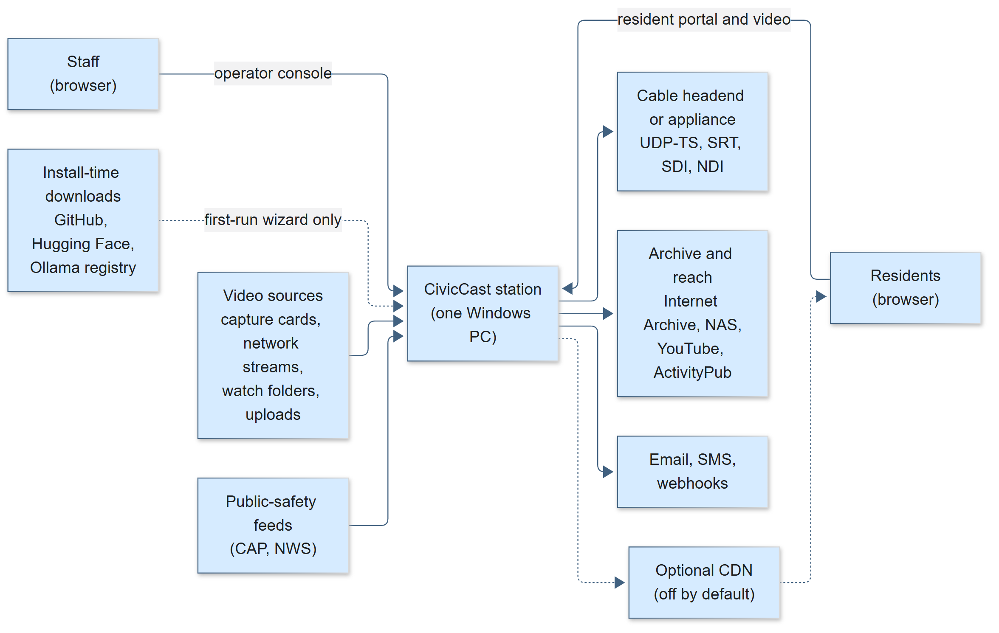{width=100%}

**What this shows.** Staff open the operator console in a browser at `/operator/` on the station. Residents open the resident portal at `/`. Both are served by the same CivicCast web server. The station can record from capture cards and network streams, pick up files from watch folders, and accept uploads. It plays out channels as a continuous video stream to downstream equipment, and it can publish finished recordings to the Internet Archive, a network storage location, YouTube and a federated social network (ActivityPub). Those outside publish surfaces run in a simulated mode until an administrator sets the provider to real and supplies its credentials, ActivityPub is off until it is enabled with a public address and a key, and the subscriber-notification and podcast surfaces are not active in beta.10 (see [Chapter 15](#ch-integrations)). A content delivery network (CDN) is off by default; when a station turns one on, finished recordings are copied to it so that residents' video requests go there instead of to the station. Emergency and weather feeds are read and shown on screen; CivicCast is not an EAS device and does not relay the legally required Emergency Alert System signal (see [Chapter 15](#ch-integrations)). Most of the time the station needs no internet connection. The first-run wizard downloads caption and AI models only when they are not already on the computer, and the web server does not serve its own API documentation pages on a station because those pages would need the internet.

> **Known issue (beta.10):** The control plane listens on `127.0.0.1` only, so as shipped, the resident portal and operator console are reachable from the station computer itself. The installer also adds a Windows firewall rule that allows inbound TCP 8000. We found no setting that changes the listening address. Do not describe the portal as reachable from other computers on the network until this is confirmed on a real station. See [Chapter 20](#ch-planning) and the troubleshooting matrix.

### The programs that run on the station {#arch-deployment}

CivicCast is installed as a Windows service. A service starts when the computer starts, before anyone signs in, and keeps running when nobody is signed in. Figure 16-2 shows the programs that run, which one starts which, and the network addresses they use.

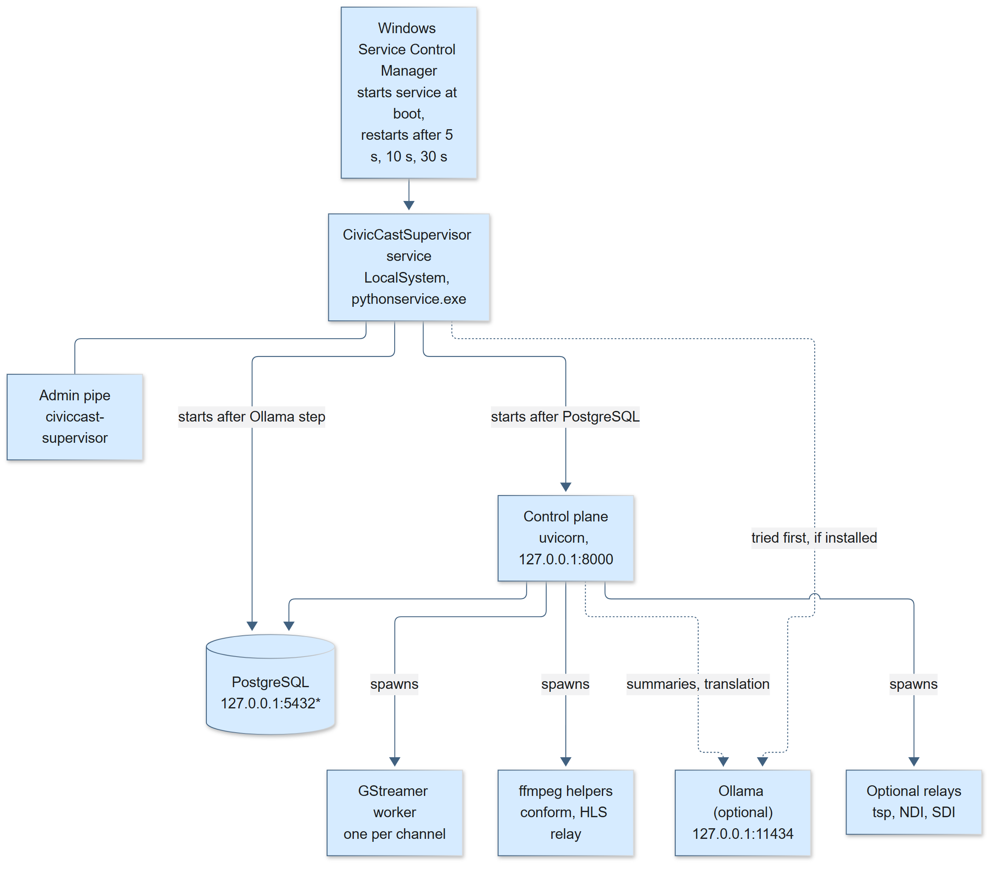{width=100%}

**What this shows.** One Windows service, named `CivicCastSupervisor` (display name "CivicCast Native Supervisor"), is the parent of everything else. It runs as the built-in `LocalSystem` account and is set to start automatically. The supervisor first tries to start Ollama (see below; its outcome never holds up the rest). It then starts PostgreSQL and waits until the database answers a `SELECT 1` (up to 60 seconds by default), and then starts the control plane, the Python program that is the CivicCast application, and waits until `GET /health` returns 200 (up to 180 seconds by default, with a separate rule that gives up after 60 seconds of no CPU activity so a hung start is not mistaken for a slow one). Ollama is the local AI engine used for summaries and translation. If its program and a model store are present, the supervisor starts it before PostgreSQL; if they are not present at start-up, the supervisor skips Ollama and looks again about every 60 seconds, because the first-run wizard may be downloading the models while the service is already running.

The supervisor does not start the video workers. The control plane does, one GStreamer worker program per channel, and it starts helper programs (ffmpeg to prepare videos and to cut live HLS segments, and optional relays for UDP transport streams, NDI and SDI). This is deliberate: the part of the system that knows the schedule is the part that decides what each worker plays.

| Item | Value (default) |
| --- | --- |
| Service name | `CivicCastSupervisor` |
| Runs as, start type | `LocalSystem`, automatic |
| If the service stops unexpectedly | Windows restarts it after 5 s, then 10 s, then 30 s |
| Control plane address | `127.0.0.1:8000` |
| PostgreSQL address | `127.0.0.1`, first free port of 5432, 5433, 5434, 5435, 5544 |
| Ollama address | `127.0.0.1:11434` |
| Admin pipe | `\\.\pipe\civiccast-supervisor` |
| Single-instance lock | named mutex `Global\CivicCastSupervisorSingleton` |
| Firewall rule | inbound TCP 8000, program `<install folder>\runtime\python.exe` |

**How the supervisor protects the station.** It keeps four promises.

1. **One copy only.** A named lock (a Windows *mutex*) allows exactly one supervisor. Only SYSTEM and administrators can hold it, so an ordinary program cannot forge it or hold the station offline.
2. **No orphans.** Every child is placed in a Windows *job object* set to kill all its members when the supervisor exits, and children cannot break out of it. If the supervisor crashes, Windows ends the whole process tree, including the video workers. A sweep by job name runs before the first start in case a previous job survived.
3. **Restart with backoff.** A child that stops is restarted after 1 second, then 2, 4 and so on, up to 30 seconds, with plus or minus 20 percent random jitter. Five restarts within 10 minutes put the supervisor in the `degraded` state: the service stays up, and an alert is raised. A restarted child waits until every child before it in the start order is ready again.
4. **Graceful stop.** On stop, children are stopped in reverse order. Each gets 15 seconds to stop cleanly (PostgreSQL with `pg_ctl stop -m fast`; the control plane with a Ctrl+Break) before Windows ends it.

The supervisor reports one overall state. The state names are `starting`, `ready`, `degraded`, `blocked_wsl_active`, `blocked_probe_unavailable`, `maintenance` and `stopping`. The two `blocked` states mean a guard that keeps the older WSL-based edition of CivicCast and this edition from ever running together has refused to let the station transmit. `maintenance` is a read-only mode the upgrade engine uses (Figure 16-14): the database and control plane come up, and no video worker is allowed to start. Once the supervisor is `stopping`, nothing can pull it back to running. A blocked state can only be released to `starting`, never straight to `ready`, so readiness is always proven again.

**An administrator can talk to the supervisor** through a Windows named pipe. Anyone who is signed in can ask for `status` and `version`. Only an administrator or SYSTEM can ask for `start`, `stop`, `restart`, `drain` or `runtime_set`. The check is made on the identity of the caller for each command, an unknown command is refused, and each command that changes anything is logged with the caller's account identifier. A message larger than 16 KiB closes the connection.

**Why it is built this way.** The design choices are recorded in [ADR 0021](#arch-adrs) (the written record of the decision to run natively on Windows). The reasons it gives, and that we checked still hold, are:

- *A service rather than a program in someone's login session.* A service starts at boot. The ADR records a test in which video was being broadcast about 12 seconds after boot, more than six minutes before anyone signed in. A station that restarts after a Windows update or a power cut should return to air without anyone logging in.
- *One Windows product, no Linux layer.* The earlier edition ran inside WSL2 (a Linux layer on Windows). The ADR records the cost: thirteen release candidates, a per-user program whose only job was to keep the Linux layer awake, and a plan for SDI capture cards that WSL2 cannot reach. The WSL edition is not part of this repository.
- *Video workers outside the supervisor.* A worker that fails should be restarted by the program that knows what it was playing, not by a general-purpose process manager.

**What the ADR accepted as risk, and what is still true.** The service runs as `LocalSystem`, which has far more rights than a station needs. The ADR names a least-privilege account as a follow-up, and beta.10 still uses `LocalSystem`. The ADR also says the operator console is a Tauri application; in beta.10 the operator console is a web page served by the control plane at `/operator/`, and Tauri is used only for the installer window.

### Inside the control plane {#arch-control-plane}

The control plane is one Python program (the `civiccast.app` application, run by the `uvicorn` web server) that does three jobs at once: it answers web requests, it runs a set of background workers on threads, and it starts and watches the video workers. There is one such process per station. Figure 16-3 shows its main parts.

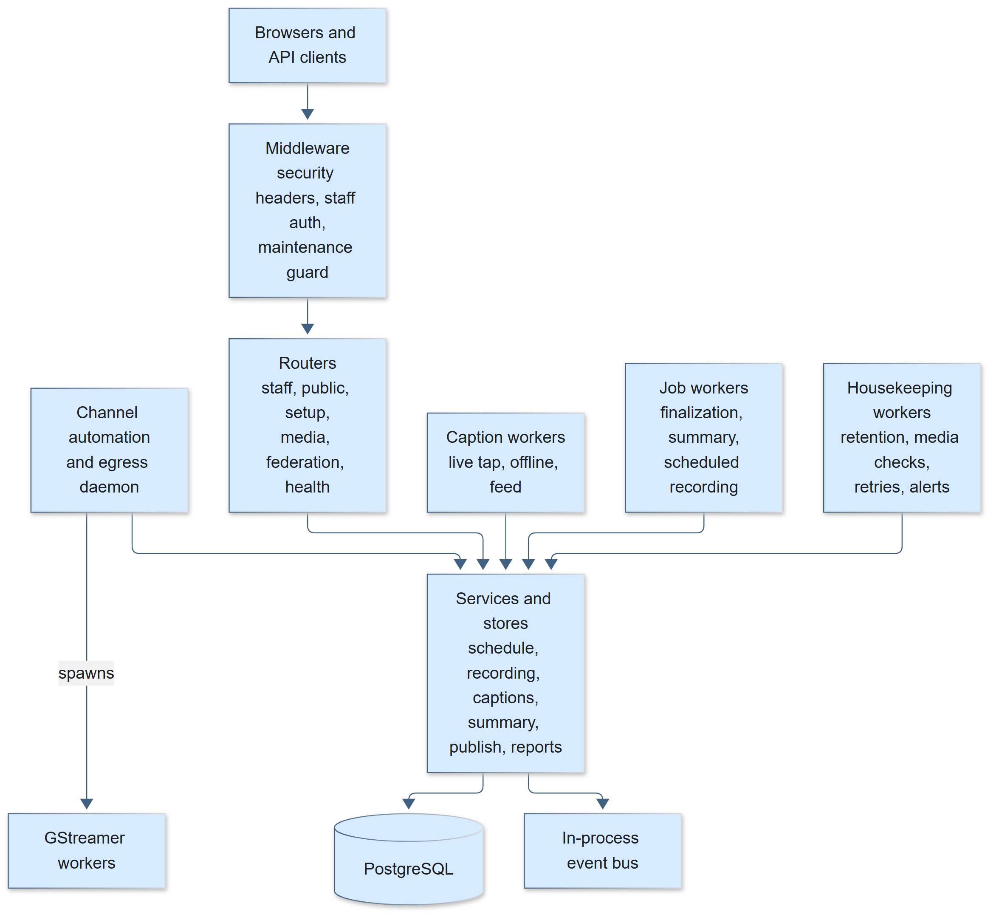{width=100%}

**What this shows.** Requests pass through several layers of middleware (code that runs on every request) and then reach a router. The three that matter here add security headers, check the staff sign-in on every `/api/staff/*` request (Figure 16-12), and, when the supervisor has started the station in maintenance mode, refuse every POST, PUT, PATCH and DELETE request with HTTP 503. A cross-origin (CORS) layer is added only if an administrator lists allowed origins; none is allowed by default.

The routers are grouped by who may call them:

| URL prefix | Who may call it | What it holds |
| --- | --- | --- |
| `/api/staff/...` | signed-in staff with a role | everything the operator console does: schedule, assets, recording, captions, summaries, publish, channels, alerts, reports |
| `/api/public/...` | anyone | what the resident portal and apps read: schedule, recordings, search, live channel list, subscribe, contribute |
| `/api/setup/...` | the station computer only; once setup is complete, all but `station-state`, `login` and `recover` also need a staff token (and, for most, the `setup_admin` role) | first setup, admin sign-in, recovery code |
| `/media/vod/...`, `/media/live/...` | anyone | video segments and playlists |
| `/ap/...`, `/.well-known/...` | remote federation servers | ActivityPub actor, inbox, outbox |
| `/health` | anyone | liveness, plus a readiness verdict |
| `/operator/`, `/` | anyone (the pages themselves) | the packaged operator console and resident portal web apps |

The two web apps are plain files bundled inside the program. The operator console is mounted at `/operator`. The resident portal is mounted at `/`, as a catch-all, so the control plane takes care that an unknown path that starts with `/api` gets a real JSON "not found" and not the portal's front page.

Behind the routers are *services* (the rules) and *stores* (the code that reads and writes the database). In a normal install every store is backed by PostgreSQL. The program refuses to start the staff write routes on a throwaway in-memory store unless an administrator explicitly allows it for testing.

The **in-process event bus** is a small piece of code in the same program that lets one part tell another that something happened. It is not a separate server. In beta.10 it has exactly one subject, `publish.asset.approved`, published when a publish approval is recorded, and nothing subscribes to it. The workers coordinate through rows in the database and by polling, not through the bus. Earlier designs used a separate message server called NATS. [ADR 0023](#arch-adrs) records why NATS was removed: nothing in the shipped product had ever used it for real traffic, yet it was a fourth process, a bundled program, a configuration file, a certificate and a health check that could report the station "not ready" for a service nothing depended on. The bus is kept behind an interface so a real network message system can be added later without rewriting the code that sends events. ADR 0023 says PostgreSQL's own notification feature stays for the low-volume "tell the screen a row changed" case; we found no use of it in the beta.10 code.

The **background workers** run on threads, each under a supervisor of its own that restarts the thread if it fails and can be switched off by an environment variable. The ones that matter most are:

| Worker thread | What it does |
| --- | --- |
| `civiccast-channel-automation` | every 2 seconds (default), checks every enabled channel, restarts channels that should be on air, and extends or replaces the program that is playing (Figures 16-6 and 16-7) |
| `civiccast-caption-tap-worker` | turns live audio from each channel into captions (Figure 16-10) |
| `civiccast-caption-feed` and `civiccast-caption-proof` | push finished captions into the running video worker, and check that captions really are in the emitted stream |
| `civiccast-offline-caption-worker` | captions finished recordings, after the meeting |
| `civiccast-summary-job-worker` | drafts meeting summaries with the local AI engine |
| the finalization worker | turns an ended live session into a recording (Figure 16-5) |
| `civiccast-scheduled-recording` | arms and runs scheduled recordings |
| `civiccast-program-log-materializer`, `civiccast-autoschedule-compile` | turn recurring program slots into schedule items |
| `civiccast-watch-folder-worker` | picks up new files from watch folders |
| retention, media-integrity and media-lifecycle workers | flag expired or missing media, and compute whether each asset is ready to air; they flag, and never delete |
| ActivityPub retry, webhook retry, alerting, analytics roll-up, bulletin expiry, contributor-upload reap, remote-contribution workers | housekeeping and retries |

When the supervisor has started the control plane in maintenance mode, none of these workers is started at all, because each one writes something. When the control plane is asked to stop, it first drains every live channel (waiting for each video worker to exit, then forcing it after a deadline), and it gracefully finishes any recording that is under way, so that a restart produces a finished recording and not an orphan.

**Why threads in one process, and not many services.** The code keeps the control plane as one process on purpose. A station is one computer with one or two people to run it, and every extra process is another thing that can fail to start. The cost is that a fault that stops the control plane stops every worker thread with it. The supervisor then restarts the control plane, the channels start again (Figure 16-8), and the as-run log keeps its place (Figure 16-4).

<!-- SOURCES: civiccast/native/supervisor/config.py:37-126; civiccast/native/supervisor/states.py:1-291; civiccast/native/supervisor/children.py:1-700; civiccast/native/supervisor/service.py (log root, pipe standup, ollama skip/recheck 1491-1535, db port parse 2049-2069); civiccast/native/supervisor/authz.py; civiccast/native/supervisor/job_object.py:1-60; civiccast/native/supervisor/install_layout.py; civiccast/app.py:729-940 (lifespan, workers), 1195-1720 (ThreadSupervisor list), 2186-2230 (middleware), 2550-2640 (portal mounts); civiccast/auth/middleware.py; docs/adr/0021-native-windows-runtime.md; docs/adr/0023-nats-removed-in-process-event-bus.md; inventory/screens/installer-install-layout.md sections 4 and 10; inventory/screens/installer-nsis-service-finish.md; inventory/generated/api.md route groups; fact sheet (installer/supervisor subagent) items 4-5 -->

### Where the data lives {#arch-data}

CivicCast keeps its data in a database, in folders of files, in a few small files outside the main data folder, and in memory. Figure 16-4 shows each place and what is kept there.

{width=100%}

**What each store holds.**

| Store | Where | What it holds |
| --- | --- | --- |
| Database | PostgreSQL, database `civiccast`, schema `civiccast`, role `civiccast_svc`, files in `C:\ProgramData\CivicCast\data\pgdata` | everything that is a record rather than a file: assets, schedule items and program slots, recording schedules and jobs, live sessions, channel configuration, state, commands and the proof chain, caption review items, summaries and approvals, publish runs, signed-record exports, subscriptions, alerts, reports, staff token records |
| Uploads and recordings | `C:\ProgramData\CivicCast\data\uploads` | uploaded and captured media, finished recordings (in a `recordings` folder), and the packaged VOD copies (HLS playlists and segments, in a hidden `.civiccast-packages` folder, one per asset) |
| Channel work folder | `C:\ProgramData\CivicCast\data\egress` | the conform cache; for each channel the prepared plan folders, its worker logs and relay logs, the reload status file, generated slates and bulletin slides, and (for a channel that serves live HLS) its rolling segments; and the HLS relay's log files (5 MiB each, two kept) |
| Caption tap | `C:\ProgramData\CivicCast\data\caption-tap` | rolling five-second audio chunks of each channel, waiting to be captioned; each is moved to a `processed` folder after use, or to `quarantine` if unreadable |
| Logs | `C:\ProgramData\CivicCast\logs` | `supervisor.log` (rotates at 10 MiB; ten older files are kept besides the current one), `control_plane.log`, the application's own log, `postgres.log` and `postgres-launcher.log` |
| Installer records | `C:\ProgramData\CivicCast` | `install-progress.log`, the upgrade engine's journal, backups and recovery document under `upgrade`, and the database provisioning journal and recovery documents under `provision` |
| Downloaded components | `C:\ProgramData\CivicCast\packs` and `components` | caption and AI model files that the first-run wizard downloaded, because the installer window cannot write to the Program Files folder |
| Program files | the install folder, `C:\Program Files\CivicCast (Native)` by default | the embedded Python and the CivicCast program (`runtime`), PostgreSQL tools, ffmpeg, Ollama and optional GPU libraries (`packs`, `dependencies`), the AI model store (`models\ollama`), and the station records that prove activation passed |
| Registry | `HKLM\SOFTWARE\CivicCast\Native` | `DatabaseUrl` (the database address and password, readable only by SYSTEM and administrators) and `InstalledVersion` |
| Service-account profile | the profile folder of the account the service runs as (see the note below) | `station-state.json` (the admin password hash, recovery code hashes, console sign-in tokens and station profile), the as-run outbox, alert and subscription credentials, and the local certificate authority files |
| Event bus | memory of the control plane | events passed between parts of the program; nothing is stored, and nothing is kept across a restart |

> **Known issue (beta.10):** Several small but important files are not under `C:\ProgramData\CivicCast`. As the code stands, the sign-in state file (`station-state.json`), the as-run outbox, alert credentials and the local certificate files default to the profile of the account that runs the service. For `LocalSystem` that is `C:\Windows\System32\config\systemprofile\AppData\Local\CivicCast` (and a `.civiccast` folder in the same profile). The supervisor does not set the variables that would move them. A 2026-09 lab report observed the sign-in state file at that location; we have not checked it on a running station for this chapter. If you copy only `C:\ProgramData\CivicCast` for a backup, you will not copy the admin password hash and sign-in state. See [Chapter 12](#ch-operations) for backups.

**Database or SQLite.** A native station runs on the bundled PostgreSQL. The code can also run on a SQLite file, which is what a simple local install without a Postgres server uses, and on an in-memory store for tests; the program refuses to start its staff write routes on an in-memory store unless `CIVICCAST_ALLOW_EPHEMERAL_STORES=1` is set. The database address is read from the registry value at service start. If an environment variable named `DATABASE_URL` is already set on the service, it wins, and the supervisor logs which source it used (the variable name or the registry path, never the value). The database accepts connections only from `127.0.0.1`, with password authentication (`scram-sha-256`) and one rule in its `pg_hba.conf`. It does not use TLS (`ssl = off`) because the connection never leaves the computer.

**How the schema is kept current.** One Alembic migration set, shared by every module, builds and upgrades the database. Each module keeps its own migration files in its own folder, and a single runner walks all of them (ADR 0008). The installer's provisioning step runs the migrations on a new database, and the upgrade engine runs them on an upgrade. At start-up the control plane compares the database revision to the one it expects and records one of `current`, `behind`, `ahead`, `not-configured` or `unknown`. It logs an error for `behind` or `ahead`, but it does not migrate by itself and does not refuse to start. `GET /health` always answers HTTP 200 while the program is running, and reports `status: "degraded"` unless the schema is `current`. Monitor the `status` field, not the HTTP code.

**What this design does for you.**

- *Records and files are separate.* A recording's metadata is in the database and its video is a file. The media-integrity worker re-checks that every file an asset points to still exists and flags the asset as missing if it does not; it never deletes anything. The retention worker flags expired assets for a records clerk to review; it also never deletes.
- *Writing a live recording and its record happens in one transaction.* When a live session ends, the session-ended event, the new recording asset and the move of the session to the `recorded` state are committed together (ADR 0011). The event's key makes a second attempt to finalize the same session a no-op, so a crash and retry cannot make two recordings, and a partial write cannot leave a session with no recording.
- *The record of what aired survives a database outage.* Every change of source is first written to a local SQLite file (`asrun_outbox.sqlite3`) with the strongest durability setting, then copied into the database. If the database is unreachable, the row waits in the file and is retried on every automation tick, and an alert is raised (ADR 0023 on the as-run outbox).
- *Nothing waits on a message server.* The workers coordinate through database rows and polling, and the in-memory bus carries one event today. Anything that must not be lost (a command to a channel, an as-run row, a finalization) is written to a table or file first.

**What it does not do.**

- **CivicCast does not back up your station by itself.** The only backups it takes are the one the upgrade engine takes before an upgrade (a database dump, with an integrity manifest, in `C:\ProgramData\CivicCast\upgrade\backups\pre-<version>`; the upgrade engine does not copy recordings) and the ones created by the `civiccast dr run-drill` command. We found no scheduled backup job. Your own backup must cover the database (a `pg_dump`, or a copy of `pgdata` with the service stopped), `C:\ProgramData\CivicCast\data\uploads`, and the files listed in the note above.
- **There is no automatic clean-up of the command table**, and the only stores with a size limit enforced for you are the conform cache (60 GB by default), the prepared plan folders (5 GB by default) and the relay logs. Watch the free space on the drive that holds `C:\ProgramData\CivicCast\data`.
- **Uninstalling does not remove your data.** The uninstaller removes the program files, the service, the firewall rule and the registry values, but leaves `C:\ProgramData\CivicCast`. Because the uninstaller deletes the stored database password, a reinstall over a surviving data folder has to set a new password on the existing database. The installer does this using a short-lived loopback-only access rule.

<!-- SOURCES: ops/docs-sprint/inventory/screens/installer-install-layout.md sections 1-3 and 8; civiccast/native/supervisor/install_layout.py:79-338; civiccast/native/supervisor/children.py:272-314; civiccast/native/supervisor/service_env.py:1-60; civiccast/native/provision/conf.py:55-135; civiccast/native/station_runtime.py:1337, 1421-1437; civiccast/installer/station_state.py:595-608; civiccast/reporting/asrun_outbox.py:100-147; docs/history/2026-09-codex-work/BLACKWELL-CAPTION-FIX-REPORT-v6.md:55-64; civiccast/schema_check.py:244-279; civiccast/app.py:2376-2447; civiccast/dr/backup.py; civiccast/native/upgrade/orchestrator.py:198-215; civiccast/native/upgrade/seams.py:100-215; civiccast/native/upgrade/__main__.py (no media_root); civiccast/app.py:1255-1292 (retention/media-integrity flag only); docs/adr/0008, 0011, 0023-asrun-durable-outbox; civiccast/apps/installer/src-tauri/src/native_uninstall.rs:2145-2215 (credential cleared); civiccast/native/provision/conf.py:102-135 (transient trust rule); app-auth-db fact sheet subagent sections 3-5 -->

### From a meeting to a resident: the life of a recording {#arch-recording}

This is the other half of the product. A meeting is captured, becomes a recording, is published to the resident portal, and gets captions and, if staff ask for them, a summary. Figure 16-5 shows the order in which things happen. It is not quite the order people expect, and the differences are worth knowing.

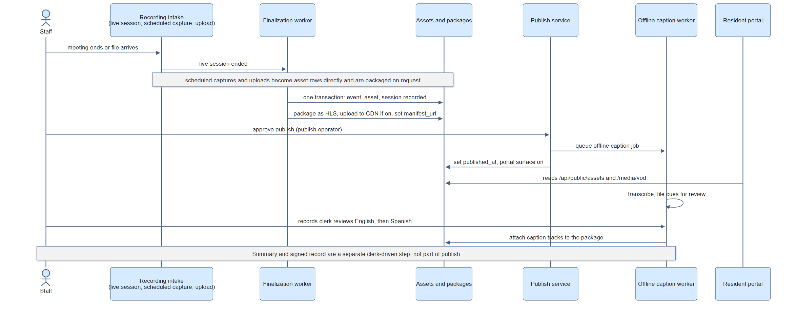{width=100%}

**What this shows.**

1. **Three ways in.** A *live session* (an operator ends a broadcast, which moves the session from `on_air` to `ending`), a *scheduled recording* (a capture job that records an input such as a capture card, RTSP, SRT, HLS, RTMP, MPEG-TS or NDI stream), and an *upload or watch folder* (a file placed by a clerk or picked up from a folder; the watch-folder worker never deletes the source file, and flags the folder as degraded if it becomes unreachable). Each ends as a row in the assets table. Uploads start in the `validated` state, and recordings in the `recorded` state. Recording schedules and program slots are entered and displayed in UTC on several screens; a 7 PM Monday meeting in the Americas falls on Tuesday in UTC, so check the "in your local time" echo (see [Chapter 3](#ch-before-meeting)).
2. **Finalization.** For a live session, the finalization worker waits until the recording file's size has stopped changing (30 seconds by default), then writes the session-finalized event, the asset and the session's move to `recorded` in one database transaction (Figure 16-4). We could not find which program writes the recording file for a live session; the worker looks for `<live_session_id>.mp4` in the recording target folder.
3. **Packaging.** For a live-session recording, the same worker packages the video as HLS (an adaptive set of segments: 1080p, 720p, 480p and 240p, never scaled up, in 2-second segments), uploads it to a CDN if one is configured, and records the playlist address on the asset. Uploads and scheduled recordings are not packaged automatically; an operator asks for it.
4. **Approval and publish.** A publish operator approves. By default only the *portal* surface publishes, and archive and reach surfaces must be chosen by name (an older version published to every surface when none was named, which was a safety defect that has been fixed). Approval is refused (HTTP 409) if the asset has no playlist address (`manifest_url`) yet. The caption job is queued first, and if it cannot be queued nothing is published; then the asset's published time is set and the one bus event is published. Publishing does not wait for captions to be reviewed.
5. **The resident portal** polls the public routes. It lists only assets that have a published time and a package, and the video route refuses an asset that is not published. There is no push channel.
6. **Captions come later.** The caption job transcribes the whole recording, files each cue in a review queue, and waits for a records clerk (Figure 16-10). The caption tracks are attached to the package only when review is finished.
7. **Summaries and records** are separate. See the next section.

**Where it differs from what you might expect.**

> **Note:** Finalization does not start captions or a summary. Captions start when publish is approved. A summary is made only when a records clerk asks for one. No broker event links these steps: they are linked through database rows and polling workers.

**Publish surfaces.** Each surface has a state (`blocked`, `not_configured`, `coming_soon`, `pending`, `running`, `succeeded`, `failed`, `overridden`), and the run as a whole shows one of nine dashboard states, from `draft` through `portal_live` and `archive_verified` to `complete` or `failed_needs_action`. A failure on one surface fails only that surface, and it can be retried on its own.

| Surface | Kind | State in beta.10 |
| --- | --- | --- |
| Portal | canonical | always on; the only surface published by default |
| Internet Archive, local NAS (rsync or ZFS) | archive | required only when the asset's retention policy is `meeting` or `permanent`; runs in simulated mode unless the provider is set to real with credentials |
| YouTube live and VOD | reach | optional; simulated unless set to real with credentials |
| Cable package | record | optional; `not_configured` when unset |
| Podcast | audience | not active: the episode it produces is a placeholder and is not saved |
| Subscriber notifications | audience | `coming_soon`: sends nothing, and the subscribe RSS feed is empty |
| ActivityPub | federation | off by default; when enabled, a note is delivered only after the portal surface succeeded |

> **Known issue (beta.10):** Internet Archive, NAS and YouTube publishing are simulated by default. A provider result carries a `simulated` flag. Do not tell staff that a recording reached the Internet Archive or YouTube until the provider is set to real, credentials are supplied, and you have seen the result.

#### Summaries and signed records {#arch-summary}

Summaries and records sit beside the publish path and are driven by a records clerk.

- **A summary is not automatic.** A clerk asks for one; the cues (the caption text with times) are supplied in the request. The local AI model, a Gemma model run through Ollama at `127.0.0.1:11434`, is called at temperature 0 with a 600-second limit, and the answer must be structured JSON: a narrative plus a list of *sourced claims*, each pointing at the transcript cues it came from. A claim that states a number, a vote or a dollar amount must cite transcript ranges. The program checks that each cited cue exists and that the cited time range lies inside it. It does not check that the claim's words match the cue's words: a person must read it. The record keeps the model's digest, the Ollama version and a fingerprint of the content.
- **Approval** is by a records clerk, who moves the draft to `approved`. We found no check in the store that stops a draft the program itself had refused from being approved; we read it and did not run it.
- **A signed record** is a PDF/A-3B file built from an approved summary, with the claims, the provenance, the approval and a timestamp token attached as embedded files. Its visible page shows only a header, the identifiers, the fingerprint and the first 480 characters of the narrative; it does not include the transcript.

> **Known issue (beta.10):** Despite the name, we found no digital signature code in the records module. The timestamp token is a placeholder: unless an administrator sets `CIVICCAST_TSA_URL` or `CIVICCAST_TSA_ENABLE`, the token comes from a deterministic stand-in that carries a fixed date of 2026-05-14, not a real RFC 3161 timestamp from a timestamp authority. Verification checks the stored digest and the structure of the token. Do not describe an exported record as legally time-stamped or digitally signed until a real authority is configured and verified.

#### Who touches what in this flow {#arch-flow-roles}

Live sessions are ended by a meeting operator. Uploads are made by records clerks, meeting operators or support administrators. Packaging by hand is for publish operators and setup administrators. Publish approval is for publish operators. Caption review and summary work are for records clerks. The roles are explained in Figure 16-12.

<!-- SOURCES: civiccast/live/finalization.py:313-381, 413-469; civiccast/live/finalization_worker.py:70-113, 305-323, 680-760, 841-913; civiccast/live/models.py:75-79, 132-158, 398-408; civiccast/live/router.py:736-779; civiccast/recording/models.py:80-88; civiccast/recording/runtime.py:555-600, 647-697; civiccast/schedule/models.py:60-70; civiccast/schedule/router.py:140-196, 372-504, 711-760; civiccast/schedule/store.py:124-137, 235-257, 562, 582; civiccast/schedule/watch_folder_worker.py; docs/adr/0024; civiccast/stream/config.py:65-96, 199; civiccast/stream/media_router.py:176-189, 224; civiccast/publish/router.py:239-314, 416-535, 538-654; civiccast/publish/service.py:53-130, 205-298, 506-828, 923-954; civiccast/publish/models.py:12-72, 160, 177; civiccast/platform/providers.py:40, 99-121; civiccast/platform/broker.py:66-107; civiccast/podcast/service.py:11-27; civiccast/subscribe/router.py:188-208; civiccast/activitypub/config.py:22, 66-76; civiccast/summary/generate.py:97-168; summary/validate.py:21-37; summary/extract.py; summary/ollama.py:127-150; summary/router.py:128-229; summary/store.py:172-221; civiccast/records/router.py; records/exporter.py:19-126; records/pdfa.py:86-213; records/timestamp.py:18-41; records/rfc3161.py; civiccast/ai_runtime/ollama_client.py:14-30, 123-174; docs/adr/0010, 0011; inventory/screens/recording.md, guide.md (UTC); captions/publish/records fact-sheet subagent sections 0-4 -->

### Playing a channel: from schedule to air {#arch-playout}

A CivicCast channel is a continuous video stream that never stops, even when the schedule has a gap or a file will not play. Everything in this section exists to keep that promise. Figure 16-6 shows the path from the schedule to the stream.

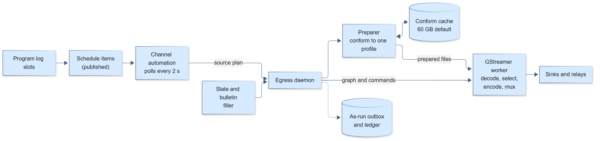{width=100%}

**What this shows.** Recurring program slots are turned into schedule items. A background thread (the *channel automation*) looks at every enabled channel every 2 seconds. It asks the *source plan provider* what should be airing now, and gives the answer to the *egress daemon*, the part that owns each channel's worker. The daemon asks the *preparer* to make the files ready, then starts or instructs the worker. The worker plays the prepared files through one video encoder to the outputs.

**The source plan.** A *source plan* is the list of things a channel should play from now on. Only schedule items that are published and are premieres count. Each item is clipped to its slot. If the channel is switched on halfway through an item, the plan starts partway into it (called *join in progress*) so that the stream matches the clock. A gap of up to 30 seconds between items is absorbed. A longer gap is filled with filler. With the default GStreamer engine a plan holds one slice of up to 30 minutes, which keeps the worker's pipeline small; the automation extends it before it runs out (Figure 16-7). A plan segment has one of four kinds: a program (a recorded file), a *slate* (a generated card, used when nothing is scheduled), a *live* source (a network stream, used when an operator takes over the channel) and *cg* filler (bulletin slides). The slate is rendered as a short clip and repeated into one continuous file of 3,600 seconds, so a channel that falls back to slate does not need a second preparation. A live takeover is refused unless the live source has been observed as ready within the last 30 seconds by default (a source that merely exists is not treated as ready).

**Preparing a file ("conform").** Video files come in every size and shape. The preparer converts each one to a single *canonical profile* so that every change of program looks the same to the encoder. The default profile is 1280 by 720 pixels at 30 frames a second, H.264 video at 6,000 kbit/s with a keyframe every 60 frames, and AAC stereo audio at 192 kbit/s and 48 kHz, in an MPEG-TS container. A station can change the profile for a channel. The audio is also leveled (Figure 16-9). A conformed file is stored in the *conform cache*, a folder named `conform-cache` under the channel work folder (`C:\ProgramData\CivicCast\data\egress`), keyed by the source file's path, size and modified time, the profile, and the leveling method. A program that has aired before is a cache hit and costs no conversion. A program that has never aired is converted in the time before it is due, and the whole file is converted in the background so that the next airing hits the cache. The cache holds 60 GB by default and discards the oldest entries first. Each preparation step is limited to 300 seconds by default.

> **Note:** A station with long recordings should expect a delay the first time a recording airs, because that is when it is converted. The automation therefore starts preparing early. With the default settings it begins 690 seconds (11.5 minutes) before the projected end of the plan that is airing (the program, or its 30-minute slice when the program is longer): two 300-second preparation limits, plus 30 seconds to switch and a 60-second margin. A long file to be prepared next raises that lead time.

**The worker.** Each channel has one worker, a separate GStreamer program started with a description of the channel (a *playout graph*). It decodes the prepared files, chooses between its sources with an *input selector*, and sends the result through one persistent encoder and one MPEG-TS multiplexer. The graph has two sources: the program and a built-in black picture with silence. The encoder defaults to the OpenH264 software encoder because the shipped runtime does not include GPL-licensed x264. A hardware encoder (NVIDIA or Windows Media Foundation) is used only if the channel's profile asks for it by name, and the start is refused if a requested hardware encoder is missing unless the channel allows the software fallback. A channel with captions turned on must use H.264, because the caption inserter cannot embed captions in HEVC.

**Why one persistent pipeline.** The earlier design started a new encoder at every change of program, which starts a new MPEG-TS session each time. A cable plant's monitors log an error at every one of those splices. ADR 0015 chose to begin with a single long-running FFmpeg process; the code later moved to GStreamer, where the pipeline is never torn down at a program boundary, and the default engine is now GStreamer. ADRs 0015 and 0016 still describe the FFmpeg-concat design and the libx264 default, and are historical in those details. A station can still select the older engine with `CIVICCAST_EGRESS_ENGINE=ffmpeg-concat`. If the GStreamer files on the computer are damaged and cannot be repaired when the service starts, the supervisor selects the FFmpeg engine automatically, raises an alert and marks the channel degraded, so that the channel keeps airing.

**How the daemon and the worker talk.** Two channels are used, for two different reasons.

- *Operator intent* reaches the daemon through a table of commands in the database (start, stop, reload, drain, takeover, handback). The daemon reads it on every tick. ADR 0017 chose this over a direct call or a database notification because a command written to a table survives a restart of either side and a few seconds of delay does not matter for start and stop. The commands are marked consumed as a batch when read, so a command is delivered at most once.
- *Instructions to a running worker* go through a private Windows named pipe, `\\.\pipe\civiccast-worker-<channel>`, which the code restricts to SYSTEM and the service's own identity (in beta.10 the same account, `LocalSystem`). The messages are small JSON lines (`reload`, `swap`, `caption`, `stop`) and each is acknowledged within 5 seconds. A `reload` acknowledgement only means "accepted"; the real outcome arrives later in a status file in the channel work folder, so a reload is never reported as done before it is.

#### Changing programs without a gap {#arch-reload}

When one program ends and the next begins, CivicCast switches the worker to the new source while the output keeps running. Figure 16-7 shows the steps, and the watchdogs that stand behind them.

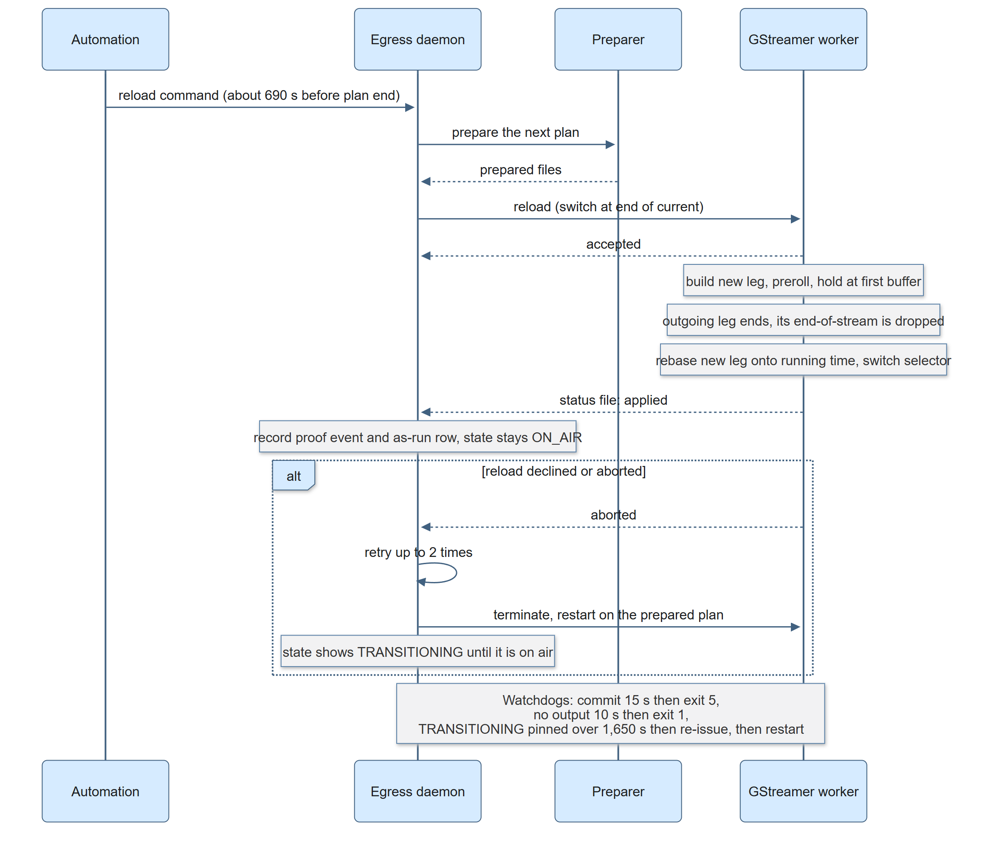{width=100%}

**What this shows.** The automation notices that the program that is airing will end soon and enqueues a `reload`. The daemon builds and prepares the next plan and sends it to the worker. The worker builds the new source beside the old one on the live pipeline and prerolls it, which means it decodes the first picture and sound so the new source is ready to run. The new source then waits, held by a blocking probe so that it does not use CPU or run ahead. When the old program reaches its natural end, the worker discards that end-of-stream signal (otherwise the encoder would see the stream end), shifts the new source's clock so that the output timeline continues without a jump, and switches both the picture and sound selectors. The old source is then removed on a separate thread. The airing item is never cut short and never decoded twice, and the encoder and multiplexer are never restarted. The daemon learns the result from the status file and then records the change in the *proof chain* (a durable log of what each channel did) and in the *as-run* record (what actually aired, which is a different thing from what was scheduled). The channel's state stays `ON_AIR` throughout; only the proof chain notes a transition.

If the worker declines or aborts (a source that cannot be decoded, a timeout), the daemon re-resolves the schedule and tries again, up to two times. If that also fails it falls back to the slower route: it ends the worker and starts a new one on the prepared plan. In that case the channel shows `TRANSITIONING` until the new worker is on air, and the stream is interrupted briefly.

**The watchdogs.** Three independent timers exist because each one catches a failure the others cannot see.

| Watchdog | Where it runs | What it watches | What it does |
| --- | --- | --- | --- |
| Commit watchdog | inside the worker, on its own operating-system thread | the final switch took longer than 15 seconds (default; allowed range 3 to 120) | writes every thread's stack to the log, then ends the worker with exit code 5; the daemon treats this as an ordinary crash |
| Stall watchdog | inside the worker | no output left the multiplexer for 10 seconds (default), or one stream (picture or sound) stopped advancing | ends the worker with exit code 1; the daemon relaunches it |
| Reload-stall watchdog | in the daemon | a channel pinned in `TRANSITIONING` with nothing in flight for longer than the plan length plus lead plus settle time (1,650 seconds at least) | logs an error, re-issues the reload once, and 300 seconds later, if still pinned, ends the worker so the crash relaunch re-plans from the schedule |

Two further guards act on the output a resident would see: if the audio and video start times of the newest HLS segment differ by more than 1 second on three probes in a row (probes are 30 seconds apart), the daemon restarts that channel's worker; and if the HLS playlist stops advancing for 30 seconds after the relay has already tried to heal itself, the daemon also restarts the worker. Each of these two guards is limited to three restarts per channel per hour, after which it reports the problem and stops restarting.

**Why the watchdog that ends a stuck program change matters.** Before the reload-stall watchdog existed, a program change on the education channel in the lab once left the channel black and silent for about 34 hours. The beta.10 verification record names the watchdog that ends a stuck program change as the fix. The code shows why it can: the daemon measures how long a channel has been pinned in `TRANSITIONING`. The exact stall did not recur in the 8-hour lab run, which was on an earlier internal build.

#### What a channel does when things go wrong {#arch-channel-states}

Every channel has one of eight states, shown in the operator console and stored with the channel. Figure 16-8 shows how they change.

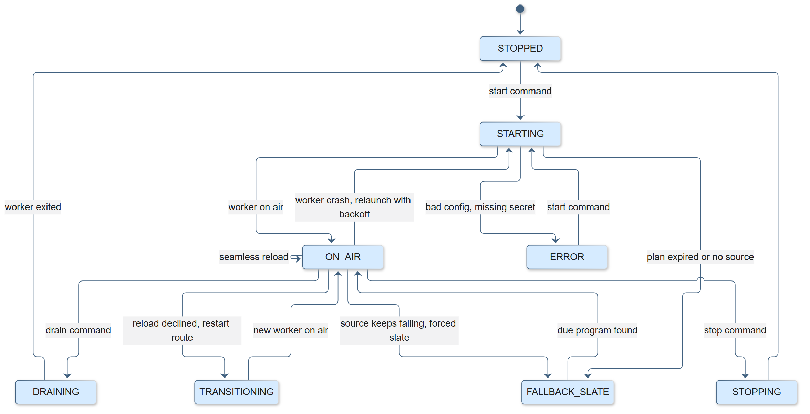{width=100%}

**What this shows.** `STOPPED` and `ERROR` are off air. `STARTING` is the time spent preparing and launching a worker. `ON_AIR` is a worker airing a real program, and `FALLBACK_SLATE` is a worker airing the slate or bulletins because no real program can be aired right now. `DRAINING` is a graceful stop that lets the worker finish; `STOPPING` is an immediate one. A channel whose `auto_start` switch is on is started again by the automation after an application or computer restart, and a channel on `FALLBACK_SLATE` is moved to the real program as soon as the schedule yields one.

**What heals itself, and what does not.**

| Failure | What CivicCast does |
| --- | --- |
| The worker crashes or exits unexpectedly | The daemon relaunches it. The first crash relaunches at once. A second crash within 15 seconds waits for the 15-second cooldown. A worker that stays on air for 60 seconds clears the count. |
| A worker keeps crashing against the same source (5 crashes in a row) | The daemon stops trusting the source and airs the fallback slate. The automation retries the real source about every 30 seconds, so a source that recovers is picked up again. |
| A slate plan reaches its end | The daemon relaunches once onto the program that is now due. Past that one relaunch it goes to `STOPPED` and names the media to check. |
| A worker was slow to start under load (exit codes 3 or 4) | Relaunched, but counted at most once a minute toward the crash count, because a slow start is not a crash. |
| The database or the daemon restarted while a channel was on air | On start-up, rows still marked on air whose worker has gone are cleared, and a start is queued. |
| A program cannot be prepared in time | The channel airs the slate and the automation retries. |
| The HLS output freezes, or sound and picture drift apart | The guards described above restart the worker (limited to three times an hour). |
| The as-run record cannot be written (database busy or disk full) | The row is written to a local SQLite journal first, retried on every tick, and an alert `asrun-outbox-degraded` is raised. Playout is never stopped by a record-keeping error. |
| A channel is in `ERROR` (invalid configuration, a missing secret, ffmpeg not found) | **Does not self-heal.** An operator must correct the cause and press start. |
| A channel was stopped by an operator, with `auto_start` off | Stays stopped. This is deliberate. |
| The restart budgets of the output guards are spent | The problem is logged and reported; the worker is not restarted again. |

In the 8-hour lab run on a three-channel station, the service ran without a restart, no channel showed slate after start-up, and the watchdogs did not fire. Two program changes aborted at a sub-second boundary and recovered by themselves in about 3 seconds. That run was on an earlier internal build of the same engine, on one lab computer; it was not repeated on the published installer.

#### Keeping the sound level steady {#arch-loudness}

A public meeting is not steady. A chair at the dais, a speaker who steps back, and a resident at the public-comment microphone can sit 15 to 20 loudness units apart in one recording. CivicCast therefore levels each program once, when it is prepared, and plays it as is. Figure 16-9 shows the steps.

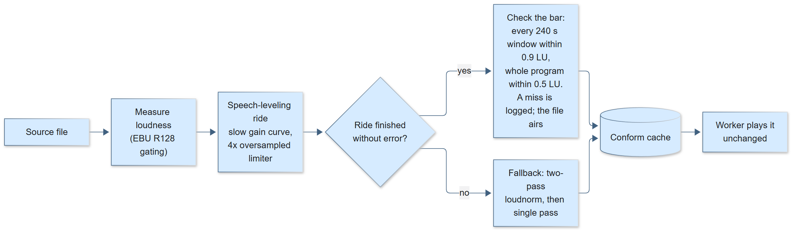{width=100%}

**What this shows.** The measurement uses the standard EBU R128 method. A *speech-leveling ride* then moves the gain slowly (up to 0.5 dB a second, within a range of -6 dB to +18 dB in the code defaults, with a smaller cap for room tone) to follow the speakers, instead of a single gain for the whole program, which cannot put every four-minute stretch on target. A limiter that works on a four-times oversampled copy of the signal holds the true peak at -1.5 dBTP, and a loop measures the result and corrects it up to four times. The result is then checked against a bar: every 240-second window within 0.9 LU of the target and the whole program within 0.5 LU. A result that misses the bar is logged as a warning and still airs. Only if the ride itself fails (an error in the leveler or the final mux) does the preparer fall back to the standard two-pass `loudnorm` filter, and then to a single pass if the measuring pass fails; it records which method was used.

The loudness target is a setting of the channel and not a fixed number, because streaming and cable expect different levels (ADR 0014). The default is -16 LUFS with a tolerance setting of 2 LU. The configuration also lets each output (a *sink*) name its own regime: streaming (-16), ATSC A/85 (-24) or EBU R128 (-23). Only the older FFmpeg engine acts on it (see the note below). Applying a cable headend profile sets the channel to -24.

> **Known issue (beta.10):** A stretch of a recording that is too quiet for the ride's largest boost is listed in the report and is not leveled. In the lab run all 240-second windows passed against -16 LUFS plus or minus 1, but the station's own leveling check recorded two programs whose worst four-minute stretch was 1.94 LU and 1.39 LU. We found the per-output regimes and the 853/960 Hz alert-tone filter only in the FFmpeg engine's code; we did not find them in the GStreamer engine's code, so on the default engine every output of a channel carries the same leveled audio, at the channel's own target. Confirm before promising a different level for cable and for streaming from one channel.

<!-- SOURCES: civiccast/egress/automation.py:1-60, 754-783, 945-1161, 1228-1298, 1568-1650, 1908-1990, 3214-3232; civiccast/egress/daemon.py:160-232, 236-380, 418-505, 1379-1493, 1876-1948, 2076-2849, 3789-4022, 4173-4433, 5886-6215, 6395-6530; civiccast/egress/models.py:74-134, 211-247, 462-463, 748-779; civiccast/egress/source_plan.py:46-110, 191-334, 488-516; civiccast/egress/preparer.py:1-30, 90-260, 306; civiccast/egress/engine_select.py; civiccast/egress/gst/engine.py:303-343, 803-805, 4876-5000, 5920-6075; civiccast/egress/gst/exit_codes.py; civiccast/egress/gst/reload_policy.py; civiccast/egress/gst/strategy.py (pipe transport, ack 5 s); civiccast/egress/gst/bridge.py:84-193, 282-345; civiccast/egress/gst/graph.py:19, 372-411; civiccast/egress/loudness_ride.py:1-120, 276-277, 313-373; civiccast/egress/loudness_plan.py; civiccast/native/station_runtime.py:1085-1135 (engine fallback); docs/adr/0014, 0015, 0016, 0017, 0023-asrun-durable-outbox; docs/releases/v1.0.0-beta.10-verification.md (8-hour run, limits); inventory (live source readiness TTL 30 s: docs/adr/0025); egress-fact-sheet subagent sections 1-9 -->

### Captions: live and after the meeting {#arch-captions}

CivicCast captions in two different ways, for two different needs. The *live* path captions a channel while it airs, so captions can be embedded in the stream. The *offline* path captions a finished recording after it is published, with a human review step before anything is attached. Figure 16-10 shows both, and marks the points where audio can be thrown away.

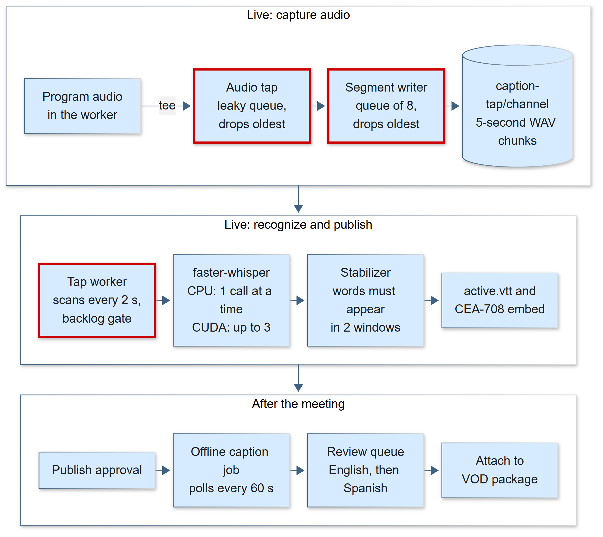{width=100%}

**The live path, step by step.**

1. **The audio tap.** Inside each channel's worker, a copy of the program audio is split off before it is encoded, converted to mono 16 kHz, and placed in a queue that never blocks the program: if it is full, it drops the oldest audio. This exists only if live captions are switched on for the station and a caption folder is set.
2. **Chunks on disk.** A writer collects the audio into five-second WAV files named `chunk-NNNNNN.wav` in `C:\ProgramData\CivicCast\data\caption-tap\<channel>`, writing each under a temporary name and renaming it so a half-written file is never read.
3. **The tap worker** scans every 2 seconds, takes the finished chunks of each channel, adds a five-second overlap from the previous chunk, and sends them to the speech recognizer.
4. **The recognizer** is faster-whisper (the CTranslate2 engine) running inside the control plane, not Ollama. The Medium model is always installed; the Large (large-v3) model is added if the wizard chose it. It runs on the NVIDIA graphics card when the card has at least 8 GB of video memory and the GPU libraries are present, and on the processor otherwise. On a processor, one channel's audio is recognized at a time for the whole station. On a CUDA card, up to three channels are recognized at once.
5. **The stabilizer** commits a caption only if the same words appear in two overlapping windows. Words that are not confirmed are filed for review and are never aired.
6. **Output.** The result is written to `active.vtt` in the channel's work folder, and every new cue is also filed in the review queue. A separate *caption feed* worker reads `active.vtt` every 2 seconds and sends each new cue to the running worker, which turns it into closed captions (CEA-608/708 data) and inserts them into the video, so the captions travel inside the emitted stream. Cues are split into pages of 32 columns by 2 rows without discarding words.
7. **The proof.** A decode-back check reads the actual emitted stream and compares the captions it finds with what should have been sent. The channel's caption status is `on` only while a recent check has passed; a missing, stale or failed check reads `not-verified`, so the console does not claim captions it cannot prove (ADR 0018).

> **Note:** Live captions are switched off in a new station profile until an administrator turns them on. The caption tap runs in its mode `inline` on a native station, but the audio tap and the embed are built only when the station's live-captions setting is on. Live captions are English only: the live path has no translation step.

**Where audio can be shed, and what happens to the captions.** The rule in the code is that captions are best effort and the channel on air always wins. When the station cannot recognize speech as fast as it arrives, audio is thrown away rather than letting captioning slow playout down.

| Where | What is dropped | What happens to the captions |
| --- | --- | --- |
| The audio tap in the worker | The oldest audio when the queue (200 buffers or about 10 MiB) is full, or when the next stage holds 32 buffers | A gap in the chunks; playout is unaffected |
| The segment writer | The oldest waiting segment when its queue of 8 segments (about 40 seconds) is full | Missing five-second chunks; a slow disk is not fatal to air |
| The tap worker's backlog gate: short overload | Nothing yet. If a channel has more than 2 finished chunks waiting for fewer than 15 scans in a row (about 30 seconds), only the oldest 2 are processed and the rest wait | Captions continue, a little late |
| The backlog gate: catch-up shed | After 15 scans in a row over the limit, the oldest waiting chunks are deleted and only the newest 2 are kept | Captions keep running from the newest audio; the skipped speech is never captioned, and one warning is logged |
| The backlog gate: pause | If the station sheds 3 times within 5 minutes, the channel's captions are blanked and paused for 120 seconds, then 240, 480 and so on up to 900 seconds, with every new chunk deleted unrecognized during the pause | Captions are off for that channel; the status shows `paused` and the time to resume; the channel steps back down one rung at a time after sustained clean scans |
| Retention not verified | Settled audio is deleted | Captions blank until retention is verified |
| An operator switches captions off | Every chunk is deleted, the caption file is blanked | Captions off until switched on |
| A new session or an unreadable chunk | The audio of the previous session, or the bad file (moved to `quarantine`) | Captions restart cleanly |

> **Known issue (beta.10):** Live-caption audio can be dropped under heavy load. In the 8-hour lab run on three channels, the caption worker logged 13 catch-up discard events. Seven of them were small events that coincided with disk scans the lab coordinator was running; the quiet-machine total, which leaves those seven out, was about 160 seconds of audio on two channels. Captions stayed on the air, but some spoken audio got no caption. The cause is that the caption worker falls behind during long first-time media preparations. A fix is the next work item and is not in this build. Captions matter legally for Colorado public-access use, so a station that needs loss-free live captions should weigh this limit. Some comments in the code say shed audio is filed as review evidence; in the code we read, it is deleted.

**The offline path.** When a publish approval is recorded, a durable job row is queued for the asset. A worker polls every 60 seconds (retrying with a 300-second backoff, at most four attempts) and transcribes the whole recording from its audio in 30-second chunks, with nothing shed. Every cue goes to the review queue. A records clerk approves, edits or rejects each English cue; a cue with low confidence needs an explicit acknowledgement and valid audio evidence. When every English cue has been decided, the program translates the approved English to Spanish with the TranslateGemma model and queues the Spanish cues for their own review. Only when both languages are reviewed does it write the caption tracks (`captions.vtt` and `captions.es.vtt`, and the segmented tracks in the manifest) into the package and, if a CDN is on, upload them again.

> **Known issue (beta.10):** There is no English-only way to finish an offline caption job. The Spanish step is always on: a missing translator fails the job with instructions, and if every cue in one language is rejected the job is held open. A recording gets its caption track only after both languages are reviewed.

Caption evidence is cleaned up on a schedule: the raw audio chunks are removed after 24 hours once their evidence is verified (or can never be), and resolved review evidence after 90 days. The older size caps were removed on 2026-09-20.

**Why it is built this way.** The reasons are in the code's own notes. On a processor-only tester machine with three channels on air, the first design could not keep up with live speech; the control plane burned about 247 percent of a core on caption work while the playout workers were starved into their own stall watchdog and restarted. Playout therefore runs at a higher priority than caption recognition, concurrency is bounded, and overload is shed and paused rather than retried. On the offline path, a human review step stands between the recognizer and the public, because the rule in the code is that no machine-written text reaches a public recording unreviewed. Live captions cannot wait for review, so they are held back by the stabilizer instead.

<!-- SOURCES: civiccast/live/finalization.py:313-381, 413-469; civiccast/live/finalization_worker.py:70-113, 305-323, 680-760, 841-913; civiccast/live/models.py:75-79, 132-158, 398-408; civiccast/live/router.py:736-779; civiccast/recording/models.py:80-88; civiccast/recording/runtime.py:555-600, 647-697; civiccast/schedule/models.py:60-70; civiccast/schedule/router.py:140-196, 372-504, 711-760; civiccast/schedule/store.py:124-137, 235-257, 562, 582; civiccast/stream/config.py:65-96, 199; civiccast/stream/media_router.py:176-189, 224; civiccast/publish/router.py:239-314, 416-535, 538-654; civiccast/publish/service.py:53-130, 205-298, 506-828, 923-954; civiccast/publish/models.py:12-72, 160, 177; civiccast/platform/providers.py:40, 99-121; civiccast/platform/broker.py:66-107; civiccast/podcast/service.py:11-27; civiccast/subscribe/router.py:188-208; civiccast/activitypub/config.py:22, 66-76; civiccast/summary/*.py (generate.py:97-168, validate.py:21-37, extract.py, ollama.py:127-150, router.py:128-229, store.py:172-221); civiccast/records/router.py, exporter.py:19-126, pdfa.py:86-213, timestamp.py:18-41, rfc3161.py; civiccast/ai_runtime/ollama_client.py:14-30, 123-174; civiccast/egress/gst/engine.py:144-221, 1961-1972; civiccast/egress/gst/audio_tap.py:59-198, 309-400; civiccast/egress/gst/strategy.py:873-886; civiccast/captions/tap.py; civiccast/captions/tap_worker.py:44-60, 128-235, 327-343, 966-1048, 1264-1372, 1948-1991, 2128-2223, 2290-2429; civiccast/captions/tap_backoff.py:68-80, 173-263; civiccast/captions/stabilize.py:42-65; civiccast/captions/live_sidecar.py; civiccast/captions/runtime.py; civiccast/captions/vod_job.py:69-88, 379-408, 540-602, 884-1036; civiccast/captions/vod.py; civiccast/captions/review.py; civiccast/captions/retention.py:52-53, 310-317; civiccast/egress/caption_feed.py:46-231; civiccast/egress/caption_proof.py; civiccast/installer/models.py:276; civiccast/installer/station_state.py:279-314; civiccast/native/station_runtime.py:667-724, 820, 1390-1437; docs/adr/0010, 0011, 0018; docs/releases/v1.0.0-beta.10-verification.md (known limits 1); inventory/screens/recording.md, guide.md (UTC); captions/publish/records fact-sheet subagent -->

### Where the video goes: outputs and relays {#arch-outputs}

The worker produces one MPEG-TS stream. A channel can have several *sinks* (outputs). Some sinks are written directly by GStreamer, and others go through a small helper program, a *relay*, started and watched by the control plane. Figure 16-11 shows the paths.

{width=100%}

**What this shows.** The GStreamer engine writes these kinds of sink directly: `udp-ts` and `local-ts` (a UDP socket, multicast supported), `srt` (with a passphrase fetched from a stored secret, and refused if the secret cannot be resolved) and `file`. It does not support RTMP; a channel that needs an RTMP sink has to use the older FFmpeg engine. The other kinds of output are made by relays, as follows.

**The TS relay (for cable headends).** Each time a worker is replaced, its multiplexer starts a new MPEG-TS session: new continuity counters and a new source port. A cable plant's monitors log an error at each such change. When TSDuck is installed (it is an optional part of the server pack) and the channel has a `udp-ts` sink, the encoder instead sends to a loopback port (counting up from 17800), and a channel-lifetime `tsp` process rewrites the continuity counters (`continuity --fix`), re-stamps the PCR (`pcradjust`) and sends to the real destination from a fixed source port. The headend therefore sees one unbroken session even if a worker has to be restarted. The mode is `CIVICCAST_TS_RELAY` (default `auto`: relay when `tsp` is found, and otherwise warn and send direct). `on` requires the relay but still passes the stream through rather than take the channel off air. Cable headend presets built into the program (`generic-udp-spts`, `comcast-mtd-sd`, `comcast-mtd-hd`, `telvue-hypercaster-ip`, `harmonic-spectrum-ts` and `leightronix-file-drop`) each set the encoder profile and the output sink and set the channel loudness target to -24; none of them has field proof. A seventh, local rehearsal profile only adds a web-preview HLS sink and leaves the encoder profile and loudness alone.

**The HLS relay (for residents and the portal).** The shipped GStreamer runtime contains no HLS element that can write segments and a playlist, so the HLS output is made another way. The `hls` sink is rewritten to a local UDP sink on `127.0.0.1` (a port from 18000 to 18499 chosen from the sink's address). A supervised ffmpeg child reads it, copies the video and sound without re-encoding, and writes two-second segments (`seg%09d.ts`) with a six-segment (12-second) sliding window into the sink's folder, deleting old ones. A publisher thread copies the private playlist to `playlist.m3u8` every quarter of a second. The control plane serves that folder at `/media/live/<channel>/...`. The route refuses a folder it does not consider safe to serve. The window length depends on the encoder's keyframe interval: with a longer interval, the segments are longer than two seconds.

**What the HLS relay does when it goes wrong.** A running process is not the same as a working output, so the supervisor looks at the playlist itself.

- A playlist that has not advanced for 30 seconds is judged stalled, and the relay child is restarted once (a one-shot self-heal). A fresh child gets 20 seconds' grace before it is judged.
- A child that starts while its input has no video (or no sound) would otherwise fix its output to the streams it saw and serve a half program for hours. The relay therefore requires every stream the sink carries, and checks that the newest segment holds both picture and sound after any restart; it retries three times quickly, then once a minute.
- If the playlist is still frozen 30 seconds after a self-heal, the daemon restarts the worker (at most three times an hour; Figure 16-7).
- Each relay child's error output is kept in `C:\ProgramData\CivicCast\data\egress\<channel>\logs\hls-relay.<sink>.stderr.log` (5 MiB, current and one previous), because evidence was lost in the earlier incidents that led to this design.
- The daemon can also reclaim a relay's UDP port from an orphaned relay process left by a control plane that died, killing it only if its command line matches the relay's exact input address and it is not a process the daemon owns.

**NDI and SDI.** NDI and SDI outputs depend on software the station brings itself. NDI cannot be bundled because of its licence, and SDI needs Blackmagic's driver and an ffmpeg build with the DeckLink muxer. When `CIVICCAST_NDI_FFMPEG` or `CIVICCAST_SDI_FFMPEG` names such a build and the channel has an NDI name or SDI device set, a separate supervised process reads the channel's local transport stream and republishes it as NDI or sends it to the card. It is a separate process on purpose: a dying relay must never take a cable channel off air. A relay that stops restarts after 5 seconds, then 15, then 60.

> **Known issue (beta.10):** No physical DeckLink SDI capture or output, no real cable-operator headend acceptance and no NDI interoperability with real equipment has been proven. The channel's TS output was captured inside Windows Sandbox in the Gate A run (5,445 clean packets on the second capture attempt; the first attempt saw none), which is not the same as a headend accepting it.

**Live takeover.** An operator can put a live network source (SRT, UDP, RTMP, RTSP or HTTP) on air in place of the schedule, and hand it back. The control plane first writes an audit record, then queues a `takeover` command. Before either, it requires the live source to have been observed ready within the last 30 seconds (adjustable from 5 to 300 seconds); it re-probes if the observation is older, and refuses if anything is uncertain. The takeover is carried out as a seamless reload of the worker's source, not as a switch to a separate live input. While a takeover or a forced slate is active, the automation does not roll the channel over to the scheduled plan, so it does not fight the operator.

**The record of what aired.** At every actual change of source the daemon writes an as-run row: what was on, which asset, and when it began and ended (the slate and filler are labelled as such). This is the station's proof of performance. It is written through the local journal described under Figure 16-4.

<!-- SOURCES: civiccast/egress/ts_relay.py:1-120; civiccast/egress/hls_relay.py:1-140 (design, findings), 251-346; civiccast/egress/sinks.py:100-346; civiccast/egress/gst/bridge.py:78, 282-362; civiccast/egress/ndi_relay.py:1-60; civiccast/egress/sdi_relay.py:1-60; civiccast/egress/relay_reclaim.py (via fact sheet); civiccast/egress/headend.py:52, 358-430 (via fact sheet); civiccast/egress/daemon.py:436-500 (A/V guard, freeze escalation); civiccast/stream/media_router.py:104-105, 287; civiccast/egress/takeover_service.py:138-242; civiccast/egress/supervisor.py:113-213; civiccast/live/readiness.py:78-113; docs/adr/0025-live-source-observed-readiness.md; docs/adr/0023-asrun-durable-outbox.md; docs/releases/v1.0.0-beta.10-verification.md (Gate A packet capture); egress fact sheet subagent sections 7-9 -->

### Who may do what: sign-in and roles {#arch-auth}

CivicCast decides who a caller is in the control plane, with a bearer token, and what they may do with a role. Figure 16-12 shows how an operator signs in at the console and how a request is checked.

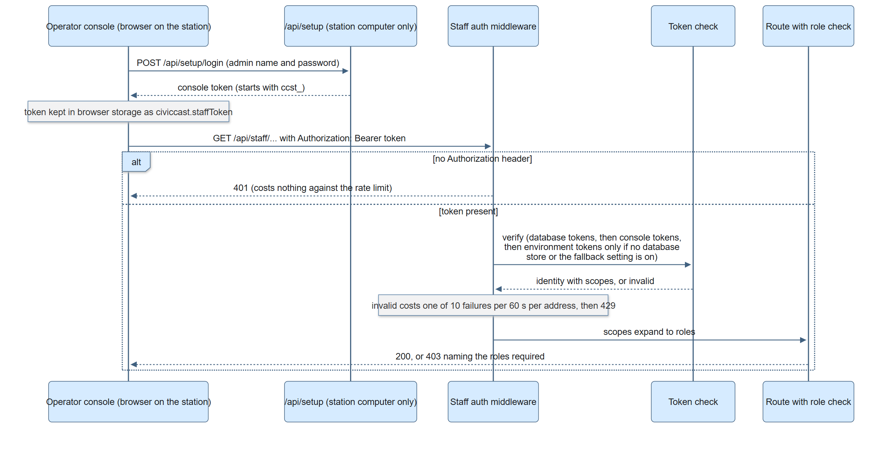{width=100%}

**What this shows.** There is no separate login page. Sign-in is on the First Setup screen. The first time, the administrator creates a name, a password and eight one-time recovery codes. Afterward, `POST /api/setup/login` with that name and password returns a new console token for that browser, without signing out any other browser. The browser sends the token on every request. The middleware looks at every path that begins with `/api/staff/`; every other path is open, and each route decides for itself. The three token kinds are:

| Kind | Looks like | Kept as | Used for |
| --- | --- | --- | --- |
| Console token | `ccst_` plus a random string | a salted HMAC-SHA256 in `station-state.json`; at most 20 at a time, oldest dropped first | people at the operator console |
| Lifecycle token | `ccst_` plus an id and a secret | a PBKDF2-SHA256 hash (210,000 iterations) in the `staff_tokens` table, with an audit table | scripts and the command line (`civiccast token issue`, `list`, `revoke`, `rotate`); can be revoked and rotated |
| Environment token | `ccenv1_` plus a random string | listed in `CIVICCAST_STAFF_TOKENS` with its roles | fixed configuration; cannot be revoked until it is removed from the setting; on a station that has the database token store it is accepted only when `CIVICCAST_STAFF_TOKENS_FALLBACK_WITH_DB=1` is also set |

The five roles are `setup_admin`, `meeting_operator`, `records_clerk`, `publish_operator` and `support_admin`. A token carries scopes, and the scopes expand to roles (`admin` and `operator` each mean all five). A token with no scopes has no roles. Each route lists the roles that may use it; one matching role is enough, and a wrong role gets a 403 that names the roles by their identifiers. In outline, from a scan of the route decorators (most of the roughly 490 operations in the API inventory name a role; the rest are open to any signed-in token, are public, or are checked inside the route; we did not re-count them for this edition): setup administrators configure the station, cable, graphics, playout and recording; meeting operators run live sessions, agendas, the program log and the facility; records clerks review captions, summaries and agendas; publish operators manage publishing, the schedule, program guide exports and moderation; and support administrators handle support bundles, reports and read-only alerts. The Appendix on roles has the full table. The navigation menu hides screens a role cannot use, but the menu is a convenience, not a security control: the route enforces the rule.

**Where the first sign-in is allowed from.** Sign-in and recovery (and first setup, until it is complete) are admitted by the network address alone: the request must come from the computer itself (a loopback address). They check no token. Opened from another computer, they answer 403. A person on a Remote Desktop session to the station is signing in from the station's own browser, so it works; the code only looks at the connection's address and we did not test a remote-desktop viewer for this chapter.

**Why it is built this way.** The design assumes one trusted station computer and a small number of people. There is no network-facing login, so there is no network password to guess; the cost is that all remote use goes through a remote-desktop session. Failed token checks are rate-limited by the direct peer address (forwarded-address headers are ignored); a request with no header at all is not counted, so a signed-out browser that loads the console cannot lock itself out.

> **Known issue (beta.10):** In a normal station, everyone who signs in at the console is the first administrator, and so has all five roles. The console has no screen to add a person, change a role or paste a token, and no way to give someone a smaller role. Role-limited use is possible only with a token made at the command line or (when `CIVICCAST_STAFF_TOKENS_FALLBACK_WITH_DB=1` is also set) in the environment, and we could not confirm how such a token is loaded into the console.

> **Warning:** The control plane serves plain HTTP on the loopback address. The program has a local certificate authority that can issue certificates for `civiccast-api` and `civiccast-worker` and a readiness check that reports on it, but nothing in the code uses those certificates to encrypt a connection or to check a client. Do not describe the station as using mutual TLS. The database connection is also plain, on loopback. If you place a reverse proxy in front of the control plane, it becomes responsible for encryption and for who may reach the staff routes; the program's own note on the setting `CIVICCAST_AUTH_ACK` only silences a start-up warning and enforces nothing. Console tokens are kept in the browser's local storage, so closing a browser does not sign out; there is no expiry time on console or lifecycle tokens in the code we read, and a token ends only on sign-out, revocation or being displaced by newer sign-ins.

### Installing and activating {#arch-install}

The installer is a standard Windows setup program built with Tauri and NSIS, with a series of steps (called *hooks*) that do the real work. Setup runs elevated (as an administrator). Figure 16-13 shows the steps in order.

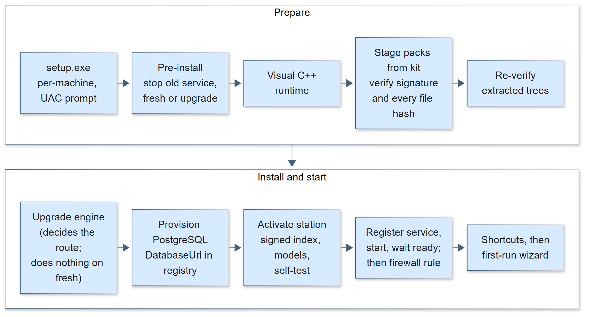{width=100%}

**What this shows.**

1. **The kit.** The installer expects a folder holding `setup.exe`, a `packs` folder of signed `.ccpack` files and a `station` folder with the signed station index and the model packs. There is no download in this elevated phase: if the packs are not beside `setup.exe`, stage-packs fails (exit 110) and setup tells you which packs are missing.
2. **Packs and signatures.** A `.ccpack` is a ZIP file with a manifest listing every file's SHA-256 and size, and an Ed25519 signature over that manifest. The installer carries the public key it will trust (a development key is refused unless explicitly allowed). It checks the signature, every file and the component name and version before it extracts anything, then checks the extracted tree again. Four packs are required: the server binaries (PostgreSQL tools, and TSDuck if included), the application payload (Python, CivicCast and both web apps), ffmpeg and Ollama. A fifth pack, the NVIDIA GPU libraries, is optional.
3. **The database.** Provisioning creates a PostgreSQL 17 cluster with `initdb` in `C:\ProgramData\CivicCast\data\pgdata`, writes a configuration that listens on `127.0.0.1` only, creates the `civiccast` database and the `civiccast_svc` role with a generated password, picks the first free port of 5432, 5433, 5434, 5435 and 5544, restricts the data folder's access list, and writes the connection string to the registry where only SYSTEM and administrators can read it. A provisioning run that ends in failure is not retried; it leaves a recovery document in `provision`. Provisioning also refuses to continue if the older WSL-based edition is registered, or if it cannot tell which edition owns the machine.
4. **Activation.** Activation verifies the signed station index and each model pack's signature, size and hash, checks that there is room (the sum of the pack sizes plus 2 GB), extracts the caption and AI models, and then runs a *self-test* before it declares the station activated. The self-test runs the caption model on a bundled sample recording (the text must contain the expected words), starts a private Ollama and checks its version, and sends test prompts to each AI model; per the installer inventory it also checks that the embedded Python, PostgreSQL and ffmpeg run. Only then does it write `station-set.json` and `activation-self-test.json`. The service will not start the station without them.
5. **The service.** Setup registers `CivicCastSupervisor`, starts the service and waits up to 180 seconds for the station to answer `/health` with a current database schema, then adds the firewall rule, writes the installed version to the registry and creates Start Menu and Desktop shortcuts that open `http://127.0.0.1:8000/operator/`.
6. **The first-run wizard.** After setup, a non-elevated window checks the computer's hardware, shows the components the station still needs and downloads any that are missing (caption models, the local AI model, optional GPU libraries) with a pinned size and hash for each file. The wizard recommends the Large caption engine only for an NVIDIA graphics card with at least 8 GB of video memory.

| Step | Setup exit code when it fails |
| --- | --- |
| Pre-install: could not stop the old service | 120 |
| Stage packs: required pack missing or untrusted | 110 |
| Verify extracted server binaries, app payload, ffmpeg, Ollama | 111, 112, 121, 122 |
| Provision the database | 116, 117; 127 or 135 if another CivicCast edition owns the machine |
| Activate: index or pack could not be verified; self-test or space failure | 123 (the activation tool itself exits 66, 67, 78, 64 or 65) |
| Register the service; start it and wait | 118; 126 if it will not start; 125 if it starts but does not serve |
| Firewall rule | 119 |

Each of these steps writes a time-stamped line before and after to `C:\ProgramData\CivicCast\install-progress.log`.

**Why it is built this way.** Every pack is signed and checked twice because the installer runs with full rights and the packs contain programs that will run as `LocalSystem`. The self-test exists so a station that looks installed but cannot caption or summarize is stopped at setup rather than discovered at the first meeting. The service refuses to start without the activation records for the same reason.

> **Known issue (beta.10):** A first install on a computer that has neither the full kit nor an earlier CivicCast install is not proven. In the beta.10 test, only the clean-install lane was run, and it used the full kit in Windows Sandbox. When the activation self-test fails, the dialog tells you to find the cause in `install-progress.log`, but the cause is shown only in the setup details pane, and exit 67 is also used for a full disk. A new install on a computer with a surviving data folder is handled by resetting the database password, but that path has not been tested in the upgrade lane. See [Chapter 10](#ch-installing).

### Updating, and going back {#arch-upgrade}

Running a newer `setup.exe` over an existing station upgrades it. The upgrade engine, a Python program in the new package, takes over after the new files are in place. Figure 16-14 shows its steps and what happens if one fails.

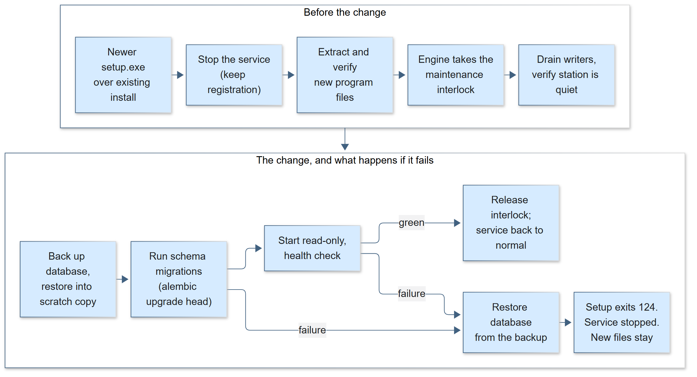{width=100%}

**What this shows.** The engine runs a series of steps and writes a *journal* after each one, so that a run that is interrupted can be resumed. It first takes the *maintenance interlock*, a flag in the registry that the supervisor reads to start the station read-only. It stops writers and checks that the database is quiet, then takes a full backup and proves it by restoring it into a scratch database and comparing rows, checksums and the schema revision. If that proof fails, nothing has been changed and the upgrade stops. It runs the migrations, starts the new code in maintenance mode, which brings up the database and the control plane and starts no video worker, and checks that the station is healthy. Only then does it release the interlock.

If the migration itself, or a step after it, fails, the engine restores the database from the backup. (A failure before the migration changes nothing in the database, so nothing is restored.) If the restore itself fails, the engine halts with the service stopped, keeps the backup and the journal, writes `UPGRADE-RECOVERY.md` and setup exits 113. A new release can also declare that its migration cannot be reversed; the engine then refuses to upgrade automatically (the engine exits 30, which setup reports as exit 114). The setup script does not appear to pass the flag that declares such a migration, so we did not see this refusal happen. An older setup over a newer install is refused outright (exit 129), because the database is not moved backwards.

**What a rollback does not do.**

- **It does not put the old program files back.** In the layout the installer uses, the new files are extracted into the one `runtime` folder before the engine starts, so there is no previous folder to return to. After a rollback the database is the old version's, the files on disk are the new version's, and the service is left stopped. The recovery document says to run the old version's `setup.exe` over the machine before starting the service.
- **The backup does not contain your recordings.** It is a database dump with an integrity manifest, saved in `C:\ProgramData\CivicCast\upgrade\backups\pre-<version>`. The upgrade does not touch `data\uploads`, but the backup does not protect it either.
- **A failed upgrade blocks the next one.** The journal of a run that ended in failure makes later runs stop (exit 128) until someone moves `upgrade-journal.json` aside; nothing removes it automatically.
- **There is no manual restore tool in setup.** The exit 114 message mentions a manual path with operator acknowledgement; we did not find the steps for it.

> **Warning:** Upgrade over an earlier release is not proven for beta.10. The cross-version (upgrade) lane of the acceptance test was not run, and the download-only lane was not run. Take your own full backup (the database and the whole of `C:\ProgramData\CivicCast`, plus the files in the note under Figure 16-4) before you upgrade a station that matters.

### Building and publishing a release {#arch-release}

This is about how the files you download came to exist, and what checks stand behind them. Figure 16-15 shows the chain.

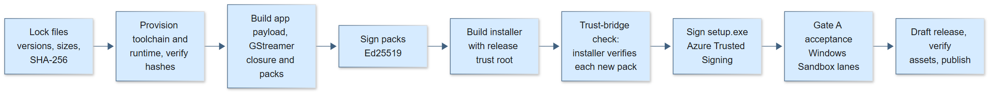{width=100%}

**What this shows.**

- **Pinned inputs.** Three lock files fix every external input: the runtime dependencies (ffmpeg n8.1.2 LGPL shared build, Node 24.15.0, Ollama 0.30.6, PostgreSQL 17.10-2 and TSDuck 3.44), the build toolchain, and the AI models (gemma4:12b, gemma4:e4b and translategemma:4b, each with its manifest and blob digests). A download is admitted only if its size and SHA-256 match.
- **The build refuses a dirty tree** and binds itself to one full commit identifier. It builds a GStreamer runtime closure and verifies it, builds each pack and signs it with an Ed25519 key held as a build secret, deleted afterward.
- **The trust-bridge check** runs the compiled installer's own code on the freshly signed packs, so a signing mistake is caught before anything is published.
- **Authenticode.** `setup.exe` is signed through Azure Trusted Signing (the key never leaves Microsoft's hardware), with an RFC 3161 timestamp, and the build fails unless Windows reports the signature as `Valid`. Checksums are regenerated from the signed file. Windows may still show a SmartScreen prompt, which is a matter of reputation, not signature.
- **No Sigstore or cosign.** The owner decided against them (ADR 0022). Provenance rests on the Authenticode signature, the Ed25519 pack signatures and the published checksums.
- **A software bill of materials** and a licence list are generated for the runtime and the application payload. The build refuses to produce them if any file has an unknown licence, and it rejects GPL-licensed GStreamer components.
- **Gate A** installs the exact published files in a clean Windows Sandbox in three lanes (clean install, upgrade over an older install, and download-only) and checks the result. The publish script requires that all three lanes passed against the same commit, then creates a draft release, checks the asset names and sizes, publishes it and records the result.

**Where beta.10 stands against this chain.** The clean-install lane passed 10 of 10 criteria. The upgrade lane and the download-only lane were not run, and the owner waived them for beta.10. We did not trace how that waiver was recorded in the publish step. The eight-hour lab run was on an earlier internal build, not on the published installer.

### Two example stations {#arch-topology}

CivicCast runs one station on one computer. Figure 16-16 shows two realistic shapes, a small station with one computer and one or two channels, and a larger station with more channels and more equipment around the same single computer.

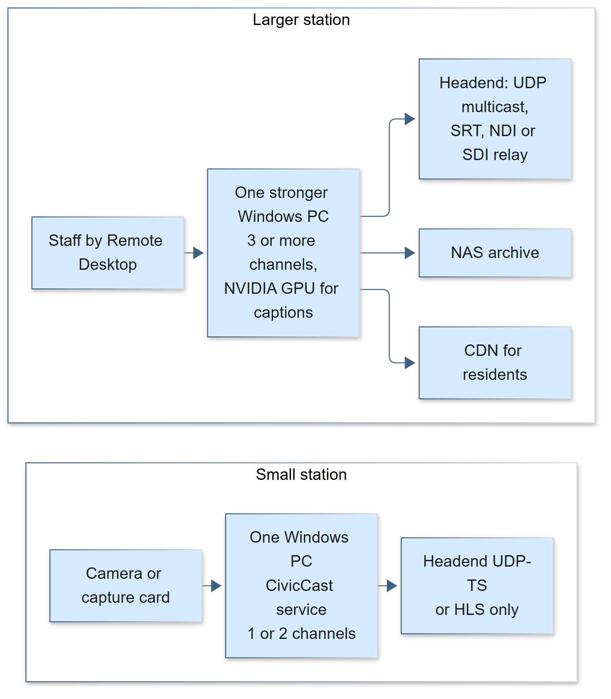{width=87%}

**The small station.** One Windows computer with the service installed, an audio and video source (a capture card, or a network camera or encoder), and one or two channels. Staff use the console in a browser on that computer. Residents reach recordings and the live channel through the portal, which as shipped listens only on the station computer itself (see the known issue under Figure 16-1). The live HLS folder is served by that same web server, so we could not confirm how residents on other computers would reach it without a CDN copy or other equipment in front of the station. Captions run on the processor with the Medium model, one channel's audio at a time. Whether that keeps up depends on the computer; when it does not, the caption worker sheds audio (Figure 16-10).

**The larger station.** More channels on one more powerful computer. The beta.10 lab run had three channels on one machine for 8 hours, with live captions embedded. A graphics card from NVIDIA with at least 8 GB of video memory lets the installer choose the Large caption engine, and the caption worker can run up to three channels' audio at once on a CUDA card, against one at a time on a processor. A network storage target receives archive copies. A CDN, once turned on, serves the recorded video. A cable headend takes a UDP transport stream (unicast or multicast; if TSDuck is installed, its relay holds one continuous session across worker restarts) or an SRT feed; NDI and SDI outputs depend on an ffmpeg build the station brings itself, because the NDI and Blackmagic software cannot be bundled. Staff who are not at the machine use Remote Desktop to reach the console, because the console only works from the station itself.

**What CivicCast does not do at any size.** It does not run one station across several computers. The control plane, the event bus, the rate limiter and the workers are all in one process on one computer; there is no failover computer and no shared database for a second control plane. If the one computer fails, the channels on it go off air until it is back. The 24-hour and 72-hour behavior of a station, real cable-operator acceptance, and physical SDI capture and output are not proven.

<!-- SOURCES: civiccast/auth/middleware.py:1-153; civiccast/auth/tokens.py:152-215; civiccast/auth/roles.py:14-100; civiccast/auth/rate_limit.py:66-105; civiccast/installer/router.py:1211-1263, 1353-1500; civiccast/installer/station_state.py:76, 645-842; civiccast/certs/authority.py; civiccast/app.py:2542-2549; inventory/screens/_shell-signin-and-session.md; inventory/screens/_shell-navigation-and-roles.md sections 3 and 5; ops fact sheet (app/auth); inventory/screens/installer-nsis-setup-wizard.md, installer-nsis-packs-and-verify.md, installer-nsis-upgrade-database.md, installer-nsis-activation-selftest.md, installer-nsis-service-finish.md, installer-component-catalog.md, installer-gui-checking-computer.md; civiccast/apps/installer/src-tauri/nsis-hooks-bootstrap.nsh (via fact sheet); civiccast/installer/native_packs.py:33-35, 232-252, 333-339; civiccast/native/provision/__main__.py:716-718, conf.py:62-135, port_select.py:140; civiccast/native/upgrade/orchestrator.py:19-30, 168-330, 410-445, 530-560; civiccast/native/upgrade/models.py:29-69; civiccast/native/upgrade/seams.py:100-215, 377-430; .github/workflows/native-beta-candidate-artifacts.yml; .github/workflows/sign-native-installer.yml; scripts/release/publish_beta_candidate.py (via fact sheet); native-windows-*.lock.json; CODE_SIGNING_POLICY.md; docs/adr/0022-sigstore-attestation-denied.md; civiccast/native/runtime_manifest.py; civiccast/native/runtime_closure.py; docs/releases/v1.0.0-beta.10-verification.md; civiccast/captions/tap_worker.py (default_max_channel_workers) -->

### What CivicCast does not do yet {#arch-gaps}

A technical reviewer should read this list before relying on the design. Each item is something we found in the code or in the beta.10 record. None of them is hidden in the sections above; they are collected here.

**One computer, one failure domain.**

- CivicCast does not run a station across several computers. The control plane, the event bus, the staff rate limiter and every worker thread are in one process on one computer. There is no failover computer and no way to run a second control plane on the same database. If the computer stops, the channels stop. The supervisor restarts what fails *on* that computer.
- The control plane listens on `127.0.0.1`. Other computers cannot reach the console or portal as shipped, although a firewall rule opens port 8000. Remote staff use Remote Desktop.
- There is no encrypted connection. The control plane and the database use plain connections on loopback. The local certificate authority and its readiness check do not encrypt or authenticate anything.
- The service runs as `LocalSystem`, with more rights than it needs. A least-privilege account is a recorded follow-up.

**People and access.**

- There is one administrator account. The console has no screen to add a person, give a smaller role or paste a token, so role limits are reachable only through the command line or the environment.
- Console and lifecycle tokens have no expiry in the code we read.

**Data protection and recovery.**

- There is no scheduled backup. The pre-upgrade backup holds the database only, not recordings.
- Some state files live outside `C:\ProgramData\CivicCast` (see the note under Figure 16-4).
- Rollback after a failed upgrade restores the database but not the program files, there is no downgrade, and there is no manual restore tool in setup. A failed upgrade's journal blocks later upgrades until it is moved by hand.
- We found no clean-up of the channel command table and no limit on how large the logs and caches under `data\egress` can grow, apart from the conform cache (60 GB default), the plan folders (5 GB), and the relay logs (5 MiB).

**Playout.**

- A channel in `ERROR` does not restart itself. The two output guards stop restarting a channel after three restarts in an hour.
- The GStreamer engine has no RTMP sink, and we did not find per-output loudness or the alert-tone filter in it; both exist only in the older FFmpeg engine.
- Hardware encoding is used only if a channel asks for it by name. The default encoder is a software encoder.
- A first-time program takes time to prepare, and a program change can wait on that preparation (the lead time is 11.5 minutes by default). There was an unexplained rebuild of a long cached program in an earlier internal run, and eleven daemon and automation unit tests fail the same way on the installed tree and the candidate tree; neither is explained.
- A single frame of video was dropped at one join in the lab run, and two program changes aborted and recovered by themselves.
- Command delivery from the staff API to the daemon is at most once, and the channel is driven by polling every 2 seconds.

**Captions, summaries and records.**

- Live captions are off in a new station profile, are English only, and can lose audio under heavy load. Captions embedded in the stream are not proven for CEA-708 broadcast compliance, and a channel whose profile uses HEVC cannot embed captions.
- Offline captions cannot finish without a Spanish review.
- The Internet Archive, NAS and YouTube surfaces are simulated until a provider is set to real. Subscriber notifications and podcasts are not active. ActivityPub is off by default.
- A summary's claims are checked against the cues' identifiers and times, not against their words. The signed-record export carries a placeholder timestamp and no digital signature that we could find.
- The public-safety display reads alerts and shows them; it is not an EAS device and does not relay the legally required EAS signal.

**Time.**

- Several screens treat the times you type as UTC (the Recording screen, and the Program Guide's weekday rules). ADR 0013 planned a station time-zone setting. The code now has one, but those screens still use UTC, and a program that recurs daily or weekly is stepped by fixed 24-hour and 7-day intervals in UTC, so its local air time can move by an hour when daylight-saving time changes.

**Proof.**

- beta.10 is a beta candidate. Only the clean-install lane of the acceptance test passed. The upgrade lane and the download-only lane were not run, the 8-hour lab run was on an earlier internal build, 24-hour and 72-hour operation was not tested, and no human field tester has signed off. Real cable-operator acceptance and physical SDI capture and output are not proven.

### The design decisions behind the figures {#arch-adrs}

The project records its major decisions as *architecture decision records* (ADRs). The table lists the ones this chapter relies on, the reason each gives, and whether the code in beta.10 still matches. ADRs 0002 to 0007, 0009, 0012 and 0019 were not re-checked for this chapter.

| ADR | Decision | Reason given | Still true in beta.10? |
| --- | --- | --- | --- |
| 0001 | A NATS JetStream message server | durable streams, consumer groups, an open licence | No. Superseded by 0023 |
| 0008 | Synchronous SQLAlchemy 2.0 with psycopg 3, one migration runner with per-module migration folders, schema `civiccast` | the rest of the program is synchronous; N migration runners would be unworkable | Yes |
| 0010 | Live session state changes are conditional `UPDATE`s, forward only: `idle`, `preflight`, `on_air`, `ending`, `recorded` | two operators racing a change must produce exactly one winner | Yes |
| 0011 | Finalization is one transaction; the event key makes it idempotent | a crash must not leave an event with no asset, or two assets | Yes (the code also records trim points) |
| 0013 | Browser time zone for now, a station time zone later | a form without a zone is ambiguous across daylight saving | Partly: the station setting exists, but the ADR was not updated, and some screens treat typed times as UTC |
| 0014 | Loudness target set per channel and per output, not a constant | web and cable expect different levels | Yes for the channel target and the conform; per-output re-leveling is in the FFmpeg engine's code, and we did not find it in the GStreamer engine |
| 0015 | One long-running FFmpeg process with a concat input | the cheapest way to keep one output session across programs | No. The default engine is now GStreamer; ADR 0015 describes the older engine |
| 0016 | A 1280 by 720, 30 fps, 6,000 kbit/s MPEG-TS profile with libx264 | a stable shape at every program change | The profile values are still the default; the code defaults to OpenH264 and does not ship x264 |
| 0017 | Operator commands go through a durable table, polled by the daemon | commands must survive restarts; seconds of delay do not matter | Yes for the table and polling. The ADR describes the daemon as its own long-lived process; in beta.10 it runs as a thread inside the control plane |
| 0018 | Captions are `not-verified` until the emitted stream is decoded and checked | a caption file elsewhere in the product is not proof that captions are in the stream | Yes |
| 0020 | Fastly and Akamai through a generic S3-compatible adapter | one adapter for both | Yes (the CDN factory) |
| 0021 | Native Windows service, supervisor, one Windows product | the WSL cost record; a service starts at boot; WSL cannot reach capture cards | Yes, except that NATS and the "Tauri operator console" statements are out of date |
| 0022 | No Sigstore or cosign attestation | the owner's decision; provenance is Authenticode and pack signatures | Yes |
| 0023 (NATS) | Remove NATS; keep an in-process bus behind an interface | NATS never carried real traffic and was a process, a port, a certificate and a health check | Yes |
| 0023 (as-run) | As-run rows go through a local durable journal first | the proof-of-performance record must survive a database outage | Yes. The journal sits in the service account's profile by default (see Figure 16-4) |
| 0024 | A watch folder never deletes its source files; an unreachable folder is a visible degraded state | never lose a source file; never fail silently | Yes |
| 0025 | A live source is ready only if it has been observed ready, within a time limit (30 seconds by default) | a configured camera that was unplugged for a week looked "ready" | Yes |

> **Note:** Two files in the ADR folder carry the number 0023. They are two separate decisions. The header of ADR 0001 still reads "Superseded by: N/A"; it was superseded by the NATS removal.

### Related {#arch-related}

- [Chapter 9: Planning your station](#ch-planning) for hardware, network and storage.
- [Chapter 10: Installing](#ch-installing) for the steps behind Figures 16-13 and 16-14.
- [Chapter 12: Running it day to day](#ch-operations) for service, logs, backups and updates.
- [Chapter 13: Security and privacy](#ch-security) for the consequences of Figure 16-12.
- [Chapter 14: Troubleshooting](#ch-troubleshooting) for symptoms of the failures in Figures 16-7 and 16-8.
- [Chapter 15: Integrations](#ch-integrations) for headends, streaming, CDNs, federation and the API.

<!-- SOURCES: docs/adr/0001, 0008, 0010, 0011, 0013, 0014, 0015, 0016, 0017, 0018, 0020 (via civiccast/stream/cdn/factory.py), 0021, 0022, 0023 (both), 0024, 0025; docs/releases/v1.0.0-beta.10-verification.md (known limits 1-6, what is not proven); ops/docs-sprint/inventory/screens/installer-install-layout.md (HELP-102); inventory/screens/recording.md and guide.md (UTC); civiccast/installer/station_state.py:216-258 (station time zone); civiccast/native/upgrade/orchestrator.py:410-445, 530-560; civiccast/dr/backup.py; civiccast/egress/daemon.py:436-500; civiccast/egress/store.py:436-458 (at-most-once); civiccast/egress/preparer.py:23, 144; civiccast/egress/hls_relay.py (log cap); app-auth-db fact sheet sections 2, 5, 6 -->

\newpage

# Part IV. Reference {#part-4}

Lookup material: commands, web interface, settings, files and ports, status words, roles, checklists, measured evidence, a glossary, licenses and release history.

## Appendix A: Command-line reference {#app-cli}

CivicCast has one command-line program, `civiccast`. It is for the IT person, not for a clerk or operator: nothing in the operator console requires it. You use it to check the computer, to issue or revoke the access tokens that scripts and tools use, to run the disaster-recovery drill, and to run a few checks on the cable output. Every command below exists in beta.10 (42 commands in 13 groups).

### Where the program is

On the Windows station, the installer puts CivicCast's own copy of Python and the `civiccast` program inside the install folder (normally `C:\Program Files\CivicCast (Native)`; if you chose another folder in setup, use that one). You do not need to install Python yourself. There are two equivalent ways to run it.

| Way | What you type (PowerShell, from any folder) |
| --- | --- |
| The launcher | `& "C:\Program Files\CivicCast (Native)\runtime\Lib\site-packages\bin\civiccast.exe" doctor` |
| CivicCast's Python | `& "C:\Program Files\CivicCast (Native)\runtime\python.exe" -m civiccast.cli doctor` |

Replace `doctor` with any command from the tables below. Add `--help` after any command or group to see its options on screen, for example `... civiccast.exe token --help`. A second launcher, `civiccast-runtime.exe`, sits beside it; it runs only the `runtime` group.

> **Tip:** To save typing, put the folder in a variable for the session: `$cc = "C:\Program Files\CivicCast (Native)\runtime\Lib\site-packages\bin\civiccast.exe"` and then run `& $cc doctor`.

### Before you run a command

1. **Use an Administrator PowerShell for anything that touches the station's data.** The station's database address is stored in the Windows registry at `HKLM\SOFTWARE\CivicCast\Native` (value `DatabaseUrl`), and only the SYSTEM account and Administrators can read it.
2. **The `token` commands need the database address in the shell.** They print "DATABASE_URL must point at the CivicCast database before running staff token lifecycle commands." when it is missing. Set the environment variable `DATABASE_URL` for that PowerShell window from the registry value (the value contains the database password; do not paste it into tickets or chat).
3. **A command that changes something changes the live station.** `token revoke` cannot be undone; issue a new token instead.

> **Warning:** Do not run the `runtime cutover-to-native` or `runtime rollback-to-wsl` commands on a station that has never had the older WSL-based CivicCast edition. They exist to move a machine between the two editions; the supervisor refuses to start the station while the guard thinks the other edition is active.

### How to read the tables

Each command has its own small table. The columns are:

| Column | Meaning |
| --- | --- |
| Option / argument | What you type after the command. `--name` options are optional unless the table says `(required)`. A word with no dashes (an *argument*) is positional: you type the value in that place. |
| Type | `str` is text, `int` a whole number, `path` a file or folder path, `boolean` a switch you add with no value. |
| Default | What the command uses when you leave the option out. Blank means no default. |
| Env var | An environment variable that supplies the value when the option is left out. Blank means none. |
| What it does | The program's own help text. |

Nearly every command accepts `--json`. It prints one machine-readable record instead of sentences, which is what you want in a script.

### The commands you will use most

| Command | Use it to | Notes |
| --- | --- | --- |
| `civiccast doctor` | Probe this computer: CPU, memory, disk, graphics card, operating system and the recommended hardware tier. | Add `--profile` for the full station-box profile (playout engine, clock, AI default, readiness). |
| `civiccast token issue` | Make an access token for a script or tool (see [Appendix B](#app-api)). | The secret is printed once. Default scope is `operator`, which means all five roles; narrow it with `--scopes`. |
| `civiccast token list`, `revoke`, `rotate` | See, retire or replace tokens. | `list` never shows secrets. Needs `DATABASE_URL`. |
| `civiccast dr run-drill --out <folder>` | Run the real disaster-recovery drill: back up the database, restore it into a fresh copy, test crash recovery. | The same drill is a button on the Readiness screen. Read [Appendix G](#app-checklists). |
| `civiccast cable doctor` | Run the read-only cable-headend readiness checks. | `--profile` defaults to `public-meetings`. |
| `civiccast cable commission` | Run the whole cable commissioning flow. | Sends a test signal to the headend address you give it. Do not run it while that channel is live. |
| `civiccast live-takeover state`, `take`, `return` | Check, begin or end a live takeover of one channel from the command line. | Uses the same takeover service and readiness gate as the Channels screen. |
| `civiccast egress verify` | Run a bounded TSDuck check of the channel's headend stream. | Needs the TSDuck tool (optional component). |
| `civiccast model state` | Print which AI models are installed and proven. | `model download` fetches models; `model import-offline` verifies an offline bundle. |
| `civiccast activitypub keygen` | Generate the station's federation key and print the settings to add. | Federation is off by default. |

### Full command tables

The tables below are generated from the program itself, so they match beta.10 exactly.

42 commands. Generated by `ops/docs-sprint/tools/gen_cli_inventory.py`; do not edit by hand.

##### activitypub

###### `civiccast activitypub keygen`

Generate ActivityPub key material and print non-secret env settings.

| Option / argument | Type | Default | Env var | What it does |
| --- | --- | --- | --- | --- |
| `--private-key-path` (required) | path |  |  | Where to write the ActivityPub private key. |
| `--base-url` (required) | str |  |  | Public HTTPS base URL for this station. |
| `--handle` | str | civiccast |  | Station account handle, e.g. civiccast. |
| `--mode` | str | approval-only |  | Federation mode: open, limited, or approval-only. |
| `--json` | boolean | False |  | Emit machine-readable JSON. |

##### cable

###### `civiccast cable commission`

S3 screens 8-11: run the full cable commissioning flow end to end.

| Option / argument | Type | Default | Env var | What it does |
| --- | --- | --- | --- | --- |
| `--channel-id` (required) | str |  |  | Channel to commission. |
| `--headend-profile` (required) | str |  |  | Headend profile id from the catalog. |
| `--destination` (required) | str |  |  | Headend destination address:port. |
| `--channel-name` | str |  |  | Human-readable channel name. |
| `--output-format` | str | 1080p30 |  | 720p30 \| 1080i60 \| 1080p30 \| SD480i60. |
| `--sdi-device` | str |  |  | DeckLink device name, if SDI is used. |
| `--fill-policy` | str | slate |  | slate \| loop \| silence. |
| `--slate-asset-id` | str |  |  | Emergency slate asset id. |
| `--duration-seconds` | int | 60 |  | Output-proof run duration. |
| `--station-name` | str |  |  | Station name to stamp on the report. |
| `--json` | boolean | False |  | Emit machine-readable JSON. |

###### `civiccast cable doctor`

S3 Screen 8: run the first-run cable commissioning checks (read-only).

| Option / argument | Type | Default | Env var | What it does |
| --- | --- | --- | --- | --- |
| `--profile` | str | public-meetings |  | Deployment profile to evaluate cable readiness for. |
| `--station-name` | str |  |  | Station name to stamp on the report. |
| `--json` | boolean | False |  | Emit machine-readable JSON. |

###### `civiccast cable ndi-check`

Check whether this host can output NDI through FFmpeg.

| Option / argument | Type | Default | Env var | What it does |
| --- | --- | --- | --- | --- |
| `--json` | boolean | False |  | Emit machine-readable JSON. |

###### `civiccast cable ndi-plan`

Build the FFmpeg command plan for local-file-to-NDI output.

| Option / argument | Type | Default | Env var | What it does |
| --- | --- | --- | --- | --- |
| `--media` (required) | path |  |  | Local source media file to send to NDI. |
| `--ndi-name` (required) | str |  |  | NDI channel name shown to receivers. |
| `--muxer` | str | libndi_newtek |  | FFmpeg NDI muxer to target after `civiccast cable ndi-check`. |
| `--json` | boolean | False |  | Emit machine-readable JSON. |

###### `civiccast cable package`

Create a local cable file package from real media and captions.

| Option / argument | Type | Default | Env var | What it does |
| --- | --- | --- | --- | --- |
| `--asset-id` (required) | str |  |  | CivicCast asset id for the recording. |
| `--title` (required) | str |  |  | Human-readable meeting or program title. |
| `--media` (required) | path |  |  | Local source media file to include in the package. |
| `--captions` (required) | path |  |  | Caption sidecar file, usually WebVTT or SRT. |
| `--output-dir` (required) | path |  |  | Directory where the cable package is written. |
| `--portal-url` | str |  |  | Optional CivicCast portal URL for the manifest. |
| `--json` | boolean | False |  | Emit machine-readable JSON. |

###### `civiccast cable support-bundle`

S3 Screen 11: export a redacted support bundle (logs, config, health).

| Option / argument | Type | Default | Env var | What it does |
| --- | --- | --- | --- | --- |
| `--output-dir` | path |  |  | Unused placeholder; bundles are server-managed. |
| `--note` | str |  |  | Optional operator note for the bundle. |
| `--json` | boolean | False |  | Emit machine-readable JSON. |

##### cert

###### `civiccast cert rotate`

Rotate one local-CA service certificate without printing private keys.

| Option / argument | Type | Default | Env var | What it does |
| --- | --- | --- | --- | --- |
| `identity` (required) | str |  |  | Known service identity to rotate. |
| `--json` | boolean | False |  | Emit machine-readable JSON. |

##### (top level)

###### `civiccast doctor`

Probe local hardware and report CPU, RAM, disk, GPU, OS, recommended tier.

| Option / argument | Type | Default | Env var | What it does |
| --- | --- | --- | --- | --- |
| `--json` | boolean | False |  | Emit the probe as JSON (one object, machine-readable). |
| `--disk` | str |  |  | Filesystem path to probe for disk space (defaults to home directory). |
| `--profile` | boolean | False |  | Render the full S1 StationBoxProfile (playout-engine readiness, cable output, clock, AI default, PEG readiness) instead of just the hardware probe. |

##### dr

###### `civiccast dr run-drill`

Run the real 0.5.0 disaster-recovery drill: backup, restore, crash-recovery.

| Option / argument | Type | Default | Env var | What it does |
| --- | --- | --- | --- | --- |
| `--out` (required) | path |  |  | Directory to write dr-drill-report.md/.json into. |
| `--backup-dir` | path |  |  | Backup destination (default: <out>/backup). |
| `--work-dir` | path |  |  | Scratch dir for restore/crash drills (default: <out>/work). |
| `--database-url` | str |  |  | DATABASE_URL to drill (default: $DATABASE_URL). sqlite:// or postgresql://. |
| `--media-root` | path |  |  | Media library root to manifest (optional). |

##### egress

###### `civiccast egress caption-decode-proof`

Compare decoded emitted-stream captions with expected captions.

| Option / argument | Type | Default | Env var | What it does |
| --- | --- | --- | --- | --- |
| `--channel-id` (required) | str |  |  | Channel id measured during the caption proof. |
| `--emitted-stream` (required) | path |  |  | Emitted stream file that was decoded. |
| `--expected-captions` (required) | path |  |  | Expected WebVTT or SRT caption file. |
| `--decoded-captions` (required) | path |  |  | Decoded WebVTT or SRT file from the emitted stream. |
| `--decoder-name` | str | ffmpeg-cc-decode |  | Name of the decoder used to read the emitted stream. |
| `--timing-tolerance-seconds` | float | 0.75 |  | Allowed start/end timing difference for each decoded caption cue. |
| `--output-path` | path |  |  | Optional JSON evidence file to write. |
| `--json` | boolean | False |  | Emit machine-readable JSON. |

###### `civiccast egress continuity-proof`

Run a FileSink continuity and loudness proof for one egress source plan.

| Option / argument | Type | Default | Env var | What it does |
| --- | --- | --- | --- | --- |
| `--source-plan-json` (required) | path |  |  | JSON file containing the ordered egress source plan to prove. |
| `--config-json` (required) | path |  |  | JSON file containing the egress channel config. |
| `--output-path` (required) | path |  |  | MPEG-TS FileSink output path for this proof run. |
| `--work-dir` | path |  |  | Directory for temporary continuity proof files. |
| `--json` | boolean | False |  | Emit machine-readable JSON. |

###### `civiccast egress output test-pattern`

S3 Screen 10: drive a bounded test pattern through the GStreamer engine to the selected sink.

| Option / argument | Type | Default | Env var | What it does |
| --- | --- | --- | --- | --- |
| `--channel-id` (required) | str |  |  | Channel to drive the test pattern to. |
| `--pattern` | str | bars |  | bars \| live \| slate. |
| `--duration-seconds` | int | 600 |  | How long to run the test pattern. |
| `--json` | boolean | False |  | Emit machine-readable JSON. |

###### `civiccast egress run`

Run the channel egress worker loop.

| Option / argument | Type | Default | Env var | What it does |
| --- | --- | --- | --- | --- |
| `--channel-id` | str |  |  | Channel id to poll. Repeat this option for more than one channel. |
| `--work-dir` | path |  |  | Directory for temporary egress plans and generated slate files. |
| `--poll-seconds` | float | 2.0 |  | Seconds to wait between polling passes. |
| `--once` | boolean | False |  | Poll once, print a report, and exit. |
| `--json` | boolean | False |  | Emit machine-readable JSON. |

###### `civiccast egress srt-continuity-proof`

Run a representative SRT receiver continuity and loudness proof.

| Option / argument | Type | Default | Env var | What it does |
| --- | --- | --- | --- | --- |
| `--source-plan-json` (required) | path |  |  | JSON file containing the ordered egress source plan to prove. |
| `--config-json` (required) | path |  |  | JSON file containing the egress channel config. |
| `--sender-url` (required) | str |  |  | Secret-free SRT caller URL for the sender. |
| `--receiver-url` (required) | str |  |  | Secret-free SRT listener URL for the receiver. |
| `--receiver-output-path` (required) | path |  |  | MPEG-TS file written by the receiver. |
| `--work-dir` | path |  |  | Directory for temporary continuity proof files. |
| `--json` | boolean | False |  | Emit machine-readable JSON. |

###### `civiccast egress trim-health`

Trim old egress health telemetry.

| Option / argument | Type | Default | Env var | What it does |
| --- | --- | --- | --- | --- |
| `--older-than-days` | int | 30 |  | Delete egress health telemetry older than this many days. |
| `--dry-run` | boolean | False |  | Show the cutoff without deleting health telemetry. |
| `--json` | boolean | False |  | Emit machine-readable JSON. |

###### `civiccast egress verify`

Run a bounded TSDuck verification of the channel's headend stream (CA-7).

| Option / argument | Type | Default | Env var | What it does |
| --- | --- | --- | --- | --- |
| `--channel-id` (required) | str |  |  | Channel whose headend stream to verify. |
| `--seconds` | int | 10 |  | How long to capture the live stream. |
| `--work-dir` | path |  |  | Directory for probe artifacts. |
| `--json` | boolean | False |  | Emit machine-readable JSON. |

###### `civiccast egress verify-captions`

Standalone CEA-708 embed-through-decode-back proof (S11 -> S3).

| Option / argument | Type | Default | Env var | What it does |
| --- | --- | --- | --- | --- |
| `--duration-seconds` | int | 8 |  | Bounded window to run the embed+decode-back proof for. |
| `--muxrate-kbps` | int | 2000 |  | Test-pattern mux rate in kbps. |
| `--work-dir` | path |  |  | Working directory for the embed run (defaults to the egress work dir). |
| `--caption-text` | str |  |  | Override the deterministic test caption text. |
| `--json` | boolean | False |  | Emit machine-readable JSON. |

##### installer

###### `civiccast installer beta-handoff`

Print fail-closed beta tester handoff readiness.

| Option / argument | Type | Default | Env var | What it does |
| --- | --- | --- | --- | --- |
| `--release-manifest` | path |  |  | Release artifact manifest to evaluate for tester acquisition. |
| `--clean-windows-evidence` | path |  |  | Clean Windows install proof JSON to include in the handoff status. |
| `--json` | boolean | False |  | Emit machine-readable JSON. |

###### `civiccast installer health-check`

Run fail-closed first-run health checks for publish surfaces.

| Option / argument | Type | Default | Env var | What it does |
| --- | --- | --- | --- | --- |
| `--profile` | str | public-meetings |  | Deployment profile to verify. |
| `--json` | boolean | False |  | Emit machine-readable JSON. |

###### `civiccast installer plan`

Print the first-run installer plan.

| Option / argument | Type | Default | Env var | What it does |
| --- | --- | --- | --- | --- |
| `--profile` | str | public-meetings |  | Deployment profile to plan. Default: public-meetings. |
| `--recommended-tier` | str | tier-1 |  | Tier from civiccast doctor or the installer hardware probe. |
| `--json` | boolean | False |  | Emit machine-readable JSON. |

###### `civiccast installer platform-plan`

Print the cross-platform installer bootstrap plan.

| Option / argument | Type | Default | Env var | What it does |
| --- | --- | --- | --- | --- |
| `--os-family` | str | linux |  | Platform family: linux or macos. Windows deployment readiness is decided separately, by the native station's own activation state (civiccast.installer.service), not this generic plan. |
| `--json` | boolean | False |  | Emit machine-readable JSON. |

###### `civiccast installer summary`

Print fail-closed cross-platform installer readiness.

| Option / argument | Type | Default | Env var | What it does |
| --- | --- | --- | --- | --- |
| `--json` | boolean | False |  | Emit machine-readable JSON. |

###### `civiccast installer verify-package`

Verify package bytes, sidecar hash, signed install manifest, and attestation.

| Option / argument | Type | Default | Env var | What it does |
| --- | --- | --- | --- | --- |
| `--artifact` (required) | path |  |  | Package artifact path. |
| `--sidecar` (required) | path |  |  | Package sidecar JSON path. |
| `--json` | boolean | False |  | Emit machine-readable JSON. |

##### live-takeover

###### `civiccast live-takeover return`

Return one channel from a live takeover to its scheduled playout.

| Option / argument | Type | Default | Env var | What it does |
| --- | --- | --- | --- | --- |
| `--channel-id` (required) | str |  |  | Channel to return to its scheduled source. |
| `--operator-id` (required) | str |  |  | Operator id recorded in the takeover audit. |
| `--notes` | str |  |  | Optional handback notes for the audit. |
| `--json` | boolean | False |  | Emit machine-readable JSON. |

###### `civiccast live-takeover state`

Show whether a channel is under live takeover and whether it can take/return.

| Option / argument | Type | Default | Env var | What it does |
| --- | --- | --- | --- | --- |
| `--channel-id` (required) | str |  |  | Channel whose takeover state to read. |
| `--json` | boolean | False |  | Emit machine-readable JSON. |

###### `civiccast live-takeover take`

Begin a live takeover for one channel (queues the engine cut + records audit).

| Option / argument | Type | Default | Env var | What it does |
| --- | --- | --- | --- | --- |
| `--channel-id` (required) | str |  |  | Channel to cut to a live source. |
| `--operator-id` (required) | str |  |  | Operator id recorded in the takeover audit. |
| `--operator-name` | str |  |  | Operator display name for the audit. |
| `--reason` | str |  |  | Why the channel is being taken live. |
| `--path-id` | str |  |  | Specific live ingest path id (default: recommended path). |
| `--duration-seconds` | float | 3600.0 |  | Planned live duration before automatic handback. |
| `--json` | boolean | False |  | Emit machine-readable JSON. |

##### media

###### `civiccast media thumbnails-backfill`

Generate thumbnails for assets that don't have one yet.

| Option / argument | Type | Default | Env var | What it does |
| --- | --- | --- | --- | --- |
| `--json` | boolean | False |  | Emit machine-readable JSON. |

##### model

###### `civiccast model download`

Download the real local AI models or print the offline bundle manifest.

| Option / argument | Type | Default | Env var | What it does |
| --- | --- | --- | --- | --- |
| `--offline-bundle` | boolean | False |  | Emit the air-gapped model bundle manifest instead of downloading. |
| `--profile` | str | public-meetings |  | Deployment profile for the bundle manifest. |
| `--json` | boolean | False |  | Emit machine-readable JSON. |
| `--dry-run` | boolean | False |  | Show the model download plan without pulling models. |
| `--cache-dir` | str |  |  | Directory for the faster-whisper model snapshot. |
| `--bundle-dir` | str |  |  | Directory containing offline model artifacts. Required with --offline-bundle so the manifest can emit real SHA-256 values. |

###### `civiccast model import-offline`

Verify an offline model bundle from real file hashes.

| Option / argument | Type | Default | Env var | What it does |
| --- | --- | --- | --- | --- |
| `--bundle-dir` (required) | path |  |  | Offline bundle directory. |
| `--expected` (required) | str |  |  | Expected filename=sha256 pair. Repeat for each model artifact. |
| `--json` | boolean | False |  | Emit machine-readable JSON. |

###### `civiccast model set-provider-key`

Store (or clear) a cloud-provider API key for the hosted AI tiers (S13 D13).

| Option / argument | Type | Default | Env var | What it does |
| --- | --- | --- | --- | --- |
| `provider` (required) | str |  |  | Cloud provider to store a key for: ollama-cloud or openrouter. |
| `--key` | str |  |  | The provider API key. Omit to read it from the CIVICCAST_PROVIDER_API_KEY environment variable (preferred for headless/air-gap installs so the secret never appears in shell history). |
| `--clear` | boolean | False |  | Remove the stored key for the provider instead of saving. |
| `--json` | boolean | False |  | Emit machine-readable JSON. |

###### `civiccast model state`

Print installer-facing model proof state.

| Option / argument | Type | Default | Env var | What it does |
| --- | --- | --- | --- | --- |
| `--json` | boolean | False |  | Emit machine-readable JSON. |

##### output

###### `civiccast output sdi-readiness`

S3: quick check -- is the GStreamer SDI output path ready?

| Option / argument | Type | Default | Env var | What it does |
| --- | --- | --- | --- | --- |
| `--json` | boolean | False |  | Emit machine-readable JSON. |

##### runtime

###### `civiccast runtime cutover-to-native`

D7: cut over from WSL to native. Journal-backed; safe to re-run.

| Option / argument | Type | Default | Env var | What it does |
| --- | --- | --- | --- | --- |
| `--state-dir` | path |  |  | Override the journal/evidence directory (default: `%ProgramData%\CivicCast\logs`). |
| `--interlock-owner` | str |  |  | Migration-owned interlock: verify (never take) a held record bound to this owner run id. |
| `--interlock-generation` | int |  |  | Migration-owned interlock: the generation the record must still match at every phase boundary. |
| `--force-new` | boolean | False |  | Explicitly discard an existing INCOMPLETE journal of the opposite direction and start fresh (CC-WS4-007) -- only after confirming the in-flight run is genuinely abandoned. |
| `--json` | boolean | False |  | Emit machine-readable JSON. |

###### `civiccast runtime probe`

Dump raw GuardInputs (diagnostics).

| Option / argument | Type | Default | Env var | What it does |
| --- | --- | --- | --- | --- |
| `--json` | boolean | False |  | Emit machine-readable JSON. |

###### `civiccast runtime rollback-to-wsl`

D8: roll back from native to WSL. Refuses without --ack. Runs INSIDE the D7a transfer interlock (CC-WS4-003), same treatment as cutover-to-native -- it also mutates the selector.

| Option / argument | Type | Default | Env var | What it does |
| --- | --- | --- | --- | --- |
| `--ack` | str |  |  | Must exactly equal the printed boundary statement. |
| `--exe-path` | str |  |  | Installed exe path for the restored Run entry. |
| `--state-dir` | path |  |  | Override the journal/evidence directory (default: `%ProgramData%\CivicCast\logs`). |
| `--interlock-owner` | str |  |  | Migration-owned interlock: verify (never take) a held record bound to this owner run id. |
| `--interlock-generation` | int |  |  | Migration-owned interlock: the generation the record must still match at every phase boundary. |
| `--force-new` | boolean | False |  | Explicitly discard an existing INCOMPLETE journal of the opposite direction and start fresh (CC-WS4-007) -- only after confirming the in-flight run is genuinely abandoned. |
| `--json` | boolean | False |  | Emit machine-readable JSON. |

###### `civiccast runtime status`

Read selector + interlock + run all probes + decide; report.

| Option / argument | Type | Default | Env var | What it does |
| --- | --- | --- | --- | --- |
| `--json` | boolean | False |  | Emit machine-readable JSON. |

##### token

###### `civiccast token generate-env`

Generate a random secret for one CIVICCAST_STAFF_TOKENS entry.

###### `civiccast token issue`

Issue a staff bearer token and print the secret once.

| Option / argument | Type | Default | Env var | What it does |
| --- | --- | --- | --- | --- |
| `--operator-id` (required) | str |  |  | Stable operator id. |
| `--display-name` (required) | str |  |  | Human-readable operator display name. |
| `--scopes` | str | operator |  | Comma-separated token scopes. |
| `--save-keyring` | boolean | False |  | Save the issued token in the OS keyring. |
| `--json` | boolean | False |  | Emit machine-readable JSON. |

###### `civiccast token list`

List staff token metadata without bearer secrets.

| Option / argument | Type | Default | Env var | What it does |
| --- | --- | --- | --- | --- |
| `--json` | boolean | False |  | Emit machine-readable JSON. |

###### `civiccast token revoke`

Revoke a staff token so future staff-route requests fail closed.

| Option / argument | Type | Default | Env var | What it does |
| --- | --- | --- | --- | --- |
| `token_id` (required) | str |  |  | Public token id to revoke. |
| `--reason` | str | operator-requested |  | Audit reason recorded with the revocation. |
| `--json` | boolean | False |  | Emit machine-readable JSON. |

###### `civiccast token rotate`

Revoke one staff token and issue a replacement for the same operator.

| Option / argument | Type | Default | Env var | What it does |
| --- | --- | --- | --- | --- |
| `token_id` (required) | str |  |  | Public token id to rotate. |
| `--save-keyring` | boolean | False |  | Save the replacement token in the OS keyring. |
| `--json` | boolean | False |  | Emit machine-readable JSON. |

<!-- SOURCES: inventory/generated/cli.md; civiccast/cli.py:2040-2180 (token commands, DATABASE_URL message), :2746-2755 (main_entrypoint); pyproject.toml:138-144 (two launchers); civiccast/native/app_payload.py:116-130 (bin/civiccast.exe inside site-packages); civiccast/native/supervisor/install_layout.py:95-100 (runtime\Lib\site-packages); civiccast/native/supervisor/service_env.py:74-78 (DatabaseUrl registry value); inventory/screens/installer-install-layout.md section 4 (registry ACL); civiccast/native/runtime_cli.py:1-40 (runtime group is for the WSL edition) -->

## Appendix B: HTTP API overview {#app-api}

CivicCast's web pages are built on an HTTP API: the operator console and the resident portal are both clients of it. IT staff and integrators can call the same API. This appendix explains who may call what; the generated tables at the end list every route.

### Where it is

On the station itself the API answers at `http://127.0.0.1:8000`. The program binds to the loopback address only, so it cannot be reached from other computers as installed, even though setup also opens Windows Firewall port TCP 8000 (see [Appendix D](#app-files)). Reaching it from elsewhere on the network needs something that you add, such as a reverse proxy. The same server serves the operator console at `/operator/` and the resident portal at `/`.

### The three groups of routes

| Group | Path starts with | Operations | Route groups | Who may call it |
| --- | --- | --- | --- | --- |
| Public | `/api/public/` | 53 | 19 | Anyone who can reach the server. No token. These feed the resident portal: channels and live status, schedule, recordings, search, captions, subscriptions, public agendas, the contributor form, the paywall status, and the app settings. |
| Staff | `/api/staff/` | 415 | 52 | Holders of a staff access token, and then only for the roles that route allows (see [Appendix F](#app-roles)). These feed the operator console. |
| Setup | `/api/setup/` | 7 | 6 | The station computer itself. First setup, sign-in, recovery and storage preparation. |
| Other | root and a few fixed paths | 13 | 4 | Protocol and utility routes (see below). |

In total the beta.10 server exposes 488 operations on 405 paths in 81 groups.

The 13 "other" operations are: ten at the root level (`/health`, the two federation discovery routes `/.well-known/nodeinfo` and `/.well-known/webfinger`, `/nodeinfo/2.0`, the four ActivityPub routes `/ap/actor`, `/ap/followers`, `/ap/inbox`, `/ap/outbox`, and the media file routes `/media/live/...` and `/media/vod/...`), plus `/api/hardware`, `/api/version` and the signed Stripe webhook `/api/webhooks/stripe`. None of these is covered by the staff-token check.

> **Note:** `GET /health` always answers with HTTP 200 while the program is running. Read the `status` field instead: `healthy` means the database layout matches the program; `degraded` means it does not. `schema` is one of `current`, `behind`, `not-configured` or `unknown`.

### How a caller proves who it is (the auth model)

1. **Staff routes need a bearer token.** Send the header `Authorization: Bearer <token>` with every request. A request with no header gets HTTP 401 and does not count against the lock-out limit.
2. **Where tokens come from.**
   - Sign in as the first admin: `POST /api/setup/login` from the station computer returns an `operator_console_token`. This is what the console does. The same call from another computer is refused with HTTP 403.
   - Or issue a token with `civiccast token issue` ([Appendix A](#app-cli)). The console has no screen for pasting such a token in; it is for scripts and tools.
   - Or list tokens in the `CIVICCAST_STAFF_TOKENS` setting (an older method; the server cannot revoke these, so you retire one by changing the setting). On a station that has its database token store, as the native station does, these entries are honored only when `CIVICCAST_STAFF_TOKENS_FALLBACK_WITH_DB=1` is also set.
3. **A token carries scopes, and scopes become roles.** `admin` and `operator` mean all five roles; `setup_admin`, `meeting_operator`, `records_clerk`, `publish_operator` and `support_admin` (also written `setup`, `meeting`, `records`, `publish`, `support`) mean one role each. A token with no scopes has no roles.
4. **Each route names the roles that may use it.** A signed-in caller with the wrong role gets HTTP 403: "This action requires one of these CivicCast roles: ..." followed by the role names in alphabetical order.
5. **Rate limit.** Ten failed token checks in 60 seconds from one client address earns HTTP 429 ("Too many failed staff authentication attempts. Wait and retry.") with a `Retry-After` header. The numbers are settings (`CIVICCAST_AUTH_RATE_LIMIT`, `CIVICCAST_AUTH_RATE_LIMIT_WINDOW_SECONDS`). A caller that sends the exact right token is not blocked by other people's failures.
6. **Read versus write.** In beta.10 almost every `/api/staff/` route that changes something requires a role. The staff routes with no role requirement are all reads (lists, status, thumbnails) plus `POST /api/staff/auth/sign-out`; for those any valid token is enough. In the console this shows up as screens a role can open but cannot use ([Appendix F](#app-roles)).
7. **Maintenance mode.** While the service holds the station in maintenance mode (the installer does this during an upgrade, and during a hand-over between CivicCast editions), every request that changes data (POST, PUT, PATCH, DELETE) is refused with HTTP 503 and the body `{"error": "maintenance"}`. Reads still work.

> **Known issue (beta.10):** Nothing in the console lets you create operators or assign roles. The first admin and anyone signing in with that admin's password or a recovery code gets scope `admin`, which is all five roles. Role-limited behavior appears only for tokens you issue yourself on the command line.

### Getting the OpenAPI document

The OpenAPI document is the machine-readable list of every route, its inputs and its answers. On a native station it is served at `GET /openapi.json` and requires a staff token (the same bearer header as above):

```
Invoke-RestMethod -Uri http://127.0.0.1:8000/openapi.json -Headers @{ Authorization = "Bearer <token>" }
```

The interactive pages `/docs` and `/redoc` are switched off on a native station, because they load their pictures and scripts from the public internet and a council chamber computer is often not allowed to reach it. The project's source repository carries a copy of the document at `docs/openapi.json` (405 paths for beta.10).

### Error answers

Branch on the HTTP status first. The `detail` field is text for ordinary errors, an object for a version conflict (HTTP 409 with version fields) and a list of field errors for bad input (HTTP 422). The common texts are in [Appendix E](#app-status).

### Full route tables

405 paths, 488 operations, 81 groups. Generated by `ops/docs-sprint/tools/gen_api_inventory.py`; do not edit by hand.

Staff routes (`/api/staff/*`) require a bearer token and a role; public routes do not. See `docs/ops/staff-route-protection.md` and the role matrix in `inventory/screens/_shell-navigation-and-roles.md`.

##### (root / protocol endpoints)

| Method | Path | Summary | Body | Responses |
| --- | --- | --- | --- | --- |
| GET | `/.well-known/nodeinfo` | Discover CivicCast NodeInfo |  | 200 |
| GET | `/.well-known/webfinger` | Discover the CivicCast ActivityPub actor |  | 200, 422 |
| GET | `/ap/actor` | Read the CivicCast station ActivityPub actor |  | 200 |
| GET | `/ap/followers` | Read accepted ActivityPub followers |  | 200 |
| POST | `/ap/inbox` | Receive ActivityPub Follow and Undo requests |  | 200 |
| GET | `/ap/outbox` | Read local CivicCast ActivityPub outbox |  | 200 |
| GET | `/health` | Liveness plus station readiness |  | 200 |
| GET | `/media/live/{channel_id}/{file_path}` | Get Live Media File |  | 200, 422 |
| GET | `/media/vod/{asset_id}/{file_path}` | Get Media File |  | 200, 422 |
| GET | `/nodeinfo/2.0` | Read CivicCast local federation metadata |  | 200 |

##### /api/hardware

| Method | Path | Summary | Body | Responses |
| --- | --- | --- | --- | --- |
| GET | `/api/hardware` | Get Hardware |  | 200 |

##### /api/public/agendas

| Method | Path | Summary | Body | Responses |
| --- | --- | --- | --- | --- |
| GET | `/api/public/agendas/{meeting_asset_id}` | Public read: published meeting agenda for one meeting asset |  | 200, 404, 422, 503 |

##### /api/public/app

| Method | Path | Summary | Body | Responses |
| --- | --- | --- | --- | --- |
| POST | `/api/public/app/analytics/events` | Ingest privacy-safe public app analytics | application/json | 202, 422 |
| GET | `/api/public/app/channels/{channel_id}` | Read one public app-platform channel config |  | 200, 404, 422 |
| GET | `/api/public/app/channels/{channel_id}/catalog` | Read app-platform VOD catalog |  | 200, 404, 422 |
| GET | `/api/public/app/channels/{channel_id}/catalog/playlists` | Read app-platform smart playlist definitions |  | 200, 404, 422 |
| GET | `/api/public/app/channels/{channel_id}/live` | Read app-platform live playback state |  | 200, 404, 422 |
| GET | `/api/public/app/channels/{channel_id}/now-next` | Read seeded app-platform now/next state |  | 200, 404, 422 |
| GET | `/api/public/app/channels/{channel_id}/schedule` | Read app-platform schedule feed |  | 200, 404, 422 |
| GET | `/api/public/app/channels/{channel_id}/schedule/epg` | Read app-platform EPG schedule export |  | 200, 404, 422 |
| GET | `/api/public/app/channels/{channel_id}/schedule/epg/xlist` | Read TV Guide X-List style EPG export |  | 200, 404, 422 |
| GET | `/api/public/app/config` | Read shared app-platform station config |  | 200, 422 |

##### /api/public/assets

| Method | Path | Summary | Body | Responses |
| --- | --- | --- | --- | --- |
| GET | `/api/public/assets` | List every asset in the active store |  | 200 |
| GET | `/api/public/assets/{asset_id}` | Get a single asset by id |  | 200, 404, 422 |

##### /api/public/cg

| Method | Path | Summary | Body | Responses |
| --- | --- | --- | --- | --- |
| GET | `/api/public/cg/channels/{channel_id}/bulletins` | Read approved community bulletin-board items |  | 200, 422 |
| GET | `/api/public/cg/channels/{channel_id}/display` | Read the complete CG portal display contract |  | 200, 422 |
| GET | `/api/public/cg/channels/{channel_id}/feeds` | Read configured CG dynamic feed adapters |  | 200, 422 |
| GET | `/api/public/cg/channels/{channel_id}/overlay-contract` | Read the CG linear overlay contract |  | 200, 422 |
| GET | `/api/public/cg/channels/{channel_id}/render-plan` | Read the CG HLS render plan |  | 200, 422 |
| GET | `/api/public/cg/channels/{channel_id}/snapshot` | Read the multi-zone CG bulletin-board snapshot |  | 200, 422 |
| GET | `/api/public/cg/channels/{channel_id}/stream.m3u8` | Read the CG HLS manifest |  | 200, 422 |
| GET | `/api/public/cg/channels/{channel_id}/templates` | Read the CG template library |  | 200, 422 |
| GET | `/api/public/cg/emergency-overlay` | Read the emergency-notification overlay state |  | 200, 422 |
| GET | `/api/public/cg/idle` | Read the between-streams idle page state |  | 200, 422 |

##### /api/public/channels

| Method | Path | Summary | Body | Responses |
| --- | --- | --- | --- | --- |
| GET | `/api/public/channels` | List public linear channel profiles |  | 200 |
| GET | `/api/public/channels/ctv/feed` | Read the reference connected-TV feed |  | 200, 422 |
| GET | `/api/public/channels/{channel_id}/audio-tracks` | Public Audio Tracks |  | 200, 422 |
| GET | `/api/public/channels/{channel_id}/captions.vtt` | Read the current public WebVTT captions for a channel |  | 200, 404, 422 |
| GET | `/api/public/channels/{channel_id}/live.m3u8` | Redirect to the channel's live HLS manifest |  | 307, 404, 422 |
| GET | `/api/public/channels/{channel_id}/now-next` | Read public now/next state for a channel |  | 200, 404, 422 |

##### /api/public/contribute

| Method | Path | Summary | Body | Responses |
| --- | --- | --- | --- | --- |
| GET | `/api/public/contribute/agreements/current` | Read current contributor submission agreement |  | 200 |
| POST | `/api/public/contribute/submissions` | Create an external producer submission for operator review | application/json | 201, 409, 422, 429 |
| GET | `/api/public/contribute/submissions/{submission_id}/status` | Read contributor-safe submission status |  | 200, 403, 404, 422, 429 |
| POST | `/api/public/contribute/uploads` | Upload contributor media into the intake holding area | multipart/form-data | 201, 413, 422, 429, 503, 507 |

##### /api/public/contribution

| Method | Path | Summary | Body | Responses |
| --- | --- | --- | --- | --- |
| GET | `/api/public/contribution/invites/{invite_token}` | Resolve Invite |  | 200, 422 |
| POST | `/api/public/contribution/invites/{invite_token}/accept-terms` | Accept Terms |  | 200, 422 |

##### /api/public/egress

| Method | Path | Summary | Body | Responses |
| --- | --- | --- | --- | --- |
| GET | `/api/public/egress/channels/{channel_id}/now` | Read viewer-safe current egress channel status |  | 200, 404, 422, 503 |

##### /api/public/embed

| Method | Path | Summary | Body | Responses |
| --- | --- | --- | --- | --- |
| GET | `/api/public/embed/{asset_id}` | Get embed snippet + manifest URL for a public asset |  | 200, 404, 422 |

##### /api/public/live

| Method | Path | Summary | Body | Responses |
| --- | --- | --- | --- | --- |
| GET | `/api/public/live/current` | Return the current on-air live session for residents |  | 200, 422, 503 |

##### /api/public/manual

| Method | Path | Summary | Body | Responses |
| --- | --- | --- | --- | --- |
| GET | `/api/public/manual` | Get the in-product operator manual |  | 200 |

##### /api/public/paywall

| Method | Path | Summary | Body | Responses |
| --- | --- | --- | --- | --- |
| GET | `/api/public/paywall/access` | Public read: does this email have access to this asset/series? |  | 200, 422, 429, 503 |
| POST | `/api/public/paywall/magic-link` | Email a single-use magic-link to the viewer | application/json | 200, 422, 429, 503 |
| GET | `/api/public/paywall/verify` | Redeem a magic-link token (single-use) |  | 200, 401, 422, 429, 503 |

##### /api/public/playback-policy

| Method | Path | Summary | Body | Responses |
| --- | --- | --- | --- | --- |
| POST | `/api/public/playback-policy/evaluate` | Evaluate playback access and preroll policy | application/json | 200, 422 |

##### /api/public/podcast

| Method | Path | Summary | Body | Responses |
| --- | --- | --- | --- | --- |
| GET | `/api/public/podcast/{channel_id}.xml` | Read public podcast RSS feed |  | 200, 422 |

##### /api/public/programlog

| Method | Path | Summary | Body | Responses |
| --- | --- | --- | --- | --- |
| GET | `/api/public/programlog/channels/{channel_id}/guide` | Resident-facing channel guide: scheduled airings only, no internal detail |  | 200, 422 |

##### /api/public/reports

| Method | Path | Summary | Body | Responses |
| --- | --- | --- | --- | --- |
| GET | `/api/public/reports/as-run` | Public as-aired log |  | 200, 422, 503 |

##### /api/public/schedule

| Method | Path | Summary | Body | Responses |
| --- | --- | --- | --- | --- |
| GET | `/api/public/schedule/coming-up` | List committed (published) public premieres for the Coming Up widget |  | 200, 422, 503 |

##### /api/public/search

| Method | Path | Summary | Body | Responses |
| --- | --- | --- | --- | --- |
| GET | `/api/public/search` | Public custom-field search (exposed fields only) |  | 200, 503 |

##### /api/public/subscribe

| Method | Path | Summary | Body | Responses |
| --- | --- | --- | --- | --- |
| GET | `/api/public/subscribe/confirm` | Confirm a double opt-in subscription |  | 200, 422 |
| POST | `/api/public/subscribe/email` | Start email double opt-in subscription | application/json | 200, 422 |
| GET | `/api/public/subscribe/rss/{target_type}/{target_id}.xml` | Read a public no-PII subscription RSS feed |  | 200, 422 |
| GET | `/api/public/subscribe/unsubscribe` | Unsubscribe using a signed one-click link |  | 200, 422 |
| POST | `/api/public/subscribe/webhook` | Start webhook subscription opt-in | application/json | 200, 422 |

##### /api/setup/first-admin

| Method | Path | Summary | Body | Responses |
| --- | --- | --- | --- | --- |
| POST | `/api/setup/first-admin` | Complete local first-admin setup before staff auth exists | application/json | 200, 401, 403, 422 |

##### /api/setup/login

| Method | Path | Summary | Body | Responses |
| --- | --- | --- | --- | --- |
| POST | `/api/setup/login` | Sign in with the local first-admin password | application/json | 200, 403, 422 |

##### /api/setup/recover

| Method | Path | Summary | Body | Responses |
| --- | --- | --- | --- | --- |
| POST | `/api/setup/recover` | Recover the local first-admin account with a one-time recovery code | application/json | 200, 403, 422 |

##### /api/setup/recovery-kit

| Method | Path | Summary | Body | Responses |
| --- | --- | --- | --- | --- |
| POST | `/api/setup/recovery-kit/acknowledge` | Record that the operator saved or printed the one-time recovery kit | application/json | 200, 401, 403, 422 |

##### /api/setup/station-state

| Method | Path | Summary | Body | Responses |
| --- | --- | --- | --- | --- |
| GET | `/api/setup/station-state` | Read local setup state before staff auth exists |  | 200, 403 |

##### /api/setup/storage

| Method | Path | Summary | Body | Responses |
| --- | --- | --- | --- | --- |
| GET | `/api/setup/storage` | Read local durable storage setup state before staff auth exists |  | 200, 401, 403 |
| POST | `/api/setup/storage` | Prepare installer-managed durable storage before staff auth exists | application/json | 200, 401, 403, 422 |

##### /api/staff/activitypub

| Method | Path | Summary | Body | Responses |
| --- | --- | --- | --- | --- |
| GET | `/api/staff/activitypub/deliveries` | List ActivityPub signed delivery attempts for staff evidence |  | 200, 401, 422, 429 |
| GET | `/api/staff/activitypub/delivery-retries` | List the ActivityPub delivery retry queue (including dead letters) |  | 200, 401, 429 |
| POST | `/api/staff/activitypub/delivery-retries/{retry_id}/replay` | Replay a dead-lettered ActivityPub delivery |  | 200, 401, 404, 409, 422, 429 |
| GET | `/api/staff/activitypub/followers` | List ActivityPub followers for operator moderation |  | 200, 401, 422, 429 |
| POST | `/api/staff/activitypub/followers/approve` | Approve a pending ActivityPub follower and deliver signed Accept | application/json | 200, 401, 422, 429 |
| POST | `/api/staff/activitypub/followers/block` | Block an ActivityPub follower | application/json | 200, 401, 422, 429 |
| POST | `/api/staff/activitypub/followers/reject` | Reject a pending ActivityPub follower and deliver signed Reject | application/json | 200, 401, 422, 429 |
| POST | `/api/staff/activitypub/keygen` | Generate the station's ActivityPub federation key |  | 200, 401, 429 |
| GET | `/api/staff/activitypub/outbox` | List local ActivityPub outbox activities for staff evidence |  | 200, 401, 429 |
| GET | `/api/staff/activitypub/status` | Read ActivityPub federation status and policy |  | 200, 401, 429 |

##### /api/staff/agenda

| Method | Path | Summary | Body | Responses |
| --- | --- | --- | --- | --- |
| POST | `/api/staff/agenda/{agenda_id}/import-external` | Import agenda items from an external agenda system | application/json | 200, 401, 404, 422, 429, 502, 503 |

##### /api/staff/agenda-sources

| Method | Path | Summary | Body | Responses |
| --- | --- | --- | --- | --- |
| GET | `/api/staff/agenda-sources/js-portal/posture` | Report whether the optional js_portal (crawl4ai/Playwright) runtime is installed |  | 200, 401, 429 |
| GET | `/api/staff/agenda-sources/{source}/{client_code}/meetings` | List upcoming/recent meetings from an external agenda system |  | 200, 401, 404, 422, 429, 502, 503 |

##### /api/staff/agendas

| Method | Path | Summary | Body | Responses |
| --- | --- | --- | --- | --- |
| GET | `/api/staff/agendas` | List meeting agendas for the station |  | 200, 401, 422, 429, 503 |
| POST | `/api/staff/agendas` | Create a meeting agenda (always draft) | application/json | 201, 401, 409, 422, 429, 503 |
| DELETE | `/api/staff/agendas/{agenda_id}` | Delete a meeting agenda (cascades items) |  | 204, 401, 404, 422, 429, 503 |
| GET | `/api/staff/agendas/{agenda_id}` | Get one meeting agenda |  | 200, 401, 404, 422, 429, 503 |
| PATCH | `/api/staff/agendas/{agenda_id}` | Patch a meeting agenda (absent keys unchanged; status flips through the publish gate) | application/json | 200, 401, 404, 422, 429, 503 |
| POST | `/api/staff/agendas/{agenda_id}/import` | Best-effort import of an uploaded agenda doc (text/plain or PDF) |  | 200, 401, 404, 415, 422, 429, 503 |
| GET | `/api/staff/agendas/{agenda_id}/items` | List agenda items (default: ordered by operator-set order; timecode for the player) |  | 200, 401, 404, 422, 429, 503 |
| POST | `/api/staff/agendas/{agenda_id}/items` | Create an agenda item | application/json | 201, 401, 404, 409, 422, 429, 503 |
| DELETE | `/api/staff/agendas/{agenda_id}/items/{item_id}` | Delete an agenda item |  | 204, 401, 404, 422, 429, 503 |
| PATCH | `/api/staff/agendas/{agenda_id}/items/{item_id}` | Patch an agenda item (absent keys unchanged) | application/json | 200, 401, 404, 409, 422, 429, 503 |
| POST | `/api/staff/agendas/{agenda_id}/sync-from-chapters` | Seed agenda items from the meeting asset's chapter markers |  | 200, 401, 404, 422, 429, 503 |

##### /api/staff/ai-models

| Method | Path | Summary | Body | Responses |
| --- | --- | --- | --- | --- |
| GET | `/api/staff/ai-models` | List the station-wide AI-model configuration (every feature) |  | 200, 401, 429, 503 |
| GET | `/api/staff/ai-models/availability` | Per-feature availability of the effective AI model |  | 200, 401, 429, 503 |
| DELETE | `/api/staff/ai-models/credentials/{provider}` | Clear a stored cloud-provider API key |  | 200, 401, 404, 422, 429, 503 |
| GET | `/api/staff/ai-models/credentials/{provider}` | Whether a cloud-provider API key is stored (boolean only, never the key) |  | 200, 401, 404, 422, 429, 503 |
| PUT | `/api/staff/ai-models/credentials/{provider}` | Store a cloud-provider API key (write-only; never returned) | application/json | 200, 400, 401, 404, 422, 429, 503 |
| GET | `/api/staff/ai-models/{feature}` | Catalog tiers + the operator selection for one feature |  | 200, 401, 404, 422, 429, 503 |
| PUT | `/api/staff/ai-models/{feature}/first-run-override` | Set/clear the commissioning-wizard first-run model override for one feature | application/json | 200, 400, 401, 404, 409, 422, 429, 503 |
| POST | `/api/staff/ai-models/{feature}/select` | Record the operator AI-model selection for one feature | application/json | 200, 400, 401, 404, 422, 429, 503 |

##### /api/staff/alert-channels

| Method | Path | Summary | Body | Responses |
| --- | --- | --- | --- | --- |
| GET | `/api/staff/alert-channels` | List alert channels (redacted; no secrets) |  | 200, 401, 429, 503 |
| POST | `/api/staff/alert-channels` | Create an alert channel (secret stays in the credential store) | application/json | 201, 401, 422, 429, 503 |
| DELETE | `/api/staff/alert-channels/{channel_id}` | Delete an alert channel |  | 204, 401, 404, 422, 429, 503 |
| PUT | `/api/staff/alert-channels/{channel_id}` | Update an alert channel | application/json | 200, 401, 404, 422, 429, 503 |

##### /api/staff/alert-events

| Method | Path | Summary | Body | Responses |
| --- | --- | --- | --- | --- |
| GET | `/api/staff/alert-events` | List alert events |  | 200, 401, 422, 429, 503 |
| POST | `/api/staff/alert-events/{event_id}/ack` | Acknowledge an alert event |  | 200, 401, 404, 422, 429, 503 |

##### /api/staff/alert-rules

| Method | Path | Summary | Body | Responses |
| --- | --- | --- | --- | --- |
| GET | `/api/staff/alert-rules` | List alert rules |  | 200, 401, 429, 503 |
| PUT | `/api/staff/alert-rules/{rule_id}` | Update a tunable alert rule | application/json | 200, 401, 404, 422, 429, 503 |

##### /api/staff/analytics

| Method | Path | Summary | Body | Responses |
| --- | --- | --- | --- | --- |
| GET | `/api/staff/analytics/export.csv` | Download a flat rollup CSV (PEG automation coverage floor) |  | 200, 401, 422, 429 |
| GET | `/api/staff/analytics/reports/audience` | Build a packaged audience report — the franchise-authority deliverable. Use ?format=csv or ?format=xml for export-ready downloads. |  | 200, 401, 422, 429 |
| POST | `/api/staff/analytics/reports/board-pdf` | Generate the one-click board-ready PDF (totals / top content / YoY / live peaks) | application/json | 200, 401, 422, 429 |
| GET | `/api/staff/analytics/reports/overview` | Read aggregate-only station analytics report |  | 200, 401, 422, 429 |
| GET | `/api/staff/analytics/rollups` | Read pre-aggregated viewership rollups (bar chart + time-series + stats) |  | 200, 401, 422, 429 |

##### /api/staff/app

| Method | Path | Summary | Body | Responses |
| --- | --- | --- | --- | --- |
| GET | `/api/staff/app/builds` | List OTT app build records (newest first) |  | 200, 401, 422, 429 |
| POST | `/api/staff/app/builds` | Build + record one OTT app target (local artifact, SHA-256 verified) | application/json | 201, 401, 422, 429 |
| GET | `/api/staff/app/builds/{record_id}` | Read one OTT app build record |  | 200, 401, 404, 422, 429 |
| GET | `/api/staff/app/builds/{record_id}/download` | Download a build artifact |  | 200, 401, 404, 422, 429 |
| GET | `/api/staff/app/channels/{channel_id}` | Read operator app-platform channel config |  | 200, 401, 404, 422, 429 |
| PATCH | `/api/staff/app/channels/{channel_id}/branding` | Update operator app-platform channel branding | application/json | 200, 401, 404, 422, 429 |
| GET | `/api/staff/app/config` | Read operator app-platform station config |  | 200, 401, 429 |
| PATCH | `/api/staff/app/config` | Update operator app-platform station config | application/json | 200, 401, 422, 429 |
| GET | `/api/staff/app/store-submissions` | List external store submission trackers |  | 200, 401, 429 |
| PATCH | `/api/staff/app/store-submissions/{app_target}` | Update an external store submission tracker (operator-maintained) | application/json | 200, 401, 422, 429 |

##### /api/staff/assets

| Method | Path | Summary | Body | Responses |
| --- | --- | --- | --- | --- |
| GET | `/api/staff/assets` | List every asset (operator library) |  | 200, 401, 422, 429, 503 |
| POST | `/api/staff/assets` | Create one asset (staff) | application/json | 201, 401, 409, 422, 429 |
| GET | `/api/staff/assets/broken` | List assets whose backing file is missing |  | 200, 401, 429, 503 |
| GET | `/api/staff/assets/duplicates` | List groups of assets sharing identical file content |  | 200, 401, 429, 503 |
| GET | `/api/staff/assets/readiness-dashboard` | Operator readiness dashboard across every asset |  | 200, 401, 429, 503 |
| POST | `/api/staff/assets/upload` | Upload an asset file and run ffprobe ingest (staff) | multipart/form-data | 201, 401, 409, 422, 429, 503 |
| GET | `/api/staff/assets/{asset_id}` | Get one asset (operator detail view) |  | 200, 401, 404, 422, 429, 503 |
| PATCH | `/api/staff/assets/{asset_id}` | Update an asset's metadata (title, description, trim, chapters, retention) | application/json | 200, 401, 404, 409, 422, 429, 503 |
| GET | `/api/staff/assets/{asset_id}/custom-fields` | Get one asset's custom-field values |  | 200, 401, 422, 429, 503 |
| PUT | `/api/staff/assets/{asset_id}/custom-fields` | Replace one asset's custom-field values (typed-validated) | application/json | 200, 401, 422, 429, 503 |
| PUT | `/api/staff/assets/{asset_id}/legal-hold` | Set or clear a legal hold (blocks retention expiry per CLAUDE.md §4.6) | application/json | 200, 401, 404, 422, 429, 503 |
| POST | `/api/staff/assets/{asset_id}/package` | Package validated or recorded local media for resident playback |  | 200, 401, 404, 409, 422, 429, 503 |
| GET | `/api/staff/assets/{asset_id}/readiness` | One asset's readiness badge state |  | 200, 401, 404, 422, 429, 503 |
| POST | `/api/staff/assets/{asset_id}/relink` | Point an asset at a replacement file after validating it matches | application/json | 200, 401, 404, 409, 422, 429, 503 |
| PUT | `/api/staff/assets/{asset_id}/replace-source` | Swap out an asset's backing file; the old file is archived, not deleted | multipart/form-data | 200, 401, 404, 422, 429, 503 |
| GET | `/api/staff/assets/{asset_id}/thumbnail` | Serve an asset's generated thumbnail image |  | 200, 401, 404, 422, 429, 503 |
| POST | `/api/staff/assets/{asset_id}/unpublish` | Withdraw an asset from Portal visibility |  | 200, 401, 404, 422, 429, 503 |

##### /api/staff/audio-tracks

| Method | Path | Summary | Body | Responses |
| --- | --- | --- | --- | --- |
| GET | `/api/staff/audio-tracks` | List Audio Tracks |  | 200, 401, 422, 429 |
| DELETE | `/api/staff/audio-tracks/{track_id}` | Delete Audio Track |  | 204, 401, 422, 429 |
| PUT | `/api/staff/audio-tracks/{track_id}` | Upsert Audio Track | application/json | 200, 401, 422, 429 |

##### /api/staff/auth

| Method | Path | Summary | Body | Responses |
| --- | --- | --- | --- | --- |
| GET | `/api/staff/auth/me` | Return the verified staff identity and product roles |  | 200, 401, 429 |
| POST | `/api/staff/auth/sign-out` | Sign out this browser's own staff session, leaving every other session signed in |  | 200, 401, 429 |

##### /api/staff/auto-schedule

| Method | Path | Summary | Body | Responses |
| --- | --- | --- | --- | --- |
| GET | `/api/staff/auto-schedule/blocks` | List daypart blocks |  | 200, 401, 422, 429, 503 |
| POST | `/api/staff/auto-schedule/blocks` | Create a daypart block | application/json | 201, 401, 422, 429, 503 |
| DELETE | `/api/staff/auto-schedule/blocks/{block_id}` | Delete a daypart block |  | 204, 401, 404, 422, 429, 503 |
| GET | `/api/staff/auto-schedule/blocks/{block_id}` | Get one daypart block |  | 200, 401, 404, 422, 429, 503 |
| PUT | `/api/staff/auto-schedule/blocks/{block_id}` | Update a daypart block | application/json | 200, 401, 404, 422, 429, 503 |
| POST | `/api/staff/auto-schedule/compile` | Compile all enabled rules into schedule_items now |  | 200, 401, 429, 503 |
| GET | `/api/staff/auto-schedule/rules` | List auto-schedule rules |  | 200, 401, 422, 429, 503 |
| POST | `/api/staff/auto-schedule/rules` | Create an auto-schedule rule | application/json | 201, 401, 422, 429, 503 |
| DELETE | `/api/staff/auto-schedule/rules/{rule_id}` | Delete an auto-schedule rule |  | 204, 401, 404, 422, 429, 503 |
| GET | `/api/staff/auto-schedule/rules/{rule_id}` | Get one auto-schedule rule |  | 200, 401, 404, 422, 429, 503 |
| PUT | `/api/staff/auto-schedule/rules/{rule_id}` | Update an auto-schedule rule | application/json | 200, 401, 404, 422, 429, 503 |
| POST | `/api/staff/auto-schedule/rules/{rule_id}/preview` | Dry-run a rule: the slots it would fill, without writing |  | 200, 401, 404, 422, 429, 503 |
| GET | `/api/staff/auto-schedule/saved-searches` | List saved searches |  | 200, 401, 429, 503 |
| POST | `/api/staff/auto-schedule/saved-searches` | Create a saved search | application/json | 201, 401, 422, 429, 503 |
| DELETE | `/api/staff/auto-schedule/saved-searches/{saved_search_id}` | Delete a saved search |  | 204, 401, 404, 422, 429, 503 |
| GET | `/api/staff/auto-schedule/saved-searches/{saved_search_id}` | Get one saved search |  | 200, 401, 404, 422, 429, 503 |
| PUT | `/api/staff/auto-schedule/saved-searches/{saved_search_id}` | Update a saved search | application/json | 200, 401, 404, 422, 429, 503 |

##### /api/staff/cable

| Method | Path | Summary | Body | Responses |
| --- | --- | --- | --- | --- |
| GET | `/api/staff/cable/channels` | List operator channel profiles |  | 200, 401, 429 |
| GET | `/api/staff/cable/channels/{channel_id}/now-next` | Read operator now/next state for a channel |  | 200, 401, 404, 422, 429 |
| GET | `/api/staff/cable/channels/{channel_id}/playout-plan` | Read channel schedule-to-playout plan |  | 200, 401, 404, 422, 429 |
| GET | `/api/staff/cable/channels/{channel_id}/proof-log` | Read channel playout proof log |  | 200, 401, 404, 422, 429 |
| POST | `/api/staff/cable/commissioning/channel-setup` | S3 Screen 9: validate and persist the channel output setup | application/json | 200, 401, 422, 429 |
| POST | `/api/staff/cable/commissioning/checks` | S3 Screen 8: run the first-run cable commissioning checks | application/json | 200, 401, 422, 429 |
| POST | `/api/staff/cable/commissioning/output-proof` | S3 Screen 10: run the bounded output-proof test pattern + TSDuck probe | application/json | 200, 401, 404, 422, 429, 503 |
| POST | `/api/staff/cable/commissioning/report` | S3 Screen 11: build and persist the final commissioning report |  | 200, 401, 409, 422, 429 |
| GET | `/api/staff/cable/commissioning/state` | Resumable commissioning progress across all 4 steps |  | 200, 401, 429 |

##### /api/staff/captions

| Method | Path | Summary | Body | Responses |
| --- | --- | --- | --- | --- |
| POST | `/api/staff/captions/external-ingest` | Add external caption appliance output to the review queue | application/json | 201, 400, 401, 409, 422, 429 |
| GET | `/api/staff/captions/offline-jobs` | List offline caption jobs (K3) for operator visibility |  | 200, 401, 422, 429, 503 |
| POST | `/api/staff/captions/offline-jobs/{job_id}/retry` | Manually retry a failed offline caption job (K3) |  | 200, 401, 404, 409, 422, 429, 503 |
| GET | `/api/staff/captions/review-items` | List caption review queue items |  | 200, 401, 422, 429 |
| POST | `/api/staff/captions/review-items` | Add a stable caption cue to the review queue | application/json | 201, 401, 409, 422, 429 |
| GET | `/api/staff/captions/review-items/{review_item_id}` | Get one caption review queue item |  | 200, 401, 404, 422, 429 |
| POST | `/api/staff/captions/review-items/{review_item_id}/approve` | Approve a caption review item | application/json | 200, 401, 404, 409, 422, 429 |
| GET | `/api/staff/captions/review-items/{review_item_id}/clip` | Play bounded local audio around one caption cue |  | 200, 401, 404, 409, 422, 429, 503 |
| POST | `/api/staff/captions/review-items/{review_item_id}/edit` | Edit a caption review item | application/json | 200, 401, 404, 422, 429 |
| POST | `/api/staff/captions/review-items/{review_item_id}/reject` | Reject a caption review item | application/json | 200, 401, 404, 422, 429 |

##### /api/staff/cg

| Method | Path | Summary | Body | Responses |
| --- | --- | --- | --- | --- |
| GET | `/api/staff/cg/channels/{channel_id}/board` | Read the active CG board for a channel (board + zones + feeds) |  | 200, 401, 422, 429, 503 |
| PATCH | `/api/staff/cg/channels/{channel_id}/board` | Update the active CG board (template / active) | application/json | 200, 401, 404, 422, 429, 503 |
| POST | `/api/staff/cg/channels/{channel_id}/board` | Create (and activate) a CG board for a channel | application/json | 201, 401, 422, 429, 503 |
| GET | `/api/staff/cg/channels/{channel_id}/board/audit` | List board-lifecycle audit events (newest first) |  | 200, 401, 422, 429, 503 |
| GET | `/api/staff/cg/channels/{channel_id}/bulletins` | Read operator community bulletin submission queue |  | 200, 401, 422, 429 |
| POST | `/api/staff/cg/channels/{channel_id}/bulletins` | Add a community bulletin submission to the channel board | application/json | 200, 401, 422, 429, 503 |
| PATCH | `/api/staff/cg/channels/{channel_id}/bulletins/{submission_id}` | Moderate a community bulletin (approve, decline, request changes) | application/json | 200, 401, 404, 422, 429, 503 |
| GET | `/api/staff/cg/channels/{channel_id}/feeds` | List the channel's registered CG feed sources |  | 200, 401, 422, 429, 503 |
| POST | `/api/staff/cg/channels/{channel_id}/feeds` | Register a CG feed source | application/json | 201, 401, 422, 429, 503 |
| DELETE | `/api/staff/cg/channels/{channel_id}/feeds/{feed_source_id}` | Remove a CG feed source |  | 204, 401, 404, 422, 429, 503 |
| PATCH | `/api/staff/cg/channels/{channel_id}/feeds/{feed_source_id}` | Update a CG feed source | application/json | 200, 401, 404, 422, 429, 503 |
| GET | `/api/staff/cg/channels/{channel_id}/feeds/{feed_source_id}/items` | List a feed's current items with approval status (the review queue) |  | 200, 401, 404, 422, 429, 503 |
| POST | `/api/staff/cg/channels/{channel_id}/feeds/{feed_source_id}/items/{item_id}/approve` | Approve a feed item for an approval-gated zone |  | 201, 401, 404, 422, 429, 503 |
| GET | `/api/staff/cg/channels/{channel_id}/preview` | Render a live preview snapshot of the active board |  | 200, 400, 401, 404, 422, 429, 503 |
| GET | `/api/staff/cg/channels/{channel_id}/preview.png` | Render a PNG preview snapshot of the active board |  | 200, 401, 404, 422, 429, 503 |
| POST | `/api/staff/cg/channels/{channel_id}/zones` | Add a zone to the active board | application/json | 201, 401, 404, 422, 429, 503 |
| DELETE | `/api/staff/cg/channels/{channel_id}/zones/{zone_id}` | Remove a zone from the active board |  | 204, 401, 404, 422, 429, 503 |
| PATCH | `/api/staff/cg/channels/{channel_id}/zones/{zone_id}` | Update a zone on the active board | application/json | 200, 401, 404, 422, 429, 503 |

##### /api/staff/contribute

| Method | Path | Summary | Body | Responses |
| --- | --- | --- | --- | --- |
| GET | `/api/staff/contribute/notifications/outbox` | Read queued contributor status notifications |  | 200, 401, 429 |
| GET | `/api/staff/contribute/reports/producers` | Read producer activity report for station reporting |  | 200, 401, 429 |
| GET | `/api/staff/contribute/submissions` | List operator contributor submission review queue |  | 200, 401, 429 |
| GET | `/api/staff/contribute/submissions/{submission_id}` | Read one contributor submission with operator review state |  | 200, 401, 404, 422, 429 |
| POST | `/api/staff/contribute/submissions/{submission_id}/review` | Apply operator review decision to contributor submission | application/json | 200, 401, 404, 409, 422, 429, 503 |

##### /api/staff/contribution

| Method | Path | Summary | Body | Responses |
| --- | --- | --- | --- | --- |
| GET | `/api/staff/contribution/diagnostics` | Diagnostics |  | 200, 401, 429 |
| POST | `/api/staff/contribution/diagnostics/turn-test` | Probe TURN reachability right now (does not wait for the next background poll) |  | 200, 401, 429 |
| GET | `/api/staff/contribution/rooms` | List Rooms |  | 200, 401, 422, 429 |
| POST | `/api/staff/contribution/rooms` | Create Room | application/json | 201, 401, 422, 429 |
| GET | `/api/staff/contribution/rooms/{room_id}` | Get Room |  | 200, 401, 422, 429 |
| POST | `/api/staff/contribution/rooms/{room_id}/close` | Close Room |  | 200, 401, 422, 429 |
| GET | `/api/staff/contribution/rooms/{room_id}/invites` | List Invites |  | 200, 401, 422, 429 |
| POST | `/api/staff/contribution/rooms/{room_id}/invites` | Mint Invite | application/json | 201, 401, 422, 429 |
| POST | `/api/staff/contribution/rooms/{room_id}/open` | Open Room |  | 200, 401, 422, 429 |
| GET | `/api/staff/contribution/sessions` | List Sessions |  | 200, 401, 422, 429 |
| POST | `/api/staff/contribution/sessions/{session_id}/admit` | Admit Guest |  | 200, 401, 422, 429 |
| POST | `/api/staff/contribution/sessions/{session_id}/drop` | Drop Guest |  | 200, 401, 422, 429 |
| POST | `/api/staff/contribution/sessions/{session_id}/mute` | Mute Guest |  | 200, 401, 422, 429 |
| POST | `/api/staff/contribution/sessions/{session_id}/off-air` | Off Air Guest |  | 200, 401, 422, 429 |
| POST | `/api/staff/contribution/sessions/{session_id}/on-air` | Put On Air |  | 200, 401, 422, 429 |

##### /api/staff/control-room

| Method | Path | Summary | Body | Responses |
| --- | --- | --- | --- | --- |
| DELETE | `/api/staff/control-room/cues/{cue_id}` | Delete Cue |  | 204, 401, 422, 429 |
| GET | `/api/staff/control-room/devices` | List Devices |  | 200, 401, 429 |
| POST | `/api/staff/control-room/devices` | Create Device | application/json | 201, 401, 422, 429 |
| DELETE | `/api/staff/control-room/devices/{device_id}` | Delete Device |  | 204, 401, 422, 429 |
| PATCH | `/api/staff/control-room/devices/{device_id}` | Update Device | application/json | 200, 401, 422, 429 |
| POST | `/api/staff/control-room/devices/{device_id}/probe` | Probe Device |  | 200, 401, 422, 429 |
| PUT | `/api/staff/control-room/devices/{device_id}/profile` | Upsert Profile | application/json | 200, 401, 422, 429 |
| GET | `/api/staff/control-room/readiness` | Read control-room readiness (local configuration only; not station-device evidence) |  | 200, 401, 403, 429, 503 |
| POST | `/api/staff/control-room/sessions` | Open Session | application/json | 201, 401, 422, 429 |
| DELETE | `/api/staff/control-room/sessions/{session_id}` | Close a session, releasing its operator lock on the surface |  | 200, 401, 422, 429 |
| GET | `/api/staff/control-room/sessions/{session_id}` | Get Session |  | 200, 401, 422, 429 |
| GET | `/api/staff/control-room/sessions/{session_id}/audit` | Session Audit |  | 200, 401, 422, 429 |
| POST | `/api/staff/control-room/sessions/{session_id}/cues/{cue_id}/fire` | Fire Cue | application/json | 200, 401, 422, 429 |
| POST | `/api/staff/control-room/sessions/{session_id}/cues/{cue_id}/plan` | Plan Cue |  | 200, 401, 422, 429 |
| POST | `/api/staff/control-room/sessions/{session_id}/rollback` | Fire the session's configured safe-state/panic cue |  | 200, 401, 422, 429 |
| GET | `/api/staff/control-room/surfaces` | List Surfaces |  | 200, 401, 429 |
| POST | `/api/staff/control-room/surfaces` | Create Surface | application/json | 201, 401, 422, 429 |
| DELETE | `/api/staff/control-room/surfaces/{surface_id}` | Delete Surface |  | 204, 401, 422, 429 |
| GET | `/api/staff/control-room/surfaces/{surface_id}` | Get Surface |  | 200, 401, 422, 429 |
| PATCH | `/api/staff/control-room/surfaces/{surface_id}` | Update Surface | application/json | 200, 401, 422, 429 |
| POST | `/api/staff/control-room/surfaces/{surface_id}/cues` | Create Cue | application/json | 201, 401, 422, 429 |

##### /api/staff/custom-fields

| Method | Path | Summary | Body | Responses |
| --- | --- | --- | --- | --- |
| GET | `/api/staff/custom-fields` | List the station's custom-field definitions |  | 200, 401, 429, 503 |
| POST | `/api/staff/custom-fields` | Define a new custom field (setup_admin) | application/json | 201, 401, 422, 429, 503 |
| DELETE | `/api/staff/custom-fields/{field_id}` | Delete a custom-field definition (blocked if values exist unless confirm) |  | 204, 401, 404, 409, 422, 429, 503 |
| GET | `/api/staff/custom-fields/{field_id}` | Get one custom-field definition |  | 200, 401, 404, 422, 429, 503 |
| PATCH | `/api/staff/custom-fields/{field_id}` | Edit a custom-field definition (label/options/flags; key is immutable) | application/json | 200, 401, 404, 409, 422, 429, 503 |

##### /api/staff/doctor

| Method | Path | Summary | Body | Responses |
| --- | --- | --- | --- | --- |
| GET | `/api/staff/doctor/audit` | Get V11 Doctor Audit |  | 200, 401, 429 |

##### /api/staff/eas

| Method | Path | Summary | Body | Responses |
| --- | --- | --- | --- | --- |
| GET | `/api/staff/eas/alerts` | List Alerts |  | 200, 401, 422, 429 |
| POST | `/api/staff/eas/alerts/manual` | Create Manual Alert | application/json | 201, 401, 422, 429 |
| GET | `/api/staff/eas/alerts/{alert_id}` | Get Alert |  | 200, 401, 422, 429 |
| POST | `/api/staff/eas/alerts/{alert_id}/display` | Display Alert | application/json | 200, 401, 422, 429 |
| GET | `/api/staff/eas/decisions` | List Decisions |  | 200, 401, 422, 429 |
| POST | `/api/staff/eas/decisions/{decision_id}/clear` | Clear Decision |  | 200, 401, 422, 429 |
| GET | `/api/staff/eas/sources` | List Sources |  | 200, 401, 429 |
| DELETE | `/api/staff/eas/sources/{source_id}` | Delete Source |  | 204, 401, 422, 429 |
| PUT | `/api/staff/eas/sources/{source_id}` | Upsert Source | application/json | 200, 401, 422, 429 |

##### /api/staff/egress

| Method | Path | Summary | Body | Responses |
| --- | --- | --- | --- | --- |
| GET | `/api/staff/egress/channels` | List configured egress channels |  | 200, 401, 429, 503 |
| GET | `/api/staff/egress/channels/{channel_id}` | Read egress channel config, state, and latest health |  | 200, 401, 404, 422, 429, 503 |
| GET | `/api/staff/egress/channels/{channel_id}/caption-proofs` | Recent CEA-608/708 caption decode-back proof samples (S11a) |  | 200, 401, 422, 429, 503 |
| GET | `/api/staff/egress/channels/{channel_id}/caption-status` | Live CEA-608/708 caption decode-back status (S11a) |  | 200, 401, 422, 429, 503 |
| POST | `/api/staff/egress/channels/{channel_id}/commands` | Queue an egress daemon command | application/json | 202, 401, 409, 422, 429, 503 |
| POST | `/api/staff/egress/channels/{channel_id}/compliance-probe` | Run a bounded TSDuck verification of the channel's headend stream | application/json | 200, 401, 404, 422, 429, 503 |
| GET | `/api/staff/egress/channels/{channel_id}/config` | Read an egress channel configuration |  | 200, 401, 404, 422, 429, 503 |
| PUT | `/api/staff/egress/channels/{channel_id}/config` | Create or replace an egress channel configuration | application/json | 200, 401, 422, 429, 503 |
| POST | `/api/staff/egress/channels/{channel_id}/config/headend-profile` | Apply a headend delivery profile to a channel's egress config | application/json | 200, 401, 404, 422, 429, 503 |
| GET | `/api/staff/egress/channels/{channel_id}/graphics-overlay` | Read the S15 graphics-overlay (lower-third) state for a channel |  | 200, 401, 404, 422, 429, 503 |
| PUT | `/api/staff/egress/channels/{channel_id}/graphics-overlay` | Set the S15 graphics-overlay (lower-third) state for a channel | application/json | 200, 401, 404, 422, 429, 503 |
| GET | `/api/staff/egress/channels/{channel_id}/health` | Read recent egress health samples |  | 200, 401, 422, 429, 503 |
| GET | `/api/staff/egress/channels/{channel_id}/loudness-plan` | Resolve the per-sink loudness plan for a channel (S11b) |  | 200, 401, 404, 422, 429, 503 |
| GET | `/api/staff/egress/channels/{channel_id}/proof` | Read recent egress as-aired proof events |  | 200, 401, 422, 429, 503 |
| GET | `/api/staff/egress/channels/{channel_id}/schema-currency` | Whether the channel's persisted egress data matches the running schema |  | 200, 401, 422, 429, 503 |
| GET | `/api/staff/egress/channels/{channel_id}/state` | Read the last-known egress daemon state |  | 200, 401, 422, 429, 503 |
| DELETE | `/api/staff/egress/channels/{channel_id}/takeover` | Return a channel from live takeover to its schedule | application/json | 200, 401, 404, 422, 429, 503 |
| POST | `/api/staff/egress/channels/{channel_id}/takeover` | Take a channel live (override the schedule) | application/json | 201, 401, 409, 422, 429, 503 |
| GET | `/api/staff/egress/channels/{channel_id}/takeover-audit` | Read the channel's live-takeover audit log (admin) |  | 200, 401, 422, 429, 503 |
| GET | `/api/staff/egress/channels/{channel_id}/takeover-state` | Read the channel's manual-route (takeover) state |  | 200, 401, 422, 429, 503 |
| POST | `/api/staff/egress/headend-device-probe` | TCP reachability probe of a headend appliance | application/json | 200, 401, 422, 429 |
| GET | `/api/staff/egress/headend-profiles` | List named cable-headend delivery profiles (vendor-doc sourced) |  | 200, 401, 429 |
| GET | `/api/staff/egress/headend-readiness` | TSDuck availability and last stream-verification results |  | 200, 401, 429, 503 |
| GET | `/api/staff/egress/ndi-readiness` | BYO-NDI readiness and supervised relay statuses |  | 200, 401, 429 |
| POST | `/api/staff/egress/repair-gstreamer` | Repair the GStreamer runtime and restore full egress (no reinstall) |  | 200, 401, 429 |
| GET | `/api/staff/egress/sdi-readiness` | BYO-SDI readiness and supervised relay statuses |  | 200, 401, 429 |

##### /api/staff/epg

| Method | Path | Summary | Body | Responses |
| --- | --- | --- | --- | --- |
| GET | `/api/staff/epg/configs` | List EPG export configs for the station |  | 200, 401, 429, 503 |
| POST | `/api/staff/epg/configs` | Create an EPG export config | application/json | 201, 401, 422, 429, 503 |
| DELETE | `/api/staff/epg/configs/{config_id}` | Delete an EPG export config |  | 204, 401, 404, 422, 429, 503 |
| GET | `/api/staff/epg/configs/{config_id}` | Get one EPG export config |  | 200, 401, 404, 422, 429, 503 |
| PATCH | `/api/staff/epg/configs/{config_id}` | Patch an EPG export config (absent keys unchanged) | application/json | 200, 401, 404, 422, 429, 503 |
| POST | `/api/staff/epg/configs/{config_id}/generate` | Run the EPG export — download or push to endpoint |  | 200, 401, 404, 422, 429, 503 |

##### /api/staff/facility

| Method | Path | Summary | Body | Responses |
| --- | --- | --- | --- | --- |
| GET | `/api/staff/facility/router-inventory` | Read operator-safe facility router inventory |  | 200, 401, 429 |
| GET | `/api/staff/facility/router-panel` | Read the mobile-friendly facility router panel |  | 200, 401, 404, 422, 429 |
| POST | `/api/staff/facility/router-schedule-plan` | Preview a schedule-triggered facility router take | application/json | 200, 401, 404, 422, 429 |
| POST | `/api/staff/facility/router-take-plan` | Preview a facility router take command | application/json | 200, 401, 404, 422, 429 |

##### /api/staff/first-run

| Method | Path | Summary | Body | Responses |
| --- | --- | --- | --- | --- |
| GET | `/api/staff/first-run/wizard` | Get V11 First Run Wizard |  | 200, 401, 429 |
| GET | `/api/staff/first-run/wizard-v1.2` | Get V12 First Run Wizard |  | 200, 401, 429 |

##### /api/staff/installer

| Method | Path | Summary | Body | Responses |
| --- | --- | --- | --- | --- |
| POST | `/api/staff/installer/acceptance-packet` | Generate a redacted station acceptance packet |  | 200, 401, 429 |
| GET | `/api/staff/installer/backup` | Read backup setup and write-proof status |  | 200, 401, 429 |
| POST | `/api/staff/installer/backup` | Configure and verify a backup destination | application/json | 200, 401, 422, 429 |
| GET | `/api/staff/installer/beta-handoff` | Read fail-closed beta tester handoff readiness (release engineering only) |  | 200, 401, 429 |
| POST | `/api/staff/installer/cdn-concierge/r2` | Provision Cloudflare R2 CDN storage from one pasted API token | application/json | 200, 401, 422, 429 |
| POST | `/api/staff/installer/dr/run-drill` | Run the REAL 0.5.0 disaster-recovery drill (backup + restore + crash-recovery) |  | 200, 401, 429 |
| POST | `/api/staff/installer/first-admin` | Complete first-admin setup and generate the recovery kit | application/json | 200, 401, 422, 429 |
| GET | `/api/staff/installer/first-admin-contract` | Read the v1.3 first-admin and recovery-kit product contract |  | 200, 401, 429 |
| GET | `/api/staff/installer/first-run-plan` | Read the profile-driven first-run installer plan |  | 200, 401, 422, 429 |
| GET | `/api/staff/installer/health` | Run fail-closed first-run publish-surface health checks |  | 200, 401, 422, 429 |
| POST | `/api/staff/installer/model-bundle` | Build an offline model bundle manifest with hash verification | application/json | 200, 401, 422, 429 |
| POST | `/api/staff/installer/provider-credentials` | Save provider credentials from the setup wizard | application/json | 200, 401, 422, 429 |
| POST | `/api/staff/installer/provider-credentials/{provider_id}/test-connection` | Live-test a provider's saved credentials against the provider |  | 200, 401, 422, 429 |
| POST | `/api/staff/installer/provider-proof` | Record redacted provider proof evidence | application/json | 200, 401, 422, 429 |
| GET | `/api/staff/installer/provider-readiness` | Read provider setup and readiness cards |  | 200, 401, 429 |
| POST | `/api/staff/installer/recovery-kit/regenerate` | Mint a fresh recovery kit for the already-signed-in admin |  | 200, 401, 429 |
| POST | `/api/staff/installer/rehearsal` | Run a private first-broadcast rehearsal |  | 200, 401, 422, 429 |
| GET | `/api/staff/installer/remote-contribution` | Whether the pinned VDO.Ninja (remote contribution) is installed + verified |  | 200, 401, 429 |
| POST | `/api/staff/installer/remote-contribution/install` | Install the pinned VDO.Ninja for the remote-contribution tier (S17/S3 commissioning) |  | 200, 401, 429 |
| GET | `/api/staff/installer/resident-preview` | Read the resident preview target |  | 200, 401, 429 |
| GET | `/api/staff/installer/restore` | Read restore rehearsal status |  | 200, 401, 429 |
| POST | `/api/staff/installer/restore/rehearsal` | Run a backup restore rehearsal |  | 200, 401, 429 |
| GET | `/api/staff/installer/safe-to-broadcast` | Read the current safe-to-broadcast report |  | 200, 401, 422, 429 |
| GET | `/api/staff/installer/safe-to-broadcast-contract` | Read the v1.3 safe-to-broadcast product contract |  | 200, 401, 429 |
| GET | `/api/staff/installer/sample-seed-status` | Read first-run sample content and starter schedule seeding status |  | 200, 401, 429 |
| POST | `/api/staff/installer/sample-seed-status/dismiss` | Dismiss the first-run sample content seeding notice |  | 200, 401, 429 |
| POST | `/api/staff/installer/sample-seed-status/retry` | Retry first-run sample content and starter schedule seeding |  | 200, 401, 409, 429 |
| POST | `/api/staff/installer/sessions/revoke-others` | Sign out every other operator-console session, keeping this one signed in |  | 200, 401, 429 |
| GET | `/api/staff/installer/source-setup` | Read plain-language camera and source setup guidance |  | 200, 401, 429 |
| POST | `/api/staff/installer/source-setup/live-source` | Create a meeting source from the operator setup wizard | application/json | 200, 401, 422, 429 |
| POST | `/api/staff/installer/source-setup/sample-upload` | Create a bundled sample video for private rehearsal |  | 200, 401, 429 |
| GET | `/api/staff/installer/station-state` | Read first-admin setup and recovery-kit state |  | 200, 401, 429 |
| GET | `/api/staff/installer/storage` | Read installer-managed durable storage setup state |  | 200, 401, 429 |
| POST | `/api/staff/installer/storage` | Prepare installer-managed durable storage | application/json | 200, 401, 422, 429 |
| POST | `/api/staff/installer/support-bundle` | Generate a redacted support bundle | application/json | 200, 401, 422, 429 |
| GET | `/api/staff/installer/support-bundle/{bundle_id}/download` | Download a generated redacted support bundle |  | 200, 401, 403, 404, 422, 429 |
| GET | `/api/staff/installer/system-health` | Read operator-facing system readiness |  | 200, 401, 422, 429 |
| GET | `/api/staff/installer/tsduck` | Whether TSDuck (cable stream verification) is installed |  | 200, 401, 429 |
| POST | `/api/staff/installer/tsduck/install` | Download and install TSDuck on demand to enable cable verification |  | 200, 401, 429 |
| GET | `/api/staff/installer/update-rollback` | Read update and rollback readiness |  | 200, 401, 429 |
| POST | `/api/staff/installer/update-rollback/failed-update-rehearsal` | Run controlled failed-update rollback rehearsal |  | 200, 401, 429 |
| POST | `/api/staff/installer/update-rollback/maintenance-window` | Open an update maintenance window | application/json | 200, 401, 422, 429 |
| POST | `/api/staff/installer/update-rollback/post-update-proof` | Run post-update Safe to broadcast proof |  | 200, 401, 429 |
| POST | `/api/staff/installer/update-rollback/preflight` | Run an update preflight checkpoint |  | 200, 401, 429 |
| POST | `/api/staff/installer/update-rollback/rollback-artifact` | Configure a rollback artifact | application/json | 200, 401, 422, 429 |
| POST | `/api/staff/installer/update-rollback/rollback-rehearsal` | Run rollback artifact rehearsal |  | 200, 401, 429 |

##### /api/staff/live

| Method | Path | Summary | Body | Responses |
| --- | --- | --- | --- | --- |
| GET | `/api/staff/live/finalizations` | List recording finalization worker statuses |  | 200, 401, 429, 503 |
| GET | `/api/staff/live/ingest-plan` | Build the current live ingest plan for a channel |  | 200, 401, 422, 429, 503 |
| GET | `/api/staff/live/preflight-v1.1` | Get V11 Live Preflight |  | 200, 401, 429 |
| GET | `/api/staff/live/recording-targets` | List recording targets |  | 200, 401, 429, 503 |
| POST | `/api/staff/live/recording-targets` | Create a recording target | application/json | 201, 401, 409, 422, 429, 503 |
| GET | `/api/staff/live/recording-targets/{recording_target_id}` | Get one recording target |  | 200, 401, 404, 422, 429, 503 |
| GET | `/api/staff/live/relay-configs` | List optional remote ingest or relay targets |  | 200, 401, 422, 429, 503 |
| POST | `/api/staff/live/relay-configs` | Create an optional remote ingest or relay target | application/json | 201, 401, 409, 422, 429, 503 |
| GET | `/api/staff/live/relay-configs/{relay_config_id}` | Get one remote ingest or relay target |  | 200, 401, 404, 422, 429, 503 |
| POST | `/api/staff/live/relay-configs/{relay_config_id}/health` | Update relay health from a station probe | application/json | 200, 401, 404, 422, 429, 503 |
| POST | `/api/staff/live/sessions` | Create a live session (staff) | application/json | 201, 401, 409, 422, 429, 503 |
| GET | `/api/staff/live/sessions/{live_session_id}` | Get a live session by id (staff) |  | 200, 401, 404, 422, 429, 503 |
| POST | `/api/staff/live/sessions/{live_session_id}/end-broadcast` | Transition on_air -> ending (stamps ended_at) |  | 200, 401, 404, 409, 422, 429, 503 |
| GET | `/api/staff/live/sessions/{live_session_id}/finalization` | Get recording finalization status for one session |  | 200, 401, 404, 422, 429, 503 |
| POST | `/api/staff/live/sessions/{live_session_id}/finalization/retry` | Re-queue a failed recording finalization |  | 200, 401, 404, 409, 422, 429, 503 |
| POST | `/api/staff/live/sessions/{live_session_id}/go-on-air` | Transition preflight -> on_air (stamps started_at) | application/json | 200, 401, 404, 409, 422, 429, 503 |
| POST | `/api/staff/live/sessions/{live_session_id}/preflight` | Run the pre-flight checklist evaluator | application/json | 200, 401, 422, 429, 503 |
| POST | `/api/staff/live/sessions/{live_session_id}/start-preflight` | Transition idle -> preflight |  | 200, 401, 404, 409, 422, 429, 503 |
| GET | `/api/staff/live/sources` | List configured live sources |  | 200, 401, 422, 429, 503 |
| POST | `/api/staff/live/sources` | Create a configured live source (RTMP / RTSP / NDI / SRT) | application/json | 201, 401, 409, 422, 429, 503 |
| GET | `/api/staff/live/sources/{live_source_id}` | Get one live source |  | 200, 401, 404, 422, 429, 503 |
| PATCH | `/api/staff/live/sources/{live_source_id}` | Edit a configured live source | application/json | 200, 401, 404, 409, 422, 429, 503 |
| POST | `/api/staff/live/sources/{live_source_id}/probe` | Check whether a live source is delivering media right now |  | 200, 401, 404, 409, 422, 429, 503 |

##### /api/staff/media-lifecycle

| Method | Path | Summary | Body | Responses |
| --- | --- | --- | --- | --- |
| GET | `/api/staff/media-lifecycle/audit-log` | Media lifecycle worker audit trail (dry-run entries included) |  | 200, 401, 422, 429 |
| GET | `/api/staff/media-lifecycle/browse-folders` | List subdirectories of a path, for the non-technical watch-folder picker |  | 200, 401, 422, 429 |
| GET | `/api/staff/media-lifecycle/missing-media` | Scheduled items whose backing asset is not ready within the horizon |  | 200, 401, 429 |
| GET | `/api/staff/media-lifecycle/retention-policies` | List retention automation rules |  | 200, 401, 429 |
| POST | `/api/staff/media-lifecycle/retention-policies` | Add a retention automation rule | application/json | 201, 401, 422, 429 |
| POST | `/api/staff/media-lifecycle/retention-policies/apply` | Apply enabled retention rules to every asset now |  | 200, 401, 429 |
| DELETE | `/api/staff/media-lifecycle/retention-policies/{policy_id}` | Remove a retention automation rule |  | 204, 401, 404, 422, 429 |
| PUT | `/api/staff/media-lifecycle/retention-policies/{policy_id}` | Update a retention automation rule | application/json | 200, 401, 404, 422, 429 |
| GET | `/api/staff/media-lifecycle/storage-budget` | Storage used vs the configured budget, by retention tier |  | 200, 401, 429 |
| GET | `/api/staff/media-lifecycle/watch-folder-configs` | List configured auto-ingest watch folders |  | 200, 401, 429 |
| POST | `/api/staff/media-lifecycle/watch-folder-configs` | Add a watch folder (local disk, USB, or NAS/SMB path) | application/json | 201, 401, 422, 429 |
| DELETE | `/api/staff/media-lifecycle/watch-folder-configs/{config_id}` | Remove a watch folder config |  | 204, 401, 404, 422, 429 |
| PUT | `/api/staff/media-lifecycle/watch-folder-configs/{config_id}` | Update a watch folder config | application/json | 200, 401, 404, 422, 429 |
| POST | `/api/staff/media-lifecycle/watch-folder-configs/{config_id}/scan-now` | Scan one watch folder immediately, bypassing its poll interval |  | 200, 401, 404, 409, 422, 429, 503 |

##### /api/staff/migrate

| Method | Path | Summary | Body | Responses |
| --- | --- | --- | --- | --- |
| POST | `/api/staff/migrate/apply` | Apply a dry-run plan: create the proposed shows + schedule items for real | application/json | 201, 401, 422, 429, 503 |
| GET | `/api/staff/migrate/batches` | List every import batch (applied and rolled back) |  | 200, 401, 429, 503 |
| POST | `/api/staff/migrate/dry-run` | Fetch a source system's inventory and produce a typed import diff (no writes) | application/json | 200, 400, 401, 422, 429, 502, 503 |
| POST | `/api/staff/migrate/rollback` | Undo an apply: delete exactly the rows that batch created | application/json | 200, 401, 404, 409, 422, 429, 503 |

##### /api/staff/paywall

| Method | Path | Summary | Body | Responses |
| --- | --- | --- | --- | --- |
| GET | `/api/staff/paywall/config` | Get the active paywall config for the station |  | 200, 401, 429, 503 |
| PUT | `/api/staff/paywall/config` | Create or replace the paywall config for the station | application/json | 200, 401, 409, 422, 429, 503 |
| DELETE | `/api/staff/paywall/config/{config_id}` | Delete the paywall config |  | 204, 401, 404, 422, 429, 503 |
| PATCH | `/api/staff/paywall/config/{config_id}` | Patch the paywall config (absent keys unchanged) | application/json | 200, 401, 404, 409, 422, 429, 503 |
| POST | `/api/staff/paywall/grants` | Issue a comp access grant | application/json | 201, 401, 409, 422, 429, 503 |
| DELETE | `/api/staff/paywall/grants/{grant_id}` | Revoke a grant |  | 204, 401, 404, 422, 429, 503 |

##### /api/staff/playback-policy

| Method | Path | Summary | Body | Responses |
| --- | --- | --- | --- | --- |
| GET | `/api/staff/playback-policy/audit/events` | Read playback policy decision audit log |  | 200, 401, 429 |
| POST | `/api/staff/playback-policy/viewer-tokens` | Issue a signed resident playback entitlement token | application/json | 200, 401, 422, 429 |
| GET | `/api/staff/playback-policy/{subject_type}/{subject_id}` | Read one channel or asset playback policy |  | 200, 401, 422, 429 |
| POST | `/api/staff/playback-policy/{subject_type}/{subject_id}` | Update one channel or asset playback policy | application/json | 200, 401, 422, 429 |

##### /api/staff/playout

| Method | Path | Summary | Body | Responses |
| --- | --- | --- | --- | --- |
| POST | `/api/staff/playout/commit` | Approve and air a committed occurrence | application/json | 201, 401, 404, 409, 422, 429, 503 |
| GET | `/api/staff/playout/commits` | List a channel's commit-to-air reports (most recent first) |  | 200, 401, 422, 429, 503 |
| GET | `/api/staff/playout/commits/{report_id}` | Get one commit-to-air report |  | 200, 401, 404, 422, 429, 503 |
| POST | `/api/staff/playout/prepare-commit` | Dry-run a commit-to-air for an occurrence (no change made) | application/json | 200, 401, 404, 422, 429, 503 |
| POST | `/api/staff/playout/rollback/{report_id}` | Roll back (undo) a committed airing | application/json | 200, 401, 404, 422, 429, 503 |

##### /api/staff/podcast

| Method | Path | Summary | Body | Responses |
| --- | --- | --- | --- | --- |
| POST | `/api/staff/podcast/episodes` | Create deterministic v0.8 podcast episode proof | application/json | 200, 401, 422, 429 |

##### /api/staff/producer-ops

| Method | Path | Summary | Body | Responses |
| --- | --- | --- | --- | --- |
| GET | `/api/staff/producer-ops/call-sheets` | List call sheets |  | 200, 401, 429 |
| POST | `/api/staff/producer-ops/call-sheets` | Create a call sheet | application/json | 201, 401, 409, 422, 429 |
| GET | `/api/staff/producer-ops/call-sheets/{call_sheet_id}` | Read one call sheet |  | 200, 401, 404, 422, 429 |
| GET | `/api/staff/producer-ops/call-sheets/{call_sheet_id}/assignments` | List crew assignments on a call sheet |  | 200, 401, 422, 429 |
| POST | `/api/staff/producer-ops/call-sheets/{call_sheet_id}/assignments` | Assign a volunteer's crew role on a call sheet | application/json | 201, 401, 404, 409, 422, 429 |
| POST | `/api/staff/producer-ops/checkouts` | Check out an equipment item to a volunteer | application/json | 201, 401, 404, 409, 422, 429 |
| POST | `/api/staff/producer-ops/checkouts/{checkout_id}/return` | Return a checked-out equipment item |  | 200, 401, 404, 422, 429 |
| GET | `/api/staff/producer-ops/equipment` | List the equipment roster |  | 200, 401, 422, 429 |
| PUT | `/api/staff/producer-ops/equipment/{equipment_id}` | Create or update an equipment roster entry | application/json | 200, 401, 422, 429 |
| GET | `/api/staff/producer-ops/equipment/{equipment_id}/access-rule` | Read the access rule for an equipment item, if any |  | 200, 401, 422, 429 |
| PUT | `/api/staff/producer-ops/equipment/{equipment_id}/access-rule` | Set the training badge required to check out an equipment item | application/json | 200, 401, 404, 422, 429 |
| GET | `/api/staff/producer-ops/series-applications` | List producer series applications |  | 200, 401, 429 |
| POST | `/api/staff/producer-ops/series-applications` | Submit a producer's request for a recurring series slot | application/json | 201, 401, 409, 422, 429 |
| GET | `/api/staff/producer-ops/series-applications/{application_id}` | Read one series application |  | 200, 401, 404, 422, 429 |
| POST | `/api/staff/producer-ops/series-applications/{application_id}/review` | Apply a staff review decision to a series application | application/json | 200, 401, 404, 422, 429 |
| GET | `/api/staff/producer-ops/volunteers` | List the volunteer roster |  | 200, 401, 422, 429 |
| GET | `/api/staff/producer-ops/volunteers/{volunteer_id}` | Read one volunteer roster entry |  | 200, 401, 404, 422, 429 |
| PUT | `/api/staff/producer-ops/volunteers/{volunteer_id}` | Create or update a volunteer roster entry | application/json | 200, 401, 422, 429 |
| GET | `/api/staff/producer-ops/volunteers/{volunteer_id}/badges` | List training badges earned by a volunteer |  | 200, 401, 422, 429 |
| POST | `/api/staff/producer-ops/volunteers/{volunteer_id}/badges` | Grant a training badge to a volunteer | application/json | 201, 401, 404, 409, 422, 429 |
| GET | `/api/staff/producer-ops/volunteers/{volunteer_id}/checkouts` | List equipment checkouts for a volunteer |  | 200, 401, 422, 429 |

##### /api/staff/programlog

| Method | Path | Summary | Body | Responses |
| --- | --- | --- | --- | --- |
| GET | `/api/staff/programlog/channels/{channel_id}/log` | Merged program log for one channel, including recorded skips |  | 200, 401, 422, 429 |
| POST | `/api/staff/programlog/materialize` | Materialize all due occurrences now (refresh the guide) |  | 200, 401, 429 |
| GET | `/api/staff/programlog/slots` | List program slots, optionally per channel |  | 200, 401, 422, 429 |
| POST | `/api/staff/programlog/slots` | Create a program slot and materialize its upcoming occurrences | application/json | 200, 401, 422, 429 |
| GET | `/api/staff/programlog/slots/{slot_id}` | Get one program slot |  | 200, 401, 404, 422, 429 |
| PATCH | `/api/staff/programlog/slots/{slot_id}` | Update a program slot (future occurrences re-materialize) | application/json | 200, 401, 404, 422, 429 |
| POST | `/api/staff/programlog/slots/{slot_id}/disable` | Disable a slot and cancel its future materialized airings |  | 200, 401, 404, 422, 429 |

##### /api/staff/publish

| Method | Path | Summary | Body | Responses |
| --- | --- | --- | --- | --- |
| GET | `/api/staff/publish/assets` | List publish-dashboard status for every asset |  | 200, 401, 429, 503 |
| GET | `/api/staff/publish/assets/{asset_id}` | Get publish-dashboard status for one asset |  | 200, 401, 404, 422, 429, 503 |
| POST | `/api/staff/publish/assets/{asset_id}/approve` | Approve and run the v0.7 three-tier publish workflow | application/json | 200, 401, 404, 409, 422, 429, 503 |
| GET | `/api/staff/publish/assets/{asset_id}/preflight` | Check v0.7 publish readiness before operator approval |  | 200, 401, 404, 422, 429, 503 |
| POST | `/api/staff/publish/assets/{asset_id}/surfaces/{surface_id}/retry` | Retry one v0.7 publish surface | application/json | 200, 401, 404, 409, 422, 429, 503 |

##### /api/staff/recording

| Method | Path | Summary | Body | Responses |
| --- | --- | --- | --- | --- |
| GET | `/api/staff/recording/input-presets` | List detected and configured SDI/HDMI recording inputs |  | 200, 401, 422, 429, 503 |
| GET | `/api/staff/recording/jobs` | List recording jobs for the station |  | 200, 401, 422, 429, 503 |
| POST | `/api/staff/recording/jobs/{job_id}/stop` | Stop a running recording job |  | 200, 401, 404, 409, 422, 429, 503 |
| GET | `/api/staff/recording/schedules` | List recording schedules for the station |  | 200, 401, 422, 429, 503 |
| POST | `/api/staff/recording/schedules` | Create a recording schedule | application/json | 201, 401, 403, 409, 422, 429, 503 |
| DELETE | `/api/staff/recording/schedules/{schedule_id}` | Delete a recording schedule |  | 204, 401, 404, 422, 429, 503 |
| GET | `/api/staff/recording/schedules/{schedule_id}` | Get one recording schedule |  | 200, 401, 404, 422, 429, 503 |
| PATCH | `/api/staff/recording/schedules/{schedule_id}` | Patch a recording schedule (absent keys unchanged) | application/json | 200, 401, 404, 409, 422, 429, 503 |
| POST | `/api/staff/recording/schedules/{schedule_id}/record-now` | Start an ad-hoc recording against this schedule's source NOW |  | 200, 401, 404, 409, 422, 429, 500, 503 |

##### /api/staff/records

| Method | Path | Summary | Body | Responses |
| --- | --- | --- | --- | --- |
| POST | `/api/staff/records` | Create a PDF/A-3B signed-record export | application/json | 201, 401, 409, 422, 429 |
| GET | `/api/staff/records/disposition-queue` | List assets flagged for retention disposition review |  | 200, 401, 429, 503 |
| GET | `/api/staff/records/{record_id}/download` | Download a PDF/A-3B signed-record artifact |  | 200, 401, 404, 422, 429 |
| GET | `/api/staff/records/{record_id}/verify` | Verify timestamp and audit metadata for a signed record |  | 200, 401, 422, 429 |

##### /api/staff/release

| Method | Path | Summary | Body | Responses |
| --- | --- | --- | --- | --- |
| GET | `/api/staff/release/proof` | Get V11 Release Proof |  | 200, 401, 429 |

##### /api/staff/reports

| Method | Path | Summary | Body | Responses |
| --- | --- | --- | --- | --- |
| GET | `/api/staff/reports/as-run` | As-aired log (engine-verified actual air times) |  | 200, 401, 422, 429, 503 |
| GET | `/api/staff/reports/export` | Download as-run or shows as CSV or XML |  | 200, 401, 422, 429, 503 |
| GET | `/api/staff/reports/hours-by-category` | Franchise hours grouped by an S22 custom-field value (DC-3) |  | 200, 401, 422, 429, 503 |
| GET | `/api/staff/reports/shows` | Per-show play counts + airtime |  | 200, 401, 422, 429, 503 |

##### /api/staff/runtime-safe-to-air

| Method | Path | Summary | Body | Responses |
| --- | --- | --- | --- | --- |
| GET | `/api/staff/runtime-safe-to-air` | Continuous runtime safe-to-air signal (cached ~4s) |  | 200, 401, 429, 503 |

##### /api/staff/schedule

| Method | Path | Summary | Body | Responses |
| --- | --- | --- | --- | --- |
| GET | `/api/staff/schedule` | List schedule items |  | 200, 401, 422, 429, 503 |
| POST | `/api/staff/schedule` | Create a schedule item (premiere \| embargo) | application/json | 201, 401, 409, 422, 429, 503 |
| GET | `/api/staff/schedule/{schedule_id}` | Get a single schedule item by id |  | 200, 401, 404, 422, 429, 503 |
| POST | `/api/staff/schedule/{schedule_id}/cancel` | Cancel a schedule item |  | 200, 401, 404, 422, 429, 503 |

##### /api/staff/self-tests

| Method | Path | Summary | Body | Responses |
| --- | --- | --- | --- | --- |
| GET | `/api/staff/self-tests` | Self-test history (daily/weekly) |  | 200, 401, 422, 429, 503 |
| POST | `/api/staff/self-tests/run` | Run a self-test on demand (daily or weekly check set) |  | 200, 401, 422, 429, 503 |

##### /api/staff/station

| Method | Path | Summary | Body | Responses |
| --- | --- | --- | --- | --- |
| GET | `/api/staff/station/profile` | Read the station identity profile (name, timezone, storage roots, channel) |  | 200, 401, 429 |
| PUT | `/api/staff/station/profile` | Edit the mutable station identity profile fields (including the live-caption switch) | application/json | 200, 401, 422, 429 |

##### /api/staff/station-box-profile

| Method | Path | Summary | Body | Responses |
| --- | --- | --- | --- | --- |
| GET | `/api/staff/station-box-profile` | Full StationBoxProfile: cable/PEG appliance-readiness report |  | 200, 401, 422, 429 |
| GET | `/api/staff/station-box-profile/readiness` | PEG readiness roll-up only (cheap poll target for S8 alerting) |  | 200, 401, 422, 429 |

##### /api/staff/stream

| Method | Path | Summary | Body | Responses |
| --- | --- | --- | --- | --- |
| POST | `/api/staff/stream/overlay-compositor-plan` | Preview a streaming overlay compositor plan | application/json | 200, 401, 422, 429 |

##### /api/staff/subscribe

| Method | Path | Summary | Body | Responses |
| --- | --- | --- | --- | --- |
| POST | `/api/staff/subscribe/dispatch-test` | Dispatch deterministic local v0.8 subscription notifications | application/json | 200, 401, 422, 429 |

##### /api/staff/summaries

| Method | Path | Summary | Body | Responses |
| --- | --- | --- | --- | --- |
| POST | `/api/staff/summaries/generate` | Generate a sourced summary draft from committed transcript cues | application/json | 201, 401, 422, 429, 503 |
| GET | `/api/staff/summaries/jobs` | List summary generation jobs for operator visibility |  | 200, 401, 422, 429, 503 |
| POST | `/api/staff/summaries/jobs` | Queue async summary generation from committed transcript cues | application/json | 201, 401, 422, 429, 503 |
| GET | `/api/staff/summaries/jobs/{job_id}` | Get one summary generation job's status/progress |  | 200, 401, 404, 422, 429, 503 |
| POST | `/api/staff/summaries/jobs/{job_id}/retry` | Manually retry a failed summary generation job |  | 200, 401, 404, 409, 422, 429, 503 |
| GET | `/api/staff/summaries/review-items` | List sourced summaries awaiting operator review |  | 200, 401, 429 |
| POST | `/api/staff/summaries/transcript.csv` | Export committed transcript cues as CSV | application/json | 200, 401, 422, 429 |
| POST | `/api/staff/summaries/{summary_id}/approve` | Approve a sourced summary for signed-record export | application/json | 200, 401, 404, 422, 429 |

##### /api/staff/system-resources

| Method | Path | Summary | Body | Responses |
| --- | --- | --- | --- | --- |
| GET | `/api/staff/system-resources` | Recent system-resource samples |  | 200, 401, 422, 429, 503 |

##### /api/staff/underwriting

| Method | Path | Summary | Body | Responses |
| --- | --- | --- | --- | --- |
| GET | `/api/staff/underwriting/affidavits` | Per-underwriter proof-of-airing for a period (billing-ready, DC-3) |  | 200, 401, 422, 429, 503 |
| GET | `/api/staff/underwriting/affidavits/export` | Download an affidavit as CSV / XML / PDF for billing |  | 200, 401, 422, 429, 503 |
| POST | `/api/staff/underwriting/compile` | Run the trafficking compiler for one date over operator-supplied candidates | application/json | 200, 401, 422, 429, 503 |
| GET | `/api/staff/underwriting/flights` | List flights, optionally narrowed by spot or active date |  | 200, 401, 422, 429, 503 |
| POST | `/api/staff/underwriting/flights` | Create a flight | application/json | 201, 401, 422, 429, 503 |
| DELETE | `/api/staff/underwriting/flights/{flight_id}` | Delete a flight (cascades placements) |  | 204, 401, 404, 422, 429, 503 |
| GET | `/api/staff/underwriting/flights/{flight_id}` | Get one flight |  | 200, 401, 404, 422, 429, 503 |
| PATCH | `/api/staff/underwriting/flights/{flight_id}` | Patch a flight (absent keys unchanged) | application/json | 200, 401, 404, 422, 429, 503 |
| GET | `/api/staff/underwriting/placements` | What will / did air — placements over a window |  | 200, 401, 422, 429, 503 |
| GET | `/api/staff/underwriting/spots` | List underwriting spots for the station |  | 200, 401, 422, 429, 503 |
| POST | `/api/staff/underwriting/spots` | Create an underwriting spot | application/json | 201, 401, 422, 429, 503 |
| DELETE | `/api/staff/underwriting/spots/{spot_id}` | Delete an underwriting spot (cascades flights + placements) |  | 204, 401, 404, 422, 429, 503 |
| GET | `/api/staff/underwriting/spots/{spot_id}` | Get one underwriting spot |  | 200, 401, 404, 422, 429, 503 |
| PATCH | `/api/staff/underwriting/spots/{spot_id}` | Patch an underwriting spot (absent keys unchanged) | application/json | 200, 401, 404, 422, 429, 503 |

##### /api/version

| Method | Path | Summary | Body | Responses |
| --- | --- | --- | --- | --- |
| GET | `/api/version` | Get Version |  | 200 |

##### /api/webhooks/stripe

| Method | Path | Summary | Body | Responses |
| --- | --- | --- | --- | --- |
| POST | `/api/webhooks/stripe` | Stripe webhook (signed) |  | 200, 400, 401, 413, 503 |

<!-- SOURCES: inventory/generated/api.md (counts computed from its tables: 488 operations, 53 public, 415 staff, 7 setup, 13 other); civiccast/auth/middleware.py:26-175 (bearer check, 401/429, only /api/staff/); civiccast/auth/roles.py:14-100 (roles, aliases, 403 text); civiccast/auth/rate_limit.py:66-76; civiccast/auth/tokens.py:62-182 (CIVICCAST_STAFF_TOKENS, FALLBACK_WITH_DB at :166-170); civiccast/app.py:2972 (staff_token_store); civiccast/app.py:2093-2200, 3660-3690 (LAN-only: /docs and /redoc off, /openapi.json behind token), :690-730 (maintenance 503), :2377-2430 (/health); civiccast/native/station_runtime.py:794 (CIVICCAST_LAN_ONLY_STATION=1 on a native station); civiccast/installer/router.py:1211-1312 (setup routes loopback only); civiccast/native/supervisor/core.py:393-394 (127.0.0.1:8000); docs/openapi.json (405 paths); inventory/screens/_shell-signin-and-session.md; role scan of the loaded app (see Appendix F) -->

## Appendix C: Settings and environment variables {#app-settings}

CivicCast's low-level settings are *environment variables*: named values that Windows hands to a program when it starts. Most day-to-day choices are made on screens (Station Profile, AI Models, and so on); environment variables are for things the screens do not offer, such as how big the cache of prepared video may grow, or which ports the internal relays use. Changing one is an IT job.

### How the names are built

Every CivicCast setting starts with `CIVICCAST_` followed by capital letters and underscores, for example `CIVICCAST_CONFORM_CACHE_GB`. Values are plain text; a number is typed as digits. Yes/no switches usually accept `1` or `0` (some also accept `on`, `off`, `true`, `false`, `yes`, `no`; the table does not say which, so check the setting's own text before relying on a spelling). A few settings are also known by older or shorter names; the table lists each name exactly as the code reads it.

### The one-C spelling trap

The prefix is spelled **C-I-V-I-C-C-A-S-T** (two C's in the middle, nine letters). A setting typed **CIVICAST_** (one C, eight letters) looks almost identical and is silently ignored by anything that reads the correct name. This has already happened in the product's own code. The rule for beta.10:

1. **Use the two-C spelling for every setting**, with the exceptions in the next point.
2. **Four product settings are read only under the one-C spelling.** For these, the correct two-C spelling does nothing:
   - `CIVICAST_CAPTION_PROOF_POLL_SECONDS` (how often the on-air caption proof runs; default 30)
   - `CIVICAST_CAPTION_PROOF_TIMEOUT_SECONDS` (time limit for one proof; default 15)
   - `CIVICAST_GST_LEG_RATE_DIAG` (a diagnostic log line; on unless set to `0`, `off`, `false` or `no`)
   - `CIVICAST_WORKER_PERSISTENT` (set by the product itself; leave it alone)
3. **Two settings accept both spellings.** `CIVICCAST_EGRESS_PREPARATION_TIMEOUT_SECONDS` (default 300) and `CIVICCAST_GSTREAMER_SOURCE_SEGMENT_SECONDS` (default 1800) are read through a resolver. It uses the two-C name when that is set to something other than blank. Otherwise it uses the one-C name and writes a one-time "deprecated" warning to the log. When both are set and differ, the two-C value wins and a warning names both. A blank value counts as not set at either spelling. The one-C names will stop being read in a future release.
4. **Everything else in the table with one C is not for stations.** `CIVICAST_CI_SOURCE_SHA`, `CIVICAST_CLEANROOM_*`, `CIVICAST_EXPECTED_VERSION` and `CIVICAST_KEEP_PASSING_UI_EVIDENCE` belong to the project's build and test scripts. `CIVICAST_CONTROL_ROOM_TSR_URL` appears only in a test file (the setting the product reads is `CIVICCAST_CONTROL_ROOM_TSR_URL`). `CIVICAST_OBS_WEBSOCKET_PASSWORD` is read only by a laboratory test tool. `CIVICAST_WSL_DRIVE_MOUNT_ROOT` and `CIVICAST_TRANSLATE_WINDOWS_BACKUP_PATHS` belong to the retired WSL edition.

> **Tip:** After setting any value, restart the service and read the end of `C:\ProgramData\CivicCast\logs\control_plane-app.log`. A setting with the wrong name is not logged at all, which is why the spelling matters. How each setting treats a bad value differs (the cache size, for example, silently falls back to its default), and we did not check every setting.

### How to set a setting for the service

CivicCast runs as the Windows service `CivicCastSupervisor`. The service starts the control plane and the other programs with its own environment plus a small set of fixed values it adds last. So a setting must be in the **service's** environment, not in your own PowerShell window.

1. Open Registry Editor as Administrator.
2. Go to `HKLM\SYSTEM\CurrentControlSet\Services\CivicCastSupervisor`.
3. Add or edit the multi-string value named `Environment`. One setting per line, written `NAME=value`, for example `CIVICCAST_CONFORM_CACHE_GB=80`.
4. Restart the service: in PowerShell, `Restart-Service CivicCastSupervisor`. Stopping it takes up to 15 seconds per child program; a channel on air goes off air while the service restarts.

> **Warning:** Restarting the service stops every channel. Do it between meetings.

> **Note:** Code comments in the product describe this `Environment` value as the place a station's settings live, but we found no installer code that writes it, so on a fresh install it may not exist and you create it. If you also set a machine-wide Windows environment variable, the service inherits it when it starts; the per-service value is the one the product documents.

#### Settings the service sets for itself

The station sets these when it starts the control plane. Do not set them yourself.

| Setting | Value the service gives it |
| --- | --- |
| `CIVICCAST_EGRESS_WORK_DIR` | `C:\ProgramData\CivicCast\data\egress` |
| `CIVICCAST_UPLOAD_DIR` | `C:\ProgramData\CivicCast\data\uploads` |
| `CIVICCAST_SUPERVISED` | `1` |
| `CIVICCAST_LAN_ONLY_STATION` | `1` (turns off `/docs` and `/redoc`, puts `/openapi.json` behind a token) |
| `CIVICCAST_OPERATOR_CONSOLE_DIST`, `CIVICCAST_PUBLIC_PORTAL_DIST` | the folders holding the two web portals |
| `CIVICCAST_NATIVE_STATION`, `CIVICCAST_NATIVE_STATION_ROOT`, `CIVICCAST_NATIVE_STATION_MANIFEST` | the activated station |
| `CIVICCAST_CAPTION_RUNTIME`, `CIVICCAST_CAPTION_TIER`, `CIVICCAST_WHISPER_MODEL_PATH`, `CIVICCAST_WHISPER_DEVICE`, `CIVICCAST_WHISPER_COMPUTE_TYPE`, `CIVICCAST_EGRESS_EMBED_CAPTIONS` | caption model choices made at activation |
| `DATABASE_URL` | read from the registry value `HKLM\SOFTWARE\CivicCast\Native\DatabaseUrl` unless it is already set in the service environment (an environment value wins) |
| `OLLAMA_HOST`, `OLLAMA_MODELS`, `OLLAMA_NO_CLOUD`, `NO_PROXY` | for the AI engine: `127.0.0.1:11434`, the model folder, cloud use off |

`CIVICCAST_CAPTION_TAP` is the one exception: if you set it to the exact word `off` in the service environment, the service passes that through and live caption audio tapping stays off; any other value leaves the normal behavior.

#### A few settings worth knowing

Each default below is read from the code. The full list follows in the generated table.

| Setting | What it does | Default |
| --- | --- | --- |
| `CIVICCAST_CONFORM_CACHE_GB` | How large the folder of prepared copies of programs (the *conform cache*) may grow, in gigabytes. | 60 |
| `CIVICCAST_AUTH_RATE_LIMIT` / `CIVICCAST_AUTH_RATE_LIMIT_WINDOW_SECONDS` | Failed token checks allowed per client address, and the window in seconds. | 10 / 60 |
| `CIVICCAST_EGRESS_PREPARATION_TIMEOUT_SECONDS` | Longest one video preparation step may run. Accepts either spelling. | 300 |
| `CIVICCAST_GSTREAMER_SOURCE_SEGMENT_SECONDS` | How far ahead the playout engine prepares a program. Accepts either spelling. | 1800 |
| `CIVICCAST_AUTOMATION_PASS_WATCHDOG_SECONDS` / `..._REPEAT_SECONDS` | When one channel-automation pass has run so long that its stack is written to the log, and how often it repeats. | 30 / 60 |
| `CIVICCAST_HLS_RELAY_BASE_PORT` | First of 500 local UDP ports used by the web-video relays. | 18000 |
| `CIVICCAST_TS_RELAY` | Cable relay mode: `auto`, `on` or `off`. | auto |
| `CIVICCAST_TS_RELAY_BASE_PORT` | First local UDP port used by the cable relay. | 17800 |
| `CIVICCAST_LIVE_SOURCE_READINESS_TTL_SECONDS` | How long a "Delivering" source check stays fresh on the Live screen (clamped 5 to 300). | 30 |
| `CIVICCAST_STAFF_TOKENS` | Older way to list staff tokens, one entry per token. | unset |
| `CIVICCAST_STATION_NAME`, `CIVICCAST_STATION_TZ`, `CIVICCAST_STATION_MEDIA_LIBRARY`, `CIVICCAST_STATION_RECORDINGS`, `CIVICCAST_STATION_BACKUPS` | Overrides for what Station Profile shows. | per Station Profile |
| `CIVICCAST_ACTIVITYPUB_*` | Federation switches (mode, handle, base URL, key path). Off by default; see [Chapter 15](#ch-integrations). | off |

> **Warning:** The Live screen's checks need 50 GiB free on the drive that holds `CIVICCAST_UPLOAD_DIR`, regardless of how small a meeting is. That number is built into the program and is not a setting.

### The full table

How to read it. **Name**: exactly as the code reads it. **Prod refs**: how many places in the product source (tests excluded) use the name; a count of 1 or 2 means a narrow setting. **First location**: where to look in the source. **Documented**: whether the name appears in a prose document in the repository. **Notes**: only the one-C rows have a note.

A few rows are not real settings. Names ending in an underscore (for example `CIVICCAST_FASTLY_`) are family prefixes written in code comments. `CIVICCAST_ALERT` is the name of an installer script macro, not a setting. 412 names appear: 396 with the correct spelling and 16 with one C.

412 distinct names (16 use the one-C `CIVICAST_` spelling). Generated by `ops/docs-sprint/tools/gen_env_inventory.py`; do not edit by hand.

`Documented` = the name appears in a prose doc under `docs/` or a root `.md` file. `Prod refs` counts non-test source references; the first location is shown.

| Name | Prod refs | First location | Documented | Notes |
| --- | --- | --- | --- | --- |
| `CIVICAST_CAPTION_PROOF_POLL_SECONDS` | 2 | civiccast/app.py:1673 | yes | one-C spelling: check it is not silently inert |
| `CIVICAST_CAPTION_PROOF_TIMEOUT_SECONDS` | 2 | civiccast/app.py:1675 | yes | one-C spelling: check it is not silently inert |
| `CIVICAST_CI_SOURCE_SHA` | 1 | scripts/collect_source_state.py:107 | no | one-C spelling: check it is not silently inert |
| `CIVICAST_CLEANROOM_VBOX_REPORT` | 1 | scripts/run_clean_windows_install_proof.py:248 | no | one-C spelling: check it is not silently inert |
| `CIVICAST_CLEANROOM_VBOX_REPORT_MAX_AGE_SECONDS` | 1 | scripts/run_clean_windows_install_proof.py:442 | no | one-C spelling: check it is not silently inert |
| `CIVICAST_CLEANROOM_VBOX_VM` | 2 | scripts/run_clean_windows_install_proof.py:84 | no | one-C spelling: check it is not silently inert |
| `CIVICAST_CONTROL_ROOM_TSR_URL` | 1 | civiccast/apps/portal-operator/e2e/control-room-readiness.spec.ts:29 | no | one-C spelling: check it is not silently inert |
| `CIVICAST_EGRESS_PREPARATION_TIMEOUT_SECONDS` | 4 | civiccast/egress/automation.py:1576 | no | one-C spelling: check it is not silently inert |
| `CIVICAST_EXPECTED_VERSION` | 1 | scripts/policy/check_release_identity.py:229 | no | one-C spelling: check it is not silently inert |
| `CIVICAST_GSTREAMER_SOURCE_SEGMENT_SECONDS` | 2 | civiccast/egress/env_vars.py:17 | no | one-C spelling: check it is not silently inert |
| `CIVICAST_GST_LEG_RATE_DIAG` | 2 | civiccast/egress/gst/engine.py:656 | no | one-C spelling: check it is not silently inert |
| `CIVICAST_KEEP_PASSING_UI_EVIDENCE` | 5 | civiccast/apps/portal-operator/playwright.config.ts:14 | no | one-C spelling: check it is not silently inert |
| `CIVICAST_OBS_WEBSOCKET_PASSWORD` | 4 | civiccast/control_room/lpm_lab_stage45.py:2440 | no | one-C spelling: check it is not silently inert |
| `CIVICAST_TRANSLATE_WINDOWS_BACKUP_PATHS` | 1 | civiccast/installer/service.py:1131 | no | one-C spelling: check it is not silently inert |
| `CIVICAST_WORKER_PERSISTENT` | 1 | civiccast/egress/gst/reload_policy.py:75 | no | one-C spelling: check it is not silently inert |
| `CIVICAST_WSL_DRIVE_MOUNT_ROOT` | 1 | civiccast/installer/service.py:1130 | no | one-C spelling: check it is not silently inert |
| `CIVICCAST_ACCEPTANCE_PACKET_DIR` | 1 | civiccast/installer/service.py:3506 | no |  |
| `CIVICCAST_ACTIVITYPUB_ALLOWLIST` | 2 | civiccast/activitypub/config.py:79 | yes |  |
| `CIVICCAST_ACTIVITYPUB_ALLOWLIST_FILE` | 2 | civiccast/activitypub/config.py:80 | yes |  |
| `CIVICCAST_ACTIVITYPUB_AUTHORIZED_FETCH` | 6 | civiccast/cli.py:2222 | yes |  |
| `CIVICCAST_ACTIVITYPUB_BASE_URL` | 6 | civiccast/cli.py:2219 | yes |  |
| `CIVICCAST_ACTIVITYPUB_BLOCKLIST` | 2 | civiccast/activitypub/config.py:75 | yes |  |
| `CIVICCAST_ACTIVITYPUB_BLOCKLIST_FILE` | 2 | civiccast/activitypub/config.py:76 | yes |  |
| `CIVICCAST_ACTIVITYPUB_DISPLAY_NAME` | 2 | civiccast/activitypub/config.py:86 | yes |  |
| `CIVICCAST_ACTIVITYPUB_HANDLE` | 6 | civiccast/cli.py:2220 | yes |  |
| `CIVICCAST_ACTIVITYPUB_INBOX_RATE_LIMIT` | 2 | civiccast/activitypub/config.py:95 | yes |  |
| `CIVICCAST_ACTIVITYPUB_INBOX_RATE_WINDOW_SECONDS` | 2 | civiccast/activitypub/config.py:97 | yes |  |
| `CIVICCAST_ACTIVITYPUB_LAB_ALLOW_LOCAL` | 2 | civiccast/activitypub/config.py:94 | yes |  |
| `CIVICCAST_ACTIVITYPUB_MODE` | 11 | civiccast/cli.py:2218 | yes |  |
| `CIVICCAST_ACTIVITYPUB_PRIVATE_KEY_PATH` | 7 | civiccast/cli.py:2221 | yes |  |
| `CIVICCAST_ACTIVITYPUB_PUBLIC_KEY_PEM` | 3 | civiccast/cli.py:2224 | yes |  |
| `CIVICCAST_ACTIVITYPUB_RETRY_BACKOFF_SECONDS` | 2 | civiccast/activitypub/retry_worker.py:74 | yes |  |
| `CIVICCAST_ACTIVITYPUB_RETRY_MAX_ATTEMPTS` | 2 | civiccast/activitypub/retry_worker.py:77 | yes |  |
| `CIVICCAST_ACTIVITYPUB_RETRY_POLL_SECONDS` | 2 | civiccast/activitypub/retry_worker.py:71 | yes |  |
| `CIVICCAST_ACTIVITYPUB_RETRY_WORKER` | 4 | civiccast/activitypub/retry_worker.py:15 | yes |  |
| `CIVICCAST_ADDSIZE_PACKS_KB` | 4 | civiccast/apps/installer/src-tauri/nsis-hooks-bootstrap.nsh:172 | no |  |
| `CIVICCAST_AGENDA_SOURCE` | 10 | civiccast/agenda_import/config.py:7 | yes |  |
| `CIVICCAST_AGENDA_SOURCE_CLIENT` | 1 | civiccast/agenda_import/config.py:118 | yes |  |
| `CIVICCAST_AGENDA_SOURCE_TIMEOUT_S` | 2 | civiccast/agenda_import/config.py:120 | yes |  |
| `CIVICCAST_AGENDA_SOURCE_TOKEN` | 3 | civiccast/agenda_import/config.py:119 | yes |  |
| `CIVICCAST_AKAMAI_` | 1 | civiccast/stream/cdn/factory.py:18 | yes |  |
| `CIVICCAST_AKAMAI_ACCESS_KEY_ID` | 1 | civiccast/installer/service.py:435 | yes |  |
| `CIVICCAST_AKAMAI_BUCKET` | 1 | civiccast/installer/service.py:437 | yes |  |
| `CIVICCAST_AKAMAI_PUBLIC_BASE_URL` | 1 | civiccast/installer/service.py:438 | yes |  |
| `CIVICCAST_AKAMAI_REGION` | 1 | civiccast/installer/service.py:434 | yes |  |
| `CIVICCAST_AKAMAI_SECRET_ACCESS_KEY` | 1 | civiccast/installer/service.py:436 | yes |  |
| `CIVICCAST_ALERT` | 21 | civiccast/apps/installer/src-tauri/nsis-hooks-bootstrap.nsh:261 | yes |  |
| `CIVICCAST_ALERTING` | 6 | civiccast/app.py:1424 | yes |  |
| `CIVICCAST_ALERT_CREDENTIALS_FILE` | 5 | civiccast/alerting/credentials.py:55 | yes |  |
| `CIVICCAST_ALLOW_CAPTIONS_OFF_FOR_TESTS` | 1 | civiccast/captions/vod_job.py:113 | yes |  |
| `CIVICCAST_ALLOW_DETERMINISTIC_STAFF_TOKEN` | 7 | civiccast/auth/tokens.py:73 | yes |  |
| `CIVICCAST_ALLOW_DETERMINISTIC_SUBSCRIBE_SECRETS` | 2 | civiccast/docsite/manual.json:327 | yes |  |
| `CIVICCAST_ALLOW_DEVELOPMENT_PACK_KEY` | 5 | civiccast/apps/installer/src-tauri/src/native_packs.rs:240 | no |  |
| `CIVICCAST_ALLOW_EPHEMERAL_STORES` | 23 | civiccast/app.py:1805 | yes |  |
| `CIVICCAST_ALLOW_FIRST_ADMIN_RESET` | 6 | civiccast/docsite/manual.json:327 | yes |  |
| `CIVICCAST_ALLOW_INSECURE_MANIFEST` | 5 | civiccast/docsite/manual.json:327 | yes |  |
| `CIVICCAST_ANALYTICS_RATE_LIMIT_MAX_BUCKETS` | 2 | civiccast/app_platform/router.py:559 | yes |  |
| `CIVICCAST_ANALYTICS_RETENTION_DAYS` | 2 | civiccast/analytics/store.py:249 | yes |  |
| `CIVICCAST_ANALYTICS_ROLLUP_LOOKBACK_DAYS` | 1 | civiccast/analytics/pg_store.py:394 | no |  |
| `CIVICCAST_ANALYTICS_ROLLUP_POLL_SECONDS` | 1 | civiccast/analytics/pg_store.py:393 | no |  |
| `CIVICCAST_ANALYTICS_ROLLUP_WORKER` | 2 | civiccast/analytics/pg_store.py:385 | no |  |
| `CIVICCAST_ANALYTICS_TRUSTED_PROXY_CIDRS` | 6 | civiccast/cli.py:2401 | yes |  |
| `CIVICCAST_APP_BUILD_ARTIFACTS_DIR` | 2 | civiccast/app_platform/build_router.py:82 | yes |  |
| `CIVICCAST_APP_BUILD_STORE_PATH` | 2 | civiccast/app_platform/build_store.py:122 | yes |  |
| `CIVICCAST_APP_PLATFORM_CONFIG_PATH` | 2 | civiccast/app_platform/store.py:230 | yes |  |
| `CIVICCAST_AUTH_ACK` | 4 | civiccast/app.py:2542 | yes |  |
| `CIVICCAST_AUTH_RATE_LIMIT` | 3 | civiccast/auth/rate_limit.py:74 | yes |  |
| `CIVICCAST_AUTH_RATE_LIMIT_WINDOW_SECONDS` | 3 | civiccast/auth/rate_limit.py:75 | yes |  |
| `CIVICCAST_AUTOMATION_PASS_WATCHDOG_REPEAT_SECONDS` | 1 | civiccast/egress/automation.py:271 | no |  |
| `CIVICCAST_AUTOMATION_PASS_WATCHDOG_SECONDS` | 2 | civiccast/egress/automation.py:20 | no |  |
| `CIVICCAST_AUTOSCHEDULE` | 5 | civiccast/app.py:1472 | yes |  |
| `CIVICCAST_AVAILABLE_VERSION` | 4 | civiccast/docsite/manual.json:327 | yes |  |
| `CIVICCAST_BACKUP_DIR` | 3 | civiccast/docsite/manual.json:327 | yes |  |
| `CIVICCAST_BOOTSTRAP_INSTANCE_ID` | 1 | civiccast/app.py:2426 | no |  |
| `CIVICCAST_BULLETIN_EXPIRY` | 4 | civiccast/app.py:1500 | yes |  |
| `CIVICCAST_BUNNY_` | 1 | civiccast/stream/cdn/factory.py:12 | yes |  |
| `CIVICCAST_BUNNY_ACCESS_KEY` | 4 | civiccast/docsite/manual.json:327 | yes |  |
| `CIVICCAST_BUNNY_CDN_HOSTNAME` | 4 | civiccast/docsite/manual.json:327 | yes |  |
| `CIVICCAST_BUNNY_STORAGE_ZONE` | 4 | civiccast/docsite/manual.json:327 | yes |  |
| `CIVICCAST_CABLE_CAPTIONS_DIR` | 3 | civiccast/cable/package.py:174 | yes |  |
| `CIVICCAST_CABLE_PACKAGE_OUTPUT_DIR` | 3 | civiccast/cable/package.py:173 | yes |  |
| `CIVICCAST_CAPTION_AUDIO` | 2 | scripts/run_real_ai_release_proof.py:81 | no |  |
| `CIVICCAST_CAPTION_FEED_POLL_SECONDS` | 2 | civiccast/app.py:1665 | yes |  |
| `CIVICCAST_CAPTION_MODEL_HASH_RECEIPT` | 1 | civiccast/native/station_runtime.py:1430 | no |  |
| `CIVICCAST_CAPTION_PROOF_POLL_SECONDS` | 1 | civiccast/docsite/manual.json:327 | yes |  |
| `CIVICCAST_CAPTION_PROOF_PROCESS` | 3 | civiccast/app.py:1677 | yes |  |
| `CIVICCAST_CAPTION_PROOF_PROCESS_CHILD` | 1 | civiccast/egress/caption_proof_process.py:89 | no |  |
| `CIVICCAST_CAPTION_RUNTIME` | 5 | civiccast/captions/tap_worker.py:2515 | no |  |
| `CIVICCAST_CAPTION_TAP` | 23 | civiccast/app.py:1513 | yes |  |
| `CIVICCAST_CAPTION_TAP_ATOMIC` | 2 | civiccast/captions/tap_worker.py:361 | no |  |
| `CIVICCAST_CAPTION_TAP_BATCH_DIAGNOSTIC` | 3 | civiccast/captions/tap_batch_diagnostic.py:23 | no |  |
| `CIVICCAST_CAPTION_TAP_CATCH_UP_SHED_LIMIT` | 1 | civiccast/captions/tap_worker.py:388 | yes |  |
| `CIVICCAST_CAPTION_TAP_CATCH_UP_SHED_WINDOW_SECONDS` | 1 | civiccast/captions/tap_worker.py:396 | yes |  |
| `CIVICCAST_CAPTION_TAP_CPU_THREADS` | 8 | civiccast/captions/runtime.py:154 | yes |  |
| `CIVICCAST_CAPTION_TAP_DIR` | 27 | civiccast/app.py:1513 | yes |  |
| `CIVICCAST_CAPTION_TAP_MAX_BACKLOG_SEGMENTS` | 1 | civiccast/captions/tap_worker.py:372 | yes |  |
| `CIVICCAST_CAPTION_TAP_MAX_CHANNEL_WORKERS` | 4 | civiccast/captions/tap_worker.py:226 | yes |  |
| `CIVICCAST_CAPTION_TAP_MAX_OVERLOAD_BACKOFF_SECONDS` | 3 | civiccast/captions/tap_worker.py:432 | yes |  |
| `CIVICCAST_CAPTION_TAP_OVERLAP_SECONDS` | 1 | civiccast/captions/tap_worker.py:363 | no |  |
| `CIVICCAST_CAPTION_TAP_OVERLOAD_BACKOFF_SECONDS` | 2 | civiccast/captions/tap_worker.py:429 | yes |  |
| `CIVICCAST_CAPTION_TAP_OVERLOAD_PERSISTENCE_SCANS` | 1 | civiccast/captions/tap_worker.py:380 | yes |  |
| `CIVICCAST_CAPTION_TAP_PHASE_TIMING` | 3 | civiccast/captions/phase_timing.py:19 | no |  |
| `CIVICCAST_CAPTION_TAP_POLL_SECONDS` | 2 | civiccast/captions/tap_worker.py:365 | yes |  |
| `CIVICCAST_CAPTION_TAP_SEGMENT_SECONDS` | 6 | civiccast/captions/tap.py:72 | yes |  |
| `CIVICCAST_CAPTION_TIER` | 2 | civiccast/captions/runtime.py:102 | yes |  |
| `CIVICCAST_CAPTION_TIER_EVENT` | 4 | civiccast/app.py:1037 | yes |  |
| `CIVICCAST_CAPTION_TRUTH` | 2 | scripts/run_real_ai_release_proof.py:82 | no |  |
| `CIVICCAST_CDN_PROVIDER` | 20 | civiccast/cli.py:2318 | yes |  |
| `CIVICCAST_CDN_STUB_ROOT` | 4 | civiccast/docsite/manual.json:327 | yes |  |
| `CIVICCAST_CERT_ROOT` | 3 | civiccast/cli.py:913 | yes |  |
| `CIVICCAST_CG_DEMO_FEEDS` | 8 | civiccast/cg/router.py:77 | yes |  |
| `CIVICCAST_CHANNEL_AUTOMATION` | 4 | civiccast/docsite/manual.json:327 | yes |  |
| `CIVICCAST_CHANNEL_AUTOMATION_POLL_SECONDS` | 4 | civiccast/docsite/manual.json:327 | yes |  |
| `CIVICCAST_CLEANROOM_VM` | 1 | scripts/run_vm_cleanroom_release.py:131 | no |  |
| `CIVICCAST_COMPONENTS_BASE_URL` | 1 | civiccast/apps/installer/src-tauri/src/acquisition_catalog.rs:216 | no |  |
| `CIVICCAST_CONFIG_DIR` | 5 | civiccast/alerting/credentials.py:55 | yes |  |
| `CIVICCAST_CONFORM_CACHE_GB` | 7 | civiccast/docsite/manual.json:327 | yes |  |
| `CIVICCAST_CONSOLE_ENTRY_POINTS` | 7 | civiccast/native/app_payload.py:62 | no |  |
| `CIVICCAST_CONSOLE_LAUNCHERS` | 7 | civiccast/native/app_payload.py:63 | no |  |
| `CIVICCAST_CONTAINED` | 6 | civiccast/apps/installer/src-tauri/nsis-hooks-bootstrap.nsh:355 | no |  |
| `CIVICCAST_CONTRIBUTOR_MAX_UPLOAD_BYTES` | 1 | civiccast/contribute/router.py:97 | no |  |
| `CIVICCAST_CONTRIBUTOR_STORE_PATH` | 3 | civiccast/contribute/store.py:448 | yes |  |
| `CIVICCAST_CONTRIBUTOR_SUBMISSION_RATE_LIMIT` | 1 | civiccast/contribute/router.py:376 | no |  |
| `CIVICCAST_CONTRIBUTOR_UPLOAD_DIR` | 3 | civiccast/contribute/store.py:457 | yes |  |
| `CIVICCAST_CONTRIBUTOR_UPLOAD_DIR_MAX_BYTES` | 2 | civiccast/contribute/router.py:124 | no |  |
| `CIVICCAST_CONTRIBUTOR_UPLOAD_MAX_AGE_HOURS` | 2 | civiccast/contribute/store.py:510 | no |  |
| `CIVICCAST_CONTRIBUTOR_UPLOAD_PER_IP_MAX_BYTES` | 1 | civiccast/contribute/router.py:159 | no |  |
| `CIVICCAST_CONTRIBUTOR_UPLOAD_RATE_LIMIT` | 1 | civiccast/contribute/router.py:316 | no |  |
| `CIVICCAST_CONTRIBUTOR_UPLOAD_REAP` | 1 | civiccast/app.py:1333 | no |  |
| `CIVICCAST_CONTRIBUTOR_UPLOAD_REAP_POLL_SECONDS` | 1 | civiccast/app.py:1321 | no |  |
| `CIVICCAST_CONTROL_PLANE_URL` | 2 | civiccast/native/supervisor/service.py:1972 | yes |  |
| `CIVICCAST_CONTROL_ROOM_TSR_URL` | 5 | civiccast/app.py:3054 | yes |  |
| `CIVICCAST_CORS_ALLOWED_ORIGINS` | 5 | civiccast/app.py:2206 | no |  |
| `CIVICCAST_COTURN_COMMAND` | 7 | civiccast/docsite/manual.json:327 | yes |  |
| `CIVICCAST_CUDA_BIN_DIR` | 3 | civiccast/captions/runtime.py:60 | no |  |
| `CIVICCAST_DATABASE_URL` | 3 | civiccast/native/provision/__main__.py:43 | no |  |
| `CIVICCAST_DB_CONNECT_TIMEOUT` | 5 | civiccast/db/session.py:99 | no |  |
| `CIVICCAST_DISTRIBUTION` | 16 | civiccast/native/app_payload.py:64 | no |  |
| `CIVICCAST_EAS` | 3 | civiccast/app.py:1721 | yes |  |
| `CIVICCAST_EAS_AUTO_SURFACE` | 3 | civiccast/app.py:1728 | yes |  |
| `CIVICCAST_EAS_POLL_SECONDS` | 2 | civiccast/app.py:1743 | yes |  |
| `CIVICCAST_EGRESS_DEGRADED_REASON` | 1 | civiccast/native/station_runtime.py:96 | no |  |
| `CIVICCAST_EGRESS_DRAIN_DEADLINE_SECONDS` | 2 | civiccast/app.py:632 | no |  |
| `CIVICCAST_EGRESS_EMBED_CAPTIONS` | 13 | civiccast/app.py:1632 | yes |  |
| `CIVICCAST_EGRESS_ENGINE` | 19 | civiccast/cli.py:1244 | yes |  |
| `CIVICCAST_EGRESS_PREPARATION_TIMEOUT_SECONDS` | 3 | civiccast/egress/automation.py:974 | no |  |
| `CIVICCAST_EGRESS_ROLLOVER_LEAD_SECONDS` | 1 | civiccast/egress/automation.py:253 | no |  |
| `CIVICCAST_EGRESS_SEAMLESS_RELOAD` | 12 | civiccast/docsite/manual.json:327 | yes |  |
| `CIVICCAST_EGRESS_WORK_DIR` | 13 | civiccast/docsite/manual.json:327 | yes |  |
| `CIVICCAST_EMAIL_FROM` | 2 | civiccast/docsite/manual.json:327 | yes |  |
| `CIVICCAST_EMAIL_SMTP_URL` | 2 | civiccast/docsite/manual.json:327 | yes |  |
| `CIVICCAST_EVIDENCE_DIR` | 7 | civiccast/docsite/manual.json:327 | yes |  |
| `CIVICCAST_EXIT_D2_APP_PAYLOAD` | 3 | civiccast/apps/installer/src-tauri/nsis-hooks-bootstrap.nsh:461 | no |  |
| `CIVICCAST_EXIT_D2_FFMPEG_RUNTIME` | 2 | civiccast/apps/installer/src-tauri/nsis-hooks-bootstrap.nsh:483 | no |  |
| `CIVICCAST_EXIT_D2_OLLAMA_RUNTIME` | 2 | civiccast/apps/installer/src-tauri/nsis-hooks-bootstrap.nsh:484 | no |  |
| `CIVICCAST_EXIT_D2_SERVER_BINARIES` | 3 | civiccast/apps/installer/src-tauri/nsis-hooks-bootstrap.nsh:460 | no |  |
| `CIVICCAST_EXIT_D3_FAULT` | 2 | civiccast/apps/installer/src-tauri/nsis-hooks-bootstrap.nsh:464 | no |  |
| `CIVICCAST_EXIT_D3_HALTED` | 4 | civiccast/apps/installer/src-tauri/nsis-hooks-bootstrap.nsh:462 | no |  |
| `CIVICCAST_EXIT_D3_REFUSED` | 2 | civiccast/apps/installer/src-tauri/nsis-hooks-bootstrap.nsh:463 | no |  |
| `CIVICCAST_EXIT_D3_REFUSED_DOWNGRADE` | 2 | civiccast/apps/installer/src-tauri/nsis-hooks-bootstrap.nsh:552 | no |  |
| `CIVICCAST_EXIT_D3_ROLLED_BACK_FLAT` | 3 | civiccast/apps/installer/src-tauri/nsis-hooks-bootstrap.nsh:507 | yes |  |
| `CIVICCAST_EXIT_D3_STALE_JOURNAL` | 2 | civiccast/apps/installer/src-tauri/nsis-hooks-bootstrap.nsh:546 | no |  |
| `CIVICCAST_EXIT_D4_ACTIVATION` | 8 | civiccast/apps/installer/src-tauri/nsis-hooks-bootstrap.nsh:490 | no |  |
| `CIVICCAST_EXIT_D4_FIREWALL` | 2 | civiccast/apps/installer/src-tauri/nsis-hooks-bootstrap.nsh:468 | no |  |
| `CIVICCAST_EXIT_D4_OTHER_PRODUCT` | 4 | civiccast/apps/installer/src-tauri/nsis-hooks-bootstrap.nsh:588 | yes |  |
| `CIVICCAST_EXIT_D4_PROVISION_FAILED` | 2 | civiccast/apps/installer/src-tauri/nsis-hooks-bootstrap.nsh:465 | no |  |
| `CIVICCAST_EXIT_D4_PROVISION_FAULT` | 2 | civiccast/apps/installer/src-tauri/nsis-hooks-bootstrap.nsh:466 | no |  |
| `CIVICCAST_EXIT_D4_RUNTIME_OWNERSHIP` | 4 | civiccast/apps/installer/src-tauri/nsis-hooks-bootstrap.nsh:536 | no |  |
| `CIVICCAST_EXIT_D4_SERVICE` | 4 | civiccast/apps/installer/src-tauri/nsis-hooks-bootstrap.nsh:467 | no |  |
| `CIVICCAST_EXIT_D4_SERVICE_NOT_SERVING` | 3 | civiccast/apps/installer/src-tauri/nsis-hooks-bootstrap.nsh:521 | no |  |
| `CIVICCAST_EXIT_D4_SERVICE_NOT_STARTING` | 2 | civiccast/apps/installer/src-tauri/nsis-hooks-bootstrap.nsh:527 | no |  |
| `CIVICCAST_EXIT_PACK_DELIVERY` | 2 | civiccast/apps/installer/src-tauri/nsis-hooks-bootstrap.nsh:459 | no |  |
| `CIVICCAST_EXIT_UNINSTALL_BLOCKED` | 2 | civiccast/apps/installer/src-tauri/nsis-hooks-bootstrap.nsh:575 | no |  |
| `CIVICCAST_EXIT_UNINSTALL_DECLINED` | 2 | civiccast/apps/installer/src-tauri/nsis-hooks-bootstrap.nsh:573 | no |  |
| `CIVICCAST_EXIT_UNINSTALL_INCOMPLETE` | 3 | civiccast/apps/installer/src-tauri/nsis-hooks-bootstrap.nsh:577 | no |  |
| `CIVICCAST_EXIT_UNINSTALL_TRANSFER_FAILED` | 2 | civiccast/apps/installer/src-tauri/nsis-hooks-bootstrap.nsh:574 | no |  |
| `CIVICCAST_EXIT_UNINSTALL_TREES_RETAINED` | 2 | civiccast/apps/installer/src-tauri/nsis-hooks-bootstrap.nsh:576 | no |  |
| `CIVICCAST_EXIT_UPGRADE_QUIESCE` | 4 | civiccast/apps/installer/src-tauri/nsis-hooks-bootstrap.nsh:476 | no |  |
| `CIVICCAST_FAIL` | 49 | civiccast/apps/installer/src-tauri/nsis-hooks-bootstrap.nsh:45 | yes |  |
| `CIVICCAST_FALLBACK_OK` | 2 | civiccast/apps/installer/src-tauri/src/main.rs:5067 | no |  |
| `CIVICCAST_FASTLY_` | 1 | civiccast/stream/cdn/factory.py:18 | yes |  |
| `CIVICCAST_FASTLY_ACCESS_KEY_ID` | 1 | civiccast/installer/service.py:428 | yes |  |
| `CIVICCAST_FASTLY_BUCKET` | 1 | civiccast/installer/service.py:430 | yes |  |
| `CIVICCAST_FASTLY_PUBLIC_BASE_URL` | 1 | civiccast/installer/service.py:431 | yes |  |
| `CIVICCAST_FASTLY_REGION` | 1 | civiccast/installer/service.py:427 | yes |  |
| `CIVICCAST_FASTLY_SECRET_ACCESS_KEY` | 1 | civiccast/installer/service.py:429 | yes |  |
| `CIVICCAST_FFMPEG` | 2 | sandbox-lab/scripts/In-Sandbox-Report.ps1:3252 | no |  |
| `CIVICCAST_FINALIZATION_` | 1 | civiccast/live/finalization_worker.py:1007 | yes |  |
| `CIVICCAST_FINALIZATION_BACKOFF_SECONDS` | 2 | civiccast/docsite/manual.json:327 | yes |  |
| `CIVICCAST_FINALIZATION_MAX_ATTEMPTS` | 2 | civiccast/docsite/manual.json:327 | yes |  |
| `CIVICCAST_FINALIZATION_NEVER_APPEARED_SECONDS` | 2 | civiccast/docsite/manual.json:327 | yes |  |
| `CIVICCAST_FINALIZATION_POLL_SECONDS` | 2 | civiccast/docsite/manual.json:327 | yes |  |
| `CIVICCAST_FINALIZATION_RUNNING_LEASE_SECONDS` | 2 | civiccast/docsite/manual.json:327 | yes |  |
| `CIVICCAST_FINALIZATION_SETTLE_SECONDS` | 2 | civiccast/docsite/manual.json:327 | yes |  |
| `CIVICCAST_FINALIZATION_WORKER` | 5 | civiccast/docsite/manual.json:327 | yes |  |
| `CIVICCAST_GSTREAMER_PYTHON` | 2 | civiccast/native/gstreamer_runtime.py:96 | no |  |
| `CIVICCAST_GSTREAMER_RUNTIME_ROOT` | 4 | civiccast/native/gstreamer_runtime.py:97 | yes |  |
| `CIVICCAST_GSTREAMER_SOURCE_SEGMENT_SECONDS` | 2 | civiccast/egress/env_vars.py:15 | no |  |
| `CIVICCAST_GST_ALLOW_HARDWARE_DECODE` | 2 | civiccast/docsite/manual.json:327 | yes |  |
| `CIVICCAST_GST_FIRST_OUTPUT_TIMEOUT_S` | 2 | civiccast/egress/gst/engine.py:343 | yes |  |
| `CIVICCAST_GST_PREROLL_TIMEOUT_S` | 4 | civiccast/egress/gst/engine.py:248 | yes |  |
| `CIVICCAST_HLS_RELAY_BASE_PORT` | 1 | civiccast/egress/hls_relay.py:251 | no |  |
| `CIVICCAST_IA_ACCESS_KEY` | 5 | civiccast/archive/internet_archive.py:43 | yes |  |
| `CIVICCAST_IA_ACCESS_VALUE` | 2 | civiccast/docsite/manual.json:327 | yes |  |
| `CIVICCAST_IA_COLLECTION` | 2 | civiccast/archive/internet_archive.py:63 | yes |  |
| `CIVICCAST_IA_ITEM_PREFIX` | 2 | civiccast/archive/internet_archive.py:64 | yes |  |
| `CIVICCAST_IA_SECRET_KEY` | 4 | civiccast/archive/internet_archive.py:44 | yes |  |
| `CIVICCAST_INSTALLER_BOOTSTRAP_LOG` | 1 | civiccast/installer/service.py:3488 | no |  |
| `CIVICCAST_INTERNET_ARCHIVE_ACCESS_KEY` | 5 | civiccast/docsite/manual.json:327 | yes |  |
| `CIVICCAST_LAN_ONLY_STATION` | 3 | civiccast/app.py:2093 | yes |  |
| `CIVICCAST_LIVE_HLS_ROOT` | 9 | civiccast/egress/headend.py:67 | yes |  |
| `CIVICCAST_LIVE_MANIFEST_BASE_URL` | 6 | civiccast/docsite/manual.json:327 | yes |  |
| `CIVICCAST_LIVE_SOURCE_PROBE_TIMEOUT_SECONDS` | 4 | civiccast/live/source_probe.py:35 | yes |  |
| `CIVICCAST_LIVE_SOURCE_READINESS_TTL_SECONDS` | 1 | civiccast/live/readiness.py:78 | yes |  |
| `CIVICCAST_LIVE_SURGE_BUFFER_SECONDS` | 3 | civiccast/live/surge_service.py:137 | no |  |
| `CIVICCAST_LIVE_SURGE_THRESHOLD` | 7 | civiccast/app.py:2255 | no |  |
| `CIVICCAST_LOCAL_MEDIA_BASE_URL` | 8 | civiccast/cable/channel.py:40 | yes |  |
| `CIVICCAST_MANAGED_STORAGE_DIR` | 7 | civiccast/docsite/manual.json:327 | yes |  |
| `CIVICCAST_MEDIA_INTEGRITY_POLL_SECONDS` | 2 | civiccast/schedule/media_integrity_worker.py:100 | no |  |
| `CIVICCAST_MEDIA_INTEGRITY_WORKER` | 2 | civiccast/schedule/media_integrity_worker.py:90 | no |  |
| `CIVICCAST_MEDIA_LIFECYCLE_POLL_SECONDS` | 2 | civiccast/schedule/media_lifecycle_worker.py:435 | no |  |
| `CIVICCAST_MEDIA_LIFECYCLE_TRANSCODE_SEEDING_ENABLED` | 2 | civiccast/schedule/media_lifecycle_worker.py:386 | no |  |
| `CIVICCAST_MEDIA_LIFECYCLE_WORKER` | 2 | civiccast/schedule/media_lifecycle_worker.py:425 | no |  |
| `CIVICCAST_MEDIA_LIFECYCLE_WORKER_DRY_RUN` | 3 | civiccast/app.py:1227 | no |  |
| `CIVICCAST_MEDIA_STORAGE_BUDGET_BYTES` | 2 | civiccast/schedule/media_lifecycle_router.py:929 | no |  |
| `CIVICCAST_MISSING_MEDIA_HORIZON_DAYS` | 2 | civiccast/schedule/media_lifecycle_worker.py:457 | no |  |
| `CIVICCAST_MSVC_INSTALLATION_PATH` | 5 | scripts/build_native_app_payload.py:1717 | yes |  |
| `CIVICCAST_MSVC_RUNTIME_DLL` | 2 | scripts/build_native_app_payload.py:1714 | no |  |
| `CIVICCAST_NAS_ARCHIVE_PATH` | 12 | civiccast/archive/local_nas.py:6 | yes |  |
| `CIVICCAST_NAS_TARGET` | 2 | civiccast/docsite/manual.json:327 | yes |  |
| `CIVICCAST_NATIVE_REPORTED_VERSION` | 4 | civiccast/app.py:2110 | no |  |
| `CIVICCAST_NATIVE_ROOT` | 2 | scripts/verify_beta10_live_hls_media.py:355 | no |  |
| `CIVICCAST_NATIVE_STATION` | 9 | civiccast/app.py:905 | no |  |
| `CIVICCAST_NATIVE_STATION_MANIFEST` | 3 | civiccast/installer/service.py:6062 | no |  |
| `CIVICCAST_NATIVE_STATION_ROOT` | 3 | civiccast/installer/service.py:5386 | no |  |
| `CIVICCAST_NDI_FFMPEG` | 7 | civiccast/docsite/manual.json:327 | yes |  |
| `CIVICCAST_NDI_RELAY` | 3 | civiccast/docsite/manual.json:327 | yes |  |
| `CIVICCAST_NDI_RUNTIME_DIR` | 2 | civiccast/docsite/manual.json:327 | yes |  |
| `CIVICCAST_NDI_SENDER` | 2 | civiccast/cable/ndi.py:119 | yes |  |
| `CIVICCAST_NETWORK_PROBE_TIMEOUT_SECONDS` | 2 | civiccast/live/network_probe.py:57 | no |  |
| `CIVICCAST_NOTICE` | 4 | civiccast/apps/installer/src-tauri/nsis-hooks-bootstrap.nsh:290 | no |  |
| `CIVICCAST_OFFLINE_CAPTION_BACKOFF_SECONDS` | 1 | civiccast/captions/vod_job.py:441 | yes |  |
| `CIVICCAST_OFFLINE_CAPTION_CHUNK_SECONDS` | 1 | civiccast/captions/vod_job.py:447 | yes |  |
| `CIVICCAST_OFFLINE_CAPTION_JOB` | 6 | civiccast/captions/vod_job.py:112 | yes |  |
| `CIVICCAST_OFFLINE_CAPTION_MAX_ATTEMPTS` | 1 | civiccast/captions/vod_job.py:444 | yes |  |
| `CIVICCAST_OFFLINE_CAPTION_POLL_SECONDS` | 1 | civiccast/captions/vod_job.py:438 | yes |  |
| `CIVICCAST_OFFLINE_CAPTION_SPANISH` | 3 | civiccast/captions/vod_job.py:104 | yes |  |
| `CIVICCAST_OK` | 7 | civiccast/apps/installer/src-tauri/src/main.rs:793 | no |  |
| `CIVICCAST_OLLAMA_BASE_URL` | 3 | civiccast/alerting/self_test.py:250 | yes |  |
| `CIVICCAST_OLLAMA_READY` | 2 | scripts/run_real_ai_release_proof.py:145 | no |  |
| `CIVICCAST_OLLAMA_REGISTRY_BASE_URL` | 1 | civiccast/apps/installer/src-tauri/src/acquisition_catalog.rs:253 | no |  |
| `CIVICCAST_OPERATOR_CONSOLE_DIST` | 8 | civiccast/app.py:2586 | yes |  |
| `CIVICCAST_OPERATOR_CONSOLE_URL` | 4 | civiccast/docsite/manual.json:327 | yes |  |
| `CIVICCAST_PACK_PUBLIC_KEY_BASE64` | 2 | civiccast/apps/installer/src-tauri/src/native_packs.rs:237 | yes |  |
| `CIVICCAST_PACK_SIGNING_KEY_ID` | 2 | civiccast/apps/installer/src-tauri/src/native_packs.rs:235 | yes |  |
| `CIVICCAST_PAYLOAD_REPLACED` | 3 | civiccast/apps/installer/src-tauri/nsis-hooks-bootstrap.nsh:344 | no |  |
| `CIVICCAST_PLAYBACK_POLICY_STATE_PATH` | 3 | civiccast/docsite/manual.json:327 | yes |  |
| `CIVICCAST_PLAYWRIGHT_EXECUTABLE` | 3 | civiccast/apps/installer/playwright.config.ts:6 | no |  |
| `CIVICCAST_PORTAL_BASE` | 3 | civiccast/docsite/manual.json:327 | yes |  |
| `CIVICCAST_PORTAL_TOKEN` | 3 | civiccast/docsite/manual.json:327 | yes |  |
| `CIVICCAST_POSTCLEAR_ARMED` | 4 | civiccast/apps/installer/src-tauri/nsis-hooks-bootstrap.nsh:623 | no |  |
| `CIVICCAST_PREPARED_PLAN_DIR_BUDGET_GB` | 1 | civiccast/egress/preparer.py:243 | no |  |
| `CIVICCAST_PROGRAM_LOG_HORIZON_HOURS` | 2 | civiccast/docsite/manual.json:327 | yes |  |
| `CIVICCAST_PROGRAM_LOG_POLL_SECONDS` | 2 | civiccast/docsite/manual.json:327 | yes |  |
| `CIVICCAST_PROGRAM_LOG_WORKER` | 4 | civiccast/docsite/manual.json:327 | yes |  |
| `CIVICCAST_PROVIDER_` | 6 | civiccast/agenda_import/config.py:8 | yes |  |
| `CIVICCAST_PROVIDER_API_KEY` | 3 | civiccast/cli.py:960 | yes |  |
| `CIVICCAST_PROVIDER_CREDENTIALS_FILE` | 2 | civiccast/docsite/manual.json:327 | yes |  |
| `CIVICCAST_PROVIDER_INTERNET_ARCHIVE` | 12 | civiccast/archive/internet_archive.py:6 | yes |  |
| `CIVICCAST_PROVIDER_LOCAL_NAS` | 5 | civiccast/archive/local_nas.py:17 | yes |  |
| `CIVICCAST_PROVIDER_MAIL` | 3 | civiccast/docsite/manual.json:327 | yes |  |
| `CIVICCAST_PROVIDER_PROOFS_FILE` | 2 | civiccast/docsite/manual.json:327 | yes |  |
| `CIVICCAST_PROVIDER_WEBHOOK` | 3 | civiccast/app.py:1247 | yes |  |
| `CIVICCAST_PROVIDER_YOUTUBE` | 6 | civiccast/docsite/manual.json:327 | yes |  |
| `CIVICCAST_PUBLIC_ANALYTICS_ALLOWED_ORIGINS` | 4 | civiccast/app_platform/router.py:569 | yes |  |
| `CIVICCAST_PUBLIC_ANALYTICS_KEY` | 5 | civiccast/analytics/models.py:152 | yes |  |
| `CIVICCAST_PUBLIC_ANALYTICS_RATE_LIMIT_PER_MINUTE` | 2 | civiccast/app_platform/router.py:542 | yes |  |
| `CIVICCAST_PUBLIC_BASE_URL` | 5 | civiccast/activitypub/config.py:59 | yes |  |
| `CIVICCAST_PUBLIC_PORTAL_DIST` | 12 | civiccast/app.py:2577 | yes |  |
| `CIVICCAST_R2_` | 2 | civiccast/load/real_edge_ramp.py:24 | yes |  |
| `CIVICCAST_R2_ACCESS_KEY_ID` | 6 | civiccast/docsite/manual.json:327 | yes |  |
| `CIVICCAST_R2_ACCOUNT_ID` | 6 | civiccast/docsite/manual.json:327 | yes |  |
| `CIVICCAST_R2_BUCKET` | 6 | civiccast/docsite/manual.json:327 | yes |  |
| `CIVICCAST_R2_PUBLIC_BASE_URL` | 6 | civiccast/docsite/manual.json:327 | yes |  |
| `CIVICCAST_R2_SECRET_ACCESS_KEY` | 6 | civiccast/docsite/manual.json:327 | yes |  |
| `CIVICCAST_REAL_BOUNDARY_TOKEN_FILE` | 2 | civiccast/docsite/manual.json:327 | yes |  |
| `CIVICCAST_RECORDING_DRAIN_DEADLINE_SECONDS` | 2 | civiccast/app.py:664 | yes |  |
| `CIVICCAST_RECORDING_INPUT_PRESETS_JSON` | 2 | civiccast/docsite/manual.json:327 | yes |  |
| `CIVICCAST_RELEASE_ENGINEERING` | 1 | civiccast/installer/router.py:1023 | no |  |
| `CIVICCAST_RELEASE_RUN_ID` | 1 | scripts/verify-release.sh:11 | no |  |
| `CIVICCAST_RELOAD_COMMIT_TIMEOUT_S` | 2 | civiccast/egress/gst/engine.py:800 | yes |  |
| `CIVICCAST_RELOAD_TIMEOUT_S` | 2 | civiccast/docsite/manual.json:327 | yes |  |
| `CIVICCAST_REMOTE_CONTRIBUTION` | 7 | civiccast/app.py:1429 | yes |  |
| `CIVICCAST_REMOTE_CONTRIBUTION_HOME` | 3 | civiccast/docsite/manual.json:327 | yes |  |
| `CIVICCAST_REMOTE_CONTRIBUTION_POLL` | 3 | civiccast/docsite/manual.json:327 | yes |  |
| `CIVICCAST_REMOTE_CONTRIBUTION_VDO_URL` | 4 | civiccast/app.py:3077 | yes |  |
| `CIVICCAST_REPORTING_WORK_DIR` | 2 | civiccast/reporting/asrun_outbox.py:139 | no |  |
| `CIVICCAST_REQUIRE_FCC_ACK` | 10 | civiccast/app.py:3202 | yes |  |
| `CIVICCAST_RESIDENT_PORTAL_URL` | 6 | civiccast/docsite/manual.json:327 | yes |  |
| `CIVICCAST_RETAINED_WHEEL_PATH` | 11 | civiccast/native/app_payload.py:65 | no |  |
| `CIVICCAST_RETENTION_POLL_SECONDS` | 3 | civiccast/docsite/manual.json:327 | yes |  |
| `CIVICCAST_RETENTION_WORKER` | 3 | civiccast/docsite/manual.json:327 | yes |  |
| `CIVICCAST_ROLLBACK_ARTIFACT_PATH` | 2 | civiccast/docsite/manual.json:327 | yes |  |
| `CIVICCAST_ROOT` | 2 | civiccast/docsite/manual.json:327 | yes |  |
| `CIVICCAST_ROOT_KEY` | 15 | civiccast/apps/installer/src-tauri/src/native_service_registration.rs:191 | no |  |
| `CIVICCAST_RUNTIME_ARTIFACT_MIRROR` | 2 | scripts/provision_native_runtime_dependencies.py:43 | yes |  |
| `CIVICCAST_RUNTIME_BUILD_ID` | 1 | civiccast/app.py:2429 | no |  |
| `CIVICCAST_RUN_POSTGRES_TESTS` | 3 | civiccast/docsite/manual.json:327 | yes |  |
| `CIVICCAST_SCHEDULED_RECORDING` | 2 | civiccast/recording/runtime.py:68 | no |  |
| `CIVICCAST_SCHEDULED_RECORDING_CAPTURE_SUBDIR` | 1 | civiccast/recording/runtime.py:78 | no |  |
| `CIVICCAST_SCHEDULED_RECORDING_HORIZON_SECONDS` | 1 | civiccast/recording/runtime.py:75 | no |  |
| `CIVICCAST_SCHEDULED_RECORDING_POLL_SECONDS` | 1 | civiccast/recording/runtime.py:73 | no |  |
| `CIVICCAST_SCHEDULE_LOOP` | 2 | civiccast/egress/source_plan.py:178 | yes |  |
| `CIVICCAST_SDI_FFMPEG` | 9 | civiccast/docsite/manual.json:327 | yes |  |
| `CIVICCAST_SDI_RELAY` | 3 | civiccast/docsite/manual.json:327 | yes |  |
| `CIVICCAST_SELF_HOSTED_RTX` | 1 | scripts/run_real_ai_release_proof.py:73 | no |  |
| `CIVICCAST_SETUP_NONCE` | 1 | civiccast/installer/service.py:6002 | no |  |
| `CIVICCAST_SMTP_FROM` | 3 | civiccast/docsite/manual.json:327 | yes |  |
| `CIVICCAST_SMTP_HOST` | 3 | civiccast/docsite/manual.json:327 | yes |  |
| `CIVICCAST_SMTP_PASSWORD` | 3 | civiccast/docsite/manual.json:327 | yes |  |
| `CIVICCAST_SMTP_PORT` | 3 | civiccast/docsite/manual.json:327 | yes |  |
| `CIVICCAST_SMTP_STARTTLS` | 2 | civiccast/docsite/manual.json:327 | yes |  |
| `CIVICCAST_SMTP_USERNAME` | 3 | civiccast/docsite/manual.json:327 | yes |  |
| `CIVICCAST_SOAK_BASE_URL` | 3 | civiccast/load/live_soak.py:76 | no |  |
| `CIVICCAST_SOAK_COMMIT` | 2 | civiccast/load/live_soak.py:598 | no |  |
| `CIVICCAST_SOAK_ROOT` | 3 | civiccast/load/live_soak.py:75 | no |  |
| `CIVICCAST_SOAK_THRESHOLD` | 3 | civiccast/load/live_soak.py:77 | no |  |
| `CIVICCAST_STAFF_` | 1 | civiccast/installer/wizard.py:20 | yes |  |
| `CIVICCAST_STAFF_TOKEN` | 3 | scripts/generate-openapi-artifacts.py:319 | yes |  |
| `CIVICCAST_STAFF_TOKENS` | 21 | civiccast/cli.py:2067 | yes |  |
| `CIVICCAST_STAFF_TOKENS_FALLBACK_WITH_DB` | 6 | civiccast/auth/tokens.py:171 | yes |  |
| `CIVICCAST_STALL_TIMEOUT_S` | 8 | civiccast/docsite/manual.json:327 | yes |  |
| `CIVICCAST_STARTUP_HOOK_TIMEOUT_SECONDS` | 1 | civiccast/app.py:647 | yes |  |
| `CIVICCAST_STATION_BACKUPS` | 2 | civiccast/installer/station_state.py:389 | no |  |
| `CIVICCAST_STATION_ID` | 14 | civiccast/app.py:3221 | yes |  |
| `CIVICCAST_STATION_MEDIA_LIBRARY` | 3 | civiccast/installer/station_state.py:388 | no |  |
| `CIVICCAST_STATION_NAME` | 3 | civiccast/installer/station_state.py:367 | yes |  |
| `CIVICCAST_STATION_RECORDINGS` | 2 | civiccast/installer/station_state.py:389 | no |  |
| `CIVICCAST_STATION_STATE_PATH` | 6 | civiccast/docsite/manual.json:327 | yes |  |
| `CIVICCAST_STATION_STORAGE_ROOT` | 2 | civiccast/installer/station_state.py:1155 | no |  |
| `CIVICCAST_STATION_TZ` | 8 | civiccast/app.py:992 | yes |  |
| `CIVICCAST_STEP` | 103 | civiccast/apps/installer/src-tauri/nsis-hooks-bootstrap.nsh:105 | no |  |
| `CIVICCAST_SUBSCRIBER_WEBHOOK_SECRET` | 7 | civiccast/docsite/manual.json:327 | yes |  |
| `CIVICCAST_SUBSCRIBE_ACCEPT_V08_LEGACY_SECRETS` | 2 | civiccast/docsite/manual.json:327 | yes |  |
| `CIVICCAST_SUBSCRIBE_ENCRYPTION_KEY` | 3 | civiccast/docsite/manual.json:327 | yes |  |
| `CIVICCAST_SUBSCRIBE_LEGACY_ENCRYPTION_KEYS` | 2 | civiccast/docsite/manual.json:327 | yes |  |
| `CIVICCAST_SUBSCRIBE_LEGACY_TOKEN_SECRETS` | 2 | civiccast/docsite/manual.json:327 | yes |  |
| `CIVICCAST_SUBSCRIBE_RATE_LIMIT` | 2 | civiccast/docsite/manual.json:327 | yes |  |
| `CIVICCAST_SUBSCRIBE_RATE_LIMIT_WINDOW_SECONDS` | 2 | civiccast/docsite/manual.json:327 | yes |  |
| `CIVICCAST_SUBSCRIBE_SECRETS_FILE` | 2 | civiccast/docsite/manual.json:327 | yes |  |
| `CIVICCAST_SUBSCRIBE_TOKEN_SECRET` | 3 | civiccast/docsite/manual.json:327 | yes |  |
| `CIVICCAST_SUMMARY_JOB` | 2 | civiccast/summary/job.py:282 | no |  |
| `CIVICCAST_SUMMARY_JOB_BACKOFF_SECONDS` | 1 | civiccast/summary/job.py:295 | no |  |
| `CIVICCAST_SUMMARY_JOB_MAX_ATTEMPTS` | 1 | civiccast/summary/job.py:298 | no |  |
| `CIVICCAST_SUMMARY_JOB_POLL_SECONDS` | 1 | civiccast/summary/job.py:292 | no |  |
| `CIVICCAST_SUPERVISED` | 7 | civiccast/app.py:420 | yes |  |
| `CIVICCAST_SUPERVISED_ENV_VAR` | 5 | civiccast/app.py:415 | no |  |
| `CIVICCAST_SUPERVISOR_MODE` | 5 | civiccast/app.py:696 | no |  |
| `CIVICCAST_SUPERVISOR_MODE_CONTRACT` | 7 | civiccast/app.py:597 | no |  |
| `CIVICCAST_SUPERVISOR_STOP_WATCHDOG_SECONDS` | 1 | civiccast/native/supervisor/service.py:985 | no |  |
| `CIVICCAST_SUPPORT_BUNDLE_DIR` | 3 | civiccast/docsite/manual.json:327 | yes |  |
| `CIVICCAST_TEARDOWN_EXIT` | 18 | civiccast/apps/installer/src-tauri/nsis-hooks-bootstrap.nsh:136 | no |  |
| `CIVICCAST_TESTER_AVAILABLE_VERSION` | 2 | civiccast/docsite/manual.json:327 | yes |  |
| `CIVICCAST_TESTER_OPS_STATE_PATH` | 5 | civiccast/docsite/manual.json:327 | yes |  |
| `CIVICCAST_TRANSCODE_FORMATS` | 3 | civiccast/schedule/media_lifecycle_models.py:137 | yes |  |
| `CIVICCAST_TRANSCODE_OUTPUT_ROOT` | 1 | civiccast/schedule/media_lifecycle_worker.py:473 | no |  |
| `CIVICCAST_TRUSTED_ANALYTICS_RATE_LIMIT_PER_MINUTE` | 2 | civiccast/app_platform/router.py:540 | yes |  |
| `CIVICCAST_TRUSTED_PROXY_CIDRS` | 9 | civiccast/common/trusted_proxy.py:22 | yes |  |
| `CIVICCAST_TRUST_PRIVATE_PROXIES` | 6 | civiccast/common/trusted_proxy.py:31 | yes |  |
| `CIVICCAST_TSA_ENABLE` | 3 | civiccast/docsite/manual.json:327 | yes |  |
| `CIVICCAST_TSA_POLICY_OID` | 3 | civiccast/docsite/manual.json:327 | yes |  |
| `CIVICCAST_TSA_URL` | 8 | civiccast/docsite/manual.json:327 | yes |  |
| `CIVICCAST_TSDUCK_HOME` | 4 | civiccast/docsite/manual.json:327 | yes |  |
| `CIVICCAST_TSDUCK_NETWORK_TESTS` | 2 | civiccast/docsite/manual.json:327 | yes |  |
| `CIVICCAST_TSDUCK_PATH` | 19 | civiccast/docsite/manual.json:327 | yes |  |
| `CIVICCAST_TSDUCK_RCVBUF_BYTES` | 2 | civiccast/docsite/manual.json:327 | yes |  |
| `CIVICCAST_TSR_NO_LISTEN` | 1 | civiccast/docsite/manual.json:327 | yes |  |
| `CIVICCAST_TSR_PORT` | 1 | civiccast/docsite/manual.json:327 | yes |  |
| `CIVICCAST_TS_RELAY` | 7 | civiccast/egress/ts_relay.py:28 | yes |  |
| `CIVICCAST_TS_RELAY_BASE_PORT` | 1 | civiccast/egress/ts_relay.py:51 | no |  |
| `CIVICCAST_TURN_HOST` | 7 | civiccast/docsite/manual.json:327 | yes |  |
| `CIVICCAST_TURN_PORT` | 7 | civiccast/docsite/manual.json:327 | yes |  |
| `CIVICCAST_UPLOAD_DIR` | 49 | civiccast/app.py:3493 | yes |  |
| `CIVICCAST_UPLOAD_MAX_BYTES` | 5 | civiccast/docsite/manual.json:327 | yes |  |
| `CIVICCAST_UV_EXE` | 4 | scripts/build_native_app_payload.py:927 | no |  |
| `CIVICCAST_VDO_COMMAND` | 3 | civiccast/docsite/manual.json:327 | yes |  |
| `CIVICCAST_VERAPDF_ARTIFACT_DIR` | 2 | civiccast/docsite/manual.json:327 | yes |  |
| `CIVICCAST_VERSION` | 44 | civiccast/_native_version.py:22 | yes |  |
| `CIVICCAST_VOD_PACKAGE_DIR` | 4 | civiccast/captions/vod_job.py:797 | yes |  |
| `CIVICCAST_WATCH_FOLDER_MAX_CONCURRENT_FOLDERS` | 2 | civiccast/schedule/watch_folder_worker.py:250 | yes |  |
| `CIVICCAST_WATCH_FOLDER_POLL_SECONDS` | 2 | civiccast/schedule/watch_folder_worker.py:240 | no |  |
| `CIVICCAST_WATCH_FOLDER_WORKER` | 2 | civiccast/schedule/watch_folder_worker.py:230 | no |  |
| `CIVICCAST_WEBHOOK_RETRY_BACKOFF_SECONDS` | 2 | civiccast/docsite/manual.json:327 | yes |  |
| `CIVICCAST_WEBHOOK_RETRY_MAX_ATTEMPTS` | 2 | civiccast/docsite/manual.json:327 | yes |  |
| `CIVICCAST_WEBHOOK_RETRY_POLL_SECONDS` | 2 | civiccast/docsite/manual.json:327 | yes |  |
| `CIVICCAST_WEBHOOK_RETRY_WORKER` | 4 | civiccast/docsite/manual.json:327 | yes |  |
| `CIVICCAST_WEBHOOK_SIGNING_VALUE` | 2 | civiccast/docsite/manual.json:327 | yes |  |
| `CIVICCAST_WEBHOOK_TIMEOUT_SECONDS` | 4 | civiccast/docsite/manual.json:327 | yes |  |
| `CIVICCAST_WHISPER_BEAM_SIZE` | 6 | civiccast/captions/runtime.py:374 | yes |  |
| `CIVICCAST_WHISPER_COMPUTE_TYPE` | 6 | civiccast/captions/runtime.py:700 | yes |  |
| `CIVICCAST_WHISPER_CPP_EXE` | 2 | civiccast/captions/tap_worker.py:2590 | no |  |
| `CIVICCAST_WHISPER_CPP_MODEL_PATH` | 2 | civiccast/captions/tap_worker.py:2591 | no |  |
| `CIVICCAST_WHISPER_CPU_THREADS` | 18 | civiccast/captions/runtime.py:118 | yes |  |
| `CIVICCAST_WHISPER_DEVICE` | 9 | civiccast/captions/runtime.py:52 | yes |  |
| `CIVICCAST_WHISPER_MODEL_PATH` | 5 | civiccast/captions/runtime.py:98 | yes |  |
| `CIVICCAST_WHISPER_NUM_WORKERS` | 4 | civiccast/captions/runtime.py:766 | no |  |
| `CIVICCAST_YOUTUBE_CLIENT_ID` | 6 | civiccast/docsite/manual.json:327 | yes |  |
| `CIVICCAST_YOUTUBE_CLIENT_SECRET` | 9 | civiccast/docsite/manual.json:327 | yes |  |
| `CIVICCAST_YOUTUBE_MEDIA_ROOT` | 4 | civiccast/docsite/manual.json:327 | yes |  |
| `CIVICCAST_YOUTUBE_PRIVACY` | 3 | civiccast/docsite/manual.json:327 | yes |  |
| `CIVICCAST_YOUTUBE_REFRESH_TOKEN` | 5 | civiccast/docsite/manual.json:327 | yes |  |
| `CIVICCAST_YOUTUBE_REFRESH_VALUE` | 2 | civiccast/docsite/manual.json:327 | yes |  |

<!-- SOURCES: inventory/generated/env-vars.md; civiccast/egress/env_vars.py:1-118 (resolver rules); civiccast/app.py:1673-1677 (one-C caption proof names, defaults 30 and 15); civiccast/egress/gst/engine.py:656,3337-3345; civiccast/egress/gst/reload_policy.py:75; civiccast/egress/preparer.py:92,296-370 (300 s, CONFORM_CACHE 60); civiccast/egress/source_plan.py:75,126-170 (1800 s); civiccast/egress/automation.py:265-275 (watchdog 30/60); civiccast/egress/hls_relay.py:251-256,328-347; civiccast/egress/ts_relay.py:28-54,117; civiccast/auth/rate_limit.py:66-76; civiccast/live/readiness.py:78-84 and inventory/screens/live.md; civiccast/native/supervisor/service.py:483 (env = os.environ + spec.env); civiccast/native/supervisor/children.py:272-300,541-547,680-684; civiccast/native/station_runtime.py:766,794,1340-1443; civiccast/native/supervisor/service_env.py (DATABASE_URL); egress/env_vars.py:8-10 and station_runtime.py:1345-1349 (service registry Environment REG_MULTI_SZ; no writer found in installer sources); docs/USER-MANUAL.md:1048-1054 (one-C caption proof names confirmed) -->

## Appendix D: Files, folders, ports and services {#app-files}

Where CivicCast puts things on a Windows station, what runs, and what listens on the network. All paths assume the defaults: install folder `C:\Program Files\CivicCast (Native)` (called `<I>` below) and data folder `C:\ProgramData\CivicCast`. The data folder follows the Windows `PROGRAMDATA` setting if your machine moves it.

### Folders created by setup

#### The install folder `<I>`

Everything here is program files. Changing it needs Administrator rights, and uninstalling deletes it.

| Path | What is in it |
| --- | --- |
| `<I>\CivicCast Native.exe` | The setup and first-run program. |
| `<I>\uninstall.exe` | The uninstaller. |
| `<I>\vc_redist.x64.exe` | The Microsoft Visual C++ runtime installer that setup runs first. |
| `<I>\runtime\` | CivicCast's own copy of Python 3.12, the CivicCast program, and both web portals. `runtime\python.exe` runs the program; `runtime\pythonservice.exe` hosts the Windows service. |
| `<I>\runtime\Lib\site-packages\bin\civiccast.exe` | The command-line program ([Appendix A](#app-cli)). |
| `<I>\packs\native-server-binaries\payload\` | PostgreSQL programs, and `tsduck\bin\tsp.exe` when TSDuck is shipped. |
| `<I>\packs\.station-cache\` | The cache of the large AI-model packs that setup unpacked from. About 21 GB, according to setup's own text. |
| `<I>\packs\captions-floor\` | The standard (Medium) caption model. |
| `<I>\dependencies\ffmpeg\bin\` | `ffmpeg.exe` and `ffprobe.exe`. |
| `<I>\dependencies\ollama\` | The Ollama AI engine (version 0.30.6). |
| `<I>\dependencies\cuda\` | Optional graphics-card libraries. |
| `<I>\components\<name>\` | The AI models: `summary-gemma4-12b`, `summary-gemma4-e4b`, `translation-translategemma-4b`, and the optional `captions-large-v3`. |
| `<I>\models\ollama\` | The merged AI model store that the Ollama engine reads. |
| `<I>\station\` | The signed station index and `core.ccpack`. |
| `<I>\station-set.json`, `<I>\activation-self-test.json` | Proof that activation and the self-test passed. The service will not start without them. |

#### The data folder `C:\ProgramData\CivicCast`

This is everything that belongs to your station. **Uninstalling does not delete it** (no step in the uninstall code removes it).

| Path | What is in it |
| --- | --- |
| `data\pgdata\` | The PostgreSQL database cluster: all station records. Locked down to the system and administrators. |
| `data\uploads\` | Media uploaded by operators, and recordings that finish into the library (`CIVICCAST_UPLOAD_DIR`). |
| `data\egress\` | The playout engine's working folder: the plans, the prepared copies of programs, and the HLS web output. |
| `data\egress\conform-cache\` | The conform cache: prepared, ready-to-play copies of long programs. Limited to `CIVICCAST_CONFORM_CACHE_GB`, default 60 GB. |
| `data\caption-tap\` | Working folder for live captions. |
| `packs\` | Components the first-run wizard downloaded (same layout as `<I>\packs`). |
| `components\captions-large-v3\` | The optional Large caption model, if downloaded. |
| `logs\` | The logs (next section). |
| `install-progress.log` | Time-stamped notes from setup. First place to look when setup fails. |
| `install-manifest-report-<number>-<time>.json` | A report of which packs setup staged, one file per run. |
| `upgrade\` | `upgrade-engine.log`, `upgrade-journal.json` and `UPGRADE-RECOVERY.md` from the last upgrade. |
| `provision\` | `PROVISION-RECOVERY.md`, `OWNERSHIP-RECOVERY.md`, `ownership-observation.txt` and the database set-up journal. |

> **Warning:** Not everything the station needs is in `C:\ProgramData\CivicCast`. The station's own settings file `station-state.json` (the station profile, the first admin's sign-in record and the recovery-kit state) is read from `%LOCALAPPDATA%\CivicCast\` of the account the service runs as, unless `CIVICCAST_STATION_STATE_PATH` points elsewhere. The service runs as LocalSystem, so on a standard install that should be the system profile (`C:\Windows\System32\config\systemprofile\AppData\Local\CivicCast`; we did not inspect a running station to confirm it). The three default storage folders shown on Station Profile (`media`, `recordings`, `backups`) default to that same place. Include it in your backups, and check what Station Profile shows on your machine.

#### Per-user files from the first-run wizard

| Path | What |
| --- | --- |
| `%USERPROFILE%\.civiccast\installer-state.json` | The wizard's saved progress. |
| `%USERPROFILE%\.civiccast\runtime-host.log` | The wizard's log. |

#### Registry

| Key | What |
| --- | --- |
| `HKLM\SOFTWARE\CivicCast\Native` | `DatabaseUrl` (readable only by SYSTEM and Administrators; it holds the database password) and `InstalledVersion`. |
| `HKLM\SOFTWARE\CivicCast` | `ActiveRuntime` (which CivicCast edition owns the machine), `Maintenance`, `NativeUninstallPostclearPending`. |
| `HKLM\SYSTEM\CurrentControlSet\Services\CivicCastSupervisor` | The Windows service. Its `Environment` value is where the product's code comments say service settings go; we found no installer code that creates it ([Appendix C](#app-settings)). |

#### Shortcuts

Start menu: **CivicCast Operator Console** and **CivicCast Public Portal** (internet shortcuts to `http://127.0.0.1:8000/operator/` and `http://127.0.0.1:8000/`). Desktop: **CivicCast Operator Console**. If the service is stopped, these open a browser error page.

### Logs

All service logs are in `C:\ProgramData\CivicCast\logs`.

| File | What it records |
| --- | --- |
| `supervisor.log` | The Windows service itself: starts, stops, restarts of the child programs, watchdog messages. Rotates at 10 MiB, keeps 10 old files, written to disk on every line. |
| `control_plane-app.log` | The CivicCast program's own log: the one to read first when something on a screen fails. |
| `control_plane.log` | Raw console output of the control plane. |
| `postgres.log` | The PostgreSQL server. |
| `postgres-launcher.log` | Short-lived output from starting PostgreSQL. |
| `ollama.log` | The AI engine, when it is running (by the same naming rule: one log per child program). |

The Windows Event Log also receives service messages under the source `CivicCastSupervisor`. Setup problems are in `install-progress.log` (read it from the bottom up; find the last "begin" that has no matching "returned").

### The Windows service

| Item | Value |
| --- | --- |
| Name | `CivicCastSupervisor` (display name "CivicCast Native Supervisor") |
| Starts | Automatically with Windows. |
| Runs as | LocalSystem. |
| If it crashes | Windows restarts it after 5 seconds, then 10, then 30. |
| What it launches | PostgreSQL, then the control plane (the web server and playout engine), and the Ollama AI engine when its files are present. They start in that order and stop in reverse; each gets 15 seconds to stop politely before it is ended. |
| Restarting a child | After a child program fails, the service retries with a delay that grows from 1 second to 30 seconds. Five restarts within ten minutes put the station in the `degraded` state (the service stays up). |
| Only one copy | A system-wide lock named `Global\CivicCastSupervisorSingleton` stops a second copy. |
| Control channel | A Windows named pipe, `\\.\pipe\civiccast-supervisor`. Not a network port. |

Control it from an Administrator PowerShell: `Get-Service CivicCastSupervisor`, `Restart-Service CivicCastSupervisor`, `Stop-Service CivicCastSupervisor`.

### Ports

The "Address" column is the network address the program listens on. `127.0.0.1` means only programs on the same computer can connect.

| Port | Protocol | Who listens | Address | What it is for |
| --- | --- | --- | --- | --- |
| 8000 | TCP | The control plane (`uvicorn civiccast.app:create_app`) | `127.0.0.1` | The operator console (`/operator/`), the resident portal (`/`) and the whole API. |
| 5432, or the first free of 5433, 5434, 5435, 5544 | TCP | PostgreSQL | `127.0.0.1` | The database. Setup picks the first free port in that order and records it in the database address; the service reads the port from there. |
| 11434 | TCP | The Ollama AI engine | `127.0.0.1` | The local AI engine used for meeting summaries and Spanish translation. |
| 38474 | TCP | `CivicCast Native.exe` | `127.0.0.1` | A "one copy at a time" lock for the setup program. Not for any other use. |
| 18000 to 18499 | UDP | `ffmpeg` (one per web-video output) | `127.0.0.1` | The internal relay that turns the playout engine's stream into HLS web video. The start can be moved with `CIVICCAST_HLS_RELAY_BASE_PORT`; each output uses one port in a 500-port range. |
| 17800 and up | UDP | `tsp.exe` (TSDuck), one per channel and cable destination | `127.0.0.1` | The cable relay, used only when a cable (`udp-ts`) output exists and TSDuck is present. Its outgoing source ports sit 1,000 higher (18800 and up). Start moved with `CIVICCAST_TS_RELAY_BASE_PORT`. |
| none | Named pipe | The supervisor | local | The service's control channel (above). |

There is **no** CivicCast listener on any non-loopback address in the supervisor's normal configuration.

> **Known issue (beta.10):** Setup adds a Windows Firewall rule named "CivicCast (Native) Portal/API (TCP 8000)" that allows inbound TCP 8000 on all network profiles for `<I>\runtime\python.exe`. But the control plane listens only on `127.0.0.1`, and no setting changes that. As built, other computers on the network cannot open the console or the portal even though the firewall rule is open. If residents or staff need to reach the station from other computers, that has to be done with something you add in front of it (a reverse proxy on the same machine, for example). Test it before promising it to anyone.

#### Connections the station makes outward

| Where to | Port | When |
| --- | --- | --- |
| `1.1.1.1` and `8.8.8.8` | TCP 443 | The Live screen's "Network reachable" pre-flight check connects to these to prove the station has internet. A station with no internet cannot pass that check. |
| Your cable headend or encoder | the address and port you set | A `udp-ts` cable output, and the commissioning test. |
| Streaming destinations | the address you set | SRT, RTMP, HLS and NDI outputs you add on Channels. |
| Alert destinations | email, text-message or webhook address you set | Alerts, when destinations are connected. |
| Hosted AI services | HTTPS | Only if you switch an AI job to a hosted model on AI Models. The Ollama engine itself is started with cloud use switched off. |

VDO.Ninja and coturn, which Remote Contribution needs, are **not** installed by CivicCast; whoever sets them up chooses their ports.

<!-- SOURCES: inventory/screens/installer-install-layout.md (sections 1-6, 9); civiccast/native/supervisor/install_layout.py:160-300; civiccast/native/supervisor/config.py:37-75,92-115 (names, pipe, mutex, backoff, storm, 15 s); civiccast/native/supervisor/core.py:393-394 (127.0.0.1:8000); civiccast/native/supervisor/children.py:272-300,520-551,680-684 and :100-150 (Ollama 11434, env); civiccast/native/provision/port_select.py:140 (5432,5433,5434,5435,5544); civiccast/native/supervisor/service.py:34,192-219,342-376,483,2064-2069 (logs, DB port from URL); civiccast/egress/hls_relay.py:251-256,328-347; civiccast/egress/ts_relay.py:52-54,117,190-230 (17800, +1000); civiccast/egress/relay_reclaim.py:12-40; civiccast/apps/installer/src-tauri/src/main.rs:29-36 (127.0.0.1:38474, URLs); civiccast/apps/installer/src-tauri/src/native_service_registration.rs:160-170,279-290 (auto start; restart/5000/10000/30000; firewall rule name); civiccast/installer/router.py:1211-1230 (control plane binds 127.0.0.1 only); civiccast/installer/station_state.py:599-610,1154-1175 (station-state.json and default folders under LOCALAPPDATA); civiccast/native/supervisor/children.py:272-300 (SYSTEM profile LOCALAPPDATA comment); civiccast/live/preflight.py and inventory/screens/live.md (network probe 1.1.1.1/8.8.8.8:443, 50 GiB) -->

## Appendix E: Status and error glossary {#app-status}

Every status word an operator is likely to see, with what it means. Words are written exactly as the console prints them. Where the console prints a raw code instead of a plain word, the code is given. Some words are in two vocabularies for the same thing; the tables say so.

### Readiness phrases

Five phrases are used across the console for "can I act?". Colors: green, yellow (amber), red.

| Phrase | Meaning |
| --- | --- |
| Ready | The required checks passed for what you are about to do. (green) |
| Check before meeting | Something optional or recoverable needs attention. (yellow) |
| Do not broadcast yet | A required check failed for tonight's broadcast. (red) |
| Not set up yet | An optional provider or feature has no credential or proof yet. (yellow) |
| Needs IT help | The next step needs administrator, command-line, certificate, database or service work. (red) |

On Readiness the server's own card heading can also read "Ready with optional items", which is not one of the five. Station Profile shows the raw words `green`, `yellow` and `red`. Readiness check rows are tagged `required`, `optional` or `advanced`.

### Assets (Assets screen)

The list has two columns that describe the same file in two vocabularies.

| State column | Status column | Meaning |
| --- | --- | --- |
| Analyzing (`pending_ingest`) | Validating | CivicCast is checking the uploaded file. Usually under a minute. |
| Ingesting | Ingesting | The file is being processed for ingest. |
| Validated | Packaged / Not packaged yet | The file passed the check. "Not packaged yet": use **Package for playback** to make it streamable. "Packaged": playable and ready to publish or schedule. |
| Rejected | Rejected | The file failed validation. Open the asset for the reason. |
| Recorded | Not servable yet | A live recording finished but has no public playback copy yet, so residents cannot stream it. |
| (any) | Published | Live on the resident portal. |
| (any) | Transcoding / Queued for transcode | A playback copy is being made or is waiting. The asset stays usable. |
| (any) | Missing file | CivicCast cannot find the file on disk. The console has no "relink" control; use **Replace source file** in the asset detail page. |

### Publishing (Publish screen)

| Pill on an asset | Meaning |
| --- | --- |
| Draft | The portal step has not finished: it has not run yet, or it is still running. |
| Preflight blocked | A required check stops publishing. |
| Publishing | A fallback label, used when none of the other states fits. We could not confirm a normal path that shows it in beta.10. |
| Archive pending | The portal copy is live; a required archive copy is still pending or running. |
| Archive verified | Portal live and every required archive copy is verified. |
| Reaching fewer places than planned | Portal live, but an optional reach surface failed. |
| Needs action | A required surface failed. |
| Complete | Everything required is done. |

Each surface (Portal, Internet Archive, local NAS copies, YouTube, cable file package, and the Podcast episode and Subscriber notifications rows, which are marked as coming in a future release) has its own state: Blocked, Not set up yet, Coming soon (shown as "not built yet"), Not run yet, Running, Succeeded, Failed, Overridden. Its approval is `pending`, `approved` or `overridden`. A badge marks a surface completed by a simulated (mock) provider rather than a real write.

### Captions

| Where | Words | Meaning |
| --- | --- | --- |
| Caption review queue, each line | Pending, Approved, Edited, Rejected | Nothing is attached to a recording's public video until every line is approved, edited or rejected. Lines are marked EN (English transcription) or ES (the Spanish translation pass). |
| Recording's caption job (Assets) | Transcribing..., Awaiting review, Complete, Failed | `pending`, `awaiting_review`, `complete`, `failed`. "Awaiting review" means the cues are in the review queue. |
| Channel card, Captions row | On / Off (switched off in the station profile) / Not verified; open channel caption proof | Whether captions in the live output have been proven by decoding them back. |
| Channel caption card | Captions off, Not verified, Captions on, Caption proof failed, Stale (older than 120 seconds) | The result of the decode-back proof. |
| Live caption runtime (raw words in status data) | within-capacity, overloaded, storage-refused, paused, disabled | The live caption worker's state. "overloaded" means it is falling behind. |

### Summaries (Summary review screen)

| Word | Meaning |
| --- | --- |
| Pending review | A draft waiting for a records clerk. It can be approved only if it has sourced claims. |
| Approved | A clerk approved it; a signed PDF/A-3B record can be exported. |
| Rejected | A clerk rejected it. |
| Needs evidence (`refused`) | The system could not support the summary with evidence from the captions. |

The generation job itself is `pending`, `running`, `complete` or `failed` in the API.

### Meetings, sessions and recordings

| Where | Words |
| --- | --- |
| Live session | Idle, Pre-flight, On air, Ending, Recorded |
| Live source check | Delivering (media seen within the freshness time), Needs re-check (seen, but too long ago), Not answering (last check failed), Not checked |
| Live pre-flight rows | Network reachable, Recording storage, Live source, Recording target and Operator confirmation must pass before Start Live Stream works. AI runtime may be "not configured" without blocking, but a check that fails (probed and broken) does block. Syndication, Internet Archive and NAS handoff only report and never block going on air. |
| Remote relay | Not configured, Ready, Degraded, Offline; modes Local encoder, Cloud relay, Direct platform |
| Scheduled recording job | `scheduled`, `arming`, `recording`, `finalizing`, `done`, `failed`, `skipped` |
| Schedule screen item | Scheduled (created, not yet approved to air; a premiere also says "Not yet visible to residents"), Published (approved to air; "Visible to residents"), Cancelled (withdrawn). Premiere and Embargo are the two kinds. |
| Program Guide airing | `scheduled`, `skipped_conflict`, `skipped_asset`, `cancelled` (shown as Skipped (conflict), Skipped (media), Cancelled) |
| Private rehearsal result | Passed, Failed, Not run |
| Recording finalization | Waiting, running ("Attempt N of M"), completed ("Recording saved as asset ..."), failed |

### Channels and the outgoing feed

| Word | Meaning |
| --- | --- |
| Stopped | The feed is not running. |
| Starting | Preparing the first program. "Preparing source" in the process row; no process number yet. |
| On air | The feed is running a program. |
| Changing source | The feed is switching between programs or sources. |
| Showing slate | The feed is airing its fallback card because nothing is ready. |
| Finishing current item | A "finish, then stop" command is waiting for the current program to end. |
| Stopping | A stop is under way. |
| Needs attention | The feed reported an error (red). |

Raw API words: `STOPPED`, `STARTING`, `ON_AIR`, `TRANSITIONING`, `FALLBACK_SLATE`, `DRAINING`, `STOPPING`, `ERROR`. A stop or restart can take up to about 30 seconds to show on the page.

| Commit to air | Meaning |
| --- | --- |
| Preparing | The commit was accepted and is being prepared. |
| Queued to air | A start or reload was queued for the program's scheduled time. |
| On air (confirmed) | Defined, but nothing in beta.10 sets it, so you should not see it. |
| Couldn't reach the engine | Dispatch failed. |
| Rolled back | An operator rolled the commit back. |
| Not ready to air / Committed / Ready to review | Badges on upcoming programs in the commit list. |

### Contributor submissions, alerts, emergency alerts and federation

| Where | Words |
| --- | --- |
| Contributor submission | `submitted`, `under_review`, `needs_changes`, `accepted`, `declined`, `scheduled`, `published`. The media gate: `not_run`, `passed`, `failed`, `override_accepted`. |
| Alert delivery | Delivered (also sent, success), failed, Undeliverable (`dead_letter`), pending, queued |
| Emergency (CAP) alert severity | unknown, minor, moderate, severe, extreme |
| Emergency alert status | active, superseded, expired, cancelled |
| Emergency display mode and state | crawl, overlay, forced slate; pending, displayed, cleared, expired |
| Federation follower | pending, accepted, blocked, rejected, removed |
| Federation delivery retry | pending, delivered, `dead_letter` |

### The station service (the supervisor's own state names)

These are the state names inside the Windows service. They are not what `GET /health` reports: that is a separate `healthy` or `degraded` answer about the database layout (see the end of this section). We could not confirm which of these names `supervisor.log` prints.

| State | Meaning |
| --- | --- |
| starting | The service is bringing up PostgreSQL and the control plane. |
| ready | Both are up. |
| degraded | Up, but five restarts happened in ten minutes. |
| maintenance | The installer or a migration is holding the station read-only (an upgrade, or a hand-over between CivicCast editions). Changes are refused with HTTP 503 until the hold is released. |
| blocked_wsl_active, blocked_probe_unavailable | The guard that protects against two CivicCast editions owning one machine refused to start the station. |
| stopping | A stop is under way. |

Child programs (PostgreSQL, control plane): pending, stopped, starting, ready, stopping, failed. `GET /health` returns `status` healthy or degraded and `schema` current, behind, not-configured or unknown.

### Setup program exit codes

When setup fails it ends with a number. Interactive setup shows a message box (not the number); a silent install (`/S`) shows only the number. Re-running setup after any failure is the supported recovery; nothing in these steps deletes `C:\ProgramData\CivicCast`.

| Code | Step | What it means | What to do |
| --- | --- | --- | --- |
| 82 | uninstall | The service stop could not be confirmed. | Stop the service in services.msc or reboot, then uninstall again. |
| 110 | stage packs | A required component pack is missing or not trusted, or the optional GPU pack is not trusted. | Put the named `.ccpack` files in the `packs` folder beside setup.exe and run again. |
| 111, 112, 121, 122 | verify | The unpacked server (111), app (112), ffmpeg (121) or Ollama (122) files do not match their signature. | Replace your copy of the kit and run again. |
| 113 | upgrade | The upgrade failed and its rollback failed. | Follow `C:\ProgramData\CivicCast\upgrade\UPGRADE-RECOVERY.md`. |
| 114 | upgrade | This release has a database change that cannot be rolled back; the automatic upgrade was refused. | No manual steps are given by setup. Ask the project. |
| 115 | upgrade | An unexpected fault. | Read the log. |
| 116 | database | PostgreSQL could not be provisioned. | Read the log and `provision\PROVISION-RECOVERY.md`. |
| 117 | database | An unexpected fault. | Read the log. |
| 118 | service | The Windows service could not be registered. | Read the log. |
| 119 | firewall | The firewall rule could not be created. | Read the log. |
| 120 | before install | The existing service could not be proved stopped, or its state could not be read. | Fix it and retry as Administrator. |
| 123 | activation | The station could not be activated or its self-test failed (see the next table). | See below. |
| 124 | upgrade | The upgrade was rolled back and the previous database is intact. | Read `upgrade\upgrade-engine.log`. |
| 125 | service | The service started but is not serving (health check failed). | Read `install-progress.log` and `upgrade-engine.log`. |
| 126 | service | The service would not start. | Read the `logs` folder and the Windows Application event log. |
| 127 | database | Setup cannot tell which CivicCast edition owns this machine. | If there is no WSL edition, set `HKLM\SOFTWARE\CivicCast\ActiveRuntime` to `native`; see `OWNERSHIP-RECOVERY.md`. |
| 128 | upgrade | An earlier failed upgrade left its record on disk. | Move `upgrade\upgrade-journal.json` aside and run again. |
| 129 | upgrade | An older setup was run over a newer install. The database is untouched, but the older program files were already copied over and the service is stopped. | Do not start the service. Run the newer setup, or uninstall first. |
| 130 | uninstall | You declined the ownership-transfer prompt. | None. |
| 131 | uninstall | The ownership transfer failed. | Read the detail in the message. |
| 132 | uninstall | Blocked (active edition conflict, or state unreadable). | As the message says. |
| 133 | uninstall | The service stop was not confirmed; files were kept. | Stop the service or reboot, then uninstall again. |
| 134 | uninstall | Teardown incomplete. | Remove the leftovers by hand (services.msc, firewall, registry). |
| 135 | database | The older WSL edition of CivicCast is registered on this machine. | Uninstall it or run its `cutover-to-native`, then run setup again. |

Code 123 hides a second number from the activation step: 66 (pack or index missing or not trusted), 67 (anything wrong after the packs were verified, including too little free disk space, an extraction failure, a missing file or a self-test that did not pass), 78 (the embedded signing key was refused: download setup again), 64 or 65 (a defective setup program). The self-test runs a short check of the program, PostgreSQL, ffmpeg, Ollama, a caption transcription and three AI requests; each AI request may take up to 300 seconds on a slow machine.

> **Known issue (beta.10):** The activation message tells you to find the failed self-test in `install-progress.log`. The log records only "returned 67"; the cause is in the setup program's detail pane. Run setup interactively and read the detail list if you need the cause.

### Common error messages

| Where | Message | Cause and fix |
| --- | --- | --- |
| API, HTTP 401 | Missing Authorization header. Use Bearer <staff-token>. | No token sent. In the console: sign in again on First Setup. |
| API, HTTP 401 | Invalid Authorization header. Use Bearer <staff-token>. | The header is not in the form `Bearer <token>`. |
| API, HTTP 401 | Invalid staff bearer token. | The token is wrong or from another station. |
| API, HTTP 401 | Staff bearer token has been revoked. | Issue a new one. |
| API, HTTP 401 | Staff identity is required for this action. | The route needs an identity and none was attached. |
| API, HTTP 403 | This action requires one of these CivicCast roles: ... | Wrong role. The names are the raw role ids in alphabetical order, for example `meeting_operator, setup_admin`. See [Appendix F](#app-roles). |
| API, HTTP 429 | Too many failed staff authentication attempts. Wait and retry. | Ten failed token checks in 60 seconds; wait for `Retry-After`. |
| Sign-in | Invalid admin username or password. | Use the username and password from the recovery kit, or a recovery code. |
| Sign-in, HTTP 429 | Too many sign-in attempts from this station. Wait N seconds... | Wait, or use a printed recovery code. |
| Setup, HTTP 403 | First setup can only be done from the station computer itself. | Open the console in a browser on the station, not from another computer or a remote viewer's own computer. |
| API, HTTP 503 | Durable storage is not ready yet. (Some areas, such as Publish, CG Board and Contributors, say instead: Durable storage is not ready. Open Setup and choose Prepare storage, or set DATABASE_URL for a technical deployment.) | The database is not ready. Check the service and `postgres.log`. |
| API, HTTP 503 | `{"error": "maintenance"}` | The station is in maintenance mode, normally because an upgrade is running. Reads still work; changes resume when the hold is released. |
| Live | A duplicate live-session ID error | Recheck Existing meeting and reopen the correct session. New meetings use unique IDs; do not reset station data. |
| Live | Go on air blocked: a fresh source-bound server-side pre-flight did not pass. No broadcast was started. Correct the failed checks and run pre-flight again. | Fix the red pre-flight items. |
| Remote Contribution | Remote contribution is not configured (no self-hosted VDO.Ninja URL). A compositor + VDO.Ninja + coturn must be commissioned before guests can join. | Those services are not set up. |
| Remote Contribution | Channel takeover failed; guest ... not placed on-air. | There was no ready live source to take over to. |
| Emergency Alerts | A forced full-screen slate must be confirmed by an operator... | Tick the confirmation box before choosing a forced slate. |
| Control Room | On-Air Mode expired before this cue could fire. Open a new On-Air session to continue. | The On-Air session lasts 30 minutes; open a new one. |
| Agendas | Another agenda item already occupies (agenda_id=..., order=0) | Two items cannot share an Order number; use the next number. |
| Command line | DATABASE_URL must point at the CivicCast database before running staff token lifecycle commands. | Set `DATABASE_URL` in that PowerShell window ([Appendix A](#app-cli)). |
| Windows Event Log | DATABASE_URL is unset or empty, and the installer-persisted registry value ... is also missing or empty | The station has no database address. Repair the installation. |

<!-- SOURCES: apps/portal-operator/src/types/asset.ts:50-80; components/assets/assetStatus.ts; screens/status-language.ts (readiness phrases, state labels, egress words); screens/PublishDashboardScreen.tsx:20-38,100,203; civiccast/publish/service.py:923-954; types/publish.ts; types/captions.ts; screens/OfflineCaptionJobsPanel.tsx:25-45; civiccast/captions/live_sidecar.py:23-30; types/summary.ts; civiccast/summary/models.py:12; summary/job.py:69; types/live.ts:39-130; recording/models.py:71-90; schedule/models.py:119; programlog/models.py:27; screens/commit-format.ts:14-60; egress/models.py:85-94; contribute/models.py:18-30; eas/models.py:45-61; activitypub/models.py:16,119; native/supervisor/states.py:80-110; app.py:2377-2430 (/health); installer exit codes nsis-hooks-bootstrap.nsh:455-588 and inventory/screens/installer-failures-and-logs.md, installer-nsis-activation-selftest.md; auth/middleware.py; auth/roles.py:88-98; installer/station_state.py:829; installer/router.py:1093,1250; live/router.py:534,715; live/contribution/router.py:148, service.py:362; eas/service.py:109; control_room/service.py:312; app.py:724; cli.py:2030-2040; native/supervisor/service_env.py:158-166; inventory/screens/{live,channels,publish,health,assets,eas,agendas}.md -->

## Appendix F: Roles and permissions matrix {#app-roles}

CivicCast has five roles. A role is a set of things a person is allowed to do. This appendix says which role may open which screen and which role may do which task. It is built from the console's own menu rules and from the server's role checks.

> **Note:** The menu hides screens a role cannot use, but that is only a convenience. The server checks the role again on every action. A person who types the address of a hidden screen is stopped by the screen itself or by the server.

### The five roles

| Role (as the console labels it) | Id used in messages and tokens | In plain words |
| --- | --- | --- |
| Setup admin | `setup_admin` | Sets the station up: the first admin and recovery kit, live sources, AI models, provider keys, alerts, paywall, channel and cable settings, and has write access to most configuration. |
| Meeting operator | `meeting_operator` | Runs a meeting: the Live room, feed Start/Stop/Restart, the Control Room, Remote Contribution, scheduled recording, the Program Guide, agendas. |
| Records clerk | `records_clerk` | Looks after the record: reviews captions line by line, approves summaries and exports signed records, edits agendas, sets legal holds. |
| Publish operator | `publish_operator` | Decides what residents see: schedules, packages and publishes recordings, the community board, EPG export, apps, and reviews contributor submissions. |
| Support admin | `support_admin` | Helps keep the station healthy: restore drills, update and rollback tools, support bundles, reports, read-only views of alerts and many screens. |

### How a person gets a role

1. **The first admin gets all five.** The account created on First Setup, and anyone who signs in with that admin's password or a recovery code, gets the scope `admin`, which means all five roles.
2. **Tokens for tools get what you give them.** `civiccast token issue --scopes ...` makes a token; with no `--scopes` it gets `operator`, which is also all five. Name roles (for example `--scopes records_clerk`) to narrow it ([Appendix A](#app-cli)).
3. **There is no screen for creating operators or assigning roles.** Because the console signs in only as the first admin, in a normal station every console user is effectively all five roles. The role limits below are real, but you can only see them with a narrowed token. Nothing in the console shows a person's roles as text; only the hover text on the initials badge in the top bar lists them.
4. **Roles add up.** One matching role is enough.
5. **No scopes means no roles.** A token with no scopes is refused everywhere that checks a role.

### Who can open each screen

`Y` means the menu shows the entry. `-` means it is hidden. S = Setup admin, M = Meeting operator, R = Records clerk, P = Publish operator, A = Support admin. While the console has not yet loaded who you are, role-limited entries stay hidden.

| Menu section | Screen | S | M | R | P | A |
| --- | --- | --- | --- | --- | --- | --- |
| Help | Manual | Y | Y | Y | Y | Y |
| Setup | First Setup | Y | Y | Y | Y | Y |
| Setup | Control Room Setup | Y | - | - | - | - |
| Setup | Station Profile | Y | Y | - | - | Y |
| Setup | Cable Commissioning | Y | - | - | - | Y |
| Setup | AI Models | Y | Y | - | - | - |
| Setup | Custom Fields | Y | - | - | - | - |
| Setup | Paywall | Y | - | - | - | - |
| Run Meeting | Live | Y | Y | Y | Y | Y |
| Run Meeting | Facility | Y | Y | Y | Y | Y |
| Run Meeting | Control Room | Y | Y | Y | Y | Y |
| Run Meeting | Remote Contribution | Y | Y | - | - | Y |
| Run Meeting | Channels | Y | Y | Y | Y | Y |
| Run Meeting | CG Board | Y | Y | Y | Y | Y |
| Run Meeting | CG Designer | Y | - | - | Y | Y |
| Run Meeting | Schedule | Y | Y | Y | Y | Y |
| Run Meeting | Auto-schedule | Y | - | - | Y | Y |
| Run Meeting | Program Guide | Y | Y | Y | Y | Y |
| Run Meeting | Recording | Y | Y | - | - | Y |
| Review Records | Assets | Y | Y | Y | Y | Y |
| Review Records | Missing Media | - | Y | - | Y | Y |
| Review Records | Media Lifecycle Settings | Y | - | Y | Y | - |
| Review Records | Contributors | Y | Y | Y | Y | Y |
| Review Records | Review queue | Y | Y | Y | Y | Y |
| Review Records | Summary review | Y | Y | Y | Y | Y |
| Review Records | Agendas | - | Y | Y | - | - |
| Publish | Publish | Y | Y | Y | Y | Y |
| Publish | Playback policy | Y | Y | Y | Y | Y |
| Publish | Analytics | Y | Y | Y | Y | Y |
| Publish | Reports | - | - | - | - | Y |
| Publish | EPG Export | Y | - | - | Y | - |
| Publish | Underwriting | Y | - | - | Y | Y |
| Publish | App Admin | Y | - | - | Y | - |
| System Health | Readiness | Y | Y | Y | Y | Y |
| System Health | Alerts | Y | Y | Y | Y | Y |
| System Health | Emergency Alerts | Y | Y | - | - | Y |
| System Health | Federation | Y | Y | Y | Y | Y |

Two extra pages are not in the menu: an asset's detail page and its full-screen trim editor. Both follow the Assets rules.

> **Known issue (beta.10):** The menu hides **Missing Media** and **Agendas** from a Setup admin on its own, although that role usually is the all-powerful one. This shows only for a token that carries nothing but `setup_admin`.

#### Screens a role can open but cannot use

| Role | Opens, but is refused |
| --- | --- |
| Records clerk | Alerts (the list returns HTTP 403 and shows "Alerts could not load."); Federation Approve, Reject and Block (HTTP 403). |
| Publish operator | Alerts (list returns HTTP 403). Federation moderation is allowed. |
| Setup admin on its own | Federation Approve, Reject and Block (403). Key generation is allowed. |
| Support admin | Alerts rule and destination changes (Save, Add destination, Delete return 403); the feed buttons on Readiness are disabled. |
| Meeting operator | Alerts rule and destination changes (an access note); Readiness restore, update and support-bundle controls are disabled with notes. |

When the server refuses a role, the screen often prints the raw role ids ("This action requires one of these CivicCast roles: ..."), not the labels above.

### Who can do the key tasks

From the server's checks in beta.10. Read "any signed-in role" as: the server only needs a valid token, and no particular role.

| Task | Allowed roles |
| --- | --- |
| Look at lists and status (assets, publish status, Program Guide reads, channel state, readiness, caption queue, summary queue, federation status) | any signed-in role |
| Read the Schedule list and the commit history | Publish operator, Setup admin, Support admin |
| Upload a video; edit an asset's title and details; relink a file | Meeting operator, Records clerk, Support admin |
| Package an asset for playback; remove it from the portal; replace its source file | Publish operator, Setup admin |
| Set or clear a legal hold on an asset | Records clerk, Support admin |
| Approve, edit or reject a caption line; retry an offline caption job | Records clerk |
| Start a summary job or generate a summary | Records clerk, Support admin |
| Approve a summary; retry a summary job; export a signed record | Records clerk |
| Approve publishing for an asset; retry a publish surface | Publish operator |
| Create or cancel a scheduled item; commit programs to air; Auto-schedule rules | Publish operator, Setup admin |
| Add, change or disable a Program Guide slot | Meeting operator, Support admin |
| Accept, decline or send to schedule a contributor submission | Meeting operator, Publish operator |
| EPG Export setups and Underwriting spots and flights | Publish operator, Setup admin |
| Build app packages | Setup admin |
| Change app settings and branding; record store-submission notes | Publish operator, Setup admin |
| Create the live session, run pre-flight, Start Live Stream, End Live Stream, Retry finalization | Meeting operator |
| Add or edit a live source | Setup admin |
| Check a live source (the probe) | Setup admin, Meeting operator |
| Start, Stop, Restart or Finish-then-stop a channel's feed | Meeting operator |
| Run Check broadcast readiness (the private rehearsal) | Meeting operator |
| Set up recording schedules; Record now; stop a recording | Setup admin, Meeting operator |
| Open a Control Room session; fire a cue; roll back | Meeting operator |
| Plan (dry run) a cue; read a session | Meeting operator, Support admin |
| Close a Control Room session | Setup admin, Meeting operator, Support admin |
| Show or clear an emergency alert on a channel | Setup admin, Meeting operator |
| Add an emergency alert source or a manual alert | Setup admin |
| Create, change or delete an alert destination; change an alert rule | Setup admin |
| Read alert rules and destinations | Setup admin, Support admin |
| Change which AI model does a job; set a provider key | Setup admin |
| Create, edit and delete agendas and agenda items | Meeting operator, Records clerk |
| Paywall settings and comp passes | Setup admin |
| Create the federation key | Setup admin |
| Approve, reject or block a follower; replay a delivery | Publish operator, Support admin |
| Verify the backup folder | Setup admin |
| Check backup storage, run the restore drill, update preflight, maintenance window, rollback tools, repair the playout engine | Setup admin, Support admin |
| Create and download a support bundle | Support admin |
| Reports (as-run log, shows, hours by category, export) | Support admin |
| Edit community board, zones, feeds; approve bulletins | Publish operator, Setup admin |

### Role by API area

The server groups its staff routes into areas (the second part of the path after `/api/staff/`). For each area the table gives how many routes carry a role requirement, and for each role how many of those routes it may call. A dash means none. Routes with no role requirement (79 in beta.10) are all reads, plus `POST /api/staff/auth/sign-out`; any valid token may use them. Areas that have no role-gated route (`auth`, `first-run`, `release`, `doctor`) are not listed.

How this was made: the application was loaded and each route's role requirement was read from it (beta.10 code: 421 staff routes in all, which is six more than the 415 in [Appendix B](#app-api) because six installer routes are left out of the published API document; 342 are role-gated, in 48 areas, and 79 are not).

| Area | Gated routes | S | M | R | P | A |
| --- | --- | --- | --- | --- | --- | --- |
| `activitypub` | 5 | 1 | - | - | 4 | 4 |
| `agenda` | 1 | - | 1 | 1 | - | - |
| `agenda-sources` | 2 | - | 2 | 2 | - | - |
| `agendas` | 11 | - | 11 | 11 | - | - |
| `ai-models` | 8 | 8 | 4 | - | - | - |
| `alert-channels` | 4 | 4 | - | - | - | 1 |
| `alert-events` | 2 | 2 | 2 | - | - | 2 |
| `alert-rules` | 2 | 2 | - | - | - | 1 |
| `analytics` | 5 | 1 | 1 | 1 | 5 | 5 |
| `app` | 8 | 8 | - | - | 7 | - |
| `assets` | 12 | 5 | 8 | 7 | 5 | 7 |
| `audio-tracks` | 3 | 3 | 1 | - | - | 1 |
| `auto-schedule` | 17 | 17 | - | - | 17 | 7 |
| `cable` | 9 | 9 | 4 | 4 | 4 | 6 |
| `captions` | 6 | - | - | 6 | - | 2 |
| `cg` | 18 | 18 | - | - | 18 | 6 |
| `contribute` | 5 | - | 5 | - | 5 | 4 |
| `contribution` | 15 | 1 | 12 | - | - | 6 |
| `control-room` | 21 | 15 | 11 | - | - | 9 |
| `custom-fields` | 5 | 5 | 2 | 2 | - | - |
| `eas` | 9 | 9 | 6 | - | - | 4 |
| `egress` | 15 | 14 | 8 | - | - | 5 |
| `epg` | 6 | 6 | - | - | 6 | - |
| `facility` | 2 | - | 2 | - | - | 2 |
| `installer` | 33 | 29 | 1 | - | 2 | 18 |
| `live` | 12 | 6 | 7 | - | - | - |
| `media-lifecycle` | 14 | 9 | 5 | 5 | 8 | 5 |
| `migrate` | 4 | 4 | - | - | - | - |
| `paywall` | 6 | 6 | - | - | - | - |
| `playback-policy` | 2 | - | - | - | 2 | 2 |
| `playout` | 5 | 5 | - | - | 5 | 2 |
| `podcast` | 1 | - | - | - | 1 | 1 |
| `producer-ops` | 21 | - | 21 | - | 21 | 21 |
| `programlog` | 4 | - | 4 | - | - | 4 |
| `publish` | 2 | - | - | - | 2 | - |
| `recording` | 9 | 9 | 9 | - | - | 4 |
| `records` | 1 | - | - | 1 | - | - |
| `reports` | 4 | - | - | - | - | 4 |
| `runtime-safe-to-air` | 1 | 1 | 1 | 1 | 1 | 1 |
| `schedule` | 4 | 4 | - | - | 4 | 2 |
| `self-tests` | 2 | 2 | - | - | - | 2 |
| `station` | 2 | 2 | 1 | - | - | 1 |
| `station-box-profile` | 2 | 2 | 2 | - | - | 2 |
| `stream` | 1 | - | 1 | - | - | 1 |
| `subscribe` | 1 | - | - | - | 1 | 1 |
| `summaries` | 5 | - | - | 5 | - | 3 |
| `system-resources` | 1 | 1 | - | - | - | 1 |
| `underwriting` | 14 | 12 | - | - | 12 | 2 |

> **Note:** Alerts, Reports and a few areas were not tested here beyond reading the role requirement. This table says who the server lets in, not whether the screen works for them. "Role-gated" does not include checks written inside a route's own code.

<!-- SOURCES: inventory/screens/_shell-navigation-and-roles.md sections 1-6; civiccast/apps/portal-operator/src/components/shell/Sidebar.tsx:88-205 (menu and visibility; re-read for this appendix, 37 entries); civiccast/auth/roles.py:14-100; civiccast/auth/models.py; civiccast/installer/station_state.py:795-811; civiccast/cli.py:2065-2090; role-by-API tables computed by loading civiccast.app.create_app() and reading every route's require_any_role dependency (495 route-method pairs; 421 under /api/staff; 342 gated, 79 not gated; the 79 are 78 GET reads and POST /api/staff/auth/sign-out); key-task table from the same scan; inventory section 6 (visible but forbidden) -->

## Appendix G: Checklists {#app-checklists}

Copy these into your own notebook or ticket system. Each box is one action. Where a screen name is given, it is the menu name. Times typed on some screens are UTC, which is a common cause of a meeting airing a day early or late, so read the "Times" box in the go-live list first.

> **Warning:** Beta.10 is a beta candidate. The clean-install lane of the release checks passed; upgrading over an earlier release and the download-only lane were not run, and no human field tester has signed off. Use these lists to find problems early, not to certify the station.

### G.1 Go-live checklist

Do this once before the first public meeting, and again after any reinstall.

**The computer and the service**

- [ ] The Windows service `CivicCastSupervisor` is Running and set to start automatically (`Get-Service CivicCastSupervisor`).
- [ ] The top bar shows the version you meant to install (`v1.0.0-beta.10`).
- [ ] The console opens at `http://127.0.0.1:8000/operator/` on the station computer.
- [ ] Decide how residents and other staff will reach the station. As built, the program listens only on the station computer itself; reaching it from anywhere else needs something you add ([Appendix D](#app-files)). Test it from a second computer.
- [ ] Free disk space is comfortable on the drive holding `C:\ProgramData\CivicCast` (the conform cache alone may use up to 60 GB by default) and on the drive for `CIVICCAST_UPLOAD_DIR` (the Live screen needs 50 GiB free there).

**Accounts and the recovery kit**

- [ ] First Setup is done: station name, time zone, first admin.
- [ ] The recovery kit (admin username, password, the 8 one-time recovery codes) is saved or printed and stored where a second person can find it, and you pressed **I found the kit — it is stored safely**. Until you do, the whole menu except Manual is locked.
- [ ] Each person who needs the console has been told how they will sign in: the console signs in only as the first admin. Anyone who needs a narrower role needs an access token ([Appendix F](#app-roles)).

**Configuration**

- [ ] Station Profile: station name, time zone, default channel, public web address and the three storage folders look right and have space.
- [ ] Station Profile: decide the **Show live captions on air** switch (it starts off). With it off, no caption is written into the picture.
- [ ] AI Models: the caption, summary and translation models are the ones you intend. Remember that a local change takes effect the moment the choice changes.
- [ ] First Setup: **Verify backup** succeeded for your backup folder. This only proves CivicCast can write a small test file there; it does not copy your data. Arrange your own backups ([G.7](#g-drill)).
- [ ] Readiness: no required row is red; read every row in "Required before broadcast" (First admin, Recovery kit, Durable records storage, Backup, Camera or meeting source, Local recording, Resident portal, Station policy).
- [ ] Readiness: press **Check broadcast readiness** and read the result. It creates a short private test session and recording on channel `government`.
- [ ] Channels: every channel you plan to air has an outgoing-feed configuration, and you have pressed **Start** once and seen the state change to On air, then **Stop** and seen Stopped.
- [ ] If you send a channel to a cable company: Cable Commissioning is complete, and you have read the warning that the test signal goes to the headend address.
- [ ] Emergency Alerts: you know that CivicCast is not an emergency-alert device, and who adds alert sources (setup admin only, through the API).

**Times** (UTC and local)

- [ ] Recording: start time and weekday are typed in **UTC**. The screen echoes your local time; check it.
- [ ] Schedule and Program Guide: you type your browser's local time and it is stored in UTC. Program Guide weekday rules count days on the UTC calendar, so an evening meeting can land on a different weekday; check the 7-day view.
- [ ] Alerts: quiet hours are typed in UTC.
- [ ] EPG Export: dates and times in the file are UTC.
- [ ] Auto-schedule dayparts use the station time zone from First Setup.

**Public side**

- [ ] The resident portal shows your station's channels, schedule and recordings.
- [ ] Subscribe (email and RSS) and Submit a program forms work the way you intend, or you have decided not to promote them.
- [ ] Paywall, Federation and Remote Contribution stay off unless you have set them up; each is off by default.

### G.2 Meeting-night checklist

**Hours before**

- [ ] Readiness: the banner and top card are green or yellow with a reason you understand. Press **Check broadcast readiness** (needs the Meeting operator role).
- [ ] Missing Media: no meeting on this week's schedule is missing its video.
- [ ] Schedule or Program Guide: tonight's programs and the recording schedule are present. Remember the UTC rules above.
- [ ] Channels: the commit list shows tonight's programs; press **Approve & put on air** for those that need it. The program airs at its scheduled time, not at the click.
- [ ] Channels: check what **Keep this channel on air** is set to before you press Stop on a feed; if it is on, the station starts the feed again.
- [ ] Control Room (if used): start in Test mode. An On-Air session lasts 30 minutes, then must be reopened.
- [ ] Remote Contribution (if used): open the room, send single-use guest links (they expire after 4 hours).
- [ ] Captions: check the Captions row on the channel card (On, or Off because of the station profile).

**The Live room (if you use it)**

- [ ] Choose the broadcast channel and the meeting source. Press **Check source** until it says Delivering. A result goes stale after about 30 seconds.
- [ ] **Create live session**, **Start pre-flight**, tick the confirmation box in Session controls, **Run pre-flight**, fix any red row, **Start Live Stream**.
- [ ] Network reachable needs internet access (it tests 1.1.1.1 and 8.8.8.8). Recording storage needs 50 GiB free.
- [ ] **Do not refresh the browser tab while on air.** The live session is held only in that page; a refresh loses it and you cannot end the stream from that screen.

**During**

- [ ] Watch the on-air banner on Readiness; it refreshes every 5 seconds. Other panels do not refresh by themselves.
- [ ] A Stop or Restart can take up to about 30 seconds to show. Do not press it again.
- [ ] If the channel shows slate or "Needs attention", read [chapter 8](#ch-something-wrong) and the logs ([Appendix D](#app-files)).

**After**

- [ ] **End Live Stream** (if you used it) and wait for "Recording saved as asset ...". Confirm on Channels that the feed is in the state you want.
- [ ] Assets: find the recording, **Package for playback**, check the title and details.
- [ ] Review queue: approve, edit or reject every caption line; nothing is attached to the video until all are decided.
- [ ] Summary review: approve the summary if you use one; export the signed record.
- [ ] Publish: choose the surfaces and approve. Read the status pill afterward ([Appendix E](#app-status)).

### G.3 Daily checklist

- [ ] Readiness: top card, banner and required rows. Read "Latest self-check" (the daily self-check runs overnight).
- [ ] Alerts: anything active?
- [ ] Missing Media: empty?
- [ ] Machine health on Readiness: Media space and Backup space free, Database Reachable, Service Running.
- [ ] Review queue: lines waiting.
- [ ] Contributors: new submissions waiting.
- [ ] Each channel's feed state is what you expect.

### G.4 Weekly checklist

- [ ] Run the weekly self-check (**Run weekly self-check now**) and read its result.
- [ ] Look at free space and at the conform cache folder `C:\ProgramData\CivicCast\data\egress\conform-cache` against its limit.
- [ ] Open `C:\ProgramData\CivicCast\logs\supervisor.log` and scan for repeated restarts of a child program.
- [ ] Check **Check backup storage** on Readiness, and confirm your own backup ran ([G.7](#g-drill)).
- [ ] Analytics: audience counts and any gaps.
- [ ] Retention: Media Lifecycle Settings still match your retention rules and watch folders are working.
- [ ] Tokens: `civiccast token list` and revoke any you no longer need ([Appendix A](#app-cli)).

### G.5 Monthly checklist

- [ ] Run the real database restore drill (Readiness, **Run real database restore drill**, or `civiccast dr run-drill --out <folder>`), at a quiet hour.
- [ ] Restore one file from your own media backup to a different folder and play it.
- [ ] Rotate staff tokens used by scripts (`civiccast token rotate`).
- [ ] Look at the CivicCast release page for a newer release and read its notes before you decide ([Appendix K](#app-history)).
- [ ] Recovery kit: confirm it is still where you stored it. It holds 8 one-time recovery codes and each recovery uses one.
- [ ] Check certificates on Readiness ("Internal service certificates" in the advanced list).
- [ ] If Federation is on: review followers and the delivery retry queue.
- [ ] Review Windows updates and reboot at a quiet hour; confirm the service comes back by itself and the channels return.

### G.6 Before-upgrade checklist

> **Warning:** For beta.10, upgrading over an earlier release is **not proven**: that lane of the release checks was not run. Rehearse it on a spare machine, and have a backup you have restored at least once, before you do it on the station that is on the air.

- [ ] Read the release notes and the verification record for the version you are installing. Note what was and was not proven.
- [ ] Choose a time when no meeting is scheduled and no channel is needed.
- [ ] Take your own backup of the media, of `station-state.json` and of anything else you rely on, and run the restore drill the same day ([G.7](#g-drill)).
- [ ] Have the new `setup.exe` and its `packs` folder together on the station, with the downloads checked against the published checksums.
- [ ] Readiness, Update and rollback panel: save the path to the installer you would roll back to (the field is labelled **Rollback artifact path**; its own example is an older installer) with **Save rollback artifact**, then run **Run rollback rehearsal**, then **Run update preflight**.
- [ ] On Readiness, **Open maintenance window** (60 minutes). It needs the update preflight and a passed rollback rehearsal first. During the upgrade itself the service holds the station in maintenance mode, and changes are refused with HTTP 503.
- [ ] Note the free disk space.
- [ ] Run the new `setup.exe` over the existing install. It stops the service, re-checks the packs, backs up and migrates the database (with rollback if it fails), registers the service again and starts it. An older setup over a newer install is refused (exit 129).
- [ ] If setup fails, note the exit number ([Appendix E](#app-status)), read `install-progress.log` and `upgrade\upgrade-engine.log`, and re-run setup (a re-run is the supported recovery).
- [ ] After: Readiness is green, the version in the top bar changed, **Run post-update proof**, then run the go-live items that touch channels and captions.

### G.7 Disaster-recovery drill {#g-drill}

What CivicCast does and does not do for you in beta.10:

- Its drill backs up the real database, restores it into a completely fresh database, and checks row counts, content checksums and that the program's own stores can read the restored data.
- It does not replicate your media: the drill records a list of files and a hash of a bounded sample, and says you still need your own file-level backup of media.
- We found no scheduled backup job. The **Verify backup** and **Check backup storage** buttons write and read a small test file in the folder; they do not copy your data.
- No screen or command restores a backup over the live station. The drill restores into a scratch copy.

Checklist:

- [ ] Write down, in one place, what must survive a lost machine: the database, `C:\ProgramData\CivicCast\data\uploads`, `station-state.json` and its folder, the recovery kit, your own copy of `setup.exe` and the packs.
- [ ] Name who runs the backup, how often, and where the copy lives (a different computer or drive).
- [ ] Run the drill at a quiet hour: Readiness, **Run real database restore drill**, or `civiccast dr run-drill --out <folder>` (it writes `dr-drill-report.md` and `.json` into that folder).
- [ ] Read the report. Keep it with the date.
- [ ] Prove your media backup: restore a few files to another folder and play them.
- [ ] Prove the recovery kit: you can find it and the codes without the station computer. Do not use up a recovery code for practice unless you intend to.
- [ ] Rehearse a full rebuild on a spare machine: install the same setup, restore the database and media by the procedure your IT person writes, sign in, and run the go-live list.
- [ ] Record how long it took and what surprised you; fix the procedure.

<!-- SOURCES: inventory/screens/health.md (controls, check names, Machine health, self-check, update/rollback panel); inventory/screens/live.md (flow, 30 s freshness, 50 GiB, 1.1.1.1/8.8.8.8, refresh loses session); inventory/screens/setup.md and station-profile.md (Verify backup only probes a folder; storage defaults; live captions default off); inventory/screens/channels.md (commit panel, Keep this channel on air); inventory/screens/controlroom.md (30 min); inventory/screens/remotecontribution.md (invite 4 h); inventory/screens/recording.md, guide.md, schedule.md, alerts.md, epg.md, autoschedule.md (time zones); inventory/screens/_shell-signin-and-session.md (recovery kit, 8 codes, nav lock); inventory/screens/installer-install-layout.md sections 7-8 (upgrade behavior); docs/releases/v1.0.0-beta.10-verification.md (proof status); civiccast/dr/__init__.py:1-70 (drill, media manifest not replication); civiccast/egress/preparer.py:23 (60 GB); civiccast/app.py:724 (maintenance 503) -->

## Appendix H: Measured evidence and known limits {#app-evidence}

This appendix lists what was measured, on which build, and what the measurements do not show. It is written to be read before you decide to run beta.10 on a real station. The complete record is in the release's verification file, `docs/releases/v1.0.0-beta.10-verification.md`, and the evidence under `ops/beta10-oversight/` in the repository.

### H.1 Which build each result comes from

| Evidence | Build | What it covers |
| --- | --- | --- |
| Clean-install Gate A lane, 10 of 10 criteria | The **published** beta.10 installer and packs (commit `b6520847`) | Install, first start, console and portal render, clerk workflow, captions, playout, 5-minute soak, install progress, completion |
| Eight-hour watched run, 3 channels | Earlier internal build `C16`; the four key engine files are identical to the published source | Playout, program changes, loudness, preparation times, caption drops |
| About 59 hours of uptime, 2 channels | Earlier internal build `C15`, **not** the published build | Long-run stability of the engine |

No long run was done on the published installer. The published build contains the later fixes (including the watchdog that ends a stuck program change) and the installer fixes.

### H.2 Eight-hour watched run (2026-10-01 16:30 to 2026-10-02 00:30, Mountain time)

One lab station, three channels (education, government, public) airing real programs at the same time, captions embedded in the output.

| Measure | Result |
| --- | --- |
| Station service | One process for the whole 8 hours; no restart, no crash |
| Slate or filler after startup | None |
| Station errors and watchdog firings | 0 and 0 |
| Verification checks | 41 run, 40 passed, 1 raw failure (explained below) |
| Loudness | 16 of 16 four-minute windows passed on all three channels (target -16 LUFS, plus or minus 1) |
| Program changes | 50 watched, no holes, no errors; picture gap at most 0.033 s, sound gap at most 0.041 s |
| Preparation of upcoming programs | 51 logged; the longest took 389 s, inside the lead time of about 11 minutes |
| Disk | 46 GB of the 60 GB conform-cache budget used; 810 GB free |

The one raw failure was a check that the education playlist advanced between two samples. It was judged a sampling blip by the run's own records, but a hiccup of under five seconds cannot be ruled out by direct observation, and the raw failure stands in the record.

### H.3 About 59 hours of two channels on the air (the "accidental soak")

After a planned run ended on 2026-09-29, the lab station was left running. The station service started on 2026-09-29 at 02:59 and was still running, with no restart, when it was checked on 2026-10-01 at 14:10, which is about 59 hours. Roughly 51 of those hours were after the planned run ended and were not being watched.

- **Government and public channels:** 27 of 28 programs and 111 of 112 seamless program changes went through. Both channels stayed on the air to the end of the period, with no slate, no filler and no crash.
- **Education channel:** it got stuck in a program change on 2026-09-30 at about 03:44 and then showed black picture and silence for about 34 hours until the service was restarted. The watchdog that now ends that kind of stuck program change was built afterwards and is in the published build. The exact stall has not recurred since.
- **Caption audio:** both channels discarded some live-caption audio under load (government 9 events, 150 seconds; education 8 events, 170 seconds; public 10 events, 230 seconds).
- **One caption file error:** the government channel logged one isolated "permission denied" error while renaming a caption file.

**How to state this fairly.** The same playout engine has run two channels on one lab station for more than two days. That is not the same as saying beta.10 has done so, because the long run used an earlier build. It is two channels on one station, not two stations, and it was assessed from service logs, program-change records and sampled output, not by inspecting every second of video.

### H.4 Known limits of this build

1. **Live-caption audio can be dropped under heavy load.** The caption worker falls behind during long first-time media preparations and then skips ahead, so some spoken audio gets no caption. Captions stay on the air. In the eight-hour run there were 13 catch-up discards; on a quiet machine the total was about 160 seconds of audio over two channels. Stations that need loss-free captions should weigh this. A fix is planned and is not in this build.
2. **Two program-change first attempts aborted and recovered** on the government channel during the eight-hour run, each in about 3 seconds with no visible effect on air.
3. **One single-frame video drop** (0.033 s) at a join inside a program.
4. **Quiet source material is reported, not leveled** when it is too quiet for the loudness control's maximum lift.
5. **Eleven playout-engine unit tests fail** in the same way on the published tree and the installed tree; they were failing before this build and are unexplained.
6. **An unexplained rebuild of a long cached program** was seen in the previous internal run and is unresolved.
7. **Upgrades are not proven.** Installing beta.10 over an earlier release was not tested.
8. **A first install with neither the full kit (installer plus its `packs` and `station` folders) nor an earlier install is not proven.** The installer's own screens say models are downloaded later; the code requires the kit. See [Chapter 10](#ch-installing).
9. **Several staff-console screens describe behavior the code does not have.** These are listed as Known issues in Part I and are collected for the next release.

### H.5 What is not proven

- No human field tester has signed off, and the software has not been run at a real station.
- No 24-hour or 72-hour soak was run on the published build.
- Physical broadcast video cards (DeckLink SDI capture and output), real cable-operator headend acceptance and sustained production use at a real PEG station are unproven.

### H.6 How to use this evidence

Treat beta.10 as a build you can try, watch and report on. Run it alongside your existing process, keep your current way of airing meetings available, and read the Known issues for the screens you will use. If you rely on captions for legal compliance, plan a manual check of captions on the material that matters.

<!-- SOURCES: docs/releases/v1.0.0-beta.10-verification.md; ops/beta10-oversight/OVERSIGHT-LOG.md entries 2026-10-01 14:12 and 14:22; ops/beta10-oversight/verdicts/rung-8h-c16-20261001-163004--VERDICT-NOTE.md -->

## Appendix I: Glossary {#app-glossary}

Plain-English meanings of the terms used in this manual, in alphabetical order. A word in *italics* inside a definition has its own entry. Where a term is a screen name, it is the name in the console's menu.

**A**

ActivityPub
:   The open standard that lets servers follow each other's published activity. CivicCast's optional Federation feature uses it.

Admin (first admin)
:   The one local account made on First Setup. It signs in with a username and password and holds all five *roles*.

Affidavit
:   On the Underwriting screen, a per-sponsor proof-of-airing report used for billing.

Agenda
:   A numbered list of items for one recorded meeting, each optionally tied to a moment in the video. Once published it is shown with the recording on the public watch page (we could not confirm in testing exactly where on that page).

AI engine
:   The Ollama program the station runs on the same computer for meeting summaries and Spanish translation. It listens only on the station computer. See *Ollama*.

Alert
:   A problem the station has flagged, shown on the Alerts screen and counted on Readiness. Not the same as an *emergency alert*.

Alert destination
:   Where an alert is supposed to be sent: an email address, a phone number for text messages, or a *webhook*. Quiet hours (typed in UTC) are set per destination.

Alert rule
:   One condition the station watches (for example a channel going off air) with its settings: on or off, severity, how often to repeat, and whether to notify when it clears.

API
:   The set of web addresses the console, the portal and other tools use to talk to the station. See [Appendix B](#app-api).

App shell
:   A small generic viewing app that App Admin can package for a platform (web, Roku, Apple TV, Fire TV, Android, iPhone and iPad). It is not an app-store release.

Archive (surface)
:   A place where a copy of a published recording is kept: the Internet Archive or a local *NAS*. Required archive copies must succeed for the pill to read "Archive verified".

As-run log
:   The log of what actually aired on the station's channels, written by the playout engine. The Reports screen reads it.

Asset
:   One video the station holds: an uploaded file, a file picked up from a *watch folder*, an accepted contributor program or a live recording.

Auto-schedule
:   Filling a channel's air time by rule instead of one item at a time. A rule joins a *saved search* and a *daypart*; a compile run places matching recordings.

**B**

Backup destination
:   The folder you name on First Setup so CivicCast can check it can write there. It does not copy your data by itself.

Bearer token
:   The secret a tool sends in the `Authorization: Bearer` header to prove who it is to the API.

Beta candidate
:   How beta.10 is labeled: published as a *GitHub pre-release* to be tested, not a finished or production release.

Board (community board)
:   The between-programs picture a channel shows: zones for a ticker, schedule, logo, sponsor and approved *bulletins*.

Bulletin
:   A short community announcement submitted for the board. It does not air until staff approve it.

**C**

Cable file package
:   A folder made by `civiccast cable package` holding a recording, its captions and a manifest, for sending to a cable operator as files.

CAP (Common Alerting Protocol)
:   The standard format for public-safety alerts that the Emergency Alerts screen reads from feeds such as NWS, AMBER and IPAWS.

Caption
:   Text of what is said, shown with the video. Each timed line is a *cue*.

Caption review queue
:   The Review queue screen, where a person approves, edits or rejects each caption line before it is attached to a recording's public video.

CC BY 4.0
:   The license for CivicCast's documentation: you may copy and adapt it if you credit the source.

CEA-708
:   A standard for captions carried inside a television signal. The `civiccast egress verify-captions` command tests embedding and reading back this kind of caption.

CG (character generator)
:   Software that puts text and graphics on the picture. CG Board and CG Designer manage the community board.

Channel
:   One outgoing program stream with its own schedule and feed, such as `government` or `public`.

Chapter
:   A named point in a recording. An agenda can be filled from a recording's chapters.

Check source
:   The Live screen button that runs one short test on a meeting source to see whether video is arriving.

Commissioning (cable)
:   A four-step wizard that checks the computer, records the headend choices, sends a timed test signal and produces a report.

Commit to air
:   Approving a scheduled program on Channels so it airs at its time. It does not start it at the click.

Comp pass
:   A free access pass issued by staff to a named email when the *paywall* is on.

Conform
:   Preparing a copy of a program in a standard form so it plays smoothly on a channel.

Conform cache
:   The folder of prepared copies. It lives at `data\egress\conform-cache` under the data folder and is limited to 60 GB by default.

Console token
:   The proof of sign-in the browser keeps after you sign in on First Setup. It is stored in the browser until you sign out or the station rejects it.

Contributor
:   An outside producer who sends in a program through the public "Submit a program" form. Staff review these on the Contributors screen.

Control plane
:   The main CivicCast program: the web server and playout engine, listening at `127.0.0.1:8000`.

Control Room
:   The screen for driving production equipment (switchers, cameras, recorders) with one-press *cues*. Different from Control Room Setup.

Crawl
:   A message that moves across the picture. One of three ways an emergency alert can be shown (crawl, overlay, forced slate).

Cue (caption)
:   One timed line of caption text.

Cue (Control Room)
:   A one-press action on a control surface, such as taking a camera scene. You dry-run it, then confirm to fire it.

Custom field
:   A label the station invents for its programs, such as "Meeting type". It becomes a box on each asset and can become a public filter.

**D**

Daypart
:   A recurring time window on a channel, such as weeknights 6 to 10 PM, that an *Auto-schedule* rule fills.

Dead letter
:   A message that could not be delivered after the allowed tries. The console shows it as "Undeliverable".

DeckLink
:   A family of video cards (Blackmagic) used for SDI input and output.

Decode-back proof
:   A check that reads captions back out of what was actually sent, to prove they are in the picture.

Degraded
:   Working, but not fully healthy. For the service it means five restarts in ten minutes. For `/health` it means the database layout does not match the program.

Director view
:   A link, shown right after you open a Remote Contribution room, that you embed in your video switcher.

Disaster-recovery drill
:   A test that backs up the real database, restores it into a scratch copy and checks the result.

Dispatch
:   The step where a committed program's start is sent to the playout engine.

DST (daylight-saving time)
:   The twice-a-year clock change. The Schedule screen warns you to confirm the local meeting time around it.

**E**

EAS (Emergency Alert System)
:   The national alert system. CivicCast says on screen that it is **not** an EAS device.

Egress
:   Everything that carries a channel out of the station: the outgoing feed, web video, cable output and streams.

Embargo
:   A scheduled release moment for an approved recording, with no length.

Emergency alert
:   A public-safety alert pulled in from a feed. The code puts severe and extreme ones on air automatically, as a crawl or overlay, on every channel that is on air. A full-screen *forced slate* always needs an operator.

Environment variable
:   A named setting handed to a program when it starts, such as `CIVICCAST_CONFORM_CACHE_GB`. See [Appendix C](#app-settings).

EPG (electronic program guide)
:   A file of upcoming programs that cable boxes and guide services read. The EPG Export screen makes it in X-List, XMLTV or CSV form.

Event Log (Windows)
:   Windows' own record of events. The CivicCast service writes to it under the source `CivicCastSupervisor`.

Exit code
:   The number a program returns when it ends. Setup's exit codes are in [Appendix E](#app-status).

**F**

Facility
:   A preview-only screen for a video router. Its buttons show the command that would be sent; they do not send it.

Federation
:   An optional feature that lets other servers on the fediverse follow the station and see when a meeting is published. Off by default.

Fediverse
:   The network of servers (Mastodon and similar) that talk to each other using *ActivityPub*.

Feed (outgoing channel feed)
:   The running stream for a channel. Start, Stop, Restart and Finish-then-stop control it.

Feed (outside content)
:   An RSS, calendar, weather or social source that CG Designer can pull into a board zone.

FFmpeg
:   The open-source video tool CivicCast uses to prepare and check media. `ffmpeg.exe` and `ffprobe.exe` are in the install folder.

Finalization
:   After a live meeting ends: a worker finds the recording file and turns it into an *asset*.

Firewall rule
:   A Windows setting that allows or blocks network traffic. Setup adds one for TCP 8000.

First Setup
:   The screen that creates the first admin and the recovery kit, and later serves as the sign-in page.

Flight
:   The date window in which an underwriting spot should run.

Follower
:   A remote account that has asked to follow the station on the fediverse. Staff approve, reject or block it.

Forced slate
:   A full-screen takeover with an emergency message. It needs an explicit operator confirmation.

**G**

Gate A
:   The set of checks run in a clean Windows Sandbox before a release is published. It has a clean-install lane, an upgrade lane and a download-only lane. Only the clean-install lane ran for beta.10.

Gemma
:   The family of AI models used for summaries (12B and e4b) and, as TranslateGemma 4B, for Spanish translation. They run locally through *Ollama*.

GitHub pre-release
:   A release on GitHub marked as not final. Beta.10 is published this way.

GStreamer
:   The video framework CivicCast's playout engine is built on.

**H**

Headend
:   The cable company's equipment that receives a channel from the station.

HLS (HTTP Live Streaming)
:   The web video format residents' browsers play for live and recorded video.

**I**

Inbox and outbox (federation)
:   Where the station receives follow requests and where it lists its own published activity.

Ingest
:   Bringing a file or stream into the library and checking it. A file that fails the check is Rejected.

Install folder
:   Where setup puts the program, normally `C:\Program Files\CivicCast (Native)`.

Internet Archive
:   An outside archive. One of the archive copies a publish can make, if configured.

Invite link
:   A single-use browser link for a remote guest. It expires after 4 hours.

IPAWS
:   The U.S. federal alert system whose alerts, in CAP form, the Emergency Alerts screen can read.

**K**

Kit (installer kit)
:   The folder holding `setup.exe` together with the `packs` and `station` folders that setup uses.

**L**

LAN-only station
:   A station set to assume it cannot reach the public internet. A native station is set this way, so `/docs` and `/redoc` are off and `/openapi.json` needs a token.

Legal hold
:   A flag on an asset that stops it from being removed under retention rules.

LGPL and GPL
:   Two families of free-software licenses. CivicCast avoids shipping GPL-licensed code and ships LGPL libraries with their license text. See [Appendix J](#app-licenses).

Live session
:   The Live screen's record of one meeting: idle, pre-flight, on air, ending, recorded.

Live takeover
:   Putting a live source on a channel now, overriding its schedule, for up to an hour by default.

Local AI
:   AI models that run on the station computer, so nothing is sent out and there is no per-use fee.

Loopback (127.0.0.1)
:   An address that means "this computer only". A program listening there cannot be reached from the network.

LUFS
:   A unit of perceived loudness. Beta.10 levels spoken programs toward -16 LUFS when preparing them for air.

**M**

Maintenance mode
:   A state in which the service holds the station read-only while the installer or a migration works. Requests that change data get HTTP 503; reads still work.

Maintenance window
:   A 60-minute period you open from Readiness as part of an update; the console records it. Separate from the service's own *maintenance mode* during an upgrade, when changes are refused with HTTP 503.

Media gate
:   The check on a contributor's file, shown as not_run, passed, failed or override_accepted.

Meeting body
:   The name of the group that held a meeting, such as "City Council". Retention rules and Auto-schedule can match on it.

Migration (database)
:   A change to the database layout made during an upgrade, with a backup first.

Missing Media
:   A warning list of meetings in the next week whose video is not ready to play.

**N**

NAS (network-attached storage)
:   A storage box on your network. One archive copy can go there.

NDI
:   A way to send video over a network. An output kind on Channels.

NWS
:   The U.S. National Weather Service, one source of weather alerts.

**O**

Ollama
:   The local AI engine program (version 0.30.6 in beta.10), started by the service on `127.0.0.1:11434`.

On-Air Mode
:   A Control Room session type that really fires cues. It expires after 30 minutes. The other type, Test Mode, fires nothing.

OpenAPI
:   The machine-readable description of every API route, served at `/openapi.json` with a token.

Operator console
:   The staff web application at `/operator/`.

OTT
:   "Over the top": viewing apps for Roku, Apple TV, Fire TV and similar. See *App shell*.

Overlay
:   Text or graphics drawn over the picture. One of three emergency-alert display modes.

**P**

Pack (.ccpack)
:   A signed bundle of program files or models that setup unpacks and checks.

Package for playback
:   Making an asset streamable. Not the same as publishing.

Paywall
:   An optional setting that holds some recordings behind a paid subscription (through Stripe) or a free comp pass. Off by default.

PDF/A-3B
:   A long-term archive form of PDF. Summary review exports its signed record in it.

PEG
:   Public, educational and government access television.

Playback policy
:   Who is allowed to watch (everyone, signed-in residents, or an invite group), an optional public-record lock and up to four prerolls.

Playout
:   The act of airing scheduled programs on a channel. The playout engine does it.

Portal (resident portal)
:   The public web site at `/` where residents watch live and recorded meetings.

PostgreSQL
:   The database program that holds all station records. It listens only on the station computer.

Pre-flight
:   The Live screen's checklist run before a meeting goes on air.

Premiere
:   A scheduled item that places a recording on a channel at a start time for a set length.

Preroll
:   A short graphic or video card shown before playback.

Private rehearsal
:   What **Check broadcast readiness** runs: a short private test session and recording.

Program Guide
:   The screen of recurring slots that place a recording on a channel on a repeating pattern.

ProgramData
:   The Windows folder `C:\ProgramData`, where `CivicCast` holds the station's data.

Proof (egress)
:   A recorded result showing the output did what was claimed, such as a caption decode-back proof.

Publish
:   Making a recording public through chosen *surfaces*. Approving it on the Publish screen does the work.

**R**

Readiness
:   The menu name for the screen that answers "can we broadcast now?" (the page calls itself "Safe to broadcast").

Recording schedule
:   A rule for capturing a live input at set times. Times are typed in UTC.

Recovery code
:   One of 8 one-time codes in the recovery kit. Using one sets a new admin password.

Recovery kit
:   The printed or saved sheet with the admin username, password and recovery codes, made on First Setup.

Registry (Windows)
:   Windows' settings database. CivicCast keeps a few values under `HKLM\SOFTWARE\CivicCast`.

Retention
:   How long an asset is kept, set by rules (including by *meeting body*). The Media Lifecycle Settings screen says nothing is deleted automatically: expired assets are flagged for a records clerk to review.

Reverse proxy
:   A program in front of a web server that passes requests to it. You need one to let other computers reach a station that listens only on `127.0.0.1`.

Role
:   A set of permissions. CivicCast has five. See [Appendix F](#app-roles).

Rollback
:   Returning to the previous version after a failed update.

RSS
:   A feed format. Residents can follow new recordings by RSS; CG Designer can also read RSS sources.

RTMP
:   A streaming protocol that some encoders and platforms use. A kind of live source and output.

Rule (Auto-schedule)
:   A saved-search-plus-daypart pair that decides what to place when.

**S**

Safe State
:   The recovery cue you pick before opening an On-Air Control Room session. The panic and roll-back buttons fire it.

Saved search
:   A set of conditions that picks which recordings qualify for an Auto-schedule rule.

Schema
:   The shape of the database. `/health` reports whether it is current.

Scope
:   A word on a token that grants a role. `admin` and `operator` grant all five.

SDI
:   A professional video cable standard used by cameras and cable equipment.

Self-check
:   A set of automatic tests the station runs (daily and weekly); the result is on Readiness.

Service (Windows)
:   A program that Windows starts by itself. CivicCast's is `CivicCastSupervisor`.

Setup (setup.exe)
:   The Windows installer. Also the name of a menu section.

Silent install
:   Running setup with `/S`, which shows no windows and returns only an exit code.

Slate
:   A fallback card a channel shows when nothing is ready to air.

Slot
:   A recurring Program Guide entry, which a background job turns into real schedule items.

Spot
:   A short underwriting sponsor message.

SRT
:   A streaming protocol for video over unreliable networks. A kind of live source and output.

Station
:   The whole CivicCast system on one computer, and the organization it serves.

Station index
:   The signed list of the packs a station needs, in the `station` folder.

Summary
:   An AI-written meeting summary built from approved captions, where every claim points to timestamped cues. A records clerk approves it.

Supervisor
:   The service program that starts, watches and stops PostgreSQL, the control plane and the AI engine.

Support bundle
:   A redacted troubleshooting file made on Readiness by a support admin.

Surface
:   A destination in Publish (Portal, Internet Archive, NAS, YouTube, cable file package). In the Control Room, a named panel of cues.

Syndication
:   Sending a recording or stream to outside platforms. A Live pre-flight row.

**T**

Takeover
:   See *Live takeover*.

TCP and UDP
:   Two ways programs send data over a network. A "port" is a numbered door for each.

Tier (hardware)
:   The recommendation `civiccast doctor` gives for how capable the computer is.

Time zone
:   Where "9 AM" is measured. Some screens use UTC, some the browser's zone, some the station's.

Token
:   See *Bearer token* and *Console token*.

Trim
:   Cutting the start and end of a recording. There is a full-screen trim editor.

TSDuck
:   An optional tool for checking and smoothing a cable stream. Its program is `tsp.exe`.

TSR control service
:   The helper the Control Room uses to talk to production equipment.

TURN (coturn)
:   A relay server that helps remote guests connect. Remote Contribution needs one you set up.

**U**

Underwriting
:   Paid sponsor acknowledgment messages. The screen keeps a catalog of spots and flights and a billing report.

Upgrade
:   Running a newer setup over an existing install. Beta.10's upgrade lane was not tested.

UTC
:   Universal Coordinated Time, the clock that does not change with seasons or places. Several screens use it.

**V**

VDO.Ninja
:   A browser video service used for remote guests; you host it yourself.

VOD (video on demand)
:   Recorded programs residents can watch any time.

**W**

Watch folder
:   A folder CivicCast checks automatically and imports video files from.

Webhook
:   A web address that receives a message when something happens. One kind of alert destination.

WebVTT
:   A text format for captions that web players read.

Whisper (faster-whisper)
:   The speech-to-text model that makes captions. The Medium model is the standard; Large v3 is optional.

WSL (Windows Subsystem for Linux)
:   The Windows feature the older CivicCast edition ran on. Beta.10 is the native Windows edition.

**X**

X-List and XMLTV
:   File formats for program guides. EPG Export offers both and CSV.

<!-- SOURCES: terms drawn from the other appendices and from inventory/screens/*.md "What it is for" sections; civiccast/egress/models.py; civiccast/native/supervisor/*; civiccast/captions/*; docs/releases/v1.0.0-beta.10-verification.md; CHANGELOG.md beta.10 summary (-16 LUFS leveling); ActivityPub definition from inventory/screens/activitypub.md -->

## Appendix J: Licenses and third-party software {#app-licenses}

This appendix lists what CivicCast is licensed under and what other people's software ships inside it. It reports what the project's own files say. It is **not legal advice**, and it does not say whether your use of any component is allowed. Ask a lawyer who knows your situation.

### CivicCast's own license

| What | License |
| --- | --- |
| CivicCast code | Apache License 2.0 |
| CivicCast documentation (this manual) | Creative Commons Attribution 4.0 International (CC BY 4.0) |

CivicCast is an independent open-source project. It is not affiliated with, sponsored by or approved by any third-party vendor. Product names are trademarks of their owners; references to other products are for compatibility and comparison only. See the project's [Legal Notices](https://github.com/scottconverse/civiccast/blob/main/LEGAL-NOTICES.md) for the named notices.

### What the project says it has not done

- CivicCast has **not** received a third-party patent clearance or freedom-to-operate opinion.
- **You** are responsible for any patent, codec, broadcast, hardware, cloud-service, app-store or other license your deployment needs.
- The project's own notice names these areas for review by counsel: codec delivery, multi-site federation, dynamic ad insertion, automated recording derivation from live automation logs, real-time caption translation, and commercial distribution of binaries that include patent-encumbered media defaults.

### The no-GPL posture

The project's rule for what it ships in the Windows runtime (recorded in its architecture decision ADR 0021, "No GPL in the shipped runtime") and how the build enforces it:

1. **GPL media plugins are left out on purpose.** The two GStreamer plugin bundles that carry GPL code are never installed. The build records six plugin files as excluded: the x264 and x265 video encoders, and the a52, dts, dvdread and resindvd plugins. Adding either bundle is a build-refusal condition.
2. **The database pack is checked.** The build refuses to continue if any file in the server pack (PostgreSQL and TSDuck) is recorded under a GPL-family license: "zero GPL/AGPL tolerance" for that pack.
3. **FFmpeg is the LGPL build.** The standalone `ffmpeg.exe` is an LGPL "shared" build, and the FFmpeg libraries inside GStreamer report LGPL with nonfree and version-3 features disabled and no x264 or x265 encoder registered. The Python video library (PyAV) used by captions is a CivicCast-built LGPL-only wheel; the ordinary prebuilt wheels are deliberately not authorized.
4. **Libraries offered under a choice of licenses use the non-GPL choice.** librtmp is offered as GPL or LGPL, and CivicCast records LGPL; cairo as LGPL or MPL-1.1, and it records LGPL; FreeType as the FreeType License or GPL-2.0, and it records the FreeType License. Two D-Bus type files with a similar dual license were removed from the shipped files.
5. **Device control stays out of the core.** The Control Room reaches production equipment through a separate helper (the TSR control service) so that no GPL or AGPL device-control code is linked into the core program (ADR 0019).
6. **Only confirmed licenses are recorded.** For each shipped file the project records a license only where it confirmed it against the upstream project's own license file. A file with no confirmed license is reported as a gap, not guessed. In beta.10's table no file is marked unresolved.

LGPL means you receive the right to use and replace the library, and CivicCast ships the license text with it. It is not the same as GPL, and it still has conditions; read the text.

### What is bundled

| Component | Version in beta.10 | License (as the project records it) | What it does here |
| --- | --- | --- | --- |
| CivicCast program and web portals | 1.0.0-beta.10 | Apache-2.0 | The station itself. |
| GStreamer libraries and plugins | 1.28 series | LGPL-2.1-or-later for the libraries and almost all plugins; the Rust-based plugins (`hlssink3`, closed captions) are MPL-2.0 | The playout engine. |
| Cisco OpenH264 | in the closure | BSD-2-Clause | H.264 video encoding. Its patent position is a separate question that the license text does not answer. |
| VisualOn AAC encoder | in the closure | Apache-2.0 for the encoder library; the GStreamer plugin that wraps it is LGPL-2.1-or-later | AAC audio encoding. |
| FFmpeg (`ffmpeg.exe`, `ffprobe.exe` and libraries) | n8.1.2 build | LGPL-3.0-or-later | Preparing and checking media. |
| PostgreSQL | 17.10 | PostgreSQL License | The database. |
| TSDuck (optional) | 3.44 | BSD-2-Clause | Checking and smoothing a cable stream. |
| Ollama | 0.30.6 | MIT | The local AI engine. |
| OpenSSL | 3.x | Apache-2.0 | Secure connections. |
| Node.js | 24.15.0 (listed in the runtime lock) | MIT | Listed in the runtime dependency lock. |
| Whisper large-v3 speech model (via faster-whisper) | pinned revision | MIT | Captions (the optional Large model). The standard Medium model is a separate pack whose license this table does not restate. |
| Gemma 4 (12B, e4b) and TranslateGemma 4B models | as pinned in the model lock | The publisher's license, carried inside each model package | Summaries and Spanish translation. Read the license inside the package; this manual does not restate it. |
| Smaller libraries | various | BSD-2-Clause, BSD-3-Clause, MIT, Zlib, Libpng, bzip2, FreeType License (FTL), HPND-sell-variant, MIT-Modern-Variant, Unicode-TOU, SQLite's public-domain dedication, ICU, LGPL-2.1-or-later (glib, pango, libsoup, gettext, and others) | Text, fonts, images, networking and compression support. |
| Python packages | pinned by hash | Each under its own license, listed per package in the build's bill of materials | The CivicCast program's dependencies. |
| Web portal libraries | pinned | Not restated here | React, React Router, TanStack Query and hls.js in the portal bundles. |
| Microsoft Visual C++ Redistributable | the installer's own copy | Proprietary (Microsoft's terms) | Required by the Windows programs. CivicCast has no right to reproduce the text; it ships a pointer to where the real terms are. |
| NVIDIA CUDA and cuDNN libraries (optional GPU pack) | optional | NVIDIA's end-user license terms | Faster captions on an NVIDIA graphics card. The pack carries reference texts, not NVIDIA's copyrighted text. |

> **Note:** Names and versions in the table are from the project's lock files and license tables. Some lock files pin newer or older point releases than this table shows (the GStreamer line, for example, moved between two 1.28 releases during beta.10 work), so use the build's bill of materials for exact versions.

### Where the license texts are

Each runtime pack carries a `LICENSE-BOM.md` (a per-file table of license, generated from the build) and a `licenses` folder with the license text for every license it uses. CivicCast also keeps the texts in its source tree, in `civiccast/native/license_texts`, one file per license identifier:

| File | License |
| --- | --- |
| `Apache-2.0.txt` | Apache License 2.0 |
| `BSD-2-Clause.txt`, `BSD-3-Clause.txt` | BSD licenses |
| `MIT.txt`, `MIT-Modern-Variant.txt` | MIT licenses |
| `LGPL-2.1-or-later.txt` | GNU Lesser General Public License 2.1 or later |
| `MPL-2.0.txt` | Mozilla Public License 2.0 |
| `FTL.txt` | FreeType License |
| `HPND-sell-variant.txt` | HPND (sell variant), used by fontconfig |
| `LicenseRef-Fontconfig-2.16.1.txt` | fontconfig's own notice |
| `Libpng.txt`, `Zlib.txt`, `bzip2-1.0.6.txt`, `blessing.txt` | libpng, zlib, bzip2 and SQLite |
| `Unicode-TOU.txt` | Unicode terms of use |
| `LicenseRef-Microsoft-VCRedist.txt` | A pointer, not a license text: the Microsoft redistributable's terms are proprietary |

The installer is signed with an Authenticode signature (publisher Scott Converse, through Azure Trusted Signing). To check a download yourself, run `Get-AuthenticodeSignature .\setup.exe` and expect Status Valid; compare the SHA-256 against the release's `SHA256SUMS.txt`.

<!-- SOURCES: LEGAL-NOTICES.md (full); LICENSE, LICENSE-DOCS (headers); CODE_SIGNING_POLICY.md:1-20; civiccast/native/runtime_licenses.py:1-60,172-197,514-540,560-640,871-905 (GPL exclusion list, dual-license elections, server-pack zero-GPL guard, UNRESOLVED_BASENAMES = empty at :497); civiccast/native/license_texts/ (17 files listed); civiccast/native/license_texts/__init__.py:1-30 (VC++ pointer); requirements-native-runtime.in:1-27 (ADR-0021, GPL wheels absent); requirements-native-app.txt:28-33 (LGPL-only PyAV wheel); native-windows-runtime-dependencies.lock.json (ffmpeg LGPL-3.0-or-later n8.1.2, node 24.15.0 MIT, ollama 0.30.6 MIT, postgres 17.10-2, tsduck 3.44); native-windows-ollama-models.lock.json; civiccast/native/app_payload.py:107-150 (Whisper MIT); civiccast/apps/portal-operator/package.json and portal-public/package.json (dependency names); civiccast/native/runtime_licenses.py:1089-1103 (NVIDIA EULA identifiers); civiccast/apps/installer/src-tauri/src/native_install_verify.rs:286 (LICENSE-BOM.md expected with each payload); civiccast/control_room/tsr_service/README.md:16 and docs/adr/0019 -->

## Appendix K: Release history {#app-history}

Published releases of the native Windows line of CivicCast, newest first. The authored source for this list is the project's release-truth file, checked against GitHub's release page. "Superseded" means a newer release replaced it; it does not mean it was bad.

> **Note:** **v1.0.0-beta.10** was published on 2026-10-02 as a GitHub pre-release and beta candidate. Gate A passed for the clean-install lane only. The upgrade lane and the download-only lane were not run. A first install with neither the full kit nor an earlier install is not proven; the installer needs the `packs` and `station` folders. No human field-tester has signed off. The exact wording is in the project's `docs/releases/v1.0.0-beta.10-verification.md`.

| Release | Date | Status | What it was |
| --- | --- | --- | --- |
| **v1.0.0-beta.10** | 2026-10-02 (20:31 Mountain; 2026-10-03 02:31 UTC) | Current. GitHub pre-release / beta candidate | The current release. Program changes no longer leave a black or silent gap, and a watchdog ends a stuck program change; spoken programs are leveled toward -16 LUFS; schedules set to loop now loop; the conform cache default grew from 20 GB to 60 GB; faults in reload and restart are handled (orphaned relays reaped, a frozen web stream restarts its worker, an audio/video mismatch restarts the channel, live captions catch up). Proven by an eight-hour three-channel lab run on an earlier internal build of the same engine and by a clean-install check on the published installer. |
| v1.0.0-beta.9 | 2026-09-18 (changelog date) | Never published | A version bump and an installer rebuild; its work is in beta.10. |
| v1.0.0-beta.8 | none | Never published | Its work is in beta.10. |
| v1.0.0-beta.7 | 2026-09-15 (19:47 UTC) | Superseded by beta.10 | Published as a GitHub pre-release with a signed `setup.exe`. All three Gate A install journeys and an eight-hour physical-machine soak with captions off passed. Live captions stay off by default. |
| v1.0.0-beta.6 | none | Not listed as a release; the changelog calls it rejected | A candidate that was not accepted. |
| v1.0.0-beta.5 | 2026-09-09 22:14 Mountain (2026-09-10 04:14 UTC) | Superseded | Published as a pre-release after several rejected candidates; all three Gate A lanes passed at publish time. The changelog later records it, with beta.6, as rejected. |
| v1.0.0-beta.4 | 2026-09-04 (20:41 UTC) | Superseded | A download-only upgrade for stations already on beta.3: `setup.exe` and the runtime packs, no re-download of the AI model bundle. |
| v1.0.0-beta.3 | 2026-09-03 (07:14 UTC) | Superseded | The first downloadable release: `setup.exe` and the runtime packs attached to the GitHub release, verified by checksums. |
| v1.0.0-beta.2 | none | Never published | An internal baseline build used only as the starting point for upgrade tests. |
| v1.0.0-beta.1 | 2026-08-31 | Superseded | The first tagged release of the native Windows line: delivered on USB only, with no downloadable files. |

The same release-truth file also lists tags from a **different, retired product**: the older WSL-based CivicCast edition (v1.0.0-rc1 through rc15 and earlier). They are not releases of this line and are not installation targets for it. Of those, rc13 was withdrawn after a clean Windows test found installer bootstrap failures.

Pre-releases published after this manual was written are listed on the project's GitHub releases page: <https://github.com/scottconverse/civiccast-native/releases>.

<!-- SOURCES: docs/releases/release-truth.yaml (entries for beta.1-5, 7, 10; rc entries; current: v1.0.0-beta.10); CHANGELOG.md:14-60 (beta.10 summary), :453-458 (beta.9), :462-475 (beta.7), :524 (beta.5 and beta.6 rejected), :1504-1520 (beta.5), :4250-4262 (beta.4), :4747-4760 (beta.3), :5953-5958 (beta.1); docs/releases/v1.0.0-beta.10-verification.md (status wording; beta.8 and beta.9 never published); MANUAL-STYLE.md section 2 rule 4 (beta.10 wording) -->

## Appendix L: Index of screens {#app-screens}

Every screen of the operator console, then the resident portal pages and the setup program's windows. Use it to find which chapter explains a screen and who can see it.

**Roles** are written as letters: S = Setup admin, M = Meeting operator, R = Records clerk, P = Publish operator, A = Support admin. "All" means every role. Where a role has no letter, the menu hides the screen from it ([Appendix F](#app-roles)).

**How to open a screen.** In the operator console, click its name in the left menu. A screen's address is the console address plus `#/` and its path, for example `http://127.0.0.1:8000/operator/#/live`. The **Page title** column is filled in where the heading at the top of the screen differs from the menu name.

### Operator console

| Menu name | Menu section | Roles | Page title (if different) | Chapter |
| --- | --- | --- | --- | --- |
| Manual | Help | All | Operator manual | [Chapter 2](#ch-signing-in) |
| First Setup | Setup | All | First setup (also the sign-in page) | [Chapter 2](#ch-signing-in) |
| Control Room Setup | Setup | S | Control Room — setup | [Chapter 11](#ch-configuration), Configuring the station (Part II) |
| Station Profile | Setup | S, M, A | | [Chapter 11](#ch-configuration), Configuring the station (Part II) |
| Cable Commissioning | Setup | S, A | | [Chapter 11](#ch-configuration) and [Chapter 15](#ch-integrations) (Part II) |
| AI Models | Setup | S, M | | [Chapter 11](#ch-configuration), Configuring the station (Part II) |
| Custom Fields | Setup | S | | [Chapter 11](#ch-configuration), Configuring the station (Part II) |
| Paywall | Setup | S | Subscription paywall | [Chapter 11](#ch-configuration) (Part II); what residents see is in [Chapter 6](#ch-publishing) |
| Live | Run Meeting | All | Live | [Chapter 4](#ch-running-meeting) |
| Facility | Run Meeting | All | Facility router | [Chapter 4](#ch-running-meeting) |
| Control Room | Run Meeting | All | Production Control Room | [Chapter 4](#ch-running-meeting) |
| Remote Contribution | Run Meeting | S, M, A | | [Chapter 4](#ch-running-meeting) |
| Channels | Run Meeting | All | | [Chapter 4](#ch-running-meeting) |
| CG Board | Run Meeting | All | | [Chapter 4](#ch-running-meeting) |
| CG Designer | Run Meeting | S, P, A | CG Board Designer | [Chapter 4](#ch-running-meeting) |
| Schedule | Run Meeting | All | | [Chapter 3](#ch-before-meeting) |
| Auto-schedule | Run Meeting | S, P, A | | [Chapter 3](#ch-before-meeting) |
| Program Guide | Run Meeting | All | Program guide | [Chapter 3](#ch-before-meeting) |
| Recording | Run Meeting | S, M, A | Scheduled recording | [Chapter 3](#ch-before-meeting) |
| Assets | Review Records | All | | [Chapter 5](#ch-after-meeting) |
| Missing Media | Review Records | M, P, A | | [Chapter 5](#ch-after-meeting) |
| Media Lifecycle Settings | Review Records | S, R, P | | [Chapter 5](#ch-after-meeting) |
| Contributors | Review Records | All | Contributor submissions | [Chapter 3](#ch-before-meeting) |
| Review queue | Review Records | All | | [Chapter 5](#ch-after-meeting) |
| Summary review | Review Records | All | | [Chapter 5](#ch-after-meeting) |
| Agendas | Review Records | M, R | | [Chapter 3](#ch-before-meeting) |
| Publish | Publish | All | Publish dashboard | [Chapter 6](#ch-publishing) |
| Playback policy | Publish | All | | [Chapter 6](#ch-publishing) |
| Analytics | Publish | All | | [Chapter 7](#ch-station-business) |
| Reports | Publish | A | | [Chapter 7](#ch-station-business) |
| EPG Export | Publish | S, P | | [Chapter 7](#ch-station-business) |
| Underwriting | Publish | S, P, A | | [Chapter 7](#ch-station-business) |
| App Admin | Publish | S, P | | [Chapter 7](#ch-station-business) |
| Readiness | System Health | All | Safe to broadcast (System Health) | [Chapter 8](#ch-something-wrong) |
| Alerts | System Health | All | Alerts & monitoring | [Chapter 8](#ch-something-wrong) |
| Emergency Alerts | System Health | S, M, A | | [Chapter 8](#ch-something-wrong) |
| Federation | System Health | All | ActivityPub federation | [Chapter 8](#ch-something-wrong); setup detail in [Chapter 15](#ch-integrations) (Part II) |

That is 37 menu entries in six sections. Two more pages are reached from the Assets list and are not in the menu: **asset detail** (`#/assets/<asset id>`) and the full-screen **trim editor** (`#/assets/<asset id>/trim`); both are in [Chapter 5](#ch-after-meeting). An address the console does not know shows "Page not found" with buttons for Manual, First Setup, Recording, Reports and Readiness. A few old or short addresses forward to the right screen (for example `/docs` and `/manual` to Manual, `/login` to First Setup, `/readiness` to Readiness, `/today` to Schedule, `/archive` to Assets).

> **Known issue (beta.10):** The top bar clock always says "Next No events scheduled" and the pill "No live meeting broadcast", whatever the schedule holds. They are placeholders. Use Schedule and Channels for the real answers.

### Resident portal pages

These need no sign-in. They are covered in [Chapter 6](#ch-publishing).

| Page | Address | What it shows |
| --- | --- | --- |
| Home | `/` | What is live now, what is coming up, the latest recordings, the follow-by-email-or-RSS box and the Submit a program form. |
| Watch a recording | `/#/watch/<asset id>` | The video player with captions and the agenda sidebar; a subscription gate appears instead of the player if the station has set a paywall. |
| Browse recordings | `/#/recordings` | A filterable list of recordings. |
| Channel schedule | `/#/schedule?channel=<channel id>` | The coming schedule of one channel (default channel `public`). |

### Setup program windows

Covered in Part II, [Chapter 10](#ch-installing) (Installing, first run, upgrading, uninstalling): the Windows setup program (`setup.exe`) with its pre-install checks, pack staging, upgrade and database, activation and self-test, and service and finish steps; and the first-run wizard windows "Checking This Computer", "What CivicCast Needs" and "Downloading" (or "Setting Up"). Setup exit codes are in [Appendix E](#app-status).

<!-- SOURCES: civiccast/apps/portal-operator/src/components/shell/Sidebar.tsx:88-205 (37 entries, labels, sections, role gates; re-read); inventory/screens/_shell-navigation-and-roles.md sections 1-2 (aliases, extra routes, Page not found); page titles from the first lines of inventory/screens/{setup,controlroomsetup,paywall,live,cgdesigner,guide,recording,contribute,health,alerts,activitypub}.md and _shell-navigation-and-roles.md SHELL-02/03; chapter assignments follow the chapter map in MANUAL-STYLE.md section 9 and each inventory's "What it is for"; inventory/screens/public-*.md (portal pages); inventory/screens/installer-*.md (setup windows) -->
