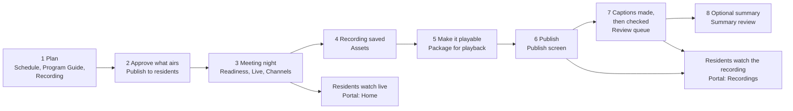

# What CivicCast is and who uses it {#ch-welcome}

This chapter explains what CivicCast does, which jobs the people at a small station do with it, and what happens to a meeting from the day it is put on the calendar to the day a resident watches it. It also gives a short word list for Part I and states plainly what has and has not been proven in this release. Everyone reading Part I should read it first.

## What CivicCast is

CivicCast is software for a public-meeting station: a city or county channel that records council and board meetings, is built to put them on a cable or web channel, and keeps an archive that residents can watch later. It runs on one Windows computer at the station. This manual calls that computer the **station computer**. The program keeps running in the background on that computer; you work with it through two web pages that open in a browser.

CivicCast does these jobs:

- **Keeps a library of meeting videos.** Each video file in the library is called an *asset*.
- **Schedules what airs on each channel.** A *channel* is one program stream the station sends out. A new station starts with three channels, named public, education and government.
- **Runs the channel.** A staff member starts and stops the channel's *outgoing feed* (the running stream), checks that a live camera or encoder is delivering a picture, and can put a live source on the air.
- **Records meetings** from a capture card or a network stream at times you set.
- **Makes captions and checks them.** CivicCast turns speech into caption text. A person reviews the text before it goes with the video.
- **Writes an AI summary on request.** The summary is built from the approved captions, and each quantitative claim (a count, an amount, a vote tally) must point to timestamp ranges in the transcript. A person approves it.
- **Publishes recordings to a resident website** and can copy them to archive and outside services you set up.
- **Watches its own health** and tells staff when something needs attention.

The two web pages are:

| Page | What it is | Who uses it |
| --- | --- | --- |
| **Operator console** (the *console*) | The staff screens. A menu down the left side (the *sidebar*) leads to every screen. Chapter 2 shows how to sign in and find your way around. | Station staff and volunteers |
| **Resident portal** (the *portal*) | The public website. It has three pages: Home, Recordings and Schedule. No sign-in. | Residents |

The installer puts a shortcut named **CivicCast Operator Console** on the Desktop and in the Start menu, and a second Start-menu shortcut named **CivicCast Public Portal**. The console and the portal are two different web pages served by the same program.

> **For IT staff:** The console and portal addresses, the Windows service that runs them, and how to make the portal reachable from residents' own devices are covered in [Installing, first run, upgrading, uninstalling](#ch-installing) and [Planning your station](#ch-planning).

> **Note:** This manual describes what the beta.10 software actually does, screen by screen. Where a screen's own wording is wrong or misleading, the manual says so in a **Known issue (beta.10)** box and gives you the workaround when the code shows one.

## The people and their roles

CivicCast has five *roles*. A role is a set of things a signed-in person is allowed to do. The roles are named after jobs that exist at a small station, where one or two people usually do all of them. Think of a role as a hat. One person can wear all five hats.

| Role (as the console shows it) | The job, in plain words | What this job does in the console |
| --- | --- | --- |
| **Setup admin** (`setup_admin`) | Sets the station up and keeps its settings right. | Creates the station's first account and recovery kit; adds camera or test sources, a backup folder and provider accounts on First Setup; edits Station Profile, AI Models, Custom Fields, Paywall and Control Room Setup; applies cable-headend settings and 24/7 settings on Channels; can create and cancel schedule items. |
| **Meeting operator** (`meeting_operator`) | Runs the meeting night. | Works the Live screen (check the source, run the checklist), starts and stops a channel's feed and puts a live source on air from Channels, runs Control Room, starts and stops scheduled recordings, builds agendas, adds recurring slots in the Program Guide. |
| **Records clerk** (`records_clerk`) | Looks after the official record of the meeting. | Approves, edits or rejects caption lines in the Review queue; approves AI summaries; places and clears legal holds; uploads videos; edits a recording's public title and description. |
| **Publish operator** (`publish_operator`) | Decides what residents and outside services can see. | Creates and cancels schedule items and approves them to air; prepares a recording for playback; approves publishing on the Publish screen; removes a recording from the portal; manages Auto-schedule, the community board, program-guide export, underwriting and App Admin. |
| **Support admin** (`support_admin`) | The help desk: the person who keeps the station healthy and fixes it. | Creates the support bundle and runs repair, restore, update and rollback tools on Readiness; reads Reports; can read most screens. Mostly read-only elsewhere. |

The names in parentheses are the raw role names. You will see them in error messages, for example "This action requires one of these CivicCast roles: meeting_operator, setup_admin." The console never shows them any other way.

### Everyone signed in

Some screens ask for no role at all. The sidebar shows them to every signed-in person: Live, Facility, Control Room, Channels, CG Board, Schedule, Program Guide, Assets, Contributors, Review queue, Summary review, Publish, Playback policy, Analytics, Readiness, Alerts and Federation. The Manual and First Setup are open even to a person who is signed out.

> **Warning:** A screen that appears in your sidebar can still refuse you. The sidebar hides some screens by role, but each screen and each button is checked again when you use it. For example, anyone can open Schedule, but a person without the Publish operator, Setup admin or Support admin role gets a red "Could not load schedule." box. If a screen refuses you, you do not have the role it needs. Chapter 2 lists the wording you will see.

### How people get roles at beta.10

The first account, created on First Setup, holds all five roles. So does anyone who signs in with that account's password or one of its recovery codes. The beta.10 console has no screen for adding people or giving them roles. In a normal station, everyone who signs in does so as that one account, so everyone holds all five hats.

CivicCast's command-line tool can make access keys that carry a narrower set of roles. That is IT work. In testing we could not confirm how such a key is loaded into a browser, because the console has no field to paste one into.

> **For IT staff:** Role-limited keys, the role-to-screen table and the access rules by feature are in [Security and privacy](#ch-security) and the roles appendix ([Roles and permissions](#app-roles)).

## The life of a meeting

Here is the path a meeting takes through CivicCast. Each step names the console screens involved. Chapters 3 to 6 explain each step with exact buttons.

*Figure 1.1. The life of a meeting in CivicCast. Boxes 1 to 8 are staff work in the operator console; the two boxes on the right are what residents see on the portal.*

**How to read the figure.** Follow the arrows from the left. Steps 1 and 2 are done ahead of time. Step 3 is the meeting itself, and while it runs residents can watch on the portal's Home page. After the meeting, the recording appears in the Assets library (step 4). Before residents can watch a saved recording it has to be made playable in a browser (step 5) and then published (step 6). Publishing is also what starts the caption work (step 7): the recording becomes visible to residents at once, and the captions attach to the video later, after a person has checked them. The summary (step 8) is optional.

1. **Plan.** Put the meeting on the calendar. You can place a recorded video on a channel at a set time (Schedule, Program Guide or Auto-schedule). To capture a live meeting, set up a recording from a capture card or network stream (Recording). Details: [Before the meeting](#ch-before-meeting).
2. **Approve what airs.** A recorded program placed on the Schedule does not air, and residents do not see it, until someone approves it with **Publish to residents**. Saving a schedule item and approving it are two separate steps. A live meeting goes on air in step 3, not here.
3. **Meeting night.** Check Readiness (the "can we broadcast right now?" page). On Live, check that the camera or encoder is delivering, then run the checklist. On Channels, start the channel's feed and, for a live meeting, put the checked live source on the air. Details: [Running the meeting](#ch-running-meeting).
4. **Recording saved.** A finished recording becomes an asset in the Assets library. After you end a live session on the Live screen, CivicCast looks for the recording file, checks and packages it, and shows "Recording saved as asset" followed by the asset's ID.
5. **Make it playable.** *Packaging* makes a copy of the video that a web browser can stream. An asset with no playable copy cannot be watched on the portal.
6. **Publish.** On the Publish screen a publish operator ticks where the recording should go. The Portal option makes the recording public to residents. The other options copy it to archives and outside services.
7. **Captions.** Approving the Portal publication also queues the caption work. CivicCast transcribes the recording and holds every caption line for a person to approve, correct or reject. Captions attach to the public video only after every line is decided.
8. **Summary (optional).** From an asset's page a records clerk can ask for an AI summary. It uses only approved caption lines. A person reviews and approves it.

After the meeting, the portal shows residents the recording on **Recordings** and on its own watch page, with captions when they are attached. The portal's **Schedule** page shows what airs on each channel over the next 72 hours.

> **Known issue (beta.10):** On the **New scheduled item** form, the Premiere card says it will "Publish a recorded asset to the public portal at a scheduled time." That is not what saving does. Saving creates an item in the state **Scheduled**. Nothing airs and residents see nothing until you open the **list** tab and press **Publish to residents** on that item. Chapter 3 shows the steps.

> **Known issue (beta.10):** A meeting you capture on the **Recording** screen arrives in Assets in the state **Recorded**. The **Package for playback** button on the Assets list appears only on rows whose State is **Validated**, so it is not offered on a Recorded row. A recording that the Live screen finalizes is checked and packaged by that step. Chapter 5 explains what to do for each kind of recording.

## What residents see

The portal is an English-only website with a dark look and no sign-in. Its header has three links: **Home**, **Recordings** and **Schedule**.

- **Home** shows whether the station is on air. When it is, a video player appears. When it is not, you see "The station is standing by" or "No live broadcast is on air." It also lists what is coming up and the six newest recordings.
- **Recordings** is a searchable archive of every published meeting.
- A recording's **watch page** shows the video with captions, the meeting's agenda beside it if staff published one, the description, and a **Copy share link** button.
- **Schedule** shows what airs on each channel.

{width=90%}

*Figure 1.2. The resident portal's Home page.*

## Word list for Part I

These are the words used most in Part I. Each is explained again where it first matters.

| Word | What it means in this manual |
| --- | --- |
| **Station computer** | The one Windows computer where CivicCast is installed. |
| **Console** | The staff web page. The sidebar on its left is the menu. |
| **Portal** | The public web page for residents. |
| **Channel** | One program stream the station sends out. A new station has three: public, education, government. |
| **On air** | A channel's feed is running and sending out what is playing. |
| **Outgoing feed** | The running stream for one channel. Staff start and stop it on the Channels screen. |
| **Slate** | A standby card the channel shows when no program is playing. |
| **Source** | A live picture CivicCast can receive, such as a camera or encoder. Source types shown on the Live screen are RTMP, RTSP, NDI and SRT. |
| **Asset** | One video file in the library (the Assets screen). |
| **Recorded / Validated** | Two of an asset's states. A *Validated* asset passed CivicCast's file checks, as uploads do. A *Recorded* asset is a finished live capture. |
| **Package for playback** | Make a copy of an asset that web browsers can stream. |
| **Publish** | Make a recording visible to residents, and optionally copy it to archives and outside services. |
| **Premiere** | A recorded asset placed on a channel at a start time. |
| **Caption** | The text of what is said, shown with the video. |
| **Cue** | One caption line with a start and end time. The Review queue shows cues one at a time. |
| **Summary** | An AI-written overview of a meeting. Every quantitative claim must link to caption timestamps. |
| **Readiness** | The answer to "can we broadcast right now?" on the Readiness screen. |
| **Role** | A set of things a signed-in person may do. There are five. |
| **Recovery kit** | The one-time printout or file with the admin username, the admin password and eight emergency codes, created on First Setup. |
| **Test mode** | The mode a new station starts in. The First-run defaults card on First Setup shows a **Mode** heading with "Test mode" under it. |
| **Headend** | The cable company's equipment that receives a channel's signal. |

## What is and is not proven in beta.10

CivicCast beta.10 was published on 2026-10-02 as a **GitHub pre-release**, labelled a *beta candidate*. It is not a production release. You can read the release page at <https://github.com/scottconverse/civiccast-native/releases/tag/v1.0.0-beta.10>.

**What was shown to work**

- **Gate A, clean-install lane: passed, 10 of 10 criteria.** Gate A is the station acceptance check. The lane that passed was run in Windows Sandbox against the exact published installer and packs. It covered install, activation, health, the console and portal rendering, a clerk workflow, captions, the playout engine (the part that sends each channel's picture out), a 5-minute soak, install progress and completion. It took several tries: the first run failed because a self-test waited 60 seconds for the AI component, which needed 61 (fixed in the published build), and three later runs failed the playout-engine check because the test began capturing before the engine's first video arrived, which on a fresh install takes more than 60 seconds. The passing run used a test setup that waits longer and repeats the capture.
- **An eight-hour lab run** held three channels (education, government, public) on air at the same time on one lab machine, with captions embedded in the output. It ran as one process with no restart and no crash, scored 50 program changes with no holes or errors, and measured loudness in range in 16 of 16 windows on every channel. One of 41 verify checks printed a raw FAIL, which was judged a sampling blip and is recorded in the verification note.

**What is not proven**

- **The upgrade lane and the download-only lane of Gate A were not run.** The owner waived both. Upgrading beta.10 over an earlier release is not proven.
- **A first install with neither the full kit nor an earlier install is not proven.** The installer needs the `packs` and `station` folders beside it. With only `setup.exe` the installer stops at its pack-staging step.
- **The eight-hour run was not repeated on the published installer.** It ran on an earlier internal build of the same engine.
- **No human field tester has signed off.** beta.10 has not been operated at a real station.
- **It is not a 24-hour or 72-hour test**, and it ran on one machine.
- **Physical DeckLink SDI capture and output, cable-operator headend acceptance, and sustained production use at a real public-access station** remain unproven.

**A measured limit you should know about.** Live-caption audio can be dropped under heavy load. In the eight-hour run the caption worker logged 13 catch-up discard events; seven of them coincided with disk scans the lab was running and are left out of the next figure. On a quiet machine the total was about 160 seconds of audio on two channels. Captions stay on the air, but some spoken audio gets no caption. A fix is the next work item and is not in this build. Stations that need loss-free live captions should weigh this limit.

The exact wording and the full list of limits are in the release's verification record. The evidence appendix ([Evidence and proof status](#app-evidence)) lists where each result is kept.

## If it did not work

This chapter contains no steps to follow, so there is nothing here to fail. If a later chapter's screen shows a message you do not understand, chapter 8 ([When something looks wrong](#ch-something-wrong)) lists the common ones.

## Related

- [Signing in and finding your way around](#ch-signing-in)
- [Before the meeting](#ch-before-meeting)
- [Running the meeting](#ch-running-meeting)
- [After the meeting](#ch-after-meeting)
- [Publishing, and what residents see](#ch-publishing)

<!-- SOURCES: inventory/screens/_shell-navigation-and-roles.md (sections 1-3, 5); inventory/screens/schedule.md; inventory/screens/recording.md; inventory/screens/live.md; inventory/screens/channels.md (feed Start/Stop, Take live); inventory/screens/assets.md; inventory/screens/review.md; inventory/screens/summary.md; inventory/screens/publish.md; inventory/screens/public-shell.md; inventory/screens/public-home.md; inventory/screens/public-watch.md; inventory/screens/public-schedule.md; inventory/screens/installer-nsis-service-finish.md (shortcuts); docs/releases/v1.0.0-beta.10-verification.md (all proof statements and numbers); inventory/screens/installer-nsis-packs-and-verify.md (packs and station folders, exit 110); civiccast/auth/roles.py:14-57; civiccast/apps/portal-operator/src/auth/roles.ts:6-12; civiccast/apps/portal-operator/src/components/shell/Sidebar.tsx:88-183; civiccast/apps/portal-operator/src/screens/AssetsScreen.tsx:408-441 (Package button only for validated rows); civiccast/schedule/router.py:375-409 (API accepts validated or recorded); civiccast/live/finalization_worker.py:739-752 (live capture packaged and manifest set); civiccast/apps/installer/src-tauri/nsis-hooks-bootstrap.nsh:1794-1808 (shortcut names); civiccast/installer/models.py:349-356 (three channels, test mode defaults); civiccast/installer/station_state.py:795-811 (first admin scope admin) -->
