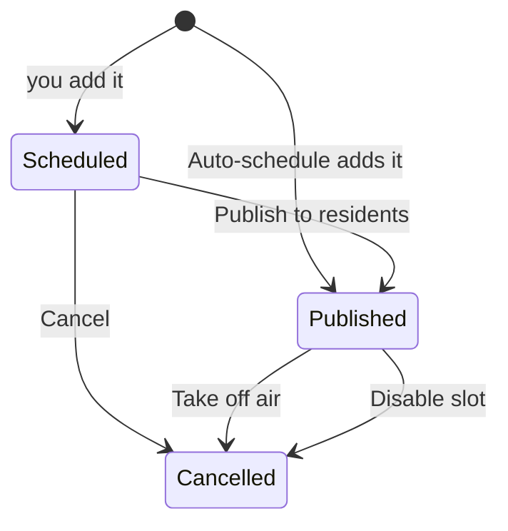

# Before the meeting: schedules, agendas, and recording schedules {#ch-before-meeting}

This chapter covers the work you do before a meeting starts and before a program airs. You will put programs on a channel's schedule, repeat a program every week, let CivicCast fill a time of day by rule, set up automatic recording of a meeting, publish an agenda that residents can read next to the video, and review programs that residents and community producers send in. Station staff with the publish operator, meeting operator, or records clerk role normally do this work.

> **Note:** This chapter describes the current beta.11 screens and program behavior. The release is a GitHub pre-release for testing, not a production release. Where a button's wording differs from what the program does, a **Known issue (beta.11)** note explains the current behavior and the safe next step. Check the [beta.11 verification record](https://github.com/scottconverse/civiccast-native/blob/main/docs/releases/v1.0.0-beta.11-verification.md) for package-specific checks.

## Before you start

You need to be signed in to the operator console ([Chapter 2](#ch-signing-in) shows how). The left-hand menu groups the screens in this chapter in two sections: **Run Meeting** (Schedule, Auto-schedule, Program Guide, Recording) and **Review Records** (Contributors, Agendas).

What you can do on each screen depends on your role. The table shows who can look and who can change things. Your station administrator gives out roles ([Appendix: roles](#app-roles) lists all of them).

| Screen | Who can open it | Who can make changes |
| --- | --- | --- |
| Schedule | Publish operator, setup admin, support admin | Publish operator, setup admin |
| Program Guide | Any signed-in person | Meeting operator, support admin |
| Auto-schedule | Publish operator, setup admin, support admin | Publish operator, setup admin |
| Recording | Setup admin, meeting operator, support admin | Setup admin, meeting operator |
| Agendas | Records clerk, meeting operator | Records clerk, meeting operator |
| Contributors | Publish operator, meeting operator, support admin | Publish operator, meeting operator |

> **Known issue (beta.11):** The menu shows some screens to roles that cannot use them. A meeting operator or records clerk who opens **Schedule** sees a red box, "Could not load schedule." A support admin can open **Contributors** but every button there fails. A publish operator who fills in the form on **Program Guide** is told "This action requires one of these CivicCast roles: meeting_operator, support_admin." only after pressing **Add to guide**. If a screen refuses you, ask your station administrator which role you need.

You also need at least one video in the library, and at least one channel set up on the station. Videos are managed on the **Assets** screen ([Chapter 5](#ch-after-meeting)).

> **For IT staff:** how roles map to people and how channels are created is in [Part II, Configuring the station](#ch-configuration).

## Three words you must know: Scheduled, Published, Cancelled

Every program you place on a channel is an *item* on the schedule. An item is always in one of three states. These words are used on several screens and they do not mean what they sound like, so read this section first.

| State | What it means | Does it air? |
| --- | --- | --- |
| **Scheduled** | You placed it, but nobody has approved it to air. It is a draft. | No |
| **Published** | It has been approved to air. It will play when its start time arrives. | Yes |
| **Cancelled** | It was withdrawn. It will not air. | No |

The program that actually plays on a channel is built only from **Published** items. A **Scheduled** item never airs by itself.

*Figure: the life of a schedule item. Items you add by hand start as Scheduled. Items that Auto-schedule adds start as Published.*

The diagram shows the two ways an item gets onto the air. If you add an item yourself on **Schedule** or **Program Guide**, it starts as Scheduled, and someone with the publish operator or setup admin role must approve it by pressing **Publish to residents**. If **Auto-schedule** adds the item, it starts as Published and there is no separate approval step. The section on Auto-schedule explains why that matters.

> **Warning:** Do not assume a program is on the air because it appears on a schedule list. Look for the word **Published** (on the Schedule screen, a Scheduled program shows "Not yet visible to residents" and a Published one shows "Visible to residents").

### What residents see

Residents see two different lists, built from two different sources.

- **Coming up** on the portal home page lists programs placed with **Schedule** (or Contributors) that are **Published** and start in the future. It never lists a Scheduled item.
- **Channel schedule** (a page of the portal, see the example below) lists the next 72 hours of airings that came from **Program Guide** recurring slots. It lists an airing as soon as the guide has built it, whether or not anyone has published it.

{width=90%}

*Figure: the Channel schedule page that residents see.*

> **Known issue (beta.11):** The Channel schedule page can show an airing that will not air, because it reads the guide's own list, not the published state. The guide also keeps listing an airing if you cancel that item on the Schedule screen, because nothing updates the guide when an item is cancelled. Items you add directly on the Schedule screen never appear on the Channel schedule page at all; they appear in **Coming up** after they are published. The two pages do not explain the difference to residents.

## Which time zone are you typing in?

Several boxes ask for a time. They do not all use the same time zone. Read the label under the box.

| Where you type | Time zone it uses |
| --- | --- |
| Schedule: **Start at** | Your computer's local time. The line under the box shows the date and your zone name. |
| Program Guide: **First airing**, **Repeat until (optional)** | Your computer's local time when you type it. After that, the repeats are counted in UTC (see the warning below). |
| Auto-schedule dayparts: **Start**, **End** | The station's time zone, set in the **Timezone** box on the **Station Profile** screen (the First Setup form has no such box). If it is still "local" or was never set, UTC. |
| Recording: **Start (UTC)**, **Time (HH:MM UTC)** and the weekday boxes | **UTC**, not your local time. |
| Contributors: producer's **Requested air date** | The producer's own computer, with no zone saved (see Known issue under Contributors). |

*UTC* (Coordinated Universal Time) is the world's reference clock. It has no daylight saving time. A US station in Mountain Time is 6 hours behind UTC in summer and 7 hours behind in winter. Only the Recording screen makes you type UTC yourself.

> **Warning:** Daily, Weekly and Weekdays slots on **Program Guide**, and weekly captures on **Recording**, repeat on a fixed UTC clock. When daylight saving time starts or ends, the program or capture moves one hour on your local clock. After each clock change, check your repeating slots and recording schedules and edit them if the local time is no longer right. **Auto-schedule** dayparts use the station's time zone and do not drift.

## Put a recording on a channel once

Use the **Schedule** screen to place one recording on a channel at one time. This creates a *premiere*: a recorded video placed on a channel at a start time, for a length of time.

1. In the left menu, under **Run Meeting**, click **Schedule**. The page heading is "Schedule".
2. Click **New scheduled item** (top right). A panel opens on the right.
3. Under **Mode**, click **Premiere**.
4. In the **Asset** drop-down, choose the video. Each entry reads "title · asset id".
5. In the **Channel** drop-down, choose the channel by its display name.
6. In **Start at**, type the date and time. Use your local time. A line under the box repeats it as "Day, Mon d, h:mm" with your time zone name, so you can check it. The box starts at the next full hour.
7. In **Duration (min)**, type the length in whole minutes. It starts at 60. The largest allowed length is 14 days.
8. In **Notes (optional)**, type anything you want recorded. The box says the note is "visible in the audit log" (the station's record of who did what).
9. Click **Schedule premiere**. The button reads "Scheduling…" while it works.

You should see the panel close and a message, "Scheduled.", with a line such as "Premiere · City Council · Tue, Oct 6, 7:00 PM".

> **Warning:** The item you just made is **Scheduled**. It is not on the air and residents cannot see it. Go on to the next task, "Approve a program to air".

> **Note:** Embargo release is unavailable in this build. Use **Premiere**, then publish the scheduled item to residents separately. An Embargo item is left out of the channel's program and **Coming up**, and the approval check refuses it with "embargo entries publish at a single moment and cannot be committed to air".

> **Known issue (beta.11):** The **Asset** drop-down lists only videos in the Validated state. A video that CivicCast recorded itself (a live meeting or a scheduled recording) is in the Recorded state and is **not offered**, even though the approval step accepts Recorded videos. If the list is empty you will see "No validated assets." with the advice "Upload and validate an asset in the Assets tab first." The console has no action that changes a Recorded video into a Validated one. A video you upload on the **Assets** screen becomes Validated, so uploading the file again makes it appear. Auto-schedule (below) accepts Recorded videos.

> **Tip:** The yellow box in the panel reads "Timezone check". During the weeks when clocks change, compare the time with your station calendar before you press **Schedule premiere**.

### Read the Schedule screen

The top of the screen says "Week of" and a date range, with "times shown in your browser timezone."

1. Click **week** to see a grid of the week, or **list** to see every item as a row. On a phone the screen opens in the list.
2. Use **‹** (previous week), **Today**, and **›** (next week) to move through weeks.
3. In the list, each row shows the time, a mode label, a state label (Scheduled, Published or Cancelled), the title, the channel, and, for a premiere that is Scheduled or Published, either "Not yet visible to residents" or "Visible to residents". In the week grid, Cancelled items are greyed and struck through; in the list they only carry the Cancelled label.

The list shows every item, not only this week's. Clicking an item in the week grid switches to the list; it does not open a detail panel.

> **Note:** The Schedule screen says, "Conflicts are checked when you submit." An overlapping item can be entered in the form, then rejected by the server when you submit it, with "Time slot conflicts." and the conflicting item's ID, channel and start time. Choose a different time or channel, or cancel the conflicting item, then submit again.

## Approve a program to air

A program on the Schedule screen airs only after someone with the publish operator or setup admin role approves it. The approval first runs a safety check. This is the real step that puts a program on the air.

1. On **Schedule**, click **list**.
2. Find the row that says "Not yet visible to residents".
3. Click **Publish to residents** on that row. The row says "Checking…" for a moment.
4. Read the review panel. At the top it says **Safe to air** or **Not safe to air yet**, with the start time and length. It also shows:
   - a line about problems with the video file, if there are any;
   - "Clashes with N other program(s) already scheduled:" followed by a list, if another program overlaps this one;
   - "Dead-air gap before this program (it can still air):" followed by a list, if the channel has nothing scheduled just before this program. *Dead air* means time when nothing is playing. A gap is for information only and does not stop the approval.
5. If the panel says **Safe to air**, click **Publish to residents** in the panel. The button reads "Publishing…". Click **Cancel** in the panel instead if you want to back out.

You should see the message "Visible to residents." with the program title, and the row now reads "Visible to residents". The item is **Published**. CivicCast also tells the channel's playout engine to read the schedule again, and starts the channel if it was stopped.

> **Warning:** The final **Publish to residents** click has no further confirmation. It approves the program to air on the channel, not only to appear on the portal.

If the panel says **Not safe to air yet**, the approve button stays grey. Fix the reason shown (move or cancel the clashing program, or fix the video) and start again.

If your role cannot approve, the **Publish to residents** button is grey and a note explains that you can view the schedule but publishing needs the publish operator or setup admin role.

> **Known issue (beta.11):** The words "to residents" hide what this button does. It is the approval to air on the channel. The Channels screen has the same approval under another name, **Commit programs to air** with **Review & prepare** and **Approve & put on air** ([Chapter 4](#ch-running-meeting)). Either place works.

> **Known issue (beta.11):** The screen shows "Visible to residents." whenever the approval was saved, even if the message to the playout engine failed. The approval stays saved, and the engine picks the schedule up on its own cycle. The Channels screen shows "Couldn't reach the engine" for that case.

## Cancel a scheduled item

1. On **Schedule**, click **list**.
2. On the row of a **Scheduled** item, click **Cancel**.
3. In the box titled `Cancel scheduled item for "<name>"?`, click **Cancel scheduled item**. (The other button, **Cancel**, closes the box and changes nothing.)

You should see the message "Cancelled." and the row's state label change to Cancelled. The row's **Cancel** button goes away.

> **Warning:** This cannot be undone. The box says you would need to create a new scheduled item to air it again.

> **Known issue (beta.11):** A **Published** row has no **Cancel** button on this screen. To take a program that you approved by hand off the air, use **Take off air** on the Channels screen ([Chapter 4](#ch-running-meeting)); it asks for a reason. Programs that Auto-schedule placed have no approval record, and the console has no button to remove one. The station's programming interface can cancel a Published item; ask your IT person ([Part II, Integrations](#ch-integrations)).

## Repeat a program on a schedule (Program Guide)

Use **Program Guide** when a recording should air again and again, for example every Friday night. You place a recording on a channel as a *recurring slot*: a recording, a channel, a start time, and a rule for how often it repeats. A background job turns each slot into real schedule items for the next 72 hours.

> **Warning:** The items the guide builds are **Scheduled**, not **Published**. Adding a slot does not put anything on the air. You must approve each one on the **Schedule** screen (task "Approve a program to air"). A station that adds a weekly slot and walks away gets nothing on the air.

1. In the left menu, under **Run Meeting**, click **Program Guide**.
2. In the **Channel** drop-down at the top, choose the channel.
3. Click **Add to guide** (top right). A panel opens, headed "Program guide" and the channel.
4. In **Recording**, choose the video. The entries read "title · asset id".
5. Under **Repeats**, click one card:
   - **Once**: "Airs a single time at the start time."
   - **Daily**: "Airs every day at this time."
   - **Weekly**: "Airs every week on this weekday." (This is chosen when the panel opens.)
   - **Weekdays**: "Airs Monday through Friday."
6. In **First airing**, type the date and time in your local time. A line under it shows the date, time and your zone name.
7. If you chose Daily, Weekly or Weekdays, you may fill **Repeat until (optional)** with the last date it may air. Leave it blank to repeat with no end.
8. Either keep **Use the recording's own length** ticked, or untick it and type **Duration (min)** (at least 1).
9. In **Guide title (optional)**, type a title if you want residents to see a different title than the recording's. It can be up to 200 characters.
10. Click **Add to guide**. The button reads "Adding…".

You should see the message "Added to guide." with a line such as "City Council · Weekly" (the line shows the guide title if you typed one, otherwise the recording's ID). The new slot appears under **Recurring slots**. Airings that fall in the next 72 hours are built at once and appear under **Next 7 days**, grouped by day, with the status **Scheduled**. Later airings are added as they come inside that 72-hour reach.

The guide is rebuilt in the background. By default it looks 72 hours ahead and runs about every five minutes. The **Refresh guide** button builds it immediately, for every channel, not only the one shown.

> **For IT staff:** the background job, its 5-minute interval and its 72-hour reach are set by environment variables; see [Part II, Running it day to day](#ch-operations).

> **Known issue (beta.11):** The **Weekdays** rule counts days on the UTC calendar, not on your local calendar. For a US evening start, a Friday-evening program lands on Saturday in UTC and is left out, while a Sunday-evening program lands on Monday in UTC and is included. We derived this from reading the program and did not run it on a live station. Until it is fixed, use **Weekly** with a separate slot for each day, or check the **Next 7 days** list after adding a Weekdays slot.

> **Known issue (beta.11):** The status in **Next 7 days** stays **Scheduled** even after you publish the item, so this list cannot tell you whether a program is approved. Check **Schedule** for that. Items you added directly on the Schedule screen are also listed here, with the status shown as the lower-case word `manual` and the detail "Scheduled directly (no recurring slot)."

> **Known issue (beta.11):** Like the Schedule screen, the **Recording** drop-down lists only Validated videos. A video that CivicCast recorded is not offered (see the Known issue under "Put a recording on a channel once").

> **Known issue (beta.11):** You cannot change a slot after you add it, even though the station's programming interface allows it. To change one, disable it and add a new one.

### Fix a skipped airing

When the guide cannot place an airing, the row in **Next 7 days** shows an amber status.

| Status | What happened | What to do |
| --- | --- | --- |
| **Skipped · conflict** | Another program overlaps that time on the channel. The detail text under the title names it. | Cancel or move the other program on **Schedule**, then place this airing by hand (see below). |
| **Skipped · not playable** | The recording is missing, is not Validated or Recorded, has no file on the station, or has an unknown length. | Fix the recording on **Assets**, then place this airing by hand (see below). |

1. Read the status and the detail text under the title.
2. Fix the cause as shown in the table.
3. On **Schedule**, click **New scheduled item** and place the recording at that airing's time ([Put a recording on a channel once](#put-a-recording-on-a-channel-once)), then approve it.

The guide records a skipped airing once and never looks at it again. We read the code: the program that builds the guide ignores any airing time it has already recorded, skipped or not. Fixing the cause and clicking **Refresh guide** therefore does not turn that skipped airing into a scheduled one. Later airings of the same repeating slot are still built as normal. **Refresh guide** shows a message such as "Guide refreshed." with counts like "N scheduled · N conflicts · N not playable"; those counts cover only airings that were newly recorded.

### Stop a repeating program

1. On **Program Guide**, find the slot under **Recurring slots**.
2. Click **Disable**.
3. In the box titled `Disable "<name>"?`, click **Disable slot**. (**Cancel** closes the box.)

You should see "Slot disabled." with a line such as "City Council · 3 future airing(s) cancelled", and the slot shows a **Disabled** label.

> **Warning:** Disabling a slot cancels every future airing it built. It cancels them even if you already approved them. Airings that already played, or are playing, are not touched.

> **Note:** To schedule this program again after disabling its slot, add a new slot with **Add to guide**.

## Fill a channel by rule (Auto-schedule)

Use **Auto-schedule** when you want CivicCast to pick recordings for a time of day by itself, for example "the newest council meeting every weeknight at 6 PM". You build three things, then connect them:

- A **saved search**: a named description of which recordings qualify, such as "meeting body is City Council".
- A **daypart**: a repeating window of time on a channel, such as weeknights 18:00 to 22:00.
- A **rule**: connects one saved search to one daypart, and says how to pick.

For each matching day in a rule's window, CivicCast places **one** recording. It starts at the start time of the daypart and uses the recording's own length. If anything is already scheduled anywhere inside that day's daypart, that day is left alone.

> **Warning:** Programs placed by Auto-schedule are written as **Published**. They are approved to air with no separate approval step. Reviewing the **Simulate** preview is the only check you get. In the standard configuration, enabled rules also compile hourly, so a saved rule can put programs on the air without anyone pressing a button.

You need the publish operator or setup admin role to change anything here. A support admin can look and run **Simulate**, but the **Add**, **Edit**, **Delete** and **Compile now** controls do not appear.

### Create a saved search

1. Under **Run Meeting**, click **Auto-schedule**.
2. In **Saved searches**, click **Add saved search**.
3. Type a **Name**, for example "Recent council meetings".
4. Fill any of the other boxes you need. A blank box means no limit:
   - **Meeting body (exact)**: must match the recording's meeting body text exactly, including capital letters. Example: City Council.
   - **Title contains**: a word that must be in the title. Example: budget.
   - **Min length (minutes)** and **Max length (minutes)**.
   - **Include states**: tick the kinds of recording that may be picked. "Validated" and "Recorded" are ticked to begin with. Leave them.
   - **Newest published first**: ticked to begin with. It decides whether the newest or the oldest published recording comes first in the results, which matters for the **First match** pick (see "Create a rule").
5. Click **Create saved search**. The button is grey until the **Name** is filled.

To change or remove one later, click **Edit**, or click **Delete** and then **Confirm delete?**. If rules use the search, the confirm step adds the red line "Used by N rule(s) — deleting it stops them scheduling."

### Create a daypart

1. In **Dayparts**, click **Add daypart**.
2. In **Channel**, type the channel's ID exactly. The placeholder shows `public`.
3. Type a **Name**, for example "Prime time".
4. Set **Start** and **End**. They begin at 18:00 and 22:00. Use 24-hour times in the **station's time zone**. The note says "00:00 = midnight (end of day). An end before the start wraps past midnight."
5. Tick the **Days** the daypart applies to. Monday to Friday are ticked to begin with.
6. Click **Create daypart**.

> **Known issue (beta.11):** The **Channel** box is free text, unlike the drop-downs on Schedule and Program Guide. A mistyped channel ID makes a daypart for a channel that does not exist. In testing we could not confirm whether the station refuses that. Copy the ID from the Channels screen.

> **Known issue (beta.11):** The line under **Dayparts** says times follow "CIVICCAST_STATION_TZ; UTC if unset". In plain words: the times use the station's time zone, which is set in the **Timezone** box on the **Station Profile** screen (the First Setup form has no such box). A new station starts with the value "local", which CivicCast treats as UTC, so "18:00" means 18:00 UTC until someone sets a real zone name there.

### Create a rule

1. In **Auto-schedule rules**, click **Add rule**.
2. Type a **Name**, for example "Fill prime with council".
3. Choose a **Pick strategy**:
   - **Newest first**: the recording with the most recent published date.
   - **First match**: the first recording the saved search returns.
   - **Random**: any one of the recordings that match.
4. In **Saved search**, choose **Choose…** then the search.
5. In **Daypart**, choose the daypart. The entries read "name (channel)".
6. In **Rolling window (days, 14–60)**, type how many days ahead to fill. It starts at 30. A number outside 14 to 60 shows the red message "Rolling window must be a whole number from 14 to 60 days."
7. In **No-repeat window (days)**, type how many days must pass before the same recording may be picked again. 0 (the starting value) allows repeats.
8. Click **Create rule**.

### Preview and compile

1. On the rule's card, click **Simulate**. Nothing is written. You see "Would schedule N of M upcoming slots." and up to 30 lines, each with a date, a title and a label:
   - **Will air**: the day is open and a recording was picked.
   - **Already scheduled**: something is already scheduled in that daypart.
   - **No eligible video**: no recording matches the saved search.
   - **No usable duration**: the recording picked has no length.
2. If you are happy, click **Compile now** in the **Compile schedule** card. There is no confirmation box.

You should see "Published N schedule items across M rules." The programs now show on **Schedule** as **Published**.

### Retire a rule

1. On the rule's card, click **Delete**, then **Confirm delete?**.

> **Warning:** Deleting a rule stops it from placing new programs. It does not remove programs it already placed. The delete changes only the rule, and the screen gives no hint about this. The programs stay Published and will air.

> **Known issue (beta.11):** There is no way on this screen to switch a rule off without deleting it. A **disabled** label exists on rule cards, but nothing here sets it. You also cannot set a rule's priority or its active dates; every new rule is saved with priority 100 and no date limits. If you edit a rule, set it up again with the same care as when you created it.

## Record a meeting automatically (Recording)

Use **Recording** to capture a live input or a network stream at set times, or to start a capture by hand. A *live input* is a video card in the station computer (SDI, HDMI or NDI). A *network stream* is video that arrives over the network from a camera or encoder (RTSP, SRT, HLS, RTMP or MPEG-TS). The page heading is "Scheduled recording". When a capture ends, CivicCast makes a new library asset in the Recorded state from the file.

You need the setup admin or meeting operator role to make changes. A support admin can look only. A person with any other role sees "Forbidden — scheduled recording is an operator / setup-admin / support-admin surface. Ask your station admin for access."

### Create a recording schedule

A *recording schedule* is a saved plan: one source, one time pattern, one length.

1. In the left menu, under **Run Meeting**, click **Recording**.
2. In the **New schedule** card, type a **Schedule ID (slug)**: a short code name. Use only lowercase letters, digits and hyphens, for example `evening-news`. You cannot change it later.
3. Type a **Name**, for example "Evening news". Two schedules cannot have the same name.
4. In **Source kind**, choose one. Under **Live inputs** are SDI, HDMI and NDI. Under **Network streams** are RTSP, SRT, HLS, RTMP and MPEG-TS. Changing the kind clears the next box.
5. Fill the box that appears next:
   - For **SDI** or **HDMI**, choose the card in **Input ID**. The drop-down lists the capture devices CivicCast found. Click **Inspect capture devices** to look again after you plug a card in.
   - For **NDI**, type the name in **Input ID** (the placeholder is `studio-ndi`).
   - For a network stream, type the address in **URI** (the placeholder is `rtsp://camera.local/stream`).
6. Under **Recurrence**, choose **One-shot** (one capture) or **Weekly**.
7. For **One-shot**, type **Start (UTC)**. For **Weekly**, click **Weekdays**, **Weekend**, **Every day** or **Clear**, tick the day boxes you want, and type **Time (HH:MM UTC)**, for example `19:00`. See the warning below.
8. In **Duration (HH:MM:SS)**, type the length with two digits in each part. It starts at `01:00:00`. A value such as `1:5:0` is refused; type `01:05:00`.
9. In **Quality preset (encoder profile)**, leave `default`, or type a name your administrator gave you. The screen suggests default, copy, h264-1080p, h264-720p, hw-h264-1080p and hw-h264-720p.
10. In **Loudness regime**, choose how loud the recording should be. The choices are **Inherit station default**, **Copy source audio**, **Cable / ATSC A/85 (-24 LKFS)**, **Broadcast / EBU R128 (-23 LUFS)** and **Streaming (-16 LUFS)**. One line under the choice explains it.
11. Leave **Target series (optional)** blank unless your administrator tells you what to put there. We could not confirm what it does.
12. Keep **Enabled** ticked so the schedule runs.
13. Check the **Next fire** (or **Next 3 fires**) lines. Each shows the time as "UTC … · local …".
14. Click **Create schedule**.

You should see the new schedule appear in the **Schedules** table above the form.

> **Warning:** The time you type is **UTC**, not local time. Under **Start (UTC)** and **Time (HH:MM UTC)** the screen shows "In your local time: …" so you can check it. The weekday boxes are also UTC days, and they get no such line. A Monday 7 PM meeting in US Mountain Time (UTC−6 in summer, UTC−7 in winter) is already Tuesday in UTC: in summer it is Tuesday 01:00 UTC, in winter Tuesday 02:00 UTC. Tick **Tue**, not **Mon**. Use the **Next 3 fires** lines to confirm the local day and time before you save. After the clocks change, edit the schedule: the UTC time does not move, so your local time does.

> **Known issue (beta.11):** After **Create schedule** works, the form is not cleared and no "saved" message appears. Look for the new row in the **Schedules** table. If you click **Create schedule** a second time, the station answers "Recording schedule '&lt;id&gt;' already exists. Use PATCH to update." That means the first click worked.

> **Known issue (beta.11):** "Quality preset" is a free text box and the screen does not know which names are valid. Its note says "Contact your station admin for the full list of available presets." We could not confirm what the station does with a name it does not know.

> **Known issue (beta.11):** If the stream address contains a user name and password, the screen does not warn you. We could not confirm how CivicCast stores or hides it. Ask your IT person before you save such an address.

> **For IT staff:** the capture-device list, recording folders and the runtime switch are described in [Part II, Running it day to day](#ch-operations).

By default, CivicCast adds a row for each planned capture to the **Recordings** table up to ten minutes before its start time, and gets the input ready about 30 seconds before the start. The job moves through these states:

| State | Meaning |
| --- | --- |
| `scheduled` | Planned, not started |
| `arming` | Getting the input ready |
| `recording` | Capturing now |
| `finalizing` | Closing the file and making the asset |
| `done` | Finished; the asset exists |
| `failed` | Stopped with an error; the **Failure** column says why |
| `skipped` | Not run, for example because the schedule was disabled |

These labels appear in lower case on the screen.

### Start a recording now

**Record now** starts a capture from a saved schedule right away. There is no one-off capture without a schedule, so create a schedule first.

1. In the **Schedules** table, find the schedule.
2. Click **Record now** on its row. The button reads "Starting…".

You should see a new row in **Recordings** that goes from `arming` to `recording`. The capture lasts for the schedule's **Duration** unless you stop it earlier. There is no success message; the row is the confirmation.

> **Known issue (beta.11):** The empty-screen text says "use Record Now for a one-off capture". The button is named **Record now** and exists only on a saved schedule's row. The button is grey if the schedule is disabled.

### Stop a recording

1. In the **Recordings** table, find the job in state `arming`, `recording` or `finalizing`.
2. Click **Stop**, then click **Confirm stop**. (**Cancel** backs out.)

If the job was in `recording`, the file recorded so far is finished into an asset. The state goes to `finalizing`, then `done`, and an asset link such as "asset id →" appears. Click it to open the asset. If the job was still in `arming`, nothing has been recorded yet: it ends as `failed` with the reason "Stopped before recording started; capture pipeline never reached the 'recording' phase." and no asset is made.

> **Warning:** Stopping ends the capture for good. The recording stops at that moment.

> **Known issue (beta.11):** **Stop** is also shown on a job still in `scheduled` state, but the station refuses it ("Cannot stop job '…': state is 'scheduled'; only ['arming', 'finalizing', 'recording'] are stoppable."), and the screen shows nothing, so the click appears to do nothing. To stop a capture that has not started, remove its schedule's **Enabled** tick (see below).

### Change or remove a schedule

- Click **Edit** on the row, change the form, and click **Save changes**. The schedule ID is locked. Click **Cancel edit** to leave without saving.
- To switch a schedule off, edit it, untick **Enabled** and save. This also cancels jobs that are still waiting to start.
- To delete it, click **Delete**, then **Confirm delete**. Earlier recordings stay in history. We could not confirm whether a job that was already planned still starts after you delete its schedule, and the screen does not show delete errors. Untick **Enabled** first.

### Find finished recordings

1. Use the **Recordings** filters: **State**, **Schedule ID**, and **Limit** (1 to 500, 50 to begin with). Click **Refresh** to reload.
2. The screen reloads by itself every 5 seconds while any job is active; the label reads "Live · refreshing every 5 s". Click **Pause** to stop it and **Resume** to start it again.
3. For a failed capture, set **State** to `failed` and read the red text in the **Failure** column.

## Publish an agenda for a meeting (Agendas)

An *agenda* is the list of numbered items for one meeting. When you publish it, residents see it next to the video on that recording's watch page, and clicking an item with a time jumps the video to that moment. The records clerk and meeting operator roles can use this screen.

An agenda belongs to one recording. Each recording can have only one agenda. Agendas stay private drafts until you publish them.

### Create an agenda

1. In the left menu, under **Review Records**, click **Agendas**.
2. In the **Create new agenda** card, type an **Agenda ID (slug)** such as `council-2026-01`. Use only lowercase letters, digits, hyphens and underscores, starting with a letter or digit.
3. Type the **Meeting asset ID**: the ID of the recording this agenda belongs to. Find it on the **Assets** screen, in small type under the recording's title. Type it exactly, in lowercase.
4. If the agenda also exists as a document, type its web address in **Source doc URL (optional)**. Residents can read it next to the video.
5. Click **Create agenda**.

You should see the new agenda selected. Its card shows the ID, a **draft** label, and "meeting asset: &lt;id&gt;". If you have more than one agenda, the **Pick an agenda** drop-down at the top switches between them.

> **Known issue (beta.11):** The IDs are made-up codes, and a wrong character (for example a capital letter) shows raw technical text instead of a plain message. There is no list of recordings to choose from. We could not confirm whether the station checks that the recording exists.

> **Known issue (beta.11):** If you press **Create agenda** for a recording that already has an agenda, you see "An agenda already exists for (station_id='…', meeting_asset_id='…')." Select the existing one with **Pick an agenda**.

### Add items by hand

1. In the **Items** section, fill the **Add item** form:
   - **Item ID (slug)**: a code name such as `item-01-call-to-order`.
   - **Order**: the item's position in the list, as a whole number from 0 up.
   - **Number (label, optional)**: what residents see, such as `1.a`.
   - **Title**: the item's name.
   - **Video timecode (seconds, optional)**: the moment in the video where the item starts, in whole seconds. For 1 hour 5 minutes, type 3900.
   - **Doc anchor (optional)**: a place in the source document, such as `#item-1a`.
   - **Notes (optional)**: private to staff. The box says they are not shown to viewers.
2. Click **Add item**.

You should see the item in the **Agenda items** table. Use **Edit** on a row to change it (the button becomes **Save item**, and **Cancel** leaves edit mode). Use **Delete**, then **Confirm delete**, to remove a row.

> **Known issue (beta.11):** The **Order** box starts at 0 every time. If you add a second item without changing it, the station refuses with "Another agenda item already occupies (agenda_id='…', order=0)." Change **Order** to the next free number (0, 1, 2, and so on) for each new item.

> **Known issue (beta.11):** The timecode must be typed as seconds. The screen does not accept hours and minutes.

### Fill the agenda automatically

The **Bulk actions** section has four ways to fill an agenda without typing each item.

- **Sync from chapters** makes one item for each *chapter marker* on the recording: a named point in time added in the trim editor (open it from the recording's page on **Assets**). It reads "Synced N new item(s) from chapter markers." Items whose Order already exists are skipped, so your edits survive running it again.
- **Import from doc (paste plain-text agenda, one item per line)**: paste the agenda text and click **Import**. Each non-blank line becomes one draft item. A leading number such as "3.a" or "VII" becomes the **Number**. It reads "Imported N item(s)." and the help line says "Taken literally, one item per line — nothing to review." Lines whose position already has an item are skipped.
- **Or upload a PDF agenda…**: choose a PDF and click **Import PDF**. CivicCast makes a best-effort guess from the text in the PDF (numbered items, ALL-CAPS headings and times). Each item gets a **Confidence** mark: green is 90% or more, amber 50 to 89%, red under 50%. If any item is under 90%, the banner says "Some items were a best-effort guess (see the Confidence marks below) — review them before publishing." A PDF that is a scan of paper, with no text in it, finds nothing: "Couldn't find any recognizable items in that PDF. Try pasting the agenda's text instead."
- **Import from an external agenda system**: look up a meeting in Legistar, PrimeGov, CivicClerk, or a "JS-rendered portal (CivicPlus, Granicus, other)" and import it. See the Known issue below.

> **Warning:** Importing a PDF or an external meeting into an agenda that is already **published** moves it back to **draft**. Review it and publish again.

> **Known issue (beta.11):** The **Import from an external agenda system** block is shown on every station but is **switched off** unless your IT person turns it on. If it is off, **Find meetings** answers in a yellow banner: "Agenda import is not enabled. Set CIVICCAST_AGENDA_SOURCE to 'legistar', 'primegov', 'civicclerk', or 'js_portal' to turn it on." You cannot fix that from this screen. Ask your IT person. "Tenant / site code" is the short name your city has in that system (the screen's example is `longmont`). The JS-portal choice also needs an optional add-on; if it is missing, the screen says "JS-portal runtime: not installed." and **Find meetings** is grey.

> **For IT staff:** turning on agenda import is covered in [Part II, Integrations](#ch-integrations).

### Publish, unpublish or delete an agenda

1. Check the **Items** table. An agenda needs at least one item before it can be published. Until it has one, **Publish** is grey with the hint "Publish needs at least one item — add one below or sync from chapters."
2. Click **Publish** (the button reads "Publishing…"). The label changes from **draft** to **published**.
3. To take it down, click **Unpublish**. It goes back to **draft** with no confirmation, and residents no longer see it.
4. To remove it, click **Delete**, then **Confirm delete**. The line "Confirming will also delete every item under this agenda." appears first.

> **Warning:** Delete removes the agenda and every item in it. There is no undo. Once the red **Confirm delete** button is showing, the only way to back out is to choose a different agenda in **Pick an agenda**.

> **Known issue (beta.11):** If the station refuses to publish an empty agenda, the message ends with "Add at least one item (DC-1) before publishing." The "DC-1" is an internal code; ignore it.

> **Known issue (beta.11):** The screen does not tell you that changes to items of an agenda that is **already published** go live as soon as you save. Only a PDF or external import reopens it as a draft. Edit a published agenda only when you are sure.

### What residents see

On the recording's watch page, residents see a card headed "Agenda" beside the video. It shows each item's number, title and time. Clicking an item that has a time jumps the video to it. An item with no time shows "—" and cannot be clicked. If you gave a **Source doc URL**, there is an "Agenda document" link, and if the address ends in `.pdf`, the document appears in a viewer. Residents never see your **Notes**. While the agenda is a draft, residents see nothing at all.

> **Known issue (beta.11):** The operator screen does not say where residents see the agenda, and it only links to the public page when the station was built with a public portal address set. Open the recording on the resident portal ([Chapter 6](#ch-publishing)) to check how it looks.

## Review programs sent in by the community (Contributors)

Community producers can send a program to the station through the resident portal. Staff review each one on the **Contributors** screen. The page heading is "Contributor submissions". Producers never get a login to the operator console.

### What a producer does on the portal

Tell producers to open the station's resident portal and scroll to **Submit a program** at the bottom of the home page. They:

1. Fill **Producer name**, **Email**, **Program title** and **Description**. **Organization**, **Tags** (separated by commas) and **Requested air date** are optional.
2. Choose a **Video file**.
3. Click **Send to review**. The button reads "Uploading" while it works.
4. Copy the **Receipt** and **Status token** shown on the page.

Later, the producer pastes both into **Check submission status** and clicks **Check status** to see the state of the submission.

> **Known issue (beta.11):** The receipt and status token are shown only on the page and are lost if the producer reloads it. The page does not say so. Tell producers to copy both before they leave.

> **Known issue (beta.11):** The form shows an agreement summary but has no "I agree" box. Pressing **Send to review** counts as accepting the agreement, in the name typed in **Producer name**. Ask your station's lawyer or administrator whether that is acceptable.

> **Known issue (beta.11):** The form says nothing about file type, size, length or how long review takes. It lets the producer pick any video file. By default the station refuses files over 2 GiB (about 2 gigabytes); the producer then sees "Contributor media exceeds the station's upload limit of …". Your IT person can change the limit. The station also limits the total size of the intake folder and how much one address can send.

> **Known issue (beta.11):** The contributor workflow does not email the producer when the state changes. The producer learns about the state only by using **Check status**.

### Review a submission

You need the publish operator or meeting operator role to press the buttons.

1. In the left menu, under **Review Records**, click **Contributors**.
2. Read the three tiles at the top: **Needs action** (submissions waiting on you), **Total submissions** and **Status notices**.
3. Use the search box ("Search title, producer, or tag...") or the tabs **All**, **Submitted**, **Reviewing**, **Needs changes**, **Accepted**, **Scheduled** and **Declined** to find a submission. The oldest are listed first.
4. Read the card: the title, the producer, the producer's description, the **Media** file name and size, the **Media gate** (the file check; it reads "not run" until you accept, then "passed") and the **Agreement**.
5. Click **Start review** to mark it as under review. This is only a label; it does not check anything.
6. Edit the **Review title**, **Review tags** and **Review description** boxes if you want to correct what goes into the library.
7. Click one of the action buttons below.

| Button | What it does | When it works |
| --- | --- | --- |
| **Start review** | Marks it **UNDER REVIEW** and saves your note | Submitted |
| **Request changes** | Marks it **NEEDS CHANGES** and saves your edits and note | Submitted, Reviewing, Needs changes |
| **Accept** | Checks the file, then copies it into the **Assets** library as a Validated asset. The card says **ACCEPTED**. | Submitted, Reviewing, Needs changes |
| **Send to schedule** | Creates a draft **Scheduled** entry on the Schedule screen for the new asset | Accepted only |
| **Decline** | Marks it **DECLINED** with the reason typed in **Decline reason** | Anything except Declined, Scheduled, Published |

There are **no confirmation boxes**. Each click acts at once.

**Accept** checks the video with a tool called ffprobe. A corrupt or unsupported file is refused and the state does not change. The producer's original stays in the intake folder; CivicCast copies it to the library.

> **Warning:** **Decline** on a submission that already has a schedule entry cancels that entry first, without asking. If that cannot be done, the decline is refused. A submission that is already Published cannot be declined ("Cannot decline a submission that has already been published.").

> **Known issue (beta.11):** **Send to schedule** does **not** put anything on the air. It makes a **Scheduled** entry. You must then open **Schedule** and approve it with **Publish to residents**. The screen does not say so, and the message producers see, "Your program has a real spot on the schedule and will air automatically.", is untrue until you do.

> **Known issue (beta.11):** **Send to schedule** uses settings you cannot see first: the channel is whatever the form stored (the portal form always sends `public`), the length is the **Minutes** box beside the button (30 to begin with, never less than 60 seconds) rather than the video's real length, and the start is the producer's **Requested air date**, or the moment you click if there was none. A start time in the past is likely not what you want. We read the code and tested the data checks, but did not run this on a live station. They show that the screen sends the producer's date without a time zone, and the Schedule rules refuse a time with no zone. So expect **Send to schedule** to fail with "Could not build a schedule item from this handoff" for any submission that has a **Requested air date**.

> **Tip:** The more reliable path is to **Accept**, then use **New scheduled item** on the Schedule screen ([Put a recording on a channel once](#put-a-recording-on-a-channel-once)). The accepted file is Validated, so the **Asset** drop-down offers it. You choose the channel, start time and length yourself. A schedule conflict on Send to schedule shows "Schedule conflict on channel '…': …".

> **Known issue (beta.11):** The producer cannot see your notes. The producer sees only a fixed message for each state. For **Request changes** that message is "The operator needs changes before this program can move forward." and does not include what you wrote in **Operator note or change request**. Only a **Decline reason** is passed on, and only when you decline. Write a decline reason you are happy for the producer to read. If you need to tell a producer what to fix, contact them yourself.

> **Known issue (beta.11):** Every failure on this screen, including a refused **Accept** or **Decline**, is shown under the title "Contributor queue could not load." with the real reason underneath, and a **Retry** button. Read the reason, not the title.

> **Known issue (beta.11):** The "Status notification outbox" and the **Status notices** tile suggest messages were sent. They are only a log of what the status page will say. They are not emails. The **Producer activity** tiles show a count of submitted, scheduled and declined programs for each producer.

> **For IT staff:** upload limits, the intake folder, and the file that holds submissions are described in [Part II, Running it day to day](#ch-operations).

## If it did not work

### Schedule and Program Guide

| What you see | Cause | What to do |
| --- | --- | --- |
| "Could not load schedule." with "This action requires one of these CivicCast roles: publish_operator, setup_admin, support_admin." | Your role cannot read the schedule | Ask your station administrator for the publish operator role |
| "Durable storage is not ready." with **Go to Setup** | The station's database is not set up | Click **Go to Setup** and prepare storage ([Part II, Installing](#ch-installing)) |
| "No validated assets." | No Validated video in the library | Upload a video on **Assets**. A CivicCast recording is not offered (see Known issue above). |
| "Time slot conflicts." | Another program overlaps on that channel | Choose a different time or channel, or cancel the other item |
| "Could not schedule." plus a detail | The station refused the item, for example the video no longer exists | Read the detail and fix it |
| "Could not check whether this is ready to publish." | The safety check failed to run | Try again; if it repeats, tell your IT person |
| "Could not publish this to residents." | A new clash appeared (409), or the video became unplayable (422) | Run **Publish to residents** again and read the new review |
| "Could not add to guide." with "meeting_operator, support_admin" | Your role cannot write to the guide | Ask for the meeting operator role |
| **Skipped · conflict** or **Skipped · not playable** | See the table under "Fix a skipped airing" | Fix the cause, then place that airing by hand on **Schedule** |
| A program is in **Next 7 days** but is not on the air | It is Scheduled, not Published | Approve it on **Schedule** |

### Auto-schedule

| What you see | Cause | What to do |
| --- | --- | --- |
| "Rolling window must be a whole number from 14 to 60 days." | The number is out of range | Type a whole number from 14 to 60 |
| "This rule points at a saved search or daypart that no longer exists." | You deleted one of them | Edit the rule and choose again |
| "Compile failed." or "Simulation failed." | The station refused the request | Read the detail in the red box; check **Go to Setup** if it mentions storage |
| "Viewing and managing … requires the publish operator, setup admin, or support admin role." | Your role is not allowed here | Ask your station administrator |

### Recording

| What you see | Cause | What to do |
| --- | --- | --- |
| "Slug required: lowercase letters, digits, hyphens." | Schedule ID has a bad character | Use only lowercase letters, digits and hyphens |
| "Duration must be HH:MM:SS — minutes and seconds need two digits (e.g. 01:05:00 not 1:5:0)." | Wrong time format | Type `01:05:00` |
| "Time must be HH:MM (24h UTC)." or "Pick at least one weekday." | Weekly fields incomplete | Fix the time and tick a day |
| "No SDI capture input was detected or configured." (it names the source kind you chose, for example HDMI) | No card found | Check the card is installed, click **Inspect capture devices**, then ask your IT person |
| Amber banner "Scheduled recording runtime is unavailable in this deployment…" after **Record now** | The recorder part of the station is not running | Ask your IT person. Schedules can still be saved. |
| "An overlapping recording is already armed/active on this source" | A capture is already running on that input | Wait for it, or stop it |
| "Recording schedule '…' already exists. Use PATCH to update." | You pressed **Create schedule** twice | The first one worked; look in **Schedules** |
| A recording has state `failed` | The capture stopped with an error | Read the text in **Failure** and tell your IT person ([Chapter 8](#ch-something-wrong)) |

### Agendas

| What you see | Cause | What to do |
| --- | --- | --- |
| "Agendas require the records clerk or meeting operator role. Ask your station admin for access." | Your role cannot use this screen | Ask your station administrator |
| "Meeting agenda '…' already exists. Use PATCH to update." | That agenda ID is taken | Pick a new ID |
| "Another agenda item already occupies (agenda_id='…', order=…)." | Two items share an Order | Give the new item an unused Order |
| "Couldn't find any recognizable items in that PDF. Try pasting the agenda's text instead." | The PDF has no readable text | Paste the text and use **Import** |
| "Only plain-text and PDF agendas import here today (DOCX and other formats are a follow-up)." | Unsupported file type | Use a PDF or paste text |
| "Agenda import is not enabled…" | The outside-system import is off | Ask your IT person |

### Contributors

| What you see | Cause | What to do |
| --- | --- | --- |
| "Contributor queue could not load." | Any failure on the screen, or no permission | Read the reason underneath, then **Retry** |
| "The broken-media probe could not read this file -- it is likely corrupt or truncated: …" after **Accept** | The producer's file is damaged | **Decline** with a reason and ask the producer to send it again |
| "The contributor's uploaded file is no longer on disk and cannot be accepted. Ask the contributor to resubmit." | The file was removed from the intake folder | Ask the producer to resubmit |
| "Could not build a schedule item from this handoff" or "Schedule conflict on channel '…': …" after **Send to schedule** | See the Known issues above | Use **New scheduled item** on **Schedule** |
| Producer sees "Choose a video file before submitting." | No file was chosen | Choose a file |
| Producer sees "This address has already used its contributor upload budget for this station." or "Too many contributor uploads from this address. Wait before trying again." | Upload limits were reached | Wait, or ask your IT person to raise the limits |
| Producer sees "This station's contributor upload storage is full…" | The intake folder is full | Tell your IT person |

## Related

- [Chapter 2: Signing in and finding your way around](#ch-signing-in) for roles and the left menu
- [Chapter 4: Running the meeting](#ch-running-meeting) for the Channels screen, where you can also approve a program to air and take a program off the air
- [Chapter 5: After the meeting](#ch-after-meeting) for assets, chapters and the trim editor
- [Chapter 6: Publishing, and what residents see](#ch-publishing) for the resident portal
- [Chapter 8: When something looks wrong](#ch-something-wrong)
- [Appendix: roles](#app-roles)

<!-- SOURCES: inventory/screens/schedule.md; inventory/screens/guide.md; inventory/screens/autoschedule.md; inventory/screens/recording.md; inventory/screens/agendas.md; inventory/screens/contribute.md; inventory/screens/public-contribute.md; inventory/screens/public-schedule.md; inventory/screens/public-agenda.md; inventory/screens/channels.md (Commit programs to air, Take off air); inventory/screens/assets.md (validated vs recorded); civiccast/egress/source_plan.py:490-515; civiccast/egress/dispatcher.py:1-60; civiccast/schedule/router.py:195-236,1195-1215; civiccast/schedule/commit_service.py:55-200; civiccast/schedule/playout_router.py:100-260; civiccast/schedule/store.py:1047-1135; civiccast/schedule/models.py:960-975; civiccast/schedule/autoschedule_materializer.py:1-60,195-300; civiccast/schedule/autoschedule_worker.py:1-50; civiccast/schedule/autoschedule_planner.py:77-111; civiccast/schedule/autoschedule_query.py:185-223; civiccast/schedule/autoschedule_store.py:237-246; civiccast/app.py:985-1030,1472-1481; civiccast/programlog/router.py:255-379; civiccast/programlog/materializer.py:1-30,60-77,150-250; civiccast/programlog/occurrences.py:14-60; civiccast/programlog/models.py:1-15; civiccast/recording/router.py:195-296,334-375; civiccast/recording/service.py:60-80,610-625,716-751,1002-1075,1235-1285; civiccast/recording/runtime.py:58-80; civiccast/recording/models.py:84-96,283-330; civiccast/agenda/router.py:488-505,540-575; civiccast/agenda/service.py:130-145; civiccast/agenda/store.py:245-258; civiccast/contribute/router.py:90-160,489-535,769-800,922-975,1088-1100; civiccast/contribute/store.py:195-215,836-862; civiccast/contribute/models.py:122-137,171-180,253-266; civiccast/apps/portal-operator/src/screens/{ScheduleScreen,ProgramGuideScreen,AutoScheduleScreen,RecordingScreen,AgendasScreen,ContributeScreen}.tsx; civiccast/apps/portal-operator/src/components/schedule/ScheduleDrawer.tsx; civiccast/apps/portal-operator/src/components/programlog/ProgramSlotDrawer.tsx; civiccast/apps/portal-operator/src/components/shell/Sidebar.tsx:105-165; civiccast/apps/portal-public/src/screens/HomeScreen.tsx:237-300; civiccast/apps/portal-public/src/screens/WatchScreen.tsx:150-160. Checked by running pydantic on the models: a time with no zone is accepted by contribute ScheduleHandoff but refused by schedule ScheduleItemCreate (scheduled_at must be timezone-aware). -->
