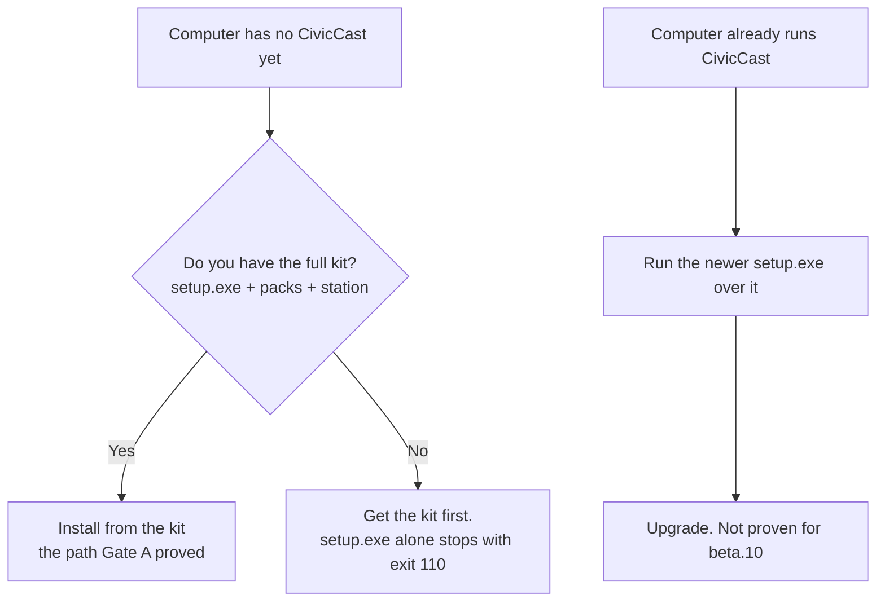

# Planning your station: hardware, network, storage, accounts {#ch-planning}

This chapter helps the person who runs IT at a small city decide which computer to use for CivicCast, what to open or leave closed on the network, how much disk space to set aside, who needs which accounts, and what to download and check before running the installer. Read it before [Chapter 10](#ch-installing). Nothing here changes the computer; it is all planning.

## Before you start

You need three decisions and one fact:

- **How many channels** the station will run at the same time (the lab station described below ran three).
- **Whether live captions matter** on the air. Captions are the part of the system most sensitive to the computer you choose.
- **Who will sit at the station computer** for first setup. In beta.10 the first administrator can only be created from a browser running on the station computer itself ([Chapter 10](#ch-installing), "First setup in the operator console").
- **The fact that decides everything else:** beta.10's installer needs the *full kit* (the installer plus its `packs` and `station` folders), not only `setup.exe`. The next section and [Chapter 10](#ch-installing) explain why.

## Know what has and has not been proven

The development first-install entry can prepare a verified selected kit before requesting administrator rights. It requires matching release files, an available signed channel and whole-pack HTTPS hosting; public delivery and a clean-machine journey are not yet verified. Plan for Microsoft WebView2 and enough space for both cached packs and their installed contents. This does not replace the published beta.10 full-kit instructions below; see [Chapter 10](#ch-installing).

CivicCast 1.0.0-beta.10 was published on 2026-10-02 as a **GitHub pre-release** (a "Beta Candidate"). It is a beta candidate, not a production release. State this plainly to anyone who signs off on the purchase.

| What was tested | Result |
| --- | --- |
| Clean-install lane of the project's automated acceptance test ("Gate A"), run in Windows Sandbox against the exact published installer and packs | **Passed, 10 of 10 criteria** (install, activation, health, console and portal render, clerk workflow, captions, playout engine, 5-minute soak). The playout-engine check passed only on a harness that waits longer for the engine's first packets, which on a fresh install arrived more than 60 seconds after first start |
| Upgrade lane (beta.10 over an earlier release) | **Not run** (waived by the owner) |
| Download-only lane (setup without the full kit) | **Not run** (waived by the owner) |
| First install on a computer with **neither** the full kit **nor** an earlier install | **Not proven.** As read in the installer code it cannot finish (see [Chapter 10](#ch-installing)) |
| Eight-hour, three-channel run | Done on an *earlier internal build* of the same engine, on one lab computer. Not repeated on the published installer |
| Human field tester sign-off; operation at a real station; physical SDI capture; real cable-operator acceptance | **None yet** |

The exact wording is in the project's verification record for beta.10. If a vendor, a board or a funder asks "is it production ready", the answer from the record is no.

> **Note:** The Gate A sandbox was configured without a virtual graphics card, but the project's own log records that the sandbox guest could still see the host computer's NVIDIA card. Do not read the Gate A pass as proof that a computer *without* a graphics card works. This chapter marks every place where we have no measurement.



*Figure 9.1. Which delivery you need. Only the full-kit path was proven in beta.10.*

The left branch is a first install: it needs the full kit. The right branch is an upgrade of a machine that already runs CivicCast; it reuses what is already on the machine, but the upgrade lane was not run for beta.10, so back up first.

## Choose the computer

### What the installer looks at

The installer's first-run window has a screen called **Checking This Computer**. It reads the processor, memory, graphics card and free disk space and shows them. Only one reading can stop you.

| Reading | How it is taken | What it does |
| --- | --- | --- |
| Processor name and logical cores | Windows registry and `GetLogicalProcessorInformationEx` | Shown. Never blocks |
| Memory | `GlobalMemoryStatusEx`, in GB with one decimal | Shown. Never blocks |
| Graphics cards | Windows DXGI adapter list; the software adapter and exact duplicates are skipped | Shown as `<name> (<VRAM> GB)`. Only NVIDIA cards (PCI vendor 0x10DE) change the recommendation |
| Free space on the install drive | `GetDiskFreeSpaceExW` | **Blocks** when free space is less than the total of the default downloads |

A value the installer cannot read is shown as **Unavailable**. It is never replaced with a guess. If the whole check fails, the window says **Hardware check unavailable** and lets setup continue.

> **Known issue (beta.10):** This check runs in the first-run window, *after* the Windows setup phase has already copied and extracted the program. It is not a pre-flight for the large install. Its disk test counts only the downloads the window itself manages (about 9.7 GB by default, 14.1 GB with both optional items), not the tens of gigabytes the earlier phase has already written. The Windows setup page declares only about 5.1 GiB of space needed. Plan the disk yourself using "Plan storage" below.

### The operating system and software

| Item | What the code and release files show |
| --- | --- |
| Windows, 64-bit | The installer, runtime and Visual C++ prerequisite are all x64. **No minimum Windows version is stated** in the installer configuration or code. The lab station ran Windows 11. We have no record of tests on Windows 10 or on Windows Server |
| Administrator rights | Setup installs for the whole machine (`perMachine`) and asks Windows for approval (UAC). The first-run window runs as the normal signed-in user |
| Visual C++ runtime | Setup installs a bundled offline copy. It may ask for a Windows restart (the runtime installer returns code 3010) |
| WebView2 | The setup window needs Microsoft WebView2. A bundled offline copy is installed silently if it is missing. No internet is needed for it |
| Windows Defender Firewall | Setup adds one rule with `netsh advfirewall`. If that fails, setup stops with code 119 |
| No WSL, no Docker | Beta.10 is a native Windows service. It does not use WSL or Docker |
| The older WSL-based CivicCast | If a computer already has the older "CivicCast Installer" (WSL edition), setup may stop with 135 or 127, and uninstalling CivicCast (Native) asks an ownership question. Plan to remove the older edition first |
| Clock and time zone | Keep the Windows clock correct. Several screens treat times typed into them as **UTC** (see [Chapter 3](#ch-before-meeting)) |

One more rule of thumb: dedicate the computer. The station runs a database, a web server, an AI engine and several video processes as a Windows service under the LocalSystem account. We do not know of testing alongside other heavy software.

### Graphics card: what it changes

A graphics card matters for **captions** and **summaries**. It does not lighten video encoding in beta.10 (see the encoding paragraph after the tables).

The caption engine ("Whisper" speech recognition) comes in two sizes. **Medium** always installs. **Large** is an optional add-on.

| Your computer has | What the installer recommends | Where live captions run (as read in the code) |
| --- | --- | --- |
| No dedicated graphics card, or AMD or Intel graphics only | Medium | On the processor. The station gives live captions one worker and a capped thread count so that video playout keeps the machine |
| NVIDIA card with **less than 8 GB** of video memory | Medium | On the processor, as above |
| NVIDIA card with **8 GB or more** | Large is pre-ticked, with a GPU library | On the card (CUDA) **only when** the GPU library files are also present; then it uses up to three workers (one per channel on a three-channel station). With the card but without those files it runs on the processor |

The installer's own text explains the difference: on a capable card Large "captions live"; otherwise it "captions recordings after the meeting".

> **Note:** The rule uses video memory as a stand-in for card capability. The code records that an older NVIDIA card with enough memory but no tensor cores can be *slower* on the card than on the processor (one older card missed all 30 deadlines in testing). The station operator can override the device with the `CIVICCAST_WHISPER_DEVICE` environment variable; see [Chapter 11](#ch-configuration).

> **Known issue (beta.10):** The station uses the **highest caption engine that is installed**. If Large is present, live captions use Large, even on a computer where the setup screens say Large is too slow to run live. Earlier installers can download Large even when you untick it; the development correction passes that selection to the download engine (see [Chapter 10](#ch-installing)). On a computer without a capable NVIDIA card, check after install that Large is not present, or expect live captions to fall behind. We have not measured Large on a processor.

The AI that writes summaries and translations is chosen by a second rule.

| Condition | Summary model chosen by default |
| --- | --- |
| Any NVIDIA graphics card detected **and** 16 GB of memory or more | `gemma4:12b` |
| Anything else | `gemma4:e4b` |

All three AI models (`gemma4:12b`, `gemma4:e4b` and the translation model `translategemma:4b`) are installed on every station; the rule only picks the default. The product's catalog lists a minimum of 16 GB of memory for the 12B model and 8 GB for the smaller one. The only measurement the project recorded without a graphics card was on a computer with 32 GB of memory and 16 cores (32 threads): the smaller model finished a summary in 94 seconds warm and 128 seconds cold, while the 12B model took 366 seconds once and then failed twice. We have no measurement on a smaller computer.

**Video encoding runs on the processor.** The bundled playout engine uses a software H.264 encoder (OpenH264). The project's post-beta.10 backlog lists NVIDIA hardware encoding as future work. The default output profile in code is 1280 x 720, 30 frames per second, H.264 at 6,000 kbps and AAC audio at 192 kbps. So processor cores, not the graphics card, set how many channels you can run.

### What was measured on the lab station

The three-channel evidence in the verification record came from one lab computer. The project's oversight notes describe it as Windows 11 with an AMD Ryzen 7 7800X3D (8 cores, 16 threads) and an NVIDIA RTX 5070 Ti. We do not have its memory size on record.

| Measure on that computer | Result |
| --- | --- |
| Three channels on air for 8 hours | One service process the whole time; no restart; 0 watchdog firings |
| Processor load while preparing a long program for the first time | 95 to 98 percent (oversight notes) |
| Conform cache | 46 GB of its 60 GB budget used |
| Live caption audio dropped under heavy load | 13 catch-up discard events in 8 hours; about 160 seconds of audio lost on a quiet machine |

> **Known issue (beta.10):** Under heavy processor load (for example while the station prepares a long program for the first time) the live caption worker can fall behind and throw away audio. Captions stay on the air, but some speech gets no caption. The verification record lists this as a known limit and says a fix is the next work item. Stations that must have loss-free captions should weigh this.

### Our recommendation

These follow from the evidence above. They are not tested minimums, because the project has not published any.

1. **For several live channels with live captions**, plan for a computer in the class that was measured: a recent desktop processor with at least 8 cores and 16 threads, an NVIDIA card with 8 GB or more, and Windows 11. Use more memory than the 16 GB the sandbox was given if the budget allows.
2. **Without an NVIDIA card**, expect slow summaries (minutes each) and live captions that can lag when several channels are busy. Start with one channel and watch the Readiness screen ([Chapter 8](#ch-something-wrong)). The beta.10 record has no multi-channel measurement for this case.
3. **Do not run other large programs on the station** during meetings. Disk scans alone produced small caption discards in the lab run.

To see what CivicCast itself detects after install, open `http://127.0.0.1:8000/api/hardware` in a browser on the station (it needs no sign-in) or run `civiccast doctor` ([Appendix A](#app-cli)).

## Plan the network and firewall

### What listens where

Everything the station runs listens on the computer's own loopback address, `127.0.0.1`. That is deliberate in the code: a note in the setup code says the control plane "binds `127.0.0.1` only".

| Port | Used by | Reachable from | Source |
| --- | --- | --- | --- |
| TCP 8000 | The CivicCast web server: operator console at `/operator/`, resident portal at `/`, the API, and `/health` | The station computer only | `children.py`, `core.py` |
| TCP 5432 (or the first free of 5433, 5434, 5435, 5544) | PostgreSQL database | The station computer only | `provision/models.py`, `port_select.py` |
| TCP 11434 | The bundled Ollama AI engine (version 0.30.6) | The station computer only | `children.py` |
| TCP 38474 | The setup window's one-copy-at-a-time guard | The station computer only | `main.rs` |
| UDP 17800 upward; UDP 18000 to 18499 | Internal media relays between the playout engine and ffmpeg or TSDuck. Source ports for outgoing transport streams sit 1,000 above the first range | The station computer only | `ts_relay.py`, `hls_relay.py` |

Do not open the internal ports on the firewall. If another program on the same computer already uses 11434 or 8000, plan to move it; we did not test what CivicCast does when a port is taken.

> **Known issue (beta.10):** Setup adds a Windows Firewall rule named **CivicCast (Native) Portal/API (TCP 8000)**: inbound, allow, TCP, port 8000, all network profiles, for the program `<install folder>\runtime\python.exe`. But the web server starts with `--host 127.0.0.1`, so other computers cannot connect to port 8000 whatever the rule says, and we found no setting that changes the address. Plan to use the operator console **on the station computer**. A remote-control tool works only if the browser itself runs on the station. How residents watch is a publishing question, answered in [Chapter 15](#ch-integrations), not a matter of pointing their browsers at the station.

### What the station connects out to

| Purpose | Destination | When |
| --- | --- | --- |
| First-run window downloads (signed runtime packs) | `github.com` release downloads (and the hosts GitHub redirects to) | Only if the window has to download something. Redirects that are not HTTPS are refused |
| First-run window downloads (caption weights) | `huggingface.co` | Same |
| First-run window downloads (AI model) | `registry.ollama.ai` | Same |
| Windows setup itself | None. The setup phase makes no network call; the Gate A run had networking disabled | Never |
| Video and publishing outputs | Whatever you configure: a cable headend (UDP or SRT), a CDN, a streaming service, email, a federation server | [Chapter 15](#ch-integrations) |

The station does not need the internet to run. The Gate A run had networking disabled, and its station installed, came up and passed its checks. The code even hides the built-in `/docs` page because "a council-chamber station is frequently firewalled outbound and sometimes air-gapped".

> **Known issue (beta.10):** Earlier first-run installers try to fetch optional downloads even when you untick them; the development correction now honors that selection. A source still names an old frozen release (`scottconverse/civiccast-releases`, tag `native-beta-1.0.0-beta.1-rc1`), not the beta.10 page; the selection fix does not change that source. Selected downloads can take hours on a poor connection (the transfer timeout is six hours), and with no internet they fail unless verified local files are available. Setup itself does not depend on these optional downloads. See [Chapter 10](#ch-installing).

If a security appliance does TLS inspection or an allow-list, allow the three destinations above for the one-time first-run downloads, or run from the full kit and block them.

Two details matter if you control outbound traffic. A UDP transport stream to a headend leaves from a local port pinned 1,000 above the relay's listening port, so a firewall that filters by source port needs to know that. And the Gate A test harness added its own allow rules for `tsp.exe`, `ffmpeg.exe` and `ffprobe.exe`; the product does not add them. If a third-party firewall prompts on first use of those programs, allow them. The other outputs depend on what you configure ([Chapter 15](#ch-integrations)).

## Plan storage

CivicCast keeps the program under the install folder (default `C:\Program Files\CivicCast (Native)`) and everything it creates under `C:\ProgramData\CivicCast`. The data folder follows the `PROGRAMDATA` environment variable and is on the system drive unless that variable is changed. We know of no test that moved it.

| What | Where | Size, with source |
| --- | --- | --- |
| Program, runtime, video tools, AI engine | `<install folder>` | The Windows setup page declares 5,400,000 KB (about 5.1 GiB) for this. The five runtime packs in the beta.10 release total 4.6 GB (table below) |
| Model packs: cached copy | `<install folder>\packs\.station-cache` | "about 21 GB" (the uninstall notice) |
| Model packs: extracted copy | `<install folder>\packs\captions-floor`, `components\`, `models\ollama\` | Extraction is about 1 to 1 with the pack size (code constant). The cached copy stays on disk too, so models take about twice the pack size |
| First-run downloads, if any | `C:\ProgramData\CivicCast\packs` and `components` | 9.7 GB default and 14.1 GB with both optional items (catalog placeholder sizes). The real GPU pack is 1.89 GB, so the total changes once real sizes are known |
| Database | `C:\ProgramData\CivicCast\data\pgdata` | Holds records, not video; grows with use. We have no measured figure |
| Uploads and finished packages | `C:\ProgramData\CivicCast\data\uploads` | Operator-uploaded media |
| Conform cache (ready-to-play copies of programs) and working files | `C:\ProgramData\CivicCast\data\egress` (cache in `conform-cache`) | Budget **60 GB** by default in beta.10; set `CIVICCAST_CONFORM_CACHE_GB` to change it (zero or less turns the cache off). Another budget keeps the three newest plan folders and about 5 GB (`CIVICCAST_PREPARED_PLAN_DIR_BUDGET_GB`) |
| Scheduled recordings | In a `scheduled-recordings` folder under the recording target you set in the console | One program-hour is about 2 GB by the Setup screen's planning figure; the default output profile works out to about 2.8 GB per hour (6,192 kbps x 3,600 s, our arithmetic) |
| Logs | `C:\ProgramData\CivicCast\logs` | `supervisor.log` rotates at 10 MiB, 10 files. Rotation of the other logs is not documented |
| Backups | A folder you choose | You decide |

Putting it together for a first install from the kit, our derived estimate is: the two copies of the model packs (about 21 GB each) plus the runtime packs and their extracted trees (about 4.6 GB each) plus 2 GB of working room, so **plan for roughly 55 GB free on the install drive before you start**. Setup itself only refuses at its activation step: it needs the sum of the model-pack sizes plus 2 GB free and prints "Not enough free disk space to activate this station..." if it is short. Add the conform cache budget (60 GB by default) and your recordings on top.

> **Tip:** Do not rely on the default 60 GB cache fitting on a small system drive. Either give the station a large drive, or lower `CIVICCAST_CONFORM_CACHE_GB` before the first busy week. A single prepared program larger than the whole budget cannot be kept. The station then refuses it with the error "Conform-cache budget too small to retain '<file name>'; increase CIVICCAST_CONFORM_CACHE_GB or exclude this asset."

> **Known issue (beta.10):** The Setup screen's **Backup destination** control only proves that the folder accepts a test file (it writes, reads and deletes one). Its success message is "Backup destination accepted a write/read/delete proof." It does not copy station data there. See [Chapter 12](#ch-operations) for how backups are actually made. Because the station runs as LocalSystem, pick a local drive or a network path the computer account can reach; a drive letter mapped by a person is not visible to a Windows service.

## Plan accounts and permissions

| Who or what | What they need | Why |
| --- | --- | --- |
| The person who installs | A Windows administrator account | Setup is per-machine and uses UAC. Run a silent install from an elevated prompt |
| The Windows service | Nothing to create | It is registered as **CivicCast Native Supervisor** (`CivicCastSupervisor`), runs as LocalSystem, starts automatically, and restarts after 5, 10 and 30 seconds if it fails |
| The person at the station for first setup | A normal Windows account on the station computer and a browser | First setup, sign-in and recovery only work from the station itself (a loopback check; other computers get HTTP 403) |
| The first CivicCast administrator | A display name, a username, a password of **12 characters or more**, and a place to keep the recovery kit | Created by the browser form in [Chapter 10](#ch-installing). Its sign-in carries all five roles. Narrower roles come only from tokens an administrator issues ([Chapter 13](#ch-security), [Appendix F](#app-roles)) |
| A person who keeps the recovery kit | A safe place that is not a public folder | The kit holds eight one-time recovery codes and, in the saved file, the administrator password in plain text |
| Security software | An exclusion or allow rule for `<install folder>` and `C:\ProgramData\CivicCast` if it blocks writes | The first-run window's own error text names "security software blocking the CivicCast folder" as the usual cause of a write refusal |
| Backup and publishing destinations | Credentials you hold | Chapter 15 covers provider credentials |

Windows accounts matter in one more place: the first-run window remembers that it has finished in `%USERPROFILE%\.civiccast` and in the browser storage of the Windows account that ran it. A different Windows account sees **Checking This Computer** again.

## Download and verify what you need

### What is on the release page

The release is at <https://github.com/scottconverse/civiccast-native/releases/tag/v1.0.0-beta.10> (marked pre-release; title "CivicCast v1.0.0-beta.10 (Beta Candidate)"). Use that page, not a draft, not an older pre-release and not the retired `scottconverse/civiccast` repository. Do not install from the source ZIP.

On the day this chapter was written the page listed these eight assets (sizes as the GitHub API reported them):

| File | Size in bytes | About |
| --- | --- | --- |
| `setup.exe` | 242,367,640 | 242 MB; the signed installer |
| `native-app-payload.ccpack` | 564,059,620 | 564 MB; the CivicCast program |
| `native-server-binaries.ccpack` | 76,249,023 | 76 MB; PostgreSQL tools (the Gate A run also found the TSDuck program `tsp.exe` inside this pack) |
| `native-ffmpeg-runtime.ccpack` | 144,130,093 | 144 MB; video tools |
| `native-ollama-runtime.ccpack` | 1,941,233,058 | 1.94 GB; the AI engine |
| `native-cuda-runtime.ccpack` | 1,893,729,051 | 1.89 GB; optional GPU libraries |
| `SHA256SUMS.txt` | 547 | Hashes for `setup.exe` and the five packs |
| `setup.exe.sidecar.json` | 154 | The installer's hash and signing flag; it is plain data, not a signature |

The five `.ccpack` files add up to about 4.6 GB. A `.ccpack` is a signed container; the installer checks its signature before using it.

**The model packs are not on the release page.** The roughly 21 GB `station` folder (speech and AI model packs and a signed index) is delivered only inside the full kit. The kit is handed out by USB or network copy by the project. The public documents name no download address for it, so ask through the project's issue page (<https://github.com/scottconverse/civiccast-native/issues>; this is the project's only support route, community-run, no service agreement).

> **Known issue (beta.10):** The Windows setup folder page says that "after Setup finishes, the CivicCast setup wizard downloads additional components (captions and AI models) separately". That is not what the install does. The Windows setup phase needs the model packs beside it and makes no download. See [Chapter 10](#ch-installing) for the exact behavior.

### Check the files

1. Put `setup.exe`, `SHA256SUMS.txt`, `setup.exe.sidecar.json` and any `.ccpack` files in one folder. Open PowerShell there.
2. Compute the installer's hash and compare it with the same file's line in `SHA256SUMS.txt` and with the `sha256` value in the sidecar. All three must match exactly.

   ```powershell
   Get-FileHash .\setup.exe -Algorithm SHA256
   Get-Content .\SHA256SUMS.txt
   Get-Content .\setup.exe.sidecar.json
   ```

   On the day this chapter was written, `SHA256SUMS.txt` and the sidecar both gave `5dbf11d9fb571596232050d8f57ea603a683ca31f88822b85c20c3bc41d8724c` for `setup.exe`. Compare the whole value, and take it from the release page you downloaded from, not from this manual.
3. Check the signature:

   ```powershell
   Get-AuthenticodeSignature .\setup.exe | Format-List Status, SignerCertificate
   ```

   Expect `Status` to be `Valid` and the signer to be `CN=Scott Converse` (Azure Trusted Signing; the project's signing policy records this). Any other result is a reason to stop.
4. Check the packs the same way: `Get-FileHash .\*.ccpack -Algorithm SHA256` and compare each with `SHA256SUMS.txt`. The installer re-checks every pack's signature itself.

A **kit** has its own checks. Use the kit's own hash list or delivery manifest from whoever handed it over, and do not expect the GitHub sidecar in a kit. The installer inside a kit may carry a different file name than `setup.exe`; use the name in the kit's manifest.

### The Windows SmartScreen warning

Windows may show a blue **Windows protected your PC** screen. That screen is about download reputation, which a new publisher has not built up yet. It is not a verdict on the signature. Check the hash and the signature first (steps above). If both are right, choose **More info** and then **Run anyway**. If those choices are missing, or the publisher or hash differs from what you checked, stop. Your IT policy can also allow the signed build by publisher or by hash.

### Pre-install checklist

- [ ] I know this is a beta candidate and who in the city has accepted that.
- [ ] I have the **full kit** (`setup.exe`, `packs\`, `station\`) on a local drive or USB drive, not only `setup.exe`.
- [ ] I checked the installer's SHA-256 against two sources and its signature shows `Valid` for the expected signer.
- [ ] The computer is 64-bit Windows, dedicated to CivicCast, and not running the older WSL-based CivicCast.
- [ ] The install drive has about 55 GB free, plus room for the conform cache and recordings.
- [ ] I have an administrator account and the computer will stay powered and awake for the whole install (Gate A took about 33 minutes from start to a healthy station inside Windows Sandbox; a real computer will differ).
- [ ] Windows Defender Firewall is on and not locked by policy against adding a rule, or I have a plan for exit code 119.
- [ ] Security software will not quarantine `C:\Program Files\CivicCast (Native)` or `C:\ProgramData\CivicCast`.
- [ ] I know the plan for backups ([Chapter 12](#ch-operations)) and where the recovery kit will be kept.
- [ ] Someone will be at the station to create the first administrator in a browser on that computer.
- [ ] If this is an upgrade, I have a backup, I accept that the station goes off air while setup runs, and I know the upgrade lane was not run for beta.10.
- [ ] I have a way to copy text out of the setup window and out of `C:\ProgramData\CivicCast\install-progress.log` to send to support.

## If it did not work

| What you see | Cause | What to do |
| --- | --- | --- |
| The hashes do not match | A damaged or altered download | Do not run it. Download again from the exact release page, or ask the person who gave you the kit for a new copy |
| `Get-AuthenticodeSignature` is not `Valid` | The file is not the signed release | Stop. Do not install |
| Hardware check unavailable. "CivicCast could not check this computer's hardware. It will not guess..." | The probe failed | Setup can continue. If a download later runs out of room, free space and choose Retry |
| Not enough free disk space. "This drive doesn't have enough free space: needs X.X GB free, this drive has Y.Y GB." | The first-run window found too little room for its downloads | Free space on the drive, then close the window and open **CivicCast (Native)** again so the check repeats |
| "Not enough free disk space to activate this station..." in the setup details list (exit 123) | Activation needs the model-pack sizes plus 2 GB | Free the space the message names and run setup again. Nothing was deleted |

## Related

- [Chapter 10: Installing, first run, upgrading, uninstalling](#ch-installing)
- [Chapter 11: Configuring the station](#ch-configuration)
- [Chapter 12: Running it day to day](#ch-operations)
- [Chapter 13: Security and privacy](#ch-security)
- [Chapter 15: Cable headend, streaming, CDN, federation, emergency alerts, the API](#ch-integrations)
- [Appendix A: command-line reference](#app-cli)

<!-- SOURCES: docs/releases/v1.0.0-beta.10-verification.md; docs/releases/release-truth.yaml; INSTALL-WINDOWS.md (topics only); docs/tester/START-HERE.md (setup.exe size, kit); docs/install/windows-release-trust.md; CODE_SIGNING_POLICY.md; SUPPORT.md; gh release view v1.0.0-beta.10 (asset names, sizes) and downloaded SHA256SUMS.txt / setup.exe.sidecar.json; ops/docs-sprint/inventory/screens/installer-gui-checking-computer.md, installer-gui-download-plan.md, installer-component-catalog.md, installer-install-layout.md, installer-nsis-setup-wizard.md, installer-nsis-activation-selftest.md, installer-nsis-service-finish.md, setup.md; civiccast/apps/installer/src-tauri/src/hardware_inventory.rs:21-241; src-tauri/src/native_activation.rs:20-60,820-880; src-tauri/src/native_distribution.rs:725-770; src-tauri/src/main.rs:30-40,3296-3330,3682-3750; src-tauri/src/acquisition_catalog.rs:210-262,670-690; src-tauri/nsis-hooks-bootstrap.nsh:150-200,625-700,702-770,2196-2260; src-tauri/tauri.native.conf.json; src-tauri/src/native_service_registration.rs:154-167,2765-2790; civiccast/platform/hardware.py:1-120,349-357; civiccast/ai_models/models.py:174-199; civiccast/ai_models/catalog.py:60-130; civiccast/app.py:1179-1193; civiccast/native/station_runtime.py:672-730,771-795,816-820,960-1030,1075-1110; civiccast/captions/runtime.py:100-200; civiccast/native/supervisor/children.py:34,146-152,272-290,460-560; civiccast/native/supervisor/core.py:388-394; civiccast/native/supervisor/service.py:34,192-193,2050-2110; civiccast/native/supervisor/install_layout.py:160-275; civiccast/egress/preparer.py:1-30,90,144,243,301-315; civiccast/egress/models.py:116-134; civiccast/egress/gst/graph.py:19; civiccast/egress/ts_relay.py:35-95; civiccast/egress/hls_relay.py:247-262,347; civiccast/recording/runtime.py:55-80,204,528; civiccast/installer/service.py:1075-1140; civiccast/installer/models.py:325-365; civiccast/apps/portal-operator/src/screens/SetupScreen.tsx:1217-1229; ops/beta10-oversight/POST-BETA10-BACKLOG.md items 3; ops/beta10-oversight/OVERSIGHT-LOG.md:115,589; ops/beta10-oversight/briefs/U29.md:28, U68.md:30; docs/releases/evidence/v1.0.0-beta.10-gate-a/run5-clean-lane-PASS-b6520847/ (summary.json, T3T5-RESULT.txt); sandbox-lab/CivicCastSandboxTest.wsb (MemoryInMB 16384) -->
