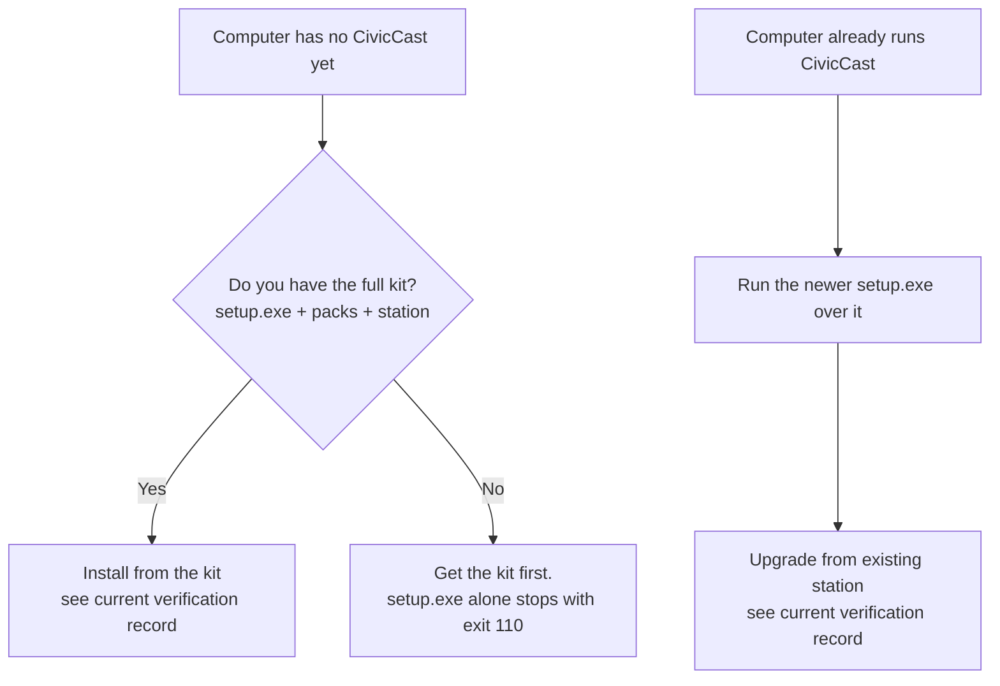

# Planning your station: hardware, network, storage, accounts {#ch-planning}

This chapter helps the person who runs IT at a small city decide which computer to use for CivicCast, what to open or leave closed on the network, how much disk space to set aside, who needs which accounts, and what to download and check before running the installer. Read it before [Chapter 10](#ch-installing). Nothing here changes the computer; it is all planning.

## Before you start

You need three decisions and one fact:

- **How many channels** the station will run at the same time (the lab station described below ran three).
- **Whether live captions matter** on the air. Captions are the part of the system most sensitive to the computer you choose.
- **Who will sit at the station computer** for first setup. The first administrator can only be created from a browser running on the station computer itself ([Chapter 10](#ch-installing), "First setup in the operator console").
- **The fact that decides everything else:** the beta.11 installer needs the full kit (`setup.exe` plus its signed `packs` and `station` folders), not only `setup.exe`. The next section and [Chapter 10](#ch-installing) explain the package contents.

## Know what has and has not been proven

CivicCast 1.0.0-beta.11 was published on 2026-10-08 as a **GitHub pre-release**, not a production release. An earlier beta.11 package was refreshed on an existing beta.11 host. Two observations 41 seconds apart showed advancing HLS and changing captions on all three channels; this was a brief output check. The [current verification record](https://github.com/scottconverse/civiccast-native/blob/main/docs/releases/v1.0.0-beta.11-verification.md) lists the latest package's checks and limits.

| What was tested | Result |
| --- | --- |
| Earlier published beta.11 package, refreshed on an existing beta.11 host | Two observations 41 seconds apart showed advancing HLS and changing captions on three channels; brief output check only |
| Latest beta.11 package | See the current verification record for its source, hash, installation checks and limits |
| Clean install, failed-install repair, upgrade from beta.10, long-duration or capacity behavior | See the verification record for the exact package; the earlier in-place refresh did not test these |
| Separate 36-hour dev7 soak | Development-station overlay, separate from the published package; not package verification or capacity proof |
| Operation at a real station; physical SDI capture; real cable-operator acceptance | **Not established** |

The exact scope is in the [beta.11 verification record](https://github.com/scottconverse/civiccast-native/blob/main/docs/releases/v1.0.0-beta.11-verification.md). If a vendor, board or funder asks whether this is production ready, beta.11 is a pre-release and the answer is no.

> **Note:** The Gate A sandbox was configured without a virtual graphics card, but the project's own log records that the sandbox guest could still see the host computer's NVIDIA card. Do not read the Gate A pass as proof that a computer *without* a graphics card works. This chapter marks every place where we have no measurement.



*Figure 9.1. Which delivery you need. The full kit is the installer input; see the current verification record for package-specific check results.*

The left branch is a first install: it needs the full kit. The right branch is an upgrade of a machine that already runs CivicCast. Check the current verification record for the latest package's results; back up first and keep a recovery path available.

## Choose the computer

### What the installer looks at

The installer's first-run window has a screen called **Checking This Computer**. It reads the processor, memory, graphics card and free disk space and shows them. Only one reading can stop you.

| Reading | How it is taken | What it does |
| --- | --- | --- |
| Processor name and logical cores | Windows registry and `GetLogicalProcessorInformationEx` | Shown. Never blocks |
| Memory | `GlobalMemoryStatusEx`, in GB with one decimal | Shown. Never blocks |
| Graphics cards | Windows DXGI adapter list; the software adapter and exact duplicates are skipped | Shown as `<name> (<VRAM> GB)`. Only NVIDIA cards (PCI vendor 0x10DE) change the recommendation |
| Free space on the install drive | `GetDiskFreeSpaceExW` | **Blocks** when free space is less than the total of the default downloads |

A value the installer cannot read is shown as **Unavailable**. It is never replaced with a guess. If the whole check fails, the window says **Hardware check unavailable** and lets setup continue.

> **Known issue (beta.11):** The **Checking This Computer** screen runs after Windows setup has already copied and extracted the program. Its free-space check covers only optional downloads selected in the first-run window; it is not a pre-flight for the full installation. Use the storage table below to plan room for the staged packs, extracted models, conform cache and recordings, and follow the exact package's disk-space message.

### The operating system and software

| Item | What the code and release files show |
| --- | --- |
| Windows, 64-bit | The installer, runtime and Visual C++ prerequisite are all x64. **No minimum Windows version is stated** in the installer configuration or code. The lab station ran Windows 11. We have no record of tests on Windows 10 or on Windows Server |
| Administrator rights | Setup installs for the whole machine (`perMachine`) and asks Windows for approval (UAC). The first-run window runs as the normal signed-in user |
| Visual C++ runtime | Setup installs a bundled offline copy. It may ask for a Windows restart (the runtime installer returns code 3010) |
| WebView2 | The setup window needs Microsoft WebView2. A bundled offline copy is installed silently if it is missing. No internet is needed for it |
| Windows Defender Firewall | Setup adds one rule with `netsh advfirewall`. If that fails, setup stops with code 119 |
| No WSL, no Docker | Beta.11 is a native Windows service. It does not use WSL or Docker |
| The older WSL-based CivicCast | If a computer already has the older "CivicCast Installer" (WSL edition), setup may stop with 135 or 127, and uninstalling CivicCast (Native) asks an ownership question. Plan to remove the older edition first |
| Clock and time zone | Keep the Windows clock correct. Several screens treat times typed into them as **UTC** (see [Chapter 3](#ch-before-meeting)) |

One more rule of thumb: dedicate the computer. The station runs a database, a web server, an AI engine and several video processes as a Windows service under the LocalSystem account. We do not know of testing alongside other heavy software.

### Graphics card: what it changes

**Beta.11 live captions use Whistle on the CPU by default.** Whistle publishes its first recognition without waiting for a second reading to agree. One station-wide lock serializes Whistle recognition across that station's channels. Each request has a 10-second deadline; if Whistle fails or times out, that channel switches to Whisper for the rest of the runtime. Restarting the CivicCast service resets the live runtime. This is a release behavior; the published-package check only sampled output briefly and does not establish capacity.

Whisper remains the engine for recorded-media captions and the configured fallback for Whistle. It can also be selected as the live primary through the service environment. CUDA is optional Whisper acceleration; it is not needed for the Whistle primary. AMD and Intel graphics do not provide CUDA acceleration. If `CIVICCAST_WHISPER_DEVICE` is unset, the service uses CUDA only when a supported NVIDIA GPU with at least 8 GB and the staged CUDA runtime are both present; otherwise Whisper runs on CPU. Set `CIVICCAST_WHISPER_DEVICE=cuda` or `cpu` to choose explicitly. `CIVICCAST_LIVE_CAPTION_ENGINE=whistle` selects the default Whistle primary with Whisper fallback; `whisper` selects Whisper for live captions. Restart the service after changing these settings. Needle usage telemetry is disabled; speech processing and model assets remain local.

The installer ships the signed Whistle component with the station packs. **Medium Whisper** is also required for fallback and recorded captions. **Large Whisper** and the CUDA runtime are optional; Large may be preselected on capable hardware.

A graphics card can accelerate **Whisper** and affect the default summary model. It is not required for live captions on the native Whistle path. It does not lighten video encoding (see the encoding paragraph after the tables).

| Your computer has | What the installer recommends | Effect on Whisper |
| --- | --- | --- |
| No dedicated graphics card, or AMD or Intel graphics only | Medium; Large and CUDA remain optional | CPU with int8 by default |
| NVIDIA card with **less than 8 GB** of video memory | Medium; Large and CUDA remain optional | CPU with int8 by default |
| NVIDIA card with **8 GB or more** | Large and CUDA may be preselected | CUDA only when the CUDA runtime files are staged; otherwise CPU |

These Whisper choices affect the fallback, recorded captions, or an explicitly selected Whisper live-primary mode. Native live captions still default to Whistle.

> **Note:** The rule uses video memory as a stand-in for card capability. The code records that an older NVIDIA card with enough memory but no tensor cores can be *slower* on the card than on the processor (one older card missed all 30 deadlines in testing). The station operator can override the device with the `CIVICCAST_WHISPER_DEVICE` environment variable; see [Chapter 11](#ch-configuration).

> **Historical beta.10 behavior:** The older native live path selected the highest installed Whisper tier. Beta.11's native live path defaults to Whistle, with Whisper as its fallback. The first-run Large and CUDA checkboxes control those optional downloads; leaving them unchecked skips those downloads.

The AI that writes summaries and translations is chosen by a second rule.

| Condition | Summary model chosen by default |
| --- | --- |
| Any NVIDIA graphics card detected **and** 16 GB of memory or more | `gemma4:12b` |
| Anything else | `gemma4:e4b` |

All three AI models (`gemma4:12b`, `gemma4:e4b` and the translation model `translategemma:4b`) are installed on every station; the rule only picks the default. The product's catalog lists a minimum of 16 GB of memory for the 12B model and 8 GB for the smaller one. The only measurement the project recorded without a graphics card was on a computer with 32 GB of memory and 16 cores (32 threads): the smaller model finished a summary in 94 seconds warm and 128 seconds cold, while the 12B model took 366 seconds once and then failed twice. We have no measurement on a smaller computer.

**The default video encoder runs on the processor.** CivicCast uses OpenH264 software encoding by default. Compatible NVIDIA or Media Foundation hardware encoders can be configured when present; the channel profile and pre-flight determine whether one is used or a CPU fallback is allowed. The default output profile is 1280 x 720, 30 frames per second, H.264 at 6,000 kbps and AAC audio at 192 kbps. This release has no channel-capacity result; test the planned number of channels on the intended computer.

### What was measured on the lab station

The three-channel evidence in the verification record came from one lab computer. The project's oversight notes describe it as Windows 11 with an AMD Ryzen 7 7800X3D (8 cores, 16 threads) and an NVIDIA RTX 5070 Ti. We do not have its memory size on record.

| Measure on that computer | Result |
| --- | --- |
| Three channels on air for 8 hours | One service process the whole time; no restart; 0 watchdog firings |
| Processor load while preparing a long program for the first time | 95 to 98 percent (oversight notes) |
| Conform cache | 46 GB of its 60 GB budget used |
| Live caption audio dropped under heavy load | 13 catch-up discard events in 8 hours; about 160 seconds of audio lost on a quiet machine |

> **Historical beta.10 measurement:** The eight-hour C16 run recorded 13 catch-up discard events and about 160 seconds of audio loss on a quiet machine. Beta.11 changes the live engine and publishes first-pass results, but live caption audio is still best-effort and may be shed under overload to preserve playout. The brief beta.11 package output check does not establish completeness or capacity; plan to monitor captions and test with the station's workload.

### Our recommendation

These follow from the evidence above. They are not tested minimums, because the project has not published any.

1. **For several live channels with captions**, size the processor for video playout and Whistle's station-wide serialized recognition, then observe the actual workload. The published beta.11 package check was too brief to establish a supported channel capacity; do not treat the dev7 soak as package capacity evidence.
2. **Without an NVIDIA card**, Whistle live captions still run on CPU. An NVIDIA card can accelerate Whisper fallback/recorded captions and may allow the larger summary model; neither the GPU nor CUDA is required for Whistle. Test the summary and caption workload on the intended machine.
3. **Do not run other large programs on the station** during meetings. Disk scans alone produced small caption discards in the lab run.

To see what CivicCast itself detects after install, open `http://127.0.0.1:8000/api/hardware` in a browser on the station (it needs no sign-in) or run `civiccast doctor` ([Appendix A](#app-cli)).

## Plan the network and firewall

### What listens where

Everything the station runs listens on the computer's own loopback address, `127.0.0.1`. That is deliberate in the code: a note in the setup code says the control plane "binds `127.0.0.1` only".

| Port | Used by | Reachable from | Source |
| --- | --- | --- | --- |
| TCP 8000 | The CivicCast web server: operator console at `/operator/`, resident portal at `/`, the API, and `/health` | The station computer only | `children.py`, `core.py` |
| TCP 5432 (or the first free of 5433, 5434, 5435, 5544) | PostgreSQL database | The station computer only | `provision/models.py`, `port_select.py` |
| TCP 11434 | The bundled Ollama AI engine (version 0.30.6) | The station computer only | `children.py` |
| TCP 38474 | The setup window's one-copy-at-a-time guard | The station computer only | `main.rs` |
| UDP 17800 upward; UDP 18000 to 18499 | Internal media relays between the playout engine and ffmpeg or TSDuck. Source ports for outgoing transport streams sit 1,000 above the first range | The station computer only | `ts_relay.py`, `hls_relay.py` |

Do not open the internal ports on the firewall. If another program on the same computer already uses 11434 or 8000, plan to move it; we did not test what CivicCast does when a port is taken.

> **Known issue (beta.11):** Setup adds a Windows Firewall rule named **CivicCast (Native) Portal/API (TCP 8000)**, but the web server listens on `127.0.0.1`, so other computers cannot connect to port 8000 through that rule. Use the operator console **on the station computer**. A remote-control tool works only if the browser itself runs on the station. How residents watch is a publishing question, answered in [Chapter 15](#ch-integrations), not a matter of pointing their browsers at the station.

### What the station connects out to

| Purpose | Destination | When |
| --- | --- | --- |
| First-run window downloads (signed runtime packs) | `github.com` release downloads (and the hosts GitHub redirects to) | Only if the window has to download something. Redirects that are not HTTPS are refused |
| First-run window downloads (caption weights) | `huggingface.co` | Same |
| First-run window downloads (AI model) | `registry.ollama.ai` | Same |
| Windows setup itself | None. The setup phase makes no network call; the Gate A run had networking disabled | Never |
| Video and publishing outputs | Whatever you configure: a cable headend (UDP or SRT), a CDN, a streaming service, email, a federation server | [Chapter 15](#ch-integrations) |

The station does not need the internet to run. The Gate A run had networking disabled, and its station installed, came up and passed its checks. The code even hides the built-in `/docs` page because "a council-chamber station is frequently firewalled outbound and sometimes air-gapped".

The first-run window downloads only selected optional Large Whisper and CUDA components when they are not already present. Those downloads use the signed source configured for the installer; a full kit supplies the required station packs, including Whistle and Medium Whisper.

If a security appliance does TLS inspection or an allow-list, allow the three destinations above for the one-time first-run downloads, or run from the full kit and block them.

Two details matter if you control outbound traffic. A UDP transport stream to a headend leaves from a local port pinned 1,000 above the relay's listening port, so a firewall that filters by source port needs to know that. And the Gate A test harness added its own allow rules for `tsp.exe`, `ffmpeg.exe` and `ffprobe.exe`; the product does not add them. If a third-party firewall prompts on first use of those programs, allow them. The other outputs depend on what you configure ([Chapter 15](#ch-integrations)).

## Plan storage

CivicCast keeps the program under the install folder (default `C:\Program Files\CivicCast (Native)`) and everything it creates under `C:\ProgramData\CivicCast`. The data folder follows the `PROGRAMDATA` environment variable and is on the system drive unless that variable is changed. We know of no test that moved it.

| What | Where | Size, with source |
| --- | --- | --- |
| Program, runtime, video tools, AI engine | `<install folder>` | Five signed runtime packs are staged here; check the beta.11 release checksum and package manifest for exact sizes |
| Model packs: cached copy | `<install folder>\packs\.station-cache` | "about 21 GB" (the uninstall notice) |
| Model packs: extracted copy | `<install folder>\packs\captions-floor`, `components\`, `models\ollama\` | Extraction is about 1 to 1 with the pack size (code constant). The cached copy stays on disk too, so models take about twice the pack size |
| First-run downloads, if any | `C:\ProgramData\CivicCast\packs` and `components` | Selected optional Large Whisper and CUDA files; exact size depends on what is already installed and selected |
| Database | `C:\ProgramData\CivicCast\data\pgdata` | Holds records, not video; grows with use. We have no measured figure |
| Uploads and finished packages | `C:\ProgramData\CivicCast\data\uploads` | Operator-uploaded media |
| Conform cache (ready-to-play copies of programs) and working files | `C:\ProgramData\CivicCast\data\egress` (cache in `conform-cache`) | Budget **60 GB** by default; set `CIVICCAST_CONFORM_CACHE_GB` to change it (zero or less turns the cache off). Another budget keeps the three newest plan folders and about 5 GB (`CIVICCAST_PREPARED_PLAN_DIR_BUDGET_GB`) |
| Temporary live-caption work | `C:\ProgramData\CivicCast\data\caption-tap` | Short working audio is removed during normal processing; ordinary beta.11 live captioning does not create permanent per-cue review rows or evidence WAVs |
| Scheduled recordings | In a `scheduled-recordings` folder under the recording target you set in the console | One program-hour is about 2 GB by the Setup screen's planning figure; the default output profile works out to about 2.8 GB per hour (6,192 kbps x 3,600 s, our arithmetic) |
| Logs | `C:\ProgramData\CivicCast\logs` | `supervisor.log` rotates at 10 MiB, 10 files. Rotation of the other logs is not documented |
| Backups | A folder you choose | You decide |

Use the signed beta.11 package manifest and the installer's disk-space message for the kit you received; pack sizes can change between releases. Activation checks the staged station-pack sizes plus 2 GB of working room and reports "Not enough free disk space to activate this station..." when short. Add the conform cache budget (60 GB by default) and recording storage on top. The beta.11 package was not clean-installed, so this source-derived estimate is not a measured installation requirement.

> **Tip:** Do not rely on the default 60 GB cache fitting on a small system drive. Either give the station a large drive, or lower `CIVICCAST_CONFORM_CACHE_GB` before the first busy week. A single prepared program larger than the whole budget cannot be kept. The station then refuses it with the error "Conform-cache budget too small to retain '&lt;file name&gt;'; increase CIVICCAST_CONFORM_CACHE_GB or exclude this asset."

> **Known issue (beta.11):** The Setup screen's **Backup destination** control only proves that the folder accepts a test file (it writes, reads and deletes one). Its success message is "Backup destination accepted a write/read/delete proof." It does not copy station data there. See [Chapter 12](#ch-operations) for how backups are actually made. Because the station runs as LocalSystem, pick a local drive or a network path the computer account can reach; a drive letter mapped by a person is not visible to a Windows service.

## Plan accounts and permissions

| Who or what | What they need | Why |
| --- | --- | --- |
| The person who installs | A Windows administrator account | Setup is per-machine and uses UAC. Run a silent install from an elevated prompt |
| The Windows service | Nothing to create | It is registered as **CivicCast Native Supervisor** (`CivicCastSupervisor`), runs as LocalSystem, starts automatically, and restarts after 5, 10 and 30 seconds if it fails |
| The person at the station for first setup | A normal Windows account on the station computer and a browser | First setup, sign-in and recovery only work from the station itself (a loopback check; other computers get HTTP 403) |
| The first CivicCast administrator | A display name, a username, a password of **12 characters or more**, and a place to keep the recovery kit | Created by the browser form in [Chapter 10](#ch-installing). Its sign-in carries all five roles. Narrower roles come only from tokens an administrator issues ([Chapter 13](#ch-security), [Appendix F](#app-roles)) |
| A person who keeps the recovery kit | A safe place that is not a public folder | The kit holds eight one-time recovery codes and, in the saved file, the administrator password in plain text |
| Security software | An exclusion or allow rule for `<install folder>` and `C:\ProgramData\CivicCast` if it blocks writes | The first-run window's own error text names "security software blocking the CivicCast folder" as the usual cause of a write refusal |
| Backup and publishing destinations | Credentials you hold | Chapter 15 covers provider credentials |

Windows accounts matter in one more place: the first-run window remembers that it has finished in `%USERPROFILE%\.civiccast` and in the browser storage of the Windows account that ran it. A different Windows account sees **Checking This Computer** again.

## Download and verify what you need

### What is on the release page

The release is at <https://github.com/scottconverse/civiccast-native/releases/tag/v1.0.0-beta.11> (marked pre-release). Use that page, not a draft or an older pre-release. Do not install from the source ZIP.

The beta.11 verification record lists the assembled package contents and hashes. It contains `setup.exe`, five signed runtime packs, six signed station packs (including `captions-whistle.ccpack`), the station index, checksum file, quick-start/manual files and the package receipt/render manifest. Check the release's `SHA256SUMS.txt` against every file you install. A `.ccpack` is a signed container; the installer checks its signature before using it.

The full kit includes the station folder with its signed index and station packs. Whistle and Medium Whisper are in that signed set; the optional Large Whisper and CUDA downloads can be skipped. See [Chapter 10](#ch-installing) for the current install flow.

### Check the files

1. Put `setup.exe`, `SHA256SUMS.txt`, `setup.exe.sidecar.json` and any `.ccpack` files in one folder. Open PowerShell there.
2. Compute the installer's hash and compare it with the same file's line in `SHA256SUMS.txt` and with the `sha256` value in the sidecar. All three must match exactly.

   ```powershell
   Get-FileHash .\setup.exe -Algorithm SHA256
   Get-Content .\SHA256SUMS.txt
   Get-Content .\setup.exe.sidecar.json
   ```

   On the day this chapter was written, `SHA256SUMS.txt` and the sidecar both gave `5dbf11d9fb571596232050d8f57ea603a683ca31f88822b85c20c3bc41d8724c` for `setup.exe`. Compare the whole value, and take it from the release page you downloaded from, not from this manual.
3. Check the signature:

   ```powershell
   Get-AuthenticodeSignature .\setup.exe | Format-List Status, SignerCertificate
   ```

   Expect `Status` to be `Valid` and the signer to be `CN=Scott Converse` (Azure Trusted Signing; the project's signing policy records this). Any other result is a reason to stop.
4. Check the packs the same way: `Get-FileHash .\*.ccpack -Algorithm SHA256` and compare each with `SHA256SUMS.txt`. The installer re-checks every pack's signature itself.

A **kit** has its own checks. Use the kit's own hash list or delivery manifest from whoever handed it over, and do not expect the GitHub sidecar in a kit. The installer inside a kit may carry a different file name than `setup.exe`; use the name in the kit's manifest.

### The Windows SmartScreen warning

Windows may show a blue **Windows protected your PC** screen. That screen is about download reputation, which a new publisher has not built up yet. It is not a verdict on the signature. Check the hash and the signature first (steps above). If both are right, choose **More info** and then **Run anyway**. If those choices are missing, or the publisher or hash differs from what you checked, stop. Your IT policy can also allow the signed build by publisher or by hash.

### Pre-install checklist

- [ ] I know this is a beta candidate and who in the city has accepted that.
- [ ] I have the **full kit** (`setup.exe`, `packs\`, `station\`) on a local drive or USB drive, not only `setup.exe`.
- [ ] I checked the installer's SHA-256 against two sources and its signature shows `Valid` for the expected signer.
- [ ] The computer is 64-bit Windows, dedicated to CivicCast, and not running the older WSL-based CivicCast.
- [ ] The install drive has about 55 GB free, plus room for the conform cache and recordings.
- [ ] I have an administrator account and the computer will stay powered and awake for the whole install (Gate A took about 33 minutes from start to a healthy station inside Windows Sandbox; a real computer will differ).
- [ ] Windows Defender Firewall is on and not locked by policy against adding a rule, or I have a plan for exit code 119.
- [ ] Security software will not quarantine `C:\Program Files\CivicCast (Native)` or `C:\ProgramData\CivicCast`.
- [ ] I know the plan for backups ([Chapter 12](#ch-operations)) and where the recovery kit will be kept.
- [ ] Someone will be at the station to create the first administrator in a browser on that computer.
- [ ] If this is an upgrade, I have a backup, I accept that the station goes off air while setup runs, and I know beta.11 was not tested as an upgrade.
- [ ] I have a way to copy text out of the setup window and out of `C:\ProgramData\CivicCast\install-progress.log` to send to support.

## If it did not work

| What you see | Cause | What to do |
| --- | --- | --- |
| The hashes do not match | A damaged or altered download | Do not run it. Download again from the exact release page, or ask the person who gave you the kit for a new copy |
| `Get-AuthenticodeSignature` is not `Valid` | The file is not the signed release | Stop. Do not install |
| Hardware check unavailable. "CivicCast could not check this computer's hardware. It will not guess..." | The probe failed | Setup can continue. If a download later runs out of room, free space and choose Retry |
| Not enough free disk space. "This drive doesn't have enough free space: needs X.X GB free, this drive has Y.Y GB." | The first-run window found too little room for its downloads | Free space on the drive, then close the window and open **CivicCast (Native)** again so the check repeats |
| "Not enough free disk space to activate this station..." in the setup details list (exit 123) | Activation needs the model-pack sizes plus 2 GB | Free the space the message names and run setup again. Nothing was deleted |

## Related

- [Chapter 10: Installing, first run, upgrading, uninstalling](#ch-installing)
- [Chapter 11: Configuring the station](#ch-configuration)
- [Chapter 12: Running it day to day](#ch-operations)
- [Chapter 13: Security and privacy](#ch-security)
- [Chapter 15: Cable headend, streaming, CDN, federation, emergency alerts, the API](#ch-integrations)
- [Appendix A: command-line reference](#app-cli)

<!-- SOURCES: docs/releases/v1.0.0-beta.10-verification.md; docs/releases/release-truth.yaml; INSTALL-WINDOWS.md (topics only); docs/tester/START-HERE.md (setup.exe size, kit); docs/install/windows-release-trust.md; CODE_SIGNING_POLICY.md; SUPPORT.md; gh release view v1.0.0-beta.10 (asset names, sizes) and downloaded SHA256SUMS.txt / setup.exe.sidecar.json; ops/docs-sprint/inventory/screens/installer-gui-checking-computer.md, installer-gui-download-plan.md, installer-component-catalog.md, installer-install-layout.md, installer-nsis-setup-wizard.md, installer-nsis-activation-selftest.md, installer-nsis-service-finish.md, setup.md; civiccast/apps/installer/src-tauri/src/hardware_inventory.rs:21-241; src-tauri/src/native_activation.rs:20-60,820-880; src-tauri/src/native_distribution.rs:725-770; src-tauri/src/main.rs:30-40,3296-3330,3682-3750; src-tauri/src/acquisition_catalog.rs:210-262,670-690; src-tauri/nsis-hooks-bootstrap.nsh:150-200,625-700,702-770,2196-2260; src-tauri/tauri.native.conf.json; src-tauri/src/native_service_registration.rs:154-167,2765-2790; civiccast/platform/hardware.py:1-120,349-357; civiccast/ai_models/models.py:174-199; civiccast/ai_models/catalog.py:60-130; civiccast/app.py:1179-1193; civiccast/native/station_runtime.py:672-730,771-795,816-820,960-1030,1075-1110; civiccast/captions/runtime.py:100-200; civiccast/native/supervisor/children.py:34,146-152,272-290,460-560; civiccast/native/supervisor/core.py:388-394; civiccast/native/supervisor/service.py:34,192-193,2050-2110; civiccast/native/supervisor/install_layout.py:160-275; civiccast/egress/preparer.py:1-30,90,144,243,301-315; civiccast/egress/models.py:116-134; civiccast/egress/gst/graph.py:19; civiccast/egress/ts_relay.py:35-95; civiccast/egress/hls_relay.py:247-262,347; civiccast/recording/runtime.py:55-80,204,528; civiccast/installer/service.py:1075-1140; civiccast/installer/models.py:325-365; civiccast/apps/portal-operator/src/screens/SetupScreen.tsx:1217-1229; ops/beta10-oversight/POST-BETA10-BACKLOG.md items 3; ops/beta10-oversight/OVERSIGHT-LOG.md:115,589; ops/beta10-oversight/briefs/U29.md:28, U68.md:30; docs/releases/evidence/v1.0.0-beta.10-gate-a/run5-clean-lane-PASS-b6520847/ (summary.json, T3T5-RESULT.txt); sandbox-lab/CivicCastSandboxTest.wsb (MemoryInMB 16384) -->
