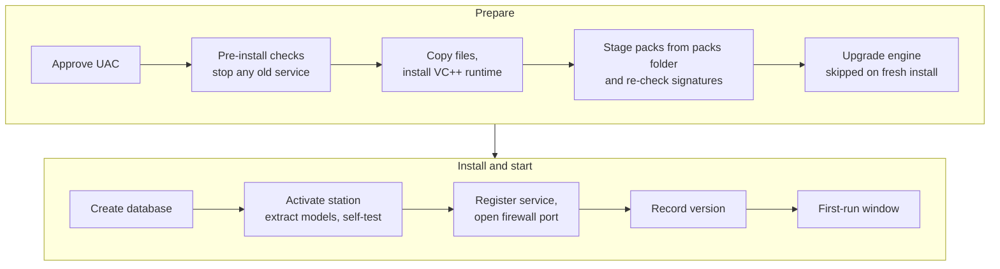

# Installing, first run, upgrading, uninstalling {#ch-installing}

This chapter walks the person who installs CivicCast through the install exactly as beta.10 behaves: the Windows setup, the first-run window that follows it, and first setup in the operator console. It also covers every exit code setup can return, where the logs are, how to check the result, and how to upgrade, repair and uninstall. Read [Chapter 9](#ch-planning) first.

## Before you start

- You have the **full kit**: `setup.exe`, a `packs` folder and a `station` folder together (next section). `setup.exe` alone is not enough for a first install in beta.10.
- You checked the installer's hash and signature ([Chapter 9](#ch-planning), "Download and verify what you need").
- You have a Windows administrator account, and about 55 GB free on the install drive.
- The computer will stay on, awake and connected to power for the whole install.
- For an upgrade, you also have a backup and you accept that the station goes off air while setup runs.

> **Note:** beta.10 is a pre-release. The clean-install lane of the project's acceptance test passed using the full kit. The upgrade lane and the download-only lane were not run, and no human field tester has signed off. A first install with neither the full kit nor an earlier install is not proven.

## Development first-install entry - not a published download

The development build adds an unelevated `CivicCast First Install.exe` with a matching `first-install.json` beside it. Double-clicking that entry verifies the current release's signed channel before offering downloads. The JSON supplies the channel address and exact release version; it is not itself trusted authority. Missing or mismatched release files stop the process instead of selecting older downloads.

Only the selected plan is acquired: the mandatory program, services, standard captions and local AI packs, plus Large and CUDA only when selected. Sizes come from the verified release index. The entry prepares the existing `setup.exe`, `packs` and `station` layout, rechecks its signed packs and Setup bytes, then asks Windows to open the same NSIS installer with administrator rights. Keep the first-install window open while Windows Setup runs. Cancellation or failure does not certify an installation; retry uses the same selected plan.

This requires a reachable current signed channel and an HTTPS host that can serve the complete pack files. GitHub release assets cannot serve a single file larger than 2 GiB. No public delivery host or clean-machine first-install journey has been verified for this development entry. The raw GUI also needs Microsoft WebView2 before it can display the download screens; that prerequisite has not been proven on a clean computer. The published beta.10 full-kit requirement remains unchanged.

## What beta.10 requires and what it does not yet support

Setup has two phases. The **Windows setup** (`setup.exe`) runs with administrator rights and does all the real work: it copies the program, checks every component, creates the database, runs the station's self-test and registers the Windows service. Then the **first-run window** ("CivicCast (Native) Setup") opens as a normal user and may offer extra downloads. The first phase downloads no CivicCast components: the installer passes no download address to its steps, and the Gate A run had networking switched off.

| What you start with | What happens in beta.10 | Status |
| --- | --- | --- |
| **Full kit**: `setup.exe` with `packs\` and `station\` beside it | Installs and activates | **Proven** (clean-install lane, 10 of 10) |
| `setup.exe` plus `packs\`, **no** `station\`, on a computer that has never had CivicCast | Stops at the activation step with **exit 123** (the model packs are not in the cache) | **Not supported.** Not proven |
| `setup.exe` **alone** | Stops at the pack-staging step with **exit 110** | **Not supported** |
| Upgrade: newer `setup.exe` (with `packs\`) over an existing install, no `station\` | Designed to reuse the model packs already cached by the earlier install | **Not run** for beta.10 |
| Reinstall after an uninstall, from `setup.exe` plus `packs\`, **no** `station\` | Fails with exit 123, because uninstall deletes the model-pack cache (see "Uninstall"). With `setup.exe` alone it stops earlier, at exit 110 | **Not supported** (known limitation MA-17) |

The full kit looks like this. The names of the five runtime packs are the ones on the release page; the files inside `station\` are the signed index and the speech and AI model packs.

```text
CivicCast-kit\
  setup.exe              (a kit may use a different file name)
  packs\
    native-app-payload.ccpack
    native-server-binaries.ccpack
    native-ffmpeg-runtime.ccpack
    native-ollama-runtime.ccpack
    native-cuda-runtime.ccpack    (optional GPU libraries)
  station\
    station-index.json
    ... model packs (*.ccpack)
  QUICKSTART-OPERATOR.md
```

The four packs other than `native-cuda-runtime.ccpack` are required. The cuda pack may be absent; if it is present it must verify. A kit is delivered by USB or network copy from the project. The roughly 21 GB `station\` folder is **not** a release asset.

> **Known issue (beta.10):** The Windows setup page says that after setup "the CivicCast setup wizard downloads additional components (captions and AI models) separately". For a first install that is not true. The Windows setup phase needs the model packs beside it and makes no download. The first-run window's sentence "only what is missing comes from the internet" describes only that window's own list; it does not apply to the Windows setup phase. If setup stops with exit 110 or 123 after the page promised downloads, this is why.

> **Tip:** Run setup from a local drive or a USB drive. A network share that you mapped to a drive letter in your own Windows session is usually not visible to the elevated setup (standard Windows behavior; not tested with CivicCast). Use the UNC path or copy the kit.

## How the install runs



*Figure 10.1. The order of the Windows setup steps and the first-run window.*

Each box is a step that writes a line before and after to `C:\ProgramData\CivicCast\install-progress.log`. If a step fails, setup stops, shows a dialog (when it is not silent) and exits with that step's code. After files are replaced, any failure also **stops the CivicCast service and sets it to manual start**, so that it cannot start on a half-updated install. Re-running setup after a failure is the supported recovery; partial installs are rebuilt.

## Install from the kit

The page order of the standard Windows setup comes from a template that is not in the project's repository, so we could not confirm the exact sequence or wording of its standard pages. The text below that is in quotation marks comes from the project's own files.

### Step 1: Start setup and approve the prompt

1. Double-click the installer in the kit folder.
2. If Windows shows **Windows protected your PC**, follow [Chapter 9](#ch-planning) (check hash and signature first, then **More info**, then **Run anyway**).
3. Approve the administrator (UAC) prompt.

If CivicCast (Native) is already running, setup says "CivicCast (Native) is running! Please close it first then try again." or offers to end it ("Click OK to kill it"). If it cannot end it: "Failed to kill CivicCast (Native). Please close it first then try again".

If WebView2 is missing, setup installs the full offline copy it carries (the build configuration says "offlineInstaller", installed silently). The details list should show "Installing WebView2...", then "WebView2 installed successfully". The setup text also defines a line "Downloading WebView2 bootstrapper...", but that belongs to a download mode this build does not use, so we do not expect to see it; we could not confirm the exact lines on screen. On failure: "Failed to install WebView2! The app can't run without it. Try restarting the installer."

### Step 2: The "Already Installed" page (only if CivicCast is on the computer)

You see **Already Installed** with "CivicCast (Native) 1.0.0-beta.10 is already installed. Select the operation you want to perform and click Next to continue." and the choices **Add/Reinstall components** and **Uninstall CivicCast (Native)**. If the installed version is older, the page says "An older version of CivicCast (Native) is installed on your system. It's recommended that you uninstall the current version before installing..." with **Uninstall before installing** and **Do not uninstall**. If it is newer, the warning begins "A newer version of CivicCast (Native) is already installed! It is not recommended that you install an older version."

For an upgrade, choose the option that does **not** uninstall first. See "Upgrade" below for why. A silent run over a newer install stops with "Downgrades are disabled for this installer, can't proceed with the silent installer, please use the graphical interface installer instead."

### Step 3: Choose the install folder

The folder page asks "Choose Install Location". The default is `C:\Program Files\CivicCast (Native)` (the folder the project's install page names; we could not confirm it as the page default). Above the browse box setup shows:

"CivicCast (Native) needs the space shown below on this drive for the program itself. After Setup finishes, the CivicCast setup wizard downloads additional components (captions and AI models) separately -- their sizes are shown individually, before anything downloads, on that wizard's own screen."

The **Space required** figure includes 5,400,000 KB (about 5.1 GiB) that the setup declares for the packs. Your choice here moves only the program. The station's data stays under `C:\ProgramData\CivicCast`.

> **Known issue (beta.10):** The space figure and the sentence above understate the real footprint. About 21 GB of model packs are copied into a cache and extracted a second time, plus the runtime packs and 2 GB of working room (see [Chapter 9](#ch-planning)). Setup does not refuse at this page. It refuses later, at activation.

### Step 4: Watch the install

Start the install. The details list fills with lines. Setup also writes each step to `install-progress.log`. The labels D2, D3, D4 and K1 are the project's internal names for steps. The table shows what each line means.

| What the details list says | What is happening |
| --- | --- |
| "Preparing the existing CivicCast (Native) installation for a data-preserving upgrade..." | Upgrade only. The old service is being stopped gracefully |
| "No prior CivicCast Native bootstrap process to stop (fresh install)." | Fresh install |
| "Installing the offline Microsoft Visual C++ runtime prerequisite..." then "Microsoft Visual C++ runtime installation completed." | The bundled C++ runtime. If a restart is needed: "...completed; a Windows restart is required." Setup continues and marks the restart as pending. If a same-or-newer runtime is already present: "Microsoft Visual C++ runtime already present, same or newer — prerequisite satisfied; setup did not reinstall it." |
| "Staging required native component packs from the 'packs' folder next to this installer..." then "Required native component packs staged and verified. Full detail: `C:\ProgramData\CivicCast\install-progress.log`" | Each pack's signature and contents are checked, the pack is copied into the install folder, checked again, and extracted. Nothing is downloaded |
| "Re-verifying the extracted native-server-binaries component pack against its signed pack file (D2)..." then "Native-server-binaries component pack verified against its signed pack file (D2)..." | Re-checks the extracted files. The same for native-app-payload, native-ffmpeg-runtime and native-ollama-runtime |
| "Running the CivicCast (Native) install/upgrade engine (D3)..." | Decides fresh install, same version, or upgrade. On a fresh install: "...no existing installation was found, so this is a fresh install — the install/upgrade engine was not applicable and did not run." |
| "Provisioning the CivicCast (Native) PostgreSQL server (D4)..." then "CivicCast (Native): database/messaging provisioning complete (or already provisioned; no-op)." | Creates the database. The word "messaging" is left over; the messaging server was removed from the product |
| "Activating the CivicCast (Native) station (K1)..." then "CivicCast (Native): using the station bundle beside setup.exe (`<folder>\station`)." | Extracts the speech and AI models and runs the self-test (next section). This is the longest step |
| "Registering the CivicCast (Native) supervisor service (D4)..." | Registers the service, starts it and waits for it to answer |
| "Registering the CivicCast (Native) portal/API firewall rule (D4)..." | Adds the firewall rule |
| "CivicCast (Native): recorded InstalledVersion 1.0.0-beta.10 for the next install/upgrade run." | The last step before success |
| "CivicCast (Native) bootstrap install complete: required component packs staged and D2-verified, D3 install/upgrade engine run, PostgreSQL provisioned, service and firewall rule registered." | Setup finished |

> **Known issue (beta.10):** No page says setup can take a long time. Extraction and the self-test can leave the list quiet for minutes. In the Gate A run, about 33 minutes passed between launching the installer and the first healthy answer from the station, inside Windows Sandbox reading the kit from a mapped folder; a real computer will differ. Do not stop setup because the list looks stuck. Watch `install-progress.log` instead (see "Logs").

#### The activation step and its self-test

Activation turns the extracted files into a working station. The setup program looks for `<setup folder>\station\station-index.json` first (the kit). If that is missing, it uses a small copy embedded in `setup.exe` and the model packs from the pack cache `<install folder>\packs\.station-cache`. If neither exists, setup stops with exit 123 ("no signed station index (station-index.json) was found beside setup.exe...").

Activation then:

1. Checks the index signature and every pack's signature, size and SHA-256 (failure: child exit 66).
2. Does nothing if this exact station is already activated.
3. Checks free space: the sum of the pack sizes plus 2 GB of working room. If short: "Not enough free disk space to activate this station. The station's components need about N GB, plus 2 GB of working room, on the drive holding <folder> -- but only M GB is free. Nothing has been changed or deleted. Free up space (or install to a drive that has it) and run setup again."
4. Deletes any old extracted component folders, then extracts the Medium caption model to `packs\captions-floor`, the three AI model packs to `components\<id>`, and the optional Large caption model to `components\captions-large-v3`. The three AI model packs are merged into one store at `models\ollama`. It then checks that 16 required files are present.
5. Runs the self-test below. If every check passes it writes `activation-self-test.json` and then `station-set.json` in the install folder. Without them the station stays in a not-activated state.

The self-test runs the real programs once. The caption test is forced onto the processor; the AI test uses whatever the AI engine chooses:

| # | Check | Passes when | Time limit |
| --- | --- | --- | --- |
| 1 | The bundled Python imports CivicCast, the caption libraries (faster-whisper 1.2.1, ctranslate2 4.8.1) | It prints `native-core-ok` | 30 s |
| 2 | PostgreSQL tools `postgres` and `pg_ctl` run | Output names each | 30 s each |
| 3 | `ffmpeg` runs | Output contains "ffmpeg" | 30 s |
| 4 | The AI engine runs | Output contains "0.30.6" | 30 s |
| 5 | TSDuck `tsp`, only if present | Absent is allowed and logged | 30 s |
| 6 | Caption test: a short recording, using Large if installed, else Medium, on the processor | The text contains "fellow americans" and "country" | 300 s |
| 7 | AI test: a private Ollama starts on a free local port; asks `gemma4:12b` to reply `CIVICCAST_OK`, `gemma4:e4b` to reply `CIVICCAST_FALLBACK_OK`, and `translategemma:4b` to translate "The council meeting is open." into Spanish | Exact replies | Ready within 300 s; each request up to 300 s |

In the Gate A run the AI engine needed 61 seconds to answer, and the three AI requests took 86, 75 and 29 seconds. The first Gate A attempt failed because setup then waited only 60 seconds; the published build waits 300 seconds. Those timings came from a sandbox that could see the host's NVIDIA card. We have no record of how long the self-test takes on a computer with no graphics card.

> **Known issue (beta.10):** If the self-test fails, the dialog says the failed test "is named in the installer log at `C:\ProgramData\CivicCast\install-progress.log`". It is not. The activation step's own error line appears only in the setup window's details list; the log receives only "step d4-activate-station: returned 67". Before you close the setup window, copy the list (right-click inside it for **Copy Details To Clipboard**, a standard feature of this kind of setup window) and keep it for support. Also, exit 67 is returned for **any** failure after the packs were verified, including a full disk or a failed extraction. The dialog's claim "This is NOT a missing-files problem" is therefore not reliable. Read the details list.

#### Service, firewall and finish

Setup registers the service **CivicCast Native Supervisor** (`CivicCastSupervisor`) under LocalSystem with automatic start, starts it, and waits up to 120 seconds for Windows to report it running and up to 180 seconds for the web server to answer `/health`. The Gate A harness recorded a station boot of 26 seconds. Setup then adds the firewall rule, records the version, fixes the "Apps" entry's size and uninstall command, and writes three shortcuts: **CivicCast Operator Console** on the Desktop and in the Start menu folder "CivicCast (Native)", and **CivicCast Public Portal** in that folder. All three are web shortcuts to `http://127.0.0.1:8000/operator/` and `http://127.0.0.1:8000/`.

> **Known issue (beta.10):** The shortcuts are plain web links. If the service is stopped they show a browser error, and nothing tells the operator to start the service. See "If it did not work".

### Step 5: The first-run window

After setup, the window titled **CivicCast (Native) Setup** appears (we could not confirm the wording of the final setup page that launches it). If it does not appear, start **CivicCast (Native)** (the program is `CivicCast Native.exe` in the install folder). A silent install never opens it. The window runs as the signed-in user and has up to four screens. It shows them once per Windows account.

**Checking This Computer.** "CivicCast is looking at this computer's hardware so it can recommend the right setup." It then lists Processor, Memory, Graphics and "Free disk space on <install target>", gives a one-sentence caption-engine recommendation ([Chapter 9](#ch-planning)), and shows **Continue**. If free space is short it shows "Not enough free disk space" and hides **Continue**: "Free up space on this drive, then reopen CivicCast Installer." (The window is titled "CivicCast (Native) Setup"; reopen **CivicCast (Native)**.)

**What CivicCast Needs.** "These are the large pieces CivicCast runs on. Anything already on this computer or on your USB kit is used as-is and is not downloaded again; only what is missing comes from the internet." It lists seven rows with sizes: CivicCast application runtime (482 MB), Database & messaging services (94 MB), Video and audio tools (137 MB, "Not included": it was installed by setup), Caption engine — Medium (1.5 GB), Caption engine — Large (optional, 3.1 GB), GPU caption acceleration (optional, 1.3 GB) and Local AI model (summaries & translation) (7.6 GB). The footer shows the total (9.7 GB by default, about 14.1 GB with both optional rows) and **Continue**. These sizes are placeholders; the real total is corrected once.

The corrected first-run download window passes your selection to the download engine. Untick **Large** or **GPU caption acceleration** to skip that optional download. The application runtime, database services, Medium caption engine and local AI model remain required. Items already on the computer still count as satisfied only after verification ("Found locally — verified"). Resume and retry use the same selected plan; to change the plan after downloading starts, close and reopen the installer. A refused plan cannot finish using progress saved by an earlier plan.

> **Delivery boundary:** This selection correction is verified in development source, not in a newly shipped installer or a clean-machine install. Earlier beta.10 installers can still download optional items that you untick. The correction does not change Windows setup's kit requirement. The "Local AI model" row still lists one model, while the station needs three (all three arrive with the kit).

**Downloading** (or **Setting Up** if everything is found locally). "Keep CivicCast Installer open. If a download is interrupted, use Resume download." Each row shows a state:

| Row state | Text |
| --- | --- |
| Not started | "Waiting" / "Not started yet" |
| Running | "Downloading", then "N MB/s — T left" or "Measuring speed" |
| No new byte for 10 s | "Stalled — retrying" |
| Checking | "Verifying" |
| Done, already on disk | "Found locally — verified ✓" |
| Done, downloaded | "Verified ✓ — checked against its signature" |
| You stopped it | "Stopped. X of Y is already downloaded and kept." with **Resume download** |

The buttons are **Stop downloading** ("CivicCast stopped downloading. Nothing already downloaded was lost."), **Resume download** or **Retry download** (per row) and **Open installer log**. Closing the window ends the program at once and keeps partial files.

> **Known issue (beta.10):** "Stalled — retrying" is misleading: the download engine has no automatic retry. Choose **Stop downloading** and then **Resume download**. Also **Open installer log** opens `install-progress.log` first, which does not record download failures, so the instruction "send that log to support" points at the wrong file. The reason for a download failure is kept only in `%USERPROFILE%\.civiccast\installer-state.json`.

When a row fails the window shows one of these lines:

| Line shown | Cause | Do |
| --- | --- | --- |
| "The connection dropped. Nothing is damaged." | Network failed | **Resume download** |
| "The downloaded file didn't match its signature and was discarded." | Hash mismatch | **Retry download** |
| "The download server didn't have this file. This is our problem, not yours." | Source not found | Retry will not fix it. Report it through the project's issue page |
| "The paused download couldn't pick up where it left off, so this file will start over. This is our problem, not yours." | Resume not possible | **Retry download** |
| "This drive doesn't have enough free space to finish this download. Free up some space, then choose Retry." | Disk full | Free space, **Retry download** |
| "Windows wouldn't let CivicCast save this file. Security software blocking the CivicCast folder is the usual cause; allow CivicCast in it, or start CivicCast with 'Run as administrator' once, then choose Retry." | Permission denied | Allow the folder in your security software, **Retry download** |
| "This file couldn't be saved to disk. The download folder may be unavailable or read-only. Check that the drive is connected and writable, then choose Retry." | Write failed | Fix the drive, **Retry download** |
| "This download stopped and CivicCast did not get a reason it can explain. Nothing on this computer is damaged. Choose Retry; if it stops again, use Open installer log and send that log to support." | Unknown | **Retry download** |

Two alert bars may also appear: "No files have started downloading yet. CivicCast is still waiting for the first byte..." after 30 seconds with nothing moving, and "CivicCast could not start downloading its components. Nothing is being downloaded right now..."

**The status panel.** When all rows are done (or on every later launch) the window shows "CivicCast Installer", a **Ready** or **Not ready** pill and the button **Open operator console**. The status line "CivicCast's native background service is running." comes from one check of `http://127.0.0.1:8000/health`. Under **More options** are **Repair this step**, **Download AI models and captions** (re-runs the download screens; safe on a healthy station) and **Show uninstall instructions**. The link **Report a beta issue** opens a GitHub new-issue page, which needs a GitHub account; do not paste passwords, recovery codes or private meeting material into it.

> **Known issue (beta.10):** The window's lead line, "Download, install, create the first admin, then open the dashboard without terminal commands", is wrong about the admin: the installer never creates one. You create it in the operator console (next step). Also **Ready** means only that the web server answered `/health`; it can show while captions and AI models are absent. And **Show uninstall instructions** shows one line ("Use Windows Settings to uninstall CivicCast after backing up meeting records.") and uninstalls nothing.

> **Tip:** The station does not depend on this window. Setup already started the service. If the first-run window is stuck on a download you do not need, close it and use the **CivicCast Operator Console** shortcut on the Desktop.

### Step 6: First setup in the operator console

Open the **CivicCast Operator Console** shortcut (or **Open operator console**) in a browser **on the station computer**. The address is `http://127.0.0.1:8000/operator/`. A signed-out visitor is sent to the page **First setup** (`#/setup`; the aliases `/login` and `/sign-in` land there too). First setup, sign-in and recovery only work from the station computer itself; any other computer gets "First setup can only be done from the station computer itself". A remote-control tool is fine if the browser runs on the station.

1. Read the header: "First setup. Create the station identity, first local admin, and recovery kit before a public meeting."
2. If the **Durable storage** card shows a **Prepare storage** button, select it. Until storage is ready the page shows "Create the first admin after storage is ready".
3. Fill in the form: **Station name**, **Admin display name**, **Admin username**, **Admin password** (12 characters or more; a counter shows "(n/12)"), **Confirm admin password**, **Where will you keep the recovery kit?** (free text; nothing is written there) and, optionally, **Resident portal URL**.
4. Select **Create first admin**.
5. The **Recovery kit ready** panel appears. Select **Print kit** or **Save kit**. **Save kit** downloads `civiccast-recovery-kit-<kit id>.txt`, which contains the eight one-time recovery codes **and the administrator password in plain text**.
6. Tick "I have saved or printed this kit..." (it unlocks after you use **Print kit** or **Save kit**), then select **Continue to the console**. Navigation stays locked until the kit is confirmed, and the browser warns you if you leave first.

{width=80%}

*Figure 10.2. First-admin form example, before submitting any setup details.*

You should see "Setup complete" or "Signed in", the **First-run defaults** card, and the setup tools: **Camera or test media**, **Backup destination**, **Storage and viewing estimate** and **Provider setup**. Later sign-ins use **Admin sign-in** on the same page and land on the Readiness screen.

{width=80%}

*Figure 10.3. Configured-station example showing the sign-in and recovery forms.*

A lost password is recovered with **Use recovery code**: the first click arms it ("This permanently consumes one recovery code — only 8 exist for this station. Click Recover account again to confirm.").

> **Warning:** The saved recovery kit file contains the administrator password in plain text. Keep it off shared folders, cloud-synced folders and email. Print it, or store the file somewhere the city controls, and delete it from Downloads.

> **Known issue (beta.10):** The form never says that the station starts in **Test mode**, with sample content and a starter schedule on, and with three channels (public, education, government; the default channel is "government"). Nothing on the page says how to leave test mode. See [Chapter 11](#ch-configuration).

## Silent install

`setup.exe /S` runs without dialogs. The Gate A run used `setup.exe /S /D=C:\CivicCastHostStore\install` (`/D=` sets the folder and, as with every installer of this kind, must be last and unquoted). Run it from an elevated prompt, from the kit folder:

```powershell
$p = Start-Process .\setup.exe -ArgumentList '/S' -Wait -PassThru
$p.ExitCode
```

A silent install shows no dialog and opens no window. A failure leaves only the exit code and the log. Exit 0 means success. After it finishes, run the checks in "Verify the install" and open the console from the shortcut.

## Exit codes

When a step fails, the dialog shows text but not the number, and a silent run shows only the number. The number is also the last line setup writes to the log: "postinstall: FAILED, aborting with exit code N". Run `Get-Content C:\ProgramData\CivicCast\install-progress.log -Tail 20` to see it.

> **Known issue (beta.10):** No dialog shows the exit code, and the dialogs say "contact support" without a contact. The project's support route is its GitHub issues page, run by the community with no service agreement.

### Setup exit codes

| Code | Step | Meaning | What to do |
| --- | --- | --- | --- |
| 0 | Any | Success | Verify (below) |
| 2 | Any | NSIS's own generic abort, with no specific step code | Read the log |
| VC++ code (for example 1602 or 1603) | C++ runtime | The bundled runtime would not install, and setup returns the runtime installer's own code. Code 1638 ("another version is already installed") is accepted only when the registry confirms a runtime is present; otherwise it fails the same way | Read the log. Run setup again. Code 3010 is not a failure: setup marks a restart as pending and continues |
| 82 | Uninstall | The teardown step (stop and remove the service, remove the firewall rule, clear registry state) did not finish, most often because the service stop was not confirmed. The uninstall aborts before anything is removed | Stop the service (services.msc, or `sc stop CivicCastSupervisor`) or restart Windows, then uninstall again |
| 110 | Stage packs | A required pack is missing or untrusted (inner code 74), or the optional GPU pack is present but untrusted (75) | Put the missing `.ccpack` files in the `packs` folder beside `setup.exe` and run again. The log line "step stage-packs: child reported:" names them. Setup safely prepares a partial install first. Nothing in `C:\ProgramData\CivicCast` was deleted |
| 111 | Re-check | The extracted server tools do not match their signed pack | Replace the kit copy (disk error or interrupted copy) and run again |
| 112 | Re-check | The extracted CivicCast program does not match its signed pack | Same |
| 121 | Re-check | The extracted ffmpeg tools do not match | Same |
| 122 | Re-check | The extracted AI engine does not match | Same |
| 113 | Upgrade engine | The upgrade failed **and** its own rollback failed. The service is stopped on purpose | Follow `C:\ProgramData\CivicCast\upgrade\UPGRADE-RECOVERY.md` before restarting anything |
| 114 | Upgrade engine | This release has a database change that cannot be rolled back, so automatic upgrade was refused | The dialog says "Use the manual upgrade path with operator acknowledgement". No such path is described anywhere in setup. Do not retry blindly; open an issue |
| 115 | Upgrade engine | Unexpected fault | Read the log and `upgrade\upgrade-engine.log` |
| 116 | Database | PostgreSQL could not be provisioned | Read the log and `provision\PROVISION-RECOVERY.md` |
| 117 | Database | Unexpected fault | Read the log |
| 118 | Service | The service could not be registered | Read the log |
| 119 | Firewall | The firewall rule could not be created | Read the log. Setup requires this rule |
| 120 | Pre-install | An existing service could not be stopped safely, its state could not be read, or the service exists but the old program is missing | Stop **CivicCast Native Supervisor** in Services, retry as administrator. If the old program folder was removed, repair or remove that install **without deleting** `C:\ProgramData\CivicCast` |
| 123 | Activation | See the table below | See below |
| 124 | Upgrade engine | The engine rolled back its own work; your previous database is intact | Read `upgrade\upgrade-engine.log`. The service is stopped and set to manual start. Fix the cause and run setup again; a successful run restores automatic start. If the dialog says containment was not confirmed, run `sc stop CivicCastSupervisor` and `sc config CivicCastSupervisor start= demand` |
| 125 | Service | The service started but the web server is not answering | Read `install-progress.log`, `logs\control_plane.log`, `logs\control_plane-app.log` and `upgrade\upgrade-engine.log`, fix, run setup again |
| 126 | Service | Windows registered the service but could not start it | Read `C:\ProgramData\CivicCast\logs` and the Windows Application event log (Event Viewer, Windows Logs, Application) |
| 127 | Database | Setup cannot tell which CivicCast runtime owns the machine | If there is no older WSL edition, an administrator sets `HKLM\SOFTWARE\CivicCast\ActiveRuntime` to `native` and runs setup again. The exact command is in `provision\OWNERSHIP-RECOVERY.md` |
| 128 | Upgrade engine | An earlier failed upgrade's record is still on disk. The database is untouched, but setup had already stopped the service and replaced the program files (the dialog's "nothing was changed" is wrong) | Move (do not delete) `C:\ProgramData\CivicCast\upgrade\upgrade-journal.json` somewhere safe and run again |
| 129 | Upgrade engine | An older setup was run over a newer install. The database is untouched, but the older program files were already copied over the newer ones and the service is left stopped (the dialog's "before changing anything" is wrong) | Do not start the service. Run the newer setup again, or uninstall first |
| 130 | Uninstall | You declined the ownership-transfer question | None; nothing was removed |
| 131 | Uninstall | The ownership transfer failed | Read the detail in the dialog |
| 132 | Uninstall | Blocked (active runtime plus an older WSL edition, or state unreadable) | Follow the dialog |
| 133 | Uninstall | Service stop unconfirmed; program files kept. In beta.10 the uninstaller normally stops earlier, with 82, so we do not expect to see this code | Stop the service or restart Windows, then uninstall again |
| 134 | Uninstall | Teardown incomplete, or a second uninstaller started while this one ran and cleared its plan to hand back the runtime-ownership setting (`ActiveRuntime`). The teardown case is a second line of defence: the uninstaller normally stops earlier, with 82 | Read the dialog and `install-progress.log`. Remove any leftover service, firewall rule and registry state by hand (Services, Windows Defender Firewall, `HKLM\Software\CivicCast\Native`) |
| 135 | Database | Another CivicCast product (the older WSL edition) is registered | Uninstall it from Settings, Apps (or run its `cutover-to-native`), then run setup again |

### Activation (exit 123)

Exit 123 covers every activation failure. The inner code in the log line "step d4-activate-station: returned N" tells them apart.

| Inner code | Meaning | What to do |
| --- | --- | --- |
| (no index) | No `station-index.json` beside setup or embedded | Download setup again from the release page, or copy the full kit |
| 66 | The index or a pack could not be obtained or verified | Copy the kit's `station\` folder across whole. If you ran `setup.exe` on its own, the packs must already be in this computer's cache from an earlier install. The details list names the missing pack or the failed check |
| 67 | Any error after the packs verified: no free space, extraction failure, a missing file, or a self-test failure | Read the details list for the exact line. Free space if that is the cause |
| 78 | The embedded signing key was refused | This copy of setup is not a valid release build. Download it again from the release page |
| 64, 65 | The setup program is defective | Download it again |
| other | Unexpected | Read the log |

### Inner codes in the log

The log records each step's own code ("step X: returned N"). You may see: 64 arguments, 65 report could not be rendered, 66 acquisition, 67 activation or self-test, 68 install-tree verify, 70 service registration, 72 database-URL write, 73 uninstall preflight, 74 ownership transfer or required-pack failure, 75 provisioning or optional-pack failure, 76 repair made changes, 77 uninstall blocked, 78 embedded trust key refused, 79 unrepairable, 80 teardown step failed, 82 service stop unconfirmed, 83 service would not start, 84 service running but not serving, 85 ownership unprovable, 86 unknown `--civiccast-` option, 87 another CivicCast product registered. Codes 69, 71 and 81 are not named in the files we read.

## Logs

| Question | File (under `C:\ProgramData\CivicCast`) |
| --- | --- |
| What step did setup reach? | `install-progress.log` (time-stamped; read from the bottom and find the last "begin" with no "returned") |
| Which pack was missing? | The "step stage-packs: child reported:" line, and `install-manifest-report-<pid>-<time>.json` |
| Why an upgrade rolled back | `upgrade\upgrade-engine.log`, `upgrade\upgrade-journal.json`, `upgrade\UPGRADE-RECOVERY.md` |
| Database creation or ownership | `provision\PROVISION-RECOVERY.md`, `provision\OWNERSHIP-RECOVERY.md`, `provision\ownership-observation.txt` |
| Why the station will not run | `logs\supervisor.log` (the service; 10 MiB, 10 files, flushed each record), `logs\control_plane.log`, `logs\control_plane-app.log`, `logs\postgres.log`, `logs\postgres-launcher.log`, `logs\ollama.log` |
| First-run window | `%USERPROFILE%\.civiccast\runtime-host.log` and `installer-state.json` |
| Which self-test failed | The setup window's details list (not the log; see the Known issue above) |

A failure never deletes `C:\ProgramData\CivicCast`. Open the log in Notepad, and when you report a problem to the project's issue page, remove anything private first. Do not paste passwords, recovery codes or tokens.

## Verify the install

Run these on the station, then open the console. Each check says what a good answer looks like.

```powershell
Get-Service CivicCastSupervisor | Format-List Name, DisplayName, Status, StartType
Invoke-RestMethod http://127.0.0.1:8000/health
Get-NetFirewallRule -DisplayName "CivicCast (Native) Portal/API (TCP 8000)"
Test-Path "C:\Program Files\CivicCast (Native)\station-set.json","C:\Program Files\CivicCast (Native)\activation-self-test.json"
Get-Content C:\ProgramData\CivicCast\install-progress.log -Tail 5
```

- The service is **CivicCast Native Supervisor**, `Status` **Running**, `StartType` **Automatic**.
- `/health` answers `status: healthy`, `schema: current` and `version: 1.0.0-beta.10`. The web status is always 200 while the process answers; the `status` field is what tells you whether it is ready (`degraded` means the database schema is not confirmed current: behind the program, not configured or unreadable).
- The firewall rule exists.
- Both `station-set.json` and `activation-self-test.json` exist in the install folder.
- The last log lines include "postinstall: SUCCESS (InstalledVersion 1.0.0-beta.10 recorded)".
- Settings, Apps shows **CivicCast (Native)**, version 1.0.0-beta.10.
- The operator console and the resident portal at `http://127.0.0.1:8000/` both load on the station.

{width=90%}

*Figure 10.4. The current-source Readiness screen with synthetic example responses. This image is not install verification or evidence that the live station is healthy; perform the actual checks above.*

Then sign in and open **Readiness** (the page headed "Safe to broadcast") and run a private rehearsal ([Chapter 4](#ch-running-meeting), [Chapter 8](#ch-something-wrong)). The project's clean-install test checked, in this order: install, activation, health, console and portal render, a clerk workflow, offline captions (21 caption cues on a test clip), the playout engine (5,445 transport-stream packets analysed with no errors) and a five-minute soak. The playout-engine check passed only on a harness that waits longer: on a fresh install the engine's first packets came more than 60 seconds after its first start, and the first capture attempt saw none (the second saw the 5,445). Restart the computer once and confirm that the service comes back by itself. The beta.10 verification record does not cover a restart.

## Upgrade

To upgrade, run the newer `setup.exe` (with its `packs\` folder) on the station that already runs CivicCast. The upgrade lane was not run for beta.10, so do not treat an upgrade as proven. Make a backup first ([Chapter 12](#ch-operations)). The upgrade engine also backs up and migrates the database with rollback, but where it keeps that backup is not documented, so do not rely on it as your only copy.

> **Warning:** Setup stops the CivicCast service before it replaces any file. That takes every channel off the air until setup finishes and the service starts again. Do not run an upgrade during a meeting or a scheduled program.

1. Close the first-run window if it is open.
2. Run the new `setup.exe` and approve UAC.
3. On the **Already Installed** page, choose the option that does **not** uninstall first (**Do not uninstall** on an older install, **Add/Reinstall components** for a same-version re-run).
4. Wait. Setup stops the old service ("Preparing the existing CivicCast (Native) installation for a data-preserving upgrade..."), replaces files, re-checks the packs, then runs the upgrade engine, which backs up, migrates and health-checks the database.
5. Confirm with "Verify the install".

Why not uninstall first: the upgrade engine decides what to do from two markers (`InstalledVersion` and `DatabaseUrl`) that an uninstall deletes, and the setup code says the uninstall teardown must not be used during an upgrade, because it removes those markers. Uninstalling first turns the upgrade into a reinstall over leftover data. We have no beta.10 evidence for that path. This is our reading of the code, not a tested statement.

| Upgrade engine result | What setup does |
| --- | --- |
| Committed | Continues |
| Fresh install (nothing to upgrade) | Continues. Existing CivicCast data on the machine is adopted, not deleted |
| Same version already installed | Does nothing to the data; re-checks the packs; continues |
| Older setup over newer install | Exit 129. Database untouched; older program files already in place; service stopped |
| Rolled back its own work | Exit 124. The old database is intact. The service is stopped and set to manual start |
| Rollback also failed | Exit 113. Follow `UPGRADE-RECOVERY.md` |
| Release has an irreversible change | Exit 114 (refused) |
| Earlier failed upgrade's record found | Exit 128. Database untouched; program files already replaced; service stopped |

> **Known issue (beta.10):** The dialogs for exit 128 and 129 say setup "did nothing" or stopped "before changing anything". That is not what the code does. Setup stops the service and replaces the program files first, and only then runs the upgrade engine, which is where 128 and 129 are decided. The database is not touched, but the service is left stopped and the program files on disk are those of the setup you ran. After an exit 129 they are the **older** version, so do not start the service until you have run the newer setup.

After a failed upgrade the program files are the **new** version and the station is off air. There is no button that goes back to the old version. The recovery is to fix the cause named in the log and run setup again.

## Repair

There is no separate repair button that does the work. Two paths exist.

**Re-run setup.** Run the same version's setup again with its `packs\` folder and choose **Add/Reinstall components**. The upgrade engine does nothing (same version), each extracted pack is re-verified, and a damaged tree is rebuilt from the pack. The service is stopped first, because setup must not delete files under a running service.

**The repair command.** For an operator working outside the setup window, the installed program has a repair mode. It checks every installed tree against its signed pack, re-lays corrupted files, repairs the runtime selector and re-registers the service. It never touches data. From an elevated PowerShell window, with the kit folder as `--installer-dir` (the folder that contains `packs\`):

```powershell
& "C:\Program Files\CivicCast (Native)\CivicCast Native.exe" --civiccast-repair "C:\Program Files\CivicCast (Native)" --installer-dir "D:\CivicCast-kit" | Out-String
```

It prints a JSON report. The exit code is 0 if every tree already verified, 76 if something was repaired and now verifies, and 79 if something could not be repaired locally (the report names the remedy). We have not run this by hand and the beta.10 acceptance test did not exercise it. Piping to `Out-String` makes PowerShell wait for this Windows-subsystem program. If repair stopped the service to rebuild a tree, it does **not** restart it: it prints the line to run, `sc.exe start CivicCastSupervisor`. Its "everything verified" answer does not check the database schema or the activation files.

> **Known issue (beta.10):** **Repair this step** in the first-run window only restarts the background runtime host, or for other steps writes a message ("CivicCast queued a repair pass for this installer lane."). It is not connected to the repair command above.

## Uninstall

Open Settings, Apps, Installed apps, **CivicCast (Native)**, **Uninstall** (or run `C:\Program Files\CivicCast (Native)\uninstall.exe`). The quiet form is the registry value `QuietUninstallString`: `"<install folder>\uninstall.exe" /S _?=<install folder>`.

1. **Ownership check.** The details list shows "Checking CivicCast Native runtime ownership before uninstall...". If CivicCast (Native) is the active runtime and the older WSL edition ("CivicCast Installer") is still installed, you are asked whether to transfer ownership to the WSL edition. **No** stops with exit 130 and removes nothing. **Yes** transfers ownership and continues (a failed transfer is exit 131). Any other blocked state is exit 132.
2. **Teardown.** "Removing the CivicCast (Native) supervisor service, firewall rule, and registry state..." The service is stopped and removed, the firewall rule is deleted, and the registry values (including the database password) are cleared. If the teardown does not finish with success (most often because the service stop cannot be confirmed), the uninstall aborts with exit 82 and **nothing is removed**: "stop it manually (services.msc, or 'sc stop CivicCastSupervisor'), or reboot this machine, then run Uninstall again."
3. **The model-pack notice.** "CivicCast (Native) is being removed, including the downloaded AI model packs (about 21 GB) kept in this folder. Your recordings, database and settings in `C:\ProgramData\CivicCast` are NOT affected and are being kept. If you reinstall later by running setup.exe on its own, it will need those model packs again and cannot download them -- reinstall from the full CivicCast kit folder (setup.exe together with its station folder), or copy `<install dir>\packs\.station-cache` somewhere safe now if you want to reuse it." A silent uninstall writes the same text to the log.
4. **Removal.** The runtime, packs and then the whole install folder are deleted. If the uninstaller cannot delete itself it schedules the removal for the next restart. The shortcuts are removed.

If the service stop was not confirmed, you also see exit 133 and the program files are kept. Exit 134 means teardown was incomplete and you remove the leftovers by hand.

| | Removed | Kept |
| --- | --- | --- |
| Service and firewall | Service `CivicCastSupervisor`, rule "CivicCast (Native) Portal/API (TCP 8000)" | |
| Registry | `HKLM\SOFTWARE\CivicCast\Native` values (`DatabaseUrl`, `InstalledVersion`), the maintenance flag, the setup install-location key, and (when CivicCast Native was the only active runtime) the `ActiveRuntime` selector under `HKLM\SOFTWARE\CivicCast` | |
| Install folder | Everything in `C:\Program Files\CivicCast (Native)`: runtime, tools, the AI engine, `components`, `models`, `packs` and the **model-pack cache** `packs\.station-cache` | |
| Shortcuts | The Desktop and Start menu shortcuts | |
| Data | | All of `C:\ProgramData\CivicCast`: the database (`data\pgdata`), uploads and recordings (`data\uploads`), the egress working folder and conform cache (`data\egress`), packs and components the first-run window downloaded, logs, journals and recovery documents |
| Per-user settings | | `%USERPROFILE%\.civiccast`. A checkbox on the uninstall page, "Also delete this account's saved installer settings (your recordings, database and settings in `C:\ProgramData\CivicCast` always stay on this computer).", clears the setup window's own saved settings (the folders `org.civiccast.native` under `%APPDATA%` and `%LOCALAPPDATA%`) |

> **Known issue (beta.10): the model-cache limitation (audit item MA-17).** Uninstall deletes `<install folder>\packs`, and the 21 GB model-pack cache is inside it. A computer that uninstalls and then reinstalls from `setup.exe` and `packs\` without the `station\` folder cannot activate (from `setup.exe` alone it stops earlier, at exit 110): the signed index is embedded in `setup.exe`, but the model packs are not, and the cache they would come from is gone, so activation exits 66 and setup ends with 123. The project left this unfixed on purpose (keeping the cache would change what uninstall means) and instead added the notice above. The workaround is unchanged: reinstall from the full kit, or copy `packs\.station-cache` aside before you uninstall.

Because the database password is deleted from the registry, the surviving database cannot be reconnected with the old password. By design, a later install finds the existing database, issues a fresh password on it and keeps your data (the code calls this "adopt existing"). No beta.10 test covered an uninstall followed by a reinstall.

> **Warning:** No uninstall step removes `C:\ProgramData\CivicCast`. If you want a clean computer, you must delete that folder yourself after you have backed up anything you need. Doing so permanently destroys the database, recordings and settings. The setup text gives no instructions for this.

## If it did not work

| What you see | Cause | What to do |
| --- | --- | --- |
| Setup stops with exit 110 after a page that promised downloads | No `packs` folder beside `setup.exe` | Use the full kit |
| Setup stops with exit 123 after a long wait | No `station` folder and no cached model packs, or a self-test or space failure | See the activation table and read the details list |
| The console shortcut shows a browser error | The service is not running | Press Windows key + R, type `services.msc`, press Enter, find **CivicCast Native Supervisor** and choose **Start**. Then read `logs\supervisor.log` and `logs\control_plane.log` |
| "First setup can only be done from the station computer itself" | The browser is not on the station | Open the console in a browser on the station |
| "The station is cooling down after too many requests." | Too many sign-in attempts | Wait, then **Try again** |
| "Could not read setup state." | The console reached the station but the station could not answer | Wait and reload. Check the service is running. Collect `install-progress.log` and do not run setup again until someone has read it |
| The first-run window sits on **Downloading** with poor or no internet | It always tries every item (see the Known issue) | Close it. Use the Desktop shortcut |
| The station will not stay up after a failed upgrade | Containment left the service on manual start | Fix the cause, run setup again |

## Related

- [Chapter 9: Planning your station](#ch-planning)
- [Chapter 11: Configuring the station](#ch-configuration)
- [Chapter 12: Running it day to day](#ch-operations)
- [Chapter 13: Security and privacy](#ch-security)
- [Chapter 14: Troubleshooting matrix](#ch-troubleshooting)
- [Appendix A: command-line reference](#app-cli)

<!-- SOURCES: docs/releases/v1.0.0-beta.10-verification.md; INSTALL-WINDOWS.md and docs/tester/START-HERE.md (topics only); CHANGELOG.md:5920-5951 (MA-17); .github/workflows/native-beta-candidate-artifacts.yml:1293-1440 (kit layout); ops/docs-sprint/inventory/screens/installer-*.md and installer-install-layout.md, setup.md; civiccast/apps/installer/src-tauri/nsis-hooks-bootstrap.nsh:175-440 (steps, failure macro, containment), 440-625 (exit codes), 625-700 (pre-install), 702-1030 (C++ runtime, stage packs, D2), 1030-1391 (D3, D4), 1393-1505 (activation), 1506-1815 (service, firewall, shortcuts), 1817-2333 (uninstall); src-tauri/nsis-lang-native-english.nsh; src-tauri/tauri.native.conf.json; src-tauri/src/main.rs:30-40,2953-2976,3296-3330,3558-3600,3682-3750,4470-4700,4772,4798,5062-5073,5880-5930,6380-6460; src-tauri/src/native_activation.rs:20-60,820-880; src-tauri/src/native_distribution.rs:690-770; src-tauri/src/native_repair.rs:235-250,861-881; src-tauri/src/native_service_registration.rs:154-167,498,611-632,697,926,2765-2790; src-tauri/src/native_uninstall.rs:2100-2215; src/acquisition-progress.ts:140-210; civiccast/native/provision/__main__.py:225-345 (adopt existing); civiccast/native/supervisor/service.py:34,192-260; civiccast/app.py:2377-2440 (/health); civiccast/installer/models.py:325-365; docs/releases/evidence/v1.0.0-beta.10-gate-a/run5-clean-lane-PASS-b6520847/ (summary.json, INSTALL-RESULT.txt, T3-CAPTIONS.txt, T3T5-RESULT.txt); ops/beta10-oversight/OVERSIGHT-LOG.md:589; gh release view v1.0.0-beta.10 -->
