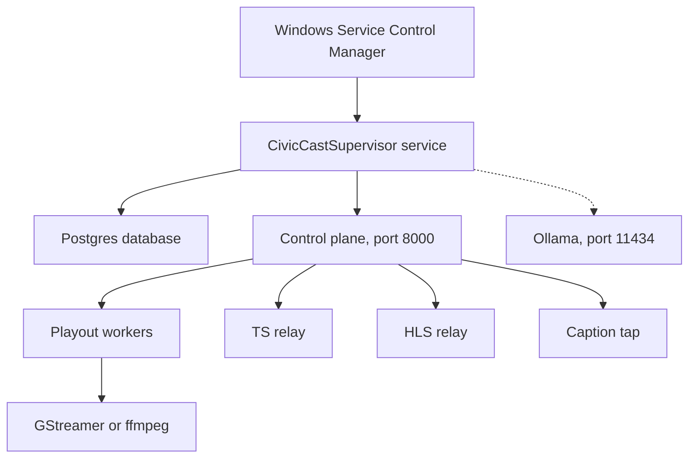

# Running it day to day: service, logs, backups, updates {#ch-operations}

This chapter is for the IT person who keeps a CivicCast station running on native Windows. It covers the one Windows service that runs everything, where the logs are, how to tell whether the station is healthy, what to check each day and each week, how disk space is used, what a backup does and does not protect, and how updates work. It describes beta.10, published 2026-10-02 as a GitHub pre-release (a beta candidate). Where the code and a convenient assumption disagree, this chapter follows the code and says so in a **Known issue (beta.10)** callout.

## Before you start

You need:

- An **Administrator** account on the station computer. Starting, stopping and restarting the service, reading `HKLM` registry values and reading the log folder all need elevation.
- The install folder, written `<INSTDIR>` in this chapter. The installer places the program under it (`runtime\`, `packs\`, `dependencies\`, `models\`). In testing we could not confirm the default folder name, so read it from the **CivicCast Native Supervisor** service's **Path to executable** in the Windows Services app, or from the Start menu shortcut.
- The data folder, `C:\ProgramData\CivicCast`. Everything the station writes while it runs lives here (the code honours the `PROGRAMDATA` environment variable if it is set differently).
- An elevated PowerShell window for the commands below.

> **Note:** Earlier descriptions of CivicCast mention a message bus called NATS. NATS JetStream was removed from the product (owner decision of 2026-08-20) and is not part of beta.10. Do not look for it, monitor it or open a firewall port for it.

> **Note:** Proof status. Beta.10's clean-install test lane passed (10 of 10 checks, in Windows Sandbox). The upgrade lane and the download-only lane were not run. A first install with neither the full kit (installer plus its `packs` and `station` folders) nor an earlier install is not proven. There is no human field-tester sign-off yet, and the longest lab run (8 hours, on an earlier internal build) is not a 24-hour or 72-hour soak. See [Appendix H](#app-evidence) for the exact wording.

## What the service runs

CivicCast on Windows is one Windows service named **CivicCastSupervisor** (display name **CivicCast Native Supervisor**). It starts automatically at boot, runs as LocalSystem, and is registered so that Windows restarts it on failure: restart after 5 seconds, then 10 seconds, then 30 seconds, with the failure count resetting after 86,400 seconds (one day). The supervisor starts and watches a small number of child programs. Everything else (the playout workers, relays and caption tap) lives inside the control plane child.



*Figure: the processes CivicCast runs. A solid arrow means the parent starts and restarts the child; the dotted arrow means the child is optional.*

The supervisor itself starts only three kinds of child, in this order: **Postgres** first, then the **control plane**, then **Ollama** if it is present. The control plane is the CivicCast application (a Python web service). It listens on `127.0.0.1` port 8000 and runs the playout workers, the transport-stream relay, the HLS relay and the caption tap itself. Those are not separate Windows services and you do not manage them individually.

| Piece | What it is | Who starts it | Notes |
| --- | --- | --- | --- |
| Postgres | The station database | Supervisor | Listens on `127.0.0.1` only. Uses the first free port of 5432, 5433, 5434, 5435, 5544. Password logins only (`scram-sha-256`), no TLS. |
| Control plane | The CivicCast application and its web API | Supervisor | `python -I -u -m uvicorn civiccast.app:create_app --factory --host 127.0.0.1 --port 8000`. The host is fixed to `127.0.0.1` in code. |
| Ollama | The local AI model server used for summaries and similar tasks | Supervisor | Optional. Started only when both `dependencies\ollama\ollama.exe` and a model store with a `manifests` folder exist. Listens on `127.0.0.1:11434`. When skipped, it shows as `stopped` with a reason, and the supervisor re-checks every 60 seconds. |
| Playout workers | The processes that put your channel on the air | Control plane | The playout engine is GStreamer by default. The older ffmpeg concatenation engine is used only when `CIVICCAST_EGRESS_ENGINE` selects it. |
| TS relay | Sends a transport stream (for a headend encoder) | Control plane | Uses TSDuck (`tsp.exe`). Automatic mode runs only when `tsp` is present. |
| HLS relay | Sends a web stream | Control plane | Supervised `ffmpeg` process. |
| Caption tap | Listens to the channel audio for live captions | Control plane | Runs inside the control plane. Live captions are off by default; `CIVICCAST_CAPTION_TAP=off` forces them off. |

If CivicCast finds another CivicCast runtime active on the same computer (the older WSL-based product), the supervisor refuses to start the station and reports `blocked_wsl_active`. See [If it did not work](#ch-operations-did-not-work).

### Supervisor states

The supervisor keeps one of seven states internally. In testing we could not confirm that any beta.10 screen or command prints the state name: the **Readiness** screen is not documented as showing it, and the supervisor's control pipe, which reports it, has no command-line client. Use `/health`, `civiccast runtime status` and `supervisor.log` to see the effects described below.

| State | Meaning |
| --- | --- |
| `starting` | Children are being started in order. |
| `ready` | Postgres and the control plane are up and the control plane answered its health check. |
| `degraded` | Something is wrong but the supervisor is still running: a child is failing to stay up, or a restart storm was detected (see below). |
| `blocked_wsl_active` | The dual-runtime guard found the older WSL runtime active and refused to start. |
| `blocked_probe_unavailable` | The guard could not tell whether the older runtime is active and refused to start. |
| `maintenance` | The control plane is running in maintenance mode (no workers, no changes). |
| `stopping` | A stop was requested and children are being shut down. |

### How the supervisor restarts things

- A child that exits is restarted after a delay that starts at 1 second and doubles up to 30 seconds, with about plus or minus 20 percent random jitter.
- A restart storm is 5 or more restarts inside 600 seconds. The supervisor then reports `degraded` and raises an alert of kind `service-down` from source `supervisor`.
- Readiness budgets at start: Postgres 60 seconds, control plane 180 seconds (with a rule that the control plane is declared stalled if it makes no CPU progress for 60 seconds), Ollama 60 seconds.
- A normal stop gives each child 15 seconds, then force-terminates it. Postgres is stopped with `pg_ctl stop -m fast`. The control plane is stopped by a console break signal so it can drain cleanly. A Windows Job Object kills every child if the supervisor itself dies.
- A stop watchdog forces the supervisor to exit 150 seconds after a stop begins (`CIVICCAST_SUPERVISOR_STOP_WATCHDOG_SECONDS`; a value of 0 or less disables it). When it fires it reports the service as stopped and writes an entry to the Windows Event Log.
- After 3 consecutive identical start failures the supervisor writes `C:\ProgramData\CivicCast\STATION-START-FAILED.md` describing the failure. The file is removed on the next good start.

## Start, stop and restart the service

The supervisor has an internal control pipe, but beta.10 has no command-line tool that uses it. Operate the service with Windows itself.

1. Open an elevated PowerShell window.
2. Check the current state: `sc.exe query CivicCastSupervisor`
3. To start it: `sc.exe start CivicCastSupervisor`
4. To stop it: `sc.exe stop CivicCastSupervisor`
5. To restart it, stop it, wait until `sc.exe query CivicCastSupervisor` shows `STOPPED`, then start it.

You can do the same in the Windows **Services** app (`services.msc`). After a start, allow up to about three minutes for the control plane to become ready (its readiness budget is 180 seconds), then check health as described below.

> **Warning:** Stopping or restarting the service stops every playout worker and takes every channel off the air. Do it between meetings. A stop can take up to about 150 seconds in the worst case (the watchdog above).

> **Tip:** `sc.exe` error 1061 means the service cannot accept the command right now (typically a start or stop is still in progress); error 1062 means the service is not running. Neither needs action beyond waiting or starting it.

### Set environment variables for the service

CivicCast reads many settings from environment variables (the full list is in [Appendix C](#app-settings)). The service reads them from the standard Windows service `Environment` value, which is a multi-string value named `Environment` under `HKLM\SYSTEM\CurrentControlSet\Services\CivicCastSupervisor`. Each line is `NAME=value`. The children inherit them.

1. Open `regedit` as Administrator and go to that key.
2. Create or edit the `Environment` value (type **Multi-String Value**). Put one `NAME=value` per line.
3. Restart the service.

> **Known issue (beta.10):** In testing we could not confirm that the installer creates this `Environment` value. Code comments say a station sets values there, but the installer source we read does not write it. Treat it as a value you create yourself, and check it again after every upgrade.

> **Note:** The database address comes from the registry value `HKLM\SOFTWARE\CivicCast\Native\DatabaseUrl`, which only SYSTEM and Administrators can read. The supervisor copies it into the control plane's environment unless `DATABASE_URL` is already set in the service environment, in which case the environment wins. `supervisor.log` records which source won.

## Read the logs

All logs are in `C:\ProgramData\CivicCast\logs`.

| File | What is in it | Rotation |
| --- | --- | --- |
| `supervisor.log` | The supervisor: state changes, child starts, exits, restarts, readiness checks, the stop watchdog. The first line is `supervisor logging initialized` with the process id and the log destinations. | 10 MiB per file, 10 files kept. Each record is flushed to disk. |
| `control_plane-app.log` | The CivicCast application's own log (playout, schedule, captions, alerts). | 10 MiB per file, 10 files kept. Written only when the control plane runs under the supervisor. |
| `control_plane-http.log` | Development builds: supervised web-server access and error records. | 10 MiB per file plus 10 backups. Ordinary flush, without forcing disk synchronization on every request. |
| `control_plane.log` | Raw startup output, prints and native standard error of the control plane. Published beta.10 also writes web-server access/error records here. | None. The file is opened for append and can grow without limit. |
| `postgres.log` | Postgres server messages. | None (the Postgres log collector is switched off). |
| `postgres-launcher.log` | Short-lived output from starting Postgres. | None. |
| `ollama.log` | Output of the Ollama child, when it runs. | None. |

The supervisor also writes some failures (for example the stop watchdog) to the Windows **Application** event log. In testing we could not confirm the source name Windows displays for them.

Other logs you may need:

- `C:\ProgramData\CivicCast\install-progress.log`: the installer's record of a first install.
- `C:\ProgramData\CivicCast\upgrade\upgrade-engine.log`, `upgrade-journal.json` and `UPGRADE-RECOVERY.md`: the upgrade engine, described below.
- `C:\ProgramData\CivicCast\data\caption-tap\caption-retention-audit.jsonl`: one line per caption file the retention sweeper deleted (no rotation).

> **Known issue (beta.10):** `control_plane.log` (every web request) and `postgres.log` are never rotated. On a busy station they grow forever. Check their size weekly and, when the service is stopped, move or truncate them. We could not confirm that Windows or the installer trims them.

Development builds move supervised web-server access/error logging to the rotating `control_plane-http.log`. This is not a beta.10 shipped fix. Raw startup output, prints and native standard error in `control_plane.log` remain unrotated; the Postgres and other log limits above are unchanged. Interactive, unsupervised web-server logging is unchanged.

To follow a log live:

```powershell
Get-Content C:\ProgramData\CivicCast\logs\supervisor.log -Tail 50 -Wait
```

## Check that the station is healthy

### The health endpoint

The control plane answers `GET /health` (also at `/api/health`) with no sign-in. Run it from the station computer:

```powershell
Invoke-RestMethod http://127.0.0.1:8000/health
```

The HTTP status is 200 whenever the control plane is alive, even if it is unhealthy. Read the body, not the status code. The fields are:

| Field | Values | Meaning |
| --- | --- | --- |
| `status` | `healthy`, `degraded` | `healthy` only when the database schema is current. |
| `version` | text | The running CivicCast version. |
| `schema` | `current`, `behind`, `not-configured`, `unknown` | Whether the database matches this version of the program. |
| `schema_db_revision`, `schema_expected_head` | text | The database's schema revision and the one this version expects. They differ when `schema` is `behind`. |
| `mode` | `normal`, `maintenance` | In `maintenance` the body also shows `workers_started: false` and `mutating_disabled: true`. |

> **Warning:** A monitoring tool that only checks for HTTP 200 will report a degraded or maintenance-mode station as fine. Alert on `status` not equal to `healthy`, and on `mode` not equal to `normal`.

Two more public endpoints give small answers: `GET /api/version` and `GET /api/hardware`.

### The Readiness screen

Signed in, open **Readiness** (page heading **Safe to broadcast**, section **System Health**). It is the station's own summary of whether it can go on air. Its controls are described in [Chapter 8](#ch-something-wrong). The same data is available to staff as `GET /api/staff/runtime-safe-to-air` (any of the five roles), `GET /api/staff/installer/system-health` and `GET /api/staff/system-resources` (see [Chapter 15](#ch-integrations) for calling the API).

### Alerts

The station raises alerts for conditions including: off-air, encoder death, server crash, schema drift, relay blocked, compliance probe failure, missing media, commit failure, takeover stuck for 2 hours, AI runtime down, low disk, clock skew, database unreachable, service down, self-test failure, scheduled-recording failure or dropout, as-run outbox degraded, channel-automation failure, caption tier degraded, remote-contribution problems, and emergency-alert source unavailable.

> **Known issue (beta.10):** A fresh install seeds every alert rule with no destinations attached. With no destination, the evaluator records a "suppressed" delivery row and sends nothing. The rule editor in the console never sends destinations. To make an e-mail or SMS alert arrive, a Setup admin must create a destination with `POST /api/staff/alert-channels` and attach it to each rule with `PUT /api/staff/alert-rules/{rule_id}` (field `channel_ids`). Until you have done that and tested it, assume no alert will reach you and monitor from outside the station as well: poll `/health` and the Windows service state with your own monitoring tool.

### Self-tests

The station runs its own checks on a schedule. By default (the code's default settings) the **daily** self-test runs at 02:00 and the **weekly** self-test on Sunday at 03:00, both by the station computer's own Windows clock and time zone. If the service was down at that moment, the missed run happens after it comes back up.

- **Daily:** the install-time readiness path, a short playout continuity proof to a file, a backup-destination write/read/delete probe, and a ping of the AI runtime. The AI ping is advisory: if the optional AI runtime is down it warns but does not fail the box.
- **Weekly:** everything in the daily test plus a restore rehearsal, an SRT continuity proof, a TSDuck compliance probe (advisory) and an alert-channel check (advisory). A check whose tooling is not installed is left out, not recorded as a pass.

A non-passing result raises a `self-test-fail` warning and clears itself on the next clean run. Staff can read results at `GET /api/staff/self-tests` and, with the Setup admin or Support admin role, start one with `POST /api/staff/self-tests/run?kind=daily` or `kind=weekly`.

> **Note:** The weekly restore rehearsal is a rehearsal, not a backup. It does not replace the backup work later in this chapter.

### Command-line checks

These need the CivicCast command-line program. Use the full path because the installer does not add it to PATH:

```powershell
$cc = "<INSTDIR>\runtime\Lib\site-packages\bin\civiccast.exe"
& $cc doctor
& $cc doctor --disk C:\ProgramData\CivicCast
& $cc runtime status
```

`civiccast doctor` accepts `--json`, `--disk <path>` (the folder whose drive is checked; it takes a path, and without it the check uses the home folder of the account running the command) and `--profile`. `civiccast runtime status` accepts `--json` and reports which runtime (native or the older WSL one) is active. The other commands used by operators are listed in [Appendix A](#app-cli).

If `civiccast.exe` is missing, `<INSTDIR>\runtime\python.exe -m civiccast.cli` runs the same program.

## Do the daily and weekly routine

This routine uses only checks that exist in beta.10.

### Each day (about five minutes)

1. Run `Invoke-RestMethod http://127.0.0.1:8000/health` on the station. Confirm `status` is `healthy` and `mode` is `normal`.
2. Run `sc.exe query CivicCastSupervisor`. Confirm `RUNNING`.
3. Open **Readiness** in the console. Confirm it says the station is safe to broadcast. Read any warning in full.
4. Look at the last lines of `C:\ProgramData\CivicCast\logs\supervisor.log` for `degraded`, repeated restarts or `service-down`.
5. Check that `C:\ProgramData\CivicCast\STATION-START-FAILED.md` does not exist.
6. Check free space on the drive that holds `C:\ProgramData\CivicCast`.
7. Read the result of last night's daily self-test (`GET /api/staff/self-tests`, or the Readiness screen).

### Each week

1. Read the result of the Sunday weekly self-test.
2. Check the size of `control_plane.log`, `postgres.log` and `ollama.log` (they are not rotated).
3. Check the size of `C:\ProgramData\CivicCast\data\caption-tap` and `C:\ProgramData\CivicCast\data\egress` (see the next section).
4. Run `civiccast egress trim-health --older-than-days 30 --dry-run` and decide whether to trim (see the next section).
5. Run the disaster-recovery drill (see below) at least when you have changed anything, and keep the report.
6. Copy the things the drill does not back up (see below) to storage that is not on this computer.

## Manage disk and cache

### Where space goes

| Folder | What it holds | Grows? | Trimmed automatically? |
| --- | --- | --- | --- |
| `C:\ProgramData\CivicCast\data\pgdata` | The Postgres database | With use | No |
| `C:\ProgramData\CivicCast\data\uploads` | Uploaded media | With use | No |
| `C:\ProgramData\CivicCast\data\egress` | Playout working files, including `conform-cache` | Yes | Yes, see below |
| `C:\ProgramData\CivicCast\data\caption-tap` | Raw caption audio chunks, evidence audio, `active.vtt` | Yes | Partly, see below |
| `C:\ProgramData\CivicCast\logs` | Logs | Yes | Only the rotated logs |
| `C:\ProgramData\CivicCast\upgrade` | Upgrade engine log, journal and pre-upgrade backups | Per upgrade | No |

### The conform cache

The **conform cache** is a folder where CivicCast keeps ready-to-play copies of your videos, converted to the channel's format. It is at `C:\ProgramData\CivicCast\data\egress\conform-cache`.

- **Size cap:** `CIVICCAST_CONFORM_CACHE_GB`, default 60 (gigabytes). A value of 0 or less disables the cache. When the cache is full, the oldest copies are removed first, and a copy that is used is refreshed so it is not the oldest.
- **Plan folders:** each channel's prepared playout plan folders are limited to the 3 most recent per channel, within a budget of `CIVICCAST_PREPARED_PLAN_DIR_BUDGET_GB` (default 5 gigabytes), and a folder younger than 24 hours is not removed. Leftover scratch files are removed after 1 hour.
- **Too small a cap:** if one video's conformed copy cannot fit in the budget, preparation of that video fails with: `Conform-cache budget too small to retain '<name>'; increase CIVICCAST_CONFORM_CACHE_GB or exclude this asset.` Raise `CIVICCAST_CONFORM_CACHE_GB` in the service environment and restart.
- **Failed background conforms:** after a failed or timed-out background (warm-up) conform the station waits 6 hours before trying that asset again. The time allowed for a background conform scales with the length of the asset and is capped at 7,200 seconds.

Measured evidence: in the 8-hour lab run on an earlier internal build (three channels), the cache reached 46 GB of the 60 GB cap on a drive with 810 GB free, and the longest single preparation took 389 seconds. That is one lab run, not a sizing rule. Size the cap from your own library: it should hold the conformed copies of everything you expect to air in the next several days.

> **Known issue (beta.10):** There is no free-space guard on the conform cache. The 60 GB figure is a cap on the cache, not a promise that the disk has that much room. Make sure the drive has more free space than the cap plus the database, uploads and logs, and watch the **low disk** alert (which, remember, may have no destination).

### Playout health records

The playout engine stores health telemetry in the database. Nothing trims it automatically. The only trim is the command below. It needs `DATABASE_URL` set (see the next section for how to read it) and accepts `--dry-run` and `--json`:

```powershell
& $cc egress trim-health --older-than-days 30 --dry-run
& $cc egress trim-health --older-than-days 30
```

### Caption data

The caption retention sweeper runs every 60 seconds and works by age only:

- Raw caption audio chunks become eligible for deletion 24 hours after they were created, but only when their transcript evidence is verified or no window can cover them.
- Evidence audio for a resolved review item is deleted 90 days after resolution. Pending review items never expire.
- Analytics events are kept up to 366 days (`CIVICCAST_ANALYTICS_RETENTION_DAYS`, allowed range 1 to 366).

> **Known issue (beta.10):** The audit of beta.10 found that caption data can still grow without a limit: review rows and evidence are not pruned, raw chunks that no window covers are kept (roughly 160 KB per 5 seconds of audio per channel, which is about 3 GB per channel per day if most chunks are uncovered), `active.vtt` grows, and the quarantine and collision folders are never pruned. If you turn live captions on, add `C:\ProgramData\CivicCast\data\caption-tap` to your weekly size check.

## Back up and restore

### What exists in beta.10

> **Known issue (beta.10):** The CivicCast command line has no `backup` command and no `restore` command, even though a comment at the top of the command-line source mentions them. The only backup-related command is `civiccast dr run-drill`. It makes a real backup and proves that the backup can be restored into a throwaway database, but it does not restore the live station. There is no scheduled backup in beta.10: the console's **Backup destination** and **Verify backup** buttons only write and delete a small test file, and the station never records a "last backup" time.

What you can rely on:

- `civiccast dr run-drill` (backup plus restore proof plus crash drill).
- The upgrade engine's own backup, taken automatically before each upgrade to `C:\ProgramData\CivicCast\upgrade\backups\pre-<new_version>` (see below).
- Postgres's own tools, which are in `<INSTDIR>\packs\native-server-binaries\payload\bin` (`pg_dump`, `pg_dumpall`, `pg_restore`, `psql`, `pg_ctl`).

### Run the disaster-recovery drill

The drill command is:

```powershell
civiccast dr run-drill --out <dir> [--backup-dir <dir>] [--work-dir <dir>] [--database-url <url>] [--media-root <dir>]
```

| Option | Meaning |
| --- | --- |
| `--out` | Required. The folder the report is written to (`dr-drill-report.md` and `dr-drill-report.json`). |
| `--backup-dir` | Where the backup goes. Default `<out>\backup`. |
| `--work-dir` | Scratch folder for the restore and crash drills. Default `<out>\work`. |
| `--database-url` | The database to drill. Default: the `DATABASE_URL` environment variable. Only `sqlite://` and `postgresql://` addresses are accepted. |
| `--media-root` | A media folder to list in the backup manifest. Optional. |

The drill does the following:

1. **Backup.** It writes `database.pgdump` (`pg_dump --format custom` with a snapshot), `globals.sql` (`pg_dumpall --globals-only`) and `manifest.json` (table row counts and SHA-256 checksums). With `--media-root` it also records every media file's path, size and a hash of the first and last 64 KiB. It does not copy the media files.
2. **Restore.** It restores the backup into a throwaway database named `civiccast_drill_restore` on the same Postgres server (dropping and recreating that name), and it refuses to drop the production database.
3. **Verify.** It checks row counts, checksums, the schema revision, that the application can read the restored data, extensions, sequences and grants.
4. **Crash drill.** It starts a stand-in process and checks that the crash-recovery logic restarts it. This uses a stand-in and an in-memory store, and does not touch your real channels.

It exits 0 if everything passed, 1 if a drill failed, and 2 if there is no `DATABASE_URL` or the address scheme is unsupported (`No DATABASE_URL configured; pass --database-url or set $DATABASE_URL.` or `Unsupported DATABASE_URL scheme for the DR drill; use sqlite:// or postgresql://.`). Read the report: the code itself says media is a manifest and not a copy, the crash drill covers only automatic restart of a worker, and there is no hot failover.

> **Known issue (beta.10):** From the code, the drill calls `pg_dump`, `pg_dumpall`, `pg_restore` and `psql` by bare name, so Windows must find them through PATH. The installer does not add them to PATH, and the service adds only the ffmpeg folder. Run from a normal prompt, the drill will most likely fail with: `pg_dump could not be started: the executable "pg_dump" is a bare command name that could not be resolved through PATH.` The console's **Run real database restore drill** button calls the same code, and we could not confirm that it works on a native station. The upgrade engine does not have this problem, because it passes full paths. Use the workaround below.

Workaround, from an elevated PowerShell window on the station:

```powershell
$inst = "<INSTDIR>"
$env:PATH = "$inst\packs\native-server-binaries\payload\bin;$env:PATH"
$env:DATABASE_URL = (Get-ItemProperty 'HKLM:\SOFTWARE\CivicCast\Native').DatabaseUrl
& "$inst\runtime\Lib\site-packages\bin\civiccast.exe" dr run-drill --out D:\civiccast-dr\2026-10-05 --media-root D:\civiccast-media
Remove-Item Env:\DATABASE_URL
```

> **Warning:** The database address contains the database password. Set it only in the window you are using, never write it to a file, a script or a support ticket, and clear it afterwards as shown.

The `--out` folder must have room for a full copy of the database. Choose a drive that is not the station's data drive when you can.

### What is and is not backed up

The drill's backup holds the database only. Anything else you need after a disaster must be copied by you.

| Item | In the drill backup? | Where it is | If lost |
| --- | --- | --- | --- |
| Database (schedule, asset records, staff token records, alert rules, analytics, captions text, audit trail) | Yes | Postgres under `data\pgdata` | Restore from backup |
| Media files | No (manifest only, and only with `--media-root`) | `data\uploads` and any media folders you configured | Re-import from your original files |
| `station-state.json` (first admin account, recovery-code hashes, console sign-in sessions) | No | Under `%LOCALAPPDATA%\CivicCast` of the service account, or the path in `CIVICCAST_STATION_STATE_PATH`. In testing we could not confirm the exact folder for LocalSystem. | Run First Setup again or use a recovery code (see [Chapter 13](#ch-security)) |
| `subscribe-secrets.json` (encryption key for subscribers' e-mail addresses) | No | `CIVICCAST_SUBSCRIBE_SECRETS_FILE`, or `CIVICCAST_CONFIG_DIR`, or `~\.civiccast\`; may be replaced by `CIVICCAST_SUBSCRIBE_TOKEN_SECRET` and `CIVICCAST_SUBSCRIBE_ENCRYPTION_KEY` | A restored database whose subscriber e-mail addresses were encrypted with a lost key cannot decrypt them |
| Alert credentials file | No | `CIVICCAST_ALERT_CREDENTIALS_FILE` or `CIVICCAST_CONFIG_DIR` | Re-enter destinations and credentials |
| Internal certificates (`CIVICCAST_CERT_ROOT`) | No | Default `~\.civiccast\certs` | Re-issued with `civiccast cert rotate` |
| Registry value `DatabaseUrl` and the service `Environment` value | No | `HKLM` | Export both keys with `reg export` |
| Program, packs, models | No | `<INSTDIR>` | Reinstall |
| Raw caption audio, evidence audio | No | `data\caption-tap` | Not recoverable |
| Conform cache | No | `data\egress\conform-cache` | Rebuilt automatically from the media |

> **Tip:** Put the registry export, `station-state.json`, `subscribe-secrets.json`, the alert credentials file and the `Environment` value in the same off-computer location as your database backup, and encrypt them: they contain secrets.

### Restore into the live station

Beta.10 has no supported command that restores into the live database. The only code path that does is the upgrade engine's automatic rollback after a failed upgrade. If you must restore by hand, you are using Postgres's own tools on a backup that the drill wrote. We have not run a manual live restore, so this chapter gives no step-by-step procedure for it. Rehearse the restore into a spare computer or a throwaway database first, and have your own written procedure before you need it.

## Recover from a disaster

The drill does not prove that you can rebuild a station from nothing. Plan on this order, and rehearse it:

1. Install CivicCast on the replacement computer from the full kit. Beta.10's proven install path is a clean install; see [Chapter 10](#ch-installing).
2. Stop the service.
3. Restore the database from your off-computer copy using Postgres's tools, as above.
4. Restore the registry values, `station-state.json`, `subscribe-secrets.json` and the alert credentials file.
5. Copy the media back.
6. Start the service and check `/health` and Readiness.
7. If you cannot sign in, use a recovery code at `/setup` ([Chapter 13](#ch-security)).

## Update and upgrade

An upgrade runs the new `setup.exe` over the existing install. The installer includes an upgrade engine, which acts in this order:

1. It takes a verified database backup to `C:\ProgramData\CivicCast\upgrade\backups\pre-<new_version>`.
2. It upgrades the program and migrates the database.
3. If a step fails, it rolls back automatically, restoring the database from that backup in a single transaction.

It writes `upgrade-engine.log`, `upgrade-journal.json` and, if a rollback itself fails, `UPGRADE-RECOVERY.md`, all under `C:\ProgramData\CivicCast\upgrade`. Setup's exit codes tell you what happened:

| Setup exit | Engine code | Meaning | What to do |
| --- | --- | --- | --- |
| 0 | 0 | Upgrade committed | Check `/health` |
| 124 | 10 | Upgrade failed and was rolled back | Read `upgrade-engine.log`. The installer stops the service and sets it to manual start on purpose, because the new program files are already in place over the old, unmigrated database. Do not set it back to automatic by hand; fix the cause and run setup again, and a successful run restores automatic start. |
| continue | 11 | Fresh install, nothing to upgrade | None |
| continue | 12 | Same version already installed | None |
| 129 | 13 | The installer is older than the installed version | Use the newer installer |
| 113 | 20 | Rollback failed | Read `UPGRADE-RECOVERY.md` first |
| 114 | 30 | A migration cannot be restored | Read the engine log; do not retry blindly |
| 128 | 31 | A stale journal from an earlier attempt exists | Move `upgrade-journal.json` aside; do not delete it |
| 115 | other | Other failure | Read the engine log |

Related provisioning exits: 75 maps to setup exit 116, 87 to 135 (another CivicCast product or the WSL runtime is present), 85 to 127.

> **Known issue (beta.10):** The upgrade lane was not run for beta.10, and an upgrade over an earlier release is not proven. Before you upgrade a station that is on the air, stop the service, copy the data folder, `HKLM\SOFTWARE\CivicCast` and the files listed in the backup table to another computer, and schedule a window in which you can reinstall if needed.

> **Warning:** Do not upgrade during a meeting. The upgrade stops the service and takes every channel off the air.

After any upgrade, run through the daily routine, then run the drill.

## Capacity guidance

CivicCast's own evidence supports only these figures. Everything else is not measured, so we do not give it.

- The cache cap default is 60 GB. A 3-channel, 8-hour lab run used 46 GB of it.
- The longest conform in that run took 389 seconds.
- That run used a single service process and had 0 holes in 50 program changes.
- Known limits from the same evidence: live-caption audio can be dropped under heavy load (13 catch-up discards in 8 hours), there were two program-change aborts that recovered themselves, and one single-frame drop. DeckLink SDI output and a real cable headend are unproven. It is not a 24-hour or 72-hour soak.

Hardware sizing (CPU, memory, number of channels) is in [Chapter 9](#ch-planning) and is not repeated here.

> **Known issue (beta.10):** The program-change watchdog has a gap (audit finding A-001), so a program change can be missed. Compare the as-run log with the schedule weekly. The audit also found that tests are red in about 110 places and that the loudness ride can time out (A-004). These are recorded in [Chapter 13](#ch-security) under known limitations.

## If it did not work {#ch-operations-did-not-work}

| What you see | Cause | What to do |
| --- | --- | --- |
| `sc.exe start` returns but `/health` never answers | Control plane still starting, or failed | Wait up to 3 minutes. Then read the last 100 lines of `supervisor.log` and `control_plane-app.log`. |
| `STATION-START-FAILED.md` appears | Three identical start failures in a row | Read the file. It names the failing child and error. Fix it, then start the service. |
| State `blocked_wsl_active` | The older WSL-based runtime is active on this computer | Run `civiccast runtime status` to see which runtime is active. The dual-runtime guard refuses to start the native station while the older runtime is active; see [Chapter 10](#ch-installing). |
| State `blocked_probe_unavailable` | The guard could not tell whether the WSL runtime is active | Run `civiccast runtime probe` and read its answer. |
| `/health` says `degraded`, `schema: behind` | Database older than the program | Do not edit the database. Check whether an upgrade stopped partway; read `upgrade-engine.log`. |
| `/health` says `mode: maintenance` | The control plane started without workers | Read `control_plane-app.log`. No channel plays in this mode. |
| `service-down` alert | Restart storm: 5 or more restarts in 10 minutes | Read `supervisor.log` for the repeating child and its exit reason. |
| `Conform-cache budget too small to retain '<name>'...` | The cache cap is smaller than that one file's copy | Raise `CIVICCAST_CONFORM_CACHE_GB` and restart. |
| `pg_dump could not be started: the executable "pg_dump" is a bare command name...` | PATH defect | Use the drill workaround above. |
| Disk full | Cache, logs, caption data or uploads grew | Stop the service, free space (logs first), then start. Do not delete files from `pgdata`. |
| Ollama shows `stopped` | `ollama.exe` or the model store is missing | The supervisor skips Ollama when its program or model store is absent. Nothing else depends on it. |
| Setup exit 135 during install | Another CivicCast product or the WSL runtime is present | See [Chapter 10](#ch-installing). |

## Related

- [Planning your station](#ch-planning)
- [Installing, first run, upgrading, uninstalling](#ch-installing)
- [Configuring the station](#ch-configuration)
- [Security and privacy](#ch-security)
- [Troubleshooting matrix](#ch-troubleshooting)
- [When something looks wrong](#ch-something-wrong)
- [Appendix A: command-line reference](#app-cli), [Appendix C: settings](#app-settings), [Appendix H: measured evidence](#app-evidence)

<!-- SOURCES: civiccast/native/supervisor/config.py, children.py, core.py, service.py, service_host.py, service_env.py, states.py, start_failure_marker.py, install_layout.py, admin.py, authz.py; civiccast/apps/installer/src-tauri/src/native_service_registration.rs (service registration, failure actions); civiccast/app.py (/health body); civiccast/native/station_runtime.py; civiccast/native/provision/conf.py, models.py (postgresql.conf, DatabaseUrl); civiccast/alerting/self_test.py, worker.py (schedule 02:00 daily, Sunday 03:00 weekly), evaluator.py, models.py, router.py; civiccast/egress/preparer.py (conform cache), env_vars.py, automation.py; civiccast/captions/retention.py; civiccast/analytics/store.py; civiccast/dr/backup.py, report.py, crash_drill.py, __init__.py; civiccast/cli.py:2689-2745 (dr run-drill), egress trim-health; civiccast/installer/service.py:1380-1530 (run_dr_drill); civiccast/native/upgrade/__main__.py, orchestrator.py, seams.py; ops/docs-sprint/inventory/generated/cli.md, generated/api.md, screens/health.md, installer-nsis-upgrade-database.md, installer-install-layout.md; docs/releases/v1.0.0-beta.10-verification.md; ops/beta10-oversight/audits/audit-lite-whole-repo-beta10-2026-10-02.md (A-001, A-004, A-008, B-003, B-004, B-005, B-009, C-001) -->
