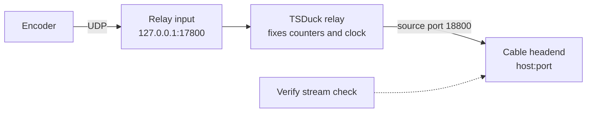

# Cable headend, streaming, CDN, federation, emergency alerts, and the API {#ch-integrations}

This chapter is for the IT person who connects CivicCast to the outside world: the cable company's equipment, a content delivery network, other servers on the internet, weather and emergency feeds, and other software that wants to talk to the station. It describes what the code really does in beta.10. Most of the connections in this chapter are **off by default**, and several were **not exercised** in the beta.10 acceptance run, so each section says which.

> **Note:** Beta.10 was published on 2026-10-02 as a GitHub pre-release (a beta candidate). Gate A, the formal acceptance run, passed for the clean-install lane only. The upgrade and download-only lanes were not run. A first install with neither the full kit nor an earlier install is not proven. No human field-tester has signed it off, and the 8-hour soak run used an earlier internal build (C16). None of the outside connections below, with the exception of the loopback path that feeds the web player, was proven against real outside equipment or services.

## Before you start

- **Who can do what.** Channel and headend settings need **Setup admin**. Publishing needs **Publish operator**. The roles are listed in [Appendix: roles](#app-roles).
- **The station answers on `127.0.0.1` only.** The control plane (the web server and station engine) listens on `127.0.0.1` port 8000. Setup opens a Windows Firewall rule for TCP 8000, but a program that listens on the loopback address cannot be reached from another computer, with or without a firewall rule. We did not test reaching it from a second computer (HELP-102). Everything in the "HTTP API" section below is therefore reached from the station computer itself, from a session on it, or through something you build in front of it.
- **Do not put a same-host reverse proxy in front of the setup routes.** The station decides that a request came from the station itself by looking at the address it came from. The code comments say that if a reverse proxy is ever placed in front of the app, the check "would need to move". A proxy on the same computer connects from the loopback address, so it would make every outside request look local. Do not forward `/api/setup` through a proxy. A proxy on a different computer cannot reach `127.0.0.1:8000` at all.
- **Environment variables.** Most switches here are environment variables. The code comments name the service's `Environment` registry value as the place to set them, and the station's processes inherit the supervisor's environment; the steps are in [Running it day to day](#ch-operations), under "Set environment variables for the service". Restart the service afterwards with `Restart-Service CivicCastSupervisor` in an Administrator PowerShell. We did not run that on a station. Restarting the service stops every channel; do it between programs.
- **Times you type.** Several console screens treat a time you type as UTC, not local time (Recording, Program Guide, Schedule). Log lines are in local time. Keep that in mind whenever you compare a schedule with a log.
- **Beta status of the interfaces.** Nothing in the code or in the repository's documents promises that any interface in this chapter will stay the same from one release to the next. Treat all of them as beta.

## Cable headend: UDP transport streams

A *headend* is the cable company's room of equipment that receives your channel and puts it on the cable. Many small stations send the headend a *UDP transport stream* (a continuous stream of MPEG packets sent over the network). CivicCast does this with an output of kind `udp-ts` and a destination address of the form `udp://host:port`.

> **Known issue (beta.10):** No headend preset, and no part of the cable delivery path, was field-proven against a real cable headend. The presets below come from vendor documents and the code says so ("Not field-proven against a real cable headend"). Agree the exact stream settings with your cable company before you rely on any of them.

### Headend presets

A preset fills in the picture and sound settings and the stream rate for a type of receiver. Apply one from the channel's settings on the **Channels** screen. The same function is available as `POST /api/staff/egress/channels/{id}/config/headend-profile`, and `GET /api/staff/egress/headend-profiles` lists them.

| Preset | Picture and sound | Stream rate | How it is sent |
|---|---|---|---|
| `generic-udp-spts` | H.264, 720p at 30 frames a second, 5000 kbps; AC-3 sound at 192 kbps | 8000 kbps | UDP, one receiver (unicast) |
| `comcast-mtd-sd` | MPEG-2, 720x480, a keyframe every 15 frames, 3180 kbps | 3750 kbps | UDP, multicast |
| `comcast-mtd-hd` | H.264, 1080p at 30, 10000 kbps; AC-3 at 384 kbps | 12000 kbps (a placeholder rate) | UDP, multicast |
| `telvue-hypercaster-ip` | H.264, 720p at 30, 5000 kbps | 8000 kbps | Unicast; the port must be 1024 to 65535 |
| `harmonic-spectrum-ts` | H.264, 1080p at 30, 8000 kbps | 10000 kbps | UDP, unicast |
| `leightronix-file-drop` | H.264, 720p | none | A file drop, not a live stream |
| `local-rehearsal-hls` | Adds a web (`hls`) output only | not applicable | The folder must be under the egress work folder or the folder named by `CIVICCAST_LIVE_HLS_ROOT`; network (UNC) paths are refused |

Things the presets enforce: the loudness target for headend outputs is ATSC A/85 at -24 LKFS; the datagram size is 1316 bytes (seven 188-byte transport packets); a multicast preset refuses a unicast address. Applying a preset reports when the change takes effect on a running channel: `restart_queued`, `restart_required`, `next_start` or `unchanged`. The GStreamer output for `udp-ts` turns on automatic multicast for a multicast address and needs an explicit port.

### The transport-stream relay

When the encoder is restarted, for example at a program change that cannot be spliced, a plain UDP stream starts over: the headend sees the stream's counters and clock reset and can lose the picture. To avoid that, CivicCast puts a small relay program, TSDuck's `tsp`, between the encoder and the headend. The relay never restarts while the channel is on, so the headend sees one continuous stream.



*Figure: the path of a `udp-ts` output with the relay on. The encoder sends to a loopback address on the station; the relay forwards to the headend you configured.*

The encoder never talks to the headend directly when the relay is on. It sends to `127.0.0.1` on a listen port. The relay listens there, repairs the continuity counters and the program clock reference, and sends the stream to the headend address you configured, always from the same source port. There is one relay for each pair of channel and `udp-ts` destination. Listen ports start at `CIVICCAST_TS_RELAY_BASE_PORT` (default 17800) and go up by one for each relay, and ports are reused when a relay is freed. The source port the headend sees is the listen port plus 1000, so the first relay sends from port 18800. If the cable company filters by source port, tell them these numbers.

The relay is controlled by `CIVICCAST_TS_RELAY`:

| Value | Meaning |
|---|---|
| `auto` (default) | Use the relay if TSDuck is found; otherwise send directly from the encoder. |
| `on` | Use the relay; if TSDuck is missing, log an error and send directly. |
| `off` | Never use the relay. |

The relay applies to `udp-ts` outputs only, on every encoder engine. The code looks for TSDuck's `tsp.exe` in this order: the file named by `CIVICCAST_TSDUCK_PATH`; the managed copy in `%LOCALAPPDATA%\CivicCast\tsduck` (or the folder in `CIVICCAST_TSDUCK_HOME`); the copy in the server-binaries pack at `payload\tsduck\bin\tsp.exe`; then your `PATH`. The version pinned for the product is TSDuck 3.44-4676. TSDuck is optional: the installer's self-test records its absence as a note and continues.

What the log says (in `C:\ProgramData\CivicCast\logs\control_plane-app.log`):

| Log fragment | Meaning |
|---|---|
| `TS relay up for <channel>: 127.0.0.1:<port> -> <host>:<port> (pinned source port <port>).` | The relay is running. |
| `TS relay auto mode: TSDuck (tsp) not found — udp-ts output is direct from the encoder; relaunches reset the TS session at the headend (#151). Install TSDuck to enable seamless splices.` | No TSDuck, so no relay. Each encoder restart resets the stream at the headend. |
| `CIVICCAST_TS_RELAY=on but TSDuck (tsp) is not available — ...` | You forced it on and TSDuck is missing. |
| `TS relay failed to start for <channel> -> <destination>; udp-ts falls back to ...` | The relay program would not start; output went direct. |
| `TS relay skipped for <channel>: udp-ts uri ... has no host:port.` | The destination address has no port. |

> **Known issue (beta.10):** The comments at the top of the relay's code describe it for the older FFmpeg concat engine. The code that starts it runs for every engine, including the default GStreamer engine. If you read the source, trust the behavior above.

### Check the stream with the verify probe

The station can capture a few seconds of what it is sending and test it with TSDuck. Use the **Verify stream (TSDuck)** button on **Channels** (Setup admin; shown only when the channel has a `udp-ts` output), the command `civiccast egress verify --channel-id <channel> --seconds 10`, or `POST /api/staff/egress/channels/{id}/compliance-probe`. It runs for about 10 seconds. The checks are: constant mux rate (within 5 percent), transport-stream sync, continuity, the program tables, a program clock reference present, and a single program. Without TSDuck the verdict is `not-run`. `GET /api/staff/egress/headend-readiness` reports whether TSDuck is available and the last results, and `POST /api/staff/egress/headend-device-probe` tests whether a headend appliance answers on a TCP port.

A passing check means the stream is well formed. It does not prove that the cable company's receiver accepts it, and the verify result itself says what it does not claim.

> **Note:** The 8-hour run on build C16 reports 41 "verify checks" (40 OK, 1 raw failure). Those were the lab's own captions, timing and playback checks, not a TSDuck stream test and not a cable-headend test. We could not confirm that the run used a `udp-ts` output at all, so it is not evidence for this section.

## Web streams: HLS

*HLS* is the way video reaches a web browser: a playlist file (`playlist.m3u8`) and a rolling set of 2-second video pieces. The resident portal's live page uses it.

The shipped GStreamer runtime has no HLS writer. So for an output of kind `hls`, the code redirects the encoder's feed to a loopback UDP address `udp://127.0.0.1:<port>`, where the port is 18000 plus a number derived from the output's address (range 18000 to 18499, base set by `CIVICCAST_HLS_RELAY_BASE_PORT`). A supervised FFmpeg process reads that feed and writes the video pieces (`seg%09d.ts`) and `playlist.m3u8`, with a window of about 12 seconds (6 pieces). The playlist is served at `/media/live/<channel>/playlist.m3u8`; recordings are served at `/media/vod/<asset>/...`. The relay's own log is `C:\ProgramData\CivicCast\data\egress\<channel>\logs\hls-relay.<output label>.stderr.log`.

| Log fragment | Meaning |
|---|---|
| `HLS relay up for <channel>` | The web stream is being written. |
| `HLS relay could not start for <channel> ... ffmpeg is not available` | FFmpeg is missing. Run setup again to restore it. |
| `HLS relay for <channel> ... restarting the relay child` | The FFmpeg process stopped and is being restarted. |

What residents see is decided by `GET /api/public/live/current`. Its `state` is one of `offline`, `on_air`, `on_air_no_web_output` or `standing_by`, and the `reason` can be "no HLS output configured", "HLS output configured but not serving yet" or "fallback slate, no program on air". `/api/public/channels/<channel>/live.m3u8` redirects to the live playlist, and `/api/public/channels/<channel>/captions.vtt` serves the current live captions.

> **Note:** Live captions are off by default in beta.10 and can have gaps under load. See [the captions section of the troubleshooting matrix](#ch-troubleshooting).

## CDN and provider options

A *CDN* (content delivery network) is a hosting company that serves your recordings from many places so that the station's own internet line is not the bottleneck. CivicCast can upload finished recordings to one. The selector is `CIVICCAST_CDN_PROVIDER`:

| Value | Meaning |
|---|---|
| `off` (default) | No CDN. Recordings are served from the station. |
| `bunny` | Bunny. Variables: `CIVICCAST_BUNNY_STORAGE_ZONE`, `CIVICCAST_BUNNY_ACCESS_KEY`, `CIVICCAST_BUNNY_CDN_HOSTNAME`. |
| `cloudflare_r2` | Cloudflare R2. Variables: `CIVICCAST_R2_ACCOUNT_ID`, `CIVICCAST_R2_ACCESS_KEY_ID`, `CIVICCAST_R2_SECRET_ACCESS_KEY`, `CIVICCAST_R2_BUCKET`, `CIVICCAST_R2_PUBLIC_BASE_URL`. |
| `fastly` | Fastly Object Storage. Variables: `CIVICCAST_FASTLY_REGION`, `..._ACCESS_KEY_ID`, `..._SECRET_ACCESS_KEY`, `..._BUCKET`, `..._PUBLIC_BASE_URL` (each starting `CIVICCAST_FASTLY`). |
| `akamai` | Akamai (Linode) Object Storage. The same five variables, starting `CIVICCAST_AKAMAI`. |
| `stub` | A stand-in that writes files to a local folder (`CIVICCAST_CDN_STUB_ROOT`); the code marks it for tests and proofs only. |

The variables are listed in `docs/ops/cdn-and-providers.md` and confirmed in the provider factory code. Set the selector and that provider's variables in the service environment, and restart the service. If the selected provider's variables are missing, the code stops the application at start-up with a message naming them. When a recording is finalized, the finalization worker uploads its HLS files and sets the recording's `manifest_url`. A failed upload shows up as the failure code `cdn.upload_failed` (see [Recording failures](#ch-troubleshooting)).

There is a separate *surge switch* that would send the live stream to the CDN during heavy viewing. It is **off** unless `CIVICCAST_LIVE_SURGE_THRESHOLD` is set. When it is used, `CIVICCAST_LIVE_SURGE_BUFFER_SECONDS` (default 15, capped at 30) sets the delay.

If a CDN or other server sits in front of the portal and you use the analytics features, set `CIVICCAST_ANALYTICS_TRUSTED_PROXY_CIDRS` to the address ranges of that server so viewer addresses are counted correctly.

> **Known issue (beta.10):** The CDN paths were not exercised in Gate A or in the 8-hour run. They are unproven in this build. Test with one recording before you rely on a CDN.

### Publishing providers

Separate from the CDN, each publishing destination has a provider setting that is either `mock` or `real`:

| Variable | Destination |
|---|---|
| `CIVICCAST_PROVIDER_INTERNET_ARCHIVE` | Internet Archive |
| `CIVICCAST_PROVIDER_LOCAL_NAS` | A local storage server (rsync or ZFS) |
| `CIVICCAST_PROVIDER_YOUTUBE` | YouTube Live and YouTube video upload |
| `CIVICCAST_PROVIDER_MAIL` | Email |
| `CIVICCAST_PROVIDER_WEBHOOK` | Webhooks |

All of them default to `mock`. A mock provider does not send anything. Set the variable to `real` only after you have placed the credentials the provider needs.

> **Known issue (beta.10):** The Publish screen does not always say when a mock provider did the work. An Internet Archive or Local NAS row carries a "Simulated" note, but a YouTube row from the mock provider shows a success message with no simulated note (HELP-03). Check the far end after your first real publish.

> **Known issue (beta.10):** The Publish screen has targets for a podcast episode and for subscriber notifications, but real sends were parked by an owner decision on 2026-09-02. Nothing is mailed or posted when you publish. See [Publishing](#ch-publishing).

## Cable file packages

Some cable stations take recordings as files, not as a live stream. A *cable file package* is a ZIP that holds the media, its captions, a `manifest.json` and a `SHA256SUMS` file (checksums, so the receiver can check nothing was damaged).

1. Set `CIVICCAST_CABLE_PACKAGE_OUTPUT_DIR` to the folder where packages should be written.
2. Set `CIVICCAST_CABLE_CAPTIONS_DIR` to a folder that holds a caption file named `<asset-id>.vtt` or `<asset-id>.srt` for each recording that has captions.
3. Restart the service.
4. Approve the recording on **Publish** with the cable file package ticked. The package is made from the recording's local file; a recording with no local file (`file_path`) cannot be packaged.

You can also run the command `civiccast cable package` from the command line; see [Appendix: command line](#app-cli).

> **Known issue (beta.10):** If `CIVICCAST_CABLE_PACKAGE_OUTPUT_DIR` is not set, the Publish row reads "not set up (optional)" and has no retry afterwards (HELP-08). Set the folder first, then approve; do not approve first and fix it later.

> **Note:** The package is a file. Its creation is not proof that any cable company accepted it. The `leightronix-file-drop` preset (above) is a different thing: it configures a channel's output, not this ZIP.

## Federation (ActivityPub)

*ActivityPub* is the open standard that lets servers such as Mastodon follow each other. With it turned on, someone on a compatible server can follow the station and see new recordings announced. It is **off by default**.

CivicCast turns federation on only when all of these are true: the mode is not `disabled`; a public base address is set that begins with `https://` (or `http://` on a loopback address, for lab use); a private key path is set; and the key can be read. If any is missing it stays off without an error, so a half-configured station looks the same as an unconfigured one.

1. **Make a key.** In an Administrator PowerShell, from the install folder:

   ```powershell
   .\runtime\python.exe -m civiccast.cli activitypub keygen --private-key-path "C:\ProgramData\CivicCast\federation\actor.pem" --base-url "https://your-public-address" --handle station --mode limited
   ```

   Store the key where only Administrators and SYSTEM can read it. The command prints the environment settings to add in the next step. The command is in the code; we did not run it on a station.
2. **Set the variables** (in the service environment) and restart the service:

| Variable | Meaning |
|---|---|
| `CIVICCAST_ACTIVITYPUB_MODE` | `disabled`, `open`, `limited` or `approval-only` |
| `CIVICCAST_ACTIVITYPUB_BASE_URL` | The public address of the station (if unset, `CIVICCAST_PUBLIC_BASE_URL` is used) |
| `CIVICCAST_ACTIVITYPUB_HANDLE`, `..._DISPLAY_NAME` | The account name and the name shown to others |
| `CIVICCAST_ACTIVITYPUB_PRIVATE_KEY_PATH`, `..._PUBLIC_KEY_PEM` | The key |
| `CIVICCAST_ACTIVITYPUB_AUTHORIZED_FETCH` | Require signed requests to read the actor |
| `CIVICCAST_ACTIVITYPUB_BLOCKLIST`, `..._BLOCKLIST_FILE`, `..._ALLOWLIST`, `..._ALLOWLIST_FILE` | Servers to refuse, or the only servers to accept |
| `CIVICCAST_ACTIVITYPUB_INBOX_RATE_LIMIT`, `..._INBOX_RATE_WINDOW_SECONDS` | Defaults: 60 requests per 60 seconds |
| `CIVICCAST_ACTIVITYPUB_RETRY_BACKOFF_SECONDS` | Delay between delivery retries |
| `CIVICCAST_ACTIVITYPUB_LAB_ALLOW_LOCAL` | Lab only: allow local addresses |

The public routes are `/.well-known/webfinger`, `/.well-known/nodeinfo`, `/nodeinfo/2.0`, `/ap/actor`, `/ap/inbox`, `/ap/followers` and `/ap/outbox`. Remote actors and their inboxes must be public HTTPS addresses. The staff routes are under `/api/staff/activitypub/` (status, followers, approve, reject and block, outbox, deliveries, retry and replay, keygen).

The control plane listens on `127.0.0.1` only, so servers on the internet cannot reach these routes until you provide a path from your public address to port 8000. The same caution as above applies: a same-host reverse proxy changes how the station sees addresses.

> **Known issue (beta.10):** The console cannot switch federation on. The **ActivityPub** screen shows status and followers only. You must use the variables above.

> **Known issue (beta.10):** There is no control to unblock a server you blocked. Approve, Reject and Block need the Publish operator or Support admin role, and the moderation error shows the same generic text even when the real cause is a missing role.

> **Known issue (beta.10):** Approving a recording on **Publish** announces it to followers when federation is on. This is not shown on the Publish screen.

> **Warning:** Federation lets other servers send requests to the station's public address. Do not turn it on until the public path is designed, and read [Security and privacy](#ch-security).

## Emergency alerts feeds

CivicCast can read public alert feeds and show an emergency overlay or put up a slate. **It is not an Emergency Alert System (EAS) device**, and the console says so on the Emergency Alerts screen. Do not use it as your legal EAS path.

Two things must be switched on, and the installer sets neither:

| Variable | Effect |
|---|---|
| `CIVICCAST_EAS` | The poll worker runs only when this is set to something other than `off` (the default is `off`). |
| `CIVICCAST_EAS_AUTO_SURFACE` | Automatic display of severe and higher alerts needs `1`, `true`, `yes` or `on`. Without it, severe and higher alerts are not put on air automatically. |
| `CIVICCAST_EAS_POLL_SECONDS` | How often to poll; default 60. |

> **Known issue (beta.10):** The screen inventory for Emergency Alerts says severe alerts air automatically. In the code they do so only when both `CIVICCAST_EAS` is on and `CIVICCAST_EAS_AUTO_SURFACE` is on. With a stock install, nothing is polled and nothing is surfaced. We followed the code.

### Add a feed

Create or replace a feed source with `PUT /api/staff/eas/sources/{source_id}`. This needs the Setup admin role. The body is:

| Field | Meaning |
|---|---|
| `source_id` | A name. It must equal the one in the address. |
| `label` | A human-readable name. |
| `kind` | `ipaws-cap`, `nws-cap`, `amber-cap` or `manual`. |
| `endpoint_url` | The feed address. |
| `geocode_filter` | A list of area codes to keep. |
| `severity_floor` | The lowest severity to act on: `unknown`, `minor`, `moderate`, `severe` or `extreme`. Default `severe`. |
| `poll_seconds` | 15 to 3600; default 60. |
| `enabled` | `true` or `false`. |
| `credential_ref` | The **name of an environment variable** that holds the credential, not the credential itself. |
| `notes` | Free text. |

For any feed that has a `credential_ref`, the station sends `Authorization: Bearer <value of that variable>`. NWS feeds are requested as `application/geo+json`; the others as `application/cap+xml, application/xml`. A `manual` source is needed before an alert can be entered by hand (`POST /api/staff/eas/alerts/manual`, Setup admin; an alert can be attributed only to a source of kind `manual`). Forcing the slate needs an explicit operator confirmation. Reading the feeds needs Setup admin, Support admin or Meeting operator; displaying an alert needs Setup admin or Meeting operator.

The public overlay data is at `/api/public/cg/emergency-overlay`.

> **Known issue (beta.10):** A feed that fails raises the alert kind `eas-source-unavailable`, but the console still shows the feed as "polling". Watch the **Alerts** screen, not that word.

> **Known issue (beta.10):** We could not confirm whether the emergency crawl is burned into the video that goes to the cable headend, or shown only on the web overlay (HELP-03 of the emergency-alerts inventory). Do not assume it reaches cable.

## Webhooks and subscriptions

There are three different webhook features. Keep them apart.

### Resident subscriptions

Residents can sign up on the public portal with `POST /api/public/subscribe/email` or `POST /api/public/subscribe/webhook` (body: `webhook_url`, `target_type`, `target_id`). There are also confirm, unsubscribe and RSS routes (`/api/public/subscribe/rss/<type>/<id>.xml`). Staff can send a test with `POST /api/staff/subscribe/dispatch-test` (Publish operator or Support admin).

When a subscriber webhook is delivered, the station sends a JSON body with `asset_id`, `title`, `portal_url`, `podcast_url`, `summary` and `published_at`, and two headers: `x-civiccast-signature: sha256=<hex>` (an HMAC-SHA256 of the body written with sorted keys and compact separators) and `x-civiccast-asset-id`. The timeout is `CIVICCAST_WEBHOOK_TIMEOUT_SECONDS` (default 30), with retries set by the `CIVICCAST_WEBHOOK_RETRY_*` variables.

> **Known issue (beta.10):** Nothing is delivered automatically when a recording is published; only the staff test dispatch sends. Subscriber notifications are parked (see above).

> **Known issue (beta.10):** The signing secret for a subscriber webhook is calculated from the subscription's own identifier, not chosen at random, and it is never shown to the subscriber. A receiver therefore cannot check the signature. Webhook "confirmation" does not prove that the person owns the address: the confirmation token is returned in the sign-up response, and any `http` or `https` address is accepted. If `CIVICCAST_PROVIDER_WEBHOOK` is set to `real`, this can be used to make the station send requests to addresses of an attacker's choosing (audit findings E-001 and B-002). Leave the webhook provider on `mock` until this is fixed.

### Alert destinations

The **Alerts** screen can hold destinations of three kinds: email, text message and webhook. A webhook destination receives a JSON body with `event_id`, `condition`, `severity`, `state`, `resource_ref`, `summary`, `detail`, `first_observed_at` and `last_observed_at`. The body is signed with the destination's `secret` using HMAC-SHA256, and the header `X-CivicCast-Signature` carries the hex digest with no `sha256=` prefix. The timeout is 10 seconds. A failed delivery is retried after 120, 240, 480 and 960 seconds and then given up on after 5 attempts.

> **Known issue (beta.10):** On a new install every alert rule is created with no destination attached, the rule editor cannot attach one, and adding a destination does not connect it to any rule. Alerts may never be delivered. Check by sending a test and watching for it.

### Payments (inbound)

`POST /api/webhooks/stripe` accepts a payment provider's notification. It requires a `Stripe-Signature` header, rejects a body over 1 MiB, and answers 401 for a bad signature. It is not reachable from the internet unless you build a path to it.

> **Known issue (beta.10):** The public portal asks for paywall tiers and a checkout, but the server has no routes for them (the API list shows only `access`, `magic-link` and `verify`), and the sign-in link emails are not sent in this build. See [Publishing](#ch-publishing).

## External agenda import

The agenda screen can look up a meeting in an outside agenda system and import it. This is **off by default**. To turn it on, set `CIVICCAST_AGENDA_SOURCE` to `legistar`, `primegov`, `civicclerk` or `js_portal`, then restart the service. The other settings are `CIVICCAST_AGENDA_SOURCE_CLIENT`, `CIVICCAST_AGENDA_SOURCE_TOKEN` and `CIVICCAST_AGENDA_SOURCE_TIMEOUT_S` (default 10 seconds). A value other than those (or `off`) is rejected with a message listing the allowed values.

The tenant or site code that staff type on the screen must be 1 to 64 letters, digits, hyphens or underscores. The portal address for a `js_portal` source must not carry a user name or password, and must not point at a private or local address. A `js_portal` source also needs an optional add-on; the screen reports "JS-portal runtime: not installed." when it is missing.

## The HTTP API

Everything the console shows comes through the station's HTTP API, and the same calls are open to your own scripts. Calls under `/api/staff/` need a staff token; calls under `/api/public/` and a few others do not. The list of every route is in `ops/docs-sprint/inventory/generated/api.md` and in the API appendix: 405 paths and 488 operations in 81 groups for beta.10.

### Which areas are stable?

None is declared stable. We searched the code and the repository's documents for a versioning or stability policy and found none. The routes behind the console change when the console changes. Some installer routes are hidden from the published schema (`include_in_schema=False`); treat those as internal. The documented error format is: the `detail` field is a string for domain errors (404, 409, 503), an object for structured conflicts, and an array for validation errors (422), so a script should read the status code first and then the type of `detail`.

| Area | Authentication | Use for scripts? |
|---|---|---|
| `/health`, `/api/version`, `/api/hardware` | None | Yes. Simple and unlikely to change. |
| `/api/public/*` (channels, live, assets, schedule, programlog, embed, podcast, subscribe, reports, search) | None | Yes, with the beta caution. The resident portal's own pages call `/api/public/live/current` and `/api/public/assets`, among others. Some `/api/public/channels/<channel>/...` routes (for example `live`, `schedule` and `now-next`) return built-in sample data, not what is on air, so do not use them for real programming. |
| `/media/live/*`, `/media/vod/*` | None | The files that the players fetch. |
| `/.well-known/*`, `/nodeinfo/2.0`, `/ap/*` | None | Federation only; see above. |
| `/api/staff/*` | Staff token with a role | Possible, but it follows the console and may change without notice. |
| `/api/setup/*` | None, from the station computer only | No. Console sign-in and first setup only. |
| `/api/webhooks/stripe` | A payment signature | Inbound from the payment provider only. |

### Get a staff token

For scripts, issue an access key with the command line. (The console sign-in keeps its own token inside the browser; the console has no screen for entering a script's key.) You need an Administrator PowerShell on the station computer and the database address.

```powershell
cd "<install folder>"
$env:DATABASE_URL = (Get-ItemProperty 'HKLM:\SOFTWARE\CivicCast\Native').DatabaseUrl
.\runtime\python.exe -m civiccast.cli token issue --operator-id integrations --display-name "Integrations script" --scopes operator --json
```

`<install folder>` is where setup put CivicCast. The command prints the secret **once**; copy it into a password manager at once. The command needs `DATABASE_URL`; without it the message is "DATABASE_URL must point at the CivicCast database before running staff token lifecycle commands." The value is held in the registry where only SYSTEM and Administrators can read it. Close the window afterwards so the variable is gone.

The scopes `operator` and `admin` each grant all five roles (Setup admin, Meeting operator, Records clerk, Publish operator and Support admin); a token with no scopes grants none. To give a script only what it needs, name the roles instead, comma-separated: `setup_admin`, `meeting_operator`, `records_clerk`, `publish_operator`, `support_admin` (the code also accepts the hyphenated and short forms such as `meeting-operator` and `meeting`). See [Security and privacy](#ch-security). Other token commands are `token list`, `token revoke` and `token rotate`.

> **Known issue (beta.10):** The token commands are in the code, but we did not run them on an installed station. The `civiccast` command may exist at `runtime\Lib\site-packages\bin\civiccast.exe` (see [Running it day to day](#ch-operations)); we could not confirm it is there, so the commands in this chapter use `runtime\python.exe -m civiccast.cli`, which runs the same program.

> **Warning:** A token with all five roles can change the station and stop channels. Keep it out of scripts that others can read, and revoke it when you are done.

### Worked example with curl

Windows includes `curl.exe`. Put the token in a variable for this window only, so that it does not end up in a script file or in your history:

```powershell
$env:CC_TOKEN = Read-Host "Paste the token"
```

1. **Check the station is up and which version.** No token is needed.

   ```powershell
   curl.exe http://127.0.0.1:8000/health
   curl.exe http://127.0.0.1:8000/api/version
   ```

2. **Ask who the token belongs to.** It returns the name and the roles of the token.

   ```powershell
   curl.exe -H "Authorization: Bearer $env:CC_TOKEN" http://127.0.0.1:8000/api/staff/auth/me
   ```

3. **List the channels and read one channel's state.**

   ```powershell
   curl.exe -H "Authorization: Bearer $env:CC_TOKEN" http://127.0.0.1:8000/api/staff/egress/channels
   curl.exe -H "Authorization: Bearer $env:CC_TOKEN" http://127.0.0.1:8000/api/staff/egress/channels/<channel>/state
   ```

4. **Read the station's health, the same data as Readiness.**

   ```powershell
   curl.exe -H "Authorization: Bearer $env:CC_TOKEN" http://127.0.0.1:8000/api/staff/installer/system-health
   ```

5. **Read what residents see.** No token.

   ```powershell
   curl.exe http://127.0.0.1:8000/api/public/channels
   curl.exe http://127.0.0.1:8000/api/public/live/current
   curl.exe http://127.0.0.1:8000/api/public/assets
   ```

   `/api/public/channels` returns the station's built-in channel line-up (`public`, `education` and `government`) with each channel's live output addresses filled in from its egress settings; it is not a list of channels you created.

   `/api/public/assets` lists only recordings that have been packaged for the web (a `manifest_url`) and have a publish date.

6. **Queue a command for a channel.** This needs the Meeting operator role. The body is a JSON document with an `action` of `start`, `stop`, `reload` or `drain` (the schema also lists `takeover` and `handback`, which have their own routes). The station answers with HTTP 202, which means "accepted", not "done". A `start` for a channel with no saved configuration, or one that is disabled, is refused with 409. Read the state afterwards.

   ```powershell
   curl.exe -X POST -H "Authorization: Bearer $env:CC_TOKEN" -H "Content-Type: application/json" --data "{\"action\":\"reload\"}" http://127.0.0.1:8000/api/staff/egress/channels/<channel>/commands
   ```

7. **Download the full schema.** On a station the interactive pages `/docs` and `/redoc` are not served, and `/openapi.json` needs a staff token.

   ```powershell
   curl.exe -H "Authorization: Bearer $env:CC_TOKEN" http://127.0.0.1:8000/openapi.json -o openapi.json
   ```

Other things worth reading with a token: `GET /api/staff/runtime-safe-to-air`, `GET /api/staff/assets`, `GET /api/staff/schedule`, and `POST /api/staff/schedule/{id}/cancel` to cancel a schedule item.

### What the answers mean

| Status | Meaning | What to do |
|---|---|---|
| 200, 201 | Done | |
| 202 | Accepted; a worker will do it | Read the state afterwards. |
| 401 | The token is missing, wrong or revoked | Check the `Authorization: Bearer` header and that the token was not revoked. |
| 403 | The token lacks a role. The text begins "This action requires one of these CivicCast roles:" | Use a token that holds that role. |
| 404, 409, 503 | A domain answer; `detail` is text | Read the text. |
| 422 | The request body is wrong; `detail` is a list of field errors | Fix the fields. |
| 429 | Too many failed tokens: 10 failures in 60 seconds from one address (by default). The `detail` reads "Too many failed staff authentication attempts. Wait and retry." | Wait; the `Retry-After` header gives the seconds. A request with no token at all does not count. |

> **Known issue (beta.10):** The whole-repository review found places where tests and features had diverged (audit finding C-001). Try a call on a test channel before you automate it.

## If it did not work

- **The relay does not start.** Check `CIVICCAST_TS_RELAY`, whether `tsp.exe` exists in one of the places listed above, and the log fragments in the relay table. See also [Troubleshooting matrix](#ch-troubleshooting).
- **The headend sees a reset stream at program changes.** The relay is off or TSDuck was not found: look for `TS relay auto mode: TSDuck (tsp) not found`.
- **The web player shows nothing.** Read `/api/public/live/current` and its `reason`, then the HLS relay log.
- **A CDN upload fails.** Look for `cdn.upload_failed` in the recording's finalization status.
- **Federation does nothing.** One of the four conditions above is missing. There is no error message.
- **No emergency alerts appear.** `CIVICCAST_EAS` is `off` by default. Check it first.
- **A call returns 401 or 403.** Check the token and the role.
- **A call from another computer cannot connect.** The station answers on `127.0.0.1` only.

## Related

- [Troubleshooting matrix](#ch-troubleshooting)
- [Configuring the station](#ch-configuration)
- [Running it day to day](#ch-operations)
- [Security and privacy](#ch-security)
- [How CivicCast is built](#ch-architecture)
- [Publishing, and what residents see](#ch-publishing)
- [Running the meeting](#ch-running-meeting)

<!-- SOURCES: inventory/generated/{api,cli,env-vars}.md; inventory/screens/{channels,eas,activitypub,publish,alerts,agendas,public-subscribe,public-watch,installer-install-layout,_shell-signin-and-session}.md; docs/ops/{cdn-and-providers,cable-file-package,activitypub-federation,channel-egress-runbook,staff-route-protection,v2.0-integrator-guide}.md; civiccast/egress/{ts_relay.py,headend.py,hls_relay.py,compliance.py,daemon.py}; civiccast/native/supervisor/service.py:483; civiccast/app.py (error contract 2165-2180, lan-only docs 2090-2215, EAS worker 1715-1745, /api/version 2449, public asset store 1756-1772); civiccast/installer/router.py:1212-1260; civiccast/stream/cdn/factory.py; civiccast/live/{finalization_worker,surge_service,cdn_publisher}.py; civiccast/publish/service.py; civiccast/cable/package.py; civiccast/activitypub/config.py; civiccast/eas/{router,workers}.py; civiccast/subscribe/{service,webhook,router}.py; civiccast/alerting/delivery.py:142-190,248-302,452-540; civiccast/agenda_import/config.py; civiccast/auth/roles.py; civiccast/cli.py (token, activitypub keygen, cable package, egress verify); ops/beta10-oversight/audits/audit-lite-whole-repo-beta10-2026-10-02.md (E-001, B-002, C-001); docs/releases/v1.0.0-beta.10-verification.md; civiccast/egress/ts_relay.py:50-240; civiccast/egress/compliance.py:55-290; civiccast/egress/router.py (commands, headend routes); civiccast/app_platform/router.py:210-370 (sample feeds); civiccast/auth/roles.py:15-60 (scope aliases); civiccast/auth/middleware.py:100-160; civiccast/eas/{models,router,workers}.py; civiccast/schedule/{router,store}.py (public assets); ops/beta10-oversight/verdicts/rung-8h-c16-*--VERDICT-NOTE.md -->
