# How CivicCast is built {#ch-architecture}

This chapter explains how CivicCast is put together: which programs run on the station computer, what each one is responsible for, how a meeting recording and a 24-hour channel move through the system, and what the software does when something fails. It is written for the IT person at a city or station, for an integrator connecting CivicCast to other equipment, and for a technical reviewer who wants to check the design. You do not need to read it to run a station. The earlier chapters tell you what to click.

Each figure has a caption, and a plain-English paragraph under it. The beta.11 architecture remains the baseline; the beta.12 candidate updates caption health, bounded raw logs, local administrator recovery, meeting controls, remote guest controls and emergency presentation. Where a value is a default that a setting can change, the text says so. Source inspection is not the same as observing every behavior on an installed station.

> **Note (proof status of beta.11):** beta.11 was published on 2026-10-08 as a GitHub pre-release for testing. See the [current beta.11 verification record](https://github.com/scottconverse/civiccast-native/blob/main/docs/releases/v1.0.0-beta.11-verification.md) for package-specific checks and limits. A separate 36-hour dev7 overlay soak is development history, not package verification. This chapter describes source behavior; it does not claim that every recovery path was observed on a station.

## How to read the figures {#arch-reading}

- A **rounded box** is a program or a part of a program. A **cylinder** is stored data. An **arrow** is a call, a read or a write, in the direction of the arrow.
- A **dashed arrow** is something that happens only sometimes, or only if a setting is turned on.
- **Default** values are marked "default" in the text. The environment variable that can change a value is named in the Appendix on settings.
- "Station" means the one Windows computer that runs CivicCast. "Control plane" means the web server and background workers that make up the CivicCast application. "Worker" means a separate program the control plane starts to play out one channel.

## The system and the people and equipment around it {#arch-context}

Figure 16-1 shows what talks to CivicCast. CivicCast runs on one Windows computer. People use it through a web browser. Video comes in from cameras, capture cards, network streams, watch folders and uploaded files. Video goes out to residents, to a cable headend or other downstream equipment, and to archive and distribution services.

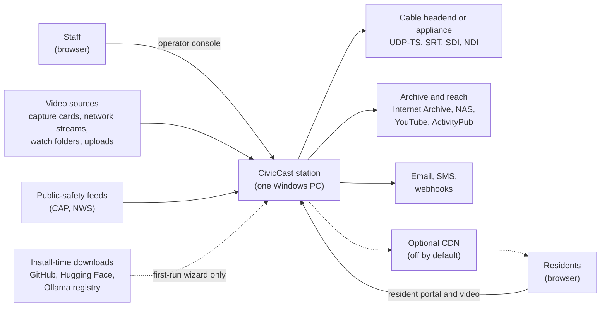

*Figure 16-1. System context. Solid arrows are the normal flows. Dashed arrows are optional or occur only at install time.*

**What this shows.** Staff open the operator console in a browser at `/operator/` on the station. Residents open the resident portal at `/`. Both are served by the same CivicCast web server. The station can record from capture cards and network streams, pick up files from watch folders, and accept uploads. It plays out channels as a continuous video stream to downstream equipment, and it can publish finished recordings to the Internet Archive, a network storage location, YouTube and a federated social network (ActivityPub). Those outside publish surfaces run in a simulated mode until an administrator sets the provider to real and supplies its credentials, ActivityPub is off until it is enabled with a public address and a key, and subscriber-notification and podcast surfaces are not active in beta.11 (see [Chapter 15](#ch-integrations)). A content delivery network (CDN) is off by default; when a station turns one on, finished recordings are copied to it so that residents' video requests go there instead of to the station. Emergency and weather feeds are read and shown on screen; CivicCast is not an EAS device and does not relay the legally required Emergency Alert System signal (see [Chapter 15](#ch-integrations)). Most of the time the station needs no internet connection. The first-run wizard downloads selected optional Large Whisper and CUDA components only when they are not already on the computer; Whistle is supplied in the signed station pack. The web server does not serve its own API documentation pages on a station because those pages would need the internet.

> **Known issue (beta.11):** The control plane listens on `127.0.0.1` only, so as shipped, the resident portal and operator console are reachable from the station computer itself. The installer also adds a Windows firewall rule that allows inbound TCP 8000. We found no setting that changes the listening address. Do not describe the portal as reachable from other computers on the network until this is confirmed on a real station. See [Chapter 9](#ch-planning) and the troubleshooting matrix.

**Emergency presentation in the beta.12 candidate.** When an administrator enables `CIVICCAST_EAS` before starting a channel, the channel reserves an emergency layer in its existing video compositor. Channel health ticks select the applicable alert and send its presentation to the video worker. Clearing or expiring an alert removes only that emergency layer, preserving ordinary graphics. A forced full-screen slate requires explicit confirmation. The resident page separately polls the channel-specific emergency endpoint and removes its notice when that endpoint returns no active alert. Isolated CPU and D3D11 video captures and a browser check exercised these paths; this does not establish real CAP-feed reception or acceptance by a cable headend. See [Emergency alerts](#ch-integrations).

## The programs that run on the station {#arch-deployment}

CivicCast is installed as a Windows service. A service starts when the computer starts, before anyone signs in, and keeps running when nobody is signed in. Figure 16-2 shows the programs that run, which one starts which, and the network addresses they use.

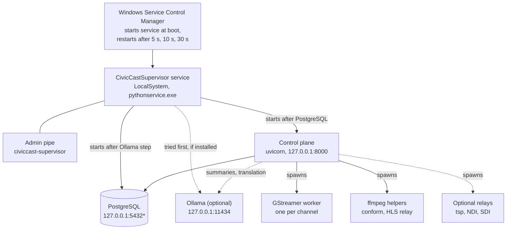

*Figure 16-2. Processes on a native Windows station. \*PostgreSQL uses the first free port of 5432, 5433, 5434, 5435 and 5544, chosen when the database was created.*

**What this shows.** One Windows service, named `CivicCastSupervisor` (display name "CivicCast Native Supervisor"), is the parent of everything else. It runs as the built-in `LocalSystem` account and is set to start automatically. The supervisor first tries to start Ollama (see below; its outcome never holds up the rest). It then starts PostgreSQL and waits until the database answers a `SELECT 1` (up to 60 seconds by default), and then starts the control plane, the Python program that is the CivicCast application, and waits until `GET /health` returns 200 (up to 180 seconds by default, with a separate rule that gives up after 60 seconds of no CPU activity so a hung start is not mistaken for a slow one). Ollama is the local AI engine used for summaries and translation. If its program and a model store are present, the supervisor starts it before PostgreSQL; if they are not present at start-up, the supervisor skips Ollama and looks again about every 60 seconds, because the first-run wizard may be downloading the models while the service is already running.

The supervisor does not start the video workers. The control plane does, one GStreamer worker program per channel, and it starts helper programs (ffmpeg to prepare videos and to cut live HLS segments, and optional relays for UDP transport streams, NDI and SDI). This is deliberate: the part of the system that knows the schedule is the part that decides what each worker plays.

| Item | Value (default) |
| --- | --- |
| Service name | `CivicCastSupervisor` |
| Runs as, start type | `LocalSystem`, automatic |
| If the service stops unexpectedly | Windows restarts it after 5 s, then 10 s, then 30 s |
| Control plane address | `127.0.0.1:8000` |
| PostgreSQL address | `127.0.0.1`, first free port of 5432, 5433, 5434, 5435, 5544 |
| Ollama address | `127.0.0.1:11434` |
| Admin pipe | `\\.\pipe\civiccast-supervisor` |
| Single-instance lock | named mutex `Global\CivicCastSupervisorSingleton` |
| Firewall rule | inbound TCP 8000, program `<install folder>\runtime\python.exe` |

**How the supervisor protects the station.** It keeps four promises.

1. **One copy only.** A named lock (a Windows *mutex*) allows exactly one supervisor. Only SYSTEM and administrators can hold it, so an ordinary program cannot forge it or hold the station offline.
2. **No orphans.** Every child is placed in a Windows *job object* set to kill all its members when the supervisor exits, and children cannot break out of it. If the supervisor crashes, Windows ends the whole process tree, including the video workers. A sweep by job name runs before the first start in case a previous job survived.
3. **Restart with backoff.** A child that stops is restarted after 1 second, then 2, 4 and so on, up to 30 seconds, with plus or minus 20 percent random jitter. Five restarts within 10 minutes put the supervisor in the `degraded` state: the service stays up, and an alert is raised. A restarted child waits until every child before it in the start order is ready again.
4. **Graceful stop.** On stop, children are stopped in reverse order. Each gets 15 seconds to stop cleanly (PostgreSQL with `pg_ctl stop -m fast`; the control plane with a Ctrl+Break) before Windows ends it.

The supervisor reports one overall state. The state names are `starting`, `ready`, `degraded`, `blocked_wsl_active`, `blocked_probe_unavailable`, `maintenance` and `stopping`. The two `blocked` states mean a guard that keeps the older WSL-based edition of CivicCast and this edition from ever running together has refused to let the station transmit. `maintenance` is a read-only mode the upgrade engine uses (Figure 16-14): the database and control plane come up, and no video worker is allowed to start. Once the supervisor is `stopping`, nothing can pull it back to running. A blocked state can only be released to `starting`, never straight to `ready`, so readiness is always proven again.

**An administrator can talk to the supervisor** through a Windows named pipe. Anyone who is signed in can ask for `status` and `version`. Only an administrator or SYSTEM can ask for `start`, `stop`, `restart`, `drain` or `runtime_set`. The check is made on the identity of the caller for each command, an unknown command is refused, and each command that changes anything is logged with the caller's account identifier. A message larger than 16 KiB closes the connection.

**Why it is built this way.** The design choices are recorded in [ADR 0021](#arch-adrs) (the written record of the decision to run natively on Windows). The reasons it gives, and that we checked still hold, are:

- *A service rather than a program in someone's login session.* A service starts at boot. The ADR records a test in which video was being broadcast about 12 seconds after boot, more than six minutes before anyone signed in. A station that restarts after a Windows update or a power cut should return to air without anyone logging in.
- *One Windows product, no Linux layer.* The earlier edition ran inside WSL2 (a Linux layer on Windows). The ADR records the cost: thirteen release candidates, a per-user program whose only job was to keep the Linux layer awake, and a plan for SDI capture cards that WSL2 cannot reach. The WSL edition is not part of this repository.
- *Video workers outside the supervisor.* A worker that fails should be restarted by the program that knows what it was playing, not by a general-purpose process manager.

**What the ADR accepted as risk, and what is still true.** The service runs as `LocalSystem`, which has far more rights than a station needs. The ADR names a least-privilege account as a follow-up, and beta.11 still uses `LocalSystem`. The ADR also says the operator console is a Tauri application; in beta.11 the operator console is a web page served by the control plane at `/operator/`, and Tauri is used only for the installer window.

## Inside the control plane {#arch-control-plane}

The control plane is one Python program (the `civiccast.app` application, run by the `uvicorn` web server) that does three jobs at once: it answers web requests, it runs a set of background workers on threads, and it starts and watches the video workers. There is one such process per station. Figure 16-3 shows its main parts.

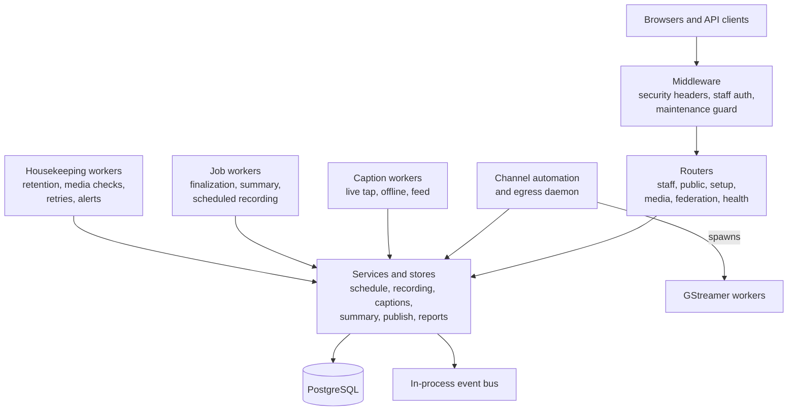

*Figure 16-3. Parts of the control plane. The background workers are threads inside the same process as the web server; only the video workers are separate programs.*

**What this shows.** Requests pass through several layers of middleware (code that runs on every request) and then reach a router. The three that matter here add security headers, check the staff sign-in on every `/api/staff/*` request (Figure 16-12), and, when the supervisor has started the station in maintenance mode, refuse every POST, PUT, PATCH and DELETE request with HTTP 503. A cross-origin (CORS) layer is added only if an administrator lists allowed origins; none is allowed by default.

The routers are grouped by who may call them:

| URL prefix | Who may call it | What it holds |
| --- | --- | --- |
| `/api/staff/...` | signed-in staff with a role | everything the operator console does: schedule, assets, recording, captions, summaries, publish, channels, alerts, reports |
| `/api/public/...` | anyone | what the resident portal and apps read: schedule, recordings, search, live channel list, subscribe, contribute |
| `/api/setup/...` | the station computer only; once setup is complete, all but `station-state`, `login` and `recover` also need a staff token (and, for most, the `setup_admin` role) | first setup, admin sign-in, recovery code |
| `/media/vod/...`, `/media/live/...` | anyone | video segments and playlists |
| `/ap/...`, `/.well-known/...` | remote federation servers | ActivityPub actor, inbox, outbox |
| `/health` | anyone | liveness, plus a readiness verdict |
| `/operator/`, `/` | anyone (the pages themselves) | the packaged operator console and resident portal web apps |

The two web apps are plain files bundled inside the program. The operator console is mounted at `/operator`. The resident portal is mounted at `/`, as a catch-all, so the control plane takes care that an unknown path that starts with `/api` gets a real JSON "not found" and not the portal's front page.

Behind the routers are *services* (the rules) and *stores* (the code that reads and writes the database). In a normal install every store is backed by PostgreSQL. The program refuses to start the staff write routes on a throwaway in-memory store unless an administrator explicitly allows it for testing.

The **in-process event bus** is a small piece of code in the same program that lets one part tell another that something happened. It is not a separate server. In beta.11 it has exactly one subject, `publish.asset.approved`, published when a publish approval is recorded, and nothing subscribes to it. The workers coordinate through rows in the database and by polling, not through the bus. Earlier designs used a separate message server called NATS. [ADR 0023](#arch-adrs) records why NATS was removed: nothing in the shipped product had ever used it for real traffic, yet it was a fourth process, a bundled program, a configuration file, a certificate and a health check that could report the station "not ready" for a service nothing depended on. The bus is kept behind an interface so a real network message system can be added later without rewriting the code that sends events. ADR 0023 says PostgreSQL's own notification feature stays for the low-volume "tell the screen a row changed" case; we found no use of it in the beta.11 code.

The **background workers** run on threads, each under a supervisor of its own that restarts the thread if it fails and can be switched off by an environment variable. The ones that matter most are:

| Worker thread | What it does |
| --- | --- |
| `civiccast-channel-automation` | every 2 seconds (default), checks every enabled channel, restarts channels that should be on air, and extends or replaces the program that is playing (Figures 16-6 and 16-7) |
| `civiccast-caption-tap-worker` | turns live audio from each channel into captions (Figure 16-10) |
| `civiccast-caption-feed` and `civiccast-caption-proof` | push finished captions into the running video worker, and check that captions really are in the emitted stream |
| `civiccast-offline-caption-worker` | captions finished recordings, after the meeting |
| `civiccast-summary-job-worker` | drafts meeting summaries with the local AI engine |
| the finalization worker | turns an ended live session into a recording (Figure 16-5) |
| `civiccast-scheduled-recording` | arms and runs scheduled recordings |
| `civiccast-program-log-materializer`, `civiccast-autoschedule-compile` | turn recurring program slots into schedule items |
| `civiccast-watch-folder-worker` | picks up new files from watch folders |
| retention, media-integrity and media-lifecycle workers | flag expired or missing media, and compute whether each asset is ready to air; they flag, and never delete |
| ActivityPub retry, webhook retry, alerting, analytics roll-up, bulletin expiry, contributor-upload reap, remote-contribution workers | housekeeping and retries |

When the supervisor has started the control plane in maintenance mode, none of these workers is started at all, because each one writes something. When the control plane is asked to stop, it first drains every live channel (waiting for each video worker to exit, then forcing it after a deadline), and it gracefully finishes any recording that is under way, so that a restart produces a finished recording and not an orphan.

**Why threads in one process, and not many services.** The code keeps the control plane as one process on purpose. A station is one computer with one or two people to run it, and every extra process is another thing that can fail to start. The cost is that a fault that stops the control plane stops every worker thread with it. The supervisor then restarts the control plane, the channels start again (Figure 16-8), and the as-run log keeps its place (Figure 16-4).

<!-- SOURCES: civiccast/native/supervisor/config.py:37-126; civiccast/native/supervisor/states.py:1-291; civiccast/native/supervisor/children.py:1-700; civiccast/native/supervisor/service.py (log root, pipe standup, ollama skip/recheck 1491-1535, db port parse 2049-2069); civiccast/native/supervisor/authz.py; civiccast/native/supervisor/job_object.py:1-60; civiccast/native/supervisor/install_layout.py; civiccast/app.py:729-940 (lifespan, workers), 1195-1720 (ThreadSupervisor list), 2186-2230 (middleware), 2550-2640 (portal mounts); civiccast/auth/middleware.py; docs/adr/0021-native-windows-runtime.md; docs/adr/0023-nats-removed-in-process-event-bus.md; inventory/screens/installer-install-layout.md sections 4 and 10; inventory/screens/installer-nsis-service-finish.md; inventory/generated/api.md route groups; fact sheet (installer/supervisor subagent) items 4-5 -->

## Where the data lives {#arch-data}

CivicCast keeps its data in a database, in folders of files, in a few small files outside the main data folder, and in memory. Figure 16-4 shows each place and what is kept there.

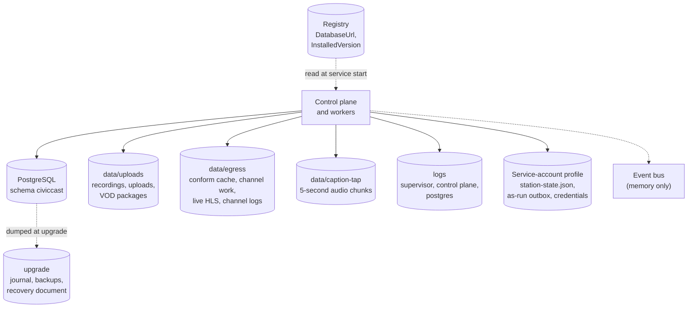

*Figure 16-4. Data stores. The folders `data`, `logs` and `upgrade` are under `C:\ProgramData\CivicCast`. The registry values are under `HKLM\SOFTWARE\CivicCast\Native`.*

**What each store holds.**

| Store | Where | What it holds |
| --- | --- | --- |
| Database | PostgreSQL, database `civiccast`, schema `civiccast`, role `civiccast_svc`, files in `C:\ProgramData\CivicCast\data\pgdata` | everything that is a record rather than a file: assets, schedule items and program slots, recording schedules and jobs, live sessions, channel configuration, state, commands and the proof chain, caption review items, summaries and approvals, publish runs, signed-record exports, subscriptions, alerts, reports, staff token records |
| Uploads and recordings | `C:\ProgramData\CivicCast\data\uploads` | uploaded and captured media, finished recordings (in a `recordings` folder), and the packaged VOD copies (HLS playlists and segments, in a hidden `.civiccast-packages` folder, one per asset) |
| Channel work folder | `C:\ProgramData\CivicCast\data\egress` | the conform cache; for each channel the prepared plan folders, its worker logs and relay logs, the reload status file, generated slates and bulletin slides, and (for a channel that serves live HLS) its rolling segments; and the HLS relay's log files (5 MiB each, two kept) |
| Caption tap | `C:\ProgramData\CivicCast\data\caption-tap` | Temporary five-second audio chunks, deleted after processing; at most 12 queued completed segments per channel plus in-flight inputs and the segment being written |
| Logs | `C:\ProgramData\CivicCast\logs` | `supervisor.log`, `control_plane-app.log`, `control_plane.log` and `postgres.log` rotate at 10 MiB and retain 10 older files (up to 11 files each); the application log is written by the control plane, while the raw child logs are drained by the supervisor. |
| Installer records | `C:\ProgramData\CivicCast` | `install-progress.log`, the upgrade engine's journal, backups and recovery document under `upgrade`, and the database provisioning journal and recovery documents under `provision` |
| Downloaded components | `C:\ProgramData\CivicCast\packs` and `components` | optional Whisper and AI model files that the first-run wizard downloaded, because the installer window cannot write to the Program Files folder |
| Program files | the install folder, `C:\Program Files\CivicCast (Native)` by default | the embedded Python and the CivicCast program (`runtime`), PostgreSQL tools, ffmpeg, Ollama and optional GPU libraries (`packs`, `dependencies`), the AI model store (`models\ollama`), and the station records that prove activation passed |
| Registry | `HKLM\SOFTWARE\CivicCast\Native` | `DatabaseUrl` (the database address and password, readable only by SYSTEM and administrators) and `InstalledVersion` |
| Service-account profile | the profile folder of the account the service runs as (see the note below) | `station-state.json` (the admin password hash, recovery code hashes, console sign-in tokens and station profile), the as-run outbox, alert and subscription credentials, and the local certificate authority files |
| Event bus | memory of the control plane | events passed between parts of the program; nothing is stored, and nothing is kept across a restart |

> **Known issue (beta.11):** Several small but important files are not under `C:\ProgramData\CivicCast`. As the code stands, the sign-in state file (`station-state.json`), the as-run outbox, alert credentials and the local certificate files default to the profile of the account that runs the service. For `LocalSystem` that is `C:\Windows\System32\config\systemprofile\AppData\Local\CivicCast` (and a `.civiccast` folder in the same profile). The supervisor does not set the variables that would move them. A 2026-09 lab report observed the sign-in state file at that location; we have not checked it on a running station for this chapter. If you copy only `C:\ProgramData\CivicCast` for a backup, you will not copy the admin password hash and sign-in state. See [Chapter 12](#ch-operations) for backups.

**Database or SQLite.** A native station runs on the bundled PostgreSQL. The code can also run on a SQLite file, which is what a simple local install without a Postgres server uses, and on an in-memory store for tests; the program refuses to start its staff write routes on an in-memory store unless `CIVICCAST_ALLOW_EPHEMERAL_STORES=1` is set. The database address is read from the registry value at service start. If an environment variable named `DATABASE_URL` is already set on the service, it wins, and the supervisor logs which source it used (the variable name or the registry path, never the value). The database accepts connections only from `127.0.0.1`, with password authentication (`scram-sha-256`) and one rule in its `pg_hba.conf`. It does not use TLS (`ssl = off`) because the connection never leaves the computer.

**How the schema is kept current.** One Alembic migration set, shared by every module, builds and upgrades the database. Each module keeps its own migration files in its own folder, and a single runner walks all of them (ADR 0008). The installer's provisioning step runs the migrations on a new database, and the upgrade engine runs them on an upgrade. At start-up the control plane compares the database revision to the one it expects and records one of `current`, `behind`, `ahead`, `not-configured` or `unknown`. It logs an error for `behind` or `ahead`, but it does not migrate by itself and does not refuse to start. `GET /health` always answers HTTP 200 while the program is running, and reports `status: "degraded"` unless the schema is `current`. Monitor the `status` field, not the HTTP code.

**What this design does for you.**

- *Records and files are separate.* A recording's metadata is in the database and its video is a file. The media-integrity worker re-checks that every file an asset points to still exists and flags the asset as missing if it does not; it never deletes anything. The retention worker flags expired assets for a records clerk to review; it also never deletes.
- *Writing a live recording and its record happens in one transaction.* When a live session ends, the session-ended event, the new recording asset and the move of the session to the `recorded` state are committed together (ADR 0011). The event's key makes a second attempt to finalize the same session a no-op, so a crash and retry cannot make two recordings, and a partial write cannot leave a session with no recording.
- *The record of what aired survives a database outage.* Every change of source is first written to a local SQLite file (`asrun_outbox.sqlite3`) with the strongest durability setting, then copied into the database. If the database is unreachable, the row waits in the file and is retried on every automation tick, and an alert is raised (ADR 0023 on the as-run outbox).
- *Nothing waits on a message server.* The workers coordinate through database rows and polling, and the in-memory bus carries one event today. Anything that must not be lost (a command to a channel, an as-run row, a finalization) is written to a table or file first.

**What it does not do.**

- **CivicCast does not back up your station by itself.** The only backups it takes are the one the upgrade engine takes before an upgrade (a database dump, with an integrity manifest, in `C:\ProgramData\CivicCast\upgrade\backups\pre-<version>`; the upgrade engine does not copy recordings) and the ones created by the `civiccast dr run-drill` command. We found no scheduled backup job. Your own backup must cover the database (a `pg_dump`, or a copy of `pgdata` with the service stopped), `C:\ProgramData\CivicCast\data\uploads`, and the files listed in the note above.
- **There is no automatic clean-up of the command table.** The conform cache (60 GB by default), prepared plan folders (5 GB by default) and relay logs have limits. Beta.11 also bounds live caption working audio, recent caption history and delivery tracking; those bounds do not limit original recordings or archived caption tracks. Watch the free space on the drive that holds `C:\ProgramData\CivicCast\data`.
- **Uninstalling does not remove your data.** The uninstaller removes the program files, the service, the firewall rule and the registry values, but leaves `C:\ProgramData\CivicCast`. Because the uninstaller deletes the stored database password, a reinstall over a surviving data folder has to set a new password on the existing database. The installer does this using a short-lived loopback-only access rule.

<!-- SOURCES: ops/docs-sprint/inventory/screens/installer-install-layout.md sections 1-3 and 8; civiccast/native/supervisor/install_layout.py:79-338; civiccast/native/supervisor/children.py:272-314; civiccast/native/supervisor/service_env.py:1-60; civiccast/native/provision/conf.py:55-135; civiccast/native/station_runtime.py:1337, 1421-1437; civiccast/installer/station_state.py:595-608; civiccast/reporting/asrun_outbox.py:100-147; docs/history/2026-09-codex-work/BLACKWELL-CAPTION-FIX-REPORT-v6.md:55-64; civiccast/schema_check.py:244-279; civiccast/app.py:2376-2447; civiccast/dr/backup.py; civiccast/native/upgrade/orchestrator.py:198-215; civiccast/native/upgrade/seams.py:100-215; civiccast/native/upgrade/__main__.py (no media_root); civiccast/app.py:1255-1292 (retention/media-integrity flag only); docs/adr/0008, 0011, 0023-asrun-durable-outbox; civiccast/apps/installer/src-tauri/src/native_uninstall.rs:2145-2215 (credential cleared); civiccast/native/provision/conf.py:102-135 (transient trust rule); app-auth-db fact sheet subagent sections 3-5 -->

## From a meeting to a resident: the life of a recording {#arch-recording}

This is the other half of the product. A meeting is captured, becomes a recording, is published to the resident portal, and gets captions and, if staff ask for them, a summary. Figure 16-5 shows the order in which things happen. It is not quite the order people expect, and the differences are worth knowing.

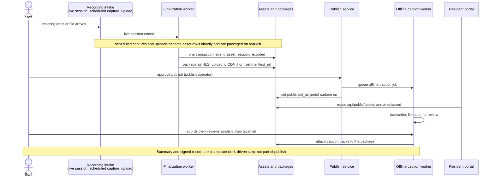

*Figure 16-5. A recording from capture to resident. Captions are attached after the portal goes live.*

**What this shows.**

1. **Three ways in.** A *live session* (an operator ends a broadcast, which moves the session from `on_air` to `ending`), a *scheduled recording* (a capture job that records an input such as a capture card, RTSP, SRT, HLS, RTMP, MPEG-TS or NDI stream), and an *upload or watch folder* (a file placed by a clerk or picked up from a folder; the watch-folder worker never deletes the source file, and flags the folder as degraded if it becomes unreachable). Each ends as a row in the assets table. Uploads start in the `validated` state, and recordings in the `recorded` state. Recording schedules and program slots are entered and displayed in UTC on several screens; a 7 PM Monday meeting in the Americas falls on Tuesday in UTC, so check the "in your local time" echo (see [Chapter 3](#ch-before-meeting)).
2. **Finalization.** For a live session, the finalization worker waits until the recording file's size has stopped changing (30 seconds by default), then writes the session-finalized event, the asset and the session's move to `recorded` in one database transaction (Figure 16-4). We could not find which program writes the recording file for a live session; the worker looks for `<live_session_id>.mp4` in the recording target folder.
3. **Packaging.** For a live-session recording, the same worker packages the video as HLS (an adaptive set of segments: 1080p, 720p, 480p and 240p, never scaled up, in 2-second segments), uploads it to a CDN if one is configured, and records the playlist address on the asset. Uploads and scheduled recordings are not packaged automatically; an operator asks for it.
4. **Approval and publish.** A publish operator approves. By default only the *portal* surface publishes, and archive and reach surfaces must be chosen by name (an older version published to every surface when none was named, which was a safety defect that has been fixed). Approval is refused (HTTP 409) if the asset has no playlist address (`manifest_url`) yet. The caption job is queued first, and if it cannot be queued nothing is published; then the asset's published time is set and the one bus event is published. Publishing does not wait for captions to be reviewed.
5. **The resident portal** polls the public routes. It lists only assets that have a published time and a package, and the video route refuses an asset that is not published. There is no push channel.
6. **Captions come later.** The caption job transcribes the whole recording, files each cue in a review queue, and waits for a records clerk (Figure 16-10). The caption tracks are attached to the package only when review is finished.
7. **Summaries and records** are separate. See the next section.

**Where it differs from what you might expect.**

> **Note:** Finalization does not start captions or a summary. Captions start when publish is approved. A summary is made only when a records clerk asks for one. No broker event links these steps: they are linked through database rows and polling workers.

**Publish surfaces.** Each surface has a state (`blocked`, `not_configured`, `coming_soon`, `pending`, `running`, `succeeded`, `failed`, `overridden`), and the run as a whole shows one of nine dashboard states, from `draft` through `portal_live` and `archive_verified` to `complete` or `failed_needs_action`. A failure on one surface fails only that surface, and it can be retried on its own.

| Surface | Kind | State in beta.11 |
| --- | --- | --- |
| Portal | canonical | always on; the only surface published by default |
| Internet Archive, local NAS (rsync or ZFS) | archive | required only when the asset's retention policy is `meeting` or `permanent`; runs in simulated mode unless the provider is set to real with credentials |
| YouTube live and VOD | reach | optional; simulated unless set to real with credentials |
| Cable package | record | optional; `not_configured` when unset |
| Podcast | audience | not active: the episode it produces is a placeholder and is not saved |
| Subscriber notifications | audience | `coming_soon`: sends nothing, and the subscribe RSS feed is empty |
| ActivityPub | federation | off by default; when enabled, a note is delivered only after the portal surface succeeded |

> **Known issue (beta.11):** Internet Archive, NAS and YouTube publishing are simulated by default. A provider result carries a `simulated` flag. Do not tell staff that a recording reached the Internet Archive or YouTube until the provider is set to real, credentials are supplied, and you have seen the result.

### Summaries and signed records {#arch-summary}

Summaries and records sit beside the publish path and are driven by a records clerk.

- **A summary is not automatic.** A clerk asks for one; the cues (the caption text with times) are supplied in the request. The local AI model, a Gemma model run through Ollama at `127.0.0.1:11434`, is called at temperature 0 with a 600-second limit, and the answer must be structured JSON: a narrative plus a list of *sourced claims*, each pointing at the transcript cues it came from. A claim that states a number, a vote or a dollar amount must cite transcript ranges. The program checks that each cited cue exists and that the cited time range lies inside it. It does not check that the claim's words match the cue's words: a person must read it. The record keeps the model's digest, the Ollama version and a fingerprint of the content.
- **Approval** is by a records clerk, who moves the draft to `approved`. We found no check in the store that stops a draft the program itself had refused from being approved; we read it and did not run it.
- **A signed record** is a PDF/A-3B file built from an approved summary, with the claims, the provenance, the approval and a timestamp token attached as embedded files. Its visible page shows only a header, the identifiers, the fingerprint and the first 480 characters of the narrative; it does not include the transcript.

> **Known issue (beta.11):** Despite the name, we found no digital signature code in the records module. The timestamp token is a placeholder: unless an administrator sets `CIVICCAST_TSA_URL` or `CIVICCAST_TSA_ENABLE`, the token comes from a deterministic stand-in that carries a fixed date of 2026-05-14, not a real RFC 3161 timestamp from a timestamp authority. Verification checks the stored digest and the structure of the token. Do not describe an exported record as legally time-stamped or digitally signed until a real authority is configured and verified.

### Who touches what in this flow {#arch-flow-roles}

Live sessions are ended by a meeting operator. Uploads are made by records clerks, meeting operators or support administrators. Packaging by hand is for publish operators and setup administrators. Publish approval is for publish operators. Caption review and summary work are for records clerks. The roles are explained in Figure 16-12.

<!-- SOURCES: civiccast/live/finalization.py:313-381, 413-469; civiccast/live/finalization_worker.py:70-113, 305-323, 680-760, 841-913; civiccast/live/models.py:75-79, 132-158, 398-408; civiccast/live/router.py:736-779; civiccast/recording/models.py:80-88; civiccast/recording/runtime.py:555-600, 647-697; civiccast/schedule/models.py:60-70; civiccast/schedule/router.py:140-196, 372-504, 711-760; civiccast/schedule/store.py:124-137, 235-257, 562, 582; civiccast/schedule/watch_folder_worker.py; docs/adr/0024; civiccast/stream/config.py:65-96, 199; civiccast/stream/media_router.py:176-189, 224; civiccast/publish/router.py:239-314, 416-535, 538-654; civiccast/publish/service.py:53-130, 205-298, 506-828, 923-954; civiccast/publish/models.py:12-72, 160, 177; civiccast/platform/providers.py:40, 99-121; civiccast/platform/broker.py:66-107; civiccast/podcast/service.py:11-27; civiccast/subscribe/router.py:188-208; civiccast/activitypub/config.py:22, 66-76; civiccast/summary/generate.py:97-168; summary/validate.py:21-37; summary/extract.py; summary/ollama.py:127-150; summary/router.py:128-229; summary/store.py:172-221; civiccast/records/router.py; records/exporter.py:19-126; records/pdfa.py:86-213; records/timestamp.py:18-41; records/rfc3161.py; civiccast/ai_runtime/ollama_client.py:14-30, 123-174; docs/adr/0010, 0011; inventory/screens/recording.md, guide.md (UTC); captions/publish/records fact-sheet subagent sections 0-4 -->

## Playing a channel: from schedule to air {#arch-playout}

A CivicCast channel is a continuous video stream that never stops, even when the schedule has a gap or a file will not play. Everything in this section exists to keep that promise. Figure 16-6 shows the path from the schedule to the stream.

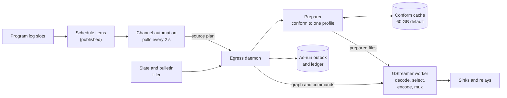

*Figure 16-6. The playout pipeline for one channel. The daemon, the preparer and the automation run inside the control plane; the worker is a separate program.*

**What this shows.** Recurring program slots are turned into schedule items. A background thread (the *channel automation*) looks at every enabled channel every 2 seconds. It asks the *source plan provider* what should be airing now, and gives the answer to the *egress daemon*, the part that owns each channel's worker. The daemon asks the *preparer* to make the files ready, then starts or instructs the worker. The worker plays the prepared files through one video encoder to the outputs.

**The source plan.** A *source plan* is the list of things a channel should play from now on. Only schedule items that are published and are premieres count. Each item is clipped to its slot. If the channel is switched on halfway through an item, the plan starts partway into it (called *join in progress*) so that the stream matches the clock. A gap of up to 30 seconds between items is absorbed. A longer gap is filled with filler. With the default GStreamer engine a plan holds one slice of up to 30 minutes, which keeps the worker's pipeline small; the automation extends it before it runs out (Figure 16-7). A plan segment has one of four kinds: a program (a recorded file), a *slate* (a generated card, used when nothing is scheduled), a *live* source (a network stream, used when an operator takes over the channel) and *cg* filler (bulletin slides). The slate is rendered as a short clip and repeated into one continuous file of 3,600 seconds, so a channel that falls back to slate does not need a second preparation. A live takeover is refused unless the live source has been observed as ready within the last 30 seconds by default (a source that merely exists is not treated as ready).

**Preparing a file ("conform").** Video files come in every size and shape. The preparer converts each one to a single *canonical profile* so that every change of program looks the same to the encoder. The default profile is 1280 by 720 pixels at 30 frames a second, H.264 video at 6,000 kbit/s with a keyframe every 60 frames, and AAC stereo audio at 192 kbit/s and 48 kHz, in an MPEG-TS container. A station can change the profile for a channel. The audio is also leveled (Figure 16-9). A conformed file is stored in the *conform cache*, a folder named `conform-cache` under the channel work folder (`C:\ProgramData\CivicCast\data\egress`), keyed by the source file's path, size and modified time, the profile, and the leveling method. A program that has aired before is a cache hit and costs no conversion. A program that has never aired is converted in the time before it is due, and the whole file is converted in the background so that the next airing hits the cache. The cache holds 60 GB by default and discards the oldest entries first. Each preparation step is limited to 300 seconds by default.

> **Note:** A station with long recordings should expect a delay the first time a recording airs, because that is when it is converted. The automation therefore starts preparing early. With the default settings it begins 690 seconds (11.5 minutes) before the projected end of the plan that is airing (the program, or its 30-minute slice when the program is longer): two 300-second preparation limits, plus 30 seconds to switch and a 60-second margin. A long file to be prepared next raises that lead time.

**The worker.** Each channel has one worker, a separate GStreamer program started with a description of the channel (a *playout graph*). It decodes the prepared files, chooses between its sources with an *input selector*, and sends the result through one persistent encoder and one MPEG-TS multiplexer. The graph has two sources: the program and a built-in black picture with silence. The encoder defaults to the OpenH264 software encoder because the shipped runtime does not include GPL-licensed x264. A hardware encoder (NVIDIA or Windows Media Foundation) is used only if the channel's profile asks for it by name, and the start is refused if a requested hardware encoder is missing unless the channel allows the software fallback. A channel with captions turned on must use H.264, because the caption inserter cannot embed captions in HEVC.

**Why one persistent pipeline.** The earlier design started a new encoder at every change of program, which starts a new MPEG-TS session each time. A cable plant's monitors log an error at every one of those splices. ADR 0015 chose to begin with a single long-running FFmpeg process; the code later moved to GStreamer, where the pipeline is never torn down at a program boundary, and the default engine is now GStreamer. ADRs 0015 and 0016 still describe the FFmpeg-concat design and the libx264 default, and are historical in those details. A station can still select the older engine with `CIVICCAST_EGRESS_ENGINE=ffmpeg-concat`. If the GStreamer files on the computer are damaged and cannot be repaired when the service starts, the supervisor selects the FFmpeg engine automatically, raises an alert and marks the channel degraded, so that the channel keeps airing.

**How the daemon and the worker talk.** Two channels are used, for two different reasons.

- *Operator intent* reaches the daemon through a table of commands in the database (start, stop, reload, drain, takeover, handback). The daemon reads it on every tick. ADR 0017 chose this over a direct call or a database notification because a command written to a table survives a restart of either side and a few seconds of delay does not matter for start and stop. The commands are marked consumed as a batch when read, so a command is delivered at most once.
- *Instructions to a running worker* go through a private Windows named pipe, `\\.\pipe\civiccast-worker-<channel>`, which the code restricts to SYSTEM and the service's own identity (the service runs as `LocalSystem`). The messages are small JSON lines (`reload`, `swap`, `caption`, `stop`) and each is acknowledged within 5 seconds. A `reload` acknowledgement only means "accepted"; the real outcome arrives later in a status file in the channel work folder, so a reload is never reported as done before it is.

### Changing programs without a gap {#arch-reload}

When one program ends and the next begins, CivicCast switches the worker to the new source while the output keeps running. Figure 16-7 shows the steps, and the watchdogs that stand behind them.

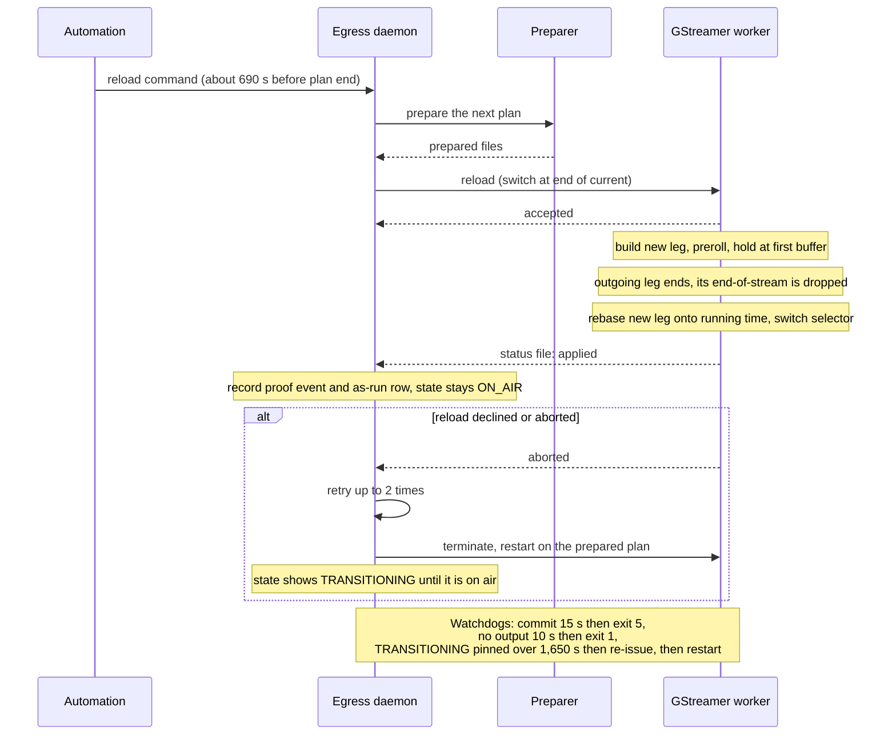

*Figure 16-7. A program change (a "seamless reload") and its watchdogs.*

**What this shows.** The automation notices that the program that is airing will end soon and enqueues a `reload`. The daemon builds and prepares the next plan and sends it to the worker. The worker builds the new source beside the old one on the live pipeline and prerolls it, which means it decodes the first picture and sound so the new source is ready to run. The new source then waits, held by a blocking probe so that it does not use CPU or run ahead. When the old program reaches its natural end, the worker discards that end-of-stream signal (otherwise the encoder would see the stream end), shifts the new source's clock so that the output timeline continues without a jump, and switches both the picture and sound selectors. The old source is then removed on a separate thread. The airing item is never cut short and never decoded twice, and the encoder and multiplexer are never restarted. The daemon learns the result from the status file and then records the change in the *proof chain* (a durable log of what each channel did) and in the *as-run* record (what actually aired, which is a different thing from what was scheduled). The channel's state stays `ON_AIR` throughout; only the proof chain notes a transition.

If the worker declines or aborts (a source that cannot be decoded, a timeout), the daemon re-resolves the schedule and tries again, up to two times. If that also fails it falls back to the slower route: it ends the worker and starts a new one on the prepared plan. In that case the channel shows `TRANSITIONING` until the new worker is on air, and the stream is interrupted briefly.

**The watchdogs.** Three independent timers exist because each one catches a failure the others cannot see.

| Watchdog | Where it runs | What it watches | What it does |
| --- | --- | --- | --- |
| Commit watchdog | inside the worker, on its own operating-system thread | the final switch took longer than 15 seconds (default; allowed range 3 to 120) | writes every thread's stack to the log, then ends the worker with exit code 5; the daemon treats this as an ordinary crash |
| Stall watchdog | inside the worker | no output left the multiplexer for 10 seconds (default), or one stream (picture or sound) stopped advancing | ends the worker with exit code 1; the daemon relaunches it |
| Reload-stall watchdog | in the daemon | a channel pinned in `TRANSITIONING` with nothing in flight for longer than the plan length plus lead plus settle time (1,650 seconds at least) | logs an error, re-issues the reload once, and 300 seconds later, if still pinned, ends the worker so the crash relaunch re-plans from the schedule |

Two further guards act on the output a resident would see: if the audio and video start times of the newest HLS segment differ by more than 1 second on three probes in a row (probes are 30 seconds apart), the daemon restarts that channel's worker; and if the HLS playlist stops advancing for 30 seconds after the relay has already tried to heal itself, the daemon also restarts the worker. Each of these two guards is limited to three restarts per channel per hour, after which it reports the problem and stops restarting.

**Why the watchdog that ends a stuck program change matters.** Before the reload-stall watchdog existed, a program change on the education channel in the lab once left the channel black and silent for about 34 hours. The beta.10 verification record names the watchdog that ends a stuck program change as the fix. The code shows why it can: the daemon measures how long a channel has been pinned in `TRANSITIONING`. The exact stall did not recur in the 8-hour lab run, which was on an earlier internal build.

### What a channel does when things go wrong {#arch-channel-states}

Every channel has one of eight states, shown in the operator console and stored with the channel. Figure 16-8 shows how they change.

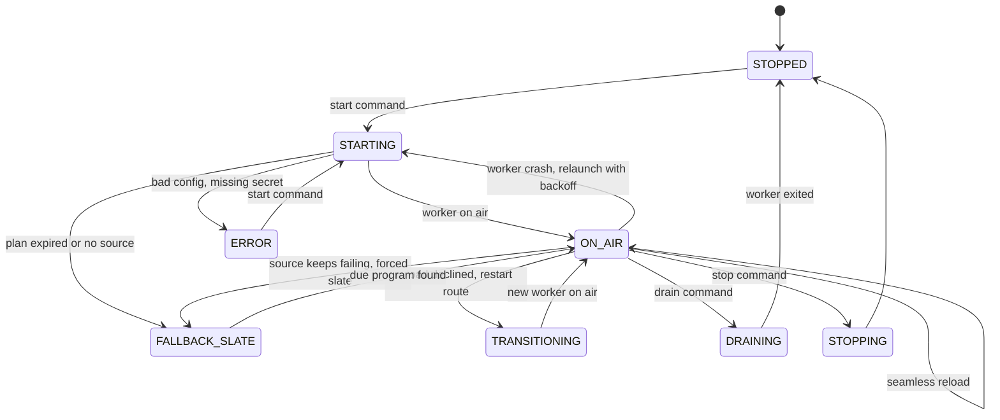

*Figure 16-8. Channel states. The state is written by the egress daemon.*

**What this shows.** `STOPPED` and `ERROR` are off air. `STARTING` is the time spent preparing and launching a worker. `ON_AIR` is a worker airing a real program, and `FALLBACK_SLATE` is a worker airing the slate or bulletins because no real program can be aired right now. `DRAINING` is a graceful stop that lets the worker finish; `STOPPING` is an immediate one. A channel whose `auto_start` switch is on is started again by the automation after an application or computer restart, and a channel on `FALLBACK_SLATE` is moved to the real program as soon as the schedule yields one.

**What heals itself, and what does not.**

| Failure | What CivicCast does |
| --- | --- |
| The worker crashes or exits unexpectedly | The daemon relaunches it. The first crash relaunches at once. A second crash within 15 seconds waits for the 15-second cooldown. A worker that stays on air for 60 seconds clears the count. |
| A worker keeps crashing against the same source (5 crashes in a row) | The daemon stops trusting the source and airs the fallback slate. The automation retries the real source about every 30 seconds, so a source that recovers is picked up again. |
| A slate plan reaches its end | The daemon relaunches once onto the program that is now due. Past that one relaunch it goes to `STOPPED` and names the media to check. |
| A worker was slow to start under load (exit codes 3 or 4) | Relaunched, but counted at most once a minute toward the crash count, because a slow start is not a crash. |
| The database or the daemon restarted while a channel was on air | On start-up, rows still marked on air whose worker has gone are cleared, and a start is queued. |
| A program cannot be prepared in time | The channel airs the slate and the automation retries. |
| The HLS output freezes, or sound and picture drift apart | The guards described above restart the worker (limited to three times an hour). |
| The as-run record cannot be written (database busy or disk full) | The row is written to a local SQLite journal first, retried on every tick, and an alert `asrun-outbox-degraded` is raised. Playout is never stopped by a record-keeping error. |
| A channel is in `ERROR` (invalid configuration, a missing secret, ffmpeg not found) | **Does not self-heal.** An operator must correct the cause and press start. |
| A channel was stopped by an operator, with `auto_start` off | Stays stopped. This is deliberate. |
| The restart budgets of the output guards are spent | The problem is logged and reported; the worker is not restarted again. |

In the 8-hour lab run on a three-channel station, the service ran without a restart, no channel showed slate after start-up, and the watchdogs did not fire. Two program changes aborted at a sub-second boundary and recovered by themselves in about 3 seconds. That run was on an earlier internal build of the same engine, on one lab computer; it was not repeated on the published installer.

### Keeping the sound level steady {#arch-loudness}

A public meeting is not steady. A chair at the dais, a speaker who steps back, and a resident at the public-comment microphone can sit 15 to 20 loudness units apart in one recording. CivicCast therefore levels each program once, when it is prepared, and plays it as is. Figure 16-9 shows the steps.

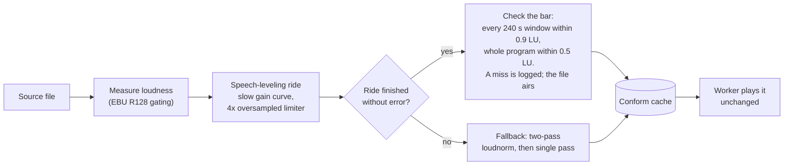

*Figure 16-9. How program audio is leveled. The target is -16 LUFS by default.*

**What this shows.** The measurement uses the standard EBU R128 method. A *speech-leveling ride* then moves the gain slowly (up to 0.5 dB a second, within a range of -6 dB to +18 dB in the code defaults, with a smaller cap for room tone) to follow the speakers, instead of a single gain for the whole program, which cannot put every four-minute stretch on target. A limiter that works on a four-times oversampled copy of the signal holds the true peak at -1.5 dBTP, and a loop measures the result and corrects it up to four times. The result is then checked against a bar: every 240-second window within 0.9 LU of the target and the whole program within 0.5 LU. A result that misses the bar is logged as a warning and still airs. Only if the ride itself fails (an error in the leveler or the final mux) does the preparer fall back to the standard two-pass `loudnorm` filter, and then to a single pass if the measuring pass fails; it records which method was used.

The loudness target is a setting of the channel and not a fixed number, because streaming and cable expect different levels (ADR 0014). The default is -16 LUFS with a tolerance setting of 2 LU. The configuration also lets each output (a *sink*) name its own regime: streaming (-16), ATSC A/85 (-24) or EBU R128 (-23). Only the older FFmpeg engine acts on it (see the note below). Applying a cable headend profile sets the channel to -24.

> **Known issue (beta.11):** A stretch of a recording that is too quiet for the ride's largest boost is listed in the report and is not leveled. The 240-second-window measurements below come from historical lab runs; the station's leveling check also recorded two programs whose worst four-minute stretch was 1.94 LU and 1.39 LU. We found the per-output regimes and the 853/960 Hz alert-tone filter only in the FFmpeg engine's code; we did not find them in the GStreamer engine's code, so on the default engine every output of a channel carries the same leveled audio, at the channel's own target. Confirm before promising a different level for cable and for streaming from one channel.

<!-- SOURCES: civiccast/egress/automation.py:1-60, 754-783, 945-1161, 1228-1298, 1568-1650, 1908-1990, 3214-3232; civiccast/egress/daemon.py:160-232, 236-380, 418-505, 1379-1493, 1876-1948, 2076-2849, 3789-4022, 4173-4433, 5886-6215, 6395-6530; civiccast/egress/models.py:74-134, 211-247, 462-463, 748-779; civiccast/egress/source_plan.py:46-110, 191-334, 488-516; civiccast/egress/preparer.py:1-30, 90-260, 306; civiccast/egress/engine_select.py; civiccast/egress/gst/engine.py:303-343, 803-805, 4876-5000, 5920-6075; civiccast/egress/gst/exit_codes.py; civiccast/egress/gst/reload_policy.py; civiccast/egress/gst/strategy.py (pipe transport, ack 5 s); civiccast/egress/gst/bridge.py:84-193, 282-345; civiccast/egress/gst/graph.py:19, 372-411; civiccast/egress/loudness_ride.py:1-120, 276-277, 313-373; civiccast/egress/loudness_plan.py; civiccast/native/station_runtime.py:1085-1135 (engine fallback); docs/adr/0014, 0015, 0016, 0017, 0023-asrun-durable-outbox; docs/releases/v1.0.0-beta.10-verification.md (8-hour run, limits); inventory (live source readiness TTL 30 s: docs/adr/0025); egress-fact-sheet subagent sections 1-9 -->

## Captions: live and after the meeting {#arch-captions}

CivicCast captions in two different ways, for two different needs. The *live* path captions a channel while it airs, so captions can be embedded in the stream. The *offline* path captions a finished recording after it is published, with a human review step before anything is attached. Figure 16-10 shows both, and marks the points where audio can be thrown away.

**Beta.11 live path:** The native runtime uses Whistle on CPU first, Whisper as backup, immediate first-pass publication, and bounded temporary working state. It does not create permanent per-cue review records or evidence WAVs, and review-archive discovery is not a live-caption or broadcast-readiness prerequisite. Recorded captions still use their separate review workflow. The current package's source, hash and verification scope are in the release verification record above.

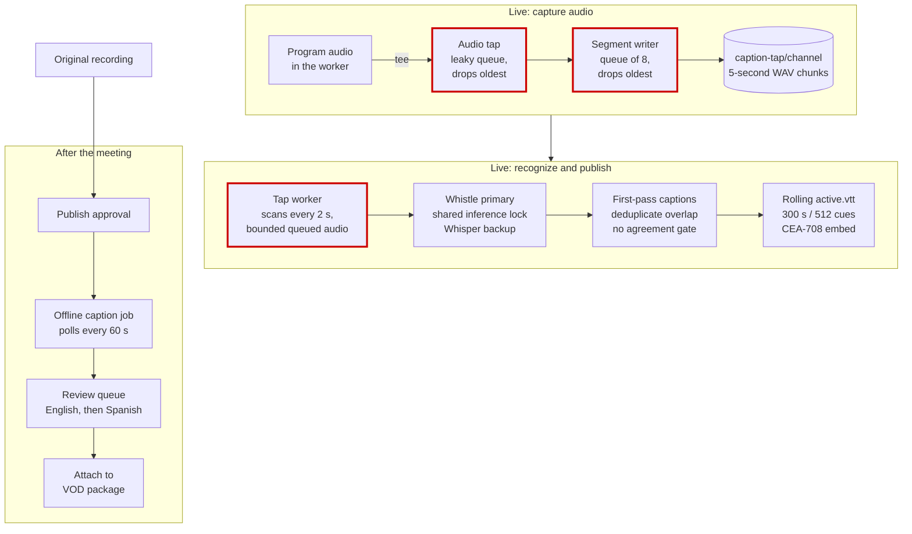

*Figure 16-10. The caption pipelines. Boxes with a heavy red outline are where live audio can be shed under load. The offline path sheds nothing.*

**The live path, step by step.**

1. **The audio tap.** Inside each channel's worker, a copy of the program audio is split off before it is encoded, converted to mono 16 kHz, and placed in a queue that never blocks the program: if it is full, it drops the oldest audio. This exists only if live captions are switched on for the station and a caption folder is set.
2. **Chunks on disk.** A writer collects the audio into five-second WAV files named `chunk-NNNNNN.wav` in `C:\ProgramData\CivicCast\data\caption-tap\<channel>`, writing each under a temporary name and renaming it so a half-written file is never read. The live tap keeps at most 12 completed segments waiting per channel, plus inputs currently being processed and the segment being written. Consumed chunks are deleted; the previous overlap needed for recognition remains in memory.
3. **The tap worker** scans every 2 seconds, takes the finished chunks of each channel, adds a five-second overlap from the previous chunk, and sends them to the speech recognizer.
4. **The recognizer** uses Whistle as the native live primary. Its child processes use the CPU; one station-wide inference lock allows one primary request at a time across that station's channels. A request has a 10-second deadline. On failure or timeout, only the affected channel switches to Whisper, and that fallback is sticky until the runtime restarts. A failed Whisper child is closed and replayed once immediately; a repeated replacement failure starts a 30-second cooldown before another child is created. Whisper remains the recorded-caption engine and can use the staged NVIDIA CUDA runtime. Both engines run locally; neither is Ollama. Recording/offline model choices remain separate.
5. **The stabilizer** publishes the first recognition, including low-confidence text, and removes overlap already aired. It does not require two readings to agree. Recent cues are limited to 300 seconds and at most 512 cues. A per-session identifier and monotonic sequence distinguish fresh captions after a worker replacement without accumulating a session-long identifier map.
6. **Output.** The rolling result is written to `active.vtt` in the channel's work folder. Live cues are not filed in a permanent review queue and do not generate evidence WAVs. A separate *caption feed* worker reads `active.vtt` every 2 seconds and sends each new cue to the running worker, which turns it into closed captions (CEA-608/708 data) and inserts them into the video, so the captions travel inside the emitted stream. Cues are split into pages of 32 columns by 2 rows without discarding words. Delivery acknowledgements are retained only while their cues remain in the provider's rolling window.
7. **The proof.** A decode-back check reads the actual emitted stream and compares the captions it finds with what should have been sent. The channel's caption status is `on` only while a recent check has passed; a missing, stale or failed check reads `not-verified`, so the console does not claim captions it cannot prove (ADR 0018).

> **Note:** Live captions are switched off in a new station profile until an administrator turns them on. The caption tap runs in its mode `inline` on a native station, but the audio tap and the embed are built only when the station's live-captions setting is on. Live captions are English only: the live path has no translation step.

**Where audio can be shed, and what happens to the captions.** The rule in the code is that captions are best effort and the channel on air always wins. When the station cannot recognize speech as fast as it arrives, audio is thrown away rather than letting captioning slow playout down.

| Where | What is dropped | What happens to the captions |
| --- | --- | --- |
| The audio tap in the worker | The oldest audio when the queue (200 buffers or about 10 MiB) is full, or when the next stage holds 32 buffers | A gap in the chunks; playout is unaffected |
| The segment writer | The oldest waiting segment when its queue of 8 segments (about 40 seconds) is full | Missing five-second chunks; a slow disk is not fatal to air |
| The tap worker's backlog gate: short overload | Nothing yet. If a channel has more than 2 finished chunks waiting for fewer than 15 scans in a row (about 30 seconds), only the oldest 2 are processed and the rest wait | Captions continue, a little late |
| The backlog gate: catch-up shed | After 15 scans in a row over the limit, the oldest waiting chunks are deleted and only the newest 2 are kept | Captions keep running from the newest audio; the skipped speech is never captioned, and one warning is logged |
| The backlog gate: pause | If the station sheds 3 times within 5 minutes, the channel's captions are blanked and paused for 120 seconds, then 240, 480 and so on up to 900 seconds, with every new chunk deleted unrecognized during the pause | Captions are off for that channel; the status shows `paused` and the time to resume; the channel steps back down one rung at a time after sustained clean scans |
| Queued working-audio limit (beta.11 implementation) | Oldest waiting completed segments beyond 12; in-flight inputs and the segment being written are protected | Captions resume from retained audio; discards are reported, without creating a permanent review archive |
| An operator switches captions off | Every chunk is deleted, the caption file is blanked | Captions off until switched on |
| A new session or an unreadable chunk | Previous-session audio or unusable working audio is removed in ordinary live mode | Captions restart cleanly; the error is logged without accumulating an audio quarantine archive |

> **Note:** Live captions remain best-effort. The tap can discard audio under sustained overload so playout keeps priority; beta.11's first-pass publication does not guarantee that every spoken word will be captioned. Historical beta.10 measurements are in [Appendix H](#app-evidence). The beta.11 package results and limits are in the current verification record.

**The offline path.** When a publish approval is recorded, a durable job row is queued for the asset. A worker polls every 60 seconds (retrying with a 300-second backoff, at most four attempts) and transcribes the whole recording from its audio in 30-second chunks, with nothing shed. Every cue goes to the review queue. A records clerk approves, edits or rejects each English cue; a cue with low confidence needs an explicit acknowledgement and valid audio evidence. When every English cue has been decided, the program translates the approved English to Spanish with the TranslateGemma model and queues the Spanish cues for their own review. Only when both languages are reviewed does it write the caption tracks (`captions.vtt` and `captions.es.vtt`, and the segmented tracks in the manifest) into the package and, if a CDN is on, upload them again.

> **Known issue (beta.11):** There is no English-only way to finish an offline caption job. The Spanish step is always on: a missing translator fails the job with instructions, and if every cue in one language is rejected the job is held open. A recording gets its caption track only after both languages are reviewed.

**Historical beta.10 evidence retention:** Its live path created per-cue review evidence and used age-based cleanup for evidence and raw chunks. In beta.11 ordinary live operation no longer creates that permanent review/evidence archive or scans it for retention/readiness. Original recordings, archived caption tracks and recorded-caption review are unchanged.

**Why the paths are separate.** Continuous live captions operate with bounded working resources rather than creating an ever-growing human-review obligation. The beta.11 runtime publishes recognition immediately, deduplicates overlap and releases consumed audio. Playout retains priority, inference concurrency remains bounded, and overload remains visible. Recording review remains a separate workflow using the original recording and complete caption tracks.

<!-- SOURCES: civiccast/live/finalization.py:313-381, 413-469; civiccast/live/finalization_worker.py:70-113, 305-323, 680-760, 841-913; civiccast/live/models.py:75-79, 132-158, 398-408; civiccast/live/router.py:736-779; civiccast/recording/models.py:80-88; civiccast/recording/runtime.py:555-600, 647-697; civiccast/schedule/models.py:60-70; civiccast/schedule/router.py:140-196, 372-504, 711-760; civiccast/schedule/store.py:124-137, 235-257, 562, 582; civiccast/stream/config.py:65-96, 199; civiccast/stream/media_router.py:176-189, 224; civiccast/publish/router.py:239-314, 416-535, 538-654; civiccast/publish/service.py:53-130, 205-298, 506-828, 923-954; civiccast/publish/models.py:12-72, 160, 177; civiccast/platform/providers.py:40, 99-121; civiccast/platform/broker.py:66-107; civiccast/podcast/service.py:11-27; civiccast/subscribe/router.py:188-208; civiccast/activitypub/config.py:22, 66-76; civiccast/summary/*.py (generate.py:97-168, validate.py:21-37, extract.py, ollama.py:127-150, router.py:128-229, store.py:172-221); civiccast/records/router.py, exporter.py:19-126, pdfa.py:86-213, timestamp.py:18-41, rfc3161.py; civiccast/ai_runtime/ollama_client.py:14-30, 123-174; civiccast/egress/gst/engine.py:144-221, 1961-1972; civiccast/egress/gst/audio_tap.py:59-198, 309-400; civiccast/egress/gst/strategy.py:873-886; civiccast/captions/tap.py; civiccast/captions/tap_worker.py:44-60, 128-235, 327-343, 966-1048, 1264-1372, 1948-1991, 2128-2223, 2290-2429; civiccast/captions/tap_backoff.py:68-80, 173-263; civiccast/captions/stabilize.py:42-65; civiccast/captions/live_sidecar.py; civiccast/captions/runtime.py; civiccast/captions/vod_job.py:69-88, 379-408, 540-602, 884-1036; civiccast/captions/vod.py; civiccast/captions/review.py; civiccast/captions/retention.py:52-53, 310-317; civiccast/egress/caption_feed.py:46-231; civiccast/egress/caption_proof.py; civiccast/installer/models.py:276; civiccast/installer/station_state.py:279-314; civiccast/native/station_runtime.py:667-724, 820, 1390-1437; docs/adr/0010, 0011, 0018; docs/releases/v1.0.0-beta.10-verification.md (known limits 1); inventory/screens/recording.md, guide.md (UTC); captions/publish/records fact-sheet subagent -->

## Where the video goes: outputs and relays {#arch-outputs}

The worker produces one MPEG-TS stream. A channel can have several *sinks* (outputs). Some sinks are written directly by GStreamer, and others go through a small helper program, a *relay*, started and watched by the control plane. Figure 16-11 shows the paths.

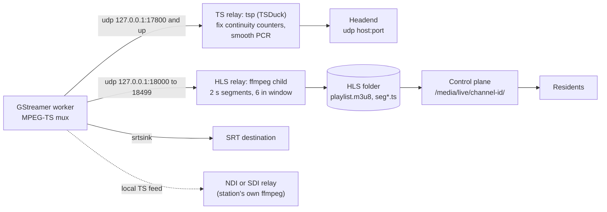

*Figure 16-11. Output paths for one channel. The TS relay is used only for `udp-ts` sinks and only if TSDuck is present. A `file` sink writes the TS stream straight to a file, and is not shown.*

**What this shows.** The GStreamer engine writes these kinds of sink directly: `udp-ts` and `local-ts` (a UDP socket, multicast supported), `srt` (with a passphrase fetched from a stored secret, and refused if the secret cannot be resolved) and `file`. It does not support RTMP; a channel that needs an RTMP sink has to use the older FFmpeg engine. The other kinds of output are made by relays, as follows.

**The TS relay (for cable headends).** Each time a worker is replaced, its multiplexer starts a new MPEG-TS session: new continuity counters and a new source port. A cable plant's monitors log an error at each such change. When TSDuck is installed (it is an optional part of the server pack) and the channel has a `udp-ts` sink, the encoder instead sends to a loopback port (counting up from 17800), and a channel-lifetime `tsp` process rewrites the continuity counters (`continuity --fix`), re-stamps the PCR (`pcradjust`) and sends to the real destination from a fixed source port. The headend therefore sees one unbroken session even if a worker has to be restarted. The mode is `CIVICCAST_TS_RELAY` (default `auto`: relay when `tsp` is found, and otherwise warn and send direct). `on` requires the relay but still passes the stream through rather than take the channel off air. Cable headend presets built into the program (`generic-udp-spts`, `comcast-mtd-sd`, `comcast-mtd-hd`, `telvue-hypercaster-ip`, `harmonic-spectrum-ts` and `leightronix-file-drop`) each set the encoder profile and the output sink and set the channel loudness target to -24; none of them has field proof. A seventh, local rehearsal profile only adds a web-preview HLS sink and leaves the encoder profile and loudness alone.

**The HLS relay (for residents and the portal).** The shipped GStreamer runtime contains no HLS element that can write segments and a playlist, so the HLS output is made another way. The `hls` sink is rewritten to a local UDP sink on `127.0.0.1` (a port from 18000 to 18499 chosen from the sink's address). A supervised ffmpeg child reads it, copies the video and sound without re-encoding, and writes two-second segments (`seg%09d.ts`) with a six-segment (12-second) sliding window into the sink's folder, deleting old ones. A publisher thread copies the private playlist to `playlist.m3u8` every quarter of a second. The control plane serves that folder at `/media/live/<channel>/...`. The route refuses a folder it does not consider safe to serve. The window length depends on the encoder's keyframe interval: with a longer interval, the segments are longer than two seconds.

**What the HLS relay does when it goes wrong.** A running process is not the same as a working output, so the supervisor looks at the playlist itself.

- A playlist that has not advanced for 30 seconds is judged stalled, and the relay child is restarted once (a one-shot self-heal). A fresh child gets 20 seconds' grace before it is judged.
- A child that starts while its input has no video (or no sound) would otherwise fix its output to the streams it saw and serve a half program for hours. The relay therefore requires every stream the sink carries, and checks that the newest segment holds both picture and sound after any restart; it retries three times quickly, then once a minute.
- If the playlist is still frozen 30 seconds after a self-heal, the daemon restarts the worker (at most three times an hour; Figure 16-7).
- Each relay child's error output is kept in `C:\ProgramData\CivicCast\data\egress\<channel>\logs\hls-relay.<sink>.stderr.log` (5 MiB, current and one previous), because evidence was lost in the earlier incidents that led to this design.
- The daemon can also reclaim a relay's UDP port from an orphaned relay process left by a control plane that died, killing it only if its command line matches the relay's exact input address and it is not a process the daemon owns.

**NDI and SDI.** NDI and SDI outputs depend on software the station brings itself. NDI cannot be bundled because of its licence, and SDI needs Blackmagic's driver and an ffmpeg build with the DeckLink muxer. When `CIVICCAST_NDI_FFMPEG` or `CIVICCAST_SDI_FFMPEG` names such a build and the channel has an NDI name or SDI device set, a separate supervised process reads the channel's local transport stream and republishes it as NDI or sends it to the card. It is a separate process on purpose: a dying relay must never take a cable channel off air. A relay that stops restarts after 5 seconds, then 15, then 60.

> **Note (beta.11 verification boundary):** The current verification record states whether any physical DeckLink SDI capture/output, real cable-headend acceptance or NDI interoperability was exercised for this exact package. A transport-stream capture inside Windows Sandbox is not the same as a headend accepting the signal.

**Live takeover.** An operator can put a live network source (SRT, UDP, RTMP, RTSP or HTTP) on air in place of the schedule, and hand it back. The control plane first writes an audit record, then queues a `takeover` command. Before either, it requires the live source to have been observed ready within the last 30 seconds (adjustable from 5 to 300 seconds); it re-probes if the observation is older, and refuses if anything is uncertain. The takeover is carried out as a seamless reload of the worker's source, not as a switch to a separate live input. While a takeover or a forced slate is active, the automation does not roll the channel over to the scheduled plan, so it does not fight the operator.

**The record of what aired.** At every actual change of source the daemon writes an as-run row: what was on, which asset, and when it began and ended (the slate and filler are labelled as such). This is the station's proof of performance. It is written through the local journal described under Figure 16-4.

<!-- SOURCES: civiccast/egress/ts_relay.py:1-120; civiccast/egress/hls_relay.py:1-140 (design, findings), 251-346; civiccast/egress/sinks.py:100-346; civiccast/egress/gst/bridge.py:78, 282-362; civiccast/egress/ndi_relay.py:1-60; civiccast/egress/sdi_relay.py:1-60; civiccast/egress/relay_reclaim.py (via fact sheet); civiccast/egress/headend.py:52, 358-430 (via fact sheet); civiccast/egress/daemon.py:436-500 (A/V guard, freeze escalation); civiccast/stream/media_router.py:104-105, 287; civiccast/egress/takeover_service.py:138-242; civiccast/egress/supervisor.py:113-213; civiccast/live/readiness.py:78-113; docs/adr/0025-live-source-observed-readiness.md; docs/adr/0023-asrun-durable-outbox.md; docs/releases/v1.0.0-beta.10-verification.md (Gate A packet capture); egress fact sheet subagent sections 7-9 -->

## Who may do what: sign-in and roles {#arch-auth}

CivicCast decides who a caller is in the control plane, with a bearer token, and what they may do with a role. Figure 16-12 shows how an operator signs in at the console and how a request is checked.

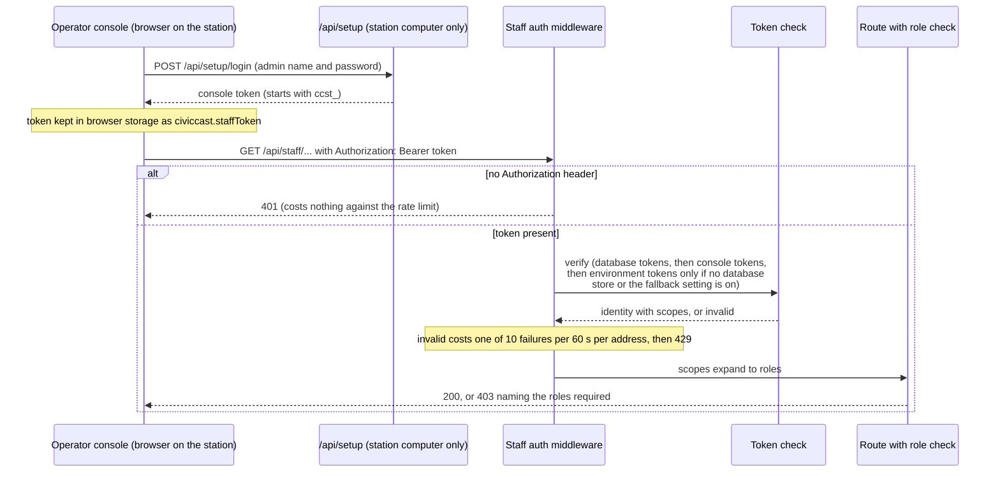

*Figure 16-12. Sign-in and request authorization.*

**What this shows.** There is no separate login page. Sign-in is on the First Setup screen. The first time, the administrator creates a name, a password and eight one-time recovery codes. Afterward, `POST /api/setup/login` with that name and password returns a new console token for that browser, without signing out any other browser. The browser sends the token on every request. The middleware looks at every path that begins with `/api/staff/`; every other path is open, and each route decides for itself. The three token kinds are:

| Kind | Looks like | Kept as | Used for |
| --- | --- | --- | --- |
| Console token | `ccst_` plus a random string | a salted HMAC-SHA256 in `station-state.json`; at most 20 at a time, oldest dropped first | people at the operator console |
| Lifecycle token | `ccst_` plus an id and a secret | a PBKDF2-SHA256 hash (210,000 iterations) in the `staff_tokens` table, with an audit table | scripts and the command line (`civiccast token issue`, `list`, `revoke`, `rotate`); can be revoked and rotated |
| Environment token | `ccenv1_` plus a random string | listed in `CIVICCAST_STAFF_TOKENS` with its roles | fixed configuration; cannot be revoked until it is removed from the setting; on a station that has the database token store it is accepted only when `CIVICCAST_STAFF_TOKENS_FALLBACK_WITH_DB=1` is also set |

The five roles are `setup_admin`, `meeting_operator`, `records_clerk`, `publish_operator` and `support_admin`. A token carries scopes, and the scopes expand to roles (`admin` and `operator` each mean all five). A token with no scopes has no roles. Each route lists the roles that may use it; one matching role is enough, and a wrong role gets a 403 that names the roles by their identifiers. In outline, from a scan of the route decorators (most of the roughly 490 operations in the API inventory name a role; the rest are open to any signed-in token, are public, or are checked inside the route; we did not re-count them for this edition): setup administrators configure the station, cable, graphics, playout and recording; meeting operators run live sessions, agendas, the program log and the facility; records clerks review captions, summaries and agendas; publish operators manage publishing, the schedule, program guide exports and moderation; and support administrators handle support bundles, reports and read-only alerts. The Appendix on roles has the full table. The navigation menu hides screens a role cannot use, but the menu is a convenience, not a security control: the route enforces the rule.

**Where the first sign-in is allowed from.** Sign-in and recovery (and first setup, until it is complete) are admitted by the network address alone: the request must come from the computer itself (a loopback address). They check no token. Opened from another computer, they answer 403. A person on a Remote Desktop session to the station is signing in from the station's own browser, so it works; the code only looks at the connection's address and we did not test a remote-desktop viewer for this chapter.

**Why it is built this way.** The design assumes one trusted station computer and a small number of people. There is no network-facing login, so there is no network password to guess; the cost is that all remote use goes through a remote-desktop session. Failed token checks are rate-limited by the direct peer address (forwarded-address headers are ignored); a request with no header at all is not counted, so a signed-out browser that loads the console cannot lock itself out.

> **Known issue (beta.11):** In a normal station, everyone who signs in at the console is the first administrator, and so has all five roles. The console has no screen to add a person, change a role or paste a token, and no way to give someone a smaller role. Role-limited use is possible only with a token made at the command line or (when `CIVICCAST_STAFF_TOKENS_FALLBACK_WITH_DB=1` is also set) in the environment; the console has no field for pasting a token.

> **Warning:** The control plane serves plain HTTP on the loopback address. The program has a local certificate authority that can issue certificates for `civiccast-api` and `civiccast-worker` and a readiness check that reports on it, but nothing in the code uses those certificates to encrypt a connection or to check a client. Do not describe the station as using mutual TLS. The database connection is also plain, on loopback. If you place a reverse proxy in front of the control plane, it becomes responsible for encryption and for who may reach the staff routes; the program's own note on the setting `CIVICCAST_AUTH_ACK` only silences a start-up warning and enforces nothing. Console tokens are kept in the browser's local storage, so closing a browser does not sign out; there is no expiry time on console or lifecycle tokens in the code we read, and a token ends only on sign-out, revocation or being displaced by newer sign-ins.

## Installing and activating {#arch-install}

The installer is a standard Windows setup program built with Tauri and NSIS, with a series of steps (called *hooks*) that do the real work. Setup runs elevated (as an administrator). Figure 16-13 shows the steps in order.

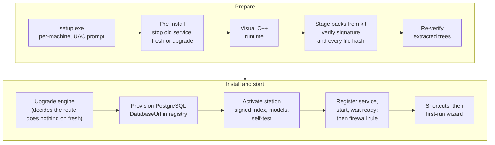

*Figure 16-13. Installation and activation. A failure after the new files are in place tries to stop the service and set it to manual start (best effort), then exits with a numbered code.*

**What this shows.**

1. **The kit.** The installer expects a folder holding `setup.exe`, a `packs` folder of signed `.ccpack` files and a `station` folder with the signed station index and the model packs. There is no download in this elevated phase: if the packs are not beside `setup.exe`, stage-packs fails (exit 110) and setup tells you which packs are missing.
2. **Packs and signatures.** A `.ccpack` is a ZIP file with a manifest listing every file's SHA-256 and size, and an Ed25519 signature over that manifest. The installer carries the public key it will trust (a development key is refused unless explicitly allowed). It checks the signature, every file and the component name and version before it extracts anything, then checks the extracted tree again. Four runtime packs are required: the server binaries (PostgreSQL tools, and TSDuck if included), the application payload (Python, CivicCast and both web apps), ffmpeg and Ollama. The fifth runtime pack, NVIDIA CUDA libraries for Whisper, is optional. The signed station bundle also contains six station packs, including Whistle, the Medium Whisper floor and AI models.
3. **The database.** Provisioning creates a PostgreSQL 17 cluster with `initdb` in `C:\ProgramData\CivicCast\data\pgdata`, writes a configuration that listens on `127.0.0.1` only, creates the `civiccast` database and the `civiccast_svc` role with a generated password, picks the first free port of 5432, 5433, 5434, 5435 and 5544, restricts the data folder's access list, and writes the connection string to the registry where only SYSTEM and administrators can read it. A provisioning run that ends in failure is not retried; it leaves a recovery document in `provision`. Provisioning also refuses to continue if the older WSL-based edition is registered, or if it cannot tell which edition owns the machine.
4. **Activation.** Activation verifies the signed station index and each station pack's signature, size and hash, checks that there is room (the sum of the pack sizes plus 2 GB), extracts Whistle, Whisper and the AI models, and then runs a *self-test* before it declares the station activated. The self-test runs the Whisper caption model on a bundled sample recording (the text must contain the expected words), starts a private Ollama and checks its version, and sends test prompts to each AI model; per the installer inventory it also checks that embedded Python, PostgreSQL and ffmpeg run. Only then does it write `station-set.json` and `activation-self-test.json`. The service will not start the station without them.
5. **The service.** Setup registers `CivicCastSupervisor`, starts the service and waits up to 180 seconds for the station to answer `/health` with a current database schema, then adds the firewall rule, writes the installed version to the registry and creates Start Menu and Desktop shortcuts that open `http://127.0.0.1:8000/operator/`.
6. **The first-run wizard.** After setup, a non-elevated window checks the computer's hardware, shows the components the station still needs and downloads selected optional Large Whisper and CUDA files if missing. The signed setup supplies Whistle and the Medium Whisper floor. The wizard may preselect Large and CUDA for an NVIDIA graphics card with at least 8 GB of video memory; CUDA accelerates Whisper, not Whistle.

| Step | Setup exit code when it fails |
| --- | --- |
| Pre-install: could not stop the old service | 120 |
| Stage packs: required pack missing or untrusted | 110 |
| Verify extracted server binaries, app payload, ffmpeg, Ollama | 111, 112, 121, 122 |
| Provision the database | 116, 117; 127 or 135 if another CivicCast edition owns the machine |
| Activate: index or pack could not be verified; self-test or space failure | 123 (the activation tool itself exits 66, 67, 78, 64 or 65) |
| Register the service; start it and wait | 118; 126 if it will not start; 125 if it starts but does not serve |
| Firewall rule | 119 |

Each of these steps writes a time-stamped line before and after to `C:\ProgramData\CivicCast\install-progress.log`.

**Why it is built this way.** Every pack is signed and checked twice because the installer runs with full rights and the packs contain programs that will run as `LocalSystem`. The self-test exists so a station that looks installed but cannot caption or summarize is stopped at setup rather than discovered at the first meeting. The service refuses to start without the activation records for the same reason.

> **Known issue (beta.11):** When the activation self-test fails, the dialog tells you to find the cause in `install-progress.log`, but the cause is shown only in the setup details pane, and exit 67 is also used for a full disk. A new install on a computer with a surviving data folder is handled by resetting the database password. Package-specific clean-install and upgrade evidence is in the current verification record; source behavior here does not imply either path was exercised. See [Chapter 10](#ch-installing).

## Updating, and going back {#arch-upgrade}

Running a newer `setup.exe` over an existing station upgrades it. The upgrade engine, a Python program in the new package, takes over after the new files are in place. Figure 16-14 shows its steps and what happens if one fails.

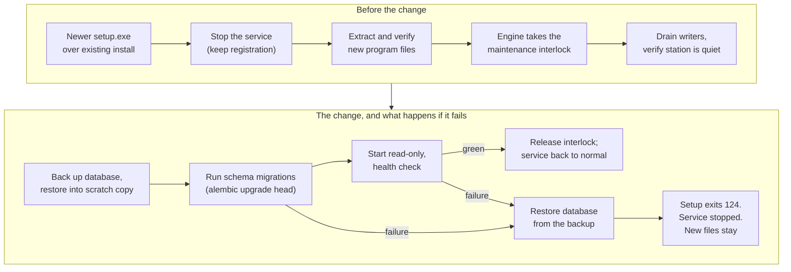

*Figure 16-14. Upgrade and rollback.*

**What this shows.** The engine runs a series of steps and writes a *journal* after each one, so that a run that is interrupted can be resumed. It first takes the *maintenance interlock*, a flag in the registry that the supervisor reads to start the station read-only. It stops writers and checks that the database is quiet, then takes a full backup and proves it by restoring it into a scratch database and comparing rows, checksums and the schema revision. If that proof fails, nothing has been changed and the upgrade stops. It runs the migrations, starts the new code in maintenance mode, which brings up the database and the control plane and starts no video worker, and checks that the station is healthy. Only then does it release the interlock.

If the migration itself, or a step after it, fails, the engine restores the database from the backup. (A failure before the migration changes nothing in the database, so nothing is restored.) If the restore itself fails, the engine halts with the service stopped, keeps the backup and the journal, writes `UPGRADE-RECOVERY.md` and setup exits 113. A new release can also declare that its migration cannot be reversed; the engine then refuses to upgrade automatically (the engine exits 30, which setup reports as exit 114). The setup script does not appear to pass the flag that declares such a migration, so we did not see this refusal happen. An older setup over a newer install is refused outright (exit 129), because the database is not moved backwards.

**What a rollback does not do.**

- **It does not put the old program files back.** In the layout the installer uses, the new files are extracted into the one `runtime` folder before the engine starts, so there is no previous folder to return to. After a rollback the database is the old version's, the files on disk are the new version's, and the service is left stopped. The recovery document says to run the old version's `setup.exe` over the machine before starting the service.
- **The backup does not contain your recordings.** It is a database dump with an integrity manifest, saved in `C:\ProgramData\CivicCast\upgrade\backups\pre-<version>`. The upgrade does not touch `data\uploads`, but the backup does not protect it either.
- **A failed upgrade blocks the next one.** The journal of a run that ended in failure makes later runs stop (exit 128) until someone moves `upgrade-journal.json` aside; nothing removes it automatically.
- **There is no manual restore tool in setup.** The exit 114 message mentions a manual path with operator acknowledgement; we did not find the steps for it.

> **Warning:** Check the current beta.11 verification record for upgrade evidence tied to the exact package. Before any upgrade, take a full backup (the database and the whole of `C:\ProgramData\CivicCast`, plus the files in the note under Figure 16-4) and keep the station's recovery path available.

## Building and publishing a release {#arch-release}

This is about how the files you download came to exist, and what checks stand behind them. Figure 16-15 shows the chain.

```mermaid
flowchart LR
    LK["Lock files<br/>versions, sizes,<br/>SHA-256"] --> PR["Provision toolchain and<br/>runtime, verify hashes"]
    PR --> BD["Build app payload, GStreamer<br/>closure and packs"]
    BD --> SP["Sign packs<br/>Ed25519"]
    SP --> BS["Build installer<br/>with release trust root"]
    BS --> TB["Trust-bridge check:<br/>installer verifies each new pack"]
    TB --> AS["Sign setup.exe<br/>Azure Trusted Signing"]
    AS --> GA["Consumer verification<br/>Sandbox or physical-host evidence"]
    GA --> PB["Draft release, verify<br/>assets, publish"]
```

*Figure 16-15. The release chain, from pinned inputs to a published release.*

**What this shows.**

- **Pinned inputs.** Three lock files fix every external input: the runtime dependencies (ffmpeg n8.1.2 LGPL shared build, Node 24.15.0, Ollama 0.30.6, PostgreSQL 17.10-2 and TSDuck 3.44), the build toolchain, and the AI models (gemma4:12b, gemma4:e4b and translategemma:4b, each with its manifest and blob digests). A download is admitted only if its size and SHA-256 match.
- **The build refuses a dirty tree** and binds itself to one full commit identifier. It builds a GStreamer runtime closure and verifies it, builds each pack and signs it with an Ed25519 key held as a build secret, deleted afterward.
- **The trust-bridge check** runs the compiled installer's own code on the freshly signed packs, so a signing mistake is caught before anything is published.
- **Authenticode.** `setup.exe` is signed through Azure Trusted Signing (the key never leaves Microsoft's hardware), with an RFC 3161 timestamp, and the build fails unless Windows reports the signature as `Valid`. Checksums are regenerated from the signed file. Windows may still show a SmartScreen prompt, which is a matter of reputation, not signature.
- **No Sigstore or cosign.** The owner decided against them (ADR 0022). Provenance rests on the Authenticode signature, the Ed25519 pack signatures and the published checksums.
- **A software bill of materials** and a licence list are generated for the runtime and the application payload. The build refuses to produce them if any file has an unknown licence, and it rejects GPL-licensed GStreamer components.
- **Gate A** is one Windows Sandbox acceptance protocol. The current publisher also accepts physical-host verification receipts through a separate path; it then creates a draft release, checks the asset names and sizes, publishes it and records the result.

**Where beta.11 stands against this chain.** The current package evidence and limits are recorded in the verification file above. An earlier published-package refresh and the separate dev7 soak are historical results, not substitutes for the latest package record.

## Two example stations {#arch-topology}

CivicCast runs one station on one computer. Figure 16-16 shows two realistic shapes, a small station with one computer and one or two channels, and a larger station with more channels and more equipment around the same single computer.

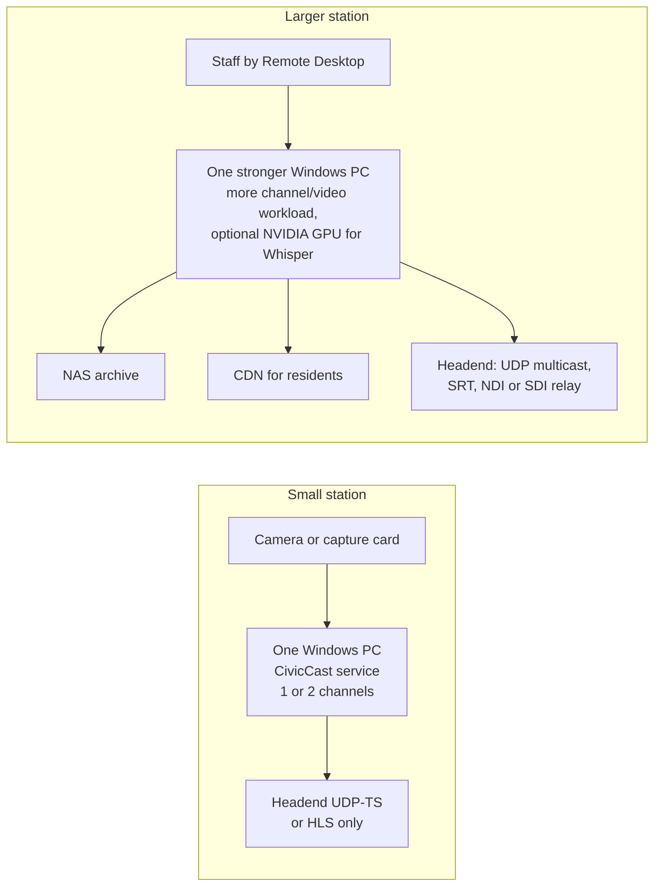

*Figure 16-16. Two reference topologies. Both are one computer; the larger one adds equipment around it.*

**The small station.** One Windows computer with the service installed, an audio and video source (a capture card, or a network camera or encoder), and one or two channels. Staff use the console in a browser on that computer. Residents reach recordings and the live channel through the portal, which as shipped listens only on the station computer itself (see the known issue under Figure 16-1). The live HLS folder is served by that same web server, so we could not confirm how residents on other computers would reach it without a CDN copy or other equipment in front of the station. Native live captions use Whistle on CPU by default, with one primary request at a time across station channels. GPU acceleration is optional for Whisper fallback and recorded captions. Live audio remains best-effort and can be shed under overload (Figure 16-10).

**The larger station.** More channels and more video work share the same computer, so size the CPU and storage for the station's actual workload. An optional supported NVIDIA card and staged CUDA runtime can accelerate Whisper when used for recorded captions, fallback or direct live-primary mode; it is not required for Whistle. The original beta.10 eight-hour run and the separate dev7 soak describe earlier runtime history, not current-package capacity. A network storage target receives archive copies. A CDN, once turned on, serves the recorded video. A cable headend takes a UDP transport stream (unicast or multicast; if TSDuck is installed, its relay holds one continuous session across worker restarts) or an SRT feed; NDI and SDI outputs depend on an ffmpeg build the station brings itself, because the NDI and Blackmagic software cannot be bundled. Staff who are not at the machine use Remote Desktop to reach the console, because the console only works from the station itself.

**What CivicCast does not do at any size.** It does not run one station across several computers. The control plane, the event bus, the rate limiter and the workers are all in one process on one computer; there is no failover computer and no shared database for a second control plane. If the one computer fails, the channels on it go off air until it is back. Long-duration capacity for the exact beta.11 package, real cable-operator acceptance, and physical SDI capture and output remain subject to the current verification record.

<!-- SOURCES: civiccast/auth/middleware.py:1-153; civiccast/auth/tokens.py:152-215; civiccast/auth/roles.py:14-100; civiccast/auth/rate_limit.py:66-105; civiccast/installer/router.py:1211-1263, 1353-1500; civiccast/installer/station_state.py:76, 645-842; civiccast/certs/authority.py; civiccast/app.py:2542-2549; inventory/screens/_shell-signin-and-session.md; inventory/screens/_shell-navigation-and-roles.md sections 3 and 5; ops fact sheet (app/auth); inventory/screens/installer-nsis-setup-wizard.md, installer-nsis-packs-and-verify.md, installer-nsis-upgrade-database.md, installer-nsis-activation-selftest.md, installer-nsis-service-finish.md, installer-component-catalog.md, installer-gui-checking-computer.md; civiccast/apps/installer/src-tauri/nsis-hooks-bootstrap.nsh (via fact sheet); civiccast/installer/native_packs.py:33-35, 232-252, 333-339; civiccast/native/provision/__main__.py:716-718, conf.py:62-135, port_select.py:140; civiccast/native/upgrade/orchestrator.py:19-30, 168-330, 410-445, 530-560; civiccast/native/upgrade/models.py:29-69; civiccast/native/upgrade/seams.py:100-215, 377-430; .github/workflows/native-beta-candidate-artifacts.yml; .github/workflows/sign-native-installer.yml; scripts/release/publish_beta_candidate.py (via fact sheet); native-windows-*.lock.json; CODE_SIGNING_POLICY.md; docs/adr/0022-sigstore-attestation-denied.md; civiccast/native/runtime_manifest.py; civiccast/native/runtime_closure.py; docs/releases/v1.0.0-beta.10-verification.md; civiccast/captions/tap_worker.py (default_max_channel_workers) -->

## What CivicCast does not do yet {#arch-gaps}

A technical reviewer should read this list before relying on the design. Each item is something we found in the code or in the beta.10 record. None of them is hidden in the sections above; they are collected here.

**One computer, one failure domain.**

- CivicCast does not run a station across several computers. The control plane, the event bus, the staff rate limiter and every worker thread are in one process on one computer. There is no failover computer and no way to run a second control plane on the same database. If the computer stops, the channels stop. The supervisor restarts what fails *on* that computer.
- The control plane listens on `127.0.0.1`. Other computers cannot reach the console or portal as shipped, although a firewall rule opens port 8000. Remote staff use Remote Desktop.
- There is no encrypted connection. The control plane and the database use plain connections on loopback. The local certificate authority and its readiness check do not encrypt or authenticate anything.
- The service runs as `LocalSystem`, with more rights than it needs. A least-privilege account is a recorded follow-up.

**People and access.**

- There is one administrator account. The console has no screen to add a person, give a smaller role or paste a token, so role limits are reachable only through the command line or the environment.
- Console and lifecycle tokens have no expiry in the code we read.

**Data protection and recovery.**

- There is no scheduled backup. The pre-upgrade backup holds the database only, not recordings.
- Some state files live outside `C:\ProgramData\CivicCast` (see the note under Figure 16-4).
- Rollback after a failed upgrade restores the database but not the program files, there is no downgrade, and there is no manual restore tool in setup. A failed upgrade's journal blocks later upgrades until it is moved by hand.
- We found no clean-up of the channel command table and no limit on how large the logs and caches under `data\egress` can grow, apart from the conform cache (60 GB default), the plan folders (5 GB), and the relay logs (5 MiB).

**Playout.**

- A channel in `ERROR` does not restart itself. The two output guards stop restarting a channel after three restarts in an hour.
- The GStreamer engine has no RTMP sink, and we did not find per-output loudness or the alert-tone filter in it; both exist only in the older FFmpeg engine.
- Hardware encoding is used only if a channel asks for it by name. The default encoder is a software encoder.
- A first-time program takes time to prepare, and a program change can wait on that preparation (the lead time is 11.5 minutes by default). There was an unexplained rebuild of a long cached program in an earlier internal run, and eleven daemon and automation unit tests fail the same way on the installed tree and the candidate tree; neither is explained.
- A single frame of video was dropped at one join in the lab run, and two program changes aborted and recovered by themselves.
- Command delivery from the staff API to the daemon is at most once, and the channel is driven by polling every 2 seconds.

**Captions, summaries and records.**

- Live captions are off in a new station profile, are English only, and can lose audio under heavy load. Captions embedded in the stream are not proven for CEA-708 broadcast compliance, and a channel whose profile uses HEVC cannot embed captions.
- Offline captions cannot finish without a Spanish review.
- The Internet Archive, NAS and YouTube surfaces are simulated until a provider is set to real. Subscriber notifications and podcasts are not active. ActivityPub is off by default.
- A summary's claims are checked against the cues' identifiers and times, not against their words. The signed-record export carries a placeholder timestamp and no digital signature that we could find.
- The public-safety display reads alerts and shows them; it is not an EAS device and does not relay the legally required EAS signal.

**Time.**

- Several screens treat the times you type as UTC (the Recording screen, and the Program Guide's weekday rules). ADR 0013 planned a station time-zone setting. The code now has one, but those screens still use UTC, and a program that recurs daily or weekly is stepped by fixed 24-hour and 7-day intervals in UTC, so its local air time can move by an hour when daylight-saving time changes.

**Proof.**

- beta.11 is a GitHub pre-release. Its source, hash and evidence scope are in the current verification record. An earlier published-package refresh and separate dev7 overlay soak are historical results. Field operation, real cable-headend acceptance and physical SDI capture/output depend on the current record and the station's own commissioning.

## The design decisions behind the figures {#arch-adrs}

The project records its major decisions as *architecture decision records* (ADRs). The table lists the ones this chapter relies on, the reason each gives, and whether the current beta.11 code still matches. ADRs 0002 to 0007, 0009, 0012 and 0019 were not re-checked for this chapter.

| ADR | Decision | Reason given | Still true in beta.11? |
| --- | --- | --- | --- |
| 0001 | A NATS JetStream message server | durable streams, consumer groups, an open licence | No. Superseded by 0023 |
| 0008 | Synchronous SQLAlchemy 2.0 with psycopg 3, one migration runner with per-module migration folders, schema `civiccast` | the rest of the program is synchronous; N migration runners would be unworkable | Yes |
| 0010 | Live session state changes are conditional `UPDATE`s, forward only: `idle`, `preflight`, `on_air`, `ending`, `recorded` | two operators racing a change must produce exactly one winner | Yes |
| 0011 | Finalization is one transaction; the event key makes it idempotent | a crash must not leave an event with no asset, or two assets | Yes (the code also records trim points) |
| 0013 | Browser time zone for now, a station time zone later | a form without a zone is ambiguous across daylight saving | Partly: the station setting exists, but the ADR was not updated, and some screens treat typed times as UTC |
| 0014 | Loudness target set per channel and per output, not a constant | web and cable expect different levels | Yes for the channel target and the conform; per-output re-leveling is in the FFmpeg engine's code, and we did not find it in the GStreamer engine |
| 0015 | One long-running FFmpeg process with a concat input | the cheapest way to keep one output session across programs | No. The default engine is now GStreamer; ADR 0015 describes the older engine |
| 0016 | A 1280 by 720, 30 fps, 6,000 kbit/s MPEG-TS profile with libx264 | a stable shape at every program change | The profile values are still the default; the code defaults to OpenH264 and does not ship x264 |
| 0017 | Operator commands go through a durable table, polled by the daemon | commands must survive restarts; seconds of delay do not matter | Yes for the table and polling. The ADR describes the daemon as its own long-lived process; in beta.11 it runs as a thread inside the control plane |
| 0018 | Captions are `not-verified` until the emitted stream is decoded and checked | a caption file elsewhere in the product is not proof that captions are in the stream | Yes |
| 0020 | Fastly and Akamai through a generic S3-compatible adapter | one adapter for both | Yes (the CDN factory) |
| 0021 | Native Windows service, supervisor, one Windows product | the WSL cost record; a service starts at boot; WSL cannot reach capture cards | Yes, except that NATS and the "Tauri operator console" statements are out of date |
| 0022 | No Sigstore or cosign attestation | the owner's decision; provenance is Authenticode and pack signatures | Yes |
| 0023 (NATS) | Remove NATS; keep an in-process bus behind an interface | NATS never carried real traffic and was a process, a port, a certificate and a health check | Yes |
| 0023 (as-run) | As-run rows go through a local durable journal first | the proof-of-performance record must survive a database outage | Yes. The journal sits in the service account's profile by default (see Figure 16-4) |
| 0024 | A watch folder never deletes its source files; an unreachable folder is a visible degraded state | never lose a source file; never fail silently | Yes |
| 0025 | A live source is ready only if it has been observed ready, within a time limit (30 seconds by default) | a configured camera that was unplugged for a week looked "ready" | Yes |

> **Note:** Two files in the ADR folder carry the number 0023. They are two separate decisions. The header of ADR 0001 still reads "Superseded by: N/A"; it was superseded by the NATS removal.

## Related {#arch-related}

- [Chapter 9: Planning your station](#ch-planning) for hardware, network and storage.
- [Chapter 10: Installing](#ch-installing) for the steps behind Figures 16-13 and 16-14.
- [Chapter 12: Running it day to day](#ch-operations) for service, logs, backups and updates.
- [Chapter 13: Security and privacy](#ch-security) for the consequences of Figure 16-12.
- [Chapter 14: Troubleshooting](#ch-troubleshooting) for symptoms of the failures in Figures 16-7 and 16-8.
- [Chapter 15: Integrations](#ch-integrations) for headends, streaming, CDNs, federation and the API.

<!-- SOURCES: docs/adr/0001, 0008, 0010, 0011, 0013, 0014, 0015, 0016, 0017, 0018, 0020 (via civiccast/stream/cdn/factory.py), 0021, 0022, 0023 (both), 0024, 0025; docs/releases/v1.0.0-beta.10-verification.md (known limits 1-6, what is not proven); ops/docs-sprint/inventory/screens/installer-install-layout.md (HELP-102); inventory/screens/recording.md and guide.md (UTC); civiccast/installer/station_state.py:216-258 (station time zone); civiccast/native/upgrade/orchestrator.py:410-445, 530-560; civiccast/dr/backup.py; civiccast/egress/daemon.py:436-500; civiccast/egress/store.py:436-458 (at-most-once); civiccast/egress/preparer.py:23, 144; civiccast/egress/hls_relay.py (log cap); app-auth-db fact sheet sections 2, 5, 6 -->
