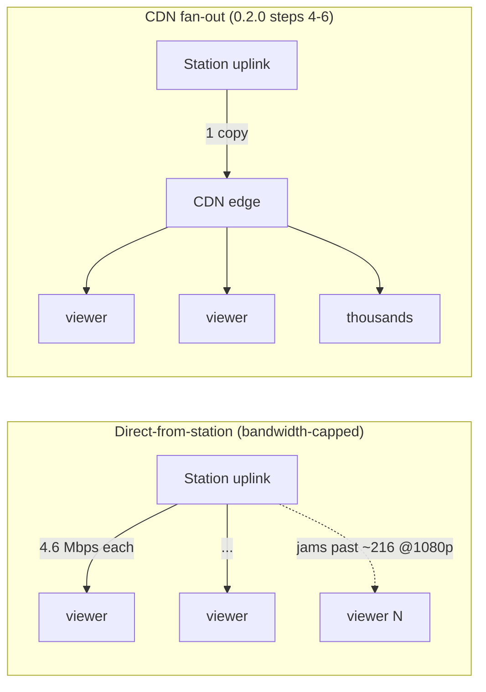

<!-- SPDX-License-Identifier: Apache-2.0 -->
# 0.2.0 — How many viewers can a station serve *directly*?

**Status:** measured result (0.2.0 step 3). Lab/software measurement on one
machine — no station hardware exists yet. Pairs a measured server-capacity
sweep with a code-derived bandwidth ceiling.

---

## Bottom line

A CivicCast station that streams **straight to viewers from its own building**
is limited by **its internet upload speed, not by the software**.

- On a **1 Gbps** connection (fast municipal fiber, e.g. Longmont NextLight),
  a station can serve about **216 people watching in HD (1080p)** at once.
- On a more typical **100–500 Mbps** station connection, that's about
  **21–108 HD viewers**.
- The CivicCast software itself is **not** the bottleneck: in the load test the
  real serving code handled **400 simultaneous viewers with zero stalls** and
  sub-second join times, on a single shared CPU core.

So the ceiling is the pipe, not the program. A hot council meeting can draw
thousands of viewers — far past what any single upload link can push. **That is
exactly why 0.2.0 adds CDN fan-out** (steps 4–6): the station uploads *one*
copy to a content-delivery network, which then serves the crowd.

---

## For station operators

Think of your station's internet upload speed as a doorway. Each HD viewer needs
about **4.6 Mbps** of that doorway held open for them, continuously. Divide your
upload speed by that and you get roughly how many direct viewers fit before the
doorway jams and everyone starts buffering.

| Your upload speed | HD (1080p) viewers | 720p viewers | 480p viewers |
|---|---|---|---|
| 100 Mbps | ~21 | ~38 | ~91 |
| 250 Mbps | ~54 | ~95 | ~228 |
| 500 Mbps | ~108 | ~190 | ~456 |
| 1 Gbps | ~216 | ~380 | ~912 |

Two takeaways:

1. **Under ~100 viewers, direct-from-station is fine** — a routine meeting,
   a public-access show. No CDN needed.
2. **For a packed, contentious meeting** (hundreds to thousands watching),
   direct serving *cannot* keep up on any single connection. You need a CDN,
   and 0.2.0 is building the switch that turns one on automatically when the
   audience surges.

Lower-quality streams (720p/480p) stretch the same pipe much further, which is
why the player automatically drops resolution before it drops the viewer.

---

## For IT / engineering

### What was measured, and what wasn't

Two different ceilings bind "direct-from-station" HLS delivery. They are
measured differently on purpose:

| Ceiling | Bound by | How we got it |
|---|---|---|
| **Server capacity** | the box's event loop + file serving keeping up with N viewers per 2s cadence | **measured** — ramp against the real router |
| **Bandwidth** | segment bitrate × viewers vs the station uplink | **computed** — loopback has no uplink bottleneck, so it *cannot* be measured locally |

Loopback can never exhibit the bandwidth ceiling (there is no uplink to
saturate), so honesty requires computing it rather than pretending a local
number is a field number. The results doc reports both.

### Server-capacity ramp

A synthetic **rolling station** (`civiccast/load/lab.py`) writes `seg%09d.ts`
segments and a `playlist.m3u8` on the real 2-second cadence, sliding the window
exactly as ffmpeg's hls muxer does, and serves them through the **real**
`civiccast.stream.media_router.live_router` — traversal guard, content types,
live cache-control and all. `civiccast/load/hls_load.py` then ramps emulated
HLS viewers against it.

The ramp runs **in-process over `httpx.ASGITransport`**: the emulated viewers
and the ASGI app share one event loop on one core. This makes the number a
deliberate **lower bound** — a real deployment does not co-locate load
generation with serving, and would have more headroom. If viewers stay healthy
here, they stay healthy in the field.

```
 viewers  stall%   seg_ok   hard   slow   p50_ms   p95_ms  agg_mbps
-------------------------------------------------------------------
      10   0.00%       90      0      0       23       33      18.3
      50   0.00%      450      0      0       90      111      90.8
     100   0.00%      900      0      0      170      263     179.6
     200   0.00%     1800      0      0      350      402     312.9
     400   0.00%     3600      0      0      848      911     552.6
```

- **Zero stalls** — hard (segment rolled out of the window before fetch) or soft
  (fetch slower than one segment duration = falling behind live) — at every
  level through **400 concurrent viewers**.
- **Join latency** rises with load (p50 23 ms → 848 ms; p95 33 ms → 911 ms) but
  stays **under the 2-second segment interval even at 400 viewers**, so no
  viewer is behind live.
- `agg_mbps` is in-process (loopback/memory) throughput of 200 KB test segments;
  it confirms real bytes moved but is **not** a network measurement. Segment
  size is kept small on purpose so this ramp isolates *request-handling*
  capacity; byte-volume capacity is the bandwidth ceiling below.

**Conclusion:** request/CPU handling is not the binding constraint at the scales
that matter for a station. The binding constraint is bandwidth.

### Bandwidth ceiling (code-derived)

Max concurrent direct viewers = ⌊uplink ÷ per-viewer bitrate⌋. Per-viewer
bitrate is derived from the shipped encoder ladder
(`civiccast.stream.config.ABR_LADDER`) via `render_bandwidth_table`, so this
table cannot drift from what the station actually encodes:

| Rendition | Mbps/viewer | 100 Mbps | 250 Mbps | 500 Mbps | 1000 Mbps |
|---|---|---|---|---|---|
| 1080p | 4.628 | 21 | 54 | 108 | 216 |
| 720p | 2.628 | 38 | 95 | 190 | 380 |
| 480p | 1.096 | 91 | 228 | 456 | 912 |
| 240p | 0.414 | 241 | 603 | 1207 | 2415 |

Even the fastest realistic municipal link (1 Gbps synchronous) tops out at
**216 direct 1080p viewers**. A contested public meeting can draw thousands.
The gap is unbridgeable by a single uplink at any encoder setting a real viewer
would accept, which is the load-bearing justification for the 0.2.0 CDN work.

### Why these two numbers don't contradict

The ramp shows 400 viewers served cleanly; the bandwidth table caps 1080p at
216 on 1 Gbps. Both are true: the ramp used 200 KB segments (~0.8 Mbps/viewer),
so 400 viewers ≈ 320 Mbps of bytes — under 1 Gbps, and on loopback there is no
uplink cap anyway. The ramp measures whether the *code* can schedule and serve
many concurrent viewers (it can); the table measures whether the *pipe* can
carry them (past ~216 at 1080p, it can't). Different limits, measured with the
right tool for each.

### Topology



### Reproduce

```
# server-capacity ramp (writes the JSON used above)
python -m civiccast.load.lab --viewers 10,50,100,200,400 --duration 8 \
    --uplink-mbps 1000 --per-viewer-mbps 4.628 --json-out ramp-1080p-1gbps.json

# the bandwidth table
python -c "from civiccast.load.lab import render_bandwidth_table; \
    print(render_bandwidth_table([100,250,500,1000]))"
```

Both are covered by `tests/load/` (mypy-strict + ruff green; window-eviction and
manifest logic falsification-verified by mutation).

---

## What's next (0.2.0 steps 4–6)

1. **Live CDN publish path** — extend the built VOD upload to rolling live
   segments so the station pushes one copy to the edge.
2. **Surge switch + delay buffer** — watch concurrent load; when it approaches
   the direct ceiling, switch residents to the CDN edge behind a ~15 s buffer.
3. **OpenTofu R2 module** (MPL-2.0, open-source-first) — provision the edge, then
   re-run this same harness CDN-fronted and publish the second result set.
