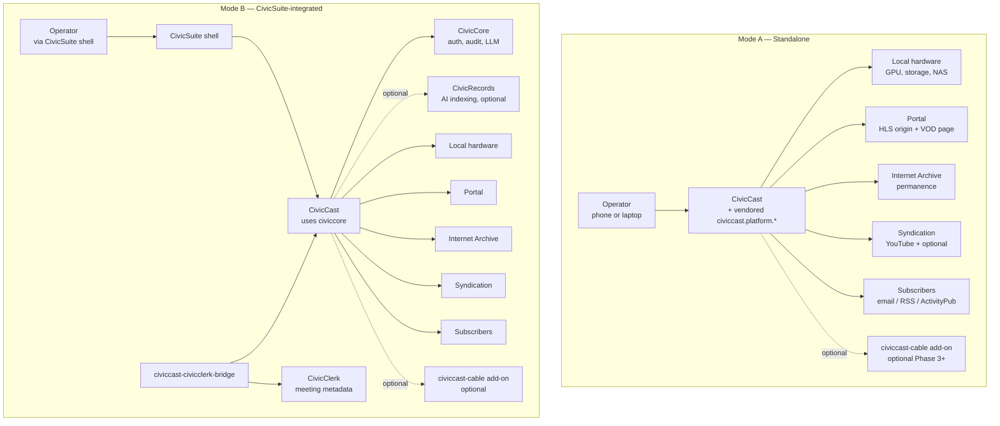
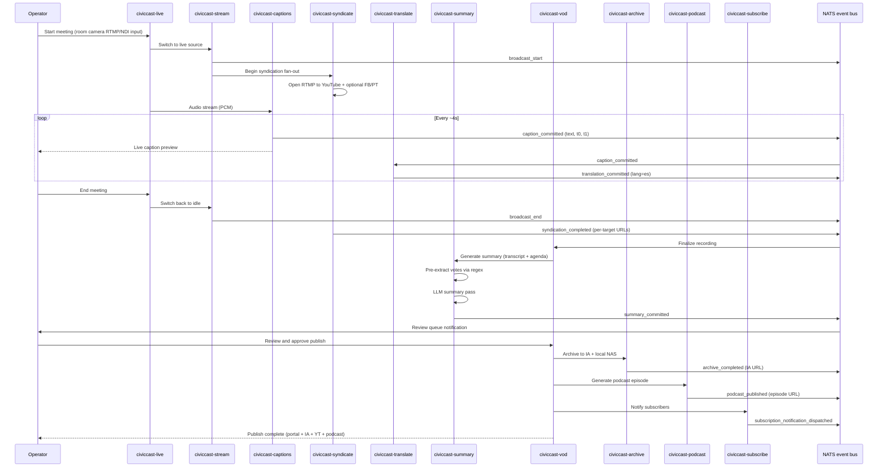
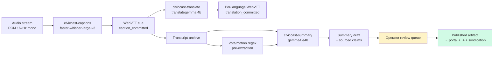
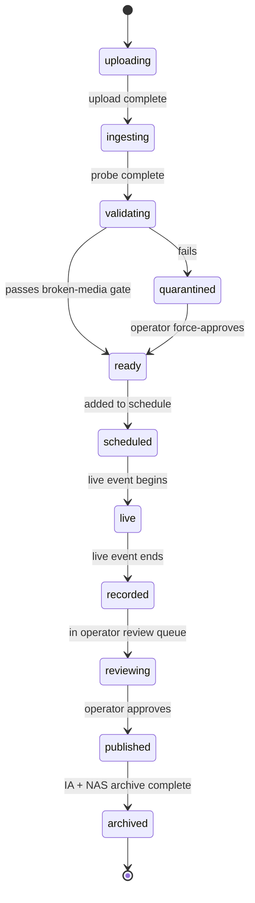
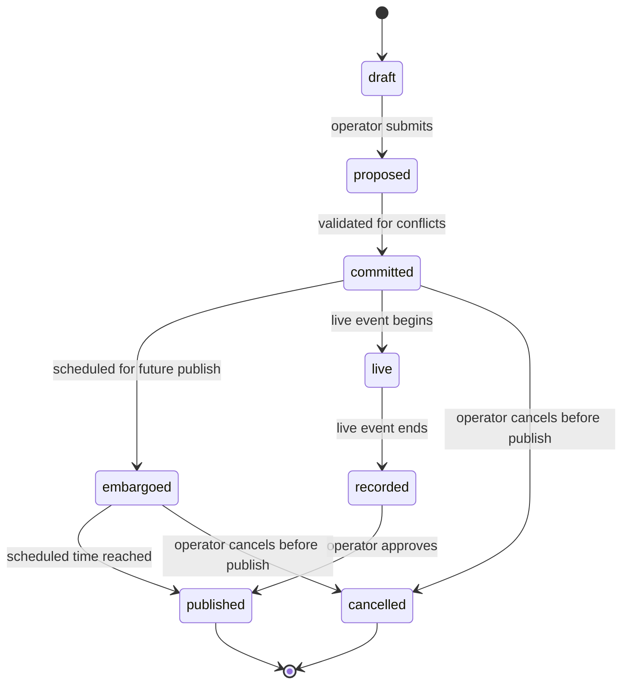
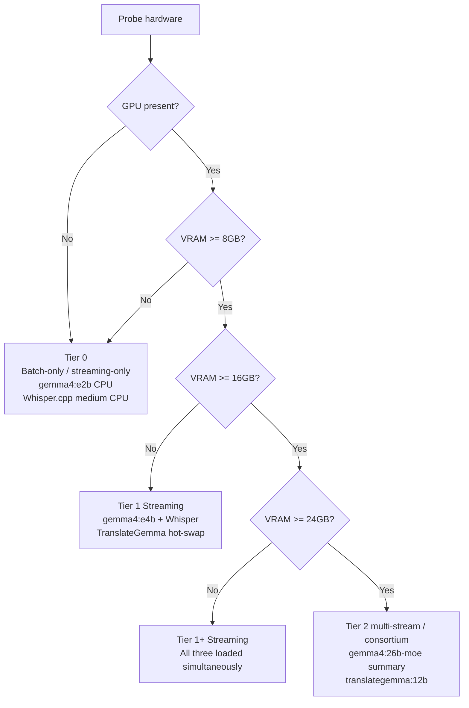
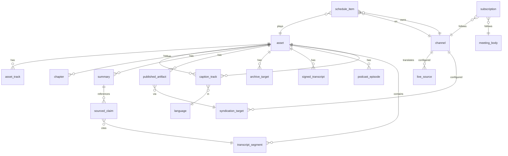

# CivicCast — Unified Specification

**Version:** 2.0 release specification (HISTORICAL -- pre-reset; superseded by the 2026-07-06 version reset)
**Status:** Historical. Superseded by the current release line (now v1.0.0-rc18) and by the current spec at `docs/spec/3.0/civiccast-3.0-station-in-a-box-MASTER.md`. The v2.1.0 evidence this document cites predates the reset; see `docs/releases/archive/pre-reset/v2.1.0-scope-and-evidence.md`. Retained for historical reference only.
**License:** Apache 2.0 (code) / CC BY 4.0 (documentation)
**Audience:** Public-interest broadcasters and civic-record publishers: small municipalities, school districts, houses of worship, community media organizations, PEG access stations, public agencies, CivicSuite-deploying municipalities, journalists, researchers, watchdog groups, and residents who need public meetings and community broadcasts to remain accessible, searchable, archived, and independent of proprietary platforms. Streaming-only deployments use the core product. PEG stations with franchise-cable obligations use the optional `civiccast-cable` add-on.
**Project posture:** Public-good open-source infrastructure. CivicCast is not a venture product, hosted SaaS product, or appliance business. It is an Apache 2.0 civic infrastructure project built to make modern broadcast, accessibility, archive, and public-record tooling available to any organization that can run or receive help running open-source software.

**Current evidence boundary:** v2.1.0 carries the local clean Windows new-user
path from v2.0.8, local FileSink and loopback SRT channel egress proof from
v2.0.9, and E.2 egress continuity validation against an adversarial software
headend under network impairment from v2.0.10. v2.1.0 adds the beta-sprint
feature set (recording provenance, operator repair surfaces, real trim
repackaging, CDN publishing, config-gated real provider adapters, and a live
caption tap) and a clean-machine double-click Windows install proof that reached
a running service with first-admin and recovery kit on a fresh Windows 11 VM. It
should not be described as fully validated across Windows users, hardware,
downstream cable headends, QAM, SDI/DeckLink, EAS, CEA-708 broadcast compliance,
live external provider delivery, app stores, or production operations until
separate evidence exists. See `docs/releases/v2.1.0-scope-and-evidence.md`.

---

## Table of Contents

1. [Strategic Thesis](#1-strategic-thesis)
2. [Governing Principles](#2-governing-principles)
3. [Three-Audience Reality](#3-three-audience-reality)
4. [Non-Negotiables](#4-non-negotiables)
5. [Standard Module Architecture](#5-standard-module-architecture)
6. [Two-Mode Architecture](#6-two-mode-architecture)
7. [System Architecture Diagrams](#7-system-architecture-diagrams)
8. [Module Catalog](#8-module-catalog)
9. [Data Model](#9-data-model)
10. [Hardware Reference](#10-hardware-reference)
11. [AI Subsystem](#11-ai-subsystem)
12. [Operator Workflows](#12-operator-workflows)
13. [Governance](#13-governance)
14. [License & IP Posture](#14-license--ip-posture)
15. [Security & Privacy](#15-security--privacy)
16. [Reliability & Compliance](#16-reliability--compliance)
17. [Distribution & Operations](#17-distribution--operations)
18. [UI/UX & Design System](#18-uiux--design-system)
19. [Testing Strategy](#19-testing-strategy)
20. [Roadmap & Phasing](#20-roadmap--phasing)
21. [Risk Register](#21-risk-register)
22. [Open Decisions](#22-open-decisions)
23. [Appendix A — CivicClerk Integration Contract](#appendix-a--civicclerk-integration-contract)
24. [Appendix B — Total Cost of Ownership](#appendix-b--total-cost-of-ownership)
25. [Appendix C — Market Evidence & Validation Ledger](#appendix-c--market-evidence--validation-ledger)
26. [Appendix D — Historical Inputs](#appendix-d--historical-inputs)

---

## 1. Strategic Thesis

CivicCast is an open-source, self-hostable broadcast automation platform for schools, houses of worship, community media organizations, small municipalities, and PEG access stations. It is a complete alternative to commercial vendors like incumbent commercial platform, covering live streaming, video-on-demand, captioning, translation, AI-generated meeting summaries, and three-tier publishing — to the station's own portal, to the Internet Archive for permanence, and to syndication targets like YouTube Live for reach. It runs on commodity Linux hardware a station already owns or can buy new for under $2,500. It uses local AI models (Whisper, TranslateGemma, Gemma 4 via Ollama) so captioning, translation, and summarization cost nothing per minute. It keeps everything in open formats the station can walk away with at any time. Apache 2.0 / CC BY 4.0 throughout. No appliances, no per-minute fees, no vendor lock-in.

### 1.1 Public-good infrastructure posture

CivicCast is public-good infrastructure first and a product second. The project exists because the civic broadcast and public-record video ecosystem needs an open, ownable, modern alternative to proprietary appliances, vendor-managed portals, per-minute AI services, and fragile dependence on commercial platforms.

The intended outcome is not that every station adopts every module on day one. The intended outcome is that the full civic broadcast lifecycle becomes available in one open stack: schedule → live stream → caption → translate → summarize → review → publish → archive → notify → search → preserve → prove provenance. Individual deployments choose the profile they need; the commons receives the whole stack.

This changes how the spec should be read. Breadth is not a sign of product bloat when the object is public infrastructure. Breadth is the reason the project matters: no generic livestreaming server, video portal, AI captioning script, podcast generator, or records-export tool solves the whole civic-record problem alone. CivicCast does because the public need is lifecycle-shaped, not feature-shaped.

The platform exists because the community broadcast space is structurally underserved by current commercial offerings. Stations operate on tight budgets, often run with one to three staff, and have been paying vendors for AI services that now run cleanly on a $300 GPU. incumbent commercial platform — the dominant vendor — packages everything as proprietary appliances with annual maintenance contracts, per-minute AI service fees, and managed OTT apps that lock the station's audience inside the vendor's distribution stack. Five-year total cost of ownership for a incumbent platform Tier 1 deployment runs $40,000 to $55,000, dominated by captioning (~$22,000 capped at typical $1,800/month), translation ($3,000–$8,000), summary ($1,200–$3,600), branded streaming apps ($5,000–$10,000), and annual support ($7,500–$15,000). The same workload on CivicCast's Tier 1 Streaming reference hardware runs roughly $4,800 over five years, with no per-minute service fees and no vendor able to discontinue the station's apps.

The strategic wedge is local AI. Whisper-large-v3, TranslateGemma 4B, and Gemma 4 E4B are mature enough as of mid-2026 that this is the moment. CivicCast bets the wedge. Crucially, the wedge does not require cable broadcast — it works identically whether the captions are inserted into 608/708 cable streams or into WebVTT segments on an HLS portal. CivicCast v1 ships streaming-only because that is where the addressable audience is largest, the engineering risk is smallest, and the displaceable vendor cost is concentrated.

Cable broadcast is a Phase 3+ optional add-on (`civiccast-cable`) for stations with franchise-cable obligations. The PEG slice is real and we will serve them — but they will fund the cable add-on through the certified-integrator program rather than have the open-source critical path subsidized for the streaming-first majority.

The strategic spine is two-mode architecture. CivicCast ships as a complete standalone product for the audience that will never adopt CivicSuite — schools, houses of worship, community media nonprofits, small municipalities, and PEG stations choosing the streaming-only path. The same codebase federates into CivicSuite for municipalities that already run CivicCore + CivicClerk, where CivicCast becomes the broadcast distribution layer for civic content the rest of the suite produces. Same binaries, two modes, runtime mode detection. The spec treats this as a first-class architectural axis throughout, not as an afterthought.

The strategic floor is three-tier publish. Every public-record meeting publishes to (1) the station's own portal as the canonical citation surface, (2) the Internet Archive as the permanence guarantee, and (3) syndication targets — YouTube Live and optional others — as the reach layer and capacity insurance during high-stakes meetings. No single platform's editorial decision can orphan a town's meeting archive. No single funder's collapse can take the recordings offline. This three-tier structure is load-bearing and is codified as a non-negotiable principle (§2.6).

The strategic frame is public independence. CivicCast is designed to keep public-interest video from being trapped in four failure modes: proprietary vendor lock-in, platform dependence, inaccessible media, and archive disappearance. A recording that exists only in a vendor portal is not durable enough. A meeting that exists only on YouTube is not public enough. A captionless three-hour video is not accessible enough. A transcript with no provenance is not trustworthy enough. CivicCast treats those as infrastructure failures, not optional enhancements.

### 1.2 Why the whole stack is needed

The market need is not for "a better livestreaming app." The market need is for an open civic media stack that covers the complete lifecycle of public-interest video.

The streaming modules are needed because public bodies, schools, houses of worship, community media groups, and PEG stations must get live events online reliably.

The captioning and translation modules are needed because accessibility and multilingual access are no longer premium features; they are baseline public-service obligations and community inclusion tools.

The summary, chapter, transcript, and search-facing modules are needed because a three-hour public meeting that cannot be searched, skimmed, cited, or understood is only formally public, not practically accessible.

The archive module is needed because public records should outlive a vendor contract, a platform policy change, a failed nonprofit, a station budget crisis, or a hard-drive failure.

The syndication module is needed because residents already live on large platforms and high-stakes meetings need capacity insurance, but those platforms must remain reach surfaces, not systems of record.

The subscription, RSS, ActivityPub, webhook, and podcast modules are needed because public-interest media should build direct audience relationships that do not require residents to depend on YouTube, Facebook, or any single commercial feed.

The signed-records module is needed because public bodies, journalists, researchers, and watchdog organizations need verifiable artifacts, not just links to videos.

The cable add-on is needed because some PEG stations still have franchise-cable obligations. The fact that cable is no longer the primary growth surface does not make it irrelevant; it means cable belongs in an add-on rather than in the streaming-first critical path.

CivicCast therefore ships as one public-good stack with multiple deployment profiles, not as a collection of unrelated features.

## 2. Governing Principles

The principles below are load-bearing. Every architectural decision in the rest of the spec inherits from them. When a future decision conflicts with a principle, the principle wins or the principle changes by formal Working Group resolution — both options are on the table, but neither is "we ignored it for this case."

### 2.1 License posture

CivicCast is licensed Apache 2.0 for code and CC BY 4.0 for documentation. This matches CivicSuite's family-wide posture and was ratified after considering AGPL-3.0 (proposed in earlier drafts to close the SaaS-fork loophole) and rejecting it for family consistency. The Apache 2.0 patent grant is the right protection for civic infrastructure: it permits commercial use, integration into broader platforms (including CivicSuite and third-party hosted offerings), and forking, while granting all contributors and users an explicit patent license that protects them from defensive patent assertion by other contributors. CC BY 4.0 on documentation lets stations excerpt CivicCast docs in their own training materials and public-facing pages without a license review.

### 2.2 Apache-2.0-clean default stack rule

Every default model, library, and runtime CivicCast ships preconfigured must permit commercial use without per-user, per-revenue, or per-deployment carve-outs that a municipal counsel would flag. This rule is the direct lesson from the NLLB-200 mistake (CC-BY-NC-4.0, prohibits commercial use, removed from the spec). Three classes of license are permitted as defaults: OSI-approved permissive (Apache 2.0, MIT, BSD), OSI-approved copyleft for runtime-only dependencies (LGPL, MPL), and the Gemma Terms (commercial-permissive Google model license) explicitly named because Gemma 4 E4B and TranslateGemma both ship under it. Anything stricter than Gemma Terms — CC-BY-NC, custom acceptable-use clauses with revenue thresholds, anything requiring per-deployment registration — is documented as an *alternate* provider in the model registry but never as a *default*. Stations choosing alternates are choosing them with eyes open.

### 2.3 Repository topology

CivicCast lives in a separate GitHub organization, `CivicCast/*`, distinct from `CivicSuite/*`. The two orgs serve different audiences with different governance trajectories and benefit from being branded distinctly so a station evaluating CivicCast does not have to navigate CivicSuite's municipal framing to reach what they need. Mode B integration with CivicSuite is via the published `civiccore` Python wheel — same way any third-party module would integrate — so the organizational separation costs nothing technically. The bridge package `civiccast-civicclerk-bridge` lives under `CivicCast/*` and depends on both `civiccore` and CivicCast's public APIs; neither side has a dependency on the other's internals.

### 2.4 Default model table

The default model selections are the result of the deep research pass documented in §11. Live broadcast workloads have hard latency and accuracy floors that rule out general-purpose multimodal models for caption generation; specialized translation models beat general-purpose LLMs of similar size on translation quality; the summary workload benefits from Gemma 4's 128K context window when meetings exceed three hours. The table below is the canonical set; alternates and cloud fallbacks live in §11.

| Workload | Default | Runtime | License | Notes |
| :---- | :---- | :---- | :---- | :---- |
| Captions (live + batch) | `whisper-large-v3` (INT8) | faster-whisper (CTranslate2) | MIT | 15.95% WER on AMI vs 41.31% for Gemma 4 E4B audio. Whisper stays. |
| Translation | `translategemma:4b` | Ollama | Gemma Terms | RL-tuned for translation; 4B matches Gemma 3 12B baseline quality. |
| Summary | `gemma4:e4b` | Ollama | Apache 2.0 | 128K context. Native function calling. CivicSuite default. |

Hardware tier escalation paths and alternates are defined in §11.5.

### 2.5 Cloud fallback ordering

When an operator opts into cloud fallback for any AI workload — explicitly, with a key entered by hand into the OS credential store, never auto-provisioned — the provider preference order is fixed: local default → local alternate → Anthropic → OpenAI → Google → AWS, where each provider exists for that workload. This order is documented in operator-facing docs so stations know what to expect. Anthropic is preferred among cloud providers for civic content because its published policy posture on government use, content provenance, and refusal-on-uncertainty most closely matches the operator-review-and-publish gate CivicCast enforces locally (§11.7). Cloud providers are never preselected; the operator picks one or none. There is no "auto-fallback to cloud on local failure" path — local failures surface as failures the operator handles, not as silent bill increases.

### 2.6 Three-tier publish principle

Every public-record meeting recording published by CivicCast lands on three independent surfaces, in order of citation authority:

1. **Tier 1 — Portal (canonical).** Self-hosted HLS origin and branded VOD page operated by the station. The URL residents, press, and CivicClerk records cite. The system of record for legal and public-records purposes. Survives any external platform decision.
2. **Tier 2 — Internet Archive (permanence).** Required publish target, peer to the portal, not a fallback. The Internet Archive is the only entity in this picture whose mission is long-term preservation of civic records; no other tier has that property. A local NAS archive is a required peer to IA so the station retains the asset bit-for-bit even if IA suffers a Hachette-case-class event (§16.5).
3. **Tier 3 — Syndication (reach + capacity insurance).** YouTube Live as the default; Facebook Live, PeerTube/Owncast, X/other as optional. YouTube Live is functionally required, not optional, because it is the only ingest tier that scales infinitely under high-stakes meeting load — a viral controversial vote will overwhelm a self-hosted CDN long before it overwhelms YouTube. Syndication targets are reach for the median meeting and capacity insurance for the worst-case meeting.

This structure is load-bearing. No single platform's editorial decision orphans an archive; no single funder's collapse takes recordings offline; no station's bandwidth ceiling caps audience reach during the most consequential moments. Changes to this principle are constitutional (§13.3).

The principle does *not* require all three tiers for non-public-record content (community programming, training videos, internal recordings). Stations configure per-channel publish policy: a sports stream may publish only to portal + YouTube; a council meeting must publish to all three. The default for any channel marked `meeting_body=true` in CivicClerk metadata is all three tiers; the operator can override with explicit audit-logged justification.

## 3. Three-Audience Reality

### 3.0 Deployment profiles, not separate products

CivicCast is one codebase with multiple deployment profiles. The profiles are how operators understand the product; the modules are how developers build it.

A deployment profile is a curated default configuration, documentation path, installer path, and UI emphasis for a specific kind of organization. Profiles do not fork the codebase. They select defaults, hide irrelevant setup steps, and explain CivicCast in the language of the operator.

**Profile 1 — Public Meetings.** For small municipalities, boards, commissions, school boards, and CivicSuite deployments. Default capabilities: live meeting stream, captions, agenda attachment, summary review, portal VOD, Internet Archive, local NAS archive, YouTube syndication, signed transcript, public-record retention, and subscriber notifications.

**Profile 2 — Community Media.** For community media nonprofits, streaming-first PEG stations, school AV programs, and local public-access organizations. Default capabilities: live channels, VOD library, asset ingest, captions, optional translation, YouTube/Facebook/PeerTube syndication, podcast feed, subscriber notifications, and optional public-record archive rules per channel.

**Profile 3 — Worship & Nonprofit Streaming.** For houses of worship and nonprofits that need reliable livestreaming, captions, VOD, podcasting, and subscriber notifications, but do not need municipal records features by default. Public-record archive, signed transcript, and retention presets are available but not enabled by default.

**Profile 4 — PEG Cable.** For PEG stations with franchise-cable obligations. Starts from Public Meetings or Community Media and adds the `civiccast-cable` module for SDI output, 24/7 channel programming, 608/708 caption insertion, frame-accurate playout, and cable-specific compliance.

**Profile 5 — CivicSuite Integrated.** For municipalities running CivicSuite. CivicCast becomes the broadcast and publication layer for CivicClerk meeting metadata, CivicRecords indexing, CivicCore audit/RBAC, and broader CivicSuite workflows.

The profiles are adoption surfaces. They let the same stack meet different markets without pretending every station has the same needs or forcing operators to understand the whole module catalog before going live.

CivicCast serves three audiences whose needs overlap on the broadcast workflow but diverge on everything around it — auth, identity, audit, the meeting metadata system of record, the surrounding civic-tech ecosystem, and most importantly whether they have a legacy cable obligation. The spec treats this as a first-class architectural axis, not a deployment-time toggle.

### 3.1 Audience A — Standalone streaming (schools, houses of worship, community media, small municipalities)

These organizations may never adopt CivicSuite and may have no franchise-cable obligations. They include school AV programs, mid-sized churches running a video ministry, public-access nonprofits that have migrated off cable, streaming-first PEG stations, and small-town municipalities that broadcast council meetings through a portal and YouTube. They have one to three staff, often with volunteer help. They need CivicCast to feel like an appliance even though it is open software: guided setup, sane defaults, visible health, recoverable failures, and phone-first operation.

This is the **first adoption surface** for v1 because it can prove the streaming-first civic media workflow without requiring CivicSuite integration or cable hardware. The Tier 1 Streaming reference build (~$2,160) is sized for this audience. The installer uses profile-driven progressive setup: a station can get a portal stream online quickly, then add YouTube syndication, Internet Archive, local NAS archival, podcasting, subscriptions, translation, and signed records as its workflow matures. "Same-day on air" means the first useful profile can run the same day, not that every optional surface must be configured before the first broadcast.

For this audience, CivicCast in Mode A is a complete standalone product with a vendored slim core (`civiccast.platform.*`, see §6.4) that provides auth, audit, LLM provider abstraction, and manifests inside the CivicCast process.

### 3.2 Audience B — CivicSuite-integrated municipalities

These organizations are running CivicSuite. They have CivicCore as their identity and audit substrate, CivicClerk as their meeting-management system of record, possibly CivicRecords for AI indexing, and possibly Civic311 / CivicComms / CivicData for their broader civic-engagement stack. For them, CivicCast is the broadcast distribution layer for content the rest of the suite produces. CivicClerk schedules a meeting; CivicCast pre-arms live capture. CivicClerk records adjournment; CivicCast finalizes the recording, runs captions, posts to the portal, archives to IA, syndicates to YouTube, and notifies subscribers. CivicRecords (if present) does the deep indexing and entity extraction; CivicCast surfaces chapter markers and summaries that link back into CivicRecords.

For this audience, CivicCast in Mode B depends on the published `civiccore` wheel like every other CivicSuite module. It subscribes to CivicClerk's event bus. It renders inside the CivicSuite shell. It uses CivicCore's RBAC, CivicCore's hash-chained audit, and CivicCore's LLM provider registry. Its schema lives at `civiccast.*` alongside `civicclerk.*` in the shared PostgreSQL instance. Whether this audience also has a cable obligation is orthogonal: most CivicSuite-deploying municipalities will be streaming-only; those that aren't can add the `civiccast-cable` Phase 3+ module.

### 3.3 Audience C — PEG stations with franchise-cable obligations

These organizations are public-access stations operating under a cable franchise agreement that legally requires continued broadcast on a cable channel. The agreement was almost always written in the 1990s or 2000s and is being renegotiated as cable subscriptions erode, but for the moment many PEG stations cannot walk away from cable without breach of contract. They have all the same needs as Audience A — live streaming, captions, VOD, three-tier publish — *plus* frame-accurate cable playout, ATSC A/85 / FCC Part 79 compliance, 608/708 caption insertion, and 24/7 channel programming.

For this audience, the CivicCast v1 streaming product is necessary but not sufficient. The optional `civiccast-cable` module (Phase 3+, §8.22) layers on top: it adds Decklink SDI output, the frame-accurate playout orchestrator, ATSC A/85 loudness compliance, FCC Part 79 captioning, 608/708 insertion, and 24/7 channel-programming scheduling. The cable add-on is funded by the certified-integrator program and the PEG slice itself, not by the open-source critical path that serves Audiences A and B. This separation is deliberate: the streaming-first majority should not pay engineering tax for the cable-only minority, and the cable minority should not be told to wait until the streaming product feature-completes a v1 they don't fully need.

The cable add-on's technical scope, hardware reference, and compliance gates live in a separate document (`docs/cable-addon.md` and the `civiccast-cable` repo's README) to keep the main spec focused on the streaming-first product. This spec mentions the cable add-on where its interface to the streaming core matters; everything else lives in the add-on doc.

### 3.4 Why three audiences, not three products

The temptation is to build three products. We explicitly reject that. Three products means three codebases, three release cadences, three test suites, three documentation sets, and inevitable feature drift. Within five years of release, the products diverge to the point where each one becomes a poor cousin of the others.

The right architecture is one codebase that detects its environment at runtime and behaves accordingly, with one optional add-on for the cable slice. The Mode A vendored core (`civiccast.platform.*`) is a slim subset of CivicCore extracted at release time and shipped inside the CivicCast wheel. In Mode B, those modules are replaced by the corresponding CivicCore modules at import time via a small dispatch layer. The same `civiccast-stream` and `civiccast-syndicate` service code runs in both modes; only the platform substrate differs. The `civiccast-cable` add-on layers cleanly on top of the streaming core in either mode.

This is more engineering work than building three products in the short term. It is dramatically less engineering work in the long term, and it is the only way to keep all three audiences served well by one project.

### 3.5 Market need by capability

CivicCast's market need should be evaluated at the capability level, not only at the audience level.

Some deployments need only streaming, VOD, captions, and YouTube syndication. Some need full public-record durability with signed transcripts and retention presets. Some need multilingual translation. Some need subscriber independence. Some need cable. Some need CivicSuite integration.

The project therefore treats modules as public infrastructure capabilities. A module can be essential to the ecosystem even if it is optional for a particular station. `civiccast-podcast`, `civiccast-subscribe`, and `civiccast-records` are examples: not every station will enable them, but the public-interest media ecosystem needs them available in the same open stack because they reduce platform dependence, improve access, and strengthen record integrity.

## 4. Non-Negotiables

The items below are commitments the project will not trade off, even under schedule pressure. They are the floor, not aspirations.

### 4.1 User experience non-negotiables

The operator can run a full broadcast day from a phone. Every primary workflow — schedule a premiere, switch a live source, trim an asset, publish to portal, push a CG bulletin, review a syndication target's status — works on a 5.5-inch screen with one thumb. Mobile is not a port; it is the design target alongside desktop. Every destructive action requires a confirm step. Every long-running operation has a progress indicator and a cancel button. Every error message names the failure, names the file or operation, and names the next step the operator should take. "Something went wrong" is a bug, not an error message.

The application loads in under 3 seconds on a 4-year-old tablet over a 5 Mbps connection. The first interactive frame appears in under 1 second. Every form submission acknowledges within 200ms. These are tested in CI as part of the performance gate, not aspired to.

### 4.2 AI principles

CivicCast's AI subsystem operates under five hard principles, in priority order:

1. **Operator approves before publish.** No AI-generated content reaches a public surface — portal, IA, syndication, podcast, or signed transcript — without explicit operator review. Captions, translations, summaries, and chapter markers all pass through a review queue. Auto-publish is not an available operator setting.
2. **Local-first, cloud-optional.** The default deployment runs entirely on station hardware. Cloud APIs are opt-in plugins behind a stable provider interface. The first-run wizard does not nudge toward cloud.
3. **Refusal on uncertainty.** Models that produce summaries with quantitative claims (vote counts, motion outcomes, dollar amounts) refuse rather than guess when the source transcript does not unambiguously support the claim. The summary module pre-extracts vote tallies via regex from the transcript before the LLM runs, so the LLM is asked to summarize discussion *around* a known tally, never to invent the tally itself.
4. **Sourced claims with audit log.** Every claim in an AI-generated summary is linked to the transcript timestamp range that supports it. The link is preserved in the audit log even if the operator edits the summary text.
5. **Quality regressions are release blockers.** The captioning, translation, and summary modules each have a benchmark corpus published in the repo. Quality is measured every release. Regressions block release.

### 4.3 Prohibited uses

CivicCast will not implement, accept contributions for, or facilitate the following capabilities. This list is policy, not implementation detail, and it is enforced at the maintainer level — pull requests adding any of the below are closed without review.

- **No voice cloning.** No model that synthesizes a target speaker's voice from samples. No "impersonate the mayor" feature, ever, even for translation purposes.
- **No sentiment scoring of named individuals.** No feature that produces a positive/negative score for any named speaker, council member, public commenter, or resident. Sentiment analysis as a generic transcript metric is also not shipped because it inevitably gets misused for the named-individual case.
- **No biometric identification.** No facial recognition, no voice-print identification, no gait recognition. CivicCast does not analyze faces in video to identify residents who appear in public-comment footage. Speaker diarization (this is speaker A, this is speaker B) is permitted; speaker identification (this is named-individual X) is not, except when the operator explicitly tags a known role like "Council President, seat 1" by manual selection.
- **No predictive scoring of residents.** No "this resident is likely to file a public-records request again" features. No risk scoring. No behavior prediction. The platform serves residents; it does not surveil them.
- **No retention of audio or video beyond the operator-configured retention window for any AI training purpose.** Cloud providers used for fallback are configured with `do not retain` flags wherever the provider exposes them, and providers that cannot honor that are not registered as fallback options.
- **No covert recording.** Live broadcast recordings are visibly indicated to in-room speakers via the existing PEG signage practice; CivicCast does not enable any "silent recording" mode.
- **No selling or sharing of subscriber data.** Resident subscription data (§8.19) is never sold, never shared with syndication targets, never used for advertising. Stations that breach this lose certified-integrator status and trademark license.

This list is in §4 because adding to it is a constitutional change and lives at the same level as the audit and operator-review commitments.

### 4.4 Documentation non-negotiables

Every release ships with `README.md`, `USER-MANUAL.md`, `USER-MANUAL.pdf`, `USER-MANUAL.docx`, `CHANGELOG.md`, `CONTRIBUTING.md`, `CODE_OF_CONDUCT.md`, `SECURITY.md`, `SUPPORT.md`, `LICENSE`, `LICENSE-CODE`, `LICENSE-DOCS`, the GitHub issue and PR templates, and `docs/index.html`. This artifact set matches CivicSuite convention and is not optional. A release with a missing artifact does not ship.

`USER-MANUAL.md` is the canonical operator documentation source. The PDF and DOCX are generated from it by the build pipeline. Operators on slow connections or air-gapped sites get the DOCX; operators printing it for in-station reference get the PDF. Both are tested for renderability in CI.

The user manual covers every primary workflow with screenshots and step-by-step instructions written for a non-technical operator. "Click *Schedule Premiere*" is the right level. "Invoke the scheduling endpoint" is the wrong level for the user manual; that lives in the API reference.

### 4.5 Test gate non-negotiables

Pull requests merge only when: unit and integration tests pass; the broken-media regression suite passes (§16.1); the streaming-loudness compliance check passes for any change to the audio path (§16.2a); the IP-captioning compliance check passes for any change to the captions path (§16.3a); the accessibility CI gate passes (§19.5); the AI quality benchmark does not regress beyond a documented tolerance (§19.4); and the documentation generator produces a clean PDF and DOCX (§4.4). Soak tests for the broadcast pipeline run on a nightly schedule, not per-PR, but a soak failure on `main` blocks the next release.

The cable add-on's test gates (ATSC A/85 cable loudness, FCC Part 79 cable captioning, frame-accurate playout) run only on PRs that touch the `civiccast-cable` module and on its own nightly soak. They do not block the streaming-core merge train.

### 4.6 Archival non-negotiables

Every public-record meeting recording must reach the station's portal, the Internet Archive, and the local NAS archive. The portal is the canonical citation surface; IA and the local NAS are the permanence peers. A public-record meeting may become publicly visible on the canonical portal before every configured reach surface (YouTube, Facebook, etc.) completes, but it cannot be marked **archive-complete** until the required archive surfaces (portal + IA + local NAS) succeed or an authorized, audit-logged override is entered. Failure on any required surface produces an operator-actionable error, never a silent skip.

The Internet Archive publish target is required, not optional, for any channel marked `meeting_body=true` in CivicClerk metadata or its Mode A equivalent. Operators can override this on a per-meeting basis only by entering an explicit audit-logged justification (e.g., "executive session redacted recording, IA publish withheld per state statute X"). The override path is intentionally friction-heavy.

The local NAS archive is required because Internet Archive itself has tail risk — financial pressure from copyright litigation, hosting-cost shocks, and the general fragility of any single 501(c)(3). The local archive is a bit-for-bit copy on storage the station physically controls, written via ZFS send or rsync to a separate volume from the working storage. If IA goes dark for a year, the station still has the recording. If the station's working storage fails, the local archive survives. Belt-and-suspenders.

This non-negotiable is in §4 alongside the operator-approval and audit-log commitments because the project's commitment to long-term civic-record survival is what distinguishes it from a vendor-managed alternative. A station running CivicCast can credibly tell its residents that the meeting archive will outlive the platform, the foundation, the cable franchise, and any single corporate platform.

## 5. Standard Module Architecture

CivicCast's per-module architecture mirrors CivicSuite's standard module shape. This is intentional. A developer who has worked on a CivicSuite module can read CivicCast code without learning a new structure, and vice versa, and the bridge package between them does not have to translate idioms across mismatched conventions.

### 5.1 Backend stack

Python 3.12+. FastAPI for the HTTP surface. Uvicorn as the ASGI server. SSE-Starlette for server-sent events on long-running operations (streaming captions, model downloads, syndication fan-out, broadcast soak monitoring). httpx as the HTTP client (sync and async). Standalone Mode A uses installer-managed local SQLite durable storage by default for operator and beta stations; PostgreSQL 17 with the pgvector extension remains the shared CivicSuite Mode B and advanced standalone deployment target. Redis 7.2 for cache and Celery's broker. Celery + Celery Beat for scheduled and background jobs. Ollama for local LLM inference. faster-whisper (CTranslate2 runtime) for ASR. psutil for hardware probing. Pytest for tests with hypothesis for property-based test corners. Sigstore for release attestation. NATS JetStream for the broadcast event bus where Celery's task queue is the wrong abstraction (live broadcast event distribution, syndication fan-out coordination — see §8.5 and §8.17).

The dependency floor is deliberately wider than CivicSuite's because broadcast workloads have hard real-time-adjacent requirements. Schedule-driven encoder transitions need sub-second response; Celery's polling cadence is too slow for that loop. The audio caption stream has 4-second target end-to-end latency from microphone to WebVTT cue; that requires a dedicated streaming path, not a job queue. Syndication fan-out to 3–5 RTMP targets in parallel needs coordinated startup and graceful per-target failure handling that NATS JetStream models cleanly.

### 5.2 Frontend stack

React 18, Vite, TypeScript, Tailwind, shadcn/ui. This matches CivicSuite. The umbrella shell is a thin Vite app that loads per-module micro-frontends; in Mode B the shell is replaced by CivicSuite's shell and per-module micro-frontends register with it. State management uses TanStack Query for server state and Zustand for client state. Forms use React Hook Form + Zod. Charts use Recharts where Mermaid is not the right tool (§7).

The public VOD portal and the public live-stream player ship as a separate Vite app from the operator shell. Both consume the same design tokens but are optimized for different audiences: operators need information density and keyboard shortcuts; residents need clarity, accessibility, and fast first-frame.

CivicCast does not invent a design system. It consumes the CivicSuite design tokens published from civicclerk's frontend (`@civicsuite/design-tokens`), or — in Mode A standalone — the same tokens published as a separate `@civiccast/design-tokens` mirror so a station that has never heard of CivicSuite does not get a confusing import path. The mirror is auto-generated from the CivicSuite source on every CivicSuite tokens release. See §18 for the full design system treatment.

### 5.3 Supported operating systems

**Windows 11 + WSL2 is the current public-beta Windows product line for streaming-first deployments.** Per ADR 0003, the small-org audience CivicCast targets - school boards, HOA boards, public access TV stations, nonprofit boards, individual community broadcasters - predominantly runs Windows. The WSL-line installer automates WSL2 bootstrap (one prompted reboot, no manual configuration), and the Windows host plus a single Ubuntu 24.04 distribution inside WSL2 is that line's reference deployment. The PowerSpec G730 (Ryzen 7 7800X3D, RTX 5070 Ti 16GB, 32GB DDR5, Windows 11) at ~$2,000 is the reference development and validation machine. CUDA passthrough on WSL2, systemd inside WSL2, and Windows Task Scheduler hooks for autostart are all WSL-line installer concerns.

**Native Linux remains supported and is the canonical Linux CI target.** Here, "native Linux" means Linux installed directly on the host; it is distinct from both Windows product lines. Ubuntu 22.04 LTS, Ubuntu 24.04 LTS, Debian 12, and Rocky Linux 9 are the platforms where the Linux test suite runs and where headless production deployments are validated. Stations with existing Linux infrastructure and Linux-comfortable IT staff should prefer this path; the streaming-first stack runs identically on native Linux and on WSL2.

**macOS on Apple Silicon (M1 or newer) is beta for v1.0 and finalized after v1.0.** A Mac Studio M2 Ultra with 64GB unified memory remains the intended streaming-only Mac reference target, but v1.0 treats macOS as a beta secondary platform until the `.pkg` packaging path and field install evidence are complete. Stations needing the cable add-on on Mac hardware should run CivicCast on a Linux box attached to the Decklink card; Apple Silicon Decklink driver gaps remain unresolved as of this spec and are the cable add-on's problem to solve.

**Cable-grade 24/7 deployments at the optional `civiccast-cable` add-on tier should use native Linux** until WSL2 has been validated for that load profile. The streaming-first product (this spec) does not have the same continuous-broadcast load characteristics as the cable add-on, and WSL2 is well-suited to streaming-first workloads; WSL2 for cable-grade 24/7 broadcast remains community territory pending field validation.

**Native Windows (no WSL2) is an owner-approved, first-class product line in development.** ADR 0021 supersedes ADR 0003's rejection of native Windows. The native line uses a session-0 Windows service and a distinct installer identity while sharing the application codebase with the WSL line. The two Windows product lines ship in parallel; retirement of the WSL line remains a future owner decision. Native beta readiness remains bounded by the execution contracts under `.agent-runs/native-windows/specs/` and must not be inferred from the current WSL public-beta evidence.

### 5.4 API conventions

All HTTP surfaces follow CivicSuite conventions:

- `/health` — liveness probe, no auth, returns 200 with build info
- `/api/...` — backend API surface, JSON request/response, auth required (mode-dependent)
- `/staff/...` — staff-only endpoints (admin, scheduling, asset management, syndication targets)
- `/public/...` — endpoints intended for public consumption (VOD listings, channel guide, captions, podcast feed, subscription signup)
- `/api/hardware` — hardware probe (CPU, RAM, disk, GPU/VRAM), mirrored from AgentSuiteLocal pattern with VRAM extension
- `/api/ollama/status`, `/api/ollama/models`, `/api/ollama/pull` — Ollama bridge endpoints
- `/api/model/verify/{name}` — verify a model is loaded and responsive
- `/api/version` — semver build info, git SHA, and feature flags
- `/api/run/{id}/stream` — SSE stream for long-running operations
- `/api/syndication/targets` — configured syndication targets and per-target health
- `/api/archive/status` — Internet Archive and local-NAS archive verification

Auth modes follow the four CivicSuite patterns: `open`, `oidc`, `bearer`, `trusted_header`. Mode A defaults to `bearer` (single operator token managed in the OS credential store). Mode B inherits CivicCore's auth substrate and typically runs `oidc`.

SSE event names: `agent_start`, `stage_update`, `agent_done`, `error`, `timeout`, `cancelled`, plus broadcast-domain events: `broadcast_start`, `broadcast_progress`, `broadcast_end`, `caption_committed`, `translation_committed`, `summary_committed`, `cue_committed`, `cue_failed`, `syndication_started`, `syndication_target_succeeded`, `syndication_target_failed`, `syndication_completed`, `archive_started`, `archive_completed`, `archive_failed`, `subscription_notification_dispatched`.

### 5.5 Schema namespacing

CivicCast owns the `civiccast.*` PostgreSQL schema. In Mode A, this is the only schema in the database (alongside `public` for `civiccast.platform.*` substrate tables). In Mode B, `civiccast.*` lives alongside `civiccore.*`, `civicclerk.*`, and other CivicSuite module schemas in the shared CivicSuite database. CivicCast never reads or writes outside its own schema except through documented APIs (CivicCore's auth, audit, and event bus).

Migrations use Alembic with per-module migration directories. Every migration is tested forward and backward. Backward-incompatible migrations are flagged and require a major version bump.

### 5.6 Documentation artifact set

See §4.4. The artifact set is a release-blocking requirement, not a per-module convention.

## 6. Two-Mode Architecture

The two-mode architecture is the structural keystone. Every module in §8 is built to operate in both modes without per-mode forks. The platform substrate — auth, audit, LLM provider, manifests, secrets, hardware probe — exposes a stable interface that both implementations honor. The cable add-on (§8.22), when present, layers on top of either mode without changing the substrate contract.

### 6.1 Mode A — Standalone

In Mode A, CivicCast runs as a self-contained product. The `civiccast.platform.*` package is a slim subset of CivicCore vendored into the CivicCast wheel at release time. It provides:

- `civiccast.platform.auth` — bearer-token auth with a single operator account, plus optional OIDC for stations that want it
- `civiccast.platform.audit` — hash-chained append-only audit log to PostgreSQL
- `civiccast.platform.llm` — provider abstraction with Ollama, Anthropic, OpenAI, and Google adapters
- `civiccast.platform.manifests` — module manifest registry, used by the umbrella shell to discover and mount module micro-frontends
- `civiccast.platform.secrets` — OS credential store integration (Linux Secret Service / macOS Keychain / Windows Credential Manager)
- `civiccast.platform.hardware` — hardware probe extending AgentSuiteLocal's `/api/hardware` with VRAM detection

This package is generated by extraction from CivicCore at release time. The extraction script (`scripts/vendor-civiccore.py`, run during the CivicCast release pipeline) copies the relevant CivicCore modules into `civiccast.platform.*`, rewrites imports, and runs the substrate test suite to verify the extraction is functional. The intent is that CivicCast Mode A is *always* running a known-tested slice of CivicCore, not a fork that drifts.

The Mode A operator never knows CivicCore exists. They install CivicCast, log in, and use the product. Documentation in Mode A makes no reference to CivicSuite or CivicCore.

### 6.2 Mode B — CivicSuite-integrated

In Mode B, CivicCast depends on the published `civiccore` Python wheel as a normal package dependency. The `civiccast.platform.*` namespace exists but its modules are import-time aliases to `civiccore.*`:

```python
# civiccast/platform/__init__.py
import os

if os.environ.get("CIVICCAST_MODE", "auto") == "standalone":
    from civiccast.platform._vendored import auth, audit, llm, manifests, secrets, hardware
else:
    try:
        from civiccore import auth, audit, llm, manifests, secrets, hardware
    except ImportError:
        from civiccast.platform._vendored import auth, audit, llm, manifests, secrets, hardware
```

In Mode B, CivicCast renders inside the CivicSuite shell as a Tier 4 module. It registers with CivicCore's manifest system. Its UI uses the CivicSuite design tokens directly (not the mirror). It subscribes to CivicClerk's event bus (see Appendix A). It publishes `recording.published` events back to CivicClerk so meeting recordings appear in CivicClerk's archive view, with the publish payload now carrying portal, IA, syndication, and podcast URLs (Appendix A).

The Mode B operator interacts with CivicCast through the CivicSuite shell. Their auth comes from CivicCore. Their audit log entries appear in CivicCore's unified audit view. CivicCast appears as one module among many.

### 6.3 Runtime mode detection

Mode is determined at process start by the following priority:

1. `CIVICCAST_MODE` environment variable (`standalone` or `integrated`)
2. Presence of an importable `civiccore` package
3. Default: `standalone`

The detected mode is logged at startup and exposed at `/api/version` in the response payload. Operators can override the detected mode via the environment variable, useful for testing Mode A behavior on a CivicSuite-enabled host.

Mode does not change at runtime. A process that started in Mode A stays in Mode A until restart. A future feature *could* allow runtime mode switching for staged migrations, but it is explicitly out of scope for v1.0.

### 6.4 The civiccast.platform.* vendoring layer

The vendoring layer's stability is the contract that makes the two-mode architecture work. The interface is documented, versioned, and tested in both modes by the same test suite.

The interface for each substrate module is defined as a Python protocol (PEP 544) so both the vendored implementation and the CivicCore implementation can be type-checked against it. Example for the LLM provider:

```python
# civiccast/platform/llm/protocol.py
from typing import Protocol, AsyncIterator

class LLMProvider(Protocol):
    async def complete(
        self,
        prompt: str,
        *,
        model: str,
        max_tokens: int = 2048,
        temperature: float = 0.0,
        stream: bool = False,
    ) -> str | AsyncIterator[str]: ...
    async def list_models(self) -> list[str]: ...
    async def health(self) -> bool: ...
```

The vendored implementation in `civiccast.platform._vendored.llm` and the CivicCore implementation in `civiccore.llm` both satisfy this protocol. The CivicCast modules call through `civiccast.platform.llm` and never know which implementation is behind it.

When CivicCore makes a backward-incompatible change to one of the substrate interfaces, CivicCast's vendoring extraction will fail in CI — the protocol mismatch is caught at typecheck time. CivicCast then either updates its protocol to match (and ships a new major version) or pins to the older CivicCore for vendoring while the discrepancy is resolved upstream.

## 7. System Architecture Diagrams

Diagrams are inline Mermaid (renders natively in GitHub, Obsidian, and most modern markdown viewers). The intent is that the spec is one file with no external image dependencies.

### 7.1 Two-mode context diagram

The context diagram shows CivicCast in both modes side by side and the systems each interacts with. Mode A on the left, Mode B on the right. The cable add-on is shown as an optional layer in both modes.



### 7.2 Mode A system diagram

The Mode A diagram zooms into a standalone deployment. Single host, single PostgreSQL, single Redis, vendored platform substrate, all CivicCast service modules running as subprocesses of the umbrella. The cable add-on is omitted from this diagram — see the cable add-on doc for its system diagram layered on top.

```mermaid
graph TB
    subgraph "Mode A host"
        subgraph "Frontend"
            SHELL[civiccast umbrella shell<br/>React + Vite]
            VPORTAL[Public VOD portal<br/>React + Vite]
        end
        subgraph "Platform substrate (vendored)"
            P_AUTH[platform.auth]
            P_AUDIT[platform.audit]
            P_LLM[platform.llm]
            P_HW[platform.hardware]
            P_SEC[platform.secrets]
            P_MAN[platform.manifests]
        end
        subgraph "Service modules"
            STREAM[civiccast-stream]
            SCHED[civiccast-schedule]
            ASSETS[civiccast-assets]
            LIVE[civiccast-live]
            VOD[civiccast-vod]
            CAP[civiccast-captions]
            TRANS[civiccast-translate]
            SUMM[civiccast-summary]
            CG[civiccast-cg]
            SYND[civiccast-syndicate]
            ARCH[civiccast-archive]
            SUBS[civiccast-subscribe]
            POD[civiccast-podcast]
            REC[civiccast-records]
        end
        subgraph "Data plane"
            PG[(Managed SQLite default<br/>or PostgreSQL 17)]
            REDIS[(Redis 7.2)]
            FS[(Asset storage<br/>ZFS or mdadm RAID)]
            NAS[(Local archive NAS<br/>ZFS send target)]
            NATS[NATS JetStream<br/>broadcast events]
        end
        subgraph "AI runtime"
            OLLAMA[Ollama<br/>gemma4:e4b<br/>translategemma:4b]
            FW[faster-whisper<br/>whisper-large-v3]
        end
        SHELL --> P_MAN
        SHELL --> SCHED
        SHELL --> ASSETS
        SHELL --> VOD
        SHELL --> CAP
        SHELL --> SYND
        SHELL --> ARCH
        SHELL --> SUBS
        VPORTAL --> VOD
        VPORTAL --> POD
        STREAM --> PG
        STREAM --> REDIS
        STREAM --> NATS
        STREAM --> FS
        CAP --> FW
        TRANS --> OLLAMA
        SUMM --> OLLAMA
        SYND --> NATS
        ARCH --> NAS
        SUBS --> NATS
        STREAM --> P_AUTH
        STREAM --> P_AUDIT
        SUMM --> P_LLM
    end
    OP[Operator] --> SHELL
    STREAM --> CDN[Public CDN<br/>HLS origin]
    SYND --> YT[YouTube Live<br/>RTMP ingest]
    SYND --> FB[Facebook Live<br/>optional]
    SYND --> PT[PeerTube/Owncast<br/>optional]
    ARCH --> IA[Internet Archive]
    POD --> PODHOST[Apple/Spotify/Pocket Casts<br/>via RSS]
    SUBS --> EMAIL[Email recipients]
    SUBS --> RSS[RSS readers]
    SUBS --> AP[ActivityPub followers]
    REC --> RECPDF[Signed transcript PDF/A]
```



### 7.3 Mode B system diagram

In Mode B, the platform substrate is replaced by CivicCore. CivicClerk produces meeting events that the bridge translates into CivicCast actions. CivicRecords (when present) consumes finalized broadcast recordings for indexing. The publish fan-out (portal + IA + syndication + podcast + subscribers) is identical to Mode A.

```mermaid
graph TB
    subgraph "CivicSuite host(s)"
        subgraph "Suite shell"
            SHELL_B[CivicSuite shell]
        end
        subgraph "CivicCore"
            CORE_AUTH[civiccore.auth]
            CORE_AUDIT[civiccore.audit]
            CORE_LLM[civiccore.llm]
            CORE_MAN[civiccore.manifests]
            CORE_HW[civiccore.hardware]
        end
        subgraph "CivicClerk"
            CLERK_API[civicclerk API]
            CLERK_BUS[civicclerk events]
            CLERK_DB[(civicclerk.*)]
        end
        subgraph "CivicCast modules"
            CC_STREAM[civiccast-stream]
            CC_VOD[civiccast-vod]
            CC_CAP[civiccast-captions]
            CC_SUMM[civiccast-summary]
            CC_SYND[civiccast-syndicate]
            CC_ARCH[civiccast-archive]
            CC_SUBS[civiccast-subscribe]
        end
        subgraph "Bridge"
            BRIDGE[civiccast-civicclerk-bridge]
        end
        subgraph "Optional"
            RECS[civicrecords-indexer]
        end
        subgraph "Shared data plane"
            PG_B[(PostgreSQL 17<br/>civiccast.* + civicclerk.* + civiccore.*)]
            REDIS_B[(Redis 7.2)]
            FS_B[(Asset storage)]
            NAS_B[(Local NAS archive)]
        end
        SHELL_B --> CORE_MAN
        SHELL_B --> CC_STREAM
        SHELL_B --> CC_VOD
        SHELL_B --> CC_SYND
        CC_STREAM --> CORE_AUTH
        CC_STREAM --> CORE_AUDIT
        CC_SUMM --> CORE_LLM
        BRIDGE --> CLERK_BUS
        BRIDGE --> CC_STREAM
        CC_VOD -.recording.published.-> CLERK_API
        CC_VOD -.indexing request.-> RECS
        CC_ARCH --> NAS_B
    end
    OP_B[Operator] --> SHELL_B
    CC_STREAM --> CDN_B[Public CDN]
    CC_SYND --> YT_B[YouTube Live]
    CC_ARCH --> IA_B[Internet Archive]
    CC_SUBS --> RECIPIENTS[Subscribers]
```

### 7.4 Live broadcast sequence

The sequence diagram below shows a typical live council meeting from start to finish: meeting starts, captions stream, syndication fans out, summary generates, operator reviews, three-tier publish completes, subscribers are notified.



### 7.5 AI pipeline

The AI pipeline is unchanged from v1: Whisper produces caption cues, TranslateGemma produces per-language tracks, Gemma 4 E4B produces summaries with regex-pre-extracted vote tallies and sourced claims. Operator review gates the whole thing.



The yellow review queue is a hard gate. No AI artifact bypasses it. The green published artifact is the only AI output that reaches public surfaces, and for public-record content it is targeted at all three tiers (portal + IA + syndication) per §2.6 and §4.6. Surfaces complete asynchronously: the portal can become public before IA upload finishes and before syndication fan-out reports completion. The publish dashboard (§18.3a) tracks each surface independently so operators can distinguish "publicly visible" from "archive-complete."

### 7.6 Asset & schedule state machines

Asset lifecycle (streaming-first; cable add-on layers `cable_aired` state on top):



Schedule lifecycle (premiere/embargo/live-event focused):



### 7.7 Hardware tier decision tree

The installer's first-run wizard probes hardware via `/api/hardware` and recommends a tier and model loadout based on the result. The tree below covers the three streaming-only tiers; the cable add-on adds an SDI-capture branch documented in the cable add-on hardware reference.



### 7.8 Entity-relationship diagram

Core entities in the `civiccast.*` schema. Provenance, audit, three-tier publish, and cross-module joins are in §9.



## 8. Module Catalog

The repository topology mirrors CivicSuite's pattern: one repo per module under the `CivicCast/*` org, plus the umbrella, the bridge, the installer, and a docs repo. Each module has its own `README.md`, `USER-MANUAL.md`, `CHANGELOG.md`, test suite, and migration directory. The umbrella does the cross-module coordination.

The module count is larger than v1 (15 v1 modules vs ~16 v2 streaming-core modules + 1 optional cable add-on), but each individual module is smaller. The five new modules introduced by the streaming-first rewrite (`civiccast-syndicate`, `civiccast-archive`, `civiccast-subscribe`, `civiccast-podcast`, `civiccast-records`) replace functionality that was previously implicit or scattered across the playout/VOD modules and OTT-app suite.

Status legend below each module: **proposed** (in this spec, no code), **scaffolded** (repo exists, skeleton only), **alpha** (works in dev), **beta** (works at pilot stations), **stable** (used in production by 5+ stations), **mature** (used in production by 50+ stations).

### 8.0 Module-to-profile map

The module catalog is intentionally broader than any single first installation. Operators encounter CivicCast through deployment profiles; developers encounter it through modules.

| Module | Public Meetings | Community Media | Worship & Nonprofit | PEG Cable | CivicSuite Integrated |
| :---- | :----: | :----: | :----: | :----: | :----: |
| `civiccast-stream` | Default | Default | Default | Default | Default |
| `civiccast-live` | Default | Default | Default | Default | Default |
| `civiccast-schedule` | Default | Default | Optional | Default | CivicClerk-assisted |
| `civiccast-assets` | Default | Default | Default | Default | Default |
| `civiccast-vod` | Default | Default | Default | Default | Default |
| `civiccast-captions` | Default | Default | Default | Default | Default |
| `civiccast-translate` | Optional / local-policy driven | Optional | Optional | Optional | Optional / CivicSuite policy |
| `civiccast-summary` | Default | Optional | Optional | Default for meetings | CivicRecords-assisted |
| `civiccast-syndicate` | Default | Default | Default | Default | Default |
| `civiccast-archive` | Default for public records | Optional by channel | Optional | Default for public records | Default for public records |
| `civiccast-subscribe` | Default | Default | Default | Default | Default |
| `civiccast-podcast` | Default for meeting audio | Default | Default | Default | Default |
| `civiccast-records` | Default | Optional | Off by default | Default | CivicRecords-assisted |
| `civiccast-cg` | Optional | Default | Optional | Default with cable extension | Optional |
| `civiccast-cable` | Off | Off unless PEG | Off | Add-on | Add-on if needed |
| `civiccast-civicclerk-bridge` | Off | Off | Off | Optional | Default |

"Default" means the installer enables or strongly recommends the module for that profile. "Optional" means the module is available but not required for the profile's first successful deployment. "Off by default" means the module remains available but is hidden unless the operator chooses it.

### 8.1 civiccast (umbrella & shell)

Status: **proposed**. Repo: `CivicCast/civiccast`.

The umbrella ties the modules together. It hosts the React/Vite shell, the manifest registry, the cross-module event bus configuration, the per-deployment configuration, and the `civiccast` CLI. The shell loads per-module micro-frontends at runtime based on the manifests each module publishes. Operators interact with the umbrella shell in Mode A; in Mode B the umbrella shell is replaced by the CivicSuite shell and the per-module micro-frontends register with that shell directly.

The CLI provides `civiccast doctor` (health probe), `civiccast model download` (with `--offline-bundle` for air-gapped sites), `civiccast backup`, `civiccast restore`, `civiccast schedule diff`, `civiccast soak run`, `civiccast syndicate test` (verify all configured syndication targets), `civiccast archive verify` (verify IA and local NAS archive integrity), and `civiccast subscribe send-test`. Operators rarely use the CLI; integrators and automation pipelines use it heavily.

### 8.2 civiccast-stream

Status: **proposed**. Repo: `CivicCast/civiccast-stream`.

The streaming origin. This module replaces the v1 `civiccast-playout` orchestrator's primary role. It is a software-only encoder/packager: it reads schedule and live-source state, produces the canonical HLS output, generates the WebVTT caption segments inline, and publishes the manifest to the configured CDN target. It owns the broken-media slate fallback (§16.1) — when a scheduled asset fails ingest or the live source drops, the stream cuts to a "we are experiencing technical difficulties" slate, the failure is logged with full context, and the orchestrator does not crash.

Implementation language is Python or Go (D1-revised in Open Decisions). The Rust path from v1 is no longer required because the frame-accuracy budget softens from "one frame at 29.97 fps" to "one HLS segment boundary at 2 seconds." Both Python (FastAPI + ffmpeg subprocess + PyAV for fine control) and Go (with ffmpeg subprocess + gstreamer where needed) are viable; the decision is owned by the Broadcast Engineering WG.

The module owns the public-stream output (HLS adaptive bitrate ladder: 1080p, 720p, 480p, 240p) and the embed widget API (so a local newspaper or partner site can embed a live or VOD player tied back to the canonical portal URL). Adaptive bitrate ladder is configurable per channel; the default ladder is sized for residential broadband viewers in 2026.

### 8.3 civiccast-schedule

Status: **proposed**. Repo: `CivicCast/civiccast-schedule`.

The scheduling module owns the schedule UI, conflict detection for overlapping live events, recurrence rules ("the council meets every other Tuesday at 7pm"), and three primary scheduling modes:

1. **Live-event scheduling** — arm an upcoming live capture and pre-configure syndication targets.
2. **Premiere scheduling** — publish a previously-recorded asset at a future scheduled time (e.g., a recap show that drops every Friday at 9am).
3. **Embargoed-release scheduling** — operator approves an asset Wednesday, schedules it to publish portal + IA + syndication on Friday at 9am. Critical for political content where news-cycle timing matters and for FOIA-adjacent disclosures with counsel-set publication dates.

It writes schedule items to the `civiccast.schedule_item` table and emits `schedule.updated` events to the bus. It does not own 24/7 channel programming — that capability moves to the cable add-on, where the use case actually lives.

In Mode B, scheduling can be initiated by CivicClerk (a meeting is scheduled in CivicClerk; the bridge proposes a corresponding live-event entry in CivicCast) but the operator confirms before commit. There is no auto-commit path from CivicClerk to airtime.

### 8.4 civiccast-assets

Status: **proposed**. Repo: `CivicCast/civiccast-assets`.

Asset management. Upload, ingest probe (ffprobe), validation (broken-media gate), trim, chapter editing, agenda attachment, metadata editing, search, retention policy enforcement (delegated to civiccast-archive). Assets live on the local filesystem (ZFS or mdadm RAID, see §10) and are referenced by path in the database. The module never moves an asset's bytes off the local host except via the explicit publish pipeline (`civiccast-archive` for IA + NAS, `civiccast-syndicate` for YouTube etc.).

The trim and chapter editor is keyboard-driven, frame-accurate, and works on a phone. JKL shuttle, frame-by-frame stepping, and chapter markers all available via on-screen controls and keyboard shortcuts.

### 8.5 civiccast-live

Status: **proposed**. Repo: `CivicCast/civiccast-live`.

Live source management. Connects RTMP, RTSP, NDI, and SRT inputs as v1 default. SDI input ships in the cable add-on (it remains valid as a live-input source there but is not part of v1 streaming-core hardware reference). Switches between live sources during a broadcast. Routes live audio to the captioning pipeline. Manages picture-in-picture and lower-third overlays. Handles the case where a live source drops mid-broadcast (fallback to slate, alert operator, log).

NATS JetStream is the event bus for live broadcast traffic. Event types: `live_source_connected`, `live_source_dropped`, `live_switch`, `live_overlay_added`, `live_overlay_removed`.

### 8.6 civiccast-vod

Status: **proposed**. Repo: `CivicCast/civiccast-vod`.

Video on demand. Generates HLS variants for VOD assets, builds the public-facing portal (channel guide, search, embedded player, accessibility-compliant playback). Owns the operator review queue UI for AI artifacts (captions, translations, summaries) and the publish gate. Coordinates the three-tier publish workflow: when the operator clicks "Approve and Publish," `civiccast-vod` calls into `civiccast-archive` (for IA + local NAS), `civiccast-syndicate` (for YouTube and other targets), `civiccast-podcast` (for the audio episode), `civiccast-records` (for the signed transcript), and `civiccast-subscribe` (for subscriber notifications). Surfaces fan out independently and complete asynchronously — the portal goes public as soon as portal publish succeeds; IA, syndication, podcast, signed transcript, and subscriber notifications complete on their own timelines. The publish dashboard (§18.3a) reports per-surface state, distinguishes canonical availability (portal) from reach availability (syndication) and from archive completeness (portal + IA + local NAS), and surfaces failed surfaces as operator-actionable errors with retry. A failed reach surface does not block the public-record availability of a recording whose portal and archive surfaces succeeded.

Owns the `recording.published` event that notifies CivicClerk (Mode B) when a meeting recording is fully published, with the payload carrying portal URL, IA URL, syndication URLs, podcast URL, and signed-transcript URL (Appendix A).

The VOD portal is a separate React frontend from the operator shell — it is the public-facing surface, designed for residents, not operators. Accessibility is held to WCAG 2.2 AA per §16.4.

### 8.7 civiccast-captions

Status: **proposed**. Repo: `CivicCast/civiccast-captions`.

Live and batch captioning. faster-whisper with Whisper-large-v3 INT8 as the default. Streams audio in 4-second windows with overlap; commits caption cues only when stable across consecutive windows (the stabilization layer that prevents word-rewriting on screen — see §11.2). Outputs WebVTT cues to the bus and to the streaming encoder for live caption insertion as WebVTT segments alongside the HLS variants.

608/708 caption insertion (used for cable broadcast) is part of the cable add-on, not v1. Streaming captioning is WebVTT only in v1.

Custom vocabulary support: stations supply a per-channel vocabulary file with proper nouns, agency names, ordinance numbers, council member names. The vocabulary is fed to Whisper as initial-prompt context and the cue post-processor enforces fixed-string substitution where Whisper produces a near-miss.

### 8.8 civiccast-translate

Status: **proposed**. Repo: `CivicCast/civiccast-translate`.

Caption and document translation. TranslateGemma 4B as the default (via Ollama). MADLAD-400 as the Apache-2.0-clean alternate (via CTranslate2). OPUS-MT (Helsinki-NLP, Apache 2.0) as the lightweight alternate for high-resource European pairs.

The glossary engine wraps every translation call with a pre/post substitution pass, using `§§NNNN§§` placeholder tokens that survive SentencePiece tokenization without breakage in 99.96% of test cases. Per-station glossary files map source terms to target terms per language (`Department of Public Works → Departamento de Obras Públicas`).

For live caption translation, the module subscribes to `caption_committed` on the bus and emits `translation_committed` per target language. Translation latency target is under 800ms per cue on the Tier 1 reference build.

### 8.9 civiccast-summary

Status: **proposed**. Repo: `CivicCast/civiccast-summary`.

Meeting summarization. Gemma 4 E4B via Ollama as the default (128K context fits 6-hour meetings). Operates on the finalized transcript after a meeting adjourns.

The pipeline is deliberately conservative:

1. Pre-extract structured items via regex from the transcript: motions, seconds, votes, roll-call vote tallies, dollar amounts. These are facts, not LLM outputs.
2. Feed the transcript + the pre-extracted structured items + the agenda (if available) to the LLM with a prompt that asks for a summary of *discussion* around each agenda item, with explicit instructions to refuse rather than guess on quantitative claims.
3. For every claim in the summary, the LLM is required to cite the transcript timestamp range that supports it. The module rejects summaries that fail to cite.
4. Operator review queue: the summary surfaces with each sourced claim hyperlinked to the transcript point. Operator approves, edits, or rejects.
5. Only operator-approved summaries reach public surfaces.

In Mode B with CivicRecords present, the summary module delegates to CivicRecords' indexing API instead of running its own LLM pass — the LLM compute happens once at the suite level, and CivicCast surfaces the result for operator review. In Mode A or in Mode B without CivicRecords, the module runs its own pipeline.

### 8.10 civiccast-cg (idle page & emergency overlay)

Status: **proposed**. Repo: `CivicCast/civiccast-cg`.

Substantially smaller scope than the v1 character-generator/bulletin-board module. The streaming-first product does not need a 24/7 channel filler with multi-zone display layouts and continuous RSS/iCal/weather feeds — that use case is cable-specific and moves to the cable add-on if the PEG slice wants it back.

What `civiccast-cg` ships in v1:

1. **Between-streams idle page** — a small static branded page shown on the portal when no live event is active. Configurable per channel: station logo, "next live event at [time]" with countdown, a featured recent VOD, a one-line announcement field. That's it.
2. **Emergency notification overlay** — operator pushes from a phone; overlay displays on the portal live stream and on the syndicated feeds (where the platform supports overlay injection). Cellular fallback supported so the emergency push works even if the station's primary internet is down.

The module no longer does multi-zone CG layouts, RSS/iCal/weather feeds, or "playing next" 24/7 ticker. Stations needing that are stations needing the cable add-on.

### 8.11 civiccast-syndicate (NEW)

Status: **proposed**. Repo: `CivicCast/civiccast-syndicate`.

The syndication module. Owns RTMP fan-out to live syndication targets (YouTube Live, Facebook Live, PeerTube/Owncast, X/other), VOD upload to YouTube via the YouTube Data API, optional FB/PT VOD posting, and per-target credential management against the OS credential store. Generates the unified `syndication_completed` event with all per-target URLs once fan-out completes.

Per-target capabilities:

- **YouTube Live** — primary; required (not optional) for capacity insurance during high-stakes meetings. RTMP ingest during live broadcast; YouTube Data API VOD upload after the meeting completes; metadata (title, description, chapters, captions) populated from the asset record.
- **Facebook Live** — optional; some stations have an active FB audience and want simulcast.
- **PeerTube / Owncast** — optional; for stations aligned with federated-civic-tech values. Cheap to add since the underlying RTMP fan-out is already built.
- **X / other** — optional; whatever the station's audience uses.

Failure handling: if a syndication target fails mid-broadcast (rate-limit, auth expired, platform outage), the failure surfaces to the operator immediately, the portal stream continues unaffected, and the failed target is excluded from the `syndication_completed` event. Operators retry from the operator UI.

Credential management: each target gets its own named credential entry in the OS credential store, never a global "syndication credentials" blob. Operator UI surfaces them as a list of named connections with health status.

Operator-confirmed publishes only — no auto-syndication of unreviewed AI artifacts. This is enforced at the API layer: `civiccast-syndicate` will not accept a publish request from `civiccast-vod` unless the asset's `review_state` is `approved`.

### 8.12 civiccast-archive (NEW)

Status: **proposed**. Repo: `CivicCast/civiccast-archive`.

The archival module. Required peer to portal publish for any meeting marked as a public record per §4.6. Two backends:

1. **Internet Archive** — uses IA's S3-compatible API. Creates one IA item per asset with metadata (title, description, date, body, license = `CC-BY-4.0` for the recording, `CC-BY-SA-4.0` for the transcript). Captioned recordings include WebVTT sidecars. Verifies item availability after upload and stores the IA URL in `published_artifact`.
2. **Local NAS archive** — bit-for-bit copy on storage the station physically controls. ZFS send to a separate volume (preferred), or rsync to a separate NAS box. Configured at install time. Verifies hash match between source and destination.

Both backends must succeed for the archive step to complete. Failure in either surfaces as an operator-actionable error in the publish UI; the asset cannot be marked `archived` until both succeed (or the operator enters the audit-logged override per §4.6).

Owns the retention-policy enforcement that previously lived in `civiccast-assets`: per-channel retention windows, per-state preset library (D21), redaction-on-retention rules. Redaction (`civiccast asset redact-segment`) operates on both portal and archive copies; the original is preserved in the local NAS only with restricted access for records-officer use.

D17 owns the question of whether IA partnership is informal (per-station accounts) or formal (a project-level account with stations federated under it).

### 8.13 civiccast-subscribe (NEW)

Status: **proposed**. Repo: `CivicCast/civiccast-subscribe`.

Resident-facing notification subscriptions. The module that prevents YouTube from winning audience by default, by giving the portal subscriber-mind-share parity with platforms residents already use.

Why this is core infrastructure, not a marketing feature: subscription is the mechanism by which the station retains a direct relationship with residents and viewers. Without it, YouTube, Facebook, podcast aggregators, and other syndication platforms become the practical audience owners. CivicCast treats subscription as a public-access function: residents should be able to receive meeting notices, publication alerts, podcast updates, and channel updates without joining a commercial platform or being tracked across the web.

Subscription channels:

- **Email** — confirmed double opt-in; one-click unsubscribe; minimal PII (email + opt-in timestamp + per-channel preferences); never sold; never shared with syndication targets; never used for advertising. Per-channel preferences allow a resident to subscribe to "City Council" but not "Parks and Recreation" if they choose.
- **RSS** — per-channel feed and per-meeting-body feed. Standard, no-PII, the lowest-friction long-tail option.
- **ActivityPub** — the station's portal exposes a Mastodon-followable account; new meeting publishes appear as posts that federated followers see in their timelines. D22 owns whether this ships in v1.0 or v1.1.
- **Webhook** — for residents (or partner orgs, journalists, accountability groups) who want to pipe alerts into Slack / Discord / Matrix / their own monitoring. Opt-in URL with a per-subscriber secret; signed payloads.

Anti-abuse:
- Confirmed (double) opt-in for email — no one can be enrolled without their consent.
- One-click unsubscribe; unsubscribe never penalizes the resident or affects portal access.
- Rate limits per subscriber (no station can spam).
- No third-party tracker integration; no pixel images in email.
- Subscription data encrypted at rest with a per-deployment key derived from the OS credential store.

The privacy posture is in §15.7. Subscription identity model (anonymous-email-only vs ActivityPub-from-day-one) is D22.

### 8.14 civiccast-podcast (NEW)

Status: **proposed**. Repo: `CivicCast/civiccast-podcast` (or merged into `civiccast-syndicate` per D18).

Audio-only RSS feed of every approved meeting. Apple Podcasts / Spotify / Pocket Casts / Overcast indexable. Per-meeting episode with chapters (from the asset's chapter markers), transcript link (to the signed transcript PDF/A produced by `civiccast-records`), and the operator-approved summary as show notes.

Per-meeting audio is loudness-normalized to the podcast target (-16 LUFS, separate from the streaming/cable broadcast targets). The audio extraction is automatic on publish; operators do not have to produce a separate podcast version.

Why elevate this to a first-class module: a podcast feed is the single most defensible distribution channel against any one platform's editorial decisions. Apple/Spotify cannot deplatform a self-hosted RSS feed; they can only refuse to index it, and the URL still works for any podcast app the resident chooses. Civic content reaches commute-listeners who never visit the portal and never open YouTube. The marginal engineering cost is small because the audio track already exists; the audience reach is meaningful. Podcasting is especially important for public meetings because many residents will never watch a multi-hour video but will listen to meeting audio while commuting, working, exercising, or doing household tasks. Civic access improves when the same record is available as video, transcript, summary, and audio feed.

D18 owns whether this is its own repo or a sub-target inside `civiccast-syndicate`.

### 8.15 civiccast-records (NEW)

Status: **proposed**. Repo: `CivicCast/civiccast-records` (or merged into `civiccast-vod`).

The signed/timestamped transcript export. The legal artifact municipal records officers care about, and the feature incumbent platform doesn't give them and YouTube can't give them.

This module exists because "a video exists online" is not the same as "a public record is verifiable." Public bodies, journalists, researchers, watchdog groups, and records officers need artifacts that preserve what was reviewed, who approved it, when it was approved, what model generated the draft transcript, what edits were made, and where the canonical public surfaces live. `civiccast-records` turns CivicCast from a media tool into civic-record infrastructure.

Output format: PDF/A-3 with embedded metadata — meeting body, date, agenda link, audit-log fingerprint, model provenance (which Whisper / TranslateGemma / Gemma 4 versions produced this transcript), operator who approved, approval timestamp, signature (Sigstore-style or RFC 3161 timestamp authority depending on station's records-policy posture). The PDF is generated from the operator-approved transcript text, not the raw Whisper output, so the legal artifact reflects the human-reviewed version.

Optional companion: a CSV export of the transcript with timestamps, speaker labels (where diarization assigned them), and per-segment confidence scores — for researchers, journalists, and accountability orgs.

D8 (CivicCast/CivicRecords boundary refinement) covers how this interacts with CivicRecords in Mode B; this module's output is one of the indexable artifacts CivicRecords can pick up.

### 8.16 civiccast-apps (Web PWA + optional Roku)

Status: **proposed**. Repos: `CivicCast/civiccast-app-web` (v1), `CivicCast/civiccast-app-roku` (Phase 4+ contingent).

Radically rescoped from v1's six-platform native-app suite. The streaming-first audience reaches living-room TVs primarily through the YouTube app already installed on every smart TV and streaming stick — the syndicated YouTube Live channel and YouTube VOD are the de facto "OTT app" for civic content for nearly every station. Mobile reach is via the Web PWA, which is installable on iOS and Android home screens and works offline for downloaded content.

What ships in v1:

- **Web PWA** — installable, accessible (WCAG 2.2 AA), works on desktop and mobile browsers. Pulls from the station's `civiccast-vod` API. Subscription signup integrated.

What is deferred to Phase 4+ contingent on funding:

- **Roku reference app** — PEG-station leadership values it disproportionately to user data, so we ship it when funded. Sponsored funding from a PEG consortium is the expected mechanism.

What is cut:

- Apple TV (tvOS), Android TV, Fire TV native apps — use the YouTube app on those platforms.
- Native iOS app, native Android mobile app — use the PWA.

D19 owns the question of whether to revisit any of the cut platforms in Phase 4+. The CivicCast Network nonprofit (§13.4), whose original purpose was to operate federated developer accounts for those native apps, is now Phase 4+ at most and may be sunset entirely (D20).

### 8.17 civiccast-civicclerk-bridge

Status: **proposed**. Repo: `CivicCast/civiccast-civicclerk-bridge`.

Mode B integration with CivicClerk. Subscribes to CivicClerk's `meeting.scheduled`, `meeting.in_progress`, `meeting.adjourned`, and `meeting.cancelled` events. Translates them into CivicCast actions: `meeting.scheduled` → propose a live-event entry; `meeting.in_progress` → arm live capture; `meeting.adjourned` → finalize recording, run captions and summary; `meeting.cancelled` → release the schedule slot.

Publishes `recording.published` back to CivicClerk when a meeting recording is approved by the operator and goes public, with the expanded payload (Appendix A) including `portal_url`, `internet_archive_url`, `syndication_urls[]`, `podcast_url`, and `signed_transcript_url`.

New event published from bridge: `syndication.completed` so CivicClerk knows when fan-out is done, with per-target status. CivicClerk surfaces this in its meeting archive view so users browsing meetings see all the canonical viewing surfaces, not just the portal.

The bridge depends on both `civiccore` (for auth and event-bus access) and CivicCast's public API. It is a separate repo so neither side has a dependency on the other repo's internals, and so a future analogous bridge to a non-CivicSuite meeting-management system (Granicus, Legistar) can follow the same pattern without precedent in the CivicCast monorepo.

### 8.18 civiccast-installer

Status: **contract surface implemented in the CivicCast monorepo; standalone `CivicCast/civiccast-installer` repo proposed**.

The installer is the operator's first impression. It is the most-tested module per dollar of effort. The 11-screen wizard shape carries over from v1 with updates for streaming-first targets:

1. Welcome
2. License & terms acknowledgment
3. Hardware probe
4. Tier picker (with auto-recommended default — now from §10's three streaming tiers)
5. Storage configuration (target filesystem, RAID setup, local NAS archive volume)
6. Network configuration (CDN target, syndication targets, Internet Archive credentials, podcast publishing target)
7. Operator account creation
8. Cloud fallback (optional, default off)
9. Model download
10. First-run health check (including syndication-target test publish to a private/unlisted target, IA credential validation, NAS write test)
11. "You are streaming" confirmation

Step 6 is the new shape: instead of "cable headend SDI + public CDN," the operator configures their CDN, their YouTube Live ingest, their IA account, and their podcast feed publication target.

The Windows installer is Authenticode code-signed (Azure Trusted Signing; verified publisher Scott Converse) as of the 1.0 beta line. A brand-new signing certificate has not yet earned Windows SmartScreen download reputation, so SmartScreen may still warn ("More info → Run anyway" shows the verified publisher); the README and installer screen 1 document this. macOS builds remain unsigned (Gatekeeper) pending a future Apple signing decision.

### 8.19 civiccast.platform.* (Mode A vendored core)

Status: **proposed** (extraction tooling), **stable** (upstream civiccore — v0.22.0 as of spec).

The vendoring layer described in §6.4. Generated at release time by the extraction script. Its protocols are the contract; its implementations are versioned with CivicCast's release. CivicCore tracks ahead of the vendored copy; the vendored copy is updated on every CivicCast release.

### 8.20 civiccast-docs

Status: **proposed**. Repo: `CivicCast/civiccast-docs`.

The documentation site. Hosts `https://civiccast.org/docs`. Built from the per-module `USER-MANUAL.md` files, the spec (this document), and a dedicated set of operator how-tos and tutorials. Static site generator: MkDocs Material (matching CivicSuite). The docs site is bilingual at v1.0 (English + Spanish), with additional languages added per Phase 3.

### 8.21 civiccast-cable (OPTIONAL Phase 3+ ADD-ON)

Status: **deferred** to Phase 3+; **not part of v1**. Repo: `CivicCast/civiccast-cable`.

The cable broadcast add-on for stations with franchise-cable obligations (Audience C, §3.3). Layered on top of the streaming core; pulls from the same schedule, asset, captions, and syndication modules but adds:

- **Decklink SDI output** — the hardware-bound playout path for cable headend feeds.
- **Frame-accurate playout orchestrator** — schedule transitions land within one frame at 29.97 or 59.94 fps NTSC. Implementation language is Rust or Go, decided by the cable add-on's working group when it spins up. This is the v1 D1 decision deferred — it lives with the cable scope.
- **24/7 channel programming** — schedule conflict detection at the channel level, rotation builder, auto-fill from the asset library.
- **608/708 caption insertion** — for cable's caption channel, alongside the v1 streaming WebVTT path.
- **ATSC A/85 / EBU R128 cable-specific loudness compliance** — measured at the SDI output at the regulated targets.
- **FCC Part 79 captioning compliance** — the cable-specific captioning rules.
- **Cable-tier hardware reference builds** — Tier 1 Cable (~$4,060) and Tier 2 Cable (~$5,800) hardware specs live in the cable add-on doc, not in the main spec.

Funding model: PEG-consortium-sponsored. The cable add-on is open-source (Apache 2.0, same as the rest of the project) but its development is funded by the PEG slice and the certified-integrator program rather than the open-source critical path. This separation is what keeps v1 tractable for the streaming-first majority.

The cable add-on's docs, hardware reference, test gates, and risk register live in `civiccast-cable/docs/` and `civiccast-cable/README.md`. This main spec mentions the cable add-on where the streaming-core interface to it matters; everything else lives over there.

## 9. Data Model

The data model is owned by the modules — each module owns its tables, exposes them via API, and never reads outside its own tables except through documented APIs. The `civiccast.*` schema namespace contains all CivicCast tables.

### 9.1 Core entities

The high-priority entities are `asset`, `schedule_item`, `channel`, `live_source`, `caption_track`, `transcript_segment`, `summary`, `sourced_claim`, `chapter`, `cg_layout`, `cg_zone`, `published_artifact`, `syndication_target`, `archive_target`, `signed_transcript`, `podcast_episode`, `subscription`, and `audit_event`. The ER diagram in §7.8 shows the principal relationships.

`asset` is the central entity. Every video file the station has ever ingested has one asset row. State machine: `uploading → ingesting → validating → ready → scheduled → live → recorded → reviewing → published → archived` (with branches for `quarantined` on validation failure, `cancelled` on schedule cancellation). The state column is enforced via a check constraint and migrations are tested forward and backward.

`schedule_item` connects `channel × asset × airtime`. Conflict detection is enforced at insert via an exclusion constraint on `(channel_id, tstzrange(scheduled_at, scheduled_at + duration))` using PostgreSQL's btree_gist extension — two live-event schedule items cannot overlap on the same channel at the database level, even if the application layer has a bug. Embargoed-release entries do not require time-range exclusivity since they target a single publish moment, not a duration.

`transcript_segment` is the unit of transcription output: one row per Whisper cue with timestamps, text, confidence score, model ID, and language code. `caption_track` is one row per published caption track (may be original-language or a translation). `summary` is one row per AI summary, with a foreign key to `asset`. `sourced_claim` is one row per cited claim within a summary, with a timestamp range that points back to `transcript_segment`.

### 9.2 New entities (v2)

The streaming-first rewrite introduces several new entities to model three-tier publish, audience subscriptions, and the legal-record artifacts.

**`syndication_target`** — one row per configured syndication destination per channel:

| Column | Type | Notes |
| :---- | :---- | :---- |
| `id` | uuid (v7) | PK |
| `channel_id` | uuid | FK to `channel` |
| `target_type` | enum | `youtube` / `facebook` / `peertube` / `owncast` / `x` / `other` |
| `display_name` | text | Operator-supplied name ("Council YouTube," "Town FB") |
| `credentials_ref` | text | Pointer to OS credential store entry; never the credential itself |
| `rtmp_endpoint` | text | For live targets |
| `api_endpoint` | text | For VOD-upload targets |
| `enabled` | bool | Operator can disable a target without deleting its config |
| `last_health_at` | timestamptz | When health was last verified |
| `last_health_status` | text | `ok` / `auth_failed` / `unreachable` / `rate_limited` |
| `created_at`, `updated_at`, `deleted_at` | timestamptz | Standard |

**`archive_target`** — one row per archival destination per asset (currently always two rows: IA + local NAS):

| Column | Type | Notes |
| :---- | :---- | :---- |
| `id` | uuid (v7) | PK |
| `asset_id` | uuid | FK to `asset` |
| `target_type` | enum | `internet_archive` / `local_nas` |
| `target_url_or_path` | text | IA item URL or local NAS path |
| `status` | enum | `pending` / `uploading` / `verifying` / `complete` / `failed` |
| `bytes_transferred` | bigint | For progress UI |
| `archived_at` | timestamptz | Completion time |
| `verification_hash` | text | SHA-256 of the archived asset, verified post-upload |
| `failure_reason` | text | Populated if `status=failed` |

**`published_artifact`** — one row per (asset, surface) pair. Tracks every place an asset is reachable for citation:

| Column | Type | Notes |
| :---- | :---- | :---- |
| `id` | uuid (v7) | PK |
| `asset_id` | uuid | FK to `asset` |
| `surface_type` | enum | `portal` / `internet_archive` / `youtube` / `facebook` / `peertube` / `podcast` / `signed_transcript` |
| `public_url` | text | The URL residents/press cite |
| `published_at` | timestamptz | When the operator approved this surface |
| `published_by` | uuid | FK to operator |
| `is_canonical` | bool | True only for the `portal` row; ensured by a partial unique index |

**`signed_transcript`** — one row per signed/timestamped transcript export per asset:

| Column | Type | Notes |
| :---- | :---- | :---- |
| `id` | uuid (v7) | PK |
| `asset_id` | uuid | FK to `asset` |
| `pdf_path` | text | Path to PDF/A-3 file |
| `pdf_sha256` | text | Hash of the file |
| `signature_method` | enum | `sigstore` / `rfc3161_tsa` |
| `signature_payload` | bytea | The actual signature |
| `audit_log_fingerprint` | text | Hash of audit log at signing time |
| `model_provenance` | jsonb | Whisper / TranslateGemma / Gemma versions used |
| `signed_at` | timestamptz | |
| `signed_by` | uuid | FK to operator who approved |

**`podcast_episode`** — one row per published podcast episode:

| Column | Type | Notes |
| :---- | :---- | :---- |
| `id` | uuid (v7) | PK |
| `asset_id` | uuid | FK to `asset` |
| `audio_path` | text | Path to loudness-normalized audio file |
| `episode_url` | text | Public episode permalink |
| `rss_guid` | text | Stable GUID for RSS clients |
| `published_at` | timestamptz | |
| `duration_ms` | bigint | |
| `chapters_jsonb` | jsonb | Chapter markers for podcast players that support them |

**`subscription`** — one row per subscriber × subscription target. Supports anonymous email, RSS (no PII row), ActivityPub follower URI, and webhook URL:

| Column | Type | Notes |
| :---- | :---- | :---- |
| `id` | uuid (v7) | PK |
| `channel_type` | enum | `email` / `activitypub` / `webhook` |
| `subscriber_handle` | text | Email address, AP actor URI, or webhook URL — encrypted at rest |
| `subscription_target_type` | enum | `channel` / `meeting_body` / `tag` |
| `subscription_target_id` | uuid | The thing being subscribed to |
| `confirmed_at` | timestamptz | Double-opt-in confirmation timestamp; null until confirmed |
| `unsubscribed_at` | timestamptz | One-click unsubscribe timestamp |
| `webhook_secret` | text | For webhook channel; HMAC payload-signing key, encrypted at rest |
| `created_at` | timestamptz | |

RSS subscriptions are not stored as rows — they are unauthenticated public endpoints serving the per-channel and per-meeting-body RSS feeds.

### 9.3 Provenance & audit

Every AI-generated artifact records: model ID, model version, prompt template version, model temperature, RNG seed (where the runtime exposes it), inference timestamp, and operator who reviewed/approved/rejected. The audit trail is immutable; corrections happen as new rows referencing prior rows, never as updates.

Every published artifact records: which surface it landed on, the public URL, the publish timestamp, and the operator who approved publication. The audit log captures every transition: approval, publish-to-portal, archive-to-IA, syndicate-to-YouTube, sign-transcript, notify-subscribers. A failed publish to any surface is also captured, so a station can prove (a) the recording was produced, (b) when the operator approved it, and (c) which surfaces it reached.

The audit log (`civiccast.audit_event` in Mode A; `civiccore.audit_event` in Mode B) is hash-chained: each row contains the SHA-256 of the previous row's payload. This makes silent log tampering detectable. Operators run `civiccast doctor audit` to verify the chain.

Provenance for human-edited summary text: the original AI draft is preserved in `summary.draft_text`; the operator-edited final is in `summary.summary_text`; both are emitted to the audit log on publish. Residents reading a summary have access to the audit log via a "this summary was AI-generated and reviewed by [operator name] on [date]" footer.

### 9.4 Schema conventions

UUIDs (v7, time-ordered) for primary keys. `created_at`, `updated_at` timestamps with timezone on every row. Soft-delete via `deleted_at` rather than hard delete, except for explicitly-purged content under retention policy. Foreign keys are always `ON DELETE RESTRICT` unless the entity is owned (chapter `ON DELETE CASCADE` its asset, `published_artifact` `ON DELETE CASCADE` its asset). pgvector for embedding columns (transcript segment embeddings for search).

Sensitive subscriber data (`subscription.subscriber_handle`, `subscription.webhook_secret`) is encrypted at rest with a per-deployment key derived from the OS credential store. The encryption layer is symmetric AES-256-GCM with per-row nonces; the per-deployment key never leaves the OS credential store at process start.

Migrations are Alembic-style, one Python file per migration, both `upgrade` and `downgrade` implemented and tested.

## 10. Hardware Reference

CivicCast runs on commodity hardware. The reference builds below are validated configurations; stations are not required to use them but pilot programs and certified-integrator deployments will. All prices are in USD and reflect mid-2026 street pricing; they will drift. Power draw figures are measured under live broadcast load, not estimated.

The streaming-first rewrite collapses the v1 five-tier table to three tiers. The cable-tier hardware (Tier 1 Cable ~$4,060 and Tier 2 Cable ~$5,800) lives in the cable add-on hardware reference doc (`civiccast-cable/docs/hardware.md`) and is not duplicated here.

### 10.1 Tier 0 — Batch-only / streaming-only no-GPU

Use case: small deployments with no live captioning requirement; stations that only run VOD; schools that record meetings and publish later. CPU-only inference for all AI workloads. Live captions are not viable on this tier — the latency is too high. Batch captioning is fine but slow (roughly 0.6× realtime on Whisper-medium CPU).

| Component | Spec | Approx cost |
| :---- | :---- | :---- |
| CPU | AMD Ryzen 7 7700 (8c/16t) | $300 |
| Motherboard | ASRock B650 Pro RS (IPMI not strictly needed at this tier) | $180 |
| RAM | 32GB DDR5 5600 ECC | $180 |
| Storage | 2× 4TB NVMe (mdadm RAID1) | $400 |
| Local NAS archive volume | 1× 8TB HDD (separate device, ZFS-send target) | $180 |
| Case | Fractal Define 7 | $170 |
| PSU | Seasonic Focus PX-650 | $130 |
| UPS | APC Back-UPS Pro 1500VA | $260 |
| **Total** | | **~$1,800** |

Models loaded: `gemma4:e2b` (CPU), Whisper-medium (CPU). No GPU. Suitable for batch transcription of 1–2 meetings per day. Estimated power draw: 80W idle, 160W under load.

### 10.2 Tier 1 Streaming — GPU + reference build

Use case: the reference build for the typical CivicCast deployment. Schools, houses of worship, small municipalities, community media nonprofits, PEG stations on the streaming-only path. Live captions viable. Live translation viable with hot-swap. Three-tier publish (portal + IA + YouTube + optional FB/PT) and full subscription module.

| Component | Spec | Approx cost |
| :---- | :---- | :---- |
| CPU | AMD Ryzen 7 7700 | $300 |
| Motherboard | ASRock Rack B650D4U (IPMI) | $400 |
| RAM | 32GB DDR5 5600 ECC | $180 |
| GPU | NVIDIA RTX 4060 8GB | $300 |
| Storage | 2× 4TB NVMe (mdadm RAID1 working storage) | $400 |
| Local NAS archive volume | 2× 8TB HDD (ZFS mirror, separate device) | $360 |
| Case | Fractal Define 7 | $170 |
| PSU | Seasonic Focus PX-750 | $150 |
| UPS | APC Back-UPS Pro 1500VA | $260 |
| **Total** | | **~$2,520** |

Plus an initial monitor/keyboard for setup ($260). Final all-in: **~$2,780**.

Models loaded simultaneously: `gemma4:e4b` (~3.5GB), Whisper-large-v3 INT8 (~3GB) — leaving 1.5GB headroom. TranslateGemma 4B hot-swaps with summary model when both needed. Power draw: 90W idle, 220W under live broadcast.

This becomes the headline reference build. The "$2,160" figure in §1's narrative excludes the local NAS volume and monitor/keyboard; the all-in is ~$2,780. If a station already has a NAS or a monitor on hand, they spend the $2,160 figure.

**Reference development and validation machine (per ADR 0003):** The PowerSpec G730 (Ryzen 7 7800X3D, RTX 5070 Ti 16GB GDDR7, 32GB DDR5-6000, 2TB NVMe SSD, Windows 11) at ~$2,000 is the canonical CivicCast development and validation machine. It exceeds the §10.2 reference build on GPU VRAM (16GB vs 8GB — comfortably handles Whisper large-v3 + Gemma concurrently with no hot-swap) and CPU performance (3D V-Cache improves ffmpeg encoding throughput). CUDA passthrough to WSL2 is verified at Sprint 0.5 kickoff per ADR 0003's Risks section. This machine represents the streaming-first deployment path most likely to match what the CivicCast audience already has on hand or can readily acquire; the Linux build at §10.2 remains the canonical headless-production reference.

### 10.3 Tier 2 — Multi-stream / consortium

Use case: stations running 2–4 concurrent streams (city + education + government channels delivered as parallel HLS origins), regional consortium hubs serving multiple municipalities, large-meeting venues with multi-room simultaneous coverage.

| Component | Spec | Approx cost |
| :---- | :---- | :---- |
| CPU | AMD Ryzen 9 7950X (16c/32t) | $580 |
| Motherboard | ASRock Rack B650D4U-2L2T/BCM (IPMI, 10GbE) | $550 |
| RAM | 128GB DDR5 ECC | $720 |
| GPU | NVIDIA RTX 4070 Ti SUPER 16GB | $800 |
| Storage | 8× 4TB NVMe in dedicated NVMe array (ZFS) | $1,600 |
| Local NAS archive volume | 4× 12TB HDD (ZFS RAIDZ2, separate device) | $960 |
| Case | Supermicro SC836 3U | $250 |
| PSU | Seasonic Prime PX-850 | $200 |
| UPS | APC Smart-UPS 1500VA | $400 |
| **Total** | | **~$6,060** |

The 16GB VRAM lets `gemma4:e4b` + TranslateGemma 4B + Whisper-large-v3 stay loaded simultaneously, so live captioning and live translation run with no hot-swap latency penalty. Suitable for 2–4 concurrent live streams with full AI on each.

### 10.4 Apple Silicon support

Mac Studio M2 Ultra with 64GB unified memory, or Mac mini M4 Pro with 48GB unified memory, are beta Tier 1 Streaming deployment targets for v1.0. The unified memory architecture handles Whisper + Gemma + TranslateGemma cleanly because there is no separate VRAM ceiling. Throughput is expected to be roughly 70–80% of the equivalent NVIDIA build at similar street price, pending post-v1.0 packaging and field validation.

Apple Silicon is not a v1.0 hard-gate target. The streaming-only path is available as beta, and final macOS support is post-v1.0. Stations needing the cable add-on on Mac hardware run CivicCast on a Linux box attached to the Decklink card.

### 10.5 CDN tier

The reference builds above produce the HLS origin. Stations also need a CDN edge for any deployment serving more than a handful of concurrent viewers, and they need YouTube Live as the capacity-insurance fallback during high-stakes meetings (per §2.6).

Recommended CDN options, in order of how they fit the streaming-first audience:

- **BunnyCDN** — lowest egress price ($0.005/GB Standard, $0.01/GB Volume Tier), simple configuration, good fit for the 5,000-viewer-or-less bracket where most stations will land. A 3-hour 1080p meeting at 2 Mbps to 1,000 viewers = ~270 GB egress = ~$1.35. The same meeting to 10,000 viewers (a viral controversial vote) = ~$13.50. For reference, Cloudflare R2 + their CDN are similarly priced; Fastly is more expensive but offers stronger SLA.
- **Cloudflare R2 + Cloudflare CDN** — slightly higher egress than Bunny, but the bundled DDoS protection and global edge are worth it for stations that worry about denial-of-service during high-stakes meetings. Free tier is generous.
- **Fastly** — premium option for stations with elevated SLA needs (large municipalities, high-traffic state-level deployments).
- **Self-hosted** — viable for stations with their own infrastructure and IT staff, but YouTube Live syndication remains required for capacity insurance regardless.

D16 owns the question of which CDN ships as the documented v1 default in the installer.

### 10.6 5-year refresh & total cost

Reference Tier 1 Streaming build, 5-year ownership cost:

| Item | Year 1 | Years 2–5 | 5-year total |
| :---- | :---- | :---- | :---- |
| Hardware (incl. NAS volume) | $2,520 | $0 | $2,520 |
| Initial monitor/keyboard | $260 | $0 | $260 |
| UPS battery replacement (year 3) | — | $260 | $260 |
| Storage refresh (year 4, 50% NVMe replacement) | — | $400 | $400 |
| Power (~150W avg, $0.13/kWh, 24×7) | $171 | $684 | $855 |
| CDN egress (typical: 200 hr/mo at 2 Mbps to 200 viewers avg) | $35 | $140 | $175 |
| AI model storage growth | $0 | $0 | $0 |
| Captioning/translation services | $0 | $0 | $0 |
| Software license | $0 | $0 | $0 |
| Annual support contract | $0 | $0 | $0 |
| **Total** | | | **~$4,470** |

Add ~$300 for incidental refresh (cables, mouse, keyboard, replacement fans). **5-year all-in: ~$4,770**, give or take electricity rates and CDN traffic.

Comparison: incumbent commercial platform Tier 1 deployment over 5 years lands at $40,000–$55,000, dominated by captioning ($22K), translation ($3K–$8K), summary ($1.2K–$3.6K), branded streaming apps ($5K–$10K), and annual support ($7.5K–$15K). The displaceable-vendor-cost story is unchanged from v1; cable hardware is a small slice of that total.

CivicCast Tier 1 Streaming displaces roughly $35,000–$50,000 of 5-year vendor cost per station. Multiplied across the addressable market, the aggregate displacement is in the tens of millions of dollars annually — money that stays in the civic-tech ecosystem rather than flowing to a single vendor.

For stations adding the cable add-on (Audience C, §3.3), the additional 5-year cost runs roughly $2,300 in incremental hardware (Decklink + chassis upgrade) plus the cable add-on's PEG-funded engineering cost amortized across PEG-consortium members. A typical PEG station running streaming + cable lands at ~$7,100 5-year all-in, which is the v1 figure carried over into the cable add-on TCO column. Appendix B has the full breakdown.

## 11. AI Subsystem

The AI subsystem is the strategic wedge. It is also the part of the system that requires the most discipline because the failure modes are subtle: a captioning system that drops 4% of words is still legible; one that drops 40% is unusable. A summary that misstates a vote count is a public-record integrity failure. The principles in §4.2 are the floor; the implementation below is how we honor them.

The AI subsystem is unchanged from v1 — the streaming-first pivot does not touch the model selections, the captioning pipeline, the translation pipeline, the summary pipeline, the operator review gate, or the cloud fallback ordering. The wedge runs identically whether the captions land in WebVTT segments on an HLS origin or in 608/708 streams on an SDI output.

### 11.1 Provider abstraction

Every AI module — captions, translate, summary — calls through the `civiccast.platform.llm` provider abstraction (in Mode A) or `civiccore.llm` (in Mode B). Both share the protocol defined in §6.4. Providers declare their privacy tier (`local`, `cloud-no-retain`, `cloud-retain`) and their cost model (`free`, `per-token`, `per-minute`, `per-call`) at registration time, and the abstraction surfaces these to operators when a provider is selected.

The provider list is operator-configurable. Default configuration includes only the local providers. Cloud providers are added by entering a key into the OS credential store via the operator UI (never settings.json, never environment variables in production). The provider abstraction never falls back from local to cloud automatically — local failures surface as failures the operator handles.

### 11.2 Captions (faster-whisper / Whisper-large-v3)

faster-whisper with Whisper-large-v3 INT8 is the default. The choice is the result of explicit head-to-head benchmarking against Gemma 4 E4B audio (April 2026, James Ding's Open ASR Leaderboard run): Whisper-large-v3 hit 15.95% WER on AMI (the meeting-recording dataset closest to our use case); Gemma 4 E4B hit 41.31%. On Earnings22 (closest analog to council meetings) the gap was 11.29% vs 18.70%. Whisper stays.

Beyond the headline accuracy, three operational facts cement the choice:

1. **30-second hard limit per Gemma 4 audio call.** Live captioning at scale requires continuous re-chunking with attendant boundary errors. Whisper's streaming pipelines have years of optimization for this exact workload.
2. **Sub-1-second audio behavior is catastrophic for Gemma 4** — 220% WER on E4B, occasional refusals where the model says "I'm sorry, you haven't provided audio." CTC models like Whisper architecturally cannot fail this way.
3. **vLLM audio batching for Gemma 4 was broken at spec time** — single-stream only. Whisper's faster-whisper and Whisper.cpp are mature, batched, and parallelizable.

**The stabilization layer** is what makes live captions readable on screen. Naive streaming Whisper will rewrite previously-emitted words as more audio arrives — the operator sees "the council voted to approve" become "the council voted to disapprove" mid-broadcast. The stabilization layer holds cues in a 4-second window with overlap and only commits a cue when its text is stable across two consecutive windows. The result: captions are 4 seconds latent but never rewrite. The latency is acceptable; the rewriting is not.

**Custom vocabulary**: per-channel vocabulary files supplied by the station feed Whisper as initial-prompt context (Whisper-large-v3 supports up to 224 tokens of prior context as initial prompt). Post-processing fixes near-misses via fuzzy match against the vocabulary list.

Cloud fallback options for captions: Deepgram, OpenAI Whisper API. No Anthropic or Google fallback because neither offers an ASR endpoint compatible with our streaming requirement at spec time.

### 11.3 Translation (TranslateGemma 4B / MADLAD-400 / OPUS-MT)

TranslateGemma 4B (Google, January 2026 release) is the default. RL-tuned for translation against MetricX-QE and AutoMQM reward models. 4B at Q5_K_M sits at roughly 3GB VRAM. Its quality matches Gemma 3 12B baseline on the WMT24++ benchmark — purpose-built specialization beating a generalist of similar size, as expected. License: Gemma Terms (commercial-permissive but not OSI-clean).

MADLAD-400 (Apache 2.0, Google, November 2023) is the registered alternate for stations that want a fully OSI-clean stack or need the 419-language coverage MADLAD provides versus TranslateGemma's 55. MADLAD runs through CTranslate2, not Ollama, because it is an encoder-decoder model and Ollama's llama.cpp foundation only serves decoder-only LLMs. Stations choosing MADLAD pay a small operational cost (one more runtime in the stack) for the license posture they need.

OPUS-MT (Helsinki-NLP, Apache 2.0) is the lightweight alternate for high-resource European pairs. Per-pair models are roughly 300MB each. A station translating only en↔es and en↔fr can run OPUS-MT at a fraction of TranslateGemma's VRAM cost, freeing the GPU for other workloads.

**The glossary engine** wraps every translation call. Pre-substitution replaces source-language glossary terms with `§§NNNN§§` placeholder tokens. Post-substitution restores them with the operator-supplied target-language replacement. The placeholder format was chosen because § is rare in natural text and survives SentencePiece tokenization without breaking across tokens. Measured breakage rate on the benchmark corpus: 0.04%. Falls back to a regex repair pass for the rare malformed cases.

**Translation latency target**: under 800ms per cue on the Tier 1 reference build, measured at the 95th percentile.

Cloud fallback options for translation: Anthropic (preferred for civic content per §2.5), DeepL, Google. No OpenAI fallback because OpenAI's translation quality at municipal-discourse level lags both Anthropic and DeepL in our pilot benchmarking.

### 11.4 Summary (Gemma 4 E4B)

Gemma 4 E4B via Ollama is the default. The 128K context window is the headline feature: a 6-hour council meeting transcript fits comfortably (~50K tokens). The native function-calling and system-prompt support let us structure the prompt with explicit refusal instructions. License: Apache 2.0 — the cleanest of the three default models.

**Summary pipeline**:

1. **Transcript assembly**: Concatenate the meeting's `transcript_segment` rows in time order. Attach the agenda (if available from CivicClerk in Mode B, or from operator upload in Mode A).
2. **Pre-extraction (regex)**: Extract motions, seconds, votes, roll-call vote tallies, and dollar amounts via regex. These are facts derived from the transcript, not LLM outputs. The LLM never invents them.
3. **LLM pass**: Prompt the model with the transcript, the pre-extracted structured items, and the agenda. The system prompt is explicit: "Summarize discussion around each agenda item. For quantitative claims, only restate the pre-extracted facts. Do not generate vote counts, dollar amounts, or motion outcomes that are not explicitly in the pre-extracted structured items."
4. **Sourced-claim enforcement**: For every claim in the LLM's output, the model is required to cite a transcript timestamp range. The summary module rejects outputs that fail to cite, retries once with a stronger prompt, and surfaces the failure to the operator if the second attempt also fails.
5. **Operator review queue** (§11.7): The summary appears in the operator review UI with each sourced claim hyperlinked to its supporting transcript point. Operator approves, edits, or rejects.

In Mode B with CivicRecords present, the summary module delegates to CivicRecords' indexing API instead of running its own LLM pass. CivicRecords does the deep semantic indexing once at the suite level; CivicCast surfaces the result for broadcast-side review and publication. This avoids running the same LLM pass twice on the same transcript.

In Mode A, or in Mode B without CivicRecords, the module runs its own pipeline.

### 11.5 Hardware-aware model selection

The installer's hardware probe (§7.7) drives the default model loadout. Operators can override the recommendation in the model registry UI. The selection rules:

| RAM | VRAM | Summary | Captions | Translation |
| :---- | :---- | :---- | :---- | :---- |
| 16 GB | none | gemma4:e2b CPU | Whisper.cpp medium CPU | OPUS-MT or skip |
| 16 GB | 8 GB | gemma4:e4b GPU | whisper-large-v3 INT8 GPU | translategemma:4b (hot-swap) |
| 32 GB | 12 GB | gemma4:e4b GPU | whisper-large-v3 INT8 GPU | translategemma:4b (resident) |
| 64 GB | 24 GB | gemma4:26b-moe GPU | whisper-large-v3 GPU | translategemma:12b GPU |
| 128 GB+ | 48 GB+ | gemma4:31b GPU | whisper-large-v3 GPU | translategemma:27b GPU |

The hot-swap behavior on the 8GB VRAM tier loads the summary model and unloads the translate model when summarization runs, then reloads translate. Adds ~5s of latency to summary generation (one-time per meeting); does not affect live captioning.

### 11.6 Model artifact distribution (HuggingFace mirror)

CivicCast operates a project-controlled HuggingFace organization at `huggingface.co/civiccast/*`. Pre-converted CTranslate2 artifacts (Whisper, MADLAD when used), pre-packaged Ollama Modelfiles, and pinned revision hashes for every default model live under this org. The mirror exists because:

1. Pinning to third-party HF repos risks the upstream being deleted, edited, or abandoned. We saw this with several Whisper variants over 2023–2025.
2. The project mirror gives us cryptographic verification (signed manifests) at install time.
3. HuggingFace is free for public OSS at our scale; there is no operational reason to self-host the artifacts at v1.0.

Upstream third-party HF repos are credited in every model card. The CivicCast mirror's manifests document exactly which upstream revision was mirrored and when.

If HuggingFace ever changes its terms unfavorably, migrating to self-hosted distribution becomes a Phase B problem. For v1.0 it is premature optimization.

### 11.7 Operator review & publish gate

The review queue is the hard gate that keeps AI output from reaching public surfaces without human approval. The principle is in §4.2; the implementation is here.

UI: a single review queue across all AI artifact types (captions, translations, summaries, chapter markers) with three actions per item: **Approve**, **Edit**, **Reject**. Approved artifacts flow into the three-tier publish pipeline (portal + IA + syndication, plus podcast and signed transcript). Edited artifacts publish with the operator's edits. Rejected artifacts go to a "rejected" state with a required rejection reason; the rejection reason is recorded in the audit log.

The review queue surfaces sourced claims as hyperlinks: clicking a claim seeks the inline transcript player to the supporting timestamp range. This makes review fast — the operator does not have to scrub through video to verify a claim.

There is no "auto-approve after N seconds" path. There is no "approve all in queue" bulk action. Each item is reviewed individually. This is friction by design.

For live captions, the gate works differently: live captions stream to the broadcast in real time without per-cue review (review-during-broadcast is operationally impossible) but the captions module commits a parallel "review track" of the same captions to the asset's archived transcript for post-broadcast correction. Captions in the live broadcast are clearly indicated as auto-generated via on-screen marker, per accessibility regulations (§16.3a).

### 11.8 Privacy & data handling

Local-by-default is the privacy posture. All AI processing happens on the station's hardware unless the operator explicitly opts into a cloud provider for a specific workload.

When cloud providers are used, every request is sent with `do not retain` flags wherever the provider exposes them (Anthropic's `metadata.user_id` set to a per-deployment opaque ID with retention policy disabled; OpenAI's data-retention policy set to "do not retain" via the org settings; Google's API call configured with the `data_use` flag set to `do_not_retain`). Providers that cannot honor "do not retain" are not registered as fallback options.

Audio and video streams are never sent to cloud providers in their raw form. Only transcripts and summary requests go to cloud LLMs. The captioning workload is local-only by default; cloud captioning options exist (Deepgram, OpenAI Whisper API) but require explicit operator opt-in and explicit disclosure to in-room speakers per the existing PEG signage practice.

Resident PII is never sent to cloud providers. The summary module pre-redacts personally identifying information from the transcript before any cloud LLM pass: phone numbers, email addresses, street addresses (street numbers within municipal address ranges are redacted; named landmarks are not). Public-comment speakers who identify themselves on the record by full name are *not* redacted because the public record already contains their names; this is a deliberate choice rooted in public-records law.

Subscription data (§8.13) is never sent to cloud providers and never sent to syndication targets.

## 12. Operator Workflows

The two-mode architecture produces two distinct operator experiences for the same underlying tasks. This section walks through both, updated for the streaming-first product.

### 12.0 Profile-specific operator mental models

Operators do not think in modules. They think in jobs.

For a municipality, the job is: "Make the meeting public, accessible, archived, searchable, and defensible."

For a community media station, the job is: "Keep the channel running, get events online, publish VOD, reach the audience, and avoid vendor lock-in."

For a school, the job is: "Stream the board meeting or event, make it captioned, publish it cleanly, and let families find it later."

For a house of worship, the job is: "Go live reliably, publish the service, provide captions and podcast audio, and notify the congregation."

For a PEG cable station, the job is: "Modernize streaming without breaking cable obligations."

The UI, installer, documentation, and defaults must speak in those jobs first and module names second.

### 12.1 Mode A workflow — Standalone streaming station

The operator opens CivicCast in their browser. They see the umbrella shell: a left sidebar with module navigation (Schedule, Assets, Live, VOD, Captions, Summary Review, Syndication, Archive, Subscribers, Idle Page, Channel Settings); a top bar with "Streaming Now" indicator, current asset, time-to-next-event; and a main pane that defaults to the schedule view.

A typical day:

1. **Morning**: Operator checks the schedule view. Sees today's planned live event at 6pm. Glances at the review queue — three caption tracks from yesterday's recordings need review. Opens each, scrubs through the auto-flagged segments (low-confidence Whisper output), corrects the misspelled council member names, approves and publishes. Approval triggers the three-tier publish pipeline: portal goes live, IA + local NAS archive begin uploading, YouTube VOD upload starts, podcast episode generates, signed transcript PDF/A is produced, subscribers are notified via email/RSS/AP. Operator watches the publish dashboard until all surfaces report green.
2. **Mid-day**: A guest from a community organization drops off a video on a USB drive. Operator plugs it in, navigates to Assets → Upload, drags the file, waits for ingest probe. The broken-media gate flags an audio mismatch (one channel silent); operator either accepts the file as-is with a fix-on-ingest re-encode or rejects and asks the contributor to fix.
3. **Afternoon pre-flight (5:45pm)**: City council meeting starts at 6pm. Operator runs the pre-flight checklist (§12.3). Pre-flight verifies CDN reachable, syndication targets authenticated, IA credentials valid, NAS volume writable, models warm.
4. **Live (6:00pm)**: Operator clicks "Start Live Stream." The encoder fans out RTMP to YouTube Live (and any other configured syndication targets) and publishes HLS to the portal CDN. Live captions begin streaming. Operator monitors the on-air preview, watches the live captioning sidebar, watches per-target health indicators in the syndication panel, intervenes only if a switching error or caption gibberish or syndication failure requires it.
5. **Evening (9:42pm)**: Meeting adjourns. Operator clicks "End Live Stream." The recording finalizes. Captions complete the post-meeting transcription pass. Summary generates over the next 4–8 minutes. Summary appears in the review queue.
6. **Next morning**: Operator reviews the summary, approves. Three-tier publish pipeline runs: portal + IA + YouTube VOD + podcast + signed transcript + subscriber notifications. Operator confirms all surfaces green on the publish dashboard. Recording goes public; subscribers get notified; signed transcript PDF/A is available for download by the records officer. Done.

The whole day's operator time across these tasks: 30–45 minutes, depending on review depth. This is the same time budget as v1 — the new modules add no operator-facing complexity because the publish pipeline is automated; the operator approves once and the system fans out.

### 12.2 Mode B workflow — Municipality with CivicSuite

The operator at a CivicSuite-deploying municipality logs in to the CivicSuite shell. They see the suite-wide nav: CivicCore, CivicClerk, CivicCast (now appearing as a Tier 4 module), CivicRecords, Civic311, etc. They click into CivicCast and see broadcast-specific UI inside the suite shell.

A typical day:

1. **Morning**: Operator checks CivicClerk for today's scheduled meetings. Sees a 7pm city council session. The CivicClerk-CivicCast bridge has already proposed a corresponding live-event entry; operator confirms by clicking "Schedule Live Stream" on the meeting card. Reviews any pending AI artifacts in the queue and approves.
2. **Pre-meeting**: At 6:45 operator opens CivicCast → Live. Sees the meeting room camera feed connected via NDI (configured weeks ago). Runs pre-flight (§12.3).
3. **Meeting**: At 7pm CivicClerk emits `meeting.in_progress`; the bridge tells CivicCast to arm live capture; operator clicks "Start Live Stream." Same live workflow as Mode A — fan-out to portal + YouTube + optional FB/PT + WebVTT captions.
4. **Post-meeting**: At adjournment, CivicClerk emits `meeting.adjourned`. CivicCast finalizes the recording, runs captions. CivicRecords (deployed at this municipality) does the deep indexing pass and produces the summary; CivicCast surfaces it in the review queue. Operator reviews, approves, publishes.
5. **Cross-suite effect**: Approved recording's portal URL, IA URL, syndication URLs, podcast URL, and signed-transcript URL are all published back to CivicClerk via the expanded `recording.published` event (Appendix A). The recording appears in CivicClerk's meeting archive view with all canonical viewing surfaces visible. CivicRecords' search index now includes the meeting's content. Civic311 staff handling related complaints can deep-link to the relevant minute of the recording on whatever surface is most appropriate (portal for citation, YouTube for sharing, IA for permanence).

The Mode B operator's day looks similar to Mode A's but the cross-suite effects are larger: a single approval propagates the recording across the municipal portal, the meeting search index, the constituent-services tool, IA, the podcast feed, and the resident subscriber list.

### 12.3 Pre-flight checklist before live broadcast

The pre-flight checklist is the R6 mitigation in the risk register: live broadcasts have catastrophic failure modes (going to slate during a public hearing, syndication fan-out failure, audio dropout, captions gibberish on the public stream) and the cost of catching them at 5:55pm is much lower than at 6:00pm. The checklist runs in the operator UI as a guided sequence; operators can skip steps but the skip is logged.

1. **Storage health**: At least 100GB free on the asset volume. ZFS scrub status or mdadm RAID status: clean.
2. **Network**: Public CDN reachable; latency under 80ms; bandwidth headroom over 50 Mbps for the encoder + syndication fan-out.
3. **AI runtime**: Ollama health check returns 200; current default summary model loaded; faster-whisper warm-up pass completes in under 3 seconds.
4. **Syndication targets**: All configured and enabled syndication targets authenticated and healthy. YouTube Live ingest endpoint reachable; YouTube Data API token valid; per-target rate-limit headroom above thresholds. Pre-flight runs a private/unlisted test publish to YouTube to validate end-to-end before going live for real.
5. **Internet Archive**: IA credentials valid and writable; recent test item creation succeeded.
6. **Local NAS archive**: Archive volume mounted; write test succeeded; available capacity sufficient for the expected meeting duration plus retention overhead.
7. **Live source**: Configured live source (camera NDI, RTMP, or RTSP input) is connected; preview frame visible; audio level metering shows expected range.
8. **Captions**: Live caption test pass — feed 30 seconds of test audio, verify cues stream within latency budget.
9. **Translation** (if configured): Translation service health; one test cue translated in under 1 second.
10. **Streaming loudness target**: Audio path producing output within ITU-R BS.1770 / EBU R128 streaming target (-16 LUFS for OTT-typical, configurable per channel).
11. **Idle page / CG**: Idle page configured for between-streams display; emergency-notification feed not currently active (or, if active, intentionally so with operator confirmation).
12. **Recording target**: Asset writer health; sufficient storage; archive retention policy set.
13. **Subscriber readiness**: Subscription notification queue empty (no leftover undispatched notifications); pre-broadcast test notification optionally sent to the operator's own email.
14. **Operator confirm**: Operator clicks "Pre-flight passed, ready to go live." Timestamp and operator ID recorded in audit log.

If any step fails, the operator must explicitly acknowledge and either fix or override before proceeding. Override-with-failures is logged as such and surfaces in the post-broadcast incident review.

For PEG stations running the cable add-on, additional pre-flight steps cover Decklink card health, SDI signal validity, ATSC A/85 cable loudness, and 608/708 caption insertion. Those steps live in the cable add-on's pre-flight extension and run only when the cable module is enabled.

## 13. Governance

CivicCast's governance is designed for legitimacy first and decisiveness second. The community broadcast space has been burned by vendor lock-in for two decades; "trust us, we're an open-source project" is not enough to earn adoption. The governance model has to be visibly resistant to capture by any single funder, contributor, or commercial interest, and that protection has to be written into the foundation bylaws — not just promised on the website.

### 13.1 Phased governance model

Three phases with explicit transition triggers:

**Phase 0 — Founding (months 0–4)**: Initial maintainer team (3–5 people including the project lead) makes all decisions. Contributions accepted via DCO sign-off, reviewed by maintainers. No formal RFC process yet; decisions documented as ADRs in the umbrella repo. This phase ends when the project has at least 5 stations running in pilot, at least 25 distinct contributors with merged PRs, and a draft of the foundation bylaws has been produced.

**Phase 1 — Steering Committee (months 4–22)**: A 7–9 person Steering Committee replaces the maintainer team for project-wide decisions. Committee composition: 2 seats for original maintainers, 2 seats elected by contributors (any contributor with 5+ merged PRs can vote and stand), 2 seats elected by adopters (one streaming-only operator representative, one CivicSuite-deploying municipality), 1 seat reserved for the cable-addon working group chair (if/when that group exists), and up to 2 at-large seats appointed by the committee for diversity of expertise (security, accessibility, civic engagement). Terms: 18 months, staggered, with two-term limit.

**Phase 2 — Foundation (month 22+)**: A 501(c)(3) foundation incorporated in a US state with strong nonprofit law (Delaware, Washington, or Massachusetts — D2 in Open Decisions). Steering Committee continues as the governance body within the foundation. Foundation owns the trademarks (§14.3), holds the project's bank account, and provides legal cover for contributors. Bylaws explicitly prohibit relicensing without supermajority vote of contributors weighted by recent contribution volume (§14.8).

The transition triggers are measurable, not vibes. A spec without measurable transition criteria turns into a perpetual founding phase with no accountability. These triggers are negotiable in detail at the bylaws-drafting stage but the principle of measurable triggers is not.

The phased calendar shifts earlier than v1 (Phase 0 collapses from 6 months to 4) because the streaming-first scope is smaller and the hardest engineering risk (cable playout) has moved to the optional add-on.

### 13.2 Working groups

Working groups (WGs) operate under the Steering Committee and own specific areas:

- **Platform WG** — backend stack, data model, civiccore-vendoring extraction, performance, reliability
- **Frontend & UX WG** — shell, design system, accessibility, mobile UX, PWA
- **AI WG** — model selection, provider abstraction, captioning, translation, summary, quality benchmarks
- **Hardware WG** — reference builds, GPU compatibility matrix, NAS archive guidance
- **Streaming & Distribution WG** — civiccast-stream, civiccast-syndicate, CDN strategy, three-tier publish coordination, IP captioning compliance (formerly Broadcast Engineering WG, narrowed to the streaming scope)
- **Archive & Records WG** — civiccast-archive, civiccast-records, IA partnership, retention-policy preset library, signed-transcript posture
- **Subscribe & Audience WG** — civiccast-subscribe, civiccast-podcast, audience-reach instrumentation
- **Documentation WG** — operator manual, developer docs, tutorials, translations
- **Security WG** — threat modeling, security review of releases, incident response
- **Cable Add-on WG** — owns the optional `civiccast-cable` module; spins up when the cable add-on funding model lands; otherwise dormant

Each WG has 3–5 members, a chair selected by the WG, and reports monthly to the Steering Committee. Decisions within a WG's scope are made by the WG; cross-cutting decisions go to the SC.

### 13.3 Decision-making process

Decisions follow a graduated process:

- **Trivial** (typo fix, dependency bump, minor doc edit): direct PR, single maintainer review, merge.
- **Routine** (new feature in an existing module, performance optimization, refactor): PR with at least two maintainer reviews from different organizations or different WGs; merge after 48 hours of public review.
- **Substantive** (new module, new dependency, schema change with migration, new default model, new syndication target type, new archive backend): RFC in `docs/rfcs/NNNN-title.md`. RFC sits open for a minimum of 14 days (longer for cross-WG implications). WG votes on RFCs in their scope; SC votes on cross-WG or strategic RFCs.
- **Constitutional** (license change, governance change, prohibited-uses list change, three-tier-publish principle change, archival non-negotiable change): minimum 60 days RFC period. SC supermajority (>2/3). Plus per-bylaws specifics for license changes (§14.8).

RFCs are public. Decisions are public. Vote counts are public. "We discussed it privately and decided" is not a valid governance pattern.

### 13.4 The CivicCast Network nonprofit (deferred / under reconsideration)

The CivicCast Network was originally proposed as a separate 501(c)(3) to operate federated OTT app deployment for stations that could not run their own developer accounts. The streaming-first rewrite radically reduces the OTT-native-app scope (most platforms cut, Roku deferred to Phase 4+, mobile served by the PWA). The Network's original mission may no longer be needed.

D20 in Open Decisions owns the question of whether to:
- **Keep** the Network as a Phase 4+ option contingent on whether native OTT apps return as a priority
- **Fold** the Network's purpose into the Foundation itself
- **Sunset** the Network entirely and rely on per-station YouTube channels + station-forked PWAs

Until D20 resolves, the Network is paused; no incorporation, no developer accounts, no member station fees collected. The original anti-capture rationale (app-store accounts as a chokepoint) still applies if and when native apps return; the structural separation is the right pattern for that case.

### 13.5 Anti-capture rules

Specific rules, enforced at the bylaws level:

1. **Funding cap**: No single funder (foundation, government grant, corporate sponsor) provides more than 40% of the Foundation's annual operating budget. Funders exceeding this threshold either reduce their contribution or accept the contribution being escrowed for future years.
2. **Sponsorships do not buy seats**: Corporate or foundation sponsorship of CivicCast confers no governance rights. Sponsors may be acknowledged on the project website; they may not nominate or appoint Steering Committee members or WG chairs.
3. **Conflict-of-interest disclosure**: SC members and WG chairs disclose conflicts annually and recuse from decisions where the conflict is material. Disclosures are public.
4. **No exclusive vendor relationships**: The Foundation does not enter contracts that grant exclusivity to any vendor for support, hosting, distribution, or training. Multiple certified-integrator programs are encouraged; no integrator gets exclusive rights.
5. **Trademark policy** (§14.3) is administered by the Foundation, not licensed to any single party.
6. **Contributor independence**: The Foundation provides modest stipends to lead maintainers when funding allows, capped per-individual; this is not employment. Maintainers retain independence to disagree with the Foundation publicly without retaliation. Anyone with an employment relationship with a funder must disclose it under (3).
7. **PEG-consortium funding for the cable add-on does not buy seats**: the cable add-on is funded by the PEG slice, but PEG-consortium contributions to the Foundation are subject to the same 40% cap and do not confer governance rights over the streaming core.

These rules are negotiable in implementation detail at the bylaws-drafting stage. The principles are not.

## 14. License & IP Posture

### 14.1 Apache 2.0 for code

All CivicCast code is licensed under Apache 2.0. This includes the umbrella, all service modules, the bridge, the installer, the reference apps, and the cable add-on. The license file is `LICENSE` (or `LICENSE-CODE` where the docs license also ships in the repo). Apache 2.0 was chosen over MIT/BSD for the explicit patent grant and over AGPL/GPL for compatibility with CivicSuite (which is Apache 2.0) and for permissibility of integration into commercial offerings — the project explicitly does not want to penalize integrators who package CivicCast for stations that need vendor-supported deployments.

### 14.2 CC BY 4.0 for documentation

All CivicCast documentation — the spec (this document), the per-module USER-MANUAL.md files, the docs site, tutorials, and operator how-tos — is licensed CC BY 4.0. Stations and integrators may excerpt, translate, and republish CivicCast documentation in their own training materials and resident-facing documentation with attribution. The license file is `LICENSE-DOCS`. Reference: documentation reuse is the primary mechanism by which civic-tech knowledge spreads across small organizations; CC BY makes it frictionless.

Recordings published to Internet Archive carry CC BY 4.0 for the recording itself and CC BY-SA 4.0 for the transcript. Stations may override these per-asset for content where rights differ (e.g., a community-org-produced segment with a different license).

### 14.3 Trademark policy

"CivicCast" is a registered trademark held by the CivicCast Foundation. The trademark policy permits use of the name to refer to the project, in tutorials, in articles, and in compatible products clearly identified as built-on or compatible-with CivicCast. The policy prohibits use of the name in product names that imply endorsement (e.g., "CivicCast Pro" sold by a third party) without a trademark license from the Foundation. Forks of the codebase under different names are encouraged.

The Foundation's trademark policy is published as a separate document and reviewed annually. The default posture is permissive: trademark enforcement is reserved for cases of consumer confusion or implied-endorsement claims, not for pure fork distribution.

### 14.4 Patent grant & defensive posture

Apache 2.0 includes an explicit patent grant from contributors to all users. Contributors who knowingly contribute code reading on a patent they own (or their employer owns) grant a license to use that patent for the purposes of the contributed code. This protects users from defensive patent assertion by other contributors.

CivicCast does not file patents. The Foundation may, on advice of counsel, file defensive patents on novel inventions the project produces, with the explicit policy that such patents are licensed royalty-free to the public via the Open Invention Network defensive patent pool or an equivalent.

### 14.5 Third-party model licenses

Default models ship under three licenses:

- **MIT**: Whisper-large-v3 (OpenAI). OSI-approved permissive.
- **Gemma Terms**: Gemma 4 E4B and TranslateGemma 4B (Google). Commercial-permissive but not OSI-approved. Includes acceptable-use restrictions that are easy for municipal counsel to read; no per-user, per-revenue, or per-deployment restrictions.
- **Apache 2.0**: MADLAD-400 alternate (Google), OPUS-MT alternate (Helsinki-NLP). OSI-approved.

The Apache-2.0-clean default stack rule (§2.2) permits Gemma Terms because the license is unambiguously commercial-permissive in our use case. Stations whose counsel rejects Gemma Terms can swap to the Apache 2.0 alternates via the model registry — MADLAD-400 for translation, Mistral 7B Instruct for summary (added as a registered alternate; not a default because the quality margin on long-context summary is meaningful but Gemma 4 E4B's 128K context is the better default for our use case).

The model license is documented in each model card, in the operator UI when a model is selected, and in the user manual. Operators configuring cloud fallback see the cloud provider's license/TOS surfaced in the same UI.

### 14.6 Contribution policy (DCO, no CLA)

Contributions are accepted via Developer Certificate of Origin sign-off (`Signed-off-by: Name <email>` on every commit). No Contributor License Agreement is required.

This is deliberate. CLAs concentrate copyright in a single party (typically a company or foundation) which then has unilateral relicensing power. DCO leaves copyright with each contributor, distributed across the project. This is the structural barrier that makes the no-relicense guarantee (§14.8) credible: there is no single party who could sign off on a relicense.

Contributors retain copyright in their contributions. The Foundation has a license to redistribute under Apache 2.0 (granted by the act of contribution under DCO sign-off) but does not have rights to relicense under different terms.

### 14.7 Trademark-vs-fork distinction

The Foundation's enforcement posture distinguishes sharply between forks (encouraged) and trademark misuse (enforced). A fork that names itself differently — "CommunityCast" or "PEGStream" or anything that does not include "CivicCast" — operates outside the trademark policy and is fully permitted. A fork that calls itself "CivicCast Plus" or "CivicCast Pro" implies endorsement and falls under the trademark policy.

This distinction protects users from product-confusion fraud while keeping the codebase fully permissive. A contributor who disagrees with the project direction can fork freely; they just cannot use the project name to market the fork.

### 14.8 No-relicense guarantee

Apache 2.0 is the project's license. The Foundation guarantees, in its bylaws, that the project will not be relicensed under stricter terms (proprietary, source-available, dual-licensed-with-commercial-restriction, or any license that restricts commercial use, distribution, or modification beyond Apache 2.0's terms) without:

1. A Steering Committee supermajority vote (>2/3).
2. A public RFC period of at least 90 days.
3. Affirmative consent from contributors representing >50% of the project's lines-of-code in the prior 12 months.

This is structural protection. The DCO-only contribution model means the Foundation does not have the legal authority to relicense unilaterally even if the bylaws allowed it; the bylaws' added requirements are belt-and-suspenders. A future Foundation board cannot quietly flip the project closed-source. The protection is multi-layer because every prior open-source project that went closed did so by exploiting whichever single-layer protection their governance had.

The guarantee is published prominently in `LICENSE` and reproduced in `CONTRIBUTING.md`. Contributors who join the project see it; users who evaluate the project for adoption see it. Reading "this project will never be relicensed under stricter terms without a 90-day public RFC and supermajority + contributor consent" is part of the adoption pitch.

## 15. Security & Privacy

### 15.1 Threat model

CivicCast's threat model has three principal adversary classes:

1. **Opportunistic attackers** scanning the public internet for unpatched services. The default deployment exposes only the public VOD portal, the public live stream, the public podcast feed, and the public RSS subscription endpoints to the internet; the operator UI and APIs are restricted to the station's local network or to an operator VPN. Attackers in this class are blocked at the network boundary.
2. **Pranksters or politically-motivated bad actors** seeking to disrupt a meeting broadcast — by injecting content into the channel, defacing the idle page, attacking syndication targets, or pulling the channel offline during a controversial vote. The threat model treats this as the primary scenario for CivicCast's security posture.
3. **Insider threats** — disgruntled former operators, contractors with retained credentials. Mitigations: short-lived tokens, mandatory key rotation on offboarding, audit log integrity (§15.5), and the principle that the audit log captures *what* was done and *who* did it for every state-changing operation, including syndication-target credential changes and subscription-list exports.

State-level adversaries are not in CivicCast's threat model because no commercial-broadcast or open-source-broadcast platform realistically defends against them and because the content CivicCast serves is public-record material that residents can also obtain by attending the meeting. The tradeoff is conscious.

### 15.2 Authentication & RBAC

Mode A: Bearer token authentication for the operator UI; tokens issued at install time and rotatable via `civiccast token rotate`. Optional OIDC for stations that already run an identity provider (Authelia, Keycloak, Auth0). RBAC roles in Mode A: `operator` (full access), `editor` (can review and approve AI artifacts, edit assets, but not change schedule, channel config, or syndication-target credentials), `viewer` (read-only).

Mode B: Inherits CivicCore's auth substrate. RBAC roles map to CivicCore's role registry; a CivicCore deployment may have a `broadcast-operator` role that maps to CivicCast's `operator`.

All staff endpoints require auth. Public endpoints (`/public/...`) do not require auth but are rate-limited per source IP.

Subscription management endpoints (signup, confirm, unsubscribe) are public but require signed tokens — confirmation links and unsubscribe links each carry a per-subscription HMAC signature so an attacker cannot enroll or unsubscribe a subscriber by guessing identifiers.

### 15.3 Secrets handling (OS credential store)

API keys for cloud LLM providers, CDN credentials, OIDC client secrets, syndication-target credentials (per-target: each YouTube account, each Facebook page, each PeerTube instance, each IA account stores its credentials independently with a unique key), Internet Archive credentials, and other operational secrets are stored in the OS credential store, never in `settings.json` or environment variables in production:

- **Linux**: Secret Service API (libsecret), via the system's running keyring (GNOME Keyring, KDE Wallet, KeePassXC's Secret Service integration)
- **macOS**: Keychain
- **Windows** (WSL2 experimental): Windows Credential Manager via the WSL bridge

The CivicCast secrets module wraps the platform-native APIs and presents a uniform Python interface. Operators add credentials via the UI; they are written to the OS store and never logged or surfaced in error messages.

The syndication module stores per-target credentials as named entries in the OS credential store. The operator UI surfaces them as a list of named connections with health status; the credentials themselves are never displayed, never copied to the clipboard, and never returned through the API. Replacing a credential requires re-entry through the UI, not editing of any file.

Settings.json and environment variables remain valid for non-secret configuration (URLs, feature flags, retention windows). The operator UI distinguishes between configuration (in settings.json) and credentials (in the OS store) with different colored chrome and explicit warnings.

### 15.4 Network security & TLS/mTLS

External connections from CivicCast to CDNs, syndication targets (RTMP-over-TLS where the platform supports it; YouTube Live supports RTMPS), Internet Archive, and OIDC providers are TLS-encrypted. mTLS is configured for internal service-to-service traffic in multi-host deployments.

Internal service-to-service traffic in Mode A defaults to localhost loopback (no network exposure). In multi-host deployments, internal traffic uses mTLS with certificates issued by the CivicCast deployment's local CA (auto-generated at install time, certificates auto-rotated via `civiccast cert rotate` on a 90-day cadence).

The public live stream is HTTPS-only at the CDN edge. HTTP is redirected to HTTPS. Mixed-content errors break captions on browsers; the project tests for mixed-content issues in CI.

Webhook subscription endpoints sign their payloads with HMAC-SHA256 using a per-subscription secret; subscribers verify the signature before acting on the payload.

### 15.5 Audit log (hash-chained)

The audit log is hash-chained: each row contains the SHA-256 of the previous row's payload. Tampering with the log requires rewriting every subsequent row, which is detectable via the chain verification (`civiccast doctor audit`).

The audit log captures: every authentication event (success and failure), every AI artifact generation, every operator review action (approve/edit/reject), every schedule change, every live source switch, every configuration change, every syndication-target credential add/rotate/delete, every archive upload (success and failure), every published-artifact creation, and every subscription-list export.

The log is append-only at the application layer; database-level deletion is detectable via the hash chain.

In Mode B, the audit log is CivicCore's audit log; CivicCast emits to it the same way other suite modules do. The hash chain extends across all suite modules' events, so a tampering attempt within CivicCast's events is detected by CivicCore's chain verification.

### 15.6 Privacy posture for residents (viewers)

CivicCast serves public-record content. Residents who appear in council meeting recordings, on the public-comment microphone, or in council member statements appear in those recordings as a matter of public record. CivicCast does not anonymize these recordings.

Residents who interact with CivicCast as viewers — watching the live stream, browsing the VOD portal, opening the PWA — generate minimal analytics. The default analytics tier is aggregate-only: total views per asset, total concurrent live viewers, total bandwidth served. No per-viewer identification, no per-IP tracking beyond what the CDN's standard logs contain.

Stations may opt into more detailed analytics for grant-reporting purposes (some funders require demographic breakdown of viewership). Opting in requires an explicit configuration step, a privacy notice on the public portal, and a documented data-retention policy.

CivicCast does not embed third-party trackers (Google Analytics, Facebook Pixel, etc.) by default. Stations may add them but must do so via the channel customization UI which surfaces a privacy-policy reminder.

Right-to-erasure for residents who appear in public-comment footage: this is a complex legal area where municipal records-retention laws often supersede individual erasure requests. CivicCast provides a `civiccast asset redact-segment` operation that visually obscures and audio-mutes a specified time range; the original asset is retained per records-retention but the public-facing version uses the redacted version. The redaction propagates to the portal and to the IA archive; the local NAS retains the unredacted original under restricted access for records-officer use. Operators document each redaction with the legal basis (operator name, reason, statute reference).

### 15.7 Privacy posture for residents (subscribers)

Resident subscription data is the most sensitive PII CivicCast holds. The privacy posture for subscribers is more restrictive than the viewer posture because subscribers have provided personally-identifying information (email, ActivityPub handle, webhook URL) to receive notifications.

Concrete commitments:

1. **Opt-in only.** Subscribers explicitly enroll. Email subscriptions require double opt-in (signup confirmation via emailed link). RSS subscriptions are not stored as PII rows and require no enrollment. ActivityPub follows are public-record federated subscriptions. Webhook subscriptions require URL ownership verification.
2. **One-click unsubscribe.** Every email contains a one-click unsubscribe link. Unsubscribing is immediate and permanent unless the resident re-enrolls. Unsubscribe never penalizes the resident or affects portal access.
3. **Minimal PII.** Email row stores: email address (encrypted at rest), signup timestamp, confirmation timestamp, per-channel preferences. No name, no IP, no device fingerprint, no engagement tracking.
4. **No selling, no sharing.** Subscription data is never sold. Never shared with syndication targets (YouTube/FB/etc.). Never shared with cloud LLM providers. Never shared with third-party analytics or advertising. Stations breaching this lose certified-integrator status and trademark license (§4.3 and §14.3).
5. **No advertising.** Email content is meeting-publish notifications and channel administrative messages only. No promotional content, no third-party promotion, no fundraising appeals embedded in notification emails.
6. **Encryption at rest.** `subscription.subscriber_handle` and `subscription.webhook_secret` are encrypted at rest using AES-256-GCM with a per-deployment key derived from the OS credential store. The key never leaves the OS credential store at process start.
7. **Right to access and right to delete.** Subscribers can request a copy of their subscription record (sent to the email on file) and request deletion. Deletion is hard delete, not soft delete, for subscription rows.
8. **No third-party trackers in email.** No tracking pixels, no per-recipient unique URLs except for unsubscribe links and webhook signatures, no remote-image-loading-as-tracking.

Stations that need detailed subscriber engagement data for grant reporting can run anonymized aggregate analytics on the local subscription table (e.g., total subscribers, growth rate, per-channel subscription counts) without exposing per-subscriber data to the analytics layer.

D22 owns the question of whether ActivityPub federation is a v1.0 or v1.1 capability.

## 16. Reliability & Compliance

Streaming is unforgiving in different ways than cable. A 30-second outage during a public hearing is still an incident; a 30-minute outage is still a scandal. A demonetized YouTube mirror during a controversial vote is now a meaningful failure mode that did not exist in v1's cable-first framing. The compliance posture below is the floor; certified-integrator deployments hold to higher bars.

### 16.1 Broken-media regression suite

The repo includes a corpus of intentionally broken video files: missing audio tracks, corrupt indices, codec mismatches, mid-file truncation, NaN PTS values, mismatched stream durations, and the most common real-world failure modes pilot stations have encountered. Every PR runs the suite. The suite asserts that the streaming origin never crashes, never serves a corrupted HLS manifest, never plays out-of-order, and falls back to a "we are experiencing technical difficulties" slate (rendered as a plain HLS variant) with full incident logging when a file cannot be played.

The corpus grows over time. When a station encounters a new failure mode in production, the failing asset is sanitized (PII removed) and added to the corpus. The next release validates against it.

This suite is the single most important automated test in the project. It is run on every PR, blocks merge on failure, and runs on every nightly soak.

The cable add-on layers an additional broken-media regression suite that asserts the SDI output never goes black, never plays out-of-order on the cable channel, and falls back to slate at frame-accuracy. That suite lives in the cable add-on repo and runs only on changes that touch the cable module.

### 16.2 Loudness compliance

Loudness compliance splits into two regulated regimes — one for streaming (v1) and one for cable (cable add-on).

#### 16.2a Streaming loudness (v1)

The streaming output is loudness-normalized to ITU-R BS.1770 / EBU R128 with the target configurable per channel:

- **OTT-typical**: -16 LUFS, ±1 LU. The default for portals consumed primarily on phones, tablets, and laptops in mixed-audio environments.
- **EBU-typical**: -23 LUFS, ±1 LU. For stations whose primary audience uses dedicated audio playback.
- **Accessibility-tuned**: -19 LUFS, ±1 LU. For stations whose audience demographics skew older, with documented hearing-loss accommodation.

Streaming loudness is not regulatorily required for non-broadcast streaming in most jurisdictions, but it is expected by viewers and is part of an accessibility-conscious posture. The CI gate on the audio path verifies output stays within the configured channel target.

The podcast feed has its own loudness target (-16 LUFS via `civiccast-podcast`'s own normalization pass) because podcast loudness conventions differ from video-streaming conventions.

#### 16.2b Cable loudness (cable add-on)

Cable loudness compliance — ATSC A/85 / CALM Act -24 LKFS ±2 LU in the US, EBU R128 -23 LUFS ±1 LU in the EU — ships in the `civiccast-cable` add-on. Cable loudness is regulatorily required and the cable add-on includes the FCC-compliance documentation, the SDI-output measurement path, and the test gate that runs on PRs touching the cable module.

Loudness measurement for both regimes uses ffmpeg's `loudnorm` filter for batch normalization and `ebur128` filter for live measurement. Both are stable and standards-compliant.

### 16.3 Captioning compliance

Captioning compliance also splits between streaming and cable.

#### 16.3a Streaming captioning (v1)

Streaming captioning is governed by the **21st Century Communications and Video Accessibility Act (21st CVAA)** for IP-delivered video and by **Section 508** for government content streamed by federal, state, or municipal entities. Both regimes require captions to be present, reasonably accurate, properly synchronized, and available across player UIs.

CivicCast's WebVTT live and pre-recorded captioning meets these requirements by default:

- Live captions are generated by Whisper and inserted into the HLS stream as WebVTT segments alongside the video variants. The HLS player exposes a captions toggle keyboard-accessibly.
- Pre-recorded captions are reviewed in the operator review queue and corrected before public publication.
- An on-screen marker indicates auto-generated captions during live streaming, per the existing PEG signage practice. Some state and municipal regulations require this marker explicitly.
- The operator's edit workflow uses the in-line caption editor; stations with high-volume editing needs can integrate external SRT/VTT editors.

Stations that fall under stricter accessibility regimes (federal contractors, ADA Title II compliance for state/municipal portals) should run the full WCAG 2.2 AA pass per §16.4 and consult counsel for entity-specific requirements. CivicCast's compliance documentation in the operator manual identifies the regulatory framework but does not constitute legal advice.

#### 16.3b Cable captioning (cable add-on)

Cable captioning compliance — **FCC Part 79** captioning requirements, 608/708 caption insertion — ships in the cable add-on. The captions module produces compliant 608/708 output by inserting alongside the SDI feed; the cable add-on's test gate verifies caption presence, accuracy, synchronization, and placement per Part 79.

### 16.4 Accessibility (WCAG 2.2 AA)

The operator UI and the public VOD portal both meet WCAG 2.2 AA. Specific commitments:

- Color contrast ratios: 4.5:1 minimum for body text, 3:1 for large text and UI components
- Keyboard navigation: every action accessible via keyboard, focus indicators always visible
- Screen reader: all interactive elements labeled, ARIA used appropriately, semantic HTML preferred over ARIA
- Motion: no animations exceed 5 seconds; respect `prefers-reduced-motion`
- Captions and audio descriptions: VOD portal exposes captions and audio descriptions where present in the asset
- Forms: error messages tied to fields via `aria-describedby`, required fields clearly indicated
- Subscription signup is fully accessible: no CAPTCHAs that fail on screen readers; double-opt-in confirmation flow works keyboard-only.

The CI pipeline runs `@axe-core/playwright` on every page in the operator UI and the VOD portal. Zero axe violations on AA rules is the merge gate.

### 16.5 Disaster recovery

CivicCast supports backup and restore at four layers:

1. **Database**: PostgreSQL pg_dump on a configurable schedule (daily by default). Backups encrypted at rest and stored on a separate volume. Verified by automated restore-to-staging on a weekly cadence.
2. **Asset storage**: ZFS snapshots (or rsync to a secondary volume on mdadm setups). Asset volume is a different physical device from the OS volume.
3. **Local NAS archive**: separate volume from working asset storage; ZFS-send or rsync target. Required peer to IA archive per §4.6. Verified weekly by hash-comparison of randomly-selected archived assets.
4. **Configuration**: `civiccast backup config` produces a deployment-portable archive of channel configuration, schedule, retention policies, and credentials manifest (credentials themselves are not backed up; they are re-entered into the OS credential store on restore).

Internet Archive verification: a weekly script confirms a randomly-selected archived meeting is fetchable from IA and bit-identical to the local NAS copy. Mismatches surface as P1 incidents to the operator. This catches the rare cases where IA item ingestion silently fails (item exists but content is incomplete) and the more pernicious case where the working copy and the archive diverge over time.

A full station rebuild from scratch — fresh hardware, restore from backup, re-authenticate to syndication targets and IA — is documented and tested. Target recovery time: under 4 hours for a Tier 1 deployment. The documentation includes a step-by-step playbook with screenshots.

## 17. Distribution & Operations

### 17.1 Release artifacts (Sigstore-attested)

Every release publishes:

- A Python wheel for each module
- An umbrella wheel that pins the modules
- A container image (Docker / OCI) for stations that prefer container deployment
- Platform-native installer bundles for Linux (Ubuntu .deb, Rocky/RHEL .rpm) and macOS (.pkg for Tier 1 Streaming)
- The model bundle manifest (a JSON file listing the pinned model artifact hashes for the release)
- Source tarballs

Release artifacts are signed via Sigstore and the signatures are published alongside. The installer verifies signatures before unpacking. The verification is mandatory; it cannot be disabled by operator configuration (only by source-build, which makes the operator the trust root).

The cable add-on releases independently from its own repo (`CivicCast/civiccast-cable`) on its own cadence; the streaming-core release does not block on cable add-on stability.

### 17.1a Adoption surfaces

CivicCast ships the same codebase to all users, but public-facing adoption material is organized by deployment profile.

Each profile gets:

- A one-page overview explaining the job CivicCast does for that organization.
- A profile-specific quickstart.
- A profile-specific installer path.
- A profile-specific "first useful broadcast" checklist.
- A profile-specific hardening guide.
- A profile-specific FAQ written for non-technical evaluators.
- A profile-specific procurement / grant language page where applicable.

The goal is to keep the GitHub project complete while keeping the adoption path understandable. The public should not need to read the module catalog to know whether CivicCast solves their problem.

### 17.2 Installer UX

The Windows installer (§8.18) is Authenticode code-signed via Azure Trusted Signing (verified publisher Scott Converse) as of the 1.0 beta line; the private key lives in a Microsoft-managed HSM and the signing runs in CI (see `CODE_SIGNING_POLICY.md`). SmartScreen may still warn until the new certificate earns download reputation — the installer's first screen and the README explain the "More info → Run anyway" step, which now shows the verified publisher. macOS Gatekeeper signing/notarization remains a future funding decision (~$99/year Apple Developer). Bypass guidance:

- **macOS**: "Right-click the .pkg file, choose Open, then click Open in the dialog. macOS remembers your choice."
- **Windows (WSL2 Ubuntu only)**: "If SmartScreen blocks the bootstrapper, click 'More info', then 'Run anyway'. CivicCast services run inside Ubuntu on WSL2."
- **Linux**: standard package manager install, no signing complications at this layer.

The README's "Don't use the green Code button to download" warning is ported from AgentSuiteLocal because operators following blog posts often click the GitHub Code button instead of the Releases page.

### 17.3 First-run model download

On first run, the installer probes hardware (§7.7), recommends a tier and model loadout, and offers to download the models. Default install image is approximately 1GB without models. Model download is a separate step with a clear progress UI:

- Total download size disclosed before download begins
- Per-model progress bar
- Resume on interruption (downloads use ranged HTTP requests with persistent state)
- Verification: SHA-256 hash check against the manifest after each model lands

A station with 100 Mbps internet typically completes model download in under 15 minutes for the Tier 1 default loadout (Whisper-large-v3 INT8 ~3GB, Gemma 4 E4B ~4.5GB, TranslateGemma 4B ~3GB).

### 17.4 First-run syndication and archive setup

Step 6 of the installer wizard configures publish targets according to the selected deployment profile. Operators see only the targets relevant to the selected profile by default, with an "advanced / add another surface" path for additional surfaces.

For **Public Meetings**, the guided default is: portal URL, YouTube Live, Internet Archive credentials, local NAS archive, signed transcript settings, and optional subscriber notifications.

For **Community Media**, the guided default is: portal URL, YouTube Live or other primary syndication target, optional Facebook/PeerTube/Owncast targets, VOD library settings, podcast feed, and optional archive policy by channel.

For **Worship & Nonprofit Streaming**, the guided default is: portal URL, YouTube Live or other primary syndication target, VOD library, podcast feed, and email/RSS subscriptions. Internet Archive, signed transcript, and public-record retention are available but hidden by default.

For **PEG Cable**, the guided default is the selected streaming profile plus cable add-on setup in the cable installer extension.

For **CivicSuite Integrated**, the guided default is CivicCore/CivicClerk discovery, portal URL, archive targets, syndication targets, and bridge health.

Each target is tested independently. Operators can skip any target and configure it later; skipped targets appear as dashboard warnings only when the selected profile treats that target as recommended or required.

Target setup details:

1. **CDN target** — operator picks one (BunnyCDN, Cloudflare R2, Fastly, self-hosted) and enters credentials. Installer runs a test upload-and-fetch to verify reachability.
2. **YouTube Live syndication** — operator enters YouTube Data API credentials (OAuth flow walks them through it, never asks them to paste a raw token); installer creates a private/unlisted test broadcast to verify ingest works end-to-end.
3. **Optional syndication targets** — operator can add Facebook Live, PeerTube/Owncast, X, etc. Each target is a separate named connection with its own credentials. Each is tested individually.
4. **Internet Archive credentials** — operator enters IA S3-style credentials; installer creates a test item to verify writability (the test item is then deleted via IA's API).
5. **Local NAS archive** — operator picks a target volume; installer runs a write-and-verify test.
6. **Podcast feed** — operator configures the public RSS feed URL (typically `https://portal.example.com/podcast/<channel-slug>.rss`); installer publishes a test feed and confirms it parses against standard podcast validators.

A station can run portal-only on day one and add syndication targets piecewise as they get accounts/credentials sorted.

### 17.5 Air-gapped offline bundle

For stations on isolated networks (some county and military municipal networks are air-gapped), `civiccast model download --offline-bundle` produces a tarball containing:

- Every default model artifact at the manifest-pinned hash
- A `manifest.json` with hashes for verification
- An offline-install guide

The bundle is roughly 12GB. It is staged on a USB drive, transported to the station, and unpacked via `civiccast model install --from-bundle ./civiccast-models-v1.0.0.tar`. The installer verifies hashes before activation.

Air-gapped sites cannot use the syndication, IA-archive, or subscription paths. The installer detects this case and configures portal-only publish with a clear warning. When the air gap closes (e.g., station moves to a network-connected facility), the operator runs `civiccast publish queue resync` to backfill IA archives and syndication for any meetings published during the air-gapped period.

### 17.6 Update & rollback

Updates are applied via the installer's update flow (`civiccast update` or via the operator UI). Each update:

1. Snapshots the current installation (config, database schema version, model manifest)
2. Downloads the new release artifacts and verifies signatures
3. Runs the database migration in a transaction
4. Restarts the services
5. Runs the post-update health check (including syndication-target health, IA archive verification, NAS archive accessibility)
6. If health check fails, rolls back to the snapshot

Rollback to the last known-good state is a single command (`civiccast rollback`). Rollbacks restore the database from the snapshot, restore the previous code release, restore the model manifest. They do not restore asset files (assets are not version-controlled by CivicCast). Syndication-target credentials persist across rollback because they live in the OS credential store.

Rolling-back-across-major-versions may not be possible if the migration is not invertible; the release notes call this out clearly when present.

### 17.7 Telemetry (opt-in only)

CivicCast does not collect telemetry by default. Stations may opt into anonymized telemetry that helps the project understand deployment patterns: tier distribution, model selection, error frequencies, average broadcast hours per week, syndication-target distribution (which platforms stations actually use), archive success rates. Telemetry is:

- Opt-in via explicit operator action in the settings UI
- Anonymized at source (no station identifier, no IP retention)
- Aggregated before storage (the project never sees per-station telemetry)
- Rate-limited (telemetry events per day are capped)
- Documented (the telemetry schema and the project's analysis of it are public)

Subscriber-level data is **never** included in telemetry. The aggregated subscription metrics that telemetry might surface — e.g., median subscriptions per channel — are computed on-station and only the aggregate is sent.

Telemetry exists for the project's benefit (understanding usage patterns, prioritizing fixes for the most common error modes), not for monetization. There are no advertisers, no third-party data buyers, no resold telemetry streams. If the project ever changes this posture, it is a constitutional change requiring a 60-day RFC.

## 18. UI/UX & Design System

### 18.1 CivicSuite design tokens

CivicCast consumes the CivicSuite design tokens published from civicclerk's frontend. The token export is consumed two ways:

- **Mode B**: Direct import from `@civicsuite/design-tokens` published as a workspace package within the CivicSuite monorepo or as a published npm package.
- **Mode A**: Mirror import from `@civiccast/design-tokens` — a separate npm package that is auto-generated from the CivicSuite tokens source on every CivicSuite tokens release. The mirror exists so a station that has never heard of CivicSuite does not get a confusing import path that includes the word "civicsuite."

The tokens cover: color (semantic and brand), typography (scale, weights, line heights), spacing (4px grid), elevation (shadows), border radii, and animation timings. CivicCast does not invent new tokens; if a CivicCast UI need is not covered by the existing tokens, the proposal goes upstream to the CivicSuite tokens repo.

### 18.2 Shell layout

The umbrella shell (Mode A) and the CivicSuite shell (Mode B) share a common layout pattern:

- **Top bar**: project/suite logo, current channel context, "Streaming Now" indicator with per-target syndication status badges, operator menu (account, logout)
- **Left sidebar**: module navigation, collapsible to icon-only on narrow screens, fully collapsible to a hamburger on mobile
- **Main pane**: the current module's primary view
- **Right inspector** (optional, per module): per-item details, timeline scrubber for video assets, review queue badge, publish dashboard for a selected asset

The layout is responsive. At desktop widths (1280px+), the sidebar is open by default. At tablet widths (768–1279px), the sidebar collapses to icons. At phone widths (under 768px), the sidebar is a hamburger drawer.

### 18.2a Profile-aware navigation

The operator shell adapts navigation labels and defaults to the selected deployment profile.

In Public Meetings, the default left-nav order is: Today, Live, Review, Publish Dashboard, Meetings Archive, Captions, Records, Subscribers, Settings.

In Community Media, the default order is: Live, Schedule, Assets, VOD Library, Publish Dashboard, Syndication, Subscribers, Podcast, Settings.

In Worship & Nonprofit, the default order is: Go Live, Services/Events, Recordings, Podcast, Subscribers, Captions, Settings.

In PEG Cable, the default order is extended by the cable add-on: Channel Playout, Live, Schedule, Assets, VOD, Cable Output, Captions, Publish Dashboard, Settings.

In CivicSuite Integrated, CivicCast appears under the CivicSuite Broadcast section and meeting-driven workflows are reachable from CivicClerk meeting cards.

Module names remain visible in developer documentation and diagnostics, but operator navigation uses job language wherever possible.

### 18.3 Component library

The component library extends shadcn/ui with broadcast-specific components: `<VideoPlayer>` (HLS-aware with caption track switcher), `<TranscriptScrubber>` (synchronizes a transcript with a video), `<ScheduleGrid>` (per-channel premiere/embargo/live-event grid with drag-to-reschedule), `<ReviewQueue>` (uniform review UI for all AI artifact types), `<LoudnessMeter>` (live LUFS display for streaming targets), `<LiveSourceSwitcher>` (during-broadcast source selection), and the v2 additions:

- `<PublishDashboard>` — per-asset three-tier publish status (portal / IA / syndication / podcast / signed transcript), with retry and per-surface health.
- `<SyndicationTargetCard>` — configured syndication target with name, platform icon, health status, and last-publish timestamp.
- `<ArchiveStatus>` — combined IA + local NAS archive status for an asset, with hash-verification indicator.
- `<SubscriberStats>` — per-channel subscriber count and growth chart (aggregate only, no per-subscriber data exposed in the operator UI).
- `<EmbedCodeGenerator>` — produces an embed snippet a partner site can paste to embed a portal player.

These components are documented in the docs site with Storybook examples.

Forms use React Hook Form + Zod with consistent error display. Tables use TanStack Table with shadcn/ui presentation. Date and time pickers use the CivicSuite pattern (timezone-explicit, with `<TimezoneIndicator>` showing the operator's configured timezone vs the broadcast's local timezone when they differ).

### 18.3a Publish dashboard state model

The publish dashboard uses plain-language states rather than exposing distributed-system internals.

Required states:

- **Ready for review** — AI artifacts or metadata require operator review before publish.
- **Approved, publishing** — operator approved; one or more publish surfaces are running.
- **Public, archive pending** — portal is public, but one or more archive surfaces are still uploading or verifying.
- **Public, syndication degraded** — canonical portal is public, but one or more reach surfaces failed.
- **Archive complete** — portal, IA, and local NAS are complete for public-record content.
- **Complete** — all configured surfaces succeeded.
- **Needs operator action** — at least one required surface failed and requires credential repair, retry, override, or legal justification.

The dashboard always separates canonical availability from reach availability. A YouTube failure must never imply that the public record is unavailable if the portal and archives succeeded. An archive failure must never be hidden behind a successful YouTube upload.

### 18.4 Mode A vs Mode B chrome differences

The principal difference is the shell wrapper. In Mode A, the CivicCast brand is in the top bar; the sidebar shows only CivicCast modules. In Mode B, the CivicSuite brand is in the top bar; the sidebar shows CivicCast modules nested under a "Broadcast" section alongside other suite modules.

Inside a module's main pane, the UI is identical between modes. The same React components render in both shells. This is by design: developers debugging a CivicCast issue should not have to consider whether they are debugging Mode A or Mode B; the module's behavior is the same.

The login flow differs: Mode A uses CivicCast's own login (single bearer token or OIDC); Mode B uses CivicCore's login (typically OIDC). Operators who jump between deployments learn the per-deployment login pattern.

### 18.5 Accessibility commitments

WCAG 2.2 AA across the operator UI and the public VOD portal (§16.4). Specific in-UI commitments:

- Every interactive element has a visible focus state distinct from hover.
- No information is conveyed by color alone; status indicators always include an icon or text. (Critical for syndication-target health badges where green/yellow/red is meaningful — each has a distinct icon.)
- Forms with multi-step flows preserve state across steps and allow back-navigation.
- The video player exposes captions controls keyboard-accessibly.
- Transcripts are screen-reader-friendly, with proper heading hierarchy and skip-to-content links.
- The review queue's hyperlinked sourced claims are keyboard-traversable; clicking a claim moves the transcript player but does not steal focus from the review action.
- Subscription signup is fully keyboard-accessible; no CAPTCHAs that fail on screen readers; double-opt-in confirmation works without JavaScript where possible.

The CI gate (axe-core/playwright) blocks PRs with violations of any AA rule. Issues found in the wild that the gate missed prompt the addition of a regression test to prevent recurrence.

## 19. Testing Strategy

### 19.1 Unit & integration

Pytest for unit and integration tests. Hypothesis for property-based test corners (state machine transitions, schedule conflict detection, audit log hash chain integrity, subscription HMAC signing, archive hash verification). Per-module test directories with shared fixtures from `civiccast.testing`. Coverage target: 80% for service modules, 90% for the platform substrate, 95% for the streaming origin and the syndication module (where bugs cause channel outages or audience loss).

Database tests use a fresh PostgreSQL container per test session via testcontainers-python. Redis tests use fakeredis where the test does not exercise Redis-specific semantics; real Redis (via testcontainers) where it does. Syndication tests use mock RTMP and mock YouTube Data API endpoints; an opt-in CI lane runs against real YouTube Live private/unlisted endpoints with project-controlled test credentials.

### 19.2 End-to-end (Playwright)

Playwright for browser-based end-to-end tests covering operator workflows. Tests run on Chromium, Firefox, and WebKit. Mobile viewports (iPhone 14, Pixel 7) are tested for primary workflows. Test data is seeded via API calls before each test; UI tests do not assert against the API directly.

E2E tests run on every PR but are not blocking on flake; the CI flake budget is 1% per test per week, and flaky tests are fixed or removed within the same sprint.

### 19.3 Broadcast soak tests

The soak suite runs nightly on a dedicated test rig (a Tier 1 Streaming reference build owned by the project). Each soak run covers a curated 6-hour test schedule with the streaming-first product:

- 30 minutes of file playback (variable codecs, bitrates) — verifies HLS encoder stability.
- 30 minutes of live source ingest (RTMP from a local test source) — verifies live capture path.
- 30 minutes of mixed live/file with switches — verifies source-switching during a stream.
- 30 minutes of between-streams idle page — verifies the static idle output and emergency-overlay path.
- 30 minutes of file with intentional broken-media samples — must fall back to slate cleanly in the HLS stream and emit incident logs.
- 3 hours of typical municipal-broadcast simulation, *including the full post-meeting publish pipeline*: live capture → caption → summary → operator-review-simulation → portal publish → IA archive → YouTube Data API VOD upload → podcast generation → subscriber notification dispatch.

The soak asserts:

- Zero crashes anywhere in the streaming or publish path.
- Zero schedule misses (transition within one HLS segment of target time).
- Streaming loudness compliance throughout.
- WebVTT captions stream completes without gaps over 4 seconds.
- No GPU OOM events.
- No database connection pool exhaustion.
- All syndication targets receive the test stream successfully; per-target retry behavior verified by intentionally failing one target mid-stream.
- All archive targets (IA test endpoint + local NAS) succeed; hash verification passes.
- Podcast RSS feed is parseable by standard podcast validators.
- All test subscribers receive notifications; no notifications dropped.
- Zero failed syndication attempts that didn't surface to operator.
- Zero IA upload failures that didn't surface.
- Zero subscription notifications dropped.

A soak failure on `main` blocks the next release.

The cable add-on has its own nightly soak running cable-specific assertions (frame-accurate playout, ATSC A/85 compliance, 608/708 caption insertion). That soak runs on the cable add-on's test rig and does not gate streaming-core releases.

### 19.4 AI quality gates

Each AI module has a benchmark corpus published in the repo. Captions: a curated set of meeting recordings with ground-truth transcripts. Translation: WMT-style test sets adapted to municipal vocabulary. Summary: a set of meeting transcripts with human-curated reference summaries.

Quality is measured every release:

- **Captions**: WER (word error rate) per dataset, with regression tolerance of 0.5 percentage points
- **Translation**: BLEU + COMET scores per language pair, with tolerance of 0.5 BLEU points / 0.01 COMET
- **Summary**: ROUGE-L vs reference + a manually-rated subset for factual correctness, with tolerance of 0.02 ROUGE-L

Regressions beyond tolerance block release. If the regression is acceptable (e.g., the new model trades captioning WER for a 4× speedup), the release notes must explain and the WG must approve the tradeoff.

The benchmarks themselves are versioned. New benchmark items are added quarterly; existing items are not removed (so historical comparison stays valid).

### 19.5 Accessibility CI gate (axe-core)

`@axe-core/playwright` runs on every page in the operator UI and the public VOD portal, including the new pages introduced by the v2 modules (publish dashboard, syndication-target list, subscription signup, podcast portal). The CI gate fails the build on any AA-rule violation. Violations are reported with the offending element selector and the rule reference.

Operators of stations that need to demonstrate accessibility compliance to funders or auditors can run `civiccast a11y-report` to produce a current-state accessibility report for their deployment.

### 19.6 Three-tier publish integration tests

A dedicated test category covers the three-tier publish pipeline as a whole. These tests run nightly (alongside the broadcast soak) and on any PR that touches `civiccast-vod`, `civiccast-syndicate`, `civiccast-archive`, `civiccast-podcast`, `civiccast-records`, or `civiccast-subscribe`:

- A test asset is created and approved.
- Publish is triggered.
- The pipeline must reach all required surfaces (portal, IA, YouTube test endpoint, local NAS, podcast RSS, signed transcript, subscriber notifications) within a 10-minute SLO.
- Failure at any surface must surface to the operator (verified by mock-operator UI assertions), must not be a silent skip, and must not block other surfaces from completing.
- Retry behavior is exercised by deliberately failing one surface and verifying the retry flow.
- Audit log integrity is verified at the end of each test run.

This category catches integration regressions that unit tests miss — e.g., a refactor that changes the publish pipeline's event ordering and silently breaks subscriber notifications.

## 20. Roadmap & Phasing

The roadmap is honest about what we ship in each phase and what we do not. Stations evaluating CivicCast for adoption need to know whether the feature they care about is shipping in Phase 1 or in Phase 3+. The streaming-first rewrite collapses the v1 calendar because the hardest engineering risk (cable playout, frame-accurate SDI) has moved to the optional add-on.

### 20.1 Phase 0 — Foundation (months 0–4)

Goals: project structure, governance scaffolding, technical foundation, first pilot station running streaming-first.

Deliverables:

- Repository topology bootstrapped under `CivicCast/*`; umbrella, platform substrate (vendoring extraction), `civiccast-stream`, `civiccast-schedule`, `civiccast-assets`, `civiccast-captions`, `civiccast-vod`, `civiccast-syndicate`, `civiccast-archive`, and `civiccast-installer` modules at scaffolded-to-alpha level.
- One pilot station running end-to-end live broadcast → caption → portal publish → IA archive → YouTube syndication.
- Foundation bylaws drafted; Steering Committee composition agreed.
- Default model selections validated on the reference hardware.
- Documentation: README, USER-MANUAL.md (alpha), CONTRIBUTING, CODE_OF_CONDUCT, SECURITY, this spec.

What we do not ship in Phase 0: translation, summary, podcast feed, subscriptions, signed transcripts, the idle-page CG, Mode B integration, the cable add-on.

### 20.2 Phase 1 — Standalone public-good release, streaming + three-tier publish (months 4–10)

Goals: production-ready Mode A for the Public Meetings and Community Media profiles. Stations can install, run, and recover from common failures using documentation and built-in health checks. The release proves the full public-good lifecycle: live stream, captions, review, portal publish, archive, syndication, and resident-facing access.

Deliverables:

- Core lifecycle modules at beta or stable status: `civiccast-stream`, `civiccast-schedule`, `civiccast-assets`, `civiccast-live`, `civiccast-vod`, `civiccast-captions`, `civiccast-syndicate`, `civiccast-archive`, and `civiccast-installer`.
- Access and record modules at alpha-to-beta status: `civiccast-summary`, `civiccast-subscribe`, `civiccast-podcast`, and `civiccast-records`. These modules may be profile-default for Public Meetings but are allowed to mature through pilot usage rather than blocking the entire release on mature status.
- Translation in alpha (TranslateGemma 4B), with MADLAD-400 alternate registered.
- 5+ pilot deployments across at least two profiles, with at least two Public Meetings deployments and one Community Media deployment. Worship/Nonprofit pilots are welcome but do not define the v1 civic-record success criteria.
- Installer wizard fully functional, including syndication / IA / NAS / podcast configuration. Air-gapped offline bundle available.
- Documentation: full USER-MANUAL.md/pdf/docx; deployment playbook; troubleshooting guide; subscription-privacy resident-facing FAQ.
- Steering Committee elected and operational.

What we do not ship in Phase 1: Mode B (CivicSuite federation), Roku reference app, ActivityPub federation (D22 may push to v1.1 or earlier), the cable add-on, multi-stream concurrent operation.

### 20.3 Phase 2 — CivicSuite federation + multi-stream (months 10–16)

Goals: Mode B production-ready. CivicCast deployable as a CivicSuite Tier 4 module. Multi-stream support for stations running multiple concurrent channels.

Deliverables:

- `civiccast-civicclerk-bridge` repo, beta to stable.
- Vendoring extraction tooling validated on every CivicCore release.
- 2+ municipalities running CivicCast in Mode B alongside existing CivicSuite deployment.
- CivicRecords integration for delegated summarization.
- Multi-stream support (concurrent broadcast on 2–4 streams per host using the Tier 2 reference build).
- Code-signing for installers (contingent on funding).
- Foundation incorporated as 501(c)(3).
- ActivityPub federation in `civiccast-subscribe` if D22 decides v1.1.

What we do not ship in Phase 2: cable add-on, OTT native apps, CivicCast Network (paused per D20).

### 20.4 Phase 3 — Cable add-on + Roku reference app (months 16–24+)

Goals: serve Audience C (PEG with cable obligations) via the optional cable add-on. Optional Roku reference app for stations that want a TV-OS native presence beyond the YouTube channel.

Deliverables (contingent on funding):

- `civiccast-cable` add-on at beta status: Decklink SDI output, frame-accurate playout, ATSC A/85 compliance, FCC Part 79 captioning, 608/708 insertion, 24/7 channel programming.
- Cable Add-on WG operational; PEG-consortium funding model engaged.
- Roku reference app at beta status if PEG-consortium funding covers its development.
- 5+ PEG stations running streaming + cable.
- AI quality benchmarks published quarterly; regression history tracked publicly.

What we do not ship in Phase 3: native iOS/Android/Apple TV/Android TV/Fire TV apps; CivicCast Network (still paused unless D20 reopens).

### 20.5 Phase 4+ — opt-in expansions, contingent on demand and funding

Roadmap items flagged but not committed:

- Native mobile apps (iOS, Android) if PWA limitations become binding for a meaningful station segment.
- Native TV apps beyond Roku if YouTube TV-OS dependence becomes a problem for civic content.
- CivicCast Network nonprofit, if native apps return as a priority and federated developer-account operation is again needed.
- Regional consortium hubs (Tier 4 cluster) for state-level deployments.
- Commercial-broadcast features beyond the PEG scope (low-power TV, satellite distribution, etc.).

### 20.6 Success metrics per phase

| Phase | Stations | Modules stable | Doc completeness | Foundation maturity |
| :---- | :---- | :---- | :---- | :---- |
| Phase 0 | 1 | 0 | Alpha | Maintainer team |
| Phase 1 | 5 | 10+ (streaming core) | Beta | Steering Committee |
| Phase 2 | 15 (10 A, 5 B) | 13+ | Stable | 501(c)(3) incorporated |
| Phase 3 | 30+ streaming, 5+ cable | All streaming + cable add-on | Stable + translated | Fully operational |
| Phase 4+ | 50+ | All + selected expansions | Mature | Mature |

These are floors, not ceilings. Phases advance when their deliverables are met, not on a fixed calendar.

### 20.7 Capability maturity by profile

Phase success is measured by profile readiness, not only by module count.

A profile is **alpha** when it can complete its primary workflow in a developer-supported pilot.

A profile is **beta** when a non-developer operator can complete the primary workflow using the user manual, with project support available but not required for routine operation.

A profile is **stable** when at least five deployments have run the profile through real events, including at least one failure/retry path, without project-maintainer intervention.

A profile is **mature** when at least fifty deployments have run the profile or when a certified-integrator ecosystem exists around it.

This lets the full stack grow without forcing all profiles to reach maturity at once.

## 21. Risk Register

The risk register reflects the streaming-first scope. Cable-specific risks (Decklink driver gaps, frame-accuracy regressions) move to the cable add-on's risk register. New streaming-specific risks are added.

| ID | Risk | Likelihood | Impact | Mitigation |
| :---- | :---- | :---- | :---- | :---- |
| R2 | Whisper-large-v3 quality regresses or upstream pulls support | Low | High | Stabilization layer is model-agnostic; Whisper.cpp distil-large-v3 alternate; provider abstraction allows hot-swap. |
| R3 | Gemma Terms revised unfavorably | Medium | High | MADLAD-400 (Apache 2.0) registered as translation alternate; Mistral 7B Instruct (Apache 2.0) registered as summary alternate; spec swap is a config change not a code change. |
| R5 | Windows code-signing certificate reputation / cost | Low | Low | RESOLVED for Windows: Authenticode signing shipped via Azure Trusted Signing (no per-signature EV cert cost). Residual: SmartScreen reputation builds over time; documented "More info → Run anyway" with verified publisher covers the interim. macOS Gatekeeper signing remains a future funding decision. |
| R6 | Live stream fails mid-meeting | Medium | High | Pre-flight checklist (§12.3); broken-media regression suite; HLS slate fallback; soak tests; YouTube Live syndication as capacity-insurance fallback; CDN-tier reachability monitoring. |
| R7 | AI summary makes quantitative error reaching public | Low | Critical | Operator review gate (§11.7) is hard requirement; pre-extraction of votes via regex; refusal-on-uncertainty prompt; sourced-claim audit log. |
| R8 | Project loses contributor momentum | Medium | High | Anti-capture rules (§13.5); funding cap; multiple-organization SC composition; documentation-as-deliverable culture so onboarding stays low-friction. |
| R9 | A station's archived recordings become inaccessible due to format obsolescence | Low | Medium | Open formats throughout (HLS, WebVTT, MP4, PDF/A); CivicCast does not lock content into proprietary containers; archive migration tooling shipped in Phase 2. |
| R10 | CivicSuite changes its civiccore.llm protocol | Medium | Medium | Vendoring extraction CI catches incompatibility at typecheck; CivicCast either adapts (next minor) or pins (until adapted). |
| R11 | Counsel rejects Gemma Terms during a station's procurement | Medium | Low | MADLAD-400 swap is a config change; documented procurement language; certified-integrators trained to handle the swap. |
| R12 | Cloud API key leaks via misconfiguration | Low | High | OS credential store (§15.3) is the only documented path; API keys never logged; settings.json never contains secrets; security audit blocks configuration that violates the rule. |
| R13 | YouTube demonetizes / age-gates / takes down a station's civic content | High | Medium | Three-tier publish — portal is canonical, IA is permanence, YouTube is reach. Subscription module (§8.13) reduces YouTube dependence for audience reach. Operator pre-flight verifies syndication target health. |
| R14 | Internet Archive financial fragility / Hachette-case-like litigation orphans the archive | Low | Critical | Local NAS archive is required peer to IA per §4.6; portal retains full asset; ZFS snapshots; per-deployment archive integrity verified weekly. Belt-and-suspenders. |
| R15 | Streaming captions regulatory exposure under 21st CVAA / Section 508 misunderstood | Medium | Medium | Captioning module produces compliant output by default; documented compliance posture in operator manual (§16.3a); legal-advisory contact list for stations needing counsel review. |
| R16 | State-specific public-records video retention statutes vary; one-size-fits-all retention policy non-compliant somewhere | Medium | Medium | Per-state retention preset library shipped with v1.0 (top 10 states by adoption per D21); operator can configure custom retention; documented citation to state statute per preset. |
| R17 | Viral high-stakes meeting overwhelms station upload bandwidth or self-hosted CDN | High | High | YouTube Live syndication is required (not optional) for capacity insurance during high-stakes events. CDN tier (Cloudflare R2 / Bunny / Fastly) baked into reference build. Operator-side bandwidth monitoring with alerts. |
| R18 | Per-platform syndication credential expires / token revoked silently mid-broadcast | Medium | Medium | Pre-flight checklist verifies per-target token validity (§12.3 step 4); in-stream health monitor surfaces failed targets to operator immediately; failed syndication does not block portal publish (graceful degradation). |
| R19 | Subscription module becomes a vector for spam or abuse | Medium | Low | Confirmed double opt-in for email; rate limits per subscriber; one-click unsubscribe; minimal PII collection; no third-party tracker integration; subscription data encrypted at rest. |
| R20 | Internet Archive partnership terms change unfavorably (e.g., quotas, monetization, takedown policy) | Low | High | Local NAS archive is the bit-for-bit peer; portal retains full asset; CivicCast can swap IA for an equivalent permanence partner (a state archive, a university preservation program) with a config change. D17 covers the partnership posture. |
| R21 | Apple Podcasts / Spotify / podcast aggregator delists a station's podcast feed | Low | Medium | RSS is self-hosted and survives any aggregator decision; podcast clients that read raw RSS continue to work. Aggregator delisting is a discoverability problem, not a content problem; the canonical feed URL still serves. |
| R22 | Market understands CivicCast as "too broad" instead of as profile-based public infrastructure | Medium | High | Deployment profiles (§3.0), profile-specific landing pages, profile-specific installer defaults, and documentation organized by operator job rather than module name. |
| R23 | Public-good project is mistaken for unsupported hobby software by municipal evaluators | Medium | High | Release artifacts, signed builds, documentation non-negotiables, evidence ledger, tested restore path, governance posture, and certified-integrator-friendly Apache 2.0 license. |
| R24 | Operators enable too many surfaces before they understand the basic workflow | Medium | Medium | Progressive setup by profile, skipped-target warnings, dashboard readiness states, and "first useful broadcast" quickstart separate from full hardening guide. |
| R25 | Verified market/cost/model claims drift as vendors, model licenses, or hardware prices change | High | Medium | Appendix C validation ledger; dated claims; release-note updates; procurement-facing docs use only verified or clearly labeled directional claims. |
| R26 | Public-record deployments overtrust AI summaries or captions | Medium | Critical | Operator review gate, sourced claims, live-caption auto-generated marker, transcript correction workflow, model provenance footer, and documentation that distinguishes machine output from approved record artifacts. |

The v1 risks R1 (Decklink driver gap on Apple Silicon) and R4 (App-store policies change) are removed from this register: R1 moves to the cable add-on's risk register where SDI hardware lives; R4 is significantly reduced because native OTT app exposure has dropped to PWA + optional Roku, and the CivicCast Network (which R4 was originally about) is paused per D20.

## 22. Open Decisions

Decisions deferred to ADRs with named owners and deadlines. The principle: do not pretend a decision is closed when it isn't; do not let unclosed decisions linger without owners.

The streaming-first rewrite resolves D1 (Rust vs Go for cable-grade playout, deferred with the cable add-on) and D14 (full loudness preset library, simplified to streaming + cable-add-on split) at the v1 spec level. The release plan resolves D3 (messaging substrate) and D4 (Whisper runtime) before rung 0.1 begins. The remaining open decisions are introduced for the streaming-first scope.

| ID | Decision | Owner | Deadline |
| :---- | :---- | :---- | :---- |
| D2 | Foundation state of incorporation: Delaware / Washington / Massachusetts | Counsel + Project Lead | Phase 1, month 8 |
| D5 | Code-signing certificate budget for installers | Foundation Treasurer | Phase 2, month 14 |
| D6 | ZFS vs mdadm as documented storage default in reference builds | Hardware WG chair | Phase 1, month 7 |
| D7 | Telemetry analysis platform (where the aggregated metrics go) | Platform WG chair | Phase 1, month 9 |
| D8 | CivicCast/CivicRecords boundary refinement (delegation vs full handoff for summarization and signed-transcript generation) | Project Lead + CivicRecords lead | Phase 2, month 14 |
| D9 | Bilingual docs site languages (English + Spanish + ?) | Documentation WG chair | Phase 2, month 12 |
| D11 | Multi-stream licensing model — no per-stream fees, but operational cap surface | Project Lead | Phase 2, month 14 |
| D12 | Idle-page emergency-notification cellular fallback hardware integration | Streaming & Distribution WG | Phase 1, month 10 |
| D13 | Extraction of `civiccast.platform.hardware` upstream into `civiccore.hardware` | Platform WG + CivicSuite Platform WG | Phase 2, month 15 |
| D15 | Trademark policy detailed enforcement document | Counsel + Project Lead | Phase 1, month 10 |
| D16 | Default CDN provider for v1 reference build (Cloudflare R2+CDN / BunnyCDN / Fastly) | Platform WG chair + Streaming & Distribution WG | End of Phase 0 |
| D17 | Internet Archive partnership terms — informal use vs formal MOU; project-level account vs per-station accounts | Project Lead + IA contact | Phase 0, month 3 |
| D18 | Podcast feed publishing surface — own module (`civiccast-podcast`) vs sub-target inside `civiccast-syndicate` | Streaming & Distribution WG chair | Phase 1, month 6 |
| D19 | Native mobile/TV app strategy — PWA only, PWA + Roku, or revisit fuller suite in Phase 4+ | Frontend & UX WG chair + Streaming & Distribution WG | Phase 1, month 8 |
| D20 | CivicCast Network nonprofit — keep paused, fold into Foundation, or sunset | Project Lead + Counsel | Phase 1, month 10 |
| D21 | Per-state public-records retention preset library — which states ship in v1.0 vs v1.1 | Archive & Records WG | Phase 1, month 9 |
| D22 | Subscription module identity model — anonymous email + RSS only in v1.0, or also ActivityPub federated identity from v1.0 | Frontend & UX WG + Subscribe & Audience WG + Security WG | Phase 1, month 7 |

D1 (Rust vs Go playout orchestrator) is closed at the v1 spec level: cable-grade frame-accurate playout deferred to the cable add-on, where it becomes the cable add-on WG's decision when that group spins up. D14 (full loudness preset library) is closed: streaming gets 3 presets (OTT, EBU, accessibility-tuned); cable add-on documents its own ATSC A/85 / EBU R128 cable presets. D10 (OTT Web PWA distribution path) is closed: PWA self-hosted from the station's portal; no unified-Network deployment path needed for v1 since the Network is paused.

**D3 (Mode A messaging substrate) is closed: NATS JetStream**, per the release plan's "Architecture decisions baked in" section. Apache 2.0 license, single-binary install, persistent streams with consumer-group fan-out, sub-millisecond latency. Redis Streams was rejected for license posture (Redis 7.4+ SSPL/RSAL situation); Postgres LISTEN/NOTIFY was rejected for capability (8KB payload limit, no durable replay, no consumer groups). ADR 0001 lands in rung 0.1 and supersedes this entry.

**D4 (canonical Whisper runtime) is closed: faster-whisper (CTranslate2)**, per the release plan's "Architecture decisions baked in" section. MIT license, Python-native, in-process API that maps cleanly onto the stabilization layer. Whisper.cpp registered as a future alternate; the captions module is built against an internal runtime adapter so a community-contributed Whisper.cpp implementation can plug in later. ADR 0002 lands in rung 0.1 and supersedes this entry.

## Appendix A — CivicClerk Integration Contract

The contract between CivicClerk (in CivicSuite) and CivicCast (in Mode B) is defined as a set of events on CivicCore's event bus plus a small synchronous API for recording metadata callbacks. The bridge module (`civiccast-civicclerk-bridge`) is the only component that depends on both sides' APIs.

The streaming-first rewrite expands the `recording.published` payload to carry all canonical viewing surfaces (portal, IA, syndication, podcast, signed transcript) and introduces a `syndication.completed` event so CivicClerk knows when fan-out finishes.

**Events from CivicClerk that the bridge subscribes to:**

| Event | Payload | CivicCast action |
| :---- | :---- | :---- |
| `meeting.scheduled` | `{ meeting_id, body_id, scheduled_at, agenda_url, expected_duration_min, broadcast: bool }` | If `broadcast=true`: propose live-event entry on configured channel; surface in operator UI as pending-confirm. |
| `meeting.in_progress` | `{ meeting_id, started_at, room_id }` | Arm live capture; begin streaming origin; arm syndication targets for fan-out start. |
| `meeting.adjourned` | `{ meeting_id, ended_at }` | Finalize recording; trigger captions completion pass; trigger summary pipeline. |
| `meeting.cancelled` | `{ meeting_id, cancelled_at }` | Release schedule slot; if cancellation is mid-broadcast, end the live stream cleanly. |
| `agenda.updated` | `{ meeting_id, agenda_url, updated_at }` | Re-fetch agenda for chapter alignment with summary pipeline. |

**Events the bridge publishes back to CivicClerk:**

| Event | Payload | CivicClerk action |
| :---- | :---- | :---- |
| `recording.published` | `{ meeting_id, portal_url, internet_archive_url, syndication_urls: [{target_type, url}], podcast_url, signed_transcript_url, duration_ms, chapters: [...], summary_text, captioned_languages: [...], approved_by, approved_at }` | Attach recording to the meeting's archive view; surface all canonical surfaces in CivicClerk's public meeting page; expose to CivicRecords for indexing. |
| `syndication.completed` | `{ meeting_id, per_target: [{target_type, status, url, completed_at}] }` | Update the meeting archive view with per-platform status; surface failed targets to operator. |
| `recording.redacted` | `{ meeting_id, recording_url, redaction_log_id, redaction_propagated_to: [...] }` | Update meeting archive view with current public-facing version; reflect redaction across portal and IA. |
| `broadcast.failed` | `{ meeting_id, started_at, ended_at, failure_reason, failed_surfaces: [...] }` | Flag the meeting in CivicClerk as having broadcast issues; alert configured operators. |

**Synchronous API (from CivicCast to CivicClerk):**

- `GET /civicclerk/api/meetings/{meeting_id}` — full meeting metadata (body, agenda, scheduled time, room)
- `GET /civicclerk/api/agendas/{agenda_id}` — agenda items as structured data (used for chapter generation)
- `GET /civicclerk/api/bodies/{body_id}/members` — current members of the meeting body (used for speaker labeling in transcripts)

**Authentication**: bridge authenticates to both sides via CivicCore's auth substrate. Service-to-service tokens with the `broadcast-bridge` role.

**Failure behavior**: if the bridge is unreachable, CivicCast continues to operate in standalone fashion — operator-driven schedule, no auto-finalization on adjournment. Operations are queued for resync when the bridge recovers. CivicCast never blocks waiting for CivicClerk. Three-tier publish proceeds whether or not the bridge is reachable; the `recording.published` event is queued and replayed when the bridge recovers so CivicClerk's archive view backfills correctly.

**Versioning**: the bridge declares a `bridge_protocol_version` in its manifest. CivicClerk advertises supported versions in `/civicclerk/api/version`. Mismatches surface in the operator UI and a documented upgrade path.

## Appendix B — Total Cost of Ownership

A cost comparison between CivicCast on Tier 1 Streaming reference hardware and incumbent commercial platform's equivalent commercial deployment, over five years, for a typical station broadcasting 200 hours of original content per month with multilingual captioning needs. A separate column compares the cable add-on case for PEG stations layering cable on top of the streaming core.

### B.1 Streaming-first comparison (Audience A and B)

| Line item | CivicCast 5-year | incumbent equivalent 5-year |
| :---- | :---- | :---- |
| Hardware (server, GPU, storage, NAS, UPS) | $2,520 | $0 (bundled into appliance) |
| Initial monitor/keyboard | $260 | bundled |
| incumbent automation appliance | — | $14,000–$18,000 |
| incumbent live module | — | included |
| incumbent CDN service | — | $4,800–$7,200 (subscription, 5yr) |
| CDN egress (own portal, ~200 viewers avg) | $175 | n/a (REFLECT+ bundled) |
| incumbent captioning service (200hr/mo @ $0.15/min) | $0 | $108,000 at full burn; ~$22,000 capped at typical $1,800/mo |
| incumbent translation service | $0 | $3,000–$8,000 |
| incumbent summary service | $0 | $1,200–$3,600 |
| incumbent branded streaming apps (5yr) | $0 (PWA self-hosted from portal) | $5,000–$10,000 |
| Annual support contract | $0 | $7,500–$15,000 (5yr cumulative) |
| Power (~150W avg, $0.13/kWh, 24×7) | $855 | $1,425 (similar load profile) |
| UPS battery and storage refresh | $660 | bundled into appliance refresh |
| Software updates | $0 | included in support |
| **Total** | **~$4,470** | **~$40,000–$55,000** |

Add ~$300 for incidental refresh (cables, mouse, keyboard, replacement fans). **5-year all-in: ~$4,770**, give or take electricity rates and CDN traffic.

The variance in incumbent platform pricing reflects published list pricing, typical municipal-discount levels, and the breadth of services subscribed. Stations that subscribe to the full service bundle land at the high end; stations that decline some services land at the low end.

The displaced cost — $35,000 to $50,000 per station over five years — is the headline number for grant proposals, council member presentations, and public-records justification. The number a station's finance director cares about: roughly $4,770 vs roughly $45,000.

The number a resident cares about: the broadcast still works, captions still appear, the meeting recording still goes online the next morning, the recording reaches three independent surfaces (portal, IA, YouTube) so no one platform's decision can orphan it, and the city saves $40,000 every five years that can fund something else.

### B.2 Cable add-on case (Audience C)

PEG stations with franchise-cable obligations pay for the cable add-on on top of the streaming core. The incremental cost over the streaming Tier 1 build:

| Line item | Cable add-on 5-year |
| :---- | :---- |
| Decklink Duo 2 SDI capture card | $500 |
| Tier 1 → Tier 1 Cable chassis upgrade (more RAM, more storage, IPMI motherboard, larger PSU/UPS) | ~$1,800 |
| Cable add-on annual support (PEG-consortium-funded, allocated per-station) | varies; estimated $0–$1,000/year per station |
| **Total incremental** | **~$2,300–$7,300** |

Combined streaming core + cable add-on TCO for Audience C lands at **roughly $7,000–$12,000 5-year all-in**, still dramatically below the incumbent equivalent.

### B.3 Aggregate displacement

Across the streaming-first addressable market (schools, houses of worship, community media nonprofits, small municipalities) plus the PEG slice using the cable add-on, total addressable stations are in the thousands. Aggregate vendor-cost displacement is in the tens of millions of dollars annually — money that stays in the civic-tech ecosystem rather than flowing to a single proprietary vendor. This is the strategic lever the project is built around.

## Appendix C — Market Evidence & Validation Ledger

This appendix tracks claims that affect adoption, procurement, model selection, public-good positioning, and total cost of ownership. The goal is not to turn the spec into a citation dump; the goal is to make high-stakes claims auditable.

Every claim in the categories below must have one of four statuses:

- **Verified** — supported by a current primary source, vendor quote, benchmark artifact, legal citation, or project-run measurement.
- **Measured by project** — measured on project hardware, with methodology and date recorded.
- **Directional / estimate** — plausible and useful for planning, but not procurement-grade.
- **Open validation item** — important claim that still needs a source or measurement.

### C.1 Vendor and market claims

| Claim | Status | Evidence required | Owner |
| :---- | :---- | :---- | :---- |
| incumbent-equivalent five-year TCO range | Directional / estimate until sourced | Published pricing, station quotes, anonymized invoices, or documented station interviews | Project Lead |
| Per-minute captioning/translation/summary displacement | Directional / estimate until sourced | Vendor pricing pages, quotes, or invoices | Project Lead |
| Addressable market size for municipalities, PEG, schools, houses of worship, and community media | Open validation item | Census, FCC/PEG data, NCES, denominational/nonprofit data, industry directories | Documentation WG |
| Streaming-first audience larger than PEG-with-cable slice | Directional / estimate | Market-size analysis and adoption data | Project Lead |

### C.2 Model and AI claims

| Claim | Status | Evidence required | Owner |
| :---- | :---- | :---- | :---- |
| Whisper-large-v3 INT8 live caption accuracy on meeting-like audio | Measured by project | Benchmark corpus, WER table, hardware, model hash, runtime version | AI WG |
| TranslateGemma 4B quality and latency for municipal vocabulary | Measured by project | Translation benchmark, glossary stress test, latency distribution | AI WG |
| Gemma 4 E4B context, license, Ollama availability, VRAM footprint, and summary quality | Open validation item until model card + project benchmark attached | Model card, license, Ollama manifest, VRAM measurement, summary benchmark | AI WG |
| Cloud fallback providers' retention posture | Open validation item | Provider documentation and operator-facing configuration notes | Security WG |

### C.3 Hardware and operations claims

| Claim | Status | Evidence required | Owner |
| :---- | :---- | :---- | :---- |
| Tier 1 Streaming hardware cost | Directional / estimate | Dated parts list, vendor links, alternate BOM | Hardware WG |
| Tier 1 model loadout fits in 8GB VRAM | Measured by project | VRAM telemetry under live stream + captions + summary hot-swap | Hardware WG + AI WG |
| "Same-day useful install" | Measured by project | Fresh-install stopwatch test for each deployment profile | Installer owner |
| CDN egress examples | Directional / estimate | Provider pricing page and calculation note | Streaming & Distribution WG |

### C.4 Legal and compliance claims

| Claim | Status | Evidence required | Owner |
| :---- | :---- | :---- | :---- |
| Accessibility framework for state/local government portals | Open validation item | ADA Title II, WCAG, Section 508, state/local guidance | Accessibility owner |
| Captioning compliance posture | Open validation item | Legal/regulatory summary and counsel-reviewed operator disclaimer | Accessibility owner |
| State retention preset library | Open validation item | Per-state statutory citations and records-retention schedules | Archive & Records WG |
| Internet Archive redaction/update behavior | Open validation item | IA API behavior test and documented redaction playbook | Archive & Records WG |

This appendix is updated alongside the spec. Claims can remain directional during early development, but procurement-facing documentation, grant proposals, and release notes must distinguish verified claims from estimates.

## Appendix D — Historical Inputs

This unified specification (v2) supersedes earlier draft documents produced during the project's research phase. They are retained as historical inputs and may be deleted at the project's discretion once this spec is ratified.

- `CivicCast-PRD.md` — initial product requirements draft. Superseded by §1, §3, §4, §8, §20 of this spec.
- `CivicCast-Governance-and-License.md` — initial governance and license treatment with AGPL-3.0 recommendation. Superseded by §13, §14 of this spec; the AGPL recommendation was overruled in favor of family consistency with CivicSuite's Apache 2.0 / CC BY 4.0 posture.
- `CivicCast-AI-Architecture.md` — initial AI subsystem treatment with NLLB-200 as default translation. Superseded by §11 of this spec; NLLB-200 was removed for license-posture reasons (CC-BY-NC-4.0 prohibits commercial use) and replaced with TranslateGemma 4B as the default with MADLAD-400 as the Apache-2.0-clean alternate.
- `CivicCast-Reference-Hardware.md` — initial hardware reference builds. Superseded by §10 of this spec; the original Tier 1 Cable cost floor of $2,800 was honestly noted and revised upward to ~$4,060 in v1, then folded into the cable add-on hardware reference doc in v2 because cable hardware is no longer part of the streaming-first reference builds.
- `CivicCastUnifiedSpec.md v1.0.0-draft` — the previous unified spec (cable-first framing). Superseded by this v2 rewrite. The streaming-first pivot was made after a strategic review concluded that:
  1. The wedge — local AI displacing $26K–$120K of vendor captioning/translation/summary services per station over 5 years — does not require cable broadcast. The wedge runs identically on streaming-first hardware.
  2. The hardest engineering risk in the v1 spec (frame-accurate cable playout, Decklink driver work, Rust/Go orchestrator decision, ATSC A/85 cable loudness compliance, FCC Part 79 captioning, 608/708 caption insertion) was concentrated in the cable path. Deferring cable to an optional add-on shrinks the v1 critical-path engineering surface dramatically.
  3. The addressable audience for streaming-only v1 (schools, houses of worship, community media nonprofits, small municipalities, and PEG stations on the streaming-only path) is at least an order of magnitude larger than the PEG-with-cable slice.
  4. Three-tier publish (portal canonical + Internet Archive permanence + YouTube/syndication reach and capacity insurance) is structurally more durable than the cable+OTT-app+portal model. No single platform's decision can orphan an archive.
  5. The OTT-native-app phase 3 deliverable in v1 (Roku, Apple TV, Android TV, Fire TV, iOS, Android) was disproportionate engineering tax for marginal reach beyond Web PWA + YouTube TV-app. Most OTT-TV residents already have YouTube; the PWA covers mobile and desktop.

PEG stations with franchise-cable obligations are served via the optional `civiccast-cable` add-on, funded by the certified-integrator program and PEG-consortium contributions rather than the open-source critical path.

The chat history and change-list document that produced this spec are also retained as historical inputs, capturing the decision-by-decision derivation: streaming-first pivot, three-tier publish principle, five new modules (`civiccast-syndicate`, `civiccast-archive`, `civiccast-subscribe`, `civiccast-podcast`, `civiccast-records`), OTT app rescope, hardware tier collapse, phase calendar acceleration, and the open-decision realignment.

---

*End of the pre-reset v2.0 release specification (historical). Its most recent evidence checkpoint, v2.1.0, predates the 2026-07-06 version reset; see `docs/releases/archive/pre-reset/v2.1.0-scope-and-evidence.md`. The current spec is `docs/spec/3.0/civiccast-3.0-station-in-a-box-MASTER.md`.*
